># <h0 id=''>[GoLang官网](https://go.dev/)</h2>
- **GoLang官网资料**
	- [GO指南](https://tour.go-zh.org/list)
	- [GoLang中文网](https://studygolang.com/pkgdoc)
	- [Go语言资料集合](https://github.com/LearnGolang/LearnGolang/tree/master/01-Golang资源/01-中文书籍)
- [命名规则](https://www.cnblogs.com/rickiyang/p/11074174.html)
- [**安装配置**](#安装配置)
- [**项目初创建**](#项目初创建)
	- [创建项目目录](#创建项目目录)
	- [2种方式运行](#2种方式运行)
	- [不需要GOPATH支持的方式](#不需要GOPATH支持的方式)
- [**常用命令**](#常用命令)
	- [go build和go install区别](#gobuild和goinstall区别)
	- [go install的原理](#goinstall的原理)
	- [go get的原理](#goget的原理)
- [**命名规范**](#命名规范)
- [**打印占位符**](#打印占位符)
- [**‌基本语法与使用**](#基本语法与使用)
	- [**变量**](#变量)
		- [多个变量的声明和推导](#多个变量的声明和推导)
		- [bool值字段有无判断](#bool值字段有无判断)
		- [短变量](#短变量)
		- [字符类型](#字符类型)
	- [**指针**](#指针)
	- [**类型别名**](#类型别名)
	- [**容器：存储和组织数据的方式**](#容器：存储和组织数据的方式)
		- [数组](#数组)
		- [切片](#切片)
		- [Map(容器)](#Map(容器))
		- [列表list](#列表list)
	- [**流程控制**](#流程控制)
		- [for循环](#for循环) 
- [**函数**](#函数)
	- [声明函数](#声明函数)
	- [匿名函数](#匿名函数)
	- [函数类型实现接口](#函数类型实现接口)
	- [闭包](#闭包)
	- [可变参数](#可变参数)
	- [延迟执行语句def](#延迟执行语句def)
- [**结构体**](#结构体)
	- [结构体实例化](#结构体实例化)
	- [初始化结构体的成员变量](#初始化结构体的成员变量)
	- [构造函数](#构造函数)
	- [方法](#方法)
		- [Go语言的结构体方法 ](#Go语言的结构体方法)
		- [接收器——方法作用的目标](#接收器)
		- [指针类型的接收器](#指针类型的接收器)
		- [非指针类型的接收器](#非指针类型的接收器)
		- [使用事件系统实现事件的响应和处理](#使用事件系统实现事件的响应和处理)
	- [类型内嵌和结构体内嵌](#类型内嵌和结构体内嵌)
- [**接口**](#接口)
	- [接口的实现](#接口的实现)
	- [便于扩展的日志输出系统](#便于扩展的日志输出系统)
	- [接口和类型间转换](#接口和类型间转换)
	- [空接口类型（interface{}）](#空接口类型（interface{}）)
	- [类型分支](#类型分支)
	- [实现有限状态机（FSM）](#实现有限状态机（FSM）)
- [**错误处理**](#错误处理)
	- [处理运行时发生的错误](#处理运行时发生的错误)
		- [自定义错误](#自定义错误)
	- [宕机（panic）——程序终止运行](#宕机程序终止运行)
	- [宕机恢复（recover）](#宕机恢复recover)
- [**‌并发编程**](#并发编程)
	- [进程、线程与协程进程](#进程、线程与协程进程)
	- [goroutine](#goroutine)
	- [为普通函数创建goroutine](#为普通函数创建goroutine)
	- [为匿名函数创建goroutine](#为匿名函数创建goroutine)
	- [channel（通道）](#channel（通道）)
	- [通道的声明和创建](#通道的声明和创建)
- [**包管理**](#包管理)
- [**计算机进制运算**](#计算机进制运算)
	- [原码、反码、补码](#原码、反码、补码)
	- [位运算符和移位运算符](#位运算符和移位运算符)


<br/>

***
<br/><br/><br/>

> <h1 id='安装配置'>安装配置</h1>

- **安装**

直接使用brew install go安装go

```
brew install go
```

<br/>

- **查看安装目录**

如果不知道是安装到了哪个目录可以通过如下查看：

```
//可以查看go的安装目录
brew list go
```

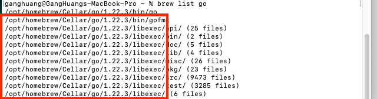

上面画红色圈的就是Go的安装路径，也就是下面需要把这个Go的安装路径赋值给GOROOT配置变量。

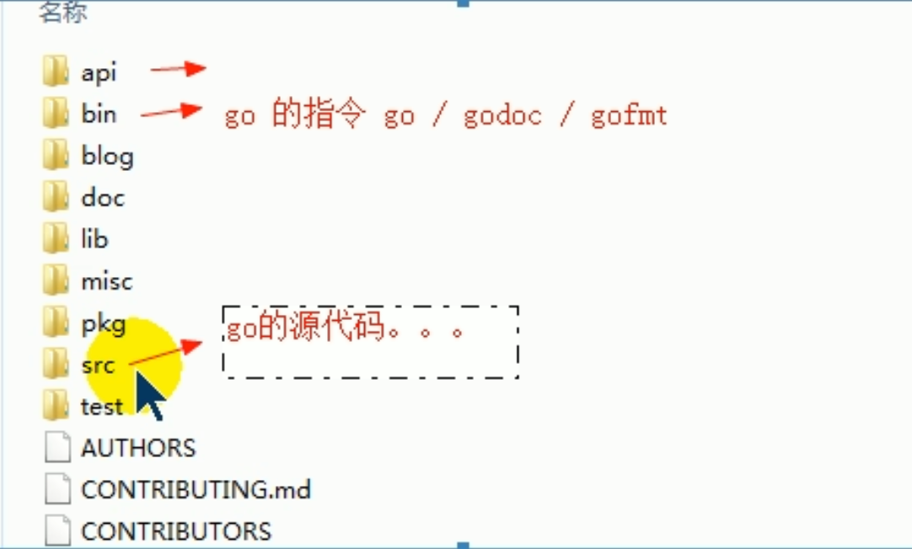


<br/>

- **设置环境变量**

查看当前shell是zsh还是bash, 如果是bash选择编辑~/.bash_profile文件，如果是zsh选择编辑~/.zshrc 文件

```
 dscl . -read /Users/$USER UserShell
```

根据上面的命令输出结果选择该编辑的配置文件。需要设置`GOROOT, GOPATH, PATH`三个环境变量。

```
//指定SDK的安装路径
export GOROOT=/usr/local/Cellar/go/1.16.5/libexec

//待加SDK的bin目录,$HOME指的是用户目录，比如huangGang用户目录
export GOPATH=$HOME/go 

//工作目录，我们GO项目路径
export PATH=$GOROOT/bin:$GOPATH/bin:$PATH
```

GOROOT路径是go的安装路径，一般是`/usr/local/go`或者 `/opt/homebrew/Cellar/go/1.22.3/libexec`

<br/>

看**尚学堂**教程是如下配置：

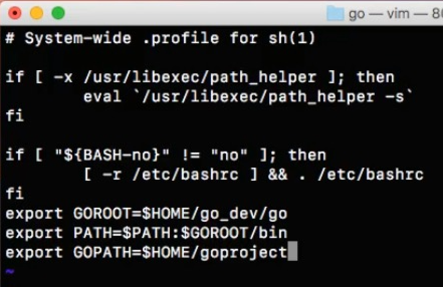

<br/> <br/>

我的电脑配置如下：
```
#Go配置(https://blog.csdn.net/weixin_41850404/article/details/121682332)

export GOROOT=/opt/homebrew/Cellar/go/1.22.3/libexec #Go源代码安装目录(homebrew安装:brew info go)
export GOPATH=$HOME/HGFiles/GitHub/GoProject	#项目程序目录
export GOBIN=$GOPATH/bin	#Go执行目录(Go程序编译后生成的可执行文件存放目录)
export PATH=$PATH:$GOROOT/bin	#将go可执行文件加入PATH中，使GO命令与我们编写的GO应用可以全局调用,$PATH表示引入之前的路径

#Go配置End
```


<br/><br/>

GOROOT下的部分文件用处：

```
src 目录包含Go的源文件，它们被组织成包（每个目录都对应一个包），
pkg 目录包含包对象，
bin 目录包含可执行命令。
```

<br/>

- **GOPATH：**
	- 日常开发的根目录； 
	- 是以后打算把包存放的路径，可以随便写一个自己想写的路径(GOPATH是工作目录)。 

将$GOPATH/bin加入 $PATH 变量，这样在终端的任何路径都能使用go包的bin目录下面的工具，不需要进入到bin目录或者指定目录，比较方便。

<br/>

**生效环境变量**

```
source ~/.bash_profile　　# 如果是bash
source ~/.zshrc　　# 如果是zsh
```


<br/>

***

<br/><br/><br/>

> <h1 id="项目初创建">项目初创建</h1>

我Mac电脑配置的环境变量如下：

```
export GOROOT=/opt/homebrew/Cellar/go/1.22.3/libexec #Go源代码安装目录(homebrew安装:brew info go)
export GOPATH=$HOME/HGFiles/GitHub/GoProject	#项目程序目录
export GOBIN=$GOPATH/bin	#Go执行目录(Go程序编译后生成的可执行文件存放目录)
export PATH=$PATH:$GOROOT/bin	#将go可执行文件加入PATH中，使GO命令与我们编写的GO应用可以全局调用,$PATH表示引入之前的路径
```

对于这种方式，开发者可以在任意目录下创建子目录作为项目程序的目录，使用的第三方库会下载至$GOPATH/pkg/mod目录下。

```
cd /Users/ganghuang/HGFiles/GitHub/GoProject

mkdir MLC_GO
```

此时只需要在go-anything目录下执行go mod init命令即可

```
go mod init
```

自动创建go.mod、go.sum作为版本管理的文件。要使用第三方库，只需执行go get命令，它会自动更改go.mod、go.sum文件，推荐使用这种方式作为项目程序的版本管理方式。

如下图：


<br/><br/>

- **Go的工作区目录结构有bin、pkg、src三个（在GOPATH目录下）：**

	- bin：生成的可执行文件（编译后的可执行程序的存储目录。）
	- pkg：编译后生成的，包的目标文件；（编译时生成的对象文件。）
	- src：里面的每一个子目录，就是一个包，包内是Go的源码文件（库文件。）

&emsp; 这些都是Go设计者的约定，只需按照这样的方式组织目录结构即可。GOPATH环境变量生效时个人项目可以在src目录下创建新目录，第三方库存放在src的github.com目录下。


<br/><br/><br/>

> <h2 id="创建项目目录">创建项目目录</h2>

开始创建如下文件目录：

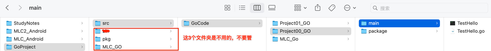

在Project00_Go中建立main和package文件夹，在mian中创建TestHell.go文件，然后编码如下：

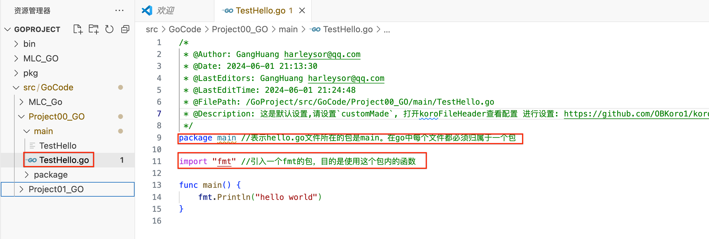

<br/><br/><br/>

> <h2 id="2种方式运行">2种方式运行</h2>

Golang执行流程：

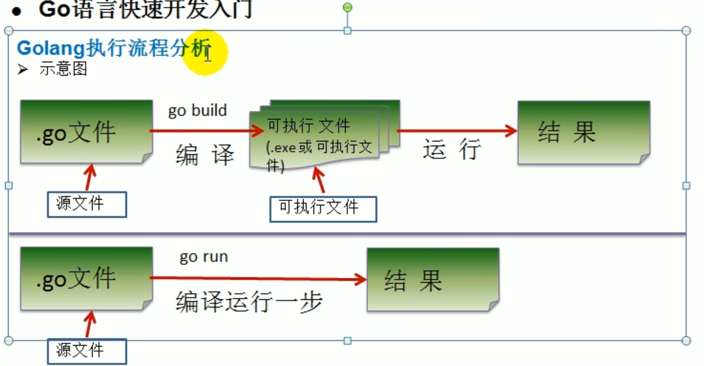


<br/>

两者区别：


<br/>


- **第一种：先编译在运行**

```
cd /Users/ganghuang/HGFiles/GitHub/GoProject/src/GoCode/Project00_GO/main

go build TestHell.go
```

会生成一个 TestHell文件，如上图。

接着：

```
TestHello
```

会打印：

```
hello world
```

一般发布的时候是这么做的


<br/><br/>

**第二种：**

```
cd /Users/ganghuang/HGFiles/GitHub/GoProject/src/GoCode/Project00_GO/main

go run TestHell.go
```

会打印：

```
hello world
```

<br/><br/><br/>


> <h2 id="不需要GOPATH支持的方式">不需要GOPATH支持的方式</h2>


Go版本1.11以上支持设置GOROOT环境变量，在任意目录下创建项目程序即可。

<br/>

安装Go语言开发系统后，内置的命令行工具常用的命令如下：

```
go build：将程序编译成可执行文件。
go run：将程序先编译成可执行文件，再运行程序。
go fmt：格式化代码，比如换行、缩进等。
go test：运行测试的命令。
go get：下载第三方库的常用命令。
go version：查看当前操作系统中安装的Go语言系统的版本信息。
go env：查看当前操作系统和Go语言相关的环境变量的值。
```


<br/>

***
<br/><br/><br/>

> <h1 id='常用命令'>常用命令</h1>

[GO入门](https://blog.csdn.net/weixin_45440484/article/details/131692655)

```
go build : 编译源代码包和依赖
go run : 编译并运行 GO程序
//go run xxx/hello.go //运行

go get : 下载并安装指定的包和依赖
go install : 编译并安装指定的包和依赖
go fmt : 格式化源码包中的代码
go help：了解更多
```

<br/><br/><br/>

> <h2 id="gobuild和goinstall区别">go build和go install区别</h2>


<br/><br/><br/>

> <h2 id="goinstall的原理">go install的原理</h2>


> <h2 id="goget的原理">go get的原理</h2>


<br/>

***
<br/><br/><br/>
> <h1 id="命名规范">命名规范</h1>


<br/>

***
<br/><br/><br/>

> <h1 id="打印占位符">打印占位符</h1>

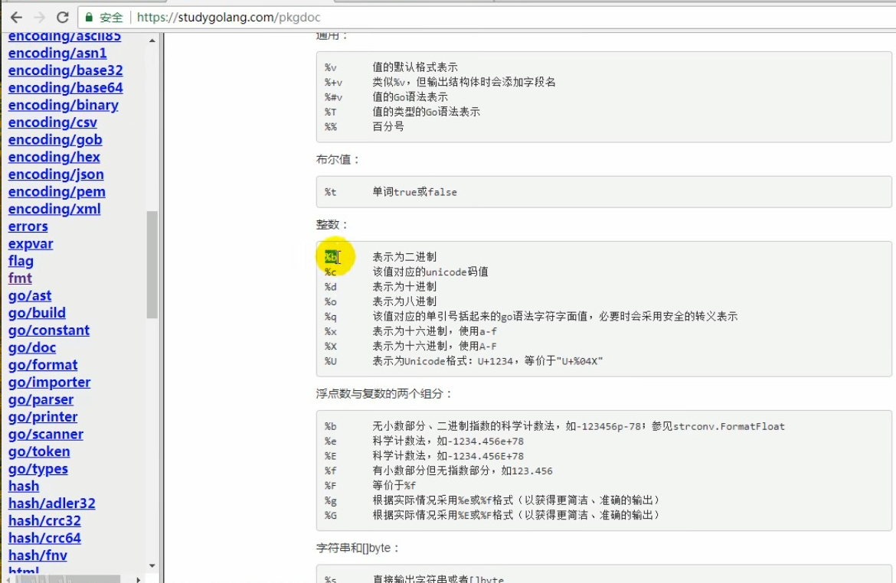


<br/>

***
<br/><br/><br/>
> <h1 id='基本语法与使用'>基本语法与使用</h1>

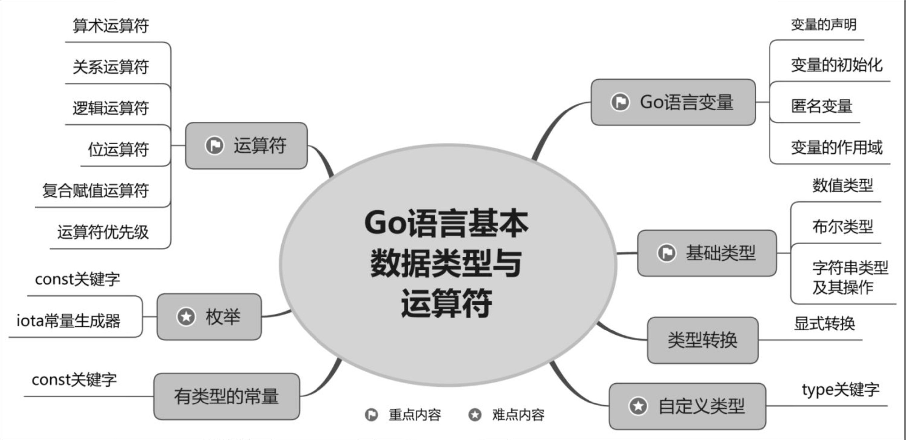


> <h1 id="变量">变量</h1>

<br/><br/>

> <h2 id="多个变量的声明和推导">多个变量的声明和推导</h2>

```
var name type
```

- var:关键字声明变量。

- name：变量名。

- type：变量的类型。

<br/> <br/>

```
func testVariable00(){//测试变量

    fmt.Println("\n<===================测试变量===================>")

    //省略var， := 左边的变量不应该是自己声明过的，否则会导致编译出错
    name00 := "你好啊 我创建了一个变量1111222"
	fmt.Println(name00)

    //第一种方式：一次性声明多个变量
    var n1, n2, n3 int
    fmt.Println("\nn1=", n1, "n2=", n2, "n3=", n3)

    //第2种方式：一次性声明多个变量
    var n4, name, n5 = 100, "Tom", 888
    fmt.Println("\nn4=", n4, "name=", name, "n5=", n5)

    //第3种方式：一次性声明多个变量,使用类型推倒
    n6, name01, n7 := 100, "Tom🍎", 888
    fmt.Println("\nn6=", n6, "name01=", name01, "n7=", n7)

    fmt.Println("\nglobalVar00=", globalVar00, "globalVar01=", globalVar01, "globalVar02=", globalVar02)


}
```

打印：
```
<===================测试变量===================>
你好啊 我创建了一个变量1111222

n1= 0 n2= 0 n3= 0

n4= 100 name= Tom n5= 888

n6= 100 name01= Tom🍎 n7= 888

globalVar00= 100 globalVar01= 200 globalVar02= 全局变量V300
```

<br/><br/><br/>

> <h2 id="bool值字段有无判断">bool值字段有无判断</h2>

```
func testVariable01(){
    type Info struct {
        Name string `json:"name"`
        Age int `json:"name"`
        Number int `json:"number"`
    }
    var info Info
    info.Name = "李雪飞"
    info.Age = 20
    info.Number = 100

    var typeInfo reflect.Type
    typeInfo = reflect.TypeOf(info)
    if _, ok := typeInfo.FieldByName("Name"); ok {
       fmt.Println("BOOL值测试--含有字段Name：",ok )
    }else{
        fmt.Println("BOOL值测试--不含有字段Name：",ok )
    }
}
```

打印：
```
BOOL值测试--含有字段Name： true
```

<br/><br/>

> <h2 id='短变量'>短变量</h2>

```
// 短变量声明并初始化
func lowVar() {
	fmt.Printf("\n\n <=============== 🍎 🍎 🍎 ===============> \n\n")

	// Go语言的推导声明写法，编译器会自动根据右值类型推断出左值的对应类型
	// 注意：由于使用了“:=”，而不是赋值的“=”，因此推导声明写法的左值变量必须是没有定义过的变量。若定义过，将会发生编译错误。
	hp := 10

	// 注意：在多个短变量声明和赋值中，至少有一个新声明的变量出现在左值中，即便其他变量名可能是重复声明的，编译器也不会报错
	conn, err := net.Dial("tcp", "127.0.0.1: 8080")
	conn2, err := net.Dial("tcp", "127.0.0.1: 8080")

	fmt.Printf("hp: %d, conn: %s, err: %s, conn2: %s", hp, conn, err, conn2)

}
```

打印：

```
<=============== 🍎 🍎 🍎 ===============> 

hp: 10, conn: %!s(<nil>), err: dial tcp 127.0.0.1:8080: connect: connection refused, conn2: %!s(<nil>)

```


<br/><br/><br/>

> <h2 id="复数类型">复数类型</h2>
在计算机语言中，复数是由两个浮点数组成的。其中，一个浮点数表示实部；另一个浮点数表示虚部。Go语言提供两种复数类型，即complex64和complex128。其中，complex128类型是声明复数时的默认类型。声明复数的语法格式如下。

```
var name complex128 = complex(x, y)
```

参数说明如下：

- name：变量名。
- complex128：复数类型。
- complex()：用于为复数赋值的内置函数。
- x: float64类型的实部。
- y: float64类型的虚部。

<br/><br/><br/>

> <h2 id="字符类型">字符类型</h2>

字符类型。Go语言中有两种字符类型，即byte类型和rune类型。其中，byte类型同义于uint8类型，表示的是ASCII码的一个字符；rune类型同义于int32类型，表示的是Unicode码的一个字符。

```
func testStr(){
	str := "张三 Hello"
	str1 := str[0:2]
	
	//当字符串包含中文时，需要先将字符串显式转换成rune数组，再传入len()函数。
	srn := []rune(str)
	str2 := srn[0:2]

	fmt.Println("str1 = ", string(str1), "\nstr2 =", string(str2))
}
```

打印：

```
str1 =  � 
str2 = 张三
```

<br/><br/><br/>

> <h2 id="格式化输出">格式化输出</h2>

常用的字符串输出格式及其说明

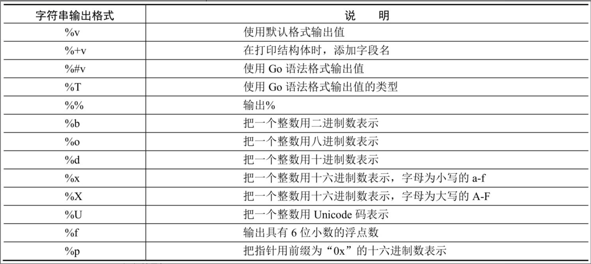

```
func testFormatLog() { //格式化输出
	pi := 3.141592653589793
	value1 := fmt.Sprintf("%v", pi)
	fmt.Println("value1 =", value1)

	value2 := fmt.Sprintf("%f", pi)
	fmt.Println("value2 =", value2)

	fmt.Printf("\n直接打印 value1 =%v", pi)
	fmt.Printf("\n直接打印 value2 =%f", pi)

}
```

打印：

```
alue1 = 3.141592653589793
value2 = 3.141593

直接打印 value1 =3.141592653589793
直接打印 value2 =3.141593
```


Sprintf()函数只负责格式化数据，不负责输出格式化后的结果。也就是说，先用Sprintf()函数按照指定的输出格式对数据执行格式化操作；再把格式化后的、字符串类型的结果赋值给一个变量；最后使用Println()函数输出这个变量，即格式化后的结果。

那么，在Go语言中，有没有一个函数可以直接输出格式化的、字符串类型的结果呢？答案是肯定的，即Printf()函数。

<br/><br/>

> <h2 id='指针'>指针</h2>

&emsp; 当对某个变量执行“取地址”操作时，要使用&字符，进而获取指向这个变量的内存地址的指针变量；也就是说，指针变量的值是这个变量的内存地址。

&emsp; 当对某个指针变量执行“取值”操作时，要使用*字符，进而获取这个指针变量指向的变量的值。

<br/>

> **说明** 
> Go语言把&字符称作取地址操作符；把*字符称作取值操作符。取地址操作符和取值操作符是一对互补操作符。


<br/>

数据类型分类:

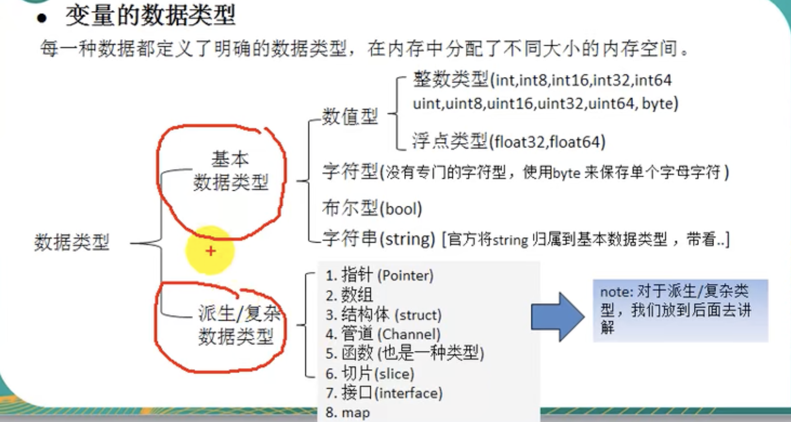

```
// 从指针获取指针指向的值
func pointTest1() {
	fmt.Printf("\n\n <=============== 🍎 🍎 🍎 ===============> \n\n")

	var house string = "🏠房屋 366——26-404"

	ptr := &house

	fmt.Printf("ptr type: %T\n", ptr)
	fmt.Printf("address: %p\n", ptr)

	value := *ptr

	fmt.Printf("value type: %T\n", value)
	fmt.Printf("value: %s\n", value)
}
```

打印：

```
<=============== 🍎 🍎 🍎 ===============> 

ptr type: *string
address: 0x14000098550
value type: string
value: 🏠房屋 366——26-404
```


<br/>

指针地址的交换：变量值的交换Demo

```
// 函数的交换
func chargeValue() {
	fmt.Printf("\n\n <=============== 🍎 🍎 🍎 ===============> \n\n")

	// 准备两个变量，赋值1和2
	x, y := 1, 2
	// 交换变量值
	swap(&x, &y)

	fmt.Println(x, y)

}

func swap(a, b *int) {
	// 取a指针的值，赋给临时变量
	t := *a

	// 取b指针的值，赋给a指针指向的变量
	// 注意，此时“*a”的意思不是取a指针的值，而是“a指向的变量”
	*a = *b
	// 将a指针的值赋给b指针指向的变量
	*b = t
}
```

打印：

```
<=============== 🍎 🍎 🍎 ===============> 

2 1
```

总结：

&emsp; `“ * ”`操作符作为右值时，意义是取指针的值；作为左值时，也就是放在赋值操作符的左边时，表示a指向的变量。其实归纳起来，“*”操作符的根本意义就是操作指针指向的变量。当操作在右值时，就是取指向变量的值；当操作在左值时，就是将值设置给指向的变量


<br/>

```
// 使用指针变量获取命令行的输入信息
func point_flag() {
	// 定义命令行参数
	/*
	* 3个参数分别如下：
	* 参数名称：在给应用输入参数时，使用这个名称
	* 参数值的默认值：与flag所使用的函数创建变量类型对应，String对应字符串、Int对应整型、Bool对应布尔型等
	* 参数说明：使用-help时，会出现在说明中
	 */
	var mode = flag.String("mode", "🍊 🍊", "process mode")

	// 解析命令行参数
	flag.Parse()

	fmt.Println(*mode)
}


func main() {
	//fmt.Println("🍎 welcome to Go Lang! 🍎 ")

	point_flag()
}
```

这个函数main.go的文件中，在终端执行：

```
$  go run  ./main.go --mode=🍎 fast

// 或
$ go run  ./main.go 

```

分别打印为：

```
🍎fast

// 或
🍊 🍊
```


<br/><br/>
> <h2 id='类型别名'>类型别名</h2>

Go1.9版本之前内建内型定义：

```
type byte unit8

type rune int32
```

Go 1.9版本之后变为

```
type byte = unit8

type rune = int32
```

&emsp; 这个修改就是配合类型别名而进行的修改.


&emsp; 这个修改就是配合类型别名而进行的修改:

```
type Type Alias = type
```

&emsp; 类型别名规定：Type Alias只是Type的别名，本质上Type Alias与Type是同一个类型。


<br/>

***
<br/>

> <h1 id='容器：存储和组织数据的方式'>容器：存储和组织数据的方式</h1>


**介绍：**

&emsp; 变量在一定程度上能满足函数及代码要求。如果编写一些复杂算法、结构和逻辑，就需要更复杂的类型来实现。这类复杂类型一般情况下具有各种形式的存储和处理数据的功能，将它们称为“容器”。

<br/>
<br/>

> <h2 id='数组'>数组</h2>

> 初始化和遍历

```
// 初始化数组
func init_array() {
	fmt.Printf("\n\n <=============== 🍎 🍎 🍎 ===============> \n\n")
	//使用“...”代替上述示例中初始化数组value时指定的数组长度。代码如下
	var member = [...]string{"曹可馨", "是个", "放屁精🐳", "曹智宸", "是个", "调皮鬼😝", "李亚", "是个", "小螃蟹🦀️"}

	for k, v := range member {
		fmt.Println(k, v)

	}

}
```

打印：

```
 <=============== 🍎 🍎 🍎 ===============> 

0 曹可馨
1 是个
2 放屁精🐳
3 曹智宸
4 是个
5 调皮鬼😝
6 李亚
7 是个
8 小螃蟹🦀️

```


<br/>
<br/>

> <h2 id='切片'>切片</h2>

&emsp; Go语言切片的内部结构包含地址、大小和容量。切片一般用于快速地操作一块数据集合。如果将数据集合比作切糕的话，切片就是你要的“那一块”。切的过程包含从哪里开始（这个就是切片的地址）及切多大（这个就是切片的大小）。容量可以理解为装切片的口袋大小.


```
slice [开始位置:结束位置]
```

```
// 切片
func section_test() {
	fmt.Printf("\n\n <=============== 🍎 🍎 🍎 ===============> \n\n")

	var a = [4]int{10, 20, 30, 40}

	fmt.Println(a, "\n", a[1:3])
}

```

打印：

```
<=============== 🍎 🍎 🍎 ===============> 

[10 20 30 40] 
 [20 30]
```


从数组或切片生成新的切片拥有如下特性。

● 取出的元素数量为：结束位置-开始位置;

● 取出元素不包含结束位置对应的索引，切片最后一个元素使用slice[len(slice)]获取;

● 当缺省开始位置时，表示从连续区域开头到结束位置;

● 当缺省结束位置时，表示从开始位置到整个连续区域末尾;

● 两者同时缺省时，与切片本身等效;

● 两者同时为0时，等效于空切片，一般用于切片复位;

● 根据索引位置取切片slice元素值时，取值范围是（0～len(slice)-1），超界会报运行时错误。生成切片时，结束位置可以填写len(slice)但不会报错。


<br/>
<br/>

> <h2 id="Map(容器)">Map(容器)</h2>

&emsp; Go语言中map的定义是这样的：

```
map[Key Type]Value Type
```
● Key Type为键类型;

● Value Type是键对应的值类型;

一个map里，符合Key Type和Value Type的映射总是成对出现。


```
// map是一个内部实现的类型，使用时，需要手动使用make创建
scene := make(map[string]int)
	scene["route"] = 66
	fmt.Println(scene["route"])
	v := scene["route2"]

	fmt.Println(v)

	m := map[string]string{
		"W": "forward",
		"A": "left",
		"D": "right",
		"S": "backward",
	}

	// 切片的遍历
	for k, v := range m {
		fmt.Println(k, v)
	}
```


打印：

```
66
0
W forward
A left
D right
S backward

```


<br/>
<br/>


> <h2 id='列表list'>列表list</h2>

&emsp； 在Go语言中，将列表使用container/list包来实现，内部的实现原理是双链表。列表能够高效地进行任意位置的元素插入和删除操作。

&emsp; list的初始化有两种方法：New和声明。两种方法的初始化效果都是一致的。

通过声明初始化list:

```
var变量名list.List
```

<br/>

通过container/list包的New方法初始化list

```
变量名 := list.New()
```


<br/>

**列表的添加、删除、遍历**

```
// 导入
import (
	"container/list"
)


// 列表删除
func list_delete() {
	fmt.Printf("\n\n <=============== 🍎 🍎 🍎 ===============> \n\n")

	l := list.New()

	// 尾部添加
	l.PushBack("canon")
	// 头部添加
	l.PushFront(67)
	// 尾部添加后保存元素句柄
	element := l.PushBack("fist")
	// 在fist之后添加high
	l.InsertAfter("high", element)
	// 在fist之前添加noon
	l.InsertBefore("noon", element)
	// 使用
	l.Remove(element)

	for i := l.Front(); i != nil; i = i.Next() {
		fmt.Println(i.Value)
	}
}
```

打印：

```

 <=============== 🍎 🍎 🍎 ===============> 

67
canon
noon
high
```


<br/>

***
<br/>

> <h1 id='流程控制'>流程控制</h1>

<br/>
<br/>

> <h2 id='for循环'>for循环</h2>


**九九乘法表**

```
// 九九乘法表：
func multiplication_table() {

	fmt.Printf("\n\n <=============== 🍎 🍎 🍎 ===============> \n\n")

	// 遍历，决定处理第几行
	for y := 1; y <= 9; y++ {
		// 遍历，决定这一行有多少列
		for x := 1; x <= y; x++ {
			fmt.Printf("%d＊%d=%d ", x, y, x*y)
		}
		// 手动生成回车
		fmt.Println()
	}
}


```

打印：

```
<=============== 🍎 🍎 🍎 ===============> 

1＊1=1 
1＊2=2 2＊2=4 
1＊3=3 2＊3=6 3＊3=9 
1＊4=4 2＊4=8 3＊4=12 4＊4=16 
1＊5=5 2＊5=10 3＊5=15 4＊5=20 5＊5=25 
1＊6=6 2＊6=12 3＊6=18 4＊6=24 5＊6=30 6＊6=36 
1＊7=7 2＊7=14 3＊7=21 4＊7=28 5＊7=35 6＊7=42 7＊7=49 
1＊8=8 2＊8=16 3＊8=24 4＊8=32 5＊8=40 6＊8=48 7＊8=56 8＊8=64 
1＊9=9 2＊9=18 3＊9=27 4＊9=36 5＊9=45 6＊9=54 7＊9=63 8＊9=72 9＊9=81 

```


<br/>
<br/>
> <h2 id=''></h2>


<br/>

***
<br/>

> <h1 id='函数'>函数</h1>

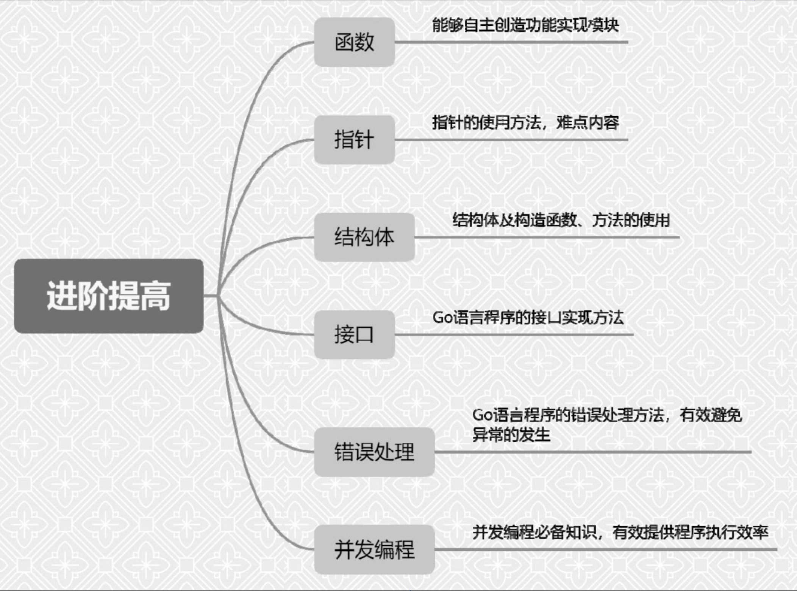


<br/><br/>

> <h2 id='声明函数'>声明函数</h2>

> 带有变量名的返回值

&emsp; 命名的返回值变量的默认值为类型的默认值，即数值为0，字符串为空字符串，布尔为false、指针为nil等。


```
func 函数名(参数列表) (返回参数列表) {
	函数体
}
```


&emsp; 下面代码中的函数拥有两个整型返回值，函数声明时将返回值命名为a和b，因此可以在函数体中直接对函数返回值进行赋值。在命名的返回值方式的函数体中，在函数结束前需要显式地使用return语句进行返回，代码如下：

```
func named Ret Values() (a, b int) {
	a = 1
	b = 2
	
	return
}

// 等同于如下
func named Ret Values() (a, b int) {
	a = 1
	
	return a, 2
}


func typed Two Values() (int, int) {
	return 1, 2
}

a, b = typed Two Values()
fmt.println(a,b) // 打印：1 2

```


<br/>

> 函数参数传递测试

> &emsp; **`注意：`Go语言中传入和返回参数在调用和返回时都使用值传递，这里需要注意的是指针、切片和map等引用型对象指向的内容在参数传递中不会发生复制，而是将指针进行复制，类似于创建一次引用**


```
// 用于测试值传递效果的结构体
type Data struct {
	// 测试切片在参数传递中的效果
	complax []int

	instance InnerData
	// 实例分配的inner Data
	ptr *InnerData
	// 将ptr声明为Inner Data的指针类型
}

// 代表各种结构体字段
type InnerData struct {
	a int
}

func passByValue(inFunc Data) Data {
	// 输出参数的成员情况
	// 使用格式化的“%+v”动词输出in变量的详细结构，以便观察Data结构在传递前后的内部数值的变化情况
	fmt.Printf("in Func value: %+v\n", inFunc)
	// 打印inFunc的指针，在计算机中，拥有相同地址且类型相同的变量，表示的是同一块内存区域
	fmt.Printf("in Func ptr: %p\n", &inFunc)
	return inFunc
}

// 值传递的测试函数
func paramTranslate() {
	fmt.Printf("\n\n <=============== 🍎 🍎 🍎 ===============> \n\n")

	in := Data{
		//切片
		complax: []int{1, 2, 3},
		// 结构体
		instance: InnerData{
			5,
		},
		// 指针
		ptr: &InnerData{1},
	}
	// 输入结构的成员情况
	fmt.Printf("in value: %+v\n", in)
	// 输入结构的指针地址
	fmt.Printf("in ptr: %p\n", &in)
	// 传入结构体，返回同类型的结构体
	out := passByValue(in)
	// 输出结构的成员情况
	fmt.Printf("out value: %+v\n", out)
	// 输出结构的指针地址
	fmt.Printf("out ptr: %p\n", &out)
}


// 调用
paramTranslate()
```

打印：

```
<=============== 🍎 🍎 🍎 ===============> 

in value: {complax:[1 2 3] instance:{a:5} ptr:0x140000182c0}
in ptr: 0x1400007a570
in Func value: {complax:[1 2 3] instance:{a:5} ptr:0x140000182c0}
in Func ptr: 0x1400007a600
out value: {complax:[1 2 3] instance:{a:5} ptr:0x140000182c0}
out ptr: 0x1400007a5d0
```

**从运行结果中发现：**

● 所有的Data结构的指针地址发生了变化，意味着所有的结构都是一块新的内存，无论是将Data结构传入函数内部，还是通过函数返回值传回Data都会发生复制行为。

● 所有的Data结构中的成员值都没有发生变化，原样传递，意味着所有参数都是值传递。

● Data结构的ptr成员在传递过程中保持一致，表示指针在函数参数值传递中传递的只是指针值，不会复制指针指向的部分。


<br/>
<br/>

> <h2 id='匿名函数'>匿名函数</h2>

格式：

```
func(参数列表)(返回参数列表) {
	函数体
}
```

<br/>

**‌1). 在定义时调用匿名函数**

```
func testAnonymousFunction() {
	fmt.Printf("\n\n <=============== 🍎 🍎 🍎 ===============> \n\n")

	func(data int) {
		fmt.Println("hello", data)
	}(100) //表示对匿名函数进行调用，传递参数为100

}
```
打印：

```
<=============== 🍎 🍎 🍎 ===============> 

hello 100
```


<br/>

**2). 匿名函数赋值给变量**

```

fmt.Printf("\n\n <=============== 🍎 🍎 🍎 ===============> \n\n")

// 将匿名函数体保存到f()
f := func(data int) {
	fmt.Println("hello", data)
}
// 使用f()调用
f(100)

```

打印：

```
<=============== 🍎 🍎 🍎 ===============> 

hello 100

```


<br/>

**3). 匿名函数用作回调函数**

```
//遍历切片的每个元素，通过给定函数进行元素访问
// f声明一个匿名函数
func visit(list []int, f func(int)) {
	for _, v := range list {
		f(v)
	}
}

/**
 * @description: 匿名函数
 * @param {*}
 * @return {*}
 */
func testAnonymousFunction() {
	fmt.Printf("\n\n <=============== 🍎 🍎 🍎 ===============> \n\n")

	// 使用匿名函数打印切片内容18
	visit([]int{1, 2, 3, 4}, func(v int) {// 匿名函数的实现
		fmt.Println(v)
	})

	func(data int) {
		fmt.Println("hello", data)
	}(100)
}

```

打印：

```
 <=============== 🍎 🍎 🍎 ===============> 

1
2
3
4
```


<br/>

**4).匿名函数的封装**

```
/**
 * @description: 匿名函数封装
 * @param {*}
 * @return {*}
 */
func testAnnoymousFunction1() {
	// 定义命令行skillParam，从命令行输入—skill可以将空格后的字符串传入skill Param指针变量
	var skillParam = flag.String("skill", "", "skill to perform")

	// 解析命令行参数，解析完成后，skillParam指针变量将指向命令行传入的值
	flag.Parse()

	// 定义一个从字符串映射到func()的map，然后填充这个map
	var skill = map[string]func(){
		"fire": func() {
			fmt.Println("chicken fire")
		},
		"run": func() {
			fmt.Println("soldier run")
		},
		"fly": func() {
			fmt.Println("angel fly")
		}}

	// skillParam是一个*string类型的指针变量，使用*skill Param获取到命令行传过来的值，并在map中查找对应命令行参数指定的字符串的函数
	if f, ok := skill[*skillParam]; ok {
		f()
	} else {
		fmt.Println("skill not found")
	}
}
```

终端命令执行如下，打印：

```
$ go run main.go
skill not found
$ go run main.go --skill=fly
angel fly
$ go run main.go --skill=run
soldier run

```


<br/>
<br/>

> <h2 id='函数类型实现接口'>函数类型实现接口</h2>

<br/>

**1). 结构体实现接口**

```
// 调用器接口
// 这个接口需要实现Call()方法，调用时会传入一个interface{}类型的变量，这种类型的变量表示任意类型的值
type Invoker interface {
	// 需要实现一个Call()方法
	Call(interface{})
}

type Struct struct{}
// Call()为结构体的方法，该方法的功能是打印from struct和传入的interface{}类型的值
func (s *Struct) Call(p interface{}) {
	fmt.Println("from struct", p)
}

/**
 * @description: 函数实现接口
 * @param {*}
 * @return {*}
 */
func testFuncImplInterface() {
	fmt.Printf("\n\n<=============== 🍎 🍎 🍎 ===============> \n\n")

	// 声明接口变量
	var invoker Invoker
	// 实例化结构体
	s := new(Struct)
	// 将实例化的结构体赋值到接口
	invoker = s
	// 使用接口调用实例化结构体的方法Struct.Call
	invoker.Call("🍎 hello 函数实现接口")
}


// 调用
testFuncImplInterface()
fmt.Printf("\n<=============== 🍎 🍎 🍎 ===============> \n\n")
```

打印：

```
<=============== 🍎 🍎 🍎 ===============> 

from struct 🍎 hello 函数实现接口

<=============== 🍎 🍎 🍎 ===============> 
```


<br/>

**2). 函数体实现接口**


```
// 调用器接口
type Invoker interface {
	// 需要实现一个Call()方法
	Call(interface{})
}

//函数定义为类型
type FuncCaller func(interface{})

// 实现Invoker的Call
func (f FuncCaller) Call(p interface{}) {
	// 调用f()函数本体
	f(p)
}

/**
 * @description: 函数实现接口
 * @param {*}
 * @return {*}
 */
func testFuncImplInterface1() {
	fmt.Printf("<=============== 🍎 🍎 🍎 ===============> \n\n")

	// 声明接口变量
	var invoker Invoker
	// 将匿名函数转为Func Caller类型，再赋值给接口
	invoker = FuncCaller(func(v interface{}) {
		fmt.Println("from function", v)
	})
	// 使用接口调用Func Caller.Call，内部会调用函数本体
	invoker.Call("🍓 函数接口 hello")
}


// 调用
testFuncImplInterface1()
fmt.Printf("\n<=============== 🍑 🍑 🍑 ===============> ")

```

打印：

```
<=============== 🍎 🍎 🍎 ===============> 

from function 🍓 函数接口 hello

<=============== 🍑 🍑 🍑 ===============> 
```


<br/>
<br/>

> <h2 id='闭包'>闭包</h2>

&emsp; 一个函数类型就像结构体一样，可以被实例化。函数本身不存储任何信息，只有与引用环境结合后形成的闭包才具有“记忆性”。函数是编译期静态的概念，而闭包是运行期动态的概念。

&emsp; 闭包对环境中变量的引用过程，也可以被称为“捕获”，在C++ 11标准中，捕获有两种类型：引用和复制，可以改变引用的原值叫做“引用捕获”，捕获的过程值被复制到闭包中使用叫做“复制捕获”。

&emsp; C++与C#中为闭包创建了一个类，而被捕获的变量在编译时放到类中的成员中，闭包在访问被捕获的变量时，实际上访问的是闭包隐藏类的成员。


<br/>

> 1). 闭包的记忆效应

&emsp；被捕获到闭包中的变量让闭包本身拥有了记忆效应，闭包中的逻辑可以修改闭包捕获的变量，变量会跟随闭包生命期一直存在，闭包本身就如同变量一样拥有了记忆效应。

```
/**
 * @description: 闭包的记忆效应
 * @param {*}
 * @return {*}
 */
func testClosure1_1() {
	fmt.Printf("<=============== 🍎 🍎 🍎 ===============> \n\n")

	// 创建一个累加器，初始值为1，
	// 返回的accumulator是类型为func() int的函数变量。
	accumulator := testClosure1(1)
	// 调用accumulator()时，开始执行func() int{}匿名函数逻辑，直到返回类加值
	fmt.Println(accumulator())
	fmt.Println(accumulator())
	// 打印累加器的函数地址
	fmt.Printf("%p\n", accumulator)
	// 创建一个累加器，初始值为
	accumulator2 := testClosure1(10)
	// 累加1并打印
	fmt.Println(accumulator2())
	// 打印累加器的函数地址
	fmt.Printf("%p\n", accumulator2)

}

/**
 * @description: 累加器生成函数，这个函数输出一个初始值，调用时返回一个为初始值创建的闭包函数
 * @param {*}
 * @return {*}
 */
func testClosure1(value int) func() int {

	// 返回一个闭包函数，每次返回会创建一个新的函数实例
	return func() int {
		// 对引用的testClosure1参数变量进行累加，
		// 注意value不是要返回的匿名函数定义的，但是被这个匿名函数引用，所以形成闭包。
		value++
		// 返回一个累加值
		return value
	}
}


// 调用 
testClosure1_1()
fmt.Printf("\n<=============== 🍑 🍑 🍑 ===============> ")

```

打印：

```
<=============== 🍎 🍎 🍎 ===============> 

2
3
0x102780690
11
0x102780690

<=============== 🍑 🍑 🍑 ===============> 
```


<br/>
<br/>

> <h2 id='可变参数'>可变参数</h2>

&emsp; Go语言支持可变参数特性，函数声明和调用时没有固定数量的参数，同时也提供了一套方法进行可变参数的多级传递。

```
函数名(固定参数列表, v … T)（返回参数列表）{

	函数体
	
}
```

**特性如下：**

● 可变参数一般被放置在函数列表的末尾，前面是固定参数列表，当没有固定参数时，所有变量就将是可变参数;

● v为可变参数变量，类型为[]T，也就是拥有多个T元素的T类型切片，v和T之间由“...”即3个点组成;

● T为可变参数的类型，当T为interface{}时，传入的可以是任意类型。


参数值打印：

```
/**
 * @description: 可变参数
 * @param {*}
 * @return {*}
 */
func testVariableParameters(slist ...string) {
	fmt.Printf("<=============== 🍎 🍎 🍎 ===============> \n\n")

	// 定义一个字节缓冲，快速地连接字符串
	var b bytes.Buffer
	// 遍历可变参数列表slist，类型为[]string
	for _, s := range slist {
		// 将遍历出的字符串连续写入字节数组
		b.WriteString(s)
	}
	// 将连接好的字节数组转换为字符串并输出
	fmt.Printf(b.String())

}


// 调用
testVariableParameters("hammer", " mom", " and", " hawk")

```

打印：

```
<=============== 🍎 🍎 🍎 ===============> 

hammer mom and hawk

<=============== 🍑 🍑 🍑 ===============> 
```


<br/>
<br/>

> <h2 id='延迟执行语句def'>延迟执行语句def</h2>

**使用场景：**

&emsp; 处理业务或逻辑中涉及成对的操作是一件比较烦琐的事情，比如打开和关闭文件、接收请求和回复请求、加锁和解锁等。在这些操作中，最容易忽略的就是在每个函数退出处正确地释放和关闭资源。

&emsp; defer语句正好是在函数退出时执行的语句，所以使用defer能非常方便地处理资源释放问题。


```
func testDef() {
	fmt.Printf("<=============== 🍎 🍎 🍎 ===============> \n\n")

	filename := "/Users/harleyhuang/Documents/GitHub/Go/GoDemo/main.go"

	f, err := os.Open(filename)
	if err != nil {
		return
	}
	// 延迟调用Close，此时Close不会被调用
	defer f.Close()
	info, err := f.Stat()
	if err != nil {
		// defer机制触发，调用Close关闭文件
		return
	}
	size := info.Size()
	// defer机制触发，调用Close关闭文件
	fmt.Println("文件size：", size)
}


testDef()
fmt.Printf("\n\n<=============== 🍑 🍑 🍑 ===============> ")
```


打印：

```
<=============== 🍎 🍎 🍎 ===============> 

文件size： 11276


<=============== 🍑 🍑 🍑 ===============> 
```


<br/>

***
<br/><br/><br/>

> <h1 id='结构体'>结构体</h1>

&emsp; 在Go语言中，数组和切片可以存储同一类型的数据，而在结构体中可以为不同成员定义不同的数据类型。结构体成员也称为元素或字段，它有以下两个特性。

&emsp; 成员有自己的类型和值，可以是任意数据类型。

&emsp; 成员名必须唯一。

<br/>

&emsp; Go语言中的类型可以被实例化，使用new或“&”构造的类型实例的类型是类型的指针。


**提示：** Go语言中没有“类”的概念，也不支持“类”的继承等面向对象的概念。

&emsp; Go语言的结构体与“类”都是复合结构体，但Go语言中结构体的内嵌配合接口比面向对象具有更高的扩展性和灵活性。

&emsp; Go语言不仅认为结构体能拥有方法，且每种自定义类型也可以拥有自己的方法。

<br/>

> <h2 id='结构体实例化'>结构体实例化</h2>

&emsp; Go语言的关键字type可以将各种基本类型定义为自定义类型，基本类型包括整型、字符串、布尔等。

格式如下：

```
Type 类型名 struct {
	字段1 字段1类型
	字段2 字段2类型
	
	····
}

```


<br/>

&emsp; 结构体的定义只是一种内存布局的描述，只有当结构体实例化时，才会真正地分配内存。因此必须在定义结构体并实例化后才能使用结构体的字段。

&emsp;实例化就是根据结构体定义的格式创建一份与格式一致的内存区域，结构体实例与实例间的内存是完全独立的。


**实例化格式：**

```
var ins T
```

● T为结构体类型。

● ins为结构体的实例。


<br/>


> 创建指针类型的结构体

&emsp; Go语言中，还可以使用new关键字对类型（包括结构体、整型、浮点数、字符串等）进行实例化，结构体在实例化后会形成指针类型的结构体。

使用new的格式如下：

```
ins := new(T)
```

● T为类型，可以是结构体、整型、字符串等。

● ins：T类型被实例化后保存到ins变量中，ins的类型为*T，属于指针。


```
type Player struct{
    Name string
    Health Point int
    Magic Point int
}
tank := new(Player)
tank.Name = "Canon"
tank.Health Point = 300
```


经过new实例化的结构体实例在成员赋值上与基本实例化的写法一致。

提示：在C/C++语言中，使用new实例化类型后，访问其成员变量时必须使用“->”操作符。

> 在Go语言中，访问结构体指针的成员变量时可以继续使用“.”。这是因为Go语言为了方便开发者访问结构体指针的成员变量，使用了语法糖（Syntactic sugar）技术，将ins.Name形式转换为(*ins).Name。


<br/>


> 取结构体的地址实例化

在Go语言中，对结构体进行“&”取地址操作时，视为对该类型进行一次new的实例化操作。取地址格式如下：

```
ins := &T{}
```

● T表示结构体类型。

● ins为结构体的实例，类型为*T，是指针类型。

```
type Command struct {
	Name    string // 指令名称
	Var     *int   // 指令绑定的变量
	Comment string // 指令的解释
}

/**
 * @description: 取地址结构体实例化
 * @param {string} name
 * @param {*int} varref
 * @param {string} comment 描述
 * @return {*}
 */
func testStruct(name string, varref *int, comment string) *Command {
	return &Command{
		Name:    name,
		Var:     varref,
		Comment: comment}
}


// 调用
var version int = 1
	cmd := testStruct(
		"version",
		&version,
		"show version",
	)
fmt.Println("取地址结构体 cmd：", cmd)
	
```


调用：

```
<=============== 🍎 🍎 🍎 ===============> 

取地址结构体 cmd： &{version 0x14000018288 show version}


<=============== 🍑 🍑 🍑 ===============> 
```


<br/>


**键值对填充结构体**

```
01 type People struct {

02        name  string

03        child ＊People

04   }

05

06   relation := &People{

07       name: "爷爷",

08        child: &People{

09            name: "爸爸",

10              child: &People{

11                 name: "我",

12              },

13        },

14   }
```

●  第6行，relation由People类型取地址后，形成类型为*People的实例。

● 第8行，child在初始化时，需要*People类型的值。使用取地址初始化一个People。


&emsp; **结构体成员中只能包含结构体的指针类型，包含非指针类型会引起编译错误。**


<br/>
<br/>


> <h2 id='构造函数'>构造函数</h2>

Go语言的类型或结构体没有构造函数的功能。结构体的初始化过程可以使用函数封装实现。

> **带有父子关系的结构体的构造和初始化——模拟父级构造调用**

```
type Cat struct {
	Color string
	Name  string
}
type BlackCat struct {
	// 嵌入Cat，类似于派生
	// BlackCat拥有Cat的所有成员，实例化后可以自由访问Cat的所有成员
	Cat
}

// “构造基类”
func NewCat(name string) *Cat {
	return &Cat{
		Name: name,
	}
}

// “构造子类”
func NewBlackCat(color string) *BlackCat {
	// 实例化BlackCat结构，此时Cat也同时被实例化
	cat := &BlackCat{}
	// 填充BlackCat中嵌入的Cat颜色属性。BlackCat没有任何成员，所有的成员都来自于Cat
	cat.Color = color
	return cat
}


```


&emsp; Cat结构体类似于面向对象中的“基类”。BlackCat嵌入Cat结构体，类似于面向对象中的“派生”。实例化时，Black Cat中的Cat也会一并被实例化。

&emsp; 总之，Go语言中没有提供构造函数相关的特殊机制，用户根据自己的需求，将参数使用函数传递到结构体构造参数中即可完成构造函数的任务。

<br/><br/>

> <h2 id='方法'>方法</h2>

&emsp; Go语言中的方法（Method）是一种作用于特定类型变量的函数。`这种特定类型变量叫做接收器（Receiver）`。

&emsp; 如果将特定类型理解为结构体或“类”时，`接收器的概念就类似于其他语言中的this或者self`。

&emsp; 在Go语言中，接收器的类型可以是任何类型，不仅仅是结构体，任何类型都可以拥有方法。

&emsp; **提示：**在面向对象的语言中，类拥有的方法一般被理解为类可以做的事情。在Go语言中“方法”的概念与其他语言一致，只是**Go语言建立的“接收器”强调方法的作用对象是接收器，也就是类实例，而函数没有作用对象**。

<br/>

> **面向过程实现方法**

&emsp; 面向过程中没有“方法”概念，只能通过结构体和函数，由使用者使用函数参数和调用关系来形成接近“方法”的概念


```
type Bag struct {
	// 整型切片类型的items的成员
	items []int
}

// 将一个物品放入背包的过程
func Insert(b *Bag, itemid int) {
	b.items = append(b.items, itemid)
}


// 调用
bag := new(Bag)
Insert(bag, 1001)

```

<br/>


> <h3 id='Go语言的结构体方法'>**Go语言的结构体方法**</h3>

&emsp;传统面向对象语言的方法是定义在类中，而结构体的方法是定义在结构体之外的。通过将结构体和结构体方法分离，Go语言的代码更加灵活。

&emsp;和函数一样，结构体方法也使用func关键字定义。结构体方法和函数的最大区别是结构体方法需要在func关键字和方法名之间使用小括号声明一个变量作为方法的接收者。根据变量的类型，结构体的方法分为两种形式：值接收者方法和指针接收者方法

```
func (变量 结构体名称) 方法名([参数1, 参数2, ....]){
	方法体
	return
}
```

<br/><br/>

```
type Bag struct {
	// 整型切片类型的items的成员
	items []int
}

// 将一个物品放入背包的过程
// (b*Bag)表示接收器，即Insert作用的对象实例
func (b *Bag) Insert(itemid int) {
	b.items = append(b.items, itemid)
}


// 调用
bag := new(Bag)
bag.Insert(1001)

```


<br/>

> <h3 id='接收器'>接收器——方法作用的目标</h3>

```
func (接收器变量 接收器类型) 方法名(参数列表) (返回参数) {

	函数体

}
```


● 接收器变量：接收器中的参数变量名在命名时，官方建议使用接收器类型名的第一个小写字母，而不是self、this之类的命名。例如，Socket类型的接收器变量应该命名为s，Connector类型的接收器变量应该命名为c等。

● 接收器类型：接收器类型和参数类似，可以是指针类型和非指针类型。

● 方法名、参数列表、返回参数：格式与函数定义一致。接收器根据接收器的类型可

以分为指针接收器、非指针接收器。两种接收器在使用时会产生不同的效果。根据效果的不同，两种接收器会被用于不同性能和功能要求的代码中。

<br/>

> <h4 id='指针类型的接收器'>指针类型的接收器</h4>

&emsp; 指针类型的接收器由一个结构体的指针组成，更接近于面向对象中的this或者self。

&emsp; 由于指针的特性，调用方法时，修改接收器指针的任意成员变量，在方法结束后，修改都是有效的。


```
// 定义属性结构
type Property struct {
	value int // 属性值
}

// 设置属性值
func (p *Property) SetValue(v int) {
	// 修改p的成员变量
	// 设置属性值方法的接收器类型为指针。因此可以修改成员值，即便退出方法，也有效
	p.value = v
}

// 取属性值
func (p *Property) Value() int {
	return p.value
}

func main() {
	// 实例化属性
	p := new(Property)
	// 设置值
	p.SetValue(100)
	// 打印值
	mt.Println(p.Value())
}
```


> <h4 id='非指针类型的接收器'>非指针类型的接收器</h4>


&emsp; 当方法作用于非指针接收器时，Go语言会在代码运行时**将接收器的值复制一份**。`在非指针接收器的方法中可以获取接收器的成员值，但修改后无效。`

&emsp; 点（Point）使用结构体描述时，为点添加Add()方法，这个方法不能修改Point的成员X、Y变量，而是在计算后返回新的Point对象。Point属于小内存对象，在函数返回值的复制过程中可以极大地提高代码运行效率


<br/>

> <h4 id='使用事件系统实现事件的响应和处理'>使用事件系统实现事件的响应和处理</h4>

&emsp; Go语言可以将类型的方法与普通函数视为一个概念，从而简化方法和函数混合作为回调类型时的复杂性。这个特性和C#中的代理（delegate）类似，调用者无须关心谁来支持调用，系统会自动处理是否调用普通函数或类型的方法。

<br/>

> **方法和函数的统一调用**

观察一个结构体的方法（class.Do）的参数和一个普通函数（funcDo）的参数完全一致，也就是方法与函数的**签名一致**。然后使用与它们签名一致的函数变量（delegate）分别赋值方法与函数，接着调用它们，观察实际效果。

```
//声明一个结构体
type class struct{}

// 给结构体添加Do()方法
func (c *class) Do(v int) {
	fmt.Println("call method do:", v)
}

// 普通函数的Do()方法
func funcDo(v int) {
	fmt.Println("call function do:", v)
}

/**
 * @description:方法和函数的统一调用
 */
func testFuncMethod() {
	// 声明一个函数回调
	var delegate func(int)
	// 创建结构体实例
	c := new(class)
	// 将回调设为c的Do方法
	delegate = c.Do
	// 调用
	delegate(100)
	// 将回调设为普通函数
	delegate = funcDo
	// 调用3
	delegate(100)
}


// 调用
testFuncMethod()
```

打印：

```
<=============== 🍎 🍎 🍎 ===============> 

call method do: 100
call function do: 100

<=============== 🍑 🍑 🍑 ===============> 
```


结论：无论是普通函数还是结构体的方法，只要它们的签名一致，与它们签名一致的函数变量就可以保存普通函数或是结构体方法。


<br/>

> <h4 id='使用事件系统实现事件的响应和处理'>使用事件系统实现事件的响应和处理</h4>

&emsp; Go语言可以将类型的方法与普通函数视为一个概念，从而简化方法和函数混合作为回调类型时的复杂性。这个特性和C#中的代理（delegate）类似，调用者无须关心谁来支持调用，系统会自动处理是否调用普通函数或类型的方法。


```
// 实例化一个通过字符串映射函数切片的map
// 创建一个map实例，这个map通过事件名（string）关联回调列表（[]func(interface{}），
// 同一个事件名称可能存在多个事件回调，因此使用回调列表保存。回调的函数声明为func(interface{})
var eventByName = make(map[string][]func(interface{}))

/**事件注册
 * @description: 注册事件，提供事件名和回调函数
 */
func RegisterEvent(name string, callback func(interface{})) {
	// 通过名字查找事件列表
	list := eventByName[name]
	// 在列表切片中添加函数
	// 为同一个事件名称在已经注册的事件回调的列表中再添加一个回调函数
	list = append(list, callback)
	// 保存修改的事件列表切片
	eventByName[name] = list
}

/**事件调用
 * @description:调用事件
 */
func CallEvent(name string, param interface{}) {
	// 通过名字找到事件列表
	list := eventByName[name]
	// 遍历这个事件的所有回调
	for _, callback := range list {
		// 传入参数调用回调
		callback(param)
	}
}

/**使用事件系统
 * @description:
 */
// 声明角色的结构体
type Actor struct{}

// 为角色添加一个事件处理函数
// 拥有param参数，类型为interface{}，与事件系统的函数（func(interface{})）签名一致
func (a *Actor) OnEvent(param interface{}) {
	fmt.Println("actor event:", param)
}

// 全局事件
func GlobalEvent(param interface{}) {
	fmt.Println("global event:", param)
}
func testFuncMethod1() {
	// 实例化一个角色
	a := new(Actor)
	// 注册名为On Skill的回调
	RegisterEvent("On Skill", a.OnEvent) // 再次在OnSkill上注册全局事件
	RegisterEvent("On Skill", GlobalEvent)
	// 调用事件，所有注册的同名函数都会被调用
	CallEvent("On Skill", 100)
}


// 调用
testFuncMethod1()
```

打印：

```
<=============== 🍎 🍎 🍎 ===============> 

actor event: 100
global event: 100


<=============== 🍑 🍑 🍑 ===============> 
```


<br/>

> <h3 id='类型内嵌和结构体内嵌'>类型内嵌和结构体内嵌</h3>

&emsp; 结构体允许其成员字段在声明时没有字段名而只有类型，这种形式的字段被称为**类型内嵌或匿名字段**

&emsp; 结构体实例化后，如果匿名的字段类型为结构体，那么可以直接访问匿名结构体里的所有成员，这种方式被称为**结构体内嵌**。


<br/>

> <h4 id='类型内嵌和结构体内嵌'>类型内嵌和结构体内嵌</h4>


> **‌声明结构体内嵌**

```
type BasicColor struct {
	R, G, B float32
}
type Color struct {
	// 结构体内嵌
	BasicColor
	Alpha float32
}

/**
 * @description: 声明结构体内嵌
 */
func testStruct1() {
	// 实例化一个完整颜色结构体
	var c Color
	c.R = 1
	c.G = 1
	c.B = 0
	c.Alpha = 1
	fmt.Printf("%+v", c)
}


testStruct1()
```

打印：

```
<=============== 🍎 🍎 🍎 ===============> 

{BasicColor:{R:1 G:1 B:0} Alpha:1}

<=============== 🍑 🍑 🍑 ===============> 
```

<br/>

> **结构内嵌特性**

&emsp; 嵌入结构体的成员，可以通过外部结构体的实例直接访问。如果结构体有多层嵌入结构体，结构体实例访问任意一级的嵌入结构体成员时都只用给出字段名，而无须像传统结构体字段一样，通过一层层的结构体字段访问到最终的字段。例如，ins.a.b.c的访问可以简化为ins.c。


<br/>

> **使用组合思想描述对象特性**

```
// 可飞行的
type Flying struct{}

func (f *Flying) Fly() {
	fmt.Println("can fly")
}

// 可行走的
type Walkable struct{}

func (f *Walkable) Walk() {
	fmt.Println("can calk")
}

// 人类
type Human struct {
	Walkable
	// 人类能行走
}

// 鸟类
type Bird struct {
	Walkable
	// 鸟类能行走
	Flying
	// 鸟类能飞行
}

func testStruct2() {
	// 实例化鸟类
	b := new(Bird)
	fmt.Println("Bird: ")
	b.Fly()
	b.Walk()
	// 实例化人类
	h := new(Human)
	fmt.Println("Human: ")
	h.Walk()
}

```

打印：

```
<=============== 🍎 🍎 🍎 ===============> 

Bird: 
can fly
can calk
Human: 
can calk
```


<br/>


> 初始化内嵌匿名结构体

```
// 车轮
type Wheel struct {
	Size int
}

// 车
type Car struct {
	Wheel
	// 引擎
	Engine struct {
		Power int    // 功率
		Type  string // 类型
	}
}

func testStruct3() {
	c := Car{
		// 初始化轮子（初始化结构体内嵌）
		Wheel: Wheel{
			Size: 18,
		},
		// 初始化引擎（初始化内嵌匿名结构体）
		// 需要对Car的Engine字段进行初始化，由于Engine字段的类型并没有被单独定义，因此在初始化其字段时需要先填写struct{…}声明其类型
		Engine: struct {
			Power int
			Type  string
		}{
			// 开始填充这个匿名结构体的数据，按“键：值”格式填充
			Type:  "1.4T",
			Power: 143,
		},
	}
	fmt.Printf("%+v\n", c)
}


testStruct3()
```

打印：

```
<=============== 🍎 🍎 🍎 ===============> 

{Wheel:{Size:18} Engine:{Power:143 Type:1.4T}}


<=============== 🍑 🍑 🍑 ===============> 
```


<br/>

***
<br/><br/><br/>
> <h1 id=""></h1>


<br/>

***
<br/><br/><br/>
> <h1 id=""></h1>


<br/><br/>

> <h3 id=''></h3>


<br/>

> <h3 id=''></h3>


<br/>

***
<br/><br/>

> <h1 id='接口'>接口</h1>

&emsp; 接口本身是调用方和实现方均需要遵守的一种协议，大家按照统一的方法命名参数类型和数量来协调逻辑处理的过程。

&emsp; Go语言中使用组合实现对象特性的描述。对象的内部使用结构体内嵌组合对象应该具有的特性，对外通过接口暴露能使用的特性。


> 接口声明格式

```
type 接口类型名 interface {
	方法1( 参数列表1 ) 返回值列表1
	方法2( 参数列表2 ) 返回值列表2

	 . . . . . 
}

```

● 接口类型名：使用type将接口定义为自定义的类型名。Go语言的接口在命名时，一般会在单词后面添加er，如有写操作的接口叫Writer，有字符串功能的接口叫Stringer，有关闭功能的接口叫Closer等。

● 方法名：**当方法名首字母是大写时，且这个接口类型名首字母也是大写时，这个方法可以被接口所在的包（package）之外的代码访问**。

● 参数列表、返回值列表：参数列表和返回值列表中的参数变量名可以被忽略，如：

```
type writer interface {
	writer([]byte) error
}
```


<br/><br/>

> <h2 id='接口的实现'>接口的实现</h2>

<br/>

> 规则1: 接口的方法与实现接口的类型方法格式一致

&emsp; 在类型中添加与接口签名一致的方法就可以实现该方法。**签名包括方法中的名称、参数列表、返回参数列表**。也就是说，只要实现接口类型中的方法的名称、参数列表、返回参数列表中的任意一项与接口要实现的方法不一致，那么接口的这个方法就不会被实现。 


```
//定义一个数据写入器
type DataWriter interface {
	// interface{}类型的data，返回一个error结构表示可能发生的错误
	WriteData(data interface{}) error
}

// 定义文件结构，用于实现DataWriter
type file struct{}

// 实现DataWriter接口的WriteData()方法
func (d *file) WriteData(data interface{}) error {
	// 模拟写入数据
	fmt.Println("Write Data:", data)
	return nil
}

/** 接口的方法与实现接口的类型方法格式一致
 * @description:
 */
func testInterface1() {
	// 实例化file赋值给f，f的类型为*file
	f := new(file)
	// 声明一个DataWriter的接口
	var writer DataWriter
	// 将接口赋值f，也就是＊file类型
	writer = f
	// 使用DataWriter接口进行数据写入
	writer.WriteData("data")
}


testInterface1()
```

打印：

```
<=============== 🍎 🍎 🍎 ===============> 

Write Data: data


<=============== 🍑 🍑 🍑 ===============> 
```


<br/>


> **接口中所有方法均被实现**


<br/>
<br/>

> <h2 id='便于扩展的日志输出系统'>便于扩展的日志输出系统</h2>

> **日志对外接口**

```
type LogWriter interface {
	Write(data interface{}) error
}

// 日志器
type Logger struct {
	// 这个日志器用到的日志写入器
	writerList []LogWriter
}

// 注册一个日志写入器
func (l *Logger) RegisterWriter(writer LogWriter) {
	l.writerList = append(l.writerList, writer)
}

// 将一个data类型的数据写入日志
func (l *Logger) Log(data interface{}) {
	// 遍历所有注册的写入器
	for _, writer := range l.writerList {
		// 将日志输出到每一个写入器中
		writer.Write(data)
	}
}

// 创建日志器的实例
func NewLogger() *Logger {
	return &Logger{}
}

```


<br/>

> **文件写入器**

```
/**
 * @description: 文件写入器
 * 文件写入器的功能是根据一个文件名创建日志文件（file Writer的Set File方法）。
 * 在有日志写入时，将日志写入文件中。
 */
// 声明文件写入器，在结构体中保存一个文件句柄，以方便每次写入时操作
type fileWriter struct {
	file *os.File
}

// 设置文件写入器写入的文件名
func (f *fileWriter) SetFile(filename string) (err error) {
	// 如果文件已经打开，关闭前一个文件
	// 考虑到SetFile()方法可以被多次调用（函数可重入性）
	// 假设之前已经调用过Set File()后再次调用，此时的f.file不为空，就需要关闭之前的文件，重新创建新的文件。
	if f.file != nil {
		f.file.Close()
	}
	// 创建一个文件并保存文件句柄
	f.file, err = os.Create(filename)
	// 如果创建的过程出现错误，则返回错误
	return err
}

// 实现LogWriter的Write()方法
func (f *fileWriter) Write(data interface{}) error {
	// 如果文件没有准备好，文件句柄为nil
	// 此时使用errors包的New()函数返回一个错误对象，包含一个字符串“file not created”
	if f.file == nil {
		// 日志文件没有准备好
		return errors.New("file not created")
	}
	// 将数据序列化为字符串
	// 使用fmt.Sprintf将data转换为字符串，这里使用的格式化参数是“%v”，意思是将data按其本来的值转换为字符串
	str := fmt.Sprintf("%v\n", data)
	// 通过f.file的Write()方法，将str字符串转换为[]byte字节数组，再写入到文件中。如果发生错误，则返回
	_, err := f.file.Write([]byte(str))
	return err
}

// 创建文件写入器实例
func newFileWriter() *fileWriter {
	return &fileWriter{}
}

```


&emsp; 在操作文件时，会出现文件无法创建、无法写入等错误。开发中尽量不要忽略这些底层报出的错误，应该处理可能发生的所有错误。

&emsp; 文件使用完后，要注意使用os.File的Close()方法进行及时关闭，否则文件再次访问时会因为其属性出现无法读取、无法写入等错误。

&emsp; 提示：一个完备的文件写入器会提供多种写入文件的模式，例子中使用的模式是将日志添加到日志文件的尾部。随着文件越来越大，文件的访问效率和查看便利性也会大大降低。此时，就需要另外一种写入模式：滚动写入文件。

- 滚动写入文件模式也是将日志添加到文件的尾部，但当文件达到设定的期望大小时，会自动开启一个新的文件继续写入文件，最终将获得多个日志文件。

- 日志文件名不仅可以按照文件大小进行分割，还可以按照日期范围进行分割。在到达设定的日期范围，如每天、每小时的周期范围时，日志器会自动创建新的日志文件。这种日志文件创建方法也能方便开发者按日志查看日志。


> 命令行写入器

&emsp; 在UNIX的思想中，一切皆文件。文件包括内存、磁盘、网络和命令行等。这种抽象方法方便我们访问这些看不见摸不着的虚拟资源:
- 命令行在Go中也是一种文件;
- os.Stdout对应标准输出，一般表示屏幕，也就是命令行，也可以被重定向为打印机或者磁盘文件；
- os.Stderr对应标准错误输出，一般将错误输出到日志中，不过大多数情况，os.Stdout会与os.Stderr合并输出；
- os.Stdin对应标准输入，一般表示键盘。
- os.Stdout、os.Stderr、os.Stdin都是*os.File类型，和文件一样实现了io.Writer接口的Write()方法。


```
// 命令行写入器
type consoleWriter struct{}

// 实现LogWriter的Write()方法
func (f *consoleWriter) Write(data interface{}) error {
	// 将数据序列化为字符串
	str := fmt.Sprintf("%v\n", data)
	// 将数据以字节数组写入命令行中
	_, err := os.Stdout.Write([]byte(str))
	return err
}

// 创建命令行写入器实例
func newConsoleWriter() *consoleWriter {
	return &consoleWriter{}
}
```

&emsp; 除了命令行写入器（console Writer）和文件写入器（file Writer），读者还可以自行使用net包中的Socket封装实现网络写入器socket Writer，让日志可以写入远程的服务器中或者可以跨进程进行日志保存和分析。


<br/>

> 使用日志

```
// 创建日志器
func testInterface2() {
	// 创建日志器
	l := NewLogger()
	// 创建命令行写入器
	cw := newConsoleWriter()
	// 注册命令行写入器到日志器中
	l.RegisterWriter(cw)
	// 创建文件写入器
	fw := newFileWriter()
	// 设置文件名
	if err := fw.SetFile("log.log"); err != nil {
		fmt.Println(err)
	}
	// 注册文件写入器到日志器中
	l.RegisterWriter(fw)

	// 写一个日志
	l.Log("hello")
}
```

打印：

```
<=============== 🍎 🍎 🍎 ===============> 

hello


<=============== 🍑 🍑 🍑 ===============> 
```

&emsp; 同时还有一个log.log文件生成，在`l.RegisterWriter(cw)`中，其意思是：使用日志器方法RegisterWriter()将一个日志写入器（LogWriter）注册到日志器（Logger）中。注册的意思就是将日志写入器的接口添加到write List中


<br/>
<br/>

> <h2 id='接口和类型间转换'>接口和类型间转换</h2>

> 类型断言的格式

```
t, ok := i.(T)
```

&emsp; 如果发生接口未实现时，将会把ok置为false，t置为T类型的0值。正常实现时，ok为true。这里ok可以被认为是：i接口是否实现T类型的结果


<br/>

> **将接口转换为其他接口**

实现某个接口的类型同时实现了另外一个接口，此时可以在两个接口间转换。

**`interface{}类型表示空接口，意思就是这种接口可以保存为任意类型。`**


```
// 定义飞行动物接口
type Flyer interface {
	Fly()
}

// 定义行走动物接口
type Walker interface {
	Walk()
}

// 定义鸟类
type bird struct{}

// 实现飞行动物接口
func (b *bird) Fly() {
	fmt.Println("bird: fly")
}

// 为鸟添加Walk()方法，实现行走动物接口
func (b *bird) Walk() {
	fmt.Println("bird: walk")
}

// 定义猪
type pig struct{}

// 为猪添加Walk()方法，实现行走动物接口
func (p *pig) Walk() {
	fmt.Println("pig: walk")
}
func testInterface3() {
	// 创建动物的名字到实例的映射
	animals := map[string]interface{}{
		"bird": new(bird),
		"pig":  new(pig),
	}
	// 遍历映射
	for name, obj := range animals {
		// 使用类型断言获得f，类型为Flyer及is Flyer的断言成功的判定
		f, isFlyer := obj.(Flyer)
		// 判断对象是否为行走动物
		w, isWalker := obj.(Walker)
		fmt.Printf("name: %s is Flyer: %v is Walker: %v\n", name, isFlyer, isWalker)
		// 如果是飞行动物则调用飞行动物接口
		if isFlyer {
			f.Fly()
		}
		// 如果是行走动物则调用行走动物接口
		if isWalker {
			w.Walk()
		}
	}
}
```

打印：

```
<=============== 🍎 🍎 🍎 ===============> 

name: bird is Flyer: true is Walker: true
bird: fly
bird: walk
name: pig is Flyer: false is Walker: true
pig: walk

<=============== 🍑 🍑 🍑 ===============> 
```


<br/>

> 将接口转换为其他类型

```
func testInterface4() {
	p1 := new(pig)

	// 由于pig实现了Walker接口，因此可以被隐式转换为Walker接口类型保存于a中
	var a Walker = p1
	// 由于a中保存的本来就是*pig本体，因此可以转换为*pig类型
	p2 := a.(*pig)

	fmt.Printf("p1=%p p2=%p", p1, p2)
}
```


打印：

```
<=============== 🍎 🍎 🍎 ===============> 

p1=0x100602af8 p2=0x100602af8

<=============== 🍑 🍑 🍑 ===============> 
```

&emsp; 接口断言类似于流程控制中的if。但大量类型断言出现时，应使用更为高效的类型分支switch特性。


<br/>
<br/>

> <h2 id='空接口类型（interface{}）'>空接口类型（interface{}）</h2>

&emsp； 空接口是接口类型的特殊形式，空接口没有任何方法，因此任何类型都无须实现空接口。从实现的角度看，任何值都满足这个接口的需求。因此空接口类型可以保存任何值，也可以从空接口中取出原值。

&emsp； 提示：空接口类型类似于C#或Java语言中的Object、C语言中的void*、C++中的std::any。

- 在泛型和模板出现前，空接口是一种非常灵活的数据抽象保存和使用的方法。
- 空接口的内部实现保存了对象的类型和指针。使用空接口保存一个数据的过程会比直接用数据对应类型的变量保存稍慢。因此在开发中，应在需要的地方使用空接口，而不是在所有地方使用空接口。

<br/>

空接口赋值如下：

```
// 声明any为interface{}类型的变量
var any interface{}

any = 1
// 打印any的值，提供给fmt.Println的类型依然是interface{}
fmt.Println(any)

any = "hello"
fmt.Println(any)
```

输出：

```
1
hello
```


<br/>

> 空接口获取值

保存到空接口的值，如果直接取出指定类型的值时，会发生编译错误，代码如下：

```
// 声明a变量，类型int，初始值为1
var a int = 1

// 声明i变量，类型为interface{}，初始值为a，此时i的值变为1
var i interface{} = a

// 声明b变量，尝试赋值i
var b int = i

```

编译报错：

```
cannot use i (type interface {}) as type int in assignment: need type assertion
```

编译器告诉我们，不能将i变量视为int类型赋值给b。

&emsp; 将a的值赋值给i时，虽然i在赋值完成后的内部值为int，但i还是一个interface{}类型的变量。类似于无论集装箱装的是茶叶还是烟草，集装箱依然是金属做的，不会因为所装物的类型改变而改变。


编译器提示我们得使用`type assertion`，意思就是类型断言。
使用类型断言修改如下：

```
var b int = i.(int)
```


<br/>
<br/>

> <h2 id='类型分支'>类型分支</h2>


> **类型断言的书写格式**

```
switch 接口变量.(type) {
	
		case类型1:
			
			// 变量是类型1时的处理
			
		case类型2:
			
			// 变量是类型2时的处理
			
			…
		default:
			// 变量不是所有case中列举的类型时的处理
	}
```

● 接口变量：表示需要判断的接口类型的变量。

● 类型1、类型2……：表示接口变量可能具有的类型列表，满足时，会指定case对应的分支进行处理。

<br/>

```
func printType(v interface{}) {
	switch v.(type) {
	case int:
		fmt.Println(v, "is int")
	case string:
		fmt.Println(v, "is string")
	case bool:
		fmt.Println(v, "is bool")
	}
}
func testInterface5() {
	printType(1024)
	printType("pig")
	printType(true)
}


testInterface5()
```

输出：

```
<=============== 🍎 🍎 🍎 ===============> 

1024 is int
pig is string
true is bool


<=============== 🍑 🍑 🍑 ===============> 
```


v.(type)就是类型分支的典型写法。

通过这个写法，在switch的每个case中写的将是各种类型分支。代码经过switch时，会判断v这个interface{}的具体类型从而进行类型分支跳转。

switch的default也是可以使用的，功能和其他的switch一致

<br/>
<br/>

> <h2 id='实现有限状态机（FSM）'>实现有限状态机（FSM）</h2>

&emsp; 有限状态机（Finite-State Machine，FSM），表示有限个状态及在这些状态间的转移和动作等行为的数学模型。

**状态的概念**
- 状态机中的状态与状态间能够自由转换。但是现实当中的状态却不一定能够自由转换，例如：人可以从站立状态转移到卧倒状态，却不能从卧倒状态直接转移到跑步状态，需要先经过站立状态后再转移到跑步状态。
- 每个状态可以设置它可以转移到的状态。一些状态机还允许在同一个状态间互相转换，这也需要根据实际情况进行配置。


<br/>

**自定义状态需要实现的接口**

&emsp; 有限状态机系统需要制定一个状态需具备的属性和功能，由于状态需要由用户自定义，为了统一管理状态，就需要使用接口定义状态。状态机从状态接口查询到用户的自定义状态应该具备的属性有：

● 名称，对应State接口的Name()方法。

● 状态是否允许在同状态间转移，对应State接口的Enable Same Transit()方法。

● 能否从当前状态转移到指定的某一个状态，对应State接口的Can Transit To()方法。


&emsp; 除此之外，状态在转移时会发生的事件可以由状态机通过状态接口的方法通知用户自己的状态，对应的是两个方法OnBegin()和OnEnd()，分别代表状态转移前和状态转移后。


<br/>

> **状态接口**

```
// 此接口用于状态管理器内部保存和外部实现
type State interface {
	// 获取状态名字
	Name() string
	// 该状态是否允许同状态转移
	EnableSameTransit() bool
	
	/*
	* 需要实现状态的事件，分别是“状态开始”和“状态结束”。
	* 当一个状态转移到另外一个状态时，当前状态的OnEnd()方法会被调用，而目标状态的OnBegin()方法也将被调用。
	*/
	// 响应状态开始时
	OnBegin()
	// 响应状态结束时
	OnEnd()
	// 判断能否转移到某个状态
	CanTransitTo(name string) bool
}

// 从状态实例获取状态名
func StateName(s State) string {
	if s == nil {
		return "none"
	}
	// 使用反射获取状态的名称
	return reflect.TypeOf(s).Elem().Name()
}
```


<br/>

> **状态基本信息**

&emsp; State接口中定义的方法，在用户自定义时都是重复的，为了避免重复地编写很多代码，使用State Info来协助用户实现一些默认的实现。


&emsp; StateInfo包含有名称，在状态初始化时被赋值。StateInfo同时实现了OnBegin()、OnEnd()方法。此外，StateInfo的EnableSameTransit()方法还能判断是否允许状态在同类状态中转移，CanTransi To()方法能判断是否能转移到某个目标状态

```
/**
 * @description: 状态基本信息
 */
// 状态的基础信息和默认实现
type StateInfo struct {
	// 状态名
	name string
}

// 状态名
func (s *StateInfo) Name() string {
	return s.name
}

// 提供给内部设置名字
// setName()方法的首字母小写，表示这个方法只能在同包内被调用。
// 这里我们希望setName()不能被使用者在状态初始化后随意修改名称，而是通过后面提到的状态管理器自动赋值
func (s *StateInfo) setName(name string) {
	s.name = name
}

// 允许同状态转移
func (s *StateInfo) EnableSameTransit() bool {
	return false
}

// 默认将状态开启时实现
func (s *StateInfo) OnBegin() {

}

// 默认将状态结束时实现
func (s *StateInfo) OnEnd() {}

// 默认可以转移到任何状态
func (s *StateInfo) CanTransitTo(name string) bool {
	return true
}
```


<br/>

> **状态管理**

&emsp; 状态管理器管理和维护状态的生命期。用户根据需要，将需要进行状态转移和控制的状态实现后添加（StateManager的Add()方法）到状态管理器里，状态管理器使用名称对这些状态进行维护，同一个状态只允许一个实例存在。状态管理器可以通过回调函数（StateManager的OnChange成员）提供状态转移的通知。

```
/**
 * @description: 状态管理器
 */

type StateManager struct {
	// 已经添加的状态
	// 声明一个以状态名为键，以State接口为值的map
	stateByName map[string]State
	// 状态改变时的回调
	OnChange func(from, to State)
	// 当前状态
	curr State
}

// 添加一个状态到管理器中
func (sm *StateManager) Add(s State) {
	// 获取状态的名称
	name := StateName(s)
	// 将s转换为能设置名字的接口，然后调用该接口
	// 将s（State接口）通过类型断言转换为带有set Name()方法(name string)的接口。
	// 接着调用这个接口的set Name()方法设置状态的名称。使用该方法可以快速调用一个接口实现的其他方法
	s.(interface {
		setName(name string)
	}).setName(name)
	// 根据状态名获取已经添加的状态，检查该状态是否存在
	if sm.Get(name) != nil {
		panic("duplicate state:" + name)
	}
	// 根据名字保存到map中
	sm.stateByName[name] = s
}

// 根据名字获取指定状态
func (sm *StateManager) Get(name string) State {
	if v, ok := sm.stateByName[name]; ok {
		return v
	}
	return nil
}

// 初始化状态管理器
func NewStateManager() *StateManager {
	return &StateManager{
		stateByName: make(map[string]State),
	}
}

```


<br/>


> **在状态间转移**


&emsp; 状态管理器不仅管理状态的实例，还可以控制当前的状态及转移到新的状态。状态管理器从当前状态转移到给定名称的状态过程中，如果发现状态不存在、目标状态不能转移及同类状态不能转移时，将返回error错误对象，这些错误以Err开头，在包（package）里提前定义好。

本例一共涉及3种错误，分别是：

● 状态没有找到的错误，对应Err State Not Found。

● 禁止在同状态间转移的错误，对应Err Forbid Same State Transit。

● 不能转移到指定状态的错误，对应Err Cannot Transit To State。状态转移时，还会调用状态管理器的On Change()函数进行外部通知。

```
/**
 * @description: 在状态间转移
 */
// 状态没有找到的错误
var ErrStateNotFound = errors.New("state not found")

// 禁止在同状态间转移
var ErrForbidSameStateTransit = errors.New("forbid same state transit")

// 不能转移到指定状态
var ErrCannotTransitToState = errors.New("cannot transit to state")

// 获取当前的状态
func (sm *StateManager) CurrState() State {
	return sm.curr
}

// 当前状态能否转移到目标状态
func (sm *StateManager) CanCurrTransitTo(name string) bool {
	if sm.curr == nil {
		return true
	}
	// 相同的状态不用转换
	if sm.curr.Name() == name && !sm.curr.EnableSameTransit() {
		return false
	}
	// 使用当前状态，检查能否转移到指定名字的状态
	return sm.curr.CanTransitTo(name)
}

// 转移到指定状态
func (sm *StateManager) Transit(name string) error {
	// 获取目标状态
	next := sm.Get(name)
	// 目标不存在
	if next == nil {
		return ErrStateNotFound
	}
	// 记录转移前的状态
	pre := sm.curr
	// 当前有状态
	if sm.curr != nil {
		// 相同的状态不用转换
		if sm.curr.Name() == name && !sm.curr.EnableSameTransit() {
			return ErrForbidSameStateTransit
		}
		// 不能转移到目标状态
		if !sm.curr.CanTransitTo(name) {
			return ErrCannotTransitToState
		}
		// 结束当前状态
		sm.curr.OnEnd()
	}
	// 将当前状态切换为要转移到的目标状态
	sm.curr = next
	// 调用新状态的开始
	sm.curr.OnBegin()
	// 通知回调
	if sm.OnChange != nil {
		sm.OnChange(pre, sm.curr)
	}
	return nil
}

```


<br/>


> 自定义状态实现状态接口

```
/**
 * @description: 自定义状态实现状态接口
 */

// 闲置状态
type IdleState struct {
	StateInfo // 使用State Info实现基础接口
}

// 重新实现状态开始
func (i *IdleState) OnBegin() {
	fmt.Println("Idle State begin")
}

// 重新实现状态结束
func (i *IdleState) OnEnd() {
	fmt.Println("Idle State end")
}

// 移动状态
type MoveState struct {
	StateInfo
}

func (m *MoveState) OnBegin() {
	fmt.Println("Move State begin")
}

// 允许移动状态互相转换
func (m *MoveState) EnableSameTransit() bool {
	return true
}

// 跳跃状态
type JumpState struct {
	StateInfo
}

func (j *JumpState) OnBegin() {
	fmt.Println("Jump State begin")
} // 跳跃状态不能转移到移动状态
func (j *JumpState) CanTransitTo(name string) bool {
	return name != "Move State"
}


// 状态机调用
func testInterface6() {
	// 实例化一个状态管理器
	sm := NewStateManager()
	// 响应状态转移的通知
	sm.OnChange = func(from, to State) {
		// 打印状态转移的流向
		fmt.Printf("%s ---> %s\n\n", StateName(from), StateName(to))
	}
	// 添加3个状态
	sm.Add(new(IdleState))
	sm.Add(new(MoveState))
	sm.Add(new(JumpState))
	// 在不同状态间转移
	transitAndReport(sm, "IdleState")
	transitAndReport(sm, "MoveState")
	transitAndReport(sm, "MoveState")
	transitAndReport(sm, "JumpState")
	transitAndReport(sm, "JumpState")
	transitAndReport(sm, "IdleState")
}

```

输出：

```
<=============== 🍎 🍎 🍎 ===============> 

Idle State begin
none ---> IdleState

Idle State end
Move State begin
IdleState ---> MoveState

Move State begin
MoveState ---> MoveState

Jump State begin
MoveState ---> JumpState

FAILED! JumpState --> JumpState, forbid same state transit

Idle State begin
JumpState ---> IdleState


<=============== 🍑 🍑 🍑 ===============> 
```

<br/>

***
<br/><br/><br/>
> <h1 id="错误处理">错误处理</h1>

<br/><br/>

> <h2 id='处理运行时发生的错误'>处理运行时发生的错误</h2>

**Go语言的错误处理思想及设计包含以下特征：**

&emsp; ● 一个可能造成错误的函数，需要返回值中返回一个错误接口（error）。如果调用是成功的，错误接口将返回nil，否则返回错误。

&emsp; ● 在函数调用后需要检查错误，如果发生错误，进行必要的错误处理。


&emsp; Go语言希望开发者将错误处理视为正常开发必须实现的环节，正确地处理每一个可能发生错误的函数。同时，Go语言使用返回值返回错误的机制，也能大幅降低编译器、运行时处理错误的复杂度，让开发者真正地掌握错误的处理。

<br/>

> **错误接口的定义格式**

```
type error interface {

    Error() string

}
```

&emsp; 所有符合Error() string格式的方法，都能实现错误接口。

&emsp; Error()方法返回错误的具体描述，使用者可以通过这个字符串知道发生了什么错误。


<br/>

> **自定义一个错误**

在Go语言中，使用errors包进行错误的定义，格式如下：

```
var err = errors.New("this is an error")
```

&emsp; 错误字符串由于相对固定，一般在包作用域声明，应尽量减少在使用时直接使用errors.New返回。

```
// 错误字符串
type errorString struct {
	s string
}

// 返回发生何种错误
// 实现error接口的Error()方法，该方法返回成员中的错误描述
func (e *errorString) Error() string {
	return e.s
}

/**
 * @description: c错误
 * @param {*}
 * @return {*}
 */
func testError(text string) {
	fmt.Printf("<=============== 🍎 🍎 🍎 ===============> \n\n")
	fmt.Print(&errorString{text})
}


// 调用
testError("💣 ❌ 错误测试")
fmt.Printf("\n\n<=============== 🍑 🍑 🍑 ===============> ")
```

打印：

```
<=============== 🍎 🍎 🍎 ===============> 

💣 ❌ 错误测试

<=============== 🍑 🍑 🍑 ===============> 
```


<br/>

**代码中定义错误：**

```
/**
 * @description:除法错误测试
 * @param {*}
 * @return {*}
 */
// 定义除数为0的错误
var errDivisionByZero = errors.New("division by zero")

func testError1(dividend, divisor int) (int, error) {
	fmt.Printf("<=============== 🍎 🍎 🍎 ===============> \n\n")

	// 判断除数为0的情况并返回
	if divisor == 0 {

		return 0, errDivisionByZero
	}
	// 正常计算，打印空错误
	return dividend / divisor, nil

}


// 调用
fmt.Println(testError1(1, 0))
fmt.Printf("\n\n<=============== 🍑 🍑 🍑 ===============> ")
```

打印：

```
<=============== 🍎 🍎 🍎 ===============> 

0 division by zero


<=============== 🍑 🍑 🍑 ===============> 

```


<br/><br/><br/>> <h2 id="自定义错误">**自定义错误**</h2>


&emsp; 自定义错误，这种错误包含两个内容：文件名和行号。解析错误的结构还实现了error接口的Error()方法，返回错误描述时，就需要将文件名和行号返回。

```

// 声明一个解析错误
type ParseError struct {
	Filename string // 文件名
	Line     int    // 行号
}

// 实现error接口，返回错误描述
func (e *ParseError) Error() string {
	return fmt.Sprintf("%s:%d", e.Filename, e.Line)
}

/**
 * @description: 自定义Error
 * @param {*}
 * @return {*}
 */
func testError2() {
	var e error
	// 创建一个错误实例，包含文件名和行号
	e = &ParseError{"main.go", 1}

	// 通过error接口查看错误描述
	fmt.Println(e.Error())

	// 根据错误接口的具体类型，获取详细的错误信息
	switch detail := e.(type) {
	case *ParseError: // 这是一个解析错误
		fmt.Printf("Filename: %s Line: %d\n", detail.Filename, detail.Line)
	default: // 其他类型的错误
		fmt.Println("other error")
	}
}


// 调用
	testError2()


```

打印：

```
<=============== 🍎 🍎 🍎 ===============> 

main.go:1
Filename: main.go Line: 1


<=============== 🍑 🍑 🍑 ===============> 
```


<br/>
<br/>

> <h2 id='宕机程序终止运行'>宕机（panic）——程序终止运行</h2>

**panic()的声明如下**：

```
func panic(v interface{})
```

&emsp; 参数可以是任意类型，后文将提到的recover参数会接收从panic()中发出的内容。


```
func testPanic() {
	defer fmt.Println("💣 宕机后要做的事情1 ")
	defer fmt.Println("❌ 宕机后要做的事情2 ")

	panic("宕机")
}


// 调用
testPanic()
```

打印：

```
<=============== 🍎 🍎 🍎 ===============> 

❌ 宕机后要做的事情2 
💣 宕机后要做的事情1 
panic: 宕机

goroutine 1 [running]:
main.testPanic()
	/Users/harleyhuang/Documents/GitHub/Go/GoDemo/main.go:56 +0x148
main.main()
	/Users/harleyhuang/Documents/GitHub/Go/GoDemo/main.go:47 +0x40

```

&emsp; 宕机前，defer语句会优先被执行，由于第7行的defer后执行，因此会在宕机前，这个defer会优先处理，随后才是第6行的defer对应的语句。这个特性可以用来在宕机发生前进行宕机信息处理。


<br/>
<br/>

> <h2 id='宕机恢复recover'>宕机恢复（recover）</h2>

&emsp; 无论是代码运行错误由Runtime层抛出的panic崩溃，还是主动触发的panic崩溃，都可以配合defer和recover实现错误捕捉和恢复，让代码在发生崩溃后允许继续运行。

**提示：**

&emsp; 在其他语言里，宕机往往以异常的形式存在。底层抛出异常，上层逻辑通过try/catch机制捕获异常，没有被捕获的严重异常会导致宕机，捕获的异常可以被忽略，让代码继续运行。Go没有异常系统，其使用panic触发宕机类似于其他语言的抛出异常，那么recover的宕机恢复机制就对应try/catch机制。


```


// 崩溃时需要传递的上下文信息
type panicContext struct {
	function string // 所在函数
}

// 保护方式允许一个函数
func ProtectRun(entry func()) {
	// 使用defer将闭包延迟执行，当panic触发崩溃时，ProtectRun()函数将结束运行，此时defer后的闭包将会发生调用
	defer func() {
		// 发生宕机时，获取panic传递的上下文并打印
		// recover()获取到panic传入的参数
		err := recover()
		switch err.(type) {
		case runtime.Error: // 如果错误是有Runtime层抛出的运行时错误，如空指针访问、除数为0等情况，打印运行时错误
			fmt.Println("runtime error:", err)
		default: // 非运行时错误
			fmt.Println("error:", err)
		}
	}()
	entry()
}

/**
 * @description: 宕机处理
 * @param {*}
 * @return {*}
 */
func testPanic1() {
	fmt.Println("运行前")
	// 允许一段手动触发的错误
	ProtectRun(func() {
		fmt.Println("手动宕机前")
		// 使用panic传递上下文
		// 使用panic手动触发一个错误，并将一个结构体附带信息传递过去，此时，recover就会获取到这个结构体信息，并打印出来
		panic(&panicContext{
			"手动触发panic",
		})
		fmt.Println("手动宕机后")
	})
	// 故意造成空指针访问错误
	ProtectRun(func() {
		fmt.Println("赋值宕机前")
		var a *int
		// 模拟代码中空指针赋值造成的错误，此时会由Runtime层抛出错误，被ProtectRun()函数的recover()函数捕获到
		*a = 1
		fmt.Println("赋值宕机后")
	})
	fmt.Println("运行后")
}


// 调用	
testPanic1()

```

打印：


```
<=============== 🍎 🍎 🍎 ===============> 

运行前
手动宕机前
error: &{手动触发panic}
赋值宕机前

```


<br/>


> **panic和recover的关系**

**panic和defer的组合有如下几个特性。**

&emsp; ● 有panic没recover，程序宕机。

&emsp; ● 有panic也有recover捕获，程序不会宕机。执行完对应的defer后，从宕机点退出当前函数后继续执行。

&emsp;  提示：虽然panic/recover能模拟其他语言的异常机制，但并不建议代表编写普通函数也经常性使用这种特性。

在panic触发的defer函数内，可以继续调用panic，进一步将错误外抛直到程序整体崩溃。

如果想在捕获错误时设置当前函数的返回值，可以对返回值使用命名返回值方式直接进行设置。

<br/>

***
<br/><br/><br/>

> <h1 id="并发编程">并发编程</h1>

并发是指在同一时间内执行多个任务。并发编程包括多线程编程、多进程编程及分布式程序等。本章讲解并发编程中的多线程编程。Go语言支持并发的特性，并且通过goroutine完成。goroutine类似于线程，是由Go语言运行时(runtime)调度和管理的。Go程序能够将goroutine中的任务合理地分配给每个CPU。

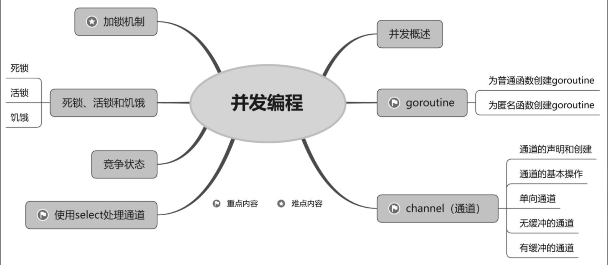


<br/><br/><br/>

> <h2 id="进程、线程与协程进程">进程、线程与协程进程</h2>


进程、线程与协程进程是计算机系统进行资源分配和调度的基本单位，是操作系统结构的基础。

线程是CPU独立调度和分派的基本单位。它被包含在进程之中，是进程中的实际运作单位。一个进程中可以并发多个线程，每条线程并行执行不同的任务。

与线程类似，协程与协程之间相对独立，每个协程都有自己的上下文；由当前协程切换到其他协程的过程是由当前协程进行控制并实现的。

<br/>

- **并发与并行**

- 并行：同时执行；多个CPU同时执行多个线程。
- 并发：穿插执行；一个CPU在不同时间段执行不同的线程，也就是说多个线程轮流穿插执行。

为了方便理解，使用如图11.1所示的示意图展示并行与并发的区别。


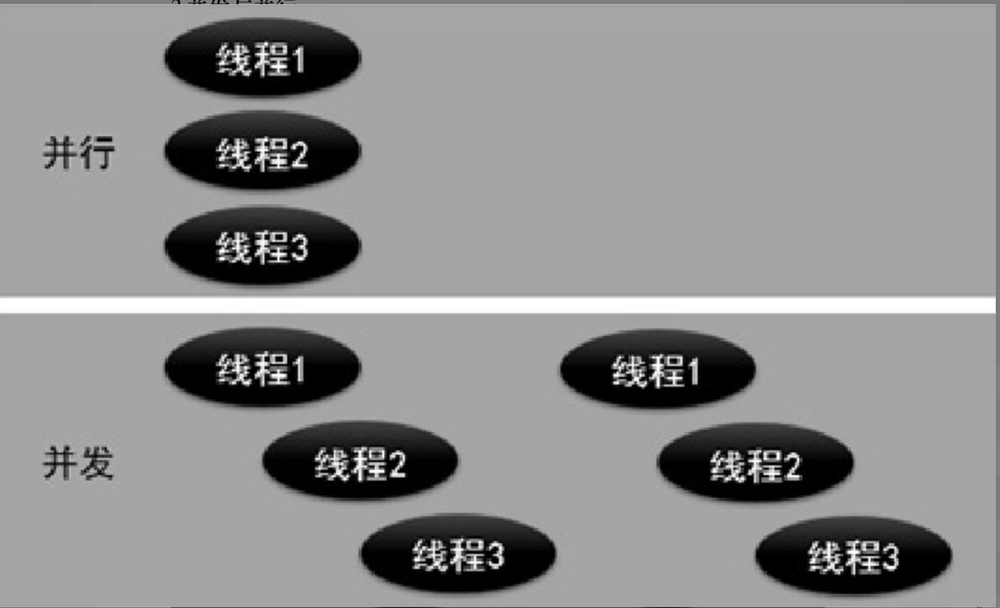

&emsp; 并发编程是指让一个CPU在某个时间段内执行一个含有多个线程的程序，这些线程被这个CPU轮流穿插执行。并发编程的优势在于当一个CPU执行含有多个线程的程序时，另一个线程不必等待当前线程被执行完毕后再被执行，进而提高使用CPU的效率。


<br/><br/><br/>
> <h2 id="goroutine">goroutine</h2>

在Go语言中，goroutine不仅是轻量级线程，而且是用户级线程。用户级线程是指由用户控制代码的执行流程，不需要操作系统进行调度和分派。也就是说，Go程序智能地将goroutine中的任务合理分配给每个CPU。

Go语言不仅有goroutine，还有用于调度goroutine的、对接系统级线程的调度器。调度器主要负责统筹调配Go语言并发编程模型（即GPM模型）中的3个主要元素，它们分别是G（goroutine的缩写）​、P（processor的缩写）和M（machine的缩写）​。

其中，M指的是系统级线程；P指的是能够使若干个G在恰当的时机与M对接，并得以运行的中介。


<br/><br/><br/>

> <h2 id="为普通函数创建goroutine">为普通函数创建goroutine</h2>

```
go 函数名称(prameter)
```

参数说明如下。

**parameter：参数列表。**


<br/><br/><br/>

> <h2 id="为匿名函数创建goroutine">为匿名函数创建goroutine</h2>


在Go程序中，使用go关键字还可以为匿名函数创建goroutine。注意，go关键字的后面须包含两个内容：一个是定义的匿名函数；另一个是匿名函数的调用参数。

使用go关键字为匿名函数创建goroutine的语法格式如下。

```
go func(parameter){
	func field
}(para)
```

参数说明如下。

- func: Go语言的关键字，用于定义匿名函数。
- parameter：参数列表。
- func field：匿名函数的实现代码。
- para：匿名函数被调用时所需设置的参数。


<br/><br/><br/>

> <h2 id="channel（通道）">channel（通道）</h2>

通道是Go语言在两个或多个goroutine之间的一种通信方式。通道可以让一个goroutine给另一个goroutine发送消息。当需要在goroutine之间共享一个数据资源时，通道是确保同步交换数据资源的方法。goroutine与通道的关系如图11.2所示。

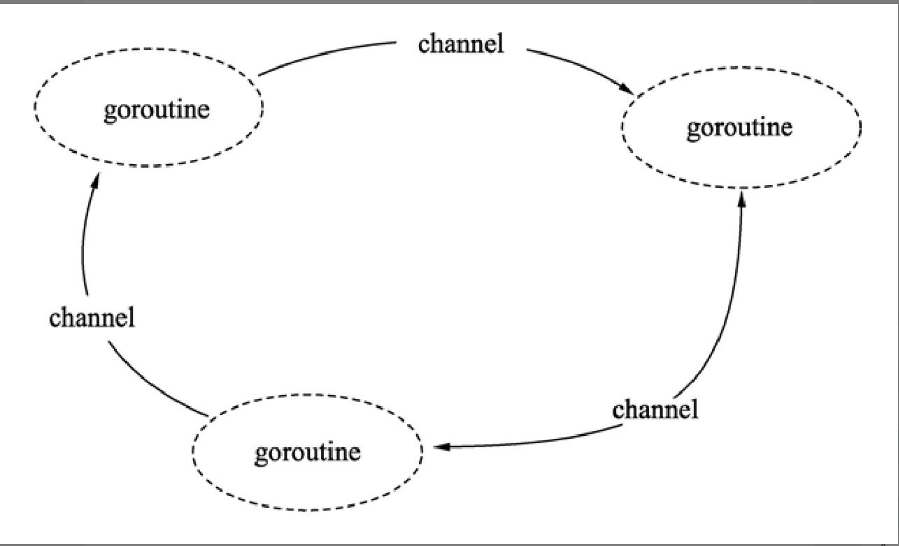

多个goroutine为了争抢数据资源，势必会降低执行效率。为了保证执行效率不降低，goroutine之间通过通道进行通信，确保同一时刻只有一个goroutine访问通道，并执行发送和接收数据的操作。

通道就像队列一样，遵循“先入先出”的规则，保证发送和接收数据的顺序。

<br/><br/><br/>

> <h2 id="通道的声明和创建">通道的声明和创建</h2>

**声明**

```
var name chan type
```

- **参数说明如下。**
	- var: Go语言关键字，用于声明变量。
	- name：通道的名称。
	- chan: Go语言关键字，通道类型。
	- type：在通道内部传输的数据的类型。为了创建通道，需要使用make()函数。创建通道的语法格式如下。


<br/>

**创建**

```
name := make(chan type)
```

- **参数说明如下**。
	- name：通道的名称。
	- make: make()函数，用于创建通道。
	- chan: Go语言关键字，通道类型。
	- type：在通道内部传输的数据的类型。在实际开发中，可以先声明通道，再创建通道。

```
var chel chan string
chel = make(chan string)
```


<br/>

***
<br/><br/><br/>

> <h1 id="包管理">包管理</h1>

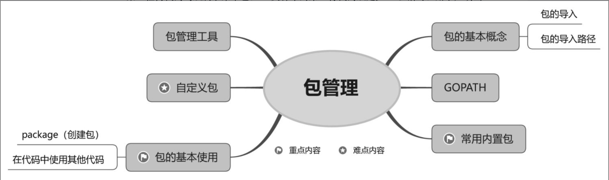

<br/>

**包的说明：**

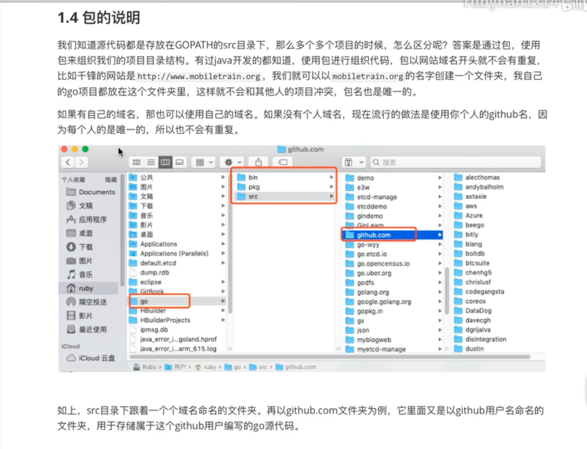

<br/>

- **包的基本概念**

&emsp; Go语言的包借鉴目录树的组织形式，包的名称通常是其源文件所在目录的名称。Go语言虽然没有强制要求包名和其源文件所在目录的名称同名，但建议使用这种方式命名。

&emsp; 包可以被定义在很深的目录中。虽然在定义包时不包括目录路径，但在引用包时一般要通过全路径引用。例如，在`GoDemos/src/com/mr/`下定义一个包dao。在包dao的源码中只声明为package dao，而不声明为`package com/mr/dao`；但在导入dao包时，要使用路径，即import "com/mr/dao"。

- **包的习惯用法：**
	- 包名一般小写，使用简短且有意义的名称。
	- 包名一般与所在的目录同名，也可以不同，包名中不能包含“-”等特殊符号。
	- 包一般使用域名作为目录名称，这样能保证包名的唯一性。
	- main包是应用程序的入口包，当编译源码没有main包时，将无法编译输出可执行文件。

<br/>

&emsp; 一个文件夹下的所有源码文件只能属于同一个包，同样，属于同一个包的源码文件不能放在多个文件夹下。

<br/><br/>

> <h2 id='GOPATHGOPATH'>GOPATHGOPATH</h2>

**GOPATHGOPATH**是Go语言中使用的环境变量，它使用绝对路径提供项目的工作目录。工作目录是一个工程开发的相对参考目录，例如，在为公司编写服务器代码时，你的工位包含的桌面、计算机及椅子就是工作区。工作区的概念与工作目录的概念是类似的。如果不使用工作目录的概念，则在多人开发时，每个人有一套自己的目录结构，读取配置文件的位置不统一，输出的二进制运行文件也不统一，这将导致开发标准不统一，影响开发效率。GOPATH适合处理大量Go语言源码、多个包组合而成的复杂工程。

在安装了Go开发包的操作系统中，可以使用命令行查看Go开发包的环境变量配置信息，在这些配置信息里可以查看当前GOPATH路径设置的情况。在命令行中运行`go env`后，将提示以下信息。

```
GO111MODULE='on'
GOARCH='arm64'
GOBIN='/Users/ganghuang/HGFiles/GitHub/GoProject/bin'
GOCACHE='/Users/ganghuang/Library/Caches/go-build'
GOENV='/Users/ganghuang/Library/Application Support/go/env'
GOEXE=''
GOEXPERIMENT=''
GOFLAGS=''
GOHOSTARCH='arm64'
GOHOSTOS='darwin'
GOINSECURE=''
GOMODCACHE='/Users/ganghuang/HGFiles/GitHub/GoProject/pkg/mod'
GONOPROXY=''
GONOSUMDB=''
GOOS='darwin'
GOPATH='/Users/ganghuang/HGFiles/GitHub/GoProject'
GOPRIVATE=''
GOPROXY='https://goproxy.io'
GOROOT='/opt/homebrew/Cellar/go/1.22.3/libexec'
GOSUMDB='sum.golang.org'
GOTMPDIR=''
GOTOOLCHAIN='auto'
GOTOOLDIR='/opt/homebrew/Cellar/go/1.22.3/libexec/pkg/tool/darwin_arm64'
GOVCS=''
GOVERSION='go1.22.3'
GCCGO='gccgo'
AR='ar'
CC='cc'
CXX='c++'
CGO_ENABLED='1'
GOMOD='/dev/null'
GOWORK=''
CGO_CFLAGS='-O2 -g'
CGO_CPPFLAGS=''
CGO_CXXFLAGS='-O2 -g'
CGO_FFLAGS='-O2 -g'
CGO_LDFLAGS='-O2 -g'
PKG_CONFIG='pkg-config'
GOGCCFLAGS='-fPIC -arch arm64 -pthread -fno-caret-diagnostics -Qunused-arguments -fmessage-length=0 -ffile-prefix-map=/var/folders/2z/dxhnl1vd6jzdg_70q_2h00bh0000gn/T/go-build4105577581=/tmp/go-build -gno-record-gcc-switches -fno-common'
ganghuang@GangHuangs-MacBook-Pro ~ % 
```

```
上述内容的说明如下。

第1行，执行goenv指令，输出当前Go开发包的环境变量。

第2行，GOARCH表示目标处理器架构。

第3行，GOBIN表示编译器和链接器的安装位置。

第7行，GOOS表示目标操作系统。

第8行，GOPATH表示当前工作目录。

第10行，GOROOT表示Go开发包的安装目录。
```


<br/><br/><br/>

> <h2 id="包的基本使用">包的基本使用</h2>

- **包的特性如下**

	- 一个目录下的同级文件归属一个包。

	- 包名可以与其目录不同名。

<br/>

当修改源文件时，必须重新编译该源文件对应的包和所有依赖该包的其他包。即使是从头构建，Go语言编译器的编译速度也明显快于其他编译语言。Go语言编译速度较快主要得益于3个语言特性。

所有导入的包必须在每个文件的开头显式声明，编译器不必通过读取和分析整个源文件判断包的依赖关系。

禁止包的环状依赖，因为没有循环依赖，包的依赖关系形成一个有向无环图，每个包都可以被独立编译，而且很可能被并发编译。

编译后包的目标文件不仅记录包本身的导出信息，目标文件同时还记录包的依赖关系。因此，在编译包时，编译器只需要读取每个直接导入包的目标文件，而不需要遍历所有依赖文件。


<br/><br/><br/>

> <h2 id="自定义包">自定义包</h2>

自定义包要放在GOPATH的src目录下（也可以是src目录下的某个子目录）​，而且两个不同的包不能放在同一目录下，以免引起编译错误。

一个包中可以有任意多个文件，文件名也没有任何规定（但后缀名必须是.go）​，这里假设包名就是.go的文件名，如果一个包有多个.go文件，则其中有一个.go文件的文件名要和包名相同。
下面通过示例演示如何创建名为demo的自定义包，并在main包中使用自定义包demo中的方法。

首先，在GOPATH下的src目录中新建demo文件夹，并在demo文件夹下创建demo.go文件，代码如下。

```
package demo

import(
	"fmt"
)

func PrintStr() {
	fmt.Println("hello, go")
}
```

然后，在GOPATH下的src目录中新建main文件夹，并在main文件夹下创建mian.go文件，代码如下。

```
package main

import(
	"demo"
)

func main() {
	demo.PrintStr()
}
```


<br/><br/><br/>

> <h2 id="包管理工具">包管理工具</h2>

Go语言依赖的所有第三方库都放在GOPATH目录下，这就导致同一个库只能保存一个版本的代码。如果不同项目依赖同一个第三方库的不同版本，应该怎么解决呢？

gomodule是Go语言从1.11版本之后官方推出的版本管理工具，并且从Go1.13版本开始，gomodule成为Go语言默认的依赖管理工具。

Module是相关Go包的集合，是源代码交换和版本控制的单元。Go语言命令直接支持使用Module，包括记录和解析对其他模块的依赖性，Module替换旧的基于GOPATH的方法指定使用哪些源文件。

<br/> 

- **Module的使用步骤如下。**
	- (1)把golang升级到1.11版本以上。
	- (2)设置GO111MODULE。

<br/> 

在Go语言1.12版本之前启用gomodule工具时，要设置环境变量GO111MODULE。不过在Go语言1.13及以后的版本则不必设置环境变量，可以通过GO111MODULE开启或关闭gomodule工具。

`GO111MODULE=off`禁用gomodule，编译时从GOPATH和vendor文件夹中查找包。

`GO111MODULE=on`启用gomodule，编译时忽略GOPATH和vendor文件夹，只根据go.mod下载依赖。
`GO111MODULE=auto（默认值）`​，当项目在GOPATH/src目录之外，并且项目根目录中有go.mod文件时，开启gomodule。
<br/>


<br/>

***

<br/><br/><br/>

> <h1 id="计算机进制运算">计算机进制运算</h1>

<br/><br/><br/>

<h2 id="原码、反码、补码">原码、反码、补码</h2>


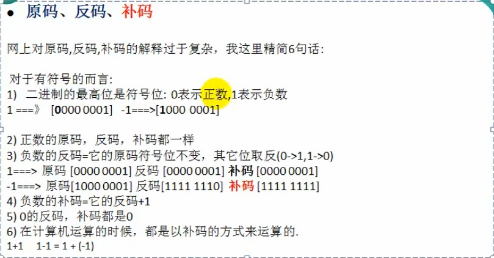


<br/><br/><br/>

> <h2 id="位运算符和移位运算符">位运算符和移位运算符</h2>


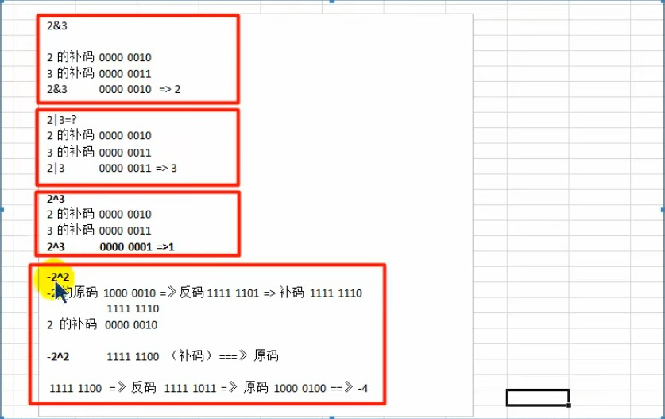


