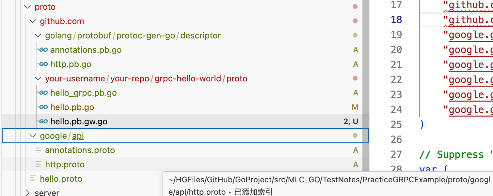

> <h4/>
- [grpc环境配置](#grpc环境配置)
- [protoc使用](#protoc使用)
- [简单Demo流程](#简单Demo流程)
- [proto编译成go代码](#proto编译成go代码)	
- [命令行模块cmd](#命令行模块cmd)


***

<br/><br/><br/><br/>

## **1. gRPC 在 Golang 内部 API 通信示例**
### **定义 gRPC 服务**
创建 `.proto` 文件：

```proto
syntax = "proto3";

package userpb;

service UserService {
  rpc GetUser (UserRequest) returns (UserResponse);
}

message UserRequest {
  int32 id = 1;
}

message UserResponse {
  int32 id = 1;
  string name = 2;
  string email = 3;
}
```

### **生成 Golang 代码**

```sh
protoc --go_out=. --go-grpc_out=. user.proto
```

### **实现 gRPC 服务器**

```go
package main

import (
	"context"
	"log"
	"net"

	pb "example.com/userpb"
	"google.golang.org/grpc"
)

type server struct {
	pb.UnimplementedUserServiceServer
}

func (s *server) GetUser(ctx context.Context, req *pb.UserRequest) (*pb.UserResponse, error) {
	return &pb.UserResponse{Id: req.Id, Name: "Alice", Email: "alice@example.com"}, nil
}

func main() {
	lis, err := net.Listen("tcp", ":50051")
	if err != nil {
		log.Fatalf("Failed to listen: %v", err)
	}
	s := grpc.NewServer()
	pb.RegisterUserServiceServer(s, &server{})

	log.Println("gRPC server listening on port 50051")
	s.Serve(lis)
}
```

### **gRPC 客户端**

```go
package main

import (
	"context"
	"fmt"
	"log"
	"time"

	pb "example.com/userpb"
	"google.golang.org/grpc"
)

func main() {
	conn, err := grpc.Dial("localhost:50051", grpc.WithInsecure())
	if err != nil {
		log.Fatalf("Failed to connect: %v", err)
	}
	defer conn.Close()

	client := pb.NewUserServiceClient(conn)

	ctx, cancel := context.WithTimeout(context.Background(), time.Second)
	defer cancel()

	res, err := client.GetUser(ctx, &pb.UserRequest{Id: 1})
	if err != nil {
		log.Fatalf("Could not get user: %v", err)
	}
	fmt.Printf("User: %v\n", res)
}
```

---

## **1. 总结**
| **选择** | **适用场景** |
|---------|------------|
| **RESTful API（HTTP+JSON）** | 前后端交互，兼容性强，浏览器友好 |
| **传统 RPC（JSON-RPC、Thrift）** | 轻量级 RPC，适合小规模内部服务 |
| **gRPC** | 高性能微服务，低延迟、流式通信，云原生架构 |

如果你的系统是**高吞吐量、跨语言、多微服务架构**，那么 **gRPC 是更好的选择**。如果只是简单的**内部 API 通信**，可以用 **JSON-RPC/Thrift** 代替。


<br/><br/><br/>
> <h2 id="grpc环境配置">grpc环境配置</h2>

**grpc安装**

```sh
go get -u google.golang.org/grpc
```

<br/><br/>

**Protoc Plugin(protobuf 插件)安装**

为了在 Golang 中使用 protobuf，你需要安装 Go 的 protobuf 插件。运行以下命令来安装

```sh
go install google.golang.org/protobuf/cmd/protoc-gen-go@latest

go install google.golang.org/grpc/cmd/protoc-gen-go-grpc@latest
```

<br/><br/>

**编译和安装 Protocol Buffers (protobuf)** 
protobuf 的安装过程。运行以下命令来安装 protobuf：

```
brew install protobuf
```

安装完成后，你可以通过以下命令验证 protobuf 是否安装成功：

```bash
protoc --version
```
如果安装成功，这将输出 protobuf 的版本号。
<br/>

**更新你的 PATH**

确保你的 $GOPATH/bin 或 $HOME/go/bin 在你的 PATH 中，这样你就可以直接使用 protoc-gen-go。你可以通过以下命令将其添加到你的 .bashrc 或 .zshrc 文件中：

```
bash
export PATH=$PATH:$(go env GOPATH)/bin
```
然后运行以下命令使更改生效：

```bash
source ~/.bashrc  # 或者 source ~/.zshrc
```

<br/>

**Grpc-gateway**
grpc-gateway是protoc的一个插件。它读取gRPC服务定义，并生成一个反向代理服务器，将RESTful JSON API转换为gRPC。此服务器是根据gRPC定义中的自定义选项生成的。

**安装：**

```sh
go install github.com/grpc-ecosystem/grpc-gateway/v2/protoc-gen-grpc-gateway@latest
```


<br/><br/><br/>
> <h2 id="protoc使用">protoc使用</h2>
- 我们按照惯例执行protoc --help（查看帮助文档），我们抽出几个常用的命令进行讲解：
	- 1、-IPATH, --proto_path=PATH：指定import搜索的目录，可指定多个，如果不指定则默认当前工作目录
	- 2、--go_out：生成golang源文件

<br/>

**参数**
若要将额外的参数传递给插件，可使用从输出目录中分离出来的逗号分隔的参数列表:

使用 Protocol Buffers 编译器（`protoc`）生成 Go 代码的命令，且支持 gRPC 服务。如下面的命令：

```sh
protoc --go_out=plugins=grpc,import_path=mypackage:. *.proto
```
- import_prefix=xxx：将指定前缀添加到所有import路径的开头
- import_path=foo/bar：如果文件没有声明go_package，则用作包。如果它包含斜杠，那么最右边的斜杠将被忽略。
- plugins=plugin1+plugin2：指定要加载的子插件列表（我们所下载的repo中唯一的插件是grpc）
- Mfoo/bar.proto=quux/shme： M参数，指定.proto文件编译后的包名（foo/bar.proto编译后为包名为quux/shme）

<br/>

***
### **各部分详解：**

1. **`protoc`**
   - 这是 Protocol Buffers 编译器的命令行工具，用来将 `.proto` 文件编译为指定语言（如 Go、Java、Python）的代码。

2. **`--go_out`**
   - `--go_out` 是指示 `protoc` 编译器生成 Go 语言代码的标志。
   - 通过这个选项，`protoc` 会将 `.proto` 文件编译为 Go 代码。

3. **`plugins=grpc`**
   - `plugins=grpc` 选项启用 gRPC 插件。gRPC 是一种高效的 RPC 框架，`protoc` 会生成用于 gRPC 服务的 Go 代码。
   - 使用此选项时，生成的 Go 代码会包括 gRPC 所需的客户端和服务器代码。
   
   **解释：**
   - gRPC 服务和客户端代码包含了与 Protocol Buffers 相关的 `Client` 和 `Server` 接口方法，这些方法用于服务的通信。
   
4. **`import_path=mypackage`**
   - `import_path` 选项指定 Go 代码中 `import` 的包路径。
   - 这表示生成的 Go 文件将在 `mypackage` 包下。例如，生成的文件将通过 `import "mypackage/yourfile"` 来引用。
   
   **注意：**
   - `mypackage` 应该是你希望在 Go 项目中使用的包名称。它通常是你项目的 Go 模块路径或目录路径。

5. **`:.`**
   - `.` 表示当前目录。这指定了生成的 Go 代码应该放置在当前目录下。
   - 所以，生成的 Go 文件将被输出到执行命令时所在的目录。

6. **`*.proto`**
   - `*.proto` 是你要编译的 `.proto` 文件的通配符。这个命令会匹配当前目录下的所有 `.proto` 文件，并将它们作为输入传递给 `protoc` 编译器。
   
### **总结**

- 这个命令会将当前目录下所有的 `.proto` 文件编译成 Go 代码，并且会生成包含 gRPC 客户端和服务器实现的代码。
- 生成的 Go 文件将被放置在当前目录中，并且这些文件会被包含在 `mypackage` 包中。

### **示例：**

假设你有一个 `hello.proto` 文件，如下所示：

```proto
syntax = "proto3";

package hello;

service Greeter {
    rpc SayHello (HelloRequest) returns (HelloReply);
}

message HelloRequest {
    string name = 1;
}

message HelloReply {
    string message = 1;
}
```

运行命令：

```bash
protoc --go_out=plugins=grpc,import_path=mypackage:. hello.proto
```

这会生成一个包含 gRPC 客户端和服务器代码的 Go 文件，类似于：

- `hello.pb.go`：包括与消息类型和 gRPC 服务相关的代码。
- `hello_grpc.pb.go`：包括 gRPC 相关的客户端和服务器代码。

这样，你就可以使用生成的 Go 代码来实现和调用 `Greeter` 服务。

### **常见问题：**
- **Go 插件未安装：**
  如果你遇到 `protoc-gen-go: program not found or is not executable` 错误，意味着你没有安装 Go 的插件。
  安装命令：
  ```bash
  go get google.golang.org/protobuf/cmd/protoc-gen-go
  ```

- **gRPC 插件未安装：**
  如果没有安装 gRPC 插件，可以通过以下命令安装：
  ```bash
  go get google.golang.org/grpc/cmd/protoc-gen-go-grpc
  ```
  
<br/>
**Grpc支持**
如果proto文件指定了RPC服务，protoc-gen-go可以生成与grpc相兼容的代码，我们仅需要将plugins=grpc参数传递给--go_out，就可以达到这个目的

```
protoc --go_out=plugins=grpc:. *.proto
```

<br/><br/><br/>
> <h2 id="简单Demo流程">简单Demo流程</h2>

**初始化目录**

```sh
grpc-hello-world/
├── certs
├── client
├── cmd
├── pkg
├── proto
│   ├── google
│   │   └── api
└── server
```
- certs：证书凭证
- client：客户端
- cmd：命令行
- pkg：第三方公共模块
- proto：protobuf的一些相关文件（含.proto、pb.go、.pb.gw.go)，google/api中用于存放annotations.proto、http.proto
- server：服务端

<br/><br/>

**制作证书**
在服务端支持Rpc和Restful Api，需要用到TLS，因此我们要先制作证书

进入certs目录，生成TLS所需的公钥密钥文件

**私钥**

```sh
openssl genrsa -out server.key 2048

openssl ecparam -genkey -name secp384r1 -out server.key
```

- openssl genrsa：生成RSA私钥，命令的最后一个参数，将指定生成密钥的位数，如果没有指定，默认512
- openssl ecparam：生成ECC私钥，命令为椭圆曲线密钥参数生成及操作，本文中ECC曲线选择的是secp384r1

**自签名公钥**

```
openssl req -new -x509 -sha256 -key server.key -out server.pem -days 3650
```

openssl req：生成自签名证书，-new指生成证书请求、-sha256指使用sha256加密、-key指定私钥文件、-x509指输出证书、-days 3650为有效期，此后则输入证书拥有者信息

**填写信息**

```sh
Country Name (2 letter code) [AU]:ShangHai
String too long, must be at most 2 bytes long
Country Name (2 letter code) [AU]:CN
State or Province Name (full name) [Some-State]:ShangHai
Locality Name (eg, city) []:ShangaHai
Organization Name (eg, company) [Internet Widgits Pty Ltd]:HuangGang
Organizational Unit Name (eg, section) []:HuangGang.dev.use 
Common Name (e.g. server FQDN or YOUR name) []:HuangGang_personalCertificate       
Email Address []:harleysor@qq.com 
```

<br/>

**或者你也可以这样做：**

是的，你可以 **不创建 `openssl.cnf` 文件**，直接在命令行执行 `openssl` 命令来生成 **带 `SAN`（Subject Alternative Name）** 的证书。

 **🚀 直接执行 OpenSSL 命令**

```sh
openssl req -x509 -nodes -newkey rsa:4096 -keyout server.key -out server.pem -days 365 \
-subj "/C=CN/ST=ShangHai/L=ShangHai/O=HuangGang/OU=HuangGang.dev.use/CN=dev" \
-addext "subjectAltName = DNS:dev, DNS:localhost, IP:127.0.0.1"
```
---

### **🛠 参数解析**
1. **`-x509`**  → 生成自签名证书  
2. **`-nodes`**  → 不加密私钥（无需密码）  
3. **`-newkey rsa:4096`**  → 生成 4096-bit RSA 私钥  
4. **`-keyout server.key`**  → 生成私钥 `server.key`  
5. **`-out server.pem`**  → 生成证书 `server.pem`  
6. **`-days 365`**  → 证书有效期 365 天  
7. **`-subj`**  → 直接在命令行设置证书信息（避免交互输入）  
8. **`-addext "subjectAltName = DNS:dev, DNS:localhost, IP:127.0.0.1"`**  
   - 添加 `SAN`，支持：
     - `DNS:dev`
     - `DNS:localhost`
     - `IP:127.0.0.1`

---

### **✅ 这样你不需要 `openssl.cnf`，就能直接生成带 `SAN` 的证书！**  
然后，你可以在 **Go gRPC 客户端** 中这样使用：

```go
creds, err := credentials.NewClientTLSFromFile("server.pem", "dev")
```
确保 `"dev"` 这个名称 **和 `SAN` 里的 `DNS:dev` 匹配**，这样 TLS 验证就不会失败了！ 🚀

这里的 "dev" 需要匹配服务器证书的 CN 或 SAN，否则会导致 tls: failed to verify certificate 错误。

✅ 检查服务器证书的 CN 和 SAN：

```sh
openssl x509 -in ../certs/server.pem -text -noout | grep -E 'Subject:|DNS:'
```
如果输出类似：

```pgsql
Subject: CN = myserver.local
X509v3 Subject Alternative Name:
    DNS:myserver.local, IP Address:127.0.0.1
```

<br/>

**server.pem证书信息：**

```
openssl x509 -in ../certs/server.pem -text -noout | grep -E 'Subject:|DNS:'
  
// 我自己证书信息
Subject: C=CN, ST=ShangHai, L=ShangaHai, O=HuangGang, OU=HuangGang.dev.use, CN=HuangGang_personalCertificate, emailAddress=harleysor@qq.com
```

<br/>

**client_server.pem证书信息：**

```
openssl x509 -in ../certs/client_server.pem -text -noout | grep -E 'Subject:|DNS:'

Subject: C=CN, ST=ShangHai, L=ShangHai, O=HuangGang, OU=HuangGang.dev.use, CN=dev
        DNS:dev, DNS:localhost, IP Address:127.0.0.1
```


说明 证书的 CN 或 SAN 不是 dev，你应该修改 client.go：

```go
creds, err := credentials.NewClientTLSFromFile("../certs/server.pem", "myserver.local")
```
或者：

```go
creds, err := credentials.NewClientTLSFromFile("../certs/server.pem", "")
（"" 表示不检查证书的 CN/SAN，仅校验证书是否可信）
```

<br/><br/>
> <h3 id="proto">proto</h3>
**annotations.proto文件：**

```proto
annotations.proto文件如下代码

syntax = "proto3";

package google.api;
option go_package = "github.com/golang/protobuf/protoc-gen-go/descriptor;descriptor";


import "google/api/http.proto";
import "google/protobuf/descriptor.proto";

option java_multiple_files = true;
option java_outer_classname = "AnnotationsProto";
option java_package = "com.google.api";

extend google.protobuf.MethodOptions {
  // See `HttpRule`.
  HttpRule http = 72295728;
}
```

这段 Protobuf (`annotations.proto`) 代码定义了一个 **protobuf 扩展 (extension)**，用于给 gRPC 方法添加 HTTP 绑定，使得 gRPC 方法可以通过 RESTful API 进行访问。下面是详细解析：

---

### **1. Protobuf 版本**

```proto
syntax = "proto3";
```
这表示该文件使用的是 **Protocol Buffers v3 (proto3) 语法**，是目前 Google 推荐的版本。

---

### **2. `package google.api;`**

```proto
package google.api;
```
- 这表示该 `proto` 文件属于 `google.api` 这个命名空间。
- 避免不同 `proto` 文件的消息类型（message）和服务（service）冲突。

---

### **3. 依赖的 `proto` 文件**

```proto
import "google/api/http.proto";
import "google/protobuf/descriptor.proto";
```
- `google/api/http.proto`
  - 该文件定义了 **`HttpRule`**，用于描述 gRPC 方法如何映射到 HTTP 路由（REST API）。
  - `HttpRule` 允许将 gRPC 方法绑定到 `GET`、`POST` 等 HTTP 方法，使得 gRPC 服务器可以作为 RESTful API 访问。

- `google/protobuf/descriptor.proto`
  - 该文件定义了 **protobuf 反射 (reflection) 和扩展机制**，允许我们扩展 protobuf 自带的功能，例如：
    - 扩展 `MethodOptions`，给 RPC 方法增加额外的元信息（metadata）。

---

### **4. Java 相关的 `option` 选项**

```proto
option java_multiple_files = true;
option java_outer_classname = "AnnotationsProto";
option java_package = "com.google.api";
```
- `java_multiple_files = true;`
  - 生成 Java 代码时，**每个 `message` 和 `service` 都会生成独立的 Java 类**，而不是全部嵌套在一个类中。
  - 这样可以提高 Java 代码的可读性和管理性。

- `java_outer_classname = "AnnotationsProto";`
  - 如果 `java_multiple_files = false`，则所有定义的 `message` 和 `service` 会嵌套在 `AnnotationsProto` 这个外部类中。
  - 但这里 `java_multiple_files = true`，所以这个 `option` 影响不大。

- `java_package = "com.google.api";`
  - 生成的 Java 代码会放在 `com.google.api` 这个 Java 包下。

---

### **5. `extend google.protobuf.MethodOptions` 扩展 `MethodOptions`**

```proto
extend google.protobuf.MethodOptions {
  // See `HttpRule`.
  HttpRule http = 72295728;
}
```
这一部分是 **protobuf 的扩展 (extension) 机制**，用于给 gRPC 方法的 `MethodOptions` 添加 `http` 选项，使得 gRPC 方法可以通过 HTTP 访问：

- `extend google.protobuf.MethodOptions`：
  - `MethodOptions` 是 **protobuf 自带的 RPC 方法元数据**，用于存储 gRPC 方法的额外信息。
  - `extend` 关键字允许我们**扩展** `MethodOptions`，增加新的字段。

- `HttpRule http = 72295728;`
  - 这里定义了一个 `HttpRule` 类型的 `http` 字段，并且它的**唯一标识符**为 `72295728`。
  - 这个字段的作用是：**允许 gRPC 方法映射到 HTTP 端点（REST API）**。

---

### **6. 这个扩展的作用**
这个 `extend` 语句的作用是**允许在 gRPC 方法上定义 HTTP 规则**，以支持 HTTP/REST 访问。

#### **使用示例**
在其他 `.proto` 文件中，我们可以这样使用：

```proto
import "google/api/annotations.proto";
import "google/api/http.proto";

service MyService {
  rpc GetUserInfo (UserRequest) returns (UserResponse) {
    option (google.api.http) = {
      get: "/v1/user/{id}"
    };
  }
}
```
- `option (google.api.http) = { get: "/v1/user/{id}" }`
  - 这个 `option` 使用了 `annotations.proto` 定义的 `http` 扩展。
  - 使得 `GetUserInfo` 这个 gRPC 方法可以通过 **HTTP `GET /v1/user/{id}`** 访问。

**等效于 REST API：**

```http
GET /v1/user/123
```
会被转换为 gRPC 调用：

```proto
rpc GetUserInfo(UserRequest) returns (UserResponse);
```

---

### **7. `72295728` 这个数字的意义**
在 `protobuf` 里，每个字段都需要一个唯一的 **标识符 (Tag Number)**，如：

```proto
string name = 1;
int32 age = 2;
```
- 这里 `name` 的 Tag 是 `1`，`age` 的 Tag 是 `2`。

在 `extend google.protobuf.MethodOptions` 里：

```proto
HttpRule http = 72295728;
```
- `72295728` 是 **扩展字段的 Tag Number**，用于唯一标识 `http` 这个扩展字段。
- Google 选择了一个**高位数字**，避免与 Protobuf 内部字段冲突。
- 该编号在 Google API 设计指南里是固定的，不要随意更改。

---

### **8. `HttpRule` 作用**
`HttpRule`（在 `google/api/http.proto` 中定义）用于指定 gRPC 方法和 HTTP 请求之间的映射关系：

```proto
message HttpRule {
  string get = 1;
  string post = 2;
  string put = 3;
  string delete = 4;
  ...
}
```
因此，在 `.proto` 里，我们可以这样使用：

```proto
rpc CreateUser (UserRequest) returns (UserResponse) {
  option (google.api.http) = {
    post: "/v1/users"
    body: "*"
  };
}
```
这意味着：
- `CreateUser` 方法可以通过 **HTTP `POST /v1/users`** 访问。
- `body: "*"` 表示请求的 body 作为 gRPC 方法的参数。

---

### **总结**
1. **`extend google.protobuf.MethodOptions`** 是 Protobuf 的扩展机制，允许为 gRPC 方法添加自定义的 **HTTP 绑定选项**。
2. `HttpRule` 允许 gRPC 方法支持 RESTful API 调用，使得 gRPC 方法可以通过 HTTP（`GET`、`POST`、`PUT`、`DELETE`）访问。
3. `option (google.api.http)` 语法用于在 `.proto` 文件中启用 HTTP 绑定。
4. `72295728` 是 Google 预留的 **唯一标识符 (Tag Number)**，表示 `http` 这个扩展字段。
5. 在 **Google API 设计规范** 里，`annotations.proto` 主要用于 `gRPC-Gateway`，使 gRPC 方法可以通过 REST 访问。

---

### **实战意义**
- **如果你使用 gRPC**，但想让客户端用 REST API 访问，你可以使用 `google.api.http` 选项。
- **如果你在写 Protobuf API**，但希望支持 `gRPC-Gateway`，`annotations.proto` 是必不可少的。

---

这个 `annotations.proto` 是 Google API 设计中的关键部分，使得 **gRPC 和 REST API 可以无缝结合**，在 Google Cloud 和其他微服务架构中广泛使用。

<br/><br/>

**http.proto文件：**

```proto
syntax = "proto3";

package google.api;
option go_package = "github.com/golang/protobuf/protoc-gen-go/descriptor;descriptor";

option cc_enable_arenas = true;
option java_multiple_files = true;
option java_outer_classname = "HttpProto";
option java_package = "com.google.api";

message HttpRule {
  // Selects methods to which this rule applies.
  //
  // Refer to [selector][google.api.DocumentationRule.selector] for syntax details.
  string selector = 1;

  // Determines the URL pattern is matched by this rules. This pattern can be
  // used with any of the {get|put|post|delete|patch} methods. A custom method
  // can be defined using the 'custom' field.
  oneof pattern {
    // Used for listing and getting information about resources.
    string get = 2;

    // Used for updating a resource.
    string put = 3;

    // Used for creating a resource.
    string post = 4;

    // Used for deleting a resource.
    string delete = 5;

    // Used for updating a resource.
    string patch = 6;

    // Custom pattern is used for defining custom verbs.
    CustomHttpPattern custom = 8;
  }

  // The name of the request field whose value is mapped to the HTTP body, or
  // `*` for mapping all fields not captured by the path pattern to the HTTP
  // body. NOTE: the referred field must not be a repeated field.
  string body = 7;

  // Additional HTTP bindings for the selector. Nested bindings must
  // not contain an `additional_bindings` field themselves (that is,
  // the nesting may only be one level deep).
  repeated HttpRule additional_bindings = 11;
}

// A custom pattern is used for defining custom HTTP verb.
message CustomHttpPattern {
  // The name of this custom HTTP verb.
  string kind = 1;

  // The path matched by this custom verb.
  string path = 2;
}
```

`http.proto` 主要定义了 **gRPC 方法与 HTTP API 之间的映射规则**，核心是 `HttpRule` 这个消息（message），它允许我们把 gRPC 方法映射到 RESTful API，如 `GET`、`POST`、`PUT` 等 HTTP 方法。  

---

## **1. 头部选项 (`option`)**

```proto
option cc_enable_arenas = true;
option java_multiple_files = true;
option java_outer_classname = "HttpProto";
option java_package = "com.google.api";
```
这些选项用于控制代码生成：

- `cc_enable_arenas = true;`
  - **C++ 相关优化**，启用 **Arena Allocation** 机制，提高对象的内存管理效率，减少内存分配和回收的开销。

- `java_multiple_files = true;`
  - 生成的 Java 代码会为 `HttpRule`、`CustomHttpPattern` 等每个 message 单独创建一个 `.java` 文件，而不是全部嵌套在 `HttpProto` 这个类里。

- `java_outer_classname = "HttpProto";`
  - 设定 Java 代码的外部类名为 `HttpProto`（如果 `java_multiple_files = false`）。

- `java_package = "com.google.api";`
  - 生成的 Java 代码放在 `com.google.api` 这个 Java 包下。

---

## **2. `HttpRule` 结构**

```proto
message HttpRule {
  string selector = 1;

  oneof pattern {
    string get = 2;
    string put = 3;
    string post = 4;
    string delete = 5;
    string patch = 6;
    CustomHttpPattern custom = 8;
  }

  string body = 7;

  repeated HttpRule additional_bindings = 11;
}
```
`HttpRule` 主要用于**将 gRPC 方法映射到 HTTP 端点**，它包含以下字段：

### **(1) `selector`**

```proto
string selector = 1;
```
- `selector` 指定要应用 HTTP 规则的 **gRPC 方法**，其值是 `package.service/method` 形式。
- 例如：

```proto
selector = "my.package.MyService.GetUserInfo";
```

### **(2) `pattern` (HTTP 方法绑定)**

```proto
oneof pattern {
  string get = 2;
  string put = 3;
  string post = 4;
  string delete = 5;
  string patch = 6;
  CustomHttpPattern custom = 8;
}
```
- 这是 **`oneof` 字段**，即**同一时间只能选其中一个**。
- 允许 gRPC 方法映射到标准 HTTP 方法：
  - `get = 2;`  → HTTP `GET` 请求
  - `put = 3;`  → HTTP `PUT` 请求
  - `post = 4;` → HTTP `POST` 请求
  - `delete = 5;` → HTTP `DELETE` 请求
  - `patch = 6;` → HTTP `PATCH` 请求
  - `custom = 8;` → **自定义 HTTP 方法**（如 `OPTIONS`）

#### **示例**

```proto
rpc GetUser (GetUserRequest) returns (User) {
  option (google.api.http) = {
    get: "/v1/user/{id}"
  };
}
```
这里的 `get: "/v1/user/{id}"` 表示：
- gRPC 方法 `GetUser` 可以通过 HTTP `GET /v1/user/123` 访问，并将 `{id}` 绑定到 `GetUserRequest` 参数。

---

### **(3) `body` (HTTP 请求体绑定)**

```proto
string body = 7;
```
- 指定哪个请求字段映射到 HTTP `body` 中。
- 特殊值：
  - `"*"` → **全部字段** 作为 `body`
  - `""`（空字符串）→ **不映射 `body`**，参数需通过 URL 查询参数传递。

#### **示例**

```proto
rpc CreateUser (CreateUserRequest) returns (User) {
  option (google.api.http) = {
    post: "/v1/users"
    body: "*"
  };
}
```
等效于 REST API：

```http
POST /v1/users
Content-Type: application/json

{
  "name": "Alice",
  "age": 25
}
```
- `body: "*"` 让整个 `CreateUserRequest` 作为 HTTP `body` 传递。

如果 `body: "user"`：

```proto
message CreateUserRequest {
  User user = 1;
}
```
则 HTTP `body` 变成：

```json
{
  "user": {
    "name": "Alice",
    "age": 25
  }
}
```

---

### **(4) `additional_bindings` (额外的 HTTP 规则)**

```proto
repeated HttpRule additional_bindings = 11;
```
- 允许一个 gRPC 方法有 **多个 HTTP 绑定**（比如既支持 `GET` 也支持 `POST`）。
- 但**不能嵌套多层**（即 `additional_bindings` 不能再包含 `additional_bindings`）。

#### **示例**

```proto
rpc GetUser (GetUserRequest) returns (User) {
  option (google.api.http) = {
    get: "/v1/user/{id}"
    additional_bindings {
      post: "/v1/user"
      body: "*"
    }
  };
}
```
等效于：
- `GET /v1/user/123` → 通过 URL 查询参数传递 `id`
- `POST /v1/user` + `body: "*"` → 通过 `body` 传递 `id`

---

## **3. `CustomHttpPattern` 结构**

```proto
message CustomHttpPattern {
  string kind = 1;
  string path = 2;
}
```
- 允许使用自定义的 HTTP 方法（如 `OPTIONS`、`HEAD`）。
- `kind`：自定义 HTTP 方法的名称，如 `OPTIONS`。
- `path`：HTTP 端点。

#### **示例**

```proto
rpc CustomOptions (Empty) returns (Empty) {
  option (google.api.http) = {
    custom {
      kind: "OPTIONS"
      path: "/v1/custom"
    }
  };
}
```
等效于：

```http
OPTIONS /v1/custom
```

---

## **总结**
1. **`HttpRule` 作用**
   - 允许 gRPC 方法映射到 HTTP API，使 gRPC 可通过 RESTful API 访问。
   - `get`、`post`、`put`、`delete`、`patch` 定义 HTTP 方法绑定。
   - `body` 决定请求参数是否放入 `body`（默认放 URL 查询参数）。
   - `additional_bindings` 允许一个 gRPC 方法支持多种 HTTP 映射。
   - `custom` 允许定义自定义 HTTP 方法（如 `OPTIONS`）。

2. **示例**

```proto
rpc CreateUser (CreateUserRequest) returns (User) {
 option (google.api.http) = {
   post: "/v1/users"
   body: "*"
 };
}
```
   - gRPC 方法 `CreateUser` → `POST /v1/users`
   - `body: "*"` 表示整个请求体作为 HTTP `body`。

3. **与 `annotations.proto` 结合**
   - `annotations.proto` 通过 `extend MethodOptions` **把 `HttpRule` 绑定到 gRPC 方法**。
   - 让 `gRPC-Gateway` **自动转发** RESTful API 调用到 gRPC 服务。

---

这就是 `http.proto` 的核心，它是 `gRPC-Gateway` 和 Google Cloud API 的关键组件，使 gRPC 既能支持高效的 RPC，又能兼容 RESTful API 🚀

<br/><br/>
> <h3 id="proto编译成go代码">proto编译成go代码</h3>

```sh
# 编译google.api
# 首先cd到proto目录
ganghuang@GangHuangs-MacBook-Pro proto% cd MLC_GO/TestNotes/PracticeGRPCExample/proto 
protoc -I . \
--go_out=Mgoogle/api/http.proto=github.com/golang/protobuf/protoc-gen-go/descriptor:. \
--go-grpc_out=Mgoogle/api/http.proto=github.com/golang/protobuf/protoc-gen-go/descriptor:. \
google/api/*.proto

# 编译hello_http.proto为hello_http.pb.proto
ganghuang@GangHuangs-MacBook-Pro proto % protoc -I . \
--go_out=Mgoogle/api/annotations.proto=grpc-hello-world/proto/google/api,\
Mhello.proto=github.com/your-username/your-repo/grpc-hello-world/proto:. \
--go-grpc_out=Mgoogle/api/annotations.proto=grpc-hello-world/proto/google/api,\
Mhello.proto=github.com/your-username/your-repo/grpc-hello-world/proto:. \
./hello.proto

# 编译hello_http.proto为hello_http.pb.gw.proto
protoc -I . -I ./third_party/googleapis \
--grpc-gateway_out=logtostderr=true,\
Mhello.proto=github.com/your-username/your-repo/grpc-hello-world/proto,\
Mgoogle/api/annotations.proto=github.com/grpc-ecosystem/grpc-gateway/third_party/googleapis/google/api:. \
./hello.proto
```
执行完毕后将生成hello.pb.go和hello.gw.pb.go，分别针对grpc和grpc-gateway的功能支持



<br/><br/>
> <h3 id="命令行模块cmd">命令行模块cmd</h3>

这一小节我们编写命令行模块，为什么要独立出来呢，是为了将cmd和server两者解耦，避免混淆在一起。

- 我们采用 [Cobra](#CLI（命令行界面）Cobra库) 来完成这项功能，Cobra既是创建强大的现代CLI应用程序的库，也是生成应用程序和命令文件的程序。提供了以下功能：
	- 简易的子命令行模式
	- 完全兼容posix的命令行模式(包括短和长版本)
	- 嵌套的子命令
	- 全局、本地和级联flags
	- 使用Cobra很容易的生成应用程序和命令，使用cobra create appname和cobra add cmdname
	- 智能提示
	- 自动生成commands和flags的帮助信息
	- 自动生成详细的help信息-h，--help等等
	- 自动生成的bash自动完成功能
	- 为应用程序自动生成手册
	- 命令别名
	- 定义您自己的帮助、用法等的灵活性。
	- 可选与viper紧密集成的apps

