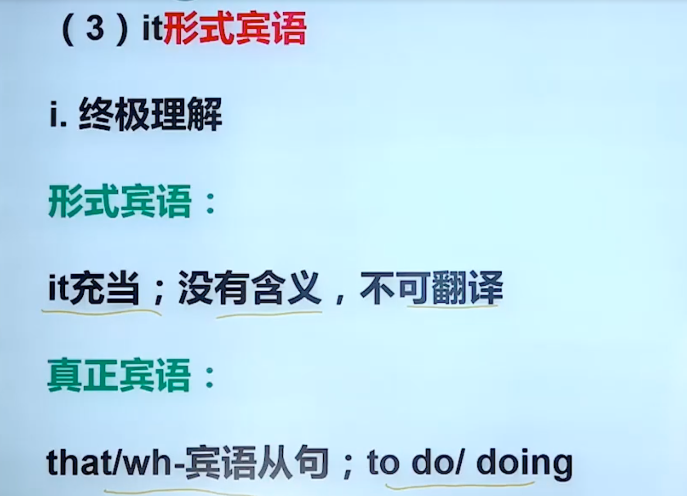

> <h2 id=""></h2>
- [**48英语音标发音**](#48英语音标发音)
- [**语法**](#语法)
	- [动词分类](#动词分类)
	- [主谓宾和主系表的结构](#主谓宾和主系表的结构)
	- [动词“三姨太”](#动词“三姨太”)
	- [it形式主语](#it形式主语)
	- [宾语](#宾语)
- **资料**
	- [连连上岸：考研英语语法小课堂(B站-连俊霞)](https://www.bilibili.com/video/BV13h411H7fA?p=5&vd_source=a7fe275f0ee54c4d2f691a823f8876b8)


<br/>

***
<br/><br/><br/>

> <h1 id="48英语音标发音">48英语音标发音</h1>

**元音：**

| 音标  | 汉字示范发音 | 音标  | 汉字示范发音 |
|-------|--------------|-------|--------------|
| /i:/  | 依  (like "ee" in "see")         | /ɪ/   | 一(shorter, like "i" in "sit")           |
| /e/   | 埃(like "e" in "bed")           | /æ/   | 啊(like "a" in "cat")           |
| /ɑ:/  | 阿 (as in American "father")          | /ɒ/   | 喔(shorter, as in British "lot")           |
| /ɔ:/  | 噢  (like "aw" in "law")          | /ʊ/   | 乌(shorter, like "oo" in "book")           |
| /u:/  | 屋(like "oo" in "too")           | /ʌ/   | 啊 (like "u" in "cup")          |
| /ɜ:/  | 儿(as in "bird")           | /ə/   | 呃 (schwa sound, like "a" in "about")           |
| /eɪ/  | 欸           | /aɪ/  | 爱 (diphthong in "high")           |
| /ɔɪ/  | 哦依 (diphthong in "boy")         | /aʊ/  | 奥(diphthong in "now")           |
| /əʊ/  | 欧(diphthong in "boat")           | /ɪə/  | 一儿(as in "near")         |
| /eə/  | 埃儿 (as in "square")         | /ʊə/  | 乌儿(as in "poor")         |
| /ʌɪ/  | 哎儿 (diphthong in "buy")       |   |          |


<br/><br/>
**辅音：**

| 音标  | 汉字示范发音 | 音标  | 汉字示范发音 |
|-------|--------------|-------|--------------|
| /p/   | 泼         | /b/   | 波           |
| /t/   | 特           | /d/   | 德           |
| /k/   | 科           | /g/   | 哥           |
| /tʃ/  | 切(as in "church")           | /dʒ/  | 驾(as in "judge")|
| /f/   | 夫           | /v/   | 维           |
| /θ/   | 思（舌尖放在上下齿间） (as in "think") | /ð/   | 齿（舌尖放在上下齿间）(as in "this") |
| /s/   | 思           | /z/   | 紫           |
| /ʃ/   |  诗 (as in "ship") | /ʒ/   | 日           |
| /h/   | 喝           | /m/   | 嘛           |
| /n/   | 呢           | /ŋ/   | 昂（舌后部抬起） (as in "sing") |
| /l/   | 勒           | /r/   | 若 (American "r")           |
| /j/   | 耶 (as in "yes")          | /w/   | 位 (as in "way")           |
| /ʍ/   | 呼哇         | /ɾ/   | 弹舌音/快速的「特」 |
| /ɬ/   | 蛙（舌顶齿龈，气流从两侧通过） | /x/   | 哈（类似西班牙语的发音） |
|  /tr/  | 踹 (as in "try") |  /dr/ | 拽 (as in "dry")  
| /ts/ | 吃 (as in "cats") |  /dz/  | 之 (as in "ads") |
|    |  | |    |
|    |  | |    |  


<br/>

[](https://www.bilibili.com/video/BV1vi4y1C73C/?spm_id_from=333.337.search-card.all.click&vd_source=a7fe275f0ee54c4d2f691a823f8876b8)


[](https://www.bilibili.com/video/BV1vi4y1C73C/?spm_id_from=333.337.search-card.all.click&vd_source=a7fe275f0ee54c4d2f691a823f8876b8)


<br/>

***
<br/><br/><br/>

> <h1 id=""></h1>


<br/><br/><br/>

> <h2 id="动词分类">动词分类</h2>


**动词分类**


实义动词：有实际动作意义的动词，如：吃，睡， 看；

系动词： 是的意思(be:是， mean：意味着； seem：似乎，看起来)


<br/><br/><br/>

> <h2 id="主谓宾和主系表的结构">主谓宾和主系表的结构</h2>

句子逐渐变复杂了，变成了各种从句充当主语或者宾语了！如下：


<br/><br/><br/>

> <h2 id="动词“三姨太”">动词“三姨太”</h2>


**时态**
   


**现在完成进行态：** 从过去做到现在，而且现在还在做；


<br/> <br/>

**语态**


<br/>

**变种：时态+语态**


<br/> <br/>


**情态动词**


情态动词不能单独作谓语，必须与其他动词构成谓语；

```
I can eat food； can eat 构成谓语
```


<br/>

***
<br/><br/><br/>

> <h1 id="it形式主语">it形式主语</h1>


```
it作为形式主语，不可翻译，若是翻译最好翻译成：重要的是....; 很明显的是.....; 关键的是...;
```

<br/>


**It作为形式主语句型：**


<br/><br/><br/>

> <h2 id="宾语">宾语</h2>


<br/>

**It形式宾语**



```
//注意：it作形式宾语不翻译
句型速记： make（使得）/find（发现）/take（认为，采取）/have（让） + it + adj+真正宾语


```


