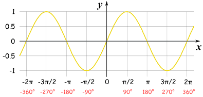
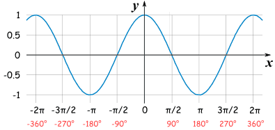
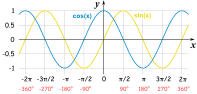
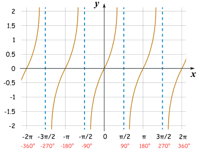
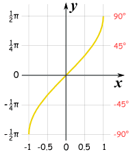
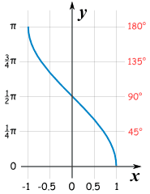
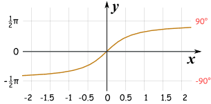
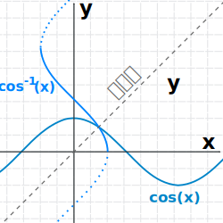

> <h1 id=""></h1>
- [**绝对值的几何意义**](#绝对值的几何意义)
	- [不等式恒成立](#不等式恒成立)
- [**三角函数**](#三角函数)
	- [正弦函数](#正弦函数)
	- [余弦函数](#余弦函数)
	- [反正弦、反余弦和反正切](#反正弦、反余弦和反正切)
	- [镜像](#镜像)
	- [三角函数所有公式](#三角函数所有公式)

 

***
   

> <h1 id="绝对值的几何意义">绝对值的几何意义</h1>

**绝对值相加系数坐标几何走向：**

 

**一个例子：**

 

**找方程：**

一个具体例子求解：

   

   

> <h2 id="不等式恒成立">不等式恒成立</h2>

让最小值大于C，那么不等式绝对值之和大于这个最小值，那么就恒大于C

 

***

   

> <h1 id="三角函数">三角函数</h1>

   

> <h2 id="正弦函数">正弦函数</h2>

正弦函数的图是美丽的波浪形曲线（每 2π 弧度（360°）重复一遍）。

图从 0 开始，在 π/2 弧度（90°）上升到 1，然后降回 -1

  

   

> <h2 id="余弦函数">余弦函数</h2>

余弦和正弦一样，但图从 1 开始，下降到角的值为 π 弧度 （180°），然后再上升.

  

正弦和余弦就像好朋友：一个跟着另一个，隔开的距离是刚好 "π/2" 弧度（90°）。

   

> <h2 id="正切函数">正切函数</h2>

正切的图有完全不同的形状……它处于正与负无穷大之间，每π 弧度（180°）经过 0 一次，像这样：

在π/2 弧度（90°），和 -π/2、3π/2 等等，正切函数是 未定义的，因为它可以是正无穷大 或 负无穷大。

   

> <h2 id="反正弦、反余弦和反正切">反正弦、反余弦和反正切</h2>

**[反正弦、反余弦和反正切的图是：](https://www.shuxuele.com/algebra/trig-inverse-sin-cos-tan.html)**

  

**反正弦**

  

**反余弦**

   

> <h2 id="镜像">镜像</h2>

这是余弦 和 反余弦 画在同一图上：

 

***
   

> <h1 id="三角函数所有公式">三角函数所有公式</h1>

