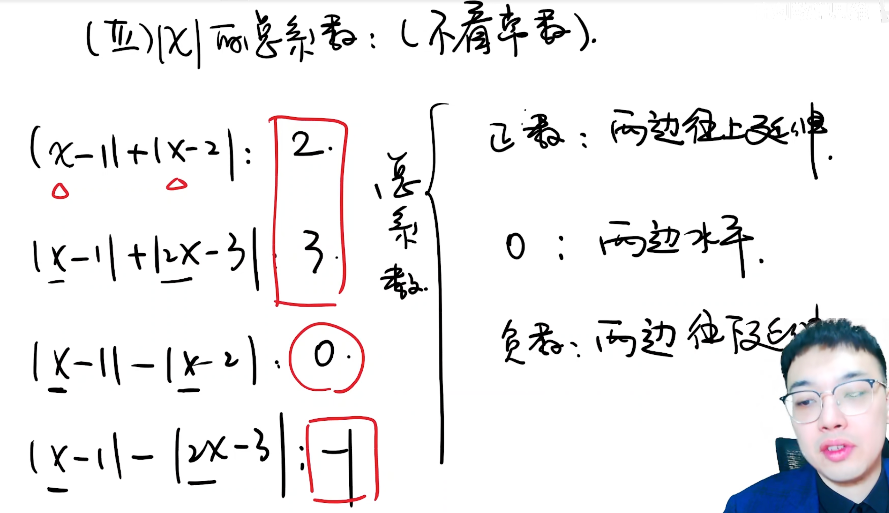
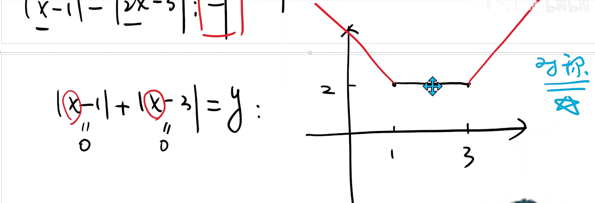
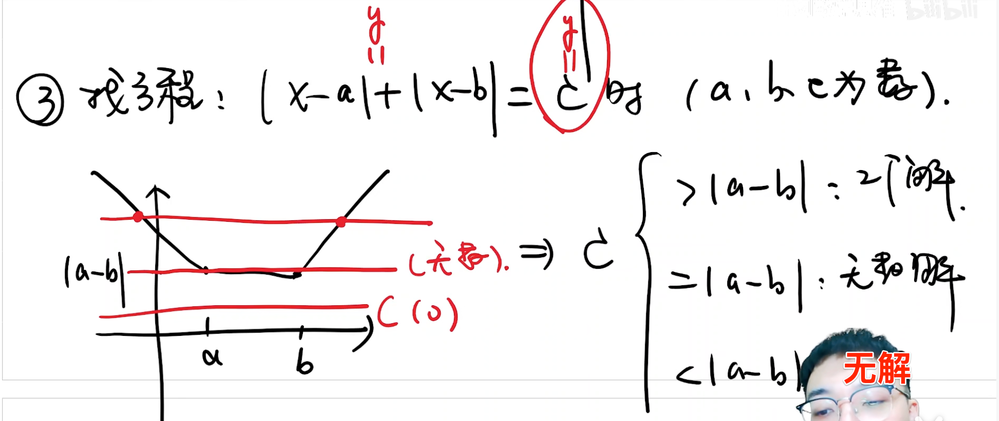
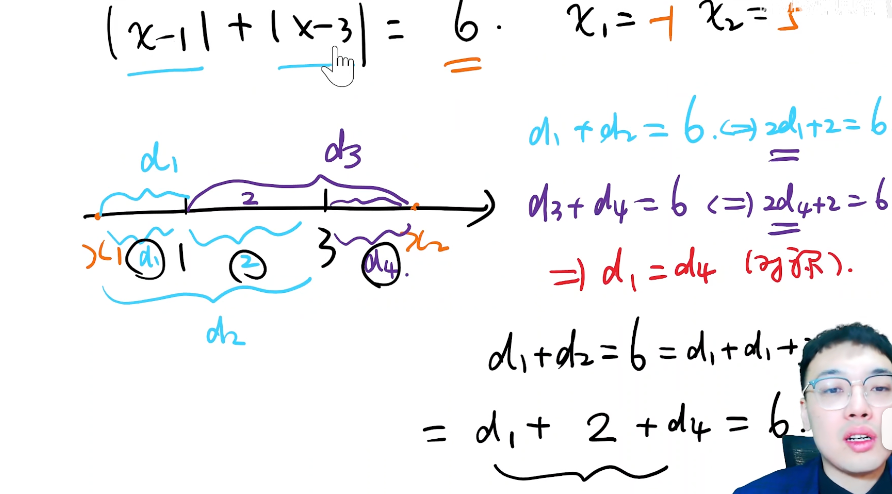
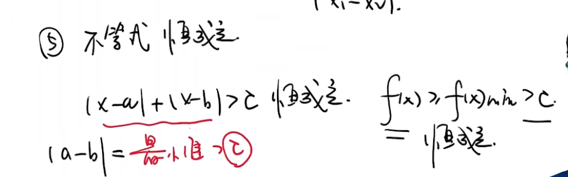

> <h1 id=""></h1>
- [绝对值的几何意义](#绝对值的几何意义)
	- [不等式恒成立](#不等式恒成立)

 

***
   

> <h1 id="绝对值的几何意义">绝对值的几何意义</h1>

**绝对值相加系数坐标几何走向：**

 

**一个例子：**

 

**找方程：**

一个具体例子求解：

   

   

> <h2 id="不等式恒成立">不等式恒成立</h2>

让最小值大于C，那么不等式绝对值之和大于这个最小值，那么就恒大于C

