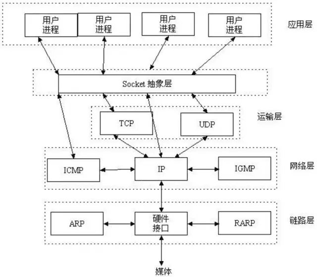

> <h2 id=""></h2>
- [**长链接和短链接**](#长链接和短链接)
- **UDP和TCP**
- **Scocket通信机制**
	- Socket简介
- [**网络请求**](https://www.jianshu.com/p/987100a583c3)
- [**iOS即时通讯，从入门到“放弃”？**](https://www.jianshu.com/p/2dbb360886a8)

 

***
 

> <h2 id="长链接和短链接">长链接和短链接</h2>

[HTTP长连接和短连接 + Websocket](https://www.cnblogs.com/barrywxx/p/8569380.html)

 

***
 

># UDP和TCP 

&emsp;  掉帧就是掉数据了，发生UDP也就是网络层，比如玩王者荣耀游戏和视频直播(网络流媒体)时出现马赛克。

&emsp;  TCP的应用场景比如是下载文件，若是使用UDP可能会出现丢包现象。比如你若是用UDP下载几个G的Xcode，结果完成后发现丢包，Xcode就会打不开，那是你的内心是崩溃的。

 

***
 

># **Scocket通信机制**

 

&emsp;  知道了IP地址(知道了设备)、端口号(使用哪种服务，如:发邮件是一种服务，它使用了一个端口)、传输讯协议(UDP/TCP，知道如何传输数据)，两台不同的设备就可以通信了。

 

> **Socket简介**

&emsp;  Socket 其实并不是一个协议。它工作在 OSI 模型会话层（第5层），是为了方便大家直接使用更底层协议（一般是 TCP 或 UDP ）而存在的一个抽象层。Socket是对TCP/IP协议的封装，Socket本身并不是协议，而是一个调用接口(API)。

我们在应用层，使用socket，轻易的实现了进程之间的通信（跨网络的）。想想，如果没有socket，我们要直面TCP/IP协议，我们需要去写多少繁琐而又重复的代码。

&emsp;  Socket通常也称作”套接字”，用于描述IP地址和端口，是一个通信链的句柄。网络上的两个程序通过一个双向的通讯连接实现数据的交换，这个双向链路的一端称为一个Socket，一个Socket由一个IP地址和一个端口号唯一确定。应用程序通常通过”套接字”向网络发出请求或者应答网络请求。

&emsp;  Socket在通讯过程中，服务端监听某个端口是否有连接请求，客户端向服务端发送连接请求，服务端收到连接请求向客户端发出接收消息，这样一个连接就建立起来了。客户端和服务端也都可以相互发送消息与对方进行通讯，直到双方连接断开。

&emsp;  所以基于WebSocket和基于Socket都可以开发出IM社交聊天类的app

Socket开源框架：[**socket.io-client-swift**](https://github.com/socketio/socket.io-client-swift)、[**CocoaAsyncSocket**](https://github.com/robbiehanson/CocoaAsyncSocket)

WebSocket开源框架：[**SocketRocket**](https://github.com/facebookarchive/SocketRocket)、[**SwiftWebSocket**](https://github.com/tidwall/SwiftWebSocket)、[**SRWebSocket**](https://www.jianshu.com/p/cdb7a886789a)

 

**移动端IM/推送系统的协议选型：UDP还是TCP？**

&emsp; 其实这两种通信协议可以同时使用，各有侧重。UDP用于保持大量终端的在线与控制，应用与业务则通过TCP去实现。这个和FTP服务控制与数据分离，采取不同的连接，有异曲同工之处。

&emsp; 事实上，这个也是即时通讯巨头QQ所采用的方式。早期的时候，QQ还是主要使用TCP协议，而后来就转向了采用UDP的方式来保持在线，TCP的方式来上传和下载数据。现在，UDP是QQ的默认工作方式，表现良好。相信这个也被沿用到了微信上。

&emsp; 简单的考证：登录PC版QQ，关闭多余的QQ窗口只留下主窗口，并将其最小化。几分钟过后，查看系统网络连接，会发现QQ进程已不保有任何TCP连接，但有UDP网络活动。这时在发送聊天信息，或者打开其他窗口和功能，将发现QQ进程会启用TCP连接。

&emsp;**但是，**对于小公司或者技术不那么成熟的公司，IM一定要用TCP来实现，因为如果你要用UDP的话，需要做的事太多。当然QQ就是用的UDP协议，当然不仅仅是UDP，腾讯还用了自己的私有协议，来保证了传输的可靠性，杜绝了UDP下各种数据丢包，乱序等等一系列问题。
总之一句话，如果你觉得团队技术很成熟，那么你用UDP也行，否则还是用TCP为好。

 

