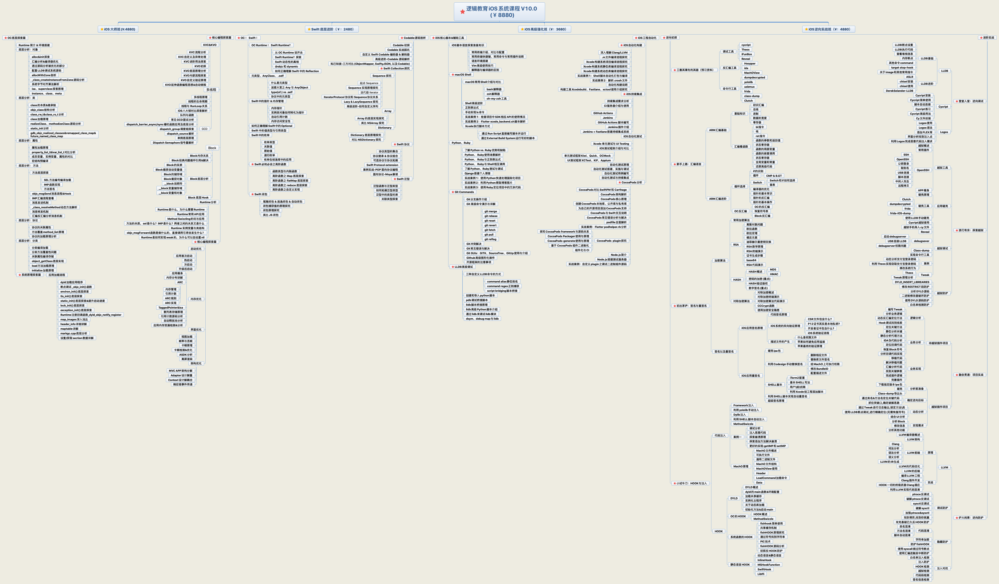

># <h1 id='目录'>目录</h1>
- [**Git提交规范**](#git提交规范)
	- [模块图片相对路径](#模块图片相对路径)
- [**C语言**](#c-language)
- [**iOS开发**](#ios开发)
	- [**Objective-C**](#objective-c)
	- [**Swift**](#swift)
- [**Go**](#go)
- [**Flutter**](#flutter)
- [**JavaScript**](#java-script)
- [**React**](#react)
- [**CSS**](#css)
- [**Egret Engine**](#egret-engine)
- [**软件测试**](#软件测试)
- [**底层**](#底层)
- [**动画/绘图**](#动画/绘图)
- [**加密**](#加密)
- [**类库**](#类库)
- [**多线程**](#多线程)
- [**数据存储**](#数据存储)
- [**Network**](#network)
- [**数据结构**](#数据结构)
- [**工具**](#工具)
- [**读书笔记**](#读书笔记)
- [**优秀资料**](#优秀资料)
- [**优秀文章**](#优秀文章)
- [**常用**](#常用)


<br/>

***
<br/><br/><br/>

> <h1 id='git提交规范'>Git提交规范</h1>


```
- fix: 修复改bug;
- docs: 文档注释;
- style: 代码格式(不影响代码运行的变动);
- refactor: 重构(既不增加新功能，也不是修复bug);
- perf: 性能优化;
- test: 增加测试;
- chore: 构建过程或辅助工具的变动;
- revert: 回滚到上一个版本;
- merge：代码合并;
- sync：同步主线或分支的Bug;
- build: 打包;
- deps: 升级依赖;
- feat: 新功能;

⌘ -> command
⇧ -> shift
⌥ -> option
⬆ -> 上箭头
⬇ -> 下箭头
⌃ -> Control
```

```
向上/下/左/右滑动网页：上下左右方向键
大幅度滑动网页：方向键+ option 键
向下滑动一整页：空格键
向上滑动一整页：shift +空格键
显示所有网页标签页：command + shift + 键
切换到下一个标签页：control + tab 键 / command + shift + ] 键
切换到上一个标签页：control + shift + tab 键 / shift + command + [ 键
移动到网页的左上角：command + 向上箭头
移动到网页的左下角：command + 向下箭头
关闭除了某个标签之外的其他所有标签页： 按住 option 键并点击该网页标签的关闭按钮
打开上一个被关闭的网页：command + shift + T 键
退出全屏： 按左上角 esc 键
下载一个链接文件： 点击链接的同时按住 option 键
改变网页字体大小：command + ➕（增大字体），command + ➖（减小字体）
恢复默认字体大小：command + 数字 0 键
跳转到地址栏：command + L 键
打开一个新的标签页：command + T 键
重载当前网页：command + R 键
停止载入网页：command + . 键
```


<br/>

***
<br/><br/>


>#  <h1 id = 'c-language'>C语言</h1>

><h2 id='c'> C</h2>
*	[**基础**](./C/C基础.md)
*	[**指针**](./C/C指针.md)
*	[**数据结构**](./C/数据结构.md)
*	[**排序算法**](./C/排序算法.md)
*	[**LeetCode算法**](./C/LeetCode.md)

<br/><br/>

>## <h2 id = 'c++'>[C++](https://www.bookstack.cn/read/cppreference-language/b1364a863c4e10b2.md)</h2>
*	[**基础**](./C/C2基础.md)
*	[作用域](./C/作用域.md)
*	[基础语法](./C/基础语法.html)
*	[运算符](./C/C2运算符.md)
*	[类](./C/C2类.md)
*	[继承与多态](./C/C2继承与多态.md)
*	[类(III)](./C/类(III).md)
*	[类(IV)](./C/类(IV).md)
*	[命名空间](./C/命名空间.md)
*	[文件处理](./C/C2文件处理.md)
*	[修饰变量的存储类型关键字](./C/修饰变量的存储类型关键字.md)
*	[引用](./C/引用.md)
*	[类的高级应用](./C/C2类的高级应用.md)
*	[异常处理](./C/C2异常处理.md)
*	[C2Exercise(I)](./C/C2Exercise(I).md)

<br/>

***
<br/><br/>


># <h1 id = 'ios开发'>[iOS开发](https://github.com/apple)</h1>

<br/>



<br/><br/>

> <h2 id = 'objective-c'>Objective-C</h2>
* [**OC资料**](./iOS/Objective-C/OC资料.md)
* [**‌知识体系**](./iOS/Objective-C/知识体系.md)
*	[**类**](./iOS/Objective-C/类.md)
*	[**App启动**](./iOS/Objective-C/App启动.md)
*	[**App优化**](./iOS/Objective-C/App优化.md)
*	[**签名和发布**](./iOS/Objective-C/签名和发布.md)
*	[**组件化(I)**](./iOS/Objective-C/组件化(I).md)
*	[**静态库动态库**](./iOS/Objective-C/静态库动态库.md)
*	[**动态化和热更新**](./iOS/Objective-C/动态化和热更新.md)
*	[**链接器**](./iOS/Objective-C/链接器.md)
*	[**‌开发协助**](./iOS/Objective-C/开发协助.md)
* [**iPhone适配**](./iOS/Objective-C/iPhone适配.md)
* [**埋点**](./iOS/Objective-C/埋点.md)
* [**问题解决**](./iOS/Objective-C/问题解决.md)
* [**多线程**](./iOS/Objective-C/多线程.md)
* [**‌图片与动画**](./iOS/Objective-C/图片与动画.md)
* [**数据存储**](./iOS/Objective-C/数据存储.md)
* [**JSON数据**](./iOS/Objective-C/JSON数据.md)
* [**路由导航**](./iOS/Objective-C/路由导航.md)
* [**字符串**](./iOS/Objective-C/字符串.md)
* [**变量**](./iOS/Objective-C/变量.md)
* [**关键字**](./iOS/Objective-C/关键字.md)
* [**Block**](./iOS/Objective-C/Block.md)
* [**异常**](./iOS/Objective-C/异常.md)
* [**设计模式**](./iOS/Objective-C/设计模式.md)
* [**支付**](./iOS/Objective-C/支付.md)
* [**网络通信**](./iOS/Objective-C/网络通信.md)
* [iPhone设计规范](https://zhuanlan.zhihu.com/p/127780364)
* [本地化(I)](./iOS/Objective-C/本地化(I).md)
* [闭包](./iOS/Objective-C/闭包.md)
* [键盘弹出(I)](./iOS/Objective-C/键盘弹出(I).md)
* [**数组**](./iOS/Objective-C/数组.md)
* [响应链](./iOS/Objective-C/响应链.md)
* [远程推送(US)](./iOS/Objective-C/远程推送(US).md)
* [坐标系(I)](./iOS/Objective-C/坐标系(I).md)
* [NSTimer(I)](./iOS/Objective-C/NSTimer(I).md)
* [Runtime(I)](./iOS/Objective-C/Runtime(I).md)
* [Video(I)](./iOS/Objective-C/Video(I).md)
* [单元测试(I)](./iOS/Objective-C/单元测试(I).md)
* [语法精练(I)](./iOS/Objective-C/语法精练(I).md)
* [**WKWebView**](./iOS//Objective-C/WKWebView.md)
* [**GUI框架**](./iOS/Objective-C/GUI框架.md)
	* [UIButton](./iOS/Objective-C/UIButton.md)
	* [UICollectionView](./iOS/Objective-C/UICollectionView.md)
	* [UIImage](./iOS/Objective-C/UIImage.md)
	* [视图](./iOS/Objective-C/视图.md)
	* [UIScrollView](./iOS/Objective-C/UIScrollView.md)
	* [UISearchBar](./iOS/Objective-C/UISearchBar.md)
	* [UITabBarController](./iOS/Objective-C/UITabBarController.md)
	* [UITableView(I)](./iOS/Objective-C/UITableView(I).md)
	* [UITextField](./iOS/Objective-C/UITextField.md)
	* [UIViewController(I)](./iOS/Objective-C/UIViewController(I).md)
	* [UIWindow](./iOS/Objective-C/UIWindow.md)
* **安全**
	* [KeyChain](./iOS/Objective-C/KeyChain.md)
	*	[加密](./iOS/Objective-C/加密.md)
	*	[网络安全](./iOS/Objective-C/网络安全.md)
	*	[Https](./iOS/Objective-C/Https.md)
* **优化**
	*	[内存优化](./iOS/Objective-C/内存优化.md)
	*	[二进制重排](./iOS/Objective-C/二进制重排.md)
	*	[性能优化](./iOS/Objective-C/性能优化.md)
* [**底层原理**](#底层原理)
	* [基础](./iOS/Objective-C/基础.md)
	* [内存管理](./iOS/Objective-C/内存管理.md) 
	* [RunLoop](./iOS/Objective-C/RunLoop.md)
	* [自动释放池](./iOS/Objective-C/自动释放池.md)
	* [Runtime](./iOS/Objective-C/Runtime.md)
	* [**浅谈Mach-O**](./iOS/Objective-C/浅谈Mach-O.md)
- **逆向**
	- [**资料集01**](./iOS/Objective-C/资料集01.md)
	- [**逆向(I)**](./iOS/Objective-C/逆向(I).md)
	- [**Mach-O格式**](./iOS/Objective-C/Mach-O格式.md)
- **错误总结**
	- [上架错误](./iOS/Objective-C/上架错误.md)
	- [审核被拒](./iOS/Objective-C/审核被拒.md)
	- [Error](./iOS/Objective-C/Error.md)
*	**类库**
	*	[Linphone](./iOS/Objective-C/Linphone.md)
	*	[YYCache](./iOS/Objective-C/YYCache.md)
	*	[AFNetworking](./iOS/Objective-C/AFNetworking.md)
	*	[SDWebImage](./iOS/Objective-C/SDWebImage.md)
	*	[JSPatch热更新](./iOS/Objective-C/JSPatch.md)
	*	[Aspects切面编程(AOP)](./iOS/Objective-C/Aspects.md)
	*	[DoraemonKit(图形调试工具)](https://github.com/didi/DoKit/blob/master/Doc/iOS_cn_guide.md)
	*	[Masonry](./iOS/Objective-C/Masonry.md)
	*	[MJExtension](https://blog.csdn.net/deft_mkjing/article/details/51704898)
- **项目开发**
	- [DevSum](./iOS/Objective-C/DevSum.md)


<br/><br/><br/>

	       
>## <h2 id = 'swift'>[**Swift**](https://swiftgg.gitbook.io/swift/yu-yan-can-kao)</h2>
* [**资料集**](./iOS/Swift/资料集.md)
* [**基础**](./iOS/Swift/基础.md)
* [**关键字**](./iOS/Swift/关键字.md)
* [**UI组件**](./iOS/Swift/UI组件.md)
* [**数据**](./iOS/Swift/数据.md)
* [包管理](./iOS/Swift/包管理.md)
* [SwiftUI(I)](./iOS/Swift/SwiftUI(I).md)
* [Swift-服务端](./iOS/Swift/Swift-服务端.md)
* [String(I)](./iOS/Swift/String(I).md)
* **类库**
	* [RxSwift](./iOS/Swift/RxSwift.md)
* **底层**
	* [动态性](./iOS/Swift/动态性.md)


<br/>

***
<br/><br/>


> <h1 id = 'go'>Go</h1>
- [语法](./Go/语法.md)
- [语法(II)](./Go/语法(II).md)


<br/>

***
<br/><br/>


> <h1 id = 'flutter'>Flutter</h1>
*	[**资料集**](./Flutter/资料集.md)
*	[**基础**](./Flutter/基础.md)
*	[**组件基础**](./Flutter/组件基础.md)
*	[**线程**](./Flutter/线程.md)
*	[**优化**](./Flutter/优化.md)
*	[**常用插件**](./Flutter/常用插件.md)
	*	[flutter_deer](./Flutter/flutter_deer.md)
	*	[BRPlay](./Flutter/BRPlay.md)
	*	[WMShare](./Flutter/WMShare.md)
	*	[Dio](./Flutter/Dio.md)
	*	[oktoast](./Flutter/oktoast.md)
*	[**‌配置命令**](./Flutter/配置命令.md)


<br/>

***
<br/><br/>


> <h1 id = 'java-script'>JavaScript</h1>
- [**基础(I)‌**](./JavaScript/基础(I).md)
- [**字体自适应**](./JavaScript/字体自适应.md)


<br/>

***
<br/><br/>


> <h1 id = 'react'>React</h1>
- [**资料集**](./React/资料集.md)
- [**Node**](./React/Node.md)
- [**基础(I)**](./React/基础(I).md)
- [**基础(II)**](./React/基础(II).md)
- [**RN基础**](./React/RN基础.md)
- [**插件发布**](./React/插件发布.md)
- [create-react-app流程分析](./React/create-react-app流程分析.md)
- [性能优化]()
	- [性能优化(I)](./React/性能优化(I).md) 
- **知识综合**
	- [**ES6入门教程**](https://es6.ruanyifeng.com/)
	- [XKBKnowledge(I)](./React/XKBKnowledge(I).md)
	- [XKBKnowledge(II)](./React/XKBKnowledge(II).md)
- [**知识点**](./React/React知识点.md)


<br/>

***
<br/><br/>


> <h1 id = 'css'>CSS</h1>
- [布局](./CSS/布局.md)


<br/>

***
<br/><br/>

> <h1 id = 'egret-engine'>Egret Engine</h1>
* [位图使用](./EgretEngine/位图使用.md)
* [配置](./EgretEngine/ee配置.md)
* [项目伊始](./EgretEngine/ee项目伊始.md)
* [engine](./EgretEngine/engine.md)


<br/>

***
<br/><br/>


> <h1 id = '软件测试'>软件测试</h1>
- [**测试笔记(I)**](./SoftwareTest/SoftTest/测试笔记(I).md)


<br/>

***
<br/><br/>

> <h1 id = '动画/绘图'>动画/绘图</h1>
*	[离屏渲染](./AnimationDraw/离屏渲染.md)
*	[线条绘制(I)](./AnimationDraw/线条绘制(I).md)
*	[图片绘制(I)](./AnimationDraw/图片绘制(I).md)
*	[CoreAnimation(I)](./AnimationDraw/CoreAnimation(I).md)
*	[drawRect(I)](./AnimationDraw/drawRect(I).md)
*	[layoutSubviews(I)](./AnimationDraw/layoutSubviews(I).md)
*	[layoutSubviews(II)](./AnimationDraw/layoutSubviews(II).md)


<br/>

***
<br/><br/>

> <h1 id = '类库'>类库</h1>
*	[阿里云(I)](./ClassLibrary/阿里云(I).md)
*	[个人库](./ClassLibrary/个人库.md)
*	[极光推送](./ClassLibrary/极光推送.md)
*	[加密](./ClassLibrary/加密.md)
*	[今日头条(I)](./ClassLibrary/今日头条(I).md)
*	[类库常用关键字](./ClassLibrary/类库常用关键字.md)
*	[融云](./ClassLibrary/融云.md)
* 支付
	*	[微信分享(I)](./ClassLibrary/微信分享(I).md)
	*	[微信支付](./ClassLibrary/微信支付.md)
	*	[支付宝集成](./ClassLibrary/支付宝集成.md)
	*	[ApplePay(I)](./ClassLibrary/ApplePay(I).md)
*	图片
	*	[SDWebImage(I)](./ClassLibrary/SDWebImage(I).md)
	*	[Kingfisher(I)](./ClassLibrary/Kingfisher(I).md)
	*	[图片选择(I)](./ClassLibrary/图片选择(I).md)
	*	[RSwift(I)](./ClassLibrary/RSwift(I).md)
* 网络
	*	[Alamofire(I)](./ClassLibrary/Alamofire(I).md)
	*	[Moya(I)](./ClassLibrary/Moya(I).md)
*	[即时通讯](./ClassLibrary/即时通讯.md)
*	UI约束
	*	[FlexLib(I)](./ClassLibrary/FlexLib(I).md)
	*	[Snapkit](./ClassLibrary/Snapkit.md)
* JSON解析
	*	[HandyJSON(I)](./ClassLibrary/HandyJSON(I).md)
	*	[SwiftyJSON(I)](./ClassLibrary/SwiftyJSON(I).md)
	*	[JSONModel(I)](./ClassLibrary/JSONModel(I).md)
*	响应式SDK
	*	[ReactiveCocoa](./ClassLibrary/ReactCocoa.md)
	*	[ReactiveCocoa(I)](./ClassLibrary/ReactiveCocoa(I).html)
	*	[ReactiveCocoa(II)](./ClassLibrary/ReactiveCocoa(II).html)
	*	[ReactiveCocoa(III)](./ClassLibrary/ReactiveCocoa(III).html)
	*	[ReactiveNative(I)](./ClassLibrary/ReactiveNative(I).md)
	*	[ReactiveNative(II)](./ClassLibrary/ReactiveNative(II).md)
	*	[ReactiveObjc(I)](./ClassLibrary/ReactiveObjc(I).md)
	*	[ReactiveObjc(II)](./ClassLibrary/ReactiveObjc(II).md)
	*	[ReactiveObjc(III)](./ClassLibrary/ReactiveObjc(III).md)
	*	[ZFPlayer(I)](./ClassLibrary/ZFPlayer(I).md)
	*	[RxTheme](./ClassLibrary/RxTheme.md)
*	[MJRefresh(I)](./ClassLibrary/MJRefresh(I).md)
*	[SVProgressHUD(I)](./ClassLibrary/SVProgressHUD(I).md)
*	**Bug收集**
	*	[plcrashreporter](https://github.com/microsoft/plcrashreporter)


<br/>

***
<br/><br/>


> <h1 id = '数据存储'>数据存储 </h1>
*	[数据持久化](./DataStorage/数据持久化.md)
*	[相册和视频处理(I)](./DataStorage/相册和视频处理(I).md)
*	[CoreData(I)](./DataStorage/CoreData(I).md)
*	[NSCache(I)](./DataStorage/NSCache(I).md)


<br/>

***
<br/><br/>


> <h1 id = 'network'>Network</h1>
*	[**数据解析**](./Network/数据解析.md)
*	[**Header详解**](./Network/Header详解.md)
*	[**NSURLSession(I)**](./Network/NSURLSession(I).md)
*	[**NSURLSession(II)**](./Network/NSURLSession(II).md)
*	[**NSURLSession(III)**](./Network/NSURLSession(III).md)
*	[**Socket网络编程**](./Network/Socket网络编程.md)


<br/>

***
<br/><br/>

> <h1 id = '工具'>工具</h1>
- [SourceTree](./Tools/SourceTree.md)
* [CocoaPods](./Tools/CocoaPods.md)
* [快捷键](./Tools/快捷键.md)
* [Mac](./Tools/Mac.md)
* [Git](./Tools/Git.md)
* [VSCode](./Tools/VSCode.md)
* [Postman](./Tools/Postman.md)
* [IntelliJ系列软件](./Tools/IntelliJ系列软件.md)
* [Unix命令](./Tools/Unix命令.md)
* [Linux命令](./Tools/Linux命令.md)
* [codemagic](https://codemagic.io/apps)
	 * [Codemagic 持续部署 Flutter 应用](https://coldstone.fun/post/2020/02/03/flutter-cicd/)
* [Android 模拟器 For Mac](./Tools/Android-模拟器-For-Mac.md)
* [JAVA 和 Android 配置](./Tools/JAVA-和-Android-配置.md)
* [Chat-GPT指令](https://www.explainthis.io/zh-hans/chatgpt)


<br/>

***
<br/><br/>


> <h1 id = '读书笔记'>读书笔记</h1>
- [**Github书籍**](https://github.com/HarborLibrary)
* 金融投资	
	*	[**金融理财(I)**](./ReadNotes/金融理财(I).md)
	*	[**金融理财(II)**](./ReadNotes/金融理财(II).md)
	*	[Financia(I)](./ReadNotes/Financia(I).md)
* 生活哲理
	*	[LifePhilosophy(I)](./ReadNotes/LifePhilosophy(I).md)
	*	[LifePhilosophy(II)](./ReadNotes/LifePhilosophy(II).md)
	*	[Emotion(I)](./ReadNotes/Emotion(I).md)
*	**其他**
	*	[others(I)](./ReadNotes/others(I).md)
* 思维导图
	*	[汽车史 思维导图](./ReadNotes/汽车史.xmind)


<br/>

***
<br/><br/>


> <h1 id = '优秀资料'>优秀资料</h1>
- **资源**
	- [**脚本之家电子书PDF下载**](https://www.jb51.net/books/)
	- [**Jiumo文档搜索引擎**](https://www.jiumodiary.com)
	- [**矢量图Flaticon**](https://www.flaticon.com)
	- [**矢量图iconfont**](https://www.iconfont.cn)
	-	[**矢量图 ICONS**](https://icons8.cn/icons)
	-	[**图标icons8**](https://icons8.cn/icon/set/foodstuff/ios)
	-	[**UI设计教程**](https://www.xueui.cn/tutorials/app-tutorials/how-to-design-app-icon.html)
	-	[**图库piabay**](https://pixabay.com)
-	**[Go 语言圣经](https://docs.hacknode.org/gopl-zh/ch0/ch0-01.html)**
-	[**极客学院[iOS高级开发]**](https://wiki.jikexueyuan.com/list/ios/)
-	[**Git教程**](https://bingohuang.gitbooks.io/progit2/content/01-introduction/sections/about-version-control.html)
-	[**极客方舟**](https://zhuanlan.zhihu.com/p/82986496)
-	[**算法网**](http://ddrv.cn)
-	[**看云iBook**](https://www.kancloud.cn/explore)
-	[**计算机语言教程**](http://codingdict.com/tutorials)
-	[**易百教程**](https://www.yiibai.com)
-	[**OC代码转Swift代码**](https://swiftify.com/home)
-	[**玩Android**](https://wanandroid.com)
-	[**Fuchsia中文社区**](https://fuchsia-china.com)


<br/>

***

<br/><br/>


> <h1 id = '优秀文章'>优秀文章</h1>
-	[iOS 底层安全分析(李斌同学)](https://juejin.im/user/3438928103236920/posts)
-	[Flutter 基础知识](http://www.xmamiga.com/3428/)
- 	[Cooci 老师博客(潭州课堂)](https://www.jianshu.com/u/5981a4f71db5)
-	[第五章 运输层（UDP和TCP三次握手，四次挥手分析）](https://www.cnblogs.com/whgk/p/6118206.html)
-	[官员同事Blog](https://zhangdinghao.cn)


<br/>

***
<br/><br/>

> <h1 id='常用'>常用</h1>

<br/><br/>

> <h2 id='模块图片相对路径'>模块图片相对路径</h2>

- **iOS**
	- Objective-C
	- Swift

```

```

- **其他文件夹**

```

```

- **标题**

```
<br/>

***
<br/>
<br/>

># <h1 id=''></h1>

<br/>
<br/>

> <h2 id=''></h2>


<br/>
<br/>

> <h3 id=''></h3>
```

<br/><br/>

># <h2 id = 'markdown语法测试'>[Markdown语法测试](https://www.zybuluo.com/mdeditor?url=https://www.zybuluo.com/static/editor/md-help.markdown#cmd-markdown-%E9%AB%98%E9%98%B6%E8%AF%AD%E6%B3%95%E6%89%8B%E5%86%8C)</h2>

* [GitHub Markdown 语法说明](https://github.com/riku/Markdown-Syntax-CN/blob/master/syntax.md#p)

<br/>

- **HTML标签定义**
<dl>
  <dt>定義列表</dt>
  <dd>有時候，人們偶爾會用到。</dd>
  <dt>在 HTML 中撰寫 Markdown</dt>
  <dd>*無法* 運作的 **非常** 好。改用 HTML<em>標籤</em>。</dd>
</dl>

<br/>
<br/>

- **字体颜色测试**

```diff

- red

+ green

! orange

# gray

```


<br/><br/>

- **图片链接到影片**


<br/><br/>

># <h2 id='甘特图'>[甘特图](https://www.zybuluo.com/mdeditor?url=https://www.zybuluo.com/static/editor/md-help.markdown#cmd-markdown-%E7%AE%80%E6%98%8E%E8%AF%AD%E6%B3%95%E6%89%8B%E5%86%8C)</h2>

甘特图内在思想简单。基本是一条线条图，横轴表示时间，纵轴表示活动（项目），线条表示在整个期间上计划和实际的活动完成情况。它直观地表明任务计划在什么时候进行，及实际进展与计划要求的对比。

```gantt
title 项目开发流程
section 项目确定
    需求分析       :a1, 2016-06-22, 3d
    可行性报告     :after a1, 5d
    概念验证       : 5d
section 项目实施
    概要设计      :2016-07-05  , 5d
    详细设计      :2016-07-08, 10d
    编码          :2016-07-15, 10d
    测试          :2016-07-22, 5d
section 发布验收
    发布: 2d
    验收: 3d
```


