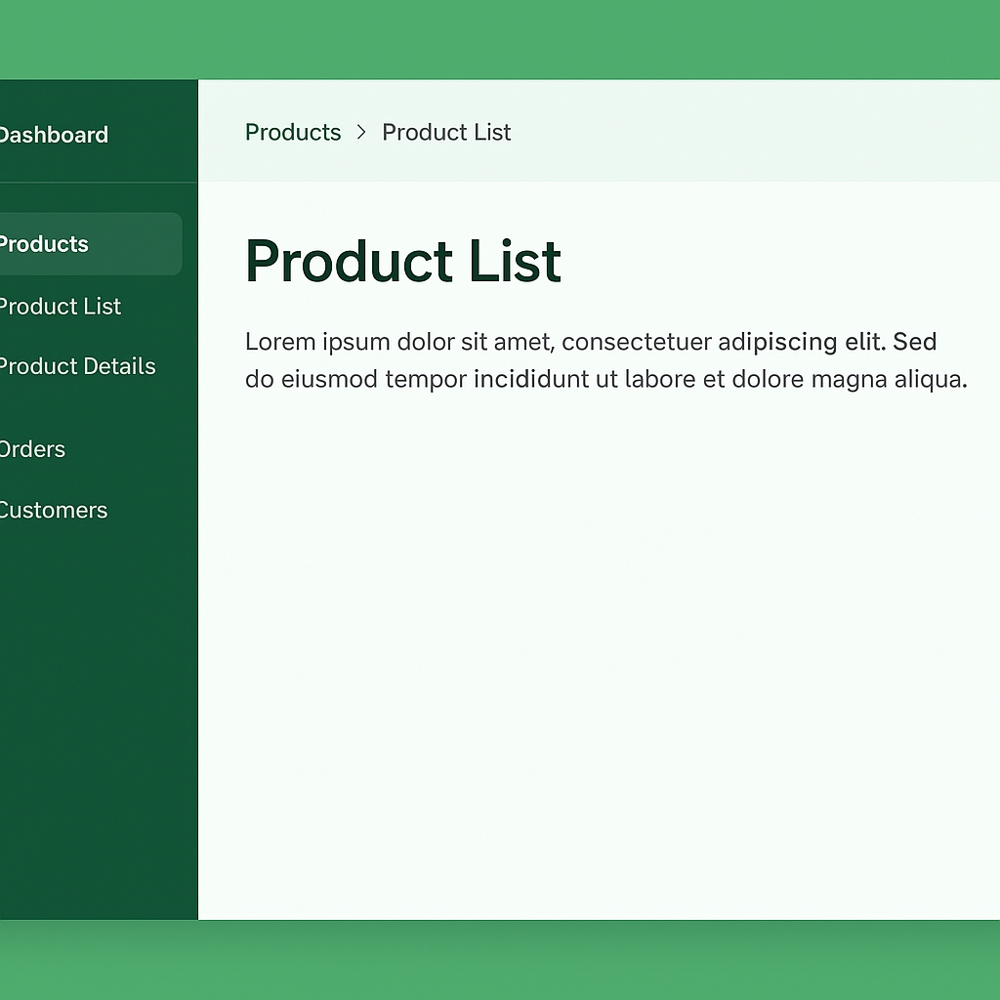

- [**手机本地调试**](#手机本地调试)
- [**函数**](#函数)
	- [函数参数设置默认值](#函数参数设置默认值)
	- [useCallBack无法根据依赖变量改变而调用内部函数](#useCallBack无法根据依赖变量改变而调用内部函数)
	- [useEffect间接调用函数](#useEffect间接调用函数)
- [**管理Node版本的NVM**](#管理Node版本的NVM)
- [**新建一个React项目**](#新建一个React项目)
- [**JavaScript陌生语法**](#JavaScript陌生语法)
	- [函数结构参数 method（value,({ typeSpecDic }) => {}）](#函数结构参数)
	- [类的内部方法、单例编码](#类的内部方法、单例编码)
		- [为什么这就是单例](#为什么这就是单例)
	- [组件模块导出](#组件模块导出)
	- [组件的事件回调传参单个Or多个](#组件的事件回调传参单个Or多个)
	- [数组为null,可选操作](#数组为null,可选操作)
	- [数组对象元素转换成map](#数组对象元素转换成map)
	- [解构赋值](#解构赋值)
	- [展开运算符，保留部分值](#展开运算符，保留部分值)
	- [数组reduce处理复合json数据](#数组reduce处理复合json数据)
 	- [复杂数据更新](#复杂数据更新)
	- [复杂数据合并](#复杂数据合并)
- [Flex布局](#Flex布局)
- [清理缓存导致的错误](#清理缓存导致的错误)
- [跨域造成无法请求解决](#跨域造成无法请求解决)
- [控制菜单展开和选中项](#控制菜单展开和选中项)
- [react入口文件](#react入口文件)
- [umi框架生成react入口文件](#umi框架生成react入口文件) 
	- [umijs生成首页](#umijs生成首页)
	- [入口文件中的app.tsx没有看到layout调用？](#入口文件中的app.tsx没有看到layout调用？)    
- [**阿里Antd框架-UI**](#阿里Antd框架-UI)
	- [ProLayout布局属性](#ProLayout布局属性)  
		- [全局主题配置](#全局主题配置) 
		- [Breadcrumb显示当前导航路径](#Breadcrumb显示当前导航路径)
	- [**Modal弹窗表格属性介绍**](#Modal弹窗表格属性介绍)
	- [Form表格使用](#Form表格使用)
		- [表单提交数据](#表单提交数据)
	- [ProTable列表拖拽排序](#ProTable列表拖拽排序)
		- [修改某一方按钮的点击状态](#修改某一方按钮的点击状态)
	- [列表Table](#列表Table)
		- [分页回调函数](#分页回调函数)
	- [Radio.Group单选按钮](#Radio.Group单选按钮)
	- [Select组件初步使用](#Select组件初步使用)
- [**网络**](#网络)
	- [接口里掺入参数](#接口里掺入参数)
- [**路由**](#路由)
	- [路径参数跳转](#路径参数跳转)
- [**CSS样式**](#CSS样式)
	- [模块化样式](#模块化样式)
	- [antd中Radio.Group组件无法修改样式](#antd中Radio.Group组件无法修改样式)
	- [字符串超出浮窗显示](#字符串超出浮窗显示)
	- [ts模块声明样式文件](#ts模块声明样式文件)
	- [overflow与阴影搭配](#overflow与阴影搭配)
- [案例](#案例)
	- [保留旧对象引用+合并新选择结果](#保留旧对象引用+合并新选择结果)
	- [基于主键skuId的数组对齐+数据源替换](#基于主键skuId的数组对齐+数据源替换)
	- [并发请求处理](#并发请求处理)
    - [Promise.all批处理网络请求](#Promise.all批处理网络请求)


<br/><br/><br/>

***
<br/>

># <h1 id="手机本地调试">[手机本地调试](./基础(II).md#手机本地调试)</h1>


<br/><br/><br/>

***
<br/>

> <h1 id="函数">函数</h1>


***
<br/><br/><br/>

># <h2 id="函数参数设置默认值">[函数参数设置默认值](./../JavaScript/基础(I).md#函数设置默认值)</h2>

```jsx
handleFilter = (filterKey, value, { isTime = false }) => {}

this.handleFilter('actionTypeFilter', e) 这样调用，为什么会报错
```


***
<br/><br/><br/>
> <h2 id="useCallBack无法根据依赖变量改变而调用内部函数">useCallBack无法根据依赖变量改变而调用内部函数</h2>

```js
[cloudProfitTime, setCloudProfitTime] = useState(90)

const handleSubmit = useCallback(
    (params = {}) => {
	 
	 const submitData = {
				spuFreezeDays: cloudProfitTime,
      };
      
  },[
  cloudProfitTime,
  saveData,
],)

// 按钮点击事件
const editClick = ({ isStartEdit, action = SubmitAction.CANCEL }) => {
		
	setCloudProfitTime(9)
	setIsEdit(isStartEdit);
	if (action == SubmitAction.SAVE) {
	  setSaveData(SubmitAction.SAVE);
	}
};
```
点击一个按钮执行`editClick`方法后，但是handleSubmit 并没有执行，怎么回事？

这是一个典型的 **React 状态更新异步 + useCallback 依赖关系误区**，[解决方案请看这里](./基础(I).md#根据依赖参数useCallBack无法调用内部函数)

***
<br/><br/><br/>
> <h2 id="useEffect间接调用函数">useEffect间接调用函数</h2>

```
 useEffect(() => {
    if (!visible || !merchantId || loadingSpuDetail) return;

		setLoadingSpuDetail(true);
		spuStrategyDetail({ merchantId }).then((res) => {
  
})}, [visible, merchantId]);  

const initTableData = useCallback(() =>{}, [visible, spuDetailData, initialData, merchantLevel, skuList, strategy]);
```
我想将**`fetchSpuStrategyDetail`**函数拿出来从**`useEffect`**中，然后我可以在另一个方法**`initTableData`** 中直接调用 **`fetchSpuStrategyDetail`** 函数吗？


<br/> 

**✅ 推荐写法**

```jsx
// 1️⃣ 定义 fetchSpuStrategyDetail
const fetchSpuStrategyDetail = useCallback(async () => {
  if (!merchantId) return;
  setLoadingSpuDetail(true);
  try {
    const res = await spuStrategyDetail({ merchantId });
    // 🚀 这里处理返回数据逻辑
    // setSpuDetailData(res.data);
  } catch (error) {
    console.error('fetchSpuStrategyDetail failed:', error);
  } finally {
    setLoadingSpuDetail(false);
  }
}, [merchantId]); // ✅ 只依赖 merchantId 即可


// 2️⃣ useEffect 中使用它
useEffect(() => {
  if (!visible || !merchantId || loadingSpuDetail) return;
  fetchSpuStrategyDetail();
}, [visible, merchantId, fetchSpuStrategyDetail, loadingSpuDetail]);


// 3️⃣ 在 initTableData 中也可以直接调用
const initTableData = useCallback(() => {
  console.log('🚀 初始化表格逻辑...');
  fetchSpuStrategyDetail(); // ✅ 可以直接调用
}, [fetchSpuStrategyDetail]);
```

---
<br/>

**💡 为什么这样写可行？**

- 1.**`fetchSpuStrategyDetail` 是稳定函数**
   因为它是用 `useCallback` 定义的，React 会保证它在依赖（`merchantId`）不变时引用也不变。
   所以 `useEffect`、`initTableData` 都可以安全复用。

- 2.**不会重复创建闭包或引发无限循环**
	* `useEffect` 的依赖中包括 `fetchSpuStrategyDetail`，但只在 `merchantId` 变时才变化；
	* 不会导致死循环。

3.**可在任何地方调用**
   比如：

```js
const handleRefreshClick = () => {
fetchSpuStrategyDetail();
};
```

✅ 直接复用，逻辑清晰。

<br/>


**⚠️ 注意点**

* `fetchSpuStrategyDetail` 内部如果使用了更多 state 或 props（例如 `setSpuDetailData`, `merchantLevel` 等），也要记得放进依赖数组；
* 如果 `spuStrategyDetail` 是一个来自外部模块的稳定函数（比如 API 调用），不用加进依赖；
* `setLoadingSpuDetail` 是 React 自带的 setter，不需要放依赖。

<br/>

**🧠 简单总结**

| 目标                                | 实现方式                   |
| --------------------------------- | ---------------------- |
| 想在多个地方使用 `fetchSpuStrategyDetail` | ✅ 用 `useCallback` 定义函数 |
| 想在 `useEffect` 和其他函数里共用           | ✅ 直接调用同一个回调            |
| 避免闭包/依赖混乱                         | ✅ 在依赖数组中准确声明使用到的变量     |


<br/><br/><br/>

***
<br/>

> <h1 id= "管理Node版本的NVM">管理Node版本的NVM</h1>

NVM（Node Version Manager）是一个用来**管理多个 Node.js 版本的工具**。它在前端开发、特别是用 React 编码时非常有用，原因如下：

---

## 🔧 NVM 是做什么的？

NVM 可以让你：

1. **安装多个 Node.js 版本**（比如 14、16、18、20……）；
2. **按项目或全局切换 Node.js 版本**；
3. 避免系统安装冲突，不需要使用 `sudo` 来装包；
4. 卸载和更新 Node.js 版本也变得简单；

---

## 🚀 为什么用 React 时建议用 NVM？

### 1. **React 项目依赖特定的 Node 版本**

一些 React 项目（特别是老项目或用某些工具链，如 Vite、Next.js、Create React App 等）可能**只支持某个范围内的 Node 版本**。
如果你直接用系统的 Node 版本，很可能会出现：

* npm/yarn 安装报错；
* 构建失败；
* 插件或依赖兼容性问题。

👉 有了 NVM，你就可以快速切换到兼容的版本来运行项目。

---

### 2. **不同项目用不同版本的 Node**

你可能有多个 React 项目，它们依赖不同版本的 Node，比如：

* 项目 A 要求 Node 16
* 项目 B 用的是 Node 20

用 NVM，进入某个项目目录时可以执行：

```bash
nvm use 16
```

甚至你可以在项目中放一个 `.nvmrc` 文件，里面写上需要的版本，比如：

```bash
16
```

然后运行：

```bash
nvm use
```

就会自动切换。

---

### 3. **开发环境更干净**

使用 NVM 安装 Node，不会影响系统默认环境，也不需要 `sudo` 权限，更安全。

---

## 🧪 总结一句话：

> **NVM 是前端开发必备工具之一，能帮你灵活地切换 Node.js 版本，确保 React 项目在正确的环境下运行。**

***
<br/><br/><br/>
> <h2 id="安装NVM">安装NVM</h2>

在 Mac 上使用 Homebrew 安装 NVM 非常简单。下面是详细的步骤：

---

## 🍺 使用 Homebrew 安装 NVM（Node Version Manager）

### ✅ 第 1 步：确认已安装 Homebrew

打开终端，输入：

```bash
brew --version
```

如果输出版本号，说明你已经安装了。如果没有，请先去 [https://brew.sh](https://brew.sh) 安装 Homebrew。

---

### ✅ 第 2 步：用 Brew 安装 NVM

```bash
brew install nvm
```

---

### ✅ 第 3 步：创建 NVM 的目录

NVM 需要一个目录来存储你安装的 Node.js 版本。可以用这个命令：

```bash
mkdir ~/.nvm
```

---

### ✅ 第 4 步：配置 shell（zsh 或 bash）

你需要在你的 shell 配置文件中加入以下内容（取决于你用的是 zsh 还是 bash）：

#### 对于 Zsh 用户（默认 macOS 用 zsh）：

```bash
echo 'export NVM_DIR="$HOME/.nvm"' >> ~/.zshrc
echo '[ -s "/opt/homebrew/opt/nvm/nvm.sh" ] && \. "/opt/homebrew/opt/nvm/nvm.sh"' >> ~/.zshrc
echo '[ -s "/opt/homebrew/opt/nvm/etc/bash_completion.d/nvm" ] && \. "/opt/homebrew/opt/nvm/etc/bash_completion.d/nvm"' >> ~/.zshrc
```

然后运行：

```bash
source ~/.zshrc
```


<br/>

**或者在`.bash_profile`中这样安装：**

~/.bash_profile 的完整内容（适用于 macOS M 系列，如 M1/M2/M3）：

```sh
# NVM 配置开始
export NVM_DIR="$HOME/.nvm"
[ -s "/opt/homebrew/opt/nvm/nvm.sh" ] && \. "/opt/homebrew/opt/nvm/nvm.sh"  # 加载 nvm 主程序
[ -s "/opt/homebrew/opt/nvm/etc/bash_completion.d/nvm" ] && \. "/opt/homebrew/opt/nvm/etc/bash_completion.d/nvm"  # 可选：启用自动补全
# NVM 配置结束
```


<br/><br/>

#### 如果你用的是 Bash：

把上面那几行加到 `~/.bash_profile` 或 `~/.bashrc`，然后执行 `source ~/.bash_profile`

---

### ✅ 第 5 步：验证 NVM 是否安装成功

```bash
nvm --version
```

如果你看到版本号，说明安装成功！

---

### ✅ 第 6 步：使用 NVM 安装 Node.js

```bash
nvm install 18
```

然后切换使用它：

```bash
nvm use 18
```

设置为默认版本：

```bash
nvm alias default 18
```


<br/><br/><br/>

***
<br/>

> <h1 id= "新建一个React项目">新建一个React项目</h1>

安装好 Node.js 和 NVM 后，你就可以非常方便地创建并启动一个 React 项目了。下面是 **从零开始用 `npm` 创建并启动 React 应用的完整详细步骤**：

---

## ✅ 前提：你已经完成了这些

* ✅ 已经通过 `nvm install` 安装了 Node.js（建议 Node 版本 ≥ 18）
* ✅ `npm` 已随 Node 一起安装（可通过 `npm -v` 检查）

---

## 🚀 创建并启动 React 项目的完整步骤

### 📦 第 1 步：创建 React 项目

使用官方推荐的脚手架工具 `create-react-app`（一次性生成完整项目结构）：

```bash
npx create-react-app my-app
```

解释：

* `npx` 是 `npm` 附带的一个执行器，会自动下载并运行最新的 `create-react-app`；
* `my-app` 是你的项目文件夹名（你可以改成任何名字）；
* 它会自动下载依赖、创建文件夹、配置项目等。

👉 如果你看到过程中有提示 `[✔] Success! Created my-app...`，说明创建成功。

---

### 📁 第 2 步：进入项目目录

```bash
cd my-app
```

---

### 🚀 第 3 步：启动开发服务器

```bash
# 安装一些依赖
npm install

#启动服务器
npm start
```

这条命令会：

* 启动 React 的开发服务器（基于 Webpack）；
* 打开浏览器，访问 `http://localhost:3000/`；
* 实时热更新你写的代码。

---

### 🔁 项目目录结构大概长这样：

```bash
my-app/
├── node_modules/        # 所有依赖包
├── public/              # 静态资源目录
├── src/                 # 你的源码目录（写 React 的地方）
│   ├── App.js           # 默认首页组件
│   ├── index.js         # 应用入口
├── .gitignore
├── package.json         # 项目信息和依赖列表
├── README.md
```

---

## 🔨 开发建议

* 你可以编辑 `src/App.js` 来修改页面内容；
* 保存后浏览器会自动刷新；
* 你可以用任意编辑器（如 VS Code）打开这个目录开始开发：

```bash
code .
```

---

## ✅ 常用命令汇总

| 命令              | 作用               |
| --------------- | ---------------- |
| `npm start`     | 启动开发服务器          |
| `npm run build` | 打包项目用于生产环境       |
| `npm test`      | 运行测试             |
| `npm install`   | 安装依赖（比如团队项目拉下来后） |

---

是否需要我也演示一下用 Vite 创建更轻量更快的 React 项目？（更现代、更推荐）

<br/><br/><br/>

***
<br/>

> <h1 id="JavaScript陌生语法">JavaScript陌生语法</h1>

***
<br/><br/><br/>
> <h2 id="函数结构参数">函数结构参数 method（value,({ typeSpecDic }) => {}）</h2>

[详解请看这里](./../JavaScript/基础(I).md#函数结构参数)


***
<br/><br/><br/>
> <h2 id="类的内部方法、单例编码">类的内部方法、单例编码</h2>

[**请看这里**](./React/基础(II).md#类的方法)

***
<br/><br/><br/>
> <h3 id="为什么这就是单例">为什么这就是单例</h3>

[**单例请看这里**](./React/基础(II).md#单例类)

***
<br/><br/><br/>
> <h2 id="组件模块导出">组件模块导出</h2>


将一个组件导出，[**请看这里**](./React/基础(II).md#组件模块化导出)


***
<br/><br/><br/>
> <h2 id="组件的事件回调传参单个Or多个">组件的事件回调传参单个Or多个</h2>

[**请看这里**](./基础(II).md#组件触发函数传递单个or多个参数)


***
<br/><br/><br/>
> <h2 id="数组为null,可选操作">数组为null,可选操作</h2>

React中有：

```jsx
state = { timeFilter: null, //时间过滤}
```

若是`timeFilter`是数组，然后取`timeFilter[0]`会报错，如何使用可选取出数组中的元素。[**请看这里**](./../JavaScript/基础(I).md#数组为null，安全取元素)

***
<br/><br/><br/>
> <h2 id="数组对象元素转换成map">数组对象元素转换成map</h2>

有这样的场景：

```jsx
const data = [
    {
        "operateModule": "生产管理",
        "operateDescList": [
            "分配设备",
            "XXXX"
        ]
    }
]
```


我想将这个`data`数组处理成 一个类似`map`，`key`是每个元素里的 `operateModule`，其对应的值为`operateDescList`，怎么做？[请看这里](./../JavaScript/基础(I).md#数组对象转换成map类型)


***
<br/><br/><br/>
> <h2 id="解构赋值">解构赋值</h2>

**React中有：**

```js
const { RangePicker } = DatePicker; 
```

表示啥意思？给组件起别名吗？

这种语法是 **ES6 的解构赋值语法**

<br/>

* `DatePicker` 是一个对象（其实是 antd 导出的 `DatePicker` 组件对象），里面不仅有默认的 `DatePicker` 组件本身，还挂载了一些子组件，例如：

```js
DatePicker.RangePicker
DatePicker.MonthPicker
DatePicker.WeekPicker
```

* 所以 `const { RangePicker } = DatePicker;` 相当于：

```js
const RangePicker = DatePicker.RangePicker;
```

这样写只是为了方便使用，不是给组件起别名，而是**把对象里的子属性解构出来赋值给变量**。

> 用法示例：

```jsx
import { DatePicker } from 'antd';

const { RangePicker } = DatePicker;

function Demo() {
  return (
    <div>
      <DatePicker />   {/* 单个日期选择 */}
      <RangePicker />  {/* 时间范围选择 */}
    </div>
  );
}
```


<br/><br/><br/>

***
<br/>

> <h1 id="展开运算符，保留部分值">展开运算符，保留部分值</h1>

```js
 const [cloudProfitTime, setCloudProfitTime] = useState({ old: 90, new: 90 });
```

为什么

```js
setCloudProfitTime(...cloudProfitTime, { new: value });
```

会报错，咋回事？

<br/>

**我写的是：**

```js
setCloudProfitTime(...cloudProfitTime, { new: value });
```

这其实是语法错误的写法，因为：

1. **`setCloudProfitTime` 只接收一个参数（新的 state 值）**；
2. 你却在这里使用了「展开运算符」`...cloudProfitTime`，但它本身是一个对象，不是数组；
3. 你还传了两个参数（展开的 + 新对象），所以 React 报错。

<br/>

**正确写法：你想“保留旧值，更新部分字段”**

在 React 中，更新对象状态时要**创建一个新的对象副本**：

```js
setCloudProfitTime({
  ...cloudProfitTime,  // 保留原来的所有属性
  new: value,          // 覆盖 new 字段
});
```

✅ 这样才是合法写法。

<br/>

**完整例子：**

```jsx
const [cloudProfitTime, setCloudProfitTime] = useState({ old: 90, new: 90 });

const onChangeValue = (value) => {
  setCloudProfitTime({
    ...cloudProfitTime,
    new: value,
  });
};
```

<br/>

**推荐写法（防止闭包旧值）**

在 React 的 state 更新中，最好用函数式更新：

```js
setCloudProfitTime(prev => ({
  ...prev,
  new: value,
}));
```

✅ 优点：

* 不依赖外层的闭包；
* 在异步或频繁更新时保证拿到最新的状态。


***
<br/><br/><br/>
> <h2 id="数组reduce处理复合json数据">数组reduce处理复合json数据</h2>

有一段这样的JSON数据如下：

```json
[
  {
    "categoryCode": "led",
    "categoryTitle": "LED灯",
    "items": [
      {
        "categoryCode": "led",
        "description": "白光灯，1:低电平有效 0:高电平有效",
        "code": "white_light_active_low",
        "enabled": true,
        "valueType": "enum",
        "defaultValue": null,
        "minValue": 0,
        "maxValue": 0,
        "values": [
          {
            "name": "高电平有效",
            "value": 0
          },
          {
            "name": "低电平有效",
            "value": 1
          }
        ],
        "sort": 10
      },
      {
        "categoryCode": "led",
        "description": "红外灯，1:低电平有效 0:高电平有效",
        "code": "infrared_light_active_low",
        "enabled": true,
        "valueType": "enum",
        "defaultValue": null,
        "minValue": 0,
        "maxValue": 0,
        "values": [
          {
            "name": "高电平有效",
            "value": 0
          },
          {
            "name": "低电平有效",
            "value": 1
          }
        ],
        "sort": 20
      }
    ]
  },
  {
    "categoryCode": "motor",
    "categoryTitle": "电机配置",
    "items": [
      {
        "categoryCode": "motor",
        "description": "云台水平可转到步数",
        "code": "h_ptz_max_step",
        "enabled": true,
        "valueType": "int",
        "defaultValue": null,
        "minValue": 0,
        "maxValue": 0,
        "values": [],
        "sort": 110
      },
      {
        "categoryCode": "motor",
        "description": "云台垂直可转到步数",
        "code": "v_ptz_max_step",
        "enabled": true,
        "valueType": "int",
        "defaultValue": null,
        "minValue": 0,
        "maxValue": 0,
        "values": [],
        "sort": 120
      }
    ]
  },
  {
    "categoryCode": "other",
    "categoryTitle": "其他",
    "items": [
      {
        "categoryCode": "other",
        "description": "摄像头个数(0~10)",
        "code": "sensor_num",
        "enabled": true,
        "valueType": "int",
        "defaultValue": null,
        "minValue": 0,
        "maxValue": 10,
        "values": [],
        "sort": 510
      }
    ]
  }
]
```

<br/>

转化成如下结构：

```json
TF卡JSON数据：

[
  {
    "categoryCode": "led",
    "categoryTitle": "LED灯",
    "items": [
      {
        "categoryCode": "led",
        "description": "白光灯，1:低电平有效 0:高电平有效",
        "code": "white_light_active_low",
        "enabled": true,
        "valueType": "enum",
        "defaultValue": null,
        "minValue": 0,
        "maxValue": 0,
        "values": [
          {
            "name": "高电平有效",
            "value": 0
          },
          {
            "name": "低电平有效",
            "value": 1
          }
        ],
        "sort": 10
      },
      {
        "categoryCode": "led",
        "description": "红外灯，1:低电平有效 0:高电平有效",
        "code": "infrared_light_active_low",
        "enabled": true,
        "valueType": "enum",
        "defaultValue": null,
        "minValue": 0,
        "maxValue": 0,
        "values": [
          {
            "name": "高电平有效",
            "value": 0
          },
          {
            "name": "低电平有效",
            "value": 1
          }
        ],
        "sort": 20
      }
    ]
  },
  
  ˙˙˙˙˙˙˙
  ˙˙˙˙˙
  .
]
```

***
<br/>

这是一个典型的「嵌套数组扁平化 + 自定义键名映射」需求。

**我的结构是：**

```js
[
  {
    categoryCode,
    categoryTitle,
    items: [ {...}, {...}, ... ]
  },
  ...
]
```

<br/>

想得到一个对象结构：

```js
{
  whiteLight: {...},
  redLight: {...},
  ...
}
```

---
<br/>

 **完整可运行的 JS 实现示例:**

```js
const data = [ /* 你提供的 JSON 数组 */ ];

// 1️⃣ 定义一个映射表，把 code 对应成想要的 key
const codeMap = {
  white_light_active_low: 'whiteLight',
  infrared_light_active_low: 'redLight',
  v_ptz_max_step: 'ptz_v_stepNum',
  sensor_num: 'cameraNum',
};

// 2️⃣ 遍历数据结构，把所有 items 扁平化并映射到新对象
const result = data.reduce((acc, category) => {
  category.items.forEach(item => {
    const key = codeMap[item.code] || item.code; // 若无映射则使用原 code
    // 深拷贝后把 values 的 name 改成 label（如果存在）
    const newItem = {
      ...item,
      values: item.values.map(v => ({
        label: v.name || v.label,
        value: v.value
      }))
    };
    acc[key] = newItem;
  });
  return acc;
}, {});

console.log(result);
```

<br/>

 **输出结果示例（部分）**

```js
{
  whiteLight: {
    categoryCode: 'led',
    description: '白光灯，1:低电平有效 0:高电平有效',
    code: 'white_light_active_low',
    enabled: true,
    valueType: 'enum',
    defaultValue: null,
    minValue: 0,
    maxValue: 0,
    values: [
      { label: '高电平有效', value: 0 },
      { label: '低电平有效', value: 1 }
    ],
    sort: 10
  },
  redLight: {
    categoryCode: 'led',
    description: '红外灯，1:低电平有效 0:高电平有效',
    code: 'infrared_light_active_low',
    ...
  },
  ...
}
```

<br/>

**✅ 如果你不需要手动写 `codeMap`**

可以让键名自动来自 `code` 本身（但这会比较长）：

```js
const result = Object.fromEntries(
  data.flatMap(category =>
    category.items.map(item => [
      item.code,
      {
        ...item,
        values: item.values.map(v => ({ label: v.name || v.label, value: v.value }))
      }
    ])
  )
);
```

输出键名会是：

```js
{
  white_light_active_low: {...},
  infrared_light_active_low: {...},
  ...
}
```


上述中的[**`reduce`**](./../JavaScript/基础(I).md#reduce的扁平化)方法如何使用呢？

***
<br/>

**参数回填组合：**

```json
{
    "whiteLight": 1,
    "redLight": 1,
    "ptz_v_stepNum": "3",
    "cameraNum": "7"
}
```

<br/>

组合成这样：

```json

[
  {
    "code": "white_light_active_low",
    "value": 1
  },
  {
      "code": "infrared_light_active_low",
      "value": 1
  },
  {
    "code": "v_ptz_max_step",
    "value": "3"
  },
  {
    "code": "sensor_num",
    "value": "7"
  }
]
```


<br/>

这里可以用一行 `Object.entries()` + `find()` 或 `reduce()` 轻松完成。
下面是完整、准确、推荐的写法 👇

---

### ✅ 完整可运行代码

```js
const codeMap = {
    "whiteLight": "white_light_active_low",
    "redLight": "infrared_light_active_low",
    "ptz_v_stepNum": "v_ptz_max_step",
    "cameraNum": "sensor_num"
}
const source = {
    "whiteLight": 1,
    "redLight": 1,
    "ptz_v_stepNum": "3",
    "cameraNum": "7"
};

// 反转映射，方便从 value 找 key
const reverseMap = Object.entries(codeMap).reduce((acc, [k, v]) => {
  acc[v] = k;
  return acc;
}, {});

// 生成 items 数组
const items = Object.entries(source).map(([key, value]) => ({
  code: reverseMap[key] || key, // 没在映射表中的保持原样
  value,
}));

console.log(items);
```

<br/>

**输出**：

```js
[
  {
    "code": "white_light_active_low",
    "value": 1
  },
  {
      "code": "infrared_light_active_low",
      "value": 1
  },
  {
    "code": "v_ptz_max_step",
    "value": "3"
  },
  {
    "code": "sensor_num",
    "value": "7"
  }
]
```

---
<br/>

**✅ 说明**

* `Object.entries()` 将对象转成 `[key, value]` 数组，方便遍历；
* `reduce()` 用于生成反向映射表；
* 最后通过 `map()` 把原始对象转为你想要的 `{ code, value }` 数组；
* 若某个字段不在 `codeMap` 里，则保持原键。


<br/><br/><br/>
># <h2 id="复杂数据更新">复杂数据更新</h2>

若这个pcbaList是这种数据类型的一个如下：
```js
{
  activityName: { value: activityModel?.activityName ?? '-', isLegal: true },
  activityTime: { value: activityModel?.activityTime ?? '-', isLegal: true },
  publishStatus: { value: activityModel?.publishStatus ?? false, isLegal: true },
  pcbaList: activityModel?.pcbaList ?? [],
  chooseMerchant: { value: {}, isLegal: true },
  pcbaList: { value: activityModel.pcbaList, isLegal: true },
  // totalSubsidyQuantity: activityModel?.totalSubsidyQuantity ?? 0,
}
```
**上述修改其实是  pcbaList: { value: activityModel.pcbaList, isLegal: true },中的value，那我如何做?**

<br/><br/>

**数据结构是：**

```js
pcbaList: { 
  value: activityModel.pcbaList, 
  isLegal: true 
}
```

要更新的其实是 **pcbaList.value 里面的数组中的某个对象**。

---

<br/>
**假设你要修改 `productIdentifier: 'imilab.ipc.11309.pmc1'` 的 `activeSubsidy`**

```js
updatePcbaActiveSubsidy = (targetId, newSubsidy) => {
  this.setState(prevState => {
    const { pcbaList } = prevState.activityDatas;

    const newPcbaValue = pcbaList.value.map(item => {
      if (item.productIdentifier === targetId) {
        return {
          ...item,
          activeSubsidy: newSubsidy
        };
      }
      return item;
    });

    return {
      activityDatas: {
        ...prevState.activityDatas,
        pcbaList: {
          ...pcbaList,
          value: newPcbaValue
        }
      }
    };
  });
};
```
<br/>

```js
this.updatePcbaActiveSubsidy('imilab.ipc.11309.pmc1', 888);
```

<br/>

**state 大概像这样：**

```js
activityDatas: {
  activityName: { value: 'xxx', isLegal: true },
  activityTime: { value: 'xxx', isLegal: true },
  pcbaList: { 
    value: [ {…}, {…}, {…} ], 
    isLegal: true 
  },
  ...
}
```

要更新：

* 最外层的 activityDatas
* 其中的 pcbaList
* 其中的 value（数组）
* 数组中某一个对象

所以结构是：

```sh
activityDatas
  └── pcbaList
        └── value（数组）
              └── item (你的 PCBA 数据对象)
```


<br/><br/>

```js
updatePcbaItem = (productIdentifier, patchObj) => {
  this.setState(prevState => {
    const pcbaList = prevState.activityDatas.pcbaList;

    const newValue = pcbaList.value.map(item =>
      item.productIdentifier === productIdentifier
        ? { ...item, ...patchObj }
        : item
    );

    return {
      activityDatas: {
        ...prevState.activityDatas,
        pcbaList: { ...pcbaList, value: newValue }
      }
    };
  }, () => {
    // ★★★ 这里就是最新的 state ★★★
    console.log('最新的 pcbaList:', this.state.activityDatas.pcbaList.value);
  });
};

```

<br/><br/><br/>

># <h2 id="复杂数据合并">复杂数据合并</h2>

若是对于res中的数据在如下数据：

```js


const oldValue = [
    {
        "pcbaName": "AA40",
        "productIdentifier": "imilab.ipc.116.pmc1",
        "productType": "智能摄像机",
        "materialNumber": "10.19.33.6.1",
        "costPrice": "100.0",
        "currentPrice": "50.0",
        "activeSubsidy": 1
    },
    {
        "pcbaName": "AA30",
        "productIdentifier": "imilab.ipc.113.pmc1",
        "productType": "智能摄像机",
        "materialNumber": "10.99.33.6.1",
        "costPrice": "100.0",
        "currentPrice": "50.0"
    }
]
```
**需求：按 productIdentifier 进行合并**：

* 如果 `oldValue` 中存在同样的 `productIdentifier` → **使用 oldValue 的整个对象（包括 activeSubsidy 等字段）**
* 如果不存在 → **使用 res 的原对象**
* 最终得到一个新的数组。

---
<br/>

**✅ 最终合并代码**

```js
const oldMap = Object.fromEntries(
  oldValue.map(item => [item.productIdentifier, item])
);

const finalList = res.map(item =>
  oldMap[item.productIdentifier] || item
);
```

<br/>

**🔍 输出解释**

`finalList` 会是：

* 如果某个 productIdentifier 在 oldValue 中出现 → oldValue 的数据覆盖 res
* 否则保留 res 中原始的数据

---
<br/>

**步骤 1：把 oldValue 转成 Map，提高查找性能（O(1)）**

```js
const oldMap = Object.fromEntries(
  oldValue.map(item => [item.productIdentifier, item])
);
```
<br/>

得到：

```js
{
  "imilab.ipc.116.pmc1": { ... oldValue 对象 },
  "imilab.ipc.113.pmc1": { ... oldValue 对象 }
}
```

<br/>

**步骤 2：遍历 res 并决定用哪个对象**

```js
const finalList = res.map(item =>
  oldMap[item.productIdentifier] || item
);
```

* 如果 `oldMap[productIdentifier]` 存在 → 用 oldValue 的对象
* 不存在 → 用 res 的对象

<br/>

**完整示例（可直接运行）**

```js
const res = [
  {
    pcbaName: 'AA30',
    productIdentifier: 'imilab.ipc.113.pmc1',
    productType: '智能摄像机',
    materialNumber: '10.99.33.6.1',
    costPrice: '100.0',
    currentPrice: '50.0'
  },
  {
    pcbaName: 'AA40',
    productIdentifier: 'imilab.ipc.116.pmc1',
    productType: '智能摄像机',
    materialNumber: '10.19.33.6.1',
    costPrice: '100.0',
    currentPrice: '50.0'
  }
];

const oldValue = [
  {
    pcbaName: 'AA40',
    productIdentifier: 'imilab.ipc.116.pmc1',
    productType: '智能摄像机',
    materialNumber: '10.19.33.6.1',
    costPrice: '100.0',
    currentPrice: '50.0',
    activeSubsidy: 1
  },
  {
    pcbaName: 'AA30',
    productIdentifier: 'imilab.ipc.113.pmc1',
    productType: '智能摄像机',
    materialNumber: '10.99.33.6.1',
    costPrice: '100.0',
    currentPrice: '50.0'
  }
];

const oldMap = Object.fromEntries(
  oldValue.map(item => [item.productIdentifier, item])
);

const finalList = res.map(item =>
  oldMap[item.productIdentifier] || item
);

console.log(finalList);
```

<br/>

**最终结果（示例）**

因为 oldValue 中两个 productIdentifier 都存在，最终结果使用了 oldValue 的两个对象，包括 activeSubsidy。


<br/><br/><br/>

***
<br/>

># <h1 id="Flex布局">[Flex布局](https://cloud.tencent.com/developer/article/1620305)</h1>

横轴和纵轴布局通常指的是使用 **Flexbox** 或 **Grid** 布局实现的一维（横向或纵向排列）或二维（同时控制横轴和纵轴）布局。最常用的两种方式是 **Flexbox** 布局和 **CSS Grid** 布局。

**1.Flexbox 布局**

**Flexbox** 布局是一个一维的布局模型，它可以在横向或纵向上排列子元素。通过设置 `flex-direction` 来控制横轴（主轴）和纵轴（交叉轴）的方向。`flex-direction` 可以是以下几种值：

* `row`（默认值）：元素按横向（从左到右）排列。
* `column`：元素按纵向（从上到下）排列。
* `row-reverse`：元素按横向（从右到左）排列。
* `column-reverse`：元素按纵向（从下到上）排列。

<br/>

**Flexbox 的基础属性**：

* `justify-content`: 控制主轴（横轴方向）上的对齐方式。
* `align-items`: 控制交叉轴（纵轴方向）上的对齐方式。
* `flex-direction`: 设置主轴方向。
* `flex-wrap`: 控制子元素是否换行。

<br/>

**示例：横轴和纵轴布局（Flexbox）**

```jsx
import React from 'react';

class FlexboxExample extends React.Component {
  render() {
    return (
      <div style={{
        display: 'flex',
        flexDirection: 'row', // 横轴布局
        justifyContent: 'space-between', // 横轴上的项目之间有间距
        alignItems: 'center', // 纵轴居中对齐
        height: '200px',
        border: '1px solid black'
      }}>
        <div style={{ width: '100px', height: '50px', backgroundColor: 'lightblue' }}>Item 1</div>
        <div style={{ width: '100px', height: '50px', backgroundColor: 'lightgreen' }}>Item 2</div>
        <div style={{ width: '100px', height: '50px', backgroundColor: 'lightcoral' }}>Item 3</div>
      </div>
    );
  }
}

export default FlexboxExample;
```

<br/>

**解释：**

* `display: 'flex'`：启用 Flexbox 布局。
* `flexDirection: 'row'`：设置主轴为横轴，子项将按横向排列。
* `justifyContent: 'space-between'`：设置横轴上的项目之间的间距均匀分布。
* `alignItems: 'center'`：设置纵轴（交叉轴）上的项目居中对齐。

<br/>

**2.CSS Grid 布局**

**Grid 布局** 是一个二维的布局模型，能够同时控制横轴和纵轴上的元素排列。通过设置 `grid-template-columns` 和 `grid-template-rows` 来定义网格的列和行。

<br/>

**Grid 的基本属性**：

* `grid-template-columns`: 定义网格列的数量和宽度。
* `grid-template-rows`: 定义网格行的数量和高度。
* `grid-gap`: 定义行与列之间的间距。

<br/>

**示例：横轴和纵轴布局（CSS Grid）**

```jsx
import React from 'react';

class GridExample extends React.Component {
  render() {
    return (
      <div style={{
        display: 'grid',
        gridTemplateColumns: 'repeat(3, 1fr)', // 定义三列，每列宽度相等
        gridTemplateRows: '100px 100px', // 定义两行，每行100px高
        gap: '10px', // 列和行之间的间距
        border: '1px solid black'
      }}>
        <div style={{ backgroundColor: 'lightblue' }}>Item 1</div>
        <div style={{ backgroundColor: 'lightgreen' }}>Item 2</div>
        <div style={{ backgroundColor: 'lightcoral' }}>Item 3</div>
        <div style={{ backgroundColor: 'lightyellow' }}>Item 4</div>
        <div style={{ backgroundColor: 'lightpink' }}>Item 5</div>
        <div style={{ backgroundColor: 'lightgray' }}>Item 6</div>
      </div>
    );
  }
}

export default GridExample;
```

<br/>

**解释：**

* `display: 'grid'`：启用 Grid 布局。
* `gridTemplateColumns: 'repeat(3, 1fr)'`：设置三列，每列宽度相等（`1fr` 表示等分的宽度）。
* `gridTemplateRows: '100px 100px'`：设置两行，每行的高度为 100px。
* `gap: '10px'`：设置行和列之间的间隔。

<br/>

**总结**

* **Flexbox**：适用于一维布局（横轴或纵轴），可以控制单行或单列的排列，常用于处理简单的排列，如水平或垂直居中。
* **Grid**：适用于二维布局，能够同时控制横轴和纵轴上的元素布局，适合复杂的布局，如网格布局、杂志样式的内容。


<br/><br/><br/>

***
<br/>

> <h1 id="清理缓存导致的错误">清理缓存导致的错误</h1>

**1.删除构建缓存**

```bash
rm -rf node_modules/.cache
```

<br/>

**2.重启开发服务器**

先关闭当前运行的 `npm run dev` 或 `npm start`，然后重新启动：

```bash
npm run start
# 或者
npm run dev
```

<br/>

**3.清理浏览器缓存（如果有问题出现在浏览器）**

可以尝试强制刷新页面：

* Windows: `Ctrl + Shift + R`
* Mac: `Cmd + Shift + R`

<br/>

**4.确保编辑器也没缓存语法分析错误**

有些编辑器（如 VS Code）可能自己缓存了 ESLint 报错提示，重启编辑器可以排除这个问题。

<br/>

**5.检查 ESLint 缓存（如果项目用了 ESLint）**

运行：

```bash
npx eslint . --cache --fix
```


<br/><br/><br/>

***
<br/>

> <h1 id="跨域造成无法请求解决">跨域造成无法请求解决</h1>

在项目目录中的`package.json中添加‌`

```json
devDependencies": {
    "http-proxy-middleware": "^3.0.5"
  }
```

<br/><br/>

然后新建`setup.js`在根目录:

```
const { createProxyMiddleware } = require('http-proxy-middleware');
 
module.exports = function(app) {
  app.use(
    '/api',
    createProxyMiddleware({
      target: 'https://itango.tencent.com/out/itango/myip',
      changeOrigin: true,
    })
  );

	app.use(
	    '/api1',
	    createProxyMiddleware({
	      target: 'https://itango.tencent.com/out/itango/myip1',
	      changeOrigin: true,
	    })
	  );
};
```

<br/>

然后在`httpManager.js`中编码:

```
class httpManager {
  async get(url) {
    try {
      const response = await fetch(url);
      if (!response.ok) throw new Error("Network response was not ok");
      const data = await response.json(); // 如果返回的是 JSON
      return data;
    } catch (error) {
      console.error("GET 请求出错:", error);
      throw error;
    }
  }
}

const HttpManagerInstance = new httpManager();
export default HttpManagerInstance;
```

然后在需要的地方调用即可:

```
async fetchIP() {
    try {
      const data = await HttpManager1.get(
        "/api"
      );
      this.setState({ ipData: data });
    } catch (error) {
      this.setState({ error: "获取 IP 失败" });
    }
  }
```


<br/><br/><br/>

***
<br/>
> <h1 id="控制菜单展开和选中项">控制菜单展开和选中项</h1>

```js
const location = useLocation();
const queryParams = new URLSearchParams(location.search);
const [openKeys, setOpenKeys] = useState([])
// 特殊菜单指定菜单选中
const specialMenu: { [key: string]: string } = {
'/product/argusProductNetwork': '/product',}
```

&emsp; 这段 React 代码，主要用于**控制菜单展开和选中项**。

<br/>

**✅ 1. `const location = useLocation();`**

这是来自 `react-router-dom` 的 hook，用来获取**当前路由信息**。

```ts
import { useLocation } from 'react-router-dom';
```


👇 它返回的是一个 location 对象，类似这样：

```ts
{
  pathname: '/product/argusProductNetwork',
  search: '?type=detail&id=123',
  hash: '',
  state: null,
  key: 'abc123'
}
```

你可以理解为“当前页面的完整 URL 信息”。

<br/>

**✅ 2. `const queryParams = new URLSearchParams(location.search);`**

这句用原生 `URLSearchParams` 来解析 **查询参数**（`?xxx=yyy`）。

```ts
const queryParams = new URLSearchParams('?type=detail&id=123');
console.log(queryParams.get('type')); // "detail"
console.log(queryParams.get('id'));   // "123"
```

在实际页面中，如果 URL 是：

```
https://example.com/product/argusProductNetwork?type=detail&id=123
```

那么 `location.search` 是 `?type=detail&id=123`，这个代码就能获取参数中的内容。

<br/>

**✅ 3. `const [openKeys, setOpenKeys] = useState([])`**

这是 React 的 `useState` 用法，用来保存**当前展开的菜单项 key 数组**。

```ts
const [openKeys, setOpenKeys] = useState<string[]>([]);
```

* `openKeys` 表示“菜单展开的 key”（如 `/product`）
* `setOpenKeys` 是用于修改这个状态的方法

比如用在 Ant Design 的 `<Menu>` 组件中：

```jsx
<Menu openKeys={openKeys} onOpenChange={setOpenKeys} />
```

用户展开哪个菜单，就更新 `openKeys`。

<br/>

**✅ 4. `const specialMenu: { [key: string]: string } = { ... }`**

定义一个**特殊菜单项的映射表**，主要用于处理“子页面选中时，强制让父菜单也展开”。

```ts
const specialMenu: { [key: string]: string } = {
  '/product/argusProductNetwork': '/product',
};
```

* 意思是：如果当前路径是 `/product/argusProductNetwork`，那它实际归属的主菜单是 `/product`
* 因为很多时候路由是多级的，菜单只渲染一级或两级，但你需要根据子页面反推出父菜单


***
<br/>

**✅ 举个完整应用场景：**
当前页面路径是 `/product/argusProductNetwork`，但这个页面 **并不在菜单中有对应项**，所以你需要手动告诉菜单“当前路径属于 `/product` 菜单”。

**示例伪代码（完整逻辑可能长这样）：**

```tsx
useEffect(() => {
  const path = location.pathname;
  const rootPath = specialMenu[path] || path.split('/')[1]; // 获取应该展开的菜单
  setOpenKeys([rootPath]);
}, [location.pathname]);
```

<br/>

**✅ 可视化理解**

```text
实际页面路径: /product/argusProductNetwork

菜单结构:
- /product
  - /product/list
  - /product/create

你要做的是：
➡️ 当路径为 /product/argusProductNetwork 时
➡️ 手动设置 openKeys = ['/product']
```


使用[Ant Design 的 <Menu /> 组件做侧边栏菜单](./AntDesign.md#Menu组件做侧边栏菜单)


<br/><br/><br/>

***
<br/>

> <h1 id="umi框架生成react入口文件"> umi框架生成react入口文件 </h1>


 **✅ 一、React 入口文件一定是 `App.js` 吗？**

**不是。**

React 的“入口文件”可以是任何文件名，比如：

* `App.js`
* `App.tsx`
* `Main.tsx`
* `Root.tsx`

关键不在于文件名，而在于这个文件被谁引用。

<br/>

**✅ 真实的 React 启动流程是：**

通常在 `index.tsx` 或 `main.tsx` 中，像这样：

```tsx
import React from 'react';
import ReactDOM from 'react-dom/client';
import App from './App';

ReactDOM.createRoot(document.getElementById('root')!).render(<App />);
```

* `App` 是你自己命名的主组件，它叫什么都行（不必叫 `App.js`）。
* 如果你用的是 **TypeScript 项目**，文件后缀就是 `.tsx` 而不是 `.js`。

所以你的项目用的是 `app.tsx` 是完全正常的，只是文件名不同而已。

---
<br/>

**✅ 二、那这个 `export const layout: RunTimeLayoutConfig = (...)` 是什么东西？**

这不是 React 标准用法，是 **UmiJS + Ant Design Pro 框架的特有扩展功能**，也叫：

> **运行时配置（Runtime Configuration）**

它允许你在运行时动态配置页面 Layout，比如：

* 是否显示侧边栏
* 用户信息如何获取
* 菜单如何渲染
* 页面标题、权限控制等

<br/>

 **✅ 使用位置**

通常写在文件：`src/app.tsx` 或 `src/app.ts` 中。

这个文件不是 React 入口组件，而是 umi 框架**自动加载的运行时配置文件**。

<br/>

 ✅ 示例代码解读

```tsx
import { RunTimeLayoutConfig } from '@umijs/max';

export const layout: RunTimeLayoutConfig = ({ initialState, setInitialState }) => {
  return {
    title: '我的后台系统',
    layout: 'mix',
    contentWidth: 'Fluid',
    fixedHeader: true,
    onPageChange: () => {
      const { currentUser } = initialState || {};
      if (!currentUser?.name) {
        // 如果未登录，跳转到登录页
        history.push('/login');
      }
    },
    logout: async () => {
      // 清空登录状态
      setInitialState({ ...initialState, currentUser: undefined });
      history.push('/login');
    },
  };
};
```

<br/>

 **✅ 这些是umi 自动调用，用于生成 **ProLayout 的配置项**，包括：**


| 字段                | 作用                                |
| ----------------- | --------------------------------- |
| `title`           | 页面标题                              |
| `layout`          | 布局类型，如 `'side'`, `'top'`, `'mix'` |
| `contentWidth`    | 内容宽度：固定/流式                        |
| `onPageChange`    | 页面切换时触发，用于权限控制                    |
| `logout`          | 点击退出时触发的回调                        |
| `initialState`    | 从 `getInitialState` 中返回的初始数据      |
| `setInitialState` | 修改初始状态的方法                         |

<br/>

 ✅ 整体运行流程图：

```text
用户访问页面
  ↓
umi 先调用 src/app.ts 中的 getInitialState()
  ↓
返回初始状态 initialState（比如当前用户信息）
  ↓
umi 再调用 layout({ initialState, setInitialState })
  ↓
生成 ProLayout 配置
  ↓
自动渲染页面布局，控制菜单、面包屑、权限等
```

<br/>

 **✅ getInitialState 是什么？**

这是另一个 Umi 框架扩展函数，一般也写在 `src/app.ts` 中：

```ts
export async function getInitialState() {
  const currentUser = await fetchCurrentUser();
  return {
    currentUser,
    settings: defaultSettings,
  };
}
```

返回值会传入 `layout()` 函数，让你控制 layout 的内容（如用户权限判断、菜单渲染等）。

<br/> 

**✅ 快速总结**

| 你看到的内容                        | 解释                                      |
| ----------------------------- | --------------------------------------- |
| `app.tsx`                     | 是 umi 框架的运行时配置文件（不等于 React 的 `App.tsx`） |
| `layout: RunTimeLayoutConfig` | 用于动态配置页面的布局                             |
| `initialState`                | 是 `getInitialState()` 返回的数据（如当前用户信息）    |
| umi / antd-pro 的 layout 配置    | 控制菜单、布局、标题、权限等 UI 行为                    |

---
<br/>


**✅ 要上手怎么做？**

你只需要掌握这 2 个关键文件：

- 1.**`src/app.ts`** 或 `app.tsx`

	* 写 `getInitialState()` 获取全局数据（如用户信息）
	* 写 `layout()` 动态控制页面布局行为

- 2.**页面中用到的用户信息，可以从 initialState 拿**

```tsx
import { useModel } from '@umijs/max';

const { initialState } = useModel('@@initialState');
console.log(initialState?.currentUser);
```


***
<br/><br/><br/>
> <h2 id="umijs生成首页">umijs生成首页</h2>

下面一套 **「最小可运行 + 结构完整 + 流程详细」** 的 **Umi 4 / @umijs/max + Ant Design Pro 布局** Demo。

按下面目录建好文件，`pnpm dev`（或 npm/yarn）即可看到登录页 → 登录后自动跳转首页，并且侧边栏菜单会根据用户权限动态渲染。所有关键点都在注释里标出来，方便你照猫画虎修改。

> ⚙️ Demo 基于 2025 年 6 月最新版 `@umijs/max`，官方文档示例保持一致。([umijs.org][1], [github.com][2], [beta-pro.ant.design][3])

<br/>


**1.项目结构一览**

```
my-umi-app/
├─ package.json
├─ .umirc.ts          # Umi 配置（也可用 config/config.ts）
├─ src/
│  ├─ app.tsx         # ❶ 运行时配置：getInitialState + layout
│  ├─ access.ts       # ❷ 权限定义（可选）
│  ├─ models/
│  │   └─ global.ts   # ❸ 其他 model 示例
│  ├─ pages/
│  │   ├─ Login.tsx
│  │   ├─ Dashboard.tsx
│  │   └─ Welcome.tsx
│  └─ services/
│      └─ user.ts     # ❹ 模拟请求
└─ tsconfig.json
```

- **为什么没有 `App.tsx`？**

	* **Umi 自动生成根组件**，`src/app.tsx` 只用来写运行时钩子，不当入口。真正挂载点在 `.umi` 目录的临时代码里。([umijs.org][4])

<br/>

**从 Umi 4 开始，推荐将配置写在：**

```sh
config/config.ts
```

而不是旧版本的 .umirc.ts，但它们作用完全一样，都用于配置路由、插件、model、layout 等功能。

所以：你用的是 config/config.ts，不是你没写，而是更新了写法。

<br/>

**2.关键文件逐个看**

**2‑1 `.umirc.ts` （路由 & 插件配置）**

```ts
import { defineConfig } from '@umijs/max';

export default defineConfig({
  npmClient: 'pnpm',
  // 开启内置 layout、initialState、model、access 等功能
  plugins: ['@umijs/plugins/dist/antd'],
  antd: {},          // 自动按需引入 antd@5
  model: {},         // 启用 useModel
  initialState: {},  // 启用 getInitialState
  access: {},        // 启用权限
  layout: {},        // 启用 ProLayout
  routes: [
    { path: '/login', component: 'Login', layout: false },
    {
      path: '/',
      component: 'Dashboard',
      access: 'canViewDashboard',   // 用 access.ts 校验
    },
    { path: '/welcome', component: 'Welcome' },
  ],
});
```

<br/>

**2‑2 `src/services/user.ts` （模拟接口）**

```ts
export async function fakeLogin(body: { user: string; pwd: string }) {
  return new Promise<{ token: string }>((res) =>
    setTimeout(() => res({ token: 'jwt-token' }), 600),
  );
}

export async function fetchCurrentUser() {
  return new Promise<{ name: string; role: 'admin' | 'guest' }>((res) =>
    setTimeout(() => res({ name: 'Harley', role: 'admin' }), 500),
  );
}
```

<br/>

 **2‑3 `src/app.tsx` — 核心：getInitialState + layout**

```tsx
import type { RunTimeLayoutConfig } from '@umijs/max';
import { history } from '@umijs/max';
import { fetchCurrentUser } from '@/services/user';

// ❶ 全局初始化 —— 页面首次加载会阻塞，拉取用户信息
export async function getInitialState() {
  const { location } = history;
  if (location.pathname !== '/login') {
    try {
      const currentUser = await fetchCurrentUser();
      return { currentUser };
    } catch {
      history.push('/login');
    }
  }
  return { currentUser: undefined };
}

// ❷ Layout 运行时配置 —— 动态标题 / 退出 / 权限跳转
export const layout: RunTimeLayoutConfig = ({
  initialState,
  setInitialState,
}) => {
  return {
    title: '演示后台',
    fixSiderbar: true,
    // 每次路由变化触发
    onPageChange: () => {
      const { location } = history;
      // 没登陆就强制去 login
      if (!initialState?.currentUser && location.pathname !== '/login') {
        history.push('/login');
      }
    },
    // 退出登录
    logout: async () => {
      setInitialState({ currentUser: undefined });
      history.push('/login');
    },
    // 右上角头像、国际化等扩展见官方 API
  };
};
```

> * `initialState` 就是 `getInitialState` 返回值
> * `setInitialState` 可以在任意组件刷新全局数据（例如退出登录后清空）
> * 所有布局可用属性详见 ProLayout 文档。([umijs.org][1])

<br/> 

**2‑4 `src/access.ts` （权限函数）**

```ts
import { InitialState } from '@umijs/max';

export default (initialState: InitialState) => ({
  canViewDashboard: !!initialState?.currentUser, // 只要登录就能看
});
```

<br/> 

**2‑5 `src/pages/Login.tsx`**

```tsx
import { Button, Form, Input, message } from 'antd';
import { history, useModel } from '@umijs/max';
import { fakeLogin } from '@/services/user';

export default () => {
  const { setInitialState } = useModel('@@initialState');

  const onFinish = async (values: { user: string; pwd: string }) => {
    try {
      await fakeLogin(values);
      // 模拟拿到用户信息
      setInitialState({ currentUser: { name: values.user, role: 'admin' } });
      history.push('/');
    } catch {
      message.error('登录失败');
    }
  };

  return (
    <Form onFinish={onFinish} style={{ maxWidth: 300, margin: '120px auto' }}>
      <Form.Item name="user">
        <Input placeholder="用户名" />
      </Form.Item>
      <Form.Item name="pwd">
        <Input.Password placeholder="密码" />
      </Form.Item>
      <Button type="primary" htmlType="submit" block>
        登录
      </Button>
    </Form>
  );
};
```

<br/> 

**2‑6 `src/pages/Dashboard.tsx`**

```tsx
import { PageContainer } from '@ant-design/pro-components';
import { useModel } from '@umijs/max';

export default () => {
  const { initialState } = useModel('@@initialState');
  return (
    <PageContainer>
      <h2>欢迎 {initialState?.currentUser?.name}</h2>
    </PageContainer>
  );
};
```

<br/> 

**3.运行 & 体验**

```bash
pnpm i
pnpm dev
```

1. 先跳转到 `/login`
2. 登录成功后写入 `initialState.currentUser`
3. Layout `onPageChange` 检测到已登录，正常进入 `/`
4. 退出登录触发 `layout.logout`，重置状态并回到登录页

<br/>

 **4.关键概念串联**

```
getInitialState      ——>  页面首屏阻塞请求，全局数据（用户）
            │
            ↓
 layout()   ——>  读取 initialState，决定 Layout 行为（标题 / 权限 / 菜单）
            │
            ↓
 useModel('@@initialState')  ——>  任意组件读 / 写 全局状态
```

这一套是 **Umi Max Data Flow 插件**（initial‑state + model + layout）的完整闭环。([umijs.org][4])

<br/> 

**5.下一步能做什么？**

| 需求         | 思路                                                                    |
| ---------- | --------------------------------------------------------------------- |
| 动态菜单（后端返回） | 把 `menu` 定义写进 `layout()`：`menu: { request: async () => fetchMenu() }` |
| 细粒度权限      | 在 `access.ts` 多返回几个函数，在路由 `access:` 字段绑定                              |
| SSR / SSG  | Umi 4 默认内建，可在 `config exportStatic / ssr` 开关                          |
| 国际化        | 插件 `@umijs/plugins/dist/locale`，结合 ProLayout `locale: true`           |


***
<br/><br/><br/>
> <h2 id="入口文件中的app.tsx没有看到layout调用？">入口文件中的app.tsx没有看到layout调用？</h2>

**提问：** `export const layout: RunTimeLayoutConfig = (...)` 这个东西 **“在哪用的？”**，**为什么我在项目中没看到它被调用，但它却生效了？**

<br/>

这是 **Umi / @umijs/max 框架的运行时钩子函数**，你 **不会在项目中手动调用它**，它是由框架自动调用的。
只要你写在 `src/app.ts` 或 `src/app.tsx` 中，**Umi 就会自动识别并在运行时调用它**。

<br/>

**✅ 背后逻辑：Umi 的插件机制做了这件事**

Umi 框架内置了 `@umijs/plugin-layout` 插件，这个插件在项目构建时：

1. 检查你是否启用了 layout 功能（`layout: {}` 在 `.umirc.ts` 或 `config/config.ts`）
2. 自动加载 `src/app.ts` 文件
3. 找到你导出的这个 `layout` 函数
4. 自动将你返回的对象合并进 Ant Design ProLayout 的配置中

<br/>

**✅ 所以它就这样生效了：**

你不需要显式调用：

```ts
layout(); // ❌ 不需要你写！
```

但实际 Umi 在内部会执行类似这样的流程（伪代码）：

```ts
import { getInitialState, layout as layoutRuntime } from './app.tsx';

const initialState = await getInitialState();

const layoutConfig = layoutRuntime({ initialState, setInitialState });

render(<ProLayout {...layoutConfig} />);
```

<br/>

 **✅ layout() 能做哪些事？**

你返回的对象，会直接传给 Ant Design Pro 的 `<ProLayout />`，所以你可以配置非常多东西：

| 配置项                  | 作用                           |
| -------------------- | ---------------------------- |
| `title`              | 页面标题                         |
| `logo`               | 左上角 Logo                     |
| `onPageChange`       | 每次路由变化时触发（可用于权限检测）           |
| `menu`               | 自定义菜单渲染逻辑（如动态菜单）             |
| `layout`             | 布局结构（`side` / `mix` / `top`） |
| `logout`             | 点击退出登录后执行的动作                 |
| `rightContentRender` | 顶部右侧渲染（头像、语言等）               |
| `waterMarkProps`     | 水印设置（如显示用户名）                 |


***
<br/><br/><br/>
> <h2 id="ProLayout布局属性">ProLayout布局属性</h2>


## ✅ layout() 返回的属性详解（含案例）

这些属性会传入 [ProLayout](https://procomponents.ant.design/components/layout) 组件，用来控制页面布局外观、行为、菜单、头部、底部等等。

---

### 1. `rightContentRender`

👉 控制右上角区域（如头像、语言、退出按钮）

```ts
rightContentRender: () => <div>👤 用户</div>,
```

常见写法：

```tsx
rightContentRender: () => <Avatar src="/avatar.png" />
```

---

### 2. `selectedKeys` / `openKeys`

👉 手动控制菜单的选中项 / 展开项（如果你不用自动菜单）

```ts
selectedKeys: ['/product/list'],
openKeys: ['/product'],
```

多数时候你不需要手动设置，默认能根据 `location.pathname` 匹配。

---

### 3. `disableContentMargin`

👉 是否关闭页面内容的默认 padding（默认为 true）

```ts
disableContentMargin: true,
```

配合自定义 `contentStyle` 可做全屏页面。

---

### 4. `logo`

👉 设置左上角 logo（可传 URL、组件或 false）

```ts
logo: '/logo.svg',
// 或 logo: () => 
```

设置为 `false` 可以隐藏。

---

### 5. `bgLayoutImgList`

👉 设置背景图水印，常用于花哨登录页（少用）

```ts
bgLayoutImgList: [
  {
    src: '/bg1.png',
    left: 85,
    bottom: 100,
    height: '303px',
  },
]
```

---

### 6. `links`

👉 设置菜单左下角的链接区域（常用于文档、API、支持）

```ts
links: [
  <a href="/docs" key="doc">文档</a>,
  <a href="/api" key="api">API</a>
]
```

---

### 7. `menuHeaderRender`

👉 自定义整个 logo 区 + 标题 的渲染

```ts
menuHeaderRender: (logoDom, titleDom, props) => (
  <div onClick={() => history.push('/')}>
    {logoDom} {titleDom}
  </div>
)
```

你可以点击 logo 自动回首页等。

---

### 8. `collapsedButtonRender`

👉 自定义收起菜单按钮的渲染

```ts
collapsedButtonRender: (collapsed) => (
  <span>{collapsed ? '👉 展开' : '👈 收起'}</span>
)
```

---

### 9. `onOpenChange`

👉 菜单展开项变化时触发，可用于缓存菜单状态

```ts
onOpenChange: (keys) => {
  localStorage.setItem('openKeys', JSON.stringify(keys));
}
```

---

### 10. `menuDataRender`

👉 自定义菜单结构（如权限过滤）

```ts
menuDataRender: (menuData) =>
  menuData.filter((item) => item.name !== '隐藏菜单'),
```

可以结合用户角色进行过滤：

```ts
menuDataRender: (menuData) =>
  menuData.filter((item) =>
    item.roles?.includes(initialState?.currentUser?.role),
  ),
```

---

### 11. `childrenRender`

👉 自定义整个页面内容的渲染方式（嵌套水印、背景、切换动画等）

```tsx
childrenRender: (dom) => (
  <div style={{ background: '#fafafa', padding: 16 }}>
    {dom}
  </div>
)
```

---

### 12. `...initialState`

👉 解构注入 layout 配置中的值，用于读取 `settings` 等（如主题、颜色等）

```ts
return {
  ...initialState?.settings,
  title: '我的系统',
};
```

---

### 13. `footerRender`

👉 自定义页面底部 Footer 的渲染

```tsx
footerRender: () => (
  <div style={{ textAlign: 'center' }}>©2025 Harley 版权所有</div>
)
```

---

### 14. `contentStyle`

👉 控制 `PageContainer` 外层内容的样式（padding、背景）

```ts
contentStyle: {
  margin: 0,
  padding: 24,
  background: '#f5f5f5',
},
```

---

### 15. `token`

👉 自定义 ProLayout 的主题 Token（例如侧边栏颜色、字体等）

```ts
token: {
  header: {
    colorBgHeader: '#ffffff',
    colorTextRightActionsItem: '#000000',
  },
  sider: {
    colorMenuBackground: '#001529',
    colorTextMenuSelected: '#1890ff',
  },
}
```

---

## ✅ layout() 中属性大分类归纳

| 分类      | 属性                                                           | 示例                  |
| ------- | ------------------------------------------------------------ | ------------------- |
| 布局结构    | `layout`, `fixedHeader`, `fixSiderbar`                       | `layout: 'mix'`     |
| 标题 Logo | `title`, `logo`, `menuHeaderRender`                          | `logo: '/logo.svg'` |
| 页面内容    | `contentStyle`, `disableContentMargin`, `childrenRender`     |                     |
| 顶部右侧    | `rightContentRender`                                         | 自定义头像/退出按钮          |
| 菜单行为    | `selectedKeys`, `openKeys`, `onOpenChange`, `menuDataRender` |                     |
| 背景图     | `bgLayoutImgList`                                            |                     |
| 底部      | `footerRender`                                               |                     |
| 权限控制    | `onPageChange`, `access`, `logout`                           |                     |
| 主题风格    | `token`, `...initialState?.settings`                         |                     |

---

## ✅ 示例：返回一套完整配置（简化版）

```ts
export const layout: RunTimeLayoutConfig = ({ initialState, setInitialState }) => ({
  title: '后台系统',
  layout: 'mix',
  fixSiderbar: true,
  rightContentRender: () => <Avatar src="/avatar.jpg" />,
  menuDataRender: (menu) => menu.filter((item) => item.name !== '隐藏'),
  onPageChange: () => {
    if (!initialState?.currentUser) {
      history.push('/login');
    }
  },
  logout: async () => {
    setInitialState({ currentUser: undefined });
    history.push('/login');
  },
  footerRender: () => <div>©2025 Harley</div>,
  token: {
    header: {
      colorBgHeader: '#fff',
    },
    sider: {
      colorMenuBackground: '#001529',
    },
  },
});
```


<br/><br/><br/>

***
<br/>
> <h1 id="全局主题配置">全局主题配置</h1>


 **✅ 一、`<ConfigProvider theme={theme}>`**

🔹 作用：全局主题配置

Ant Design v5 起支持“**全局主题定制**”，使用 `<ConfigProvider theme={...}>` 你可以：

* 设置系统主色（primaryColor）
* 启用暗黑模式
* 控制圆角、字体、颜色等 Token
* 控制组件默认行为（如 Form、Button 等）

<br/>

**✅ 使用方法**

 **1. 导入：**

```tsx
import { ConfigProvider } from 'antd';
```

<br/>

**2. 包裹你的根组件：**

```tsx
const App = () => {
  return (
    <ConfigProvider
      theme={{
        token: {
          colorPrimary: '#1890ff',
          borderRadius: 6,
          colorBgContainer: '#f0f2f5',
        },
        components: {
          Button: {
            colorPrimary: '#52c41a',
            borderRadius: 4,
          },
        },
      }}
    >
      <YourRoutesOrLayout />
    </ConfigProvider>
  );
};
```

<br/>

**✅ 常用配置项**

| 配置位置         | 示例                                           | 说明                     |
| ------------ | -------------------------------------------- | ---------------------- |
| `token`      | `colorPrimary` / `fontSize` / `borderRadius` | 设置全局样式变量               |
| `components` | 针对某个组件单独定制样式                                 | 如 Button、Input、Table 等 |

> ✅ 这可以让你的整个系统拥有统一风格，非常适合后台系统统一定制。


***
<br/><br/><br/>
> <h2 id="Breadcrumb显示当前导航路径">Breadcrumb显示当前导航路径</h2>

- **🔹 作用：显示当前位置的路径导航**

它用于帮助用户明确当前页面在站点结构中的位置。

比如：
`首页 / 产品管理 / 产品详情`

<br/>

**✅ 基本用法**

```tsx
import { Breadcrumb } from 'antd';
import { HomeOutlined } from '@ant-design/icons';

<Breadcrumb
  items={[
    {
      title: <HomeOutlined />,
      href: '/',
    },
    {
      title: '产品管理',
    },
    {
      title: '产品详情',
    },
  ]}
/>
```

<br/>

**✅ 搭配 Umi 自动面包屑（ProLayout）**

如果你使用的是 `@umijs/max` + `layout()`，并启用了路由的 `name` 字段，系统会**自动渲染面包屑**。


```ts
{
  path: '/product',
  name: '产品管理',
  routes: [
    {
      path: '/product/list',
      name: '产品列表',
      component: './ProductList',
    },
  ],
}
```

<br/>

**页面顶部就会自动出现：**

```
产品管理 / 产品列表
```

<br/>

**✅ 自定义面包屑（在页面中）**

如果你想在页面中自定义，也可以：

```tsx
import { PageContainer } from '@ant-design/pro-components';

<PageContainer
  breadcrumb={{
    items: [
      { title: '首页', href: '/' },
      { title: '产品管理' },
      { title: '产品列表' },
    ],
  }}
>
  {/* 页面内容 */}
</PageContainer>
```

<br/>

**✅ 效果图说明**

| 组件                          | 作用              | 常见位置          |
| --------------------------- | --------------- | ------------- |
| `<ConfigProvider theme={}>` | 设置整个系统的颜色、圆角、样式 | App 根组件       |
| `<Breadcrumb />`            | 显示页面路径导航        | 页面顶部、Header 下 |


效果图：



***
<br/><br/><br/>
> <h2 id="Modal弹窗表格属性介绍">Modal弹窗表格属性介绍</h2>

```js
const ModelPageView = ({
  isVisible,
  onCancel,
  onOk,
  productId,
  productVersionId,
  moduleData,
  title,
  ...restProps
}) => {
  const [isSubmitting, setIsSubmitting] = useState(false);
  const [form] = Form.useForm();
  const intl = useIntl();

  useEffect(() => {
    form.setFieldsValue(moduleData);
    argusLog('moduleData', moduleData);
  }, [moduleData]);

	return (
		<div></div>
	)
 );
};

export default ModelPageView;
```

这段代码是一个典型的 **React 函数组件**，用于渲染一个弹窗、表单或编辑视图的页面（猜测可能是弹窗形式的模块编辑或详情查看页面），它使用了 **Ant Design 的 Form、React Hook 和国际化工具**。

<br/>

**✅ 1. 组件定义部分**

```tsx
const ModelPageView = ({
  isVisible,
  onCancel,
  onOk,
  productId,
  productVersionId,
  moduleData,
  title,
  ...restProps
}) => {
```

<br/>

**🔍 解释：**

这是一个 **函数组件（Function Component）**，名叫 `ModelPageView`，它接收一组 props（属性），解构参数如下：

| 参数名                | 说明                                        |
| ------------------ | ----------------------------------------- |
| `isVisible`        | 控制弹窗是否显示（比如 `<Modal visible={isVisible}`） |
| `onCancel`         | 点击“取消”按钮时的回调函数                            |
| `onOk`             | 点击“确定”按钮时的回调函数                            |
| `productId`        | 产品 ID（业务参数）                               |
| `productVersionId` | 产品版本 ID（业务参数）                             |
| `moduleData`       | 模块数据（用于表单初始值）                             |
| `title`            | 弹窗标题或页面标题                                 |
| `...restProps`     | 其他透传属性                                    |

<br/>

**✅ 2. 状态和表单初始化**

```tsx
const [isSubmitting, setIsSubmitting] = useState(false);
const [form] = Form.useForm();
const intl = useIntl();
```


**🔍 解释：**

| 变量             | 类型              | 说明                                                                 |
| -------------- | --------------- | ------------------------------------------------------------------ |
| `isSubmitting` | `boolean` 状态    | 控制“提交中”按钮 loading 状态                                               |
| `form`         | Ant Design 表单实例 | 用于绑定 `<Form form={form}>` 表单                                       |
| `intl`         | 国际化对象           | 来自 `react-intl` 或 `umi` 的 `useIntl()`，用于 `formatMessage()` 获取多语言内容 |

<br/>


**✅ 3. useEffect：当 `moduleData` 变化时更新表单内容**

```tsx
useEffect(() => {
  form.setFieldsValue(moduleData);
  argusLog('moduleData', moduleData);
}, [moduleData]);
```


**🔍 解释：**

* `useEffect(..., [moduleData])`：监听 `moduleData` 变化；
* `form.setFieldsValue()`：将模块数据设置进表单中；
* `argusLog(...)`：用于打点日志或调试（自定义的日志函数）。

<br/> 

**✅ 4. 返回部分（未实现 UI）**


这段代码中的返回 JSX 是空的 `<div>`，说明 **UI 部分还没写**。实际中你会看到类似如下结构：

```tsx
return (
  <Modal
    visible={isVisible}
    title={title}
    onCancel={onCancel}
    onOk={handleSubmit}
    confirmLoading={isSubmitting}
    {...restProps}
  >
    <Form form={form} layout="vertical">
      <Form.Item name="name" label="模块名称">
        <Input />
      </Form.Item>
    </Form>
  </Modal>
);
```

<br/>

 5. **总结整体功能：**

这个组件 **ModelPageView** 是一个用于显示模块信息的 UI 页面，可能是一个表单弹窗，有以下用途：

| 功能      | 实现                               |
| ------- | -------------------------------- |
| 数据展示或编辑 | 通过 `moduleData` 传入已有数据           |
| 表单处理    | 使用 `form.setFieldsValue()` 设置初始值 |
| 用户操作    | 通过 `onOk`、`onCancel` 控制交互        |
| 国际化     | 使用 `useIntl()` 支持多语言文本           |
| 提交状态    | `isSubmitting` 控制按钮 loading 效果   |


***
<br/><br/><br/>
> <h2 id="Form表格使用">Form表格使用</h2>

**有如下代码使用：**

```js
<Form
  form={form1}
  labelCol={{ span: 6 }}
  wrapperCol={{ span: 18 }}
  onFinish={onFinish}
  onValuesChange={({ isUniversal }) => {
    setIsUniversal(isUniversal);
  }}
>
```

上述的**Form**表单属性如何使用？[**请看这里**](./CMReactNotes.md#Form表单基本属性讲解)


***
<br/><br/><br/>
> <h2 id="表单提交数据">表单提交数据</h2>

对于antd中的Form组件，你是如何提交表单中的所有字段值呢？[**请看这里**](./CMReactNotes.md#Form提交填写的数据字段值)


<br/><br/><br/>

***
<br/>
> <h1 id="ProTable列表拖拽排序">ProTable列表拖拽排序</h1>

这种列表可以适应嵌套的数据结构，并显示。提供的列表数据如下：

```json
{
  categoryCode: "ipc",
  categoryId: "1823258198548017154",
  categoryName: "摄像机",
  children: [
    {
      categoryCode: "ipc",
      categoryId: "1937718753170132993",
      categoryName: "云台摄像机",
      children: [
	      ...
	      ..
	      ,
      ]
    }
  ]
}
```

[**详细请看这里**](./CMReactNotes.md#ProTable列表拖拽排序)

***
<br/><br/><br/>
> <h2 id="修改某一方按钮的点击状态">修改某一方按钮的点击状态</h2>

场景是：`ProTable`的任意一行点击其中的按钮，将按钮的标题由**上架**变成**下架**，通过一**Bool**值进行判断，但是遇到问题是： 改变一个其他的都改变了，怎么办？？

<br/>

通过每一方的 `record`数据对 没有 `isPutaway` 字段，想实现“**每一行按钮状态独立**”的功能，你可以使用一个外部状态对象（Map 或普通对象）来记录每一行的状态，根据 `record.categoryId` 来索引。

<br/>

**✅ 使用 JavaScript 编码方式（没有 `isPutaway` 字段的做法）**

```jsx
// 初始化状态：用 categoryId 映射是否上架
const [putawayMap, setPutawayMap] = useState({});
```

<br/>

**🔁 渲染列中的按钮：**

```jsx
const [putawayMap, setPutawayMap] = useState({});

const columns = [
  {
    title: '操作',
    key: 'action',
    valueType: 'option',
    render: (text, record) => {
      const isPutaway = putawayMap?.[record.categoryId] ?? true;

      return [
        <a
          key={'putaway' + record.categoryId}
          onClick={() => {
            setPutawayMap(prev => ({
              ...prev,
              [record.categoryId]: !isPutaway,
            }));
          }}
        >
          {isPutaway ? '下架' : '上架'}
        </a>,
      ];
    },
  },
];
```

<br/>

**✅ 效果说明：**

* `putawayMap` 是一个状态对象，结构如下：

  ```js
  {
    1: true,   // categoryId = 1 是上架
    2: false,  // categoryId = 2 是下架
  }
  ```
* 每一行通过 `categoryId` 查找状态，互相不影响。


<br/>

**语法不懂地方：**

下面一段代码是一个 **函数式更新写法**，用于 React 的 `useState` 更新。

```js
setPutawayMap(prev => ({
  ...prev,
  [record.categoryId]: !isPutaway,
}));
```

这里的 `prev` 是 **`putawayMap` 的当前值（之前的值）**。React 会把旧的状态值传入 `setPutawayMap` 的回调函数。

这叫做\*\*“函数式更新”**，优点是可以**避免异步更新带来的状态不一致问题\*\*。

<br/>

**🔍 二、`...prev` 是什么意思？**

这是 JavaScript 的**对象扩展运算符（展开符）**，作用是复制对象的所有属性：

```js
{
  ...prev,               // 保留原来的所有键值对
  [record.categoryId]: newValue // 更新某个键的值
}
```

等价于：

```js
const newMap = Object.assign({}, prev);
newMap[record.categoryId] = !isPutaway;
```

<br/>

**假设原来状态是这样：**

```js
putawayMap = {
  1: true,
  2: false,
}
```

现在点击了 `categoryId = 2` 的行，那么：

```js
setPutawayMap(prev => ({
  ...prev,
  2: true
}));
```

更新后状态变为：

```js
{
  1: true,
  2: true, // 原来的 false 被更新了
}
```

<br/>

**✅ 为什么不直接写 `setPutawayMap({ ...putawayMap, ... })`？**

因为 `setPutawayMap({...putawayMap, ...})` 是直接用当前变量，而**状态更新是异步的**，如果你在多个地方快速连续点击按钮，可能读到的还是旧值。

用 `prev => {}` 函数式写法可以**确保你永远拿到的是最新状态**，这是官方推荐写法。


***
<br/><br/><br/>
> <h2 id="列表Table">列表Table</h2>


<br/><br/>
> <h3 id="分页回调函数">分页回调函数</h3>

下面代码中涉及到使用分页，在`pagination`属性中调用网络请求进行分页，如下：

```js
<Table 
pagination={{
		current,// 当前第几页
		pageSize,//每页有多少条数据
		total,//总共有多少页
		onChange: this.handlePaginationChange, // 点击分页时，进行跳转调用网络接口函数
		onShowSizeChange: this.handlePaginationChange,
	}}
/>

handlePaginationChange = (page, pageSize) => {
	this.setState(
	  {
	    current: page,
	    pageSize: pageSize,
	  },
	  () => {
	    this.loadData(page, pageSize);
	  },
	);
};
```

[**回调函数请看这里**](./../JavaScript/基础(II).md#回调函数)


***
<br/><br/><br/>
> <h2 id="Radio.Group单选按钮">Radio.Group单选按钮</h2>

**单选按钮简单实用，如下：**

```js
<Radio.Group
  name="type"
  options={typeOption}
  onChange={handleFormChange}
  optionType="button"
  buttonStyle="solid"
/>
```

针对它的使用，[**请移步这里**](./AntDesign.md#Radio.Group单选按钮)


***
<br/><br/><br/>
> <h2 id="Select组件初步使用">Select组件初步使用</h2>

**使用时有如下Code**

```js
<Select
  onChange={actionSelectChange}
  options={dataList}
  placeholder={intl.formatMessage({ id: 'pages.action.select.placeholder' })}
/>
```

具体使用，[**请看这里**](./AntDesign.md#下拉组件Select)


<br/><br/><br/>

***
<br/>

> <h1 id="网络">网络</h1>


***
<br/><br/><br/>
># <h2 id="接口里掺入参数">[接口里掺入参数](./基础(I).md#接口字符串掺入占位符)</h2>


<br/><br/><br/>

***
<br/>

> <h1 id="路由">路由</h1>

***
<br/>
> <h2 id="路径参数跳转">路径参数跳转</h2>

**1.安装 history 包**

```sh
npm install history
```

<br/>

**2.创建一个 history.js**

```SH
// history.js
import { createBrowserHistory } from "history";

const history = createBrowserHistory();

export default history;
```

<br/>

**在一个按钮组件中，点击后触发路由跳转，如下：**

```js
onClick={() => {
  history.push(
    '/productionManage/product_task/NewProductOrderView?taskId=' + record.taskId,
  ); //T001
}}

```

<br/>

**类组件中获取路由参数：**

```js
constructor(props) {
    super(props);
		const searchParams = new URLSearchParams(window.location.search);
		    const params = Object.fromEntries(searchParams.entries());
		    this.taskId = searchParams.get('taskId');
}
```

<br/>

**函数组件中获取路由参数：**

```js
onst argusResourceList = () => {
  const queryParams = new URLSearchParams(location.search);
  const resourceGroupKey = queryParams.get('resourceGroupKey');
}
```


<br/><br/><br/>

***
<br/>

> <h1 id="CSS样式">CSS样式</h1>


***
<br/><br/><br/>
> <h2 id="模块化样式">[样式模块化](./../CSS/样式.md#模块化样式)</h2>

**React** 中有`index.less`文件如下代码：

```css
.powerType {
  :global {
    .ant-radio-wrapper {
      line-height: 36px;
    }
  }
}
```


这段css样式代码什么意思？css中如何写？如何使用？[请看这里](./../CSS/样式.md#模块化样式)

<br/><br/>
> <h3 id="antd中Radio.Group组件无法修改样式">antd中Radio.Group组件无法修改样式</h3>

在使用antd组件中有这段代码，如下：

**PopView.moudle.css文件代码：**

```css
.powerType {
  :global(.ant-radio-wrapper) {
    line-height: 36px;
  }
}
```


<br/>

在**`PopView.js`**中有

```js
import CSStyle from './PopView.module.css'

render() {
	return (
		<Radio.Group  
			className={CSStyle.powerType}	
		/>
	)
}
```

<br/>

但若是写成如下：

```css
:global {
  .powerType .ant-radio-wrapper {
    line-height: 36px;
  }
}
```

无法实现其表单中左边标题与单选按钮在同一行的样式，这个是为什么呢？

<br/>

[**原因如下请看这里**](./../CSS/样式.md#局部模块和全局模块化样式区别和影响)

***
<br/><br/><br/>
> <h2 id="字符串超出浮窗显示">字符串超出浮窗显示</h2>

**遇到场景：** 列表中有一列要求显示**10字符串内容**，超出末尾省略号，鼠标停留有弹窗出现，显示出所有内容。

<br/>

用 antd 的 `Tooltip` / `Popover` 并把浮层挂到 `document.body`

AntD 的 `Tooltip`/`Popover` 有 `getPopupContainer`，可以把弹层渲染到 `body`，这样完全不受 table cell 的 `overflow` 限制，也不用改表格 CSS。代码更简单、也更兼容。

```jsx
import { Tooltip } from 'antd';

{
  title: '...',
  dataIndex: 'checkItems',
  key: 'checkItems',
  render: (checkItems) => {
    const display = ProductTaskVM.getDisplayString({ arr: checkItems });
    const full = checkItems.join('、');

    return (
      <Tooltip
        title={<div style={{ maxWidth: 300, whiteSpace: 'normal', wordBreak: 'break-word' }}>{full}</div>}
        placement="topLeft"
        getPopupContainer={() => document.body} // ← 关键：渲染在 body，避免被表格裁剪
        overlayInnerStyle={{ padding: 10, fontSize: 14, borderRadius: 8 }}
      >
        <span style={{ cursor: 'pointer' }}>{display}</span>
      </Tooltip>
    );
  }
}
```

**优点**：

* 不用改表格 `td` 的 CSS；
* antd 的 Tooltip 会处理遮挡、定位、动画、移动端行为等；
* 可通过 `overlayInnerStyle` 或 `title` 的内联样式自定义字体、

若是不用这个组件[，可以使用css的hover解决](../CSS/样式.md#浮窗hover效果)


***
<br/><br/><br/>
> <h2 id="ts模块声明样式文件">ts模块声明样式文件</h2>

**在`typing.d.ts` 中的：**

```ts
declare module '*.css';
declare module '*.less';
```

这是 **TypeScript 的模块声明**，作用是告诉编译器：

* 当你在代码里写 `import './index.css';` 或 `import styles from './index.less';` 的时候，这些文件虽然不是 `.ts/.tsx` 文件，但编译器不要报错，默认把它们当成一个模块来处理。

> 没有这句话时，TS 会报错：
>
> ```
> Cannot find module './index.less'
> ```

<br/>

**如何找到对应的 `.css`、`.less` 文件？**

* 这些声明本身 **不会自动生成或查找文件**，它们只是让 TS 知道“这类文件是合法的模块”。
* 具体加载 `.css` 或 `.less` 文件的逻辑，是由 **构建工具（Webpack / Vite / CRA 内置配置）** 来处理的。

  * Webpack 配置里会有 `css-loader`、`less-loader` 来解析这些文件。
  * 所以只要你在工程中实际写了：

```js
import './App.css';
import styles from './index.less';
```

构建工具就会去对应目录下找文件并处理。

总结：

* `declare module '*.css'` / `*.less` → 只是告诉 TypeScript：可以 import 这类文件，不要报错。
* 真正的文件查找和加载 → 由 Webpack/Vite 配置完成。

[具体原理，请看这里](./../CSS/样式.md#样式文件处理流程)


***
<br/><br/><br/>
># <h2 id="overflow与阴影搭配">[overflow与阴影搭配](./../CSS/样式.md#overflow与阴影搭配)</h2>


<br/><br/><br/>

***
<br/>

> <h1 id= "案例">案例</h1>


***
<br/><br/><br/>
> <h2 id="保留旧对象引用+合并新选择结果">保留旧对象引用+合并新选择结果</h2>
> 如果用户重新选择数据，尽量保留之前已存在对象（避免数据丢失）

```js
const { pcbaList } = this.state.activityDatas;

const oldMap = Object.fromEntries(
  (pcbaList?.value ?? []).map((item) => [item.material, item]),
);

const finalList = value.map((item) => oldMap[item.material] || item);

obj = {
  value: finalList,
  isLegal: finalList?.length != 0,
};
```

---
<br/>

**1️⃣ pcbaList.value**

这是**之前已经选中的数据**

```js
pcbaList.value = [
  {
    material: 'A001',
    name: '主板A',
    extraField: '用户修改过的数据'
  },
  {
    material: 'B002',
    name: '主板B'
  }
];
```

---
<br/>

**2️⃣ value**

这是**当前新选择的结果**

```js
value = [
  {
    material: 'A001',
    name: '主板A'
  },
  {
    material: 'C003',
    name: '主板C'
  }
];
```

---
<br/>

**构建旧数据映射表**

```js
const oldMap = Object.fromEntries(
  pcbaList.value.map(item => [item.material, item])
);
```

得到：

```js
oldMap = {
  A001: {
    material: 'A001',
    name: '主板A',
    extraField: '用户修改过的数据'
  },
  B002: {
    material: 'B002',
    name: '主板B'
  }
}
```

👉 作用：
用 material 作为 key，方便快速查找旧对象。

---
<br/>

**第二步：构造最终数组**

```js
const finalList = value.map(item =>
  oldMap[item.material] || item
);
```

意思是：

> 如果旧数据里有这个 material，就用旧对象
> 否则用新对象

---
<br/>

**代入实际例子**

当前新选择：

```js
value = [
  { material: 'A001', name: '主板A' },
  { material: 'C003', name: '主板C' }
];
```

遍历：

**第一项 A001**

```js
oldMap['A001'] 存在
```

→ 使用旧对象：

```js
{
  material: 'A001',
  name: '主板A',
  extraField: '用户修改过的数据'
}
```

---
<br/>

**第二项 C003**

```js
oldMap['C003'] 不存在
```

→ 使用新对象：

```js
{ material: 'C003', name: '主板C' }
```

---
<br/>

**最终结果**

```js
finalList = [
  {
    material: 'A001',
    name: '主板A',
    extraField: '用户修改过的数据'
  },
  {
    material: 'C003',
    name: '主板C'
  }
];
```

---
<br/>

**提问：为什么要这样做？**

假设用户在 UI 里：

* 选中 A001
* 编辑了它的某些字段
* 然后又重新选择列表

如果你直接用 value：

```js
finalList = value;
```

那用户编辑过的 `extraField` 会丢失。

但现在写法：

✅ 保留旧对象
✅ 保留用户修改的数据
✅ 只新增真正新增的项

---
<br/>

```js
isLegal: finalList?.length != 0
```

等价于：

```js
isLegal = finalList.length > 0
```

意思是：

> 只要选中不为空 → 合法

***
<br/><br/><br/>
> <h2 id="基于主键skuId的数组对齐+数据源替换">基于主键skuId的数组对齐+数据源替换</h2>
**方法实现遵守以下规则：**
- 如果`chooseMerchant.value` 里的元素在 `valueXX` 中存在相同` skuId → `保留
- 如果`不存在 → 删除`
- 同时保证最终数据以 `valueXX` 为主（不能保留旧脏数据）

***
<br/>

```js
function mergeChooseMerchant(valueXX = [], chooseMerchant = {}) {
  const oldList = chooseMerchant?.value || [];

  // 1️⃣ 把旧数据做成 Map
  const oldMap = new Map(
    oldList.map(item => [item.skuId, item])
  );

  // 2️⃣ 以 valueXX 为基准构造最终数组
  const finalList = valueXX.map(item => {
    return oldMap.get(item.skuId) || item;
  });

  return {
    value: finalList,
    isLegal: finalList.length > 0,
  };
}
```

---
<br/>

**1️⃣ 最新数据源（valueXX）**

```js
const valueXX = [
  { skuId: '1001', name: 'Camera A', price: 199 },
  { skuId: '1002', name: 'Camera B', price: 299 },
];
```

表示：当前系统中合法的 SKU 只有 1001 和 1002。

---
<br/>

**2️⃣ 旧已选数据（chooseMerchant）**

```js
const chooseMerchant = {
  value: [
    {
      skuId: '1001',
      name: 'Camera A',
      price: 199,
      discount: 20,   // 用户额外编辑字段
    },
    {
      skuId: '1003',
      name: 'Camera C',
      price: 399,
    }
  ]
};
```

注意：

* 1001 是合法的
* 1003 已经不在 valueXX 里了（应该被删除）

---
<br/>

**执行过程拆解**

<br/>

**第一步：构造 oldMap**

```js
oldMap = {
  '1001' => { skuId:'1001', name:'Camera A', price:199, discount:20 }
  '1003' => { skuId:'1003', name:'Camera C', price:399 }
}
```

<br/>

**第二步：遍历 valueXX**

**遍历到 1001**

```js
oldMap.get('1001') 存在
```

→ 使用旧对象（保留 discount）

结果：

```js
{
  skuId: '1001',
  name: 'Camera A',
  price: 199,
  discount: 20
}
```

<br/>

**遍历到 1002**

```js
oldMap.get('1002') 不存在
```

→ 使用 valueXX 的对象

结果：

```js
{
  skuId: '1002',
  name: 'Camera B',
  price: 299
}
```

<br/>

**✅ 最终返回结果**

```js
{
  value: [
    {
      skuId: '1001',
      name: 'Camera A',
      price: 199,
      discount: 20   // 保留
    },
    {
      skuId: '1002',
      name: 'Camera B',
      price: 299
    }
  ],
  isLegal: true
}
```

---
<br/>

**可以看到规则全部满足**

| skuId | 结果    | 原因           |
| ----- | ----- | ------------ |
| 1001  | 保留旧对象 | 存在于 valueXX  |
| 1003  | 删除    | 不存在于 valueXX |
| 1002  | 自动加入  | 在 valueXX 中  |


***
<br/><br/><br/>
> <h2 id="并发请求处理">并发请求处理</h2>

- **需求拆成三步：**
	- 从数组中提取 skuId → 组成新数组
	- 遍历 skuId 数组 → `逐个调用 requestSkuDays`
	- 将返回结果组装成对象 → `存入 state`
	- 使用 `Promise.all` 并发处理

```js
class DemoPage extends React.Component {

  state = {
    days: {}
  };

  // 主逻辑方法
  handleRequestSkuDays = (list = []) => {

    // 1️⃣ 提取 skuId 数组
    const skuIdList = list.map(item => item.skuId).filter(Boolean);

    if (skuIdList.length === 0) {
      this.setState({ days: {} });
      return;
    }

    // 2️⃣ 并发调用接口
    const requestList = skuIdList.map(skuId =>
      FreeiCloudStoragePolicyEditVM.requestSkuDays({ mainSkuId: skuId })
        .then(res => ({
          mainSkuId: skuId,
          data: res
        }))
    );

    // 3️⃣ 汇总结果
    Promise.all(requestList)
      .then(results => {
        const aa = {};

        results.forEach(item => {
          aa[item.mainSkuId] = item.data;
        });

        this.setState({ days: aa });
      })
      .catch(err => {
        console.error('requestSkuDays error:', err);
      });
  };

}
```

<br/>

**最终得到的 state 结构**

```js
days = {
  "279308005005066240": res1,
  "xxxx": res2,
  "yyyy": res3
}
```

***
<br/><br/><br/>
> <h2 id="Promise.all批处理网络请求">Promise.all批处理网络请求</h2>

```js
static transformSubsidyActivityData = async ({ activityModel, intl }) => {
  const { pcbaSubsidyItems, ...merchantData } = activityModel;

  // 1️⃣ 并发执行所有异步任务
  const [
    appOptions,
    countryOptions
  ] = await Promise.all([
    this.getSelectedAppOptions(activityModel?.belongAppId ?? ''),
    this.getSelectedCountryOptions(activityModel?.effectiveCountry ?? '', intl),
  ]);

  // 2️⃣ 整理最终数据
  const dataItems = {
    app: { value: appOptions, isLegal: true },
    country: { value: countryOptions, isLegal: true },
    product: { value: activityModel?.product ?? [], isLegal: true },
  };

  return dataItems;
};
```
***
<br/>


**🙋提问：** 为什么必须 Promise.all？

如果你写：

```js
const app = await this.getSelectedAppOptions(...)
const country = await this.getSelectedCountryOptions(...)
```
是串行执行。

<br/>

但使用：

```js
await Promise.all([...])
```
是并发执行，性能更好。

<br/>

**🎯 调用方式（React 类组件）**

```js
componentDidMount() {
  this.loadData();
}

loadData = async () => {
  const dataItems =
    await FreeiCloudStoragePolicyEditVM.transformSubsidyActivityData({
      activityModel: this.props.activityModel,
      intl: this.props.intl,
    });

  this.setState(dataItems);
};
```


***
<br/>

```js
const [appOptions, countryOptions] = await Promise.all([
  this.getSelectedAppOptions(activityModel?.belongAppId ?? ''),
  this.getSelectedCountryOptions(activityModel?.effectiveCountry ?? '', intl),
]);
```

是**严格一一对应**，顺序完全由 `Promise.all([...])` 里数组的顺序决定。

**等价于：**

```js
const results = await Promise.all([
  PromiseA,
  PromiseB
]);

// results[0] 对应 PromiseA
// results[1] 对应 PromiseB

const appOptions = results[0];
const countryOptions = results[1];
```

---
<br/>

** 1️⃣ Promise.all 的返回顺序**

**返回值顺序永远等于传入数组顺序**

即便：

* 第二个 Promise 先返回
* 第一个 Promise 后返回

最终数组顺序依然保持：

```
[第一个Promise结果, 第二个Promise结果]
```

---
<br/>

```js
const p1 = new Promise(resolve =>
  setTimeout(() => resolve('A'), 2000)
);

const p2 = new Promise(resolve =>
  setTimeout(() => resolve('B'), 500)
);

const result = await Promise.all([p1, p2]);

console.log(result);
```

输出永远是：

```
['A', 'B']
```

即使 B 先完成。

---
<br/>

**回到代码中**

```js
[
  this.getSelectedAppOptions(...),      // index 0
  this.getSelectedCountryOptions(...),  // index 1
]
```

所以：

| Promise index | 变量             |
| ------------- | -------------- |
| 0             | appOptions     |
| 1             | countryOptions |

严格对应。

---
<br/>

**常见错误**

很多人误以为是“谁先返回谁排前面”，这是错误的。

Promise.all 是：

> 等全部完成 → 按传入顺序组装结果

不是按完成时间排序。

---
<br/>

**如果以后参数很多怎么办？**

比如 5 个：

```js
const [
  appOptions,
  countryOptions,
  productOptions,
  skuOptions,
  userOptions
] = await Promise.all([
  fn1(),
  fn2(),
  fn3(),
  fn4(),
  fn5()
]);
```

顺序必须严格一致。

---
<br/>

**更安全写法（对象解构方案，避免顺序问题）**

如果你担心顺序错乱，可以写成：

```js
const results = await Promise.all([
  this.getSelectedAppOptions(...),
  this.getSelectedCountryOptions(...),
]);

const appOptions = results[0];
const countryOptions = results[1];
```

或者封装成：

```js
const promises = {
  app: this.getSelectedAppOptions(...),
  country: this.getSelectedCountryOptions(...),
};

const [appOptions, countryOptions] =
  await Promise.all(Object.values(promises));
```

但本质依然靠顺序。


---
注释: 0,61153 SHA-256 755bf853fa1f8a6a7bf0facc2e16ded7  
...
