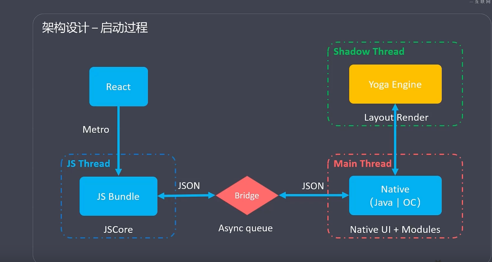
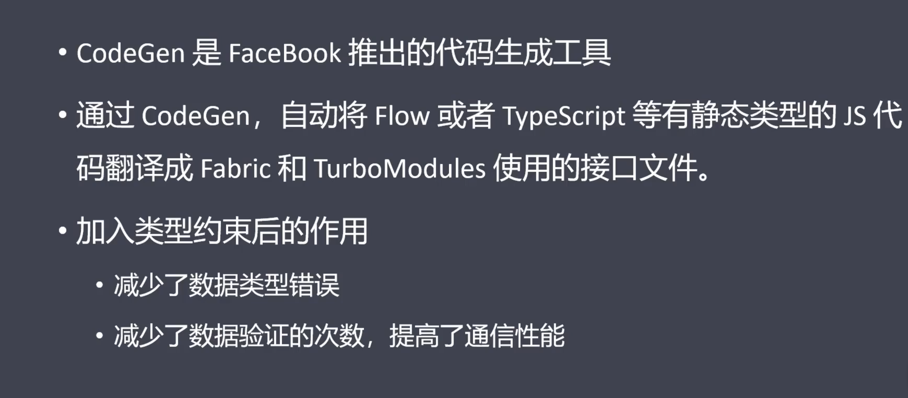

> 
- [**项目开始**](#项目开始)
	- [环境配置](#环境配置)
	- [项目初始化](#项目初始化)
	- [打包](#打包)
- [**iOS原生模块**](#iOS原生模块)
	- [原生模块给JS发送消息](#原生模块给JS发送消息)
	- [RCT_EXPORT_MODULE](#RCT_EXPORT_MODULE)
	- [RN调用原生](#RN调用原生)
- [**语法基础**](#语法基础)
	- [样式声明](#样式声明)
	- [弹性布局](#弹性布局)
	- [DeviceEventEmitter 实现发送和监听消息](#DeviceEventEmitter实现发送和监听消息)
- [**组件**](#组件)
	- [3大平台组件对比](#3大平台组件对比)
- [**架构原理**](#架构原理)
	- [线程模型](#线程模型)
	- [启动过程](#启动过程)
	- [新旧架构对比](#新旧架构对比)
- **[项目知识点](#项目知识点)**
	- [LTJS](#联通加速)
		- [DeviceEventEmitter 实现发送和监听消息](#DeviceEventEmitter实现发送和监听消息)


<br/>

***
<br/><br/>

> <h1 id='项目开始'>项目开始</h1>

<br/><br/>

> <h2 id='环境配置'>环境配置</h2>

- 基础环境:
	- 安装Node
	- 安装yarn(其实npm也可以,不过yarn速度会更快点)

- iOS环境配置:
	- Xcode
	- CocoaPods
	- watchman安装
		- 主要是用来调试:
			- Command+B:弹窗选择刷新、debug
			- `brew install watchman`


<br/><br/>

> <h2 id='项目初始化'>项目初始化</h2>


- 初始化项目
	- react-native init xxxproject
	- cd xxxproject
	- Android:yarn android
	- iOS
		- cd iOS
		- pod install
		- cd ..
		- yarn ios


- 好用的插件:
	- vscdoe

	- 快捷命令:
		- rnc(react native class): 快速创建rn类
			- 
		- rnf(react native function): 类组件
			- 


- 调试
	- 模拟器调试
		- Android:点击模拟器后,然后快捷键:ctrl+B,然后选中debug,会跳转到浏览器
		- iOS: Command+B(M)


<br/><br/>


> <h2 id='打包'>打包</h2>


在上线时分别运行命令:

```
npm run ios-start 
```

注意要修改渠道号,如下:


会将代码打包进RN项目中iOS文件夹中的一个bunle文件夹中!

<br/>

这个时候,iOS打包就像往常一样,打正式包了!


<br/>

***

<br/><br/>

> <h1 id='iOS原生模块'>iOS原生模块</h1>


<br/><br/>

> <h2 id='原生模块给JS发送消息'>原生模块给JS发送消息</h2>


[**给 JavaScript 端发送事件**](https://www.jianshu.com/p/7973a2b91f24)

&emsp; 即使没有被 JavaScript 调用，原生模块也可以给 JavaScript 发送事件通知。最好的方法是继承**RCTEventEmitter**，实现suppportEvents方法并调用self sendEventWithName:。


<br/><br/>


># <h2 id='RCT_EXPORT_MODULE'>[RCT_EXPORT_MODULE](https://reactnative.cn/docs/native-modules-ios)</h2>

&emsp; 有时候 App 需要访问平台 API，但 React Native 可能还没有相应的模块封装；或者你需要复用 Objective-C、Swift 或 C++代码，而不是用 JavaScript 重新实现一遍；又或者你需要实现某些高性能、多线程的代码，譬如图片处理、数据库、或者各种高级扩展等等。

&emsp; 我们把 React Native 设计为可以在其基础上编写真正的原生代码，并且可以访问平台所有的能力。这是一个相对高级的特性，我们并不认为它应当在日常开发的过程中经常出现，但具备这样的能力是很重要的。如果 React Native 还不支持某个你需要的原生特性，你应当可以自己实现该特性的封装。

<br/>

我们就可以使用上述的宏将iOS中的类作为模块导出来给rn使用!


```
// Test.h文件
#import <Foundation/Foundation.h>
#import <React/RCTBridgeModule.h>
// 遵循RCTBridgeModule
@interface Test : NSObject <RCTBridgeModule>
@end

// Test.m文件
#import "Test.h"
@implementation Test
/// 导出一个模块，括号内是可选的，若不填，默认为类名
RCT_EXPORT_MODULE(Test);
/// 导出一个普通的异步方法，
RCT_EXPORT_METHOD(test:(NSString *)name) {
  NSLog(@"%@",name);
}
/// 导出一个支持Promise的异步方法
RCT_EXPORT_METHOD(testPromise:(NSString *)name
                  resolve:(RCTPromiseResolveBlock)resolve
                  rejecter:(RCTPromiseRejectBlock)reject) {
  resolve(@"success");
}
/// 导出一个同步方法
RCT_EXPORT_SYNCHRONOUS_TYPED_METHOD(NSString *, testSync:(NSString *)name) {
  return [[NSString alloc]initWithFormat:@"hello %@", name];
}

// 设置悬浮球
RCT_EXPORT_METHOD(setAccFloatBallVisibility:(BOOL)visible
                  accessToken:(NSString *)token
                  memberInfo:(NSDictionary *)memberInfo
                  gameData:(NSString *)gameData
                  sceneAppData:(NSString *)sceneAppData
                  showDashboard:(BOOL)showDashboard){
    //最好将其放入主线程中,因为RN调用可能返回在子线程中
    dispatch_async(dispatch_get_main_queue(), ^{
        [[FloatManager manager] setAccFloatBallVisibility:visible accessToken:token memberInfo:memberInfo gameData:[JSONUtil jsonObject:gameData] sceneAppData:[JSONUtil jsonObject:sceneAppData] showDashboard:showDashboard];
    });
}


/// 导出常量供RN使用
- (NSDictionary *)constantsToExport {
  return @{@"testConstant": @"constant"};
}
@end

```


RN端如何使用？


**导入NativeModules模块**

NativeModules.原生导出的模块名.方法名进行调用，如NativeModules.Test.test("sync");（方法名默认是第一个冒号之前的内容）

```
js复制代码/// 导入模块
import {NativeModules} from 'react-native';
// 调用异步的方法
NativeModules.Test.test("sync");
// 使用await调用支持Promise的方法
let res = await NativeModules.Test.testPromise('promise');
console.log(res)
/// 调用同步的方法
let syncRes = NativeModules.Test.testSync('sync');
console.log(syncRes);
```

[**why？**](https://juejin.cn/post/6965082621801955364)

- 为什么RCT_EXPORT_METHOD参数中有了RCTPromiseResolveBlock和RCTPromiseRejectBlock在JS调用的时候就支持Promise了？
- Test类是什么时候实例化的？
- RN端的NativeModules是什么？NativeModules.Test又是什么?
- 总之一个疑问，为什么我在原生导出一下，在RN里就能用js调用，这里面到底经历了什么？


<br/><br/>

># <h2 id='RN调用原生'>[RN调用原生](https://juejin.cn/post/6965082621801955364)</h2>


<br/>

我们在`NativeAcc.h`中有一段代码:

```
#import <Foundation/Foundation.h>
#import <React/RCTBridgeModule.h>

NS_ASSUME_NONNULL_BEGIN

///遵守RCTBridgeModule协议后,在.m文件导出后就可以在RN中的js进行引用然后使用了
@interface NativeAcc : NSObject<RCTBridgeModule>

@end

NS_ASSUME_NONNULL_END

```

<br/>

然后在原生iOS的`NativeAcc.m`文件中有

```
RCT_EXPORT_MODULE(AccModule)
```

其实这是一个导出模块,可以理解为注册到到RN中的一个类或者模块,然后在RN中的js文件中就可以通过一个模块直接使用了,如下:

```
///在AccModule.js中的使用
const startGetNetworkSpeetTestInfo =()=>{
    NativeModules.AccModule.startGetNetworkSpeetTestInfo(); //开始测速
}
```


<br/>


- **iOS端如何操作**
	- 创建一个类，然后遵循协议
	- 使用RCT_EXPORT_MODULE导出模块
	- 使用RCT_EXPORT_METHOD导出异步方法
	- RCT_EXPORT_SYNCHRONOUS_TYPED_METHOD导出同步方法


<br/>

***
<br/><br/>

> <h1 id=''></h1>


<br/><br/>

> <h2 id='样式声明'>样式声明</h2>


<br/><br/>

> <h2 id='弹性布局'>弹性布局</h2>


- web的弹性布局


<br/>

- Rn的弹性布局:


<br/>

***
<br/><br/>

> <h1 id='组件'>组件</h1>
 
 
 <br/><br/>
 
 > <h2 id='3大平台组件对比'>3大平台组件对比</h2>
 
 RN生成的组件会生成对应的android和iOS的组件,如下图:
 


<br/>

3大平台组件比对:


<br/>

***
<br/><br/>

> <h1 id='架构原理'>架构原理</h1>


<br/>


<br/><br/>

># <h2 id='线程模型'>**线程模型**</h2>


<br/><br/>

> <h2 id='启动过程'>启动过程</h2>




<br/><br/>

> <h2 id='新旧架构对比'>新旧架构对比</h2>


<br/>

- **1.核心模块对比:**


<br/>

- **2.CodeGen**




<br/>

<br/>


<br/>


<br/>

***
<br/><br/>

> <h1 id='项目知识点'>项目知识点</h1>


<br/><br/>

> <h2 id='联通加速'>LTJS</h2>

<br/><br/>

> <h3 id='DeviceEventEmitter实现发送和监听消息'>DeviceEventEmitter实现发送和监听消息</h3>


移动端开发过程中，页面间信息传递是常见的应用场景。

注册、发送消息方式如下：

```
DeviceEventEmitter.emit('自定义名称',发送数据);
```

<br/>

消息监听方式如下：

```
DeviceEventEmitter.addListener('名称',(events) ={使用数据events});
```

例如，在A页面注册和发送消息：

```
import {DeviceEventEmitter} from 'react-native';
let param = {taobaoBind:false,walletSum:0.00,couponNum:0}
DeviceEventEmitter.emit('meeting_receive’,param);  //发送消息，并携带param参数
```


<br/>

然后，B页面监听消息，执行动作：

```
componentDidMount() {   
	//页面加载完毕，开启监听消息
   this.eventMeetingReceive =DeviceEventEmitter.addListener('meeting_receive', 
   		(events) =>{this.setState({walletSum : events.walletSum});});
}

componentWillUnmount() {   
	//当页面销毁时，移除事件的监听
	this.eventMeetingReceive.remove();
}
```


