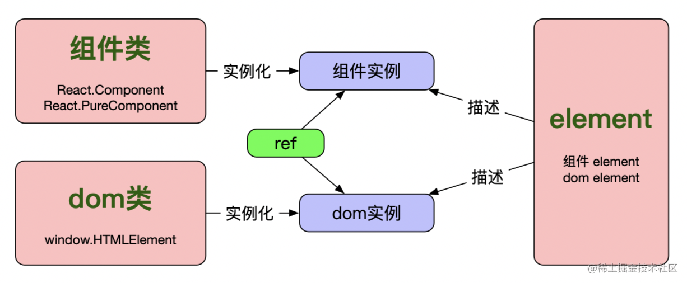
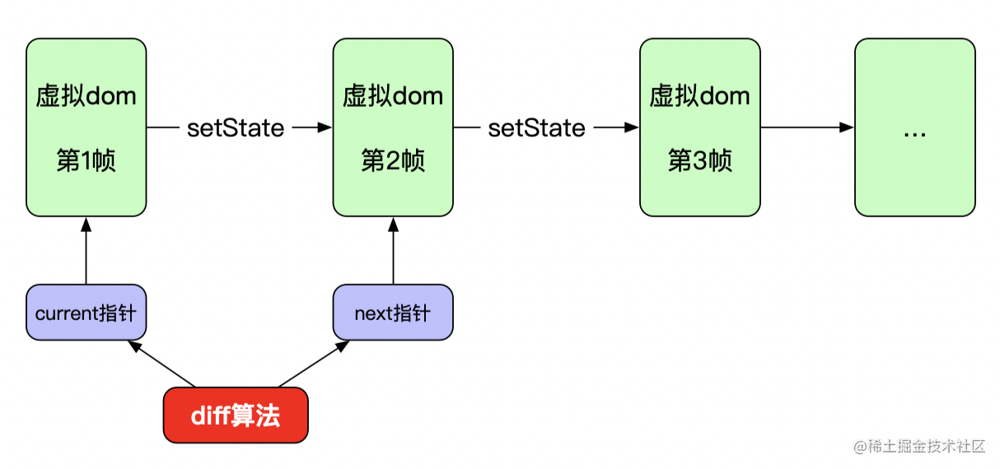
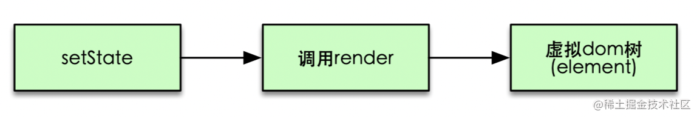

- [**OC知识点(I)**](./../Objective-C/知识点(I).md)
- [**Swift知识点(I)**](./../Swift/知识点(I).md)
- [**Flutter知识点**](./../Flutter/Flutter知识点.md)


> <h2 id=''></h2>
- [**基础**](#基础)
	- [React介绍](#React介绍)
	- [element与组件实例关系](#element与组件实例关系)
		- [什么是Pure Components?](#什么是PureComponents)
	- [jsx](#jsx)
	- [dom](#dom)
	- [状态](#状态)
		- [状态和属性有什么区别?](#状态和属性有什么区别)
		- [回调函数作为 setState() 参数的目的是什么?](#回调函数作为setState参数的目的是什么)
		- [使用setState后为什么会触发更新?](#使用setState后为什么会触发更新)
	- [HTML和React事件处理有什么区别?](#HTML和React事件处理有什么区别)
	- [createElement和cloneElement有什么区别?](#createElement和cloneElement有什么区别)
	- [React生命周期方法有哪些?](#React生命周期方法有哪些)
	- [什么是高阶组件（HOC）?](#什么是高阶组件HOC)
	- [什么是上下文（Context）?](#什么是上下文Context)
	- [children 属性是什么?](#children属性是什么?)
	- [如何使用动态属性名设置 state ?](#如何使用动态属性名设置state)
	- [如何校验props属性](#如何校验props属性)
- [组件](#组件)
	- [类组件和函数式组件](#类组件和函数式组件)
		- [什么时候使用类组件和函数组件?](#什么时候使用类组件和函数组件)
	- [instance（组件实例）](#instance组件实例)
- [底层原理](#底层原理)
	- [虚拟dom与diff算法](#虚拟dom与diff算法)
	- [生命周期与diff算法](#生命周期与diff算法)
- **参考资料**
	- [React系列](https://vue3js.cn/interview/React/React.html)
	- [React基础知识](https://github.com/semlinker/reactjs-interview-questions#什么是-react)
	- [200行代码实现简版react](https://juejin.cn/post/6844903733998911501#heading-6)
	- [十三水](https://jackniu81.github.io/2021/05/06/React-Interview-Questions-and-Answers/)
	- [react-interview](https://github.com/hongxiaomin/react-interview)
	- [React 面试题汇总](https://jackniu81.github.io/2021/05/06/React-Interview-Questions-and-Answers/#11-react有什么特点)


<br/>

***
<br/>
<br/>


> <h1 id='基础'>基础</h1>

<br/>

> <h2 id='React介绍'>React介绍</h2>

&emsp; React 是一个开源前端 JavaScript 库，用于构建用户界面，尤其是单页应用程序。它用于处理网页和移动应用程序的视图层。

<br/>

- **React的主要特性有：**
	- 考虑到真实的 DOM 操作成本很高，它使用 VirtualDOM 而不是真实的 DOM。
	- 支持服务端渲染。
	- 遵循单向数据流或数据绑定。
	- 使用可复用/可组合的 UI 组件开发视图。


<br/>
<br/>


> <h2 id='element与组件实例关系'>element与组件实例关系</h2>


一个 Element 是一个简单的对象，它描述了你希望在屏幕上以 DOM 节点或其他组件的形式呈现的内容。Elements 在它们的属性中可以包含其他 Elements。


&emsp; 类组件的render方法以及函数式组件的返回值均为element。那么这里的element到底是什么呢？其实很简单，就是一个纯对象（plain object），而且这个纯对象包含两个属性：type:(string|ReactClass)和props:Object，注意element并不是组件实例，而是一个纯对象。

&emsp; 虽然element不是组件实例，但是又跟组件实例有关系，element是对组件实例或者dom节点的描述。如果type是string类型，则表示dom节点，如果type是function或者class类型，则表示组件实例。比如下面两个element分别描述了一个dom节点和一个组件实例：


```
// 描述dom节点
{
  type: 'button',
  props: {
    className: 'button button-blue',
    children: {
      type: 'b',
      props: {
        children: 'OK!'
      }
    }
  }
}
```


<br/>

```
function Button(props){
  // ...
}

// 描述组件实例
{
  type: Button,
  props: {
    color: 'blue',
    children: 'OK!'
  }
}
```


<br/>
<br/>

再比如下面一个例子:

**React Element 的对象表示如下：**

```
const element = React.createElement(
  'div',
  {id: 'login-btn'},
  'Login'
)
```

<br/>

使用**React.createElement**函数会返回一个对象:

```
{
  type: 'div',
  props: {
    children: 'Login',
    id: 'login-btn'
  }
}
```

<br/>

最后使用 ReactDOM.render() 方法渲染到 DOM：

```
<div id='login-btn'>Login</div>
```


<br/>
<br/>

> <h2 id='什么是PureComponents'>什么是Pure Components?
</h2>


&emsp; React.PureComponent 与 React.Component 完全相同，只是它为你处理了 shouldComponentUpdate() 方法。当属性或状态发生变化时，PureComponent 将对属性和状态进行浅比较。

&emsp; 另一方面，一般的组件不会将当前的属性和状态与新的属性和状态进行比较。因此，在默认情况下，每当调用 shouldComponentUpdate 时，默认返回 true，所以组件都将重新渲染。


<br/>
<br/>

> <h2 id='jsx'>jsx</h2>

&emsp; 只要弄明白了element，那么jsx就不难理解了，jsx只是换了一种写法，方便我们来创建element而已，想想如果没有jsx那么我们开发效率肯定会大幅降低，而且代码肯定非常不利于维护。比如我们看下面这个jsx的例子：

```
const foo = <div id="foo">Hello!</div>;
```

&emsp; 其实说白了就是定义了一个dom节点div，并且该节点的属性集合是{id: 'foo'}，children是Hello!，就这点信息量而已，因此完全跟下面这种纯对象的表示是等价的：

```
{
  type: 'div',
  props: {
    id: 'foo',
    children: 'Hello!'
  }
}
```

那么React是如何将jsx语法转换为纯对象的呢？其实就是利用Babel编译生成的，我们只要在使用jsx的代码里加上个编译指示(pragma)即可，可以参考这里Babel如何编译jsx。比如我们将编译指示设置为指向createElement函数，那么前面那段jsx代码就会编译为：

```
var foo = createElement('div', {id:"foo"}, 'Hello!');
```

&emsp; 可以看出，jsx的编译过程其实就是从<、>这种标签式写法到函数调用式写法的一种转化而已。有了这个前提，我们只需要简单实现下createElement函数不就可以构造出element了嘛，我们后面自己实现简版react也会用到这个函数：

```
function createElement(type, props, ...children) {
    props = Object.assign({}, props);
    props.children = [].concat(...children)
      .filter(child => child != null && child !== false)
      .map(child => child instanceof Object ? child : createTextElement(child));
    return {type, props};
}
```


<br/>
<br/>

> <h2 id='dom'>dom</h2>

**创建一个dom节点div：**

```
const divDomNode = window.document.createElement('div');
```

&emsp; 其实所有dom节点都是HTMLElement类的实例，我们可以验证下：

```
window.document.createElement('div') instanceof window.HTMLElement;
// 输出 true
```

&emsp;  因此，dom节点是HTMLElement类的实例；

&emsp;  同样的，在react里面，组件实例是组件类的实例，而element又是对组件实例和dom节点的描述，现在这些概念之间的关系大家应该都清楚了吧。介绍完了这几个基本概念，我们画个图来描述下这几个概念之间的关系：




<br/>
<br/>


> <h2 id='状态'>状态</h2>

<br/>

> <h3 id='状态和属性有什么区别'>状态和属性有什么区别?</h3>


state 和 props 都是普通的 JavaScript 对象。虽然它们都保存着影响渲染输出的信息，但它们在组件方面的功能不同。

Props 以类似于函数参数的方式传递给组件，而状态则类似于在函数内声明变量并对它进行管理。


<br/>
<br/>


> <h3 id='回调函数作为setState参数的目的是什么'>回调函数作为 setState() 参数的目的是什么?</h3>

当 setState 完成和组件渲染后，回调函数将会被调用。由于 setState() 是异步的，回调函数用于任何后续的操作。

注意： 建议使用生命周期方法而不是此回调函数。

```
setState({ name: 'John' }, () => console.log(
					'The name has updated and component re-rendered')
)
```


[this.setState回调函数正确使用](https://juejin.cn/post/6844903667426918408)

<br/>
<br/>


># <h3 id='使用setState后为什么会触发更新'>[使用setState后为什么会触发更新?](https://overreacted.io/zh-hans/how-does-setstate-know-what-to-do/)</h3>


**react-dom、react-dom/server、 react-native、 react-test-renderer、 react-art** 都是常见的渲染器.

React “引擎”就是存在于各个渲染器的内部。很多渲染器包含一份同样代码的复制 —— 我们称为“协调器”(“reconciler”)。构建步骤(build step)将协调器代码和渲染器代码平滑地整合成一个高度优化的捆绑包（bundle）以获得更高的性能。

react包仅仅是让你使用 React 的特性，但是它完全不知道这些特性是如何实现的。而渲染器包(react-dom、react-native等)提供了React特性的实现以及平台特定的逻辑。这其中的有些代码是共享的(“协调器”)，但是这就涉及到各个渲染器的实现细节了。


<br/>
<br/>


我们知道react包并不包含任何有趣的东西，除此之外，具体的实现也是存在于react-dom，react-native之类的渲染器中。但是这并没有回答我们的问题。React.Component中的setState()如何与正确的渲染器“对话”？

答案是：每个渲染器都在已创建的类上设置了一个特殊的字段。这个字段叫做updater。这并不是你要设置的的东西——而是，React DOM、React DOM Server 或 React Native在创建完你的类的实例之后会立即设置的东西：

```
// React DOM 内部
const inst = new YourComponent();
inst.props = props;
inst.updater = ReactDOMUpdater;

// React DOM Server 内部
const inst = new YourComponent();
inst.props = props;
inst.updater = ReactDOMServerUpdater;

// React Native 内部
const inst = new YourComponent();
inst.props = props;
inst.updater = ReactNativeUpdater;
```


查看 React.Component中setState的实现， setState所做的一切就是委托渲染器创建这个组件的实例：

```
// 适当简化的代码
setState(partialState, callback) {
  // 使用`updater`字段回应渲染器！
  this.updater.enqueueSetState(this, partialState, callback);
}
```

React DOM Server 也许想 忽略一个状态更新并且警告你，而React DOM 与 React Native却想要让他们协调器（reconciler）的副本处理它。

这就是this.setState()尽管定义在React包中，却能够更新DOM的原因。它读取由React DOM设置的this.updater`，让React DOM安排并处理更新。


<br/>
<br/>

> <h2 id='HTML和React事件处理有什么区别'>HTML和React事件处理有什么区别?</h2>

**1.在 HTML 中事件名必须小写：**

```
<button onclick='activateLasers()'>
```
而在 React 中它遵循 camelCase (驼峰) 惯例：

```
<button onClick={activateLasers}>
```

<br/>

**2.在 HTML 中你可以返回 false 以阻止默认的行为：**

```
<a href='#' onclick='console.log("The link was clicked."); return false;' />
```

而在 React 中你必须地明确地调用 preventDefault() ：

```
function handleClick(event) {
  event.preventDefault()
  console.log('The link was clicked.')
}
```


<br/>
<br/>

> <h2 id='createElement和cloneElement有什么区别'>createElement 和 cloneElement 有什么区别?</h2>


JSX 元素将被转换为 React.createElement() 函数来创建 React 元素，这些对象将用于表示 UI 对象。而 cloneElement 用于克隆元素并传递新的属性。


<br/>
<br/>

> <h2 id='React生命周期方法有哪些'>React 生命周期方法有哪些?</h2>


**React 16.3+**

- getDerivedStateFromProps: 在调用render()之前调用，并在 每次 渲染时调用。 需要使用派生状态的情况是很罕见得。值得阅读 如果你需要派生状态.

- componentDidMount: 首次渲染后调用，所有得 Ajax 请求、DOM 或状态更新、设置事件监听器都应该在此处发生。

- shouldComponentUpdate: 确定组件是否应该更新。 默认情况下，它返回true。 如果你确定在更新状态或属性后不需要渲染组件，则可以返回false值。 它是一个提高性能的好地方，因为它允许你在组件接收新属性时阻止重新渲染。

- getSnapshotBeforeUpdate: 在最新的渲染输出提交给 DOM 前将会立即调用，这对于从 DOM 捕获信息（比如：滚动位置）很有用。

- componentDidUpdate: 它主要用于更新 DOM 以响应 prop 或 state 更改。 如果shouldComponentUpdate()返回false，则不会触发。

- componentWillUnmount 当一个组件被从 DOM 中移除时，该方法被调用，取消网络请求或者移除与该组件相关的事件监听程序等应该在这里进行。


<br/>
<br/>

> <h2 id='什么是高阶组件HOC'>什么是高阶组件（HOC）?</h2>


&emsp; 高阶组件(HOC) 就是一个函数，且该函数接受一个组件作为参数，并返回一个新的组件，它只是一种模式，这种模式是由react自身的组合性质必然产生的。

我们将它们称为纯组件，因为它们可以接受任何动态提供的子组件，但它们不会修改或复制其输入组件中的任何行为。

```
const EnhancedComponent = higherOrderComponent(WrappedComponent)
```

- **HOC 有很多用例：**
	- 代码复用，逻辑抽象化
	- 渲染劫持
	- 抽象化和操作状态（state）
	- 操作属性（props）


<br/>
<br/>

> <h2 id='什么是上下文Context'>什么是上下文（Context）?</h2>

Context 通过组件树提供了一个传递数据的方法，从而避免了在每一个层级手动的传递props。比如，需要在应用中许多组件需要访问登录用户信息、地区偏好、UI主题等。

```
// 创建一个 theme Context,  默认 theme 的值为 light
const ThemeContext = React.createContext('light');

function ThemedButton(props) {
  // ThemedButton 组件从 context 接收 theme
  return (
    <ThemeContext.Consumer>
      {theme => <Button {...props} theme={theme} />}
    </ThemeContext.Consumer>
  );
}

// 中间组件
function Toolbar(props) {
  return (
    <div>
      <ThemedButton />
    </div>
  );
}

class App extends React.Component {
  render() {
    return (
      <ThemeContext.Provider value="dark">
        <Toolbar />
      </ThemeContext.Provider>
    );
  }
}
```


<br/>
<br/>

> <h2 id='children属性是什么?'>children 属性是什么?</h2>

&emsp; **Children 是一个属性（this.props.chldren）**，它允许你将组件作为数据传递给其他组件，就像你使用的任何其他组件一样。在组件的开始和结束标记之间放置的组件树将作为children属性传递给该组件。

React API 中有许多方法中提供了这个不透明数据结构的方法，包括：React.Children.map、React.Children.forEach、React.Children.count、React.Children.only、React.Children.toArray。

```
const MyDiv = React.createClass({
  render: function() {
    return <div>{this.props.children}</div>
  }
})

ReactDOM.render(
  <MyDiv>
    <span>{'Hello'}</span>
    <span>{'World'}</span>
  </MyDiv>,
  node
)
```


<br/>
<br/>

> <h2 id='如何使用动态属性名设置state'>如何使用动态属性名设置 state ?</h2>


如果你使用 ES6 或 Babel 转换器来转换你的 JSX 代码，那么你可以使用计算属性名称来完成此操作。

```
handleInputChange(event) {
  this.setState({ [event.target.id]: event.target.value })
}
```


<br/>
<br/>

> <h2 id='如何校验props属性'>如何校验 props 属性?</h2>

当应用程序以开发模式运行的时，React 将会自动检查我们在组件上设置的所有属性，以确保它们具有正确的类型。如果类型不正确，React 将在控制台中生成警告信息。由于性能影响，它在生产模式下被禁用。使用 isRequired 定义必填属性。

预定义的 prop 类型：

```
PropTypes.number
PropTypes.string
PropTypes.array
PropTypes.object
PropTypes.func
PropTypes.node
PropTypes.element
PropTypes.bool
PropTypes.symbol
PropTypes.any
```

我们可以为 User 组件定义 propTypes，如下所示：

```
import React from 'react'
import PropTypes from 'prop-types'

class User extends React.Component {
  static propTypes = {
    name: PropTypes.string.isRequired,
    age: PropTypes.number.isRequired
  }

  render() {
    return (
      <>
        <h1>{`Welcome, ${this.props.name}`}</h1>
        <h2>{`Age, ${this.props.age}`}</h2>
      </>
    )
  }
}
```
注意: 在 React v15.5 中，PropTypes 从 React.PropTypes 被移动到 prop-types 库中


<br/>
<br/>

> <h2 id=''></h2>


<br/>
<br/>

> <h2 id=''></h2>


<br/>
<br/>

> <h2 id=''></h2>


<br/>
<br/>

> <h2 id=''></h2>


<br/>
<br/>

> <h2 id=''></h2>


<br/>
<br/>

> <h2 id=''></h2>


<br/>
<br/>

> <h2 id=''></h2>


<br/>
<br/>

> <h2 id=''></h2>


<br/>
<br/>

> <h2 id=''></h2>

<br/>

***
<br/>
<br/>


> <h1 id='组件'>组件</h1>

<br/>

> <h2 id='类组件和函数式组件'>类组件和函数式组件</h2>


&emsp; Component就是我们经常实现的组件，可以是类组件（class component）或者函数式组件（functional component）.

&emsp; 而类组件又可以分为普通类组件(React.Component)以及纯类组件（React.PureComponent），总之这两类都属于类组件，只不过PureComponent基于shouldComponentUpdate做了一些优化，这里不展开说。

&emsp; 函数式组件则用来简化一些简单组件的实现，用起来就是写一个函数，入参是组件属性props，出参与类组件的render方法返回值一样，是react element


- **1.)类组件**

```
class Welcome extends React.Component {
    render() {
        return <h1>Hello, {this.props.name}</h1>;
    }
}
```

<br/>

- **2.)类组件**

```
class Welcome extends React.PureComponent {
    render() {
        return <h1>Hello, {this.props.name}</h1>;
    }
}

```

<br/>


- **3.)函数式组件**

```
function Welcome(props) {
    return <h1>Hello, {props.name}</h1>;
}
```


<br/>
<br/>

> <h3 id='什么时候使用类组件和函数组件'>什么时候使用类组件和函数组件?</h3>


如果组件需要使用状态或生命周期方法，那么使用类组件，否则使用函数组件。


<br/>
<br/>


> <h2 id='instance组件实例'>instance（组件实例）</h2>


**组件实例是组件类的实例**

&emsp; 面向对象编程的人肯定知道类和实例的关系，这里也是一样的，组件实例其实就是一个组件类实例化的结果，概念虽然简单，但是在react这里却容易弄不明白，为什么这么说呢？

&emsp; 因为大家在react的使用过程中并不会自己去实例化一个组件实例，这个过程其实是react内部帮我们完成的，因此我们真正接触组件实例的机会并不多。我们更多接触到的是下面要介绍的element，因为我们通常写的jsx其实就是element的一种表示方式而已(后面详细介绍)。

虽然组件实例用的不多，但是偶尔也会用到，其实就是ref。ref可以指向一个dom节点或者一个类组件(class component)的实例，但是不能用于函数式组件，因为函数式组件不能实例化。这里简单介绍下ref，我们只需要知道ref可以指向一个组件实例即可


<br/>
<br/>


> <h2 id=''></h2>


<br/>
<br/>


> <h2 id=''></h2>


<br/>
<br/>


> <h2 id=''></h2>


<br/>
<br/>


> <h2 id=''></h2>


<br/>
<br/>

> <h2 id=''></h2>


<br/>

***
<br/>
<br/>


> <h1 id=''></h1>


<br/>

> <h2 id=''></h2>


<br/>
<br/>


> <h2 id=''></h2>


<br/>
<br/>

> <h2 id=''></h2>


<br/>

***
<br/>
<br/>


> <h1 id=''></h1>


<br/>

> <h2 id=''></h2>


<br/>
<br/>


> <h2 id=''></h2>


<br/>
<br/>

> <h2 id=''></h2>


<br/>

***
<br/>
<br/>


> <h1 id='底层原理'>底层原理</h1>

<br/>

> <h2 id='虚拟dom与diff算法'>虚拟dom与diff算法</h2>

&emsp; 相信使用过react的同学都多少了解过这两个概念：虚拟dom以及diff算法。这里的虚拟dom其实就是前面介绍的element，为什么说是虚拟dom呢，前面咱们已经介绍过了，element只是dom节点或者组件实例的一种纯对象描述而已，并不是真正的dom节点，因此是虚拟dom。react给我们提供了声明式的组件写法，当组件的props或者state变化时组件自动更新。整个页面其实可以对应到一棵dom节点树，每次组件props或者state变更首先会反映到虚拟dom树，然后最终反应到页面dom节点树的渲染。


&emsp; 那么虚拟dom跟diff算法又有什么关系呢？之所以有diff算法其实是为了提升渲染效率，试想下，如果每次组件的state或者props变化后都把所有相关dom节点删掉再重新创建，那效率肯定非常低，所以在react内部存在两棵虚拟dom树，分别表示现状以及下一个状态，setState调用后就会触发diff算法的执行，而好的diff算法肯定是尽可能复用已有的dom节点，避免重新创建的开销。我用下图来表示虚拟dom和diff算法的关系：



react组件最初渲染到页面后先生成第1帧虚拟dom，这时current指针指向该第一帧。setState调用后会生成第2帧虚拟dom，这时next指针指向第二帧，接下来diff算法通过比较第2帧和第1帧的异同来将更新应用到真正的dom树以完成页面更新。
这里再次强调一下setState后具体怎么生成虚拟dom，因为这点很重要，而且容易忽略。前面刚刚已经介绍过什么是虚拟dom了，就是element树而已。那element树是怎么来的呢？其实就是render方法返回的嘛，下面的流程图再加深下印象：




<br/>
<br/>


> <h2 id='生命周期与diff算法'>生命周期与diff算法</h2>


生命周期与diff算法又有什么关系呢？这里我们以componentDidMount、componentWillUnmount、ComponentWillUpdate以及componentDidUpdate为例说明下二者的关系。我们知道，setState调用后会接着调用render生成新的虚拟dom树，而这个虚拟dom树与上一帧可能会产生如下区别：

- 新增了某个组件；
- 删除了某个组件；
- 更新了某个组件的部分属性。

因此，我们在实现diff算法的过程会在相应的时间节点调用这些生命周期函数。

这里需要重点说明下前面提到的第1帧，我们知道每个react应用的入口都是：

```
ReactDOM.render(
    <h1>Hello, world!</h1>,
    document.getElementById('root')
);
```


ReactDom.render也会生成一棵虚拟dom树，但是这棵虚拟dom树是开天辟地生成的第一帧，没有前一帧用来做diff，因此这棵虚拟dom树对应的所有组件都只会调用挂载期的生命周期函数，比如componentDidMount、componentWillUnmount。


<br/>
<br/>


> <h2 id=''></h2>


<br/>
<br/>


> <h2 id=''></h2>


<br/>
<br/>


> <h2 id=''></h2>


<br/>
<br/>

> <h2 id=''></h2>


<br/>

***
<br/>
<br/>


> <h1 id=''></h1>


<br/>

> <h2 id=''></h2>


<br/>
<br/>


> <h2 id=''></h2>


<br/>
<br/>

> <h2 id=''></h2>


<br/>

***
<br/>
<br/>


> <h1 id=''></h1>


<br/>

> <h2 id=''></h2>


<br/>
<br/>


> <h2 id=''></h2>


<br/>
<br/>

> <h2 id=''></h2>


<br/>

***
<br/>
<br/>


> <h1 id=''></h1>


<br/>

> <h2 id=''></h2>


<br/>
<br/>


> <h2 id=''></h2>


<br/>
<br/>

> <h2 id=''></h2>


<br/>

***
<br/>
<br/>


> <h1 id=''></h1>


<br/>

> <h2 id=''></h2>


<br/>
<br/>


> <h2 id=''></h2>


<br/>
<br/>

> <h2 id=''></h2>


<br/>

***
<br/>
<br/>


> <h1 id=''></h1>


<br/>

> <h2 id=''></h2>


<br/>
<br/>


> <h2 id=''></h2>


<br/>
<br/>

> <h2 id=''></h2>


<br/>

***
<br/>
<br/>


> <h1 id=''></h1>


<br/>

> <h2 id=''></h2>


<br/>
<br/>


> <h2 id=''></h2>


<br/>
<br/>

> <h2 id=''></h2>


<br/>

***
<br/>
<br/>


> <h1 id=''></h1>


<br/>

> <h2 id=''></h2>


<br/>
<br/>


> <h2 id=''></h2>


<br/>
<br/>

> <h2 id=''></h2>


<br/>

***
<br/>
<br/>


> <h1 id=''></h1>


<br/>

> <h2 id=''></h2>


<br/>
<br/>


> <h2 id=''></h2>


<br/>
<br/>

> <h2 id=''></h2>


<br/>

***
<br/>
<br/>


> <h1 id=''></h1>


<br/>

> <h2 id=''></h2>


<br/>
<br/>


> <h2 id=''></h2>


<br/>
<br/>

> <h2 id=''></h2>


<br/>

***
<br/>
<br/>


> <h1 id=''></h1>


<br/>

> <h2 id=''></h2>


<br/>
<br/>


> <h2 id=''></h2>


<br/>
<br/>

> <h2 id=''></h2>


<br/>

***
<br/>
<br/>


> <h1 id=''></h1>


<br/>

> <h2 id=''></h2>


<br/>
<br/>


> <h2 id=''></h2>


<br/>
<br/>

> <h2 id=''></h2>


<br/>

***
<br/>
<br/>


> <h1 id=''></h1>


<br/>

> <h2 id=''></h2>


<br/>
<br/>


> <h2 id=''></h2>


<br/>
<br/>

> <h2 id=''></h2>


<br/>

***
<br/>
<br/>


> <h1 id=''></h1>


<br/>

> <h2 id=''></h2>


<br/>
<br/>


> <h2 id=''></h2>


<br/>
<br/>

> <h2 id=''></h2>


<br/>

***
<br/>
<br/>


> <h1 id=''></h1>


<br/>

> <h2 id=''></h2>


<br/>
<br/>


> <h2 id=''></h2>


<br/>
<br/>

> <h2 id=''></h2>


<br/>

***
<br/>
<br/>


> <h1 id=''></h1>


<br/>

> <h2 id=''></h2>


<br/>
<br/>


> <h2 id=''></h2>


<br/>
<br/>

> <h2 id=''></h2>


<br/>

***
<br/>
<br/>


> <h1 id=''></h1>


<br/>

> <h2 id=''></h2>


<br/>
<br/>


> <h2 id=''></h2>


<br/>
<br/>

> <h2 id=''></h2>


