> <h2 id=""></h2>
- [**基本用法**](#基本用法)
	- [**React环境搭建**](#React环境搭建)
		- [Vite和CRA脚手架区别](#Vite和CRA脚手架区别)
		- [构建一个Vite全新项目](#构建一个Vite全新项目)
		- [配置多环境](#配置多环境)
		- [本地CSOR跨域反向代理](#本地CSOR跨域反向代理)
	- [**JSX简介**](#JSX简介)
		- [原理](#原理)
	- [**CSS高级使用**](#CSS高级使用)
		- [文件模块化](#文件模块化)
	- [props用法](#props用法)
		- [props类型验证](#props类型验证)
		- [设置默认值](#设置默认值)
		- [Children的用法](https://segmentfault.com/a/1190000011527160)
	- [ReactDOM](#ReactDOM)
		- [ReactDom.render](#ReactDom.render)
	- [React视图渲染](#React视图渲染)
	- [项目文件描述](#项目文件描述)
		- [import和require](#import和require)
	- [生命周期方法](#生命周期方法) 
	- [构造函数constructor](#构造函数constructor)
	- [React Hooks](#ReactHooks)
		- [useState](#useState)
			- [函数组件中添加状态useState ](#函数组件中添加状态useState)
		- [useEffect](#useEffect)
			- [副作用useEffect3种使用场景](#副作用useEffect3种使用场景)
			- [useEffect中多个网络请求实例编码](#useEffect中多个网络请求实例编码)
			- [useEffect中执行多个网络请求](#useEffect中执行多个网络请求)
			- [副作用钩子useEffect末尾3种参数使用方法](#副作用钩子useEffect末尾3种参数使用方法)
		    - [useEffect参数加函数和中扩号的区别](#useEffect参数加函数和中扩号的区别)
		- [useCallback](#useCallback)
		- [useMemo](#useMemo)
			- [useMemo的依赖数组](#useMemo的依赖数组)
			- [长轮询案例](#长轮询案例)
		- [useEffect、useCallback、useMemo的三者区别](#useEffect、useCallback、useMemo的三者区别)
		- [根据依赖参数useCallBack无法调用内部函数](#根据依赖参数useCallBack无法调用内部函数)
			- [自动调用](#自动调用)
			- [手动调用](#手动调用) 
	- [React Router](#ReactRouter)
		- [路由Demo](#路由Demo)
	- [参数传递](#参数传递)
		- [父->子传参](#父子传参)
		- [子->父组件的通信](#子父组件的通信)
		- [兄弟节点之间的通信](#兄弟节点之间的通信)
		- [context传值](#context传值)
		- [订阅模型](#订阅模型)
- [**ES6基础**](#ES6基础)
	- [异步编程](#异步编程)
	- [async/await和Promise.then()使用](#async/await和Promise.then()使用)
	- [Promise的then、catch、finally如何选择使用](#Promise的then、catch、finally如何选择使用)
- [**顶层API**](#顶层API)
	- [createElement](#createElement)
	- [cloneElement](#cloneElement)
- [**性能优化**](#性能优化)
	- [值是否为空或有值](#值是否为空或有值) 
- [**JavaScript语法**](#JavaScript语法)
	- [数组splice()](https://developer.mozilla.org/zh-CN/docs/Web/JavaScript/Reference/Global_Objects/Array/splice)
- [**创建到打包**](#创建到打包)
	- [Vite是什么](#Vite是什么)
- **参考资料：**
	- [**JavaScript(阮一峰)**](https://www.ruanyifeng.com/blog/javascript/)
	- [**JavaScript优秀教程**](https://developer.mozilla.org/zh-CN/docs/Web/JavaScript)
	- [Material-UI React组件库](https://v4-2-1.material-ui.com/zh/getting-started/installation/)
	- [React生命周期](https://www.jianshu.com/p/c9bc994933d5)
	- [hook](https://juejin.cn/post/6844903999083118606)
	- [异步和轮询](https://juejin.cn/post/6844904170865033223)


<br/>

***
<br/>


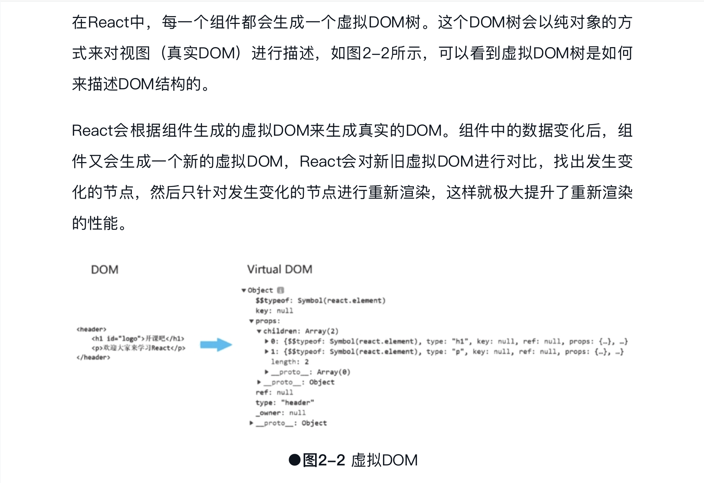


<br/>

***
<br/>


># <h1 id="基本用法">基本用法</h1>


<br/>

> <h2 id="React环境搭建">React环境搭建</h2>

安装React有以下两种方式：
- 使用CDN链接；
- 使用create-react-app工具。

<br/>
> **CDN链接**

开发环境CDN(不适用于生产环境):

```
<script src="https://unpkg.com/react@16/umd/react.development.js">
</script>


<script src="https://unpkg.com/react-dom@16/umd/react-dom.development.js">
</script>
```


<br/>
生产环境CDN(是经过优化处理后的依赖包，可以节约带宽，提高效率):

```
<script src="https://unpkg.com/react@16/umd/react.production.min.js">
</script>

<script src="https://unpkg.com/react-dom@16/umd/react-dom.production.min.js">
</script>
```


&emsp; CDN的全称是Content Delivery Network，即内容分发网络。CDN是构建在现有网络基础之上的智能虚拟网络，依靠部署在各地的边缘服务器，通过中心平台的负载均衡、内容分发和调度等功能模块，使用户就近获取所需内容，降低网络拥塞，提高用户访问的响应速度和命中率。

&emsp; 所以在项目中我们可以直接把CDN下载到我们本地,可以提高访问速度.防止因为网络不好无法加载网页.


<br/>

新建HTML文件并命名为react_example.html，编写代码如下：


```
01  <!DOCTYPE html>

02  <html lang="en">

03  

04  <head>

05      <meta charset="UTF-8">

06      <title>React Example</title>

07      <script src="https://unpkg.com/react@16/umd/react.development.js">

        </script>

08      <script src="https://unpkg.com/react-dom@16/umd/react-dom.
        development.js"></script>

09  </head>

10  

11  <body>

12      <div id="app"></div>

13  </body>

14  <script>

15      const e = React.createElement(

16          'h1',

17          null,

18          'Hello React!'

19      )

20      ReactDOM.render(

21          e,

22          document.getElementById('app')

23      )

24  </script>

25  

26  </html>
```

&emsp; 上述代码中使用的是React的原生写法，为了简化编码，React还提供了一种叫作JSX（JavaScript XML）的写法。想要在React中使用JSX，需要引入Babel的依赖包，命令如下：

```
<script src="https://unpkg.com/babel-standalone@6/babel.min.js">
</script>
```

<br/>

> create-react-app创建React项目

&emsp; create-react-app是React团队推荐的工具，通过该工具无须任何配置就能快速构建React开发环境。它在内部使用Babel和Webpack，但读者无须了解它们的任何细节。要使用该工具，需要确保已安装的Node版本是8.10以上，npm版本是5.6以上。

使用这个比较简单,傻瓜式操作,不懂的自行网上搜索.


***
<br/><br/><br/>
> <h2 id="Vite和CRA脚手架区别">Vite和CRA脚手架区别</h2>

**`Vite和CRA【Create React App】`**定位都是“前端开发脚手架”，但理念和实现方式差别很大，所以用起来的感觉也差不少。可以从几个维度对比一下 👇

---
<br/> 

**1️⃣ 架构 & 打包方式**

| 对比项      | CRA（Create React App）  | Vite                                             |
| -------- | ---------------------- | ------------------------------------------------ |
| 架构       | 基于 **webpack**         | 开发时用 **esbuild** 作为 dev server，生产用 **Rollup** 打包 |
| 启动速度     | 先打包再启动 → **慢**（尤其是大项目） | 不打包，按需编译 → **秒开**                                |
| HMR（热更新） | 修改后重新打包整个依赖树           | 只编译变动的模块，HMR 超快                                  |
| 配置       | 封装较深，想自定义要 `eject`     | 配置文件简单直观（`vite.config.js`）                       |

<br/> 

**2️⃣ 环境变量**

| CRA                              | Vite                            |
| -------------------------------- | ------------------------------- |
| 用 `process.env.REACT_APP_XXX` 读取 | 用 `import.meta.env.VITE_XXX` 读取 |
| 变量必须以 `REACT_APP_` 开头            | 变量必须以 `VITE_` 开头                |

👉 这是很多人迁移时踩的第一个坑。

<br/>

 **3️⃣ 代理 & 开发服务器**

| CRA                                                 | Vite                                    |
| --------------------------------------------------- | --------------------------------------- |
| 通过 `src/setupProxy.js` + `http-proxy-middleware` 配置 | 在 `vite.config.js` 里的 `server.proxy` 配置 |
| 需要重启服务器才能生效                                         | 保存配置即可热生效                               |

<br/> 

**4️⃣ 插件生态**

| CRA            | Vite                         |
| -------------- | ---------------------------- |
| 基本靠 webpack 插件 | Vite 自己的插件体系，同时也支持 Rollup 插件 |
| 配置复杂度高         | 配置较简单，插件写法也轻量                |

<br/>

 **5️⃣ 生产构建**

* CRA：webpack 完整打包，tree-shaking、代码分割等都要自己优化。
* Vite：底层是 Rollup，默认输出就比较干净，支持更细粒度的代码分割。

<br/> 

**6️⃣ TypeScript / JSX 支持**

* CRA：内置支持 TS，但编译速度受 webpack 影响。
* Vite：用 esbuild 处理 TS/JSX，速度非常快。

<br/> 

**7️⃣ 社区 & 生命周期**

* CRA：由 Facebook 出品，但近年来维护频率明显降低，生态有点停滞。
* Vite：由 Evan You（Vue 作者）发起，现在已经是主流前端构建工具之一，React、Vue、Svelte 都有人用它。

<br/>

 **8️⃣ 适用场景**

| CRA                  | Vite          |
| -------------------- | ------------- |
| 老项目或需要 webpack 生态的项目 | 新项目、追求开发体验和速度 |
| 对复杂 webpack 配置有依赖    | 对“开箱即用”要求更高   |

<br/>

 **📌 总结**

* **CRA** = “React 官方出厂配置 + webpack”
  → 稳定，但笨重，适合入门或遗留项目。

* **Vite** = “下一代前端构建工具”
  → 开发体验好，热更新快，配置灵活，越来越多新项目选它。

> 如果是新建 React 项目，99% 情况推荐直接用 **Vite**，除非有必须依赖 webpack 的老插件或工具链。


***
<br/><br/><br/>
> <h2 id="构建一个Vite全新项目">构建一个Vite全新项目</h2>

**1.若是没有安装`Node`，先需要用homebrew进行安装**

```bash
 brew install node
```

然后就可以用：

```sh
npm -v 

11.5.1
```

<br/>

**2.使用 Vite创建一个新的项目**

Vite 是目前最主流的前端开发工具，速度快、配置简单。

```sh
npm create vite@latest MLC_React

reate-vite@7.1.1
Ok to proceed? (y) y


> npx
> "create-vite" MLC_React

│
◇  Package name:
│  mlc_react
│
◇  Select a framework:
│  React
│
◇  Select a variant:
│  JavaScript + SWC
│
◇  Scaffolding project in /Users/ganghuang/HGFiles/GitHub/MLC_React/MLC_React...
│
└  Done. Now run:

  cd MLC_React
  npm install
  npm run dev
```

<br/>

**3.进入目录并安装依赖：**

```sh
cd MLC_React

npm install
```

<br/>

**4.启动开发环境：**

```sh
npm run dev
```

浏览器访问 http://localhost:5173 就能看到 React 页面。

***
<br/><br/><br/>
> <h2 id="配置多环境">配置多环境</h2>

在项目根目录下新建 3 个环境配置文件：

```sh
.env.debug
.env.pre
.env.release
```

<br/>

**内容示例：**

**📄 `.env.debug`**

```env
VITE_APP_ENV=debug
VITE_API_URL=http://localhost:3000/api
```

<br/>

**📄 `.env.pre`**

```env
VITE_APP_ENV=pre
VITE_API_URL=https://pre.example.com/api
```

<br/>

**📄 `.env.release`**

```env
VITE_APP_ENV=release
VITE_API_URL=https://api.example.com
```

⚠️ 注意：Vite 要求自定义变量必须以 `VITE_` 开头。

<br/>

**步骤 3：修改 `package.json` 脚本**

在 `package.json` 里添加运行脚本：

```json
{
  "scripts": {
    "dev": "vite --mode debug",
    "build:pre": "vite build --mode pre",
    "build:release": "vite build --mode release",
    "preview": "vite preview"
  }
}
```

这样就可以：

* `npm run dev` → 使用 `.env.debug`
* `npm run build:pre` → 使用 `.env.pre`
* `npm run build:release` → 使用 `.env.release`

<br/>

**步骤 4：在代码里使用环境变量**

在 `src/App.jsx` 里测试：

```jsx
function App() {
  return (
    <div>
      <h1>Hello React</h1>
      <p>当前环境: {import.meta.env.VITE_APP_ENV}</p>
      <p>API 地址: {import.meta.env.VITE_API_URL}</p>
    </div>
  );
}

export default App;
```

启动后会自动显示不同环境的变量值。

<br/>

**步骤 5：目录结构建议**

```
MLC_React/
├── public/             # 静态资源
├── src/
│   ├── api/            # 接口封装
│   ├── components/     # 公共组件
│   ├── pages/          # 页面
│   ├── App.jsx         # 入口组件
│   ├── App.css
│   ├── assets
│   ├── index.css
│   └── main.jsx        # 入口文件
├── package-lock.json
├── package.json
├── public
│   └── vite.svg
└── vite.config.js
```


***
<br/><br/><br/>
> <h2 id="本地CSOR跨域反向代理">本地CSOR跨域反向代理</h2>

若在 Vite 里却用了 CRA 的 `setupProxy.js`

`http-proxy-middleware` + `setupProxy.js` 这种写法是 **Create React App** 专用的，

**Vite 并不会去加载 `src/setupProxy.js`，所以你的代理根本没生效。**

<br/> 

**Vite 中配置代理的正确方式**

在 Vite 里要在 `vite.config.js` 里加 `server.proxy`：

```js
// vite.config.js
import { defineConfig } from 'vite';
import react from '@vitejs/plugin-react';

export default defineConfig({
  plugins: [react()],
  server: {
    proxy: {
      '/dns.alidns': {
        target: 'https://dns.alidns.com',
        changeOrigin: true,
        rewrite: (path) => path.replace(/^\/dns\.alidns/, ''),
      },
    },
  },
});
```

解释：

* `'/dns.alidns'`：拦截以这个开头的请求。
* `target`：要代理到的真实服务。
* `rewrite`：把前缀 `/dns.alidns` 去掉，剩下 `/resolve?name=...`。

<br/>

**调用接口的方式**

前端代码要写成：

```js
axios.get('/dns.alidns/resolve', {
  params: { name: 'fusion-gateway-cn.imilab.com', type: 'A' }
});
```

<br/>

启动 Vite (`npm run dev`) 后，

浏览器请求 `http://localhost:5173/dns.alidns/resolve?...`

Vite 开发服务器会把它代理到：

```
https://dns.alidns.com/resolve?name=fusion-gateway-cn.imilab.com&type=A
```

<br/> 

**其他注意事项**

* `vite.config.js`这个文件要放在根目录下，否则不起作用；
* 代理只在开发模式 (`vite dev`) 下生效，**生产环境需要 Nginx 或后端做转发【这个针对于本地可以，生产环境放到服务端无法使用】**。
* 如果你之前写了 `setupProxy.js`，可以删掉，它对 Vite 没作用。
* 确保浏览器不要直接请求 `http://localhost:5173/https://dns.alidns.com/...` 这种路径。

<br/><br/>


**vite.config.js 必须放在项目根目录**（和 `package.json` 平级），Vite 才会自动加载它。
这是 Vite 的约定，不能像 CRA 的 `setupProxy.js` 那样随便丢在 `src/` 里。

如果你想把配置文件放在别的目录，有两种办法：

<br/>

**✅ 方案 1：直接放回根目录（推荐）**

结构示例：

```
my-app/
├─ package.json
├─ vite.config.js   ← 这里
├─ index.html
└─ src/
```

这样运行 `npm run dev` 就能自动识别到 `vite.config.js`。

<br/>

**✅ 方案 2：保持在自定义目录，但启动时手动指定路径**

假如你想放到 `config/vite.config.js`：

```
my-app/
├─ package.json
├─ config/
│  └─ vite.config.js
└─ src/
```

<br/>

需要修改 `package.json` 的启动脚本：

```json
{
  "scripts": {
    "dev": "vite --config config/vite.config.js",
    "build": "vite build --config config/vite.config.js",
    "preview": "vite preview --config config/vite.config.js"
  }
}
```

> 这样 Vite 就会去读取 `config/vite.config.js`。


<br/><br/>
> <h2 id="JSX简介">JSX简介</h2>

- **定义组件时，最外层的标签只能有一个。**

```
const Article = () => (
      <h3>This is title</h3>
      <p>This is content</p >     
      <span>This is author</span>
  
  )
```

&emsp; 上述代码会报错,需要在其最外层用一个标签对其进行包裹.可以用**`<div></div>、 <React.Fragment> </React.Fragment>、<>   </>`**.但为了精确,最好选择最后一种,防止多渲染一层.


&emsp; **小知识：** Babel是一个JavaScript编译器，它主要用于将ES 6及更新版本的代码转换为向后兼容的JavaScript语法。React官方的JSX编译器早期为JSTransform，但目前已经不再维护了。现在的JSX大多依靠Babel的JSX编译器进行编译。关于Babel的更多内容，可以访问其[官网](https://www.babeljs.cn/)。


<br/>
<br/>

> <h2 id='原理'>原理</h2>


- **1.createElement函数体拆解**

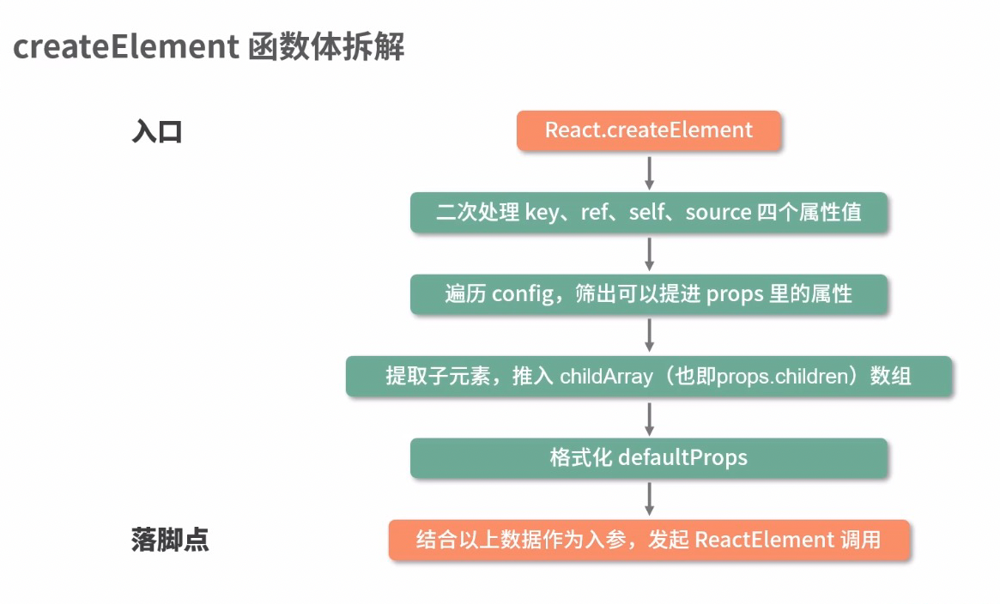

<br/>

- **1.1createElement函数代码讲解**

	- **1.1.1 如何映射为DOM树**

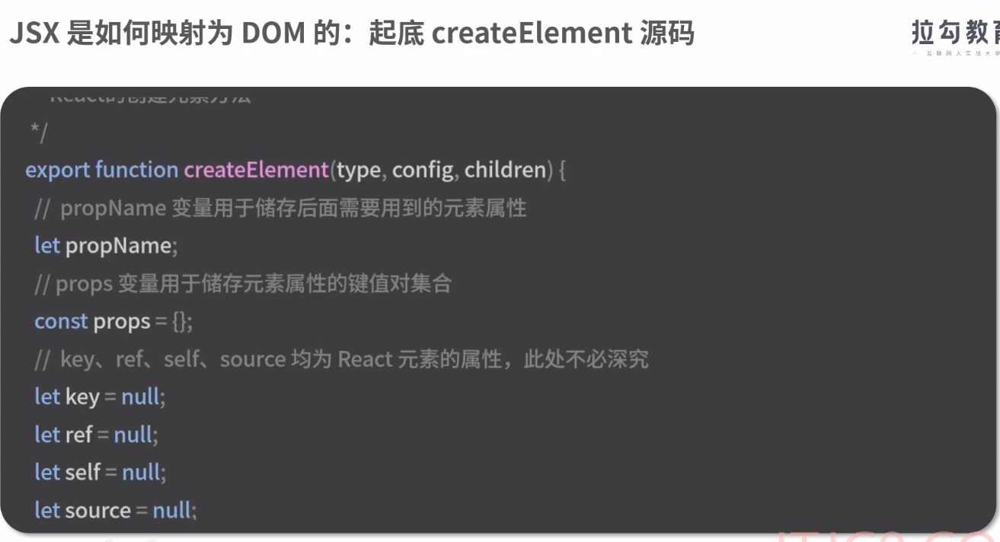

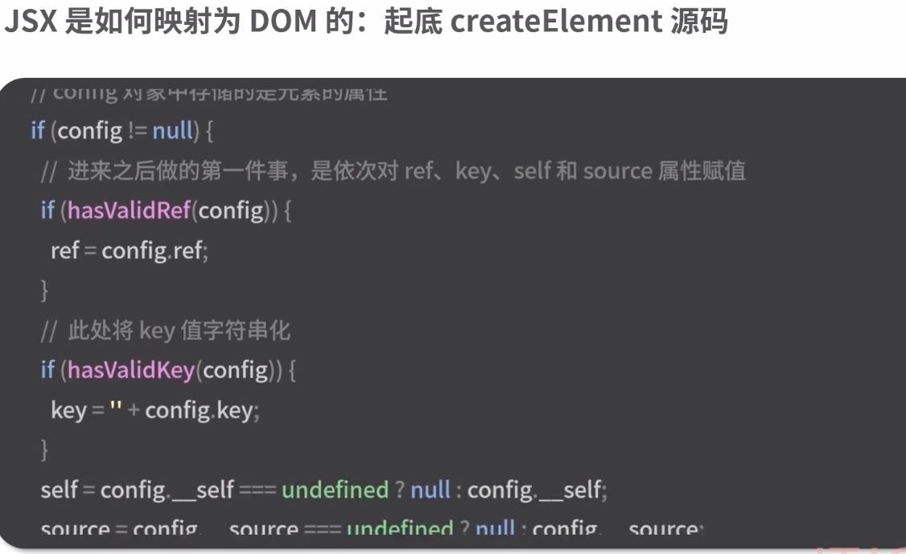


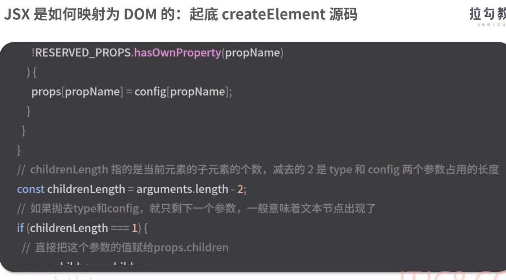

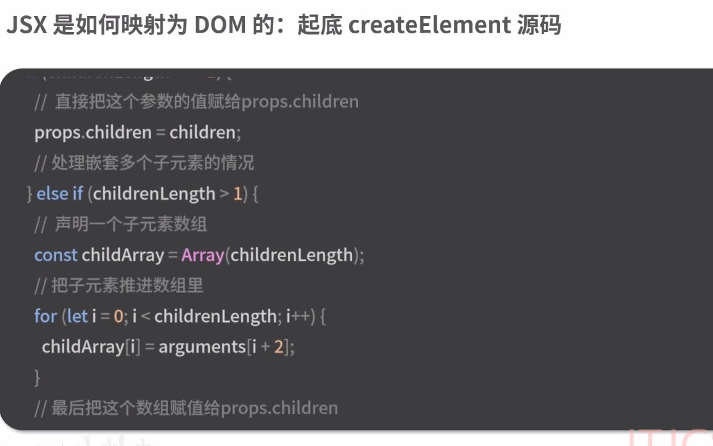

<br/>
<br/>

- **2.React渲染流程**

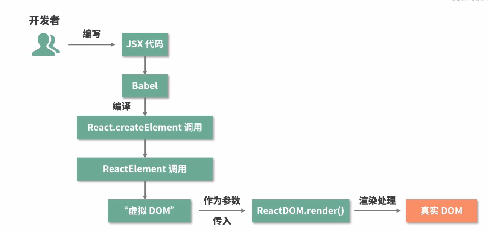


<br/>

- **3.虚拟Dom树**

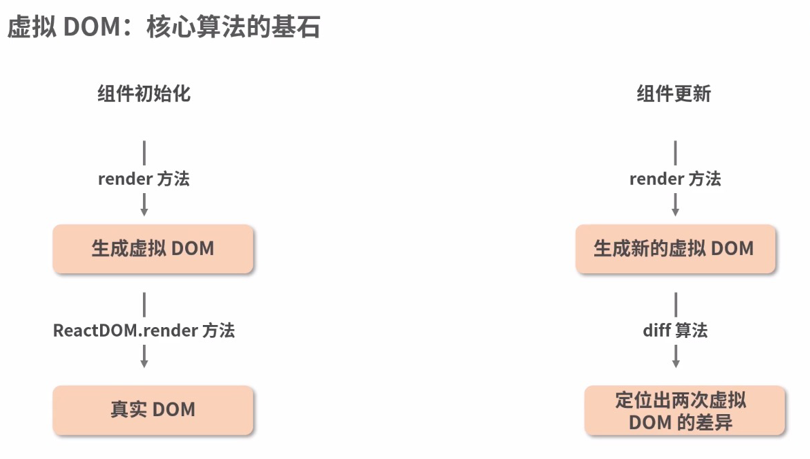


<br/>
<br/>
<br/>

***
<br/>


> <h1 id="CSS使用">CSS使用</h1>


<br/>

>## <h2 id="文件模块化">[文件模块化](https://www.html.cn/create-react-app/docs/adding-a-css-modules-stylesheet/)</h2>

&emsp; CSS文件使用 **文件名.module.css**,然后在js文件导入使用即可,避免css名字污染问题.

Button-style.module.css

```
.headText {
    font-size: 13px;
    font-family: PingFangSC-Regular, PingFang SC;
    font-weight: 400;
    color: #333333;
    line-height: 18px;
}
```

在Button.js中使用

```
import CallingVerifyStyle from './calling-verify.module.css';

render(
	return (
		<div className={CallingVerifyStyle.headText}/>
	)
)
```


<br/>
<br/>

> <h2 id="props用法">props用法</h2>

<br/>

> <h3 id="设置默认值">设置默认值</h3>

```
<body>

<div id="example"></div>
<script type="text/babel">
class HelloMessage extends React.Component {
	
	static defaultProps = {// 写法一: 在组件的里面
		name: '12345'
	}
	
  render() {
    return (
      <h1>Hello, {this.props.name}</h1>
    );
  }
}

HelloMessage.defaultProps = {// 写法二: 在组件的外面
  name: 'Runoob'
};

const element = <HelloMessage/>;

ReactDOM.render(
  element,
  document.getElementById('example')
);
</script>

</body>
```

效果图:

**Hello,Runoob**


<br/>
<br/>

> <h3 id="props类型验证">props类型验证</h3>

&emsp; Props 验证使用 propTypes，它可以保证我们的应用组件被正确使用，React.PropTypes 提供很多验证器 (validator) 来验证传入数据是否有效。当向 props 传入无效数据时，JavaScript 控制台会抛出警告.

```

class MyTitle extends React.Component {
  render() {
    return (
      <h1>Hello, {this.props.title}</h1>
    );
  }
}
 
 
// 设置类型为string
MyTitle.propTypes = {
  title: PropTypes.string
};
```


<br/><br/><br/>
> <h2 id="ReactDOM">React DOM</h2>

- react.js是React的核心文件，如组件、Hooks、虚拟DOM等，都在这个文件中。
- react-dom.js则是对真实DOM的相关操作，如将虚拟DOM渲染到真实DOM里，或者从真实DOM中获取节点。


<br/>

**介绍：**ReactDOM对象是react-dom.js提供的一个用于进行DOM操作的对象，在该对象下有一系列API用于操作DOM。在React中需要和真实的DOM打交道时都需要通过ReactDOM的API进行。当然也可以使用一些原生DOM的API，但并不推荐这么做。


<br/>
> <h3 id='ReactDom.render'>ReactDom.render</h3>

```
ReactDOM.render(element, container[, callback])
```

- render方法是ReactDOM在开发时唯一常用的API。render方法用于将React生成的虚拟DOM生成到真实的DOM中去。
- element是React生成的虚拟DOM，也叫作ReactElement或ReactNode。除此之外也可以使用字符串去实现。
- element要放置在container的容器中，它必须是一个已经存在的真实DOM节点。
- callback是将ReactNode渲染到container之后的回调函数。


**index.js文件**
```
ReactDOM.render(
  // <h1>Hello World</h1>,
  'Hello React',
  document.getElementById('root'),
  () => {
    console.log('渲染完成了')
  }
);
```

效果：


这里将“Hello React”这段字符串渲染到了#root这个div中，当然也可以利用React-Node做更复杂的结构渲染。

render方法通常用来渲染整个项目的根组件，其他组件都在根组件中一层层调用。在使用render方法时要注意container中如果有其他子内容都会被替换掉。另外render方法并不会修改container的其他特性，只是修改container的内容。


<br/>

> <h3 id=''></h3>


<br/>
<br/>


> <h2 id="React视图渲染">React视图渲染</h2>


<br/>

> <h3 id='React.createElement'>React.createElement</h3>


当需要用React创建虚拟DOM时，React专门提供了一个方法createElement()。注意该方法并非是原生DOM中的createElement。

```
React.createElement(type, config, children)
```


**具体参数如下:**

1）type要创建的标签类型。如要创建的是个div标签，则写React.createElement（＂div＂），一定注意type的类型是一个字符串。

2）congfig参数是设置生成的节点的相关属性，这里要注意congfig的类型是一个纯对象;

3）children代表该元素的内容或者子元素,可以放字符串，数组等

示例如下：

```
let h1 = React.createElement('h1', null, 'Hello React')
let p = React.createElement('p', null, '欢迎吃🍎')
React.createElement("h1", {
    id: "title",
    className: "title",
    title: "港青",
    style: {
        width: '100px',
        height: '100px'
    }
}, [h1, p])
```

<br/>

> <h3 id=''></h3>


<br/>
<br/>


> <h2 id="项目文件描述">项目文件描述</h2>


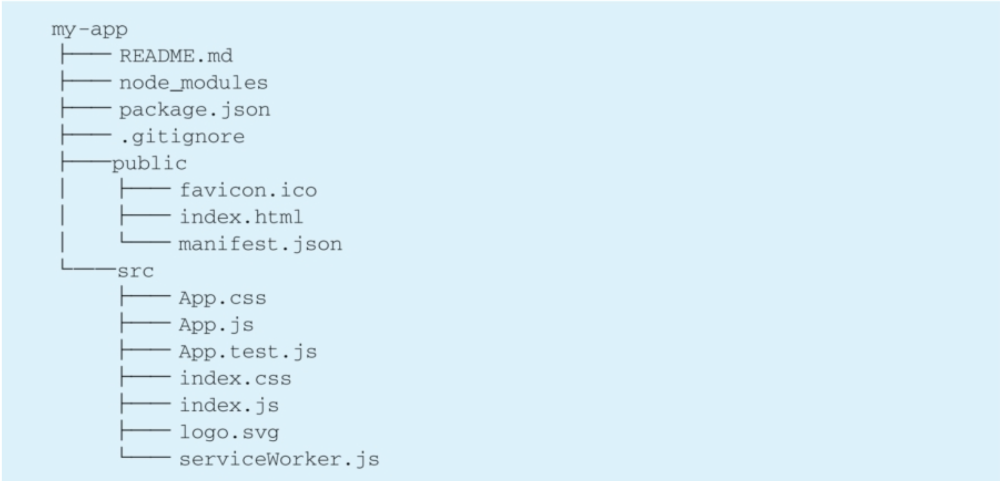

- node_modules，在项目中安装的依赖都会放在这个文件夹下

- package.json，是整个项目的描述文件，里边有两块内容这里详细说一下。

	- ①dependencies项目安装的依赖名称及版本信息。可以看到在构建完的项目中，已经帮开发者安装好了一些基本的依赖：＂react＂:＂^16.13.1＂，＂react-dom＂:＂^16.13.1＂，＂react-scripts＂:＂3.4.1＂。react和react-dom不需要再复述了。react-scripts是什么？create-react-app会把webpack、Babel、ESLint配置好合并在一个包里，方便开发人员使用，这个包就是react-scripts。
	
	- ②scripts中定义的是在命令行工具中可以使用到的一些命令。在当前目录my-app中，启动命令行工具，一起来测试一下这些命令

- public文件夹。用来存放html模板。public文件夹中的index.html就是项目的html模板，不建议读者修改名字，否则需要重新配置html文件。
- src文件夹。该文件夹中index.js是整个项目的入口文件。为了加快重新构建的速度，webpack只处理src中的文件。注意要将JS和CSS文件放在src中，否则该文件不会被webpack打包。


<br/>


> React.StrictMode

&emsp; StrictMode是用来检查项目中是否有潜在风险的检测工具，类似于JavaScript中的严格模式。StrictMode跟Fragment类似，不会渲染任何真实的DOM。只是为后代元素触发额外的检查和警告。

&emsp; StrictMode可以在代码中的任意地方使用，当然也可以直接用在index.js中，开启全局检测。除上述描述的特征外，StrictMode检查只在开发模式下运行，不会与生产模式冲突。

<br/>

**检测的项目如下：**

1）识别具有不安全生命周期的组件。

2）有关旧式字符串ref用法的警告。

3）关于已弃用的findDOMNode用法的警告。

4）检测意外的副作用。

5）检测遗留的context API。


在StrictMode模式下，如果检测到代码有以上问题，React会在控制台中打印出相应的警告。


<br/>
<br/>
<br/>

> <h3 id='import和require'>import和require</h3>

- **调用时间**
	- require 是运行时调用，所以理论上可以运作在代码的任何地方
	- import 是编译时调用，所以必须放在文件的开头

<br/>

- **本质区别：**
	- require 是赋值过程，其实require的结果就是对象、数字、字符串、函数等，再把结果赋值给某个变量。它是普通的值拷贝传递。

	- import 是解构过程。使用import导入模块的属性或者方法是引用传递。且import是read-only的，值是单向传递的。default是ES6 模块化所独有的关键字，export default {} 输出默认的接口对象，如果没有命名，则在import时可以自定义一个名称用来关联这个对象

<br/>

**require用法展示**


&emsp; 在导出的文件中使用module.exports对模块中的数据导出，内容类型可以是字符串，变量，对象，方法等不予限定。使用require()引入到需要的文件中即可

&emsp; 在模块中，将所要导出的数据存放在module的export属性中，在经过CommonJs/AMD规范的处理，在需要的页面中使用require指定到该模块，即可导出模块中的export属性并执行赋值操作（值拷贝）

```
// module.js
module.exports = {
    a: function() {
        console.log('exports from module');
    }
}
```

```
// sample.js
var obj = require('./module.js');
obj.a()  // exports from module
```

&emsp; 当我们不需要导出模块中的全部数据时，使用大括号包含所需要的模块内容

```
// module.js
function test(str) {
  console.log(str); 
}
module.exports = {
 test
}
```


```
// sample.js
let { test } =  require('./module.js');
test ('this is a test');
```


<br/>

**import 的基本语法**

&emsp; 使用import导出的值与模块中的值始终保持一致，即引用拷贝，采用ES6中解构赋值的语法，import配合export结合使用

```
// module.js
export function test(args) {
  console.log(args);
}
// 定义一个默认导出文件, 一个文件只能定义一次
export default {
  a: function() {
    console.log('export from module');
  }
}

export const name = 'gzc'
```

```
// 使用_导出export default的内容
import _, { test, name } from './a.js'

test(`my name is ${name}`)  // 模板字符串中使用${}加入变量
```


<br/>

> <h3 id=''></h3>


<br/>
<br/>

>## <h2 id="生命周期方法">[生命周期方法](https://www.runoob.com/react/react-component-life-cycle.html)</h2>


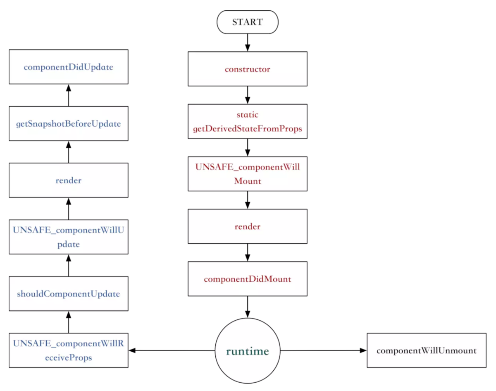


<br/>

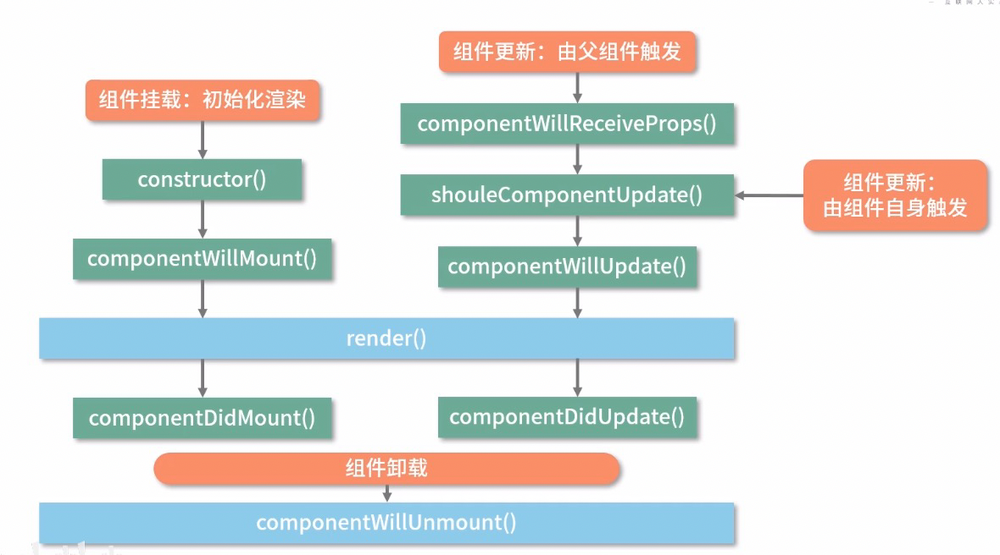

- **componentWillMount** 在渲染前调用,在客户端也在服务端。

- **componentDidMount :** 在第一次渲染后调用，只在客户端。之后组件已经生成了对应的DOM结构，可以通过this.getDOMNode()来进行访问。 如果你想和其他JavaScript框架一起使用，可以在这个方法中调用setTimeout, setInterval或者发送AJAX请求等操作(防止异步操作阻塞UI)。

- **componentWillReceiveProps：** 这个方法在初始化render时不会被调用，在组件接收到一个新的 prop (更新后)时被调用。一般用于父组件状态更新时子组件的重新渲染。这个东西十分好用，但是一旦用错也会造成十分严重的后果。

- **shouldComponentUpdate** 返回一个布尔值。在组件接收到新的props或者state时被调用。在初始化时或者使用forceUpdate时不被调用。可以在你确认不需要更新组件时使用。

- **componentWillUpdate**在组件接收到新的props或者state但还没有render时被调用。在初始化时不会被调用。

- **componentDidUpdate** 在组件完成更新后立即调用。在初始化时不会被调用。
- **componentWillUnmount**在组件从 DOM 中移除之前立刻被调用。


<br/>

- 组件的构造

```
import React,{ Component } from 'react';

class Demo extends Component {
  constructor(props,context) {
      super(props,context)
      this.state = {
          //定义state
      }
  }
componentWillMount () {}

componentDidMount () {}

//这种方式十分适合父子组件的互动，通常是父组件需要通过某些状态控制子组件渲染亦或销毁...
componentWillReceiveProps (nextProps) {//componentWillReceiveProps方法中第一个参数代表即将传入的新的Props
	if (this.props.sharecard_show !== nextProps.sharecard_show){
        //在这里我们仍可以通过this.props来获取旧的外部状态
        //通过新旧状态的对比，来决定是否进行其他方法
        if (nextProps.sharecard_show){
            this.handleGetCard();
        }
}

shouldComponentUpdate (nextProps,nextState) {}

componentWillUpdate (nextProps,nextState) {}

componentDidUpdate (prevProps,prevState) {}

render () {
    return (
        <div></div>
    )
}

componentWillUnmount () {}
}

export default Demo;
```


<br/>
<br/>

**测试Demo：**

```

class Button extends React.Component {
  constructor(props) {
      super(props);
      this.state = {data: 0};
      this.setNewNumber = this.setNewNumber.bind(this);
  }
  
  setNewNumber() {
    this.setState({data: this.state.data + 1})
  }
  render() {
      return (
         <div>
            <button onClick = {this.setNewNumber}>INCREMENT</button>
            <Content myNumber = {this.state.data}></Content>
         </div>
      );
    }
}
 
 
class Content extends React.Component {
  componentWillMount() {
      console.log('Component WILL MOUNT!')
  }
  componentDidMount() {
       console.log('Component DID MOUNT!')
  }
  componentWillReceiveProps(newProps) {
        console.log('Component WILL RECEIVE PROPS!')
  }
  shouldComponentUpdate(newProps, newState) {
        return true;
  }
  componentWillUpdate(nextProps, nextState) {
        console.log('Component WILL UPDATE!');
  }
  componentDidUpdate(prevProps, prevState) {
        console.log('Component DID UPDATE!')
  }
  componentWillUnmount() {
         console.log('Component WILL UNMOUNT!')
  }
 
    render() {
      return (
        <div>
          <h3>{this.props.myNumber}</h3>
        </div>
      );
    }
}
ReactDOM.render(
   <div>
      <Button />
   </div>,
  document.getElementById('example')
);

```


效果图：

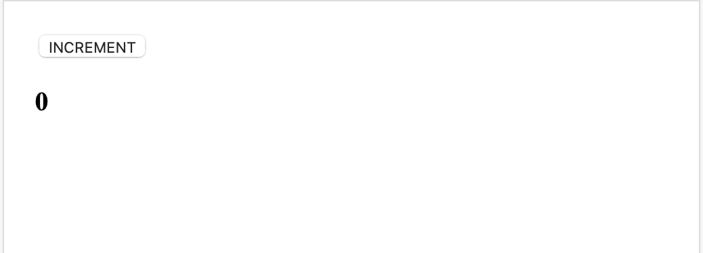


控制台打印：

```
Component WILL MOUNT!
Component DID MOUNT!
```


点击按钮进行+1，控制台打印：

```
Component WILL RECEIVE PROPS!
Component WILL UPDATE!
Component DID UPDATE!
```

<br/>
<br/>


> <h2 id="构造函数constructor">构造函数constructor</h2>

```
Constructor(props){  
     super(props);  
}  
```

- 在React中，构造函数主要用于两个目的：
	- 它用于通过向this.state分配对象来初始化组件的本地状态。
	- 它用于绑定组件中出现的事件处理程序方法。

**注意：** 如果你的React组件既不初始化状态，也不绑定方法，那么就不需要实现React组件的构造函数。

&emsp; 不能在构造函数()中直接调用setState()方法。如果组件需要使用本地状态，则需要直接使用’this.state ‘，在构造函数中分配初始状态。构造函数只使用这个来分配初始状态，所有其他方法都需要使用set.state()方法。

App.js

```
import React, { Component } from 'react';  
  
class App extends Component {  
  constructor(props){  
    super(props);  
    this.state = {  
         data: 'www.srcmini.com'  
      }  
    this.handleEvent = this.handleEvent.bind(this);  
  }  
  handleEvent(){  
    console.log(this.props);  
  }  
  render() {  
    return (  
      <div className="App">  
    <h2>React构造函数例子</h2>  
    <input type ="text" value={this.state.data} />  
        <button onClick={this.handleEvent}>点击</button>  
      </div>  
    );  
  }  
}  
export default App;  
```

main.js

```
import React from 'react';  
import ReactDOM from 'react-dom';  
import App from './App.js';  
  
ReactDOM.render(<App />, document.getElementById('app'));  
```


<br/>

> 有必要在构造函数中调用super()吗？

&emsp; 是的，有必要在构造函数中调用super()。如果需要在组件的构造函数中设置属性或访问’this’，则需要调用super()。

```
class App extends Component {  
    constructor(props){  
        this.fName = "Jhon"; // this'在super()之前是不允许的  
    }  
    render () {  
        return (  
            <p> Name: { this.props.name }</p>  
        );  
    }  
}  
```

&emsp; 当你运行上面的代码时，会得到一个错误，在super()之前不允许使用’this’。因此，如果需要访问构造函数中的道具，需要调用super(props)。


<br/>

> 箭头函数

&emsp;  箭头函数是ES6标准的新特性。如果需要使用箭头函数，则没有必要将任何事件绑定到’this ‘。在这里，“this”的范围是全局的，不局限于任何调用函数。因此，如果你使用的是箭头函数，就不需要在构造函数中绑定’this’。


```
import React, { Component } from 'react';  
  
class App extends Component {  
  constructor(props){  
    super(props);  
    this.state = {  
         data: 'www.srcmini.com'  
      }  
  }  
  handleEvent = () => {  
    console.log(this.props);  
  }  
  render() {  
    return (  
      <div className="App">  
    <h2>React构造函数例子</h2>  
    <input type ="text" value={this.state.data} />  
        <button onClick={this.handleEvent}>点击</button>  
      </div>  
    );  
  }  
}  
export default App;  
```


***
<br/><br/><br/>
> <h2 id='ReactHooks'>React Hooks</h2>


<br/><br/>
> <h3 id='useState'>useState</h3>


```
function useState<S>(initialState: S | (() => S)): [S, Dispatch<SetStateAction<S>>];

// 简化
const [state, setState] = useState(initialState)
```

&emsp; 调用该方法时传入state的初始值，该方法会返回一个数组，数组的第0位是state具体的值，而第1位是修改该state的方法，同类组件的setState方法一样，调用该方法会更新state，然后引起视图更新。


**HOC.js**

```
export function TestHOC1() {
    const [name, setName] = useState('kkb')
    return <div>
        <p>{name}</p>
        <button
            onClick={() => {
                setName('开课吧')
            }}>
            显示全称
        </button>
    </div>
}
```


效果图: 

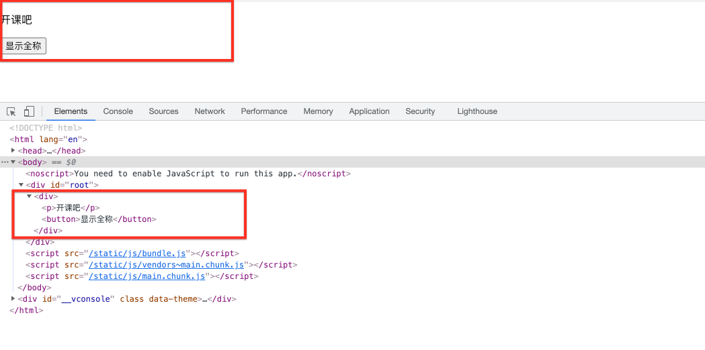

**在使用useState时，有三个问题要注意:**

1）useState返回的setState方法同类组件的setState一样，也是一个异步方法，需要组件更新之后state的值才会变成新值;

2）useState返回的setState并不具有类组件的setState合并多个state的作用，如果state中有个多state，在更新时，其他值一同更新.


```
export function TestHOC2() {
    const [data, setData] = useState({ name: 'kkb', age: 10 })
    return <div>
        <p>{data.name}</p>
        <button
            onClick={() => {
                setData({
                    ...data, name: '开课吧'
                })

            }}>
            显示全称
        </button>
    </div >
}
```

效果图: 

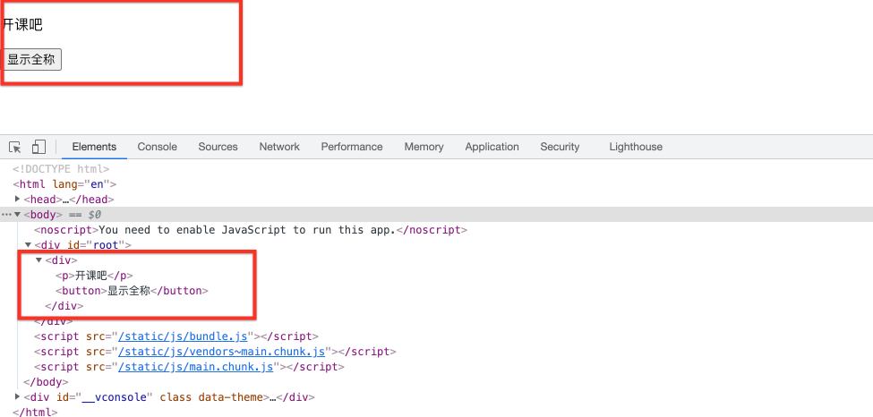


<br/><br/>
> <h3 id="函数组件中添加状态useState">函数组件中添加状态useState</h3>

React 中的 **`useState` Hook 语法**，用于在函数组件中添加状态（state）。

<br/>

```js
const [状态变量, 设置状态的函数] = useState(初始值);
```

例如：


```js
const [locale, setLocale] = useState('en');
```

就是：

* `locale` 就是当前的语言（比如当前en）
* `setLocale()` 是改变这个状态的方法
* 每次你调用 `setLocale()`，React 会**重新渲染这个组件**
	* 创建一个状态 `locale`（当前语言）
	* 初始值是 `'en'`
	* 使用 `setLocale('zh')` 可以把语言变成中文
	
<br/>

**🔁 状态使用示例：切换语言**

```jsx
function App() {
  const [locale, setLocale] = useState('en'); // 当前语言

  const switchLang = () => {
    setLocale(locale === 'en' ? 'zh' : 'en'); // 点击切换
  };

  return (
    <div>
      <p>当前语言: {locale}</p>
      <button onClick={switchLang}>切换语言</button>
    </div>
  );
}
```


<br/><br/>
> <h3 id='useEffect'>useEffect</h3>

&emsp;Effect翻译成专业术语称之为副作用。网络请求、DOM操作都是副作用的一种，useEffect就是专门用来处理副作用的。在类组件中副作用通常在componentDid-Mount和componentDidUpdate中进行处理，而useEffect就相当于componentDidMount、componentDidUpdate和componentWillUnmount的集合体。useEffect包括两个参数执行时的回调函数和依赖参数，并且回调函数还有一个返回函数


```
function TestHOC3_1() {
    const [course, setCourse] = useState('Web高级工程师')
    const [num, setNum] = useState(1)

    useEffect(() => {
        console.log('✈️组件挂载或更新')
        return () => {
            console.log('✈️清理更新前的一些全局类容， 或检测组件即将卸载')
        };
    }, [num]) // 只有num更新时才会执行回调函数
					    // 一定注意依赖参数要传入一个空数组，不传的话组件的任何更新都会调用该副作用


    return <div>
        <div>
            选择课程：
            <select
                value={course}
                onChange={({ target }) => { setCourse(target.value) }}
            >
                <option value='Web 全栈工程师'>Web 全栈工程师</option>
                <option value='Web 高级工程师'>Web 高级工程师</option>

            </select>
        </div>
        <div>
            购买数量：
            <input
                type='number'
                value={num}
                min={1}
                onChange={({ target }) => { setNum(target.value) }}
            >

            </input>
        </div>
    </div>
}

export function TestHOC3() {
    const [show, setShow] = useState(true)

    return <div>
        {show ? <TestHOC3_1 /> : ''}
        <button onClick={() => {
            setShow(!show)
        }}>
            {show ? '隐藏课程' : '显示课程'}
        </button>
    </div>
}


```


效果图: 

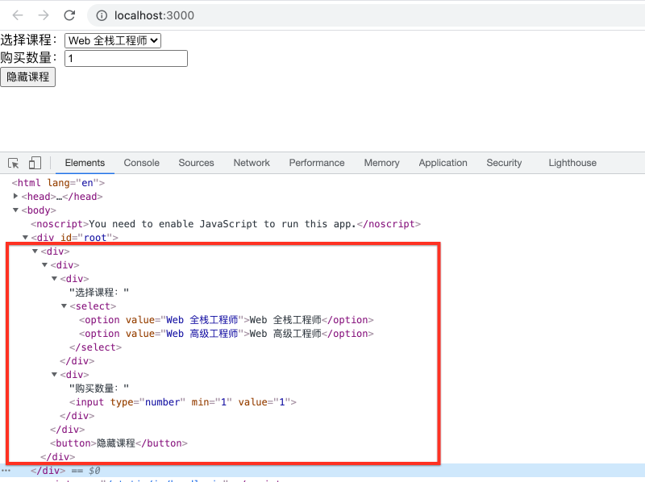


依赖参数，其本身是一个数组，在数组中放入要依赖的数据，当这些数据有更新时，就会执行回调函数。整个组件的生命周期过程如下：

组件挂载→执行副作用（回调函数）→组件更新→执行清理函数（返还函数）→执行副作用（回调函数）→组件准备卸载→执行清理函数（返还函数）→组件卸载。

上文讲过useEffect是componentDidMount、componentDidUpdate和componentWillUnmount的集合体，如果单纯只想要在挂载后、更新后、卸载前其中之一的阶段执行，可以参考以下操作。

①componentDidMount。如果只想要在挂载后执行，可以把依赖参数置为空，这样在更新时就不会执行该副作用了。

②componentWillUnmount。如果只想要在卸载前执行，同样把依赖参数置为空，该副作用的返还函数就会在卸载前执行。

③componentDidUpdate。只检测更新相对比较麻烦，需要区分更新还是挂载需要检测依赖数据和初始值是否一致，如果当前的数据和初始数据保持一致就说明是挂载阶段，当然安全起见应和上一次的值进行对比，若当前的依赖数据和上一次的依赖数据完全一样，则说明组件没有更新


<br/><br/>
> <h3 id="副作用useEffect3种使用场景"> 副作用useEffect3种使用场景</h3>

**`useEffect()`** 是一个常用 Hook，用于**处理副作用（side effects）**，比如：

* 页面加载时执行某些操作
* 监听某个状态变化
* 订阅/清理定时器、事件、网络请求等

***
<br/>

**✅ 1.页面加载时执行某些操作（如获取数据）**

```jsx
import { useEffect } from 'react';

function PageLoadExample() {
  useEffect(() => {
    console.log('📦 页面加载完成时运行一次');

    // 模拟数据请求
    fetch('https://jsonplaceholder.typicode.com/posts/1')
      .then(res => res.json())
      .then(data => console.log('数据:', data));
  }, []); // 👈 空数组：只在初始加载时执行一次

  return <h2>页面加载示例</h2>;
}
```

<br/>

**2.监听某个状态变化（如语言、搜索词）**

```js
import { useEffect, useState } from 'react';

function App() {
  const [locale, setLocale] = useState('en');

  useEffect(() => {
    console.log(`语言变化为：${locale}`);
  }, [locale]); // 👈 当 locale 变化时会触发这个函数

  return (
    <div>
      <button onClick={() => setLocale(locale === 'en' ? 'zh' : 'en')}>
        切换语言
      </button>
    </div>
  );
}
```

<br/>

**总结：Hooks 小抄表**

| Hook          | 用途            | 示例                                      |
| ------------- | ------------- | --------------------------------------- |
| `useState()`  | 定义组件内的状态      | `const [count, setCount] = useState(0)` |
| `useEffect()` | 处理副作用（如加载、监听） | `useEffect(() => {}, [依赖])`  

<br/>

**✅3.订阅/清理定时器、事件、WebSocket 等**

```jsx
import { useEffect, useState } from 'react';

function TimerExample() {
  const [count, setCount] = useState(0);

  useEffect(() => {
    console.log('⏱ 启动定时器');
    const timer = setInterval(() => {
      setCount(c => c + 1);
      
      /** 执行1000次停止的逻辑
      setCount(c => {
	      if (c >= 1000) {
	        clearInterval(timer); // ✅ 手动清理定时器
	        return c;
	      }
	      return c + 1;
	    });
      */
    }, 1000); // 每隔 1000 毫秒（即 1 秒）执行一次这个回调函数，注意： 不是执行1000次就停止定时器
    
    // useEffect 中的**“清理函数”（cleanup function），它的执行时机并不是由业务逻辑控制（比如计数到 1000）**，而是由 React 控制组件生命周期。
    return () => {
      console.log('🧹 清除定时器');
       // 当下次 useEffect 执行前，先清理旧的副作用
      clearInterval(timer);
    };
  }, []); // 👈 只在首次加载时设置定时器，并在卸载时清除

  return <h2>计数：{count}</h2>;
}
```

**✅ 总结：**

* `setInterval()`/`addEventListener()` 等副作用需要在 `useEffect` 中设置
* 在 `return` 中编写清理函数（卸载组件或重新执行前会自动调用）
* 类似类组件的 `componentWillUnmount`


<br/>
***

**整体总结表：**

| 场景               | `useEffect` 形式                                  | 用途说明          |
| ---------------- | ----------------------------------------------- | ------------- |
| 页面加载时运行一次        | `useEffect(() => { ... }, [])`                  | 获取数据、初始化      |
| 状态/props 变化时运行   | `useEffect(() => { ... }, [value])`             | 响应式监听状态变化     |
| 订阅/定时器/事件绑定 + 清理 | `useEffect(() => { ...; return () => {} }, [])` | 生命周期内安全处理外部资源 |     


<br/><br/>
> <h3 id="useEffect中多个网络请求实例编码">useEffect中多个网络请求实例编码</h3>

当 `viewModel`、`viewModel11`、`viewModel12` 中的某个实例变化时，重新执行请求。

你写的：

```jsx
useEffect(() => {
  viewModel.fetchUnitList().then(data => {
    setUnitList(data);
  });
  viewModel11.fetchUnitList11().then(data => {
    setUnitList(data);
  });
  viewModel12.fetchUnitList12().then(data => {
    setUnitList(data);
  });
}, [viewModel, viewModel11, viewModel12]);
```

-  **✅ 可行性分析：**

	- 1.✅ 这确实能做到当依赖数组中某个 `viewModel` 发生变化时重新执行副作用（网络请求）。
	- 2.❌ 但 `setUnitList` 被你连续三次调用，**后者会覆盖前者的结果**，最终只有 `viewModel12` 的数据留下。

---
<br/>


**✅ 正确优雅的做法（分离状态，或合并数据）**

 **✅ 方式一：多个 State，分别存每个请求的结果**

```jsx
const [unitList, setUnitList] = useState([]);
const [unitList11, setUnitList11] = useState([]);
const [unitList12, setUnitList12] = useState([]);

useEffect(() => {
  viewModel.fetchUnitList().then(setUnitList);
  viewModel11.fetchUnitList11().then(setUnitList11);
  viewModel12.fetchUnitList12().then(setUnitList12);
}, [viewModel, viewModel11, viewModel12]);
```

这样每组数据独立存储，不会覆盖。

<br/>

**✅ 方式二：一个状态里合并多个结果**

```jsx
const [allData, setAllData] = useState({
  main: [],
  list11: [],
  list12: [],
});

useEffect(() => {
  Promise.all([
    viewModel.fetchUnitList(),
    viewModel11.fetchUnitList11(),
    viewModel12.fetchUnitList12(),
  ]).then(([main, list11, list12]) => {
    setAllData({ main, list11, list12 });
  });
}, [viewModel, viewModel11, viewModel12]);
```

- **优点：**
	* 请求是并发的；
	* 状态整合成一个对象，管理更方便；
	* 页面渲染可以这样写：

```jsx
<ul>
  {allData.main.map(...)}
</ul>
<ul>
  {allData.list11.map(...)}
</ul>
```

<br/>

**✅ 方式三：若你只希望在“初次渲染”时调用，不依赖变化**

```jsx
useEffect(() => {
  // 只执行一次
}, []);
```

<br/>

 **🚫 错误示例：不要这样做！**

```jsx
// 这样会丢数据
setUnitList(data); // 被后面的 setUnitList 覆盖
```


<br/><br/>
> <h3 id="useEffect中执行多个网络请求">useEffect中执行多个网络请求</h3>


**✅ 🌟 写法一：并行请求（多个接口同时请求）**

```js
useEffect(() => {
  const fetchData = async () => {
    try {
      setLoading(true);

      const [userRes, productRes] = await Promise.all([
        fetch('/api/user'),
        fetch('/api/products')
      ]);

      const user = await userRes.json();
      const products = await productRes.json();

      setUser(user);
      setProducts(products);
    } catch (error) {
      console.error('出错了:', error);
      setError(error);
    } finally {
      setLoading(false);
    }
  };

  fetchData();
}, []);
```

<br/>


**✅ 🌟 写法二：串行请求（第二个请求依赖第一个结果）**

```js
useEffect(() => {
  const fetchData = async () => {
    try {
      setLoading(true);

      const userRes = await fetch('/api/user');
      const user = await userRes.json();
      setUser(user);

      const productRes = await fetch(`/api/products?userId=${user.id}`);
      const products = await productRes.json();
      setProducts(products);
    } catch (error) {
      setError(error);
    } finally {
      setLoading(false);
    }
  };

  fetchData();
}, []);
```

<br/>

 ✅ **2.useEffect 中监听多个变量怎么写？**


```js
useEffect(() => {
  // 逻辑或网络请求
}, [username, password, token]);
```

**✅ 意思：**

> 当 `username`、`password` 或 `token` 中任意一个值发生变化时，`useEffect` 会重新执行。

<br/>

-  ❗ 注意点：

	* 如果你写成空数组 `[]`，意味着这个 `useEffect` **只执行一次（初始挂载）**。
	* 如果你依赖了某个值却没放入数组，会出现“闭包引用旧值”的 bug。

---
<br/>


**✅ 综合示例：多个依赖 + 多个请求**

```js
useEffect(() => {
  const fetchAll = async () => {
    try {
      setLoading(true);

      const userRes = await fetch(`/api/user?name=${username}`);
      const user = await userRes.json();
      setUser(user);

      const productRes = await fetch(`/api/products?token=${token}`);
      const products = await productRes.json();
      setProducts(products);
    } catch (e) {
      setError(e);
    } finally {
      setLoading(false);
    }
  };

  fetchAll();
}, [username, token]); // ✅ 多个依赖
```


<br/><br/>
># <h3 id="副作用钩子useEffect末尾3种参数使用方法">[副作用钩子useEffect末尾3种参数使用方法](./架构模式.md#副作用钩子useEffect末尾3种参数使用方法)</h3>

<br/><br/>
> <h3 id='useCallback'>useCallback</h3>

**useCallback(fn,deps):**
- fn就是是一个函数，把你想要做的事放到函数中
- deps就是指fn函数所依赖的参数,如果没有依赖就可以不需要引入

&emsp; useCallback的返回值是一个memoized回调函数，在它所依赖的参数不变的而情况下，(也就是指deps中的参数)返回的回调函数地址不变，如果依赖的参数发生变化，usecallback就会返回一个新的memoized回调函数，这时函数地址也会发生改变.
&emsp; useCallback的这种形式和createRef、useRef有点相似，createRef函数创建的ref在每次执行时，或者重新更新组件时都会重新去创建ref，这时ref和之前的ref不同.但是通过useRef创建ref就不会出现这个问题，因为useRef创建的ref可以作为全局变量，它不会随着函数重新执行或者组件更新而去重新创建。

**DEMO**

```
mport React, { useEffect, useState, useCallback, memo } from 'react';

function TestApp1() {
    let [count, setCount] = useState(0);

    const childClick = useCallback(() => {
        console.log("you click child")
    }, [count])

    function parentClick() {
        console.log("you click parent count: ", count);
        count++;

        if (count === 4)
            setCount(count);
    }

    return (
        <div>
            <div style={{ background: 'red', height: 44 }} onClick={parentClick}>ParentComponent</div>
            <ChildComponent childClick={childClick}></ChildComponent>
        </div>
    )
}

const ChildComponent = memo((props) => {
    console.log("ChildComponent is running")

    return <div onClick={props.childClick} style={{ background: 'yellow', height: 44 }} >
        ChildComponent
    </div>
})

//或者在定义ChildComponent时外面不要包裹一层memo,可用const ChildComponentMemo = memo(ChildComponent);


export default TestApp1
```

使用:

```
  render() {
	  return (
            <TestApp1/>
        )
  }
```

效果图:

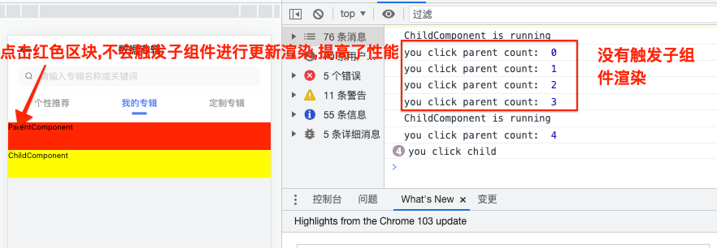


<br/><br/>
> <h2 id='useEffect参数加函数和中扩号的区别'>useEffect参数加函数和中扩号的区别</h2>

```jsx

useEffect(() => {initTableData()}, [ initTableData]);

和

useEffect(() => {initTableData()}, [ ]);
```
**2者有啥区别吗？**

非常好 👏，这个问题是 React 中非常关键但也很容易误解的点之一。
一句话总结前先上答案👇

<br/>

**一句话结论**

| 写法                                                      | 触发时机                                    | 特点                                                   |
| ------------------------------------------------------- | --------------------------------------- | ---------------------------------------------------- |
| `useEffect(() => { initTableData() }, [])`              | 只在**组件首次渲染**时执行一次                       | ✅ 常用于初始化（挂载时加载数据）                                    |
| `useEffect(() => { initTableData() }, [initTableData])` | 在**组件首次渲染** + **initTableData 发生变化**时执行 | ✅ 更“安全”，尤其当 `initTableData` 是一个依赖外部变量的 `useCallback` |

---
<br/>

**🧠 深入理解差别**

**💡 第一种：依赖为空数组 `[]`**

```js
useEffect(() => {
  initTableData();
}, []);
```

* 表示 “只在组件挂载时执行一次”，
* 后续无论 props/state 改变都不会再次执行。
* 相当于类组件的 `componentDidMount`。

<br/>

🧩 典型用法：

```js
useEffect(() => {
  fetchData(); // 页面首次加载拉数据
}, []);
```

---
<br/>

**💡 第二种：依赖 `[initTableData]`**

```js
useEffect(() => {
  initTableData();
}, [initTableData]);
```

<br/>

**✅ 场景：**

当 `initTableData` 是通过 `useCallback` 定义的函数时：

```js
const initTableData = useCallback(() => {
  fetch('/api/list?filter=' + filter);
}, [filter]);
```

> 因为 `initTableData` 依赖了 `filter`，
> 当 `filter` 改变 → `initTableData` 被重新创建 →
> 于是 `useEffect` 会重新执行一次，加载新的数据。

🧩 也就是：

> **`[initTableData]` 其实是间接依赖 `filter` 的变化。**

<br/>


**⚠️ 如果你写成 `[]`（但 initTableData 依赖了其他值）**

React 会报警告：

> ⚠️ React Hook useEffect has a missing dependency: 'filter'. Either include it or remove the dependency array.

这时，eslint-plugin-react-hooks 会告诉你：

> “你用了外部变量，但没有声明依赖，会造成闭包捕获旧值。”

---
<br/>

**✅ 实际建议**

| 情况                                   | 推荐写法                                                              |
| ------------------------------------ | ----------------------------------------------------------------- |
| `initTableData` 不依赖任何外部值（固定逻辑）       | `useEffect(() => { initTableData(); }, []);`                      |
| `initTableData` 用了外部变量（如 filter、id）  | `useEffect(() => { initTableData(); }, [initTableData]);`         |
| `initTableData` 本身不是 useCallback 定义的 | `useEffect(() => { initTableData(); }, []);` 或 直接写逻辑在 useEffect 内 |

---
<br/>

**示例对比**

** ❌ 错误示例（闭包陷阱）：**

```js
const initTableData = () => {
  fetch(`/api/list?filter=${filter}`);
};

useEffect(() => {
  initTableData();
}, []); // ❌ 只执行一次，filter 改变不会触发
```

---
<br/>

**✅ 正确示例：**

```js
const initTableData = useCallback(() => {
  fetch(`/api/list?filter=${filter}`);
}, [filter]);

useEffect(() => {
  initTableData();
}, [initTableData]); // ✅ filter 改变时会重新请求
```

---
<br/>

**✅ 最简总结表**

| 写法                | 依赖行为        | 常见用途      |
| ----------------- | ----------- | --------- |
| `[]`              | 仅初次执行       | 页面初次加载    |
| `[initTableData]` | 当函数或其依赖变时执行 | 数据联动刷新    |
| `[filter]`        | 当特定依赖变化时执行  | 筛选 / 搜索更新 |


<br/><br/>
> <h3 id='useMemo'>useMemo</h3>

&emsp; useMemo、useCallback用法都差不多，都会在第一次渲染的时候执行，之后会在其依赖的变量发生改变时再次执行，并且这两个hooks都返回缓存的值，useMemo返回缓存的变量，useCallback返回缓存的函数。

```js
import React, { useEffect, useState, useCallback, memo, useMemo } from 'react';

const Child = ({ name, onClick }) => {
    console.log('子组件?')
    return (
        <>
            <div style={{ color: name.color }}>我是一个子组件，父级传过来的数据：{name.name}</div>
            <button onClick={onClick.bind(null, '新的子组件name')}>改变name</button>
        </>
    );
}
const ChildMemo = memo(Child);

const TestApp1 = (props) => {
    const [count, setCount] = useState(0);
    const [name, setName] = useState('Child组件');

    return (
        <>
            <button onClick={(e) => { setCount(count + 1) }}>加1</button>
            <p>count:{count}</p>
            <ChildMemo
                //使用useMemo，返回一个和原本一样的对象，第二个参数是依赖性，当name发生改变的时候，才产生一个新的对象
                name={
                    useMemo(() => ({
                        name,
                        color: name.indexOf('name') !== -1 ? 'red' : 'green'
                    }), [name])
                }
                onClick={useCallback((newName) => setName(newName), [])}
            // {/* useCallback((newName: string) => setName(newName),[]) */}
            // {/* 这里使用了useCallback优化了传递给子组件的函数，只初始化一次这个函数，下次不产生新的函数*/}
            />
        </>
    )
}


export default TestApp1
```

使用:

```js
  render() {
	  return (
            <TestApp1/>
        )
  }
```


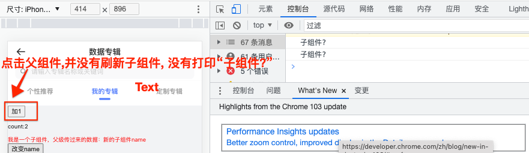

总结:在子组件不需要父组件的值和函数的情况下，只需要使用memo函数包裹子组件即可。而在使用函数的情况，需要考虑有没有函数传递给子组件使用useCallback。而在值有所依赖的项，并且是对象和数组等值的时候而使用useMemo（当返回的是原始数据类型如字符串、数字、布尔值，就不要使用useMemo了）。不要盲目使用这些hooks

***
<br/><br/><br/>
># <h2 id="useMemo的依赖数组">[useMemo的依赖数组](./架构模式.md#useMemo的依赖数组)</h2>


<br/>

> Hooks的使用规则


&emsp;Hooks使用规则了解Hooks的使用之后，还需要具体了解一下Hooks的使用规则，主要为以下两点：

1）只能在函数式组件和自定义Hooks之中调用Hooks，普通函数或者类组件中不能使用Hooks；

2）只能在函数的第一层调用Hooks。如果函数中还嵌套了流程控制语句如if或者for，这些地方是不能再调用Hooks的，当然函数中嵌套了子函数，子函数中也一样不能使用Hooks。Hooks的设计极度依赖其定义时候的顺序，如组件更新时Hooks的调用顺序变了，就会出现不可预知的问题。Hooks的使用则是为了保证Hooks调用顺序的稳定性。为此React提供一个ESLint plugin来做静态代码检测。eslint-plugin-react-hooks新版的脚手架中，也内置了这套检测。当代码中的Hooks使用不符合上述规范时，在开发环境中会有错误警告。

**注意：**

&emsp； 在使用自定义Hook时，同样需要遵守Hooks的使用规则，另外注意React要求自定义Hook的命名也必须以use开始，以区别于其他函数。


<br/><br/>
> <h3 id='长轮询案例'>[长轮询案例](https://codeantenna.com/a/veVh4iDVA7)</h3>

```js
const TestApp1 = () => {

    // 轮询管理器
    const intervalManager = myInterval(main)

    // 轮询的方法
    let count = 0
    function main() {
        count += 1
        if (count == 5) {
            count = 0
            intervalManager.stop()
        }
        console.log('🍎 执行：', count)
    }

    function main1() {
        const flag = parseInt(Math.random() * 2) === 1
        console.log('flag', flag)
        return flag ? Promise.resolve() : Promise.reject()
    }


    // 轮询
    function myInterval(callback, interval = 2000) {
        let timerId
        let isStop = false

        const start = async () => {
            isStop = false
            loop()
        }

        const stop = () => {
            console.log('❌ 停止执行')
            isStop = true
            clearTimeout(timerId)
        }

        const loop = async () => {
            try {
                await callback(stop)
            } catch (err) {
                console.error('轮询出错：', err)
                throw new Error('轮询出错：', err)
            }

            if (isStop) return
            return (timerId = setTimeout(loop, interval))
        }
        return {
            start,
            stop
        }
    }


    return (
        <div style={{ display: 'flex', flexDirection: 'column' }}>
            <div style={{ width: 100, height: 44, backgroundColor: 'yellow' }}
                onClick={intervalManager.start}
            >
                开始
            </div>
            <div style={{ width: 100, height: 44, backgroundColor: 'red' }}
                onClick={intervalManager.stop}
            >
                停止
            </div>
        </div>
    )
}

export default TestApp1


//使用
 render() {
	 return (
            <TestApp1 name={'silajlgjsl'}/>
        )
 }
```


效果图:

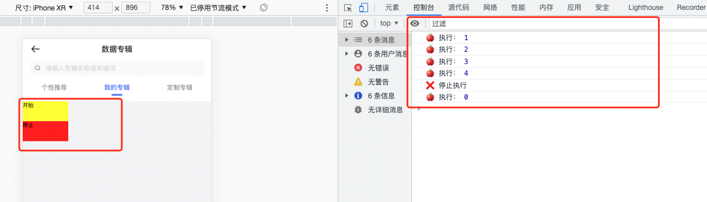

<br/>

**函数地址请求**

```js
const TestApp = () => {
    const [origin, setOrigin] = useState('');
    const updateState = useCallback(async () => {
        const response = await fetch('https://httpbin.org/get');
        const data = await response.json();
        console.log('.》〉》〉🍎 data:', data)
        setOrigin(data.origin);
    }, []);
    useEffect(() => {
        setInterval(updateState, 3000);
    }, [updateState]);
    return <main>{`Your origin is: ${origin}`}</main>;
}
```


***
<br/><br/><br/>
> <h2 id="useEffect、useCallback、useMemo的三者区别">useEffect、useCallback、useMemo的三者区别</h2>

它们是 React Hooks 里最容易“混淆”但又最核心的三个概念。
确实它们**都依赖第二个参数（依赖数组）**来控制触发逻辑，但它们的**目的、执行时机和返回结果完全不同**。
下面我用一个「精炼 + 实战」的方式帮你彻底理清。

---
<br/>

**🧩 一图总结差异**

| Hook          | 作用                        | 何时执行                     | 返回值          | 常见用途                   |
| ------------- | ------------------------- | ------------------------ | ------------ | ---------------------- |
| `useEffect`   | 处理**副作用（异步、DOM、订阅、数据请求）** | 在 **渲染完成后**（commit 阶段）执行 | 无返回（可返回清理函数） | 网络请求、事件监听、DOM 操作、日志输出等 |
| `useCallback` | 缓存一个**函数引用**              | 依赖项变时才**重新创建函数**         | 返回一个**函数**   | 避免子组件重复渲染（props 传函数时）  |
| `useMemo`     | 缓存一个**计算结果（值）**           | 依赖项变时才**重新计算结果**         | 返回**值**      | 性能优化（计算量大）、派生状态缓存      |

---
<br/>

**举例理解：同一个依赖，不同用途**

假设你有个组件要根据 `count` 计算一个耗时结果：

```jsx
function Demo({ count }) {
  // 1️⃣ useEffect —— 做副作用
  useEffect(() => {
    console.log("count 改变了，触发副作用");
  }, [count]);

  // 2️⃣ useCallback —— 缓存函数
  const handleClick = useCallback(() => {
    console.log("点击时 count =", count);
  }, [count]);

  // 3️⃣ useMemo —— 缓存计算值
  const result = useMemo(() => {
    console.log("重新计算 result");
    return count * 2;
  }, [count]);

  return (
    <div>
      <p>结果：{result}</p>
      <button onClick={handleClick}>点击</button>
    </div>
  );
}
```

✅ **三者的区别在于：**

| Hook          | 触发时机               | 执行内容               |
| ------------- | ------------------ | ------------------ |
| `useEffect`   | 组件渲染 **完成后**（异步阶段） | 处理副作用，比如网络请求、DOM操作 |
| `useCallback` | **渲染期间** 判断依赖是否变化  | 返回函数引用是否需要更新       |
| `useMemo`     | **渲染期间** 判断依赖是否变化  | 返回值是否需要重新计算        |

---
<br/>

 **对比核心差异：执行时机与意图**

| 对比项        | useEffect   | useCallback   | useMemo |
| ---------- | ----------- | ------------- | ------- |
| **执行时机**   | 渲染之后（异步）    | 渲染中（同步）       | 渲染中（同步） |
| **目标**     | 执行副作用逻辑     | 稳定函数引用        | 稳定计算结果  |
| **性能优化意义** | 减少重复副作用     | 避免函数变导致子组件重渲染 | 避免重复计算  |
| **返回类型**   | void / 清理函数 | 函数            | 任意值     |

---
<br/> 

**💡 一句话记忆法**

> * `useEffect`：**做事**（执行副作用）
> * `useCallback`：**保人**（保住函数引用）
> * `useMemo`：**存值**（缓存计算结果）

<br/> 

**🧪 补充实战：为什么看起来都依赖第二个参数？**

它们确实都依赖第二个参数，但“触发逻辑”不同：

| Hook          | 依赖变化时发生什么                           |
| ------------- | ----------------------------------- |
| `useEffect`   | 上次 effect 会清理（如果有），然后执行新的 effect 函数 |
| `useCallback` | 返回一个**新的函数引用**                      |
| `useMemo`     | 返回一个**新的计算值**                       |

<br/>

**🚫 常见误区**

| 误区                                    | 实际情况                          |
| ------------------------------------- | ----------------------------- |
| “`useCallback` 和 `useMemo` 一样，只是形式不同” | ❌ 错，前者缓存**函数引用**，后者缓存**值**    |
| “`useEffect` 用来缓存数据”                  | ❌ 它不能缓存，只能做副作用操作              |
| “没必要加依赖数组，反正会自动判断”                    | ❌ React 不会帮你自动判断，会导致无限循环或错过更新 |

***
<br/><br/>

看一个直观的例子 **`useEffect`**、**`useCallback`** 和 **`useMemo`** 的区别。


```jsx
import React, { useState, useEffect, useCallback, useMemo } from 'react';

export default function DemoHooks() {
  const [count, setCount] = useState(0);
  const [text, setText] = useState('Hello');

  // useEffect —— 每次渲染后执行（依赖变更时）
  useEffect(() => {
    console.log('🟢 useEffect: count 或 text 改变后触发');
    return () => {
      console.log('🔴 useEffect cleanup: 卸载或下次触发前清理');
    };
  }, [count, text]);

  // useCallback —— 返回一个记忆化的函数引用
  const handleClick = useCallback(() => {
    console.log('🟡 handleClick 被调用：当前 count =', count);
  }, [count]);

  // useMemo —— 返回一个记忆化的值（只在依赖变化时重新计算）
  const computedValue = useMemo(() => {
    console.log('🔵 useMemo: 计算值');
    return count * 2;
  }, [count]);

  console.log('⚪ 组件渲染中...');

  return (
    <div style={{ fontFamily: 'monospace' }}>
      <h3>React Hooks 对比演示</h3>
      <p>count: {count}</p>
      <p>text: {text}</p>
      <p>computedValue (useMemo): {computedValue}</p>
      <button onClick={() => setCount(count + 1)}>增加 count</button>
      <button onClick={() => setText(text === 'Hello' ? 'World' : 'Hello')}>
        切换 text
      </button>
      <button onClick={handleClick}>调用 useCallback 函数</button>
    </div>
  );
}
```

<br/> 

**执行过程输出（控制台打印顺序）**

假设你操作如下：

1️⃣ **页面初次加载**

```
⚪ 组件渲染中...
🔵 useMemo: 计算值
🟢 useEffect: count 或 text 改变后触发
```

<br/>

2️⃣ **点击“增加 count”**

```
⚪ 组件渲染中...
🔵 useMemo: 计算值        ← 因为 count 改变，重新计算
🟢 useEffect: count 或 text 改变后触发
🔴 useEffect cleanup: 卸载或下次触发前清理
```

<br/>

3️⃣ **点击“切换 text”**

```
⚪ 组件渲染中...
🟢 useEffect: count 或 text 改变后触发
🔴 useEffect cleanup: 卸载或下次触发前清理
```

> 注意：`useMemo` 没打印，因为 `count` 没变；
> 而 `useEffect` 仍然执行，因为 `text` 是它的依赖。

<br/>

4️⃣ **点击“调用 useCallback 函数”**

```
🟡 handleClick 被调用：当前 count = X
```

> 这里只执行了函数体，不会触发组件重新渲染。

---
<br/>


**✅ 总结区别**

| Hook          | 用途                   | 依赖变化时行为        | 返回类型 | 常见用途       |
| ------------- | -------------------- | -------------- | ---- | ---------- |
| `useEffect`   | 副作用（网络请求、DOM 操作、订阅等） | 执行副作用函数（并清理旧的） | 无返回值 | 生命周期逻辑     |
| `useCallback` | 缓存函数引用               | 重新创建函数         | 函数   | 避免子组件重复渲染  |
| `useMemo`     | 缓存计算结果               | 重新计算值          | 任意值  | 避免昂贵计算重复执行 |


***
<br/><br/><br/>
> <h2 id="根据依赖参数useCallBack无法调用内部函数">根据依赖参数useCallBack无法调用内部函数</h2>

```js
[cloudProfitTime, setCloudProfitTime] = useState(90)

const handleSubmit = useCallback(
    (params = {}) => {
	 
	 const submitData = {
				spuFreezeDays: cloudProfitTime,
      };
      
  },[
  cloudProfitTime,
  saveData,
],)

// 按钮点击事件
const editClick = ({ isStartEdit, action = SubmitAction.CANCEL }) => {
		
	setCloudProfitTime(9)
	setIsEdit(isStartEdit);
	if (action == SubmitAction.SAVE) {
	  setSaveData(SubmitAction.SAVE);
	}
};
```

点击按钮触发`‌editClick`事件，无法执行，具体原因请看**下面：**

***
<br/>

**当前定义了两个函数：**

```js
const handleSubmit = useCallback(
  (params = {}) => {
    const submitData = {
      spuFreezeDays: cloudProfitTime,
    };
  },
  [cloudProfitTime, saveData],
);

const editClick = ({ isStartEdit, action = SubmitAction.CANCEL }) => {
  setIsEdit(isStartEdit);
  if (action == SubmitAction.SAVE) {
    setSaveData(SubmitAction.SAVE);
  }
};
```

<br/>

你点击按钮时只执行了：

```js
editClick({ isStartEdit: false, action: SubmitAction.SAVE });
```

但发现 `handleSubmit` **没被调用** ❌

<br/>

**原因：你并没有调用 `handleSubmit`！**

`useCallback` 只是“定义”了一个函数，
它不会因为依赖项变化而**自动执行**。

> ✅ React 不会自动运行 useCallback 内部代码，
> 它只是更新这个函数的引用。

<br/><br/>
> <h3 id="自动调用">自动调用</h3>


**✅ 正确做法1：在依赖更新时手动触发执行**

如果你希望当 `saveData` 改变时自动执行 `handleSubmit`，
你需要在一个 `useEffect` 中监听它：

```js
useEffect(() => {
  if (saveData === SubmitAction.SAVE) {
    handleSubmit();
  }
}, [saveData, handleSubmit]);
```

这样逻辑变成：

1. 点击按钮 → `editClick()`
2. `setSaveData(SubmitAction.SAVE)` → 改变状态
3. `useEffect` 监听到 `saveData` 变成 `"save"` → 调用 `handleSubmit()`

<br/>

**✅ 整理成完整可工作的示例：**

```jsx
import React, { useState, useCallback, useEffect } from "react";
import { Input, Button } from "antd";

// js中定义一个常量枚举
const SubmitAction = Object.freeze({
  SAVE: "save",
  CANCEL: "cancel",
});

export default function CloudProfitForm() {
  const [isEdit, setIsEdit] = useState(false); // 是否编辑中
  const [cloudProfitTime, setCloudProfitTime] = useState(""); // 输入内容
  const [saveAction, setSaveAction] = useState(""); // 保存触发标志

  // 提交函数
  const handleSubmit = useCallback(() => {
    const submitData = {
      spuFreezeDays: cloudProfitTime,
    };

    console.log("✅ handleSubmit 执行，提交数据：", submitData);

    // 模拟提交结束后关闭编辑
    setIsEdit(false);
    setSaveAction(""); // 清空状态防止重复触发
  }, [cloudProfitTime]);

  // 点击编辑或保存
  const editClick = useCallback(
    ({ isStartEdit, action = SubmitAction.CANCEL }) => {
      setIsEdit(isStartEdit);

      if (action === SubmitAction.SAVE) {
        setSaveAction(SubmitAction.SAVE);
      }
    },
    []
  );

  // 🔥 当保存动作触发时，执行 handleSubmit
  useEffect(() => {
    if (saveAction === SubmitAction.SAVE) {
      handleSubmit();
    }
  }, [saveAction, handleSubmit]);

  return (
    <div style={{ padding: 20 }}>
      <h3>云利润时间设置</h3>

      <Input
        placeholder="请输入冻结天数"
        value={cloudProfitTime}
        onChange={(e) => setCloudProfitTime(e.target.value)}
        disabled={!isEdit}
        style={{ width: 200, marginRight: 10 }}
      />

      {!isEdit ? (
        <Button type="primary" onClick={() => editClick({ isStartEdit: true })}>
          编辑
        </Button>
      ) : (
        <>
          <Button
            type="primary"
            onClick={() => editClick({ isStartEdit: false, action: SubmitAction.SAVE })}
            style={{ marginRight: 8 }}
          >
            保存
          </Button>
          <Button onClick={() => editClick({ isStartEdit: false, action: SubmitAction.CANCEL })}>
            取消
          </Button>
        </>
      )}
    </div>
  );
}
```

<br/>

> 点击 “保存” → 自动调用 `handleSubmit` → 打印提交结果 → 恢复成非编辑状态

输出示例：

```
✅ handleSubmit 执行，提交数据： { spuFreezeDays: "6" }
```

<br/>

**🧩 行为说明**

| 动作                            | 状态变化                    | 说明           |
| ----------------------------- | ----------------------- | ------------ |
| 点击“编辑”                        | `isEdit = true`         | 输入框变可编辑      |
| 修改输入内容                        | 更新 `cloudProfitTime`    | 可正常输入        |
| 点击“保存”                        | `setSaveAction("save")` | 触发 useEffect |
| useEffect 监听到 saveAction=save | 调用 `handleSubmit()`     | 打印提交结果       |
| 提交完                           | 自动 `setIsEdit(false)`   | 返回非编辑状态      |
| 点击“取消”                        | 直接退出编辑模式     

<br/> 

**✅ 可选优化（避免重复触发）**

如果你希望 `handleSubmit` 执行完后清除 `saveData`，可以加一行：

```js
useEffect(() => {
  if (saveData === SubmitAction.SAVE) {
    handleSubmit();
    setSaveData(""); // 清空状态，避免二次触发
  }
}, [saveData, handleSubmit]);
```


***
<br/><br/>
> <h3 id="手动调用">手动调用</h3>

根据上面的自动调用，下面给出使用 **React 函数组件示例**（使用 Hooks）实现手动调用：

* **编辑 / 非编辑** 状态切换
* **保存时提交并退出编辑状态**
* **使用 `useCallback` 和状态依赖**

---
<br/>


```jsx
import React, { useState, useCallback } from "react";
import { Input, Button } from "antd";

const SubmitAction = {
  SAVE: "save",
  CANCEL: "cancel",
};

export default function EditDemo() {
  const [isEdit, setIsEdit] = useState(false); // 是否编辑状态
  const [cloudProfitTime, setCloudProfitTime] = useState("");
  const [saveData, setSaveData] = useState(null);

  // 提交函数
  const handleSubmit = useCallback(
    (params = {}) => {
      const { action = SubmitAction.CANCEL } = params;

      const submitData = {
        spuFreezeDays: cloudProfitTime,
        action,
      };

      console.log("提交的数据：", submitData);

      if (action === SubmitAction.SAVE) {
        // 模拟异步保存
        setTimeout(() => {
          console.log("✅ 保存成功");
          // 保存成功后退出编辑状态
          setIsEdit(false);
          setSaveAction("")// 清空防止重复触发
        }, 500);
      }
    },
    [cloudProfitTime]
  );

  // 点击编辑或保存
  const editClick = ({ isStartEdit, action = SubmitAction.CANCEL }) => {
    setIsEdit(isStartEdit);

    if (action === SubmitAction.SAVE) {
      setSaveData(SubmitAction.SAVE);
      handleSubmit({ action: SubmitAction.SAVE });
    }
  };

  return (
    <div style={{ padding: 20 }}>
      <div style={{ marginBottom: 12 }}>
        <Input
          value={cloudProfitTime}
          disabled={!isEdit}
          placeholder="请输入云利润时间"
          onChange={(e) => setCloudProfitTime(e.target.value)}
          style={{ width: 200 }}
        />
      </div>

      {isEdit ? (
        <>
          <Button
            type="primary"
            onClick={() =>
              editClick({ isStartEdit: false, action: SubmitAction.SAVE })
            }
          >
            保存
          </Button>
          <Button
            style={{ marginLeft: 8 }}
            onClick={() => editClick({ isStartEdit: false })}
          >
            取消
          </Button>
        </>
      ) : (
        <Button onClick={() => editClick({ isStartEdit: true })}>编辑</Button>
      )}
    </div>
  );
}
```

<br/>

**逻辑说明**

- 1.**初始状态：** 非编辑（`isEdit=false`）；
- 2.**点击“编辑”：** `isEdit=true` → 输入框可编辑；
- 3.**点击“保存”：**

	* 调用 `handleSubmit({ action: 'save' })`
	* 模拟提交保存
	* 保存完成后自动恢复到非编辑状态；
- 4.**点击“取消”：** 直接退出编辑状态，不提交。

<br/>
***


**❓疑问：**

根据上述代码**`handleSubmit`方法**中的 `cloudProfitTime` 是最新的改变的输入框输入的**值嘛？有点担心是之前旧的值**


<br/>

方法 **`handleSubmit`** 使用了 `useCallback` 并依赖于 `[cloudProfitTime]`，拿到**是最新的 cloudProfitTime值** 分两种情况来看👇：

<br/> 

**情况 1：当前写法（✅ 能拿到最新值）**

你的这段：

```js
const handleSubmit = useCallback(
  (params = {}) => {
    const submitData = {
      spuFreezeDays: cloudProfitTime,
    };
    ...
  },
  [cloudProfitTime]
);
```

👉 因为 `cloudProfitTime` 被放在了依赖数组中，
每次它更新时，`handleSubmit` 会重新创建一个闭包版本，内部拿到的就是**最新的值**。

<br/>

✅ 所以，当你点击“保存”按钮时：

```js
handleSubmit({ action: SubmitAction.SAVE });
```

它拿到的就是当下输入框的最新内容。
→ **这个写法是安全的、正确的。**

<br/>

**情况 2：如果你把依赖写成 `[]`**

```js
const handleSubmit = useCallback(
  (params = {}) => {
    console.log(cloudProfitTime);
  },
  [] // ❌ 没有依赖
);
```

那么它会捕获第一次渲染时的 `cloudProfitTime`，之后再怎么输入都不会更新。
👉 这时候 `handleSubmit` 就会拿到**旧值（过期闭包）**。

<br/>

 **✅ 结论**

你的当前写法：

```js
const handleSubmit = useCallback(..., [cloudProfitTime])
```

✅ **能保证拿到最新的 cloudProfitTime**，不用担心闭包过期问题。

---

如果你还想要更保险（比如 handleSubmit 可能被其他异步操作调用），可以使用 `useRef` 保留实时值👇：

```js
const cloudProfitTimeRef = useRef(cloudProfitTime);
useEffect(() => {
  cloudProfitTimeRef.current = cloudProfitTime;
}, [cloudProfitTime]);

const handleSubmit = useCallback((params = {}) => {
  console.log("最新值：", cloudProfitTimeRef.current);
}, []);
```

这样无论何时调用，都一定是最新值。


<br/><br/><br/>
> <h2 id='ReactRouter'>React Router</h2>

&emsp; SPA（Single Page Application，单页面应用），整个应用只加载一个页面（入口页面），后续在与用户的交互过程中，通过DOM操作在这个单页上动态生成结构和内容。使用SPA可以使项目有更好的用户体验，减少请求、渲染和页面跳转产生的等待与空白，另外前端在项目中更具重要性，数据和页面内容都由异步请求（AJAX）+DOM操作来完成，前端则更多地去处理业务逻辑。

&emsp; React-Router就是一套前端路由库，在项目中安装好React-Router之后，开发者就可以基于React开发单页面多视图的应用。

&emsp; React Router Dom 就只是基於 React Route 更進階的套件，核心都還是 React Route，相同地，react-router-native 也是基於 React Route 更進階的套件。


React-Router的安装命令如下：npm i react-router-dom

&emsp; React Router Dom 其實只是多了四個 React Component：BrowserRouter、 HashRouter、Link、NavLink。


WEB端的Router中提供了两种不同的模式**＜HashRouter/＞**和**＜BrowserRouter/＞**:

- HashRouter是基于hash实现的一种路由方式，URL变化时主要是hash值进行变化。如http://127.0.0.1:3000/#/about、http://127.0.0.1:3000/#/user，可以看到URL里一定会有一个#号，也就是hash标识。hash模式的好处是一定不会向服务端发送请求，但URL里一定会有一个#号。
- BrowserRouter则是基于H5 history API的一种路由方式。history的URL切换基于history提供的pushState方法，好处是URL和之前直接请求后端的URL没有什么区别，如http://127.0.0.1:3000/about、http://127.0.0.1:3000/user。当然问题也同样突出，在部署线上时，要注意直接输入URL还是会发起后端请求，所以后端一样也要做处理。


&emsp; 在实际开发时，不管采取哪种路由模式，都需要在项目最外层配置好路由，告诉React该项目使用的是哪种路由，具体代码如下：

**index.js**

```js
import { BrowserRouter as Router, HashRouter } from 'react-router-dom';

ReactDOM.render(
  <React.StrictMode>
    <Router>
      <App />
    </Router>
  </React.StrictMode>,
  document.getElementById('root')
);
```


<br/>

**App.js**

```js
render() {
    return <TestHOC4 />
}
```


<br/>

**HOC.js**

```js
export function TestHOC4() {

    return <div style={{ width: '100%', height: '100%' }}>
        <React.Fragment>
            {/* <Link to='/about'>数字</Link> */}
            <Route path="/about" component={About} />
        </React.Fragment>
    </div>
}

export function TestHOC4_1() {
    return <React.Fragment>
        <Link to='/about'>首页</Link>
        <Route path='/about' render={() => <div>1234567890</div>} />
    </React.Fragment>
}
```

效果图：

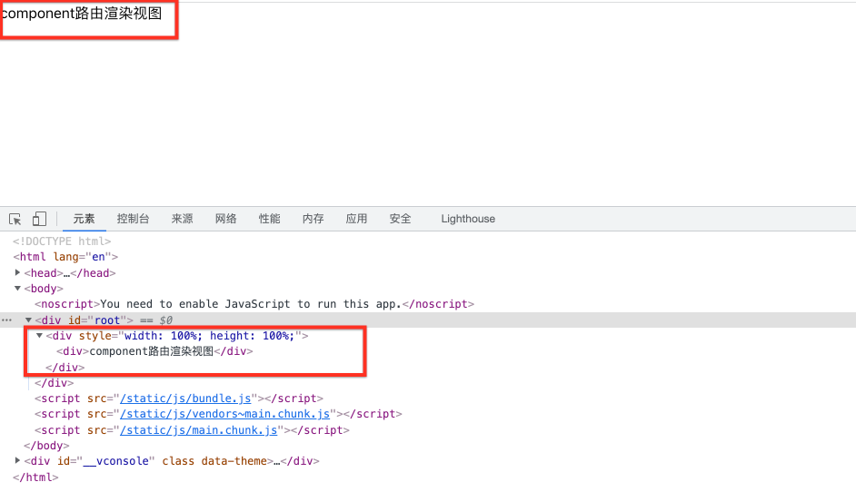

&emsp; 如果使用的是HashRouter，则把BrowserRouter替换成HashRouter即可。


<br/>
<br/>

> <h3 id='路由Demo'>路由Demo</h3>

**RouterAbout.js**

```
export default function RouterAboutView() {
    return <div>
        <h1>关于视图</h1>
        <p>关于视图内容</p>
    </div>
}
```

<br/>

**RouterIndexView.js**

```js
export default function RouterIndexView() {
    return <div>
        <h1>首页视图</h1>
        <p>首页视图内容</p>
    </div>
}
```


<br/>

**RouterListView.js**

```js
export default function RouterListView() {
    const pageLength = Math.ceil(Data.length / 3)

    let { page = 1 } = useParams()
    return <div>
        <h1>列表视图</h1>
        <p>列表视图内容</p>
        <List activePage={page} />
        <Pagation activePage={page}
            pageLength={pageLength}
        />
    </div>
}

const pageLen = 3 //每页多少条
export function List(props) {
    // 接受父级传递的props，props中必须包含activePage
    // activePage代表当前实现第几页
    let { activePage } = props
    // 从当前页第几条开始，注意页码从1开始计数，但是js从0开始计数，所以减1
    let start = (activePage - 1) * pageLen
    let end = activePage * pageLen
    // 当前页到第几条结束
    let nowData = Data.filter((item, index) => index >= start && index < end)

    return <ul>
        {nowData.map(item => {
            return (<li key={item.id}>
                <h2>{item.title}</h2>
                <p>{item.describe}</p>
            </li>)
        })}
    </ul>
}
```


<br/>

**RouterRouter.js**

```js
let Routers = [
    {
        path: '/',
        exact: true,
        render(props) {
            return <RouterIndexView {...props} />
        }
    },
    {
        path: '/about',
        exact: true,
        render(props) {
            return <RouterAboutView {...props} />
        }
    },
    {
        path: ['/list', '/list/:page'],
        exact: true,
        render(props) {
            let { page = 1 } = props.match.params
            if (page >= 1) {// 解析页码，如果没有传递页面则设置默认值为1
                // 若/list/a等不是数字的情况下，则显示404视图
                return <RouterListView {...props} />
            }
            return <RouterUndefinedView {...props} />
        }
    },
    {
        path: '',
        exact: false,
        render(props) {
            return <RouterUndefinedView {...props} />
        }
    }
]


let Navs = [
    {
        to: '/',
        exact: true,
        title: '首页'
    },
    {
        to: '/about',
        exact: true,
        title: '关于'
    },
    {
        to: '/list',
        title: '课程列表',
        isActive(url) {
            let urlData = url.split('/')
            if (url === '/list' || (urlData.length === 3 && urlData[1] === 'list' && urlData[2] > 0)) {
                // 判断url为‘/list’或‘/list/大于1的数字时’，选中当前项，否则不选中
                return true
            }
            return false
        }
    },

]

export { Routers, Navs }


// 🍎<==========================================>🍎

export function Nav() {
    let { pathname } = useLocation()

    return <nav>
        <span> | </span>
        {
            Navs.map(item => {
                return <Fragment key={item.to}>
                    <NavLink
                        to={item.to}
                        exact={item.exact}
                        isActive={item.isActive ? () => {
                            return item.isActive(pathname)
                        } : null
                        }
                        activeStyle={{
                            color: 'red'
                        }}
                    >
                        {item.title}
                        <span> | </span>
                    </NavLink>
                </Fragment>
            })
        }
    </nav>
}


// 🍎<==========================================>🍎

/**
 * @description: 翻页导航组件
 */
export function Pagation(props) {
    // activePage   当前第几页， pageLength总共多少页
    let { activePage, pageLength } = props
    console.log(activePage)

    return <nav>
        {
            [...('.'.repeat(pageLength))].map((item, index) => {
                index++
                return <Fragment key={index}>
                    <span> | </span>
                    <Link
                        to={'/list/' + index}
                        style={{
                            color: activePage == index ? 'red' : '#000'
                        }}>
                        {index}
                    </Link>
                </Fragment>
            })
        }
        <span> | </span>
    </nav>
}


// 🍎<==========================================>🍎


/**
 * @description: 列表数据
 */

export const Data = [{
    id: 0,
    title: ' iOS 架构师',
    describe: '授课深度对标阿里 P6等级，进入BAT等一线大厂，成为大厂进阶稀缺人才'
},
{
    id: 1,
    title: ' Web 架构师',
    describe: '授课深度对标阿里 P6等级，进入BAT等一线大厂，成为大厂进阶稀缺人才'
},
{
    id: 2,
    title: ' Go 架构师',
    describe: '授课深度对标阿里 P6等级，进入BAT等一线大厂，成为大厂进阶稀缺人才'
},
{
    id: 3,
    title: ' Go 金牌就业班',
    describe: '授课深度对标阿里 P6等级，进入BAT等一线大厂，成为大厂进阶稀缺人才'
},
{
    id: 4,
    title: ' iOS 架构师',
    describe: '授课深度对标阿里 P6等级，进入BAT等一线大厂，成为大厂进阶稀缺人才'
},
{
    id: 5,
    title: ' 百万架构师',
    describe: '授课深度对标阿里 P6等级，进入BAT等一线大厂，成为大厂进阶稀缺人才'
}, {
    id: 6,
    title: ' JavaEE 金牌就业班',
    describe: '授课深度对标阿里 P6等级，进入BAT等一线大厂，成为大厂进阶稀缺人才'
},
{
    id: 7,
    title: ' 数据分析全栈工程师',
    describe: '授课深度对标阿里 P6等级，进入BAT等一线大厂，成为大厂进阶稀缺人才'
},
{
    id: 8,
    title: ' Android 开发师',
    describe: '授课深度对标阿里 P6等级，进入BAT等一线大厂，成为大厂进阶稀缺人才'
},
{
    id: 9,
    title: '测试师',
    describe: '授课深度对标阿里 P6等级，进入BAT等一线大厂，成为大厂进阶稀缺人才'
}
]

```


<br/>

**RouterUndefinedView.js**

```
export default function RouterUndefinedView() {
    return <div>
        <h1>404视图</h1>
        <p>404视图内容</p>
    </div>
}
```

调用：

```
/**
   * @description: 路由导航综合练习
   * 导航组件
   */
  _testRouter2 = () => {
    return <Fragment>
      <Nav />
      <Switch>
        {Routers.map(item => {
          return <Route
            key={item.path}
            path={item.path}
            exact={item.exact}
            render={item.render} />
        })}
      </Switch>
    </Fragment>
  }
```

效果图：

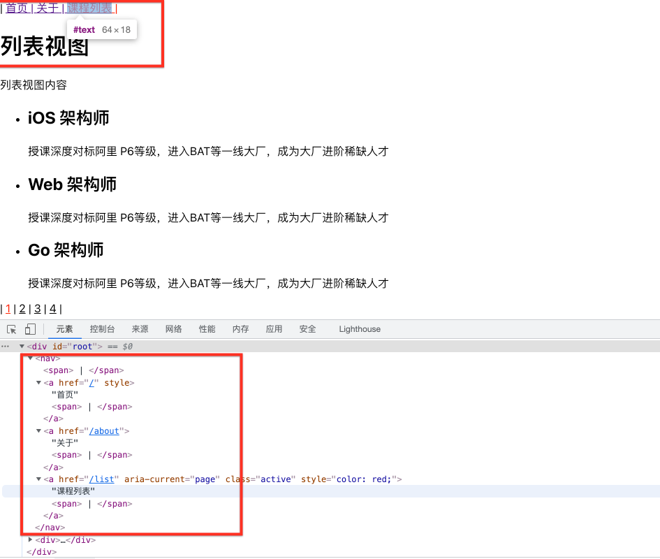


<br/><br/><br/>
> <h2 id="参数传递">参数传递</h2>

<br>

> <h3 id="父子传参">父->子传参</h3>

&emsp; 父组件通过props将数据传递给子组件，子组件通过this.props.属性名调用


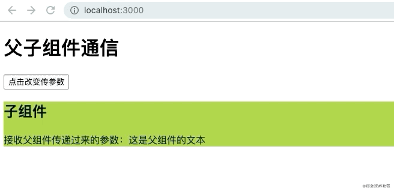

<br/>

效果：

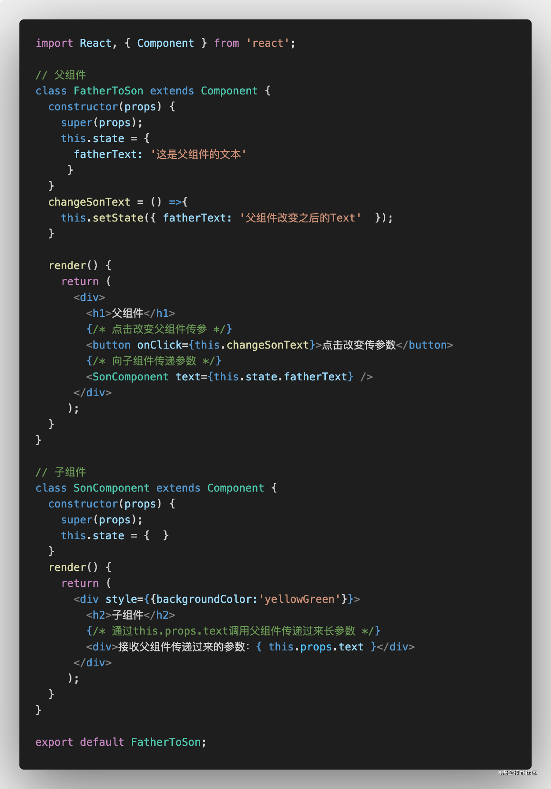


<br><br>

> <h3 id="子父组件的通信">子->父组件的通信</h3>

- 父组件通过props传递一个修改自身数据state的方法给子组件

- 子组件调用父组件传递过来的方法，传递参数，修改父组件的属性。相当于子组件调用父组件的方法来更新父组件的数据，或者向父组件传递数据


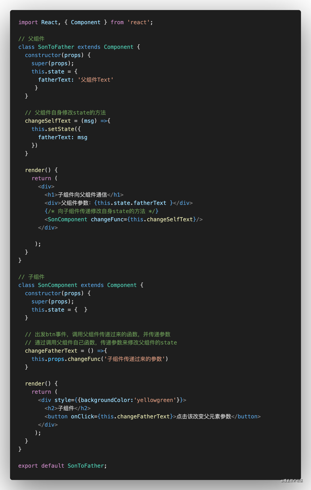

<br/>

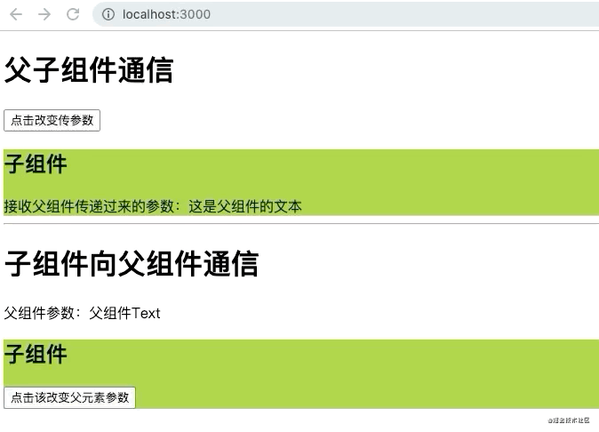


<br>
<br>

> <h3 id="兄弟节点之间的通信">兄弟节点之间的通信</h3>

&emsp; 在一个兄弟节点中修改父组件的数据，然后父组件会同步到另一个需要通信的子组件，就完成了一次通信

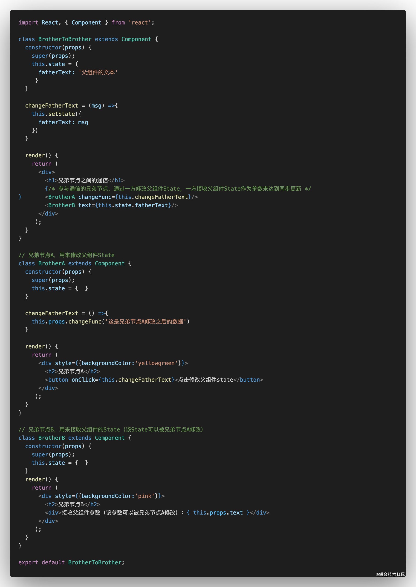


<br>
<br>

> <h3 id="context传值">context传值</h3>


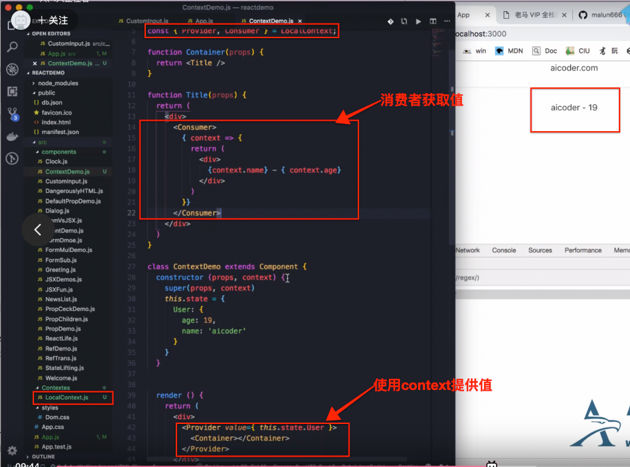


<br>
<br>

> <h3 id="订阅模型">订阅模型</h3>

- addEventListener 就是一个发布订阅模型

- 订阅：element.addEventListener('click',callback)

- 发布：当绑定元素的click事件被触发的时候，就会执行发布流程，调用订阅绑定的callback


**原理图解：**

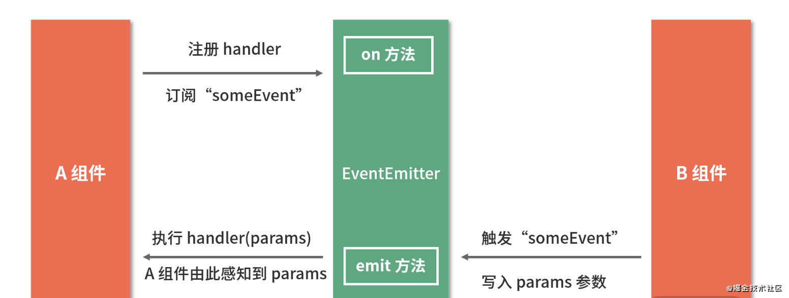

<br/>

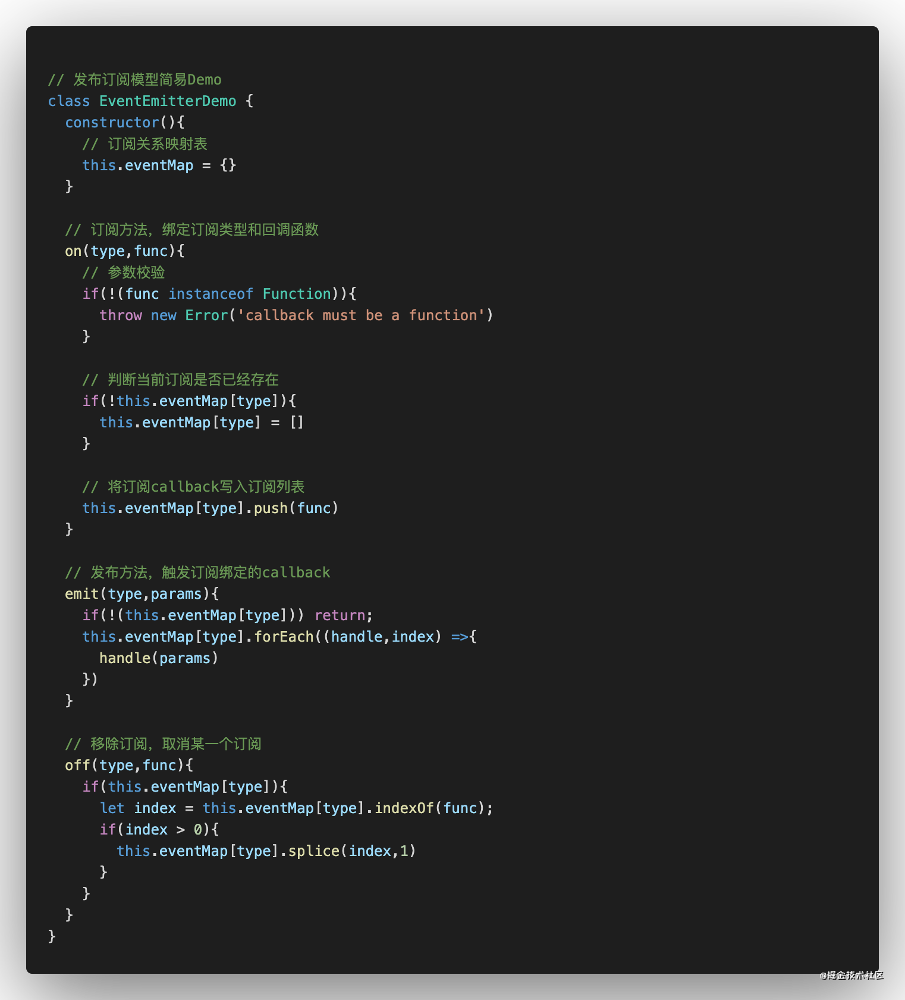


<br/>

***
<br/>

> <h1 id="ES6基础">ES6基础</h1>

<br/>

> <h2 id='异步编程'>异步编程</h2>

&emsp; JavaScript引擎是基于事件循环的概念实现的，JavaScript引擎会把任务放在一个任务队列中，通过事件循环机制一一执行任务队列里的任务，从第一个依次执行到最后一个。有些任务执行可能时间会比较长，如果等待时间比较长的任务执行完成之后再执行下一个任务就会影响用户体验，所以JavaScript在设计的时候就有了同步和异步。异步任务不进入主线程，而进入任务队列中的任务，只有任务队列通知主线程，某个异步任务可以执行了，这个任务才会进入主线程执行。异步任务在ES5标准中通过回调来解决执行顺序问题.

```
/**
* @description: 异步编程
*/
_asynchronousTest = () => {
	asyncFn(function () {
	  console.log('执行完之后的回调打印。。。。。')
	})
}

function asyncFn(cb) {
  setTimeout(() => {
    console.log('🍎 异步逻辑')
    cb && cb()
  }, 1000);
}


```

输出：

```
🍎 异步逻辑
node_modules/vconsole/dist/vconsole.min.js:10
执行完之后的回调打印。。。。。
node_modules/vconsole/dist/vconsole.min.js:10
```

上述只是模拟异步过程，但是回调函数多了容易嵌套造成“回调地狱”，造成代码阅读困难。所以引入Promise语法。


<br/>

> **Promise基本语法**

&emsp; 首先Promise是系统中预定义的类，通过实例化可以得到Promise对象。Promise对象会有三种状态，分别是pending、resolved、rejected

```
_asynchronousTest1 = () => {
    let p1 = new Promise(function () {

    })
    console.log('🍎 p1：', p1)

    let p2 = new Promise(function (resolve, reject) {
      resolve('success...')
    })
    console.log('🍎 p2：', p2)


    let p3 = new Promise(function (resolve, reject) {
      resolve('reject...')
    })
    console.log('🍎 p3：', p3)

}
```

输出：

```
🍎 p1： Promise {[[PromiseState]]: 'pending', [[PromiseResult]]: undefined}
🍎 p2： Promise {[[PromiseState]]: 'fulfilled', [[PromiseResult]]: 'success...'}
🍎 p3： Promise {[[PromiseState]]: 'fulfilled', [[PromiseResult]]: 'reject...'}
```


&emsp; 上述代码中Promise回调函数里如果没有调取resolve或者reject，那么就会返还一个Pending状态的Promise对象。如果调取了resolve函数就会返还一个resolved状态的Promise对象（在火狐上略有不同，会显示fullfilled状态的Promise对象）。如果调取了reject函数则会返还一个rejected状态的对象。每一个Promise对象都会有一个then方法，then方法里会接收两个参数（可选）.


<br/>

&emsp; 如下代码在执行then的时候会执行到第一个成功的回调中去，如果调取reject函数则会执行到then的第二个错误的回调中去。当然Promise也提供catch方法来捕捉reject错误

```
let p2 = new Promise(function (resolve, reject) {
      // resolve('success...')
      reject('失败')
    })
    console.log('🍎 p2：', p2)
    p2.then(res => {
      console.log('🍎 ♨️ res：', res)
    }, err => {
      console.log('💣 res：', err)
    })

```


输出:

```
🍎 p2： Promise {[[PromiseState]]: 'rejected', [[PromiseResult]]: '失败'}
💣 res： 失败
node_modules/vconsole/dist/vconsole.min.js:10
```


<br/><br/><br/>
> <h2 id='async/await和Promise.then()使用'>async/await和Promise.then()使用</h2>

在 \*\*React（或任意 JS/TS 项目）\*\*里，`async/await` 和 `Promise.then()` 本质上是一回事，只是写法不同。

<br/>

 **1.`Promise` → `async/await`**

如果拿到的是一个返回 Promise 的函数，可以直接用 `await` 来写：

```js
// 原始 Promise 写法
fetch("/api/data")
  .then(res => res.json())
  .then(data => {
    console.log("数据：", data);
  })
  .catch(err => {
    console.error("出错了", err);
  });

// 转换成 async/await 写法
async function loadData() {
  try {
    const res = await fetch("/api/data");
    const data = await res.json();
    console.log("数据：", data);
  } catch (err) {
    console.error("出错了", err);
  }
}
```


<br/> 

**2.`async/await` → `Promise`**

如果有一个 `async` 函数，它自动返回 Promise，所以可以直接用 `.then()`：

```js
// async 函数
async function getNumber() {
  return 42; // 等价于 Promise.resolve(42)
}

// 用 Promise 写法
getNumber().then(num => {
  console.log("数字：", num);
});
```

<br/> 

**3.React 场景下的常见用法**

**(1) 在 `useEffect` 里**

React 的 `useEffect` 回调不能直接用 `async`，但你可以在里面定义并调用异步函数：

```jsx
import { useEffect, useState } from "react";

function App() {
  const [data, setData] = useState(null);

  useEffect(() => {
    async function fetchData() {
      try {
        const res = await fetch("/api/data");
        const json = await res.json();
        setData(json);
      } catch (err) {
        console.error("加载失败", err);
      }
    }
    fetchData();
  }, []);

  return <div>{data ? JSON.stringify(data) : "加载中..."}</div>;
}
```

<br/>

如果不用 `async`，同样可以写成 Promise 风格：

```jsx
useEffect(() => {
  fetch("/api/data")
    .then(res => res.json())
    .then(setData)
    .catch(err => console.error("加载失败", err));
}, []);
```

<br/>

**(2)在事件回调里**

React 的事件函数可以直接用 `async`：

```jsx
function App() {
  const handleClick = async () => {
    const res = await fetch("/api/data");
    const data = await res.json();
    console.log("点击后获取的数据", data);
  };

  return <button onClick={handleClick}>获取数据</button>;
}
```

<br/>

等价的 Promise 写法：

```jsx
function App() {
  const handleClick = () => {
    fetch("/api/data")
      .then(res => res.json())
      .then(data => console.log("点击后获取的数据", data))
      .catch(err => console.error(err));
  };

  return <button onClick={handleClick}>获取数据</button>;
}
```

<br/>

✅ 总结：

* **async 函数**其实就是返回 `Promise` 的函数 → 可以 `.then()`。
* **Promise** 可以用 `await` 来展开 → 更像同步代码。
* 在 React 中，常见场景是 `useEffect`、事件回调，两种写法都行，主要看团队风格。


<br/><br/>
> <h2 id='Promise的then、catch、finally如何选择使用'>Promise的then、catch、finally如何选择使用</h2>
Promise 最容易混淆的部分之一：`then`、`catch`、`finally` 看似相似，但职责完全不同。

<br/>

**✅ 一句话总结**

| 方法          | 作用              | 是否接收结果    | 典型使用场景      |
| ----------- | --------------- | --------- | ----------- |
| `then()`    | 当 Promise 成功时执行 | ✅ 是       | 请求成功后处理数据   |
| `catch()`   | 当 Promise 失败时执行 | ✅ 是（接收错误） | 处理异常或网络错误   |
| `finally()` | 无论成功或失败都执行      | ❌ 否       | 清理资源、关闭加载动画 |

<br/>

**🧩 1️⃣ `then()` —— 成功时执行**

```js
fetch('/api/data')
  .then((res) => {
    console.log('✅ 请求成功:', res);
  });
```

* **执行时机**：Promise 状态变为 `fulfilled`
* **参数**：接收 `resolve()` 传出的结果
* **可链式调用**：返回新的 Promise

<br/>

**🧩 2️⃣ `catch()` —— 失败时执行**

```js
fetch('/api/data')
  .then((res) => {
    throw new Error('解析错误');
  })
  .catch((err) => {
    console.error('❌ 捕获错误:', err);
  });
```

* **执行时机**：Promise 状态变为 `rejected`
* **参数**：接收 `reject()` 或代码抛出的错误
* **类似 try...catch**

> 👉 注意：`catch` 还能捕获上面链条中任何地方的异常。

<br/>

**🧩 3️⃣ `finally()` —— 无论成功或失败都执行**

```js
fetch('/api/data')
  .then((res) => console.log('✅ 成功'))
  .catch((err) => console.log('❌ 失败'))
  .finally(() => {
    console.log('🔚 请求结束，关闭 loading');
  });
```

* **执行时机**：Promise 结束时（无论成功或失败）
* **不接收参数**
* **返回一个新的 Promise**，继续链式调用

---
<br/>

**完整例子**

比如一个请求数据并在加载时显示转圈动画：

```js
setLoading(true);

fetch('/api/user')
  .then((res) => res.json())
  .then((data) => {
    console.log('✅ 数据:', data);
  })
  .catch((err) => {
    console.error('❌ 出错了:', err);
  })
  .finally(() => {
    setLoading(false); // 🔚 无论成败，都关闭 loading
  });
```

<br/>

**💬 说明：**

* ✅ 成功：执行 then → finally
* ❌ 失败：跳过 then，执行 catch → finally
* 🎯 无论如何：finally 一定执行

---
<br/>

**⚖️ 对比总结**

| 方法        | 是否捕获异常 | 是否能修改结果 | 是否总会执行 | 常见用途                    |
| --------- | ------ | ------- | ------ | ----------------------- |
| `then`    | 否      | 是       | 否      | 成功后逻辑                   |
| `catch`   | 是      | 是       | 否      | 错误处理                    |
| `finally` | 否      | 否       | ✅ 是    | 清理收尾操作（关闭 loading、释放资源） |


---
<br/>

**模拟实战项目中使用：**

**`VM.jsx`中有如下Code**

```jsx
static requestBusinessUserInfoData = ({ userId }) => {
    {
      return new Promise((resolve, reject) => {
        const data = {
		  benefitTotal: 0,
          address: '萨达',
          gmtCreate: 1760338679795,
        };
        // 模拟异步（例如从接口获取数据）
        setTimeout(() => {
          resolve(data);
        }, 500);
      });
    }
};
```

<br/>

在页面`Page.jsx`中使用上述模拟的请求数据：

```js
getData = () => {
    // 获取商户详情
    this.setState({ loading: true });

   DetailVM.requestBusinessUserInfoData({ userId: 'this.props.location.query.id' })
      .then((resp) => {
        this.setState({
          businessUserInfo: resp,
        });
      })
      .finally(() => {
        this.setState({ loading: false });
      });
  };
```


<br/><br/><br/>

***
<br/>

> <h1 id="顶层API">顶层API</h1>


<br/>

># <h2 id="createElement">[createElement](https://juejin.cn/post/6844903970876440583)</h2>

<br/>

> <h2 id="cloneElement">cloneElement</h2>

```js
React.cloneElement(
 element,
 [props],
 [...children]
)

克隆原来的元素，返回一个新的 React 元素；
保留原始元素的 props，同时可以添加新的 props，两者进行浅合并；
key 和 ref 会被保留，因为它们本身也是 props ，所以也可以修改；
根据 react 的源码，我们可以从第三个参数开始定义任意多的子元素，如果定义了新的 children ，会替换原来的 children ；

第一个参数：react组件或者dom,这dom是真实的dom结构也可以是自定义的；

第二个参数：当前element的props、key、ref，也可以添加新的props；

第三个参数：是props.children，不指定默认展示我们调用时添加的子元素，如果指定会覆盖我们调用克隆组件时里面包含的元素。
```


<br/>

> **验证1:组件复制**

CloneElementTest.js文件

```js
export function CloneDemo(props) {
    console.dir(props)
    console.table({ 'text: %s': props.children.props.children, 'keyValue': props.keyValue})
    return React.cloneElement(<div style={{ backgroundColor: 'red', display: "flex", justifyContent: "center", alignItems: "center" }} />,
        props
    )
}
export function ContainerBox() {
    return <CloneDemo keyValue={'CloneDemo的Key'}><h1>ContainerBox: 这是在父组件添加的元素</h1></CloneDemo>
}

```


Index.js文件

```js
import { ContainerBox } from './Test/CloneElementTest';

ReactDOM.render(
  <React.StrictMode>
   {<ContainerBox />}
   
	</React.StrictMode>,
  document.getElementById('root')
);


reportWebVitals();
```

效果图：

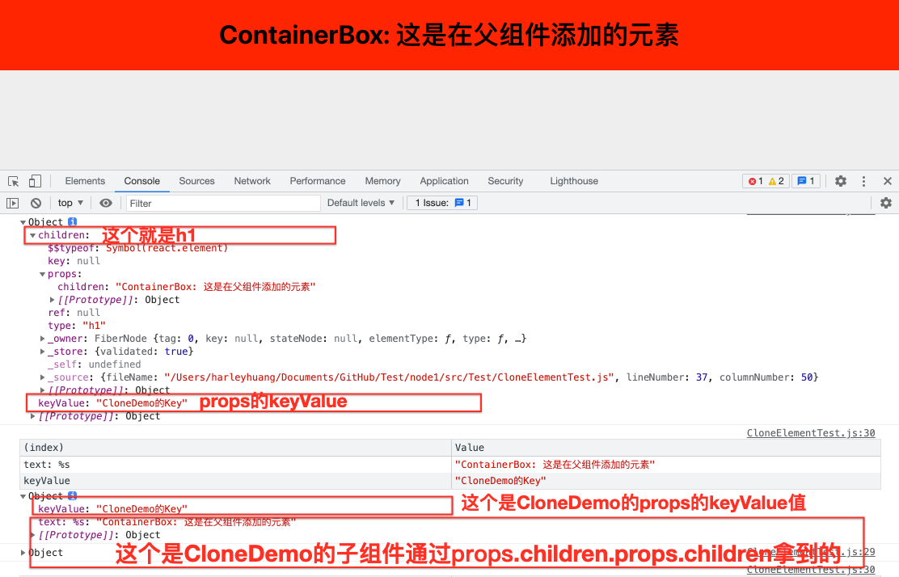


<br/>

> **验证2:传参数**

CloneElementTest.js

```js

export function CloneDemo1({ dom = <div />, ...props }) {
    console.dir(props)
    console.table({ '🍎 text: ': props.children.props.children})

    return React.cloneElement(dom, { ...props })
}
export function ContainerBox1() {
    return <CloneDemo1 dom={<p></p>}><h1>这是在父组件添加的元素ContainerBox1</h1></CloneDemo1>
}
```

Index.js

```
//组件导入
import { ContainerBox1 } from './Test/CloneElementTest';


ReactDOM.render(
  <React.StrictMode>
  {<ContainerBox1/>}
  
  </React.StrictMode>,
  document.getElementById('root')
);


reportWebVitals();
```

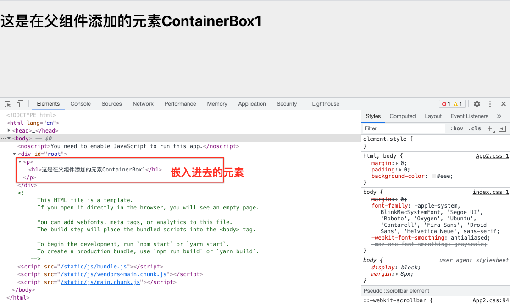
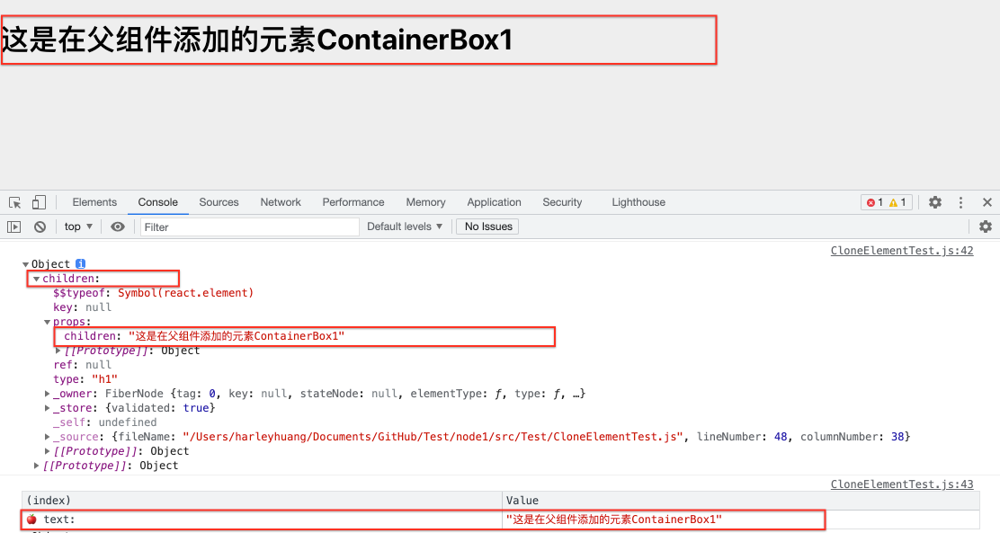


<br/>

> **验证2:传参数**

<br/>

> **验证2:传样式没有效果**

CloneElementTest.js

```
const Exam2 = (props) => <div>这是一个自定义的ReactElement元素{props.children}</div>
function CloneDemo2({ dom = <div />, ...rest }) {
    console.log('🍎 <<<<<<<<<<<<<<<')
    console.dir(dom)
    console.log('🍎 ===============')
    console.dir(rest)
    console.log('🍎 >>>>>>>>>>>>>>>')

    return React.cloneElement(dom, { ...rest })
}
export function ContainerBox2() {
    return <CloneDemo2 dom={<Exam2 style={{ color: "red", textAlign: "center" }} />}><h1>这是在父组件添加的元素</h1></CloneDemo2>
}

```


index.js

```
import { ContainerBox2 } from './Test/CloneElementTest';


ReactDOM.render(
  <React.StrictMode>
  {<ContainerBox2 />}

  </React.StrictMode>,
  document.getElementById('root')
);


reportWebVitals();
```


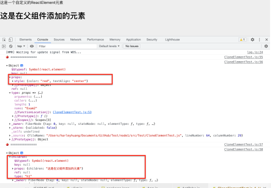

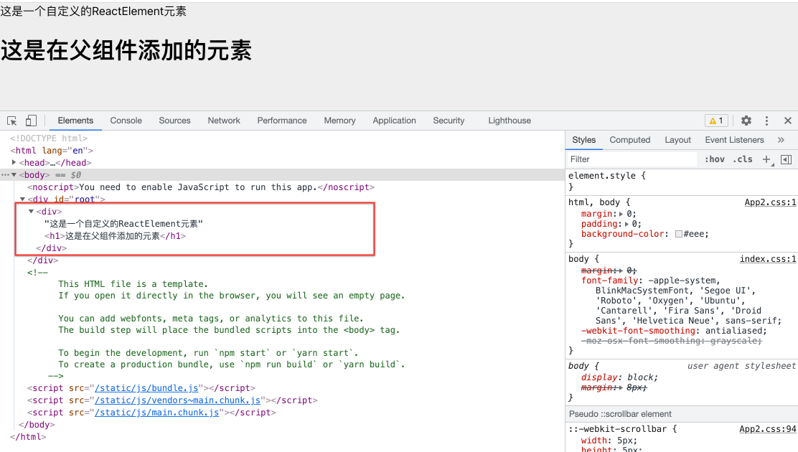


<br/>

> **验证2:传样式有效果**


CloneElementTest.js

```
const Exam2_1 = (props) => {
    console.log('🍎 <<<<<<<<<<<<<<<')
    console.dir(props)
    return <div style={{ ...props.styles, ...props.style }}>这是一个自定义的ReactElement元素{props.children}</div>
}
function CloneDemo2_1({ dom = <div />, ...rest }) {
    const styles = {
        color: "blue",
        minWidth: "1200px",
        margin: "100px auto",
        textAlign: "left"
    }
    console.log('🍎 ===============')
    console.dir(dom)
    console.log('🍎 >>>>>>>>>>>>>>>')
    console.dir(rest)
    console.log('🍎 --------------->end')


    return React.cloneElement(dom, { styles, ...rest })
}
export function ContainerBox2_1() {
    return <CloneDemo2_1 dom={<Exam2_1 style={{ color: "red", textAlign: "center" }} />}><h1>这是在父组件添加的元素props.children</h1></CloneDemo2_1>
}
```


index.js

```
import { ContainerBox2_1 } from './Test/CloneElementTest';


ReactDOM.render(
  <React.StrictMode>
	{<ContainerBox2_1 />}


  </React.StrictMode>,
  document.getElementById('root')
);


reportWebVitals();

```

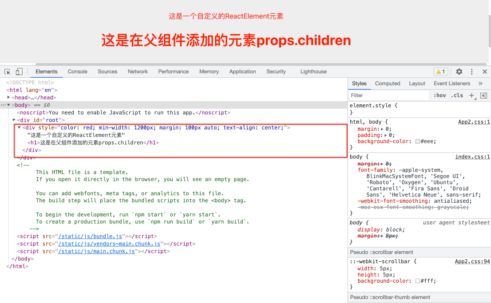


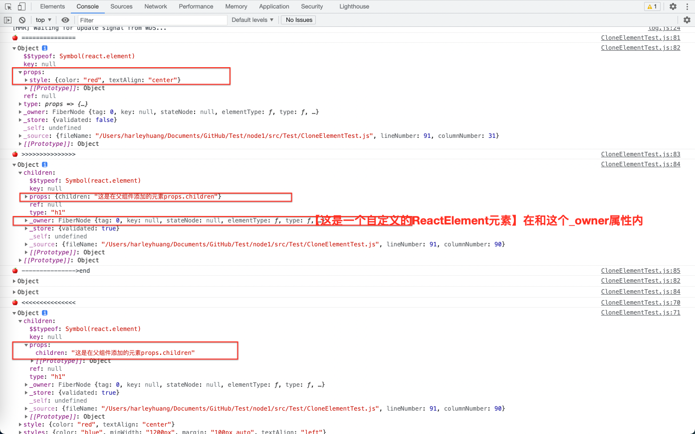


<br/>

> **验证2:样式优先级**


```
const Exam2_2 = (props) => {
    console.table({'🍎 Exam2_2 >>> props:%o': props,})
    return <div style={{ ...props.style }}>这是一个自定义的ReactElement元素{props.children}</div>
}
function CloneDemo2_2({ dom = <div />, ...rest }) {
    console.table({'🍊 CloneDemo2_2 >>> dom:%o': dom, 'rest: %o': rest})

    const styles = {
        color: "blue",
        minWidth: "1200px",
        margin: "100px auto",
        textAlign: "center"
    }
    return React.cloneElement(dom, {
        style: Object.assign({}, styles, dom.props.style), //将传入的样式放到最后提高他的优先级
        ...rest
    })
}
export function ContainerBox2_2() {
    return <CloneDemo2_2 dom={<Exam2_2 style={{ color: "red", textAlign: "center" }} />}><h1>这是在父组件添加的元素2_2</h1></CloneDemo2_2>
}
```


index.js

```
import { ContainerBox2_2 } from './Test/CloneElementTest';


ReactDOM.render(
  <React.StrictMode>
  {<ContainerBox2_2 />}


  </React.StrictMode>,
  document.getElementById('root')
);


reportWebVitals();


```


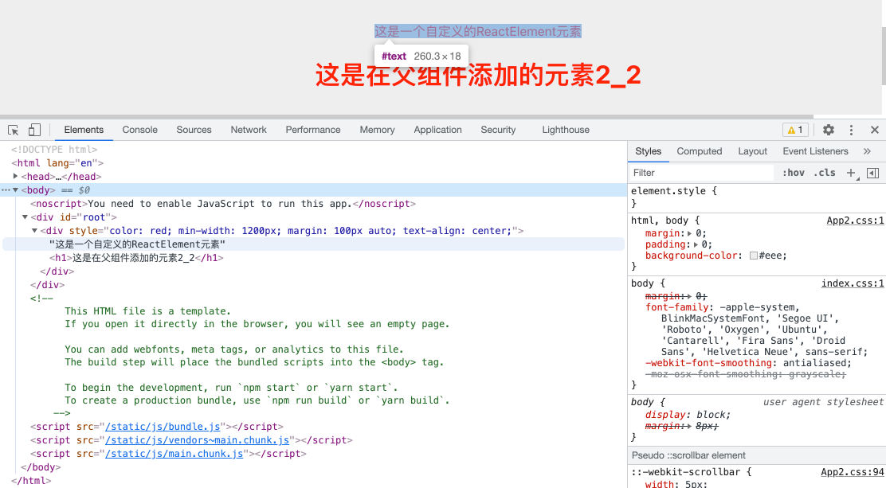


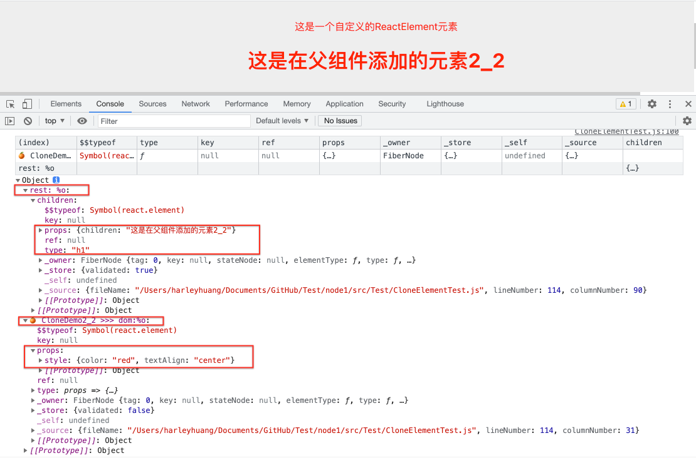


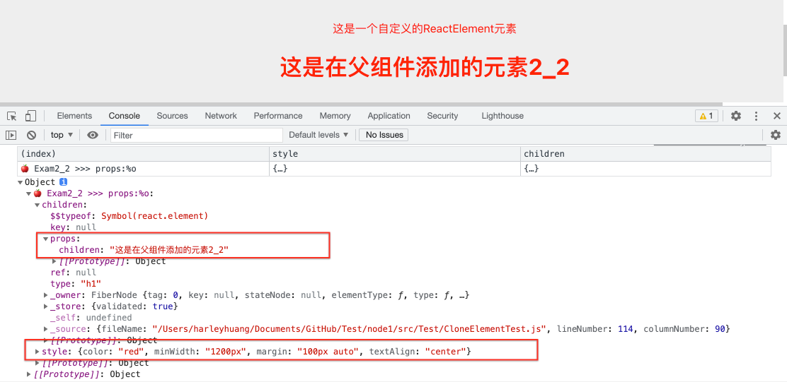


<br/><br/><br/>

***
<br/>

> <h1 id="性能优化">性能优化</h1>

<br/>

> <h2 id="值是否为空或有值">值是否为空或有值</h2>

&emsp; 所以在判断是否为空前，应预判、确定数据的类型，如果期望类型不清晰，则可能会导致错误的判断或考虑情况不周全。

<br/>

- null、为定义、0判断

```
var a1 = null
var a2
var a3 = 0
Var a4= 1//或者 a4=-11

if (!a1) {
    console.log('a1 为null')
}

if (!a2) {
    console.log('a2 没有定义')
}

if (!a3) {
    console.log('a3 为0')
}

if (!a4) {
    console.log('a4 为0')
}
```

打印：

```
a1 为null
a2 没有定义
a3 为0
//a4 没有打印
```


<br/>

- a2没有定义判断

```
var a2

if (!a2) {
    console.log('a2 没有定义')
}

if (!a2.length) {
    console.log('a3 没有leng属性')
}

会报错：：
typeError: undefined is not an object(evaluating 'a2.length')
//因为a2没有定义，你又使用它的length属性，所以会报错


var a2
 if (!a2 || !a2.length) {
    console.log('a2 没有定义')
}    
打印： a2 没有定义

==================================   

var a2
  if (!a2.length) {
    console.log('a3 没有leng属性')
}

会报错：：
typeError: undefined is not an object(evaluating 'a2.length')

```


<br/>

&emsp; 确定数据类型后，然后根据不同的数据类型使用不同的方法来判断，例

```
function isEmpty(v) {
    switch (typeof v) {
    case 'undefined':
        return true;
    case 'string':
        if (v.replace(/(^[ \t\n\r]*)|([ \t\n\r]*$)/g, '').length == 0) return true;
        break;
    case 'boolean':
        if (!v) return true;
        break;
    case 'number':
        if (0 === v || isNaN(v)) return true;
        break;
    case 'object':
        if (null === v || v.length === 0) return true;
        for (var i in v) {
            return false;
        }
        return true;
    }
    return false;
}


```


测试案例：

```
isEmpty()              //true
isEmpty([])            //true
isEmpty({})            //true
isEmpty(0)             //true
isEmpty(Number("abc")) //true
isEmpty("")            //true
isEmpty("   ")         //true
isEmpty(false)         //true
isEmpty(null)          //true
isEmpty(undefined)     //true

```

**空值有：** undefined、 null、 ''、 NaN、false、0、[]、{} 、空白字符串，这些都返回true。


<br/><br/> <br/>

***
<br/>

> <h1 id="JavaScript语法">JavaScript语法</h1>


<br/><br/><br/>

***
<br/>

> <h1 id="创建到打包">创建到打包</h1>

&emsp; 搭建项目使用的是 `create-react-app (已自动集成webpack相关配置)`官方提供的脚手架命令，目录结构如下：


asq: 为什么 没有webpack配置文件？

webpack的配置需要 输入 npm run eject 命令将所有内建的配置暴露出来。

create-react-app 已经为做了绝大部分事情，配好了webpack

现在就能使用 npm run start 开始写react 项目了

<br/>
<br/>

> <h2 id='打包'>打包</h2>

在package.json中又这么一段快捷指令，其是：

```
"scripts": {
    "build": "node scripts/build.js",
    "start": "node scripts/start.js",
    "test": "node scripts/test.js --env=jsdom",
  },
```

分别对应项目scripts下的文件：

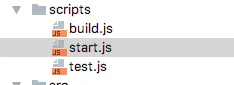

build文件就是打包项目打包的一系列配置.


运行 npm run build 后项目中会多出一个build的文件夹

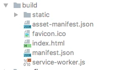


我们只需要把 build这个文件夹 放到云服务器上 即可


<br/><br/>
> <h2 id="Vite是什么">Vite是什么</h2>

**🔹 Vite 是什么？**

Vite（读作 *vit*，法语里就是“快”🚀）是一个 **前端构建工具**，用来开发和打包 Vue、React、Svelte 等项目。它是由 Vue 作者 **尤雨溪（Evan You）** 开发的，后来逐渐成为 **主流的前端工具**，现在很多新项目都会用它替代传统的 **Webpack** 或 **Create React App (CRA)**。

<br/> 

**🔹 为什么要用 Vite？**

传统的 Webpack 项目有几个痛点：

* **启动慢**：Webpack 在启动时会把整个项目打包好，项目越大越卡。
* **热更新（HMR）慢**：改一个小文件，也得重新构建一大堆代码。
* **配置复杂**：要搞很多 loader、plugin，容易踩坑。

Vite 的优势：

- **1.启动极快**
	
	* 使用 **原生 ES Module** (`import/export`)，开发时无需整体打包，只启动你正在用的部分。
	* 启动项目只需几百毫秒，而 Webpack 可能要几十秒。


- **2.热更新快（HMR）**

	* 修改一个文件，Vite 只更新这个模块，而不是整个项目。

- **3.内置多框架支持**

	* 支持 React、Vue、Svelte、Preact、Solid 等。

- **4.生产环境仍然走打包**

	* 开发环境快 → 使用 ESBuild
	* 打包时 → 使用 Rollup，产物稳定可用。

- **5.配置简单**

	* 默认配置够用，不像 Webpack 那么繁琐。

---
<br/> 

**🔹 对比一下**

| 工具                         | 启动速度 | 热更新速度 | 配置复杂度          | 适用场景       |
| -------------------------- | ---- | ----- | -------------- | ---------- |
| **Webpack**                | 慢    | 慢     | 高              | 老项目，大型企业项目 |
| **CRA (Create React App)** | 中等   | 中等    | 低（封装了 webpack） | React 新手入门 |
| **Vite**                   | ⚡ 极快 | ⚡ 极快  | 低              | 现代前端项目（推荐） |

<br/> 

**🔹 一句话总结**

👉 **Vite 就是一个更快、更轻、更现代的前端开发工具**，用来创建和构建 React、Vue 等项目。
现在新项目基本上都推荐用 Vite，而不是 CRA。


<br/>

***
<br/>

> <h1 id=""></h1>


<br/>

***
<br/>

> <h1 id=""></h1>

---
注释: 0,79436 SHA-256 d1bd79db4f242cec598d89a479691f21  
@HuangGang <harley.smessage@icloud.com>: 1152,25 1179,26 1206,39 45579,100 45695,5 45714,18 45789 45791,3 45814,5 45859,10 45872,3 45908,10 45989,9 46012,3 46016 46041 46077 46112 46118,5 46125,5 46139,39 46186,2 46542,7 46667,5 46674,2 46701,2 46806,38 46845,2 46853 46867,2 47203,9 47226,2 47344,7 49192 49196,9 49319,11 49336,2 49914,5 49920,4 49938,2 50148,59 50236,4 50316,6 51126,39 52335,9 52348,2 52352,2 52387,2 52427,2 52444 52485 52495 52515,2 52545,32 52589,9 52613,47 52674,2 52724 52744 52759,5 52765,4 52788,2 53056,7 53178,5 53185,2 53205,2 53418,7 53426,2 53432,2 53906,2  
...
