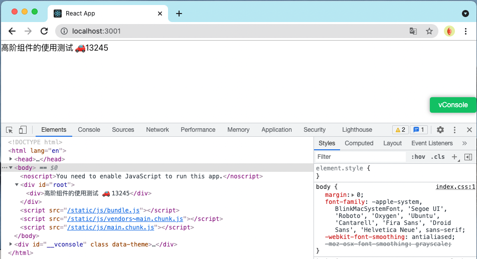
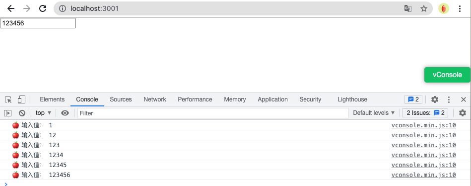

> <h2 id=''></h2>
- [**‌项目文件结构**](#项目文件结构)
	- [node_modules文件夹](#node_modules文件夹)
	- [普通包和作用域包](#普通包和作用域包)
- [**React基础**](#React基础)
	- [**props**](#props)
	- [生命周期](#生命周期)
- [**高阶组件**](#高阶组件)
	- [引用子组件的属性ref](#引用子组件的属性ref)
- [**网络请求**](#网络请求)
	- [网络请求fetch](#网络请求fetch)
	- [网络请求fetch的本质](#网络请求fetch的本质)
	- [fetch请求数据的解析](#fetch请求数据的解析)
- [**环境变量注入**](#环境变量注入)
	- [区分不同环境：环境变量注入](#区分不同环境：环境变量注入)
	- [🧰三套环境变量注入+类型约束完整示例（包含构建配置+类型声明+使用）](#🧰三套环境变量注入+类型约束完整示例（包含构建配置+类型声明+使用）)
- [**‌语言国际化**](#语言国际化)
	- [react-intl库-国际化](#react-intl库-国际化)
	- [react-intl多语言demo](#react-intl多语言demo)


<br/><br/><br/>

***
<br/>

> <h1 id= "项目文件结构">项目文件结构</h1>

***
<br/><br/><br/>
> <h2 id="node_modules文件夹">node_modules文件夹</h2>


```sh
node_modules/
├── @types/
│   └── node/
│       └── globals.d.ts
             ↑
     包含：var localStorage: Storage;
```

这个`‌node_modules`相当于iOS中的`pods`管理依赖库工具生成的文件夹，所以你明白了，`‌node_modules‌`其实相当于装的都是依赖库的文件。


***
<br/><br/><br/>
> <h2 id="普通包和作用域包">普通包和作用域包</h2>

工程中放置下载的依赖文件夹结构，如下：

```text
node_modules/
├── lodash                 <-- 普通包
├── express                <-- 普通包
├── @types/                <-- 作用域文件夹，@types 是作用域名
│    └── node             <-- @types 作用域下的 node 包
├── @babel/
│    └── core
```

&emsp; **在 `node_modules` 目录下，为什么有些文件夹是以 `@xxx` 开头的（例如 `@types`、`@babel`），而有些是普通名字（例如 `lodash`、`express`）？它们有什么区别？**

---
<br/>

- **📦 1.普通包文件夹（无 `@` 前缀）**

	* 这类文件夹对应的是 npm 上的 **普通包**，包名就是它的名字。
	* 例如：
	
		* `lodash`
		* `express`
		* `axios`

安装后，这些包就直接放在 `node_modules` 目录下对应的名字文件夹里。

<br/>

- **📦 2.带 `@` 前缀的包文件夹（Scope 包）**

	* 以 `@` 开头的文件夹是 npm 的 **“Scoped Package”（作用域包）**。
	
	* 这种包的名字格式是：`@scope/packagename`，例如：
		
		* `@types/node`
		* `@babel/core`
		* `@mui/material`
	
	* 在 `node_modules` 里，作用域包会放在一个以作用域名命名的文件夹里，里面再有对应的包文件夹，例如：

```
node_modules/
  ├── @types/
  │    └── node/
  ├── @babel/
  │    └── core/
  ├── lodash/
  └── express/
```

---
<br/>

- **🎯 主要区别**

| 方面       | 普通包                    | 作用域包 (`@scope/packagename`)      |
| -------- | ---------------------- | -------------------------------- |
| **包名**   | 单一名字，如 `express`       | 以 `@` 开头，含作用域和包名，如 `@types/node` |
| **目录结构** | 直接放在 `node_modules/包名` | 放在 `node_modules/@scope/包名` 目录下  |
| **用途**   | 一般是普通公开包               | 用于区分组织、公司、团队的包；避免命名冲突            |
| **权限控制** | 无                      | 在 npm registry 中可以限制发布权限给特定团队    |
| **示例**   | `lodash`               | `@types/lodash`, `@babel/core`   |

<br/>

- **💡 作用域包的优势**

	* 组织管理：公司或团队可以将所有包统一放在一个作用域下，方便管理。
	* 命名空间：避免和别人包名冲突。
	* 私有包支持：作用域支持发布私有包，仅限团队内部使用。


<br/><br/><br/>

***
<br/>
> <h1 id='React基础'>React基础</h1>

<br/>

> <h2 id='props'>props</h2>

子组件prop: 在React中prop有一个内置的属性children,它表示子组件的集合也就是组件的数量.


propTypes: 可以对prop中的属性进行约束,如下:

```
static propTypes = {
	classPrefix: React.PropTypes.string,
	activeIndex: React.PropTypes.number,
}

```


<br/>
<br/>


> <h2 id='生命周期'>生命周期</h2>

生命周期可以分为挂载、渲染、卸载,分成两类:
- 当组件在挂载或卸载时;
- 当组件接收新的数据时,即组件更新时;

```

Class App extends Component {
	
	/**
		* 生命周期方法
	**/
	//类型约束 外部访问: App.propTypes
	static propTypes = {
		//.. ...
	}
	
	// 默认props的属性
	static defaultProps = {
		// .. .. 
	}
	
	// 初始化时的方法
	constructor(props) {
		super(props)
		this.state = {
			// . . .. 	
		}
	}
	
	// 会在render方法之前执行, 组件初始化时运行一次
	componentWillMount() {
		// . ..
	}	
	
	
	// 会在render方法之后执行, 组件初始化时运行一次
	componentDidMount() {
		// ...
	}
	
	// 组件卸载, 执行一些清理方法,如事件回收或是清除定时器
	componentWillUnmount() {
		// . . ..
	}	
	
	
	// 渲染组件
	render() {
		return <div/>
	}
	
	
	
	
	
	/**
		* 数据更新方法
		* 若是state更新了,一次执行shouldComponentUpdate、componentWillUpdate、render、componentDidUpdate
	**/
	
	// 若是由父组件更新props造成子组件更新,则componentWillReceiveProps先执行,接着是shouldComponentUpdate......
	componentWillReceiveProps(nextProps) {
		// this.setState({})
	}
	
	// componentWillReceiveProps 的替代方法
	static getDerivedStateFromProps(nextProps, prevState) {

        console.log(' >> 🍎 nextProps: ', nextProps, '\n prevState:', prevState)

        // 该方法内禁止访问this
        // nextProps: 最近更新的nextProps, prevState: 没有更新的state
        if (nextProps.isAllCheckModeState !== prevState.isAllCheckModeState) {
            return {
                isAllCheckMode: nextProps.isAllCheckModeState
            }
        }

        // 不需要更新状态 返回null
        return null
    }
    
	
	// 可以加一些判断,让它需要时更新,不需时不更新
	shouldComponentUpdate(nextProps, nextState)() {
		// return true
	}
	
	componentWillUpdate(nextPorps, nextState) {
		//...
	}
	
	componentDidUpdate(prevProps, preState) {
		// . . .
	}
	
	
}
```


<br/>
<br/>


> <h2 id=''></h2>


<br/>
<br/>


> <h2 id=''></h2>


<br/>

***
<br/>


> <h1 id='高阶组件'>高阶组件</h1>


**App.js**

```
render() {
    const HightComponentTest = withPersisrentDataHOC(MyComponent)
    return <HightComponentTest />
}
```


**HighOrderComponent.js文件**

```
import React, { Component } from "react/cjs/react.production.min";


/**
 * @description: 高阶组件 localStorage 展示
 * @param {*} WrappedComponent
 * @return {*}
 */
export function withPersisrentDataHOC(WrappedComponent) {
    return class extends Component {
        componentWillMount() {
            localStorage.setItem('data', '高阶组件的使用测试 🚗 13245')

            let data = localStorage.getItem('data')
            this.setState({ data })
        }

        render() {
            // {...this.props} 把传递给当前组件的属性继续传递给被包装的组件
            return <WrappedComponent data={this.state.data} {...this.props} />
        }
    }
}

export class MyComponent extends Component {
    render() {
        return <div>{this.props.data}</div>
    }
}
```


效果：




<br/>
<br/>

> <h2 id='组件状态提升'>组件状态提升</h2>


&emsp; 无状态组件更容易被复用。高阶组件可以通过将被包装组件的状态及相应的状态处理方法提升到高阶组件自身内部实现被包装组件的无状态化。一个典型的场景是，利用高阶组件将原本受控组件需要自己维护的状态统一提升到高阶组件中。

**App.js**

```
render() {
    return this._renderOfHightLevelComponentTest()
}


/**
* @description: 高阶组件渲染
* @param {*}
* @return {*}
*/
_renderOfHightLevelComponentTest = () => {

	// 组件状态渲染
	const ComponentWithControlledState = withCOntrolledState(SimpleControlledComponent)
	return <ComponentWithControlledState />
}
```


<br/>

**HightLevelComponent.js**

```
/**
 * @description: 组件状态提升
 * @param {*} WrappedCommponent 外部组件
 * @return {*}
 */
export function withCOntrolledState(WrappedCommponent) {
    return class extends React.Component {
        constructor(props) {
            super(props)
            this.state = {
                value: ''
            }

            this.handleValueChange = this.handleValueChange.bind(this)
        }

        handleValueChange(event) {
            console.log('🍎 输入值：', event.target.value)
            this.setState({
                value: event.target.value
            })
        }

        render() {
            // newProps 保存受控组件需要使用的属性和事件处理函数
            const newProps = {
                controlledProps: {
                    value: this.state.value,
                    onChange: this.handleValueChange
                }
            }
            return <WrappedCommponent {...this.props} {...newProps} />
        }
    }
}

export class SimpleControlledComponent extends React.Component {
    render() {
        return <input name='simple' {...this.props.controlledProps} />
    }
}
```


效果图：



***
<br/><br/><br/>
> <h2 id="引用子组件的属性ref"> 引用子组件的属性ref</h2>

**`React.createRef()` 是干什么的？**

```js
this.baseInfoRef = React.createRef();
```

这句话的作用是：**创建一个 “引用对象” ref，用来引用组件或 DOM 元素**。

<br/>

**二、`ref={this.baseInfoRef}` 是干什么的？**

```jsx
<BaseInfo ref={this.baseInfoRef} />
```

这表示：当这个组件 `<BaseInfo>` 被渲染后，React 会自动将它的实例（或 DOM 节点）**赋值给 `this.baseInfoRef.current`**。


<br/>

**✅ 三、你可以通过 `ref` 做什么？**

**🔹 场景 1：调用子组件方法**

```jsx
class BaseInfo extends React.Component {
  doSomething = () => {
    console.log('子组件方法执行了');
  };

  render() {
    return <div>BaseInfo 内容</div>;
  }
}
```

<br/>

```jsx
class Parent extends React.Component {
  constructor(props) {
    super(props);
    this.baseInfoRef = React.createRef(); // 创建 ref
  }

  handleClick = () => {
    // 调用子组件方法
    this.baseInfoRef.current.doSomething();
  };

  render() {
    return (
      <div>
        <BaseInfo ref={this.baseInfoRef} />
        <button onClick={this.handleClick}>调用子组件方法</button>
      </div>
    );
  }
}
```

<br/>

**🔹 场景 2：访问 DOM 元素**

```jsx
class Demo extends React.Component {
  constructor(props) {
    super(props);
    this.inputRef = React.createRef();
  }

  focusInput = () => {
    this.inputRef.current.focus(); // 操作 DOM
  };

  render() {
    return (
      <>
        <input ref={this.inputRef} />
        <button onClick={this.focusInput}>聚焦输入框</button>
      </>
    );
  }
}
```

<br/>

**✅ 四、`.current` 是什么？**

当组件挂载完后：

```js
this.baseInfoRef.current
```

会变成：

* 对于 DOM 元素 → 原生 DOM 节点
* 对于类组件 → 组件实例（可以访问方法和属性）
* 对于函数组件 → 如果用 `forwardRef()` 才能拿到（默认拿不到）

---
<br/>

**🚫 函数组件默认拿不到 ref？**

没错！如果你是：

```jsx
function BaseInfo() {
  return <div>xxx</div>;
}
```

那不能直接 `ref={this.baseInfoRef}`，你要用 `forwardRef` 包装：

```jsx
const BaseInfo = React.forwardRef((props, ref) => {
  return <div ref={ref}>xxx</div>;
});
```

---
<br/> 

**✅ 总结一下**

| 用法                         | 说明                                |
| -------------------------- | --------------------------------- |
| `React.createRef()`        | 创建 ref 对象，挂在 `this.baseInfoRef` 上 |
| `ref={this.baseInfoRef}`   | 告诉 React 把组件或 DOM 的引用赋值给这个 ref    |
| `this.baseInfoRef.current` | 就是你拿到的组件实例 或 DOM 节点               |
| 可用于做什么？                    | 调用子组件方法、操作 DOM、获取值等               |


<br/><br/><br/>

***
<br/>

> <h1 id="网络请求">网络请求</h1>


***
<br/><br/><br/>
> <h2 id="网络请求fetch">网络请求fetch</h2>

```js
// 自定义 fetch 函数
const request = (url, options = {}) => {
  return new Promise((resolve, reject) => {
    fetch(url, options)
      .then((response) => {
        // 这里还没处理 response
      });
  });
};
```

---
<br/>

- **1.`fetch` 是不是用于网络请求的？**

✅ **是的！**

> `fetch()` 是浏览器原生提供的一个 API，用于发起 HTTP 网络请求（GET、POST、PUT 等）。


**🔁 它的基本使用：**

```js
fetch('https://api.example.com/data')
  .then(res => res.json())   // 把响应转为 JSON
  .then(data => console.log(data))
  .catch(err => console.error(err));
```

<br/>

**2.为什么看不到“网络请求”？**

```js
fetch(url, options).then((response) => {
  // 空的，没有处理 response
});
```

虽然确实发起了网络请求，但是：

* `then()` 回调里面**什么也没写**，没有处理响应
* 外面的 `Promise` 也没有执行 `resolve` 或 `reject`

**所以你“看不到”任何结果或请求输出。**

<br/>

**3. `Promise` 是干嘛用的？**

`Promise` 是 JS 中用于处理**异步操作的对象**，比如网络请求、定时器、文件读取等。


```js
new Promise((resolve, reject) => {
  // 异步任务
  if (成功) {
    resolve(结果);
  } else {
    reject(错误);
  }
})
```

你可以用 `.then()` 处理成功，`.catch()` 处理失败。

---
<br/>

下面是一个**可工作的 `request` 封装函数**：

```js
// 自定义 fetch 请求封装
const request = (url, options = {}) => {
  return new Promise((resolve, reject) => {
    fetch(url, options)
      .then((response) => {
        if (!response.ok) {
          // 请求失败，比如 404 或 500
          reject(new Error(`HTTP error! status: ${response.status}`));
        } else {
          // 把 response body 转成 JSON 并 resolve
          return response.json();
        }
      })
      .then(data => resolve(data))   // 请求成功，传出数据
      .catch(error => reject(error)); // 网络错误等
  });
};
```

<br/> 

**✅ 用法示例：**

```js
request('https://jsonplaceholder.typicode.com/posts/1')
  .then(data => {
    console.log('请求成功:', data);
  })
  .catch(error => {
    console.error('请求失败:', error.message);
  });
```

---
<br/>

**✅ 总结你要记住的知识点：**

| 内容                    | 说明                      |
| --------------------- | ----------------------- |
| `fetch(url, options)` | 原生网络请求函数，返回 `Promise`   |
| `.then()`             | 处理请求成功结果                |
| `.catch()`            | 处理失败或异常                 |
| `new Promise()`       | 创建自己的 Promise 逻辑，用于封装异步 |
| `resolve(value)`      | 表示成功，并将结果传递出去           |
| `reject(error)`       | 表示失败，并抛出错误              |


这个问题非常好！你问的是：

> ✅ `fetch()` 函数**内部到底是如何发起网络请求的**？
> ✅ 它是怎么工作的？本质上谁在处理这个网络通信？


***
<br/><br/><br/>
> <h2 id="网络请求fetch的本质">网络请求fetch的本质</h2>


- **`fetch()` 本质上调用的是浏览器或 Node.js 内部实现的 C++/底层网络模块，不是 JS 写的。**

	* 在**浏览器中**，`fetch()` 是由浏览器内核（如 Chromium 的网络栈）处理的。
	* 在**Node.js 中**，从 Node.js v18 开始 `fetch()` 是内置的，它是基于 `undici` 实现的一个高性能 HTTP 客户端库。

---
<br/>

**✅ 1. 浏览器中的 `fetch` 是怎么实现的？**

在浏览器中，`fetch()` 是 Web 标准的一部分，由浏览器原生实现（不是 JS 编写的），属于 [Fetch API](https://developer.mozilla.org/zh-CN/docs/Web/API/Fetch_API)。


**⚙️ 浏览器中 `fetch()` 工作流程如下：**

```js
fetch('https://api.example.com/user')
  → JS 引擎将调用浏览器内部的 C++/系统调用
     → 通过 HTTP 协议与服务器建立连接（TCP 套接字）
        → DNS 解析域名 → 建立连接 → 发送请求头+请求体
          → 等待服务器响应 → 接收响应头+响应体
             → 将结果包装成 `Response` 对象 → 返回给 JS
```

它底层并不会用 XMLHttpRequest，而是一个更现代的方式，属于独立实现（基于 Streams、Promises 的组合）。

<br/>

**✅ 2. Node.js 中的 `fetch()` 怎么实现的？**

从 Node.js v18 开始，`fetch()` 是 **原生支持的**。

但 Node.js 并不像浏览器有内置 HTTP 网络栈，它是通过 **一个 npm 包 [undici](https://github.com/nodejs/undici)** 实现的。

> 📌 `undici` 是 Node.js 团队官方维护的一个高性能 HTTP 客户端库，内部使用 HTTP/1.1 请求连接池管理等。


**🧩 所以你在 Node 中使用 `fetch()`，等同于：**

```ts
// Node.js 内部
import { fetch } from 'undici';
```

它最终会调用 TCP 网络连接（如 `net` 模块）、HTTP 协议编码、事件监听等。

<br/>

**🔎 想看 fetch 源码？那得分环境：**

**✅ 浏览器中看不到 JS 实现，它是 C++ 的（封装在 Chromium 中）**

比如 Chromium 的部分流程是：

* Blink 层 → 网络调度器 → URLLoaderFactory → Socket
* HTTP 请求是通过类如 `HttpNetworkTransaction` 和 `URLRequest` 发出的
* 最终底层通过系统套接字连接服务器

这不是 JS 能直接看到的。


**🧪 示例：Node.js fetch 调用链**

```js
globalThis.fetch = require('undici').fetch;

fetch('https://api.github.com')
  .then(res => res.text())
  .then(console.log);
```

它内部会：

* 创建 HTTP 请求对象
* 发起 TCP 连接
* 发送请求头/体
* 解析响应内容
* 包装成 Promise 返回

---
<br/>

 **🧠 总结一句话：**

| 项目           | fetch 是谁实现的？                   | 用的什么网络机制？                |
| ------------ | ------------------------------ | ------------------------ |
| 浏览器          | 浏览器内核（如 Chromium）              | 原生网络栈（C++，非 JS）          |
| Node.js 18+  | 基于 `undici` 模块                 | `net` 模块 + TCP + HTTP 处理 |
| Node.js < 18 | 没有原生 fetch，需要手动引入 `node-fetch` | 同样走 TCP                  |

***
<br/><br/><br/>
> <h2 id="fetch请求数据的解析">fetch请求数据的解析</h2>

`fetch()` 返回一个 `Response` 对象

```js
fetch('https://example.com/data.json')
  .then((res) => {
    // res 是一个 Response 实例
  });
```

这个 `res` 是一个 `Response` 对象，包含很多方法来“读取/解析”服务器响应的内容。

---
<br/>

**常见的解析方法对比**

| 方法                  | 作用说明                     |
| ------------------- | ------------------------ |
| `res.json()`        | 解析响应为 JSON 对象（用于 API 数据） |
| `res.text()`        | 解析响应为字符串（纯文本/HTML）       |
| `res.blob()`        | 解析为二进制大对象（图片、文件等）        |
| `res.arrayBuffer()` | 解析为原始字节缓冲区（ArrayBuffer）  |
| `res.formData()`    | 解析为 `FormData`（通常用于上传表单） |

<br/> 

**✅ `res.json()`**

用于处理返回的是 JSON 格式的内容（如接口返回的数据）。

```js
fetch('/api/user')
  .then(res => res.json())
  .then(data => {
    console.log(data); // { name: 'Tom', age: 25 }
  });
```

等价于：

```js
const body = await res.text();
const json = JSON.parse(body);
```

<br/>

**✅ `res.blob()`**

用于处理返回的是**二进制大对象**（Binary Large Object），比如：

* 图片
* 视频
* 文件下载

```js
fetch('/images/photo.jpg')
  .then(res => res.blob())
  .then(blob => {
    const imgURL = URL.createObjectURL(blob);
    document.getElementById('img').src = imgURL;
  });
```

<br/> 

✅ 举个对比例子

```js
fetch('/file.json').then(res => res.json()) // → 输出 JS 对象
fetch('/file.txt').then(res => res.text())  // → 输出字符串
fetch('/file.jpg').then(res => res.blob())  // → 输出 Blob 二进制
```

---
<br/>

**小总结**

| 方法                  | 用途                    | 适合什么类型响应          |
| ------------------- | --------------------- | ----------------- |
| `res.json()`        | 将响应体解析为 JavaScript 对象 | JSON 格式的数据接口      |
| `res.blob()`        | 将响应体解析为 Blob          | 图片、视频、音频、下载文件等    |
| `res.text()`        | 将响应体解析为字符串            | 文本、HTML、纯文本等      |
| `res.arrayBuffer()` | 原始二进制                 | 更底层的处理，适用于音频、图像处理 |


<br/><br/><br/>

***
<br/>

> <h1 id="环境变量注入">环境变量注入</h1>

***
<br/><br/><br/>
> <h2 id="区分不同环境：环境变量注入">区分不同环境：环境变量注入</h2>

**Js文件有：**

```js
const { REACT_APP_ENV = 'dev' } = process.env;
```

和`package.json`文件中有：

```json
"scripts": {
  "debug": "cross-env REACT_APP_ENV=debug UMI_ENV=dev max dev"
}
```

**就是典型的环境变量注入方式**，但我们来详细解释一下 "注入到哪里" 和 "怎么让 TS 知道它的类型"。

---
<br/>

**✅ 一构建时如何注入环境变量？**

**🔸 1. `cross-env` 注入（你写的方式）**

你在 `package.json` 中定义：

```json
"scripts": {
  "debug": "cross-env REACT_APP_ENV=debug UMI_ENV=dev max dev"
}
```

这会在运行 `npm run debug` 时：

* 设置环境变量：`process.env.REACT_APP_ENV = 'debug'`
* 并传给 Node 或 Webpack、Vite 构建时使用

> ✅ `cross-env` 的好处是跨平台（兼容 Windows / macOS / Linux）

---
<br/>


**✅ 二、如何在代码中使用环境变量？**

你可以在 Node 或构建工具中读取它：

```js
const { REACT_APP_ENV = 'dev' } = process.env;
console.log(REACT_APP_ENV);
```

<br/>

**✅ 对于 React / Vite / Webpack 项目：**

构建工具会把 `process.env.REACT_APP_ENV` **替换为字面值**：

```ts
// 源码中写：
if (REACT_APP_ENV === 'dev') { ... }

// 构建后会变成：
if ("dev" === 'dev') { ... }
```

> ✅ 这在生产环境构建中可以让 dead code elimination 去掉没用的代码。

---
<br/>

**✅ 三、如何让 TypeScript 知道它的类型？**

在你写：

```ts
declare const REACT_APP_ENV: 'dev' | 'test' | 'pre' | 'prod' | false;
```

其实就是告诉 TS：

> “我虽然没有在代码中定义这个变量，但它一定存在，并且是限定的几个值之一。”

这就对了。

---
<br/>

**✅ 四、不同框架下的变量注入方式**

**🍃 React (Create React App):**

* 你必须以 `REACT_APP_` 开头的变量才会被注入
* 使用 `process.env.REACT_APP_ENV`
* 类型需要你手动声明或通过 `env.d.ts` 扩展

```ts
declare namespace NodeJS {
  interface ProcessEnv {
    REACT_APP_ENV: 'dev' | 'test' | 'pre' | 'prod' | undefined;
  }
}
```

<br/>

**🧬 UmiJS:**

你说的例子用的是 `UMI_ENV=dev` 和 `REACT_APP_ENV=debug`

* `UMI_ENV` 是 Umi 的内建环境变量，控制 `config/config.ts` 的条件配置
* `REACT_APP_ENV` 你可以自由用，只要你自己代码中引用
* 配合 `cross-env` 就是完整注入

<br/>

**⚡️ Vite:**

你需要在 `.env` 文件或 `vite.config.ts` 中使用：

```env
VITE_ENV=dev
```

然后在代码中访问：

```ts
import.meta.env.VITE_ENV
```

你可以定义类型：

```ts
interface ImportMetaEnv {
  readonly VITE_ENV: 'dev' | 'test' | 'prod'
}
```

---
<br/>

**✅ 五、总结你问的内容**

| 项目                                       | 是否正确 | 说明                        |
| ---------------------------------------- | ---- | ------------------------- |
| `cross-env REACT_APP_ENV=debug ...`      | ✅ 是  | 在构建或运行前注入环境变量             |
| `const { REACT_APP_ENV } = process.env`  | ✅ 是  | 在 Node/Vite/Webpack 构建时读取 |
| `declare const REACT_APP_ENV: ...`       | ✅ 是  | 给 TypeScript 提示全局变量的类型    |
| `UrlConstant.deployType = REACT_APP_ENV` | ✅ 是  | 将值封装为类字段用于判断              |

---
<br/>

**💡 小建议：**

如果你项目中用了 `process.env.REACT_APP_ENV`，建议这样声明类型：

```ts
declare global {
  namespace NodeJS {
    interface ProcessEnv {
      REACT_APP_ENV: 'dev' | 'test' | 'pre' | 'prod';
    }
  }
}
```

放在 `env.d.ts` 文件中（自动全局生效）。


***
<BR/><BR/><BR/>
> <H2 ID="🧰三套环境变量注入+类型约束完整示例（包含构建配置+类型声明+使用）">🧰 三套环境变量注入 + 类型约束完整示例（包含构建配置 + 类型声明 + 使用）</H2>

 **🚀 1. Vite 项目（推荐现代方式）**

**📄 1.1 `.env` 文件**

```env
# .env
VITE_APP_ENV=dev
```

> 所有以 `VITE_` 开头的变量才会被注入进客户端代码。

<BR/>

 **📄 1.2 `vite.config.ts`**

不需要特殊配置，Vite 自动注入。

---

**📄 1.3 `env.d.ts`（类型声明）**

```ts
/// <reference types="vite/client" />

interface ImportMetaEnv {
  readonly VITE_APP_ENV: 'dev' | 'test' | 'pre' | 'prod';
}

interface ImportMeta {
  readonly env: ImportMetaEnv;
}
```

---

**📄 1.4 使用方式**

```ts
const env = import.meta.env.VITE_APP_ENV;

if (env === 'dev') {
  console.log('开发环境');
}
```

---
<BR/>

**🔧 2. Webpack + React（如 Create React App）**

**📄 2.1 环境变量注入（推荐用 `cross-env`）**

```json
// package.json
{
  "scripts": {
    "dev": "cross-env REACT_APP_ENV=dev react-scripts start",
    "test": "cross-env REACT_APP_ENV=test react-scripts start",
    ...
  }
}
```

<BR/>

**📄 2.2 TypeScript 类型声明**

新建 `env.d.ts`：

```ts
declare namespace NodeJS {
  interface ProcessEnv {
    readonly REACT_APP_ENV: 'dev' | 'test' | 'pre' | 'prod';
  }
}
```

> `REACT_APP_` 是 CRA 的限制前缀，其他变量不会注入！

<BR/>

**📄 2.3 使用方式**

```ts
const env = process.env.REACT_APP_ENV;

if (env === 'prod') {
  console.log('生产环境');
}
```

---
<BR/>


**🧬 3. UmiJS 项目（你问的那种）**

Umi 有自己的机制：

**📄 3.1 注入方式（也支持 cross-env）**

```json
// package.json
{
  "scripts": {
    "dev": "cross-env UMI_ENV=dev REACT_APP_ENV=dev umi dev",
    "debug": "cross-env UMI_ENV=debug REACT_APP_ENV=debug umi dev"
  }
}
```

<BR/>

**📄 3.2 Umi 内使用环境变量**

```ts
console.log(REACT_APP_ENV); // 会在构建时替换为 "dev" 等字面量
```

<BR/> 

**📄 3.3 TypeScript 类型声明**

新建 `typings.d.ts` 或 `env.d.ts`：

```ts
declare const REACT_APP_ENV: 'dev' | 'test' | 'pre' | 'prod';
```

Umi 会自动识别这些全局变量，无需 `process.env` 前缀。

<BR/>

**🧠 总结比较表：**

| 框架            | 注入变量方式                        | 访问变量方式                         | 类型声明方式                             |
| ------------- | ----------------------------- | ------------------------------ | ---------------------------------- |
| Vite          | `.env` + `VITE_` 前缀           | `import.meta.env.VITE_APP_ENV` | `interface ImportMetaEnv`          |
| CRA / Webpack | `cross-env REACT_APP_ENV=xxx` | `process.env.REACT_APP_ENV`    | `declare namespace NodeJS {}`      |
| UmiJS         | `cross-env REACT_APP_ENV=xxx` | 直接 `REACT_APP_ENV`             | `declare const REACT_APP_ENV: ...` |

<br/><br/><br/>

***
<br/>

> <h1 id= "语言国际化">语言国际化</h1>

***
<br/><br/><br/>
> <h2 id="react-intl库-国际化">react-intl库-国际化</h2>

在 React 中项目中有：

```js
intl.formatMessage({ id: "sljdglajdsgl" })
```

这是 **国际化（i18n）库 `react-intl`** 中的一个典型用法，下面是详细解释：

<br/>

- **🔍 `intl.formatMessage` 是什么？**

	- 它是 `react-intl` 提供的用于**获取本地化语言字符串**的方法。
	- 你传入一个消息的 ID，它就会根据当前语言环境返回对应的翻译内容。

<br/>

**📦 使用 `react-intl` 的基本流程：**

- **1.定义语言资源（messages）**

为不同语言定义对应的文案，比如：

```js
// en.js
export default {
  greeting: "Hello, {name}!",
  welcome: "Welcome to our website",
};

// zh.js
export default {
  greeting: "你好，{name}！",
  welcome: "欢迎来到我们的网站",
};
```

<br/>

**2.配置 `IntlProvider`**

在应用顶层包裹 `IntlProvider`，注入当前语言和翻译文本：

```js
import { IntlProvider } from 'react-intl';
import en from './locales/en';
import zh from './locales/zh';

<IntlProvider locale="zh" messages={zh}>
  <App />
</IntlProvider>
```

<br/>

 **3.使用 `useIntl()` 或 `<FormattedMessage />` 获取文本**

方式一：使用 `intl.formatMessage`

```js
import { useIntl } from 'react-intl';

function MyComponent() {
  const intl = useIntl();

  return <div>{intl.formatMessage({ id: 'welcome' })}</div>;
}
```

<br/>

方式二：使用 `<FormattedMessage />` 组件

```js
<FormattedMessage id="welcome" />
```

<br/>

方式三：有变量占位（推荐 `formatMessage`）

```js
// { name: 'Harley' } 替换翻译字符串中的变量的
intl.formatMessage({ id: 'greeting' }, { name: 'Harley' });
```

<br/>

比如：翻译字符串中可以使用花括号 {} 包裹变量名，这就是 react-intl 支持的 ICU Message Format 语法。

你甚至可以写：

```js
// en.js
greeting: "Hi {name}, you have {count} new {count, plural, one {message} other {messages}}"

// 调用：
intl.formatMessage({ id: 'greeting' }, { name: 'Harley', count: 1 });
// → Hi Harley, you have 1 new message

intl.formatMessage({ id: 'greeting' }, { name: 'Harley', count: 3 });
// → Hi Harley, you have 3 new messages
```


<br/><br/>

**✅ 你的例子说明**

```js
intl.formatMessage({ id: "sljdglajdsgl" })
```

说明它**想获取一条 ID 为 "sljdglajdsgl" 的翻译文本**，如果你没有在 `messages` 中定义这个 ID，会返回 `id` 本身作为 fallback，也就是 `"sljdglajdsgl"`。


***
<br/><br/><br/>
> <h2 id="react-intl多语言demo">react-intl多语言demo</h2>

**✅ 项目结构：**

```
src/
├── App.js
├── i18n/
│   ├── en.js
│   └── zh.js
├── index.js
```

<br/>

**📄 1.`i18n/en.js` 英文语言包**

```js
export default {
  greeting: "Hello, {name}!",
  switchLang: "Switch to Chinese",
};
```

<br/>

**📄 2. `i18n/zh.js` 中文语言包**

```js
export default {
  greeting: "你好，{name}！",
  switchLang: "切换到英文",
};
```

<br/>

**📄 3. `App.js`**

```jsx
import React, { useState } from 'react';
import { IntlProvider, useIntl } from 'react-intl';

import en from './i18n/en';
import zh from './i18n/zh';

const messages = {
  en,
  zh,
};

function Content() {
  const intl = useIntl();

  return (
    <div style={{ padding: 20 }}>
      <h1>{intl.formatMessage({ id: 'greeting' }, { name: 'Harley' })}</h1>
    </div>
  );
}

export default function App() {
  const [locale, setLocale] = useState('en');

  const switchLang = () => {
    setLocale((prev) => (prev === 'en' ? 'zh' : 'en'));
  };

  return (
    <IntlProvider locale={locale} messages={messages[locale]}>
      <Content />
      <button onClick={switchLang} style={{ marginTop: 20 }}>
        {messages[locale].switchLang}
      </button>
    </IntlProvider>
  );
}
```

**代码解读：**

```js
const [locale, setLocale] = useState('en');
```

* 这是 React 的状态（`useState`）语法。
* `locale` 是当前语言代码，比如 `'en'` 表示英文，`'zh'` 表示中文。
* 初始值是 `'en'`，即默认显示英文。

<br/>

```js
const switchLang = () => {
  setLocale((prev) => (prev === 'en' ? 'zh' : 'en'));
};
```

* 这个函数 `switchLang` 是点击按钮时触发的。
* 它的作用是：**如果当前是英文，就切换为中文；否则就切换为英文。**

<br/>

```js
<IntlProvider locale={locale} messages={messages[locale]}>
```

* 这是 `react-intl` 提供的**顶层上下文组件**。
* 它接收两个关键参数：

  * `locale`：当前语言（如 `"en"`、`"zh"`）
  * `messages`：对应语言的翻译表。

👇 比如：

```js
const messages = {
  en: { greeting: "Hello" },
  zh: { greeting: "你好" },
};
```

当 `locale = 'en'` 时：

```js
messages[locale] === messages['en'] === { greeting: "Hello" }
```

当你切换语言时，`locale` 变化 → `IntlProvider` 的 `messages` 也跟着变 → 所有用 `formatMessage()` 或 `<FormattedMessage />` 的组件就自动刷新语言。


<br/>

 **✅ 所以能切换语言的关键就在于：**

| 关键项                | 说明         |
| ------------------ | ---------- |
| `useState('en')`   | 控制当前语言状态   |
| `setLocale()`      | 切换语言       |
| `IntlProvider`     | 接收当前语言和语言包 |
| `messages[locale]` | 根据语言动态切换内容 |


<br/><br/>

**📄 4. `index.js`**

```js
import React from 'react';
import ReactDOM from 'react-dom/client';
import App from './App';

const root = ReactDOM.createRoot(document.getElementById('root'));
root.render(<App />);
```

<br/> 

**🧪 效果：**

* 初始为英文：`Hello, Harley!`，按钮为 `Switch to Chinese`
* 点击按钮切换到中文：`你好，Harley！`，按钮为 `切换到英文`

<br/>

**🛠 依赖安装**

```bash
npm install react-intl
# or
yarn add react-intl
```

