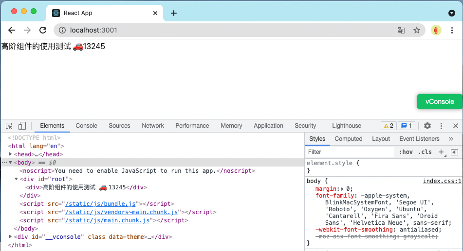
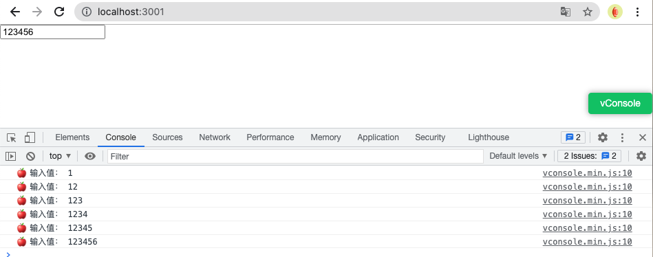
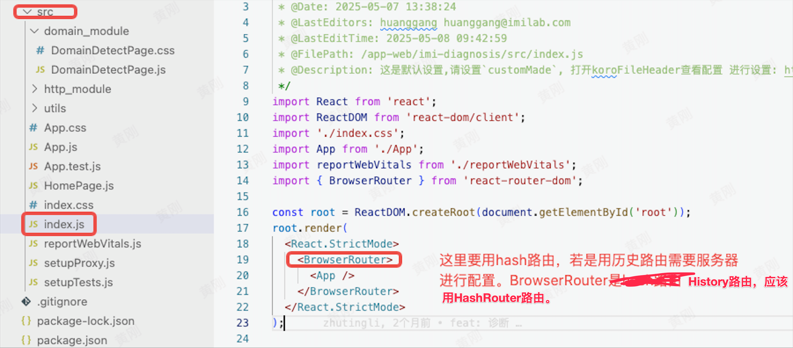
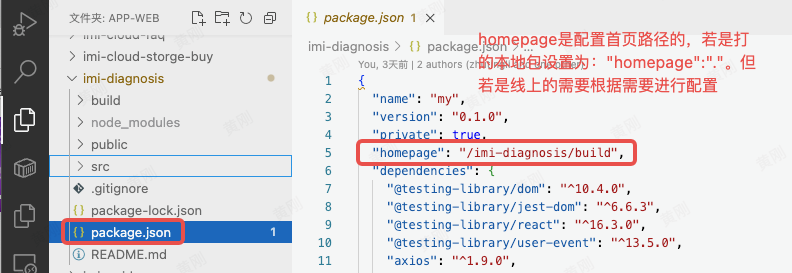
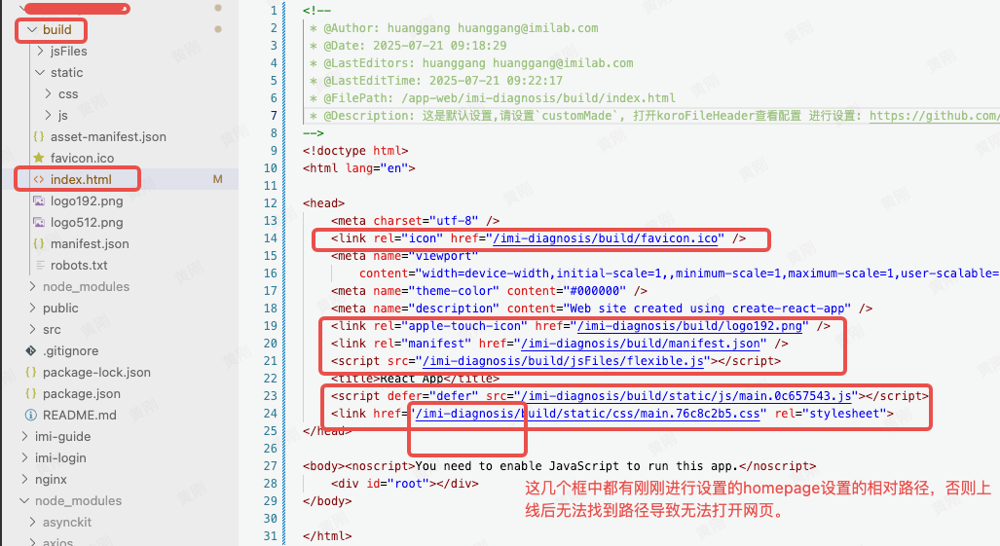

> <h2 id=''></h2>
- [**‌项目文件结构**](#项目文件结构)
	- [node_modules文件夹](#node_modules文件夹)
	- [普通包和作用域包](#普通包和作用域包)
	- [加载本地图片和图标](#加载本地图片和图标)
		- [Assets工具类](#Assets工具类)
	- [package.json文档](#package.json文档)
		- [旧版本地运行](#旧版本地运行)
		- [自动开启局域网访问](#自动开启局域网访问)
		- [scripts 命令区别](#scripts命令区别)
		- [mode 环境配置](#mode环境配置)
- [**手机本地调试**](#手机本地调试)
- [**React基础**](#React基础)
	- [**props**](#props)
	- [生命周期](#生命周期)
	- [SVG绘制图形](#SVG绘制图形)
- [模块类](#模块类)
	- [类的方法](#类的方法)
	- [单例类](#单例类)
	- [组件模块化导出](#组件模块化导出)
- [**高阶组件**](#高阶组件)
	- [引用子组件的属性ref](#引用子组件的属性ref)
	- [组件触发函数传递单个or多个参数](#组件触发函数传递单个or多个参数)
- [**网络请求**](#网络请求)
	- [接口字符串掺入占位符](#接口字符串掺入占位符)
	- [网络请求fetch](#网络请求fetch)
	- [网络请求fetch的本质](#网络请求fetch的本质)
	- [fetch请求数据的解析](#fetch请求数据的解析)
- [**环境变量注入**](#环境变量注入)
	- [区分不同环境：环境变量注入](#区分不同环境：环境变量注入)
	- [🧰三套环境变量注入+类型约束完整示例（包含构建配置+类型声明+使用）](#🧰三套环境变量注入+类型约束完整示例（包含构建配置+类型声明+使用）)
- [**‌语言国际化**](#语言国际化)
	- [react-intl库-国际化](#react-intl库-国际化)
	- [react-intl多语言demo](#react-intl多语言demo)
- [**打包**](#打包)
	- [线上发版](#线上发版) 
		- [环境变量配置](#环境变量配置) 
		- [打包注意事项](#打包注意事项)
	- [本地打包测试](#本地打包测试)


<br/><br/><br/>

***
<br/>

> <h1 id= "项目文件结构">项目文件结构</h1>

***
<br/><br/><br/>
> <h2 id="node_modules文件夹">node_modules文件夹</h2>


```sh
node_modules/
├── @types/
│   └── node/
│       └── globals.d.ts
             ↑
     包含：var localStorage: Storage;
```

这个`‌node_modules`相当于iOS中的`pods`管理依赖库工具生成的文件夹，所以你明白了，`‌node_modules‌`其实相当于装的都是依赖库的文件。


***
<br/><br/><br/>
> <h2 id="普通包和作用域包">普通包和作用域包</h2>

工程中放置下载的依赖文件夹结构，如下：

```text
node_modules/
├── lodash                 <-- 普通包
├── express                <-- 普通包
├── @types/                <-- 作用域文件夹，@types 是作用域名
│    └── node             <-- @types 作用域下的 node 包
├── @babel/
│    └── core
```

&emsp; **在 `node_modules` 目录下，为什么有些文件夹是以 `@xxx` 开头的（例如 `@types`、`@babel`），而有些是普通名字（例如 `lodash`、`express`）？它们有什么区别？**

---
<br/>

- **📦 1.普通包文件夹（无 `@` 前缀）**

	* 这类文件夹对应的是 npm 上的 **普通包**，包名就是它的名字。
	* 例如：
	
		* `lodash`
		* `express`
		* `axios`

安装后，这些包就直接放在 `node_modules` 目录下对应的名字文件夹里。

<br/>

- **📦 2.带 `@` 前缀的包文件夹（Scope 包）**

	* 以 `@` 开头的文件夹是 npm 的 **“Scoped Package”（作用域包）**。
	
	* 这种包的名字格式是：`@scope/packagename`，例如：
		
		* `@types/node`
		* `@babel/core`
		* `@mui/material`
	
	* 在 `node_modules` 里，作用域包会放在一个以作用域名命名的文件夹里，里面再有对应的包文件夹，例如：

```
node_modules/
  ├── @types/
  │    └── node/
  ├── @babel/
  │    └── core/
  ├── lodash/
  └── express/
```

---
<br/>

- **🎯 主要区别**

| 方面       | 普通包                    | 作用域包 (`@scope/packagename`)      |
| -------- | ---------------------- | -------------------------------- |
| **包名**   | 单一名字，如 `express`       | 以 `@` 开头，含作用域和包名，如 `@types/node` |
| **目录结构** | 直接放在 `node_modules/包名` | 放在 `node_modules/@scope/包名` 目录下  |
| **用途**   | 一般是普通公开包               | 用于区分组织、公司、团队的包；避免命名冲突            |
| **权限控制** | 无                      | 在 npm registry 中可以限制发布权限给特定团队    |
| **示例**   | `lodash`               | `@types/lodash`, `@babel/core`   |

<br/>

- **💡 作用域包的优势**

	* 组织管理：公司或团队可以将所有包统一放在一个作用域下，方便管理。
	* 命名空间：避免和别人包名冲突。
	* 私有包支持：作用域支持发布私有包，仅限团队内部使用。


***
<br/><br/><br/>
> <h2 id="加载本地图片和图标">加载本地图片和图标</h2>

在 **React 工程**里加载 **本地图片/图标** 有几种方式，取决于项目的构建工具

<br/> 

**1.放到 `src` 下，作为模块导入**

最常见的写法，Webpack / Vite 都支持。

目录结构示例：

```
src/
 ├─ assets/
 │   ├─ logo.png
 │   └─ icon.svg
 ├─ App.js
```

<br/>

**代码：**

```jsx
import React from "react";
import logo from "./assets/logo.png";
import icon from "./assets/icon.svg";

export default function App() {
  return (
    <div>
      {/* 普通图片 */}
      

      {/* svg 图标 */}
      
    </div>
  );
}
```

👉 构建工具会自动处理路径，把图片打包进最终产物。

<br/>


**2.放到 `public` 目录，用绝对路径引用**

如果不想走打包处理，直接放到 `public` 文件夹：

```
public/
 ├─ images/
 │   ├─ banner.jpg
 │   └─ favicon.ico
```

<br/>

**引用方式：**

```jsx
export default function App() {
  return (
    <div>
      
      
    </div>
  );
}
```

**特点：** `public` 下的文件不会被打包处理，而是原封不动放到最终目录。

<br/>

**3.SVG 图标的专门用法（React 组件方式）**

SVG 除了 `` 引用，还能直接作为 React 组件使用：

```jsx
import { ReactComponent as LogoIcon } from "./assets/icon.svg";

export default function App() {
  return (
    <div>
      <LogoIcon width={40} height={40} fill="blue" />
    </div>
  );
}
```

👉 这样可以直接用 **SVG 属性（如 `fill`、`stroke`）修改样式**，比 `` 灵活。

⚠️ 注意：这种用法需要你的构建工具配置了 `@svgr/webpack`（CRA 内置，Vite 需要手动加插件 `vite-plugin-svgr`）。

<br/>

**4.动态加载图片（适用于循环列表）**

比如你有一个 JSON 配置：

```js
const items = [
  { name: "Apple", img: "apple.png" },
  { name: "Orange", img: "orange.png" }
];
```

<br/>

**目录：**

```
src/assets/fruits/apple.png
src/assets/fruits/orange.png
```

<br/>

**代码：**

```jsx
export default function Fruits() {
  return (
    <div>
      {items.map((item) => (
        <div key={item.name}>
          
          <p>{item.name}</p>
        </div>
      ))}
    </div>
  );
}
```

👉 `require` 或 `import.meta.glob` 可以实现动态加载。

<br/>

**✅ 总结：**

* **组件代码用的资源 → 放在 `src/assets`，用 `import` 引入。**
* **公共静态资源（favicon、robots.txt 等）→ 放在 `public`，直接 `/路径` 引用。**
* **SVG 图标 → 推荐用 React 组件形式，方便改颜色和大小。**

***
<br/><br/><br/>
> <h2 id="Assets工具类">Assets工具类</h2>

封装一个 **统一的 Assets 类**，把两种方式（`public` 目录路径 & `src/assets` 导入）都融合起来，这样在 React 工程里可以随时选择。

<br/>

**📂 目录结构示例**

```
project/
 ├─ public/
 │   └─ assets/
 │       ├─ logo.png
 │       ├─ banner.jpg
 │       └─ icons/
 │           ├─ home.svg
 │           └─ user.svg
 ├─ src/
 │   ├─ assets/
 │   │   ├─ avatar.png
 │   │   ├─ cover.jpg
 │   │   ├─ home.svg
 │   │   └─ user.svg
 │   └─ Assets.ts
```

<br/>

**`Assets.ts` 统一管理类**

```tsx
// src/Assets.ts

// --- src/assets 下的资源（打包处理，带 hash，支持 svg 组件） ---
import avatar from "./assets/avatar.png";
import cover from "./assets/cover.jpg";
import { ReactComponent as HomeIcon } from "./assets/home.svg";
import { ReactComponent as UserIcon } from "./assets/user.svg";

export class Assets {
  // 走 src/assets（构建优化）
  static avatar = avatar;
  static cover = cover;
  static HomeIcon = HomeIcon;
  static UserIcon = UserIcon;

  // 走 public/assets（原样路径，不打包）
  static logo = "/assets/logo.png";
  static banner = "/assets/banner.jpg";
  static publicHomeIcon = "/assets/icons/home.svg";
  static publicUserIcon = "/assets/icons/user.svg";
}
```

<br/>

 **使用示例**

```tsx
import { Assets } from "./Assets";

export default function App() {
  return (
    <div>
      {/* src/assets 里的资源 */}
      
      
      <Assets.HomeIcon width={24} height={24} fill="blue" />

      {/* public/assets 里的资源 */}
      
      
      
    </div>
  );
}
```

<br/>

**✅ 使用建议**

* **项目中常用的小图标（特别是 SVG）** → 放 `src/assets`，用 `import`，支持 React 组件方式。
* **大文件、不需要打包处理的静态资源（例如背景图、视频、PDF 等）** → 放 `public/assets`，用路径引用。


***
<br/><br/><br/>
> <h2 id="package.json文档">package.json文档</h2>

---
<br/>

## 企业常见写法

```json id="e4imlj"
"scripts": {
  "dev": "vite --mode local",

  "dev:test": "vite --mode test",

  "dev:pre": "vite --mode pre",

  "build:test": "vite build --mode test",

  "build:pre": "vite build --mode pre",

  "build:prod": "vite build --mode prod"
}
```

对应：

```text id="dkxibg"
.env.local
.env.test
.env.pre
.env.prod
```

这是标准做法。

---
<br/>

## 需要检查的 env 文件

建议检查：

```text id="y1e28y"
.env.debug
.env.pre
.env.release
```

示例：

```env id="gzpn7g"
# .env.debug
VITE_API_BASE=https://debug-api.xxx.com
```

```env id="b85hpb"
# .env.pre
VITE_API_BASE=https://pre-api.xxx.com
```

```env id="gq13z4"
# .env.release
VITE_API_BASE=https://api.xxx.com
```

代码里读取：

```js id="4g00i3"
const api = import.meta.env.VITE_API_BASE
```

即可根据 `mode` 自动切换环境。


***
<br/><br/><br/>
> <h2 id="旧版本地运行">旧版本地运行</h2>

## package.json文件有一段如下：

```json
"scripts": { 
	"dev": "PATH=\"$HOME/.nvm/versions/node/v20.19.0/bin:$PATH\" vite --mode debug", 
	"build:pre": "PATH=\"$HOME/.nvm/versions/node/v20.19.0/bin:$PATH\" vite build --mode pre", 
	"build:release": "PATH=\"$HOME/.nvm/versions/node/v20.19.0/bin:$PATH\" vite build --mode release", 
	"lint": "eslint .", 
	"preview": "PATH=\"$HOME/.nvm/versions/node/v20.19.0/bin:$PATH\" vite preview" 
},
```


## dev环境运行

```sh
npm run dev 

Local: http://localhost:5173/ 
➜ Network: use --host to expose 
➜ press h + enter to show help
```

<br/>

**可以在浏览器打开：**

```text
http://localhost:5173/
```

查看你的 React 页面。

<br/>

```bash
➜  Network: use --host to expose
```

### 意思是：当前只能本机访问,也就是：
* 你的 Mac 自己可以访问 `localhost:5173`
* 同局域网手机、其他电脑不能访问

<br/>

### 如果你想让：
* 手机访问
* 局域网设备调试
* 远程访问

需要这样启动：

```bash
npm run dev -- --host

# 或者
vite --host
```

**启动后会多一个类似：**

```bash
Network: http://192.168.1.10:5173/
```

手机和其他设备就能访问了。


***
<br/><br/><br/>
> <h3 id="自动开启局域网访问">自动开启局域网访问</h3>

如果不想每次输入：

```bash
npm run dev -- --host
```

而是希望直接：

```bash
npm run dev
```

就自动支持局域网访问，可以把 `--host` 写进 `scripts.dev`。

```json
"scripts": {
  "dev": "PATH=\"$HOME/.nvm/versions/node/v20.19.0/bin:$PATH\" vite --mode debug --host",

  "build:pre": "PATH=\"$HOME/.nvm/versions/node/v20.19.0/bin:$PATH\" vite build --mode pre",

  "build:release": "PATH=\"$HOME/.nvm/versions/node/v20.19.0/bin:$PATH\" vite build --mode release",

  "lint": "eslint .",

  "preview": "PATH=\"$HOME/.nvm/versions/node/v20.19.0/bin:$PATH\" vite preview --host"
}
```

以后直接执行：

```bash
npm run dev
```

即可启动 debug 环境并支持局域网访问。


***
<br/><br/><br/>
> <h3 id="scripts命令区别">scripts 命令区别</h3>

## dev：开发服务器

```json
"dev": "vite --mode debug"
```

作用：

- 启动开发服务器
- 支持热更新（HMR）
- 实时编译
- 不会真正打包

运行：

```bash
npm run dev
```

会得到：

```bash
http://localhost:5173
```

适合本地开发、调试和接口联调。

---
<br/>

## build:*：正式打包

```json
"build:pre": "vite build --mode pre"
```

```json
"build:release": "vite build --mode release"
```

作用：

- 真正生成生产文件
- 输出 `dist/`
- 压缩 JS/CSS
- Tree Shaking
- 资源 hash 化

运行：

```bash
npm run build:pre
```

会生成：

```text
dist/
```

里面是：

```text
index.html
assets/
```

这些静态资源才能部署到 nginx、阿里云、CDN、正式服务器。

---
<br/>

## preview：本地预览打包结果

```json
"preview": "vite preview"
```

`preview` 不是开发服务器，而是**启动一个服务器查看 build 后的 `dist` 文件**。

流程：

```bash
npm run build:release
```

再执行：

```bash
npm run preview
```

它会读取：

```text
dist/
```

然后启动一个静态服务器。

用途：

- 模拟线上环境
- 检查打包后是否正常
- 检查路由问题
- 检查资源路径问题

---
<br/>

## lint：代码检查

```json
"lint": "eslint ."
```

作用是检查代码规范，例如：未使用变量、React Hooks 错误、分号问题、import 顺序、部分 TS 类型问题。

运行：

```bash
npm run lint
```

<br/>

## vite 和 vite build 的核心区别

```bash
vite
```

是开发服务器，特点是热更新、不压缩、快速编译、内存运行，适合开发调试。

```bash
vite build
```

是生产构建，特点是输出 `dist`、压缩代码、生成 hash 文件、执行 tree shaking，适合上线部署。


***
<br/><br/><br/>
> <h3 id="mode环境配置">mode 环境配置</h3>

这些命令：

```bash
vite --mode debug
vite build --mode pre
vite build --mode release
```

表示使用不同环境配置。

例如：

```text
.env.debug
.env.pre
.env.release
```

Vite 会自动加载对应环境变量。

```env
# .env.pre
VITE_API=https://pre-api.xxx.com
```

```env
# .env.release
VITE_API=https://api.xxx.com
```

对应关系：

| mode | 环境 |
| ---- | ---- |
| `debug` | 开发环境 |
| `pre` | 预发环境 |
| `release` | 正式环境 |

接口地址会随着 `mode` 自动切换。

---
<br/>

## build:pre / build:release 不是运行

```json id="w4ndmb"
"build:pre": "vite build --mode pre",
"build:release": "vite build --mode release"
```

它们只是**用 pre/release 环境变量进行打包**，不是启动本地开发服务器。

如果想像 `dev` 一样启动本地服务器，但加载 `.env.pre` 或 `.env.release`，应新增：

```json id="zc5e5x"
"dev:pre": "PATH=\"$HOME/.nvm/versions/node/v20.19.0/bin:$PATH\" vite --mode pre --host",

"dev:release": "PATH=\"$HOME/.nvm/versions/node/v20.19.0/bin:$PATH\" vite --mode release --host"
```


<br/><br/><br/>

***
<br/>

> <h1 id="手机本地调试">手机本地调试</h1>

- **1.手机和电脑要同处一个局域网【也就是同一个Wi-Fi】**

- **2.用 局域网 IP 代替 localhost**

在你的电脑上查一下 IP 地址，例如：

```sh
ipconfig getifaddr en0   # macOS 有线/WiFi IP

// 或者在工程中运行
npm run start

You can now view my in the browser.

  Local:            http://localhost:3000/imi-diagnosis/build
  On Your Network:  http://172.16.149.76:3000/imi-diagnosis/build
// 使用 http://172.16.149.76:3000/imi-diagnosis/build 也行；
```

<br/>

- **3.在react工程中进行如下路由配置**

**App.js中有：**

```js
function App() {
  return (
    <Routes>
	    <Route path="/home" element={<HomePage />} />
	
	    <Route
	        path="/app/guide_video/GuideVideoListView"
	        element={<GuideVideoListView />}
	      />
		</Routes>
  );
}
```

<br/>

**HomePage.js中有：**

```
class HomePage extends Component {
  constructor(props) {
    super(props);
  }
freshManGuideVideoListClick = () => {
    this.props.navigate("/app/guide_video/GuideVideoListView");
  };

render() {
    return (
      <div style={{ padding: 20 }}>
        <h1>首页</h1>
      
        <button onClick={this.freshManGuideVideoListClick}>
          新手引导视频列表
        </button>
      </div>
    );
  }
}

export default WithRouter(HomePage);
```

<br/>

```swift
let vc = BaseWKWebViewController()
        vc.urlStr = "http://172.16.149.76:3000/imi-diagnosis/build#/app/guide_video/GuideVideoListView"

self.navigationController?.pushViewController(vc, animated: true)
```

这样就可以在本地进行调试了。


<br/><br/><br/>

***
<br/>
> <h1 id='React基础'>React基础</h1>

<br/>

> <h2 id='props'>props</h2>

子组件prop: 在React中prop有一个内置的属性children,它表示子组件的集合也就是组件的数量.


propTypes: 可以对prop中的属性进行约束,如下:

```
static propTypes = {
	classPrefix: React.PropTypes.string,
	activeIndex: React.PropTypes.number,
}

```


<br/><br/>
> <h2 id='生命周期'>生命周期</h2>

生命周期可以分为挂载、渲染、卸载,分成两类:
- 当组件在挂载或卸载时;
- 当组件接收新的数据时,即组件更新时;

```

Class App extends Component {
	
	/**
		* 生命周期方法
	**/
	//类型约束 外部访问: App.propTypes
	static propTypes = {
		//.. ...
	}
	
	// 默认props的属性
	static defaultProps = {
		// .. .. 
	}
	
	// 初始化时的方法
	constructor(props) {
		super(props)
		this.state = {
			// . . .. 	
		}
	}
	
	// 会在render方法之前执行, 组件初始化时运行一次
	componentWillMount() {
		// . ..
	}	
	
	
	// 会在render方法之后执行, 组件初始化时运行一次
	componentDidMount() {
		// ...
	}
	
	// 组件卸载, 执行一些清理方法,如事件回收或是清除定时器
	componentWillUnmount() {
		// . . ..
	}	
	
	
	// 渲染组件
	render() {
		return <div/>
	}
	
	
	
	
	
	/**
		* 数据更新方法
		* 若是state更新了,一次执行shouldComponentUpdate、componentWillUpdate、render、componentDidUpdate
	**/
	
	// 若是由父组件更新props造成子组件更新,则componentWillReceiveProps先执行,接着是shouldComponentUpdate......
	componentWillReceiveProps(nextProps) {
		// this.setState({})
	}
	
	// componentWillReceiveProps 的替代方法
	static getDerivedStateFromProps(nextProps, prevState) {

        console.log(' >> 🍎 nextProps: ', nextProps, '\n prevState:', prevState)

        // 该方法内禁止访问this
        // nextProps: 最近更新的nextProps, prevState: 没有更新的state
        if (nextProps.isAllCheckModeState !== prevState.isAllCheckModeState) {
            return {
                isAllCheckMode: nextProps.isAllCheckModeState
            }
        }

        // 不需要更新状态 返回null
        return null
    }
    
	
	// 可以加一些判断,让它需要时更新,不需时不更新
	shouldComponentUpdate(nextProps, nextState)() {
		// return true
	}
	
	componentWillUpdate(nextPorps, nextState) {
		//...
	}
	
	componentDidUpdate(prevProps, preState) {
		// . . .
	}
	
	
}
```

***
<br/><br/><br/>
> <h2 id="SVG绘制图形">SVG绘制图形</h2>

```js
<div className="play-button">
  <svg width="24" height="24" viewBox="0 0 24 24" fill="none">
	  // 啥意思？自己画图标吗？
    <circle cx="12" cy="12" r="10" fill="rgba(0,0,0,0.8)" />
    <path d="M10 8L16 12L10 16V8Z" fill="white" />
  </svg>
</div>

// 有点不懂？
<svg width="24" height="24" viewBox="0 0 24 24" fill="none"> 
```

这个理解得没错。

**这一段：**

```jsx
<svg width="24" height="24" viewBox="0 0 24 24" fill="none">
  <circle cx="12" cy="12" r="10" fill="rgba(0,0,0,0.8)" />
  <path d="M10 8L16 12L10 16V8Z" fill="white" />
</svg>
```

就是 **用 SVG 标签直接绘制图形（图标）**。

<br/>

**逐个解释**

- 1.**`<svg ...>`**
	* `width="24" height="24"` → 这个 SVG 图形的显示尺寸是 24×24 像素。
	* `viewBox="0 0 24 24"` → 定义了绘制区域的坐标系（左上角是 (0,0)，右下角是 (24,24)）。
	* `fill="none"` → 默认没有填充颜色。

<br/>

- 2.**`<circle ... />`**

	* `cx="12" cy="12"` → 圆心在 (12,12)，正好是整个 24×24 的中点。
	* `r="10"` → 半径为 10。
	* `fill="rgba(0,0,0,0.8)"` → 填充颜色是半透明黑色（背景圆）。

   👉 就画了一个黑色半透明的圆。

<br/>

- 3.**`<path ... />`**
	* `d="M10 8 L16 12 L10 16 V8 Z"`
		 * `M10 8` → 移动画笔到 (10,8)。
		 * `L16 12` → 画一条直线到 (16,12)。
		 * `L10 16` → 画一条直线到 (10,16)。
		 * `V8` → 垂直回到 y=8（即 (10,8)）。
		 * `Z` → 闭合路径。
		* `fill="white"` → 填充颜色是白色。

   👉 就画了一个 **白色的三角形 → 播放按钮**。

<br/>

**直观理解**

整体效果就是一个黑色半透明圆，中间有一个白色的三角形箭头 ▶️ —— 典型的 **播放按钮图标**。

<br/>

所以，这个确实是「自己画图标」，而不是用图片资源。
优点是：

* 矢量图（缩放不会失真）
* 可以用 CSS 修改颜色、大小
* 不需要额外引入图片文件


<br/><br/><br/>

***
<br/>

> <h1 id="模块类">模块类</h1>


***
<br/><br/><br/>
> <h2 id="类的方法">类的方法</h2>


**ModalViewVM.jsx文件**


```jsx
import { getUnitLists } from './yourApiFilePath'; // 替换为真实路径

class ModalViewVM {

	//若是支持 ES6+ 的环境，也可以在类内部直接用 static，这和 静态属性 等价的
	static dataTypeList = [
    { label: '文本', value: 'text' },
    { label: '数字', value: 'number' },
    { label: '布尔值', value: 'boolean' },
    { label: '日期', value: 'date' },
  ];
  
  // 静态方法（可在类外部通过 ModalLogicVM.getDisableWithType 调用）
  static getDisableWithType(thingData, type) {
    console.log('getDisableWithType--', thingData, type);
    if (!thingData || typeof thingData !== 'object' || Object.keys(thingData).length === 0) {
      return false;
    }
    return thingData.type !== type;
  }
  
  // 方法：返回 Promise，让外部调用时可使用 async/await 或 .then()
  fetchUnitList() {
    return getUnitLists()
      .then(res => {
        if (res.code === 0) {
          return res.result || [];
        } else {
          return []; // 或者 throw new Error("错误提示")
        }
      })
      .catch(error => {
        console.error('fetchUnitList error:', error);
        return []; // 出错也返回空数组，避免调用出错
      });
  }
  
  
  async fetchUnitList00() {
    try {
      const res = await getUnitLists();
      if (res.code === 0) {
        this.unitList = res.result || [];
        return this.unitList;
      }
      return [];
    } catch (error) {
      console.error('fetchUnitList error:', error);
      return [];
    }
  }
}

// ✅ 静态属性，直接挂在类上，可以调用，调用上面的getDisableWithType静态方法
ModalViewVM.dataTypeList = [
  {
    label: '文本',
    value: 'text',
    get disabled() {
      return ModalLogicVM.getDisableWithType(someThingData, 'text');
    }
  },
  {
    label: '数字',
    value: 'number',
    get disabled() {
      return ModalLogicVM.getDisableWithType(someThingData, 'number');
    }
  },
];

// ✅ 1.单例导出
export default new ModalViewVM(); // 使用单例模式

/* 另一种单例写法
const instance = new ModalViewVM();
export default instance;
*/

// ✅ 2.或者命名导出
const instance = new ModalViewVM();
export { instance };

// ✅ 3.支持多个实例，导出类
export class ModalViewVM { ... }

```


- **静态属性为什么这么做是合理的？**
	- dataTypeList 是一组常量，和具体实例状态无关；
	- 挂在类上（static 属性或类外赋值）更符合语义；
	- 不需要每次创建实例就带着这组静态数据。


<br/>

**AnotherComponent.jsx文件调用：**


```jsx

// AnotherComponent.jsx

import React, { useEffect, useState } from 'react';
// 如果用了默认导出：
import modalViewVM from './modalViewVM';

// 如果用了命名导出：
import { instance as modalViewVM } from './modalViewVM';


const AnotherComponent = () => {
  const [unitList, setUnitList] = useState([]);

  useEffect(() => {
    // 调用 VM 的方法获取数据
    modalViewVM.fetchUnitList().then(data => {
      setUnitList(data);
    });
  }, []);
  
  //或者这样调用
  async function fetchData() {
	  const data = await viewModel.requestUnitList();
	  console.log('拿到单位列表', data);
}

  return (
    <div>
      <h3>单位列表：</h3>
      <ul>
        {unitList.map((item, index) => (
          <li key={index}>{item.name}</li> // 假设每项有 name 字段
        ))}
      </ul>
      {/* 使用函数的静态属性 */}
      <Select options={ModalLogicVM.dataTypeList} />
    </div>
  );
};

export default AnotherComponent;


function requestListMethod() {
	// 调用
	fetchData();
}
```


***
<br/><br/><br/>
> <h2 id='单例类'>单例类</h2>

**✅ 为什么这就是单例？**

这是因为 JavaScript 的 **模块（module）是单例的**：

* 每个模块（比如 `modalViewVM.js`）在第一次被引入时，会 **执行一次代码并缓存导出结果**。
* 之后其他文件再 `import` 这个模块时，得到的都是**同一个导出的对象引用**。
* 因为单例模式就是全局共享一个对象实例，所以你在任何地方修改它的属性，其他地方都会看到改变。

所以：

```js
// modalViewVM.jsx
class ModalViewVM {
  ...
}
export default new ModalViewVM(); // 创建一个实例并导出
```

在其他组件中使用：

```js
import modalViewVM from './modalViewVM';

modalViewVM.fetchUnitList();
```

得到的 `modalViewVM` 就是**唯一的、同一个实例**，这就实现了“单例”的效果。


***
<br/><br/><br/>
> <h2 id='组件模块化导出'>组件模块化导出</h2>

```js
export default AnotherComponent;
```

意思是：将组件 `AnotherComponent` 作为模块的**默认导出**。

<br/>

```js
// AnotherComponent.jsx
const AnotherComponent = () => {
  return <div>Hello</div>;
};

export default AnotherComponent;
```

在别的文件中就可以这么导入它：

```js
import AnotherComponent from './AnotherComponent';
```

<br/> 

- **❌ 这不是单例**

	* `AnotherComponent` 是一个**函数组件**（或类组件），`export default` 只是默认导出方式；
	* 每次 React 渲染时，都会 **调用一次该函数组件**，可能会创建多个实例（比如你在多个地方使用这个组件）；
	* 所以，它 **不是单例对象**，也**没有共享任何状态**，除非你在外部模块中封装了状态（比如 VM、Store、Context）。

<br/>


 **✅ 那什么是单例？**

单例的关键是：**模块中创建的对象，只创建一次，并在整个程序中共享使用**，比如：

```js
// modalViewVM.js
class ModalViewVM {
  ...
}
const instance = new ModalViewVM();
export default instance; // ✅ 这是单例
```


<br/><br/><br/>

***
<br/>

> <h1 id='高阶组件'>高阶组件</h1>

**App.js**

```
render() {
    const HightComponentTest = withPersisrentDataHOC(MyComponent)
    return <HightComponentTest />
}
```


**HighOrderComponent.js文件**

```
import React, { Component } from "react/cjs/react.production.min";


/**
 * @description: 高阶组件 localStorage 展示
 * @param {*} WrappedComponent
 * @return {*}
 */
export function withPersisrentDataHOC(WrappedComponent) {
    return class extends Component {
        componentWillMount() {
            localStorage.setItem('data', '高阶组件的使用测试 🚗 13245')

            let data = localStorage.getItem('data')
            this.setState({ data })
        }

        render() {
            // {...this.props} 把传递给当前组件的属性继续传递给被包装的组件
            return <WrappedComponent data={this.state.data} {...this.props} />
        }
    }
}

export class MyComponent extends Component {
    render() {
        return <div>{this.props.data}</div>
    }
}
```


效果：




***
<br/><br/><br/>
> <h2 id='组件状态提升'>组件状态提升</h2>


&emsp; 无状态组件更容易被复用。高阶组件可以通过将被包装组件的状态及相应的状态处理方法提升到高阶组件自身内部实现被包装组件的无状态化。一个典型的场景是，利用高阶组件将原本受控组件需要自己维护的状态统一提升到高阶组件中。

**App.js**

```
render() {
    return this._renderOfHightLevelComponentTest()
}


/**
* @description: 高阶组件渲染
* @param {*}
* @return {*}
*/
_renderOfHightLevelComponentTest = () => {

	// 组件状态渲染
	const ComponentWithControlledState = withCOntrolledState(SimpleControlledComponent)
	return <ComponentWithControlledState />
}
```


<br/>

**HightLevelComponent.js**

```
/**
 * @description: 组件状态提升
 * @param {*} WrappedCommponent 外部组件
 * @return {*}
 */
export function withCOntrolledState(WrappedCommponent) {
    return class extends React.Component {
        constructor(props) {
            super(props)
            this.state = {
                value: ''
            }

            this.handleValueChange = this.handleValueChange.bind(this)
        }

        handleValueChange(event) {
            console.log('🍎 输入值：', event.target.value)
            this.setState({
                value: event.target.value
            })
        }

        render() {
            // newProps 保存受控组件需要使用的属性和事件处理函数
            const newProps = {
                controlledProps: {
                    value: this.state.value,
                    onChange: this.handleValueChange
                }
            }
            return <WrappedCommponent {...this.props} {...newProps} />
        }
    }
}

export class SimpleControlledComponent extends React.Component {
    render() {
        return <input name='simple' {...this.props.controlledProps} />
    }
}
```


效果图：



***
<br/><br/><br/>
> <h2 id="引用子组件的属性ref"> 引用子组件的属性ref</h2>

**`React.createRef()` 是干什么的？**

```js
this.baseInfoRef = React.createRef();
```

这句话的作用是：**创建一个 “引用对象” ref，用来引用组件或 DOM 元素**。

<br/>

**二、`ref={this.baseInfoRef}` 是干什么的？**

```jsx
<BaseInfo ref={this.baseInfoRef} />
```

这表示：当这个组件 `<BaseInfo>` 被渲染后，React 会自动将它的实例（或 DOM 节点）**赋值给 `this.baseInfoRef.current`**。


<br/>

**✅ 三、你可以通过 `ref` 做什么？**

**🔹 场景 1：调用子组件方法**

```jsx
class BaseInfo extends React.Component {
  doSomething = () => {
    console.log('子组件方法执行了');
  };

  render() {
    return <div>BaseInfo 内容</div>;
  }
}
```

<br/>

```jsx
class Parent extends React.Component {
  constructor(props) {
    super(props);
    this.baseInfoRef = React.createRef(); // 创建 ref
  }

  handleClick = () => {
    // 调用子组件方法
    this.baseInfoRef.current.doSomething();
  };

  render() {
    return (
      <div>
        <BaseInfo ref={this.baseInfoRef} />
        <button onClick={this.handleClick}>调用子组件方法</button>
      </div>
    );
  }
}
```

<br/>

**🔹 场景 2：访问 DOM 元素**

```jsx
class Demo extends React.Component {
  constructor(props) {
    super(props);
    this.inputRef = React.createRef();
  }

  focusInput = () => {
    this.inputRef.current.focus(); // 操作 DOM
  };

  render() {
    return (
      <>
        <input ref={this.inputRef} />
        <button onClick={this.focusInput}>聚焦输入框</button>
      </>
    );
  }
}
```

<br/>

**✅ 四、`.current` 是什么？**

当组件挂载完后：

```js
this.baseInfoRef.current
```

会变成：

* 对于 DOM 元素 → 原生 DOM 节点
* 对于类组件 → 组件实例（可以访问方法和属性）
* 对于函数组件 → 如果用 `forwardRef()` 才能拿到（默认拿不到）

---
<br/>

**🚫 函数组件默认拿不到 ref？**

没错！如果你是：

```jsx
function BaseInfo() {
  return <div>xxx</div>;
}
```

那不能直接 `ref={this.baseInfoRef}`，你要用 `forwardRef` 包装：

```jsx
const BaseInfo = React.forwardRef((props, ref) => {
  return <div ref={ref}>xxx</div>;
});
```

---
<br/> 

**✅ 总结一下**

| 用法                         | 说明                                |
| -------------------------- | --------------------------------- |
| `React.createRef()`        | 创建 ref 对象，挂在 `this.baseInfoRef` 上 |
| `ref={this.baseInfoRef}`   | 告诉 React 把组件或 DOM 的引用赋值给这个 ref    |
| `this.baseInfoRef.current` | 就是你拿到的组件实例 或 DOM 节点               |
| 可用于做什么？                    | 调用子组件方法、操作 DOM、获取值等               |


***
<br/><br/><br/>
> <h2 id="组件触发函数传递单个or多个参数">组件触发函数传递单个or多个参数</h2>

<br/>

**为什么有些组件属性可以直接写 `onFinishFailed={this.onFinishFailed}`，而有些却要用 `onChange={(value) => this.handleFormItemChange('category', value)}`？**

这其实是 **React 事件传参机制 + 函数调用方式 + 组件回调签名** 的综合体现。我们一起来拆解。

<br/>

 **✅ 一、什么情况下可以直接写 `this.onXXX`**

```jsx
onFinishFailed={this.onFinishFailed}
```

**条件：**

* 你不需要额外传入参数；
* 函数本身的签名就满足组件回调需要；
* 比如：

  ```js
  onFinishFailed(errorInfo) {
    console.log('失败:', errorInfo);
  }
  ```

等同于：

```js
const onFinishFailed = (errorInfo) => { ... }
```

所以，AntD 的 `Form` 组件在触发 `onFinishFailed` 时会自动传入 `errorInfo` 参数，React 会自动把事件绑定给你。

<br/>

**✅ 二、什么时候必须写成箭头函数（或 bind）**

```jsx
onChange={(value) => this.handleFormItemChange('category', value)}
```

**这是为了手动传入额外的参数！**

如果你直接写：

```js
onChange={this.handleFormItemChange}
```

React 会把 `value` 当成第一个参数传入函数中，但你需要同时传入 `'category'` 和 `value`，所以你需要手动包一层：

```js
(value) => this.handleFormItemChange('category', value)
```

> 这是函数“柯里化”或“闭包”的用法，创建一个带参数的函数包装器。

<br/>

**写法一（无需额外参数）：**

```js
handleChange(value) {
  console.log('选中的值是:', value);
}

<Select onChange={this.handleChange} />
```

<br/>

**写法二（需要额外参数）：**

```js
handleFormItemChange(field, value) {
  console.log(`字段 ${field} 的值变为: ${value}`);
}

<Select onChange={(value) => this.handleFormItemChange('category', value)} />
```

---

<br/> 

**✅ 三、总结对比表**

| 写法                              | 场景                 | 是否需要传参 |
| ------------------------------- | ------------------ | ------ |
| `onChange={this.xxx}`           | 直接调用已有函数           | ❌ 否    |
| `onChange={(v) => this.xxx(v)}` | 需要额外加工或控制参数        | ✅ 是    |
| `onClick={this.xxx.bind(this)}` | 手动绑定 this（class 中） | ✅（旧写法） |
| `onClick={() => this.xxx()}`    | 简洁传参或与当前上下文绑定      | ✅      |

<br/>

**✅ 补充建议**

在类组件中，推荐你提前 **箭头函数定义方法**，避免 `this` 绑定问题：

```js
handleChange = (field, value) => {
  // 自动绑定 this，无需 bind
}
```


<br/><br/><br/>

***
<br/>

> <h1 id="网络请求">网络请求</h1>

***
<br/><br/><br/>
> <h2 id="接口字符串掺入占位符">接口字符串掺入占位符</h2>

在接口路径里给 `taskId` 做 **占位符**，然后在方法里传参时替换。有如下几种做法：

<br/>

✅ 模板字符串（最直观）

```js
function getTaskDetail(taskId) {
  return request.get(`/v1.0/imilab-02/cam/production-manage/task/${taskId}/detail`);
}
```

调用：

```js
getTaskDetail("12345");
```

实际请求路径：

```
/v1.0/imilab-02/cam/production-manage/task/12345/detail
```

<br/>

**✅ 占位符 + replace**

如果你喜欢先写个固定模板：

```js
const urlTemplate = "/v1.0/imilab-02/cam/production-manage/task/{taskId}/detail";

function getTaskDetail(taskId) {
  const url = urlTemplate.replace("{taskId}", taskId);
  return request.get(url);
}
```

<br/>

 **✅ 结合 axios 封装**

如果你项目里统一用 axios 或 request 封装，可以这样：

```js
export function getTaskDetail(taskId) {
  return request({
    url: `/v1.0/imilab-02/cam/production-manage/task/${taskId}/detail`,
    method: 'get'
  });
}
```


***
<br/><br/><br/>
> <h2 id="网络请求fetch">网络请求fetch</h2>

```js
// 自定义 fetch 函数
const request = (url, options = {}) => {
  return new Promise((resolve, reject) => {
    fetch(url, options)
      .then((response) => {
        // 这里还没处理 response
      });
  });
};
```

---
<br/>

- **1.`fetch` 是不是用于网络请求的？**

✅ **是的！**

> `fetch()` 是浏览器原生提供的一个 API，用于发起 HTTP 网络请求（GET、POST、PUT 等）。


**🔁 它的基本使用：**

```js
fetch('https://api.example.com/data')
  .then(res => res.json())   // 把响应转为 JSON
  .then(data => console.log(data))
  .catch(err => console.error(err));
```

<br/>

**2.为什么看不到“网络请求”？**

```js
fetch(url, options).then((response) => {
  // 空的，没有处理 response
});
```

虽然确实发起了网络请求，但是：

* `then()` 回调里面**什么也没写**，没有处理响应
* 外面的 `Promise` 也没有执行 `resolve` 或 `reject`

**所以你“看不到”任何结果或请求输出。**

<br/>

**3. `Promise` 是干嘛用的？**

`Promise` 是 JS 中用于处理**异步操作的对象**，比如网络请求、定时器、文件读取等。


```js
new Promise((resolve, reject) => {
  // 异步任务
  if (成功) {
    resolve(结果);
  } else {
    reject(错误);
  }
})
```

你可以用 `.then()` 处理成功，`.catch()` 处理失败。

---
<br/>

下面是一个**可工作的 `request` 封装函数**：

```js
// 自定义 fetch 请求封装
const request = (url, options = {}) => {
  return new Promise((resolve, reject) => {
    fetch(url, options)
      .then((response) => {
        if (!response.ok) {
          // 请求失败，比如 404 或 500
          reject(new Error(`HTTP error! status: ${response.status}`));
        } else {
          // 把 response body 转成 JSON 并 resolve
          return response.json();
        }
      })
      .then(data => resolve(data))   // 请求成功，传出数据
      .catch(error => reject(error)); // 网络错误等
  });
};
```

<br/> 

**✅ 用法示例：**

```js
request('https://jsonplaceholder.typicode.com/posts/1')
  .then(data => {
    console.log('请求成功:', data);
  })
  .catch(error => {
    console.error('请求失败:', error.message);
  });
```

---
<br/>

**✅ 总结你要记住的知识点：**

| 内容                    | 说明                      |
| --------------------- | ----------------------- |
| `fetch(url, options)` | 原生网络请求函数，返回 `Promise`   |
| `.then()`             | 处理请求成功结果                |
| `.catch()`            | 处理失败或异常                 |
| `new Promise()`       | 创建自己的 Promise 逻辑，用于封装异步 |
| `resolve(value)`      | 表示成功，并将结果传递出去           |
| `reject(error)`       | 表示失败，并抛出错误              |


这个问题非常好！你问的是：

> ✅ `fetch()` 函数**内部到底是如何发起网络请求的**？
> ✅ 它是怎么工作的？本质上谁在处理这个网络通信？


***
<br/><br/><br/>
> <h2 id="网络请求fetch的本质">网络请求fetch的本质</h2>


- **`fetch()` 本质上调用的是浏览器或 Node.js 内部实现的 C++/底层网络模块，不是 JS 写的。**

	* 在**浏览器中**，`fetch()` 是由浏览器内核（如 Chromium 的网络栈）处理的。
	* 在**Node.js 中**，从 Node.js v18 开始 `fetch()` 是内置的，它是基于 `undici` 实现的一个高性能 HTTP 客户端库。

---
<br/>

**✅ 1. 浏览器中的 `fetch` 是怎么实现的？**

在浏览器中，`fetch()` 是 Web 标准的一部分，由浏览器原生实现（不是 JS 编写的），属于 [Fetch API](https://developer.mozilla.org/zh-CN/docs/Web/API/Fetch_API)。


**⚙️ 浏览器中 `fetch()` 工作流程如下：**

```js
fetch('https://api.example.com/user')
  → JS 引擎将调用浏览器内部的 C++/系统调用
     → 通过 HTTP 协议与服务器建立连接（TCP 套接字）
        → DNS 解析域名 → 建立连接 → 发送请求头+请求体
          → 等待服务器响应 → 接收响应头+响应体
             → 将结果包装成 `Response` 对象 → 返回给 JS
```

它底层并不会用 XMLHttpRequest，而是一个更现代的方式，属于独立实现（基于 Streams、Promises 的组合）。

<br/>

**✅ 2. Node.js 中的 `fetch()` 怎么实现的？**

从 Node.js v18 开始，`fetch()` 是 **原生支持的**。

但 Node.js 并不像浏览器有内置 HTTP 网络栈，它是通过 **一个 npm 包 [undici](https://github.com/nodejs/undici)** 实现的。

> 📌 `undici` 是 Node.js 团队官方维护的一个高性能 HTTP 客户端库，内部使用 HTTP/1.1 请求连接池管理等。


**🧩 所以你在 Node 中使用 `fetch()`，等同于：**

```ts
// Node.js 内部
import { fetch } from 'undici';
```

它最终会调用 TCP 网络连接（如 `net` 模块）、HTTP 协议编码、事件监听等。

<br/>

**🔎 想看 fetch 源码？那得分环境：**

**✅ 浏览器中看不到 JS 实现，它是 C++ 的（封装在 Chromium 中）**

比如 Chromium 的部分流程是：

* Blink 层 → 网络调度器 → URLLoaderFactory → Socket
* HTTP 请求是通过类如 `HttpNetworkTransaction` 和 `URLRequest` 发出的
* 最终底层通过系统套接字连接服务器

这不是 JS 能直接看到的。


**🧪 示例：Node.js fetch 调用链**

```js
globalThis.fetch = require('undici').fetch;

fetch('https://api.github.com')
  .then(res => res.text())
  .then(console.log);
```

它内部会：

* 创建 HTTP 请求对象
* 发起 TCP 连接
* 发送请求头/体
* 解析响应内容
* 包装成 Promise 返回

---
<br/>

 **🧠 总结一句话：**

| 项目           | fetch 是谁实现的？                   | 用的什么网络机制？                |
| ------------ | ------------------------------ | ------------------------ |
| 浏览器          | 浏览器内核（如 Chromium）              | 原生网络栈（C++，非 JS）          |
| Node.js 18+  | 基于 `undici` 模块                 | `net` 模块 + TCP + HTTP 处理 |
| Node.js < 18 | 没有原生 fetch，需要手动引入 `node-fetch` | 同样走 TCP                  |

***
<br/><br/><br/>
> <h2 id="fetch请求数据的解析">fetch请求数据的解析</h2>

`fetch()` 返回一个 `Response` 对象

```js
fetch('https://example.com/data.json')
  .then((res) => {
    // res 是一个 Response 实例
  });
```

这个 `res` 是一个 `Response` 对象，包含很多方法来“读取/解析”服务器响应的内容。

---
<br/>

**常见的解析方法对比**

| 方法                  | 作用说明                     |
| ------------------- | ------------------------ |
| `res.json()`        | 解析响应为 JSON 对象（用于 API 数据） |
| `res.text()`        | 解析响应为字符串（纯文本/HTML）       |
| `res.blob()`        | 解析为二进制大对象（图片、文件等）        |
| `res.arrayBuffer()` | 解析为原始字节缓冲区（ArrayBuffer）  |
| `res.formData()`    | 解析为 `FormData`（通常用于上传表单） |

<br/> 

**✅ `res.json()`**

用于处理返回的是 JSON 格式的内容（如接口返回的数据）。

```js
fetch('/api/user')
  .then(res => res.json())
  .then(data => {
    console.log(data); // { name: 'Tom', age: 25 }
  });
```

等价于：

```js
const body = await res.text();
const json = JSON.parse(body);
```

<br/>

**✅ `res.blob()`**

用于处理返回的是**二进制大对象**（Binary Large Object），比如：

* 图片
* 视频
* 文件下载

```js
fetch('/images/photo.jpg')
  .then(res => res.blob())
  .then(blob => {
    const imgURL = URL.createObjectURL(blob);
    document.getElementById('img').src = imgURL;
  });
```

<br/> 

✅ 举个对比例子

```js
fetch('/file.json').then(res => res.json()) // → 输出 JS 对象
fetch('/file.txt').then(res => res.text())  // → 输出字符串
fetch('/file.jpg').then(res => res.blob())  // → 输出 Blob 二进制
```

---
<br/>

**小总结**

| 方法                  | 用途                    | 适合什么类型响应          |
| ------------------- | --------------------- | ----------------- |
| `res.json()`        | 将响应体解析为 JavaScript 对象 | JSON 格式的数据接口      |
| `res.blob()`        | 将响应体解析为 Blob          | 图片、视频、音频、下载文件等    |
| `res.text()`        | 将响应体解析为字符串            | 文本、HTML、纯文本等      |
| `res.arrayBuffer()` | 原始二进制                 | 更底层的处理，适用于音频、图像处理 |


<br/><br/><br/>

***
<br/>

> <h1 id="环境变量注入">环境变量注入</h1>

***
<br/><br/><br/>
> <h2 id="区分不同环境：环境变量注入">区分不同环境：环境变量注入</h2>

**Js文件有：**

```js
const { REACT_APP_ENV = 'dev' } = process.env;
```

和`package.json`文件中有：

```json
"scripts": {
  "debug": "cross-env REACT_APP_ENV=debug UMI_ENV=dev max dev"
}
```

**就是典型的环境变量注入方式**，但我们来详细解释一下 "注入到哪里" 和 "怎么让 TS 知道它的类型"。

---
<br/>

**✅ 一构建时如何注入环境变量？**

**🔸 1. `cross-env` 注入（你写的方式）**

你在 `package.json` 中定义：

```json
"scripts": {
  "debug": "cross-env REACT_APP_ENV=debug UMI_ENV=dev max dev"
}
```

这会在运行 `npm run debug` 时：

* 设置环境变量：`process.env.REACT_APP_ENV = 'debug'`
* 并传给 Node 或 Webpack、Vite 构建时使用

> ✅ `cross-env` 的好处是跨平台（兼容 Windows / macOS / Linux）

---
<br/>


**✅ 二、如何在代码中使用环境变量？**

你可以在 Node 或构建工具中读取它：

```js
const { REACT_APP_ENV = 'dev' } = process.env;
console.log(REACT_APP_ENV);
```

<br/>

**✅ 对于 React / Vite / Webpack 项目：**

构建工具会把 `process.env.REACT_APP_ENV` **替换为字面值**：

```ts
// 源码中写：
if (REACT_APP_ENV === 'dev') { ... }

// 构建后会变成：
if ("dev" === 'dev') { ... }
```

> ✅ 这在生产环境构建中可以让 dead code elimination 去掉没用的代码。

---
<br/>

**✅ 三、如何让 TypeScript 知道它的类型？**

在你写：

```ts
declare const REACT_APP_ENV: 'dev' | 'test' | 'pre' | 'prod' | false;
```

其实就是告诉 TS：

> “我虽然没有在代码中定义这个变量，但它一定存在，并且是限定的几个值之一。”

这就对了。

---
<br/>

**✅ 四、不同框架下的变量注入方式**

**🍃 React (Create React App):**

* 你必须以 `REACT_APP_` 开头的变量才会被注入
* 使用 `process.env.REACT_APP_ENV`
* 类型需要你手动声明或通过 `env.d.ts` 扩展

```ts
declare namespace NodeJS {
  interface ProcessEnv {
    REACT_APP_ENV: 'dev' | 'test' | 'pre' | 'prod' | undefined;
  }
}
```

<br/>

**🧬 UmiJS:**

你说的例子用的是 `UMI_ENV=dev` 和 `REACT_APP_ENV=debug`

* `UMI_ENV` 是 Umi 的内建环境变量，控制 `config/config.ts` 的条件配置
* `REACT_APP_ENV` 你可以自由用，只要你自己代码中引用
* 配合 `cross-env` 就是完整注入

<br/>

**⚡️ Vite:**

你需要在 `.env` 文件或 `vite.config.ts` 中使用：

```env
VITE_ENV=dev
```

然后在代码中访问：

```ts
import.meta.env.VITE_ENV
```

你可以定义类型：

```ts
interface ImportMetaEnv {
  readonly VITE_ENV: 'dev' | 'test' | 'prod'
}
```

---
<br/>

**✅ 五、总结你问的内容**

| 项目                                       | 是否正确 | 说明                        |
| ---------------------------------------- | ---- | ------------------------- |
| `cross-env REACT_APP_ENV=debug ...`      | ✅ 是  | 在构建或运行前注入环境变量             |
| `const { REACT_APP_ENV } = process.env`  | ✅ 是  | 在 Node/Vite/Webpack 构建时读取 |
| `declare const REACT_APP_ENV: ...`       | ✅ 是  | 给 TypeScript 提示全局变量的类型    |
| `UrlConstant.deployType = REACT_APP_ENV` | ✅ 是  | 将值封装为类字段用于判断              |

---
<br/>

**💡 小建议：**

如果你项目中用了 `process.env.REACT_APP_ENV`，建议这样声明类型：

```ts
declare global {
  namespace NodeJS {
    interface ProcessEnv {
      REACT_APP_ENV: 'dev' | 'test' | 'pre' | 'prod';
    }
  }
}
```

放在 `env.d.ts` 文件中（自动全局生效）。


***
<BR/><BR/><BR/>
> <H2 ID="🧰三套环境变量注入+类型约束完整示例（包含构建配置+类型声明+使用）">🧰 三套环境变量注入 + 类型约束完整示例（包含构建配置 + 类型声明 + 使用）</H2>

 **🚀 1. Vite 项目（推荐现代方式）**

**📄 1.1 `.env` 文件**

```env
# .env
VITE_APP_ENV=dev
```

> 所有以 `VITE_` 开头的变量才会被注入进客户端代码。

<BR/>

 **📄 1.2 `vite.config.ts`**

不需要特殊配置，Vite 自动注入。

---

**📄 1.3 `env.d.ts`（类型声明）**

```ts
/// <reference types="vite/client" />

interface ImportMetaEnv {
  readonly VITE_APP_ENV: 'dev' | 'test' | 'pre' | 'prod';
}

interface ImportMeta {
  readonly env: ImportMetaEnv;
}
```

---

**📄 1.4 使用方式**

```ts
const env = import.meta.env.VITE_APP_ENV;

if (env === 'dev') {
  console.log('开发环境');
}
```

---
<BR/>

**🔧 2. Webpack + React（如 Create React App）**

**📄 2.1 环境变量注入（推荐用 `cross-env`）**

```json
// package.json
{
  "scripts": {
    "dev": "cross-env REACT_APP_ENV=dev react-scripts start",
    "test": "cross-env REACT_APP_ENV=test react-scripts start",
    ...
  }
}
```

<BR/>

**📄 2.2 TypeScript 类型声明**

新建 `env.d.ts`：

```ts
declare namespace NodeJS {
  interface ProcessEnv {
    readonly REACT_APP_ENV: 'dev' | 'test' | 'pre' | 'prod';
  }
}
```

> `REACT_APP_` 是 CRA 的限制前缀，其他变量不会注入！

<BR/>

**📄 2.3 使用方式**

```ts
const env = process.env.REACT_APP_ENV;

if (env === 'prod') {
  console.log('生产环境');
}
```

---
<BR/>


**🧬 3. UmiJS 项目（你问的那种）**

Umi 有自己的机制：

**📄 3.1 注入方式（也支持 cross-env）**

```json
// package.json
{
  "scripts": {
    "dev": "cross-env UMI_ENV=dev REACT_APP_ENV=dev umi dev",
    "debug": "cross-env UMI_ENV=debug REACT_APP_ENV=debug umi dev"
  }
}
```

<BR/>

**📄 3.2 Umi 内使用环境变量**

```ts
console.log(REACT_APP_ENV); // 会在构建时替换为 "dev" 等字面量
```

<BR/> 

**📄 3.3 TypeScript 类型声明**

新建 `typings.d.ts` 或 `env.d.ts`：

```ts
declare const REACT_APP_ENV: 'dev' | 'test' | 'pre' | 'prod';
```

Umi 会自动识别这些全局变量，无需 `process.env` 前缀。

<BR/>

**🧠 总结比较表：**

| 框架            | 注入变量方式                        | 访问变量方式                         | 类型声明方式                             |
| ------------- | ----------------------------- | ------------------------------ | ---------------------------------- |
| Vite          | `.env` + `VITE_` 前缀           | `import.meta.env.VITE_APP_ENV` | `interface ImportMetaEnv`          |
| CRA / Webpack | `cross-env REACT_APP_ENV=xxx` | `process.env.REACT_APP_ENV`    | `declare namespace NodeJS {}`      |
| UmiJS         | `cross-env REACT_APP_ENV=xxx` | 直接 `REACT_APP_ENV`             | `declare const REACT_APP_ENV: ...` |

<br/><br/><br/>

***
<br/>

> <h1 id= "语言国际化">语言国际化</h1>

***
<br/><br/><br/>
> <h2 id="react-intl库-国际化">react-intl库-国际化</h2>

在 React 中项目中有：

```js
intl.formatMessage({ id: "sljdglajdsgl" })
```

这是 **国际化（i18n）库 `react-intl`** 中的一个典型用法，下面是详细解释：

<br/>

- **🔍 `intl.formatMessage` 是什么？**

	- 它是 `react-intl` 提供的用于**获取本地化语言字符串**的方法。
	- 你传入一个消息的 ID，它就会根据当前语言环境返回对应的翻译内容。

<br/>

**📦 使用 `react-intl` 的基本流程：**

- **1.定义语言资源（messages）**

为不同语言定义对应的文案，比如：

```js
// en.js
export default {
  greeting: "Hello, {name}!",
  welcome: "Welcome to our website",
};

// zh.js
export default {
  greeting: "你好，{name}！",
  welcome: "欢迎来到我们的网站",
};
```

<br/>

**2.配置 `IntlProvider`**

在应用顶层包裹 `IntlProvider`，注入当前语言和翻译文本：

```js
import { IntlProvider } from 'react-intl';
import en from './locales/en';
import zh from './locales/zh';

<IntlProvider locale="zh" messages={zh}>
  <App />
</IntlProvider>
```

<br/>

 **3.使用 `useIntl()` 或 `<FormattedMessage />` 获取文本**

方式一：使用 `intl.formatMessage`

```js
import { useIntl } from 'react-intl';

function MyComponent() {
  const intl = useIntl();

  return <div>{intl.formatMessage({ id: 'welcome' })}</div>;
}
```

<br/>

方式二：使用 `<FormattedMessage />` 组件

```js
<FormattedMessage id="welcome" />
```

<br/>

方式三：有变量占位（推荐 `formatMessage`）

```js
// { name: 'Harley' } 替换翻译字符串中的变量的
intl.formatMessage({ id: 'greeting' }, { name: 'Harley' });
```

<br/>

比如：翻译字符串中可以使用花括号 {} 包裹变量名，这就是 react-intl 支持的 ICU Message Format 语法。

你甚至可以写：

```js
// en.js
greeting: "Hi {name}, you have {count} new {count, plural, one {message} other {messages}}"

// 调用：
intl.formatMessage({ id: 'greeting' }, { name: 'Harley', count: 1 });
// → Hi Harley, you have 1 new message

intl.formatMessage({ id: 'greeting' }, { name: 'Harley', count: 3 });
// → Hi Harley, you have 3 new messages
```


<br/><br/>

**✅ 你的例子说明**

```js
intl.formatMessage({ id: "sljdglajdsgl" })
```

说明它**想获取一条 ID 为 "sljdglajdsgl" 的翻译文本**，如果你没有在 `messages` 中定义这个 ID，会返回 `id` 本身作为 fallback，也就是 `"sljdglajdsgl"`。


***
<br/><br/><br/>
> <h2 id="react-intl多语言demo">react-intl多语言demo</h2>

**✅ 项目结构：**

```
src/
├── App.js
├── i18n/
│   ├── en.js
│   └── zh.js
├── index.js
```

<br/>

**📄 1.`i18n/en.js` 英文语言包**

```js
export default {
  greeting: "Hello, {name}!",
  switchLang: "Switch to Chinese",
};
```

<br/>

**📄 2. `i18n/zh.js` 中文语言包**

```js
export default {
  greeting: "你好，{name}！",
  switchLang: "切换到英文",
};
```

<br/>

**📄 3. `App.js`**

```jsx
import React, { useState } from 'react';
import { IntlProvider, useIntl } from 'react-intl';

import en from './i18n/en';
import zh from './i18n/zh';

const messages = {
  en,
  zh,
};

function Content() {
  const intl = useIntl();

  return (
    <div style={{ padding: 20 }}>
      <h1>{intl.formatMessage({ id: 'greeting' }, { name: 'Harley' })}</h1>
    </div>
  );
}

export default function App() {
  const [locale, setLocale] = useState('en');

  const switchLang = () => {
    setLocale((prev) => (prev === 'en' ? 'zh' : 'en'));
  };

  return (
    <IntlProvider locale={locale} messages={messages[locale]}>
      <Content />
      <button onClick={switchLang} style={{ marginTop: 20 }}>
        {messages[locale].switchLang}
      </button>
    </IntlProvider>
  );
}
```

**代码解读：**

```js
const [locale, setLocale] = useState('en');
```

* 这是 React 的状态（`useState`）语法。
* `locale` 是当前语言代码，比如 `'en'` 表示英文，`'zh'` 表示中文。
* 初始值是 `'en'`，即默认显示英文。

<br/>

```js
const switchLang = () => {
  setLocale((prev) => (prev === 'en' ? 'zh' : 'en'));
};
```

* 这个函数 `switchLang` 是点击按钮时触发的。
* 它的作用是：**如果当前是英文，就切换为中文；否则就切换为英文。**

<br/>

```js
<IntlProvider locale={locale} messages={messages[locale]}>
```

* 这是 `react-intl` 提供的**顶层上下文组件**。
* 它接收两个关键参数：

  * `locale`：当前语言（如 `"en"`、`"zh"`）
  * `messages`：对应语言的翻译表。

👇 比如：

```js
const messages = {
  en: { greeting: "Hello" },
  zh: { greeting: "你好" },
};
```

当 `locale = 'en'` 时：

```js
messages[locale] === messages['en'] === { greeting: "Hello" }
```

当你切换语言时，`locale` 变化 → `IntlProvider` 的 `messages` 也跟着变 → 所有用 `formatMessage()` 或 `<FormattedMessage />` 的组件就自动刷新语言。


<br/>

 **✅ 所以能切换语言的关键就在于：**

| 关键项                | 说明         |
| ------------------ | ---------- |
| `useState('en')`   | 控制当前语言状态   |
| `setLocale()`      | 切换语言       |
| `IntlProvider`     | 接收当前语言和语言包 |
| `messages[locale]` | 根据语言动态切换内容 |


<br/><br/>

**📄 4. `index.js`**

```js
import React from 'react';
import ReactDOM from 'react-dom/client';
import App from './App';

const root = ReactDOM.createRoot(document.getElementById('root'));
root.render(<App />);
```

<br/> 

**🧪 效果：**

* 初始为英文：`Hello, Harley!`，按钮为 `Switch to Chinese`
* 点击按钮切换到中文：`你好，Harley！`，按钮为 `切换到英文`

<br/>

**🛠 依赖安装**

```bash
npm install react-intl
# or
yarn add react-intl
```


<br/><br/><br/>

***
<br/>

> <h1 id="打包">打包</h1>

***
<br/><br/><br/>
> <h2 id="线上发版">线上发版</h2>

**`React`**项目开发完成后，就可以本地打包测试完成后，然后就可以打包上线了。

<br/><br/>
> <h3 id="环境变量配置">环境变量配置</h3>

在 React 项目中（特别是使用 Create React App 或 Vite 等脚手架工具搭建的项目），你可以通过设置环境变量来区分不同环境（如开发 `development`、测试 `staging`、生产 `production`），并根据环境配置资源路径、接口地址等。

<br/>

**1.在项目根目录创建 `.env` 文件：**

| 文件名                | 说明       |
| ------------------ | -------- |
| `.env.development` | 开发环境     |
| `.env.production`  | 生产环境     |
| `.env.staging`     | 测试环境（可选） |

<br/>

**2. 在每个文件中添加变量（以 `REACT_APP_` 开头）：**

例如 `.env.production`:

```env
REACT_APP_API_BASE=https://api.yourdomain.com
REACT_APP_PUBLIC_PATH=/your-project/
```

<br/>

`.env.development`:

```env
REACT_APP_API_BASE=http://localhost:3000
REACT_APP_PUBLIC_PATH=/
```

> ✅ **注意：CRA（Create React App）默认只支持以 `REACT_APP_` 开头的变量。**

<br/>

**3.在代码中使用环境变量**

```js
const baseURL = process.env.REACT_APP_API_BASE;
const publicPath = process.env.REACT_APP_PUBLIC_PATH;

console.log('当前环境 API:', baseURL);
```


<br/><br/>
> <h3 id="打包注意事项">打包注意事项</h3>

在继续下面的任务前，你需要**配置好上面所说的环境变量。切记！！**

1️⃣首先你要确定你用的是hash路由还是history路由。

 
 
 <br/>
 
 2️⃣ 配置资源路径
 若是你使用的是CRA（Create React App脚手架工具搭建项目），在`package.json`中配置**`homepage`**字段，他会影响`build`后的静态资源路径。
 
 
 
 然后执行打包命令：
 
```sh
 npm run build
```

会生成 `build/` 目录，包含生产部署所需文件。

- **上传 build 目录到服务器或 CDN**
- 如果部署在子路径，确保服务器配置也支持此路径，例如 Nginx：

```nginx
location /your-project/ {
  root /var/www/html;
  try_files $uri /your-project/index.html;
}
```


 
<br/>
  
3️⃣ 查看打包后的资源路径
  
   

<br/>


**进阶：多环境打包命令**

你可以在 `package.json` 的 `scripts` 中添加不同环境的打包命令：

```json
"scripts": {
  "start": "react-scripts start",
  "build:dev": "env-cmd -f .env.development react-scripts build",
  "build:prod": "env-cmd -f .env.production react-scripts build",
  "build:staging": "env-cmd -f .env.staging react-scripts build"
}
```

需要安装 `env-cmd`：

```bash
npm install env-cmd --save-dev
```

然后：

```bash
npm run build:prod
```

<br/>

**✅ 小结**

| 功能    | 方法                                |
| ----- | --------------------------------- |
| 环境变量  | `.env.[env]` 文件 + `REACT_APP_` 前缀 |
| 路径配置  | `homepage` 字段或 Vite 中的 `base`     |
| 多环境打包 | `env-cmd` + 多套 `.env` 文件          |
| 部署路径  | 服务器配置路径或 CDN 子路径                  |


<br/><br/><br/>
<h2 id="本地打包测试">本地打包测试</h2>

**环境变量配置后（去人线上、测试）、package.json、路由设置**，然后执行：

```sh
npm run build
```

直接双击`build/index.html`不能正确运行，需要用本地服务器。

<br/>

**1.安装serve静态服务器**

```bash
npm install -g serve
```

<br/>

**2.预览build目录**

进入**项目根目录（注意：不是进入到build目录，否则会出现404错误）**，执行：

```bash
serve -s ./build
```

- 默认在`http://localhost:3000`可预览你的打包网站（地址在终端有提示）。
- 这个方式模拟正式环境效果[4][7][5]。

> **注意：** 如果打开后页面是空白，可能需要在`package.json`里加上一行：  
> `"homepage": "."`，保存后重新打包[7]。

---
注释: 0,47537 SHA-256 f0f4321109f07e26255025c65ae818c7  
@HuangGang <harley.smessage@icloud.com>: 105,5 119,3 131,7 147,3 159,43 220 248 281 307 310,21 397,23 3011,33 3053,2 3064,7 3119,5 3125,4 3148,2 3260,9 3272,2 3626,6 3634,2 3660,2 3761,7 3769,2 3776,2 3962,2 3967,3 4006,5 4013,2 4040,2 4422,5 4429,2 4448,2 4577,7 4585,2 4590,2 4659,10 4672,2 4998,5 5005,2 5012,2 5165,60 5311,5 5318,2 5328,2 5621,5 5628,2 5647,2 6312,5 6320,2 6326,2 6809,5 6816,2 6824,2 6963 6965,30 7009,2 7025,6 11616,101 11738,2 11763,6 11812,29 12005,7 12057,46 12112,9 12163 12214 12216 12228 12280 12322 12332,2 12351,11 12363,2 12379,2 12382,4 12823,20 12983 13049,22 14998,61 15151,7 15297,5 15369,8 15385,2 15391,2 15610,7 15618,2 15624,2 15628,2 15648 15704 15769 15798,7 15806,2 15832 15884 15906 15973,7 15981,2 16004 16038,2 16067,2 16099,2 16131,2 16163,2 16180,2 16242,5 16249,2 16255,2 16310,5 16395,3  
...
