> <h2 id=""></h2>
-  2
-  [HR专业名词 词汇](#HR专业名词 词汇)
-  [做对懒爸妈养出省心娃](#做对懒爸妈养出省心娃)
-  [游戏力-放弃阅读，不太好看](#游戏力-放弃阅读，不太好看)
-  [孩子的大脑](#孩子的大脑)
-  [程序是怎样跑起来的](#程序是怎样跑起来的)
-  [上瘾的㊙️密：迁移默化的营销方式如何重塑我们的大脑🧠](#上瘾的㊙️密：迁移默化的营销方式如何重塑我们的大脑🧠)
-  [怪诞行为学系列](#怪诞行为学系列)
-  [《HTTP权威指南》](#《HTTP权威指南》)
- [**AIGC智能创作时代-未读完 （比较垃圾，不建议读）**](#AIGC智能创作时代-未读完（比较垃圾，不建议读）)
- [**自律**](#自律)


<br/><br/><br/>
> <h2 id="HR专业名词 词汇">HR专业名词 词汇</h2>

```
HR专业名词 词汇：

hr三支柱是什么

HR三支柱是一种现代企业人力资源管理架构模式，由戴维·尤里奇（Dave Ulrich）在1997年提出，旨在优化人力资源部门的功能布局和服务效率，将人力资源工作划分为三个相互协作但又有各自专业分工的组成部分：

	1.	人力资源专家中心（HR Centers of Expertise, COE）
	•	COE是集中专业知识和策略规划的部门，负责设计、实施和维护企业的整体人力资源政策、流程、系统和最佳实践。例如，负责搭建和更新公司的绩效管理系统、薪酬福利制度、人才发展框架等。
	2.	人力资源业务伙伴（HR Business Partners, HRBP）
	•	HRBP作为与各个业务部门紧密合作的角色，深入了解业务需求和战略目标，将人力资源策略转化为实际解决方案，并直接支持前线经理和员工。他们参与业务决策，提供定制化的咨询服务，帮助解决人员配置、团队建设、绩效改进等问题。
	3.	人力资源共享服务中心（HR Shared Service Center, HRSSC）
	•	HRSSC是一个集中的、高效的后台服务部门，处理人力资源管理中的日常事务性工作，例如员工入职离职手续办理、薪资福利发放、档案管理、基本问题咨询等，从而提高工作效率和服务质量，减轻其他两个支柱的工作负担，使它们能够更加专注于策略性及增值服务。

通过这种模式，人力资源部门可以更加聚焦于为企业创造价值，提升响应速度，增强战略一致性，并有效利用资源来满足不断变化的业务需求。

HR中的SSC是什么意思

在人力资源管理（HRM）领域，SSC（Shared Services Center）是指人力资源共享服务中心。SSC是一个集中式的职能机构，负责处理企业内部人力资源管理的大量重复性、标准化的事务性工作，目的是通过流程优化、资源整合和规模化运作，来提高效率、降低成本并改善服务质量。

人力资源SSC通常负责的任务包括但不限于：

	•	员工信息管理与维护
	•	薪酬福利计算与发放
	•	社会保险与公积金缴纳
	•	合同管理
	•	考勤与休假管理
	•	员工入职与离职手续办理
	•	咨询服务与热线支持
	•	基础的招聘流程操作
	•	员工培训与发展的部分后台支持工作
	•	人事档案管理

通过设立SSC，企业可以使HR部门从繁琐的日常工作中释放出来，使得HR团队能更专注于战略性的、与业务紧密结合的人力资源管理工作，如人力资源规划、员工关系管理、绩效管理等更高层次的需求。同时，SSC还能通过采用信息技术手段实现自动化处理，提升整个组织的人力资源管理水平和响应速度。

hr中coe的意思

在人力资源管理（HRM）领域中，COE 是 “Center of Expertise” 或 “Center of Excellence” 的缩写，中文通常翻译为“专家中心”或“卓越中心”。COE 在人力资源结构中扮演着关键的专业技术角色，它是由一组拥有深厚专业知识和经验的人力资源专家组成的团队，负责特定领域的人力资源策略制定、政策设计、流程优化以及最佳实践的研究与推广。

在HR三支柱模型中，COE 负责：

	•	制定和完善企业层面的人力资源政策和流程，比如薪酬福利制度、绩效管理、培训与发展、员工关系等方面；
	•	提供专业技术指导和支持给业务部门的人力资源业务伙伴（HRBP）；
	•	设计和实施全局性或跨部门的人力资源解决方案，确保这些方案符合法律法规要求且有助于实现公司战略目标；
	•	追踪行业趋势，引入先进的管理理念和技术，不断提升企业人力资源管理水平。

简而言之，HR COE 是人力资源职能内的一个专业化和集中化的资源，致力于提升企业在特定人力资源管理领域的专业水平和竞争力。

hrbp的意思

HRBP是“Human Resource Business Partner”的缩写，中文译为“人力资源业务合作伙伴”。这一职位代表了人力资源管理的一种转变，即从传统的行政支持角色转变为更加深入参与企业业务决策的战略角色。HRBP的主要职责是作为人力资源部门与业务部门之间的桥梁，他们被派驻到各个业务单元或事业部，与业务领导紧密合作，理解业务战略和需求，并据此提供针对性的人力资源解决方案。

具体来说，HRBP的工作内容可能包括但不限于：

	•	根据业务战略制定相应的人力资源策略；
	•	协助业务单元进行人才管理，包括招聘、选拔、发展和保留人才；
	•	提供建议和实施措施以改善组织效率、员工绩效和员工满意度；
	•	参与业务规划和决策，确保人力资源策略与整体业务目标保持一致；
	•	解决业务部门内的人力资源问题，提供专业咨询和解决方案；
	•	推动企业文化建设，确保人力资源政策的有效落地和执行。

通过这种方式，HRBP成为了推动企业业务成功的重要内部顾问和战略伙伴。

HR中的hc是什么意思

在人力资源管理领域，hc是Head Count的缩写，指的是公司预计招聘或已经拥有的员工人数，即人员编制或岗位

vp助理是做什么的

VP助理（Vice President Assistant）是高级管理人员的辅助角色，主要职责包括但不限于以下几个方面：

	1.	行政支持：
	•	协助副总裁（VP）处理日常工作事务，如日程管理、行程安排、会议预定、差旅安排等。
	•	处理VP收发的各类文件、信件、函电，包括接收、登记、转达、归档及保密工作。
	•	安排与准备VP参加的各种内外部会议，并确保会议材料的完整性和及时性。
	2.	决策支持：
	•	参与制定公司战略规划，作为VP在决策过程中的助手，提供数据分析、市场研究等支持。
	•	对公司日常管理和运营问题提出建议，作为VP的智囊团成员之一。
	3.	内部协调与沟通：
	•	协调VP与其他部门间的沟通，确保信息畅通，为VP提供必要的情报和信息服务。
	•	协调VP与主要客户或合作伙伴的关系，组织接待工作，做好会议记录及后续跟进。
	4.	项目管理与执行监控：
	•	协助VP对接各业务部门，推进重点项目的执行，跟踪项目进度并向VP汇报。
	•	监督公司各项规划和计划的执行情况，督办、跟进并落实日常决议。
	5.	文档撰写与信息整合：
	•	撰写邮件、公文、报告等各类文件，汇总并整合需要向VP汇报的材料，包括但不限于预算、业绩报告等。
	•	整理和更新公司内部流程规范，确保VP能够及时掌握公司的最新政策和规定。

综上所述，VP助理是一个综合性的职务，不仅要在行政层面提供高效的支持，还需要具备一定的商业敏感度和分析能力，在更高层面上协助VP推动公司的整体运作。

QA是什么意思

QA是“Quality Assurance”的缩写，中文译为“质量保证”。在企业管理和生产制造等领域，QA是一项系统性的质量管理活动，旨在提供足够的信任，确保产品或服务能够在整个生命周期中满足规定的质量要求。QA工作涉及制定和维护质量标准、流程改进、预防缺陷的发生以及建立有效的质量体系。QA团队或人员通常不直接从事产品检测（这是QC，Quality Control，质量控制的工作），而是关注于过程的设计、审核、文档记录以及持续改进，以确保最终的产品质量能够符合预期和法规要求。在软件开发行业中，QA还包括编写测试计划、执行测试用例、参与需求评审等活动，以验证和确认产品的功能、性能及用户需求得以满足。

tl是什么意思

在人力资源（HR）领域中，“TL”通常是Team Lead或者Team Leader的缩写，中文翻译为“团队负责人”或“组长”。Team Lead是团队内部的一个管理角色，负责协调和指导团队成员完成项目任务，管理日常运作，以及协助解决团队内部问题。他们既是团队工作的组织者和领导者，又是团队成员与上级管理层之间的沟通桥梁，承担着一定的管理和领导职责，但一般不如部门经理或总监级别的职位那么高。

okr是什么意思

HR 中的 OKR（Objectives and Key Results）是指人力资源管理领域应用的目标与关键结果管理体系。这是一种先进的管理工具和方法论，用于设定、沟通、追踪和实现组织或团队的具有挑战性的战略目标。在 HR 管理中，OKR 可以应用于多个层面，包括但不限于：

	1.	组织层面：帮助设定和实现企业的整体战略目标，如员工满意度提升、人才结构优化、企业文化建设等。
	2.	部门层面：指导各个部门制定具体的人力资源管理目标，例如招聘周期缩短、培训计划完成率提升、员工流失率降低等。
	3.	团队和个人层面：协助团队和个人设立与其角色和职责相关的目标，保证个人发展目标与组织整体战略保持一致，同时通过量化关键结果来衡量这些目标的完成进度和效果。

相比传统的 KPI（关键绩效指标），OKR 更强调目标的雄心壮志和挑战性，并且鼓励全员参与目标设定过程，增强内部协作和透明度。OKR 不仅关注结果的达成，还注重过程管理和持续改进，有助于激发员工潜能和创新精神。

cto什么意思

CTO 是 “Chief Technology Officer” 的缩写，中文翻译为首席技术官。这个职位在企业中通常是负责技术方向和技术创新的高级管理人员，承担着制定和实施公司技术战略、管理技术团队、把握技术研发方向、搭建和优化技术架构、保障技术资源的有效利用、以及将技术发展与业务需求紧密结合等一系列重要职责。

首席技术官通常出现在高科技企业、研发机构、互联网公司以及其他依赖核心技术的企业中，他们是企业内部技术层面的最高负责人，直接向 CEO 或董事会汇报，并确保公司的技术基础设施、产品和服务符合行业发展趋势和市场需求。此外，CTO 还可能涉及知识产权管理、技术合作伙伴关系建立、技术投资评估等方面的工作。

bar raiser 的意思

bar raiser” 指的是一群特殊的面试官或者决策者，他们在招聘过程中扮演关键角色，目的是通过严格的评估来提高招聘的质量和标准。

																								  
```

<br/><br/><br/>
> <h2 id="做对懒爸妈养出省心娃">做对懒爸妈养出省心娃</h2>

```
社会学认为我们现在已经进入到“后喻文化”社会，也就是说：农业社会是“前喻文化”社会，晚辈向长辈学习，老人的经验非常管用，具有权威性；工业社会是“中喻文化”社会，年轻人和老人的知识都有一定的用处，学习更多地发生在平辈中；而智能时代是“后喻文化”社会，老人的经验和知识不一定管用，反倒是年轻人的知识和技能引领社会发展，长辈不得不向晚辈学习，因此，整个社会年纪大的人不得不向年轻人学习。在这个意义上，当父母一直认为自己是正确的，希望能把自己的经验传授给孩子的时候，很可能反倒影响了孩子的进步与发展。因为在后喻文化社会，我们做父母的才应该向子女学习，即使他们只是十几岁的少年，但由于他们是数码时代的原住民，他们成长的环境是我们当年不熟悉的。

而不经思考的催促和纠错却非常有可能破坏孩子原来的成长轨迹，破坏孩子自己的成长动力，更会破坏亲子关系。

父母的恐惧和焦虑是他们不断挑剔孩子背后的原因，如果认识不到多米诺骨牌逻辑的可笑，父母就不可能放轻松，就不可能接受孩子成长中本来就会有很多的小问题，不会接受这些小问题会随着孩子的成长而改掉，不会相信孩子自己会发现问题并去改变它们。再加上密集母职的荣辱与共文化，父母把每个小问题的改变都看作自己教育成功与否的关键，因此，纠错的力度层层加压，直到双方都筋疲力尽。


还比如动手和动脑，孩子总是喜欢用手去拿每个他能够到的东西，这个伸手拿东西的动作对孩子来讲是个非常重要的举动，这代表他的自我要进入世界，去跟世界发生关系。但是成人看到孩子去拿那些毫无价值的东西，或碰一些很容易碎的东西，就会很紧张。“哇！你不要碰这个东西。”“哇！你会伤到自己的。”所以，我们又打断了孩子对外部世界的探索。如果不允许孩子碰某些东西，就不要把它们放在孩子能够得到的地方，父母要通过改变环境来适应孩子的成长，而不是剥夺孩子去碰东西的机会。


成人如果总是按照自己的逻辑体系去看待孩子，就会给孩子造成压力和阻碍，而这些压力和阻碍会使得孩子不能很好地正常发展。蒙台梭利举了一个非常有意思的例子，她说如果我们跟一个下肢瘫痪的人一起走路，他拄着拐杖走得很慢，我们要跟着他走路，就会觉得很痛苦。实际上孩子也是这样的，孩子要跟上成人的节奏也是非常辛苦的。


所谓成长其实是孩子能逐渐理解自己，管控自己，能做出选择并承担选择的后果的过程。随着年龄的增长，孩子并不一定就能管理好自己，成长是孩子本我、自我、超我三者之间长期博弈的结果。

本我代表个人的本能和欲望，遵循懒惰快乐原则：自己怎么舒服怎么来，满足自己的本能和各种欲望。婴儿就是如此，每天吃了睡、睡了吃，这就是本能的体现。长大一点，人的本能依然很强大。比如一个人喜欢喝甜饮料，就希望每天喝甜饮料，本我才不管长期喝甜饮料的后果，一切依照快乐原则行事。最好还不用出门自己挣钱买饮料，有人直接递过来最好了。所以，本我的特点就是“好吃懒做”，每个人都有这样的本能。

自我是从本我中逐渐分化出来的，是现实不断教育本我产生出来的人格。你总是喝甜饮料，就会发胖牙齿痛；你不想走路，就无法拿到自己想要的东西。所以，完全的本我是不可能在现实中生存下来的，必须要有一个管控本我的自我出现。自我遵循现实原则，调节和把控本我与超我之间的矛盾，既要满足本我的需要，又要调节各种“社会规训”产生的压力。换句话说，自我就是调节个人本能欲望和社会规训的力量。所以，本我和自我本身就是有一定冲突性的。

超我代表社会理想的道德要求和集体化的规训，遵循理想原则，主要作用是抑制本我的冲动，实现完美人格的展示。比如牺牲精神就是超我这一人格的典型体现。换句话说，超我是以道德心的形式在运作，是儿童在成长过程中通过吸纳社会道德规训发展起来的人格，也是集体化过程中超越个体利益的一种力量。

本我和自我经常会进行“对话”，本我并不是那么愿意听自我的话的，只有当本我意识到听从自我的话对自己有好处时，才会听从自我。比如，自我觉得天气凉需要添衣服，但本我太懒嫌添衣服麻烦，便和自我“争执”。一开始，本我很强大，根本不听自我的；但是出门后果然很冷，冷得瑟瑟发抖或者着凉感冒。这样一来，自我的话语权就大了。自我向本我证明：你不听我的，就会吃苦头。这个时候，本我才会屈服，听从自我的要求，冷了添衣服，热了脱衣服，也因此感受到了听从自我的好处。随着不断累积，慢慢地，自我的话语权就大了。所谓成长，就是自我能越来越有效地管理好本我。

要建立好的归属感最重要的就是让孩子认识自己、接纳自己，能做出自己的选择并承担相应的后果。

孩子需要关注是一种非常正常的需求，但我们也要注意一个概念——合适关注。合适关注是指孩子如果本身很享受某件事情，被父母关注到了会很高兴，但是如果父母不关注，他也能自己乐在其中。事情的意义并不因为关注本身发生质的变化。而一个寻求过度关注的孩子，事情本身对他是没有意义的，只有获得妈妈爸爸的关注、他人的肯定，这个事情才有意义。也就是说，在孩子的自我意识中，他自己本身不具有太多价值，只有被别人看到、肯定，自己才有价值，这是孩子建立的第一个错误目标。孩子成年后形成的“讨好型人格”往往和小时候寻求过度关注有关。

如果父母在孩子建立第一个错误目标的时候，没有意识到背后的归属感问题，反而进一步去挑孩子的错，或者更多地“帮助”孩子，那么孩子会建立第二个错误目标——寻求权利。因为在父母不断给孩子纠错时，孩子对自己的认可度是比较低的，这就造成孩子在自我意识中，认为“我”每次都是错的，而人类本能又让他觉得“我”对这个社会是有意义的，“我”是有价值的。这种矛盾一方面会让孩子感到很痛苦，另一方面又让他通过跟父母争夺权利来寻求自己的定位。这在现实中就体现为：你让我往东，我偏偏往西；下次你说往西，我一定要往东。总之，他们没有真实的理由，就是要跟父母对着干。孩子通过这种“寻求权利”式的对抗来建立自己的归属感。

如果到了这个阶段，家长还没有关注到归属感的问题，还是觉得孩子不听话，继续用更强有力的方式去控制他、纠正他，那么孩子就会建立第四个错误目标——自暴自弃。

我们经常听说有孩子离家出走，这些孩子往往处于第三阶段寻求报复和第四阶段自暴自弃之间。他想最后看看，离开父母自己能不能成为一个可以依靠自己生存下去的个体，他要最后试一次。研究这些离家出走的个案，我们发现孩子都不是为了享乐或者通宵打游戏，而是为了独立生存的时间长一点。比如有一个离家出走的孩子，他拿了600元，每天都过得很辛苦，在公园长椅上睡，在超市里随便买点东西吃。他没有把钱一口气花掉，在外面很辛苦也不想回家。父母会觉得非常不理解：你又不是在外边过得很好，为什么还不肯回家呢？是的，孩子用这种方式在做最后的挣扎：“我”要看看“我”到底能不能成为独立的人。

在社会学研究中，米德等学者都证明了青春期的叛逆并不是必然出现的，青春期的孩子情绪起伏会比较大，会更在乎同伴的认可，对生活的追求会更多元。可是青春期的孩子并不一定会和父母对着干。孩子在青春期的叛逆主要是因为两代人之间的差异变大，上一代人想要控制下一代人而产生的。这一时期也是父母调整和孩子关系的最后时期。如果在这个阶段，父母依然强调孩子要“听话”，用各种方法去控制他、束缚他，那到最后孩子会出现三种不同情况。
第一种是彻底变成“妈宝男”或“妈宝女”，离开父母基本上就不太行。这样的个案很多。父母实在管不了孩子，孩子的学习成绩也不好，于是家长就把孩子送到国外读书，孩子在外面就随便混混，吃吃喝喝，学习还是不怎么样，最后告诉爸妈说学不下去了得回来，回来后也不想工作。
第二种是把问题都归咎为原生家庭的问题，觉得自己的所有问题都是父母造成的，但是又特别依赖父母，完全啃老，还啃得理直气壮；虽然会和父母对着干，也经常吵架，但是在经济上又完全依赖父母，自己根本不想努力。理由是：都是你们害了我。
第三种就是和父母彻底决裂，为了寻找自我，离开父母，去的地方离父母越远越好，做的事情都是父母反对的，在漫长的人生中，虽然早已过了青春期，但是却一直处于叛逆期中。所以，有一句话虽然是鸡汤，但是却让很多人产生共鸣：幸福的人，一生都被童年治愈；不幸的人，一生都在治愈童年。因为归属感没有在童年时期建立起来，所以在成年后要花更多的力量反省，才能找回成长的动力，才能重建归属感。


耶鲁大学的格赛尔儿童发展研究所经过40多年的研究，提出了相对完整的孩子成长地图：每个年龄段的孩子都有其不同的特征和能力成长，父母只有了解孩子的成长规律才能更好地理解孩子，帮助孩子适应社会。


1岁是可爱而难缠的年龄，也是培养安全感不可错过的一年；
2岁是又好气又惹人爱的年龄，也是培养幽默感不可错过的一年；
3岁是从友善到和父母对着干的年龄，也是培养创造力不可错过的一年；
4岁是狂野而美妙的年龄，也是语言表达能力飞速成长的一年；
5岁是开朗愉悦的年龄，也是亲子关系最融洽的一年；
6岁是叛逆而甜美的年龄，也是内心矛盾最为突出的一年；
7岁是沉静而敏感的年龄，也是抽象思维开始发展的一年；
8岁是成长与欢乐交织的年龄，也是热衷思考、思维活跃的一年；
9岁是独立而执着的年龄，也是学习能力跨越提高的一年；
10~12岁是独立又自我矛盾的年龄，也是向青春期过渡的阶段；
13~14岁是叛逆与成长共存的年龄，也是逐渐成熟的青春期。


了解孩子在不同年龄段的特点，会使教育孩子变得轻松且事半功倍。比如两岁的孩子把筷子扔到地上，父母不知道孩子这个年龄段的特征，就把筷子捡起来，告诉孩子不要扔。孩子再扔，父母再捡。循环往复，父母就会觉得孩子是在跟自己对着干。那孩子为什么这样做？因为他发现这样能引起你的关注，他好好坐在那里、好好吃饭不会引起你的注意。他把饭弄得一塌糊涂，你就会关注他。两岁的孩子希望引起成人的关注，无论是哪方面的关注，能引起关注就是成功。所以，这时父母的正确做法是把筷子捡起来拿走，不需要训孩子或和孩子讲道理（两岁的孩子听不懂道理，只能看懂表情），不理会，这事情就过了。


除了在网络上接受他人的点赞，在日常生活中，我们也可以通过接受外人的赞美给孩子贴正面标签。但是这一点，谦逊的父母常常做不到。
你带着孩子出去，碰到别人说“哎呀！你们家女儿真好，什么什么都好”，你会怎么说？由于中国文化一直强调谦虚，有的父母就会说：“哪里呀，她有很多缺点，你都不知道她怎么这么糟糕的！”我们经常觉得谦虚是美德，然后就当着很多人的面把孩子打压下去了。
但我每次带着女儿出去，如果人家说“哇！你女儿真棒！你看我们家孩子一点都不自觉……”我都会很感谢人家，我就会说：“是的，我真的对我孩子很满意！”外人的表扬对孩子是很重要的，所以我也经常会在朋友圈让朋友给我儿子点赞，我会说如果你觉得他做得很好，请给他点赞。这也是很有力量的。


接受别人对孩子的赞美也是很重要的。礼尚往来，我们也可以表扬别人家的孩子。当然，如果你家孩子听到你表扬别人家的孩子就不高兴，其实是在提醒你，你对他的肯定还不够，让他依然有不安全感，我们应该更努力才是。


4. 孩子自我总结
还有一个工具也非常好用，就是让孩子给自己贴正面标签。当孩子完成了一件他自己觉得很骄傲的事情时，你可以让他分享一下“这次你是怎么做好的”，让他自己去总结哪些行为导致了他的成功。你会发现这一招特别管用，对他的成就体系也非常管用，因为只有看得清楚，他才能明白自己这次是因为什么而成功的，这个过程很重要。
我们常会对孩子说：“犯了什么错？承认错误吗？说说自己错在哪里？”现在，我们可以换一种说法：“说说看，你怎么能做得那么好？”孩子是非常愿意和你分享他是怎么做对的。孩子的陈述其实就是在总结自己哪一步做得是准确的，总结自己正确的可复制行为。

. 指出过去做过但现在没做的“坏事”也是贴正面标签的一种方法
还有一个比较特殊的贴正面标签的方法：总结孩子过去做过或者本来可以做，但是现在没做的“坏事”。
比如，今天我们带着孩子一起出门，他本来可以干很多“坏事”，可以去推别人，可以去抢别人的东西，可以自己想吃就吃，可以大声喧哗……结果他竟然都没干，只是哭了一会儿，这也是值得肯定的，因为这是孩子可以复制的行为。我们就可以说：“今天，你跟妈妈一起出去，竟然在整个走路的过程中都很安稳地走在人行道上，没有跑到马路中间去。你这样走，妈妈觉得特别安心，很愿意跟你一起出去。”你要知道，绝大部分小朋友都是一路上乱跑的，有一天他终于不乱跑了，你一定要肯定他的这个改变。
有时候，孩子会做一些让我们很不喜欢的动作或行为，我们即使讲了道理，也提醒了几次，还是没有效果。在这种情况下，家长一定要耐心地等待，注意观察某个他终于不那么做的时刻，这个时刻是个高光时刻，我们要充分运用。

重要的是，父母要有一颗可以等待的心和一双能看到进步的眼睛：当孩子做错事的时候，等一等；当他不做这些错事的时候，指出来，让他看到自己的进步。


在做研究的时候，我发现很多父母常常走极端，比如有的父母从来不表扬孩子，觉得孩子一表扬就会骄傲自满，所以处处以挑错和鞭策的态度对待孩子，批评、讽刺、打击是每天都在做的事情。孩子想要获得父母的表扬，简直比登天还难。这样的孩子容易自卑，遇到事情总是首先怀疑自己。
而另外一部分家长却常常非常夸张地表扬孩子：孩子花5分钟随手画张画，便被父母捧成了“未来的大画家”；孩子随手弹钢琴，父母也能发现孩子的音乐天赋；孩子背了一首古诗，父母表扬的字数是古诗字数的10倍……这些父母和那些从不表扬孩子的父母有很大的不同，他们认识到打击教育对孩子的伤害，重视对孩子的表扬。
这两种极端其实都不可取，凡事有度，平衡是王道，表扬和批评其实都是孩子需要的，只是两者的比例不同。

正面标签跟表扬也不太一样，表扬相对来讲是比较抽象的，是对结果的一个总结，而且还是一个带着价值观的评判总结。而贴正面标签的目的不是去用价值观肯定别人，它的目的是“看见”，看中间一个具体的人、一件具体的事、一个具体的行为。所以正面标签要贴在过程中，而且我们强调的是可复制行为，看到孩子的正确行为，向孩子表达出来，让孩子也看到自己这个行为是对的。
比如：当我儿子写字写得很烂的时候，我至少可以肯定他写字起笔位置很好；孩子英文字母写得很烂的时候，我可以说至少他的英文字母都写在线上了……要不然，孩子写的字母飞来飞去，就很难看了。先从一些孩子能做到的角度肯定，然后再一点点往前推进。如果我们立刻就要求他写一手漂亮的英文字母，他是做不到的；现在就要求他马上提高成绩，也是不可能的。

你会发现，如果一个孩子遇到一个好老师，他的成绩突飞猛进，往往不是因为这个老师对他要求很高，而是这个老师很欣赏他，觉得他可以做到。这个时候，孩子就立马感觉很好。你会发现这种细微的区别在我们人类接收信息的时候是很关键的，很多研究都证明了信任的力量。
所以，正面标签背后的力量是信任而不是期待，这一点非常重要。当父母学着去信任孩子的时候，好改变就开始发生。

如果父母不焦虑，把自觉学习，即本我和自我的斗争看作长期的成长过程，能忍一忍、等一等，体会孩子在进行自我斗争时的不容易，倾听孩子的心声，那么随着孩子的成长，他的自觉性会越来越好，他的自我会越来越强大。如果父母忍不住，用强有力的手段来代替孩子的自我去控制他，那么这个自觉性的问题就会一直存在，越来越难解决。

区分三种问题，找到处理20%的问题的原则
很多问题是在孩子成长的过程中没法一下子解决的，我们可以把这些问题分成两种：一种是我们基本上让孩子自己承担结果的问题，叫自然后果问题；而另一种叫逻辑后果问题。家长真正要出手管的大部分都是逻辑后果问题，而不是自然后果问题。
不用马上管的问题：会产生自然后果
对于自然后果问题，举个例子。你跟孩子讲，这杯水很烫，摸了会烫手。如果孩子坚持要摸，你不用把杯子拿走，就让他去摸。孩子觉得烫，就会把手收回来啦！这样孩子被烫个两回，你下次放个冒热气的东西，他都会躲得远远的。
再比如，孩子走路不是慢慢走的，而是跑得很快，结果摔跤了，他摔个一两回，一旦自己承受了这个后果，你会发现他就会改变。对于这种会产生自然后果的问题，父母一定要忍住，让孩子去尝试、去试错。否则，如果我们把这些问题都避免掉，孩子就很难成长起来，就会变成我们之前说到的让父母的自我成为孩子的自我，而不是让孩子的自我成长起来。

所以，我们家长比较好的做法就是，如果想要知道孩子的冷暖，就经常问问孩子：你觉得冷吗？你觉得要加衣服吗？如果孩子说不需要加，那就不加了。但如果孩子冷了，感冒了，我们就要告诉他：“唉，可能你下次需要提前加衣服，感觉到自己稍微有点冷了，可能就需要加衣服了。而不是等到冷得瑟瑟发抖，流鼻涕了，你才加衣服。”
在这个过程中，我们不断询问孩子，让他不断去内观自己，不断去审视自己。所以，自然后果问题并不需要我们去帮孩子解决，我们要不断让孩子自己去感受后果，把因果关系联系起来就好了。

在这个过程中，我们不断询问孩子，让他不断去内观自己，不断去审视自己。所以，自然后果问题并不需要我们去帮孩子解决，我们要不断让孩子自己去感受后果，把因果关系联系起来就好了。
我不是说家长就什么都不做了，只是我们要做的事情不是直接帮他穿衣服，而是不断地问他：“你冷吗？你觉得需要加衣服吗？”让他自己去感知冷热。如果孩子坚决地说不要，你要相信他，他是真的还没到要加衣服的时候。
为什么我们总说，老人带的孩子特别容易感冒？因为他们一直给孩子穿得很暖和，孩子就没有办法自己了解冷热，而且孩子穿得多更加容易流汗，稍微有点凉就会感冒。
当然，我们还会碰到一个非常现实的问题，那就是家长根本不敢让孩子感冒，感冒这个自然后果是家长不愿意承受的。
实际上，这是我们对于感冒的一个误区，因为我们觉得感冒是可以避免的。但实际上，感冒是不能避免的，因为冷本身并不引发感冒，而是孩子冷了以后，免疫力下降，细菌侵入，孩子才会感冒。所以保持干净的环境，让孩子感觉稍微冷一点，一点问题都没有。我去北欧的时候，看到当地的小朋友在大冬天也依然穿着短裤，他们反倒不容易感冒。

总体来说，凡是孩子自己能承担后果的事情，父母一定要学会等一等、忍一忍，让孩子先承担后果，产生想要解决问题的内驱力，实在有必要父母再提供帮助和支持。

必须及时出手管的问题：出现逻辑后果的问题
还有一种问题是你必须及时出手干涉的问题，我们叫它逻辑后果问题。逻辑后果是指一件事情发生，它的结果是由别人承担，而不是孩子自己承担。
比如：一杯水很烫，我自己碰到被烫了，这个后果由我自己承担，这就是产生了自然后果；但是，如果我把水往别人脸上泼，把别人的脸烫伤了，我自己有后果吗？没有。这件事情的后果由别人承担，这就是逻辑后果问题。这个时候，如果家长不出手干涉，孩子就变成了熊孩子。
再比如，孩子在公园里荡秋千，坐在秋千上不肯走。10分钟以后，已经有很多孩子在旁边了。这时候，家长一定要按照约定，要求他离开，如果他不肯，就一定要强行把他抱走，不要指望他自己主动起来，因为他不承担后果，后果是别人承担的。对于所有由别人承担后果的行为，我们就要让孩子知道，这是我们家长要干涉的。
还有一点家长要记得，那就是对孩子来讲，我们也是别人，所以我们在逻辑后果问题中既是亲人也是其他人。一般来讲，我们家长在处理影响别人的问题时是很敏锐的，但是当孩子损害我们的利益时，却经常忽略，但这个时候我们是要告诉孩子的。举个例子。我家孩子大清早把我叫起来，我就会很生气。我会跟他说：妈妈要睡一个懒觉，你早上起来把我吵醒了，你影响了我的睡眠。这是我们要告诉孩子的。

如果某个问题产生的是自然后果，那么就应该让孩子自己去承受结果。在承受多次以后，他就会想着自己去改变，如果你不让他去承担，直接出手，你的自我就会变成孩子的自我

此外，在孩子的每个阶段，父母还有3到5个底线是必须要坚持的，因为这种事情的后果，我们承受不了，所以这种问题必须非常严肃地和孩子说清楚。在我儿子3~8岁的时候，我们家有3个底线：过马路时必须停下来等妈妈；上学不是可以讨论的问题，是法律规定必须要上；不能做让自己或别人流血的事情。

孩子上小学的时候我们就告诉他，上学是他的义务，也是他的权利，这是法律规定的。虽然小孩子还不懂什么是法律规定，但是特别能看懂父母坚决的神情，养成习惯后，他就基本知道上学是没有商量余地的。所以，孩子们从来不和我们讨论某天不想去上学的问题。

如果父母愿意去倾听孩子，会发现很多孩子是因为“懊恼”才发脾气的：觉得自己很努力，明明能做好，却因为一些原因考砸了。所以，他们发脾气实际上是对自己的不满，是上进的一种表现。如果父母能意识到这一点，就会允许孩子发泄情绪，就能接受孩子发脾气了。


有研究表明，人们在自己很擅长、很舒适的地方，没有改变或学习的动力，而在焦虑的时候，虽然有改变的想法，但常常没有能量，这两个圈都不适合学习。舒适圈和焦虑圈之间的部分才是人类最能学习、也学得最有效的区域。
所以，在孩子处于某个能


在家庭教育中，孩子并不是因为父母多么英明，道理讲得多么有逻辑而听父母的。孩子听父母的是因为和父母关系很好，很爱父母，希望得到父母的认可。因此，亲子关系才是家庭教育的基础，亲子关系不好，教育是无法开展的。

父爱和母爱最大的不同在于：在传统社会，父爱代表有条件的爱，而母爱代表无条件的爱。

孩子的成长过程中，母亲的作用是给予孩子一种生活上的安全感，而父亲的任务是指导孩子正视他将来会遇到的种种困难，孩子必须克服这些困难，才会得到父爱。母亲的爱会对孩子说：“不管你多么糟糕，不管你有什么罪恶，我都爱你。”而父亲的爱则要求孩子做错了事情就要承担后果，所以孩子在成长过程中要不断改变自己，才会得到父亲的爱。母亲的良知建筑在自己爱的能力上，而父亲的良知则建筑在自己的理智和判断力上。

如果你希望你的孩子是天使，那么你首先要创造一个天堂；如果你希望孩子喜欢阅读，那就问问自己有没有创造一个适合阅读的环境；如果你希望孩子独立有主见，那就问问自己有没有创造一个允许孩子发表不同意见、做出与父母不同决策的空间；如果你希望孩子能快乐幸福，那就问问自己有没有创造一个幸福的氛围。


```


<br/><br/><br/>

> <h2 id="游戏力-放弃阅读，不太好看">游戏力-放弃阅读，不太好看</h2>

```
游戏力-放弃阅读，不太好看

         
通常，所有游戏都比我们想象的要更有意义。首先，游戏是孩子尝试成人角色和技巧的途径，就像幼狮们从厮打中学习生存技能一样。不同的是，人类世界的儿童们不仅学习相互争吵，也学习和谐相处：“过家家”就是一个重要的学习途径。通过游戏，孩子一边探索世界，一边尝试自己在这个世界中的能力，也正是在这个过程中，孩子变得越来越自信和成熟。


游戏也是孩子学习如何与人建立亲密关系，甚至如何与别人重归于好的方式。黑猩猩喜欢在同伴的手掌上挠痒，特别是它们刚吵完架的时候。因此，游戏的第二个意义可以归结为：满足人们对联结、对亲密情感的无尽需求。这一点对人类来说尤为重要。

游戏一直是建立亲密关系的最佳方式之一。如果你问学龄儿童什么是游戏。他们会说，游戏就是同朋友一起做的事。

内心的孤独感，会让有些孩子默默地躲在角落里，而在与人相处时却又变得蛮不讲理、横行霸道。他们的不安与恼怒甚至惹人生厌，但那其实都是在表达，他们需要更多的关怀与帮助。这些情况发生时，我们需要为孩子创造更多的游戏时间，而不是惩罚了事，或者索性撒手不管。

通过游戏，他们学会了做饭烧菜、清洁整理、上班下班、争吵辩论、看护婴儿。周围发生的一切，他们都看在眼里，学在心里。反复练习这种游戏，孩子会变得越来越自信。

游戏可能只是假装的，但从悲伤中振作起来的需求却很真切。孩子选择这个假想游戏，是因为他需要克服打针所留下的真实痛苦。这不仅仅是好玩而已（尽管孩子在这个过程中找到了不少乐趣），而是带着很强的目的性。它的目的是让孩子自己再次经历整个过程，让恐惧感通过哈哈大笑释放出来。这就是孩子一而再、再而三地玩这个游戏的原因。

如果孩子不能用游戏使自己康复，他就可能被淹没在坏情绪中，乱发脾气。他们可能把气撒到别人身上，到处顶撞他人，稍不如意就痛哭流涕。有些孩子则会躲进房间里，把所有的情绪出口统统都封堵起来（双目无神地看着电视，强迫性地、不停地换频道）。他们看起来无精打采，了无生气。这一类情绪征状经常被大人忽略，因为“安静”的他们常常被认为是“乖孩子”，但事实上孩子正在经受煎熬。
当孩子把自己关在孤独、无力的堡垒里面，把吊桥收起时，做父母的该如何帮助他们呢？我们可能会觉得无能为力，因此想放弃算了。我们甚至会躲到自己的堡垒里，可是这样一来，面对孩子时就会更容易感到挫败。
·“他就是被宠坏的。”
·“我不知道该拿她怎么办。”
·“我讨厌自己对他们大吼大叫，可是下次我还是会吼他们。”
·“他突然怕起水来，可我已经买了一整年的游泳课，所以他非去游泳不可。”
·。  “走开，我现在很忙！”
      加入孩子的世界，将他们从封闭的情绪和乖僻的行为里解救出来，重建联结，重获自信，游戏是最好的方式之一。


也许我们都曾发誓，绝不会像其他大人那样严厉地对待孩子。但就在孩子最需要我们的时候——也就是他们发脾气、骂人、行为不端时，我们还是一怒之下施以惩罚，或者因为觉得受伤而把他们拒之门外。我们暂时性地忘记了孩子还很脆弱这个事实，就像他们暂时忘了应该合作、分享、保持镇静和遵守规则一样。


有时候，大人只有通过强迫自己和孩子一起坐在地板上，玩孩子们喜欢的游戏，才能看清楚自己内心想躲避的感受到底是什么。有位家长曾经告诉我：“和孩子一起玩不可能一直都有趣，但我还是会坚持，我知道最后我们都会快乐。而且，我用他们的方式玩得越多，他们也就越愿意在日常生活中配合我。”

另一方面，在打闹游戏中，父亲是孩子们最好的游戏对象。大量的研究已经一次又一次地证明，与爸爸摔跤、拳击，只要适度，将有助于孩子的成长。例如，常和父亲打闹的男孩，能和别人相处得更好。做父亲的擅长活跃气氛，比如在庆祝节日的时候，这些都很重要，都是孩子们需要的。不过，父亲仍然需要和孩子保持普通的日常互动。

与孩子调到同一频道，并不表示我们要过问孩子生活中的每一个细节。反之，我们可以先说一件自己今天发生的事，然后孩子可能会以一个自己的故事来回应。包括我自己在内，成人们常犯的一个错误，就是孩子在说“无关紧要”“无意义”的事，或者不断重复时，我们横加打断。然后，我们又期望他们说出我们想知道的事。这很不公平。即使孩子说的事似乎不重要，听上去很蠢，我们仍然必须耐心倾听。这一点很好理解，因为他们首先想确定我们是否在认真听，会不会打断或责骂他们，然后才决定告诉我们一些重要的事情。
```


<br/><br/><br/>> <h2 id="孩子的大脑">孩子的大脑</h2>

```

神经元连接、理性和直觉、大脑的三位一体，什么是海马体、前额叶皮质、脑岛皮质、杏仁核、纹状体、楔前叶……对大脑的基本结构、功能和发育秩序的学习和了解可以让父母在子女教育中更加从容和自信。例如，父母如果懂得在孩子1岁前起主导作用的是爬行动物脑时，那么，在孩子哭闹、有情绪时，就不会跟孩子讲道理、提要求，更不会忽视或惩罚孩子，而会关注孩子行为背后的感受、动机和意愿，对孩子一切的真实需求都给予及时和积极的回应。1岁以后，孩子的情感脑便开始与爬行动物脑协同工作，父母就要给予孩子更用心的陪伴和互动，满足孩子对爱和安全感的需求，与孩子构建起安全的依恋关系。3岁以后，孩子的自我意识逐步发展，理性脑在孩子的生活中扮演的角色越发重要，孩子开始慢慢学习着控制自己的本能。这一阶段，父母依然要给予孩子大量的情感支持、理解与包容，同时也需要逐步发展孩子识别自我感受、认识自己、管理自己的能力。


智商作为一种衡量孩子智力高低的数量指标，一向为父母所关注。智商主要反映一个人的认知能力、思维能力、语言能力、计算能力等，在中国目前所采取的应试教育体制下，这些能力恰恰又是一个孩子取得好成绩的基础。父母重视孩子的成绩无可厚非，但不能只盯着结果，更多的是要关注过程，帮助孩子掌握获取好成绩的方法和途径。遗憾的是，很多父母并不懂得如何帮助孩子提高成绩，而是逼孩子超前学、超负荷学，这些方法往往事倍功半，甚至适得其反，导致孩子产生厌学情绪。作者解构了儿童智力发展最重要的六个方面——注意力、记忆力、语言能力、视觉智力、自控力、创造力，并给出了发展这六种能力的方法和途径，例如，通过给孩子更多更用心的陪伴、让孩子玩耍放松、当孩子专注于自己正在做的事时不去打扰、创造合适的氛围等方式发展孩子的专注力；通过多与孩子聊天、拓展孩子的世界、与孩子一起玩指令游戏、培养孩子阅读习惯等方式发展孩子的语言能力。这六种能力的构建和发展，会在整体上促进孩子智商的提升，进而帮助孩子在学业上取得更好的成绩、在生活中解决更多的问题、今后在工作中做出更大的贡献。


情商是指一个人认识和管理自己情绪、自我激励、识别他人情绪、处理人际关系的能力。情商对一个孩子的成长、成功和幸福具有重大意义。特别是在今天这样一个科技发展日新月异的时代，在认知、记忆、计算能力等方面，人与人工智能是无法竞争的，人真正的优势就在于情绪和情感，在于爱和人文关怀。作者在书中给出了滋养孩子的情感脑、发展孩子的情商的途径和方法，例如，父母给予孩子无条件的接纳和爱，与孩子建立生命的联结，提升孩子的自尊、自信以及克服恐惧的能力，发展孩子以值得尊敬的方式表达自己的想法的能力，这些品质和能力，不仅有助于孩子社会性的发展、目标的实现，也是孩子幸福感、价值感的重要来源。


父母育儿要回归生活外，还一再强调，不要走极端、不要教条主义，要平衡、要灵活，“教育成功的真正关键在于抛弃特定的方法和教条，活在当下。伟大的家长或教育家并不是遵循特定的方法或坚持既定计划的人，而是知道如何随时发现孩子的需求并充分利用日常教育机会的人”。这也是我这几年在与众多

每一个面对孩子的成人，他的内心都会有一种独特的情感被唤醒。孩子的一举一动、孩子的纯真笑脸、孩子的天真无邪，都让我们感到深深的震撼，这种美妙的体验使人觉得，生命中任何其他体验都无法与之媲美。儿童以一种直接的方式与成人内心一个非常特殊的部分产生联系：每个成人心里都有个孩子，我们曾经是，现在仍旧是。

教育孩子的责任十分重大，对于很多人来说，教育孩子甚至是生活中最重要的事情。在人类生存繁衍的各个阶段，养育都显得尤为重要。从生物学的角度来看，孩子就像是种子，能确保你的基因在子孙后代中延续下去。从心理层面上分析，养育是一种无法抑制的本能行为。从精神层面上来说，当看到孩子们快乐成长时，你也会感到幸福满足。

孩子的性格是天生的，并且其性格将持续影响他长大以后为人处世的方式。有的孩子内向，有的孩子开朗；有的孩子很淡定，有的孩子则容易紧张。我们都知道，孩子的智力至少有50%是由基因决定的，研究表明，还有25％或许取决于孩子的同班同学以及他所交往的朋友。

聪明的人以计划为指导，智慧的人则是以原则为指导。
—拉希尔·法鲁克


每一笔知识上的投资，总会得到最好的收益。
—本杰明·富兰克林

玛丽亚·蒙台梭利的观点所说，孩子出生后的前6年是他一生中最重要的阶段。在这几年的时间里，孩子会形成对自己以及对所处世界的安全感意识，孩子还会学习语言，确立学习的方法以及打下未来解决问题和做决定的基础。
因此，好好利用这几年时间并且帮助孩子进行认知和情感发育是非常重要的。然而这并不意味着必须让你的孩子参加复杂的早教项目，又或者必须把孩子送到当地最好的幼儿园。你和孩子的每一次游戏、每一次歌唱、每一次散步，甚至是你每一次给孩子喂奶，都给了你机会去帮助孩子进行大脑发育。对于学龄前儿童来说，学校和课外辅导班的作用并不大，父母和兄弟姐妹才是真正对他的成长影响最大的人。孩子的价值观、规则意识、观察力、记忆力以及解决困难的能力，都是通过语言、游戏、或大或小的动作手势习得的。这些看似微不足道的小细节恰恰构成了教育的全部。本书所提到的教育方法正是利用日常生活中常用的工具和技巧，让你的孩子通过游戏和娱乐无压力地学习，让你们以一种自然的方式建立令人满意并且持久稳定的亲子关系。


神经元连接
一个婴儿在刚出生时就已经拥有了大约1000亿个神经元，这和成人所拥有的神经元数量相差无几。孩子的大脑和成人的大脑之间的主要区别在于，随着年龄的增长，这些神经元之间会产生数万亿次的相互连接。我们把这些连接部位称为“突触”。大脑内神经元相互连接的能力令人难以置信，这些连接可以在2秒钟内创建，一些神经元甚至可以和50万个相邻的其他神经元产生连接。
以下4幅图显示了不同年龄的神经元连接。
```

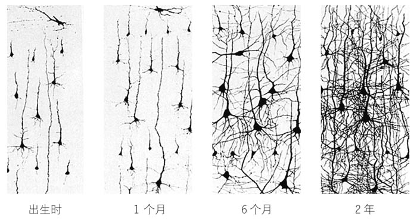


```
其实，抚养孩子更多的是依靠本能，它真的比我们想象的要容易得多。

著名杂志《美国医学会杂志·儿科学》最近公布了一项在瑞典进行的研究，研究结果显示，在奶嘴的处理上，似乎有比消毒更好的替代方法：当奶嘴掉到地上的时候，如果父母把捡起来的奶嘴放在自己嘴里舔舐干净然后还给孩子，而不是用水或其他清洁剂把奶嘴洗干净，反而可以增加孩子消化系统里的细菌的多样性，有利于孩子免疫系统的发育。

做更好的自己并不意味着你必须展示自己的完美无缺，因为无论你或其他任何人都不可能做到尽善尽美。不要害怕展现你真实的样子。我的孩子们见过我笑、哭、生气、犯错误、请求原谅、成功等各种状态和时刻，我尽量不隐藏任何东西，我是什么样的就表现出什么样子。

如果我必须选出一个对孩子的教育起决定作用的工具，那么我会毫不犹豫地选择强化孩子的积极行为。我可以向你保证，如果你知道如何奖励孩子，如果你知道什么时候奖励他，那么你将在养育这场战斗中获得90％的胜率，同时你和你的孩子都会对亲子关系更加满意。

我们选择的强化或奖励方式也是非常重要的，因为有一些奖励是无效甚至是适得其反的，有一些方法对孩子来说则会更加令他满意，效果更好。也许你不赞同，但总的来说，物质奖励让人开心的程度非常有限，因此，对孩子正向行为的强化作用也远远不如情绪上的奖励来得高效。从这个意义上来说，我坚持认为星球大战玩具比枕头大战的效果要差，尽管看起来好像不是这样。

如果孩子表现良好，你给他买了一个玩具作为奖励，他就会认为拥有物质才是生活中真正的价值，这样当他更大一些的时候，就需要拥有更多的东西才能感到满足。如果你认为你的儿子或女儿将来不太可能成为百万富翁，并且无法做到随心所欲地购买任何让他感觉特别或开心的东西，那么你现在的做法很有可能正一步步把你的孩子推向低价值感和不快乐的人生角色中去。即使你确定你的孩子长大后一定会生活优裕，使用物质奖励仍然不是一个好的策略，因为这种奖励会使孩子学习正向行为的速度更慢一些，并且使他无法理解亲情或互助的价值。从我的角度来看，毫无疑问，物质奖励越少越好。

激励陷阱指的是所有那些背后隐藏陷阱的奖品、奖励或强化行为，它们的结果大多适得其反。
```

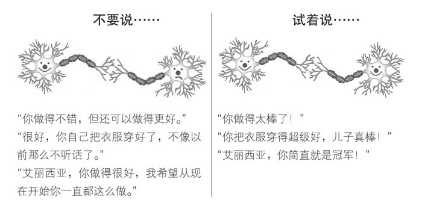

```
长期的影响是，如果这种激励陷阱反复出现，孩子将会在父亲或母亲面前体验到一种疏离感，听到父母那些责备的话语而产生的不满情绪会使孩子在情感上和父母逐渐远离。

如果这个孩子继续去烦她的姐姐，那么吃完点心之后她就不能看动画片了。从某种程度上来说，这是这个年龄的孩子眼中的正义结果，但其实还有更有效的选择。如果特蕾莎的父母坚持执行上述规则，那么关注的焦点就会落在特蕾莎打扰姐姐这件事情上，并且之后特蕾莎每一次违反规定时都让她感到受挫。可是如果我们运用转变视角的方法，彻底换一种思路，以一种更加积极的方式去分析这件事情，那么新的规定可以是：如果孩子表现良好，那么在吃完点心之后，就可以看动画片。通过这种方式，我们让孩子把注意力集中在良好的行为上，同时把遵守规范与获得满足感联系起来。这个方法看似很简单，但它非常强大，有时候即使是最有经验的父母也会忘记它。设定后果时记住要从积极的角度来考虑，当你发现惩罚开始频繁出现时，立即转变思路，改变规则，以便孩子把所有的注意力（控制个人意志的那部分脑结构）都放在那些积极的行为上。
弥补错误


成功设定限制条件的7条黄金法则
• 立即执行
如果你第一次看到孩子做出你不喜欢的行为或你认为不合适的行为时就设定限制并加以制止，那么你就避免了孩子的大脑神经元产生第一次负面连接，将来你需要做的工作量会大大减少，因为你在第一时间就制止了负面行为的发生。
• 发生之前
当你看到孩子将要做一些你认为危险或者负面的事情时，请尽量在事情发生之前将其阻止。和上一条规则一样，避免负面行为的发生比纠正20次错误的行为更加有效。一旦孩子养成了好的习惯，你将节省很多时间。
• 贯彻始终
让孩子放弃一次不当行为并不意味着他不会再犯。孩子们总是充满好奇并且勇于尝试，这是天性使然。限制条件得以执行的关键在于，它们在孩子大脑里的任何时候都是清晰存在的。
• 保持一致
如果母亲时不时地允许孩子在早上看动画片，那么仅仅孩子的父亲坚持不让他看电视是没用的。你和你的配偶在有关规则的问题上应该达成一致，这对于孩子的发展来说至关重要。
• 冷静对待
有效地设定限制的秘诀在于父母应尽力保持冷静。当父母对孩子大喊大叫，或者当父母感到紧张时，孩子大脑内的一部分结构就会被激活，这部分结构会使掌控限制和规则的大脑皮质暂时失去作用。在这种情况下，孩子既听不进去又无法理解和学习父母正在尝试教给他的知识和道理。
• 充满信心
当我们想要引导一个人时，最重要的就是让那个人相信我们知道应该把他带去哪里。如果你的孩子看到你很清楚什么该做、什么不该做，那么他会感到更加平静，更有动力去遵守你所制定的规则。不要和孩子过多地争辩，这样他就会明白让你改变主意没那么容易。
• 充满爱意
如果你在设定限制时充满爱意，孩子就能很好地明白，制定条条框框并不是针对他进行攻击，仅仅只是需要被执行的规定而已。这时孩子的挫败感会少很多，同时你也可以在不影响亲子关系的情况下执行规则。

也许你曾经在一些书中读到过，或者有朋友曾经这样告诉你：设定限制或者强化行为对孩子来说是不好的。然而神经科学的观点与你朋友的观点相反，因为这些工具的确都是有用的，并且它们还可以帮助孩子建立一系列对他们的发展来说非常重要的规则意识。毫无疑问，作为父母，你的责任是教育孩子在人生之路上前行以及如何得到自己想要的生活。如果你想让过程一切顺利，那么最好从一开始就给孩子设限，孩子的大脑就会迅速适应规则，养成良好的习惯，这些好习惯会使孩子顺利地成长，而不是迫使你们在同样的问题上一遍又一遍地争论。
```

帮助孩子认识和尊重限制条件是所有父母确保孩子良好的智力和情感发展而必须承担的重要任务之一。
◎ 不要因为要给孩子设定限制而感到内疚，限制从我们出生时就出现了，它是每个人生活中的一部分。
◎ 试着在负面行为发生之前设定限制，或者至少要在它成为孩子的习惯之前设定限制。设定限制时你的态度要像亲吻孩子时那般坚定、冷静和充满爱意。
◎ 当你在孩子的大脑里建立起规则意识之后，你将帮助孩子大脑的某一部分进行发育，正如你将在接下来的内容中看到的，帮助孩子实现自己的目标并且获得终身幸福。

```
合作式交流
接下来我想让你想象一下，你和你的配偶日常生活中最常见的一个场景。厨房里凌乱不堪，又恰好轮到你清理厨房，不巧的是你“懒癌”犯了，说实话，你一点都不想去打扫卫生。我希望你看看下面两个例子，并指出这两个例子中哪一个最有可能符合你的伴侣对你的要求。
例子A
“厨房里脏得跟猪圈一样。我已经等你打扫卫生等了半小时，你却什么都不做，只是坐在那里看电视。现在你马上去把整个厨房打扫干净。”
例子B
“亲爱的，你注意到厨房很脏了吗？我有点忙到喘不过气，已经没有干净盘子用来吃晚餐了。我们把电视关掉，然后来收拾厨房好吗？你能帮我吗？”
例子A反映的是询问式的沟通风格，例子B则是我所说的“合作式交流”。合作式交流是伊莱恩·里斯、罗宾·菲弗什和其他研究亲子沟通的科学家研究的一种交流方式。这种交流方式增加了让孩子与父母合作完成任务的可能性。当我们想让孩子在餐桌上坐下、收拾房间里的玩具，或仅仅是希望孩子可以仔细聆听我们说话的时候，我们就可以使用它。一些经常与智力缺陷人群打交道的专业人士经常使用这种沟通技巧，还有那些与有行为问题、注意力障碍或认知障碍的儿童相处的人也常用它。合作式交流之所以被广泛使用，是因为无论个人平时的交流风格如何，人们都可以通过学习来获得合作式交流的技巧。许多专业人士也会通过后天的训练来习得合作式交流的技巧，他们同时还做了一些研究。在这些研究中，他们会使用类似的技巧对不同类型的父母进行训练—之后我也会把这些技巧传授给你们—父母与孩子之间的交流也因此得到了改善。

多年的研究使我们知道：情商较高的人不仅更快乐，而且能做出更好的决策，在商业上获得更多成功，能成为更好的领导者。在任何需要与人交往的领域里，情商更高的人都能获得更多优势。就我个人而言，我非常清楚情商的重要性。尽管在家里我们很重视脑力的平衡发展，但就教育而言，我和妻子更倾向于情感教育。这并不是说我们更感性，只是我们选择优先关注孩子的情感发展，部分原因是我们的价值观使然，还有就是，作为一名神经心理学家，我知道，人的整个理性脑是建立在情感脑之上的。
不论是在孩子自身获得幸福感的能力中，还是在孩子与别人交往和实现目标的能力中，情商都占据着举足轻重的地位。既然现在你已经明白了情商的重要性，那么我相信你一定非常想知道应该如何支持孩子情感脑的发育。我很高兴你开始重视这个问题。在本书的第三部分，我们将一起探索情商的组成结构，我会教你一些原则和策略来促进孩子情感脑的发育。


事实上，从这个意义上来说，你的孩子正处在一个非常好的时代，因为过去所有年代的人都不知道依恋在健康的情感发展中的重要性。当你的父母抚养你的时候，社会对于这个问题普遍缺乏清晰的认识，因此，当时的教育观念与现在是完全相反的。当你的祖父母抚养你的父母时，有关子女教育最普遍的思潮就是，父母有义务加强孩子的个性，纪律、严格和鲜少表露关爱是塑造孩子性格的秘诀。当孩子们还只有几岁的时候，他们就被送去寄宿学校，而当时专制的父亲们往往会责备对孩子表露出过多心疼和不舍的母亲。幸运的是，时代变了，今天的我们了解了很多相关科学知识，知道了应该如何帮助孩子与世界建立充满信任感和安全感的联系。

也许，你可以送给孩子的最好礼物之一，就是自信。没有什么东西可以像自信一样，拥有如此强大的驱动力。正如罗斯福所说：“相信自己能做到，你就已经成功了一半。”在前一章中，我们谈到了良好的亲子联结如何帮助孩子的大脑发育并让孩子学会爱自己。自尊的另一面是自信。如果没有充分的自信，那么一个人将很难建立良好的自尊。

不要剥夺孩子的自信
通常，孩子缺乏自信是父母的不信任造成的。一个熟悉的场景能够充分证明这一点，那就是母亲把孩子送去幼儿园的第一天。每位母亲在第一次把孩子交到别人手中时，都会深深地感到缺乏信心。一般来说，母亲不会怀疑老师的专业性—如果是这样的话，我认为没有人会把自己的孩子留在任何一所学校—她感受到的是一种焦躁不安（这种情绪很正常），认为孩子离开了妈妈会没办法自己在幼儿园度过第一天。这种保护孩子的本能让母亲对孩子的安全问题无比忧心，并且表露出对于孩子离开父母独自生活的能力的怀疑。


这个意义上来说，不论每个孩子的天性如何，孩子的自信心都直接取决于父母对他的信任。如果孩子的父母整天都在为孩子的健康、安全或幸福而担心，那么孩子的大脑只会理解两件事情：第一，世界是危险的；第二，孩子根本没办法独自面对生活。每当面对挑战或新奇事件时，孩子会在他的杏仁核中接收到一个警告信号，这会让他产生恐惧，使他试图摆脱挑战并且躲在妈妈的裙子后面。反观那些父母给予了更多信任的孩子，即使面对不确定的情况，他们也可以灵活应对并且保持镇定。
我通常会向父母展示下面这个公式，以此提醒各位父母在培养孩子的自信心的同时，牢记相信孩子的重要性。
CN=（CPeN）2
（译者注：这是由西班牙语首字母组成的公式。CN指孩子的自信，CPeN指父母对孩子的信心。）
孩子的自信等于父母对孩子的信心的平方。
```
我知道，有时根据信任行事是很困难的。有些父亲及更多的母亲认为，孩子是一个必须受到保护的、不独立的个体。就我个人而言，这是我初为人父时最困难的部分。每当我对这一点有所怀疑时，我都会使用本书第一部分介绍的第一原则：信任，等着看看会发生什么。去年的初夏，我注意到我的大儿子和二女儿有一些不自信，特别是当他们在公园里被别的孩子包围的时候。我和我的妻子谈到了这个问题，并思考了好几天。当我想到，每一个孩子都像一棵注定会长成参天大树的小树苗时，我立即明白了，他们所需要的其实只是更多的信任而已。于是我马上与妻子分享了这一观点，我的妻子立刻表现出了大多数母亲保护孩子的本能并且表示反对，我也有些担心这样的决定一旦失误，会让我在这一周接下来的时间里都被惩罚只能睡在客厅的沙发上。权衡再三之后，我们最终还是决定在公园里做一个小小的实验。以往，我们去公园最常做的事情就是多次接近孩子并且给他们穿上或脱下毛衣，要求他们不要去某些地方或不要和哪些孩子一起玩耍。但是在那一天，我们决定在公园里度过一个平静的下午，对孩子们的行为不发表任何评论。那天的经历真是太棒了！孩子们跑来跑去，冷的时候主动要求穿上毛衣，渴的时候也会自己过来喝水。以前他们不敢去的地方，在那一天他们可以勇敢地爬上去，他们还结识了一群同龄的小朋友一起愉快地玩耍。那天他们真的玩得很开心，我已经不记得孩子们上一次这么尽兴是什么时候了。父母保持冷静，信任孩子，大胆放手，在大多数情况下，孩子都完全可以自信地面对问题并且表现优秀。关于这一点我已经一次又一次地进行了验证。在那个夏天，我们学到了非常重要的一课：就信心而言，少就是多。下面的表格列出了在哪些情况下父母最好让孩子自由行动，在哪些情况下孩子的行动需要父母的干预。

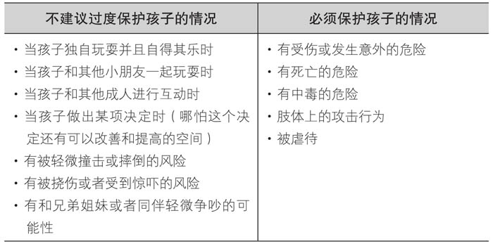


```
一直到20世纪70年代末，人们都还认为激励孩子的最好方式只是赞扬他的努力。很多研究试图找到最有效的短语或词句来提高孩子的行动力和自信心。今天的我们已经知道，对此没有完美的普适公式，因为在某个时刻，每个孩子都有能力去得到他想要的东西，关键是要对孩子付诸实践的能力进行强调，并且在孩子使用不常用的工具时对他表示支持。要做到这一点，你只需要在面对问题时集中精力，问自己一些简单的问题：他是怎样设法打开那个小盒子的？是因为坚持不懈，还是因为聪明？当他画这幅画的时候是怎样的状态？他注意细节了吗？精力是否集中？有没有控制笔触保证不画出线？是不是乐在其中？事实上，你不需要一直坚持强化或者故意夸张地吹捧，因为孩子的大脑已经知道自己是如何做到的，并且在成功完成之后获得了满足感。当孩子证明自己可以做到这一切时，你其实不用奖励结果，肯定他的努力、专注或毅力就已经足够了。

在这种情况下，我倒想知道生活中大大小小的事情对于这些人来说到底意味着多大的责任。对于很多人来说，“责任”这个词意味着残忍。有时候我在课堂上会被问到，让一个两岁的孩子承担责任是不是过于严苛。老实说我并不赞同这种观点，事实并非如此。从我的角度来说，责任就是照顾好自己，责任教育就是教育孩子照顾自己并且懂得自立。

原因很简单，把他们推进教室并不是我的任务，主动进去学习是孩子们自己的责任。举这些例子是为了告诉你们，孩子很小的时候，父母就可以通过一些小举动来向孩子灌输责任意识。当孩子大一些的时候，你可以教他把脏衣服放到洗衣篮里，吃完早餐收拾杯子，或者是清理脏东西—比如当牛奶洒到桌上的时候。如果你用自然的态度来对待这些事情，那么它就不是惩罚，只是在让孩子照料自己的生活，他自己独立完成这些任务的同时也许需要你的小小的帮助。孩子在每个年龄段都有许多可以承担的任务，这些任务有助于他建立自信，同时学会做家务。我可以向你保证，他会喜欢完成自己的任务，并且在这种有能力照顾自己的满足感中慢慢长大。
```


牢记
◎ 信任是我们可以给孩子的最好礼物之一。
◎ 在成长过程中能够感觉到父母对他的信任的孩子将成长为一个能够实现自己目标和愿望的人。
◎ 我们应该避免过度保护孩子，相信他，坚信他有充分发展自我的能力。
◎ 让孩子承担责任，并对他的情绪和决定给予支持。
◎ 不要忘记，当你想要激励孩子的自信时，最明智的方法是不要只重视结果，而应该在孩子面对困境时肯定他的努力、专注以及享受过程的态度。

```
面对孩子的恐惧，许多母亲倾向于通过拥抱来抚慰自己的孩子，同时表现出同理心，让孩子觉得母亲会保护他免受所有不好的事物的侵害。尽管让孩子感到安全和被保护至关重要，而且每个母亲都会很好地向她的孩子证明，在她的怀里是安全的，但在那个当下，如果仅仅满足于此其实是不太合适的。因为尽管许多母亲和孩子都希望母亲永远保护着她的孩子，但在现实生活中这不大可能。和母亲相反，父亲通常会采取更加直接的方法，鼓励孩子在那个当下面对恐惧，却没有意识到这就像把一只小羊羔扔进了狼群。在第一种情况下，孩子可能会缺乏自信，缺乏勇气，倾向于回避困难。在第二种情况下，事情也许可以顺利进行下去，但是孩子的恐惧通常也会变得更加严重，这也是为什么不推荐这种大男子主义的应对策略的原因。实际上，正如生活中的许多其他事情一样，平衡缓和的中庸之道似乎提供了一个更为有效的解决办法。

高情商者的共同特点是他们非常笃定。“笃定”指的是个人以值得尊敬的方式表达自己的想法的能力。笃定的人可以表达他们不想要或不喜欢的东西，也能够表达他们想要的或者喜欢的东西，并且表达得清晰和值得尊重。
```
```

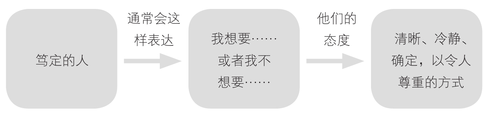


笃定本身就是与其他人交流的一种方式，我们对自己的权利、意见和感受都很清晰，并以互相尊重的方式表达出来。毫无疑问，对于任何想要帮助孩子达到自我满足并且实现目标的父母或老师来说，他们的重要职责之一就是教会孩子笃定。所有的专家都认为，性格笃定的人一生受益颇丰：他们对自己更加自信，能够减少与他人的冲突，能够更有效地实现自己的目标。
笃定这一特质在自信的人身上更为明显。同样，所有通过后天训练变得能够笃定地与他人沟通的人，都会对自己和与他人的关系感到自信。这是因为笃定的人焦虑水平更低，他们的大脑分泌较少的皮质醇—应激激素。有趣的是，当一个焦虑的人与一个笃定的人交谈时，焦虑的人会感到放松，皮质醇的分泌也减少了。正因为如此，笃定的人通常是天生的领袖。你应该了解的另一个有关笃定的关键点是，所有的专家都认为，在孩子的成长过程中，越早具备笃定的特质与性格，他就对自己越有自信。接下来我会给你3把钥匙，它们可以让你帮助孩子形成笃定的沟通风格。

```
被尊重对待的权利
不要不尊重你的孩子，也不要让其他人这样做，否则孩子的大脑会认为他自己不值得被尊重。
• 表达感受与意见的权利
认真听取孩子的意见，表现出真正的兴趣。你不必总是按照他的要求行事，重要的是对孩子的意见给予同样的尊重和思考，就像你希望孩子重视你的想法那样。
• 判断需求、确定优先事项并且做出自己的决定的权利
注意孩子的动作和话语。你的孩子知道他想让你给他读什么故事、什么时候饱了、什么时候不想再吃东西或者什么时候不想实施你制订的计划。只要一切都在你的掌控之中，尽量让孩子自己决定。
• 说“不”的权利，并不必为此感到内疚
我们都可以有自己的意见，且有权对某些事情说“不”，拒绝的同时我们不应该为此感到内疚。如果你的孩子在某一天不想洗澡，请仔细思考一下这个问题是不是真的很严重。让孩子自己做出决定或者给他设定限制，但是不要让他感到内疚，否则长大后每当遇到类似的情况，他都会感到内疚和愤怒。
• 要求得到想要的东西的权利
我们都有权索要我们想要的东西，同时我们也应该知道对方有接受和拒绝的自由权利。
• 改变的权利
每个人都有权改变自己的意见、喜好、兴趣和爱好。当你的孩子选了和一开始所选的不一样的东西时，请尊重他的决定。
• 在不侵犯他人权利的基础上有权决定如何处理自己的财产和身体
也许你的孩子决定和朋友交换玩具，或者决定用记号笔在腿上画一个图案。我们的确必须教育孩子，不让他做任何伤害自己的事情，但如果是在双方都同意的基础上交换玩具，或者在小腿肚上画一只恐龙，又有什么不对呢？依我看，这样做一点问题都没有。
• 犯错的权利
我们都会犯错。我会犯错，你会犯错，当然你的孩子也会犯错。帮助孩子理解，每个人都会犯错，犯错并没有什么大不了的。
• 成功的权利
当你看到自己的孩子跑得快、跳得高或者读书读得好，而他的兄弟或者邻居却表现平平的时候，你可能会感到有一些尴尬。请不要因此而忽视孩子取得的成就，或者觉得不好意思。每个人都有权利获得成功，其他孩子也有他自己的闪光点。如果连你都不认可你的孩子，你认为他还能认可自己吗？
• 休息和独处的权利
像你一样，孩子有时也需要独处的时间，用来让自己静一静或者暂时切断和他人的联系，特别是当他吃饱或累了的时候。对于孩子来说，这是生活中一件再正常不过的事情，就像渴了要喝水一样。给他一些空间，让他静一静。我敢肯定，过一段时间他就会重新和他的朋友们聚在一起。
接下来是最后一条，也是我最喜欢的一条。
• 不笃定的权利
我们所有人都可以选择在某个特定的时间里态度果敢或者被动消极。有些时候我们会感觉自己的能力有所下降，觉得自己不如平时强大或者被挫败感打败，这个时候我们的反应可能会比平时更加具有侵略性。这其实很正常。每个人和各自面对的情况都是不同的，所以请尊重孩子选择不笃定的权利。对于纳粹时期生活在集中营里的人们来说，保持消极不要强出头是最好的生存工具。至于我们自己，当我们面对有可能受到侵害的情况时，假装示弱、不要硬碰硬可能是唯一的出路。这些都是外部环境影响下的应对策略，当主观因素发生变化时同样如此。比如说，当一个人陷入焦虑时，如果他依旧能够保持分寸并且不因为一个小小的冲突就与他人起争执，那么他很聪明。毫无疑问，在正常情况下，笃定是最好的选择，但在生活中并不是所有的情况或者所有人都是正常的。不要限制孩子的沟通方式，给他一些空间，让他可以在不同的时间以不同的方式做出反应，毕竟他还很小。对于一个孩子来说，遇到事情会害怕是正常的反应。请尊重孩子选择不笃定的权利。


学会忍受挫折
如果想让孩子长大后成为一个快乐的人，那么他在成长过程中必须学习的重要一课就是如何克服挫折感。

首先，金钱买不来幸福；其次，在生活中我们不可能拥有所有我们想要的东西；最后，人们是在与其他人的交往和互动过程中感到幸福的。


学会等待
你可以从孩子非常小的时候帮他培养耐心，比如说，当他要吃奶或者因为某些原因感到不舒服的时候，不要急着去满足他的所有要求，你要相信他是有能力等待的。不要因为孩子哭泣就觉得很焦虑，否则你只会让孩子认为经历挫折真的很痛苦。尽管你会尽可能快地去照顾孩子，但要保持冷静和信心，让你的孩子知道他是可以忍受一点挫折的。随着年龄的增长，通过教导孩子尊重限制条件，特别是在时间方面，可以帮助他更好地应对挫折。对于孩子的大脑来说，知道必须等一会儿或者等好几轮才能得到想要的东西是一件好事。从这个意义上来说，你可以教导孩子，在拿出新玩具之前，必须把之前玩过的玩具收好，吃饭之前必须洗手，画画之前必须先收拾好桌子，想要得到梦寐以求的礼物必须等到生日或另一个特定的日期，等等。在等待的过程中，孩子当然需要忍受一些挫折和不耐烦，但他也将学会保持憧憬，这是那些幸福感高的人身上的另一个特点。

心理学研究表明，通过训练可以使人们把注意力转向积极的方面，因此，我进行了一个小小的实验。在4周的时间里，我让学生们每天晚上在纸上写下当天发生的3件积极有趣的事情，4周之后他们的快乐程度明显提高了。观察到这个有趣的结果之后，每天晚上在给孩子们读故事之前，我都会要求他们告诉我当天发生的两三件好事情。如果你也坚持这样做，那么你不仅可以帮助你的孩子将注意力集中在事情的积极方面，而且你会明白什么事情对他来说才是真正重要的。但我不得不告诉你们事情的真相：回忆一天中发生过的好的事情并不是我的孩子们喜欢的睡前活动，只是因为我的坚持才使它成为读晚安故事的必要条件。我相信这有助于孩子发展正面的、积极的思维，至少，可以帮助他们培养自己的耐心。


培养兴趣爱好
这看起来似乎过于简单，但仔细想想，你会发现这是一个具有强大力量的想法。那些花时间做自己喜欢的事情的人，比花时间做自己不喜欢的事情的人要快乐一些。特别是那些有兴趣爱好的人，比如说，能够沉浸于绘画、运动或烹饪等活动中以至于忘记时间的人，他们比没有兴趣爱好的人更加快乐。尊重和鼓励你的孩子通过绘画、整理娃娃、做手工或看故事书来娱乐，因为从幸福的角度来看，集中精力以至失去时间概念的能力是非常有价值的。

人的智力是由大脑皮质决定的，它位于大脑的最外层，无尽的褶皱是它最鲜明的标志。正如我们已经看到的那样，理性脑对于幼儿的重要性远远低于对成人的。新生儿初到这个世界的时候，大脑几乎完全光滑，没有任何褶皱，在这个阶段，他和世界主要通过情感脑产生联系。在成长的过程中，孩子不断学习和发展新的技能，数以千亿计的突触或神经连接开始出现，这使得孩子的大脑慢慢发展到成人大脑的体积并且具备褶皱的特征。每当孩子学到新的东西时—比如说，当他松开奶嘴，奶嘴就会掉下来并且发出响声—他的大脑内部就会产生新的连接。孩子身边的世界是理性脑发育最好的老师，从这个意义上说，智力发育的关键，是孩子有机会在不同的环境和不同的人群中进行探索。作为父母，我们无法直接操控孩子智力发展的进程，然而，父母的角色非常重要，因为我们是帮助孩子学习语言的主要负责人，也是孩子所在文化环境下相关规则、习俗和知识的授予者。因纽特人会用自己的基本常识教孩子如何控制雪橇犬以及告诉孩子海豹和鲸之间的差异。也许你的教育内容与因纽特人并不相同，但是你会尝试成功地传递所有的方法，让你的孩子能够在自己所处的文化环境下生活。除了传递文化习俗和知识之外，父母对子女的智力发展也有显著的影响，因为我们知道，群体记忆、讲述故事或者思考未来，这些行为的风格都是由父母传递给孩子的，这对孩子的智力发展起到了非常重要的作用。

也许一些存在误解的读者或者一些朋友会在你说完上述内容后进行反驳，告诉你有证据显示，针对儿童设计的手机应用程序可以提高决策速度或视觉空间容量。事实上，确实有一些研究证明了这一点，但作为一名专家，我可以向你保证，他们的研究实验设计不佳，存在误导和曲解。这些研究显示的唯一结果是，玩游戏的孩子变得对游戏的反应更快并且玩得越来越好。然而，还有更多其他设计得更好的研究实验表明，经常接触手机、平板电脑或电脑的儿童比那些不使用这类电子产品的孩子更加易怒，注意力、记忆力和专注力也更差。

事实上，我并不是唯一一个对电子产品抱有这种想法的人。我原本可以列举其他同事或者教育学专家的观点，因为他们同样支持限制孩子接触电子产品的时间，但是如果我这样做，很容易给读者留下怪诞科学家的印象。因此，我更愿意向你展示那些现实世界中并不抵制科技的人的事例，希望他们的例子能让你觉得足够具有代表性。2010年，当一个记者问史蒂夫·乔布斯，他的两个15岁和12岁女儿最喜欢的平板电脑（iPad）应用软件是什么时，他回答说：“她们还没有用过。我和我的妻子对于孩子们什么年纪使用什么样的电子产品有严格限制。”比尔·盖茨对自己的孩子使用电子产品的限制也很严格。孩子10岁以前，比尔·盖茨不允许他们自主使用电脑或互联网。如果他们要上网，也有非常严格的时间限制：周一到周五，每天45分钟；周末，每天1小时。我认为没有什么例子能比史蒂夫·乔布斯和比尔·盖茨更具有代表性了。其实这种情况在大型科技公司的高管中非常常见。2011年10月，《纽约时报》发表了一篇题为《硅谷一家不使用电脑的学校》的文章。在位于硅谷中心的半岛华德福学校，所有的学生都采用传统的方式进行学习。他们没有用电子黑板或键盘来记笔记，相反，这个学校的学生双手都沾满了粉笔灰，每当做错题的时候，就用笔在笔记本上做批注。他们花时间在种植园里劳动、画画，当然也会思考。最让人惊讶的是，教室里的学生都是苹果、雅虎、谷歌、微软或Facebook等硅谷各大公司高管的孩子。这些父母更愿意他们的孩子以传统的方式学习，因为他们知道新技术不利于孩子的大脑发育。
将幼儿暴露在这类电子产品—电视、智能手机、平板电脑—之下带来的影响是显而易见的。美国儿科学会建议6岁以下的儿童不要使用电子产品，而美国最负盛名的医疗机构之一—梅奥诊所，同样建议限制孩子使用电子产品的时间，以防止出现注意力缺陷。我可能是错的，但是我知道自己了解神经科学和智力开发，因此，我的手机和平板电脑上没有安装任何给孩子用的应用程序。我的孩子们偶尔会和我一起看看手机里上次旅行或者某一天一起做蛋糕的照片，有时候我们会一起用手机欣赏歌曲然后学习舞蹈动作，但是他们不玩游戏。我同样也限制孩子们看电视的时间。无论如何，我宁愿自己的直觉出了错，恰好与美国儿科学会和梅奥诊所的建议吻合，而不会仅仅因为有些朋友在一本关于儿童的杂志上看了一篇文章就盲目跟风。
大科技公司的高管们看得很清楚，美国儿科学会和梅奥诊所也是如此，你明白了吗？也许你还不以为然，因为有些父母还是会继续使用电子产品对孩子进行大脑训练，所以我决定花一整个章节来介绍我认为最适合0~6岁儿童使用的教育类软件和应用程序，分别介绍它们的优点和特性。你可以随时和你的孩子一起使用它们，因为它们百分之百安全。

现在你已经知道哪些活动会阻碍孩子注意力的全面发展，我会教你一些简单的策略，以便你可以促进孩子的大脑发育。

花时间陪伴你的孩子
这是一个非常简单的方法。孩子和保姆待在一起的时间越长，他们在电视机前待的时间也就越多。这可能就是孩子注意力不集中的问题在上流社会家庭中非常普遍的原因，因为在这些家庭里，父母通常需要长期在外工作，只好把孩子留给保姆来照顾。对于许多父母来说，可能的确没办法在家里待太久，他们真的需要有人在家里帮帮忙。我将分享一招给这类父母，这是我自己使用过的—当孩子们放暑假时我却要上班，因此，我不得不找保姆照顾他们。在2周的时间里，每天上班前我会拔掉电视机的插头。我发现当孩子们白天待在家却不看电视时，他们笑得更开心了，而且一整天时间，他们开展了各种有趣的活动。减少看电视的时间，多和你的孩子待在一起，和他一起玩耍，帮助他集中注意力，这才是最好的方法。


和孩子聊天
和孩子交谈其实是在给他学习语言的机会。专家一致认为，从幼儿时期开始，孩子暴露在新单词环境下的时间越久，他掌握的词汇量就越大。但并不是天下所有的父母都同样健谈。堪萨斯大学的贝蒂·哈特和托德·莱斯利发现，有些父母每小时和孩子交流的词汇量为300个，而有些父母却可以达到3000个。数据显示得非常清晰。和爸爸们相比，妈妈们和孩子说话的时间要更早和更多。这是从人类起源时代开始的社会角色分工所致。当男人们分成小组去往森林打猎，脚步轻巧以免吓跑动物时，女人们则聚集在村子里照顾孩子，热烈地相互交谈。现在只要随便去一个公园看看你就会发现，尽管时间流逝，但这一点并没有怎么变化。我去过的公园里都验证了这个现象，每四到五个照顾孩子的家长里只有一个是父亲。女性在交流方面的专业化程度越来越高，在整个人类进化过程中，她们大脑中控制语言的脑部区域的神经元数量比男性多了2亿个。这也许是男人大脑和女人大脑之间最大的区别，如果你是男人，我一定会极力推荐你观察你家里的女性是如何与孩子交流的。

拓宽孩子的世界
不要将沟通限制在附近的环境中。许多父母在宝宝出生的头几个月里仿佛生活在一种泡沫之中，似乎孩子的整个宇宙就局限在他家的四面墙、公园和超市之间。孩子喜欢寻找不同的环境和人来丰富他们的语言能力，把孩子暴露在除了家之外的其他环境或者见识不同的人和事，有助于扩充孩子的词汇量。如果你要去家居店买一块地毯，或者去银行解决财务问题，带上你的孩子，让他在现实世界中学习。这能让孩子的大脑破译不同人的声音，每个人都有自己的口音和发音方式，这样孩子就可以提高自己的语言能力，甚至是学习其他语言。拓展孩子的社交圈不仅能提高他理解信息的能力，还能丰富他的词汇。举个最简单的例子，也许你在家中是用电磁炉做饭，而你的父母家则是用燃气灶，这个小差异造成的结果就是，如果你们去你父母家，那么孩子就会听到“燃气”“点火”或者“打火器”这一类的词。另外，如果你经常开车带孩子外出，孩子肯定会听到“停车场”“停车计时器”或“红灯”“堵车”等字眼。与其他人接触必然会丰富孩子的语言，因为他所接触的每个人都会把世界的另一面带到孩子的语言世界中来。


玩指令游戏
这是我经常和孩子们做的一个游戏，我的3个孩子都很喜欢。孩子的年龄不同，游戏的复杂程度也不同。按指令来进行操作比看起来要困难得多。要想遵循指令，大脑必须启动一个复杂的机制，事实上，当你安装一个宜家家具时，你也得遵循这个机制。首先，你必须理解说明书上不同部分的信息，为此你必须从记忆中找寻对应的词汇并且回想含义。例如，如果装配说明书要求必须在架子顶板的背面安装4颗A螺丝钉，这时你的大脑必须执行一个复杂的流程：首先你得找到A螺丝钉，并将它们与B或C螺丝钉区分开。其次你得数到4颗，然后把它们和剩下的分开，并且你要记住应该把它们安装在哪里。接下来你必须根据图纸的指示找到顶板并且确认哪一面才是背面。只有这样，你才能取出A螺丝钉并把它们正确地装在指定位置。对于1岁的孩子来说，理解“把尿布丢进垃圾桶”这样的指示就如同装家具一样复杂。而对于5岁的孩子来说，要知道“做比萨首先得放上番茄，然后放入奶酪，最后再加上切成小块的配料”这样的工作指令也像你安装宜家家具那样复杂。
因此，指令游戏是一个复杂而刺激的游戏，目的是提高孩子的理解力和语言文字能力。当你们把桌子拼在一起，当你们拿上书包准备去上学，或者仅仅是当你正在帮他整理玩具时，你都会发现让孩子们遵守指令行事有多难。一句简单的“把小玩具车放到大箱子里去”，需要一个2岁孩子的全部努力。但还有一些更复杂的事情，比如，“把牛奶倒在杯子里，把两个勺子放在桌子上，然后从第二个抽屉里拿两张纸巾”，这对于5岁的孩子来说将是一个极大的挑战。除了日常家务中让孩子依照指令行事之外，你还可以和孩子一起玩耍，给他一些有趣的指令，比如：“跳起来，然后击掌，最后翻一个跟斗，准备好了吗？”无论是在游戏里还是在日常生活中，你都可以根据孩子的能力来调整指令的长度和复杂程度，并根据需要多次重复，以便孩子理解要做什么。如果你在给孩子指令时，发现他并没有理解或者丢失了部分指令，你可以帮助孩子集中注意力，你会看到他进步得有多快。帮助你的孩子遵守指令可以提高他的注意力、理解力和语言能力，这也是培养家庭责任感和协作精神的绝佳方式。

克服挫折感
从孩子很小的时候开始，你就可以帮助他一点一点克服挫折感。要做到这一点，除了让孩子感受到一定程度的挫折之外，别无他法。你可以满足他的需求，但不要即时满足。相信你的孩子，他可以忍受轻微的不适感。当孩子需要更换尿布、想要吃奶或者因为累了想要睡觉的时候，满足他的需求，但不要表现得很烦躁，因为如果你这样做，孩子只会有样学样，把感受到不舒服和痛苦烦躁的情绪画上等号。当孩子紧张的时候，帮助他冷静下来，以便某一天即使没有你的帮助，他也可以自己做到。你可以把孩子抱在怀里，让他感到自己被保护。作为父母，你一定要保持平静，平静地对孩子说话或唱歌，语气平和。冷静和自信地告诉孩子，他的期望以后会实现，帮助他忽略引起不适的事情，转移他的注意力，尽量站在他的角度，不要表现出痛苦或内疚，而要充满信任和同理心。
随着孩子年龄的增长，一定要给他设定规矩。家庭生活中的家规、饭桌上的要求、看电视的时间限制，这些都可以帮助孩子理解他不可能总是如愿以偿地拥有一切，锻炼他，让他学会在受到挫折时冷静下来。请记住，设定限制时父母保持冷静和温和是非常重要的，但同时你也应该明白，强加给孩子过多大脑无法承受的规则对孩子不利。应该给他一些从条条框框中跳出来的时间，或者没那么多要求的时间，比如说，在适当的情况下做一些体育运动，帮助他释放精力和克服挫败感。


细分任务
穿衣服或者收拾玩具都是非常简单的任务，但是对于一个孩子来说，可能显得相当复杂。许多任务都是由细化的步骤组成的，需要孩子一步一步地逐渐完成，这对于年龄尚小的孩子来说并不容易。为了帮助孩子完成任务，我们可以提供一些帮助，例如一步一步地给予指导、要求孩子大声说出他要做的事情，或者把复杂的任务分成更小的步骤以便更容易完成，等等。这样一来，知道了事情的逻辑顺序之后，孩子便有了掌控局面的自信，不会再觉得压力大到喘不过气。我们来看一个例子。明天是阿尔瓦罗母亲的生日，他决定做一个美味的海绵蛋糕。阿尔瓦罗知道他必须用到酸奶、糖和鸡蛋，而且他需要一个大容器来进行搅拌。但是他不知道应该从哪里开始。幸运的是，他的父亲把任务分成了更小的步骤，从而使困难的事情变得容易。

通过这样简单的解释，阿尔瓦罗知道了应该从哪一步开始，心里有数后，他就可以全心全意地做他的小小厨师。当我们教孩子有组织地完成任务时，其实就是在帮助他减少迷茫，获得自控力，同时也培养他解决复杂问题的能力。我们知道那些能够更好地处理复杂任务的人普遍具有良好的组织能力和分解困难任务的能力。如果你不信，不妨邀请你的孩子按照下面3个步骤来拼拼图来进行验证。

你可以告诉孩子，应该在他认为需要的情况下加强自我控制。从逻辑上来说，当你们在户外野餐和你们在一家餐厅吃饭时，孩子的行为表现应该是不一样的。让孩子接触不同的人、不同的环境和情境，并在不同场景下向他解释对应的规则或要求是什么，这样做可以帮助他理解在不同时刻应该表现出不同程度的自我控制。你也可以教他在合适的时候适当释放自己。释放并不意味着向孩子解释他能做什么和不能做什么，只是单纯地让他随心所欲地放松自己，就当你不存在，也不需要得到你的允许。当你发现孩子有些拘谨时，你可以鼓励他模仿“傻瓜”或者“野蛮人”逗乐，或者是想吃多少糖果就吃多少，也可以让他自由地发发脾气。但最重要的是，当你认为这样做可以让孩子的状态有所改善时，你必须同时帮助孩子的镜像神经元得到同样的信息，这些神经细胞能够在孩子的大脑里反映你的行为，让孩子主动模仿、产生同样的情绪。所以，要想让孩子放松，请先尽情地释放你自己吧。在我们家，如果我的孩子们听到我说“发疯吧”，他们就会立即进入“娱乐模式”，因为孩子们知道他们的父亲此刻会打破一些规矩来享受释放的乐趣。

让孩子有无聊的时间
无聊是创造力之母。所有伟大的创意天才都是从感到无聊之后才开始思考的。当孩子没有事情可做，时间空闲的时候，他的大脑就会开始感到无聊，试图通过想象来寻找新的娱乐方式。如果孩子从不感到无聊，如果他长时间坐在电视机前，或者所有时间都被课外辅导班填满，那么他的创造力就会因为缺乏表达自己的机会而被淹没。拥有一切、没有时间感到无聊的孩子很难成为一个有创造力的人。
```


<br/><br/><br/>

> <h2 id="程序是怎样跑起来的">程序是怎样跑起来的</h2>

```

CPU的内部由寄存器、控制器、运算器和时钟四个部分构成，各部分之间由电流信号相互连通

寄存器可用来暂存指令、数据等处理对象，可以将其看作是内存的一种。根据种类的不同，一个CPU内部会有20～100个寄存器。控制器负责把内存上的指令、数据等读入寄存器，并根据指令的执行结果来控制整个计算机。运算器负责运算从内存读入寄存器的数据。时钟负责发出CPU开始计时的时钟信号。不过，也有些计算机的时钟位于CPU的外部。

通常所说的内存指的是计算机的主存储器（main memory），简称主存。主存通过控制芯片等与CPU相连，主要负责存储指令和数据。主存由可读写的元素构成，每个字节（1字节=8位）都带有一个地址编号。CPU可以通过该地址读取主存中的指令和数据，当然也可以写入数据。但有一点需要注意，主存中存储的指令和数据会随着计算机的关机而自动清除。

程序启动后，根据时钟信号，控制器会从内存中读取指令和数据。通过对这些指令加以解释和运行，运算器就会对数据进行运算，控制器根据该运算结果来控制计算机。看到“控制”一词时，大家可能会将事情想象得过于复杂，其实所谓的控制就是指数据运算以外的处理（主要是数据输入输出的时机控制）。

汇编语言采用助记符（memonic）来编写程序，每一个原本是电气信号的机器语言指令都会有一个与其相应的助记符，助记符通常为指令功能的英语单词的简写。例如，mov和add分别是数据的存储（move）和相加（addition）的简写。汇编语言和机器语言基本上是一一对应的。这一点和C语言、Java语言等高级编程语言有很大不同，这也是我们使用汇编语言来说明CPU运行的原因。通常我们将汇编语言编写的程序转化成机器语言的过程称为汇编；反之，机器语言程序转化成汇编语言程序的过程则称为反汇编。

，使用高级语言编写的程序会在编译后转化成机器语言，然后再通过CPU内部的寄存器来处理。

如表1-1所示。可以看出，寄存器中存储的内容既可以是指令也可以是数据。其中，数据分为“用于运算的数值”和“表示内存地址的数值”两种。数据种类不同，存储该数值的寄存器也不同。CPU中每个寄存器的功能都是不同的。用于运算的数值放在累加寄存器中存储，表示内存地址的数值则放在基址寄存器和变址寄存器中存储。代码清单1-1的程序中用到的eax和ebp分别是累加寄存器和基址寄存器。
```

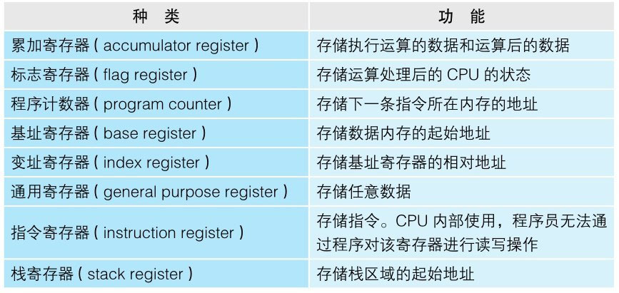

```
其中，程序计数器、累加寄存器、标志寄存器、指令寄存器和栈寄存器都只有一个，其他的寄存器一般有多个。程序计数器和标志寄存器比较特殊，这一点在后面的章节中会详细说明。另外，存储指令的指令寄存器等寄存器，由于不需要程序员做多关注
```

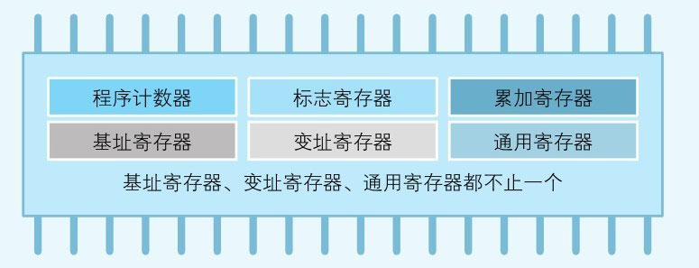

```
函数调用处理也是通过把程序计数器的值设定成函数的存储地址来实现的。


CPU则会把基址寄存器+变址寄存器的值解释为实际查看的内存地址。变址寄存器的值就相当于高级编程语言程序中数组的索引功能。


表1-2按照功能对CPU能执行的机器语言指令进行了大体分类。这里没有列出指令的具体名称（汇编语言的助记符）。看完表后你会惊奇地发现，原来 CPU可以进行的处理非常少。虽然高级编程语言编写的程序看起来非常复杂，但CPU实际处理的事情就是这么简单
```

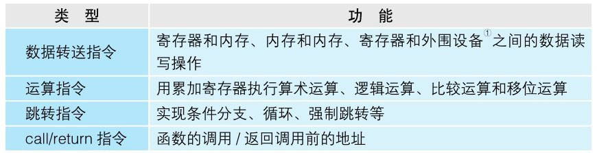


```
外围设备指的是连接到计算机的键盘、鼠标、显示器、设备装置、打印机等

因为8位=1字节，所以32位就是32÷ 8=4字节。

章在介绍标志寄存器时，提到过“位”这个专业术语。1位代表二进制数的一个字节位，这一点对了解计算机的运算机制非常重要。在下一章中，我们将以位为基础，向大家介绍一下二进制数和浮点数这些数据形式，以及逻辑运算和位操作等相关知识。

想必大家都知道计算机内部是由IC这种电子部件构成的。第1章介绍的CPU（微处理器）和内存也是IC的一种。IC有几种不同的形状，有的像一条黑色蜈蚣，在其两侧有数个乃至数百个引脚；有的则像插花用的针盘，引脚在IC内部并排排列着。IC的所有引脚，只有直流电压0V或5V两个状态。也就是说，IC的一个引脚，只能表示两个状态。


8位二进制数被称为一个字节。字节是最基本的信息计量单位。位是最小单位，字节是基本单位。内存和磁盘都使用字节单位来存储和读写数据，使用位单位则无法读写数据。因此，字节是信息的基本单位。

首先我们来介绍移位运算。移位运算指的是将二进制数值的各数位进行左右移位（shift=移位）的运算。移位有左移（向高位方向）和右移（向低位方向）两种。

计算机在做减法运算时，实际上内部是在做加法运算。用加法运算来实现减法运算，是不是很新奇呢？为此，在表示负数时就需要使用“二进制的补数”。补数就是用正数来表示负数，很不可思议吧


数组：圆形缓冲区的一个有用特性是：当一个数据元素被用掉后，其余数据元素不需要移动其存储位置。相反，一个非圆形缓冲区（例如一个普通的队列）在用掉一个数据元素后，其余数据元素需要向前搬移。换句话说，圆形缓冲区适合实现先进先出缓冲区，而非圆形缓冲区适合后进先出缓冲区。
原理是使用读写指针记录下一个要读写的地址


计算机中主要的存储部件是内存和磁盘。磁盘中存储的程序，必须要加载到内存后才能运行。在磁盘中保存的原始程序是无法直接运行的。这是因为，负责解析和运行程序内容的CPU，需要通过内部程序计数器来指定内存地址，然后才能读出程序。即使CPU可以直接读出并运行磁盘中保存的程序，由于磁盘读取速度慢，程序的运行速度还是会降低。总之，存储在磁盘中的程序需要读入到内存后才能运行。在考虑内存和磁盘的关系之前，大家一定要了解这个前提（图5-1）。
```

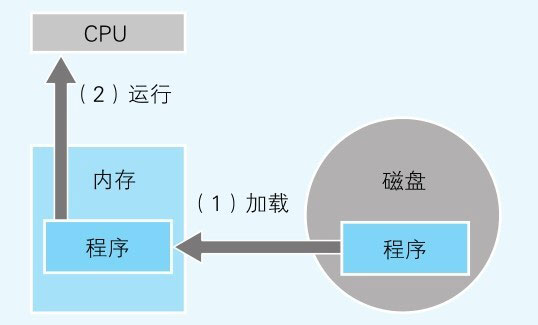


```
虚拟内存把磁盘作为部分内存来使用

接下来就让我们来看一下体现内存和磁盘亲密关系的第二个示例，即虚拟内存（virtual memory）。虚拟内存是指把磁盘的一部分作为假想的内存来使用。这与磁盘缓存是假想的磁盘（实际上是内存）相对，虚拟内存是假想的内存（实际上是磁盘）。


监控程序的主要功能是什么？
程序的加载和运行，监控程序也可以说是操作系统的原型。

在计算机中尚不存在操作系统的年代，完全没有任何程序，因此程序员就需要编写出处理相关的所有程序。用机器语言编写程序，然后再使用开关将程序输入，这一过程非常麻烦。于是，有人开发出了仅具有加载和运行功能的监控程序，这就是操作系统的原型。通过事先启动监控程序，程序员就可以根据需要将各种程序加载到内存中运行。虽然依旧比较麻烦，但比起在没有任何程序的状态下进行开发，工作量得到了很大的缓解（图9-1）。
```


```
图9-1 监控程序可以说是操作系统的原型

随着时代的发展，人们在利用监控程序编写程序的过程中，发现很多程序都有共通的部分。例如，通过键盘输入文字数据、往显示器输出文字数据等。这些处理，在任何程序下都是一样的。而如果每编写一个新的程序都要记述相同的处理的话，那真的是太浪费时间了。因此，基本的输入输出部分的程序就被追加到了监控程序中。初期的操作系统就这样诞生了（图9-2）。
```

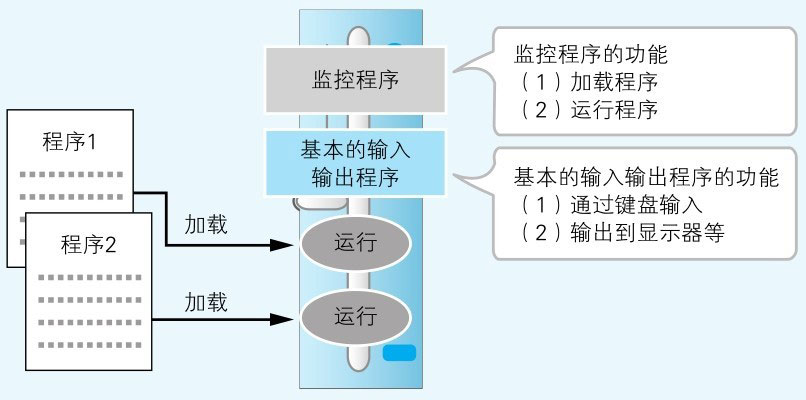

```
图9-2 初期的操作系统=监控程序+基本的输入输出程序

之后，随着时代的进一步发展，开始有更多的功能被追加到监控程序中，比如，为了方便程序员的硬件控制程序、编程语言处理器（汇编、编译、解析）以及各种实用程序等，结果就形成了和现在相差不大的操作系统。因此，操作系统本身并不是单独的程序，而是多个程序的集合体（图9-3）。
```

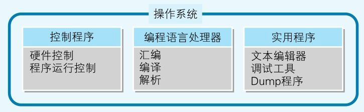

```
这里，我希望制作应用的程序员们意识到一点，那就是你们制作的不是硬件，而是利用操作系统功能的应用。虽然对程序员来说，掌握硬件的基本知识是必需的，不过，在操作系统诞生以后，就没有必要再编写直接控制硬件的程序了。这样一来，制作应用的程序员就逐渐同硬件隔离开来了。也就是说，程序员是很少关注现实世界（硬件）的。

操作系统的硬件控制功能，通常是通过一些小的函数集合体的形式来提供的。这些函数及调用函数的行为统称为系统调用（system call），也就是应用对操作系统（system）的功能进行调用（call）的意思。在前面的程序中用到了time()及printf()等函数，这些函数内部也都使用了系统调用。这里之所以用“内部”这个词，是因为在Windows操作系统中，提供返回当前日期和时刻，以及在显示器中显示字符串等功能的系统调用的函数名，并不是time()和printf()。系统调用是在time()和printf()函数的内部执行的。大家可能会认为这个方法有些绕，不过这是有原因的。


C语言等高级编程语言并不依存于特定的操作系统。这是因为人们希望不管是Windows还是Linux，都能使用几乎相同的源代码。因此，高级编程语言的机制就是，使用独自的函数名，然后再在编译时将其转换成相应操作系统的系统调用（也有可能是多个系统调用的组合）。也就是说，用高级编程语言编写的应用在编译后，就转换成了利用系统调用的本地代码（图9-6）。
```

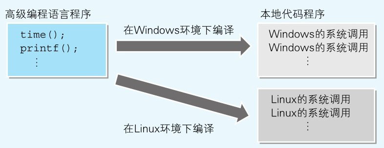

```
图9-6 高级编程语言的函数调用在编译后变成了系统调用


dll 是动态连接库，里面包含的的是库函数的实现。
有动态就有静态，静态链接库是程序用到这段代码，就会把库的这段代码复制到程序里，而动态链接库就是说当我调用这函数时，这函数的实现不在程序里，而在库里头，系统从c:\widnows\system32里找到对应库调用对应的函数。
不管什么语言，他们都可以写dll，因为在编写动态链接库时，你要声明里有什么函数，还要实现它；不管什么语言，本质就是调用相同的系统API函数创建出来的dll文件。
因此只要windows支持的语言都能用于创建dll。
VB，delphi，C++,C#等都是可以的，鉴于为什么多数是C++，是因为做库和底层的东西多数用C/C++来做，比较高效，其实用delphi也可以的，只是delphi过时了，现在人不怎么用，所以代码不好找。
本质：基本所有语言都能调用系统API函数创建动态链接库(dll).


任务指的是同时运行多个程序的功能。Windows是通过时钟分割技术来实现多任务功能的。
时钟分割指的是在短时间间隔内，多个程序切换运行的方式。在用户看来，就是多个程序在同时运行。也就是说，Windows会自动切换多个程序的运行（图9-9）。此外，Windows中还具有以程序中的函数为单位来进行时钟分割的多线程功能。
```

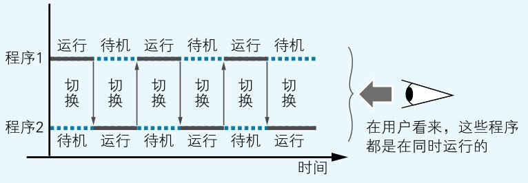


```
图9-9 通过时钟分割实现多任务的机制

（6）提供网络功能及数据库功能
Windows中，网络功能是作为标准功能提供的。数据库（数据库服务器）功能有时也会在之后进行追加。网络功能和数据库功能，虽并不是操作系统本身不可欠缺的功能，但因为它们和操作系统很接近，所以被统称为中间件而不是应用。意思是处于操作系统和应用的中间（middle）。操作系统和中间件合在一起，也称为系统软件。应用不仅可以利用操作系统，也可以利用中间件的功能（图9-10）。

图9-10 应用可以利用操作系统和中间件的功能


（7）通过即插即用实现设备驱动的自动设定
即插即用（Plug-and-Play）指的是新的设备连接（Plug）后立刻就可以使用（Play）的机制。新的设备连接到计算机后，系统就会自动安装和设定用来控制该设备的设备驱动程序。
设备驱动是操作系统的一部分，提供了同硬件进行基本的输入输出的功能。键盘、鼠标、显示器、磁盘装置等，这些计算机中必备的硬件的设备驱动，一般都是随操作系统一起安装的。如果之后再追加新的网卡（NIC）等硬件的话，就需要向操作系统追加该硬件专用的设备驱动。大家购买的新的硬件设备中，通常都会附带着软盘或CD-ROM，里面通常都收录着该硬件的设备驱动。
有时DLL文件也会同设备驱动文件一起安装。这些DLL文件中存储着用来利用该新追加硬件的API（函数集）。通过API，可以制作出运用该新硬件的应用。
可以任意追加设备驱动和API的机制使Windows操作系统变得非常灵活。这里所说的灵活，是指可以事后再对新追加的硬件进行处理。

 最常用的mov指令
指令中最常使用的是对寄存器和内存进行数据存储的mov指令。mov指令的两个操作数，分别用来指定数据的存储地和读出源。操作数中可以指定寄存器、常数、标签（附加在地址前），以及用方括号（[]）围起来的这些内容。如果指定了没有用方括号围起来的内容，就表示对该值进行处理；如果指定了用方括号围起来的内容，方括号中的值则会被解释为内存地址，然后就会对该内存地址对应的值进行读写操作。接下来就让我们来看一下代码清单10-2中用到的mov指令部分。
​​​​​​​​​​mov ebp, esp
​​​​​​​​mov eax, dword ptr [ebp+8]​​
mov ebp, esp中，esp寄存器中的值被直接存储在了ebp寄存器中。esp寄存器的值是100时ebp寄存器的值也是100。而在mov eax, dword ptr [ebp+8]的情况下，ebp寄存器的值加8后得到的值会被解释为内存地址。如果ebp寄存器的值是100的话，那么eax寄存器中存储的就是100 + 8=108地址的数据。dword ptr（double word pointer）表示的是从指定内存地址读出4字节的数据。像这样，有时也会在汇编语言的操作数前附带dword ptr这样的修饰语。


为什么局部变量只能在定义该变量的函数内进行引用呢？这是因为，局部变量是临时保存在寄存器和栈中的。正如本章前半部分讲的那样，函数内部利用的栈，在函数处理完毕后会恢复到初始状态，因此局部变量的值也就被销毁了，而寄存器也可能会被用于其他目的。因此，局部变量只是在函数处理运行期间临时存储在寄存器和栈上。
在代码清单10-6中定义了10个局部变量。这是为了表示存储局部变量的不仅仅是栈，还有寄存器。为确保c1～c10所需的领域，寄存器空闲时就使用寄存器，寄存器空间不足的话就使用栈。

下面让我们来看一下代码清单10-7中_TEXT段定义的内容。（7）表示的是MyFunc函数的范围。在MyFunc函数中定义的局部变量所需要的内存领域，会被尽可能地分配在寄存器中。大家可能会认为用高性能的寄存器来代替普通的内存是很奢侈的事情，不过编译器不会这么认为，只要寄存器有空间，编译器就会使用它。因为与内存相比，使用寄存器时访问速度会高很多，这样就可以更快速地进行处理。局部变量利用寄存器，是Borland C++编译器最优化的运行结果。旧的编译器没有类似的最优化功能，局部变量就可能会仅仅使用栈。


支撑硬件输入输出的IN指令和OUT指令

Window控制硬件时借助的是输入输出指令。其中具有代表性的两个输入输出指令就是IN和OUT。这些指令也是汇编语言的助记符。

IN指令和OUT指令的语法如图11-2所示。这是Pentium等x86系列CPU用的IN指令和OUT指令的语法。IN指令通过指定端口号的端口输入数据，并将其存储在CPU内部的寄存器中。OUT指令则是把CPU寄存器中存储的数据，输出到指定端口号的端口。
```

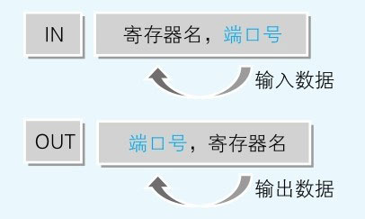

```
图11-2 IN指令和OUT指令的语法

下面让我们来看一下端口号和端口到底是什么。计算机主机中，附带了用来连接显示器及键盘等外围设备的连接器。而各连接器的内部，都连接有用来交换计算机主机同外围设备之间电流特性的IC。这些IC，统称为I/O 控制器。由于电压不同，数字信号及模拟信号的电流特性也不同，计算机主机和外围设备是无法直接连接的。为了解决这个问题，I/O控制器就很有必要了。

I/O是Input/Output的缩写。显示器、键盘等外围设备都有各自专用的I/O控制器。I/O控制器中有用于临时保存输入输出数据的内存。这个内存就是端口。端口（port）的字面意思是“港口”。由于端口就像是在计算机主机和外围设备之间进行货物（数据）装卸的港口，所以因此得名。I/O控制器内部的内存，也称为寄存器。虽然都是寄存器，但它和CPU内部的寄存器在功能上是不同的。CPU内部的寄存器是用来进行数据运算处理的，而I/O寄存器则主要是用来临时存储数据的。

在实现I/O控制器功能的IC中，会有多个端口。由于计算机中连接着很多外围设备，所以就会有多个I/O控制器，当然也会有多个端口。一个I/O控制器既可以控制一个外围设备，也可以控制多个外围设备。各端口之间通过端口号进行区分。端口号也称为I/O地址。IN指令和OUT指令在端口号指定的端口和CPU之间进行数据的输入输出。这和通过内存地址来进行主内存的读写是一样的道理（图11-3）。
```

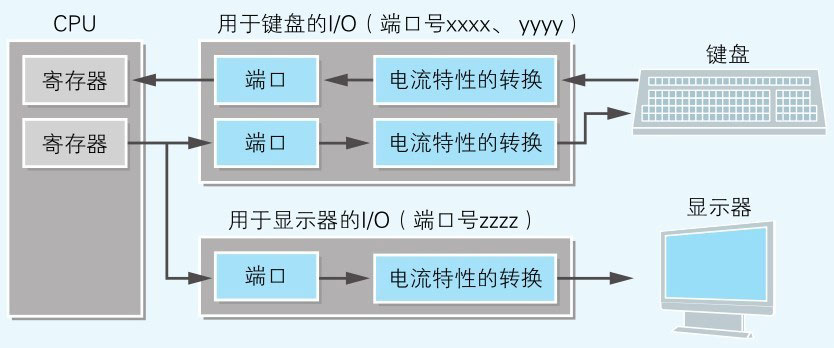

```
图11-3 以端口为桥梁来实现CPU和外围设备之间的数据传递[插图]


实施中断请求的是连接外围设备的I/O控制器，负责实施中断处理程序的是CPU。为了进行区分，外围设备的中断请求会使用不同于I/O端口的其他编号，该编号称为中断编号。在控制面板中查看软盘驱动器的属性时，IRQ处显示的数值06，表示的就是用06号来识别软盘驱动器发出的中断请求。另一方面，操作系统及BIOS则会提供响应中断编号的中断处理程序。
```


```
假如同时有多个外围设备进行中断请求的话，CPU也会为难。为此，我们可以在I/O控制器和CPU中间加入名为中断控制器的IC来进行缓冲。中断控制器会把从多个外围设备发出的中断请求有序地传递给CPU。大家对中断控制器的认识可能比较薄弱，不过只需了解该设备的存在和角色就可以了（图11-7）
```

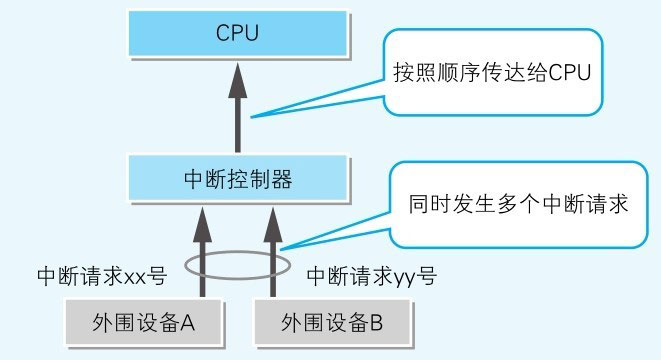

```
DMA可以实现短时间内传送大量数据
在了解I/O输入输出及中断处理的同时，还希望大家记住另外一个机制，这就是DMA（Direct Memory Access）。DMA是指在不通过CPU的情况下，外围设备直接和主内存进行数据传送。磁盘等都用到了这个DMA机制。通过利用DMA，大量数据就可以在短时间内转送到主内存。之所以这么快速，是因为CPU作为中介的时间被节省了（图11-9）
```

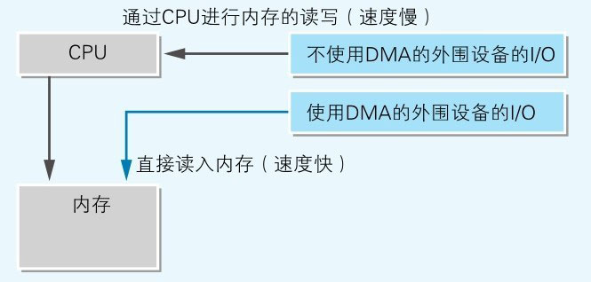

```

 文字及图片的显示机制
在本章的最后，让我们一起来看一下显示器显示文字及图形的机制。如果用一句话来简单地概括该机制，那就是显示器中显示的信息一直存储在某内存中。该内存称为VRAM（Video RAM）。在程序中，只要往VRAM中写入数据，该数据就会在显示器中显示出来。实现该功能的程序，是由操作系统或BIOS提供，并借助中断来进行处理的。

在MS-DOS时代，对大部分计算机来说，VRAM都是主内存的一部分。例如PC-9801这种机型的计算机，主内存地址A0000地址以后是VRAM区域。如果用程序往VRAM内存地址中写入数据，文字及图形就可以显示出来。不过，文字和图形的颜色最多只能有16种。这是因为VRAM的内存空间太小了（图11-11(a)）
```

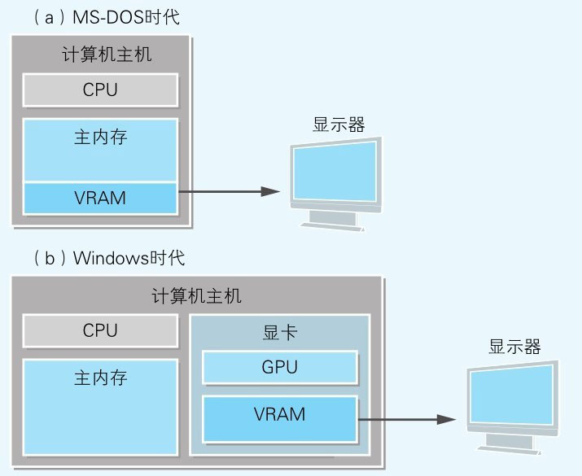

```
在现在的计算机中，显卡等专用硬件中一般都配置有与主内存相独立的VRAM和GPU（Graphics Processing Unit，图形处理器，也称为图形芯片）。这是因为，对经常需要描绘图形的Windows来说，数百兆的VRAM是必需的。而为了提升图形的描绘速度，有时还需要专用的图形处理器（图11-11(b)）。但不管怎样，内存VRAM中存储的数据就是显示器上显示的信息，这一机制是不变的。

用软件来控制硬件听起来好像很难，但实际上只是利用输入输出指令同外围设备进行输入输出的处理而已。中断处理是根据需要来使用的选项功能，DMA则直接交给对应的外围设备即可。由此可见，对程序员来说，其实并不困难
```


<br/><br/><br/>

> <h2 id="上瘾的㊙️密：迁移默化的营销方式如何重塑我们的大脑🧠">上瘾的㊙️密：迁移默化的营销方式如何重塑我们的大脑🧠</h2>

```


记忆不是静态的，也不是固定的。相反，记忆会随着时间流逝而演变，这是因为大脑的易错性、普遍实用主义和对一致性的追求。就准确性而言，记忆远远不是视频回放。充其量是一张被大脑无意识地不断PS的照片。大脑会创造性地构建过去以规划未来，在这个过程中有时会牺牲准确性。

我们可能永远不会拥有和鲍勃·彼得雷拉一样的记性，其深度和准确性都令人难以置信。但我们可以做些更有价值的事情：对记忆的易错性、相应的营销策略保持敏锐，警惕自己掉入营销的混合陷阱。

就像你想象的那样，大脑处于自动模式状态下，很少会深思熟虑，很容易受到影响。除非发生需要我们主动控制局面的重大事件，否则我们很乐意顺其自然。
大脑遵循最省力法则，偏爱自动模式，所以这就解释了人类的大量行为。想想自己如何使用搜索引擎。使用谷歌搜索时，多久才会翻到第二页或第三页？很可能只停留在第一页。大多数人宁愿尝试新的搜索关键词，也不会主动点击到第二页或第三页。即使是在第一页上的十个搜索结果，你在单击前会花多长时间阅读每一个结果？很可能点了第一个不错的搜索结果，然后点击第二个、第三个。使用谷歌时的表现也反映了人们浏览的方式，即追求速度，而不是准确性。大脑在形成记忆时，会优先考虑一致性而非准确性，在做出决策时也同样如此。难怪我们总是如此容易出错。

要想使用谷歌准确搜索，就意味着在点击之前必须分析每个页面上的每个搜索结果。从理论上讲，这样你才最有可能找到正在寻找的东西，但这样做需要大脑切换到手动模式。大脑宁愿快速扫描试错，也不愿仔细阅读找出答案。后退按钮进一步帮助大脑犯懒，因为后退可以有效地消除错误的猜测，再次尝试。快速试错几乎没什么后果。

网飞调查发现，超过60%的成年人在2013年有刷过剧，大多数在网飞上刷完一部剧只需要四到六天。现在自动播放已经成为行业标准，亚马逊和HBO纷纷迅速效仿。
这样的默认选项功能强大，因为大脑会觉得安全可靠，自然而然地继续观看。自动播放功能还增加了参与度，因为默认了自动播放，要想停止观看必须主动退出，这就会迫使大脑退出自动模式，进入手动模式。众所周知，大脑会避免这种情况。

生活中，我们总是追求快乐最大化或痛苦最小化。适用于消费生活的公式很简单：快乐-痛苦=购买。


大脑只在追逐中产生快乐，那么我们渴望获得的快乐往往比实际拥有的快乐更多，所以渴望总是远远大于未来的实际享受。人类不会对此进行校准，所以很难预测什么会让我们获得真正的快乐。行为经济学家把预测未来感受的能力称为“情感性预测”，我们对此深感恐惧。

消费时，选择数量成倍增加，公司和消费者都倾向于简单、无缝的购物体验。公司要是能为消费者简化选择，会赚得盆满钵满。研究表明，成功让选择简单化的品牌（比如提供一种简单易用的方式查看所有产品的价格），它被正面评价、推荐的可能性高出115%。

对于未完成的事情念念不忘这种现象叫作蔡格尼克记忆效应(Zeigarnik effect)，由立陶宛的心理学家布鲁玛·蔡格尼克(Bluma Zeigarnik)发现。其含义是，一旦我们全神贯注地完成某件事，会讨厌被打扰。在某些情况下，如果我们无法完成自己的工作或无法获得所需的解决方案，我们的行为就会受到影响。未完成任务的不适感会干扰我们的注意力，直到我们找到解决方法。这种专注力会让自己倍感压力，记忆会在半途而废的地方更加深刻。
蔡格尼克记忆效应的一些早期实验与测试学生的记忆有关。要求学生记忆单词表时，如果中途被另一项任务打断，那么比起本来能够“完成”的任务记忆，他们对单词的印象更加深刻。此外，无论一开始任务有多无聊，被打断的学生都表达出强烈的愿望，希望尽快完成这项任务。
人类天生喜欢有始有终，如果中途被打断会感到不舒服，这导致了对未完成事物想尽快满足的需求。注意力经济下的平台热衷于创造未满足的需求，从而为我们提供动力，继续寻找不会到来的终点。于是，你在永无止境的搜索上耗费的时间越久，为平台创造的收入就越多。

证明，人类完全不了解产生偏好的根本原因。有时候，我们喜欢的东西看似毫不相干。但是，扎荣茨却发现人类对熟悉的事物表现出惊人的偏好。这种偏好在塑造我们享乐、有所追求以及消费时影响深远，而且常常被低估。如果一家公司设法提高你对其产品或服务的熟悉度，则可能会对你的喜爱程度产生巨大的积极影响。

培养熟悉度最简单的方法就是让人们接触事物的时间越长越好。扎荣茨将这种现象称为曝光效应：在所有其他条件相同的情况下，对事物越熟悉，就会越喜欢它。

适用于整个动物界的事实意味着该效应可能是基于进化论。多次接触某事物，尤其没有产生明显的影响时，意味着该事物显然没有坏处。从生存的角度来说，没有坏处无疑是件好事。
市场营销最古老的原则是“7合法”，意味着消费者在购买产品之前起码得看过七遍广告。该理论起源于20世纪30年代左右的电影行业，当时营销团队认为吸引人们观看一部新电影至少需要播放七遍广告。实际上，没有对数字7进行任何研究。现在，根据用户跟踪和数据分析，我们可以彻底揭穿7的面纱。一个人是否决定去看电影或购买产品取决于个人、产品、所看广告类型，还有可能经朋友推荐等。不过，7的神话确实触及了广告的基本原理：多多益善。因此，我们不断看到可口可乐、苹果及耐克等知名品牌的广告。你喝了一瓶可口可乐，知道了它的味道，其他人也是如此。但是，可口可乐仍要不断支付广告费。也许在哪里还有没听说过可口可乐、没有建立联系的潜在消费者？所以可口可乐不断投入广告，即使品牌知名度已经打到外太空！为什么要继续不惜重金支付广告费？因为每多看到一次广告，消费者的印象都会有所改善。


交流不只是读、写和说，其方式远远不止语言。沟通能分享内心深处的状态、思想、情绪及立场。它为同理心奠定了基础，让大家可以感受周围他人的心理和情绪状态。简而言之，同理心是人类社交的基础。

故事，或普通物品注入的本质，让消费世界充满神奇，几乎让每一件物品都变得超凡脱俗。抛开消费主义不谈，一个精心设计的故事可以给普通物品带来的深度和意义，简直不可思议！


值得一提的是，尽管本书谈到了公司如何利用人类心理盲点为自己谋利，但营销人员确实可以真正为消费者增加产品价值。营销改变了我们对现实的感知，但这并不意味着我们对营销的反应虚假、浮于表面。用水晶玻璃杯喝葡萄酒确实味道更好，甚至大脑的感知水平亦是如此。因为作为人类，我们从来不是直接体验世界，我们所经历的一切都是大脑对现实建造的心智模型。事实上，我们根据葡萄酒是否稀有、昂贵所获得的愉悦感，可能和我们用舌头品尝到葡萄酒获得的愉悦感一样真实。
```


<br/><br/><br/>

> <h2 id="怪诞行为学系列">怪诞行为学系列</h2>

```

潘尼贝克的建议很有道理，但是我们多数人却正在反其道而行之。一天24小时，我们从电视、广播、互联网上获得新闻——很大一部分由一闪而过的现场采访音像片段组成，这些东西是用来煽情的，而不是供人思考的。新闻从业人员有一句行话：“要想上头条，轰动加血腥。”也就是说，头条新闻总是骇人听闻或者最具有轰动效应的。在我看来，很多新闻主持人都好像是从一个模子里倒出来的，表情庄重、发型不变。听上去，他们都受过标准训练，擅长播报这些信手拈来、能引发轰动的音像片段，每隔几分钟重复一次。他们大肆渲染人们如何艰苦挣扎，如何失去家园，如何付不起房贷和保险，故事催人泪下，把严峻的经济形势用这样一幅图景呈现在我们面前。

这些结果表明，一旦某人（或某个组织）给了我们好处，我们就会偏袒任何与其相关的事情，而且这种偏袒会根据得到的好处（在这个例子中，好处就是获得的报酬）的增加而增加。有趣的是，给人钱财竟然会对人们的艺术欣赏偏好产生影响，需要注意的是，这种给予（因参与研究而得到钱）与艺术一点儿关系都没有，这些艺术画作都是由画廊的工作人员制作的。另一个值得一提的有趣现象是：参与者知道，无论他们如何给这些画作排序，画廊都会给他们提供报酬，而且这份报酬（及其数额大小）在参与者心里建立起一种受恩惠的感觉，这个感觉会引导他们的偏好


最后，当我们在做重大决策，且听到的建议有偏差时（如医生建议我们在脸上刺青），我们应该花点时间和精力去问问另一个与这个决策没有利益关系的人的意见。
	评论: 这个和官员贪腐差不多吧,你想让它公开所有资产,做到清廉.可能并不容易或者可能杜绝贪腐,更有可能加重.这个和华尔街的那些金融算计师差不多吧,这种情况


越疲倦，越冲动
	极度疲劳和吃垃圾食品之间莫名的联系，不是你想象出来的。这解释了为什么很多人会因为压力而停止节食减肥，或者在危机过后又开始吸烟。

	自我耗竭的基本思想是抵制诱惑需要付出极大的努力和精力。现在，请把你的意志力想象成肌肉。在看到炸鸡或巧克力奶昔时，我们直觉性的回应就是“太棒了，我想吃”。克服这种欲望，需要我们付出精力。我们为了避免诱惑而做出的每个决定都需要付出一定的努力（就像是举起重物），一次次地付出努力后，我们的意志力最终会被耗竭殆尽（就像是一次次地举起重物）。这就意味着，在花了一天的时间对不同的诱惑说“不”后，我们抵制诱惑的能力就降低了，直到某个时刻，我们屈服了，吃了很多一口酥奶酪、奥利奥饼干、炸薯条或其他什么让我们流口水的食物。当然，这个想法令人不安。毕竟我们每天都需要做出决定，都要抵制一连串的诱惑。如果不断地自控会导致自控力下降，那我们常常屈服也就不足为奇了。自我耗竭还解释了为什么一到晚上我们就很难自控，这是因为一整天的努力工作使得我们感到疲惫，所以一到晚上，我们就更容易屈从于自己的欲望（吃夜宵就是抵抗了一整天的诱惑后最容易做的事）。

	我认为博士生（他们从某种意义上也可被看成囚犯）能对这种机制心领神会，因为他们在论文开题报告和答辩时常会给教授带些甜甜圈、松饼和曲奇饼干。这样的话，根据对“假释”的研究来看，博士生的“法官”更愿意批准他们的“学术假释申请”，并让他们开始自己独立的生活。


结果会怎样呢？在两个控制条件下，我们发现精力耗竭的人和非耗竭的人在解决数学问题时能力相当，这就意味着耗竭没有降低他们做数学题的基本能力。但在两个粉碎机条件下（这种条件下，他们可以作弊），情况就改变了。那些在短文中不能写“x”和“z”的人在粉碎矩阵任务的答题纸后，多多少少都会作弊，他们自称做对的矩阵问题往往比实际情况多1个。但经受了不能写“a”和 “n”的参与者，在粉碎机条件下的表现就更糟糕了。他们声称自己正确解决的矩阵数比其实际解决的多了3个。结果表明：任务的负荷越大，精力耗竭越多，参与者就越容易作弊。
这些发现表明了什么呢？总的来说，如果你的意志力下降了，控制欲望的难度就会增大，这种难度最终也会降低你的诚信水平。

最后，我应该指出：有时耗竭也是有利的。我们偶尔能感受到我们对自己太过苛刻，很多事都要有节制，绝不能意气用事。但也许有时我们不需要做个负责任的成年人，而需要放松一下。所以，有条建议送给你：下次如果你真的想搞清楚所有事情，尽情放纵自己的话，试着写一篇长长的、不含“a”和“n”的单词的自传来消耗自己的压力，然后去商场，尝试使用不同的商品，却什么都不买。此后，当精力耗竭让你忧虑时，为自己选择一个有诱惑力的行动目标，并让其自由推进，不加控制。但要记住，不要总是用这个方法。
如果你偶尔真的需要为自己屈从于诱惑寻找一个更有力的借口，就用丹·西尔弗曼的理性自我放纵理论吧。

我提的是普拉达包。而且我的感觉也不同了——我站得更直了，走起路来还有些趾高气扬。真不知道如果我穿的是法拉利内衣的话会发生什么。我会感觉精力更充沛吗，还是会感到更自信、更机敏，或动作更快呢？
        别人评论：作者这里的心态描写很有趣，也很真实，让我反思一个问题：到底是我们为奢侈品赋能，还是奢侈品为我们赋能？是我们牛逼了才买奢侈品，还是买了奢侈品才牛逼？结合现实情况，这个问题恐怕真不好做答。但如果换一个问题抽离成“是主因物贵，还是物因主贵”，这个答案就没有争议了。想想《西游记》，老君系裤子的绳子都是捆仙绳。——那么奢侈品本来的受众是谁呢？是真正能驾驭这些奢侈品的人上人，还是哪些对奢侈品趋之若鹜的粉丝？还真不好说。虽然我没有奢侈品公司后台的大数据，但真相可能就是：大多数的粉丝（即原本不属于奢侈品消费定位的人群）成为了品牌销售大头。那么这个看似违背事实的真相，又和哪些在直播间联动榜一大哥带动别人刷礼物的有什么区别呢？大哥刷多少返还，其他粉丝打赏分账。。。。真是细思极恐，人性，还真就那么点事。资本，了不起，也没啥了不起。人啊，关键是要想得开。
        最后关联一下郭德纲的财奴，财迷，财主段子，不管有钱没钱，应该做钱的主人，而不是为财物所累（尤其是哪些不存在挣扎在温饱线的）。现在物质生活好了，吃不起饭的真不多，但“哭穷”的确遍地都是。仔细想想，大致我们只是输给了欲望而已。


在回想拎普拉达手提包的经历时，我还在思考：除外部信号外，是不是还有什么其他心理因素与冒牌服饰相关。我在唐人街上提着普拉达包闲逛时，看到有女士提着冒牌的普拉达包从商店里走出来。尽管我手里的包不是我选的，也没有花钱，但我感觉我和这个包之间的关系与那些女士和她们手里的包的关系很不一样。
我开始从更广泛的视角来思考服饰和行为间的关系，这个想法使我想到社会学的一个概念：自我信号。自我信号的一个基本概念是，不管如何思考，我们对自我的认识都不是很清楚。我们普遍认为自己对自己的爱好和性格更清楚，但事实上，我们对自己的认识并不准（肯定没有我们想的那么好）。相反的，我们看待自己的方式与我们看待并评判别人行为的方式是一样的，即从行为中认清自己并推断出自己的爱好。
        例如，假设你看到街上有个乞丐。你既不想忽略他也不想给他钱，只想给他买个三明治。这种行为本身不能定义你这个人，你的道德或性格，但你把这种行为看作展示自己同情心和善心的证明。现在，有了对自己的这点“新”认识，你更相信自己的善心了。这是自我信号在起作用。
这条原则同样适用于时尚服饰界。即使没有人能认出这是正品，提着正品普拉达包也能让我们的思考和行为方式与提着冒牌包时有所不同。这引出了一个问题：穿戴冒牌服饰是否会使我们觉得有些不合理或不合法呢？穿戴冒牌货是否会以一种意想不到的或负面的方式影响到我们？

你应该还记得正品条件下，有30%的女士谎报了她们答对的题数；冒牌条件下概率是73%；而在不知情的情况下，结果又如何呢？在最后一种情况下，有42%的女士作弊了。在不知情的条件下，作弊的人数介于前两种情况之间，但更接近于戴正品眼镜的情况（事实上，不知情条件和戴正品的条件下作弊人数没有太大不同）。这些结果表明，穿戴正品服饰不会提升我们的诚实度（或者至少不会提高很多），但如果我们故意穿戴一件冒牌的服饰，道德上的束缚就会放松，我们也会变得更不诚实。
那道德何在呢？如果你的朋友或你的约会对象穿戴着冒牌服饰，你就要当心了，因为他们可能会比你想象中的更不诚实。


这些实验表明的第一件事是，作弊的程度会随着实验的进行而加大。按照直觉我们看到，对于很多人来说，实验中有个急剧的转折点，过了这个转折点，参与者就会从轻微作弊转变成习惯性作弊。我们可以从“管他呢”效应中推出这种行为的一般模式，这一模式在穿戴正品和冒牌货的情况下同样存在。但是，戴冒牌眼镜的人更容易摒弃其道德束缚，更爱去骗人。
依据“管他呢”效应，我们发现，谈到作弊，我们的行为就和节食时的做法差不多。我们一旦开始违背自己的原则（如节食时作弊，或受到金钱的诱惑），就更不可能控制自己的行为，而且此时我们更容易屈从于诱惑，表现得更不端。


这些实验表明的第一件事是，作弊的程度会随着实验的进行而加大。按照直觉我们看到，对于很多人来说，实验中有个急剧的转折点，过了这个转折点，参与者就会从轻微作弊转变成习惯性作弊。我们可以从“管他呢”效应中推出这种行为的一般模式，这一模式在穿戴正品和冒牌货的情况下同样存在。但是，戴冒牌眼镜的人更容易摒弃其道德束缚，更爱去骗人。
       依据“管他呢”效应，我们发现，谈到作弊，我们的行为就和节食时的做法差不多。我们一旦开始违背自己的原则（如节食时作弊，或受到金钱的诱惑），就更不可能控制自己的行为，而且此时我们更容易屈从于诱惑，表现得更不端。
       如此看来，人（或女性）的确要靠衣装，而且穿戴冒牌货也确实对决策的道德性有影响。很多社会科学研究结果也表明运用这种信息的方法很多，既有积极的也有消极的。消极的方面是，人们能想象到各种机构是如何运用这条原则来使雇员的道德感松懈，以便他们能够轻松地“以欺骗手段欺骗”他们的顾客、供应商、监管者和对手，而且，这样做还能通过牺牲其他各方的利益提升公司的赢利。积极的方面是，了解灾难是如何形成的，能引导我们在违反原则前提升注意力，并帮助我们做到亡羊补牢。

在穿戴冒牌服饰的条件下，参与者在思考（问卷A）自己认识的人的行为时评估结果如下：其认识的人发生不诚实行为的程度比穿戴正品情况下的参与者评判的程度更高。参与者还估测到，（问卷B）大家常说的借口很可能是谎话；（而问卷C）在两种情况下，当事人那样做的可能性都不大。最后，我们得出结论：冒牌商品不仅使我们变得更不诚实，还会让我们更加低估他人的诚实度。


我们将自身行为合理化的能力非常强，如何防止这种合理化的过程已成为日常必做的事。我们用各种方法否认自己违背原则的能力非常强，尤其是在我们的行为差点儿就对别人造成直接伤害的时候。

巴勃罗·毕加索曾说：“好的艺术家模仿，伟大的艺术家剽窃。”纵观历史，不乏剽窃者。威廉·莎士比亚从古希腊、古罗马和意大利的历史事件中寻找小说的素材，之后将它们写进精彩的戏剧中。

一些动因可以使团队轻易地将一起合作转变为一起欺骗，在这种情况下，个人作弊的概率可能会升高，因为他们认识到他们的行为能使其喜欢和关心的人受益。

谈论了团队合作的一个不利面（即当别人甚至是陌生人能从我们的欺骗行为中受益时，我们往往会变得更不诚实）后，我们想将实验的视角转向合作的有利面，看看当团队成员相互监视时会发生什么。

当然，我们的生活离不开别人的帮助，合作是我们生活中很重要的一部分。但显然，合作是一把双刃剑。一方面，它能增加工作的乐趣，让成员更忠诚，更具动力；另一方面，它会增加产生欺骗的可能。可悲的是，也许那些对同事最为关心的人就是最有可能去做出欺骗行为的人。当然，我不是说我们要取消团队工作、停止合作，或不再相互关心。


因为我是在以色列长大的，所以特别想知道以色列人的欺骗程度如何（我承认，我曾认为以色列人会比美国人的欺骗程度高）。但结果表明，以色列的参与者在矩阵实验中的欺骗程度与美国人是相同的。我们又决定在别的国家试试。我有一位同事名叫王雪丽，是位中国人，她确信中国人比美国人的欺骗程度要高。但这一次，我们测得中国人的欺骗程度与美国人并无不同。弗朗西斯卡·吉诺来自意大利，她也非常肯定意大利人的欺骗程度会更高，她用迷人的嗓音说道：“去意大利吧，那里的人会告诉你什么叫作真正的欺骗。”但是，她也错了。在土耳其、加拿大和英国的情况同样如此。事实上，每个国家的欺骗程度似乎都相等，至少我们测试过的国家全都如此。

更加应该补充的一点是，我应该指出在我所有的跨文化实验中，有一次我们发现了不同点。雷切利·巴肯和我在位于华盛顿特区的一家酒吧里做了一次实验，许多美国国会的工作人员都爱在这家酒吧喝酒。我们又在纽约市的一家酒吧进行了同样的实验，而华尔街的银行家们则是这家酒吧的常客。酒吧就是我们发现文化差异的地方。你认为谁的欺骗程度更高，是政治家还是银行家？我敢肯定是政治家，但实验的结果却恰恰相反，银行家欺骗的程度是政治家的两倍。（但在开始怀疑你的银行朋友，相信你的政治朋友之前，你应该考虑到我们测试的政治家都是年轻的政治家，大多是美国国会的工作人员。所以，他们的成长与发展的空间还很大。）


你错了，这是一本经济学的书，讨论的自然不会是非经济学问题。这本书要告诉你，盯着你的钱包，偷你钱的不是小偷、骗子或强盗，而是你自己。你不理智地花钱就是在偷自己的钱，看住你的钱包就是学会理智地花钱。

每一分钱的价值都是完全相等的，而且可以互换。每花掉一分钱的机会成本就是放弃这一分钱的其他用途。这个道理简单而平凡，任何人都不会否认，但在实际花钱时往往就会忘了这一点。这就会造成有时惜钱如命，有时却大手大脚。想想自己每一次花钱时的情况，谁没犯过这类错误？作者用许多例子证明了，几乎每个人都逃不出这个“魔咒”。


而做一件事情的机会成本，就是如果不把钱（资源）投入这件事，而是其他的事中，所能获得的最高回报或者价值，这是真正的损失，也是成本唯一正确的含义。一件商品究竟值不值得买，花多少钱才是合适的，不是看花费在这件商品上的钱有多少，而是看，这笔钱如果买其他商品所能获得的最高的效用或者价值。所有的误区，都是因为背离了这个最高原则，按照作者的话就是，我们本来应该比较的是此物和彼物，或者金钱的机会成本，但实际上，我们比较的是花出去的钱和购买的这个物品。正是因为把注意力集中于金钱和物品的对比，才会有上述价值误判。

如果我们在消费一样东西前就为它埋单，那么在实际消费过程中基本就不会让人感到痛苦。到时候，就不存在付款之痛，也不必担心之后需要为它埋单。这是一种没有痛苦的交易（除非是购买某样会引起生理痛苦的东西，像是攀岩、拳击课程，或是施虐——但这是一本家庭用书，所以不讲这些）。


免费是一种另类的定价，没错，它的确是一种价格。如果一样东西是免费的，我们往往就会忽略对其成本效益的分析。也就是说，我们在免费和收费的东西里，选择了免费的那个，但这不一定总是最好的选择。


这是怎么回事？谁才是最值得我们信赖的顾问？在心生疑惑、犹豫不定的时候，我们应该找谁寻求意见？是父母、牧师、老师，还是政治家？事实证明，我们最信任的人，永远是我们自己。这可能并不是什么好事。不管你有没有意识到，尽管我们并不像其他人那么经验丰富又头脑聪明，也根本没有自己以为的那么经验丰富又头脑聪明，但我们在评估某样事物的价值时，总是习惯性地依靠自己的判断。当这种盲目自信影响到我们对事物的第一印象时，它就变得尤为显著，也格外危险，而在这个时候，我们也就更容易落入锚定效应。

当我们被一些与决策无关的东西影响，而给出自己的结论时，锚定效应便由此而生。我们在这时候让毫不相干的信息破坏了自己的决策过程。如果我们觉得，数值不会经常影响我们的决策，那么锚定效应可能还不至于让人过分担忧。但紧随其后也最危险的部分在于，从我们看到那些数值开始，这个最初的、毫不相干的起点，可能就会成为日后决策的基础。


从众与从我
	让我们来思考一下从众与从我。从众心理说的是，我们会随大流、基于旁人的行为来断定一件事的好坏。如果其他人喜欢一样东西，或投以欣赏的目光，或恳求一睹，或他人做了什么、买了什么，我们也会很心仪。如果其他人对某种东西痴迷，我们也会为之倾倒。从本质上来说，从众心理也是Yelp（美国最大点评网站）这类网站背后的心理学基础。这也是我们会对那些外面排着长队的餐馆和俱乐部趋之若鹜的原因。那些宽敞的室内场所难道真的容不下等候的年轻人？不，店主就想要人们等在外面，那是一种时尚且极具吸引力的放牧信号，指引着那些想要把钱花在手工调制伏特加和人声鼎沸的场所的人。

我们会高估自己的东西，仅仅是因为我们拥有它而已——这一理念率先由哈佛大学心理学家艾伦·兰格提出，之后理查德·泰勒又对其进行了补充与延伸。禀赋效应的基本自负点在于，一样东西的当下所有者会高估它的价值，也因此，他就想要以一个比未来的所有者愿意支付的更高的价格卖出它。说到底，一样东西的潜在买家并不是它当下的所有者，因此也就不会受到“爱你所拥有”这一禀赋效应的影响。在通常情况下，在禀赋效应的实验中，我们会发现，销售价格往往是购买价格的两倍。

精力给我们以拥有感，让我们觉得自己创造了某些东西。不管是什么东西，只要我们在它身上花费了精力，便能进一步感受到自己参与创造它的爱。这部分不需要很大，甚至不一定真实，只要我们坚信，自己与创造过程有关，我们对它的爱便会有所增长，于是，我们也就更愿意为它付钱。对于一样东西——房子、车子、被子、开放空间规划、关于金钱的书，投入的工作越多，我们就会越重视它，也就越觉得自己切实拥有了它。
        不仅如此，事实还证明，某样东西的创造过程越艰难，我们的参与感也就越强，对这样东西的爱也就越多。
         麦克·诺顿、丹尼尔·莫孔以及丹将这种现象称为宜家效应——这一名称源于丸子餐厅/喧嚣工厂/儿童乐园兼家具卖场。

损失厌恶和禀赋效应共同存在。我们不愿放弃自己所拥有的那部分，是因为我们高估了它的价值，而这种高估有一部分原因正来自我们不想放弃它这一念头。
       因为损失厌恶的存在，我们会将可能的损失看得比潜在的收益更重。从冷血的经济角度看来，这是毫无意义的——我们应该平等地看待得与失，这两者不过是互相对立的金融概念而已。我们应该用预期的实用性来指导决策，我们应该化身为冷血的巨型超级计算机。但是，幸运的是，我们并不是将预期实用性最大化的机器，我们也不是冷血的超级计算机。我们是人类（当然，这可能就是我们最终会被冷血的超级计算机奴役的原因）。

沉末成本
        现在，再来想象另一种差不多的情况，与之前不同的是，这一次，我们还没投入一分钱，而且预期的研发成本只有1000万美元。正当我们准备去真正开展这个项目时，我们听闻，竞争对手已经设计出一款更优秀的车。我们现在还会投入1000万美元吗？决策的重点（是否要投资1000万美元），在这两个事例中是完全相同的。但是，在第一个事例中，很难不去回头看我们已经花费出去的那9000万美元。于是，在第一种情况下，大多数人都会选择继续投资。而在第二个事例中，他们不会开始真正投入资金。理性的人对于这两种情况，应该会做出同样的决策，但很少有人真的能做到这一点。投资的比喻其实和生活中的许多事物一样：我们不应该考虑自己在一份工作、一种职业、一段关系、一栋房子或一只股票上付出了多少钱，而应该将重点放在它今后可能的价值上。但我们并非如此理性之人，而且这件事做起来也没那么简单。
        沉没成本永久地存在于我们人生账本的损失栏中。它属于我们，我们永远没法摆脱它，我们拥有着它。我们所看到的，不仅是具体的金额，还伴随着那些金额的所有选择、努力、希望与梦想。于是，它们就变得更加意义重大。而且，因为我们高估了那些沉没成本，我们也就不愿意放弃它们，这样一来，我们很有可能会让自己在泥坑里越陷越深。


丹的游戏/实验/骗局中，沉没成本的作用，使得他的学生/实验对象的潜在的95欧元收益（100欧元减去起价5欧元）迅速变成了490欧元的损失。这就和两家公司展开较量，胜者为王一样：有一家公司能占领全部市场，或者至少大部分的市场，而另一家公司则一无所获。每个季度，这两家公司都得确定是否继续投钱去做研发和宣传，或者干脆放弃竞争项目。如果这两家公司永远想着要怎么赢对方，那么到了某个时候，就一定会落得两败皆伤，各自损失不少钱财。不管怎么说，因为人们总是难以无视过去的投资行为，所以想要及时收手也不是一件容易的事。这种市场竞争类型的窍门（也是丹游戏的关键）就在于，要么，干脆从一开始就别参与其中，要么能在意识到情况不对时，当机立断地止损。


放弃沉没成本，以全新的视角去看待事物时，对每个人都好。
        我们想要说的是，在生活中的诸多领域中，过去的投资行为并不意味着我们就该沿着现有的道路继续走下去。实际上，在理性的世界里，之前的投资根本无关紧要（如果之前的投资失败了，那它就是“沉没成本”——无论它成功与否，我们都已经花了那么多钱。那些钱已经离我们而去了），重要的是我们对未来的价值预测。有些时候，只关注未来才是明智之举。

虽然不大愿意承认，但我们很可能已经成为透明度的牺牲品。当我们清楚地看到一件产品或服务背后的努力时，我们就会高估它的价值。透明度显示了努力程度，从而也就揭示了价格公平与否，它能够以和事物的实际价值毫不相关的方式，改变我们对价值的看法。

公平是努力的结果，而努力通过透明度来展现。既然透明水平是生产商的策略，那么，以公平为手段来证明产品或服务价值的营销方式（特别是欺诈性地利用我们的公平感）也就不一定是出于好意了。

透明度通过展现和公平相关的努力，来建立我们对产品或服务的信任，以创造价值。那么，会不会有无耻之徒利用我们对透明度的需求，让自己的工作看上去比实际情况更加卖力，而只是为了增加他们产品的价值呢？嗯，从本书涉及的150多年的历史来看，我们必须得说……没有，绝不会发生那样的情况。

但实际情况，并非如此。从关于决策的早期研究中，可以清楚地发现，我们并非是在各种事物中进行选择，而是在对它们的描述中进行选择。这里面涉及了语言对价值的转换魔力。


正如我们所见，语言会改变我们对各种商品、服务以及体验的价值感观。经过数个世纪的争辩，我们终于证明了朱丽叶·凯普莱特的理论是错的：玫瑰即使换个名字，也依然芬芳。

它提醒我们，对方所掌握的知识比我们多，他们一定兢兢业业、努力颇久才掌握了这么多知识和技能，现在，他们正在用一种格外复杂的语言将那些内容展现在我们面前。因此，它们一定十分宝贵。

为什么自我控制如此艰难？这是因为，我们会下意识地认为，现有的某些东西的价值要比未来的这些东西的价值高得多。对我们来说，一些非常有用的东西（但得为此等上几天、几周、几个月，甚至几年）还不如现在就能到手的东西。而未来对我们的吸引力，远不如现在。

并不尽然。我们在关乎现在和未来的选择上之所以存在分歧，只不过是因为当下的决策（是立刻得到一些巧克力，还是一周后得到更多巧克力）涉及情感，而未来的决策并不会。
当我们想象存在于未来的现实时，我们的生活，我们的选择，我们的环境，我们的想法都会不同于当下。当下的我们，有着明确而清晰的现实，怀着各种细节、各种情感。我们将要健身、节食、吃药，我们将要早起，为退休存钱，永远不在开车的时候发短信。假如，我们每个人把自己说过的“现在开始我要做什么”，写成伟大的美国小说，那么，这个世界将会变得多么丰富多彩啊。


情绪化的定义
	我们总是情绪化地脱离未来的自我，这在很大程度上是因为我们对未来的自我界定不佳。我们总觉得，未来的自己和现在的自己，完全是两个人。我们对当下需求和欲望的理解、感受和联系要远远大于未来。
	一块棉花糖、半盒巧克力或更好的环绕音响，这些东西产生的即时回馈更加生动而突出，所以它们才会在更大程度上影响我们的决策。若将场景放在未知的将来，那么，对我们来说，它们产生的影响就不那么突出，也没那么真实，如此一来，它们对决策的影响就没那么大了。一个真实的现在要比一个抽象的未来更容易和情绪化挂钩。


我们担心公平和努力
     不管是被推下秋千的5岁孩童，还是被挤下晋升岗位的35岁成年人，在人生中的某个时刻，我们都会学到一条简单的真理：这个世界是不公平的。抱歉。
       我们不要纠结于某样东西的定价是否公平；取而代之，我们应该思考它对我们来说有着怎样的价值。我们不该为了惩罚看起来不公平的商人而拒绝上好的价值——进到家中、维修电脑、冬天打车。他们可能会不以为意，但我们却会被困在大雨倾盆或大雪纷飞的室外，还会找不到电脑文件。

价格不过是事物价值的众多属性之一，它可能是唯一一种我们能轻松理解的属性，但不是唯一重要的属性。要记得使用其他衡量标准，即便这在实际操作时可能很困难。我们都在这片充斥着不确定性的汪洋大海中漂浮不定，不要让别人的价值观（也就是价格）成为你赖以求生的浮木。价格只是一个数字，虽然它可能成为决策的重要部分，但它并不能，也不该意味着一切。


```

<br/><br/><br/>

> <h2 id="《HTTP权威指南》">《HTTP权威指南》</h2>


```
200到299之间的状态码表示成功。300到399之间的代码表示资源已经被移走了。400到499之间的代码表示客户端的请求出错了。500到599之间的代码表示服务器出错了。
```

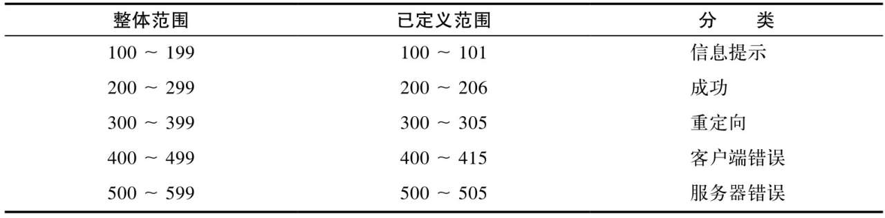

```
通过本章，可以了解到：
· HTTP是如何使用TCP连接的；
· TCP连接的时延、瓶颈以及存在的障碍；
· HTTP的优化，包括并行连接、keep-alive（持久连接）和管道化连接；
· 管理连接时应该以及不应该做的事情。


世界上几乎所有的HTTP通信都是由TCP/IP承载的，TCP/IP是全球计算机及网络设备都在使用的一种常用的分组交换网络分层协议集。客户端应用程序可以打开一条TCP/IP连接，连接到可能运行在世界任何地方的服务器应用程序。一旦连接建立起来了，在客户端和服务器的计算机之间交换的报文就永远不会丢失、受损或失序。


HTTP连接实际上就是TCP连接及其使用规则。TCP连接是因特网上的可靠连接。要想正确、快速地发送数据，就需要了解TCP的一些基本知识。
TCP为HTTP提供了一条可靠的比特传输管道。从TCP连接一端填入的字节会从另一端以原有的顺序、正确地传送出来
```

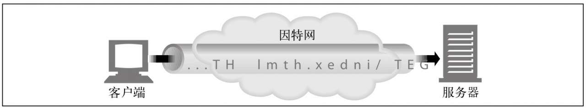

```
TCP的数据是通过名为IP分组（或IP数据报）的小数据块来发送的。这样的话，如图4-3a所示，HTTP就是“HTTP over TCP over IP”这个“协议栈”中的最顶层了。其安全版本HTTPS就是在HTTP和TCP之间插入了一个（称为TLS或SSL的）密码加密层
```

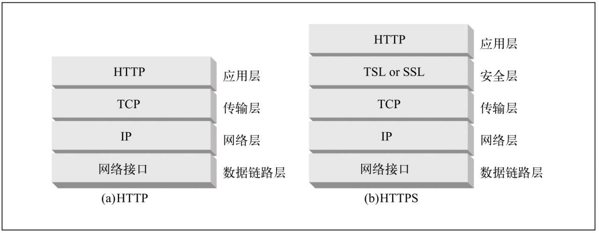


HTTP要传送一条报文时，会以流的形式将报文数据的内容通过一条打开的TCP连接按序传输。TCP收到数据流之后，会将数据流砍成被称作段的小数据块，并将段封装在IP分组中，通过因特网进行传输（参见图4-4）。所有这些工作都是由TCP/IP软件来处理的，HTTP程序员什么都看不到。

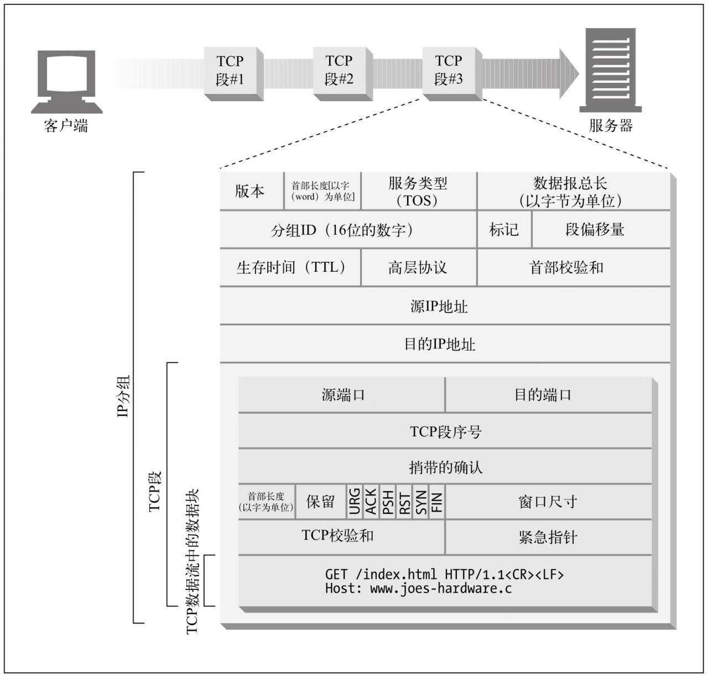

```
图4-4 承载TCP段的IP分组，它承载了TCP数据流中的小块数据

每个TCP段都是由IP分组承载，从一个IP地址发送到另一个IP地址的。每个IP分组中都包括：
· 一个IP分组首部（通常为20字节）；
· 一个TCP段首部（通常为20字节）；
· 一个TCP数据块（0个或多个字节）。

      IP首部包含了源和目的IP地址、长度和其他一些标记。TCP段的首部包含了TCP端口号、TCP控制标记，以及用于数据排序和完整性检查的一些数字值。


 TCP连接是通过4个值来识别的：

<源IP地址、源端口号、目的IP地址、目的端口号>
这4个值一起唯一地定义了一条连接。两条不同的TCP连接不能拥有4个完全相同的地址组件值（但不同连接的部分组件可以拥有相同的值）。
在

图4-5中，有4条连接：A、B、C和D。表4-1列出了每个端口的相关信息。

表4-1 TCP连接值
```

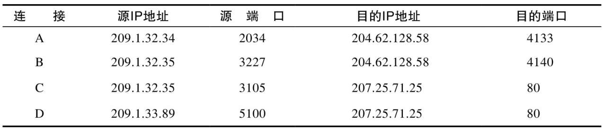


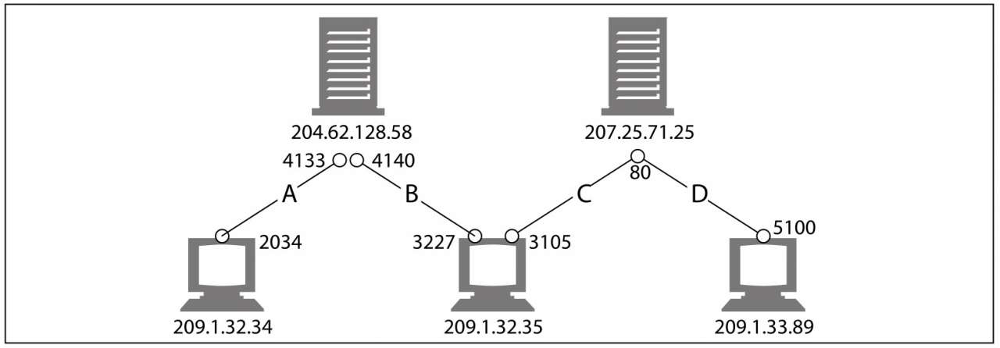

```
图4-5 4个不同的TCP连接

注意，有些连接共享了相同的目的端口号（C和D都使用目的端口号80）。有些连接使用了相同的源IP地址（B和C）。有些使用了相同的目的IP地址（A和B, C和D）。但没有两个不同连接所有的4个值都一样。


每个TCP段都有一个序列号和数据完整性校验和。每个段的接收者收到完好的段时，都会向发送者回送小的确认分组。如果发送者没有在指定的窗口时间内收到确认信息，发送者就认为分组已被破坏或损毁，并重发数据。
由于确认报文很小，所以TCP允许在发往相同方向的输出数据分组中对其进行“捎带”。TCP将返回的确认信息与输出的数据分组结合在一起，可以更有效地利用网络。为了增加确认报文找到同向传输数据分组的可能性，很多TCP栈都实现了一种“延迟确认”算法。延迟确认算法会在一个特定的窗口时间（通常是100～200毫秒）内将输出确认存放在缓冲区中，以寻找能够捎带它的输出数据分组。如果在那个时间段内没有输出数据分组，就将确认信息放在单独的分组中传送。

  但是，HTTP具有双峰特征的请求 -应答行为降低了捎带信息的可能。当希望有相反方向回传分组的时候，偏偏没有那么多。通常，延迟确认算法会引入相当大的时延。根据所使用操作系统的不同，可以调整或禁止延迟确认算法。
```


<br/><br/><br/>

> <h2 id="AIGC智能创作时代-未读完 （比较垃圾，不建议读）">AIGC智能创作时代-未读完 （比较垃圾，不建议读）</h2>

```
人工智能生成内容(AIGC,AI Generated Content)后来居上，以超出人们预期的速度成为科技革命历史上的重大事件，迅速催生了全新的科技革命系统、格局和生态，进而深刻改变了思想、经济、政治和社会的演进模式。
第一，AIGC的意义是实现人工智能“内容”生成。人们主观的感觉、认知、思想、创造和表达，以及人文科学、艺术和自然科学都要以具有实质性的内容作为基础和前提。所以，没有内容就没有人类文明。进入互联网时代后，产生了所谓专业生成内容(PGC)，也出现了以此作为职业获得报酬的职业生成内容(OGC)。与此同时，“用户生成内容”(UGC)的概念和技术也逐渐发展，由此形成了用户内容生态

（评论：from 百度AIGC的回复：具体来说：
UGC主要是普通用户的创作，例如抖音中的个人视频、微博评论等。它的优势在于鼓励大量用户参与创作，但质量可能参差不齐。
PGC则是由专业团队或个人创作的优质内容，如专业视频网站上的节目。它注重内容的专业性和质量保证，能够吸引并留住用户，有助于实现知识付费和后续产业开发。
OGC是以内容为职业的用户生产的，比如企业官微发布的文章、记者编写的新闻报道等。这种模式具有权威性和专业性，但由于与品牌或利益相关，可能缺乏客观公正性。
MGC是指由机器自动生成的内容，如某些社区的自动评论或由无人机采集的新闻素材等。虽然可以批量生产，但可能在阅读性和编辑运营方面存在不足。）


AIGC形成的学习能力取决于参数的规模。GPT-2大约有15亿个参数，而GPT-3最大的模型有1 750亿个参数，上升了两个数量级。而且，它不仅参数规模更大，训练所需的数据也更多。根据媒体猜测但还未被证实的消息，GPT-4的参数可能将达到100万亿规模（图0-6）。
```

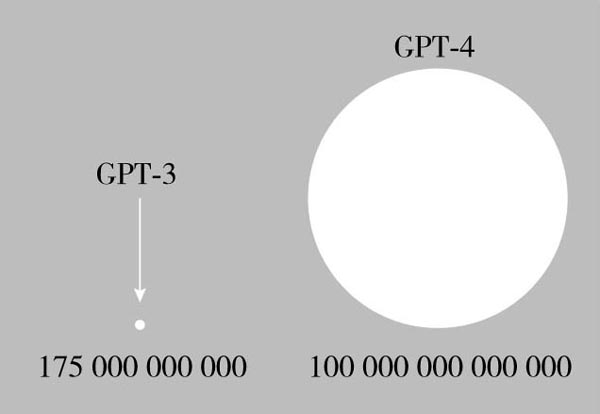


```
在可以预见的未来，在摩尔定律(Moore's Law)已走向失效的情况下，AI模型所需算力被预测每100天翻一倍，也就是“5年后AI所需算力超100万倍”。造成这样需求的根本原因是AI的算力不再是传统算力，而是“智能算力”，是以多维度的“向量”集合作为算力基本单位。


 第九，AIGC和硬技术相辅相成。从广义上讲，AIGC的硬技术是AI芯片，而且是经过特殊设计和定制的AI芯片。AI芯片需要实现CPU、GPU、FPGA和DSP共存。随着AIGC的发展，计算技术的发展不再仅仅依靠通用芯片在制程工艺上的创新，而是结合多种创新方式，形成智能计算和计算智能技术。例如，根据应用需求重新审视芯片、硬件和软件的协同创新，即思考和探索新的计算架构，满足日益巨大、复杂、多元的各种计算场景。其间，量子计算会得到突破性发展。

没有悬念，在Web3.0的环境下，AIGC内容将出现指数级增长。元宇宙的本质是社会系统、信息系统、物理环境形态通过数字构成了一个动态耦合的大系统，需要大量的数字内容来支撑，人工来设计和开发根本无法满足需求，AIGC可以最终完善元宇宙生态的底层基础设施。随着AIGC技术的逐渐成熟，传统人类形态不可能进入元宇宙这样的虚拟世界。未来的元宇宙主体将是虚拟人，即经过AIGC技术，特别融合ChatGPT技术，以代码形式呈现的模型化的虚拟人。

在产业生态方面，AIGC领域正在加速形成三层产业生态并持续创新发展，正走向模型即服务(MaaS)的未来（图0-8）。
```

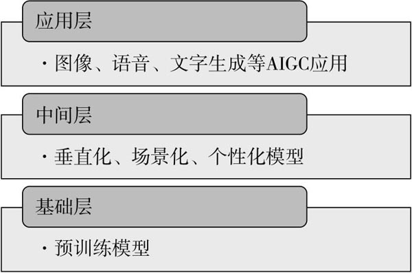


```
AIGC在文字、图像、音频、游戏和代码生成中的商业模型渐显。2B（to Business的简称）将是AIGC的主要商业模式，因为它有助于B端提高效率和降低成本，以填补数字鸿沟。但可以预见，由于AIGC“原住民”的成长，2C（to Consumer的简称）的商业模式将接踵而来。根据有关机构预测，2030年的AIGC市场规模将超过万亿人民币，其产业规模生态如图0-9所示。
```

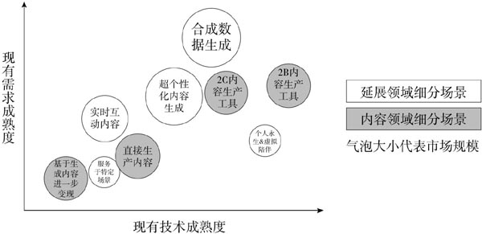


```
图灵测试定义：（图灵测试是一种测试人工智能是否能够展现出与人类同等或者更高水平的“智能”或“智慧”的测试方法。它是由英国著名数学家和逻辑学家 Alan Turing 在1950年所提出的一种测试方法。图灵测试的基本思想是：一个人和一台计算机同时隐藏在两个隔离的房间里，你的目的是通过提出问题来寻找出哪个是“人类”，哪个是“计算机”，如果你无法分辨那个是人类，哪个是计算机，那么这台计算机就通过了图灵测试。
图灵测试的提出，使得人工智能的研究者有了一个评估和比较不同系统之间智能表现的标准，同时也为人工智能的研究与发展奠定了基础。现在的人工智能技术已经具备了许多的人类智能，例如自然语言处理、图像识别、机器翻译等，但是人工智能仍然需要不断的提高，以更好地服务于人类。）

AIGC（Artificial Intelligence Generated Content，人工智能生成内容）的兴起极大地解放了人类的内容生产力，将数字文明送入智能创作时代。我们有幸处于时代浪潮之巅，见证由技术进步带来的全新变革。下面就让我们一起走进AIGC的世界，探索智能创作时代的无限可能。

互联网经历了Web1.0、Web2.0、Web3.0与元宇宙时代，不同互联网形态下也孕育了相辅相成的内容生产方式，并一直沿用至今。表1-1呈现了内容生产方式从PGC（Professional-Generated Content，专业生成内容）到UGC（User-Generated Content，用户生成内容），再到AIGC的发展历程。下面就让我们一起来了解一下每个内容生产时代的特点与故事吧！
表1-1　从PGC到UGC，再到AIGC的发展历程
```

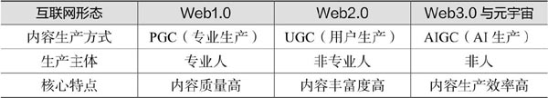


```
即便如此，AIGC也并非完美无缺的，“人工智能生成的内容如何确定版权归属”“AIGC是否会被不法分子利用，生成具有风险性的内容或用于违法犯罪活动”等一系列问题都是现在人们争论的焦点。目前，学界与业界在尝试从各个方面解决这些问题。但不管怎样，AIGC的迅猛发展已成不可逆转之势，智能创作时代的序幕正在缓缓拉开。

前文提到的新闻播报就属于结构化写作，通常具有比较强的规律性，能够在有高度结构化的数据作为输入的情况下生成文章。同时，AI不具备个人色彩，行文相对严谨、客观，因此在地震信息播报、体育快讯报道、公司年报数据、股市讯息等领域具有较大优势。国内许多知名媒体旗下都有这种类型的AI小编，包括新华社的“快笔小新”、第一财经的“DT稿王”、《南方都市报》的“小南”、封面新闻的“小封”、腾讯财经的“Dreamwriter”，以及今日头条的“Xiaomingbot”等。
```


<br/><br/><br/>

> <h2 id="自律">自律</h2>

```
自律并不是一定要每天按照时间点完成相应的事情，而是可以在这一段时间之内很好地平衡需要完成的事情，平衡自己的情绪。比如现在情绪不太好，就先调节一下自己的情绪，然后再完成要做的事情，也会确保在规定的时间内把事情完成，又不会因为没完成计划而形成一个自我挫败的过程。这才是比较健康的自律。所以，掌控、自律跟控制是不一样的。


掌控的特点是在计划的推进和目标的实现过程中可以有一定的灵活性，预料到事情会发生改变并及时进行调整，能接受这些改变和调整是自然发生的事情，不完全受自己控制。(懂得灵活变通，不应刻意死板，死板的副作用会让自己身心俱疲，善于灵活掌控反而会有效推进进程。)


一个人之所以从掌控一件事情滑落到过度控制一件事情，一般来说是因为他出现了很多情绪。比如，如果这件事情不按照我说的方法做，我会觉得很沮丧、很难受，或者我会很自责，觉得自己没做好，不是一个优秀的人，等等。当这些自责、焦虑等难以平复的情绪出现的时候，一个人如果没有办法平衡理智与情绪，就会被情绪所淹没。
比如，你很想和孩子或伴侣一起共度亲密的时光，打算一起看场电影。可是你们各有自己想看的电影，无法达成共识，最后不欢而散。本来一起看电影只是为了让彼此有一个相处的时间，情绪却让这件事情变成到底是你应该陪我看剧情片，还是我应该陪你看警匪片，到最后变成了到底应该谁听谁的争论。
如果有了情绪，又没有办法平衡情绪和理智，就会导致人们把注意力都集中在过程和手段上，而不再关注目的。


资本的天性就是逐利，它只会锦上添花🌸，绝不会雪中送炭。忽然想起曾经看到的一句圣经里的名言“凡有的，还要给他，叫他丰足有余；凡没有的，就连他有的，也要取去。”
```