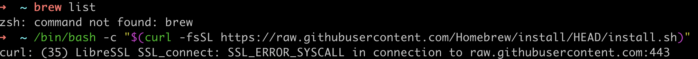
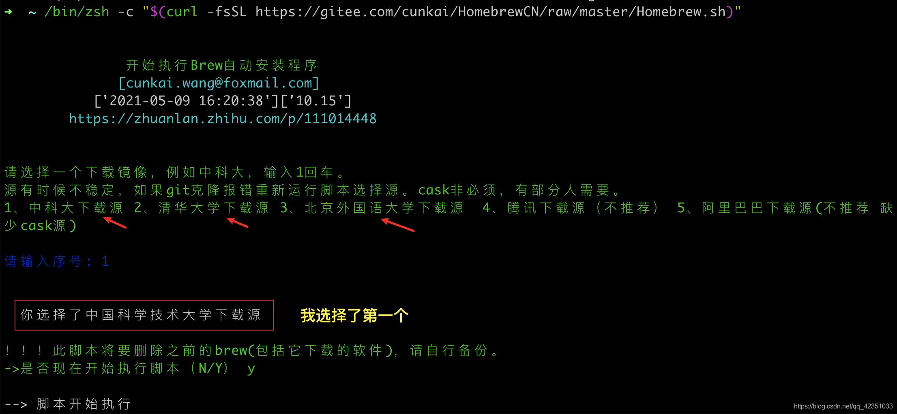
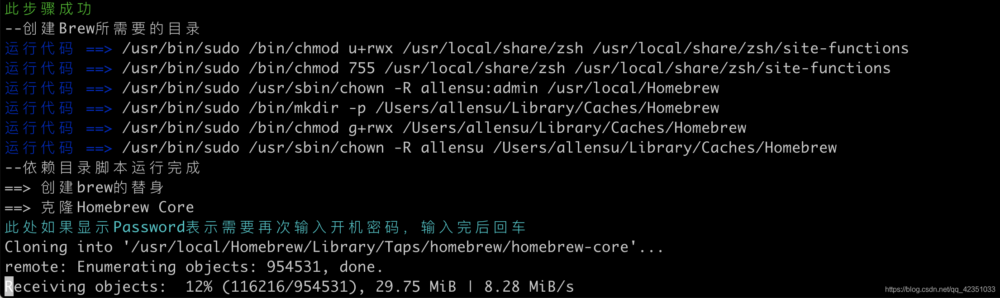
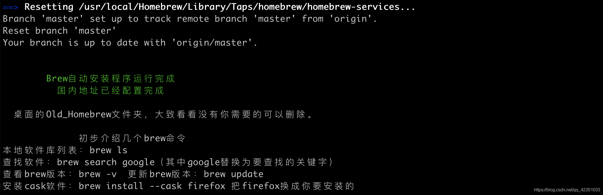
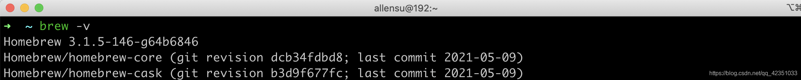
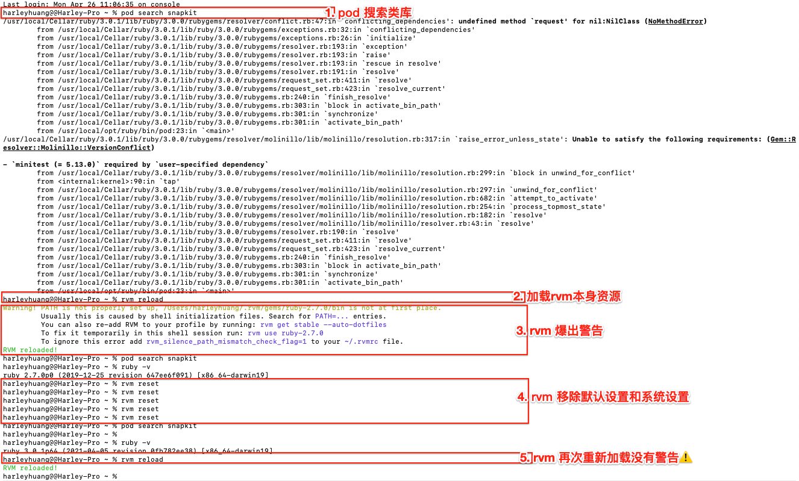
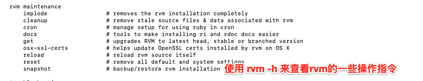

> <h2 id=""></h2>
- [**使用**](#使用)
	- [工作基本指令](#工作基本指令)
	- [pod update 和 pod install](#podupdate和podinstall)
	- [脚本命令](#脚本命令)
- [**RVM安装**](#RVM安装)
- [**安装Ruby**](#安装Ruby)
	- [安装最新ruby](#安装最新ruby)
- [**CocoaPosds**](#CocoaPosds)
	- [**安装**](#安装) 
		- [检测pod是否安装成功](#检测pod是否安装成功)
			- [出错: Unable to xxx](#出错:Unabletoxxx)
				- [在Intel芯片OS14.4错误:Unable to find a pod with name](#在Intel芯片OS14.4错误:Unabletofindapodwithname)
	- [M1安装](#M1安装)
	- [安装ruby](#安装ruby)
		- [问题1:CFLAGS=-O3](#问题1:CFLAGS=-O3)
		- [问题2:__rvm_make-j8](#问题2:__rvm_make-j8)
			- [问题2.1:Intel系列OS14.4——__rvm_make-j8](#问题2.1:Intel系列OS14.4——__rvm_make-j8)
		- [安装cocoapods(macOS10.11之后使用)](#安装cocoapods(macOS10.11之后使用))
	- [**错误解决方案**](#错误解决方案)
	- [**卸载CocoaPosds**](#卸载CocoaPosds)
- **资料**
	- [CocoaPods使用指南](https://juejin.cn/post/7179231344147300412)
	- [Cocoapods 使用](https://hanleylee.com/articles/usage-of-cocoapods/)


<br/>

***
<br/><br/><br/>

> <h1 id="使用">使用</h1>

<br/>

> <h2 id="工作基本指令">工作基本指令</h2>


定位到工程目录文件，在Mac终端输入：

```
pod init
```

然后再次在终端输入：

```
open -e Podfile
```

打开Podfile文件，输入要导入第三方类库(包含版本号)


<br/>

**下载第三方类库**

```
pod install
```


**升级SDK版本**

```
pod update
```

**如果出现搜索不到最新库，可以执行下面代码更新索引库**

```
pod repo update
```
更新一下。


<br/><br/><br/>

> <h2 id ='podupdate和podinstall'>pod update 和 pod install</h2>

**`update 和 install 区别：`**

- update:

- install:


<br/>

**`update 失败解决：`**

<br/>

终端输入：

```
pod update 
```

<br/>
错误提示，如下图：
<br/>


**`解决方法`**

<br/>

终端输入：

```
//pod repo update命名是用来更新本地cocoapods的spec资源配置信息
//安装完cocoapods后，在用户根目录下有个隐藏文件夹，/Users/harleyhuang[用户名]/.cocoapods，里面是cocoapods收录的所有库的配置信息；
// /Users/harleyhuang[用户名]/.cocoapods/repos/master/Specs/；
// 比如Kingfisher就是/Users/harleyhuang[用户名]/.cocoapods/repos/master/Specs/a/a/6/Kingfisher，内部分版本包含多个文件夹，每个文件夹内包含一个配置文件，比如Kingfisher.podspec.json

 pod repo update --verbose
```

<br/>

如：Kingfisher.podspec.json 所在文件夹路径图：


然后再次在终端输入：`pod update`即可。


<br/><br/>

- `pod deintegrate`

方法很简单：

1；安装cocoapods-deintegrate命令: sudo gem install cocoapods-deintegrate

2；然后到工程目录下面执行命令：pod deintegrate，就可以了，然后手动删除.xcworkspace，libPods.a，Podfile，Podfile.lock文件就好了。如果想要重装的话保留Podfile，再执行命令：pod install 就好了，很简单。


<br/><br/><br/>

> <h2 id='脚本命令'>脚本命令</h2>

<br/><br/><br/>

> <h2 id=''>拷贝隐私清单文件到指定Pod下的库文件内</h2>

在Podfile文件夹中写下如下命令:

```
post_install do |installer|
  flutter_post_install(installer)
  
  # 获取 Pods 项目文件的路径所在文件夹
   pods_project_path = File.dirname(installer.pods_project.path);
   
   #隐私清单原有文件路径
   Qiniu_privacy_path = './ThirdPodPrivacy/Qiniu/PrivacyInfo.xcprivacy'
   #目标Qiniu库的Resources文件夹路径
   Qiniu_privacy_target_path = pods_project_path + '/Qiniu/Resources/'
   
   #根据Qiniu_privacy_target_path文件路径创建Qiniu库下的Resources问件夹
   FileUtils.mkdir_p(Qiniu_privacy_target_path)
   #将Qiniu_privacy_path下的文件复制到Qiniu_privacy_target_path路径下
   FileUtils.cp_r(Qiniu_privacy_path, Qiniu_privacy_target_path)
   #打印 Pods 项目路径到控制台,File.dirname获取当前文件所在的文件夹
   #puts "🍎 pods_project_path path: #{File.dirname(pods_project_path)}"
   
    
  installer.pods_project.targets.each do |target|
    target.build_configurations.each do |config|
      config.build_settings['ENABLE_BITCODE'] = 'NO'
      config.build_settings['IPHONEOS_DEPLOYMENT_TARGET'] = '11.0'
      config.build_settings["EXCLUDED_ARCHS[sdk=iphonesimulator*]"] = "arm64"
      config.build_settings['CLANG_WARN_QUOTED_INCLUDE_IN_FRAMEWORK_HEADER'] = "NO"
    end
  end
end
```

然后在终端执行:

```
pod install
```


<br/>

***
<br/><br/><br/>

># <h1 id = "RVM安装">RVM安装</h1>

**`条件：安装CocoaPosds[当前Mac OS X 10.15]`**

**`①是否安装了RVM，若没有需安装，否则第②步`**

什么是RVM?

&emsp;`Ruby Version Manager`简称`RVM`,是一款非常好用的`ruby`版本管理以及安装工具

**①查看是否安装RVM**

```
rvm -v

//没有安装rvm
zsh: command not found: rvm 
```

**②安装RVM**

```
curl -L https://get.rvm.io | bash -s stable
```

<br/>

检查RVM是否安装上了

```
rvm -v

//没有安装上
zsh: command not found: rvm
```

这是因为没有从终端载入，这时可以这么做：

```
source ~/.rvm/scripts/rvm 
```

然后检查RVM的版本：


```
rvm -v

rvm 1.29.9 (latest) by Michal Papis, Piotr Kuczynski, Wayne E. Seguin [https://rvm.io]
```
这时说媒RVM已经安装上了，这时可以进行Ruby的安装了。

<br/><br/>

&emsp; 但有时像上述进行安装RVM可能一直失败，所有我们需要换另一种方式进行下载`离线下载`[官网离线下载](https://rvm.io/rvm/offline)，如下面：

```
// 离线包
$ curl -sSL https://github.com/rvm/rvm/tarball/stable -o rvm-stable.tar.gz

// 创建文件夹
$ mkdir rvm && cd rvm

// 解包
$ tar --strip-components=1 -xzf ../rvm-stable.tar.gz

// 安装 
$ ./install --auto-dotfiles

// 加载
$ source ~/.rvm/scripts/rvm

```


<br/>

***
<br/><br/><br/>

> <h2 id='安装Ruby'>安装Ruby</h2>

**②安装Ruby**

<br/>

**`更换镜像源`**

-  ruby 默认的原地址是国外网络地址，通过下面命令查看当前的镜像:


```
gem sources -l
*** CURRENT SOURCES ***

https://rubygems.org/
```

<br/>

-  移除当前镜像

```
gem sources --remove https://rubygems.org/
https://rubygems.org/ removed from sources
```


<br/>

-  添加国内的 ruby 镜像

```
gem sources -a https://gems.ruby-china.com

https://gems.ruby-china.com added to sources
```

<br/>

-  再次查看当前镜像,发现已经替换成功

```
gem sources -l
*** CURRENT SOURCES ***

https://gems.ruby-china.com/
```


<br/><br/><br/>

> <h2 id='安装最新ruby'>安装最新ruby</h2>


**`安装最新ruby`**

-  查看Ruby已有的版本，安装最新的：

```
rvm list known
```


-  选择最新的版本进行安装,安装可能需要一点时间：

`rvm install 2.7`

&emsp;  在漫长的下载，编译过程，完成以后，Ruby, Ruby Gems 就安装好了。这期间若`Honebrew`没有安装，则在此过程中会进行自动安装。


-  即使`HomeBrew `没有安装好也可以安装CocoaPods(这是错的，必须安装否则无法安装Ruby)，检查Ruby是否安装好了(查看自己Mac的ruby源)：

``` 
ruby -v

ruby 2.6.3p62 (2019-04-16 revision 67580) [universal.x86_64-darwin19]
```

-	传说 CocoaPods 支持的 ruby 最低版本是2.2.2，如果自己电脑版本低于这个版本就升级 ruby ，上面显示我的电脑版本不需要升级，可以忽略下面的升级操作
`sudo gem update --system`


<br/> <br/>

**`查询已经安装的ruby`**

```
rvm list

//提示rvm rubies还没有安装
# No rvm rubies installed yet. Try 'rvm help install'.
```

按他的提示，在终端输入：

```
rvm help install
```


在输出的内容中找到下图的版本号，然后找到指定的版本号进行安装


但是上图的版本号有点旧，我们可以用命令：

```
rvm list known
```

<br/>

查看版本号，然后选中一个版本号进行安装(这里我选择2.6.3版本)：

```
rvm install 2.6.3 --default
```

会报下面的错误


若出现如上问题说明Mac上没有安装Homebrew(若是安装了，这一步可以直接跳过) ,需要先安装：

```
ruby -e "$(curl -fsSL https://raw.githubusercontent.com/Homebrew/install/master/install)"
```

在这里需要等待大概要2小时，可以看会剧比如：`海贼王、庆余年等`，安装成功后提示:


<br/><br/>

在终端输入：

```
brew help
```

终端提示


<br/><br/>

强制退出终端，然后重新打开终端，输入：

```
rvm install 2.6.3
```

<br/>

安装后，提示

```
Install of ruby-2.6.3 - #complete 
Ruby was built without documentation, to build it run: rvm docs generate-ri
```

终端输入：

```
rvm docs generate-ri


RVM version 1.29.9-next (master) is installed, yet version 1.29.9 (latest) is loaded.

Please open a new shell or run one of the following commands:

    rvm reload
    echo rvm_auto_reload_flag=1 >> ~/.rvmrc # OR for auto reload with msg
    echo rvm_auto_reload_flag=2 >> ~/.rvmrc # OR for silent auto reload
```

按照提示重新打开一个Shell或者输入命令，这里输入命令：

```
rvm reload


RVM reloaded!
```

更新Ruby版本

```
rvm install 2.7.0-preview1
```

<br/>

***
<br/><br/><br/>

># <h1 id = "CocoaPosds">CocoaPosds</h1>

<br/>

># <h2 id = "安装">安装</h2>

-  根据系统版本选择指令

Mac为 OS X 10.11之前系统的安装cocoapods 指令

` sudo gem install cocoapods`

Mac为 OS X 10.11以后系统的安装cocoapods 指令

`sudo gem install -n /usr/local/bin cocoapods `

由于我的系统版本是 OS X 10.15，所以选择：

`sudo gem install -n /usr/local/bin cocoapods`

&emsp;  到了这里就成功安装CocoaPods了!如果你这样想，我只能说你太年轻了，后面的坑还多着呢！！！

- 安装本地库

```
pod setup
```

<br/>

- 查看 Cocoapods 版本

```
pod --version


1.9.0.beta.3
```


<br/><br/>

-  **对安装后的CocoaPods进行测试：**

`pod search RxSwift` 或者 `pod install`,会出现：


<br/> <br/>

-  **查看repo**

`pod repo list`

```
master
- Type: git (master)
- URL:  https://github.com/CocoaPods/Specs.git
- Path: /Users/Riber/.cocoapods/repos/master

trunk
- Type: CDN
- URL:  https://cdn.cocoapods.org/
- Path: /Users/Riber/.cocoapods/repos/trunk

2 repos
```

会发现有**`2 repo`**，针对于上面的 CDN 错误，我们要删除一个。更新使用`pod repo update `

-  解决[!]CDN: 错误:

在 podfile文件中添加source源:
`source 'https://github.com/CocoaPods/Specs.git'`

<br/> <br/>

&emsp;  podfile文件中添加source源后，pod install和pod update可以正常操作，但是pod search有些库却不正常,此时可以在终端执行:
`pod repo remove trunk`

&emsp;  Trunk 是用来自己写了一些类库上传到CocoaPods，但是这里我暂时用不到所以用不到，说以删除了。若是以后用到，可以自己重新添加进行配置Trunk。要重新创建请看[这里](https://www.jianshu.com/p/2572935ee006)


<br/><br/>

> <h2 id='检测pod是否安装成功'>检测pod是否安装成功</h2>


- **再次检测是否成功，终端输入**

```
pod search AFNetworking
```

<br/><br/><br/>

> <h2 id='出错:Unabletoxxx'>出错:Unable to xxx</h2>

报错：

```
[!] Unable to find a pod with name, author, summary, or description matching `AFNetworking`
```

<br/><br/>


-  不幸的是又失败了，使出撒手锏

```
git clone https://git.coding.net/CocoaPods/Specs.git ~/.cocoapods/repos/master
```

这时候`pod serarch Snapkit` 事没问题了


<br/><br/><br/>

> <h2 id='在Intel芯片OS14.4错误:Unabletofindapodwithname'>在Intel芯片OS14.4错误:Unable to find a pod with name</h2>

```
pod repo remove master
 
cd ~/.cocoapods/repos

git clone --depth 1 https://github.com/CocoaPods/Specs.git master
 
rm ~/Library/Caches/CocoaPods/search_index.json
 
pod search MJ
```

注意上述要在良好的网络环境下才可以,否则会出错!如下:

```
[!] /usr/local/bin/git clone https://github.com/CocoaPods/Specs.git -- master

正克隆到 'master'...
错误：RPC 失败。curl 92 HTTP/2 stream 5 was not closed cleanly: CANCEL (err 8)
错误：预期仍然需要 4915 个字节的正文
fetch-pack: unexpected disconnect while reading sideband packet
致命错误：过早的文件结束符（EOF）
致命错误：fetch-pack：无效的 index-pack 输出
```

<br/>
若是出现下面的错误:

```
正克隆到 'master'...
remote: Enumerating objects: 1458219, done.
remote: Counting objects: 100% (1458219/1458219), done.
remote: Compressing objects: 100% (844228/844228), done.
错误：RPC 失败。curl 92 HTTP/2 stream 5 was not closed cleanly: CANCEL (err 8)
错误：预期仍然需要 6021 个字节的正文
fetch-pack: unexpected disconnect while reading sideband packet
致命错误：过早的文件结束符（EOF）
致命错误：fetch-pack：无效的 index-pack 输出
```

**请执行:**

```
repos % git config --global http.version HTTP/1.1
```

然后再执行:

```
pod repo remove master
 
cd ~/.cocoapods/repos

git clone --depth 1 https://github.com/CocoaPods/Specs.git master
 
rm ~/Library/Caches/CocoaPods/search_index.json
 
pod search MJ
```


<br/><br/>


-  终端输入安装出错

```
pod install
```

如下错误：

```
[!] Unable to add a source with url [https://github.com/CocoaPods/Specs.git](https://link.zhihu.com/?target=https%3A//links.jianshu.com/go%3Fto%3Dhttps%253A%252F%252Fgithub.com%252FCocoaPods%252FSpecs.git) named master. You can try adding it manually in ~/.cocoapods/repos or via pod repo add 
```

在终端依次输入然后回车：

```
rm -rf ~/.cocoapods

mkdir -p ~/.cocoapods/repos

cd ~/.cocoapods/repos

git clone https://github.com/CocoaPods/Specs.git master
```

&emsp;  这时再次使用pod install 和 pod update ，如丝滑般流畅，就这破东西整了一天，记住不要轻易升级系统和新的版本Cocoapods否则后面的坑一个接着一个来。


<br/><br/><br/>


>## <h2 id="M1安装">[M1安装](https://www.jianshu.com/p/66eefaaada7a)</h2>

&emsp; 因为苹果的M1芯片与英特尔的芯片不同导致安装时也与以前不同导致出现各种的坑，现在开始M1芯片的Cocoapods安装。


<br/>

- **安装 Homebrew 过程**

去[Homebrew官网复制下载命令](https://brew.sh/index_zh-cn)终端输入：

```
/bin/bash -c "$(curl -fsSL https://raw.githubusercontent.com/Homebrew/install/HEAD/install.sh)"
```

运行安装失败后的提示：



<br/>

选择国内的镜像下载地址进行下载(最好是国外的,国内的容易出问题)：

```
/bin/zsh -c "$(curl -fsSL https://gitee.com/cunkai/HomebrewCN/raw/master/Homebrew.sh)"
```




选择一个地址后输入 y 开始执行脚本，然后输入你的开机密码，后面会下载很多文件




不需要你操作，静静的等待安装完就行了，安装完成后的界面如下




<br/>

重启终端后输入命令 `brew -v` 即可，如下图所示:



更新 Homebrew

```
brew update
```

<br/>

卸载 Homebrew

```
/bin/zsh -c "$(curl -fsSL https://gitee.com/cunkai/HomebrewCN/raw/master/HomebrewUninstall.sh)"
```


<br/><br/><br/>

在终端输入：

```
/usr/bin/ruby -e "$(curl -fsSL https://cdn.jsdelivr.net/gh/ineo6/homebrew-install/install)"
```

&emsp; 若你的电脑系统是macOS big sur 12.3系统会提示你命令已废弃请使用

```
/bin/bash -c "$(curl -fsSL https://cdn.jsdelivr.net/gh/ineo6/homebrew-install/install.sh)"
```

&emsp; 激动人心的时刻到了，终于下载了！但是要注意，在下载完后要注意 **Warning** 否则会导致意想不到的问题，一定按照其 **Warning** 提示进行操作。

<br/> <br/>

&emsp; 执行环境变量，添加 **Homebrew** 到 **/Users/zhoujiebing/.zprofile**文件的**PATH**中，执行下面命令即可:

```
echo 'eval "$(/opt/homebrew/bin/brew shellenv)"' >> /Users/zhoujiebing/.zprofile
 
eval "$(/opt/homebrew/bin/brew shellenv)"
```

&emsp; 如果你不确定可以先试试命令brew help ,如果提示没有此命令,那就需要执行上面的两行命令了.执行了之后再次输入brew help 就会列出帮助信息了,那就说明你的homebrew安装好了,可以用了!


<br/><br/><br/>

> <h2 id='安装ruby'>安装ruby</h2>

```
rvm install 3.0.0
```


<br/><br/><br/><br/>

> <h2 id='问题1:CFLAGS=-O3'>问题1:CFLAGS=-O3</h2>


- **若出现问题1,没有Skip**

```
Error running ' CFLAGS=-O3 *****(一堆路径)

please read /Users/harleyhuang/.rvm/log/1653793499_ruby-3.0.0/configure.log
There has been an error while running configure. Halting the installation.
```

解决:

```
//安装openssl
brew install openssl@1.1

//查看安装路径
brew --prefix openssl@1.1
#路径:/opt/homebrew/opt/openssl@1.1

//安装ruby
rvm install 3.0.0 --with-openssl-dir=/opt/homebrew/opt/openssl@1.1

//有时它会提示已经安装,可以用下面的命令
rvm reinstall 3.0.0 --with-openssl-dir=`brew --prefix openssl`
```


<br/><br/><br/>

> <h2 id='问题2:__rvm_make-j8'>问题2:__rvm_make -j8</h2>


- **若出现问题2,没有Skip**


```
Error running '__rvm_make -j8',
please read /Users/harleyhuang/.rvm/log/1623324364_ruby-2.5.0/make.log

There has been an error while running make. Halting the installation.

```

&emsp; 在网上搜索`Error running '__rvm_make -j8'`,发现寥寥无几或者根本没有搜到.那就只能复制这个地址`/Users/harleyhuang/.rvm/log/1623324364_ruby-2.5.0/make.log`然后到Finder中Command+F+G搜索这个文件.打开这个文件后发现经常出现这几个问题:

```
warning: no debug symbols in executable (-arch x86_64)


readline.c:1904:37: error: use of undeclared identifier 'username_completion_function'; did you mean 'rl_username_completion_function'?
                                    rl_username_completion_function);
                                    ^~~~~~~~~~~~~~~~~~~~~~~~~~~~~~~
                                    rl_username_completion_function
readline.c:79:42: note: expanded from macro 'rl_username_completion_function'
# define rl_username_completion_function username_completion_function
                                         ^
/opt/homebrew/opt/readline/include/readline/readline.h:485:14: note: 'rl_username_completion_function' declared here
extern char *rl_username_completion_function PARAMS((const char *, int));
             ^
compiling psych_parser.c
1 error generated.
```


然后想到可能是M1用的arm架构导致的,所以可以在命令前加入**`arch -arm64`**记忆区别:


```
brew install openssl

rvm install 2.5.0 --with-openssl-dir=`brew --prefix openssl`

//或者下面安装-x86_64架构的rvm
arch -x86_64 rvm install 3.0.0 --with-openssl-dir=/usr/local/opt/openssl@1.0

// M1芯片的64架构:
// arch -arm64 rvm install 3.0.0 --with-openssl-dir=`brew --prefix openssl`

```

然后就下载成功了!

<br/>


```
//检查安装的的ruby版本
rvm list 

//检查ruby源 
gem sources -l

//移除不需要的ruby源
gem sources --remove https://rubygems.org/

//添加ruby源
gem sources --add https://gems.ruby-china.com

//指定系统默认的ruby版本
rvm use 3.0.0 --default 
```


出现这个问题：`Requirements installation failed with status: 1.`

<br/>

解决：

```
rvm autolibs read-only

//安装指定版本
rvm install ruby-3.0.0

//检查安装的的ruby版本
rvm list 

//指定系统默认的ruby版本
rvm use 3.0.0 --default 


//查看下载的的ruby版本号
ruby -v
```


<br/><br/><br/>

> <h2 id='问题2.1:Intel系列OS14.4——__rvm_make-j8'>问题2.1:Intel系列OS14.4——__rvm_make-j8</h2>

执行完下面命令:

```
 brew --prefix openssl@3 
 
 rvm install ruby-3.0.0 --with-openssl-dir=/usr/local/opt/openssl@3 
```

然后会出现如下终端提示错误:

```
Error running '__rvm_make -j8',
please read /Users/dwd/.rvm/log/1713417672_ruby-3.0.0/make.log

There has been an error while running make. Halting the installation.
```


然后后面搜索这个问题`x86_64 OS14.4 Certificates bundle '/usr/local/etc/openssl@1.1/cert.pem' is already up to date. Requirements installation successful. 解决 `找到了github的一个解决[RVM - Error running '__rvm_make -j8' while running rvm install 3.2.2 on MacOs #5367](https://github.com/rvm/rvm/issues/5365)的解决方法:

```
brew uninstall --ignore-dependencies openssl

brew reinstall openssl@3

rvm install ruby-3.2.2 --reconfigure --enable-yjit --with-openssl-dir=$(brew --prefix openssl@3)
```

但是还是会报错,如下:


但是将这个命令:

```
rvm install ruby-3.2.2 --reconfigure --enable-yjit --with-openssl-dir=$(brew --prefix openssl@3)
```

**替换成:**

```
rvm install 3.2.2 -C --with-openssl-dir=/opt/homebrew/opt/openssl@3.1
```

就可以了.


<br/><br/><br/>

> <h2 id='安装cocoapods(macOS10.11之后使用)'>安装cocoapods(macOS10.11之后使用)</h2>


```
// cocoapods 安装
sudo gem install -n /usr/local/bin cocoapods

// 设置
pod setup

// 测试
pod search snapkit
```

有出错了!:

```
### Error LoadError - dlopen(/Users/harleyhuang/.rvm/rubies/ruby-3.0.0/lib/ruby/gems/3.0.0/gems/ffi-1.15.5/lib/ffi_c.bundle, 9): no suitable image found.  Did find:
	/Users/harleyhuang/.rvm/rubies/ruby-3.0.0/lib/ruby/gems/3.0.0/gems/ffi-1.15.5/lib/ffi_c.bundle: mach-o, but wrong architecture
	/Users/harleyhuang/.rvm/rubies/ruby-3.0.0/lib/ruby/gems/3.0.0/gems/ffi-1.15.5/lib/ffi_c.bundle: mach-o, but wrong architecture - /Users/harleyhuang/.rvm/rubies/ruby-3.0.0/lib/ruby/gems/3.0.0/gems/ffi-1.15.5/lib/ffi_c.bundle
<internal:/Users/harleyhuang/.rvm/rubies/ruby-3.0.0/lib/ruby/3.0.0/rubygems/core_ext/kernel_require.rb>:85:in 'require'
......
.....
...

Don't forget to anonymize any private data!

Looking for related issues on cocoapods/cocoapods...
Searching for inspections failed: undefined method `map' for nil:NilClass
```

然后进行了一番大搜索,发现又是架构的锅,日了狗了!命令撸起来:

```
sudo arch -arm64 gem install ffi
 
sudo arch -arm64 gem install cocoapods

//测试
pod search afnetworking     
```

坎坷又来了:!

`[!] CDN: trunk URL couldn't be downloaded: https://cdn.cocoapods.org/all_pods_versions_5_7_d.txt Response: Couldn't connect to server`

```
//在本地Podfile替代
source 'https://cdn.cocoapods.org/'
//用:
source 'https://github.com/CocoaPods/Specs.git'


//在本地移除久的引用,用新的
pod repo remove trunk

pod install --repo-update
```


<br/>

***
<br/><br/>

># <h2 id = "错误解决方案">错误解决方案</h2>


<br/>

- 错误：

```
/usr/local/lib/ruby/gems/2.7.0/gems/cocoapods-core-1.9.1/lib/cocoapods-core/source/metadata.rb:15:in `initialize': undefined method `with_indifferent_access' for false:FalseClass (NoMethodError)
```

终端输入：

```
$ sudo gem update cocoapods 
$ rm -rf ~/.cocoapods/repos/trunk/
```


<br/>

-  repos 为 0

```
pod repo list

0 repos
```

- a. 先移除掉本地的master,在终端输入pod repo remove master;

- b. 再切换到：`cd ~/.cocoapods/repos`;

- c. `git clone --depth 1 https://github.com/CocoaPods/Specs.git master`,等待下载完毕；

- d. `rm ~/Library/Caches/CocoaPods/search_index.json`

- e. `pod search afnetworking`, 检测是否可以使用了；

<br/><br/>

[解决方案参考]([https://www.cnblogs.com/shuilangyizu/p/10935728.html](https://www.cnblogs.com/shuilangyizu/p/10935728.html)
)


<br/><br/><br/>


- rvm系统路径出错

问题：电脑重启后，pod无法使用，会报错。需要每次在系统终端`rvm reload`后pod才能使用，否则pod无法使用。



如上图，执行【步骤1】就会出现问题，执行【步骤2】出现【步骤3】警告，解决方案：

执行【步骤4】，注意这个命令需要输入**5次**

让后执行【步骤5】没有警告了，然后电脑再重启，没有任何问题。


<br/>



在上图中执行`rvm -h`来查看rvm指令，上图只是截取的一部分。


<br/>

***
<br/><br/><br/>


> <h2 id = "卸载CocoaPosds">卸载CocoaPosds</h2>

**`第一种卸载方法：`**

**①卸载老版本**

`sudo gem uninstall cocoapods`

出现

```
Remove executables:
	pod, sandbox-pod

in addition to the gem? [Yn]  Yn          //输入 Yn，确定删除    
Removing pod
Removing sandbox-pod
Successfully uninstalled cocoapods-1.8.4

```

<br/>

**②查看本地安装过的cocopods相关东西**

` gem list --local | grep cocoapods`

```
cocoapods-core (1.8.4)
cocoapods-deintegrate (1.0.4)
cocoapods-downloader (1.3.0)
cocoapods-plugins (1.0.0)
cocoapods-search (1.0.0)
cocoapods-stats (1.1.0)
cocoapods-trunk (1.4.1)
cocoapods-try (1.1.0)
```

使用命令逐个删除：

```
sudo gem uninstall cocoapods-core
//Successfully uninstalled cocoapods-core-1.8.4


sudo gem uninstall cocoapods-deintegrate
//Successfully uninstalled cocoapods-deintegrate-1.0.4

sudo gem uninstall cocoapods-downloader 
//Successfully uninstalled cocoapods-downloader-1.3.0

.....
...
..
```

或者使用脚本命令进行全部的删除：

```
sudo rm -rf /usr/local/bin/pod ; gem list | grep cocoapods | awk '{print $1}' | while read line; do sudo gem uninstall $line;done
```

如下图：


<br/> <br/>

**`第二种卸载方法：`**

**①查找目前版本的pod路径**

```
which pod
```

**②移除现有pod**

```
rm -rf /usr/local/bin/pod
```


&emsp; 这样CocoaPods 就卸载干净了。


<br/><br/>


