># <h2 id=''>[Git命令大全](https://blog.csdn.net/weixin_49851451/article/details/123944431)</h2>
- [下载仓库中某个指定文件代码](#下载仓库中某个指定文件代码)
- [**指令工作流**](#指令工作流)
	- [基本操作](#基本操作)
	- [分支的操作](#分支的操作)
		- [查看分支](#查看分支) 
		- [创建分支](#创建分支)
		- [合并分支](#合并分支)
		- [分支的高级合并](#分支的高级合并) 
	- [更改提交的操作](#更改提交的操作)
	- [推送至远程仓库](#推送至远程仓库)
		- [git remote](#gitremote)
		- [git push](#gitpush)
	- [从远程仓库获取](#从远程仓库获取)
		- [克隆版本库](#克隆版本库)
		- [git fetch](#gitfetch)
		- [拉取代码](#拉取代码)
	- [忽略文件配置](#忽略文件配置)
- [**工作流指令**](#工作流指令)
	- [新功能分支](#新功能分支)
	- [修复紧急bug](#修复紧急bug)
	- [dev合并到release](#dev合并到release)
	- [版本打Tag](#版本打Tag)
- [**SourceTree工作流**](#SourceTree工作流)
	- [.stCommitMsg设置提交内容模版](#.stCommitMsg设置提交内容模版)
	- [新建分支](#新建分支)
	- [远程检出分支](#远程检出分支)
	- [删除分支](#删除分支)
	- [拉取](#拉取)
	- [合并分支](#合并分支)
	- [代码回滚](#代码回滚)
	- [远程回滚](#远程回滚)
	- [变基](#变基)
	- [打Tag](#打Tag)
- [**分支种类**](#分支种类)
- [**Git安装**](#Git安装)
	- [github使用token作为密码](#github使用token作为密码)
- [Gitee配置](#Gitee配置)
- **错误解决**
	- [please used a personal access token instead](#tokeninstead) 
	-  [LibreSSL SSL_connect：443](#LibreSSLSSL_connect443) 
	-  [游离态Head解决](#游离态Head解决)
- **`参考资料`**
	- [有趣的学习Git](https://learngitbranching.js.org/) 
	- [Git 分支阐述](https://www.cnblogs.com/hezhiying/p/9292314.html)
	- [sourceTree合并某次提交](https://www.jianshu.com/p/12da57330ca0)
	- [source tree进行rebase操作](https://www.jianshu.com/p/e54fd2ab8ce8)
	- [合并多次提交](https://github.com/zuopf769/how_to_use_git/blob/master/使用git%20rebase合并多次commit.md)


<br/><br/><br/>

***
<br/>

> <h1 id="下载仓库中某个指定文件代码">下载仓库中某个指定文件代码</h1>

下载如下仓库中的**Redis**文件下的所有文件:

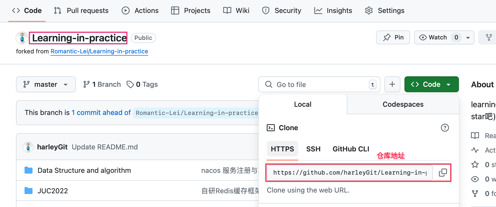

```sh
# 在桌面建立一个 “尚硅谷Reids[周阳]” 文件夹
cd /Users/ganghuang/Desktop/尚硅谷Reids\[周阳\]

# git clone --filter=blob:none --no-checkout https://github.com/用户名/仓库名.git
git clone --filter=blob:none --no-checkout https://github.com/harleyGit/Learning-in-practice.git
Cloning into 'Learning-in-practice'...
remote: Enumerating objects: 13918, done.
remote: Counting objects: 100% (4075/4075), done.
remote: Compressing objects: 100% (196/196), done.
remote: Total 13918 (delta 3973), reused 3879 (delta 3879), pack-reused 9843 (from 2)
Receiving objects: 100% (13918/13918), 1.04 MiB | 1.29 MiB/s, done.
Resolving deltas: 100% (7234/7234), done.

# cd 仓库名
cd Learning-in-practice

git sparse-checkout init --cone

#git sparse-checkout set 路径/到/你要的文件夹
git sparse-checkout set ./Redis

# git checkout 分支名
git checkout master 
```


<br/>

***
<br/>

> <h1 id='指令工作流'>指令工作流</h1>

<br/>

> <h2 id='基本操作'>基本操作</h2>

```
/*
 * 初始化仓库
*/
// 创建一个GitTest的文件夹
$ mkdir GitTest
// 来到GitTest文件夹
$ cd GitTest
// 初始化仓库(实际上建立一个目录并初始化仓库)
// 如果初始化成功，执行了git init命令的目录下就会生成．git目录
// 这个．git目录里存储着管理当前目录内容所需的仓库数据
$ git init
// 创建一个README.md文件
$ touch README.md


/*
 * 查看一下当前分支的状态
*/
$ git status


/*
 * git add 命令将其加入暂存区（Stage或者Index）中，暂存区是提交之前的一个临时区域
*/
// 将具体某个文件如：README.md文件加入到暂存区
$ git add README.md(文件名)
// 将所有文件加入到暂存区
$ git add .


 
/*
 * 将当前暂存区中的文件实际保存到仓库的历史记录中
*/ 
// 记述一行提交信息
// -m参数后的"First commit"称作提交信息，是对这个提交的概述
$  git commit -m 'First Commit'


/*
 * 查看提交日志
*/ 
// git log命令可以查看以往仓库中提交的日志。包括可以查看什么人在什么时候进行了提交或合并，以及操作前后有怎样的差别
$  git log
// (只显示提交信息的第一行)没有显示一行，是显示最近的几条提交记录
$  git log --pretty=short
// 只显示指定目录、文件的日志
$  git log README.md
// 显示文件的改动
$  git log -p
// 执行下面的命令，就可以只查看README.md文件的提交日志以及提交前后的差别
$  git log -p README.md


/*
 * 查看更改前后的差别
*/ 
// 查看当前工作树与暂存区的差别
// 若未用git add命令向暂存区添加任何东西，程序只会显示工作树与最新提交状态之间的差别。
// 若显示了，则“+”号标出的是新添加的行，被删除的行则用“-”号标出。我们可以看到，这次只添加了一行
$  git diff
// 查看工作树和最新提交的差别
// 在执行git commit命令之前先执行git diff HEAD命令，查看本次提交与上次提交之间有什么差别，等确认完毕后再进行提交。这里的HEAD是指向当前分支中最新一次提交的指针。
// git diff HEAD
```


<br/>
<br/>


> <h2 id='分支的操作'>分支的操作</h2>

<br/>


> <h3 id='查看分支'>查看分支</h3>

&emsp; **`git branch`命令的`-r`选项，可以用来查看远程分支，`-a`选项查看所有分支。**

```
/*
 * 显示分支一览表
*/ 
// 可以将分支名列表显示，同时可以确认当前所在分支
$  git branch


// 查看远程分支
$ git branch -r


// 查看所有分支
$ git branch -a
```


<br/>


> <h3 id='创建分支'>创建分支</h3>

&emsp; **可以使用git checkout创建一个新的分支**

```

/*
 * 创建、切换分支
*/ 
// 切换到feature-A分支并进行提交
// 创建名为feature-A的分支(或者用：$ git branch feature-A, 
// $ git checkout feature-A)
$  git checkout -b feature-A

// 在origin/master的基础上，创建一个分支feature-R
$ git checkout -b feature-R origin/master

// 切换到master分支
$ git checkout master
// 切换回上一个分支
// 切换回feature-A分支
$  git checkout -
```


<br/>
<br/>

> <h3 id='合并分支'>合并分支</h3>

```
/*
 * 合并分支
*/ 
// 假设feature-A已经实现完毕，想要将它合并到主干分支master中,首先切换到master分支
$  git checkout master
// 合并feature-A分支
// 为了在历史记录中明确记录下本次分支合并，我们需要创建合并提交。因此，在合并时加上--no-ff参数
// 执行如下的命令后，编辑器会启动，用于录入合并的提交信息，填完后关闭提交信息的界面
$ git merge --no-ff feature-A

// 或者这样合并分支
// 在本地当前分支合并远程分支origin/master
$ git merge origin/master
// 或者 $ git rebase origin/master


/*
 * 以图表形式查看分支
 * 非常直观，一定要记住
*/ 
// 下面一行命令能很清楚地看到特性分支（feature-A）提交的内容已被合并。除此以外，特性分支的创建以及合并也都清楚明了。
$  git log --graph
```


<br/>
<br/>


> <h3 id='分支的高级合并'>分支的高级合并</h3>

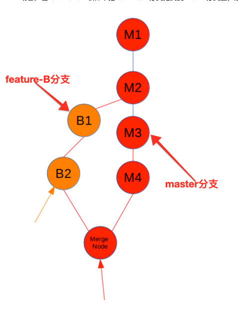

低级的分支合并，执行的操作步骤为

```
$ git checkout master
$ git merge feature-B
```

<br/>

**高级分支合并：** 使用rebase进行合并，减少分支节点。

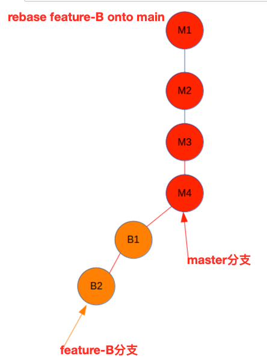

&emsp; 首先是 git rebase：把 feature-B 分支上的 B1、B2节点剥下来放到临时区，让 feature-B 分支的拿到 M3、M4 的连接信息，然后从临时区把 B1、B2 连接到 M4 后面

```
# git rebase master feature-B 命令等于下面2条命令
$ git checkout feature-B
$ git rebase master
```

&emsp; 这里可能发生冲突，若是发生冲突我们需要解决冲突。而且这个冲突是一个一个解决的，每解决一个冲突执行如下命令：

```
$ git add .
$ git rebase --continue
```


&emsp; 直到解决完冲突，此时对于 feature-B 分支来说是发生了变化，是塞入了 M3、M4；对于 master 分支来说并没有变化。不过由于 main 分支和 boxfilter 已经是一条线，可以快速合并（不会创建新节点），因此执行：

```
$ git checkout master
$ git merge feature-B

# 查看提交记录
$ git log --graph
```


<br/>
<br/>

> <h2 id='更改提交的操作'>更改提交的操作</h2>

```
/*
 * 回溯历史版本
*/ 
// 1). 先回溯到上一节feature-A分支创建之前，创建一个名为fix-B的特性分支
// 2). 要让仓库的HEAD、暂存区、当前工作树回溯到指定状态，需要用到git reset --hard命令。只要提供目标时间点的哈希值[插图]，就可以完全恢复至该时间点的状态，（哈希值输入4位以上即可）
$  git reset --hard 081b86291d34d11d8df775bf40cae04d94d6d121
```

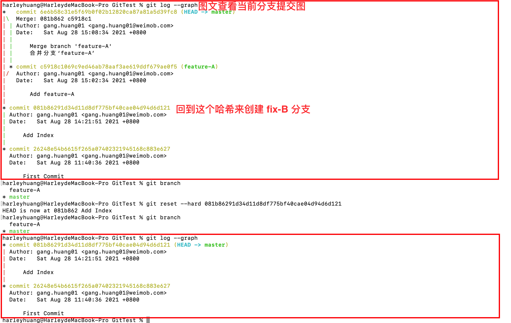

&emsp; 成功回溯到特性分支（feature-A）创建之前的状态.

<br/>

```
// 创建fix-B分支
$ git checkout -b fix-B
// 提交fix-B分支在README.md文件的改动
$  git add README.md
$  git commit -m 'Fix B'
/*
 * 查看当前仓库的操作日志,这个很重要
*/ 
// git log命令只能查看以当前状态为终点的历史日志
// 所以这里要使用git reflog命令，查看当前仓库的操作日志。在日志中找出回溯历史之前的哈希值
$  git reflog
$  git checkout master
// 将HEAD、暂存区、工作树恢复到feature-A特性分支合并后这个时间点的状态
$   git reset --hard 6e6b58c
```

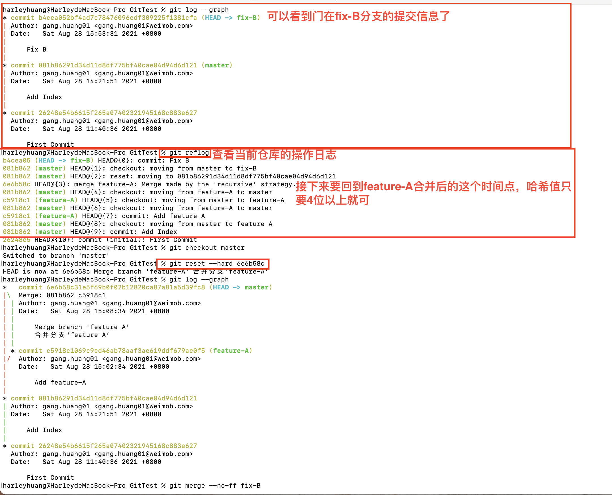

<br/>

```
/*
 * 消除冲突
*/ 
$  git merge --no-ff fix-B
// 有冲突，解决冲突后然后提交解决结果
$  git add README.md
$  git commit -m 'Fix conflict'


/*
 * 修改提交信息
*/
// 将上一条提交信息记为了"Fix conflict"，但它其实是fix-B分支的合并，解决合并时发生的冲突只是过程之一，这样标记实在不妥
// 于是，我们要修改这条提交信息
$  git commit --amend


/*
 * 压缩历史(变基操作)
*/ 
// 合并特性分支之前，如果发现已提交的内容中有些许拼写错误等，不妨提交一个修改，然后将这个修改包含到前一个提交之中，压缩成一个历史记录
$  git checkout -b feature-C
// 在feature-C分支上添加一个故意写错误的字母
// 进行添加和提交，一步做到
$  git commit -am 'Add feature-C'
// 修正拼写错误
$  git diff
$  git commit -am 'Fix typo'
// 更改历史
// 将"Fix typo"修正的内容与之前一次的提交合并，在历史记录中合并为一次完美的提交
$  git rebase -i HEAD~2
// 执行上面的命令后会打开编辑器，如下截取的一部分：

pick 5caef10 Add feature-C
pick b90ee8b Fix typo

// 将b90ee8b的Fix typo的历史记录压缩到5caef10的Addfeature-C里。按照如下修改所示，将b90ee8b左侧的pick部分删除，改写为fixup。

pick 5caef10 Add feature-C
fixup b90ee8b Fix typo

// 保存内容，关闭编辑器。会提示：Successfully rebased and updated refs/heads/feature-C. 表示成功了
// 这两个提交对象，将"Fix typo"的内容合并到了上一个提交 "Add feature-C"中，改写成了一个新的提交

// 合并至master分支
$  git checkout master
$  git merge --no-ff feature-C
```


<br/>
<br/>

> <h2 id='推送至远程仓库'>推送至远程仓库</h2>

<br/>

> <h3 id='gitremote'>git remote</h3>

&emsp; `git remote`命令就用来管理主机名，不带选项的时候`git remote`会列出所有远程主机。

```
$ git remote

origin


// 使用-v参数，可以查看远程主机地址
$ git remote -v

// 表示当前只有一个远程主机，叫做origin，以及它的地址
origin	 git@github.com:harleyGit/StudyNotes.git (fetch)
origin	 git@github.com:harleyGit/StudyNotes.git (push)

```

<br/>

&emsp; 克隆版本库的时候，Git会自动在本地分支与远程分支之间，建立一种追踪关系（tracking）。比如：在git clone的时候，所有本地分支默认与远程主机的同名分支，建立追踪关系。也就是说，本地的master分支自动"追踪"origin/master分支

&emsp; Git也允许主动建立追踪关系，如：

```
// 制定master分支追踪origin/next分支
$ git branch --set-upstream master xxxxx.baixing.jiaoyu.com origin/next
```


&emsp; 在克隆的时候，所使用的远程主机自动被Git命名为origin。如果想用其他的主机名，需要用`git clone`命令的`-o`选项指定。

```
$ git clone -o jQuery(主机名) https://www.mcyllpt.com/ github.com/jquery/jquery.git(主机网址)
```

&emsp; `git remote show`命令加上主机名，可以查看该主机的详細信息

```
$ git remote show origin
* remote origin
  Fetch URL: git@github.com:harleyGit/StudyNotes.git
  Push  URL: git@github.com:harleyGit/StudyNotes.git
  HEAD branch: master
  Remote branch:
    master tracked
  Local branch configured for 'git pull':
    master merges with remote master
  Local ref configured for 'git push':
    master pushes to master (up to date)


// git remote add命令用于添加远程主机
$ git remote add (主机名) (网址)

/*
 * 添加远程仓库
*/ 
// GitHub上创建的仓库路径为“git@github.com：用户名 /git-tutorial.git”
// 现在我们用git remote add命令将它设置成本地仓库的远程仓库
$ git remote add origin git@github.com:harleyGit/GitTest.git


// git remote rm命令用于刪除远程主机
$ git remote rm (主机名)

// git remote rename命令用于远程主机的改名
$ git remote rename (原主机名) (新主机名)
```


<br/>

> <h3 id='gitpush'>git push</h3>

&emsp; `git push`命令用于将本地分支的更新，推送到远程主机。它的格式与`git pull`命令相仿。

**格式：git push <远程主机名> <本地分支名>:<远程分支名>**

&emsp; 如果省略远程分支名，则表示将本地分支推送与之存在"追踪关系"的远程分支（通常两者同名），如果该远程分支不存在，则会被新建。

```
$ git push origin master


// 若省略本地分支名，则表示删除指定远程分支，因为这等同于推送一个空的本地分支到远程分支
$ git push origin :master
// 等同于 $ git push origin --delete master （表示删除origin主机的master分支）

// 若当前分支与远程分支之间存在追踪关系，则本地分支和远程分支都可以省略
// 表示将当前分支推送到origin主机对应的分支
$ git push origin

/*
 * 推送至远程仓库
*/
// 在本地master分支推送至远程的master分支
// 如果当前分支支多个主机存在追踪关系，則可以使用-u选项指定一个默认主机，这样后面就可以不加任何参数使用git push
// 添加了这个参数，将来运行git pull命令从远程仓库获取内容时，本地仓库的这个分支就可以直接从origin的master分支获取内容，省去了另外添加参数的麻烦
$ git push -u origin master

// 推送至master以外的分支
// 除了master分支之外，远程仓库也可以创建其他分支。举个例子，我们在本地仓库中创建feature-D分支，并将它以同名形式push至远程仓库
$ git checkout -b feature-D
// 本地仓库feature-D分支，现在将它push给远程仓库并保持分支名称不变
$ git push -u origin feature-D

/*
 * 推送到主分支
*/ 
$ git checkout master
// 建立仓库第一次推送时
$ git push -u origin master
$ 第二次及以后推送代码到远程仓库，使用如下
$ git push origin master

```


<br/>
<br/>

> <h2 id='从远程仓库获取'>从远程仓库获取</h2>

<br/>

> <h3 id='克隆版本库'>克隆版本库</h2>

```
$ git clone <版本库url地址>


/*
 * 获取远程仓库
*/ 
// 首先我们换到其他目录下，将GitHub上的仓库clone到本地
$  git clone git@github.com:harleyGit/GitTest.git
```

&emsp; 该命令会在本地主机生成一个目录，与远程主机的版本库同名。如果要指定不同的目录名，可以将目录名作为`git clone`命令的第二个参数。

```
$ git clone <版本库url地址> <本地目录名>
```

&emsp; git clone支持多种协议，除了HTPP（s）外，还支持SSH、Git、本地文件的协议，通常来说Git协议下载速度最快，SSH协议用于需要用户认证的场合。

```
// 用git branch -a命令查看当前分支的相关信息。添加 -a参数可以同时显示本地仓库和远程仓库的分支信息
$  git branch -a
```

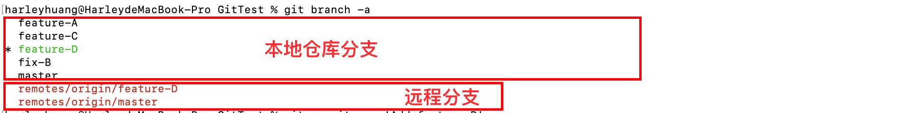


<br/>
<br/>


> <h3 id='gitfetch'>git fetch</h3>

**用法： 非常暴力的将某个远程主机的更新全部取回本地**

&emsp； `git fetch`命令通常用來查看其他人的进程，因为它取回的代码对你本地的开发代码沒有影响。默认情況下，`git fetch`取回所有分支（branch）的更新
　　
```
// 取回特定分支的更新，可以指定分支名: git fetch (远程主机名) (分支名)
// 取回origin主机的master分支
$ git fetch origin master

```


<br/>

```
// 获取远程的feature-D分支至本地
// -b参数的后面是本地仓库中新建分支的名称
// 为了便于理解，我们仍将其命名为feature-D，让它与远程仓库的对应分支保持同名。新建分支名称后面是获取来源的分支名称。
// 下面的指令中中指定了origin/feature-D，就是说以名为origin的仓库（这里指GitHub端的仓库）的feature-D分支为来源，在本地仓库中创建feature-D分支
$  git checkout -b feature-D origin/feature-D
// 向远程feature-D分支的远程仓库推送
$  git commit -am 'Add feature-D'
$  git push
```

<br/>


>  <h3 id='拉取代码'>拉取代码</h3>

&emsp; `git pull`命令的作用是，取回远程主机某个分支的更新，再与本地的指定分支合并，它的完整格式稍稍有点复杂。

&emsp; **格式: $ git pull <远程主机名> <远程分支名>:<本地分支名>**

&emsp; 如果远程主机刪除了某个分支，默认情況下，`git pull` 不会在拉取远程分支的时候，刪除对应的本地分支。这是为了防止，由于其他人操作了远程主机，导致`git pull`不知不觉刪除了本地分支。
　　
&emsp; 但是，你可以改变这种情况，加上参数 `-p` 就会在本地刪除远程已经刪除的分支。

```
$ git pull -p

// 等同于如下2条指令
// $ git fetch --prune origin
// $ git fetch -p 

// 取回origin主机的next分支，与本地的master分支合并，如下：
$ git pull origin next:master

// 若当前分支与远程分支存在追踪关系，git pull就可以省略远程分支名
// 本地当前分支对应origin主机“追踪分支”进行合并
$ git pull origin
// 若当前分支只有一个追踪分支，连远程主机名都可以省略
$ git pull


/*
 * 获取最新的远程仓库分支
*/ 
// 若远程分支是与当前分支合并，则冒号后面的部分可以省略
// 取回origin/feature-D分支，再与当前分支合并，实质上是先做git fetch，再做git merge
// $ git fetch origin ;   $ git merge origin/next
$ git pull origin feature-D
```


<br/>
<br/>


```
// 为了在开发中保持分支的整洁度，建议从远程拉代码时使用变基
$ git checkout master
$ git pull --rebase

```

&emsp; [**git pull --rebase** ](https://www.jianshu.com/p/b0a4d0c1e66f)的理解。

&emsp; `git pull`作用是将远程仓库中的更改合并到当前分支中;

&emsp; 默认模式下 相当于 git fetch + git merge FETCH_HEAD 命令;

&emsp; 更准确的说是，git pull 相当于: 先执行git fetch + 指定参数，然后执行git merge 命令将检索到的分支合并到当前分支。

<br/><br/><br/>


> <h2 id='忽略文件配置'>忽略文件配置</h2>

[OC忽略文件配置](https://github.com/github/gitignore/blob/main/Objective-C.gitignore)

[Swift忽略文件配置](https://github.com/github/gitignore/blob/main/Swift.gitignore)

```
# .ignore不起作用解决方案
# git rm -r --cached .
# git add .
# git commit -m "update .ignore"


# iOS 忽略文件
.DS_Store
*~
*.xcworkspace
xcuserdata
build
bundle
**/xcdebugger/Breakpoints_v2.xcbkptlist
*.xcuserstate
DerivedData
#CocoaPods
Pods
*.lock
#**/project.pbxproj


# Flutter忽略文件
# Miscellaneous
*.class
*.log
*.pyc
*.swp
.DS_Store
.atom/
.buildlog/
.history
.svn/
# IntelliJ related
*.iml
*.ipr
*.iws
.idea/
# Visual Studio Code related
.vscode/
# Flutter/Dart/Pub related
**/doc/api/
.dart_tool/
.flutter-plugins
.flutter-plugins-dependencies
.packages
.pub-cache/
.pub/
/build/
# Android related
**/android/**/gradle-wrapper.jar
**/android/.gradle
**/android/captures/
**/android/gradlew
**/android/gradlew.bat
**/android/local.properties
**/android/**/GeneratedPluginRegistrant.*
# iOS/XCode related
**/ios/**/*.mode1v3
**/ios/**/*.mode2v3
**/ios/**/*.moved-aside
**/ios/**/*.pbxuser
**/ios/**/*.perspectivev3
**/ios/**/*sync/
**/ios/**/.sconsign.dblite
**/ios/**/.tags*
**/ios/**/.vagrant/
**/ios/**/DerivedData/
**/ios/**/Icon?
**/ios/**/Pods/
**/ios/**/.symlinks/
**/ios/**/profile
**/ios/**/xcuserdata
**/ios/.generated/
**/ios/Flutter/App.framework
**/ios/Flutter/Flutter.framework
**/ios/Flutter/Generated.xcconfig
**/ios/Flutter/app.flx
**/ios/Flutter/app.zip
**/ios/Flutter/flutter_assets/
**/ios/Flutter/flutter_export_environment.sh
**/ios/ServiceDefinitions.json
**/ios/Runner/GeneratedPluginRegistrant.*
# Web related
**/web/**/lib/generated_plugin_registrant.dart
# Service account files
svc-keyfile.json
# Exceptions to above rules.
!**/ios/**/default.mode1v3
!**/ios/**/default.mode2v3
!**/ios/**/default.pbxuser
!**/ios/**/default.perspectivev3
!/packages/flutter_tools/test/data/dart_dependencies_test/**/.packages
**/ios/Flutter/.last_build_id


#RN忽略
yarn.lock


# Egret游戏 忽略文件
/Lobby/bin-release
/Lobby/bin-debug
/Lobby/node_modules
/Lobby/template
/Lobby/exml.e.d.ts
/Lobby/native_require.js
/.idea/
/Lobby/template/runtime/native_require.js
/Lobby/index.html


jsconfig.json


# If you prefer the allow list template instead of the deny list, see community template:
# https://github.com/github/gitignore/blob/main/community/Golang/Go.AllowList.gitignore
#
# Binaries for programs and plugins
*.exe
*.exe~
*.dll
*.so
*.dylib

# Test binary, built with `go test -c`
*.test

# Output of the go coverage tool, specifically when used with LiteIDE
*.out

# Dependency directories (remove the comment below to include it)
# vendor/

# Go workspace file
go.work


#Android项目忽略：https://blog.csdn.net/EthanCo/article/details/127285825
.gradle
/local.properties
/.idea/caches
/.idea/libraries
/.idea/modules.xml
/.idea/workspace.xml
/.idea/navEditor.xml
/.idea/assetWizardSettings.xml
.DS_Store
/build
/captures
.cxx
/.idea

# Built application files
*.apk
*.aar
*.ap_
*.aab

# Files for the ART/Dalvik VM
*.dex

# Java class files
*.class

# Generated files
bin/
gen/
out/
#  Uncomment the following line in case you need and you don't have the release build type files in your app
# release/

# Gradle files
.gradle/
build/

# Local configuration file (sdk path, etc)
local.properties

# Proguard folder generated by Eclipse
proguard/

# Log Files
*.log

# Android Studio Navigation editor temp files
.navigation/

# Android Studio captures folder
captures/

# IntelliJ
*.iml
.idea/workspace.xml
.idea/tasks.xml
.idea/gradle.xml
.idea/assetWizardSettings.xml
.idea/dictionaries
.idea/libraries
# Android Studio 3 in .gitignore file.
.idea/caches
.idea/modules.xml
# Comment next line if keeping position of elements in Navigation Editor is relevant for you
.idea/navEditor.xml

# Keystore files
# Uncomment the following lines if you do not want to check your keystore files in.
#*.jks
#*.keystore

# External native build folder generated in Android Studio 2.2 and later
.externalNativeBuild
.cxx/

# Google Services (e.g. APIs or Firebase)
# google-services.json

# Freeline
freeline.py
freeline/
freeline_project_description.json

# fastlane
fastlane/report.xml
fastlane/Preview.html
fastlane/screenshots
fastlane/test_output
fastlane/readme.md

# Version control
vcs.xml

# lint
lint/intermediates/
lint/generated/
lint/outputs/
lint/tmp/
# lint/reports/

# Android Profiling
*.hprof

```


<br/>

- **iOS文件意义:**

<br/>

- **不能忽略:** [**/project.pbxproj](https://www.kancloud.cn/melissashu/ios/524100): 这个文件不能忽略,因为这个文件是用来描述iOS项目中文件结构和配置的,找不到就会打不开项目.若想使项目能运行,只能一步一步的配置,之前吃过大亏

<br/>

- **忽略:** *.xcuserdata和project.xcworkspace :和用户有关的何以忽略

<br/>

**忽略:** .xcuserstate

&emsp; xcuserstate文件是从Xcode中生成的，并保存在你的项目包中，以记住你最后打开的文件，任何组文件夹的打开状态，打开的选项卡，以及任何其他你的项目可能需要记住的用户设置。出于修订控制的目的，您应该忽略它们，或者尽可能将它们去掉。

- **比如:**
	- UserInterfaceState.xcuserstate是Xcode中保存的用户操作的GUI状态，如窗口位置，打开的标签页，在项目检查等展开的节点、 简单地调整大小的Xcode窗口将这个文件来改变和修改您的源代码控制系统进行标记。


<br/>

**忽略:** **/xcdebugger/Breakpoints_v2.xcbkptlist: 断点文件忽略配置;


<br/>

**忽略:** [DerivedData:](https://www.cnblogs.com/zhanggui/p/11171642.html)Derived Data是一个文件夹，它默认情况下位于：~/Library/Developer/Xcode/DerivedData。它是Xcode存储各种中间构建结果、生成索引等的位置。

&emsp; 清理该文件夹有个小缺点：清理之后构建首次构建项目的时候可能会增加构建时间。但是这不影响正常使用。而且还可以回收更多自由的空间内存。

<br/><br/><br/>

问题: UserInterfaceState.xcuserstate 文件添加进忽略文件,还是无法消除.

<br/>

&emsp; 提交的时候出现UserInterfaceState.xcuserstate文件，那就是git忽略文件的问题，检查项目中是否存在.gitignore文件，发现项目目录下是没有这个文件的，那就创建.gitignore文件，把需要忽略的文件后缀添加进去，然后提交。

```
// *.xcuserstate
// UserInterfaceState.xcuserstate

// cd 到项目目录下
ls -la //查看项目所有文件（包括隐藏文件）
// 如果没有.gitignore文件，执行以下命令，然后在编辑.gitignore文件，把要忽略的文件类型添加进去
// 如果存在则看文件中是否包含要忽略的UserInterface.xcuserstate文件类型，没有则添加进去，保存
vim .gitignore

git status
//如果会出现一个 modified（修改）: xxxx/UserInterfaceState.xcuserstate 的地址，如果没有跳过这一步
// 如果有必须执行这一步，删除git 仓库中xxxx/UserInterfaceState.xcuserstate缓存文件
// 否则提交还是会有.xcuserstate文件
git rm --cached  xxxx/UserInterfaceState.xcuserstate

git add . 
git commit -m '忽略UserInterface.xcuserstate文件类型提交'
git pull 
git push
```


<br/><br/><br/>

***
<br/>

> <h1 id='工作流指令'>工作流指令</h1>

<br/>


<br/><br/><br/>

> <h2 id=".stCommitMsg设置提交内容模版">.stCommitMsg设置提交内容模版</h2>

**.stCommitMsg** 是Mac用户目录下的一个隐藏文件夹，在里面可以设置提交内容模版，如下：

```

【Feature】

【Add】

【Optimize】

【Bugfix】

【Bever-Bugfix-BP-xxxx】
【产生原因】
【解决方案】
【影响范围】该bug 
【缺陷分析】基本场景漏测
```


> <h2 id='新功能分支'>新功能分支</h2>


```
///从dev建立特性分支
(dev)$: git checkout -b feature/xxx   

///开发        
(feature/xxx)$: blabla                         
(feature/xxx)$: git add xxx
(feature/xxx)$: git commit -m 'commit comment'

///把特性分支合并到dev
(dev)$: git merge feature/xxx --no-ff          
```

<br/>
<br/>

> <h2 id='修复紧急bug'>修复紧急bug</h2>


```
///从master建立hotfix分支
(master)$: git checkout -b hotfix/xxx   

///开发      
(hotfix/xxx)$: blabla                        
(hotfix/xxx)$: git add xxx
(hotfix/xxx)$: git commit -m 'commit comment'

/// 把hotfix分支合并到master，并上线到生产环境
(master)$: git merge hotfix/xxx --no-ff  

///把hotfix分支合并到dev，同步代码     
(dev)$: git merge hotfix/xxx --no-ff        
```


<br/>
<br/>

> <h2 id='dev合并到release'>dev合并到release</h2>

```
///把dev分支合并到release，然后在测试环境拉取并测试
(release)$: git merge dev --no-ff             
```


<br/>
<br/>

> <h2 id='版本打Tag'>版本打Tag</h2>


```
///把testing测试好的代码合并到master，运维人员操作
(master)$: git merge testing --no-ff   

///给版本命名，打Tag       
(master)$: git tag -a v0.1 -m '部署包版本名' 
```

<br/>

***
<br/>

> <h1 id='SourceTree工作流'>SourceTree工作流</h1>


<br/>

> <h2 id='新建分支'>新建分支</h2>


**1⃣️创建了Develop分支，如下：**


<br/>


- **`2⃣️在develop 分支建立 release分支`**


<br/>
<br/>

**`Demo: 创建功能开发分支feature/Harley`**


效果：


<br/>
<br/>


> <h2 id='远程检出分支'>**`远程检出分支`**</h2>


效果图：


<br/>
<br/>


> <h2 id='删除分支'>删除分支</h2>

**`删除远程分支`**


&emsp;  这是删除远程的分支，本地分支还没有删除，需要进行下一步删除本地分支。

<br/>


**`删除本地分支`**


<br/>
<br/>


> <h2 id='拉取'>拉取</h2>

&emsp; `master`分支的内容是最新的，`feature/Harley的分支`版本落后于master，从远程拉取内容合并到`feature/Harley的分支`上，如下图步骤：


<br/>
<br/>


> <h2 id='合并分支'>合并分支</h2>


**`第一种方法`**


<br/>

**`第二种方法`**


<br/>
<br/>


> <h2 id='代码回滚'>代码回滚</h2>


**适用于的场景：**
- 提交错代码，想放弃刚刚提交的部分；
- 代码发生冲突，处理比较麻烦，为了代码安全，直接回滚到之前干净的代码。

**回滚分为`本地回滚`和`远程回滚`;**

<br/>

**`本地回滚`**，回滚已经提交的代码，但还未推送到远程仓库。


**使用模式：**
- `软合并：`保留上第二次提交的修改内容，就等第二次提交的【概述】了。
- `混合合并：`保留上第二次提交的修改内容，就等第二次提交的【概述】了(与软合并没啥区别)。
- `强行合并：`清除第二次提交的所有内容，第一次提交的【概述】也没有了，好像刚刚第一次的提交。

效果图：


<br/>

> <h2 id='远程回滚'>**`远程回滚`**</h2>


&emsp;  `SourceTree`默认是不提供这种操作的，因为存在风险。所以，回滚远程代码，一定要注意：
①. 想要放弃的代码，是所有开发成员都一致同意的；
②. 想要放弃的代码只是自己的，中间没有别人的提交记录，这可以直接回滚。
③. 这个操作过程中，提醒其他成员不要推送代码。

- Frist Stemp


- Second Stemp


- Third Stemp


效果图：


<br/>
<br/>


> <h2 id='变基'>变基</h2>


**作用：**
- 变基到其他分支，不会生成新的提交节点；
- 压缩提交消息；

<br/>

**`①变基到其他分支`**将Harley 分支内容接到 develop


注意：在这里，`先要拉取，再推送`，否则会失败,下面是`推送，如下：`


<br/>
<br/>


> <h2 id='打Tag'>打Tag</h2>


**功能:**
-  轻量级的：它其实是一个独立的分支,或者说是一个不可变的分支.指向特定提交对象的引用;
-  带附注的：实际上是存储在仓库中的一个独立对象，它有自身的校验和信息，包含着标签的名字，标签说明，标签本身也允许使用 GNU Privacy Guard (GPG) 来签署或验证,电子邮件地址和日期，一般我们都建议使用含附注型的标签，以便保留相关信息。


也可以像下图那样打标签🏷️那样：


[Tag 的使用](https://www.jianshu.com/p/1bc7c948d019)请看这里。

- **`Tag 和 branch 的区别`:**
	-  tag 对应某次 commit, 是一个点，是不可移动的;
	-  branch 对应一系列 commit，是很多点连成的一根线，有一个HEAD 指针，是可以依靠 HEAD 指针移动的。

&emsp;  所以，两者的区别决定了使用方式，改动代码用 branch ,不改动只查看用 tag。

&emsp;  tag 和 branch 的相互配合使用，有时候起到非常方便的效果，例如 已经发布了 v1.0 v2.0 v3.0 三个版本，这个时候，我突然想不改现有代码的前提下，在 v2.0 的基础上加个新功能，作为 v4.0 发布。就可以 检出 v2.0 的代码作为一个 branch ，然后作为开发分支。


<br/>

***
<br/>


># <h1 id='分支种类'>[分支种类](https://juejin.cn/post/6844903634006720526)</h1>


**`master 分支:`** 
-   用于部署生产环境的分支，要确保master分支稳定性；
-   一般由`develop`、`release` 以及`hotfix`分支合并，任何时间都不能直接修改代码;


**`develop 开发分支:`**
-  开发分支，始终保持最新完成以及bug修复后的代码;
-  一般开发的新功能时，`feature` 分支都是基于 `develop` 分支下创建的;

**`feature 功能分支:`** 
-  开发新功能时，`以develop` 为基础创建 `feature` 分支
-  分支命名: `feature/` 开头的为特性分支， 命名规则: `feature/user_module、 feature/cart_module`;

**`release 发布分支:`**  
 -  发布分支为预上线分支，发布提测阶段；

&emsp;  当有一组`feature`开发完成，首先会合并到`develop`分支，进入提测时，会创建`release`分支。如果测试过程中若存在bug需要修复，则直接由开发者在release分支修复并提交。

&emsp;  当测试完成之后，合并`release`分支到`master`和`develop`分支，此时`master`为最新代码，用作上线。


**`hotfix 补丁分支: `**
- 分支命名: hotfix/ 开头的为修复分支，它的命名规则与 feature 分支类似;
- 线上出现紧急问题时，需要及时修复，以master分支为基线，创建hotfix分支，修复完成后，需要合并到master分支和develop分支;

**`version1.0 版本标签分支:`**  

&emsp;  Branch是GitFolw的核心。主要分为两大类 Main Branchs 和 Supporting branches, 其中 Main Branchs 中又包含了 Master 和 Develop，而 Supporting branches 中包含了 Feature 、Release、Hotfix 以及其他自定义分支。

<br/>
**`Master`**
描述：
&emsp;  master分支上存放的是最稳定的正式版的代码，并且该分支的代码应该是随时可在开发环境中使用的代码（Production Ready state）。当一个版本开发完毕后，产生了一份新的稳定的可供发布的代码时，master分支上的代码要被更新，同时，每一次更新，都需要在master上打上对应的版本号(tag)。

生成及销毁：
&emsp; 任何人不允许在master上进行代码的直接提交，只接受合入，Master上的代码必须是要从经过多轮测试且已经发布一段时间(根据DAU以及项目实际情况来定，个人建议K歌国际版可以定为一周)且线上已经稳定的 release 分支合并进去，然后在Master 上生成tag(通常就是对应的版本号)


<br/>


**`Develop`**

描述：
&emsp;  develop分支是保存当前最新版本开发成果的分支。该分支上的代码允许有BUG，但是必须保证编译通过，且该分支可以作为每天夜间测试的分支(如果有夜间测试的话)所以该分支也叫做Nightly build。当develop分支上的代码已实现了软件需求说明书中所有的功能(必须经过开发自测，但是不必经过QA)且相对稳定时候，就可以基于此分支来拉出新的release分支交付QA进行测试。


生成及销毁:
&emsp;  Develop分支是由一个人(通常是Team Leader)从Master中拉出，任何人不得在Develop上进行代码提交，只接受合入。Develop上所有代码一定都是由 Supporting branches 中的Branch合并进来，且合入Develop的分支必须保证功能完整，可以独立运行，可允许包含一些BUG(但是最好经过自测，不要有太大或者太明显的BUG，比如一启动就crash之类的)。


<br/>


**`Feature`**

描述：
&emsp;  Feature分支通常叫做功能分支，也可以叫做个人分支，一般命名为 feature/XXXX,该分支就是每一个开发人员进行开发的分支，比如做一些功能、需求之类的东西，这个分支上的代码变更最终合并回develop分支或者干脆被抛弃掉（例如实验性且效果不好的代码变更）。一般而言，feature分支代码可以保存在开发者自己的代码库中而不强制提交到主代码库里。


生成及销毁:
&emsp;  每个开发者从通常会Develop分支中拉取自己的feature，且开发者可以随意的在自己的feature上进行操作 包括但不限于 提交、回滚、删除。如果最终需要合并入develop那就要保证功能的完整性以及代码的稳定新，比如我在feature上做了3个需求但是由于时间关系我只做了两个，那也可以将feature合并入develop，然后剩下的那一个需求等有时间了再去feature上做完之后再合入develop。所以这里说的功能的完整性并不是值得要做完所有的功能，而是要保证你所要做的所有需求中的某一个或者某几个功能已经做完，不允许把做到一半的功合并入develop。合并入develop尽量上删除远端的feature分支，本地的feature可以视情况而取舍。


<br/>

**`Release`**

描述：
&emsp;  Release分支通常叫做发布分支，也可以叫做测试-发布分支，一般命名为 Release/1.2.3（后面是版本号）,该分支是为测试-发布新的产品版本而开辟的。因为包含测试流程，所以在这个分支上的代码允许做小的缺陷修正、准备发布版本所需的各项说明信息（版本号、发布时间、编译时间等等）。通过在release分支上进行这些工作可以让develop分支空闲出来以接受新的feature分支上的代码提交，进入新的软件开发迭代周期。注意：该分支上的代码一定是可编译可运行的，允许包含小BUG


生成及销毁:
&emsp;  当develop分支上的代码已经包含了该版本所有即将发布的功能和需求，并且已通过自测且已基本稳定，我们就可以考虑准备基于develop拉取release分支了。而所有在当前即将发布的版本之外的业务需求一定要确保不能混到release分支之内（避免由此引入一些不可控的系统缺陷）。成功的派生了release分支之后，develop分支就可以为“下一个版本”服务了。所谓的“下一个版本”是在当前即将发布的版本之后发布的版本。开发人员可以在此分支上修改BUG，进行提交、回滚等操作，但是与feature不同的是release分支是被多人操作的，不像feature，所以一定要小心避免冲突。当现在QA测试没有问题，便从release上发布上线，且经过一段时间的验证没有问题后合入master，并且删除release分支，其实根据release分支的特性我们可以使用Git Hook触发软件自动测试以及生产环境代码的自动更新工作。这些自动化操作将有利于减少新代码发布之后的一些事务性工作。


<br/>


**`Hotfix`**

描述：
&emsp;  Hotfix叫热修复分支，除了是计划外创建的以外，hotfix分支与release分支十分相似，当已经发布的版本（Master上代码）遇到了异常情况或者发现了严重到必须立即修复的软件缺陷的时候，就需要从master分支上指定的tag版本拉取hotfix分支来组织代码的紧急修复工作。这样做的显而易见的好处是不会打断正在进行的develop分支的开发工作，能够让团队中负责新功能开发的人与负责代码紧急修复的人并行、独立的开展工作。


生成及销毁:
&emsp;  由Master上拉取，进行修复，负责修改BUG的同事可以进行提交及其它操作，后续的热修复测试也在此分支上进行。通过测试验证没问题后有一个人(通常为teamleader)合并入Master分支，且同时也要合并入Develop分支。


<br/>

***
<br/>


> <h1 id='Git安装'>Git安装</h1>

查看电脑是否安装Git，终端输入：

```
git
```

安装过则会输出：


<br/>
<br/>

**`创建ssh key、配置git`**

**`①. 设置username和email（github每次commit都会记录他们）`**

```
//用户名
git config --global user.name "Harley"

//邮箱
git config --global user.email "harley@qq.com"
```

<br/>

**`②. 终端命令创建ssh key`**

```

ssh-keygen -t rsa -C "harelysoa@qq.com" 

Generating public/private rsa key pair.

Enter file in which to save the key (/Users/harleyhuang/.ssh/id_rsa): 

```

创建过的，这里我选**n**，没有创建过的，会要求确认路径和输入密码，我们这使用默认的一路回车就行。成功的话会在**~/**下生成.ssh文件夹，进去，打开id_rsa.pub，复制里面的key

```

Created directory '/Users/harleyhuang/.ssh'.

Enter passphrase (empty for no passphrase): 

Enter same passphrase again: 

```

要求输入管理员密码，然后会提示：


复制：`/Users/harleyhuang/.ssh/id_rsa.pub.` 获取公钥，打开` Finder`，组合键祭起： `Command + shift +G`，然后粘贴。打开` id_rsa.pub` 文件，复制里面的全部内容。

登录[GitHub]([https://github.com/settings/keys](https://github.com/settings/keys)),配置公钥：


填写：


完成后终端输入：

```
ssh -T git@github.com 
```

终端输出：

```

The authenticity of host 'github.com (52.74.223.119)' can't be established.

RSA key fingerprint is SHA256:nThbg6kXUpJWGl7E1IGOCspRomTxdCARLviKw6E5SY8.

Are you sure you want to continue connecting (yes/no)? 
```
输入：yes

终端输出：

```
Warning: Permanently added 'github.com,52.74.223.119' (RSA) to the list of known hosts.

Enter passphrase for key '/Users/harleyhuang/.ssh/id_rsa': 

```
输入管理员密码，然后回车,终端输出：

```

Hi harleyGit! You've successfully authenticated, but GitHub does not provide shell access.
```

Git 安装完成!


<br/><br/>

> <h2 id='github使用token作为密码'>github使用token作为密码</h2>

当使用github的登录密码进行登录的时候发现无法登录,会在终端出现如下错误提示:

```
remote: Support for password authentication was removed on August 13, 2021.
remote: Please see https://docs.github.com/en/get-started/getting-started-with-git/about-remote-repositories#cloning-with-https-urls for information on currently recommended modes of authentication.
fatal: Authentication failed for 'https://github.com/harleyGit/MLC.git/'
```

这是因为github为了安全,使用token值来作为密码,这个步骤设置如下:

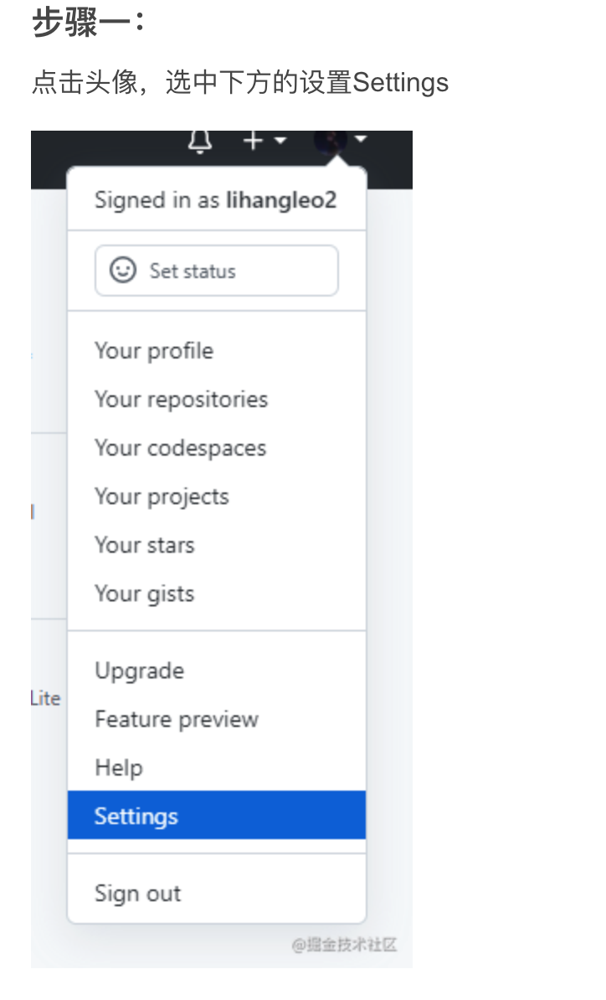

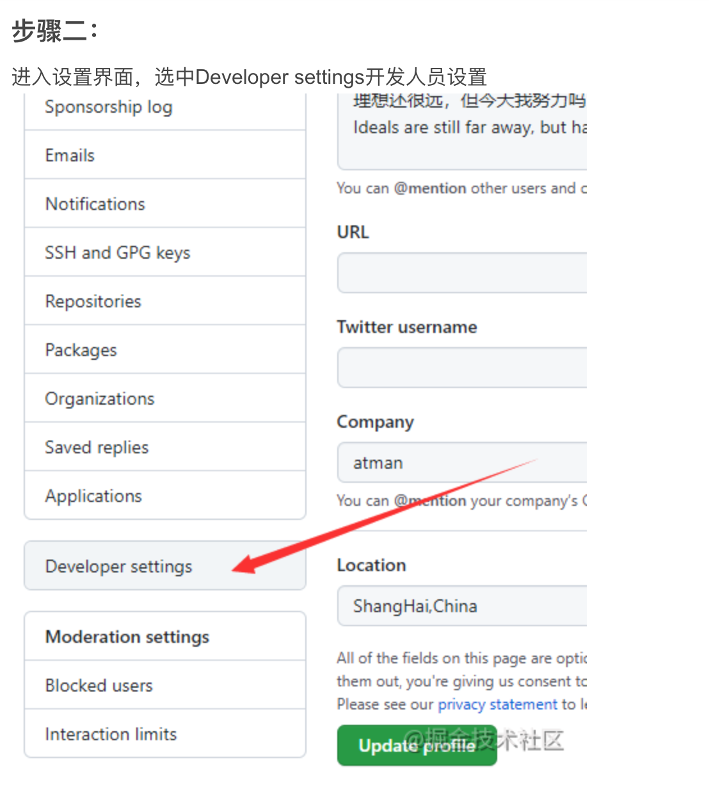


<br/>

**步骤四：**

&emsp; 点击进入之后，会出现如下界面。这里Note里填写的就是要为这个账户名建立token。Expiration意思就是这个token的生效期，这里可以随便选择，为自己建可以选择无限制。然后下面的一大框，指的是此token用户拥有的权限，当然你可以全部选择。我选择了：

```
repo
admin:public_key
admin:repo_hook
delete_repo
```


<br/>

**步骤五：**

&emsp; 选完之后拉到下面，点击按钮Generate token。之后会生成一段字符串，复制下来，放在你的笔记本上，一定要记住哦。不然又得重新生成了。之后上传代码到github就可以用了。

```
Username for 'https://github.com': harleyGit
Password for 'https://harleyGit@github.com':  复制的token值

```


<br/>

***
<br/>

> <h1 id='Gitee配置'>Gitee配置</h1>
**`问题：这是一个无效的源路径URL`**

原因：在[**码云**]()没有配置公钥导致的，只要配置公钥即可解决这个问题，亲测！

```

//打开终端，输入：
$ ssh-keygen -t rsa -C "自己的邮箱号.com"
//回车
Generating public/private rsa key pair.
Enter file in which to save the key (/Users/用户名/.ssh/id_rsa): 
//遇到上面的代码，不要管，再点击回车
/Users/用户名/.ssh/id_rsa already exists.
Overwrite (y/n)?
//这个文件已存在，是否覆盖？输入：n 即可
n
//拷贝终端的文件路径：/Users/用户名/.ssh
//打开 Finder，Command + shift +G，用文本编辑打开 id_rsa.pub 这个文件
//复制里面的公钥；

```

前往[码云]()，打开设置，找到如下界面进行粘贴即可！


[远程仓库以及代码管理工具使用](https://www.jianshu.com/p/3685cbf9ab47)


<br/>

***
<br/>

># <h1 id="GitBoo">[GitBoo](https://www.gitbook.com)</h1>


- **安装Node.js**

在[这里](https://nodejs.org/en/)下载[Node.js](https://nodejs.org/en/),进入下载页面后下载**`Current 区域稳定版`**。


- 点击下载的安装包

- 在终端输入

```
 npm -v
6.14.4
node -v
v13.12.0

```

说明安装成功。

<br/>

- **安装GitBook**

[GitBook 安装步骤](https://www.jianshu.com/p/421cc442f06c)

[sss](https://www.jianshu.com/p/421cc442f06c)


<br/>

***
<br/>

># <h1 id="错误解决">错误解决</h2>


<br/>
> <h2 id='tokeninstead'>please used a personal access token instead</h2>

&emsp; 提交代码会发现如下问题：

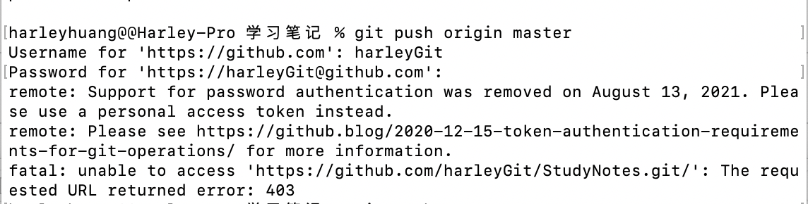

&emsp; 这是因为GitHub为了安全，使用token替代了密码，你需要重新设置，这项规定是从2021.8.13日开始的。下面按照步骤来就可以解决了：


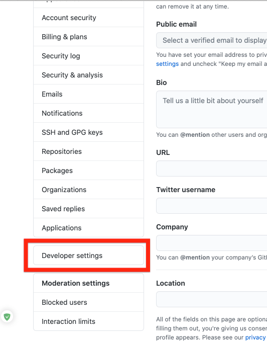

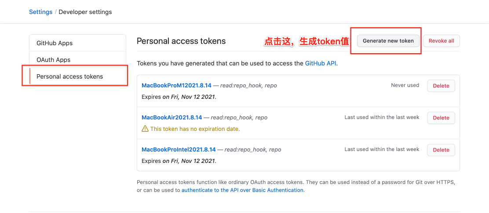

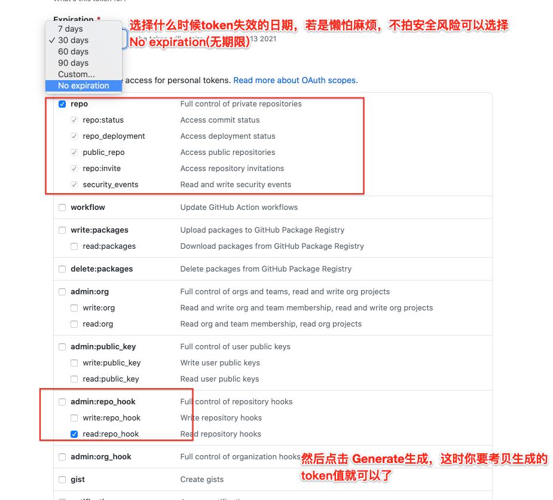

打开Mac上的KeyChain应用，然后按照下面步骤来：

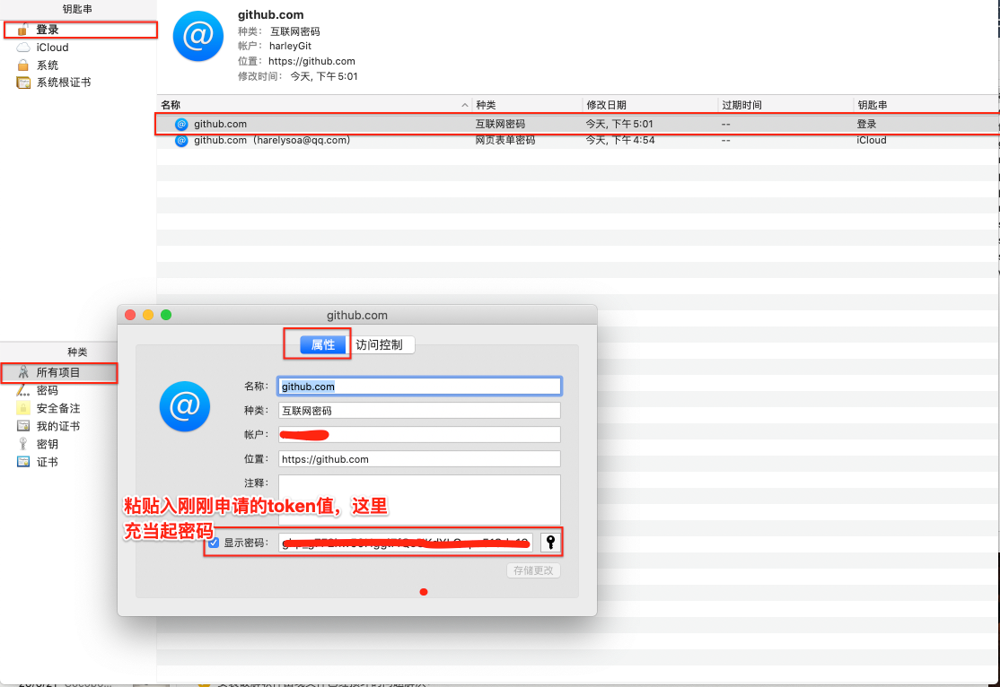

然后，你在终端输入你的提交代码命令

```
$ git push origin master
$ （提示）输入你的git用户名：
$ 输入用户名
$ (提示)输入你的Git密码：
$ 输入token值(这时不要输入Git密码，而是要输入刚刚拷贝的token值就可以了)
```


<br/>
<br/>


># <h2 id="LibreSSLSSL_connect443">LibreSSL SSL_connect：443</h2>

**`LibreSSL SSL_connect: SSL_ERROR_SYSCALL in connection to github.com:443`**

```
//查看git配置
git config --global --list  

// 发现其中有 http.https.XXXXXX.proxy 和 https.https.XXXXXX.proxy配置

//删除代理配置， 运行后，git恢复正常。
git config --global --unset http.https://github.com.proxy
git config --global --unset https.https://github.com.proxy


//
 git config --global --unset http.proxy
 git config --global --unset https.proxy
 
 networksetup -setv6off Wi-Fi

```


<br/>
<br/>

> <h2 id='游离态Head解决'>游离态Head解决</h2>

**detached HEAD(游离态的HEAD) 切换到其他分支，导致代码丢失**

 
**`HEAD  基础`**

>  git checkout 命令实际上是指修改HEAD文件的内容，让其指向不同的branch。

HEAD文件指向的branch就是当前branch 。 

一般来讲，HEAD的内容是指向staging（暂存区）的master文件的。

 ```
  ref: refs/heads/master
 ```

**` detached HEAD`**
如果让HEAD文件指向一个commit id(对一个HEAD进行一次代码或文件提交)，那就变成了detached HEAD。git checkout 可以达到这个效果，用下面的命令：

```
//laea8d9是最近的一次commit id，^指的是之前一次，因此上面的操作结果是让HEAD文件包含了倒数第二次提交的id.
git checkout 1aea8d9^
```
 
<br/> 
<br/>     
   
**问题解决**
 


`解决办法：`

① 查找提交记录

```
$ git reflog
```


② 检出需要的提交记录

```
$ git checkout 408b379
```

③ 创建develop 分支，并切换到该develop 分支 

```
$ git checkout -b develop
```


⑤ git checkout master 切换到master分支 

```
 $ git checkout master
```

⑥git merge develop 合并develop分支

```
$ git merge develop
```


