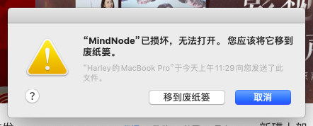

> <h1 id=''></h1>
> [**快捷键**](#快捷键)
- [**DNS**](#DNS)
	- [DNS缓存清除](#DNS缓存清除)
- [**下载**](#下载)
- [**修改管理员UserName和Password**](#修改管理员UserName和Password)
- [**Mac问题解决**](#Mac问题解决)
	- [Mac蓝牙不可用](#Mac蓝牙不可用)
	- [Mac清理内存](#Mac清理内存)
	- [可删除的文件](#可删除的文件)
	- [破解软件无法安装](#破解软件无法安装)

<br/>

***
<br/>


> <h1 id='快捷键'>快捷键</h1>

- **锁屏：** `Command+Control+Q`
- **关机终端命令：** `sudo halt` 或者 `sudo shutdown -h now`
- **重启终端命令:** `sudo reboot` 或者 `sudo shutdown -r now`
- **休眠终端命令：** `sudo shutdown -s now`
- [x] **Finder显示隐藏文件:** `Command + shift + “ . ”`


<br/>

***
<br/>


># <h1 id = "DNS">[DNS](https://zhuanlan.zhihu.com/p/28273783)</h1>

- 域名劫持特征

一些小服务商以及小地方的服务商非常喜欢干这个事情。根据腾讯给出的数据，DNS劫持率7%，恶意劫持率2%。网速给的劫持率是10-15%。

- 把你的域名解析到竞争对手那里，然后哭死都不知道，为什么流量下降了。
- 在你的代码当中，插入广告或者追踪代码。这就是为什么在淘宝或者百度搜索一下东西，很快就有人联系你。
- 下载APK文件的时候，替换你的文件，下载一个其他应用或者山寨应用。
- 打开一个页面，先跳转到广告联盟，然后跳转到这个页面。无缘无故多花广告钱，以及对运营的误导。


<br/>

- <h2 id = "DNS缓存清除">DNS缓存清除</h2>

`sudo killall -HUP mDNSResponder`

<br/>

- 查看当前dns

`nslookup domain`

<br/>

- Mac的DNS服务IP配置


<br/>

***
<br/>

># <h1 id = "下载">下载</h1>

- 安装任何应用配置

1️⃣ 打开终端；

2️⃣输入：`sudo spctl --master-disable`；

3️⃣根据提示输入管理员的密码；

4️⃣【系统偏好设置】->【安全与隐私】->【通用】->【允许从以下位置下载的应用】。

<br/>

下载后即可安装应用了。


<br/>

- **下载资源**

1⃣️ 切换到下载路径

`cd /Users/harleyhuang/Desktop`

2⃣️ 资源下载

下载一首`十年.mp3`

`curl -o 十年.mp3 ‘http://ev.sycdn.kuwo.cn/29ab24ac0a6f70c790a234422e377a29/60813d14/resource/n3/11/0/2695339732.mp3'`


<br/>

- 软件安装

使用 brew 安装软件

`brew install wget `

使用 brew 卸载软件

`brew uninstall wget `

使用 brew 查询软件

`brew search /wge*/ `

其他brew命令

```
brew list           列出已安装的软件 
brew update     更新brew 
brew home       用浏览器打开brew的官方网站 
brew info         显示软件信息 
brew deps        显示包依赖
```


<br/>

***
<br/>

># <h1 id='修改管理员UserName和Password'>修改管理员 UserName 和 Password</h1>

1️⃣重启iMac、Mac Air、Mac Pro；

2️⃣当听到电脑启动声音时，按下组合键：Command + S；

3️⃣当看到好像进入终端时，松开组合键；

4️⃣输入：`sbin/mount -uaw`;

5️⃣输入：`rm /var/db/.AppleSetupDone`,此时注意：rm 和后面的字符串一个空格；

6️⃣再次输入：reboot，对电脑进行重启即可；

7️⃣重启后，跟当初才激活电脑一样，根据激活配置，一步一步重新对其进行配置，在此过程中会要求我们重新创建一个管理员账号。


<br/>

***
<br/>


># <h1 id='Mac问题解决'>Mac问题解决</h1>


<br/>

> <h2 id='Mac蓝牙不可'>**Mac蓝牙不可用**</h2>


`①  拔出与Mac连接的设备线；  `<br/>
`② 关机;  `<br/>
`③ 同时按下shift+control+option+power,保持5秒左右；`<br/>
`④  先按下power键，紧接着同时按下option+command+p+r,等待   mac发出4声Duang~的声音后松手，系统会自动开机；`
`⑤  蓝牙菜单恢复正常；`<br/>


<br/>
<br/>

> <h2 id='Mac清理内存'>Mac清理内存</h2>


**`查看文件夹内的内存占用情况`**

&emsp;  使用下面命令系统就会自动统计该目录下所有文件的占用情况，一般等待一两分钟后就能得到结果了。若是想分析其它位置，你需要首先键入cd /文件夹路径移驾，然后再次运行`sudo du -sh *`开始扫描。

```
sudo du -sh *
```

<br/>

&emsp;   查看Mac内文件所占的Size，然后用`Command + shift + G`粘贴地址到(`/Users/用户名/Library/其他文件夹目录`)所在大文件夹。

```
$ du -hd 5 |grep -n '\dG' |sort
```

<br/>
<br/>

> <h2 id='可删除的文件'>可删除的文件</h2>

```
//该目录下的内容是Xcode在编译过程中产生的中间件，并且文件还特别大，在编译完成后能够被删除
~/Library/Developer/Xcode/DerivedData


//该目录下的内容是Xcode在做模拟器调试时生成的模拟器的数据，如果模拟器不再使用也可以删除
~/Library/Developer/CoreSimulator/Devices/
```
[Xcode 空间的清理](https://www.jianshu.com/p/7b39a31c312d)

[清理内存空间](https://www.jianshu.com/p/8fac91ff3453)

[手动清理内存](https://www.jianshu.com/p/41c736860925)

<br/>

**`删除所有系统日志——可以节省出100MB-2GB硬盘空间`**

&emsp;  随着你使用Mac的时间越来越长，系统日志文件也会越来越多，根据电脑的用量、错误和服务，这些文件会越来越多。这些系统日志文件是用来调试和排除故障的，如果你感觉没有用，可以使用下面的命令删除：

```
sudo rm -rf /private/var/log/*
```

<br/>

**`删除快速查看生成的缓存文件——可以节省出100MB-300MB硬盘空间`**

&emsp;  快速查看功能是OS X系统内置的文件预览功能，在Finder中选择任何文件后都可以点击空格来查看文件的详情。不过快速查看功能依靠缓存功能才能更流畅，而且这些缓存文件会一直增加，通过下面的命令移除缓存：

```
sudo rm -rf /private/var/folders/
```

<br/>

**`删除临时文件——可以节省500MB-5GB硬盘空间`**

&emsp;  `/private/var/tmp/`是存放系统缓存的文件夹，通常情况下会在系统重启时清楚，不过有时确不会。而且如果你长时间不关闭Mac，也不重启的话，缓存文件会越来越多。使用下面的命令清楚这些临时文件：

```
cd /private/var/tmp/

rm -rf TM*
```

<br/>

**`清除缓存文件——可以节省1GB-10GB硬盘空间`**
&emsp;  缓存文件有很多种，比如网页浏览记录，应用meta数据等等。这些缓存文件的容量究竟多大跟用户使用的应用有关，也与Mac重启的频率有关。此外，很多在线音乐播放app也会产生大量的缓存文件，我们可以通过下面的命令删除这些缓存文件：

```
cd ~/Library/Caches/

rm -rf ~/Library/Caches/*
```

[**Mac 清理软件集合**](https://blog.csdn.net/mandagod/article/details/89339544)


<br/>
<br/>

> <h2 id='破解软件无法安装'>**破解软件无法安装**</h2>


- 【安全隐私】没有权限安装来路不明的 App


打开权限，在终端输入：`sudo spctl --master-disable`

- 文件损坏无法安装



在终端输入：`sudo xattr -d com.apple.quarantine /Applications/[App的名字].app`， 这个可以从文件夹中将app拖入终端，然后再输入密码解决了，亲测可用。


<br/>

***
<br/>

> <h1 id=''></h1>


<br/>

***
<br/>

> <h1 id=''></h1>


