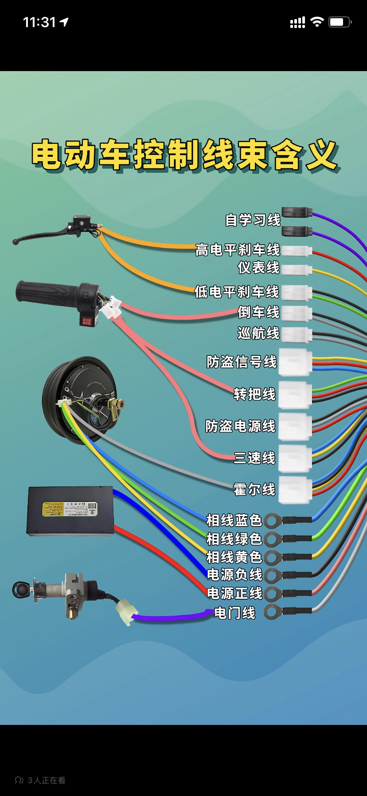

> <h1 id=''></h1>
- [**相对路径**](#相对路径)
- [**快捷键**](#快捷键)
- [**脚本构建**](#脚本构建)
	- [AQG脚本构建](#AQG脚本构建)
- [**💻终端命令**](#💻终端命令)
	- [禁止系统更新](#禁止系统更新)
		- [彻底禁止 macOS Catalina 自动更新，去除更新标记和通知](#彻底禁止macOSCatalina自动更新，去除更新标记和通知)
	- [压缩文件带密码](#压缩文件带密码)
	- [文件损坏问题解决](文件损坏问题解决)
	- [关机](#关机)
	- [重启](#重启)
	- [查看电池🔋容量](#查看电池容量)
	- [视频下载](#视频下载)
- [**硬件**](#硬件)
	- [查看iPhone日志](#查看iPhone日志)
		- [电池🔋信息](#电池信息)
			- [电池🔋真实容量](#电池真实容量)
			- [电池🔋循环次数](#电池循环次数)
			- [电池🔋的健康度指标](#电池的健康度指标)
			- [电池🔋的最大容量百分比](#电池的最大容量百分比)
			- [是否为原厂电池🔋](#是否为原厂电池)
	- [移动硬盘](#移动硬盘)
	- [Key3Pro键盘](#Key3Pro键盘)
	- [显示器](#显示器)
		- [桌面壁纸](#桌面壁纸)
- [**配置**](#配置)
	- [解决source保存配置](#解决source保存配置)
	- [软链接](#软链接)
- [**Xcode**](#Xcode)
	- [**调试**](#调试)
	- [Xcode格式化代码工具](#Xcode格式化代码工具)
	- [控制台po无法打印](#控制台po无法打印)
		- [调试命令frame](#调试命令frame)
	- [控制台高级调试技巧](#控制台高级调试技巧)
	- [快捷键](#快捷键0)
	- [配置](#配置0)
		- [导航显示开发页面](#导航显示开发页面)
		- [跳转到定义方法](#跳转到定义方法)
	- [清理缓存文件](#清理缓存文件)
		- [Xcode完全卸载](#Xcode完全卸载)
	- **参考资料**
		- [Yapi](https://hellosean1025.github.io/yapi/index.html)
		- [Xcode清理垃圾文件](https://www.jianshu.com/p/4540d34431db)
		- [控制台调试](https://www.jianshu.com/p/75688613c6f4)
- [**开发必备工具**](#开发必备工具)
	- [Charles使用](#Charles使用)
		- [Mock本地json数据](#Mock本地json数据)
	- [Wireshark🦈SIP](#Wireshark🦈SIP)
	- [MacVim](#MacVim)
	- [微信小助手扩展](#微信小助手扩展)
	- [美区AppleID](#美区AppleID)
- [**下载**](#下载)
	- [下载命令工具](#下载命令工具)
		- [you-get命令工具](#you-get) 
		- [youtube-dl命令工具](#youtube-dl)
		- [FFmpeg下载m3u8站mp4](#FFmpeg下载m3u8站mp4)
- [**iPhone纯色图片**](#纯色图片)
- [**电子产品**](#电子产品)
	- [iPad](#iPad)
- **兴趣工具**
	- [**正则表达式图观**](https://jex.im/regulex/?from_wecom=1#!flags=&re=)
	- [**Window系统下载**](https://msdn.itellyou.cn)
	- [**LookAE(影视后期特效)**](https://www.lookae.com)
	- [**美国地址生成器**](https://www.meiguodizhi.com/usa-address/hot-city-New-York)
	- [**免费FQ**](https://github.com/Alvin9999/new-pac/wiki/ss免费账号)
	- [**免费节点**](https://lncn.org)
	- [iOS禁止更新描述文件](https://sysin.org/blog/disable-ios-update/)
	- [**BetaProfiles(阻止苹果系统软件更新及证书)**](https://betaprofiles.com)
	- [**AppleOpenSource(苹果系统资源下载)**](https://opensource.apple.com)
	- [**反斗限免**](http://free.apprcn.com)
	- [**邮箱账号获取(10分钟邮箱，免费邮箱账号注册获取验证码)**](https://10minutemail.net)
- [**修改管理员UserName和Password**](#修改管理员UserName和Password)
- [**Mac问题解决**](#Mac问题解决)
	- [Mac蓝牙不可用](#Mac蓝牙不可用)
	- [Mac清理内存](#Mac清理内存)
	- [可删除的文件](#可删除的文件)
	- [破解软件无法安装](#破解软件无法安装)
- [**DNS**](#DNS)
	- [DNS缓存清除](#DNS缓存清除)
- [**电动车**](#电动车)
	- [控制器接线](#控制器接线)

<br/>

***
<br/><br/>


> <h1 id='相对路径'>相对路径</h1>

**2种路径**
- **绝对（或完整）路径**以诸如 D: 之类的盘符开头，后跟一个冒号。
- **相对路径:** 指相对于当前目录的位置。相对路径使用两种特殊符号，单点 (.) 和双点 (..)，通过它们可以转换到当前目录或父目录。双点用于在目录等级中上移。单点表示当前目录。

<br/>

&emsp; 在以下目录结构示例中，假定您使用 Windows 资源管理器导航至 D:\Data\Shapefiles\Soils。导航到此目录之后，相对路径将使用 **D:\Data\Shapefiles\Soils 作为当前目录（如果导航到新目录，此新目录将成为当前目录）**。当前目录有时被称为根目录。‌


<br/>

&emsp; 如果要从当前目录 (Soils) 浏览至 Landuse 目录，可以在 Windows 资源管理器地址框中输入以下内容：

```
..\Landuse
```


<br/>


&emsp; Windows资源管理器将浏览至 **D:\Data\Shapefiles\Landuse**。使用 **D:\Data\Shapefiles\Landuse** 作为当前目录的其他几个示例如下：


<br/>

***
<br/><br/>

> <h1 id='快捷键'>快捷键</h1>

- **锁屏：** `Command+Control+Q`

- **关机终端命令：** `sudo halt` 或者 `sudo shutdown -h now`

- **重启终端命令:** `sudo reboot` 或者 `sudo shutdown -r now`

- **休眠终端命令：** `sudo shutdown -s now`

- [x] **Finder显示隐藏文件:** `Command + shift + “ . ”`

- [ ] **表情包快捷键:** `Command + Control +空格键`


<br/>

***
<br/><br/><br/>

> <h1 id="脚本构建">脚本构建</h1>

[Shell使用快捷键运行](https://juejin.cn/post/6844903989738242062)

<br/><br/><br/>

> <h2 id="AQG脚本构建">脚本构建</h2>

- **1.先写好终端命令**

```
#!/bin/bash

#创建一个爱抢购apk文件夹
mkdir ~/desktop/爱抢购apk  

#将桌面的app-product-release.apk移动到 爱抢购apk 文件夹
mv /Users/ganghuang/Desktop/app-product-release.apk /Users/ganghuang/Desktop/爱抢购apk

#使用如下命令将 app-product-release.apk 包打包成多个android平台的包
java -jar /Users/ganghuang/HGFiles/GitLab/AiQiangGou_Android/app/walle-cli-all.jar  batch -f /Users/ganghuang/HGFiles/GitLab/AiQiangGou_Android/app/batch.txt "/Users/ganghuang/Desktop/爱抢购apk/app-product-release.apk"
```

<br/>

- **2.将上述命令保存在run.sh文件内，并将该文件放在桌面**

<br/>

- **3.终端执行：**

使用 chmod 命令将脚本文件设置为可执行

```

chmod +x /Users/ganghuang/Desktop/run.sh
```

确保将 /path/to/your/script.sh 替换为你实际保存脚本文件的路径。

<br/>


- **4.运行脚本**

在终端中导航到脚本文件所在的目录，然后运行脚本来执行其中的命令：


```
./run.sh
```

这将执行脚本中包含的所有命令。


<br/><br/>


当然若是，更近一步可以将上述脚本与快捷键进行挂钩，哈哈😁。如下：


- [**创建 Automator 服务**](https://blog.csdn.net/liaowenxiong/article/details/119145293)
	- 打开 Automator 应用程序（可以通过 Spotlight 搜索找到）。
	- 选择 "服务" 作为新建的文档类型。
	- 在右侧的搜索框中，搜索并选择 "运行 Shell 脚本" 动作。
	- 将动作拖动到右侧的工作区。

<br/>

- **编辑 Shell 脚本**

在 Shell 脚本动作的工作区中，将 "Pass input" 设置为 "as arguments"。

在 Shell 脚本框中，输入要执行的脚本命令，例如：

```
/path/to/your/run.sh
```

确保将 /path/to/your/script.sh 替换为你实际保存脚本文件的路径

<br/>

- **保存服务**
	- 点击菜单栏的 "文件" -> "保存"。
	- 给这个服务一个有意义的名字，比如 "Run Script"。
	- 确保 "服务保存位置" 设置为 "服务"。
	- 点击 "保存"。

<br/>
- **分配快捷键**
	- 打开 macOS 的 "系统偏好设置"。
	- 点击 "键盘"。
	- 选择 "快捷键" 选项卡。
	- 在左侧选择 "服务"。
	- 在右侧找到你创建的服务，并勾选它。
	- 点击 "添加快捷键"。
	- 按下你想要分配的快捷键，然后点击 "添加"。

<br/> 

- **使用快捷键运行脚本**

现在，当你按下你为这个服务分配的快捷键时，Automator 将会运行脚本，执行你定义的命令。


<br/>

***
<br/><br/>

> <h1 id='💻终端命令'>💻终端命令</h1>

<br/><br/>

> <h2 id='禁止系统更新'>禁止系统更新</h2>

Mac系统Catalina每隔一段时间就会自动提示更新，系统更新图标上会显示红色的更新提示，那就按照如下步骤进行操作：

- 1、打开“系统偏好设置”，点“软件更新”。

- 2、取消选择“自动保持我的Mac最新”。

- 3、点击“高级”按钮。

- 4、取消所有的勾选.

- 4、点“好”。

- 5、退出系统设置，打开终端命令行，分别执行如下3步操作：

```
//这个命令告诉系统忽略名为 "macOS Catalina" 的更新。这意味着系统不会再尝试下载或安装 macOS Catalina 的更新
sudo softwareupdate --ignore "macOS Catalina"

//这个命令设置一个系统首选项，将 AttentionPrefBundleIDs 键的值设置为 0。这会阻止系统在新的软件更新可用时显示通知。
defaults write com.apple.systempreferences AttentionPrefBundleIDs 0 

//将自动下载更新的选项设置为关闭。这意味着系统不会自动下载新的更新文件
sudo defaults write /Library/Preferences/com.apple.SoftwareUpdate.plist AutomaticDownload -bool FALSE

//将自动安装 macOS 更新的选项设置为关闭。这意味着系统不会自动安装 macOS 的更新。
sudo defaults write /Library/Preferences/com.apple.SoftwareUpdate.plist ConfigDataInstall -bool FALSE

//禁用关键更新的自动安装。关键更新通常包括安全性和性能方面的重要修复
sudo defaults write /Library/Preferences/com.apple.SoftwareUpdate.plist CriticalUpdateInstall -bool FALSE

//将 App Store 中应用程序的自动更新选项设置为关闭。这不是直接禁止系统更新，但它会影响到通过 App Store 进行的更新
sudo defaults write /Library/Preferences/com.apple.commerce.plist AutoUpdate -bool FALSE

//这个命令重新启动 Dock 进程，以确保新的系统首选项生效
killall Dock
``` 


<br/><br/>


>## <h2 id='彻底禁止macOSCatalina自动更新，去除更新标记和通知'>[彻底禁止 macOS Catalina 自动更新，去除更新标记和通知](https://sysin.org/blog/disable-macos-catalina-update/#3-屏蔽网络访问-2)</h2>


<br/><br/>

> <h2 id='压缩文件带密码'>压缩文件带密码</h2>

```
zip -er ~/Desktop/encrypted.zip ~/Documents/Confidential/
Enter password:
Verify password:
adding: ~/Documents/Confidential/ (deflated 13%)
```


<br/><br/>

> <h2 id='文件损坏问题解决'>文件损坏问题解决</h2>

```
sudo xattr -r -d com.apple.quarantine 软件路径
```


<br/><br/>

> <h2 id='关机'>关机</h2>

```
sudo halt
或者：
sudo shutdown -h now
```


<br/><br/>

> <h2 id='	重启'>	重启</h2>

```
sudo reboot
或者
sudo shutdown -r now
```

<br/><br/>

> <h2 id='查看电池容量'>查看电池容量</h2>

```
ioreg -rn AppleSmartBattery | grep -i capacity

"MaxCapacity" = 3859: 目前电池实际容量;
"CurrentCapacity" = 927: 目前电池电量;
"DesignCapacity" = 5088: 电池设计时容量;
3859/5088 = 0.78 还剩78%的容量了
```


<br/><br/>

> <h2 id='视频下载'>视频下载</h2>

**视频m3u8格式转mp4格式:**

```
下载:  ffmpeg: brew install ffmpeg
查看:  brew info ffmpeg
打开终端:  fmpeg -i 视频地址 [输出的文件名.mp4], 如: ffmpeg -i https://video.twimg.com/amplify_video/1707178410748063744/pl/EXGVGr9nntWbBJmu.m3u8 /Users/harleyhuang/desktop/HGYYQ17.mp4
```


<br/>

**视频mp4下载:**

```	
cd [下载视频文件路径]
curl -o  02.mp4 https://video.twimg.com/ext_tw_video/1708438851633750016/pu/vid/		avc1/720x720/UYbDFGanDMq8QbgD.mp4
```

<br/>

***
<br/><br/>


> <h1 id='硬件'>硬件</h1>


<br/><br/><br/>

> <h2 id='查看iPhone日志'>查看iPhone日志</h2>


**1.导出日志文件**

iPhone打开[设置] --> [隐私权]--> [分析与改进功能]--> [分析与改进]--> [分析数据]

这时候你会看到一个列表,这就是iPhone在运行时产生的日志数据.如下:


<br/><br/>


**2.找到类似log-aggregated-2024-03-24-080027.ips文件,将其分享到微信里,然后用Mac的其他编辑文档进行打开,比如:Xcode打开:**


<br/>

"log-aggregated-xx.ips" 文件通常是系统或应用程序生成的日志文件，其中包含有关系统或特定应用程序的详细信息。所以你可以通过关键字搜索查到你想要的一些日志信息.


<br/><br/><br/>

> <h2 id='电池信息'>电池信息</h2>

**电池循环次数**

```
<key>com.apple.ioreport.BatteryCycleCount</key>
		<integer>927</integer>
```


<br/>

**了解电池当前正在接收的充电电流**

```
<key>com.apple.ioreport.BatteryChargeCurrent</key>
		<integer>3931</integer>
```

<br/><br/><br/>

> <h2 id='电池真实容量'>电池真实容量</h2>

表示电池的最大充电容量（Full Charge Capacity），其值为 3226。(指的是电池实际容量, 这个值反映了电池的物理容量，即电池能够储存的总电量)

```
<key>com.apple.ioreport.BatteryMaxFCC</key>
		<integer>3226</integer>
```

<br/>

表示电池的最大包电压（Maximum Pack Voltage），其值为 4450
```
<key>com.apple.ioreport.BatteryMaxPackVoltage</key>
		<integer>4450</integer>
```		

<br/>
		
表示电池的最大充电量（Maximum Qmax），其值为 3257。(则表示电池的最大充电量。这个值可能受到充电系统或电池管理系统的限制，它反映了电池允许充电到的最高值，即充电过程中所能接受的最大电量。这个值可能会略低于电池的最大容量，因为电池充电时通常会考虑一些安全因素，如防止过充。)
```
<key>com.apple.ioreport.BatteryMaxQmax</key>
		<integer>3257</integer>
```


<br/>

**总结:** 因此，虽然这两个指标都与电池的能量存储相关，但它们关注的是不同的方面：一个(`com.apple.ioreport.BatteryMaxFCC`)关注电池的物理容量，另一个关注电池(`com.apple.ioreport.BatteryMaxQmax`)允许充电到的最高容量。


<br/>


**表示电池的最小充电容量，其值为 1328。这表示电池在过去某个时间段内达到的最低充电容量。**

```
<key>com.apple.ioreport.BatteryMinFCC</key>
		<integer>1328</integer>
```

<br/>

表示电池的最小包电压，其值为 2537。这是电池在过去某个时间段内达到的最低电压。

``` 
<key>com.apple.ioreport.BatteryMinPackVoltage</key> 
		<integer>2537</integer>
```

<br/>

表示电池的最小充电量，其值为 2754。这是电池在过去某个时间段内达到的最低充电量。

```
<key>com.apple.ioreport.BatteryMinQMax</key>
		<integer>2754</integer>
```


<br/> 

表示电池达到的最低温度，其值为 22 摄氏度。这是电池在过去某个时间段内达到的最低温度。

```
<key>com.apple.ioreport.BatteryMinTemp</key>
		<integer>22</integer>
``` 

<br/> 

表示电池的标称充电容量，其值为 2373。这是电池在制造时被设计为能够容纳的电荷量。

```
<key>com.apple.ioreport.BatteryNominalChargeCapacity</key>		
<integer>2373</integer>
```
 
<br/> 
 
是指电池的化学加权阻抗，其值为 83。化学加权阻抗是电池的一个特性，反映了电池在不同状态下的内部阻力

 ```
 <key>com.apple.power.battery.ChemicalWeightedRa</key>
		<integer>83</integer>
```


<br/><br/><br/>

> <h2 id='电池循环次数'>电池🔋循环次数</h2>


表示电池的充放电循环次数，其值为 1。这个值告诉您电池已经被充放电多少次		
```
<key>com.apple.power.battery.CycleCount</key>
<integer>1</integer>
```

<br/>

表示电池在最后一次达到最大充电量时的充放电循环次数，其值为 2。这个值告诉您电池在最后一次充电过程中完成了多少个完整的充放电循环

```
<key>com.apple.power.battery.CycleCountLastQmax</key>
		<integer>2</integer>
```		
	
<br/><br/><br/>

> <h2 id='电池的健康度指标'>电池的健康度指标</h2>

	
表示电池的健康度指标，其值为 83。这个指标可能代表了电池的健康状态，数值越高通常表示电池越健康

```
<key>com.apple.power.battery.BatteryHealthMetric</key>
	<integer>83</integer>
```


<br/><br/><br/>

> <h2 id='电池的最大容量百分比'>电池的最大容量百分比</h2>
	
表示电池的最大容量百分比，其值为 104。这个值通常表示电池当前的最大容量相对于其设计容量的百分比。值为 100% 或更高可能表示电池的健康状态很好，而值低于 100% 则表示电池的容量已经下降。		

```
<key>com.apple.power.battery.MaximumCapacityPercent</key>
		<integer>104</integer>
```		


<br/>

表示电池的最大充电容量（Full Charge Capacity），其值为 3142。这个值表示电池能够容纳的最大电荷量。(表示电池的最大充电容量（Full Charge Capacity），其值为 3142。这个值表示电池在充满电状态下能够容纳的最大电荷量。因此，这个指标反映了电池的实际容量。)

```
<key>com.apple.power.battery.MaximumFCC</key>
<integer>3142</integer>
```
	
<br/>
	
表示电池的最大充电量，其值为 3170。这个值表示电池在充电时所能达到的最大充电量。

```
<key>com.apple.power.battery.MaximumQmax</key>
<integer>3170</integer>
```

<br/>

表示电池的最小充电容量，其值为 3018。这个值表示电池在过去某个时间段内达到的最低充电容量

```
<key>com.apple.power.battery.MinimumFCC</key>
<integer>3018</integer>
```

<br/>

表示电池的最大规范充电容量，其值为 3124
```
<key>com.apple.power.battery.NCCMax</key>
<integer>3124</integer>
```

<br/>

表示电池的最小规范充电容量，其值为 3052

```
<key>com.apple.power.battery.NCCMin</key>
<integer>3052</integer>
```

<br/>

表示电池的标称充电容量，其值为 3650。这个值通常表示电池制造商标识的电池容量，单位为毫安时(表示电池的标称充电容量。这个值通常表示电池制造商标识的电池容量，即电池在理想条件下能够容纳的电荷量。实际容量可能会略有偏差，因为电池的容量会随着时间、充放电循环次数和环境条件等因素而有所变化。但是，标称充电容量仍然是一个重要的参考值，用于评估电池的性能和规格)

```
<key>com.apple.power.battery.NominalChargeCapacity</key>
<integer>3650</integer>
```


<br/><br/><br/>

> <h2 id=''>是否为原厂电池</h2>


```
<key>com.apple.power.battery.OriginalBattery</key>：
```
表示电池是否为原厂电池，其值为 0。值为 0 可能表示这不是原厂电池

<br/>

电池池数据通信重置次数，其值为 32。这个指标记录了电池数据通信重置的次数(这个指标记录了电池数据通信重置的次数。在正常情况下，这个值不应该频繁地增加。如果这个值在短时间内增加了很多次，可能表示电池的数据通信遇到了问题，或者有人对电池进行了修改或重置。这可能会影响电池的性能或健康状况。因此，对于电池数据通信重置次数的异常增加，可能需要进一步调查和评估)

```
<key>com.apple.power.battery.ResetDataComms</key>
<integer>32</integer>
```


<br/><br/><br/>

>## <h2 id='移动硬盘'>[移动硬盘](https://www.escapelife.site/posts/72cd88cb.html)</h2>

<br/><br/>

> <h2 id='Key3Pro键盘'>Key3Pro键盘</h2>


- fn+1: 蓝牙进入配对模式;
- fn+Q:更改键盘背光灯;
- fn+tab:关闭/开启键盘背光;
- fn+w: 提高键盘背光强度;
- fn+S:减少键盘背光强度;
- fn+T:增加光效速度;
- fn+G:降低光效速度;


<br/><br/>

>## <h2 id='显示器'>[显示器](https://zhuanlan.zhihu.com/p/85232724)</h2>

[显示器选购指南](https://zhuanlan.zhihu.com/p/85232724)


<br/><br/>

> <h2 id='桌面壁纸'>桌面壁纸</h2>


[Blockadelabs根据自己的创意设计,AI生成你指定风格的壁纸](https://www.blockadelabs.com/?_gl=1*1nbsw5q*_ga*NzczOTc1NTQ1LjE2OTM1NjA0OTI.*_ga_YQXS5JLFDH*MTY5Mzc5NTAxMC4zLjAuMTY5Mzc5NTAxMC42MC4wLjA),前几张是免费的,后面是需要收费的.小帅同学推荐的.还不错!


<br/>

***
<br/><br/>


> <h1 id='配置'>配置</h1>

<h2 id='解决source保存配置'>解决source保存配置</h1>


```
vim ~/.zshrc

///输入 i 

///文件输入:
source ~/.bash_profile

///输入: esc 键

/// 输入: wq!
```


<br/>
<br/>

<h2 id='软链接'>软链接</h2>

```
// a 就是源文件，b是链接文件名,其作用是当进入b目录，实际上是链接进入了a目录
// 值得注意的是执行命令的时候,应该是a目录已经建立，目录b没有建立。我最开始操作的是也把b目录给建立了, 结果就不对了
ln -s a b


// 进入 /home/gamestat/
cd /gamestat/

// 删除软链接：
rm -rf  b  注意不是rm -rf  b/


// Mac的M1后需要软链接到 /usr/local/bin/ 这个目录里,通过brew安装不会软链到这个目录
ln -s /opt/homebrew/Cellar/doxygen/1.9.4/bin/doxygen /usr/local/bin/doxygen

//查看软链软件真实目录位置
realpath /opt/homebrew/bin/doxygen
```


<br/>

***
<br/>


># <h1 id = "Xcode">Xcode</h1>

> <h2 id='调试'>调试</h2>


- 控制台**`bt`**命令
	- 当xcode工具区打印的堆栈信息不全时，可以在控制台通过“bt”指令打印完整的堆栈信息


<br/><br/><br/>

> <h2 id="Xcode格式化代码工具">Xcode格式化代码工具</h2>

[Xcode代码格式化工具-(Clang For Mat)安装和使用(博客园)](https://www.cnblogs.com/styCy/p/17222576.html)


<br/><br/><br/>

> <h2 id="控制台po无法打印">控制台po无法打印</h2>

当使用po命令在某一个断点进行打印的时候，出现如下情况：

```
po model.itemPic

error: Expression evaluation failed. Retrying without binding generic parameters
error: Could not evaluate the expression without binding generic types.
```

在google上搜索了一通，各种配置和摆弄都不行，所以找到了下面一个命令`frame`

```
frame variable model.itemPic

(String?) model.itemPic = "https://img.mishifeng.com/FhyY7lSjIykM81zfQm8cIqqNBTSz?imageView2/1/w/450/h/225/q/75"
```


<br/><br/><br/>

> <h2 id="调试命令frame">调试命令frame</h2>


**疑问：frame是什么命令？为什么frame可以但是po不可以呢**


`frame variable 或 fr v`

**用途：显示当前帧中的所有变量。**


<br/>

在 LLDB 调试器中，frame variable 和 po 是两种不同的命令，用于不同的目的和场景。让我们详细解释这些命令及其用途，并解释为什么在某些情况下 frame variable 可能比 po 更有用。

<br/>
**LLDB 命令简介**

- **`po (print object):`**

	- 用途：用于打印对象的描述（description）。
	
	- 工作原理：这个命令实际上调用了对象的 description 或 debugDescription 方法，对于 Swift 对象，它通常调用 CustomStringConvertible 或 CustomDebugStringConvertible 协议的实现。

<br/>

示例：

```
(lldb) po myVariable
```

<br/> <br/>


- **`frame variable:`**

- 用途：用于显示当前帧中的变量信息。它显示变量的详细信息，包括类型和值。
- 工作原理：这个命令直接读取变量的内存并显示它的值和类型，不依赖于对象的描述方法。

<br/>

示例：

```
(lldb) frame variable myVariable
```

**为什么 frame variable 有时比 po 更有用?**

- **直接访问内存：** frame variable 直接读取变量的内存内容，而不依赖于任何类型描述或方法。这意味着即使对象的描述方法不可用或存在问题，frame variable 也能显示变量的实际值。

- **泛型和复杂类型**：在处理泛型和复杂类型时，LLDB 的 po 命令有时会失败，因为它可能无法正确解析对象的类型描述。而 frame variable 可以直接读取和显示这些复杂类型的内存内容。

- **调试优化：** 当代码在调试模式下编译时，优化级别较低，po 命令可能会受到影响，而 frame variable 更加可靠。

<br/> <br/>

**示例**

假设你有一个复杂的泛型结构体，po 命令可能会失败，但 frame variable 能够正常工作：


```
struct Box<T> {
    var value: T
}
```

let myBox = Box(value: 42)

1.在调试过程中，尝试使用以下命令：

**1.1使用 po 命令：**


```
(lldb) po myBox
```

如果遇到错误，可能是因为调试器无法解析泛型类型的描述。

**1.2使用 frame variable 命令：**


```
(lldb) frame variable myBox
```

这个命令会显示变量的详细信息，包括类型和值，例如：


```
(Box<Int>) myBox = {
    value = 42
}
```


- **总结**
	- po 命令：适用于需要打印对象描述的简单场景，但在处理泛型和复杂类型时可能会失败。
	- frame variable 命令：直接读取和显示内存内容，适用于调试泛型和复杂类型的变量。
	- 通过了解这些命令的不同用途和工作原理，你可以更有效地使用 LLDB 进行调试，尤其是在处理复杂类型和泛型代码时。


<br/><br/><br/><br/>


<br/><br/><br/>> <h2 id="控制台高级调试技巧">控制台高级调试技巧</h2>
常用的 LLDB 调试命令
po (print object)

用途：打印对象的描述。
示例：
sh
复制代码
(lldb) po myVariable
p 或 print

用途：打印变量的值和类型。
示例：
sh
复制代码
(lldb) p myVariable
frame variable 或 fr v

用途：显示当前帧中的所有变量。
示例：
sh
复制代码
(lldb) frame variable
frame select 或 f s

用途：选择不同的堆栈帧。
示例：
sh
复制代码
(lldb) frame select 1
bt 或 backtrace

用途：显示当前线程的调用堆栈。
示例：
sh
复制代码
(lldb) bt
thread list

用途：显示当前进程的所有线程。
示例：
sh
复制代码
(lldb) thread list
thread select

用途：选择当前线程。
示例：
sh
复制代码
(lldb) thread select 1
breakpoint set 或 br set

用途：设置断点。
示例：
sh
复制代码
(lldb) breakpoint set --name viewDidLoad
breakpoint list 或 br list

用途：列出所有断点。
示例：
sh
复制代码
(lldb) breakpoint list
continue 或 c

用途：继续执行程序直到下一个断点或异常。
示例：
sh
复制代码
(lldb) continue
step in 或 s

用途：单步执行进入函数内部。
示例：
sh
复制代码
(lldb) step in
step over 或 n

用途：单步执行，不进入函数内部。
示例：
sh
复制代码
(lldb) step over
step out 或 finish

用途：执行完当前函数并返回。
示例：
sh
复制代码
(lldb) step out
高级调试技巧
使用条件断点

用途：设置仅在满足特定条件时才会触发的断点。
示例：
sh
复制代码
(lldb) breakpoint set --name myMethod --condition 'myVariable == 42'
表达式求值

用途：在调试过程中动态执行代码。
示例：
sh
复制代码
(lldb) expr myArray.append(5)
查看和修改变量

用途：在调试时查看和修改变量的值。
示例：
sh
复制代码
(lldb) p myVariable
(lldb) expr myVariable = 10
使用 watchpoints

用途：在内存位置被访问或修改时触发。
示例：
sh
复制代码
(lldb) watchpoint set variable myVariable
使用调试日志

用途：记录并查看调试期间的日志输出。
示例：
sh
复制代码
(lldb) log enable lldb expr
加载调试脚本

用途：使用 Python 脚本扩展 LLDB 的功能。
示例：
sh
复制代码
(lldb) command script import my_debug_script.py
使用 Data Formatters

用途：自定义数据类型的显示格式。
示例：
sh
复制代码
(lldb) type summary add MyClass --summary-string "MyClass: ${var.myProperty}"
Xcode 调试视图和工具
使用变量视图

在断点处暂停时，可以使用变量视图查看和修改变量的值。
使用调试导航器

调试导航器显示当前线程和调用堆栈，可以快速定位和跳转代码。
使用仪表

仪表显示应用的实时性能数据，如 CPU 使用率、内存消耗等。
使用线程断点

在线程死锁或竞争条件下，可以设置线程断点来调试多线程问题。
利用捕获的 View Hierarchy

捕获和查看应用的 UI 层次结构，调试布局和界面问题。


> <h2 id='快捷键0'>快捷键</h2>

[Xcode常用快捷键](https://www.jianshu.com/p/b2ba6e29252c)

- 代码格式对齐：选中要对齐的代码，然后快捷键 `Contorl + i`

* 单行注释：`command + /`，即`⌘ + /`;

* 注释文档：`command + Option + /`，即`⌘ + ⌥ + /`;
	* 苹果解决xcode ghost,把插件屏蔽了,解决方法命令运行：  
	
```
sudo /usr/libexec/xpccachectl
```
然后必须重启电脑后生效

- 快速定位到当前编辑文件的导航区域（左侧的文件目录）：`command + shift + J`

- 快速跳转到某一行:`command + L `

- 快速打开某一个文件:  `command + shift + O`

- 收起/展开方法代码块
	- 收起:  `option + command + ←`
	- 展开:  `option + command + →`

- 上移一行and下移一行 :  `option + command + ]` ,  `option + command +[`

- 光标上移一行和下移一行
	- 上移一行：`control + N`
	- 下移一行：`control + P`

- .h文件与.m文件之间的快速切换:`  control + command + ↑ `,  `control + command + ↓`

- 返回至上一次光标位置: `control + command + ←` ,  `control + command + →`

- 快速查看当前class的方法:  `control + 6`


- [**常用快捷键总结**](https://yanhooit.gitbooks.io/ios_study_note/content/xcodekuai_jie_jian.html)


<br/><br/><br/><br/>


> <h2 id='配置0'>配置</h2>


<br/>

> <h3 id='导航显示开发页面'>导航显示开发页面</h3>

打开`Xcode->Preferebces`,选择如下图：


<br/>
<br/>

> <h3 id='跳转到定义方法'>跳转到定义方法</h3>

Command+点击


<br/><br/><br/>


> <h2 id='清理缓存文件'>清理缓存文件</h2>


<br/>

-	删除Xcode中多余的证书provisioning profile 

```
手动删除： 
Xcode6 provisioning profile path： 
~/Library/MobileDevice/Provisioning Profiles
```

<br/>

-	清理Xcode编译项目产生的缓存垃圾 

```
(Xcode永久了，会产生很多项目编译缓存，占用一大堆硬盘空间，此时需要对该目录进行清理） 
手动删除： 
Xcode编译项目缓存垃圾的目录： 
~/Library/Developer/Xcode/DerivedData
```


<br/>

- 真机/模拟器运行项目非常慢的解决方法

```
//每次把一个设备接入电脑进行真机调试之前，电脑会对设备建立索引，也在此文件夹下生成对该设备系统的支持文件。于是这里存在了一堆对旧版本iOS设备支持的文件。
//而我最近基本只对iOS9.3的设备进行真机调试。于是删除了所有低于9.3的文件夹
~/Library/Developer/Xcode/iOS DeviceSupport/


选择Xcode --> Window-->Devices and Simulators，找到真机设备，鼠标右键选择unpair the device

然后重启Xcode、重新连接设备、重新运行应用程序

```


<br/>

- 清理运行时产生的文件

Command+shift+G 在Finder中，删除项目运行时产生的文件

```
/Users/harleyhuang/Library/Developer/Xcode/DerivedData
```
亲测，删除了3个项目文件。清了3.3G的内存


<br/>

- 每次打包App的dSYM等数据就保存在这里，把一些没用的版本删了。如果是上线了的版本还是保留吧

```
 ~/Library/Developer/Xcode/Archives/
```


<br/>

- 同上，把没用的删了

```
 ~/Library/Developer/Xcode/Products/
```


<br/>

- 这里保存了playground的项目缓存，全删了

```
~/Library/Developer/XCPGDevices/
```


<br/>

另外，Xcode12占用空间过大的解决方法
iOS.simruntime日常使用删不得，tvOS.simruntime， watchOS.simruntime ，大部分开发者接触不到，可直接删除，可以减少12g

文件路径：


```
Xcode.app/Contents/Developer/Platforms/WatchOS.platform/Library/Developer/CoreSimulator/Profiles/Runtimes/watchOS.simruntime

Xcode.app/Contents/Developer/Platforms/AppleTVOS.platform/Library/Developer/CoreSimulator/Profiles/Runtimes/tvOS.simruntim
```


<br/>
<br/>


> <h3 id='Xcode完全卸载'>Xcode完全卸载</h3>

```
% sudo rm -rf /Applications/Xcode.app
Password:

% sudo rm -rf /Library/Preferences/com.apple.dt.Xcode.plist

% rm -rf ~/Library/Preferences/com.apple.dt.Xcode.plist

% rm -rf ~/Library/Caches/com.apple.dt.Xcode

% rm -rf ~/Library/Application\ Support/Xcode

% rm -rf ~/Library/Developer/Xcode

% rm -rf ~/Library/Developer/CoreSimulator

% rm -rf ~/Library/Developer/XCPGDevices

% rm -rf ~/Library/Developer

% rm -rf ~/Library/Developer/Xcode/DerivedData
```


<br/>

***
<br/>


<br/>

***
<br/>


># <h1 id = "下载">下载</h1>

- 安装任何应用配置

1️⃣ 打开终端；

2️⃣输入：`sudo spctl --master-disable`；

3️⃣根据提示输入管理员的密码；

4️⃣【系统偏好设置】->【安全与隐私】->【通用】->【允许从以下位置下载的应用】。

<br/>

下载后即可安装应用了。


<br/>

- **下载资源**

1⃣️ 切换到下载路径

```
cd /Users/harleyhuang/Desktop
```

2⃣️ 资源下载

下载一首`十年.mp3`

```
curl -o 十年.mp3 ‘http://ev.sycdn.kuwo.cn/29ab24ac0a6f70c790a234422e377a29/60813d14/resource/n3/11/0/2695339732.mp3'
```


<br/>

- 软件安装

使用 brew 安装软件

```
brew install wget 
```

使用 brew 卸载软件

```
brew uninstall wget 
```

使用 brew 查询软件

```
brew search /wge*/ 
```

其他brew命令

```
brew list           列出已安装的软件 
brew update     更新brew 
brew home       用浏览器打开brew的官方网站 
brew info         显示软件信息 
brew deps        显示包依赖
```


<br/><br/>

> <h2 id='下载命令工具'>下载命令工具</h2>


**命令行视频下载工具 you-get 和 youtube-dl**

&emsp; [you-get](https://github.com/soimort/you-get) 和 [youtube-dl](https://github.com/rg3/youtube-dl) 都是基于 Python 的命令行媒体文件下载工具，完全开源免费跨平台。用户只需使用简单命令并提供在线视频的网页地址即可让程序自动进行嗅探、下载、合并、命名和清理，最终得到已经命名的完整视频文件。两者搭配使用几乎可以下载所有主流视频网站的视频及有关资源，配合本地播放器还可直接播放在线视频，彻底避免广告和浏览器插件的困扰。


<br/><br/>

># <h3 id='you-get'>[you-get](https://you-get.org)</h3>


- **1.安装方法**

前提你的电脑安装了 Homebrew，在命令行执行以下代码

```
brew install you-get
```

<br/>

- **2.下载视频**

使用-info/-i选项来查看所有可用的质量和格式

```
$ you-get -i 'https://www.youtube.com/watch?v=jNQXAC9IVRw'
site:                YouTube
title:               Me at the zoo
streams:             # Available quality and codecs
    [ DEFAULT ] _________________________________
    - itag:          43
      container:     webm
      quality:       medium
      size:          0.5 MiB (564215 bytes)
    # download-with: you-get --itag=43 [URL]

    - itag:          18
      container:     mp4
      quality:       medium
    # download-with: you-get --itag=18 [URL]

    - itag:          5
      container:     flv
      quality:       small
    # download-with: you-get --itag=5 [URL]

    - itag:          36
      container:     3gp
      quality:       small
    # download-with: you-get --itag=36 [URL]

    - itag:          17
      container:     3gp
      quality:       small
    # download-with: you-get --itag=17 [URL]
下载
$ you-get 'https://www.youtube.com/watch?v=jNQXAC9IVRw'
site:                YouTube
title:               Me at the zoo
stream:
    - itag:          43
      container:     webm
      quality:       medium
      size:          0.5 MiB (564215 bytes)
    # download-with: you-get --itag=43 [URL]

Downloading zoo.webm ...
100.0% (  0.5/0.5  MB) ├████████████████████████████████████████┤[1/1]    7 MB/s

Saving Me at the zoo.en.srt ...Done.
```

注意：

- 目前，大多数支持的网站还没有实现格式选择；在这种情况下，下载的默认格式是质量最高的格式。
- 在下载和连接多个部分的视频流(例如在优酷等网站上)，以及1080p或高分辨率的YouTube视频，ffmpeg 是必需的依赖。
- 如果你不想在下载后加入视频部分，可使用 -no-merge/-n 选项。
- 暂停并继续下载
- 可以使用Ctrl+C来中断下载。
- 要强制重新下载，请使用 -force/-f选项 (警告:这样做会覆盖任何同名的现有文件或临时文件!)


<br/>

- **4.设置下载文件的路径和名称**

使用 `-output-dir/-o` 选项设置路径，以及 `-output-filename/ -o` 设置下载文件的名称

```
$ you-get -o ~/Videos -O zoo.webm 'https://www.youtube.com/watch?v=jNQXAC9IVRw'
```

以上基本就是常用到的命令了，还有一些功能的命令不常用，这里就不写了，感兴趣的可以去参考上面的Github 项目，有详细的操作指令。

但是在实际操作中,发现上述的命令不起坐作用,并不能设置下载路径,只能采用下面比较笨的方法了:

```
cd 下载文件路径
you-get -o 视频名称.mp4 '视频地址'
```

或者可以试下下面的下载方式:

```
you-get -p 要存储的文件路径 -o 存储的文件名 'xxxadress'

you-get -o /Users/ganghuang/Videos/ -o B站 'https://www.bilibili.com/video/BV1Dh411K7Kq/aa.mp4'
```


<br/>

**5.支持的网站**

<br/>

| Site | URL	Videos? | Images? | Audios? |
|:--|:--|:--|:--|			
|YouTube	| https://www.youtube.com/	| ✅	| |	
|Twitter	| https://twitter.com/ |	✅	|✅	|
|VK	| http://vk.com/	| ✅	| ✅	|
|Vine |	https://vine.co/ |	✅	| |	
|Vimeo	| https://vimeo.com/	| ✅	| |	
|Vidto	| http://vidto.me/ |	✅	| |	
| Videomega	| http://videomega.tv/	| ✅	|	|
|Veoh |	http://www.veoh.com/	| ✅ | |		
|Tumblr	| https://www.tumblr.com/	| ✅	| ✅|
|TED	| http://www.ted.com/	| ✅| |		
|SoundCloud	| https://soundcloud.com/			| ✅| |
|SHOWROOM	| https://www.showroom-live.com/	| ✅| |	
|Pinterest |	https://www.pinterest.com/	|	✅	| |
|MusicPlayOn	| http://en.musicplayon.com/ |	✅	| |
|MTV81|	http://www.mtv81.com/	| ✅	| |	
| Mixcloud	| https://www.mixcloud.com/		|	✅ | |
| Metacafe |	http://www.metacafe.com/ |	✅ | |
| Magisto	| http://www.magisto.com/	| ✅ | |		
| Khan Academy |https://www.khanacademy.org/ | ✅ | |
|Internet Archive|	https://archive.org/	|✅		||
|Instagram	|https://instagram.com/	|✅	|✅|	
|InfoQ	|http://www.infoq.com/presentations/	|✅	||	
|Imgur	|http://imgur.com/		|✅|	|
|Heavy Music Archive|	http://www.heavy-music.ru/	|		✅||
|Google+	|https://plus.google.com/	|✅|	✅|	
|Freesound	|http://www.freesound.org/			|✅||
|Flickr	|https://www.flickr.com/	|✅	|✅	|
|FC2 Video	|http://video.fc2.com/|	✅||		
|Facebook	|https://www.facebook.com/	|✅	||	
|eHow	|http://www.ehow.com/	|✅||		
|Dailymotion	|http://www.dailymotion.com/	| ✅| |
|Coub	|http://coub.com/	|✅	||	
|CBS	|http://www.cbs.com/	|✅	||	
|Bandcamp	|http://bandcamp.com/	|✅||
|AliveThai	|http://alive.in.th/	|✅	||	
|interest.me	|http://ch.interest.me/tvn	|✅	| |	
|755 ナナゴーゴー|	http://7gogo.jp/	|✅	|✅|	
|niconico ニコニコ動画	|http://www.nicovideo.jp/	|✅| |
|163 网易视频 网易云音乐|	http://v.163.com/ http://music.163.com/	|✅	|	✅|
|56网	|http://www.56.com/	|✅	| |	
|AcFun	|http://www.acfun.tv/	✅| |		
|爆米花网	|http://www.baomihua.com/	|✅	| |	
|bilibili 哔哩哔哩	|http://www.bilibili.com/	|✅| |		
|Dilidili	|http://www.dilidili.com/	|✅| |		
|斗鱼	|http://www.douyutv.com/	|✅	| |	
|Panda 熊猫	|http://www.panda.tv/	|✅| |		
|风行网| 	http://www.fun.tv/|	✅ | |		
|iQIYI 爱奇艺	|http://www.iqiyi.com/	|✅| |		
|酷6网	|http://www.ku6.com/|	✅	| |	
|酷狗音乐	|http://www.kugou.com/	|✅| |
|酷我音乐	|http://www.kuwo.cn/|✅| |
|乐视网	|http://www.le.com/	|✅| |		
|秒拍	|http://www.miaopai.com/	|✅	| |		
|QQ 腾讯视频	|http://v.qq.com/	|✅| |		
|Sina 新浪视频 微博秒拍视频	|http://video.sina.com.cn/ http://video.weibo.com/	|✅	| |	
|Sohu 搜狐视频	|http://tv.sohu.com/	|✅	| |		
|Youku 优酷	|http://www.youku.com/	|✅| |			
|快手	|https://www.kuaishou.com/	|✅	|✅|	
|抖音	|https://www.douyin.com/	|✅	| |	

温馨提示：
如果下载资源时无响应，可 Ctrl+C 暂停，再次重新执行下载命令。


<br/>
<br/>


># <h3 id='youtube-dl'>[youtube-dl](http://rg3.github.io/youtube-dl/)</h3>


- **1.安装方法**

方法一：

```
brew install youtube-dl
```

方法二：

```
sudo curl -L https://yt-dl.org/downloads/latest/youtube-dl -o /usr/local/bin/youtube-dl
sudo chmod a+rx /usr/local/bin/youtube-dl
```

方法三：

```
sudo wget https://yt-dl.org/downloads/latest/youtube-dl -O /usr/local/bin/youtube-dl
sudo chmod a+rx /usr/local/bin/youtube-dl
```

<br/>

- **2.下载视频**

下载在线视频

```
youtube-dl [视频网址]
```

如:

```
youtube-dl -o 00.mp4  ‘’
```

<br/>

查看指定网页所有视频格式

```
youtube-dl -F [视频网址]
```

下载指定格式的媒体文件

```
youtube-dl -f [format code] [视频网址]
```


<br/>

- **3.命令参数**

```
Usage: youtube-dl [OPTIONS] URL [URL...]
Options:
  通用选项:
    -h, --help                       打印帮助文档
    --version                        打印版本信息
    -U, --update                     更新到最新版(需要权限)
    -i, --ignore-errors              遇到下载错误时跳过
    --abort-on-error                 遇到下载错误时终止
    --dump-user-agent                显示当前使用的浏览器(User-agent)
    --list-extractors                列出所有的提取器(支持的网站)
    --extractor-descriptions         同上
    --force-generic-extractor        强制使用通用提取器下载
    --default-search PREFIX          使用此前缀补充不完整的URLs，例如："ytsearch2 yt-dl" 从youtube搜索并下载两个关于yt-dl视频. 使用"auto"youtube-dl就会猜一个，一般效果等价于"ytsearch"("auto_warning"猜测时加入警告).我已知支持的PREFIX：ytsearch (youtube), ytsearchdate (youtube), yvsearch (yahoo videos), gvsearch (google videos) 
    --ignore-config                  不读取配置文件，当时用了全局配置文件/etc/youtube-dl.conf:不再读取 ~/.config/youtube-dl/config (%APPDATA%/youtube-dl/config.txt on Windows)
    --config-location PATH           使用指定路径下的配置文件
    --flat-playlist                  列出列表视频但不下载
    --mark-watched                   标记看过此视频 (YouTube only)
    --no-mark-watched                不标记看过此视频 (YouTube only)
    --no-color                       打印到屏幕上的代码不带色

  网络选项:
    --proxy URL                      使用HTTP/HTTPS/SOCKS协议的代理.如：socks5://127.0.0.1:1080/.
    --socket-timeout SECONDS         放弃连接前等待时间
    --source-address IP              绑定的客户端IP地址
    -4, --force-ipv4                 所有连接通过IPv4
    -6, --force-ipv6                 所有连接通过IPv6

  地理限制:
    --geo-verification-proxy URL     使用此代理地址测试一些有地理限制的地址
    --geo-bypass                     绕过地理限制通过伪装X-Forwarded-For HTTP头部的客户端ip (实验)
    --no-geo-bypass                  不 绕过地理限制通过伪装X-Forwarded-For HTTP头部的客户端ip (实验)
    --geo-bypass-country CODE        强制绕过地理限制通过提供准确的ISO 3166-2标准的国别代码(实验)

  视频选择:
    --playlist-start NUMBER          指定列表中开始下载的视频(默认为1)
    --playlist-end NUMBER            指定列表中结束的视频(默认为last)
    --playlist-items ITEM_SPEC       指定列表中要下载的视频项目编号.如："--playlist-items 1,2,5,8"或"--playlist-items 1-3,7,10-13"
    --match-title REGEX              下载标题匹配的视频(正则表达式或区分大小写的字符串)
    --reject-title REGEX             跳过下载标题匹配的视频(正则表达式或区分大小写的字符串)
    --max-downloads NUMBER           下载NUMBER个视频后停止
    --min-filesize SIZE              不下载小于SIZE的视频(e.g. 50k or 44.6m)
    --max-filesize SIZE              不下载大于SIZE的视频(e.g. 50k or 44.6m)
    --date DATE                      仅下载上传日期在指定日期的视频
    --datebefore DATE                仅下载上传日期在指定日期或之前的视频 (i.e. inclusive)
    --dateafter DATE                 仅下载上传日期在指定日期或之后的视频 (i.e. inclusive)
    --min-views COUNT                不下载观影数小于指定值的视频
    --max-views COUNT                不下载观影数大于指定值的视频
    --match-filter FILTER            通用视频过滤器. Specify any key (see help for -o for a list of available keys) to match if the key is present, !key to check if the key is not present, key > NUMBER (like "comment_count > 12", also works with >=, <, <=, !=, =) to compare against a number,key = ‘LITERAL‘ (like "uploader = ‘Mike Smith‘", also works with !=) to match against a string literal and & to require multiple matches. Values which are not known are excluded unless you put a question mark (?) after the operator. For example, to only match videos that have been liked more than 100 times and disliked less than 50 times (or the dislike functionality is not available at the given service), but who also have a description, use --match-filter "like_count > 100 & dislike_count <? 50 & description" .
    --no-playlist                    当视频链接到一个视频和一个播放列表时，仅下载视频
    --yes-playlist                   当视频链接到一个视频和一个播放列表时，下载视频和播放列表
    --age-limit YEARS                下载合适上传年限的视频
    --download-archive FILE          仅下载档案文件中未列出的影片，已下载的记录ID
    --include-ads                    同时下载广告(实验)

  下载选项:
    -r, --limit-rate RATE            最大bps (e.g. 50K or 4.2M)
    -R, --retries RETRIES            重试次数 (默认10), or "infinite".
    --fragment-retries RETRIES       一个分段的最大重试次数(default is 10), or "infinite" (DASH, hlsnative and ISM)
    --skip-unavailable-fragments     跳过不可用分段(DASH, hlsnative and ISM)
    --abort-on-unavailable-fragment  放弃某个分段当不可获取时
    --keep-fragments                 下载完成后，将下载的片段保存在磁盘上; 片段默认被删除
    --buffer-size SIZE               设置缓冲区大小buffer (e.g. 1024 or 16K) (default is 1024)
    --no-resize-buffer               不自动调整缓冲区大小.默认情况下自动调整
    --playlist-reverse               以相反的顺序下载播放列表视频
    --playlist-random                以随机的顺序下载播放列表视频
    --xattr-set-filesize             Set file xattribute ytdl.filesize with expected file size (experimental)
    --hls-prefer-native              使用本机默认HLS下载器而不是ffmpeg
    --hls-prefer-ffmpeg              使用ffmpeg而不是本机HLS下载器
    --hls-use-mpegts                 使用TS流容器来存放HLS视频,一些高级播放器允许在下载的同时播放视频
    --external-downloader COMMAND    使用指定的第三方下载工具,当前支持：aria2c,avconv,axel,curl,ffmpeg,httpie,wget
    --external-downloader-args ARGS  给第三方下载工具指定参数，如：--external-downloader aria2c --external-downloader-args -j8

  文件系统选项:
    -a, --batch-file FILE            文件中包含需要下载的URL
    --id                             仅使用文件名中的视频ID
    -o, --output TEMPLATE            Output filename template, see the "OUTPUT TEMPLATE" for all the info
    --autonumber-start NUMBER        指定%(autonumber)s的起始值(默认为1)
    --restrict-filenames             将文件名限制为ASCII字符，并避免文件名中的“＆”和空格
    -w, --no-overwrites              不要覆盖文件
    -c, --continue                   强制恢复部分下载的文件。 默认情况下，youtube-dl仅在可能时将恢复下载。
    --no-continue                    不要恢复部分下载的文件(从头开始重新启动)
    --no-part                        不使用.part文件 - 直接写入输出文件
    --no-mtime                       不使用Last-modified header来设置文件最后修改时间
    --write-description              将视频描述写入.description文件
    --write-info-json                将视频元数据写入.info.json文件
    --write-annotations              将视频注释写入.annotations.xml文件
    --load-info-json FILE            包含视频信息的JSON文件(使用“--write-info-json”选项创建)
    --cookies FILE                   文件从中读取Cookie(经测试，export cookies插件可以使用，但firebug导出的cookies导致错误)
    --cache-dir DIR                  文件存储位置。youtube-dl需要永久保存一些下载的信息。默认为$XDG_CACHE_HOME/youtube-dl或/.cache/youtube-dl。目前，只有YouTube播放器文件（对于具有模糊签名的视频）进行缓存，但可能会发生变化。
    --no-cache-dir                   不用缓存
    --rm-cache-dir                   删除所有缓存文件

  缩略图:
    --write-thumbnail                把缩略图写入硬盘
    --write-all-thumbnails           将所有缩略图写入磁盘
    --list-thumbnails                列出所有可用的缩略图格式

  详细/模拟选项:
    -q, --quiet                      激活退出模式
    --no-warnings                    忽略警告
    -s, --simulate                   不下载不存储任何文件到硬盘，模拟下载模式
    --skip-download                  不下载视频
    -g, --get-url                    模拟下载获取视频直连
    -e, --get-title                  模拟下载获取标题
    --get-id                         模拟下载获取id
    --get-thumbnail                  模拟下载获取缩略图URL
    --get-description                模拟下载获取视频描述
    --get-duration                   模拟下载获取视频长度
    --get-filename                   模拟下载获取输出视频文件名
    --get-format                     模拟下载获取输出视频格式
    -j, --dump-json                  模拟下载获取JSON information.
    -J, --dump-single-json           模拟下载获取每条命令行参数的JSON information.如果是个播放列表，就获取整个播放列表的JSON
    --print-json                     下载的同时获取视频信息的JSON
    --newline                        进度条在新行输出
    --no-progress                    不打印进度条
    --console-title                  在控制台标题栏显示进度
    -v, --verbose                    打印各种调试信息
    --dump-pages                     打印下载下来的使用base64编码的页面来调试问题（非常冗长）
    --write-pages                    将下载的中间页以文件的形式写入当前目录中以调试问题
    --print-traffic                  显示发送和读取HTTP流量
    -C, --call-home                  联系youtube-dl服务器进行调试
    --no-call-home                   不联系youtube-dl服务器进行调试

  解决方法:
    --encoding ENCODING              强制指定编码(实验)
    --no-check-certificate           禁止HTTPS证书验证
    --prefer-insecure                使用未加密的连接来检索有关视频的信息(目前仅支持YouTube)
    --user-agent UA                  指定user agent
    --referer URL                    指定自定义的referer,仅限视频来源于同一网站
    --add-header FIELD:VALUE         指定一个自定义值的HTTP头文件,使用分号分割,可以多次使用此选项
    --bidi-workaround                围绕缺少双向文本支持的终端工作。需要在PATH中有bidiv或fribidi可执行文件
    --sleep-interval SECONDS         在每次下载之前休眠的秒数，或者每次下载之前的随机睡眠的范围的下限(最小可能的睡眠秒数)与-max-sleep-interval一起使用。
    --max-sleep-interval SECONDS     每次下载前随机睡眠范围的上限(最大可能睡眠秒数)。只能与--min-sleep-interval一起使用。

  视频格式选项:
    -f, --format FORMAT              视频格式代码,查看"FORMAT SELECTION"获取所有信息
    --all-formats                    获取所有视频格式
    --prefer-free-formats            开源的视频格式优先，除非有特定的请求
    -F, --list-formats               列出请求视频的所有可用格式
    --youtube-skip-dash-manifest     不要下载关于YouTube视频的DASH清单和相关数据
    --merge-output-format FORMAT     如果需要合并(例如bestvideo + bestaudio)，则输出到给定的容器格式。mkv，mp4，ogg，webm，flv之一。如果不需要合并，则忽略

  字幕选项:
    --write-sub                      下载字幕文件
    --write-auto-sub                 下载自动生成的字幕文件 (YouTube only)
    --all-subs                       下载所有可用的字幕
    --list-subs                      列出所有字幕
    --sub-format FORMAT              字幕格式,接受格式偏好,如："srt" or "ass/srt/best"
    --sub-lang LANGS                 要下载的字幕的语言(可选)用逗号分隔,请使用--list-subs表示可用的语言标签

  验证选项:
    -u, --username USERNAME          使用ID登录
    -p, --password PASSWORD          账户密码,如果此选项未使用,youtube-dl将交互式地询问。
    -2, --twofactor TWOFACTOR        双因素认证码
    -n, --netrc                      使用.netrc认证数据
    --video-password PASSWORD        视频密码(vimeo, smotri, youku)

  Adobe Pass Options:
    --ap-mso MSO                     Adobe Pass多系统运营商(电视提供商)标识符,使用--ap-list-mso列出可用的[MSO](https://en.wikipedia.org/wiki/List_of_multiple-system_operators)
    --ap-username USERNAME           MSO账号登录
    --ap-password PASSWORD           账户密码,如果此选项未使用,youtube-dl将交互式地询问。
    --ap-list-mso                    列出所有支持的MSO

  后处理选项:
    -x, --extract-audio              将视频文件转换为纯音频文件(需要ffmpeg或avconv和ffprobe或avprobe)
    --audio-format FORMAT            指定音频格式: "best", "aac", "flac", "mp3", "m4a", "opus", "vorbis", or "wav"; "best" by default;-x存在时无效
    --audio-quality QUALITY          指定ffmpeg/avconv音频质量,为VBR插入一个0(best)-9(worse)的值(默认5),或者指定比特率
    --recode-video FORMAT            必要时将视频转码为其他格式(当前支持: mp4|flv|ogg|webm|mkv|avi)
    --postprocessor-args ARGS        给后处理器提供这些参数
    -k, --keep-video                 视频文件在后处理后保存在磁盘上; 该视频默认被删除
    --no-post-overwrites             不要覆盖后处理文件; 默认情况下,后处理文件将被覆盖
    --embed-subs                     在视频中嵌入字幕(仅适用于mp4,webm和mkv视频）
    --embed-thumbnail                将缩略图嵌入音频作为封面艺术
    --add-metadata                   将元数据写入视频文件
    --metadata-from-title FORMAT     从视频标题中解析附加元数据，如歌曲标题/艺术家。格式语法和--output相似.也可以使用带有命名捕获组的正则表达式。解析的参数替换现有值。Example: --metadata-from-title "%(artist)s - %(title)s" matches a title like "Coldplay - Paradise". Example (regex): --metadata-from-title "(?P<artist>.+?) - (?P<title>.+)" 
    --xattrs                         将元数据写入视频文件的xattrs(使用dublin core 和 xdg标准)
    --fixup POLICY                   自动更正文件的已知故障。never(不做警告), warn(只发出警告), detect_or_warn (默认;如果可以的话修复文件,否则警告)
    --prefer-avconv                  后处理时相较ffmpeg偏向于avconv
    --prefer-ffmpeg                  后处理优先使用ffmpeg
    --ffmpeg-location PATH           ffmpeg/avconv程序位置;PATH为二进制所在文件夹或者目录.
    --exec CMD                       在下载后对文件执行命令,类似于find -exec语法.示例：--exec‘adb push {} /sdcard/Music/ && rm {}‘
    --convert-subs FORMAT            转换字幕格式(当前支持: srt|ass|vtt)
```

部分没有记录的,可以查看[文档](https://github.com/ytdl-org/youtube-dl)


<br/>

***
<br/>


> <h1 id='纯色图片'>纯色图片</h1>

-  黑色背景确认是否有漏光，七彩屏；

-  白色背景确认是否暖屏或阴阳屏；

-  浏览所有背景色确认是否有坏点，亮点；


<br/><br/>

> <h2 id='FFmpeg下载m3u8站mp4'>FFmpeg下载m3u8站mp4</h2>


- ❖ **安装homebrew**

1. 打开终端，输入

```
ruby -e"$(curl -fsSL https://raw.githubusercontent.com/Homebrew/install/master/install)"
```

按enter


<br/>

2. 安装完成后（等全部命令执行完成之后），在终端输入

```
brew
```

<br/>
<br/>

- **❖安装ffmpeg**

1.使用homebrew安装ffmpeg，在终端输入

这个ffmpeg有点大,下载安装的时候最好在终端挂上代理,进行安装:

```
brew install ffmpeg
```

按enter

<br/>

2. 安装完成后（等全部命令执行完成之后），在终端输入

```
brew info ffmpeg
```

验证成功与否，如果有如下信息则安装成功


<br/>
<br/>


- **❖ 下载转化m3u8到mp4**

（6☛）1.打开终端，输入

```
//cd 某个文件夹路径
cd /User/xx

//ffmpeg -i '视频地址' ./输出的文件名.mp4
ffmpeg -i 'https://video.twimg.com/amplify_video/1689197552615444480/pl/oZLnz_7Q9bvFaHBMxll.m3u8?tag=14&container=fmp4' ./xx.mp4
```


（7☛）2.等待下载完成，就可以在下载文件夹看到下载并且转化好的mp4格式视频


<br/>

***
<br/>


> <h1 id='电子产品'>电子产品</h1>

<br/>

> <h2 id='iPad'>iPad</h2>

| iPad型号 | 发布时间 | 屏幕尺寸 | 芯片性能 | CPU | GPU | 电池 | 网络 | 功能 |
|:--|:--|:--|:--|:--|:--|:--|:--|:--|
| iPad | 2010年1月27日 |  |  |   |  |  |  |  |
| iPad2 | 2011年3月3日 |  |  |   |  |  | 3G |  |
| The New iPad |  |  | A5X |  4核 |  | 12000mAh |  |  |
| iPadwith Retina display | 2012年10月24日 | 9.7英寸 | A6X(2倍A5X性能) |   |  |  |  |  |
| iPadMini(处理器等硬件规格大致与iPad 2相同) | 2012年10月23 | 7.9寸 |  |   |  |  |  |  |
| iPad Air | 2013年10月23日 | 9.7英寸(Retina 显示屏) | A7(8倍的iPad mini性能，图形处理能力更是提高了72倍) |  |  |  |  |  |
| iPad mini2 | 2013年10月22日 | (视网膜)= 4*iPadMini | A7 |   |  |  |  |  |
| iPadAir2 | 2014年10月17日 |  |  |   |  |  |  |  |
| iPadMini3 | 2014年10月16日 |  |  |   |  |  |  |  |
| iPadPro | 2015年9月10日 |  |  |   |  |  |  |  |
| iPadMini4 | 2015年9月10日 | 7.9英寸 | A8 |   |  | 10小时视频 |  | 指纹识别 |
| iPadPro | 2016年3月21日 | 9.7英寸(TrueTone显示屏,采用防油渍防指纹涂层) |  |   |  |  |  |  |
| iPad(第5代) | 2017年3月23日 | 9.7英寸(Retina显示屏,防油渍防指纹涂层) | A9(M9协处理器) |   |  | 10小时视频 |  | 指纹识别 |
| iPadPro(10.5英寸/12.9英寸) |  | TrueTone | A10X Fusion(CPU的6核心，2.5倍的A8性能) |   |  | 10小时视频 |  | 指纹识别、ProMotion(刷新率翻番到120Hz) |
|  |  |  |  |   |  |  |  |  |
|  |  |  |  |   |  |  |  |  |

<br/>

***
<br/>


># <h1 id='开发必备工具'>[开发必备工具](https://juejin.cn/post/7088473126996181028)</h1>


<br/>

>## <h2 id='Charles使用'>[Charles 使用](https://www.jianshu.com/p/633ac6221028)</h2>


[Charles 抓包及 Mock 数据教程——超级详细(掘金)](https://juejin.cn/post/6844904162044428302#heading-5)


<br/><br/><br/>

> <h2 id="Mock本地json数据">Mock本地json数据</h2>

利用Charles工具Mock本地的Json文件数据的前提条件是手机和电脑要使用同一WIFI、iPhone安装描述文件、电脑需要安装Charles证书并信任、手机的Wi-Fi的iP地址要和电脑ip一样。

按如下所图步骤：


<br/><br/><br/>


># <h2 id='Wireshark🦈SIP'>Wireshark🦈SIP</h2>

- [Wireshark使用教程](https://www.cnblogs.com/hls-code/p/16054209.html)
- [抓取真机数据](https://blog.csdn.net/yulianlin/article/details/79095413)


<br/>
<br/>

># <h2 id='MacVim'>[MacVim](https://www.jianshu.com/p/923aec861af3)</h2>


<br/>
<br/>


># <h2 id='微信小助手扩展'>[微信小助手扩展](https://github.com/harleyGit/WeChatExtension-ForMac)</h2>

**慎重:使用后容易被封!!**

- **1.安装**

```
curl -o- -L https://omw.limingkai.cn/install.sh | bash -s

omw -n

omw -g
```


<br/>
<br/>

- **2.自动卸载**

`bash <(curl -sL https://git.io/JUO6r)`


<br/>
<br/>


># <h2 id='美区AppleID'>[美区AppleID](https://www.ifanr.com/app/1367245)</h2>

<br/>

> <h2 id=''></h2>


<br/>
<br/>

> <h2 id=''></h2>


> <h1 id=''></h1>

<br/>

> <h2 id=''></h2>


<br/>
<br/>

> <h2 id=''></h2>


> <h1 id=''></h1>

<br/>

> <h2 id=''></h2>


<br/>
<br/>

> <h2 id=''></h2>


> <h1 id=''></h1>

<br/>

> <h2 id=''></h2>


<br/>
<br/>

> <h2 id=''></h2>


> <h1 id=''></h1>

<br/>

> <h2 id=''></h2>


<br/>
<br/>

> <h2 id=''></h2>


> <h1 id=''></h1>

<br/>

> <h2 id=''></h2>


<br/>
<br/>

> <h2 id=''></h2>


> <h1 id=''></h1>

<br/>

> <h2 id=''></h2>


<br/>
<br/>

> <h2 id=''></h2>


<br/>

> <h2 id=''></h2>


<br/>
<br/>

> <h2 id=''></h2>


<br/>

***
<br/>

># <h1 id='修改管理员UserName和Password'>修改管理员 UserName 和 Password</h1>

1️⃣重启iMac、Mac Air、Mac Pro；

2️⃣当听到电脑启动声音时，按下组合键：Command + S；

3️⃣当看到好像进入终端时，松开组合键；

4️⃣输入：`sbin/mount -uaw`;

5️⃣输入：`rm /var/db/.AppleSetupDone`,此时注意：rm 和后面的字符串一个空格；

6️⃣再次输入：reboot，对电脑进行重启即可；

7️⃣重启后，跟当初才激活电脑一样，根据激活配置，一步一步重新对其进行配置，在此过程中会要求我们重新创建一个管理员账号。


<br/>

***
<br/>


># <h1 id='Mac问题解决'>Mac问题解决</h1>


<br/>

> <h2 id='Mac蓝牙不可'>**Mac蓝牙不可用**</h2>


`①  拔出与Mac连接的设备线；  `<br/>
`② 关机;  `<br/>
`③ 同时按下shift+control+option+power,保持5秒左右；`<br/>
`④  先按下power键，紧接着同时按下option+command+p+r,等待   mac发出4声Duang~的声音后松手，系统会自动开机；`
`⑤  蓝牙菜单恢复正常；`<br/>


<br/>
<br/>

> <h2 id='Mac清理内存'>Mac清理内存</h2>


**`查看文件夹内的内存占用情况`**

&emsp;  使用下面命令系统就会自动统计该目录下所有文件的占用情况，一般等待一两分钟后就能得到结果了。若是想分析其它位置，你需要首先键入cd /文件夹路径移驾，然后再次运行`sudo du -sh *`开始扫描。

```
sudo du -sh *
```

<br/>

&emsp;   查看Mac内文件所占的Size，然后用`Command + shift + G`粘贴地址到(`/Users/用户名/Library/其他文件夹目录`)所在大文件夹。

```
$ du -hd 5 |grep -n '\dG' |sort
```

<br/>
<br/>

> <h2 id='可删除的文件'>可删除的文件</h2>

```
//该目录下的内容是Xcode在编译过程中产生的中间件，并且文件还特别大，在编译完成后能够被删除
//这个文件夹中保存的是Xcode的缓存文件，曾经在Xcode跑过的所有项目的索引、build的信息等都会保存在这里。
//删除后在下次打开项目编译的时候将会重新生成。由于这里包含了大量已经没用的项目的信息又懒得去筛选，于是把整个文件夹里面都删了
~/Library/Developer/Xcode/DerivedData


//该目录下的内容是Xcode在做模拟器调试时生成的模拟器的数据，如果模拟器不再使用也可以删除
~/Library/Developer/CoreSimulator/Devices/
```

[Xcode 空间的清理](https://www.jianshu.com/p/7b39a31c312d)

[清理内存空间](https://www.jianshu.com/p/8fac91ff3453)

[手动清理内存](https://www.jianshu.com/p/41c736860925)

<br/>

**`删除所有系统日志——可以节省出100MB-2GB硬盘空间`**

&emsp;  随着你使用Mac的时间越来越长，系统日志文件也会越来越多，根据电脑的用量、错误和服务，这些文件会越来越多。这些系统日志文件是用来调试和排除故障的，如果你感觉没有用，可以使用下面的命令删除：

```
sudo rm -rf /private/var/log/*
```

<br/>

**`删除快速查看生成的缓存文件——可以节省出100MB-300MB硬盘空间`**

&emsp;  快速查看功能是OS X系统内置的文件预览功能，在Finder中选择任何文件后都可以点击空格来查看文件的详情。不过快速查看功能依靠缓存功能才能更流畅，而且这些缓存文件会一直增加，通过下面的命令移除缓存：

```
sudo rm -rf /private/var/folders/
```

<br/>

**`删除临时文件——可以节省500MB-5GB硬盘空间`**

&emsp;  `/private/var/tmp/`是存放系统缓存的文件夹，通常情况下会在系统重启时清楚，不过有时确不会。而且如果你长时间不关闭Mac，也不重启的话，缓存文件会越来越多。使用下面的命令清楚这些临时文件：

```
cd /private/var/tmp/

rm -rf TM*
```

<br/>

**`清除缓存文件——可以节省1GB-10GB硬盘空间`**
&emsp;  缓存文件有很多种，比如网页浏览记录，应用meta数据等等。这些缓存文件的容量究竟多大跟用户使用的应用有关，也与Mac重启的频率有关。此外，很多在线音乐播放app也会产生大量的缓存文件，我们可以通过下面的命令删除这些缓存文件：

```
cd ~/Library/Caches/

rm -rf ~/Library/Caches/*
```

[**Mac 清理软件集合**](https://blog.csdn.net/mandagod/article/details/89339544)


<br/>
<br/>

> <h2 id='破解软件无法安装'>**破解软件无法安装**</h2>


- 【安全隐私】没有权限安装来路不明的 App


打开权限，在终端输入：`sudo spctl --master-disable`

- 文件损坏无法安装


在终端输入：`sudo xattr -d com.apple.quarantine /Applications/[App的名字].app`， 这个可以从文件夹中将app拖入终端，然后再输入密码解决了，亲测可用。


<br/>

***
<br/>

> <h1 id=''></h1>


<br/>

***
<br/>

> <h1 id=''></h1>


># <h1 id = "DNS">[DNS](https://zhuanlan.zhihu.com/p/28273783)</h1>

- 域名劫持特征

一些小服务商以及小地方的服务商非常喜欢干这个事情。根据腾讯给出的数据，DNS劫持率7%，恶意劫持率2%。网速给的劫持率是10-15%。

- 把你的域名解析到竞争对手那里，然后哭死都不知道，为什么流量下降了。
- 在你的代码当中，插入广告或者追踪代码。这就是为什么在淘宝或者百度搜索一下东西，很快就有人联系你。
- 下载APK文件的时候，替换你的文件，下载一个其他应用或者山寨应用。
- 打开一个页面，先跳转到广告联盟，然后跳转到这个页面。无缘无故多花广告钱，以及对运营的误导。


<br/><br/>

- <h2 id = "DNS缓存清除">DNS缓存清除</h2>

`sudo killall -HUP mDNSResponder`

<br/>

- 查看当前dns

`nslookup domain`

<br/>

- Mac的DNS服务IP配置


<br/>

***
<br/><br/>

> <h1 id='电动车'>电动车</h1>


<br/><br/>

> <h2 id='控制器接线'>控制器接线</h2>




<br/>

***
<br/><br/><br/>

> <h1 id=''></h1>


