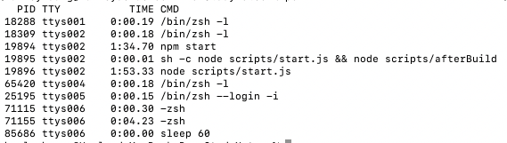
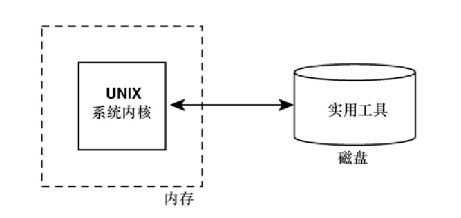
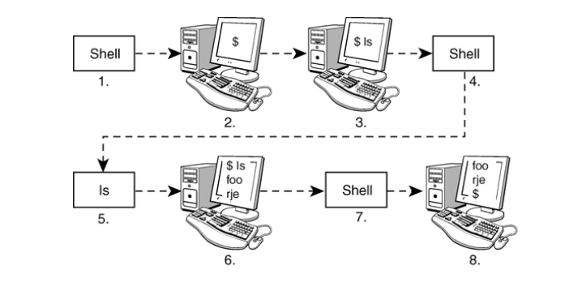

><h1 id=''></h1>
- [**`基础命令`**](#基础命令)
- [**`使用文件`**](#使用文件)
- [**`使用目录`**](#使用目录)
- [**`文件名替换`**](#文件名替换)
	- [**`星号`匹配多个字符**](#星号匹配多个字符)
	- [ **`?`匹配单个字符**](#?匹配单个字符)
- [**`文件名中不易察觉的部分`**](#文件名中不易察觉的部分)
	- [文件名包含空格、？、单引号、双引号](#文件名包含空格、？、单引号、双引号)
- [**`标准输入/输出和I/O重定向`**](#标准输入/输出和I/O重定向)
	- [ `>`: 输出重定向](#输出重定向)
- [**`管道`**](#管道)
- [**命令后话**](#命令后话)
- [**`Shell编程`**](#Shell编程)
	- [Shell命令](#Shell命令)
- [**`脚本与变量`**](#脚本与变量)
- **``**
- **``**
- **``**


<br/>

***
<br/>


><h1 id='基础命令'>基础命令</h1>


| **命令** | **说明** |   
|:--|:--|     
| date | 命令可以显示出日期和时间; |   
| who | 命令可以用来获取当前已登录到系统中的所有用户的信息; <br/> 	who am i: who命令来获取本人的信息 |   
| echo | 命令会在终端打印出（或者说回显）你在行中输入的所有内容； |    
 


<br/>

***
<br/>


><h1 id='使用文件'>使用文件</h1>

<br/>

| **命令** | **用法** | 
| :-- | :-- |
| ls | 命令要查看目录下的文件; | 
| vi | 创建文件 |
|  vi a.txt | 创建a.txt文件或者打开a.txt文件 <br/> 点击 i，开始输入；<br/> &emsp; 编辑完成按 ESC；<br/>&emsp; :q //退出 <br/>&emsp; :wq //保存后退出 |
| cat | (concatenate)命令来检查文件的内容（这个命令是concatenate的简写，可不是指猫科动物）; |
| cat names | names是待检查的文件名 | 
|  wc | 统计文件中单词数量; <br/> &emsp; wc names：names是待检查的文件名 |
| UNIX命令允许在命令执行时指定选项。选项通常采用如下形式：<br/> &emsp;  - letters  |  |
|  命令选项是减号（-）后面直接跟上单个字母。例如，要计算文件中包含的行数，可以使用wc命令的-l选项（字母l）： | wc -l names: -l 计算文件中包含的行数；<br/><br/> wc -c names：-c 计算文件中包含的字符数；<br/><br/> wc -w names: <br/><br/> -w 选项可以用来统计文件中包含的单词数; |
|  cp | cp命令可以使用cp命令来复制文件。<br/><br/> cp names saved_names: 该命令的第一个参数是要复制的文件名（称为源文件），第二个参数是要复制为的文件名（称为目标文件）;  |  
|  mv | 文件重命名;<br/><br/>&emsp; mv saved_names hold_it: mv命令的参数形式和cp命令一样。第一个参数是待重命名的文件，第二个参数是文件的新名字。因此，如果要想将文件saved_names更名为hold_it; |
|  rm | 删除文件; <br/><br/>&emsp; rm hold_it: rm命令可以从系统中删除文件,rm命令的参数就是要删除的文件; <br/><br/>&emsp; rm wb collect mon: 可以使用rm命令一次删除多个文件，只需要将这些文件在命令行上列出就可以了。例如，下列命令将删除文件wb、collect和mon;|


<br/>

***
<br/>


><h1 id='使用目录'> 使用目录</h1>


- `.．`指向当前目录的上一级目录，也称为父目录;

&emsp; 若你现在位于主目录`/users/steve`，路径名`．．`引用的是users目录;

- 单点号`．`，它总是引用当前目录;

<br/>

|**命令**| **用法** |
|:--|:--|
| pwd  | （print working directory）命令可以告诉你当前工作目录的名字，帮助你确定自己所处的位置; |
| cd  | 命令更改当前工作目录。该命令使用目标目录名作为参数;<br/> |
|   | cd .. : 移动到上一级目录最简单的方法就是将．．; | 
|   | cd : 输入不带有任何参数的cd命令。无论你当前处于文件系统中的什么位置，这种用法都可以将你直接带回主目录; |
| ls | 命令列出了当前目录的文件名； |
| mkdir | 命令可用于创建目录; |
| cp | 命令可以用来在目录间复制文件; |
|  | cp 原文建路径 目标文件路径 |
| mv | 命令的两个参数指向的是不同的目录，那么文件会从第一个目录移动到第二个目录； |
| ln | 文件链接；|
|  | ln from to : 可以将文件from链接到文件to; |
| rmdir |  |
|  | 删除目录; |
|  | rm -r dir: dir是要删除的目录名称。r m命令会删除指定的目录以及其中的所有文件（包括目录），因此在使用这条强力命令的时候可得小心. |

 


<br/>

***
<br/>


><h1 id='文件名替换'>文件名替换</h1>

<br/>

><h2 id='星号匹配多个字符'>**`‌星号匹配多个字符`**</h2>


Cat：显示多个文件内容

```
//显示 a， b， c， d的文件内容
cat a b c d

可以用 * 替代

cat *


```

<br/>

Echo： 打印

```
echo a b c d

等价于

echo *

```

&emsp; * 能够实现部分文件替换功能，它实际上还可以与其他字符配合使用，以限制所能够匹配到的文件名范围。

```

$ ls
a
b
c
chaptl
chapt2
chapt3
chapt4

```

要想只显示出以chap开头的文件，可以输入：
```
cat chap*
```

&emsp; chap *能够匹配以chap开头的所有文件。在指定的命令被调用之前，这些文件名替换就已经完成了。同样的道理，echo 也可以这样做。


<br/>


><h2 id='?匹配单个字符'>`?`匹配单个字符</h2>


```
$ ls
a
b 
c
ab 
ac 
ad

$ echo ?
a
b 
c
```

&emsp; ?？匹配两个字符，*匹配余下的零个或多个字符，其效果就是找出所有文件名长度至少为两个字符的文件

<br/>

**下面的一些语法有些类似正则表达式的语法，细细品味。**

&emsp; `?？`匹配两个字符，*匹配余下的零个或多个字符，其效果就是找出所有文件名长度至少为两个字符的文件。

&emsp; 另一种匹配单个字符的方法是在中括号[]中给出待匹配的字符列表。例如，[abc]能够匹配字符a、b或c。这类似于？，但是允许你选择具体要匹配哪些字符。

&emsp; 你可以使用破折号指定一个字符的逻辑范围，这可是太方便了！例如，[0-9]能够匹配字符0～9。在指定字符范围的时候，唯一的限制就是第一个字符在字母表上必须位于最后一个字符之前，因此[z-f]并不是一个有效的字符范围，而[f-z]就没有问题。

&emsp; 可以通过配合使用字符范围以及字符列表来实现复杂的替换。例如，[a–np–z]*能够匹配以字母a~n或者p~z开头的所有文件（或者说得再简单些，就是不以小写字母o开头的文件）。

&emsp; 如果[之后的第一个字符是！，那么所匹配的内容正好相反。也就是说，匹配中括号内容之外的任意字符。因此：

`[!a-z]`


<br/>

***
<br/>

># 


><h1 id='文件名中不易察觉的部分'>`文件名中不易察觉的部分`</h1>

<br/>

> <h2 id='文件名包含空格、？、单引号、双引号'>文件名包含空格、？、单引号、双引号</h2>

<br/>

文件名为： my test document
- 文件名中含有空格解决方法
	- 引号法：`cat "my test document"`
	- 反斜杠法： cat my\ test\ document`

<br/>

- 文件名中包含 ？ 解决
	- 反斜杠：`ls -l who\ me\?`


<br/>

- 文件名包含`双引号`和`单引号`
	- 解决方法：将包含双引号的文件名放到单引号中，反之亦然。
`ls -l "don't quote me" 'She said "yes"`


<br/>

***
<br/>


> <h1 id='标准输入/输出和I/O重定向'>标准输入/输出和I/O重定向</h1>

- 排序

```
$ sort       
Tony
Barbara
Harry
Dirk

组合键：control + d， 进行排序

Barbara
Dirk
Harry
Tony

```

<br/>

- 计算行数

```
wc -l
this is text that
is typed on the
standard input device

组合键：control + d
4
```


<br/>


> <h2 id='输出重定向'>输出重定向</h2>


&emsp; `> file`放置在能够将输出写入到标准输出上的命令之后，那么该命令的输出就会被写入到文件file中：

```
//个人信息写入到unix.txt 中
$ who > unix.txt

//显示出 unix.txt 文件内容
$ cat unix.txt
huanggang console  Nov  8 12:03 
huanggang ttys000  Nov  8 12:03 


// line 1 会把之前的内容覆盖掉
$ echo line 1 > unix.txt

```


<br/>

> <h2 id='重定向符号'>重定向符号 `>>`</h2>


&emsp; 字符>>表示的另一种类型的输出重定向。这组字符使得命令的标准输出内容被追加到指定文件的现有内容之后。

```
$ echo line 2 >> unix.txt
$ cat unix.txt
line 1
line 2
```


<br/>


- **`输入重定向`**

&emsp; 以被重定向到命令的输入中。大于号`>`作为输出重定向符号，而小于号`<`则作为输入重定向符号。

```
//文件内容
cat unix.txt
line 1
line 2
huanggang console  Nov  8 12:03 
huanggang ttys000  Nov  8 12:03 

//输出文件内容行数
 wc -l< unix.txt
       4

```


<br/>

***
<br/>


> <h1 id='管道'>管道</h1>


&emsp; UNIX能够将两个命令“连接”在一起。这种连接叫做管道，它可以将一个命令的输出直接作为另一个命令的输入。管道使用字符|表示，被放置在两个命令之间。要想在who和wc -l之间创建一个管道，可以输入who | wc -l：


```
 who | wc -l
       2


```
管道如下图：


<br/>

| **命令** | **结果** | **说明** |
|:--|:--|:--|
| **ls | wc -l** | 24 | 再StudyNotes文件夹下有24个文件 |


<br/>

***
<br/>

># > <h1 id='命令后话'>命令后话</h1>

<br/>

| **命令** | **结果** | **说明** |  
| :-- | :-- | :-- |
| date; pwd | Sun Mar  6 10:37:19 CST 2022 <br/> /Users/harleyhuang/Documents/GitHub/StudyNotes | &emsp; 如果想在一行中输入多个命令，只需要使用分号作为命令之间的分隔符就行了 |  
| sort bigdata > out &  | [1] 85527 | &emsp; 将命令或命令序列放入后台运行的写法是在命令尾部加上字符&。这表示该命令不再和终端绑定在一起，你可以继续其他工作。后台命令的标准输出仍会被导向终端，不过在大多数情况下，标准输入不会再和终端相关联。如果命令试图从标准输入中读取，它将停止运行，等待被带回前台. <br/><br/> &emsp; 第一个是命令的作业号（job number），第二个是进程ID（process ID），也称为PID。在刚才的例子中，作业号是1，进程ID是85527 |  
| ps |  | ps命令能够给出系统中所运行进程的信息。如果不使用任何选项的话，该命令只会打印出你所拥有的进程状态 <br/><br/> ps命令会打印出4列信息（视系统而定）:PID（进程ID）；TTY（进程所在的终端号）；TIME（以分秒计算的进程所使用的计算机时间）；CMD（进程名称）。 |  
| ps -f |  | 如果配合-f选项，ps会打印出更多的进程信息，包括父进程ID（PPID）、进程开始时间（STIME）及其他命令参数 |  


<br/>

***
<br/>

> <h1 id='Shell编程'>Shell编程</h1>

&emsp; UNIX系统在逻辑上被划分为两个不同的部分：内核和实用工具（Utility），如下图所示。或者你也可以认为是内核和其他部分，通常来说，所有的访问都要经由Shell。




&emsp; 内核是UNIX系统的核心所在，当打开计算机并启动（booted）之后，内核就位于计算机的内存中，直到关机为止。

&emsp; 组成完整的UNIX系统的各种实用工具位于计算机磁盘中，在需要的时候会被加载到内存中并执行。实际上你所知道的所有UNIX命令都是实用工具，因此这些命令所对应的程序也都在磁盘上，仅在需要时才会被载入内存。举例来说，当你执行date命令时，UNIX系统会将名为date的程序从磁盘上载入到内存中，读取其代码来执行特定的操作。

&emsp; Shell也是一个实用工具程序，它作为登录过程的一部分被载入到内存中执行。实际上，有必要了解当终端或终端窗口中的第一个Shell启动时所发生的一系列事件。


<br/>

> <h2 id='Shell命令'>Shell命令</h2>

&emsp; 当Shell启动时，它会在终端中显示出一个命令行提示符，通常是美元符$，然后等待用户输入命令（图2.6中的第1步和第2步）。每次输入命令并按Enter键（第3步）, Shell就会分析输入的内容，然后执行所请求的操作（第4步）。




&emsp; 如果你要求Shell调用某个程序，Shell会搜索磁盘，查找环境变量PATH中指定的所有目录，直到找到指定的程序。找到了该程序后，Shell会将自己复制一份（称为子Shell），让内核使用指定的程序替换这个子Shell，接着登录Shell就会“休眠”，等待被调用的程序执行完毕（第5步）。内核将指定程序复制到内存中并开始执行。这个复制过来的程序称为进程。程序和进程之间是有区别的，前者是保存在磁盘上的文件，而后者位于内存中并被逐行执行。

&emsp; 如果程序将输出写入到标准输出中，那么输出内容会出现在终端里，除非你将其重定向或通过管道导向其他命令。与此类似，如果程序从标准输入中读取输入，那么它会等着你输入内容，除非输入被重定向到了另一个文件或通过管道从其他命令导入（第6步）。

&emsp; 当命令执行完毕后，就会从内存中消失，控制权再次交给登录Shell，它会提示你输入下一条命令（第7步和第8步）。

<br/>

就Shell而言，每一行都遵循以下基本格式：

```
program-name arguments
```

说得更正式些，输入的这一行叫做命令行。Shell会扫描该命令行，确定要执行的程序名称及所传入的程序参数。

<br/>

> 变量及文件名替换

&emsp; 和比较正式的编程语言一样，Shell允许将值赋给变量。只要你在命令行中将某个变量放在美元符号$之后，Shell就会将该变量替换成对应的变量值。


<br/>

***
<br/>

> <h1 id='脚本与变量'>脚本与变量</h1>


> 自建一个脚本

- 1.新建一个txt文件在其输入 who 命令,文件名为cmmd

- 2.将cmmd文件其变为可执行文件

```
// +x表明希望file(s)具有可执行权限。
chmod +x /Users/xxx/DevConfig/ccmd
```

- 3.环境变量配置

```
% open .bash_profile

// 在 .bash_profile 进行如下配置:
# 自定义命令ccmd
export cmmdPath=/Users/xxx/DevConfig
export PATH=$PATH:$cmmdPath
# 自定义命令ccmd End

//然后保存commad+s

//输入命令
% source .bash_profile

% ccmd
harleyhuang console  Apr  4 22:27 
harleyhuang ttys000  Apr  4 22:27 

```


<br/>

***
<br/>

> <h1 id=''></h1>


<br/>

***
<br/>

> <h1 id=''></h1>
脚本与变量
># **‌**


