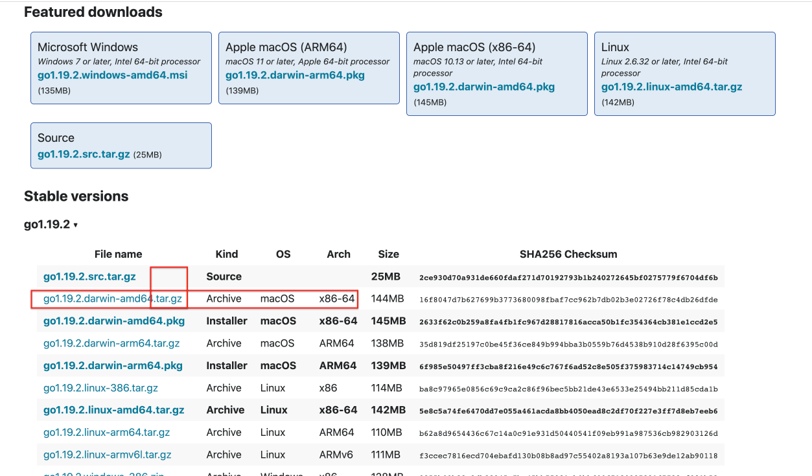
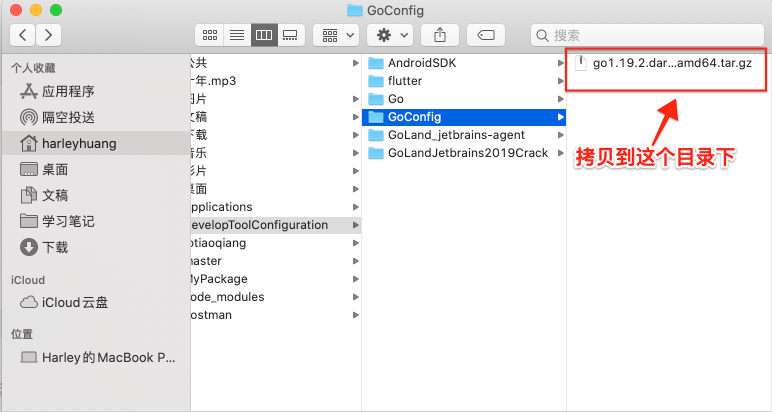
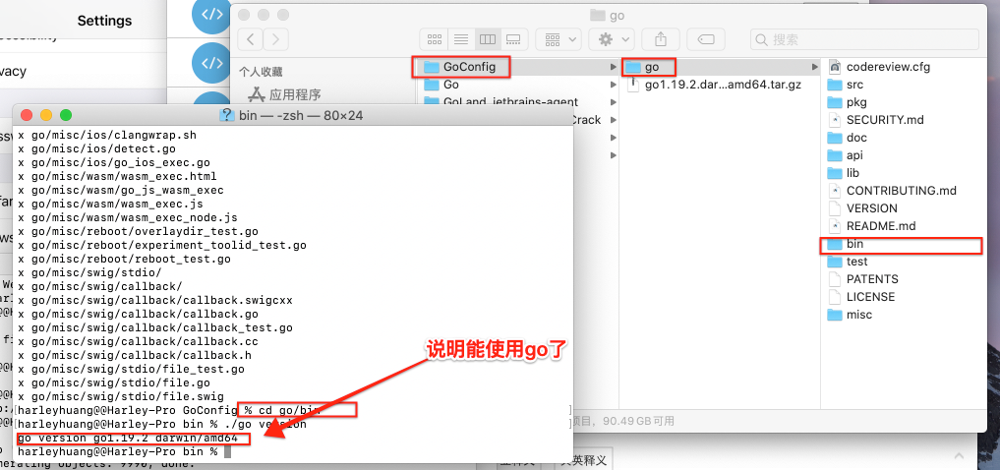
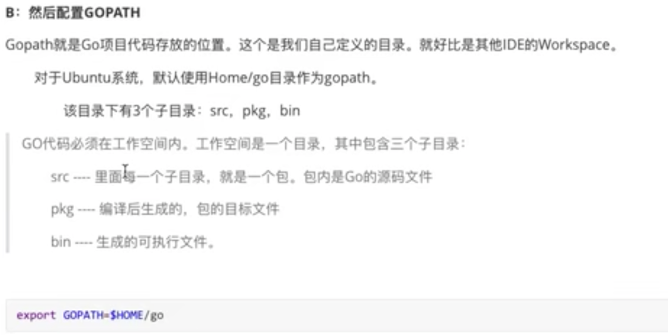
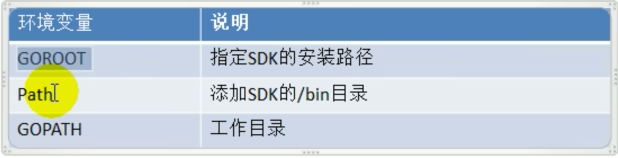

> <h2 id=""></h2>
- [**官方教程**](https://code.visualstudio.com)
- [**配置**](#配置)
	- [短语快捷键配置](#短语快捷键配置)
	- [修改字体大小](#修改字体大小) 
	- [工作区配置](#工作区配置) 
	- [GO的launch.json配置](#GO的launch.json配置) 
	- [用户配置](#用户配置)
- [**常用插件**](#常用插件)
	- [Markdown All in One 插件](#MarkdownAllinOne插件)
	- [koroFileHeader注释插件](#koroFileHeader注释插件)
	- [fileheader-文件头注释](#fileheader-文件头注释)
	- [文件图标插件](#文件图标插件)
	- [自动填充引入文件路径](#自动填充引入文件路径)	
	- [完成HTML闭合标签](#完成HTML闭合标签) 
	- [查看HTML效果](#查看HTML效果)
	- [Gitlens: 查看git提交记录](#Gitlens:查看git提交记录)
	- [插件Deno-安全的JavaScript/TypeScript运行时](#插件Deno-安全的JavaScript/TypeScript运行时)
- [**Flutter配置**](#Flutter配置)
	- [快捷键](#快捷键) 
	- [环境配置](#环境配置)
- [**JavaScript配置**](#JavaScript配置)
	- [Code自动保存](#Code自动保存)
	- [文件图标vscode-icons](#vscode-icons)
	- [ESLint(语法错误检查)](#ESLint)
- [**React配置**](#React配置)
	- [Vue安装](#Vue安装)
		- [安装brew](#安装brew)
		- 	[安装Node js](#安装Nodejs)
		- [	安装vue](#安装vue)
	- [环境配置](#VSCode环境配置)
	- [项目创建](#项目创建)
- [**Go配置**](#Go配置)
	- [Go环境配置](#Go环境配置)
	- [VSCode配置](#VSCode配置)


<br/><br/><br/><br/>

***
<br/>

> <h1 id="配置">配置</h1>

***
<br/><br/><br/>

> <h2 id="短语快捷键配置">短语快捷键配置</h2>

**原因 ：** VS Code 不是原生 macOS 文本框

VS Code 是基于 Electron 的跨平台应用，它使用的是 Chromium 渲染引擎，所以它的输入框（包括编辑区）不是 macOS 系统级的原生输入框。

<br/>

- 首先打开**设置**,把点击Tab的**启用Tab补全**给打开(默认是关闭的)

```
Edigor: Tab Completion
```


<br/>

- 打开控制面板: **Command+shift+P**,然后输入`‌snippets`,选择中`Snippets: Configure snippets`;
- 然后选择markdown.json,打开进行配置如下:

```json
{
	"Picture Link Snippet": {
		"prefix": "p",
		"body": [
			""
		],
		"description": "其他笔记图片链接"
	},
	"Picture Link1 Snippet": {
		"prefix": "pi",
		"body": [
			""
		],
		"description": "iOS笔记图片链接"
	},
	"H1 Snippet": {
		"prefix": "h1",
		"body": [
			"<br/><br/><br/>***<br/>> <h1 id=""></h1>"
		],
		"description": "h1标题"
	},
	"H2 Snippet": {
		"prefix": "h2",
		"body": [
			"***<br/><br/><br/>> <h2 id=""></h2>"
		],
		"description": "h2标题"
	},
	"H3 Snippet": {
		"prefix": "h3",
		"body": [
			"<br/><br/>> <h3 id=""></h3>"
		],
		"description": "h3标题"
	},
	"Code Qute Snippet": {
		"prefix": "c",
		"body": [
			"``"
		],
		"description": "代码引入"
	},
	"Code Qute1 Snippet": {
		"prefix": "cc",
		"body": [
			"```json```"
		],
		"description": "代码引入"
	},
	"Test Snippet": {
		"prefix": "hello",
		"body": [
			"Hello, world!"
		],
		"description": "Say hello"
	}
}
```

比如测试: `Test Snippet`时可以输入: `hello+Tab`即可


***
<br/><br/><br/>

> <h2 id="修改字体大小">修改字体大小</h2>
&emsp;打开VSCode,Command+shift+P,在弹出的输入框中输入**setting**,找到有JSON的一项进行设置:

```json
//编辑器字体大小
"editor.fontSize": 18,
//窗体大小级别,可控制左边文件显示大小
"window.zoomLevel":0.6,
//终端字体大小
"terminal.integrated.fontSize": 16,
"terminal.integrated.fontWeight": "normal",
```

***
<br/><br/><br/>

> <h2 id="工作区配置">工作区配置</h2>

```json
{
    // 字体与外观
    "editor.fontSize": 14,
    "editor.lineHeight": 22,//行高
    "editor.fontFamily": "'Fira Code', monospace, Consolas",

    //主题外观
    "workbench.colorTheme": "Default Light Modern",// 主题默认: Default Light Modern, 暗色: Default Dark+
    "window.zoomLevel": 1,// 全局缩放（正数放大）0（默认大小）,1（放大 125%）,2（放大 150%）, -1（缩小 80%）
    "editor.tabSize": 2,// Tab 缩进空格数
    "editor.wordWrap": "on",// 自动换行
    
    // 编辑器行为
    "editor.minimap.enabled": false,// 关闭右侧缩略图
    "editor.renderWhitespace": "boundary",// 显示空格/制表符
    "editor.cursorBlinking": "smooth",// 光标闪烁效果
    "files.autoSave": "afterDelay",// 自动保存
        
    // 终端配置 
    "terminal.integrated.fontFamily": "'Cascadia Code'",// 终端字体  
    "terminal.integrated.cursorStyle": "underline",// 光标样式
    "terminal.integrated.fontSize": 12,

    //编程语言专属设置（如 Go）
    "[go]": {
        "editor.formatOnSave": true,// 保存时格式化
        "editor.defaultFormatter": "golang.go"
    },
    "go.toolsManagement.checkForUpdates": "local"
}
```

***
<br/><br/><br/>

> <h2 id="GO的launch.json配置">GO的launch.json配置</h2>

`Comand+shift+P,`然后选择打开 **Open Workspace Settings(json)**

```json
{
  // 使用 IntelliSense 了解相关属性。
  // 悬停以查看现有属性的描述。
  // 欲了解更多信息，请访问: https://go.microsoft.com/fwlink/?linkid=830387
  "version": "0.2.0",
  "configurations": [
    {
      "name": "Launch MLC_GO", // 配置名称
      "type": "go", // 调试类型（Go）
      "request": "launch", // 启动模式（launch 或 attach）
      "mode": "auto", // 调试模式（auto/debug/test）
      "program": "${workspaceFolder}", // "${fileDirname}", // 调试当前文件所在目录
      "args": ["-env=dev"], // 命令行参数
      "env": {
        "GOPATH": "${env:GOPATH}",
        "MY_ENV": "debug" // 自定义环境变量
      },
      "showLog": true, // 显示调试日志
      "console": "integratedTerminal", // 👈 关键：使用集成终端,解决在vscode中debug【调试控制台】无法输入，使其【调试控制台】与终端大致合并
      //"stopOnEntry": true //“启动调试”按钮后程序就立即暂停在入口（main函数），可以立即 Evaluate 表达式
    },
    {
      //针对包的调试配置
      "name": "Launch Package",
      "type": "go",
      "request": "launch",
      "mode": "auto",
      "program": "${fileDirname}" //调试当前文件所在的包
    },
    {
      //测试调试配置
      "name": "Debug test",
      "type": "go",
      "request": "launch",
      "mode": "test",
      "program": "${workspaceFolder}",
      "args": ["-test.run", "MyTestFunction"]
    },
    {
      //带参数的调试
      "name": "Launch with args",
      "type": "go",
      "request": "launch",
      "mode": "debug",
      "program": "${workspaceFolder}", //调试工作区根目录（适用于有 main 包的项目）
      "args": ["--port=8080", "--env=dev"]
    },
    {
      //基本调试配置（适用于单个文件）
      "name": "Launch current file",
      "type": "go",
      "request": "launch",
      "mode": "debug",
      "program": "${file}" //调试当前打开的文件
    }
  ]
}
```


***
<br/><br/><br/>
> <h2 id="用户配置">用户配置</h2>

**`Comand+shift+P,`（或者‌`Cmd+,`，然后选择扩展下的某个功能）** 然后选择打开 **Open User Settings(json)**

```json
{
  "update.mode": "none", //禁止更新
  "dart.openDevTools": "flutter",
  "git.autofetch": true,
  "files.autoSave": "afterDelay",
  "workbench.colorTheme": "Default Light+",
  "dart.debugExternalLibraries": false,
  "dart.debugSdkLibraries": false,
  "terminal.integrated.scrollback": 1000000000,
  "debug.inlineValues": true,
  "editor.suggestSelection": "first",
  "vsintellicode.modify.editor.suggestSelection": "automaticallyOverrodeDefaultValue",
  "java.semanticHighlighting.enabled": true,
  "files.exclude": {
    "**/.classpath": true,
    "**/.project": true,
    "**/.settings": true,
    "**/.factorypath": true
  },
  "[dart]": {
    "editor.formatOnSave": true,
    "editor.formatOnType": true,
    "editor.rulers": [80],
    "editor.selectionHighlight": false,
    "editor.suggest.snippetsPreventQuickSuggestions": false,
    "editor.suggestSelection": "first",
    "editor.tabCompletion": "onlySnippets",
    "editor.wordBasedSuggestions": "off"
  },
  "java.project.importOnFirstTimeStartup": "automatic",
  "explorer.confirmDelete": false,
  "C_Cpp.updateChannel": "Insiders",
  "diffEditor.ignoreTrimWhitespace": true,
  "files.autoGuessEncoding": true,
  "dart.showInspectorNotificationsForWidgetErrors": false,
  "settingsSync.ignoredSettings": [],
  "editor.codeActionsOnSave": {},
  "redhat.telemetry.enabled": true,
  "security.workspace.trust.untrustedFiles": "open",
  "editor.unicodeHighlight.nonBasicASCII": false,
  "Lingma.LocalStoragePath": "/Users/harleyhuang/.lingma",
  "go.goroot": "/opt/homebrew/Cellar/go/1.23.5/libexec/bin/go",
  "go.gopath": "/Users/ganghuang/HGFiles/GitHub/GoProject",
  "go.useLanguageServer": true,
  "go.toolsManagement.checkForUpdates": "local",
  // 确保 VS Code 插件在执行构建/运行/调试 Go 代码时，使用你手动指定的工具路径，而不是乱找或用错版本。
  // "go.alternateTools" 是 VS Code 中 Go 插件的一个可选配置项，用来显式指定使用哪个 Go 工具的可执行文件路径，防止插件自动找错版本或路径。
  "go.alternateTools": {
	  // 1.1固定使用这个路径下的 go 命令
	  // 1.2若是配置出错可能导致VSCode中的GO插件拓展无法激活、调试失败
	  "go": "/opt/homebrew/Cellar/go/1.23.5/libexec/bin/go"
  },
  "go.toolsEnvVars": {
    "GO111MODULE": "on",
    "GOPROXY": "https://goproxy.cn,direct",
    "GOTOOLCHAIN": "local"//很重要，使其工具链版本和本地go sdk保持一致，不会和go.mod保持一致，避免工具链和sdk不统一导致无法使用vscode的debugprint调试
  },
  // 调试配置
  "go.delveConfig": {
    "showRegisters": false,
    "debugAdapter": "dlv-dap",
    "apiVersion": 2,
    "showGlobalVariables": true
  },
  "gopls": {
    "staticcheck": true // 可选：启用静态分析
  },
  "editor.quickSuggestions": {
    "other": true,
    "comments": false,
    "strings": true
  },
  // 代码格式化
  "go.formatTool": "gofmt",
  "editor.formatOnSave": true,
  // 代码分析
  "go.lintFlags": ["--fast"],
  "go.lintTool": "staticcheck",
  // 自动补全
  "go.autocompleteUnimportedPackages": true,
  // 代码导航
  "go.inferGopath": true,
  "go.docsTool": "gogetdoc",
  // 构建标签
  "go.buildTags": "",
  "editor.tabCompletion": "on",
  "[javascript]": {
    "editor.defaultFormatter": "esbenp.prettier-vscode"
  },
  "[css]": {
    "editor.defaultFormatter": "esbenp.prettier-vscode"
  },
  "[jsonc]": {
    "editor.defaultFormatter": "esbenp.prettier-vscode"
  },

  // 启用 CSS 和 SCSS 支持
  "css.validate": true,
  "scss.validate": true,
  "less.validate": true,
  // 启用 JavaScript 和 CSS 文件跳转
  "javascript.implicitProjectConfig.checkJs": true,
  "css.lint.validProperties": "all",
  "[html]": {
    "editor.defaultFormatter": "vscode.html-language-features"
  },
  "docker.extension.enableComposeLanguageServer": false,
  "makefile.configureOnOpen": true
}
```

比如: Deepseek给的建议:

```json
{
  "go.gopath": "/path/to/your/gopath",
  "go.goroot": "/path/to/your/goroot",
  "go.useLanguageServer": true,
  "go.languageServerFlags": ["-remote=auto"],
  
  // 模块管理
  "go.toolsEnvVars": {
    "GO111MODULE": "auto",
    "GOPROXY": "https://goproxy.cn,direct"
  },
  
  // 代码格式化
  "go.formatTool": "gofmt",
  "editor.formatOnSave": true,
  
  // 测试相关
  "go.testFlags": ["-v", "-count=1"],
  "go.coverOnSave": false,
  
  // 代码分析
  "go.lintFlags": ["--fast"],
  "go.lintTool": "staticcheck",
  
  // 调试配置
  "go.delveConfig": {
    "debugAdapter": "dlv-dap",
    "showRegisters": false,
    "showGlobalVariables": false
  },
  
  // 自动补全
  "go.autocompleteUnimportedPackages": true,
  
  // 代码导航
  "go.inferGopath": true,
  "go.docsTool": "gogetdoc",
  
  // 构建标签
  "go.buildTags": "",
  
  // 自动添加结构体标签
  "go.addTags": {
    "tags": "json,xml",
    "promptForTags": false,
    "transform": "snakecase"
  }
}
```


<br/><br/>

***
<br/>
> <h1 id="常用插件">常用插件</h1>


***
<br/><br/><br/>

> <h2 id="MarkdownAllinOne插件">Markdown All in One插件</h2>

Markdown文档插件.


 ✅ Markdown All in One 插件：Mac 快捷键总览

| 功能 | 快捷键（Mac） | 说明 |
|------|----------------|------|
| **切换预览** | `Cmd + K V` (**先是Cmd+K组合键,然后敲击V即可**)| 打开 Markdown 预览（侧边）<br>⚠️ 是序列键：先按 `Cmd+K`，松手，再按 `V` |
| **切换预览（主区）** | `Cmd + Shift + V` | 在当前编辑区中打开预览 |
| **同步滚动（预览和编辑）** | 自动启用 | 可在设置中禁用 |
| **切换任务列表项 [ ] <-> [x]** | `Cmd + Shift + L` | 在待办项中打勾/取消勾选 |
| **自动完成列表项** | 自动 | 输入 `-` 或 `*` 后按空格，自动生成列表 |
| **插入粗体** | `Cmd + B` | 插入 `**加粗**` |
| **插入斜体** | `Cmd + I` | 插入 `*斜体*` |
| **插入标题（#）** | 自动 | 输入 `#` 后空格自动转换为标题 |
| **插入链接** | `Cmd + K` | 插入 `[链接文本](url)` |
| **插入代码块** | 自动 | 输入 ```` ``` ```` 后自动补全代码块 |
| **插入表格** | 无默认快捷键 | 可使用命令面板执行 |
| **列表缩进** | `Tab` / `Shift + Tab` | 增加/减少缩进层级 |
| **格式化文档** | `Shift + Option + F` | 格式化整个 Markdown 文档（使用 Prettier 或其他格式器） |

<br/>

🧭 命令面板可执行的 Markdown 命令

按下 `Cmd + Shift + P` 打开命令面板，然后输入关键词：

| 命令 | 说明 |
|------|------|
| Markdown: Open Preview to the Side | 打开预览 |
| Markdown: Toggle List | 插入或切换有序/无序列表 |
| Markdown: Toggle Task List | `[ ]` <-> `[x]` |
| Markdown: Print Current Document to HTML | 导出 HTML |
| Markdown: Show TOC | 显示目录（如果你启用了 TOC 功能） |
| Markdown: Create Table of Contents | 生成目录（基于标题） |

<br/>

📌 小技巧：查看/修改快捷键

你可以在 VS Code 中这样查看和修改快捷键：

1. `Cmd + K Cmd + S` 打开快捷键设置
2. 搜索 "markdown"
3. 找到 Markdown All in One 插件的命令，自定义绑定喜欢的快捷键 🎯

<br/>

 🧩 推荐搭配插件：

- **Prettier**：自动格式化 Markdown 文档
- **Markdown Preview Enhanced**：支持公式、流程图、幻灯片
- **Markdown TOC**：自动生成目录（和 Markdown All in One 也集成了 TOC 功能）


***
<br/><br/><br/>

> <h2 id="koroFileHeader注释插件">koroFileHeader注释插件</h2>

- **koroFileHeader**在vscode中用于生成文件头部注释和函数注释的插件，经过多版迭代后，插件：支持所有主流语言,功能强大，灵活方便，文档齐。

***
<br/><br/><br/>

> <h2 id="fileheader-文件头注释">fileheader-文件头注释</h2>


**Code->首选项->设置->在搜索框中搜索 `fileheader`**，对其进行如下配置：

```json
 //文件头注释:ctrl+cmd+i
"fileheader.customMade": {
        "Descripttion": "",
        "Author": "gang.huang",
        "Date": "Do not edit", // 文件创建时间(不变)
        "LastEditTime": "Do not edit", // 文件最后编辑时间
        "FilePath": "Do not edit", // 文件在项目中的相对路径 自动更新
        "dateFormat": "YYYY-MM-DD HH:mm:ss" // 默认格式
    },
    // 函数注释 ctrl+cmd+t
    // 函数注释
    "fileheader.cursorMode": {
        // 默认字段
        "description": "",
        "param": "",
        "return": ""
    },
        
```

***
<br/><br/><br/>

> <h2 id="文件图标插件">文件图标插件</h2>

[vscode-icons](https://github.com/vscode-icons/vscode-icons)：文件图标插件；


***
<br/><br/><br/>

> <h2 id="自动填充引入文件路径">自动填充引入文件路径</h2>

[Path Intellisense](https://github.com/ChristianKohler/PathIntellisense)：当引入文件和书写文件路径时，可自动填充文件；


***
<br/><br/><br/>

> <h2 id="完成HTML闭合标签">完成HTML闭合标签</h2>

[Auto Rename Tag](https://github.com/formulahendry/vscode-auto-rename-tag)：修改HTML标签时，自动完成闭合标签的同步修改；


***
<br/><br/><br/>
> <h2 id="查看HTML效果">查看HTML效果</h2>

[open in browser](https://github.com/SudoKillMe/vscode-extensions-open-in-browser)右击HTML文件，选择Open In Default Browser，就会在默认浏览器中打开HTML文件


***
<br/><br/><br/>

> <h2 id="Gitlens:查看git提交记录">Gitlens: 查看git提交记录</h2>


***
<br/><br/><br/>
> <h2 id="插件Deno-安全的JavaScript/TypeScript运行时"> 插件Deno-安全的JavaScript/TypeScript运行时</h2>

VS Code 中的 **Deno 插件** 主要用于支持 **Deno**（一个安全的 JavaScript/TypeScript 运行时），它的作用包括：

<br/>

- **1. 提供 TypeScript/JavaScript 语言支持**
	- **自动类型检查**：Deno 内置 TypeScript，不需要 `tsconfig.json`，插件能提供正确的类型提示。
	- **自动补全**：在 Deno 项目中，它能正确解析 `import`，提供 IntelliSense 支持。

<br/>

- **2.解析远程导入的模块**
	- Deno 没有 `node_modules`，它直接从 URL 导入依赖，例如：
  
  ```ts
  import { serve } from "https://deno.land/std@0.224.0/http/server.ts";
  ```
- **VS Code 默认不认识 URL 导入**，但安装 Deno 插件后，编辑器能正确解析这些模块，提供跳转和补全。

<br/>

- **3.代码格式化**
	- 插件支持 `deno fmt`，可以自动格式化代码，类似 `Prettier`。
	- 例如：
  
  ```ts
  console.log("Hello, Deno!")
  ```
  
  格式化后：
  
  ```ts
  console.log("Hello, Deno!");
  ```

<br/>

- **4.Lint 代码**
	- 提供 `deno lint`，帮助发现代码中的潜在问题，比如：
  
  ```ts
  let unusedVar = 42; // ⚠️ 未使用的变量
  ```
- 安装插件后，VS Code 会自动标记问题，避免错误。

<br/>

- **5. 运行 Deno 代码**
	- 你可以直接在 VS Code 终端运行 Deno 脚本，而不需要安装额外的 Node.js 依赖：
  
  ```sh
  deno run --allow-net server.ts
  ```

<br/>

- **6.调试 Deno 代码**
	- 插件支持 VS Code 的调试功能（断点、变量检查等）。
	- 你可以创建 `.vscode/launch.json` 进行 Deno 调试：
  
  ```json
  {
    "version": "0.2.0",
    "configurations": [
      {
        "name": "Run Deno",
        "type": "pwa-node",
        "request": "launch",
        "program": "${file}",
        "cwd": "${workspaceFolder}",
        "runtimeExecutable": "deno",
        "runtimeArgs": ["run", "--inspect", "--allow-all"],
        "attachSimplePort": 9229
      }
    ]
  }
  ```

<br/>

- **7.配置 Deno 插件**
启用 Deno 插件后，需要在 `.vscode/settings.json` 里添加：

```json
{
  "deno.enable": true
}
```
这样，VS Code 就会把当前项目识别为 Deno 项目，而不会用 Node.js 的规则解析代码。

<br/>

- **总结**

| 功能 | 作用 |
|------|------|
| **类型支持** | 解析 Deno 代码的 TypeScript 类型 |
| **远程模块解析** | 解析 `https://` 形式的导入 |
| **代码格式化** | 运行 `deno fmt` 统一代码风格 |
| **Lint** | 发现代码潜在错误 |
| **运行 Deno 代码** | 直接运行 Deno 而不依赖 Node.js |
| **调试支持** | VS Code 断点调试 |


<br/><br/><br/>

***
<br/>
> <h1 id="Flutter配置">Flutter配置</h1>
<br/>

> <h2 id="快捷键">快捷键</h2>

- 代码格式化对齐： **`option+shift+F`**


<br/><br/>

> <h2 id="环境配置">环境配置</h2>

&emsp; 到Flutter的官网下载[**Flutter SDK releases**](https://flutter.dev/docs/development/tools/sdk/releases?tab=macos#macos)


然后解压到你想放入的文件夹，如下


执行如下命令在Terminal:

```sh
$ ln -s /Users/harleyhuang/DevConfig/flutter/bin/flutter /usr/local/bin

$ flutter

$ flutter doctor
```

最后出现如下表示成功了！


**PS：ls 那步是因为环境变量设置无效所以才将 flutter 设置成软连接的。官网上面一大堆环境变量设置其实都不是必须的，不必照做。**


<br/>
<br/>

> **安装Android手机模拟器**

&emsp; Xcode 自带 IOS 模拟器就不说了。问题出在安卓模拟器，之前用 Windows 搭建 flutter 环境都是在 Android Studio AVD 管理里面自己装安卓模拟器，再不济也是去装个什么腾讯模拟器、夜神模拟器啥的。但是在 M1 芯片的 macOS 上统统没有，如果是 inter 芯片的可以试试。好在谷歌也注意到这个问题了，给了一个 [M1 芯片上可以运行的安卓模拟器](https://github.com/google/android-emulator-m1-preview)


<br/>
<br/>


> 创建一个项目

- 在VSCode中下载Dart和Flutter插件
- **Command+shift+P**快捷键创建一个项目


<br/>
<br/>

> <h2 id=""></h2>


<br/>
<br/>

> <h2 id=""></h2>


<br/>
<br/>

> <h2 id=""></h2>


<br/>

***
<br/>


> <h1 id="JavaScript配置">‌JavaScript配置</h1>

<br/>

> <h2 id="Code自动保存">Code自动保存</h2>


<br/>
<br/>

> <h2 id='vscode-icons'>文件图标vscode-icons</h2>


&emsp; 首先为了我们在编码时有一个高效、易用的界面，我们需要对一些不明了的组件做一些美化。

&emsp; vscode-icons 插件可以实现对各种文件类型的文件前的图标进行优化显示，这样我们在查看长长的文件列表的时候，可以直接通过文件的图标就可以快速知道文件的类型，而不是去看文件的后缀。


<br/>
<br/>

> <h2 id='ESLint'>ESLint</h2>

&emsp; 用来检测几种前端开发语言，例如JavaScript和HTML等，下面是配置步骤：

**打开终端：**

```
//全局安装eslint
$ sudo npm i eslint -g


// 跳转到具体方法实现用到这个小插件命令
$ sudo npm install -g eslint;  

//如果用到html中的js校验
$ sudo npm i eslint-plugin-html -g

//如果用到es2015语法,这个是个人需要
npm i babel-eslint -g
```

然后在VSCode下载`ESLint`插件，在**settings.json**进行如下配置(将下面进行粘贴复制，覆盖之前配置的)：

```
{
    "workbench.colorTheme": "Quiet Light",
    "emmet.triggerExpansionOnTab": true,
    "workbench.editor.enablePreview": false,
    "editor.snippetSuggestions": "top",
    "editor.fontSize": 20,
    "liveServer.settings.donotShowInfoMsg": true,
    "javascript.updateImportsOnFileMove.enabled": "always",
    "editor.inlineSuggest.enabled": true,
    "workbench.editor.limit.enabled": true,
    "typescript.implementationsCodeLens.enabled": true,
    "typescript.referencesCodeLens.enabled": true,
    "json.maxItemsComputed": 6000,
    "files.autoSave": "onFocusChange",
    "gopls": {},
    "go.gopath": "/Users/harleyhuang/DevConfig/GoPath",
    "go.alternateTools": {},
    "git.enableSmartCommit": true,
    "window.zoomLevel": 1,
    "eslint.lintTask.enable": true,
    "eslint.format.enable": true,
    //它支持什么代码
    "eslint.validate": [
        "javascript",
        "javascriptreact",
        "vue-html",
        "html",
        "vue"
    ],
    // 需要 npm install -g eslint-plugin-vue
    //以下配置说明eslint支持什么语法，但是一定要装以上全局插件才能用
    "eslint.options": {
        "extensions": [
            ".js",
            ".vue"
        ]
    },
    "explorer.confirmDragAndDrop": false,
    //保存时候修复
    "editor.codeActionsOnSave": {
        "source.fixAll.eslint": true
    },
}
```


然后重启VSCode

&emsp; 如果多人开发项目建议不要用，因为你会把别人的撰写代码风格改变了

<br/>

若是想还更精细的配置，可以配置eslint文件到项目根目录，配置文件名称eslintrc.json，内容如下：

```
{
        "plugins": [
                // "react",
                "html"
        ],
        "env": {
                "node": true,
                "jquery": true,
                "es6": true,
                "browser": true
        },
        "globals": {
                "angular": false
        },
        "parser": "babel-eslint",
        "rules": {
                //官方文档 http://eslint.org/docs/rules/
                //参数：0 关闭，1 警告，2 错误
                // "quotes": [0, "single"],                  //建议使用单引号
                // "no-inner-declarations": [0, "both"],     //不建议在{}代码块内部声明变量或函数
                "no-extra-boolean-cast": 1, //多余的感叹号转布尔型
                "no-extra-semi": 1, //多余的分号
                "no-extra-parens": 0, //多余的括号
                "no-empty": 1, //空代码块
 
                //使用前未定义
                "no-use-before-define": [
                        0,
                        "nofunc"
                ],
 
                "complexity": [0, 10], //圈复杂度大于*
 
                //定义数组或对象最后多余的逗号
                "comma-dangle": [
                        0,
                        "never"
                ],
 
                // 不允许对全局变量赋值,如 window = 'abc'
                "no-global-assign": ["error", {
                        // 定义例外
                        // "exceptions": ["Object"]
                }],
                "no-var": 0, //用let或const替代var
                "no-const-assign": 2, //不允许const重新赋值
                "no-class-assign": 2, //不允许对class重新赋值
                "no-debugger": 1, //debugger 调试代码未删除
                "no-console": 0, //console 未删除
                "no-constant-condition": 2, //常量作为条件
                "no-dupe-args": 2, //参数重复
                "no-dupe-keys": 2, //对象属性重复
                "no-duplicate-case": 2, //case重复
                "no-empty-character-class": 2, //正则无法匹配任何值
                "no-invalid-regexp": 2, //无效的正则
                "no-func-assign": 2, //函数被赋值
                "valid-typeof": 1, //无效的类型判断
                "no-unreachable": 2, //不可能执行到的代码
                "no-unexpected-multiline": 2, //行尾缺少分号可能导致一些意外情况
                "no-sparse-arrays": 1, //数组中多出逗号
                "no-shadow-restricted-names": 2, //关键词与命名冲突
                "no-undef": 1, //变量未定义
                "no-unused-vars": 1, //变量定义后未使用
                "no-cond-assign": 2, //条件语句中禁止赋值操作
                "no-native-reassign": 2, //禁止覆盖原生对象
                "no-mixed-spaces-and-tabs": 0,
 
 
 
                //代码风格优化 --------------------------------------
                "no-irregular-whitespace": 0,
                "no-else-return": 0, //在else代码块中return，else是多余的
                "no-multi-spaces": 0, //不允许多个空格
 
                //object直接量建议写法 : 后一个空格前面不留空格
                "key-spacing": [
                        0,
                        {
                                "beforeColon": false,
                                "afterColon": true
                        }
                ],
 
                "block-scoped-var": 1, //变量应在外部上下文中声明，不应在{}代码块中
                "consistent-return": 1, //函数返回值可能是不同类型
                "accessor-pairs": 1, //object getter/setter方法需要成对出现
 
                //换行调用对象方法  点操作符应写在行首
                "dot-location": [
                        1,
                        "property"
                ],
                "no-lone-blocks": 1, //多余的{}嵌套
                "no-labels": 1, //无用的标记
                "no-extend-native": 1, //禁止扩展原生对象
                "no-floating-decimal": 1, //浮点型需要写全 禁止.1 或 2.写法
                "no-loop-func": 1, //禁止在循环体中定义函数
                "no-new-func": 1, //禁止new Function(...) 写法
                "no-self-compare": 1, //不允与自己比较作为条件
                "no-sequences": 1, //禁止可能导致结果不明确的逗号操作符
                "no-throw-literal": 1, //禁止抛出一个直接量 应是Error对象
 
                //不允return时有赋值操作
                "no-return-assign": [
                        1,
                        "always"
                ],
 
                //不允许重复声明
                "no-redeclare": [
                        1,
                        {
                                "builtinGlobals": true
                        }
                ],
 
                //不执行的表达式
                "no-unused-expressions": [
                        0,
                        {
                                "allowShortCircuit": true,
                                "allowTernary": true
                        }
                ],
                "no-useless-call": 1, //无意义的函数call或apply
                "no-useless-concat": 1, //无意义的string concat
                "no-void": 1, //禁用void
                "no-with": 1, //禁用with
                "space-infix-ops": 0, //操作符前后空格
 
                //jsdoc
                "valid-jsdoc": [
                        0,
                        {
                                "requireParamDescription": true,
                                "requireReturnDescription": true
                        }
                ],
 
                //标记未写注释
                "no-warning-comments": [
                        1,
                        {
                                "terms": [
                                        "todo",
                                        "fixme",
                                        "any other term"
                                ],
                                "location": "anywhere"
                        }
                ],
                "curly": 0 //if、else、while、for代码块用{}包围
        }
}

```


<br/>
<br/>


<br/>

***
<br/>

> <h1 id='React配置'>React配置</h1>

[IntelliJ IDEA激活码获取](http://idea.javatiku.cn)

<br/>

<h2 id="Vue安装">Vue安装</h2>

<br/>

> <h3 id="安装brew">安装brew</h3>

```
/usr/bin/ruby -e "$(curl -fsSL https://raw.githubusercontent.com/Homebrew/install/master/install)"
```


这里如果执行报错：

```
Failed to connect to raw.githubusercontent.com port 443: Connection refused
```

原因是https://raw.githubusercontent.com这个域名被国内和谐了，但是我们可以通过真实ip来进行访问。

在 `https://www.ipaddress.com/` 查询 `raw.githubusercontent.com` 的真实IP。


- 修改hosts

```
sudo vim /etc/hosts
```


添加如下内容

```
199.232.68.133 raw.githubusercontent.com
```

如果仍然报错

```
remote: Enumerating objects: 49, done.
remote: Counting objects: 100% (49/49), done.
remote: Compressing objects: 100% (49/49), done.
error: RPC failed; curl 18 transfer closed with outstanding read data remaining
fatal: The remote end hung up unexpectedly
fatal: early EOF
fatal: index-pack failed
Failed during: git fetch origin --force
```

我们可以先ping一下github.com看看是否通，如果不通则同上述处理，只不过这次使用github.com的真实域名。

如果还是不行的话，也别费那个劲了，直接跳过这步，使用下面手动安装就行了。

也可以参考下面的文章：[M1芯片的Mac安装homebrew](https://blog.csdn.net/qq1808814025/article/details/112667458)


<br/>
<br/>


> <h3 id="安装Nodejs">安装Node js</h3>

- 终端直接执行或者去[官网进行下载](https://nodejs.org/en/)

```
brew install nodejs
```

终端输入查看版本号，是否安装成功。

```
npm -v
node -v
```


<br/>
<br/>

> <h2 id="安装vue">安装vue</h2>

- 终端输入安装vue

```
Sudo npm i -g vue
```

- 安装vue-cli

```
Sudo npm install -g vue-cli
```

- 安装webpack

```
Sudo npm install -g webpack
```


<br/>
<br/>

> <h2 id="VSCode环境配置">环境配置</h2>


- 使用VSCode开发React，语法自动补全插件


- 配置用户


- 搜索emmet.triggerExpansionOnTab，启用


- 打开setting.json设置

command+shift+p,然后选择下面的


把配置偏好设置，把这两个命令粘贴到用户设置

```
"editor.snippetSuggestions": "top",

"emmet.triggerExpansionOnTab": true
```

如下图：


完成配置后，重启就好了。


<br/>


- VSCode下载插件：**Debugger for Chrome**

- 配置 VSCode 连接到 Chrome
	- 在调试按钮的右侧选择 **add configuration**
	- 选择 chrome 进行调试

- Launch.json 配置：

```
{
    // Use IntelliSense to learn about possible attributes.
    // Hover to view descriptions of existing attributes.
    // For more information, visit: https://go.microsoft.com/fwlink/?linkid=830387
    "version": "0.2.0",
    "configurations": [


        {
            "type": "chrome",
            "request": "launch",
            "name": "Launch Chrome against localhost",
            "url": "http://localhost:3000",
            "webRoot": "${workspaceFolder}"
        }
    ]
}
```


- 启动 Debug 进行调试

- 启动服务
	- 在终端中运行 npm start 启动测试服务，运行调试后会自动启动 chrome 访问到 http://localhost:3000/ （在 launch.json 文件中配置过的）。此时应用会自动停在断点的位置。


<br/>
<br/>

> <h2 id="项目创建">项目创建</h2>


> 脚手架创建项目

```
$ cd (放置项目文件夹的路径地址)
$ npx create-react-app react_demo
```

- 用VSCode打开刚刚创建好的项目

- 打开VSCode的 launch.json文件夹，按照下面修改：

```
{
    // 使用 IntelliSense 了解相关属性。 
    // 悬停以查看现有属性的描述。
    // 欲了解更多信息，请访问: https://go.microsoft.com/fwlink/?linkid=830387
    "version": "0.2.0",
    "configurations": [
        {
            "type": "chrome",
            "request": "launch",
            "name": "Launch Chrome against localhost",
            // 这个地址最好修改下，若是启动了好几个项目可能url重复，最好设置大点如： 3010等
            "url": "http://localhost:3001",
            "webRoot": "${workspaceFolder}"
        }
    ]
}
```

- 在终端输入

```
$ nom start
```

- 可以调试了


<br/>
<br/>

> 下载第三方插件

- 使用npm进行下载，如：下载调试插件vconsole

```
$ nom install vconsole
```

&emsp; 然后在`pakcage.json`文件中`dependencies`字段中会自动出现`"vconsole": "^3.9.1",`这个插件的版本号


<br/>

***
<br/>


> <h1 id="Go配置">Go配置</h1>


<br/>
<br/>

> <h2 id="Go环境配置">Go环境配置</h2>


<br/>

>### **方法1**

- **1.1 下载软件包**
	- pkg图形化安装包,.tar.gz是解压缩安装包


在[**Go**](https://golang.google.cn/dl/)进行下载，如下图：


<br/>

- **1.2 打开终端，配置环境变量**

```
 $ mkdir /Users/harleyhuang/Documents/GitHub/GoPath
```


<br/>

```
//编辑bash_profile
$ vim .bash_profile

//在其vim中进行配置 i-> 开始配置
# Go环境配置
export GOROOT=/usr/local/go
export GOPATH=/Users/harleyhuang/Documents/GitHub/GoPath
export PATH=$PATH:$GOROOT/bin
export PATH=$PATH:$GOPATH/bin
# Go END


//配置好后，敲击 esc 按钮，然后输入： :wq,进行保存并退出

//回到终端后输入下面命令进行保存
$ source .bash_profile 
```

验证：

```
$ go version
```


<br/>
<br/>

>### **方法2**

<br/>

- **2.1[ 下载GoLang软件包](https://golang.google.cn/dl/)**


- **2.2 下载后缀为`.tar.gz`的包**



<br/>

文件夹用处:


<br/>

- **2.3 这里用.tar.gz做例,移动下载包到指定目录,并用终端命令解压(双击打开也可以)**



```
% cd /Users/harleyhuang/DevelopToolConfiguration/GoConfig

% ls
go1.19.2.darwin-amd64.tar.gz

//解压
% tar -zxvf ./go1.19.2.darwin-amd64.tar.gz 
```


<br/>

- **2.4  配置环境变量**

	- 解压后得到一个go目录,进入到一个go/bin就可以使用



- 终端配置环境变量

```
open .bash_profile

# Go环境配置
export GOROOT=$HOME/DevelopToolConfiguration/GoConfig
export GOBIN=$GOROOT/bin
export PATH=$PATH:$GOBIN
#Go是我们的工作目录
export GOPATH=$HOME/Documents/GitHub/GoProject/GoPath
# Go END
```


**GoPath含义:**



<br/>



<br/>

这里终端的$HOME变量和`/Users/harleyhuang`是等价的,请看:

```
cd

% pwd
/Users/harleyhuang

% echo $HOME
/Users/harleyhuang
```

<br/>

```
//回到终端后输入下面命令进行保存
% source .bash_profile 

//验证
% go version
go version go1.13.8 darwin/amd64

 % go env
```

<br/>
<br/>

>### **注意**: 

- **1.2种安装方式是不同的,若是安装了会导致冲突的**

之前先安装的是软件pkg安装的,后面使用.tar.gz压缩包安装的,导致一些问题比如:环境变量混乱、一些.go单独文件无法使用: 
- go build xx.go
- Go run xx.go

会爆出各种问题,比如:一些文件在另一个文件里导致无法编译.后来是把软件安装的go文件彻底清掉才行的,命令如下:

```
//可以看到go的安装相关路径，一般默认情况下在是 /usr/local/go
which go
//软件安装显示如下,压缩包安装显示路径:/Users/harleyhuang/DevelopToolConfiguration/go/bin/go
/usr/local/go


sudo rm -rf /usr/local/go

rm -rf /etc/paths.d/go

//将环境变量，有关 go 的删了即可
vim ~/.bash_profile

//执行完，再查看一下
pkgutil --pkgs | grep -i go
//显示如下
com.google.sketchup8.sketchup.application
com.google.sketchup8.sketchup.support
com.googlecode.go
```


<br/>
<br/>

- **2.Mac的ARM架构的比如M1、M2还需要在.zshrc中再配置一下环境变量**

```
open .zshrc

//配置
# Go环境配置
export GOROOT=$HOME/DevConfig/GoConfig
export PATH=$PATH:$GOROOT/bin
export GOPATH=$HOME/Documents/GitHub/GoProject/GoPath 
# Go END


source .zshrc
```


<br/>

***
<br/>

>## <h2 id="VSCode配置">[VSCode配置](https://sysin.org/blog/go-vs-code/)</h2>


<br/>


> Go 扩展

&emsp; 在 VSCode的扩展面板输入GO并进行下载

<br/>

> 安装 go tools

&emsp; 按 F1 键，输入` >go:install`，下面会自动搜索相关命令，我们选择 `Go:Install/Update Tools `这个命令（使用 VS Code 打开 go 文件也会提示安装“xxx”工具）。


<br/>

> 小Demo练习

&emsp; 使用 VS Code 打开一个文件夹，在文件夹中新建一个 .go 文件，例如：hello.go，打开 hello.go，输入 p，可以看到提示 package main 等内容已经出现。

示例：hello.go

```
package main

func main() {
  println("Hello", "world")
}
```

示例：Version.go

```
package main

import (
  "fmt"
  "runtime"
)

func main() {
  fmt.Printf("%s", runtime.Version())
}
```


&emsp; 在编辑区域右键点击出现菜单，选择“Run Code”（或者option+contorl+N），可以看到程序执行结果：

```
hello.go 
输出：
Running] go run "/Users/harleyhuang/Documents/GitHub/Go/hello.go"
Hello World!

[Done] exited with code=0 in 0.528 seconds

```


打开终端编译：

```
$ go build hello.go

//执行程序：
$ ./hello

```


<br/>

> vscode配置GOPATH


注意：这里图里面的注释错了，是 **`go.gopath`** 字段

<br/>

> 安装调试器

在用户的源码的GOPATH目录中打开命令行，在命令行中输入以下命令下载dlv调试器。

```
//定位到当前GoPath文件夹
$ cd /Users/harleyhuang/DevConfig/GoPath

$ set GOPATH=%cd%

$ go get github.com/derekparker/delve/cmd/dlv
 

```

编译好的dlv会放在GOPATH的bin目录下。


<br/>

> 添加配置


最后的launch.json配置如下：

```
{
    // 使用 IntelliSense 了解相关属性。 
    // 悬停以查看现有属性的描述。
    // 欲了解更多信息，请访问: https://go.microsoft.com/fwlink/?linkid=830387
    "version": "0.2.0",
    "configurations": [ 
        {
            "name": "Launch file",
            "type": "go",
            "request": "launch",
            "mode": "debug",
            "program": "${file}"
        }
    ]
}
```

然后点击甲壳虫进行debug测试，就可以跑代码了。😄哈哈


> <h2 id=''></h2>


<br/>
<br/>

> <h2 id=''></h2>


<br/>
<br/>

> <h2 id=''></h2>


<br/>
<br/>

> <h2 id=''></h2>


<br/>

***
<br/>


> <h1 id=""></h1>


