> <h2 id=""></h2>
> [**官方教程**](https://code.visualstudio.com)
- [**配置**](#配置)
- [**常用插件**](#常用插件)
- [**Flutter配置**](#Flutter配置)
	- [快捷键](#快捷键) 
	- [环境配置](#环境配置)
- [**JavaScript配置**](#JavaScript配置)
	- [Code自动保存](#Code自动保存)
	- [文件图标vscode-icons](#vscode-icons)
	- [ESLint(语法错误检查)](#ESLint)
- [**React配置**](#React配置)
	- [Vue安装](#Vue安装)
		- [安装brew](#安装brew)
		- 	[安装Node js](#安装Nodejs)
		- [	安装vue](#安装vue)
	- [环境配置](#VSCode环境配置)
	- [项目创建](#项目创建)
- [**Go配置**](#Go配置)
	- [Go环境配置](#Go环境配置)
	- [VSCode配置](#VSCode配置)


<br/>

***
<br/>

> <h1 id="配置">配置</h1>

>**修改字体大小**

&emsp;打开VSCode,Command+shift+P,在弹出的输入框中输入**setting**,找到有JSON的一项进行设置:

```
//编辑器字体大小
"editor.fontSize": 18,
//窗体大小级别,可控制左边文件显示大小
"window.zoomLevel":0.6,
//终端字体大小
"terminal.integrated.fontSize": 16,
"terminal.integrated.fontWeight": "normal",
```


<br/>

***
<br/>

> <h1 id="常用插件">常用插件</h1>


<br/>

- **koroFileHeader**在vscode中用于生成文件头部注释和函数注释的插件，经过多版迭代后，插件：支持所有主流语言,功能强大，灵活方便，文档齐。

**Code->首选项->设置->在搜索框中搜索 `fileheader`**，对其进行如下配置：

```
 //文件头注释:ctrl+cmd+i
"fileheader.customMade": {
        "Descripttion": "",
        "Author": "gang.huang",
        "Date": "Do not edit", // 文件创建时间(不变)
        "LastEditTime": "Do not edit", // 文件最后编辑时间
        "FilePath": "Do not edit", // 文件在项目中的相对路径 自动更新
        "dateFormat": "YYYY-MM-DD HH:mm:ss" // 默认格式
    },
    // 函数注释 ctrl+cmd+t
    // 函数注释
    "fileheader.cursorMode": {
        // 默认字段
        "description": "",
        "param": "",
        "return": ""
    },
        
```


<br/>


- [vscode-icons](https://github.com/vscode-icons/vscode-icons)：文件图标插件；

- [Path Intellisense](https://github.com/ChristianKohler/PathIntellisense)：当引入文件和书写文件路径时，可自动填充文件；

- [Auto Rename Tag](https://github.com/formulahendry/vscode-auto-rename-tag)：修改HTML标签时，自动完成闭合标签的同步修改；

- [open in browser](https://github.com/SudoKillMe/vscode-extensions-open-in-browser)：右击HTML文件，选择Open In Default Browser，就会在默认浏览器中打开HTML文件
- Gitlens: 查看git提交记录


<br/>
<br/>

> <h2 id=""></h2>


<br/>
<br/>

> <h2 id=""></h2>


<br/>

***
<br/>


> <h1 id="Flutter配置">Flutter配置</h1>


<br/>

> <h2 id="快捷键">快捷键</h2>

- 代码格式化对齐： **`option+shift+F`**


<br/>
<br/>

> <h2 id="环境配置">环境配置</h2>

&emsp; 到Flutter的官网下载[**Flutter SDK releases**](https://flutter.dev/docs/development/tools/sdk/releases?tab=macos#macos)

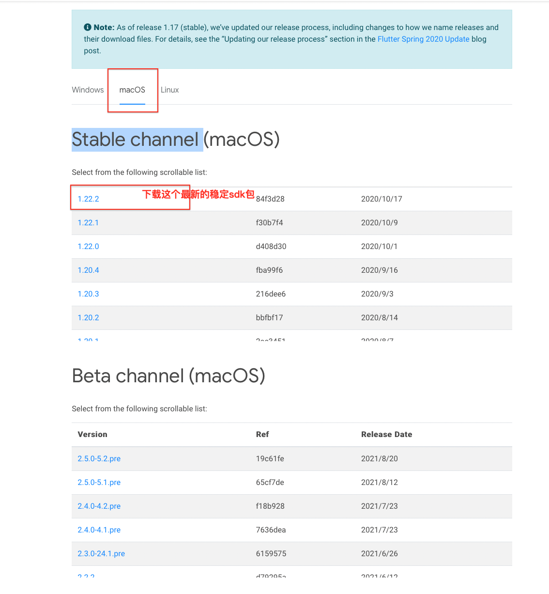

然后解压到你想放入的文件夹，如下

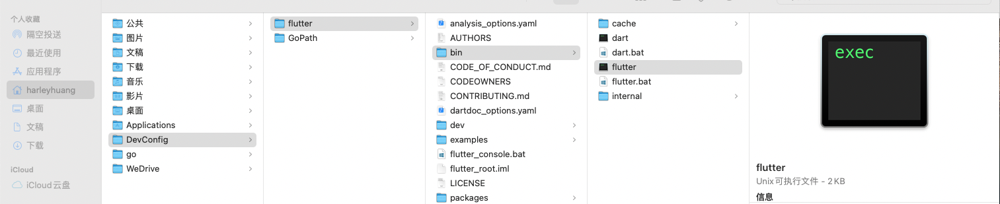

执行如下命令在Terminal:

```
$ ln -s /Users/harleyhuang/DevConfig/flutter/bin/flutter /usr/local/bin

$ flutter

$ flutter doctor
```

最后出现如下表示成功了！

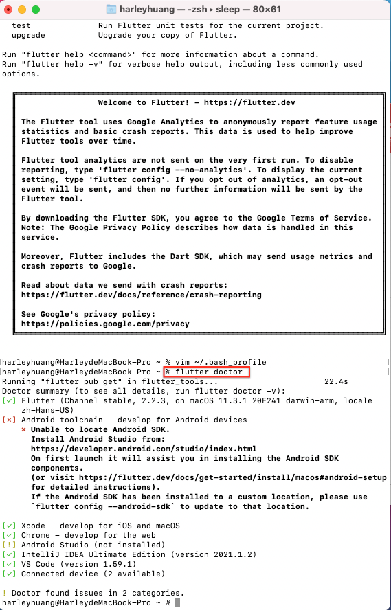


**PS：ls 那步是因为环境变量设置无效所以才将 flutter 设置成软连接的。官网上面一大堆环境变量设置其实都不是必须的，不必照做。**


<br/>
<br/>

> **安装Android手机模拟器**

&emsp; Xcode 自带 IOS 模拟器就不说了。问题出在安卓模拟器，之前用 Windows 搭建 flutter 环境都是在 Android Studio AVD 管理里面自己装安卓模拟器，再不济也是去装个什么腾讯模拟器、夜神模拟器啥的。但是在 M1 芯片的 macOS 上统统没有，如果是 inter 芯片的可以试试。好在谷歌也注意到这个问题了，给了一个 [M1 芯片上可以运行的安卓模拟器](https://github.com/google/android-emulator-m1-preview)


<br/>
<br/>


> 创建一个项目

- 在VSCode中下载Dart和Flutter插件
- **Command+shift+P**快捷键创建一个项目

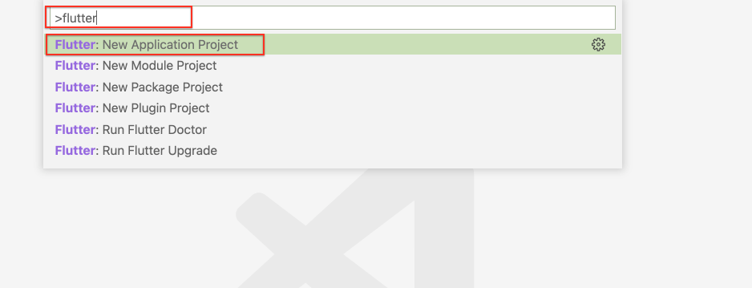


<br/>
<br/>

> <h2 id=""></h2>


<br/>
<br/>

> <h2 id=""></h2>


<br/>
<br/>

> <h2 id=""></h2>


<br/>

***
<br/>


> <h1 id="JavaScript配置">‌JavaScript配置</h1>

<br/>

> <h2 id="Code自动保存">Code自动保存</h2>


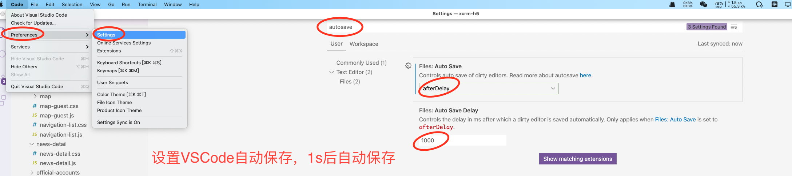


<br/>
<br/>

> <h2 id='vscode-icons'>文件图标vscode-icons</h2>

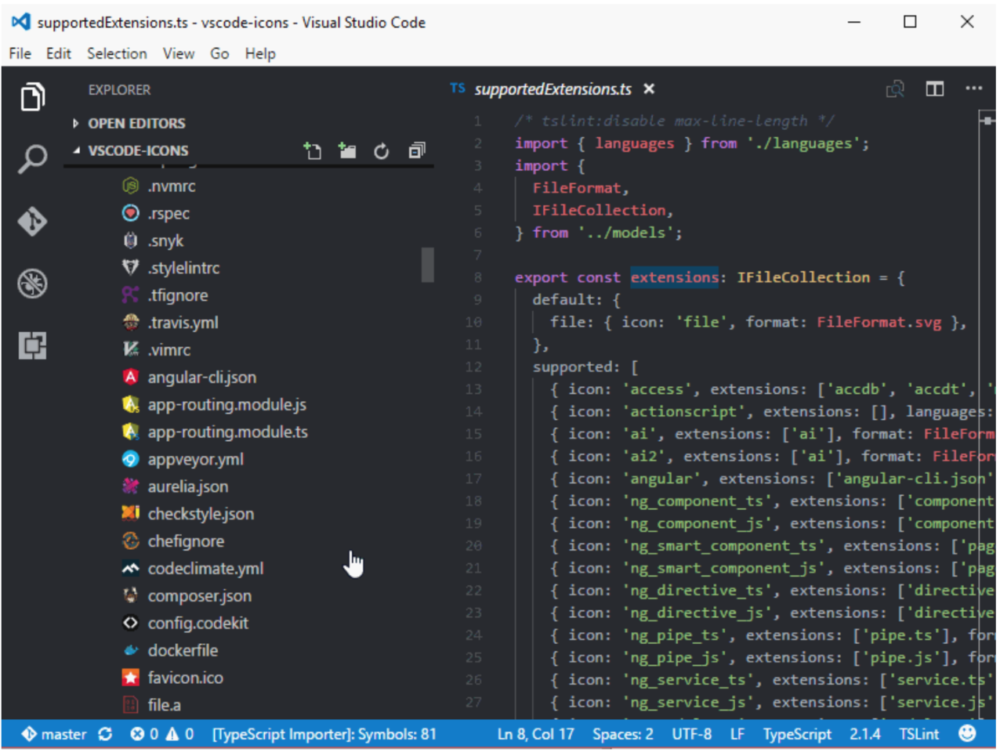

&emsp; 首先为了我们在编码时有一个高效、易用的界面，我们需要对一些不明了的组件做一些美化。

&emsp; vscode-icons 插件可以实现对各种文件类型的文件前的图标进行优化显示，这样我们在查看长长的文件列表的时候，可以直接通过文件的图标就可以快速知道文件的类型，而不是去看文件的后缀。


<br/>
<br/>

> <h2 id='ESLint'>ESLint</h2>

&emsp; 用来检测几种前端开发语言，例如JavaScript和HTML等，下面是配置步骤：

**打开终端：**

```
//全局安装eslint
$ sudo npm i eslint -g


// 跳转到具体方法实现用到这个小插件命令
$ sudo npm install -g eslint;  

//如果用到html中的js校验
$ sudo npm i eslint-plugin-html -g

//如果用到es2015语法,这个是个人需要
npm i babel-eslint -g
```

然后在VSCode下载`ESLint`插件，在**settings.json**进行如下配置(将下面进行粘贴复制，覆盖之前配置的)：

```
{
    "workbench.colorTheme": "Quiet Light",
    "emmet.triggerExpansionOnTab": true,
    "workbench.editor.enablePreview": false,
    "editor.snippetSuggestions": "top",
    "editor.fontSize": 20,
    "liveServer.settings.donotShowInfoMsg": true,
    "javascript.updateImportsOnFileMove.enabled": "always",
    "editor.inlineSuggest.enabled": true,
    "workbench.editor.limit.enabled": true,
    "typescript.implementationsCodeLens.enabled": true,
    "typescript.referencesCodeLens.enabled": true,
    "json.maxItemsComputed": 6000,
    "files.autoSave": "onFocusChange",
    "gopls": {},
    "go.gopath": "/Users/harleyhuang/DevConfig/GoPath",
    "go.alternateTools": {},
    "git.enableSmartCommit": true,
    "window.zoomLevel": 1,
    "eslint.lintTask.enable": true,
    "eslint.format.enable": true,
    //它支持什么代码
    "eslint.validate": [
        "javascript",
        "javascriptreact",
        "vue-html",
        "html",
        "vue"
    ],
    // 需要 npm install -g eslint-plugin-vue
    //以下配置说明eslint支持什么语法，但是一定要装以上全局插件才能用
    "eslint.options": {
        "extensions": [
            ".js",
            ".vue"
        ]
    },
    "explorer.confirmDragAndDrop": false,
    //保存时候修复
    "editor.codeActionsOnSave": {
        "source.fixAll.eslint": true
    },
}
```


然后重启VSCode

&emsp; 如果多人开发项目建议不要用，因为你会把别人的撰写代码风格改变了

<br/>

若是想还更精细的配置，可以配置eslint文件到项目根目录，配置文件名称eslintrc.json，内容如下：

```
{
        "plugins": [
                // "react",
                "html"
        ],
        "env": {
                "node": true,
                "jquery": true,
                "es6": true,
                "browser": true
        },
        "globals": {
                "angular": false
        },
        "parser": "babel-eslint",
        "rules": {
                //官方文档 http://eslint.org/docs/rules/
                //参数：0 关闭，1 警告，2 错误
                // "quotes": [0, "single"],                  //建议使用单引号
                // "no-inner-declarations": [0, "both"],     //不建议在{}代码块内部声明变量或函数
                "no-extra-boolean-cast": 1, //多余的感叹号转布尔型
                "no-extra-semi": 1, //多余的分号
                "no-extra-parens": 0, //多余的括号
                "no-empty": 1, //空代码块
 
                //使用前未定义
                "no-use-before-define": [
                        0,
                        "nofunc"
                ],
 
                "complexity": [0, 10], //圈复杂度大于*
 
                //定义数组或对象最后多余的逗号
                "comma-dangle": [
                        0,
                        "never"
                ],
 
                // 不允许对全局变量赋值,如 window = 'abc'
                "no-global-assign": ["error", {
                        // 定义例外
                        // "exceptions": ["Object"]
                }],
                "no-var": 0, //用let或const替代var
                "no-const-assign": 2, //不允许const重新赋值
                "no-class-assign": 2, //不允许对class重新赋值
                "no-debugger": 1, //debugger 调试代码未删除
                "no-console": 0, //console 未删除
                "no-constant-condition": 2, //常量作为条件
                "no-dupe-args": 2, //参数重复
                "no-dupe-keys": 2, //对象属性重复
                "no-duplicate-case": 2, //case重复
                "no-empty-character-class": 2, //正则无法匹配任何值
                "no-invalid-regexp": 2, //无效的正则
                "no-func-assign": 2, //函数被赋值
                "valid-typeof": 1, //无效的类型判断
                "no-unreachable": 2, //不可能执行到的代码
                "no-unexpected-multiline": 2, //行尾缺少分号可能导致一些意外情况
                "no-sparse-arrays": 1, //数组中多出逗号
                "no-shadow-restricted-names": 2, //关键词与命名冲突
                "no-undef": 1, //变量未定义
                "no-unused-vars": 1, //变量定义后未使用
                "no-cond-assign": 2, //条件语句中禁止赋值操作
                "no-native-reassign": 2, //禁止覆盖原生对象
                "no-mixed-spaces-and-tabs": 0,
 
 
 
                //代码风格优化 --------------------------------------
                "no-irregular-whitespace": 0,
                "no-else-return": 0, //在else代码块中return，else是多余的
                "no-multi-spaces": 0, //不允许多个空格
 
                //object直接量建议写法 : 后一个空格前面不留空格
                "key-spacing": [
                        0,
                        {
                                "beforeColon": false,
                                "afterColon": true
                        }
                ],
 
                "block-scoped-var": 1, //变量应在外部上下文中声明，不应在{}代码块中
                "consistent-return": 1, //函数返回值可能是不同类型
                "accessor-pairs": 1, //object getter/setter方法需要成对出现
 
                //换行调用对象方法  点操作符应写在行首
                "dot-location": [
                        1,
                        "property"
                ],
                "no-lone-blocks": 1, //多余的{}嵌套
                "no-labels": 1, //无用的标记
                "no-extend-native": 1, //禁止扩展原生对象
                "no-floating-decimal": 1, //浮点型需要写全 禁止.1 或 2.写法
                "no-loop-func": 1, //禁止在循环体中定义函数
                "no-new-func": 1, //禁止new Function(...) 写法
                "no-self-compare": 1, //不允与自己比较作为条件
                "no-sequences": 1, //禁止可能导致结果不明确的逗号操作符
                "no-throw-literal": 1, //禁止抛出一个直接量 应是Error对象
 
                //不允return时有赋值操作
                "no-return-assign": [
                        1,
                        "always"
                ],
 
                //不允许重复声明
                "no-redeclare": [
                        1,
                        {
                                "builtinGlobals": true
                        }
                ],
 
                //不执行的表达式
                "no-unused-expressions": [
                        0,
                        {
                                "allowShortCircuit": true,
                                "allowTernary": true
                        }
                ],
                "no-useless-call": 1, //无意义的函数call或apply
                "no-useless-concat": 1, //无意义的string concat
                "no-void": 1, //禁用void
                "no-with": 1, //禁用with
                "space-infix-ops": 0, //操作符前后空格
 
                //jsdoc
                "valid-jsdoc": [
                        0,
                        {
                                "requireParamDescription": true,
                                "requireReturnDescription": true
                        }
                ],
 
                //标记未写注释
                "no-warning-comments": [
                        1,
                        {
                                "terms": [
                                        "todo",
                                        "fixme",
                                        "any other term"
                                ],
                                "location": "anywhere"
                        }
                ],
                "curly": 0 //if、else、while、for代码块用{}包围
        }
}

```


<br/>
<br/>


<br/>

***
<br/>

> <h1 id='React配置'>React配置</h1>

[IntelliJ IDEA激活码获取](http://idea.javatiku.cn)

<br/>

<h2 id="Vue安装">Vue安装</h2>

<br/>

> <h3 id="安装brew">安装brew</h3>

```
/usr/bin/ruby -e "$(curl -fsSL https://raw.githubusercontent.com/Homebrew/install/master/install)"
```


这里如果执行报错：

```
Failed to connect to raw.githubusercontent.com port 443: Connection refused
```

原因是https://raw.githubusercontent.com这个域名被国内和谐了，但是我们可以通过真实ip来进行访问。

在 `https://www.ipaddress.com/` 查询 `raw.githubusercontent.com` 的真实IP。


- 修改hosts

```
sudo vim /etc/hosts
```


添加如下内容

```
199.232.68.133 raw.githubusercontent.com
```

如果仍然报错

```
remote: Enumerating objects: 49, done.
remote: Counting objects: 100% (49/49), done.
remote: Compressing objects: 100% (49/49), done.
error: RPC failed; curl 18 transfer closed with outstanding read data remaining
fatal: The remote end hung up unexpectedly
fatal: early EOF
fatal: index-pack failed
Failed during: git fetch origin --force
```

我们可以先ping一下github.com看看是否通，如果不通则同上述处理，只不过这次使用github.com的真实域名。

如果还是不行的话，也别费那个劲了，直接跳过这步，使用下面手动安装就行了。

也可以参考下面的文章：[M1芯片的Mac安装homebrew](https://blog.csdn.net/qq1808814025/article/details/112667458)


<br/>
<br/>


> <h3 id="安装Nodejs">安装Node js</h3>

- 终端直接执行或者去[官网进行下载](https://nodejs.org/en/)

```
brew install nodejs
```

终端输入查看版本号，是否安装成功。

```
npm -v
node -v
```


<br/>
<br/>

> <h2 id="安装vue">安装vue</h2>

- 终端输入安装vue

```
Sudo npm i -g vue
```

- 安装vue-cli

```
Sudo npm install -g vue-cli
```

- 安装webpack

```
Sudo npm install -g webpack
```


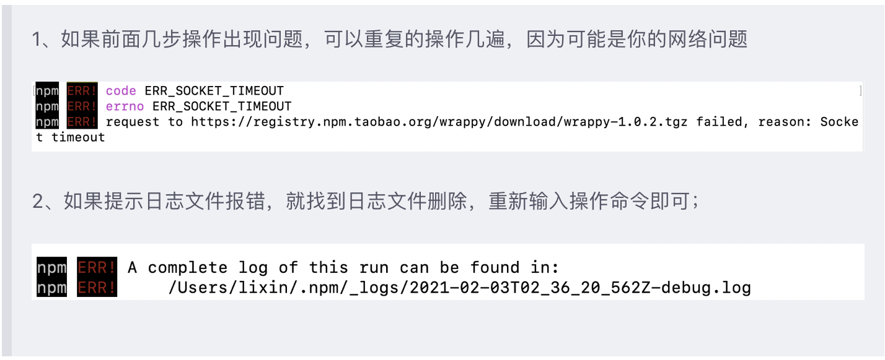


<br/>
<br/>

> <h2 id="VSCode环境配置">环境配置</h2>


- 使用VSCode开发React，语法自动补全插件

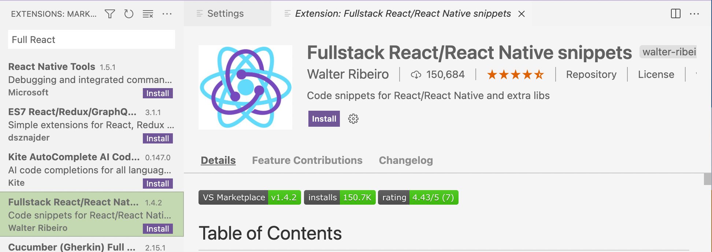

- 配置用户

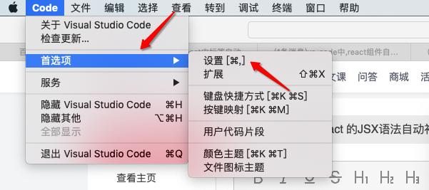


- 搜索emmet.triggerExpansionOnTab，启用

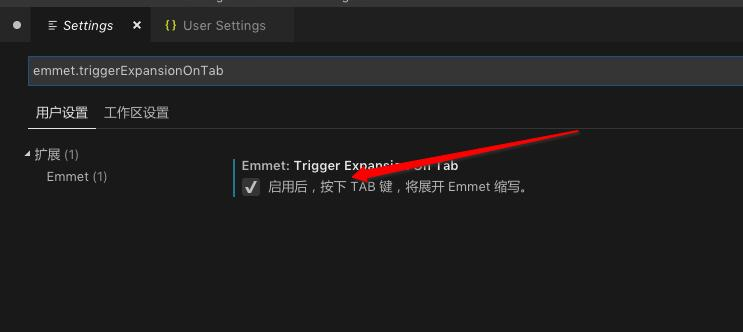

- 打开setting.json设置

command+shift+p,然后选择下面的

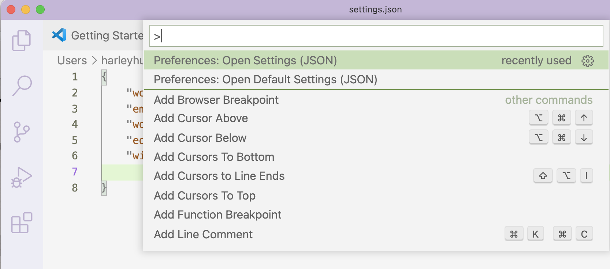

把配置偏好设置，把这两个命令粘贴到用户设置

```
"editor.snippetSuggestions": "top",

"emmet.triggerExpansionOnTab": true
```

如下图：

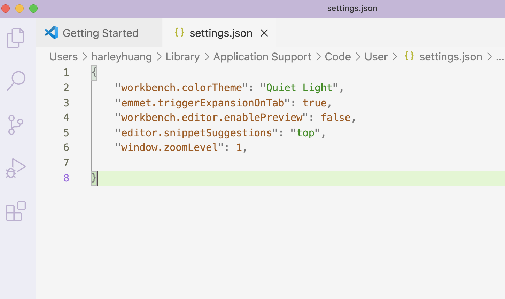

完成配置后，重启就好了。


<br/>


- VSCode下载插件：**Debugger for Chrome**

- 配置 VSCode 连接到 Chrome
	- 在调试按钮的右侧选择 **add configuration**
	- 选择 chrome 进行调试

- Launch.json 配置：

```
{
    // Use IntelliSense to learn about possible attributes.
    // Hover to view descriptions of existing attributes.
    // For more information, visit: https://go.microsoft.com/fwlink/?linkid=830387
    "version": "0.2.0",
    "configurations": [


        {
            "type": "chrome",
            "request": "launch",
            "name": "Launch Chrome against localhost",
            "url": "http://localhost:3000",
            "webRoot": "${workspaceFolder}"
        }
    ]
}
```


- 启动 Debug 进行调试

- 启动服务
	- 在终端中运行 npm start 启动测试服务，运行调试后会自动启动 chrome 访问到 http://localhost:3000/ （在 launch.json 文件中配置过的）。此时应用会自动停在断点的位置。


<br/>
<br/>

> <h2 id="项目创建">项目创建</h2>


> 脚手架创建项目

```
$ cd (放置项目文件夹的路径地址)
$ npx create-react-app react_demo
```

- 用VSCode打开刚刚创建好的项目

- 打开VSCode的 launch.json文件夹，按照下面修改：

```
{
    // 使用 IntelliSense 了解相关属性。 
    // 悬停以查看现有属性的描述。
    // 欲了解更多信息，请访问: https://go.microsoft.com/fwlink/?linkid=830387
    "version": "0.2.0",
    "configurations": [
        {
            "type": "chrome",
            "request": "launch",
            "name": "Launch Chrome against localhost",
            // 这个地址最好修改下，若是启动了好几个项目可能url重复，最好设置大点如： 3010等
            "url": "http://localhost:3001",
            "webRoot": "${workspaceFolder}"
        }
    ]
}
```

- 在终端输入

```
$ nom start
```

- 可以调试了


<br/>
<br/>

> 下载第三方插件

- 使用npm进行下载，如：下载调试插件vconsole

```
$ nom install vconsole
```

&emsp; 然后在`pakcage.json`文件中`dependencies`字段中会自动出现`"vconsole": "^3.9.1",`这个插件的版本号


<br/>

***
<br/>


> <h1 id="Go配置">Go配置</h1>


<br/>
<br/>

> <h2 id="Go环境配置">Go环境配置</h2>


<br/>

> 下载软件包

在[**Go**](https://golang.google.cn/dl/)进行下载，如下图：

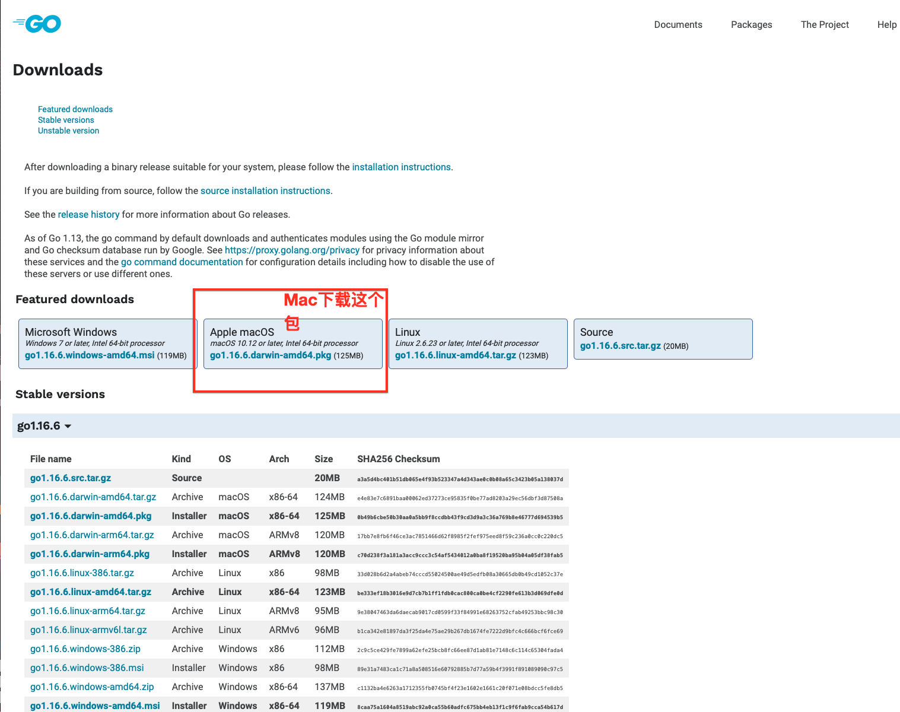

<br/>

> 打开终端，配置环境变量

```
 $ mkdir /Users/harleyhuang/Documents/GitHub/GoPath
```

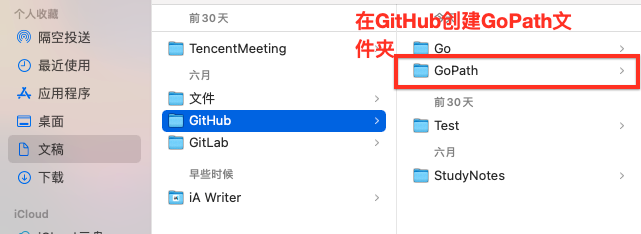

<br/>

```
//编辑bash_profile
$ vim .bash_profile

//在其vim中进行配置 i-> 开始配置
# Go环境配置
export GOROOT=/usr/local/go
export GOPATH=/Users/harleyhuang/Documents/GitHub/GoPath
export PATH=$PATH:$GOROOT/bin
export PATH=$PATH:$GOPATH/bin
# Go END


//配置好后，敲击 esc 按钮，然后输入： :wq,进行保存并退出

//回到终端后输入下面命令进行保存
$ source .bash_profile 
```

验证：

```
$ go version
```


<br/>

***
<br/>

>## <h2 id="VSCode配置">[VSCode配置](https://sysin.org/blog/go-vs-code/)</h2>


<br/>


> Go 扩展

&emsp; 在 VSCode的扩展面板输入GO并进行下载

<br/>

> 安装 go tools

&emsp; 按 F1 键，输入` >go:install`，下面会自动搜索相关命令，我们选择 `Go:Install/Update Tools `这个命令（使用 VS Code 打开 go 文件也会提示安装“xxx”工具）。

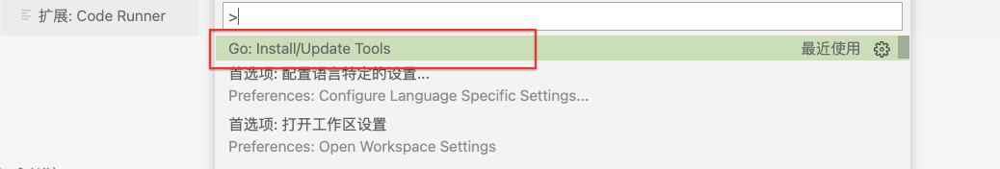


<br/>

> 小Demo练习

&emsp; 使用 VS Code 打开一个文件夹，在文件夹中新建一个 .go 文件，例如：hello.go，打开 hello.go，输入 p，可以看到提示 package main 等内容已经出现。

示例：hello.go

```
package main

func main() {
  println("Hello", "world")
}
```

示例：Version.go

```
package main

import (
  "fmt"
  "runtime"
)

func main() {
  fmt.Printf("%s", runtime.Version())
}
```


&emsp; 在编辑区域右键点击出现菜单，选择“Run Code”（或者option+contorl+N），可以看到程序执行结果：

```
hello.go 
输出：
Running] go run "/Users/harleyhuang/Documents/GitHub/Go/hello.go"
Hello World!

[Done] exited with code=0 in 0.528 seconds

```


打开终端编译：

```
$ go build hello.go

//执行程序：
$ ./hello

```

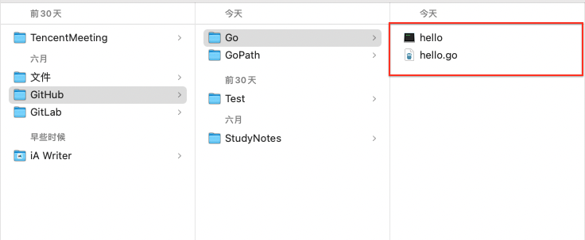


<br/>

> vscode配置GOPATH

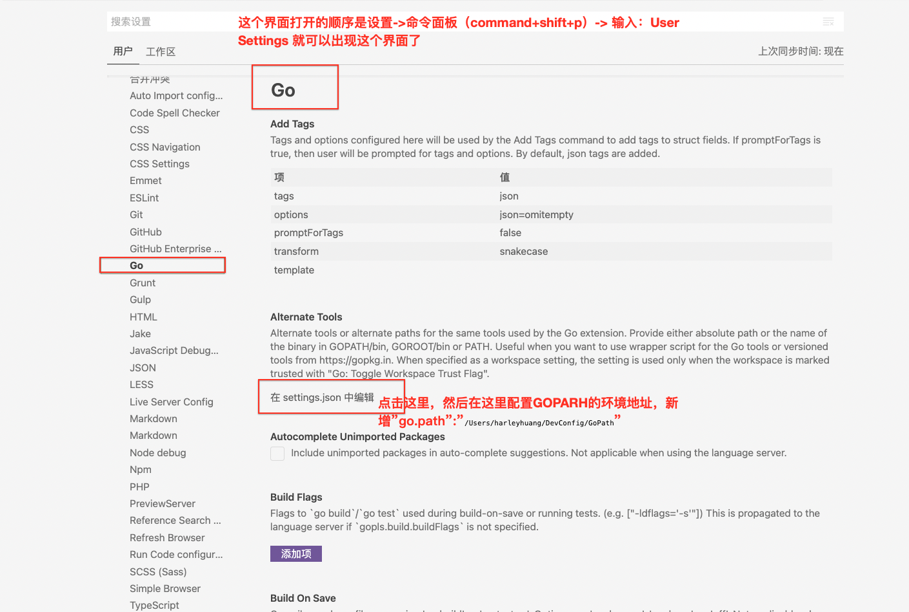

注意：这里图里面的注释错了，是 **`go.gopath`** 字段

<br/>

> 安装调试器

在用户的源码的GOPATH目录中打开命令行，在命令行中输入以下命令下载dlv调试器。

```
//定位到当前GoPath文件夹
$ cd /Users/harleyhuang/DevConfig/GoPath

$ set GOPATH=%cd%

$ go get github.com/derekparker/delve/cmd/dlv
 

```

编译好的dlv会放在GOPATH的bin目录下。

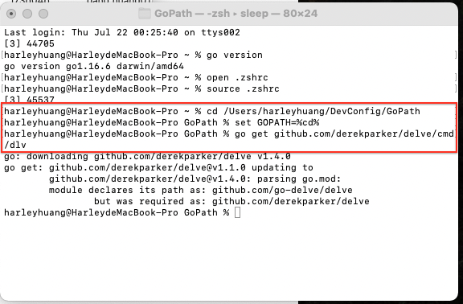


<br/>

> 添加配置

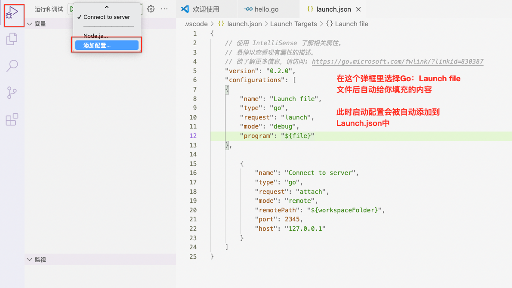

最后的launch.json配置如下：

```
{
    // 使用 IntelliSense 了解相关属性。 
    // 悬停以查看现有属性的描述。
    // 欲了解更多信息，请访问: https://go.microsoft.com/fwlink/?linkid=830387
    "version": "0.2.0",
    "configurations": [ 
        {
            "name": "Launch file",
            "type": "go",
            "request": "launch",
            "mode": "debug",
            "program": "${file}"
        }
    ]
}
```

然后点击甲壳虫进行debug测试，就可以跑代码了。😄哈哈


> <h2 id=''></h2>


<br/>
<br/>

> <h2 id=''></h2>


<br/>
<br/>

> <h2 id=''></h2>


<br/>
<br/>

> <h2 id=''></h2>


<br/>

***
<br/>


> <h1 id=""></h1>


