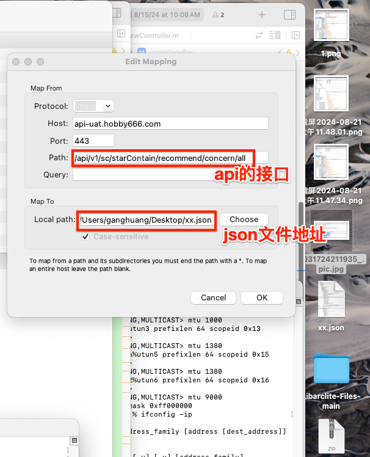

></h1>
- [**旅游区**](#旅游区)
-  [**购物总结**](#购物总结)
	- [**眼镜片购买**](#眼镜片购买)
	- [**贴牌商标**](#贴牌商标)
	- [**衣服材料**](#衣服材料)
		- [粘胶纤维](#粘胶纤维)
		- [三醋酸纤维](#三醋酸纤维)
		- [聚酯纤维](#聚酯纤维)
		- [氨纶](#聚酯纤维)
		- [锦纶](#锦纶)
- [租房总结](#租房总结)

 

***

   

> <h1 id="旅游区">旅游区</h1>

| 景点 | 玩过 | 没有 |
|:--|:--|:--|
| 雁荡山风景区 | ⭕️ | ❌ |
| 华山 |  |  |
| 大理 |  |  |
| 桂林山水 |  |  |
|  |  |  |
|  |  |  |
|  |  |  |
|  |  |  |
|  |  |  |

 

***

   
<h1 id="购物总结">购物总结</h1>

 
> <h2 id="眼镜片购买">眼镜片购买</h2>

**1.防蓝光眼镜一般防蓝光百分之多少才算最好的？**

防蓝光眼镜的效果通常用其**蓝光过滤率**来衡量。一般来说，防蓝光眼镜的过滤率越高，能够有效减少蓝光对眼睛的伤害。不同品牌和型号的眼镜，蓝光过滤率可能有所不同，以下是常见的蓝光过滤率范围及其效果：

1. **高效防蓝光（80% - 90%）**
   - **最佳效果**：蓝光过滤率在80%以上，通常被认为是效果最好的防蓝光眼镜。能够有效过滤大部分高能蓝光（400-500nm波段的蓝光），减少眼睛疲劳、干涩和视力模糊等不适。
   - **适用人群**：长时间面对电子屏幕（如电脑、手机、电视等）的办公族、学生、设计师等。

2. **中等防蓝光（50% - 70%）**
   - **较好效果**：过滤约50%至70%的蓝光，能够提供较好的眼睛保护，但可能不能完全避免蓝光带来的眼睛疲劳。适合不需要极端保护的人群。
   - **适用人群**：偶尔使用电子产品，或者没有长期用眼需求的用户。

3. **低效防蓝光（30% - 50%）**
   - **一般效果**：过滤率在30%至50%，适合日常佩戴，但对于长时间用眼的用户保护效果有限。
   - **适用人群**：主要用于日常生活中，偶尔用眼的轻度用户。

### 总结：
如果你长时间使用电子设备（如长时间看手机、电脑等），**80%及以上的蓝光过滤率**是比较理想的，能够有效缓解蓝光带来的眼睛疲劳问题。如果你主要是偶尔用眼，那么**50%-70%**的蓝光过滤率可能就足够了。

选择防蓝光眼镜时，不仅要看蓝光过滤率，还要注意镜片的质量、舒适性以及是否有抗紫外线、抗反射等附加功能。

   
> <h2 id="贴牌商标">贴牌商标</h2>
|:--|:--|:--|:--|:--|:--|
| 雅鹿 | 南极人 | 啄木鸟 | 罗蒙 | 北极绒 | 同仁堂 |
| 鸭鸭	 | 俞兆林	 | 飞利浦 | 修正	 | 泰芝郎	 | 荣事达 |
| 浪莎 | 富贵鸟 | 恒源祥 | 红豆 | 七匹狼 | 花花公子 |
| 志高	| 仁和 | 拉夏贝尔 | 凤凰 | Jeep	 | 猫人 |
| 	圣吉卡丹 | 卡帝乐鳄鱼 | 梵高	 |  |  |  |
|  |  |  |  |  |  |
|  |  |  |  |  |  |
|  |  |  |  |  |  |
|  |  |  |  |  |  |

 

***
   
> <h1 id="衣服材料">衣服材料</h1>

 
> <h2 id="粘胶纤维">粘胶纤维</h2>

- **优点**
	- 粘胶纤维的手感和光泽都不错，柔软跟棉相似。
	- 良好的吸湿和透气性是粘胶纤维的主要特点，因为粘胶的化学成分与棉极为相似，所以各方面性能都与棉很接近。
	- 粘胶易于染色，甚至比棉麻等纤维更易染色，能很好的减少加工成本，而且染色后不易掉色。

 

- **缺点:**
	- 粘胶纤维弹性较差，容易留下褶皱。
	- 粘胶纤维是湿牢度差，衣服折叠后会留下折痕且不易恢复。
	- 粘胶纤维易缩水，严重影响织物的寿命，而且水洗后易起球。
	- 粘胶生产过程中产生的衍生物会污染环境。

- **洗涤要点：**
	- 水洗时不要长时间侵泡，最好不要超过15分钟，不然会缩水和变质。
	- 洗涤时不要用力过猛，会起毛和出现裂口。
	- 水温应低于35摄氏度，选用中性清洗液。
	- 不要再暴晒的环境中晾晒，面料容易变质以致缩短寿命。

   
> <h2 id="三醋酸纤维">三醋酸纤维</h2>

三醋酸纤维的制作原材料是天然木浆中的半合成纤维，这种布料初是在日本研制出来的，它属于一种高科技新型织物。这种布料的了解的人不多，接下来就跟大家介绍一下三醋酸纤维布料的优缺点。

  

- **优点：**
	- 织物吸湿透气且不会沾汗，而且有肯定的去静电能力，穿上后非常舒适不会刺激到皮肤；
	- 三醋酸布料不粘尘且打理简便，手洗或者40度以下机洗都可以。
	- 布料的上色性极佳，可以用各种颜色渲染而且织物不简单掉色，布料的色泽接近自然；
	- 三醋酸整体外外观跟桑蚕丝非常近似，织物具手感柔和具有一点的弹性，它有着和蚕丝一样的比重，因此悬垂感也是和桑蚕丝一样的；
	- 三醋酸布料的热塑性极好，制作工作装的话可以保持工作装的设计样式，因此这种布料常用来制作各种需要保留褶皱的工作装就像褶裥裙子等。
	- 它有着不霉变防虫蛀的性能，这是其他天然纤维不具备的，而且织物水洗后简单干；
	- 三醋酸的很多性能和蚕丝近似，但强度和回溯率虽然不及桑蚕丝，其他性能都非常接近；

 

- **缺点：**
	- 因为三醋酸的各方面性能都不错，除了价格较贵以外基本没什么大问题，如果织物太贵的话可以选择其他布料。

   

> <h2 id="聚酯纤维">聚酯纤维</h2>

聚酯纤维(俗称涤纶,聚对苯二甲酸乙二酯)由有机二元酸和二元醇缩聚而成的聚酯经纺丝所得的合成纤维。就是俗称的涤纶，被广泛运用于服饰面料，涤纶有优良的耐皱性、弹性和尺寸稳定性、绝缘性能好、用途非常的广泛，适用于男女老少的衣着。

- **优点：**
	- 聚酯纤维具有较高的强度与弹性恢复能力，因此坚牢耐用、抗皱免烫。
	- 它的耐光性较好，除比腈纶差外，其耐晒能力胜过天然纤维织物，尤其是在玻璃后面的耐晒能力很好，几乎与腈纶不相上下。
	- 另外聚酯面料耐各种化学品性能良好，酸、碱对其破坏程度都不大，同时不怕霉菌，也不怕虫蛀。

 

- **缺点：**
	- 吸湿性差，吸水性不强，抗熔性差，容易吸附灰尘，是由于其质地所致；
	- 然后就是透气性较差，不容易透气；
	- 后就是其染色性能较差，须要在高温下用分散性染料染色。

   

**聚酯纤维和棉比较：**
- 聚脂纤维常做运动裤常用面料，但涤纶透气不好，容易感觉闷热，不属于高档面料。
- 在全球走的是环保路线的今天，也常用秋冬面料，但不易做内衣。
- 制作成本比棉低。
- 涤纶耐酸。清洗时用中性或酸性洗涤剂，用碱性洗涤剂会使面料老化加速。另外，聚酯纤维材质的面料一般不会要求熨烫，低温蒸汽轻烫就行 。因为不管熨烫多少次和棉一样，遇水就皱。
- 棉和聚酯纤维有所不同，棉耐碱。清洗时用普通洗衣粉就好。中温蒸汽轻烫就行 。棉透气好，吸湿排汗，儿童服装面料常选。（杭州中冉纺织分享)

   

> <h2 id="氨纶">氨纶</h2>

聚氨酯弹性纤维)的最大特点是弹性极强，最大能拉伸5到8倍且不损坏纤维，一般情况下氨纶需要跟其他纤维混纺而不能独自编织的，而且大部分的占比都会在1成以下，泳装的话氨纶在混纺中的比例会占到2成。
	
除此之外它有着和天然乳胶丝相似的物理性能，但它耐化学降解性能更强，热稳定性一般其软化温度高于二百摄氏度，氨纶织物能够耐汗耐盐，但布料暴晒后简单褪色。
	
 

- **优点：**
	- 前面有提到它的延伸性极佳，因此面料对应的保型性也会很不错，氨纶织物在折叠后不会留下褶皱。
	- 手感的话虽然没有棉那么柔软但整体感觉还行，织物穿上后也很舒适非常适合生产贴身衣服。
	- 氨纶是化纤的一种，它有着耐酸碱耐老化等特性。
	- 良好的染色性能也使得氨纶织物正常使用的情况下是不会出现褪色的情况

   
**缺点：**
	- 吸湿性差的氨纶的主要缺点。因此它的舒适程度是不及棉麻丝等天然纤维的。
	- 氨纶不能单独使用，一般都是根据面料的用途跟其他面料混纺。
	- 它的耐热性比较差。

   

**保养技巧：**
	- 氨纶耐汗水耐盐，但是它不宜长期浸泡也不能在高温清洗，不然会出现纤维损坏的情况，所以在洗涤织物时应在冷水中洗涤，可手洗也可机洗，对洗涤液的没什么特殊的要求，在洗涤完以后直接挂在阴凉处即可，避免直接在阳关下暴晒。
	- 氨纶织物不易变形且化学性能稳定，正常穿着跟收纳即可，长期不穿要式衣柜处于一个通风干燥的环境之中。

   

> <h2 id="锦纶">锦纶</h2>

聚酰氨纤维)还有一个我们非常熟悉的名字那就是“尼龙”。简单说就是把尼龙材料拉成很细的纤维，然后再织成布的面料，其学名为聚酰氨纤维，是中国所产的聚酰胺类纤维的统称。

锦纶其实就是我们常说的尼龙面料，是全世界最早的合成纤维，因其性能优良而且有着丰富的资源，锦纶在世界各国都被广泛使用。
 

 

- **优点：**
	- 锦纶面料的耐磨性跟弹性是纤维中最好的，是其余织物都无法相比的，有纤维之首的称号。比棉纤维强10倍，干态粘胶纤维的10倍，湿态纤维的140倍, 属于耐磨面料。
	- 在合成纤维中锦纶属于吸湿性较好的一种，织物舒适感要比涤纶舒适。
	- 耐蛀耐腐蚀也是锦纶面料的优势之一。
	- 面料属轻型织物，它的弹性以及恢复性都很好，是生产登山服、运动服的首选材料。
	- 抗皱性：锦纶面料的弹性及弹性恢复性极好，用力捏过紧锦纶面料后，虽然一开始会有折痕，但是经过过一段时间后，锦纶面料能够慢慢的恢复原状，因其纬、经纱的牢度大等原因，从而让锦纶面料的抗皱性也较好。
	- 防风性：锦纶织物的吸湿性在合成纤维织物中属较好品种，也因质量较为轻便，通常作为登山服、羽绒服等衣服的面料，也因其密度较高，纤维的回弹性也较好的原因，很大的程度上都能防止冷风的侵入。

   

 
- **缺点：**
	- 锦纶易变形且在使用过程中会留下褶皱。
	- 耐光性不强：锦纶面料的光泽较为暗淡，这也是为什么它需要和其余面料混织的原因，因其色彩不是特别的鲜艳，所以也只能发挥辅助的作用。
	- 耐热性不佳：使用锦纶面料所制成的织物的热耐不高，而且在洗涤中需要注意织物上标明的保养条件，以免损伤衣物，特别是在熨烫时熨烫的温度应控制在140℃以下。
	- 锦纶面料的耐光和耐热性欠佳，穿着过程中不要直接在阳光下长时间暴晒。
	- 锦纶织物容易产生静电，而且透气性也不好。

   

- **锦纶和涤纶比较:**
	- 锦纶的染色性和吸湿性都比涤纶的要好，能耐碱但不耐酸，如果长期的暴露在日光之下其纤维强度就会下降。
	- 锦纶还有热定型的特性，能保持住加热时所形成的弯曲变形形态

 

***
   

> <h1 id="租房总结">租房总结</h1>

**租房必问点：**

- 房间是否12平方米以上？

- 是否实体墙？

- Wi-Fi宽带哪家运营商的啊？带宽多少啊？

-  水电费怎么算的？

- 卫生间是私有还是公共的？多大的平方？

- 厨房大吗（厨房不要和卧室连在一块）？设备是否有大冰箱、抽烟机、电磁炉、微波炉？

- 有晾晒衣服、被子的地方吗？

- 楼层再多高啊？

- 远离马路吗？距离马路多远？

- 去美图大厦多远路程？

    

**看房攻略及注意事项：**

-  浴室、马桶的水压是否够；
-  白天看采光，晚上是否

同安区美图大厦附近有房吗？卧室没有和厨房连在一块的（或者有门可以关住），可以了解下吗？ 

	
