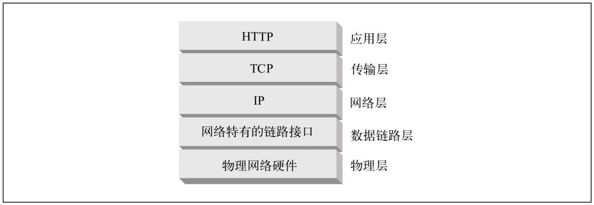
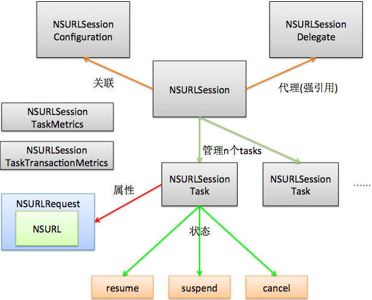
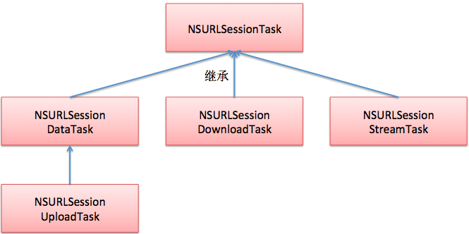
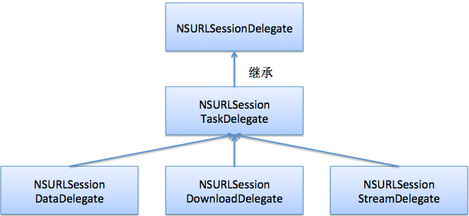
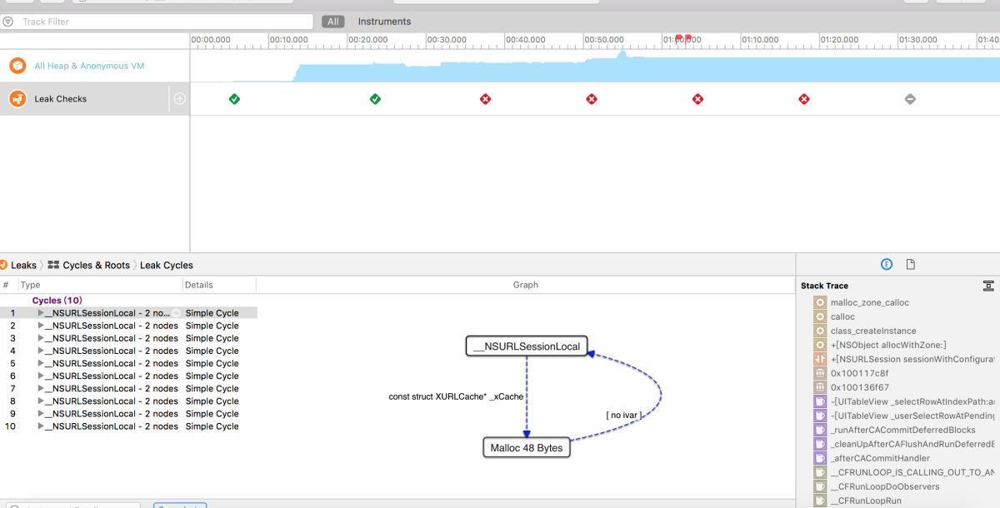

> <h2 id=''></h2>
> [](https://www.jianshu.com/p/8184e762872c)
- [**基础**](#基础)
	- [请求头配置](#请求头配置)
	- [HTTP 状态码](#HTTP状态码)
	- [NSURLRequestCachePolicy缓存策略](#NSURLRequestCachePolicy缓存策略)
	- [请求对象](#请求对象)
		- [NSURLRequest](#NSURLRequest)
		- [NSMutableRequest](#NSMutableRequest)
	- [网络缓存](#网络缓存)
- [**NSURLSession**](#NSURLSession)
	- [创建NSURLSession](#创建NSURLSession)
	- [NSURLSession属性](#NSURLSession属性)
	- [管理会话](#管理会话)
	- [数据响应方式](#数据响应方式)
		- [任务响应数据](#任务响应数据)
		- [代理响应数据](#代理响应数据)
	- [添加任务](#添加任务)
	- [会话添加DataTasks](#会话添加DataTasks)
		- 	[会话中添加DownloadTasks](#会话中添加DownloadTasks)
		- [会话中添加UploadTasks](#会话中添加UploadTasks)
		- 	[会话中添加StreamTasks](#会话中添加StreamTasks)
		- [	会话中添加WebSocketTasks](#会话中添加WebSocketTasks)
	- [NSURLSession完成一个网络请求](#NSURLSession完成一个网络请求)
		- [sharedSession单例创建会话](#sharedSession单例创建会话)
		- [配置session时 && 不设置delegate](#配置session时&&不设置delegate)
		- [配置sesion && 设置delegate && 设置delegateQueue](#配置sesion&&设置delegate&&设置delegateQueue)
		- [Post请求下载图片](#Post请求下载图片)
		- 	[创建Post请求上传一个图片](#创建Post请求上传一个图片)
		- ‌[Delegate接受数据](#Delegate接受数据)
- [**AFNetworking架构图**](#AFNetworking架构图)
	- [AFNetworking3.0请求流程线程](#AFNetworking3.0请求流程线程)
	- [属性](#属性)
		- [removesKeysWithNullValues](#removesKeysWithNullValues)
	- [HTTPS认证流程](#HTTPS认证流程)
	- [目录结构](#目录结构)
	- [原生NSURLSession和AF网络请求DEMO](#原生NSURLSession和AF网络请求DEMO)
	- [数据序列化](#数据序列化)
- [**AFURLSessionManager**](#AFURLSessionManager)
	- [AFURLSessionManager头文件属性](#AFURLSessionManager头文件属性)
	- [类中使用的通知](#类中使用的通知)
	- [方法]()
		- [SessionConfig](#SessionConfig)
- [**AFHTTPSessionManager**](#AFHTTPSessionManager)
- [**AFURLRequestSerialization**](#AFURLRequestSerialization)
- [多路复用](#多路复用)
- **资料**
	- [深度理解NSURLProtocol-默许中间人攻击(掘金)](https://juejin.cn/post/6844904079458566152)
	- [OC中的NSURLSession-叶知秋0830(掘金)](https://juejin.cn/post/6844903971824500743)
	- [ **AFNetworking到底做了什么？(二)**](https://www.jianshu.com/p/f32bd79233da)
	- [**AFNetWorking 3.0之前设置请求头**](https://www.jianshu.com/p/45c722f726fd)
	- [**请求头的配置用来完成HTTP Basic Auth的鉴权**](https://blog.csdn.net/deft_mkjing/article/details/51900737)
	- [**AFNetworking使用技巧与问题**](https://www.jianshu.com/p/37018da11815)
	- [**HTTPS认证**](https://www.jianshu.com/p/a84237b07611)
	- [HTTPS使用](https://juejin.cn/post/7086488227602759693)
	- [**网络拦截NSURLProtocol**](https://juejin.cn/post/6844904079458566152)


<br/>

***
<br/>


> <h1 id='基础'>基础</h1>


<br/>

> <h2 id='请求头配置'>请求头配置</h2>

- **User-Agent**: 会告诉网站服务器，访问者是通过什么工具来请求的，如果是爬虫请求，一般会拒绝，如果是用户浏览器，就会应答;
	- 通常格式:`Mozilla/5.0 (平台) 引擎版本 浏览器版本号`

<br/>

- **Accept**: 代表发送端（客户端）希望接受的数据类型;
	- 比如: `headerDictionary[@"Accept"] = @"image/*,*/*;q=0.8"`

- [**host**](https://blog.csdn.net/weixin_45850939/article/details/120094342): 通过ip地址找到主机后,主机中可能有多台虚拟机,比如1.com、2.com、3.com等.这个host就是用来作区分的,比如:host=1.com,那说明找的是虚拟机1.com;


<br/>
<br/>


>## <h2 id='HTTP状态码'>[HTTP 状态码](https://github.com/ChenYilong/iOSDevelopmentTips/blob/master/Tips/HTTP状态码汇总.md)</h2>





当我们对一个URL地址做请求开发时,往往可以看到服务器返还给我们的一些状态码,比如:[**200, 404, 500, 301等**](https://www.runoob.com/http/http-status-codes.html),其义分别如下:
- 200 - 请求成功
- 301 - 资源（网页等）被永久转移到其它URL
- 404 - 请求的资源（网页等）不存在
- 500 - 内部服务器错误


<br/>
<br/>

> <h2 id='NSURLRequestCachePolicy缓存策略'>NSURLRequestCachePolicy缓存策略</h2>

```
// 默认的缓存策略， 如果缓存不存在，直接从服务端获取。如果缓存存在，会根据response中的Cache-Control字段判断下一步操作，如: Cache-Control字段为must-revalidata, 则询问服务端该数据是否有更新，无更新的话直接返回给用户缓存数据，若已更新，则请求服务端.
1> NSURLRequestUseProtocolCachePolicy = 0,

//忽略本地缓存数据，直接请求服务端.

2> NSURLRequestReloadIgnoringLocalCacheData = 1, 

//忽略本地缓存，代理服务器以及其他中介，直接请求源服务端.
3> NSURLRequestIgnoringLocalAndRemoteCacheData = 4, 

4> NSURLRequestReloadIgnoringCacheData = NSURLRequestReloadIgnoringLocalCacheData

//有缓存就使用，不管其有效性(即忽略Cache-Control字段), 无则请求服务端.
5> NSURLRequestReturnCacheDataElseLoad = 2, 

//死活加载本地缓存. 没有就失败. (确定当前无网络时使用)
6> NSURLRequestReturnCacheDataDontLoad = 3, 

7> NSURLRequestReloadRevalidatingCacheData = 5, 缓存数据必须得得到服务端确认有效才使用(貌似是NSURLRequestUseProtocolCachePolicy中的一种情况)
```

&emsp; **URL Loading System**默认只支持如下5中协议: 其中只有http://和https://才有缓存策略.

``` 
(1) http:// 
(2) https:// 
(3) ftp:// 
(4) file:// 
(5) data:// 
```

&emsp; **NSURLRequestReturnCacheDataDontLoad**用于离线模式的，我为了能让用户在离线下面阅读，可以设计当没有网络的时候的策略为NSURLRequestReturnCacheDataDontLoad。 


```
if (有网) { 
	cachePolicy = NSURLRequestUseProtocolCachePolicy; 
}else{ 
	cachePolicy = NSURLRequestReturnCacheDataDontLoad; 
}
```


<br/>
<br/>

> <h2 id='请求对象'>请求对象</h2>

<br/>
<br/>

> <h3 id='NSURLRequest'>NSURLRequest</h3>

&emsp; NSURLRequest：封装一个请求，保存发给服务器的全部数据，包括一个NSURL对象，请求方法、请求头、请求体等;


<br/>
<br/>

> <h3 id='NSMutableRequest'>NSMutableRequest</h3>

&emsp; NSMutableURLRequest：NSURLRequest的子类

NSMutableURLRequest是NSURLRequest的子类，常用方法有:

```
//设置请求超时等待时间（超过这个时间就算超时，请求失败）
- (void)setTimeoutInterval:(NSTimeInterval)seconds;

//设置请求方法（比如GET和POST）
- (void)setHTTPMethod:(NSString *)method;

//设置请求体
- (void)setHTTPBody:(NSData *)data;

//设置请求头
- (void)setValue:(NSString *)value forHTTPHeaderField:(NSString *)field;
```


<br/>
<br/>

> <h2 id='网络缓存'>网络缓存</h2>

- [iOS网络缓存扫盲篇](https://www.jianshu.com/p/fb5aaeac06ef)
- [NSURLCache详解和使用](https://blog.csdn.net/jeffasd/article/details/60140281)
- [iOS NSCache和NSUrlCache缓存类实现示例详解](https://www.jb51.net/article/267106.htm)
- [NSURLCache使用解析](https://cloud.tencent.com/developer/article/1186578)
- [NSURLCache使用(一)------基本使用](https://blog.csdn.net/WangErice/article/details/100098825)


<br/>
<br/>

> <h2 id=''></h2>


<br/>
<br/>

> <h2 id=''></h2>


<br/>

***
<br/>

># <h1 id='NSURLSession'>[NSURLSession](https://juejin.cn/post/6844903971824500743)</h1>

**介绍:**

&emsp; NSURLSession 是对 NSURLConnection 的替代，是网络通信的管理者，协调一组相关的网络数据传输任务，请求是高度异步的。可以创建一个或多个 NSURLSession 实例将服务器数据提取并返回到App、下载文件或和文件上传到服务器，也支持身份验证、接收HTTP重定向等事件；当 App 挂起时，支持后台下载。

<br/>


NSURLSession是网络通信的管理者，是因为NSURLSession 协调一组相关类完成网络通信：

- NSURLSessionConfiguration ：配置选项的封装，如与主机同时连接的最大并发数目、使用的多路径TCP策略、以及是否允许蜂窝网络, 请求缓存策略, 请求超时, cookies/证书存储等等；
- NSURLSessionDelegate : 用于处理响应数据的代理；
- NSURLSessionTask : 通过请求创建的任务；
- NSURLSessionTaskMetrics ：对发送请求/DNS查询/TLS握手/请求响应等各种环节时间上的统计. 可用于分析App的请求缓慢到底是发生在哪个环节, 并对此优化APP性能。
- NSURLSessionTaskTransactionMetrics





<br/>
<br/>

&emsp; NSURLSession中比较重要的几个对象: NSURLSessionTask、NSURLSessionConfiguration、为它请求时执行的代理方法。


- NSURLSession的使用共分两步:
	- 通过NSURLSession的实例创建task
	- 通过task选择自己所需要的方法，有Delegate方法和Block方法执行task

<br/>

**一个完整的通信流程是:**

```
//step1 ：配置一些选项
NSURLSessionConfiguration *config = [NSURLSessionConfiguration defaultSessionConfiguration];

//step2：设置处理响应数据的队列
NSOperationQueue *queue = [NSOperationQueue mainQueue];

//step3：创建 session
NSURLSession *session = [NSURLSession sessionWithConfiguration:config delegate:self delegateQueue:queue];

//step4：利用 session 创建任务
NSURLSessionDownloadTask *task = [session downloadTaskWithURL:[NSURL URLWithString:@""]];

//step5v`345679-jjj开始任务
[task resume];//刚创建出来的task默认是挂起状态的，需要调用该方法来启动任务（执行任务）';

```

<br/>

> task一共有4个delegate，只要设置了一个，就代表四个全部设置，有时候一些delegate不会被触发的原因在于这四种delegate是针对不同的URLSession类型和URLSessionTask类型来进行响应的，也就是说不同的类型只会触发这些delegate中的一部分，而不是触发所有的delegate。


<br/>
<br/>

> <h2 id='创建NSURLSession'>创建NSURLSession</h2>


```
/** 全局共享单例
 * 有很大局限性：
 * 没有设置 delegate，因此不会调用代理方法;
 * 没有定制 configuration 用于基本请求；
 * 当收到服务器的响应报文时，不能增量地获取数据；
 * 无法对默认连接行为进行定制；
 * 执行身份验证的能力是有限的；
 * App 挂起时，不能执行后台下载或上传。
 * sharedSession 使用全局 NSURLCache、NSHTTPCookieStorage、NSURLCredentialStorage
 * @note 如果使用缓存、cookie、身份验证或自定义网络协议进行任何操作，应该使用默认会话而不是共享会话。
 * @note ：不管 session 执行的线程为主线程还是子线程，completionHandler 代码均在任意子线程执行。
*/
@property (class, readonly, strong) NSURLSession *sharedSession;

/** 根据指定的 Configuration 创建一个网络会话
 * 由于没有设置 delegate ，因此不会调用代理方法；
 * completionHandler 中的代码均在任意子线程执行
 */
+ (NSURLSession *)sessionWithConfiguration:(NSURLSessionConfiguration *)configuration;


/** 使用指定的会话配置，委托和操作队列创建会话
 * 设置了 delegate，因此期望响应数据通过代理方式处理；但是在创建Task的时候，若使用参数 completionHandler ，则响应仍然会在completionHandler 中处理，而非代理方法。因此，若保证使用代理方式处理，则需将 completionHandler 设置为nil 。
 * @note   会话对象保存对 delegate 的强引用，直到应用程序退出或显式地使会话无效为止。如果不使会话无效，App 就会泄露内存，直到它退出。
*/
+ (NSURLSession *)sessionWithConfiguration:(NSURLSessionConfiguration *)configuration delegate:(nullable id <NSURLSessionDelegate>)delegate delegateQueue:(nullable NSOperationQueue *)queue;
```


<br/>

**NSURLSession关键参数：**

- 代理delegate：可以设置一个 delegate，在会话生命周期内接收响应报文，处理身份验证等事件；
	- 也可以 delegate=nil 使用 completionHandler 来处理服务器的响应报文；
- queue：用来处理响应数据的线程，
	- 若为 mainQueue，则代理方法或者  completionHandler 中的代码在主线程程执行；
	- 若为 nil 或者创建一个操作队列，则在任意子线程执行；
- configuration：对会话一些配置的封装：如使用Cache、Cookie、证书，或者是否允许在蜂窝网络上进行连接！
- NSURLSession 对delegate、queue持有强引用，为避免内存泄漏，需要显式地使会话无效！
- NSURLSession 实例是线程安全的：可以在任何线程中创建会话和任务；当代理方法调用时，将在正确的委托队列上调用。

**注意：**只能使用上述方法获取一个 NSURLSession 对象，禁止使用 -init 或 +new等方法实例化；


<br/>
<br/>

> <h2 id='NSURLSession属性'>NSURLSession属性</h2>

```
/**  操作队列：需要在创建此对象时提供
 * 作用域：与 NSURLSession 相关的所有代理方法调用和 completionHandler 都在这个队列上执行；
 * @note 在 App 退出或 NSURLSession 被释放之前，session 对该队列保持强引用；为避免内存泄漏，需要使会话无效。
 */
@property (readonly, retain) NSOperationQueue *delegateQueue;

/** 委托代理：需要在创建此对象时设置，负责处理身份验证挑战、缓存以及处理其它与会话相关的事件
 * @note 会话对象对该委托具有强引用，为避免内存泄漏，需要显式地使会话无效；
 */
@property (nullable, readonly, retain) id <NSURLSessionDelegate> delegate;

/** 一些配置选项：需要在创建此对象时设置
 * @note 在iOS9之前，由于不是拷贝的副本，允许在初始化后通过修改 Configuration 的某些属性来进一步配置会话行为，这是一个 bug；
 *       从iOS9开始，是入参的拷贝副本，以便会话的配置在初始化后不被影响！
*/
@property (readonly, copy) NSURLSessionConfiguration *configuration;

/** 用于调试程序的描述性标签，默认为nil
 */
@property (nullable, copy) NSString *sessionDescription;
```


<br/>
<br/>

> <h2 id='管理会话'>管理会话</h2>

```
/** 完成任务并将 NSURLSession 置为无效！
 * 异步方法，会立即返回，此时 NSURLSession 需要等待现有任务完成后才会无效，但新的任务不被创建；
 * 代理方法继续执行，直到 -URLSession:didBecomeInvalidWithError: 执行，NSURLSession 无效。
 * @note sharedSession 调用该方法没有任何影响。
 */
- (void)finishTasksAndInvalidate;

/** 将 NSURLSession 置为无效，向此会话中所有未完成的任务发出 -cancel；但新的任务不被创建；
 * @note: 任务取消取决于任务的状态，有些任务在发送 -cancel 时可能已经完成。
 * @note sharedSession 调用该方法没有任何影响。
 */
- (void)invalidateAndCancel;

 /** 清空所有 Cookie、Cache 和证书，删除磁盘文件，将正在进行的下载刷新到磁盘，并确保将来的请求发生在新的 socket上。
  * @param completionHandler 当 reset 操作完成时被调用，handler 在委托队列上执行。
  */
- (void)resetWithCompletionHandler:(void (^)(void))completionHandler;

/** 将Cookie和证书刷新到磁盘，清除临时缓存，并确保将来的请求发生在新的TCP连接上。
 * @param completionHandler 当 reset 操作完成时被调用，handler 在委托队列上执行。
 */
- (void)flushWithCompletionHandler:(void (^)(void))completionHandler;

/** 对会话中创建的未完成的 dataTasks、上传和下载任务调用 completionHandler
 * @param completionHandler 要使用任务列表调用，在委托队列上执行；不包括完成、失败或被取消后无效的任何任务。
 */
- (void)getTasksWithCompletionHandler:(void (^)(NSArray<NSURLSessionDataTask *> *dataTasks, NSArray<NSURLSessionUploadTask *> *uploadTasks, NSArray<NSURLSessionDownloadTask *> *downloadTasks))completionHandler;

/** 获取会话中的所有任务
 * @param completionHandler 要使用任务列表调用
 */
- (void)getAllTasksWithCompletionHandler:(void (^)(NSArray<__kindof NSURLSessionTask *> *tasks))completionHandler API_AVAILABLE(macos(10.11), ios(9.0), watchos(2.0), tvos(9.0));
```


<br/>
<br/>

> <h2 id='向会话添加任务'>向会话添加任务</h2>

在网络通信中，NSURLSession根据请求NSURLRequest可以[创建多种任务：](https://developer.apple.com/documentation/foundation/nsurlsessiontask?changes=latest_minor&language=objc)

- NSURLSessionDataTask：数据任务，使用NSData对象发送和接收数据；数据任务旨在向服务器发出简短的，经常是交互式的请求；支持默认会话、临时会话，但不支持后台会话；
	- 通过对代理方法 `-URLSession:dataTask:didReceiveData:` 的一系列调用来接收资源；该任务供使用者立即解析。

- NSURLSessionUploadTask ：上传任务，与数据任务相似，但是它们还发送数据（通常以文件形式），并在应用程序不运行时支持后台上传；
	- 通过引用要上传的文件或数据对象，或利用 `-URLSession:task:needNewBodyStream: `来提供上传主体显式创建的；与数据任务的区别在于实例构造方式不同！

- NSURLSessionDownloadTask ：下载任务，直接将响应数据写入临时文件，任何类型的会话都支持下载和上传任务。
	- 任务完成后，delegate 调用 `-URLSession:downloadTask:didFinishDownloadingToURL:` 在适当时机将该文件移动到沙盒的永久位置、或者读取该文件；
	- 如果取消任务，NSURLSessionDownloadTask 可以生成一个 data blob，用于稍后恢复下载。

- `NSURLSessionWebSocketTask ：WebSocket`任务，使用 RFC 6455 中定义的WebSocket协议通过TCP和TLS交换消息。

- NSURLSessionStreamTask：从 iOS9 开始支持该任务，这允许TCP/IP连接到指定的主机和可选的安全握手和代理导航的端口；

继承关系图,如下:




<br/>
<br/>

> <h2 id='数据响应方式'>数据响应方式</h2>


<br/>

> <h3 id='任务响应数据'>任务响应数据</h3>


**通过NSURLSession 创建任务,有如下2种响应方式:**

- 设置 delegate：响应报文被 NSURLSessionDelegate 的代理方法处理；
- 使用 completionHandler 创建任务，那么在 completionHandler 中处理响应数据（即使设置了 delegate）；


<br/>

> <h3 id='代理响应数据'>代理响应数据</h3>

&emsp; 根据不通的delegate任务，由不同的 NSURLSessionDelegate 方法来处理：

- NSURLSessionDelegate : 是 session 级别的协议，主要管理 session 的生命周期、处理证书认证等
- NSURLSessionTaskDelegate : 是 task 级别的协议，面向所有的委托方法
- NSURLSessionDataDelegate : 是 task 级别的协议，主要用来处理 data 和 upload，如接收到响应，接收到数据，是否缓存数据
- NSURLSession​Download​Delegate : 是 task 级别的协议，用来处理下载任务
- NSURLSessionStreamDelegate : 是 task 级别的协议，用来处理 streamTask
- NSURLSessionWebSocketDelegate: 是 task 级别的委托，处理特定于 WebSocketTask 的事件

各个Delegate继承关系图,如下:



可以重复使用一个NSURLSession来创建多个任务，创建的 NSURLSessionTask 对象总是处于挂起状态，在它们执行之前必须调用 -resume 方法

<br/>
<br/>

> <h2 id='添加任务'>添加任务</h2>


<br/>
<br/>

> <h3 id='会话添加DataTasks'>会话添加DataTasks</h3>

```
/** 使用指定的 NSURLRequest 创建一个数据任务
 * @param 请求可以有一个 body stream
*/
- (NSURLSessionDataTask *)dataTaskWithRequest:(NSURLRequest *)request;

/** 使用指定的 URL 创建一个数据任务
 */
- (NSURLSessionDataTask *)dataTaskWithURL:(NSURL *)url;

/** 使用指定的 NSURLRequest 创建一个数据任务
 * @param completionHandler 任务完成时调用；绕过正常的代理调用响应和数据传递；
 *          如果设置了 delegate，在 authentication challenges 仍然会被调用；
 *          该参数传递 nil，任务完成时调用代理方法，此时等同于 -dataTaskWithRequest: 方法
 */
- (NSURLSessionDataTask *)dataTaskWithRequest:(NSURLRequest *)request completionHandler:(void (^)(NSData * _Nullable data, NSURLResponse * _Nullable response, NSError * _Nullable error))completionHandler;

/** 使用指定的 URL 创建一个数据任务，提供一个简单的可取消异步接口来接收数据。
 * @param completionHandler 任务完成时调用；绕过正常的代理调用响应和数据传递；
 *          如果设置了 delegate，在 authentication challenges 仍然会被调用；
 *          该参数传递 nil，任务完成时调用代理方法，此时等同于 -dataTaskWithRequest: 方法
 */
- (NSURLSessionDataTask *)dataTaskWithURL:(NSURL *)url completionHandler:(void (^)(NSData * _Nullable data, NSURLResponse * _Nullable response, NSError * _Nullable error))completionHandler;
```

<br/>
<br/>

> <h3 id='会话中添加DownloadTasks'>会话中添加DownloadTasks</h3>

当下载成功完成时，需要将下载数据从临时文件拷贝至指定文件，临时文件将被自动删除。

```
/** 使用指定的 NSURLRequest 创建一个下载任务
 */
- (NSURLSessionDownloadTask *)downloadTaskWithRequest:(NSURLRequest *)request;
- (NSURLSessionDownloadTask *)downloadTaskWithRequest:(NSURLRequest *)request completionHandler:(void (^)(NSURL * _Nullable location, NSURLResponse * _Nullable response, NSError * _Nullable error))completionHandler;

/** 使用指定的 url 创建一个下载任务
 */
- (NSURLSessionDownloadTask *)downloadTaskWithURL:(NSURL *)url;
- (NSURLSessionDownloadTask *)downloadTaskWithURL:(NSURL *)url completionHandler:(void (^)(NSURL * _Nullable location, NSURLResponse * _Nullable response, NSError * _Nullable error))completionHandler;

/** 使用 resume Data 创建一个下载任务，以恢复先前取消或失败的下载
 * @resumeData 提供恢复下载所需的数据对象
 * @note 如果下载不能恢复，将调用 -URLSession:task:didCompleteWithError:
 */
- (NSURLSessionDownloadTask *)downloadTaskWithResumeData:(NSData *)resumeData;
- (NSURLSessionDownloadTask *)downloadTaskWithResumeData:(NSData *)resumeData completionHandler:(void (^)(NSURL * _Nullable location, NSURLResponse * _Nullable response, NSError * _Nullable error))completionHandler;
```


<br/>
<br/>

> <h3 id='会话中添加UploadTasks'>会话中添加 UploadTasks</h3>

```
/** 使用指定的 NSURLRequest 创建一个上传任务
 * @request 上传任务的请求包含一个请求体以上传元数据，比如POST或PUT请求。
 * @param fileURL 待上载的文件的URL
 */
- (NSURLSessionUploadTask *)uploadTaskWithRequest:(NSURLRequest *)request fromFile:(NSURL *)fileURL;
- (NSURLSessionUploadTask *)uploadTaskWithRequest:(NSURLRequest *)request fromFile:(NSURL *)fileURL completionHandler:(void (^)(NSData * _Nullable data, NSURLResponse * _Nullable response, NSError * _Nullable error))completionHandler;

/** 使用指定的 NSURLRequest 创建一个上传任务
 * @param bodyData 请求体的元数据由 bodyData 提供
 */
- (NSURLSessionUploadTask *)uploadTaskWithRequest:(NSURLRequest *)request fromData:(NSData *)bodyData;
- (NSURLSessionUploadTask *)uploadTaskWithRequest:(NSURLRequest *)request fromData:(nullable NSData *)bodyData completionHandler:(void (^)(NSData * _Nullable data, NSURLResponse * _Nullable response, NSError * _Nullable error))completionHandler;

/** 使用指定的 NSURLRequest 创建一个上传任务
 * @note 必须由代理方法 -URLSession:task:needNewBodyStream: 提供上传的元数据
 */
- (NSURLSessionUploadTask *)uploadTaskWithStreamedRequest:(NSURLRequest *)request;
```


<br/>
<br/>

> <h3 id='会话中添加StreamTasks'>会话中添加 StreamTasks</h3>

```
/** 创建一个 StreamTask，该任务建立指定主机名和端口的双向TCP/IP连接
 * @param hostname 主机名
 * @param 端口
*/
- (NSURLSessionStreamTask *)streamTaskWithHostName:(NSString *)hostname port:(NSInteger)port API_AVAILABLE(macos(10.11), ios(9.0), watchos(2.0), tvos(9.0));

/** 使用指定的 NSNetService 创建双向TCP/IP连接的 streamTask
 * @param service 用于确定TCP/IP连接端点的NSNetService对象；在将任何数据读取或写入结果的streamTask 之前解析此网络服务。
*/
- (NSURLSessionStreamTask *)streamTaskWithNetService:(NSNetService *)service API_AVAILABLE(macos(10.11), ios(9.0), tvos(9.0)) API_UNAVAILABLE(watchos);
```


<br/>
<br/>

> <h3 id='会话中添加WebSocketTasks'>会话中添加 WebSocketTasks</h3>

```
/** 使用指定的 URL 创建一个 WebSocket 任务
 * @param url 要连接 WebSocket 的 URL，必须有一个ws或wss方案；
*/
- (NSURLSessionWebSocketTask *)webSocketTaskWithURL:(NSURL *)url API_AVAILABLE(macos(10.15), ios(13.0), watchos(6.0), tvos(13.0));

/** 根据指定的 URL 和协议数组，创建一个WebSocket任务
 * @param url 要连接 WebSocket 的 URL
 * @param protocols 与服务器进行协商的协议数组；这些协议将在WebSocket握手中用于与服务器协商一个优先的协议
*/
- (NSURLSessionWebSocketTask *)webSocketTaskWithURL:(NSURL *)url protocols:(NSArray<NSString *>*)protocols API_AVAILABLE(macos(10.15), ios(13.0), watchos(6.0), tvos(13.0));

/** 使用指定的 NSURLRequest 创建一个WebSocket任务
 * 可以在调用 -resume 之前修改请求的属性，该任务在 HTTP 握手阶段使用这些属性。
 * 要添加自定义协议，请添加一个带有 Sec-WebSocket-Protocol的 HTTP headers，以及一个以逗号分隔的要与服务器协商的协议列表。
 * 客户端提供的 HTTP headers 在与服务器握手时将保持不变。
*/
- (NSURLSessionWebSocketTask *)webSocketTaskWithRequest:(NSURLRequest *)request API_AVAILABLE(macos(10.15), ios(13.0), watchos(6.0), tvos(13.0));
```


<br/>
<br/>

> <h2 id='NSURLSession完成一个网络请求'>NSURLSession完成一个网络请求</h2>

<br/>

> <h3 id='sharedSession单例创建会话'>sharedSession单例创建会话</h3>

&emsp; 创建了一个简单的 Get 请求， sharedSession 默认配置类，代理对象与操作队列默认为nil，来看下会话的回调结果：

```
{
    //注意：NSURLRequest 默认是 GET 请求
    NSURLRequest *request = [NSURLRequest requestWithURL:[NSURL URLWithString:iTunes_URL]];
    NSURLSessionDataTask *dataTask = [[NSURLSession sharedSession] dataTaskWithRequest:request completionHandler:^(NSData * _Nullable data, NSURLResponse * _Nullable response, NSError * _Nullable error) {
        NSLog(@"currentThread : %@",[NSThread currentThread]);
        if (error){
            NSLog(@"请求失败：%@",error);
        }else{
            NSLog(@"请求成功");
        }
    }];
    [dataTask resume];
}

/** 打印日志
currentThread : <NSThread: 0x174263080>{number = 5, name = (null)}
请求成功
*/
```

这个会话成功的收到响应，而且响应的回调为任意分线程，这时如果要更新 UI ，就要回到主线程去!


<br/>
<br/>


> <h3 id='配置session时&&不设置delegate'>配置session时 && 不设置delegate</h3>

创建了一个简单的 Get 请求，为 session 设置了配置类，代理对象与操作队列默认为 nil，来看下会话的回调结果

```
{
    NSURLRequest *request = [NSURLRequest requestWithURL:[NSURL URLWithString:iTunes_URL]];
    NSURLSession *session = [NSURLSession sessionWithConfiguration:[NSURLSessionConfiguration defaultSessionConfiguration]];
    NSURLSessionDataTask *dataTask = [session dataTaskWithRequest:request completionHandler:^(NSData * _Nullable data, NSURLResponse * _Nullable response, NSError * _Nullable error) {
        NSLog(@"currentThread : %@",[NSThread currentThread]);
        if (error){
            NSLog(@"请求失败：%@",error);
        }else{
            NSLog(@"请求成功");
        }
    }];
    [dataTask resume];

/** 打印日志
currentThread : <NSThread: 0x174263170>{number = 8, name = (null)}
请求成功
*/
}
```

这个会话成功的收到响应，而且响应的回调为任意分线程!


<br/>
<br/>


> <h3 id='配置sesion&&设置delegate&&设置delegateQueue'>配置sesion&&设置delegate&&设置delegateQueue</h2>

创建了一个简单的 Get 请求，为 session 设置了配置类，代理对象，操作队列.使用Block接收相应的数据很简单，只需要传入请求的Request就可以直接获取到数据。

```
- (IBAction)orginalDownLoadAction:(UIButton *)sender {
    __weak typeof(self) weakself = self;
    NSURLSession *session = [self createASession];
    NSURLSessionDataTask *dataTask = [session dataTaskWithRequest:[self creatRequest:downURL] completionHandler:^(NSData * _Nullable data, NSURLResponse * _Nullable response, NSError * _Nullable error) {
		    if(error){
			     NSLog(@"请求失败：%@",error);
		    }else {
		       NSLog(@"请求成功");
			    dispatch_async(dispatch_get_main_queue(), ^{
            weakself.showImageView.image = [UIImage imageWithData:data];
        });
		    }
    }];
    [dataTask resume];
}

//  创建Session对象
- (NSURLSession *)createASession {
    NSURLSessionConfiguration *configuration = [NSURLSessionConfiguration defaultSessionConfiguration];
    NSOperationQueue *operationQueue = [[NSOperationQueue alloc] init];
    operationQueue.maxConcurrentOperationCount = 1;
    NSURLSession *session = [NSURLSession sessionWithConfiguration:configuration delegate:self delegateQueue:operationQueue];
    return session;
}

- (NSURLRequest *)creatRequest:(NSString *)url {
    NSURLRequest *requset = [NSURLRequest requestWithURL:[NSURL URLWithString:url]];
    return requset;
}
```


<br/>

**内存泄漏:**

&emsp; 在使用 Instruments 监控了以上请求的内存情况，发现除了 sharedSession 方式配置的 session ，其余的方式创建 task 都存在内存泄露：




这是为什么呢？还记得我们前文强调的嘛：

>会话对象保存对委托的强引用，直到应用程序退出或显式地使会话无效为止。如果你不使会话无效，你的应用程序就会泄露内存，直到它退出。
也就是说：如果我们不调用以下两个方法中的一个使 session 失效，session 是会内存泄露的。


<br/>
<br/>


> <h3 id='Post请求下载图片'>Post 请求下载图片</h3>

使用 session 创建了一个简单的下载图片的 downloadTask，下载成功后将文件从临时路径转移到我们指定的位置

```
{
    NSURLSession *session = [NSURLSession sessionWithConfiguration:[NSURLSessionConfiguration defaultSessionConfiguration]];
    NSString *imagePath = @"https://timgsa.baidu.com/timg?image&quality=80&size=b9999_10000&sec=1528867244313&di=904a1b5eb7db534ea15ce4c266bfa1c4&imgtype=0&src=http%3A%2F%2Fpic.58pic.com%2F58pic%2F15%2F36%2F01%2F58PIC2958PICbAX_1024.jpg";
    NSMutableURLRequest *request = [NSMutableURLRequest requestWithURL:[NSURL URLWithString:imagePath]];
    NSURLSessionDownloadTask *downloadTask = [session downloadTaskWithRequest:request completionHandler:^(NSURL * _Nullable location, NSURLResponse * _Nullable response, NSError * _Nullable error) {
        NSLog(@"currentThread : %@",[NSThread currentThread]);
        if (error){
            NSLog(@"请求失败：%@",error);
        }else{
            NSString *documentsPath = [NSSearchPathForDirectoriesInDomains(NSDocumentDirectory, NSUserDomainMask, YES) firstObject];
            NSString *newFilePath = [documentsPath stringByAppendingPathComponent:response.suggestedFilename];
            [[NSFileManager defaultManager] moveItemAtPath:location.path toPath:newFilePath error:nil];
            NSLog(@"请求成功：%@",newFilePath);
        }
    }];
    [downloadTask resume];
}
```


<br/>
<br/>


> <h3 id='创建Post请求上传一个图片'>创建Post 请求上传一个图片</h3>

上传一个文件时，需要在请求头添加 Content-Type ，设置边界 boundary 为任意值，[有兴趣的可以去了解下**HTTP协议**](https://www.cnblogs.com/EricaMIN1987_IT/p/3837436.html)

```
{
    NSOperationQueue *queue = [NSOperationQueue mainQueue];
    NSURLSession *session = [NSURLSession sessionWithConfiguration:[NSURLSessionConfiguration defaultSessionConfiguration] delegate:self delegateQueue:queue];
    NSMutableURLRequest *request = [NSMutableURLRequest requestWithURL:[NSURL URLWithString:@"updateFile"]];
    request.HTTPMethod = @"POST";
    [request setValue:@"multipart/form-data;boundary=***" forHTTPHeaderField:@"Content-Type"];
    NSData *imageData = UIImageJPEGRepresentation([UIImage imageNamed:@"myBack"], 0.5);
    NSMutableData *bodyData = [NSMutableData dataWithData:imageData];
    NSURLSessionUploadTask *dask = [session uploadTaskWithRequest:request fromData:bodyData completionHandler:^(NSData * _Nullable data, NSURLResponse * _Nullable response, NSError * _Nullable error) {
        NSLog(@"currentThread : %@",[NSThread currentThread]);
        if (error){
            NSLog(@"请求失败：%@",error);
        }else{
            NSLog(@"请求成功");
        }
    }];
    [dask resume];
}
```


<br/>
<br/>


> <h3 id='Delegate接受数据'>Delegate接受数据</h3>

可以真正的观测到数据的获取和请求的发送.

```
- (IBAction)orginalDownLoadAction:(UIButton *)sender {
    NSURLSession *session = [self createASession];
    
    NSURLSessionDataTask *dataTask = [session dataTaskWithURL:[NSURL URLWithString:downURL]];
    
    [dataTask resume];
}
/**
 接收到服务器的响应
 */
- (void)URLSession:(NSURLSession *)session dataTask:(NSURLSessionDataTask *)dataTask didReceiveResponse:(NSURLResponse *)response
 completionHandler:(void (^)(NSURLSessionResponseDisposition disposition))completionHandler{ 
 
    _mutableData = [[NSMutableData alloc] init];
     // 允许处理服务器的响应，才会继续接收服务器返回的数据
    if (completionHandler) {
        completionHandler(NSURLSessionResponseAllow);
    }
}

/**
 接收到服务器的数据（可能调用多次）
 */
- (void)URLSession:(NSURLSession *)session dataTask:(NSURLSessionDataTask *)dataTask
    didReceiveData:(NSData *)data {
    NSLog(@"接收数据返回");
    [_mutableData appendData:data];
}

/**
 请求成功或者失败（如果失败，error有值）
 所有的代理都会执行此代理方法
 */
- (void)URLSession:(NSURLSession *)session task:(NSURLSessionTask *)task didCompleteWithError:(NSError *)error
{
    if (error) {
        NSLog(@"下载有误 %@",[error localizedDescription]);
    }
    else {
        NSLog(@"完成下载");
        __weak typeof(self) weakself = self;
        dispatch_async(dispatch_get_main_queue(), ^{
            weakself.showImageView.image = [UIImage imageWithData:_mutableData];
        });
    }
}
```


<br/>

**` url_session_manager_create_task_safely(dispatch_block_t block)`**

```
//task和block不匹配
//taskid应该是唯一的，并发创建的task，id不唯一。
static void url_session_manager_create_task_safely(dispatch_block_t block) {
    if (NSFoundationVersionNumber < NSFoundationVersionNumber_With_Fixed_5871104061079552_bug) {
        //源代码作者对这个bug在官方做了说明
        // Fix of bug
        // Open Radar:http://openradar.appspot.com/radar?id=5871104061079552 (status: Fixed in iOS8)
        // Issue about:https://github.com/AFNetworking/AFNetworking/issues/2093
        dispatch_sync(url_session_manager_creation_queue(), block);//同步，url_session_manager_creation_queue()创建了一个串行队列
    } else {
        block();
    }
}

```


<br/>

***
<br/>


> <h1 id='AFNetworking架构图'>AFNetworking架构图</h1>


<br/>


<br/>

> <h2 id='AFNetworking3.0请求流程线程'>AFNetworking3.0请求流程线程</h2>


<br/>

> **请求流程**

- **1.发送请求**


<br/>
<br/>


- **2.接收到响应**


<br/>
<br/>


- **3.进度条模块**


<br/>
<br/>


- **4.认证模块**


<br/>

>- 我们一开始初始化`sessionManager`的时候，一般都是在主线程，（当然不排除有些人喜欢在分线程初始化...）

>- 然后我们调用`get`或者`post`等去请求数据，接着会进行`request`拼接，AF代理的字典映射，`progress`的`KVO`添加等等，到`NSUrlSession`的`resume`之前这些准备工作，仍旧是在主线程中的。
 然后我们调用`NSUrlSession`的`resume`，接着就跑到`NSUrlSession`内部去对网络进行数据请求了,在它内部是多线程并发的去请求数据的。
 
 >- 紧接着数据请求完成后，回调回来在我们一开始生成的并发数为1的`NSOperationQueue`中，这个时候会是多线程串行的回调回来的。

>- 然后我们到返回数据解析那一块，我们自己又创建了并发的多线程，去对这些数据进行了各种类型的解析。

>- 最后我们如果有自定义的`completionQueue`，则在自定义的`queue`中回调回来，也就是分线程回调回来，否则就是主队列，主线程中回调结束。


<br/>
<br/>

> <h2 id='属性'>属性</h2>

<br/>

> <h3 id='removesKeysWithNullValues'>removesKeysWithNullValues</h3>

**`@property (nonatomic, assign) BOOL removesKeysWithNullValues;`**

&emsp;  在`AFNetWorking`只要把这个`removesKeysWithNullValues=YES.`后台返回的JSON数据中存在空的键值对,将会被自动删除,可以避免空值做操作,造成崩溃问题。


<br/>
<br/>

> <h2 id='HTTPS认证流程'>HTTPS 认证流程</h2>


<br/>
<br/>

**1.客户端发起HTTPS请求**

&emsp; 这个没什么好说的，就是用户在浏览器里输入一个https网址，然后连接到server的443端口。

<br/>
　
**2.服务端的配置**

&emsp; 采用HTTPS协议的服务器必须要有一套数字证书，可以自己制作，也可以向组织申请。区别就是自己颁发的证书需要客户端验证通过，才可以继续访问，而使用受信任的公司申请的证书则不会弹出提示页面。这套证书其实就是一对公钥和私钥。如果对公钥和私钥不太理解，可以想象成一把钥匙和一个锁头，只是全世界只有你一个人有这把钥匙，你可以把锁头给别人，别人可以用这个锁把重要的东西锁起来，然后发给你，因为只有你一个人有这把钥匙，所以只有你才能看到被这把锁锁起来的东西。
　

<br/>
　　
**3.传送证书**

&emsp; 这个证书其实就是公钥，只是包含了很多信息，如证书的颁发机构，过期时间等等。
　　
　
<br/>

　
**4.客户端解析证书**

&emsp; 这部分工作是有客户端的TLS/SSL来完成的，首先会验证公钥是否有效，比如颁发机构，过期时间等等，如果发现异常，则会弹出一个警告框，提示证书存在问题。如果证书没有问题，那么就生成一个随机值。然后用证书对该随机值进行加密。就好像上面说的，把随机值用锁头锁起来，这样除非有钥匙，不然看不到被锁住的内容。
　　
<br/>

　　
**5.传送加密信息**

&emsp; 这部分传送的是用证书加密后的随机值，目的就是让服务端得到这个随机值，以后客户端和服务端的通信就可以通过这个随机值来进行加密解密了。
　　
<br/>

　
**6.服务段解密信息**

&emsp; 服务端用私钥解密后，得到了客户端传过来的随机值(私钥)，然后把内容通过该值进行对称加密。所谓对称加密就是，将信息和私钥通过某种算法混合在一起，这样除非知道私钥，不然无法获取内容，而正好客户端和服务端都知道这个私钥，所以只要加密算法够彪悍，私钥够复杂，数据就够安全。
　　

<br/>


**7.传输加密后的信息**

&emsp; 这部分信息是服务段用私钥加密后的信息，可以在客户端被还原。
　　
　　
<br/>

**8.客户端解密信息**

&emsp; 客户端用之前生成的私钥解密服务段传过来的信息，于是获取了解密后的内容。整个过程第三方即使监听到了数据，也束手无策。

<br/>
<br/>

- 这就是整个https验证的流程了。简单总结一下：
	- 就是用户发起请求，服务器响应后返回一个证书，证书中包含一些基本信息和公钥。
	- 用户拿到证书后，去验证这个证书是否合法，不合法，则请求终止。
	- 合法则生成一个随机数，作为对称加密的密钥，用服务器返回的公钥对这个随机数加密。然后返回给服务器。
	- 服务器拿到加密后的随机数，利用私钥解密，然后再用解密后的随机数（对称密钥），把需要返回的数据加密，加密完成后数据传输给用户。
	- 最后用户拿到加密的数据，用一开始的那个随机数（对称密钥），进行数据解密。整个过程完成。

当然这仅仅是一个单向认证，https还会有双向认证，相对于单向认证也很简单。仅仅多了服务端验证客户端这一步。感兴趣的可以看看这篇：

[Https单向认证和双向认证。](https://link.jianshu.com?t=http://blog.csdn.net/duanbokan/article/details/50847612)

**了解了https认证流程后，接下来我们来讲讲AFSecurityPolicy这个类，AF就是用这个类来满足我们各种https认证需求。**


<br/>
<br/>
<br/>

> <h2 id='目录结构'>目录结构</h2>

> **[目录结构](https://www.jianshu.com/p/e4ff363da7f7)**
- **AFNetWorking** 这个文件是一个头文件。啥也没做，就是引入了其他文件方便使用。
- **AFURLSessionManager** 是核心类，基本上通过它来实现了大部分核心功能。负责请求的建立、管理、销毁、安全、请求重定向、请求重启等各种功能。他主要实现了NSURLSession和NSRULSessionTask的封装。
- **AFHTTPSessionManager** 是AFURLSessionManager的子类对外面做一个接口的显示, 主要实现了对HTTP请求的优化。
- **AFURLRequestSerialization** 这个主要用于请求头的编码解码、序列化、优化处理、简化请求拼接过程等。
- **AFURLResponseSerialization** 这个主要用于网络返回数据的序列化、编码解码、序列化、数据处理等。
- **AFSecurityPolicy** 这个主要用于请求的认证功能。比如https的认证模式等。
- **AFNetworkReachabilityManager** 这个主要用于监听网络请求状态变化功能。


<br/>


<br/>
<br/>


<br/>


<br/>
<br/>
<br/>


> <h2 id='原生NSURLSession和AF网络请求DEMO'>原生NSURLSession和AF网络请求DEMO</h2>


&emsp;   原生NSURLSession做网络请求Demo:

```
//创建Configuration对象，并设置各种属性
NSURLSessionConfiguration *configuration = [NSURLSessionConfiguration defaultSessionConfiguration];
configuration.timeoutIntervalForRequest = 10.0;
configuration.allowsCellularAccess = YES;

//通过Configuration创建session，一个session可以管理多个task
NSURLSession *session = [NSURLSession sessionWithConfiguration:configuration];
NSURL *url = [NSURL URLWithString:@"http://120.25.226.186.32812/login"];

//通过URL创建request
NSMutableURLRequest *request = [NSMutableURLRequest requestWithURL:url];
//设置request的请求方法和请求体
request.HTTPMethod = @"POST";
request.HTTPBody = [@"username=520it&pwd=520it&type=JSON" dataUsingEncoding:NSUTF8StringEncoding];

//通过session和request来创建task
NSURLSessionDataTask *dataTask = [session dataTaskWithRequest:request completionHandler:^(NSData * _Nullable data, NSURLResponse * _Nullable response, NSError * _Nullable error) {
    
}];

[dataTask resume];
```
&emsp;   可以用原生与AF的做对比，其实大致差不多，只不过是AF做了很多细致的优化。

<br/>

&emsp;   一个简单AFNetworking的Get网络请求Demo

```
- (void) afnetworkTextClickAction:(UIButton *)sender {
    AFHTTPSessionManager *manager = [[AFHTTPSessionManager alloc]init];
    [manager GET:@"https://route.showapi.com/341-2?maxResult=2&page=1&showapi_appid=206561&showapi_timestamp=20200501230719&showapi_sign=c5deb2531727443141b89413d89a3147" parameters:nil headers:nil progress:^(NSProgress * _Nonnull downloadProgress) {

    } success:^(NSURLSessionDataTask * _Nonnull task, id  _Nullable responseObject) {
        NSLog(@"相应结果：%@", responseObject);
    } failure:^(NSURLSessionDataTask * _Nullable task, NSError * _Nonnull error) {

    }];
    AFURLSessionManager *mm = [AFURLSessionManager new];
    [mm dataTaskWithRequest:[NSURLRequest new] uploadProgress:nil downloadProgress:nil completionHandler:nil];
    [manager.session dataTaskWithRequest:[NSURLRequest new]];
    
}

```

&emsp;  `@interface AFHTTPSessionManager : AFURLSessionManager <NSSecureCoding, NSCopying>`,可以看出 ` AFHTTPSessionManager` 继承自 `AFURLSessionManager`。


<br/>
<br/>
<br/>


> <h2 id='数据序列化'>数据序列化</h2>


简介：它就是AFNetworking参数编码的序列化器，它一共有三种编码格式。

-  `AFHTTPRequestSerializer`：第一种是普通的http的编码格式也就是`mid=10&method=userInfo&dateInt=20160818`，这种格式的;

-  `AFJSONRequestSerializer`：第二种也是json编码格式的，也就是编码成`{"mid":"11","method":"userInfo","dateInt":"20160818"}`; 

-  `AFPropertyListRequestSerializer`：第三种没用过，但是看介绍接编码成pislt格式的参数.


<br/>

***
<br/>

> <h1 id='AFURLSessionManager'>AFURLSessionManager</h1>


<br/>

> <h2 id='AFURLSessionManager头文件属性'>AFURLSessionManager头文件属性</h2>

```

interface AFURLSessionManager : NSObject <NSURLSessionDelegate, NSURLSessionTaskDelegate, NSURLSessionDataDelegate, NSURLSessionDownloadDelegate, NSSecureCoding, NSCopying>

//指定的初始化方法、通过他来初始化一个Manager对象。
- (instancetype)initWithSessionConfiguration:(nullable NSURLSessionConfiguration *)configuration 

//AFURLSessionManager通过session来管理和创建网络请求。一个manager就实现了对这个session的管理，他们是一一对应的关系。
@property (readonly, nonatomic, strong) NSURLSession *session;

//处理网络请求回调的操作队列,就是我们初始化session的时候传入的那个OperationQueue参数。如果不传入，默认是MainOperationQueue。
@property (readonly, nonatomic, strong) NSOperationQueue *operationQueue;

//对返回数据的处理都通过这个属性来处理，比如数据的提取、转换等。默认是一个`AFJSONResponseSerializer`对象用JSON的方式解析。
@property (nonatomic, strong) id <AFURLResponseSerialization> responseSerializer;

//用于指定session的安全策略。用于处理信任主机和证书认证等。默认是`defaultPolicy`。
@property (nonatomic, strong) AFSecurityPolicy *securityPolicy;

//观测网络状态的变化，具体可以看我的Demo用法。
@property (readwrite, nonatomic, strong) AFNetworkReachabilityManager *reachabilityManager;

@end

```


<br/>
<br/>


> <h2 id='类中使用的通知'>类中使用的通知</h2>

在外面通过监听这些通知，可以获取到这些通知的信息

> - AFNetworkingTaskDidResumeNotification
- AFNetworkingTaskDidCompleteNotification
- AFNetworkingTaskDidSuspendNotification
- AFURLSessionDidInvalidateNotification
- AFURLSessionDownloadTaskDidFailToMoveFileNotification
- AFNetworkingTaskDidCompleteResponseDataKey
- AFNetworkingTaskDidCompleteSerializedResponseKey
- AFNetworkingTaskDidCompleteResponseSerializerKey
- AFNetworkingTaskDidCompleteAssetPathKey
- AFNetworkingTaskDidCompleteErrorKey


<br/>
<br/>


> <h2 id='方法'>方法</h2>

<br/>

> <h2 id='SessionConfig'>SessionConfig</h2>


`- (instancetype)initWithSessionConfiguration:(NSURLSessionConfiguration *)configuration`


```

/*
初始化一个session
给manager的属性设置初始值
基本的网络请求步骤：url- request - session - task - resume
*/
- (instancetype)initWithSessionConfiguration:(NSURLSessionConfiguration *)configuration {
    self = [super init];
    if (!self) {
        return nil;
    }

    //设置默认的configuration，配置session
    if (!configuration) {
        configuration = [NSURLSessionConfiguration defaultSessionConfiguration];
    }

    self.sessionConfiguration = configuration;

    //设置delegate的操作队列并发的线程数量为1，也就是串行队列
    self.operationQueue = [[NSOperationQueue alloc] init];
    self.operationQueue.maxConcurrentOperationCount = 1;


    /*
      完成后若是做复杂的处理，可以选择异步串行队列
      如果更新完成后直接更新UI,选择主队列
      [NSOperationQueue mainQueue];
    */
    self.session = [NSURLSession sessionWithConfiguration:self.sessionConfiguration delegate:self delegateQueue:self.operationQueue];

    //默认位json响应解析
    self.responseSerializer = [AFJSONResponseSerializer serializer];
  
    //设置默认证书，无条件信任证书的https认证
    self.securityPolicy = [AFSecurityPolicy defaultPolicy];

#if !TARGET_OS_WATCH
    //网络状态监听
    //主机不断发送数据包，证明是有网的。不能判断网络是否连接到你的服务器
    self.reachabilityManager = [AFNetworkReachabilityManager sharedManager];
#endif

    //delegate = value taskid = key
    self.mutableTaskDelegatesKeyedByTaskIdentifier = [[NSMutableDictionary alloc] init];

    //使用NSLock确保线程安全
    self.lock = [[NSLock alloc] init];
    self.lock.name = AFURLSessionManagerLockName;


    //异步获取当前的session的所有未完成的task，其实讲道理来说在初始化中调用这个方法里面应该一个task都没有
    //后台任务重新回来初始化session，可能就会有先前的任务
    [self.session getTasksWithCompletionHandler:^(NSArray *dataTasks, NSArray *uploadTasks, NSArray *downloadTasks) {
        for (NSURLSessionDataTask *task in dataTasks) {
            [self addDelegateForDataTask:task uploadProgress:nil downloadProgress:nil completionHandler:nil];
        }

        for (NSURLSessionUploadTask *uploadTask in uploadTasks) {
            [self addDelegateForUploadTask:uploadTask progress:nil completionHandler:nil];
        }

        for (NSURLSessionDownloadTask *downloadTask in downloadTasks) {
            [self addDelegateForDownloadTask:downloadTask progress:nil destination:nil completionHandler:nil];
        }
    }];

    return self;
}

```


<br/>

***
<br/>

> <h1 id='AFHTTPSessionManager'>AFHTTPSessionManager</h1>

`- (instancetype)initWithBaseURL:(NSURL *)url  sessionConfiguration:(NSURLSessionConfiguration *)configuration`

```
//url的初始化和基本的配置
- (instancetype)initWithBaseURL:(NSURL *)url
           sessionConfiguration:(NSURLSessionConfiguration *)configuration
{
    self = [super initWithSessionConfiguration:configuration];
    if (!self) {
        return nil;
    }

    // Ensure terminal slash for baseURL path, so that NSURL +URLWithString:relativeToURL: works as expected
    //url 有值且没有'/'，那么在末尾加上'/'
    if ([[url path] length] > 0 && ![[url absoluteString] hasSuffix:@"/"]) {
        url = [url URLByAppendingPathComponent:@""];
    }

    self.baseURL = url;
    //设置请求、相应时的序列化默认值
    self.requestSerializer = [AFHTTPRequestSerializer serializer];
    self.responseSerializer = [AFJSONResponseSerializer serializer];

    return self;
}
```


<br/>
<br/>


```
//生成request，通过request生成task
- (NSURLSessionDataTask *)dataTaskWithHTTPMethod:(NSString *)method
                                       URLString:(NSString *)URLString
                                      parameters:(id)parameters
                                  uploadProgress:(nullable void (^)(NSProgress *uploadProgress)) uploadProgress
                                downloadProgress:(nullable void (^)(NSProgress *downloadProgress)) downloadProgress
                                         success:(void (^)(NSURLSessionDataTask *, id))success
                                         failure:(void (^)(NSURLSessionDataTask *, NSError *))failure
{
    NSError *serializationError = nil;
    /*
      先调用AFHTTPRequestSerializer的requestWithMethod函数构建request；
      处理request构建产生的错误 -serializationError
      //relativeToURL表示将URLString拼接到baseURL后面
    */
    NSMutableURLRequest *request = [self.requestSerializer requestWithMethod:method URLString:[[NSURL URLWithString:URLString relativeToURL:self.baseURL] absoluteString] parameters:parameters error:&serializationError];
    if (serializationError) {
        if (failure) {
            dispatch_async(self.completionQueue ?: dispatch_get_main_queue(), ^{
                failure(nil, serializationError);
            });
        }

        return nil;
    }

    //此时的request已经将参数拼接到url后面
    __block NSURLSessionDataTask *dataTask = nil;
    dataTask = [self dataTaskWithRequest:request
                          uploadProgress:uploadProgress
                        downloadProgress:downloadProgress
                       completionHandler:^(NSURLResponse * __unused response, id responseObject, NSError *error) {
        if (error) {
            if (failure) {
                failure(dataTask, error);
            }
        } else {
            if (success) {
                success(dataTask, responseObject);
            }
        }
    }];

    return dataTask;
}
```

<br/>
<br/>

```
- (NSURLSessionDataTask *)dataTaskWithRequest:(NSURLRequest *)request
                               uploadProgress:(nullable void (^)(NSProgress *uploadProgress)) uploadProgressBlock
                             downloadProgress:(nullable void (^)(NSProgress *downloadProgress)) downloadProgressBlock
                            completionHandler:(nullable void (^)(NSURLResponse *response, id _Nullable responseObject,  NSError * _Nullable error))completionHandler {

   //为了解决ios8以下的一个bug，调用一个串行队列来创建dataTask
    __block NSURLSessionDataTask *dataTask = nil;
    //创建任务是安全的，那么使用系统调用的是不安全的吗？？？？
    url_session_manager_create_task_safely(^{
        //使用原生的方法， session来创建一个NSURLSessionDataTask对象
        dataTask = [self.session dataTaskWithRequest:request];
    });
    
    //为什么要给task添加一个代理呢？
    [self addDelegateForDataTask:dataTask uploadProgress:uploadProgressBlock downloadProgress:downloadProgressBlock completionHandler:completionHandler];

    return dataTask;
}
```


<br/>
<br/>


```
/*
    addDelegateForDataTask：这个函数并不是AFURLSessionManagerTaskDelegate的函数，
    而是AFURLSessionManager的一个函数。
    这也侧面说明了AFURLSessionManagerTaskDelegate和NSURLSessionTask的关系是由AFURLSessionManager管理的。
*/
- (void)addDelegateForDataTask:(NSURLSessionDataTask *)dataTask
                uploadProgress:(nullable void (^)(NSProgress *uploadProgress)) uploadProgressBlock
              downloadProgress:(nullable void (^)(NSProgress *downloadProgress)) downloadProgressBlock
             completionHandler:(void (^)(NSURLResponse *response, id responseObject, NSError *error))completionHandler
{
     //初始化delegate
    AFURLSessionManagerTaskDelegate *delegate = [[AFURLSessionManagerTaskDelegate alloc] initWithTask:dataTask];
    delegate.manager = self;
    delegate.completionHandler = completionHandler;


    /*
      taskidentifier=key delegate=value，确保task唯一
      taskDescription自行设置的，区分是否是当前的session创建的
    */
    dataTask.taskDescription = self.taskDescriptionForSessionTasks;
     //函数字面的意思是将一个session task和一个AFURLSessionManagerTaskDelegate类型的delegate变量绑在一起，而这款个绑在一起的工作是由我们的AFURLSessionManager所做。至于绑定的过程，就是以该session task的taskIdentifier为key，delegate为value，赋值给mutableTaskDelegateKeyedByTaskIdentifier这个NSMutableDictionary类型的变量。知道了这两者是关联在一起的话，马上会产生另外的一个问题  --- 为什么要关联以及怎么关联在一起？
    [self setDelegate:delegate forTask:dataTask];
  
      //设置回调块
    delegate.uploadProgressBlock = uploadProgressBlock;
    delegate.downloadProgressBlock = downloadProgressBlock;
}
```


<br/>

***
<br/>

> <h1 id='AFURLRequestSerialization'>AFURLRequestSerialization</h1>

<br/>
<br/>

```
//
- (NSMutableURLRequest *)requestWithMethod:(NSString *)method
                                 URLString:(NSString *)URLString
                                parameters:(id)parameters
                                     error:(NSError *__autoreleasing *)error
{
    //断言若是nil，直接打印出来
    NSParameterAssert(method);
    NSParameterAssert(URLString);

    //传进来的是一个字符串，在这里他帮你转成url
    NSURL *url = [NSURL URLWithString:URLString];

    NSParameterAssert(url);

    NSMutableURLRequest *mutableRequest = [[NSMutableURLRequest alloc] initWithURL:url];
    mutableRequest.HTTPMethod = method;

    //将request的各种属性进行遍历，给NSURLMutableURLRequest自带的属性赋值
    for (NSString *keyPath in AFHTTPRequestSerializerObservedKeyPaths()) {
        //给设置过的属性，添加到request（如：timeout）
        if ([self.mutableObservedChangedKeyPaths containsObject:keyPath]) {
            //通过kvc动态的给mutableRequest添加value
            [mutableRequest setValue:[self valueForKeyPath:keyPath] forKey:keyPath];
        }
    }


    //将传入的参数进行编码，拼接到url后并返回 coount=5&start=1
    mutableRequest = [[self requestBySerializingRequest:mutableRequest withParameters:parameters error:error] mutableCopy];

	return mutableRequest;
}
```

<br/>
<br/>


```
//通过requestserializtion把参数转化成了查询字符串：请求头设置、默认属性、属性监听
- (NSURLRequest *)requestBySerializingRequest:(NSURLRequest *)request
                               withParameters:(id)parameters
                                        error:(NSError *__autoreleasing *)error
{
    NSParameterAssert(request);

    NSMutableURLRequest *mutableRequest = [request mutableCopy];


    /*
      请求行（状态行）：get，url(资源的路径)/URI(资源的唯一标志符， url属于URI的子集)， http协议1.1
      请求头：content-type， accept-language
      请求体：get/post get参数拼接在url后面 post数据放在body
    */
    [self.HTTPRequestHeaders enumerateKeysAndObjectsUsingBlock:^(id field, id value, BOOL * __unused stop) {
        if (![request valueForHTTPHeaderField:field]) {
            [mutableRequest setValue:value forHTTPHeaderField:field];
        }
    }];

    NSString *query = nil;
    //传入的字典转化字符串
    if (parameters) {
        //自定义解析方式
        if (self.queryStringSerialization) {
            NSError *serializationError;
            query = self.queryStringSerialization(request, parameters, &serializationError);

            if (serializationError) {
                if (error) {
                    *error = serializationError;
                }

                return nil;
            }
        } else {
            //默认解析的方式，dic- count=5&start=1
            switch (self.queryStringSerializationStyle) {
                case AFHTTPRequestQueryStringDefaultStyle:
                    //将parameters传入这个c函数
                    query = AFQueryStringFromParameters(parameters);
                    break;
            }
        }
    }


    //最后判断request中是否包含了GET、HEAD、DELETE(都包含在HTTPMethodsEncodingParametersInURI).
    //因为这几个method的query是拼接到url后面的。而POST、PUT是把query拼接到http body中的。
    if ([self.HTTPMethodsEncodingParametersInURI containsObject:[[request HTTPMethod] uppercaseString]]) {
        if (query && query.length > 0) {
            mutableRequest.URL = [NSURL URLWithString:[[mutableRequest.URL absoluteString] stringByAppendingFormat:mutableRequest.URL.query ? @"&%@" : @"?%@", query]];
        }
    } else {
        // #2864: an empty string is a valid x-www-form-urlencoded payload
        if (!query) {
            query = @"";
        }

        //函数会判断request的Content-Type是否设置了，若果没有，就默认设置为application/x-www-form-urlencoded
        //application/x-www-form-urlencoded是常用的表单发包方式，普通的表单提交，或者js发包，默认都是通过这种方式的。
        if (![mutableRequest valueForHTTPHeaderField:@"Content-Type"]) {
            [mutableRequest setValue:@"application/x-www-form-urlencoded" forHTTPHeaderField:@"Content-Type"];
        }
        //设置请求体
        [mutableRequest setHTTPBody:[query dataUsingEncoding:self.stringEncoding]];
    }

    return mutableRequest;
}


```

<br/>

***
<br/>

&emsp;  AFNetworking很好用，这是有目共睹的，很多初学者，在每处用到网络请求的地方会直接拿`AFNetworking `实例去请求接口数据，虽然方便，但是为后来的代码维护带来很多的问题.

```
[[AFHTTPSessionManager manager] POST:URLStr parameters:parameters success:^(NSURLSessionDataTask *task, id responseObject) {
        
    } failure:^(NSURLSessionDataTask *task, NSError *error) {
        
    }];

```

问题：不知道在开发中，有没有遇到有的类库不在维护，后面出现问题不知如何修改。若是像上面那样做，后面AFNetoworking不在更新维护出问题，你要一个一个修改吗？

解决方法：就是对请求的Post、Get方法进行再次封装，就算后面出现问题，只要对Get、Post封装方法进行修改就好了啊。这就是菜鸟和老鸟的区别！

新建一个网络请求类：`HGNetWorkManager`


```

+ (NSURLSessionDataTask *)postRequestWithURLString:(NSString *)URLString parameters:(NSDictionary *)parameters success:(SuccessHanddle)success failure:(FailureHandle)failure {
    //对汉字进行转码
    URLString = [URLString stringByAddingPercentEncodingWithAllowedCharacters:[NSCharacterSet URLQueryAllowedCharacterSet]];
    return [self.manager POST:URLString parameters:parameters progress:nil success:^(NSURLSessionDataTask * _Nonnull task, id  _Nullable responseObject) {
        if (success) {
            success(responseObject);
        }
        
    } failure:^(NSURLSessionDataTask * _Nullable task, NSError * _Nonnull error) {
        if (failure) {
            failure(error);
        }
    }];
}

+ (NSURLSessionDataTask *)getRequestWithURLString:(NSString *)URLString parameters:(NSDictionary *)parameters success:(SuccessHanddle)success failure:(FailureHandle)failure {
    URLString = [URLString stringByAddingPercentEncodingWithAllowedCharacters:[NSCharacterSet URLQueryAllowedCharacterSet]];
    return [self.manager GET:URLString parameters:parameters progress:nil success:^(NSURLSessionDataTask * _Nonnull task, id  _Nullable responseObject) {
        if (success) {
            success(responseObject);
        }
    } failure:^(NSURLSessionDataTask * _Nullable task, NSError * _Nonnull error) {
        if (failure) {
            failure(error);
        }
    }];
}


```


<br/>

***
<br/>


> <h1 id='多路复用'>多路复用</h1>

&emsp; AFURLSessionManager和NSURLSession是一对一的关系，AFURLSessionManager会在初始化的时候创建对应的NSURLSession。同样AFURLSessionManager在注释中写明了可以提供一个配置好的manager单例来全局复用。

&emsp; 在iOS9.0之后，session支持http2.0。http2.0的一个特点就是多路复用，可以减少访问同一个服务器时，重新建立tcp连接的耗时和资源。

&emsp; 在不同的场景使用不同的session，比如：一个session处理普通的请求，一个session处理background请求；一个sesison处理浏览器公开的请求，一个session专门处理隐私请求等等场景。


