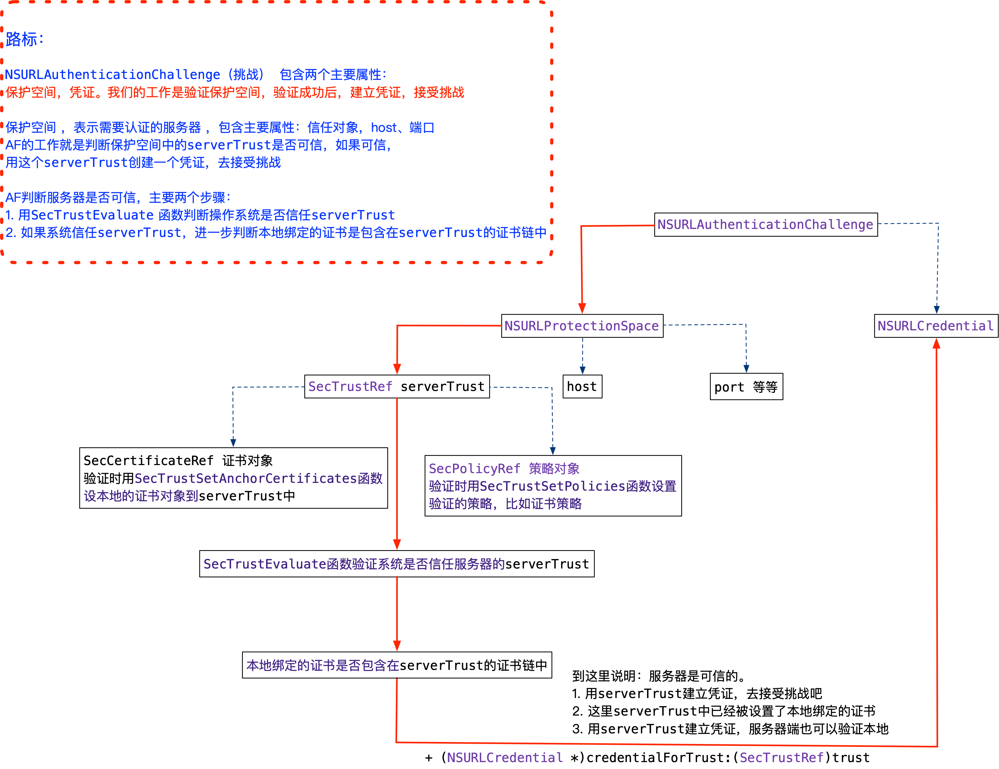
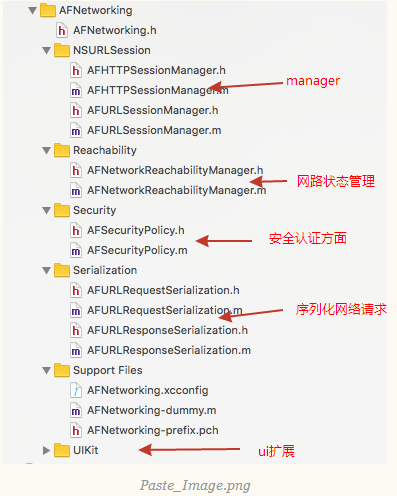
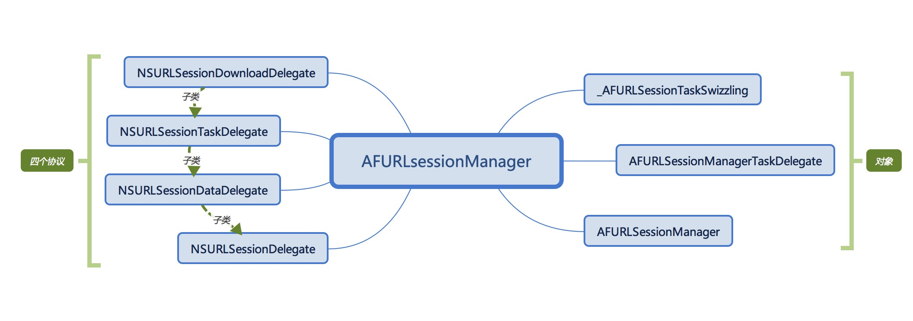

> <h2 id=''></h2>
- [**基础**](#基础)
	- [请求头配置](#请求头配置)
- [**AFNetworking架构图**](#AFNetworking架构图)
	- [AFNetworking3.0请求流程线程](#AFNetworking3.0请求流程线程)
	- [属性](#属性)
		- [removesKeysWithNullValues](#removesKeysWithNullValues)
	- [HTTPS认证流程](#HTTPS认证流程)
	- [目录结构](#目录结构)
	- [原生NSURLSession和AF网络请求DEMO](#原生NSURLSession和AF网络请求DEMO)
	- [数据序列化](#数据序列化)
- [**AFURLSessionManager**](#AFURLSessionManager)
	- [AFURLSessionManager头文件属性](#AFURLSessionManager头文件属性)
	- [类中使用的通知](#类中使用的通知)
	- [方法]()
		- [SessionConfig](#SessionConfig)
- [**AFHTTPSessionManager**](#AFHTTPSessionManager)
- [**NSURLSession**](#NSURLSession)
	- [Block接受数据](#Block接受数据)
	- ‌[Delegate接受数据](#Delegate接受数据)
- [**AFURLRequestSerialization**](#AFURLRequestSerialization)
- [多路复用](#多路复用)
- [**参考资料:**](#)
	- [ **AFNetworking到底做了什么？(二)**](https://www.jianshu.com/p/f32bd79233da)
	- [**AFNetWorking 3.0之前设置请求头**](https://www.jianshu.com/p/45c722f726fd)
	- [**请求头的配置用来完成HTTP Basic Auth的鉴权**](https://blog.csdn.net/deft_mkjing/article/details/51900737)
	- [**AFNetworking使用技巧与问题**](https://www.jianshu.com/p/37018da11815)
	- [**HTTPS认证**](https://www.jianshu.com/p/a84237b07611)


<br/>

***
<br/>


> <h1 id='基础'>基础</h1>

<br/>

> <h2 id='请求头配置'>请求头配置</h2>

- **User-Agent**: 会告诉网站服务器，访问者是通过什么工具来请求的，如果是爬虫请求，一般会拒绝，如果是用户浏览器，就会应答;
	- 通常格式:`Mozilla/5.0 (平台) 引擎版本 浏览器版本号`

<br/>

- **Accept**: 代表发送端（客户端）希望接受的数据类型;
	- 比如: `headerDictionary[@"Accept"] = @"image/*,*/*;q=0.8"`


<br/>

***
<br/>


> <h1 id='AFNetworking架构图'>AFNetworking架构图</h1>


<br/>


<br/>

> <h2 id='AFNetworking3.0请求流程线程'>AFNetworking3.0请求流程线程</h2>


<br/>

> **请求流程**

- **1.发送请求**


<br/>
<br/>


- **2.接收到响应**


<br/>
<br/>


- **3.进度条模块**


<br/>
<br/>


- **4.认证模块**





<br/>

>- 我们一开始初始化`sessionManager`的时候，一般都是在主线程，（当然不排除有些人喜欢在分线程初始化...）

>- 然后我们调用`get`或者`post`等去请求数据，接着会进行`request`拼接，AF代理的字典映射，`progress`的`KVO`添加等等，到`NSUrlSession`的`resume`之前这些准备工作，仍旧是在主线程中的。
 然后我们调用`NSUrlSession`的`resume`，接着就跑到`NSUrlSession`内部去对网络进行数据请求了,在它内部是多线程并发的去请求数据的。
 
 >- 紧接着数据请求完成后，回调回来在我们一开始生成的并发数为1的`NSOperationQueue`中，这个时候会是多线程串行的回调回来的。

>- 然后我们到返回数据解析那一块，我们自己又创建了并发的多线程，去对这些数据进行了各种类型的解析。

>- 最后我们如果有自定义的`completionQueue`，则在自定义的`queue`中回调回来，也就是分线程回调回来，否则就是主队列，主线程中回调结束。


<br/>
<br/>

> <h2 id='属性'>属性</h2>

<br/>

> <h3 id='removesKeysWithNullValues'>removesKeysWithNullValues</h3>

**`@property (nonatomic, assign) BOOL removesKeysWithNullValues;`**

&emsp;  在`AFNetWorking`只要把这个`removesKeysWithNullValues=YES.`后台返回的JSON数据中存在空的键值对,将会被自动删除,可以避免空值做操作,造成崩溃问题。


<br/>
<br/>

> <h2 id='HTTPS认证流程'>HTTPS 认证流程</h2>


<br/>
<br/>

**1.客户端发起HTTPS请求**

　　&emsp; 这个没什么好说的，就是用户在浏览器里输入一个https网址，然后连接到server的443端口。

<br/>
　
**2.服务端的配置**

　　&emsp; 采用HTTPS协议的服务器必须要有一套数字证书，可以自己制作，也可以向组织申请。区别就是自己颁发的证书需要客户端验证通过，才可以继续访问，而使用受信任的公司申请的证书则不会弹出提示页面。这套证书其实就是一对公钥和私钥。如果对公钥和私钥不太理解，可以想象成一把钥匙和一个锁头，只是全世界只有你一个人有这把钥匙，你可以把锁头给别人，别人可以用这个锁把重要的东西锁起来，然后发给你，因为只有你一个人有这把钥匙，所以只有你才能看到被这把锁锁起来的东西。
　

<br/>
　　
**3.传送证书**

　　&emsp; 这个证书其实就是公钥，只是包含了很多信息，如证书的颁发机构，过期时间等等。
　　
　
<br/>

　
**4.客户端解析证书**

　　&emsp; 这部分工作是有客户端的TLS/SSL来完成的，首先会验证公钥是否有效，比如颁发机构，过期时间等等，如果发现异常，则会弹出一个警告框，提示证书存在问题。如果证书没有问题，那么就生成一个随机值。然后用证书对该随机值进行加密。就好像上面说的，把随机值用锁头锁起来，这样除非有钥匙，不然看不到被锁住的内容。
　　
<br/>

　　
**5.传送加密信息**

　　&emsp; 这部分传送的是用证书加密后的随机值，目的就是让服务端得到这个随机值，以后客户端和服务端的通信就可以通过这个随机值来进行加密解密了。
　　
<br/>

　
**6.服务段解密信息**

　　&emsp; 服务端用私钥解密后，得到了客户端传过来的随机值(私钥)，然后把内容通过该值进行对称加密。所谓对称加密就是，将信息和私钥通过某种算法混合在一起，这样除非知道私钥，不然无法获取内容，而正好客户端和服务端都知道这个私钥，所以只要加密算法够彪悍，私钥够复杂，数据就够安全。
　　

<br/>


**7.传输加密后的信息**

　　&emsp; 这部分信息是服务段用私钥加密后的信息，可以在客户端被还原。
　　
　　
<br/>

**8.客户端解密信息**

　　&emsp; 客户端用之前生成的私钥解密服务段传过来的信息，于是获取了解密后的内容。整个过程第三方即使监听到了数据，也束手无策。

<br/>
<br/>

- 这就是整个https验证的流程了。简单总结一下：
	- 就是用户发起请求，服务器响应后返回一个证书，证书中包含一些基本信息和公钥。
	- 用户拿到证书后，去验证这个证书是否合法，不合法，则请求终止。
	- 合法则生成一个随机数，作为对称加密的密钥，用服务器返回的公钥对这个随机数加密。然后返回给服务器。
	- 服务器拿到加密后的随机数，利用私钥解密，然后再用解密后的随机数（对称密钥），把需要返回的数据加密，加密完成后数据传输给用户。
	- 最后用户拿到加密的数据，用一开始的那个随机数（对称密钥），进行数据解密。整个过程完成。

当然这仅仅是一个单向认证，https还会有双向认证，相对于单向认证也很简单。仅仅多了服务端验证客户端这一步。感兴趣的可以看看这篇：

[Https单向认证和双向认证。](https://link.jianshu.com?t=http://blog.csdn.net/duanbokan/article/details/50847612)

**了解了https认证流程后，接下来我们来讲讲AFSecurityPolicy这个类，AF就是用这个类来满足我们各种https认证需求。**


<br/>
<br/>
<br/>

> <h2 id='目录结构'>目录结构</h2>

> **[目录结构](https://www.jianshu.com/p/e4ff363da7f7)**
- **AFNetWorking** 这个文件是一个头文件。啥也没做，就是引入了其他文件方便使用。
- **AFURLSessionManager** 是核心类，基本上通过它来实现了大部分核心功能。负责请求的建立、管理、销毁、安全、请求重定向、请求重启等各种功能。他主要实现了NSURLSession和NSRULSessionTask的封装。
- **AFHTTPSessionManager** 是AFURLSessionManager的子类对外面做一个接口的显示, 主要实现了对HTTP请求的优化。
- **AFURLRequestSerialization** 这个主要用于请求头的编码解码、序列化、优化处理、简化请求拼接过程等。
- **AFURLResponseSerialization** 这个主要用于网络返回数据的序列化、编码解码、序列化、数据处理等。
- **AFSecurityPolicy** 这个主要用于请求的认证功能。比如https的认证模式等。
- **AFNetworkReachabilityManager** 这个主要用于监听网络请求状态变化功能。


<br/>




<br/>
<br/>


<br/>


<br/>
<br/>
<br/>


> <h2 id='原生NSURLSession和AF网络请求DEMO'>原生NSURLSession和AF网络请求DEMO</h2>


&emsp;   原生NSURLSession做网络请求Demo:

```
//创建Configuration对象，并设置各种属性
NSURLSessionConfiguration *configuration = [NSURLSessionConfiguration defaultSessionConfiguration];
configuration.timeoutIntervalForRequest = 10.0;
configuration.allowsCellularAccess = YES;

//通过Configuration创建session，一个session可以管理多个task
NSURLSession *session = [NSURLSession sessionWithConfiguration:configuration];
NSURL *url = [NSURL URLWithString:@"http://120.25.226.186.32812/login"];

//通过URL创建request
NSMutableURLRequest *request = [NSMutableURLRequest requestWithURL:url];
//设置request的请求方法和请求体
request.HTTPMethod = @"POST";
request.HTTPBody = [@"username=520it&pwd=520it&type=JSON" dataUsingEncoding:NSUTF8StringEncoding];

//通过session和request来创建task
NSURLSessionDataTask *dataTask = [session dataTaskWithRequest:request completionHandler:^(NSData * _Nullable data, NSURLResponse * _Nullable response, NSError * _Nullable error) {
    
}];

[dataTask resume];
```
&emsp;   可以用原生与AF的做对比，其实大致差不多，只不过是AF做了很多细致的优化。

<br/>

&emsp;   一个简单AFNetworking的Get网络请求Demo

```
- (void) afnetworkTextClickAction:(UIButton *)sender {
    AFHTTPSessionManager *manager = [[AFHTTPSessionManager alloc]init];
    [manager GET:@"https://route.showapi.com/341-2?maxResult=2&page=1&showapi_appid=206561&showapi_timestamp=20200501230719&showapi_sign=c5deb2531727443141b89413d89a3147" parameters:nil headers:nil progress:^(NSProgress * _Nonnull downloadProgress) {

    } success:^(NSURLSessionDataTask * _Nonnull task, id  _Nullable responseObject) {
        NSLog(@"相应结果：%@", responseObject);
    } failure:^(NSURLSessionDataTask * _Nullable task, NSError * _Nonnull error) {

    }];
    AFURLSessionManager *mm = [AFURLSessionManager new];
    [mm dataTaskWithRequest:[NSURLRequest new] uploadProgress:nil downloadProgress:nil completionHandler:nil];
    [manager.session dataTaskWithRequest:[NSURLRequest new]];
    
}

```

&emsp;  `@interface AFHTTPSessionManager : AFURLSessionManager <NSSecureCoding, NSCopying>`,可以看出 ` AFHTTPSessionManager` 继承自 `AFURLSessionManager`。


<br/>
<br/>
<br/>


> <h2 id='数据序列化'>数据序列化</h2>


简介：它就是AFNetworking参数编码的序列化器，它一共有三种编码格式。

-  `AFHTTPRequestSerializer`：第一种是普通的http的编码格式也就是`mid=10&method=userInfo&dateInt=20160818`，这种格式的;

-  `AFJSONRequestSerializer`：第二种也是json编码格式的，也就是编码成`{"mid":"11","method":"userInfo","dateInt":"20160818"}`; 

-  `AFPropertyListRequestSerializer`：第三种没用过，但是看介绍接编码成pislt格式的参数.


<br/>

***
<br/>

> <h1 id='AFURLSessionManager'>AFURLSessionManager</h1>




<br/>

> <h2 id='AFURLSessionManager头文件属性'>AFURLSessionManager头文件属性</h2>

```

interface AFURLSessionManager : NSObject <NSURLSessionDelegate, NSURLSessionTaskDelegate, NSURLSessionDataDelegate, NSURLSessionDownloadDelegate, NSSecureCoding, NSCopying>

//指定的初始化方法、通过他来初始化一个Manager对象。
- (instancetype)initWithSessionConfiguration:(nullable NSURLSessionConfiguration *)configuration 

//AFURLSessionManager通过session来管理和创建网络请求。一个manager就实现了对这个session的管理，他们是一一对应的关系。
@property (readonly, nonatomic, strong) NSURLSession *session;

//处理网络请求回调的操作队列,就是我们初始化session的时候传入的那个OperationQueue参数。如果不传入，默认是MainOperationQueue。
@property (readonly, nonatomic, strong) NSOperationQueue *operationQueue;

//对返回数据的处理都通过这个属性来处理，比如数据的提取、转换等。默认是一个`AFJSONResponseSerializer`对象用JSON的方式解析。
@property (nonatomic, strong) id <AFURLResponseSerialization> responseSerializer;

//用于指定session的安全策略。用于处理信任主机和证书认证等。默认是`defaultPolicy`。
@property (nonatomic, strong) AFSecurityPolicy *securityPolicy;

//观测网络状态的变化，具体可以看我的Demo用法。
@property (readwrite, nonatomic, strong) AFNetworkReachabilityManager *reachabilityManager;

@end

```


<br/>
<br/>


> <h2 id='类中使用的通知'>类中使用的通知</h2>

在外面通过监听这些通知，可以获取到这些通知的信息

> - AFNetworkingTaskDidResumeNotification
- AFNetworkingTaskDidCompleteNotification
- AFNetworkingTaskDidSuspendNotification
- AFURLSessionDidInvalidateNotification
- AFURLSessionDownloadTaskDidFailToMoveFileNotification
- AFNetworkingTaskDidCompleteResponseDataKey
- AFNetworkingTaskDidCompleteSerializedResponseKey
- AFNetworkingTaskDidCompleteResponseSerializerKey
- AFNetworkingTaskDidCompleteAssetPathKey
- AFNetworkingTaskDidCompleteErrorKey


<br/>
<br/>


> <h2 id='方法'>方法</h2>

<br/>

> <h2 id='SessionConfig'>SessionConfig</h2>


`- (instancetype)initWithSessionConfiguration:(NSURLSessionConfiguration *)configuration`


```

/*
初始化一个session
给manager的属性设置初始值
基本的网络请求步骤：url- request - session - task - resume
*/
- (instancetype)initWithSessionConfiguration:(NSURLSessionConfiguration *)configuration {
    self = [super init];
    if (!self) {
        return nil;
    }

    //设置默认的configuration，配置session
    if (!configuration) {
        configuration = [NSURLSessionConfiguration defaultSessionConfiguration];
    }

    self.sessionConfiguration = configuration;

    //设置delegate的操作队列并发的线程数量为1，也就是串行队列
    self.operationQueue = [[NSOperationQueue alloc] init];
    self.operationQueue.maxConcurrentOperationCount = 1;


    /*
      完成后若是做复杂的处理，可以选择异步串行队列
      如果更新完成后直接更新UI,选择主队列
      [NSOperationQueue mainQueue];
    */
    self.session = [NSURLSession sessionWithConfiguration:self.sessionConfiguration delegate:self delegateQueue:self.operationQueue];

    //默认位json响应解析
    self.responseSerializer = [AFJSONResponseSerializer serializer];
  
    //设置默认证书，无条件信任证书的https认证
    self.securityPolicy = [AFSecurityPolicy defaultPolicy];

#if !TARGET_OS_WATCH
    //网络状态监听
    //主机不断发送数据包，证明是有网的。不能判断网络是否连接到你的服务器
    self.reachabilityManager = [AFNetworkReachabilityManager sharedManager];
#endif

    //delegate = value taskid = key
    self.mutableTaskDelegatesKeyedByTaskIdentifier = [[NSMutableDictionary alloc] init];

    //使用NSLock确保线程安全
    self.lock = [[NSLock alloc] init];
    self.lock.name = AFURLSessionManagerLockName;


    //异步获取当前的session的所有未完成的task，其实讲道理来说在初始化中调用这个方法里面应该一个task都没有
    //后台任务重新回来初始化session，可能就会有先前的任务
    [self.session getTasksWithCompletionHandler:^(NSArray *dataTasks, NSArray *uploadTasks, NSArray *downloadTasks) {
        for (NSURLSessionDataTask *task in dataTasks) {
            [self addDelegateForDataTask:task uploadProgress:nil downloadProgress:nil completionHandler:nil];
        }

        for (NSURLSessionUploadTask *uploadTask in uploadTasks) {
            [self addDelegateForUploadTask:uploadTask progress:nil completionHandler:nil];
        }

        for (NSURLSessionDownloadTask *downloadTask in downloadTasks) {
            [self addDelegateForDownloadTask:downloadTask progress:nil destination:nil completionHandler:nil];
        }
    }];

    return self;
}

```


<br/>

***
<br/>

> <h1 id='AFHTTPSessionManager'>AFHTTPSessionManager</h1>

`- (instancetype)initWithBaseURL:(NSURL *)url  sessionConfiguration:(NSURLSessionConfiguration *)configuration`

```
//url的初始化和基本的配置
- (instancetype)initWithBaseURL:(NSURL *)url
           sessionConfiguration:(NSURLSessionConfiguration *)configuration
{
    self = [super initWithSessionConfiguration:configuration];
    if (!self) {
        return nil;
    }

    // Ensure terminal slash for baseURL path, so that NSURL +URLWithString:relativeToURL: works as expected
    //url 有值且没有'/'，那么在末尾加上'/'
    if ([[url path] length] > 0 && ![[url absoluteString] hasSuffix:@"/"]) {
        url = [url URLByAppendingPathComponent:@""];
    }

    self.baseURL = url;
    //设置请求、相应时的序列化默认值
    self.requestSerializer = [AFHTTPRequestSerializer serializer];
    self.responseSerializer = [AFJSONResponseSerializer serializer];

    return self;
}
```

<br/>

`- (NSURLSessionDataTask *)dataTaskWithHTTPMethod:(NSString *)method  URLString:(NSString *)URLString  parameters:(id)parameters  uploadProgress:(nullable void (^)(NSProgress *uploadProgress)) uploadProgress  downloadProgress:(nullable void (^)(NSProgress *downloadProgress)) downloadProgress  success:(void (^)(NSURLSessionDataTask *, id))success  failure:(void (^)(NSURLSessionDataTask *, NSError *))failure`

```
//生成request，通过request生成task
- (NSURLSessionDataTask *)dataTaskWithHTTPMethod:(NSString *)method
                                       URLString:(NSString *)URLString
                                      parameters:(id)parameters
                                  uploadProgress:(nullable void (^)(NSProgress *uploadProgress)) uploadProgress
                                downloadProgress:(nullable void (^)(NSProgress *downloadProgress)) downloadProgress
                                         success:(void (^)(NSURLSessionDataTask *, id))success
                                         failure:(void (^)(NSURLSessionDataTask *, NSError *))failure
{
    NSError *serializationError = nil;
    /*
      先调用AFHTTPRequestSerializer的requestWithMethod函数构建request；
      处理request构建产生的错误 -serializationError
      //relativeToURL表示将URLString拼接到baseURL后面
    */
    NSMutableURLRequest *request = [self.requestSerializer requestWithMethod:method URLString:[[NSURL URLWithString:URLString relativeToURL:self.baseURL] absoluteString] parameters:parameters error:&serializationError];
    if (serializationError) {
        if (failure) {
            dispatch_async(self.completionQueue ?: dispatch_get_main_queue(), ^{
                failure(nil, serializationError);
            });
        }

        return nil;
    }

    //此时的request已经将参数拼接到url后面
    __block NSURLSessionDataTask *dataTask = nil;
    dataTask = [self dataTaskWithRequest:request
                          uploadProgress:uploadProgress
                        downloadProgress:downloadProgress
                       completionHandler:^(NSURLResponse * __unused response, id responseObject, NSError *error) {
        if (error) {
            if (failure) {
                failure(dataTask, error);
            }
        } else {
            if (success) {
                success(dataTask, responseObject);
            }
        }
    }];

    return dataTask;
}
```

<br/>

`- (NSURLSessionDataTask *)dataTaskWithRequest:(NSURLRequest *)request  uploadProgress:(nullable void (^)(NSProgress *uploadProgress)) uploadProgressBlock  downloadProgress:(nullable void (^)(NSProgress *downloadProgress)) downloadProgressBlock  completionHandler:(nullable void (^)(NSURLResponse *response, id _Nullable responseObject,  NSError * _Nullable error))completionHandler`

```
- (NSURLSessionDataTask *)dataTaskWithRequest:(NSURLRequest *)request
                               uploadProgress:(nullable void (^)(NSProgress *uploadProgress)) uploadProgressBlock
                             downloadProgress:(nullable void (^)(NSProgress *downloadProgress)) downloadProgressBlock
                            completionHandler:(nullable void (^)(NSURLResponse *response, id _Nullable responseObject,  NSError * _Nullable error))completionHandler {

   //为了解决ios8以下的一个bug，调用一个串行队列来创建dataTask
    __block NSURLSessionDataTask *dataTask = nil;
    //创建任务是安全的，那么使用系统调用的是不安全的吗？？？？
    url_session_manager_create_task_safely(^{
        //使用原生的方法， session来创建一个NSURLSessionDataTask对象
        dataTask = [self.session dataTaskWithRequest:request];
    });
    
    //为什么要给task添加一个代理呢？
    [self addDelegateForDataTask:dataTask uploadProgress:uploadProgressBlock downloadProgress:downloadProgressBlock completionHandler:completionHandler];

    return dataTask;
}
```


<br/>

`- (void)addDelegateForDataTask:(NSURLSessionDataTask *)dataTask  uploadProgress:(nullable void (^)(NSProgress *uploadProgress)) uploadProgressBlock  downloadProgress:(nullable void (^)(NSProgress *downloadProgress)) downloadProgressBlock  completionHandler:(void (^)(NSURLResponse *response, id responseObject, NSError *error))completionHandler`

```
/*
    addDelegateForDataTask：这个函数并不是AFURLSessionManagerTaskDelegate的函数，
    而是AFURLSessionManager的一个函数。
    这也侧面说明了AFURLSessionManagerTaskDelegate和NSURLSessionTask的关系是由AFURLSessionManager管理的。
*/
- (void)addDelegateForDataTask:(NSURLSessionDataTask *)dataTask
                uploadProgress:(nullable void (^)(NSProgress *uploadProgress)) uploadProgressBlock
              downloadProgress:(nullable void (^)(NSProgress *downloadProgress)) downloadProgressBlock
             completionHandler:(void (^)(NSURLResponse *response, id responseObject, NSError *error))completionHandler
{
     //初始化delegate
    AFURLSessionManagerTaskDelegate *delegate = [[AFURLSessionManagerTaskDelegate alloc] initWithTask:dataTask];
    delegate.manager = self;
    delegate.completionHandler = completionHandler;


    /*
      taskidentifier=key delegate=value，确保task唯一
      taskDescription自行设置的，区分是否是当前的session创建的
    */
    dataTask.taskDescription = self.taskDescriptionForSessionTasks;
     //函数字面的意思是将一个session task和一个AFURLSessionManagerTaskDelegate类型的delegate变量绑在一起，而这款个绑在一起的工作是由我们的AFURLSessionManager所做。至于绑定的过程，就是以该session task的taskIdentifier为key，delegate为value，赋值给mutableTaskDelegateKeyedByTaskIdentifier这个NSMutableDictionary类型的变量。知道了这两者是关联在一起的话，马上会产生另外的一个问题  --- 为什么要关联以及怎么关联在一起？
    [self setDelegate:delegate forTask:dataTask];
  
      //设置回调块
    delegate.uploadProgressBlock = uploadProgressBlock;
    delegate.downloadProgressBlock = downloadProgressBlock;
}
```


<br/>

***
<br/>

> <h1 id='NSURLSession'>NSURLSession</h1>

<br/>


<br/>

&emsp; NSURLSession中比较重要的几个对象: NSURLSessionTask、NSURLSessionConfiguration、为它请求时执行的代理方法。


- NSURLSession的使用共分两步:
	- 通过NSURLSession的实例创建task
	- 通过task选择自己所需要的方法，有Delegate方法和Block方法执行task
> task一共有4个delegate，只要设置了一个，就代表四个全部设置，有时候一些delegate不会被触发的原因在于这四种delegate是针对不同的URLSession类型和URLSessionTask类型来进行响应的，也就是说不同的类型只会触发这些delegate中的一部分，而不是触发所有的delegate。

<br/>
<br/>


> <h2 id='Block接受数据'>Block接受数据</h2>


使用Block很简单，只需要传入请求的Request就可以直接获取到数据。

```
- (IBAction)orginalDownLoadAction:(UIButton *)sender {
    __weak typeof(self) weakself = self;
    NSURLSession *session = [self createASession];
    NSURLSessionDataTask *dataTask = [session dataTaskWithRequest:[self creatRequest:downURL] completionHandler:^(NSData * _Nullable data, NSURLResponse * _Nullable response, NSError * _Nullable error) {
        dispatch_async(dispatch_get_main_queue(), ^{
            weakself.showImageView.image = [UIImage imageWithData:data];
        });
    }];
    [dataTask resume];
}

//  创建Session对象
- (NSURLSession *)createASession {
    NSURLSessionConfiguration *configuration = [NSURLSessionConfiguration defaultSessionConfiguration];
    NSOperationQueue *operationQueue = [[NSOperationQueue alloc] init];
    operationQueue.maxConcurrentOperationCount = 1;
    NSURLSession *session = [NSURLSession sessionWithConfiguration:configuration delegate:self delegateQueue:operationQueue];
    return session;
}

- (NSURLRequest *)creatRequest:(NSString *)url {
    NSURLRequest *requset = [NSURLRequest requestWithURL:[NSURL URLWithString:url]];
    return requset;
}
```


<br/>
<br/>


> <h2 id='Delegate接受数据'>Delegate接受数据</h2>

可以真正的观测到数据的获取和请求的发送.

```
- (IBAction)orginalDownLoadAction:(UIButton *)sender {
    NSURLSession *session = [self createASession];
    
    NSURLSessionDataTask *dataTask = [session dataTaskWithURL:[NSURL URLWithString:downURL]];
    
    [dataTask resume];
}
/**
 接收到服务器的响应
 */
- (void)URLSession:(NSURLSession *)session dataTask:(NSURLSessionDataTask *)dataTask didReceiveResponse:(NSURLResponse *)response
 completionHandler:(void (^)(NSURLSessionResponseDisposition disposition))completionHandler{ 
 
    _mutableData = [[NSMutableData alloc] init];
     // 允许处理服务器的响应，才会继续接收服务器返回的数据
    if (completionHandler) {
        completionHandler(NSURLSessionResponseAllow);
    }
}

/**
 接收到服务器的数据（可能调用多次）
 */
- (void)URLSession:(NSURLSession *)session dataTask:(NSURLSessionDataTask *)dataTask
    didReceiveData:(NSData *)data {
    NSLog(@"接收数据返回");
    [_mutableData appendData:data];
}

/**
 请求成功或者失败（如果失败，error有值）
 所有的代理都会执行此代理方法
 */
- (void)URLSession:(NSURLSession *)session task:(NSURLSessionTask *)task didCompleteWithError:(NSError *)error
{
    if (error) {
        NSLog(@"下载有误 %@",[error localizedDescription]);
    }
    else {
        NSLog(@"完成下载");
        __weak typeof(self) weakself = self;
        dispatch_async(dispatch_get_main_queue(), ^{
            weakself.showImageView.image = [UIImage imageWithData:_mutableData];
        });
    }
}
```


<br/>

**` url_session_manager_create_task_safely(dispatch_block_t block)`**

```
//task和block不匹配
//taskid应该是唯一的，并发创建的task，id不唯一。
static void url_session_manager_create_task_safely(dispatch_block_t block) {
    if (NSFoundationVersionNumber < NSFoundationVersionNumber_With_Fixed_5871104061079552_bug) {
        //源代码作者对这个bug在官方做了说明
        // Fix of bug
        // Open Radar:http://openradar.appspot.com/radar?id=5871104061079552 (status: Fixed in iOS8)
        // Issue about:https://github.com/AFNetworking/AFNetworking/issues/2093
        dispatch_sync(url_session_manager_creation_queue(), block);//同步，url_session_manager_creation_queue()创建了一个串行队列
    } else {
        block();
    }
}

```


<br/>

***
<br/>

> <h1 id='AFURLRequestSerialization'>AFURLRequestSerialization</h1>


**`- (NSMutableURLRequest *)requestWithMethod:(NSString *)method  URLString:(NSString *)URLString  parameters:(id)parameters   error:(NSError *__autoreleasing *)error`**

```
//
- (NSMutableURLRequest *)requestWithMethod:(NSString *)method
                                 URLString:(NSString *)URLString
                                parameters:(id)parameters
                                     error:(NSError *__autoreleasing *)error
{
    //断言若是nil，直接打印出来
    NSParameterAssert(method);
    NSParameterAssert(URLString);

    //传进来的是一个字符串，在这里他帮你转成url
    NSURL *url = [NSURL URLWithString:URLString];

    NSParameterAssert(url);

    NSMutableURLRequest *mutableRequest = [[NSMutableURLRequest alloc] initWithURL:url];
    mutableRequest.HTTPMethod = method;

    //将request的各种属性进行遍历，给NSURLMutableURLRequest自带的属性赋值
    for (NSString *keyPath in AFHTTPRequestSerializerObservedKeyPaths()) {
        //给设置过的属性，添加到request（如：timeout）
        if ([self.mutableObservedChangedKeyPaths containsObject:keyPath]) {
            //通过kvc动态的给mutableRequest添加value
            [mutableRequest setValue:[self valueForKeyPath:keyPath] forKey:keyPath];
        }
    }


    //将传入的参数进行编码，拼接到url后并返回 coount=5&start=1
    mutableRequest = [[self requestBySerializingRequest:mutableRequest withParameters:parameters error:error] mutableCopy];

	return mutableRequest;
}
```

<br/>

`- (NSURLRequest *)requestBySerializingRequest:(NSURLRequest *)request  withParameters:(id)parameters  error:(NSError *__autoreleasing *)error`

```
//通过requestserializtion把参数转化成了查询字符串：请求头设置、默认属性、属性监听
- (NSURLRequest *)requestBySerializingRequest:(NSURLRequest *)request
                               withParameters:(id)parameters
                                        error:(NSError *__autoreleasing *)error
{
    NSParameterAssert(request);

    NSMutableURLRequest *mutableRequest = [request mutableCopy];


    /*
      请求行（状态行）：get，url(资源的路径)/URI(资源的唯一标志符， url属于URI的子集)， http协议1.1
      请求头：content-type， accept-language
      请求体：get/post get参数拼接在url后面 post数据放在body
    */
    [self.HTTPRequestHeaders enumerateKeysAndObjectsUsingBlock:^(id field, id value, BOOL * __unused stop) {
        if (![request valueForHTTPHeaderField:field]) {
            [mutableRequest setValue:value forHTTPHeaderField:field];
        }
    }];

    NSString *query = nil;
    //传入的字典转化字符串
    if (parameters) {
        //自定义解析方式
        if (self.queryStringSerialization) {
            NSError *serializationError;
            query = self.queryStringSerialization(request, parameters, &serializationError);

            if (serializationError) {
                if (error) {
                    *error = serializationError;
                }

                return nil;
            }
        } else {
            //默认解析的方式，dic- count=5&start=1
            switch (self.queryStringSerializationStyle) {
                case AFHTTPRequestQueryStringDefaultStyle:
                    //将parameters传入这个c函数
                    query = AFQueryStringFromParameters(parameters);
                    break;
            }
        }
    }


    //最后判断request中是否包含了GET、HEAD、DELETE(都包含在HTTPMethodsEncodingParametersInURI).
    //因为这几个method的query是拼接到url后面的。而POST、PUT是把query拼接到http body中的。
    if ([self.HTTPMethodsEncodingParametersInURI containsObject:[[request HTTPMethod] uppercaseString]]) {
        if (query && query.length > 0) {
            mutableRequest.URL = [NSURL URLWithString:[[mutableRequest.URL absoluteString] stringByAppendingFormat:mutableRequest.URL.query ? @"&%@" : @"?%@", query]];
        }
    } else {
        // #2864: an empty string is a valid x-www-form-urlencoded payload
        if (!query) {
            query = @"";
        }

        //函数会判断request的Content-Type是否设置了，若果没有，就默认设置为application/x-www-form-urlencoded
        //application/x-www-form-urlencoded是常用的表单发包方式，普通的表单提交，或者js发包，默认都是通过这种方式的。
        if (![mutableRequest valueForHTTPHeaderField:@"Content-Type"]) {
            [mutableRequest setValue:@"application/x-www-form-urlencoded" forHTTPHeaderField:@"Content-Type"];
        }
        //设置请求体
        [mutableRequest setHTTPBody:[query dataUsingEncoding:self.stringEncoding]];
    }

    return mutableRequest;
}


```

<br/>

***
<br/>

&emsp;  AFNetworking很好用，这是有目共睹的，很多初学者，在每处用到网络请求的地方会直接拿`AFNetworking `实例去请求接口数据，虽然方便，但是为后来的代码维护带来很多的问题.

```
[[AFHTTPSessionManager manager] POST:URLStr parameters:parameters success:^(NSURLSessionDataTask *task, id responseObject) {
        
    } failure:^(NSURLSessionDataTask *task, NSError *error) {
        
    }];

```

问题：不知道在开发中，有没有遇到有的类库不在维护，后面出现问题不知如何修改。若是像上面那样做，后面AFNetoworking不在更新维护出问题，你要一个一个修改吗？

解决方法：就是对请求的Post、Get方法进行再次封装，就算后面出现问题，只要对Get、Post封装方法进行修改就好了啊。这就是菜鸟和老鸟的区别！

新建一个网络请求类：`HGNetWorkManager`


```

+ (NSURLSessionDataTask *)postRequestWithURLString:(NSString *)URLString parameters:(NSDictionary *)parameters success:(SuccessHanddle)success failure:(FailureHandle)failure {
    //对汉字进行转码
    URLString = [URLString stringByAddingPercentEncodingWithAllowedCharacters:[NSCharacterSet URLQueryAllowedCharacterSet]];
    return [self.manager POST:URLString parameters:parameters progress:nil success:^(NSURLSessionDataTask * _Nonnull task, id  _Nullable responseObject) {
        if (success) {
            success(responseObject);
        }
        
    } failure:^(NSURLSessionDataTask * _Nullable task, NSError * _Nonnull error) {
        if (failure) {
            failure(error);
        }
    }];
}

+ (NSURLSessionDataTask *)getRequestWithURLString:(NSString *)URLString parameters:(NSDictionary *)parameters success:(SuccessHanddle)success failure:(FailureHandle)failure {
    URLString = [URLString stringByAddingPercentEncodingWithAllowedCharacters:[NSCharacterSet URLQueryAllowedCharacterSet]];
    return [self.manager GET:URLString parameters:parameters progress:nil success:^(NSURLSessionDataTask * _Nonnull task, id  _Nullable responseObject) {
        if (success) {
            success(responseObject);
        }
    } failure:^(NSURLSessionDataTask * _Nullable task, NSError * _Nonnull error) {
        if (failure) {
            failure(error);
        }
    }];
}


```


<br/>

***
<br/>


> <h1 id='多路复用'>多路复用</h1>

&emsp; AFURLSessionManager和NSURLSession是一对一的关系，AFURLSessionManager会在初始化的时候创建对应的NSURLSession。同样AFURLSessionManager在注释中写明了可以提供一个配置好的manager单例来全局复用。

&emsp; 在iOS9.0之后，session支持http2.0。http2.0的一个特点就是多路复用，可以减少访问同一个服务器时，重新建立tcp连接的耗时和资源。

&emsp; 在不同的场景使用不同的session，比如：一个session处理普通的请求，一个session处理background请求；一个sesison处理浏览器公开的请求，一个session专门处理隐私请求等等场景。


