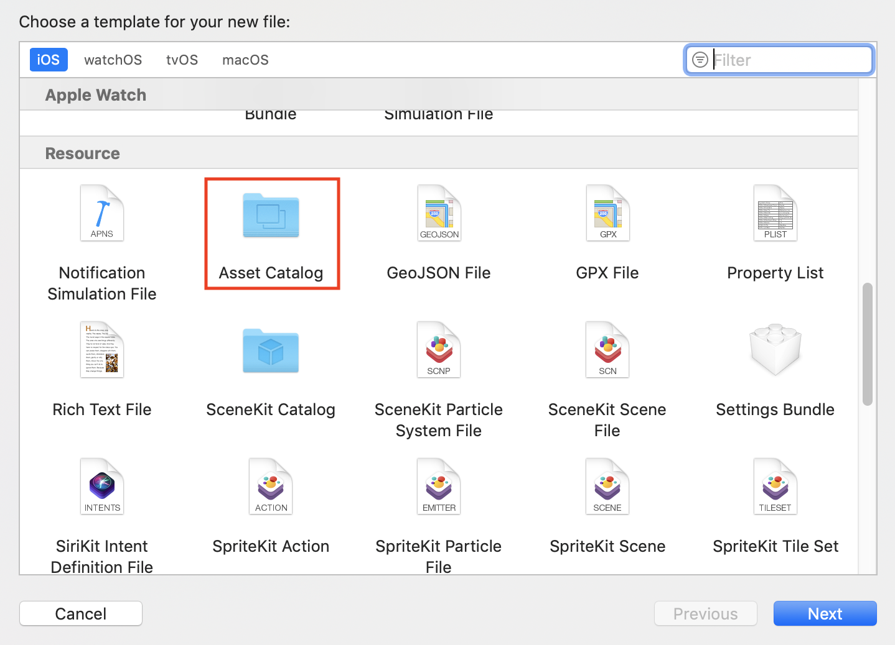
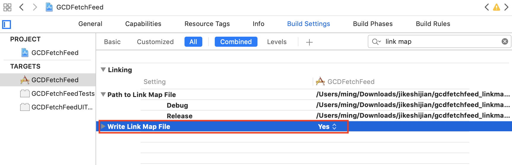
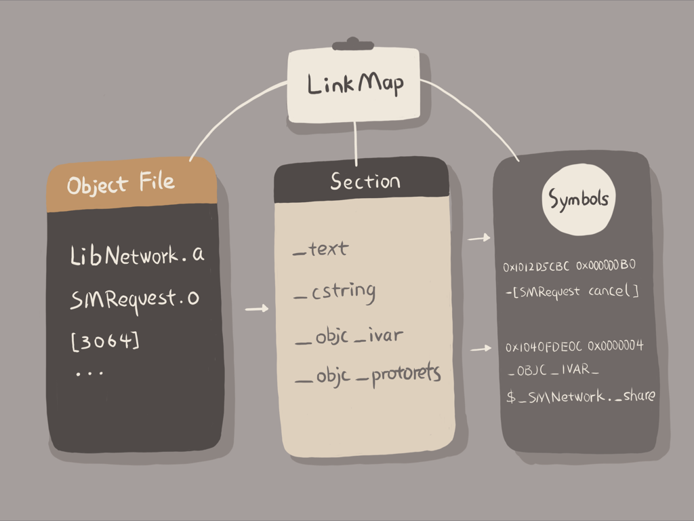
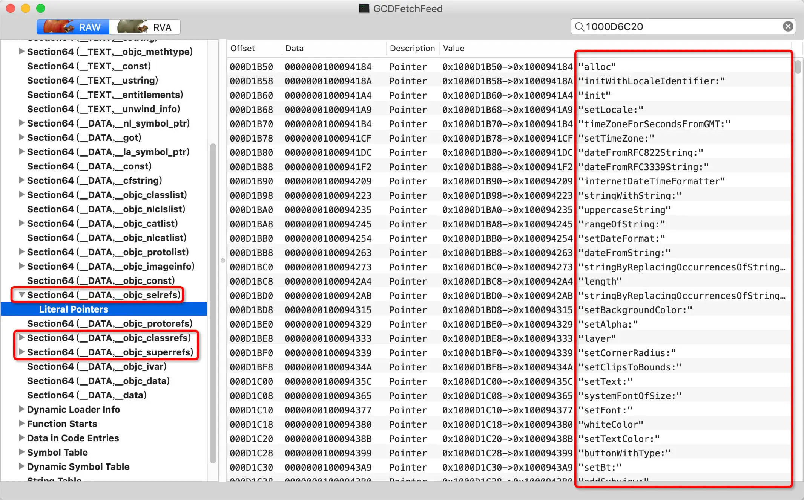
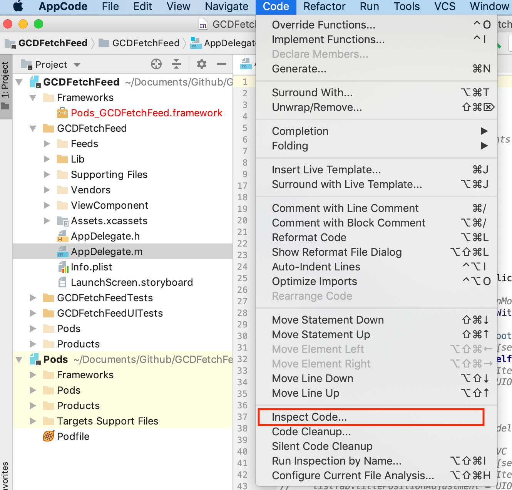
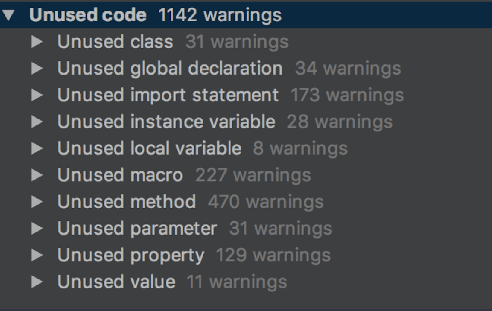
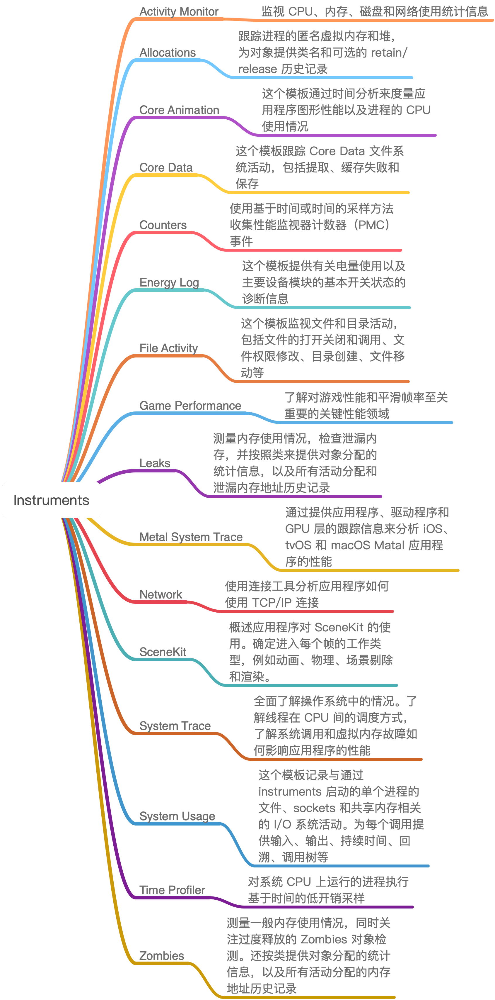
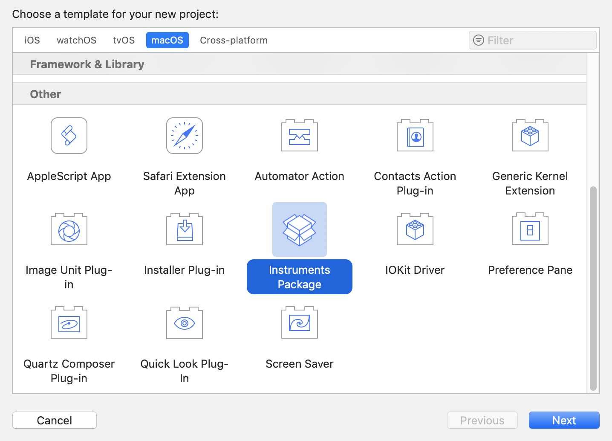

> <h2 id=''></h2>
- [**启动时间优化**](#启动时间优化)
- [**卡顿监控**](#卡顿监控)
	- [子线程监控检测时间间隔](#子线程监控检测时间间隔)
	- [子线程监控退火算法](#子线程监控退火算法)
- [**App瘦身**](#App瘦身)
	- [官方AppThinning](#官方AppThinning)
	- [无用图片资源](#无用图片资源)
	- [代码瘦身](#代码瘦身)
		- [LinkMap 结合 Mach-O 找无用代码](#LinkMap结合Mach-O找无用代码)
	- [**App质量衡量**](#App质量衡量)
		- [Instruments](#Instruments)
			- [自定义Instruments工具](#自定义Instruments工具)
		- [线上性能监控](#线上性能监控)
- [**App电量优化**](#App电量优化)
	- [诊断电量](#诊断电量)
	- [优化电量](#优化电量)
- **资料**
	- [微信 iOS 卡顿监控系统](https://www.cxymm.net/article/weixin_41963895/109177399)


<br/>

***
<br/>

> <h1 id='启动时间优化'>启动时间优化</h1>


[iOS 基于PGO优化启动时间](https://jishuin.proginn.com/p/763bfbd56d2b)


<br/>

***
<br/>

> <h1 id='卡顿监控'>卡顿监控</h1>

&emsp; 微信的卡顿监控系统matrix开源出来了，包括Matrix for iOS/macOS和Android系统的监控方案。若你的 App 现在还没有卡顿监控系统，可以考虑直接集成 matrix-iOS，直接在 Podfile 里添加 pod ‘matrix-wechat’ 就可以了,其中很多细节值得我们学习:
- 子线程监控检测时间间隔：matrix-iOS 监控卡顿的子线程是通过 NSThread 创建的，检测时间间隔正常情况是 1 秒，在出现卡顿情况下，间隔时间会受检测线程退火算法影响，按照斐波那契数列递增，直到没有卡顿时恢复为 1 秒。
- 子线程监控退火算法：避免一个卡顿会写入多个文件的情况。
- RunLoop 卡顿时间阈值设置：对于 RunLoop 超时阈值的设置，建议设置为 3 秒，微信设置的是 2 秒。
- CPU 使用率阈值设置：当单核 CPU 使用率超过 80%，就判定 CPU 占用过高。CPU 使用率过高，可能导致 App 卡顿。

&emsp; 这四点是能够让卡顿监控系统在对 App 性能损耗很小的情况下，更好地监控到线上 App 卡顿情况的四个细节.matrix-iOS 卡顿监控系统的主要代码在 WCBlockMonitorMgr.mm文件中.


<br/>
<br/>

><h2 id='子线程监控检测时间间隔'>子线程监控检测时间间隔</h2>

matrix-iOS 是在 addMonitorThread 方法里，通过 NSThread 添加一个子线程来进行监控的。addMonitorThread 方法代码如下：

```
- (void)addMonitorThread
{
    m_bStop = NO;
    m_monitorThread = [[NSThread alloc] initWithTarget:self selector:@selector(threadProc) object:nil];
    [m_monitorThread start];
}
```

这段代码中创建的 NSThread 子线程，会去执行 threadProc 方法。这个方法包括了子线程监控卡顿的所有逻辑：

```
while (YES) {
    @autoreleasepool {
        if (g_bMonitor) {
            // 检查是否卡顿，以及卡顿原因
            ...
            // 针对不同卡顿原因进行不同的处理
            ...
        }
        
        // 时间间隔处理，检测时间间隔正常情况是1秒，间隔时间会受检测线程退火算法影响，按照斐波那契数列递增，直到没有卡顿时恢复为1秒。
        for (int nCnt = 0; nCnt < m_nIntervalTime && !m_bStop; nCnt++) {
            if (g_MainThreadHandle && g_bMonitor) {
                int intervalCount = g_CheckPeriodTime / g_PerStackInterval;
                if (intervalCount <= 0) {
                    usleep(g_CheckPeriodTime);
                } else {
                    ...
                }
            } else {
                usleep(g_CheckPeriodTime);
            }
        }
        if (m_bStop) {
            break;
        }
    }
```

可以看出，创建的子线程通过 while 使其成为常驻线程，直到主动执行 stop 方法才会被销毁。其中，使用 usleep 方法进行时间间隔操作， g_CheckPeriodTime 就是正常情况的时间间隔的值，退火算法影响的是 m_nIntervalTime，递增后检测卡顿的时间间隔就会不断变长。直到判定卡顿已结束，m_nIntervalTime 的值会恢复成 1。

接下来，跟踪 g_CheckPeriodTime 的定义就能够找到正常情况下子线程卡顿监控的时间间隔。 g_CheckPeriodTime 的定义如下：

```
static useconds_t g_CheckPeriodTime = g_defaultCheckPeriodTime;
```


其中 g_defaultCheckPeriodTime 的定义是：

```
#define BM_MicroFormat_Second 1000000
const static useconds_t g_defaultCheckPeriodTime = 1 * BM_MicroFormat_Second;
```


可以看出，子线程监控检测时间间隔 g_CheckPeriodTime，被设置的值就是 1 秒


<br/>
<br/>

><h2 id='子线程监控退火算法'>子线程监控退火算法</h2>


&emsp; 子线程监控检测时间间隔设置为 1 秒，在没有卡顿问题，不需要获取主线程堆栈信息的情况下性能消耗几乎可以忽略不计。但是，当遇到卡顿问题时，而且一个卡顿持续好几秒的话，就会持续获取主线程堆栈信息，增加性能损耗。更重要的是，持续获取的这些堆栈信息都是重复的，完全没有必要。

所以，matrix-iOS 采用了退火算法递增时间间隔，来避免因为同一个卡顿问题，不断去获取主线程堆栈信息的情况，从而提升了算法性能。

同时，一个卡顿问题只获取一个主线程堆栈信息，也就是一个卡顿问题 matrix-iOS 只会进行一次磁盘存储，减少了存储 I/O 也就减少了性能消耗。

所以，这种策略能够有效减少由于获取主线程堆栈信息带来的性能消耗。


<br/>


**matrix-iOS 是如何实现退火算法的呢？**


因为触发退火算法的条件是卡顿，所以我们先回头来看看子线程监控卡顿主方法 threadProc 里和发现卡顿后处理相关的代码：

```
while (YES) {
    @autoreleasepool {
        if (g_bMonitor) {
            // 检查是否卡顿，以及卡顿原因
            EDumpType dumpType = [self check];
            if (m_bStop) {
                break;
            }
            // 针对不同卡顿原因进行不同的处理
            ...
            if (dumpType != EDumpType_Unlag) {
                if (EDumpType_BackgroundMainThreadBlock == dumpType ||
                    EDumpType_MainThreadBlock == dumpType) {
                    if (g_CurrentThreadCount > 64) {
                        // 线程数超过64个，认为线程过多造成卡顿，不用记录主线程堆栈
                        dumpType = EDumpType_BlockThreadTooMuch;
                        [self dumpFileWithType:dumpType];
                    } else {
                        EFilterType filterType = [self needFilter];
                        if (filterType == EFilterType_None) {
                            if (g_MainThreadHandle) {
                                if (g_PointMainThreadArray != NULL) {
                                    free(g_PointMainThreadArray);
                                    g_PointMainThreadArray = NULL;
                                }
                                g_PointMainThreadArray = [m_pointMainThreadHandler getPointStackCursor];
                                // 函数主线程堆栈写文件记录
                                m_potenHandledLagFile = [self dumpFileWithType:dumpType];
                                // 回调处理主线程堆栈文件
                                ...
                                
                            } else {
                                // 主线程堆栈写文件记录
                                m_potenHandledLagFile = [self dumpFileWithType:dumpType];
                                ...
                            }
                        } else {
                            // 对于 filterType 满足退火算法、主线程堆栈数太少、一天内记录主线程堆栈过多这些情况不用进行写文件操作
                            ...
                        }
                    }
                } else {
                    m_potenHandledLagFile = [self dumpFileWithType:dumpType];
                }
            } else {
                [self resetStatus];
            }
        }
        // 时间间隔处理，检测时间间隔正常情况是1秒，间隔时间会受检测线程退火算法影响，按照斐波那契数列递增，直到没有卡顿时恢复为1秒。
        ...
    }
}  
```

可以看出，当检测出主线程卡顿后，matrix-iOS 会先看线程数是否过多。为什么会先检查线程数呢？

按照微信团队的经验，线程数超出 64 个时会导致主线程卡顿，如果卡顿是由于线程多造成的，那么就没必要通过获取主线程堆栈去找卡顿原因了。根据 matrix-iOS 的实测，每隔 50 毫秒获取主线程堆栈会增加 3% 的 CPU 占用，所以当检测到主线程卡顿以后，我们需要先判断是否是因为线程数过多导致的，而不是一有卡顿问题就去获取主线程堆栈。


如果不是线程过多造成的卡顿问题，matrix-iOS 会通过 needFilter 方法去对比前后两次获取的主线程堆栈，如果两次堆栈是一样的，那就表示卡顿还没结束，满足退火算法条件，needFilter 方法会返回 EFilterType。EFilterType 为 EFilterType_Annealing，表示类型为退火算法。满足退火算法后，主线程堆栈就不会立刻进行写文件操作。


在 needFilter 方法里，needFilter 通过 [m_pointMainThreadHandler getLastMainThreadStack] 获取当前主线程堆栈，然后记录在 m_vecLastMainThreadCallStack 里。下次卡顿时，再获取主线程堆栈，新获取的堆栈和上次记录的 m_vecLastMainThreadCallStack 堆栈进行对比：
- 如果两个堆栈不同，表示这是一个新的卡顿，就会退出退火算法；
- 如果两个堆栈相同，就用斐波那契数列递增子线程检查时间间隔。

递增时间的代码如下：

```
if (bIsSame) {
    NSUInteger lastTimeInterval = m_nIntervalTime;
    // 递增 m_nIntervalTime
    m_nIntervalTime = m_nLastTimeInterval + m_nIntervalTime;
    m_nLastTimeInterval = lastTimeInterval;
    MatrixInfo(@"call stack same timeinterval = %lu", (unsigned long) m_nIntervalTime);
    return EFilterType_Annealing;
} 
```

&emsp; 可以看出，将子线程检查主线程时间间隔增加后，needFilter 就直接返回 EFilterType_Annealing 类型表示当前情况满足退火算法。使用退火算法，可以有效降低没有必要地获取主线程堆栈的频率。这样的话，我们就能够在准确获取卡顿的前提下，还能保障 App 性能不会受卡顿监控系统的影响。


<br/>
<br/>

><h2 id=''></h2>


<br/>
<br/>

><h2 id=''></h2>


<br/>

***
<br/>

> <h1 id='App瘦身'>App瘦身</h1>

&emsp; App Store 规定了安装包大小超过 150MB 的 App 不能使用 OTA（over-the-air）环境下载，也就是只能在 WiFi 环境下下载。所以，150MB 就成了 App 的生死线，一旦超越了这条线就很有可能会失去大量用户。

&emsp; App 包过大既损害用户体验，影响升级率，还会导致无法提交 App Store 的情况和非 WiFi 环境无法下载这样可能影响到 App 生死的问题。那么，怎样对包大小进行瘦身和控制包大小的不合理增长就成了重中之重。

<br/>
<br/>


> <h2 id='官方AppThinning'>官方AppThinning</h2>

&emsp; App Thinning 是由苹果公司推出的一项可以改善 App 下载进程的新技术，主要是为了解决用户下载 App 耗费过高流量的问题，同时还可以节省用户 iOS 设备的存储空间。

&emsp; App Thinning 会专门针对不同的设备来选择只适用于当前设备的内容以供下载。比如，iPhone 6 只会下载 2x 分辨率的图片资源，iPhone 6plus 则只会下载 3x 分辨率的图片资源。

&emsp; 在苹果公司使用 App Thinning 之前， 每个 App 包会包含多个芯片的指令集架构文件。以 Reveal.framework 为例，使用 du 命令查看到主文件在 Reveal.framework/Versions/A 目录下，大小有 21MB。

```
$ du -h Reveal.framework/*
  0B  Reveal.framework/Headers
  0B  Reveal.framework/Reveal
 16K  Reveal.framework/Versions/A/Headers
 21M  Reveal.framework/Versions/A
 21M  Reveal.framework/Versions
 ```
 
 <br/>
 
 我们可以再使用 file 命令，查看 Version 目录下的 Reveal 文件：
 
 ```
ming$ file Reveal.framework/Versions/A/Reveal 
Reveal.framework/Versions/A/Reveal: Mach-O universal binary with 5 architectures: [i386:current ar archive] [arm64]
Reveal.framework/Versions/A/Reveal (for architecture i386): current ar archive
Reveal.framework/Versions/A/Reveal (for architecture armv7):  current ar archive
Reveal.framework/Versions/A/Reveal (for architecture armv7s): current ar archive
Reveal.framework/Versions/A/Reveal (for architecture x86_64): current ar archive
Reveal.framework/Versions/A/Reveal (for architecture arm64):  current ar archive
```

可以看到， Reveal 文件里还有 5 个文件：
- x86_64 和 i386，是用于模拟器的芯片指令集架构文件；
- arm64、armv7、armv7s ，是真机的芯片指令集架构文件。


<br/>

&emsp; 使用 App Thinning 后，用户下载时就只会下载一个适合自己设备的芯片指令集架构文件。

&emsp; App Thinning 有三种方式，包括：
- App Slicing，会在你向 iTunes Connect 上传 App 后，对 App 做切割，创建不同的变体，这样就可以适用到不同的设备。
- On-Demand Resources，主要是为游戏多关卡场景服务的。它会根据用户的关卡进度下载随后几个关卡的资源，并且已经过关的资源也会被删掉，这样就可以减少初装 App 的包大小。
- Bitcode ，是针对特定设备进行包大小优化，优化不明显。


<br/>

&emsp; 如何在你项目里使用 App Thinning 呢？

&emsp; 其实，这里的大部分工作都是由 Xcode 和 App Store 来帮你完成的，你只需要通过 Xcode 添加 xcassets 目录，然后将图片添加进来即可。首先，新建一个文件选择 Asset Catalog 模板，如下图所示：



&emsp; 然后，按照 Asset Catalog 的模板添加图片资源即可，添加的 2x 分辨率的图片和 3x 分辨率的图片，会在上传到 App Store 后被创建成不同的变体以减小 App 安装包的大小。而芯片指令集架构文件只需要按照默认的设置， App Store 就会根据设备创建不同的变体，每个变体里只有当前设备需要的那个芯片指令集架构文件。

&emsp; 使用 App Thining 后，你可以将 2x 图和 3x 图区分开，从而达到减小 App 安装包体积的目的。如果我们要进一步减小 App 包体积的话，还需要在图片和代码上继续做优化。


<br/>
<br/>

> <h2 id='无用图片资源'>无用图片资源</h2>

&emsp; 图片资源的优化空间，主要体现在删除无用图片和图片资源压缩这两方面。而删除无用图片，又是其中最容易、最应该先做的。

<br/>

删除无用图片的过程，可以概括为下面这 6 大步:
- 通过 find 命令获取 App 安装包中的所有资源文件，比如 find /Users/daiming/Project/ -name
- 设置用到的资源的类型，比如 jpg、gif、png、webp
- 使用正则匹配在源码中找出使用到的资源名，比如 pattern = @"@"(.+?)""
- 使用 find 命令找到的所有资源文件，再去掉代码中使用到的资源文件，剩下的就是无用资源了
- 对于按照规则设置的资源名，我们需要在匹配使用资源的正则表达式里添加相应的规则，比如 @“image_%d”
- 确认无用资源后，就可以对这些无用资源执行删除操作了。这个删除操作，你可以使用 NSFileManger 系统类提供的功能来完成

<br/>

如果你不想自己重新写一个工具的话，可以选择开源的工具直接使用。我觉得目前最好用的是[LSUnusedResources](https://github.com/tinymind/LSUnusedResources)，特别是对于使用编号规则的图片来说，可以通过直接添加规则来处理。


<br/>
<br/>


> <h2 id='图片资源压缩'>图片资源压缩</h2>

&emsp; 对于 App 来说，图片资源总会在安装包里占个大头儿。对它们最好的处理，就是在不损失图片质量的前提下尽可能地作压缩。目前比较好的压缩方案是，将图片转成 WebP。WebP 是 Google 公司的一个开源项目。

首先，我们一起看看选择 WebP 的理由：
- WebP 压缩率高，而且肉眼看不出差异，同时支持有损和无损两种压缩模式。比如，将 Gif 图转为 Animated WebP ，有损压缩模式下可减少 64% 大小，无损压缩模式下可减少 19% 大小。
- WebP 支持 Alpha 透明和 24-bit 颜色数，不会像 PNG8 那样因为色彩不够而出现毛边。

<br/>

**如何把图片转成 WebP？**

Google 公司在开源 WebP 的同时，还提供了一个图片压缩工具 cwebp来将其他图片转成 WebP。[**cwebp**](https://developers.google.com/speed/webp/docs/precompiled) 使用起来也很简单，只要根据图片情况设置好参数就行。


<br/>

cwebp 语法如下：

```
cwebp [options] input_file -o output_file.webp
```

选择无损压缩如下:

```
cwebp -lossless original.png -o new.webp
```

其中，-lossless 表示的是，要对输入的 png 图像进行无损编码，转成 WebP 图片。不使用 -lossless ，则表示有损压缩。

在 cwebp 语法中，还有一个比较关键的参数 -q float。

图片色值在不同情况下，可以选择用 -q 参数来进行设置，在不损失图片质量情况下进行最大化压缩：

- 小于 256 色适合无损压缩，压缩率高，参数使用 -lossless -q 100；
- 大于 256 色使用 75% 有损压缩，参数使用 -q 75；
- 远大于 256 色使用 75% 以下压缩率，参数 -q 50 -m 6。


<br/>

除了 cwebp 工具外，你还可以选择由腾讯公司开发的[**iSparta。iSpart**](http://isparta.github.io/) 是一个 GUI 工具，操作方便快捷，可以实现 PNG 格式转 WebP，同时提供批量处理和记录操作配置的功能。如果是其他格式的图片要转成 WebP 格式的话，需要先将其转成 PNG 格式，再转成 WebP 格式。


<br/>

图片压缩完了并不是结束，我们还需要在显示图片时使用 libwebp 进行解析。这里有一个 iOS 工程使用 libwebp 的范例，你可以点击这个[链接查看。](https://github.com/carsonmcdonald/WebP-iOS-example)

不过，WebP 在 CPU 消耗和解码时间上会比 PNG 高两倍。所以，我们有时候还需要在性能和体积上做取舍。

我的建议是，如果图片大小超过了 100KB，你可以考虑使用 WebP；而小于 100KB 时，你可以使用网页工具 [**TinyPng**](https://tinypng.com/)或者 GUI 工具[**ImageOptim**](https://imageoptim.com/mac)进行图片压缩。这两个工具的压缩率没有 WebP 那么高，不会改变图片压缩方式，所以解析时对性能损耗也不会增加。


<br/>
<br/>

> <h2 id='代码瘦身'>代码瘦身</h2>

&emsp; App 的安装包主要是由资源和可执行文件组成的，所以我们在掌握了对图片资源的处理方式后，需要再一起来看看对可执行文件的瘦身方法。

&emsp; 可执行文件就是 Mach-O 文件，其大小是由代码量决定的。通常情况下，对可执行文件进行瘦身，就是找到并删除无用代码的过程。而查找无用代码时，我们可以按照找无用图片的思路，即：
- 首先，找出方法和类的全集；
- 然后，找到使用过的方法和类；
- 接下来，取二者的差集得到无用代码；
- 最后，由人工确认无用代码可删除后，进行删除即可。


<br/>
<br/>


> <h3 id='LinkMap结合Mach-O找无用代码'>LinkMap 结合 Mach-O 找无用代码</h3>

- **1.找到方法和类的全集**

**我们可以通过分析 LinkMap 来获得所有的代码类和方法的信息。**获取 LinkMap 可以通过将 Build Setting 里的 Write Link Map File 设置为 Yes，然后指定 Path to Link Map File 的路径就可以得到每次编译后的 LinkMap 文件了。设置选项如下图所示：



LinkMap 文件分为三部分：Object File、Section 和 Symbols。如下图所示：



其中：
- Object File 包含了代码工程的所有文件；
- Section 描述了代码段在生成的 Mach-O 里的偏移位置和大小；
- Symbols 会列出每个方法、类、block，以及它们的大小。

<br/>
<br/>

- **2.找到使用过的方法和类**

通过 LinkMap ，你不光可以统计出所有的方法和类，还能够清晰地看到代码所占包大小的具体分布，进而有针对性地进行代码优化。

iOS 的方法都会通过 objc_msgSend 来调用。而objc_msgSend 在 Mach-O 文件里是通过 __objc_selrefs 这个 section 来获取 selector 这个参数的。

所以，__objc_selrefs 里的方法一定是被调用了的。__objc_classrefs 里是被调用过的类，__objc_superrefs 是调用过 super 的类。通过 __objc_classrefs 和 __objc_superrefs，我们就可以找出使用过的类和子类。

那么，Mach-O 文件的 __objc_selrefs、__objc_classrefs 和 __objc_superrefs 怎么查看呢？

我们可以使用 [MachOView](https://sourceforge.net/projects/machoview/) 这个软件来查看 Mach-O 文件里的信息。[MachOView 同时也是一款开源软件](https://github.com/gdbinit/MachOView) 。

<br/>

下面让我们看一下一个Demo:
- 我们需要编译一个 App。在这里，我 [clone 了一个 GitHub 上的示例 下来编译](https://github.com/ming1016/GCDFetchFeed)。
- 然后，将生成的 GCDFetchFeed.app 包解开，取出 GCDFetchFeed。
- 最后，我们就可以使用 MachOView 来查看 Mach-O 里的信息了





如图上所示，我们可以看到 __objc_selrefs、__objc_classrefs 和、__objc_superrefs 这三个 section。


但是，这种查看方法并不是完美的，还会有些问题。原因在于， Objective-C 是门动态语言，方法调用可以写成在运行时动态调用，这样就无法收集全所有调用的方法和类。所以，我们通过这种方法找出的无用方法和类就只能作为参考，还需要二次确认。


<br/>
<br/>

- **3.通过 AppCode 找出无用代码**

&emsp; 如果工程量不是很大的话，我还是建议你直接使用 AppCode 来做分析,若是超过百万行则AppCode的静态分析会“歇菜”。毕竟代码量达到百万行的工程并不多。而那些代码量达到百万行的团队，则会自己通过 Clang 静态分析来开发工具，去检查无用的方法和类。

用 AppCode 做分析的方法很简单，直接在 AppCode 里选择 Code->Inspect Code 就可以进行静态分析。




静态分析完以后，我们可以在 Unused code 里看到所有的无用代码，如下图所示：



接下来，我和你说一下这些无用代码的主要类型。

- 无用类：Unused class 是无用类，Unused import statement 是无用类引入声明，Unused property 是无用的属性；
- 无用方法：Unused method 是无用的方法，Unused parameter 是无用参数，Unused instance variable 是无用的实例变量，Unused local variable 是无用的局部变量，Unused value 是无用的值；
- 无用宏：Unused macro 是无用的宏。
- 无用全局：Unused global declaration 是无用全局声明。

<br/>

这下我们把无用的代码找完了吗?

看似 AppCode 已经把所有工作都完成了，其实不然。下面，我再和你列举下 AppCode 静态检查的问题：
- JSONModel 里定义了未使用的协议会被判定为无用协议；
- 如果子类使用了父类的方法，父类的这个方法不会被认为使用了；
- 通过点的方式使用属性，该属性会被认为没有使用；
- 使用 performSelector 方式调用的方法也检查不出来，比如 self performSelector:@selector(arrivalRefreshTime)；
- 运行时声明类的情况检查不出来。比如通过 NSClassFromString 方式调用的类会被查出为没有使用的类，比如 layerClass = NSClassFromString(@“SMFloatLayer”)。还有以[[self class] accessToken] 这样不指定类名的方式使用的类，会被认为该类没有被使用。像 UITableView 的自定义的 Cell 使用 registerClass，这样的情况也会认为这个 Cell 没有被使用。

基于以上种种原因，使用 AppCode 检查出来的无用代码，还需要人工二次确认才能够安全删除掉。


<br/>
<br/>

**运行时检查类是否真正被使用过**

即使你使用 LinkMap 结合 Mach-O 或者 AppCode 的方式，通过静态检查已经找到并删除了无用的代码，那么就能说包里完全没有无用的代码了吗？

实际上，在 App 的不断迭代过程中，新人不断接手、业务功能需求不断替换，会留下很多无用代码。这些代码在执行静态检查时会被用到，但是线上可能连这些老功能的入口都没有了，更是没有机会被用户用到。也就是说，这些无用功能相关的代码也是可以删除的。

**那么，我们要怎么检查出这些无用代码呢？**

通过 ObjC 的 runtime 源码，我们可以找到怎么判断一个类是否初始化过的函数，如下：

```
#define RW_INITIALIZED (1<<29)
bool isInitialized() {
   return getMeta()->data()->flags & RW_INITIALIZED;
}
```

isInitialized 的结果会保存到元类的 class_rw_t 结构体的 flags 信息里，flags 的 1<<29 位记录的就是这个类是否初始化了的信息。而 flags 的其他位记录的信息，你可以参看 objc runtime 的源码，如下：

```
// 类的方法列表已修复
#define RW_METHODIZED         (1<<30)

// 类已经初始化了
#define RW_INITIALIZED        (1<<29)

// 类在初始化过程中
#define RW_INITIALIZING       (1<<28)

// class_rw_t->ro 是 class_ro_t 的堆副本
#define RW_COPIED_RO          (1<<27)

// 类分配了内存，但没有注册
#define RW_CONSTRUCTING       (1<<26)

// 类分配了内存也注册了
#define RW_CONSTRUCTED        (1<<25)

// GC：class有不安全的finalize方法
#define RW_FINALIZE_ON_MAIN_THREAD (1<<24)

// 类的 +load 被调用了
#define RW_LOADED             (1<<23)
```

flags 采用位方式记录布尔值的方式，易于扩展、所用存储空间小、检索性能也好。所以，经常阅读优秀代码，特别有助于提高我们自己的代码质量。

面试应聘的时候，常常会被问到“**苹果公司为什么要设计元类**”这样的开放问题。结果我们都只能说出元类是什么。

因为我们很多人都只是奔着学习 runtime 这个知识点而学习，并没有在学习过程中多想想为什么。比如，为什么类结构要这么设计，为什么一个类要设计两个结构体等等类似的问题。在我看来，没有经过深入思考的学习是不够的，是学不到精髓的，很多优秀的代码可能就会被错过。


<br/>
<br/>
<br/>

***
<br/>

> <h1 id='App质量衡量'>App质量衡量</h1>

<br/>

> <h2 id='Instruments'>Instruments</h2>

&emsp; 关于线下性能监控，苹果公司官方就有一个性能监控工具 Instruments。它是一款被集成在 Xcode 里，专门用来在线下进行性能分析的工具。

&emsp; Instruments 的功能非常强大，比如说 Energy Log 就是用来监控耗电量的，Leaks 就是专门用来监控内存泄露问题的，Network 就是用来专门检查网络情况的，Time Profiler 就是通过时间采样来分析页面卡顿问题的。

<br/>

如下图所示，就是 Instruments 的各种性能检测工具:




**Instruments有以下两大优势：**
- Instruments 基于os_signpost架构，可以支持所有平台。
- Instruments 由于标准界面（Standard UI）和分析核心（Analysis Core）技术，使得我们可以非常方便地进行自定义性能监测工具的开发。当你想要给 Instruments 内置的工具换个交互界面，或者新创建一个工具的时候，都可以通过自定义工具这个功能来实现。


<br/>

&emsp; 其实，Instruments 的这些优势也不是与生俱来的，都是伴随着移动开发技术的发展而演进来的。就比如说自定义工具的功能吧，这是因为 App 的规模越来越大，往往还涉及到多个团队合作开发、集成多个公司 SDK 的情况，所以我们就需要以黑盒的方式来进行性能监控。这样的需求，也就迫使苹果公司要不断地增强 Instruments 的功能。

&emsp; 从整体架构来看，Instruments 包括 Standard UI 和 Analysis Core 两个组件，它的所有工具都是基于这两个组件开发的。而且，你如果要开发自定义的性能分析工具的话，完全基于这两个组件就可以实现。


<br/>
<br/>

> <h2 id='自定义Instruments工具'>自定义Instruments工具</h2>

**步骤如下:**
- 在 Xcode 中，点击 File > New > Project；
- 在弹出的 Project 模板选择界面，将其设置为 macOS；
- 选择 Instruments Package，点击后即可开始自定义工具的开发了。如下图所示:




&emsp; 经过上面的三步之后，会在新创建的工程里面生成一个.instrpkg 文件，接下来的开发过程主要就是对这个文件的配置工作了。这些配置工作中最主要的是要完成 Standard UI 和 Analysis Core 的配置。苹果公司还提供了大量的代码片段，帮助你进行个性化的配置,可以搜索查看官方指南中的详细教程。


<br/>


如果你想要更好地进行个性化定制，就还需要再了解 **Instruments** 收集和处理数据的机制，也就是分析核心**（Analysis Core ）**的工作原理。

<br/>

Analysis Core 收集和处理数据的过程，可以大致分为以下这三步：
- 处理我们配置好的各种数据表，并申请存储空间 store；
- store 去找数据提供者，如果不能直接找到，就会通过 Modeler 接收其他 store 的输入信号进行合成；
- store 获得数据源后，会进行 Binding Solution 工作来优化数据处理过程。

这里需要强调的是，在我们通过 store 找到的这些数据提供者中，对开发者来说最重要的就是 os_signpost。os_signpost 的主要作用，是让你可以在程序中通过编写代码来获取数据。你可以在工程中的任何地方通过 os_signpost API ，将需要的数据提供给 Analysis Core。


<br/>
<br/>


> <h2 id='线上性能监控'>线上性能监控</h2>

**线上性能监控,代码规则:**
- 监控代码不要侵入到业务代码中；
- 采用性能消耗最小的监控方案。


线上性能监控，主要集中在 CPU 使用率、FPS 的帧率和内存这三个方面。


<br/>
<br/>


**1.CPU 使用率的线上监控方法**

App 作为进程运行起来后会有多个线程，每个线程对 CPU 的使用率不同。各个线程对 CPU 使用率的总和，就是当前 App 对 CPU 的使用率。明白了这一点以后，我们也就摸清楚了对 CPU 使用率进行线上监控的思路。

```
struct thread_basic_info {
  time_value_t    user_time;     // 用户运行时长
  time_value_t    system_time;   // 系统运行时长
  integer_t       cpu_usage;     // CPU 使用率
  policy_t        policy;        // 调度策略
  integer_t       run_state;     // 运行状态
  integer_t       flags;         // 各种标记
  integer_t       suspend_count; // 暂停线程的计数
  integer_t       sleep_time;    // 休眠的时间
};
```

<br/>

因为每个线程都会有这个 thread_basic_info 结构体，所以接下来的事情就好办了，你只需要定时（比如，将定时间隔设置为 2s）去遍历每个线程，累加每个线程的 cpu_usage 字段的值，就能够得到当前 App 所在进程的 CPU 使用率了。实现代码如下：

```
+ (integer_t)cpuUsage {
    thread_act_array_t threads; //int 组成的数组比如 thread[1] = 5635
    mach_msg_type_number_t threadCount = 0; //mach_msg_type_number_t 是 int 类型
    const task_t thisTask = mach_task_self();
    //根据当前 task 获取所有线程
    kern_return_t kr = task_threads(thisTask, &threads, &threadCount);
    
    if (kr != KERN_SUCCESS) {
        return 0;
    }
    
    integer_t cpuUsage = 0;
    // 遍历所有线程
    for (int i = 0; i < threadCount; i++) {
        
        thread_info_data_t threadInfo;
        thread_basic_info_t threadBaseInfo;
        mach_msg_type_number_t threadInfoCount = THREAD_INFO_MAX;
        
        if (thread_info((thread_act_t)threads[i], THREAD_BASIC_INFO, (thread_info_t)threadInfo, &threadInfoCount) == KERN_SUCCESS) {
            // 获取 CPU 使用率
            threadBaseInfo = (thread_basic_info_t)threadInfo;
            if (!(threadBaseInfo->flags & TH_FLAGS_IDLE)) {
                cpuUsage += threadBaseInfo->cpu_usage;
            }
        }
    }
    assert(vm_deallocate(mach_task_self(), (vm_address_t)threads, threadCount * sizeof(thread_t)) == KERN_SUCCESS);
    return cpuUsage;
}
```

在上面这段代码中，task_threads 方法能够取到当前进程中的线程总数 threadCount 和所有线程的数组 threads。

接下来，我们就可以通过遍历这个数组来获取单个线程的基本信息。其中，线程基本信息的结构体是 thread_basic_info_t，这个结构体里就包含了我们需要的 CPU 使用率的字段 cpu_usage。然后，我们累加这个字段就能够获取到当前的整体 CPU 使用率。


<br/>
<br/>

- **2.FPS 线上监控方法**

FPS 是指图像连续在显示设备上出现的频率。FPS 低，表示 App 不够流畅，还需要进行优化。

```
- (void)start {
    self.dLink = [CADisplayLink displayLinkWithTarget:self selector:@selector(fpsCount:)];
    [self.dLink addToRunLoop:[NSRunLoop mainRunLoop] forMode:NSRunLoopCommonModes];
}
// 方法执行帧率和屏幕刷新率保持一致
- (void)fpsCount:(CADisplayLink *)displayLink {
    if (lastTimeStamp == 0) {
        lastTimeStamp = self.dLink.timestamp;
    } else {
        total++;
        // 开始渲染时间与上次渲染时间差值
        NSTimeInterval useTime = self.dLink.timestamp - lastTimeStamp;
        if (useTime < 1) return;
        lastTimeStamp = self.dLink.timestamp;
        // fps 计算
        fps = total / useTime; 
        total = 0;
    }
}

```


<br/>
<br/>

- **3.内存使用量的线上监控方法**


通常情况下，我们在获取 iOS 应用内存使用量时，都是使用 task_basic_info 里的 resident_size 字段信息。但是，我们发现这样获得的内存使用量和 Instruments 里看到的相差很大。后来，在 2018 WWDC Session 416 iOS Memory Deep Dive中，苹果公司介绍说 phys_footprint 才是实际使用的物理内存。

内存信息存在 task_info.h （完整路径 usr/include/mach/task.info.h）文件的 task_vm_info 结构体中，其中 phys_footprint 就是物理内存的使用，而不是驻留内存 resident_size。结构体里和内存相关的代码如下：

```
struct task_vm_info {
  mach_vm_size_t  virtual_size;       // 虚拟内存大小
  integer_t region_count;             // 内存区域的数量
  integer_t page_size;
  mach_vm_size_t  resident_size;      // 驻留内存大小
  mach_vm_size_t  resident_size_peak; // 驻留内存峰值
  ...
  /* added for rev1 */
  mach_vm_size_t  phys_footprint;     // 物理内存
  ...
```

类似于对 CPU 使用率的监控，我们只要从这个结构体里取出 phys_footprint 字段的值，就能够监控到实际物理内存的使用情况了。具体实现代码如下：

```
uint64_t memoryUsage() {
    task_vm_info_data_t vmInfo;
    mach_msg_type_number_t count = TASK_VM_INFO_COUNT;
    kern_return_t result = task_info(mach_task_self(), TASK_VM_INFO, (task_info_t) &vmInfo, &count);
    if (result != KERN_SUCCESS)
        return 0;
    return vmInfo.phys_footprint;
}
```

从以上三个线上性能监控方案可以看出，它们的代码和业务逻辑是完全解耦的，监控时基本都是直接获取系统本身提供的数据，没有额外的计算量，因此对 App 本身的性能影响也非常小，满足了我们要考虑的两个原则。


<br/>
<br/>
<br/>

***
<br/>

> <h1 id='App电量优化'>App电量优化</h1>

&emsp; 手机耗电的原因可能是比如这个页面有没有开启定位，网络请求是不是频繁，亦或是定时任务时间是不是间隔过小造成的。可能是由上述原因造成的，接下来，你会去查找耗电问题到底是怎么引起的。但是哈，若你去翻代码的时候却发现，这个页面的相关功能在好几个版本中都没改过了？这个时候怎么办呢？

&emsp; 我们可以用排除法进行一个一个的排除，但是若是排除法也没有找到这个时候如何解决。

&emsp; 电量🔋的优化首先需要明确的是，只有获取到电量，才能够发现电量问题。所以，我就先从如何获取电量和你讲起。


<br/>
<br/>


> <h2 id='获取电量'>获取电量</h2>

&emsp; 在 iOS 中，IOKit framework 是专门用于跟硬件或内核服务通信的。所以，我们可以通过 IOKit framework 来获取硬件信息，进而获取到电量消耗信息。在使用 IOKit framework 时，你需要：

- 首先，把 IOPowerSources.h、IOPSKeys.h 和 IOKit 这三个文件导入到工程中；
- 然后，把 batteryMonitoringEnabled 置为 true；
- 最后，通过如下代码获取 1% 精确度的电量信息。

```
#import "IOPSKeys.h"
#import "IOPowerSources.h"
-(double) getBatteryLevel{
    // 返回电量信息
    CFTypeRef blob = IOPSCopyPowerSourcesInfo();
    // 返回电量句柄列表数据
    CFArrayRef sources = IOPSCopyPowerSourcesList(blob);
    CFDictionaryRef pSource = NULL;
    const void *psValue;
    // 返回数组大小
    int numOfSources = CFArrayGetCount(sources);
    // 计算大小出错处理
    if (numOfSources == 0) {
        NSLog(@"Error in CFArrayGetCount");
        return -1.0f;
    }
    // 计算所剩电量
    for (int i=0; i<numOfSources; i++) {
        // 返回电源可读信息的字典
        pSource = IOPSGetPowerSourceDescription(blob, CFArrayGetValueAtIndex(sources, i));
        if (!pSource) {
            NSLog(@"Error in IOPSGetPowerSourceDescription");
            return -1.0f;
        }
        psValue = (CFStringRef) CFDictionaryGetValue(pSource, CFSTR(kIOPSNameKey));
        int curCapacity = 0;
        int maxCapacity = 0;
        double percentage;
        psValue = CFDictionaryGetValue(pSource, CFSTR(kIOPSCurrentCapacityKey));
        CFNumberGetValue((CFNumberRef)psValue, kCFNumberSInt32Type, &curCapacity);
        psValue = CFDictionaryGetValue(pSource, CFSTR(kIOPSMaxCapacityKey));
        CFNumberGetValue((CFNumberRef)psValue, kCFNumberSInt32Type, &maxCapacity);
        percentage = ((double) curCapacity / (double) maxCapacity * 100.0f);
        NSLog(@"curCapacity : %d / maxCapacity: %d , percentage: %.1f ", curCapacity, maxCapacity, percentage);
        return percentage;
    }
    return -1.
```


<br/>
<br/>


> <h2 id='诊断电量'>诊断电量</h2>


回到最开始的地方，当你用排除法将所有功能注释掉后，如果还有问题，那么这个耗电一定是由其他线程引起的。创建这个耗电线程的地方可能是在其他地方，比如是由第三方库引起，或者是公司其他团队开发的库。


我们还是先反过来看看出现电量问题的期间，哪个线程是有问题的。通过下面的这段代码，你就可以获取到所有线程的信息：

```
thread_act_array_t threads;
mach_msg_type_number_t threadCount = 0;
const task_t thisTask = mach_task_self();
kern_return_t kr = task_threads(thisTask, &threads, &threadCount);
```


从上面代码可以看出，通过 task_threads 函数，我们就能够得到所有的线程信息数组 threads，以及线程总数 threadCount。threads 数组里的线程信息结构体 thread_basic_info 里有一个记录 CPU 使用百分比的字段 cpu_usage。thread_basic_info 结构体的代码如下：

```
struct thread_basic_info {
        time_value_t    user_time;      /* user 运行的时间 */
        time_value_t    system_time;    /* system 运行的时间 */
        integer_t       cpu_usage;      /* CPU 使用百分比 */
        policy_t        policy;         /* 有效的计划策略 */
        integer_t       run_state;      /* run state (see below) */
        integer_t       flags;          /* various flags (see below) */
        integer_t       suspend_count;  /* suspend count for thread */
        integer_t       sleep_time;     /* 休眠时间 */
};

```

有了这个 cpu_usage 字段，你就可以通过遍历所有线程，去查看是哪个线程的 CPU 使用百分比过高了。如果某个线程的 CPU 使用率长时间都比较高的话，比如超过了 90%，就能够推断出它是有问题的。这时，将其方法堆栈记录下来，你就可以知道到底是哪段代码让你 App 的电量消耗多了。


<br/>

通过这种方法，你就可以快速定位到问题，有针对性地进行代码优化。多线程 CPU 使用率检查的完整代码如下：

```
// 轮询检查多个线程 CPU 情况
+ (void)updateCPU {
    thread_act_array_t threads;
    mach_msg_type_number_t threadCount = 0;
    const task_t thisTask = mach_task_self();
    kern_return_t kr = task_threads(thisTask, &threads, &threadCount);
    if (kr != KERN_SUCCESS) {
        return;
    }
    for (int i = 0; i < threadCount; i++) {
        thread_info_data_t threadInfo;
        thread_basic_info_t threadBaseInfo;
        mach_msg_type_number_t threadInfoCount = THREAD_INFO_MAX;
        if (thread_info((thread_act_t)threads[i], THREAD_BASIC_INFO, (thread_info_t)threadInfo, &threadInfoCount) == KERN_SUCCESS) {
            threadBaseInfo = (thread_basic_info_t)threadInfo;
            if (!(threadBaseInfo->flags & TH_FLAGS_IDLE)) {
                integer_t cpuUsage = threadBaseInfo->cpu_usage / 10;
                if (cpuUsage > 90) {
                    //cup 消耗大于 90 时打印和记录堆栈
                    NSString *reStr = smStackOfThread(threads[i]);
                    //记录数据库中
                    [[[SMLagDB shareInstance] increaseWithStackString:reStr] subscribeNext:^(id x) {}];
                    NSLog(@"CPU useage overload thread stack：\n%@",reStr);
                }
            }
        }
    }
}
```


<br/>
<br/>

> <h2 id='优化电量'>优化电量</h2>


现在我们已经知道了在线上碰到电量问题时，应该如何解决，但是电量的不合理消耗也可能来自其他方面。CPU 是耗电的大头，引起 CPU 耗电的单点问题可以通过监控来解决，但点滴汇聚终成大海，每一个不合理的小的电量消耗，最终都可能会造成大的电量浪费。所以，我们在平时的开发工作中，时刻关注对耗电量的优化也非常重要。


&emsp; 对 CPU 的使用要精打细算，要避免让 CPU 做多余的事情。对于大量数据的复杂计算，应该把数据传到服务器去处理，如果必须要在 App 内处理复杂数据计算，可以通过 GCD 的 **dispatch_block_create_with_qos_class** 方法指定队列的 Qos 为 QOS_CLASS_UTILITY，将计算工作放到这个队列的 block 里。在 QOS_CLASS_UTILITY 这种 Qos 模式下，系统针对大量数据的计算，以及复杂数据处理专门做了电量优化。


<br/>

**除了 CPU 会影响耗电，对电量影响较大的因素还有哪些呢？**


除了 CPU，I/O 操作也是耗电大户。任何的 I/O 操作，都会破坏掉低功耗状态。那么，针对 I/O 操作要怎么优化呢？

业内的普遍做法是，将碎片化的数据磁盘存储操作延后，先在内存中聚合，然后再进行磁盘存储。碎片化的数据进行聚合，在内存中进行存储的机制，可以使用系统自带的 NSCache 来完成。

NSCache 是线程安全的，NSCache 会在到达预设缓存空间值时清理缓存，**这时会触发 cache:willEvictObject: 方法的回调，**在这个回调里就可以对数据进行 I/O 操作，达到将聚合的数据 I/O 延后的目的。I/O 操作的次数减少了，对电量的消耗也就减少了。


SDWebImage 图片加载框架，在图片的读取缓存处理时没有直接使用 I/O，而是使用了 NSCache。使用 NSCache 的相关代码如下：

```
- (UIImage *)imageFromMemoryCacheForKey:(NSString *)key {
    return [self.memCache objectForKey:key];
}
- (UIImage *)imageFromDiskCacheForKey:(NSString *)key {
    // 检查 NSCache 里是否有
    UIImage *image = [self imageFromMemoryCacheForKey:key];
    if (image) {
        return image;
    }
    // 从磁盘里读
    UIImage *diskImage = [self diskImageForKey:key];
    if (diskImage && self.shouldCacheImagesInMemory) {
        NSUInteger cost = SDCacheCostForImage(diskImage);
        [self.memCache setObject:diskImage forKey:key cost:cost];
    }
    return diskImage;
}
```

可以看出，SDWebImage 将获取的图片数据都放到了 NSCache 里，利用 NSCache 缓存策略进行图片缓存内存的管理。每次读取图片时，会检查 NSCache 是否已经存在图片数据：如果有，就直接从 NSCache 里读取；如果没有，才会通过 I/O 读取磁盘缓存图片。


使用了 NSCache 内存缓存能够有效减少 I/O 操作，你在写类似功能时也可以采用这样的思路，让你的 App 更省电。

苹果公司专门维护了一个电量优化指南**“Energy Efficiency Guide for iOS Apps”**，分别从 CPU、设备唤醒、网络、图形、动画、视频、定位、加速度计、陀螺仪、磁力计、蓝牙等多方面因素提出了电量优化方面的建议。所以，当使用了苹果公司的电量优化指南里提到的功能时，严格按照指南里的最佳实践去做就能够保证这些功能不会引起不合理的电量消耗。

同时，苹果公司在 2017 年 WWDC 的 Session 238 也分享了一个关于如何编写节能 App 的主题**“Writing Energy Efficient Apps”。**


<br/>

***
<br/>

> <h2 id=''></h2>
> <h2 id=''></h2>
> <h2 id=''></h2>


<br/>

***
<br/>

> <h2 id=''></h2>


<br/>

***
<br/>

> <h2 id=''></h2>


<br/>

***
<br/>

> <h2 id=''></h2>


<br/>

***
<br/>

> <h2 id=''></h2>


<br/>

***
<br/>

> <h2 id=''></h2>

<br/>

***
<br/>

> <h2 id=''></h2>


<br/>

***
<br/>

> <h2 id=''></h2>

