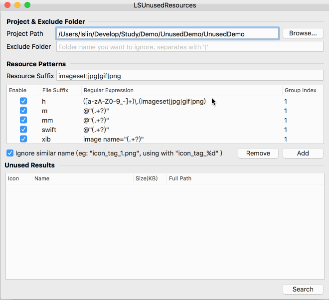

> <h2 id=''></h2>

- [**App瘦身**](#App瘦身)
	- [官方AppThinning](#官方AppThinning)
	- [无用图片资源](#无用图片资源)


<br/>

***
<br/>

> <h1 id='App瘦身'>App瘦身</h1>

&emsp; App Store 规定了安装包大小超过 150MB 的 App 不能使用 OTA（over-the-air）环境下载，也就是只能在 WiFi 环境下下载。所以，150MB 就成了 App 的生死线，一旦超越了这条线就很有可能会失去大量用户。

&emsp; App 包过大既损害用户体验，影响升级率，还会导致无法提交 App Store 的情况和非 WiFi 环境无法下载这样可能影响到 App 生死的问题。那么，怎样对包大小进行瘦身和控制包大小的不合理增长就成了重中之重。

<br/>
<br/>


> <h2 id='官方AppThinning'>官方AppThinning</h2>

&emsp; App Thinning 是由苹果公司推出的一项可以改善 App 下载进程的新技术，主要是为了解决用户下载 App 耗费过高流量的问题，同时还可以节省用户 iOS 设备的存储空间。

&emsp; App Thinning 会专门针对不同的设备来选择只适用于当前设备的内容以供下载。比如，iPhone 6 只会下载 2x 分辨率的图片资源，iPhone 6plus 则只会下载 3x 分辨率的图片资源。

&emsp; 在苹果公司使用 App Thinning 之前， 每个 App 包会包含多个芯片的指令集架构文件。以 Reveal.framework 为例，使用 du 命令查看到主文件在 Reveal.framework/Versions/A 目录下，大小有 21MB。

```
$ du -h Reveal.framework/*
  0B  Reveal.framework/Headers
  0B  Reveal.framework/Reveal
 16K  Reveal.framework/Versions/A/Headers
 21M  Reveal.framework/Versions/A
 21M  Reveal.framework/Versions
 ```
 
 <br/>
 
 我们可以再使用 file 命令，查看 Version 目录下的 Reveal 文件：
 
 ```
ming$ file Reveal.framework/Versions/A/Reveal 
Reveal.framework/Versions/A/Reveal: Mach-O universal binary with 5 architectures: [i386:current ar archive] [arm64]
Reveal.framework/Versions/A/Reveal (for architecture i386): current ar archive
Reveal.framework/Versions/A/Reveal (for architecture armv7):  current ar archive
Reveal.framework/Versions/A/Reveal (for architecture armv7s): current ar archive
Reveal.framework/Versions/A/Reveal (for architecture x86_64): current ar archive
Reveal.framework/Versions/A/Reveal (for architecture arm64):  current ar archive
```

可以看到， Reveal 文件里还有 5 个文件：
- x86_64 和 i386，是用于模拟器的芯片指令集架构文件；
- arm64、armv7、armv7s ，是真机的芯片指令集架构文件。


<br/>

&emsp; 使用 App Thinning 后，用户下载时就只会下载一个适合自己设备的芯片指令集架构文件。

&emsp; App Thinning 有三种方式，包括：
- App Slicing，会在你向 iTunes Connect 上传 App 后，对 App 做切割，创建不同的变体，这样就可以适用到不同的设备。
- On-Demand Resources，主要是为游戏多关卡场景服务的。它会根据用户的关卡进度下载随后几个关卡的资源，并且已经过关的资源也会被删掉，这样就可以减少初装 App 的包大小。
- Bitcode ，是针对特定设备进行包大小优化，优化不明显。


<br/>

&emsp; 如何在你项目里使用 App Thinning 呢？

&emsp; 其实，这里的大部分工作都是由 Xcode 和 App Store 来帮你完成的，你只需要通过 Xcode 添加 xcassets 目录，然后将图片添加进来即可。首先，新建一个文件选择 Asset Catalog 模板，如下图所示：


&emsp; 然后，按照 Asset Catalog 的模板添加图片资源即可，添加的 2x 分辨率的图片和 3x 分辨率的图片，会在上传到 App Store 后被创建成不同的变体以减小 App 安装包的大小。而芯片指令集架构文件只需要按照默认的设置， App Store 就会根据设备创建不同的变体，每个变体里只有当前设备需要的那个芯片指令集架构文件。

&emsp; 使用 App Thining 后，你可以将 2x 图和 3x 图区分开，从而达到减小 App 安装包体积的目的。如果我们要进一步减小 App 包体积的话，还需要在图片和代码上继续做优化。


<br/>
<br/>

> <h2 id='无用图片资源'>无用图片资源</h2>

&emsp; 图片资源的优化空间，主要体现在删除无用图片和图片资源压缩这两方面。而删除无用图片，又是其中最容易、最应该先做的。

<br/>

删除无用图片的过程，可以概括为下面这 6 大步:
- 通过 find 命令获取 App 安装包中的所有资源文件，比如 find /Users/daiming/Project/ -name
- 设置用到的资源的类型，比如 jpg、gif、png、webp
- 使用正则匹配在源码中找出使用到的资源名，比如 pattern = @"@"(.+?)""
- 使用 find 命令找到的所有资源文件，再去掉代码中使用到的资源文件，剩下的就是无用资源了
- 对于按照规则设置的资源名，我们需要在匹配使用资源的正则表达式里添加相应的规则，比如 @“image_%d”
- 确认无用资源后，就可以对这些无用资源执行删除操作了。这个删除操作，你可以使用 NSFileManger 系统类提供的功能来完成

<br/>

如果你不想自己重新写一个工具的话，可以选择开源的工具直接使用。我觉得目前最好用的是[LSUnusedResources](https://github.com/tinymind/LSUnusedResources)，特别是对于使用编号规则的图片来说，可以通过直接添加规则来处理。




<br/>
<br/>


> <h2 id='图片资源压缩'>图片资源压缩</h2>

&emsp; 对于 App 来说，图片资源总会在安装包里占个大头儿。对它们最好的处理，就是在不损失图片质量的前提下尽可能地作压缩。目前比较好的压缩方案是，将图片转成 WebP。WebP 是 Google 公司的一个开源项目。

首先，我们一起看看选择 WebP 的理由：
- WebP 压缩率高，而且肉眼看不出差异，同时支持有损和无损两种压缩模式。比如，将 Gif 图转为 Animated WebP ，有损压缩模式下可减少 64% 大小，无损压缩模式下可减少 19% 大小。
- WebP 支持 Alpha 透明和 24-bit 颜色数，不会像 PNG8 那样因为色彩不够而出现毛边。

<br/>

**如何把图片转成 WebP？**

Google 公司在开源 WebP 的同时，还提供了一个图片压缩工具 cwebp来将其他图片转成 WebP。[**cwebp**](https://developers.google.com/speed/webp/docs/precompiled) 使用起来也很简单，只要根据图片情况设置好参数就行。


<br/>

***
<br/>

> <h1 id=''></h1>


<br/>

***
<br/>

> <h2 id=''></h2>


<br/>

***
<br/>

> <h2 id=''></h2>


<br/>

***
<br/>

> <h2 id=''></h2>


<br/>

***
<br/>

> <h2 id=''></h2>


<br/>

***
<br/>

> <h2 id=''></h2>


<br/>

***
<br/>

> <h2 id=''></h2>


<br/>

***
<br/>

> <h2 id=''></h2>

<br/>

***
<br/>

> <h2 id=''></h2>


<br/>

***
<br/>

> <h2 id=''></h2>

