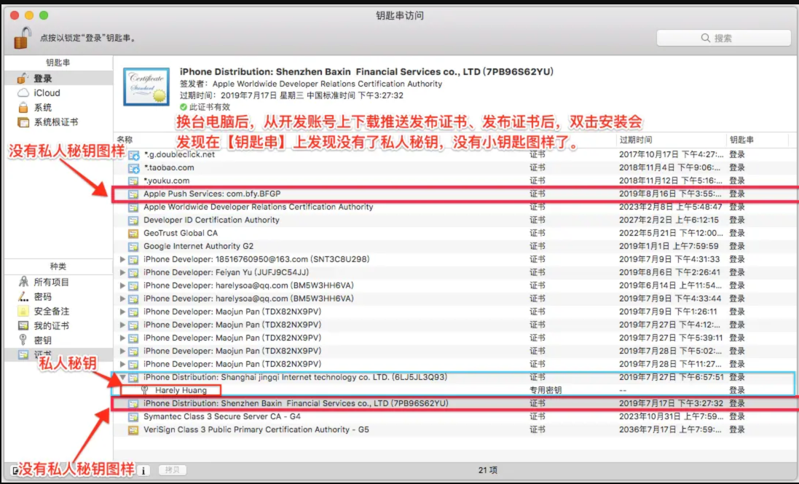
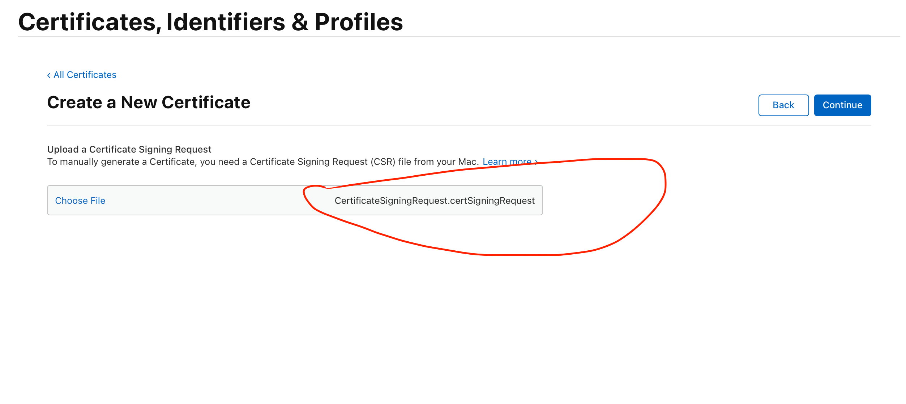
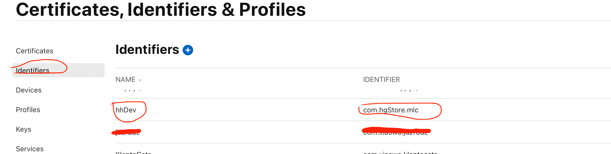
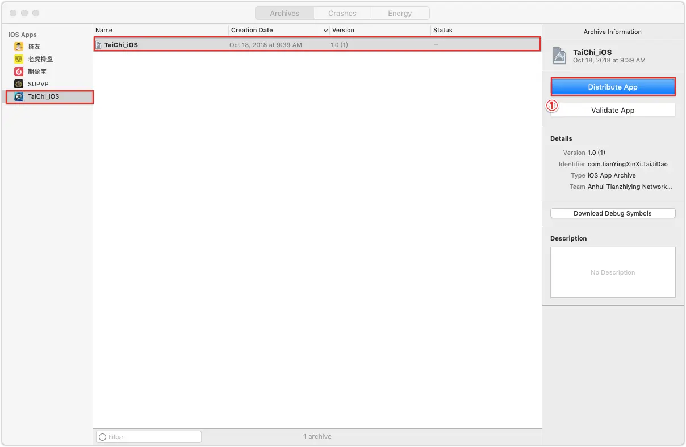

- [**环境配置**](#环境配置)
	- [Build Settings](#BuildSettings)
		- [Apple Clang Preprocessing](#AppleClangPreprocessing)
		- [Preprocessor Macros区分Debug和Release](#PreprocessorMacros区分Debug和Release)
	- [Build Phases](#BuildPhases)
- [**发布文件**](#发布文件)
	-  [资料详细链接](#资料详细链接)
	-  [证书配置错误](#证书配置错误)
	-  [发包由Debug模式切换到Realease模式](#发包由Debug模式切换到Realease模式)
	-  [Xcode打包时，出现证书冲突](#Xcode打包时，出现证书冲突)
- [**证书**](#证书)
	- [自动管理证书](#自动管理证书)
	- [手动管理证书](#手动管理证书)
		- [创建开发者和发布证书](#创建开发者和发布证书)
		- [创建Identifiers](#创建Identifiers)
			- [Explicit和Wildcard 区别](#Explicit和Wildcard区别)
		- [选择添加设备](#选择添加设备)
		- [创建描述文件(Profiles)](#创建描述文件(Profiles))
		- [导入使用](#导入使用)
		- [App Group配置](#AppGroup配置)
	- [自动配置开发证书过程](#自动配置开发证书过程)
	- [打包上传到AppStore的背后](#打包上传到AppStore的背后)
	- [Xcode自动加载发布证书](#Xcode自动加载发布证书)
	- [关于Provisioning Profiles](#关于ProvisioningProfiles)
	- [App IDs](#AppIDs)
	- [查看安装证书配置](#查看安装证书配置)
- [**打包**](#打包)
	- [项目是否处在Debug状态](#项目是否处在Debug状态)
	- [开启Debug或Release模式](#开启Debug或Release模式)
	- [Archive(打包) 测试版(Debug)或者发布版(Debug)](#Archive(打包)测试版(Debug)或者发布版(Debug))
- [**包的导出**](#包的导出)
- **资料**
	- [iOS开发证书申请和创建App流程](https://blog.csdn.net/niubitianping/article/details/113137555)

<br/>

***
<br/>

<h1 id='环境配置'>环境配置</h1>

<br/><br/>


> <h2 id='BuildSettings'>Build Settings</h2>


<br/><br/>

> <h3 id='AppleClangPreprocessing'>Apple Clang Preprocessing</h3>


<br/><br/>

> <h2 id='PreprocessorMacros区分Debug和Release'>PreprocessorMacros区分Debug和Release</h2>

其实这是一种在工程项目中定义宏的一种方式,然而在项目中其实有3种方式的,分别是:

- 1.直接在文件中用  **#define ...** 来定义：此方式优先级最高，当用多种方式宏定义一个变量时，这种方式为最后的值

- 2.在Build Settings中的Apple LLVM 7.0(或者其他版本号) - Preprocessing->Preprocessor Macros中定义：和第3种方式平级

- 3.用xcodebuild打包，在打包命令行中使用

```
xcodebuild -project "${BUILDPROJECT}.xcodeproj" -target $BUILDPROJECT  GCC_PREPROCESSOR_DEFINITIONS='${inherited} LOGONE=1 LOGTWO=1' build
```

其中为宏定义LOGONE和LOGTWO

&emsp; 其中如果不加${inherited}的话，编译会报错，说是重复定义，加上了以后第3种方式宏定义的优先级就高于了2，当分别用2和3定义一个变量的时候，3定义为最后的值，但是加了以后仍然优先级低于第一种方式。

<br/>

当然我们可以使用第2种方式在项目工程中进行Debug环境和Relase来进行区分,比如: Debug环境可以使用NSLog进行打印,但是在Release环境不能进行打印,如下:


<br/>

在项目代码中就可以这样编写硬代码:

```
#ifdef DEBUG

// 调试时改变NSLog方法，输出时间、方法名、行数、输入的内容
#define NSLog(format, ...) printf("\n[%s] %s [第%d行] %s\n", __TIME__, __FUNCTION__, __LINE__, [[NSString stringWithFormat:format, ## __VA_ARGS__] UTF8String]);

#else

#define NSLog(format, ...)

#endif
```


<br/><br/>

> <h2 id='BuildPhases'>Build Phases</h2>


[**配置APP的多个环境**](https://www.jianshu.com/p/5e15c86ee355)

[**APP 配置多个环境变量**](https://www.jianshu.com/p/83b6e781eb51)


<br/>

***
<br/>


<h1 id='发布文件'>发布文件</h1>

发布文件解说:


<br/>
<br/>

- **资料详细链接**

[**上架流程(I)**](https://www.cnblogs.com/EchoHG/p/9384153.html)

[**上架流程(II)**](https://www.cnblogs.com/EchoHG/p/9381768.html)

[**上架流程(III)**](https://www.cnblogs.com/post/readauth?url=/EchoHG/p/9379475.html)

<br/>
<br/>


> <h2 id='证书配置错误'>证书配置错误</h2>


没有私钥的证书

有私钥的证书和没有私钥的证书比较:




原因：假如一台Mac Air生成了证书，另一台Mac Pro从[Apple Developer](https://developer.apple.com)下载了推送证书或者发布证书，就会这样。


<br/>
<br/>

> <h2 id='发包由Debug模式切换到Realease模式'>发包由Debug模式切换到Realease模式</h2>

会出现如下错误缺少文件:


按照图中的提示的方法，可以解决！


<br/>
<br/>


> <h2 id='Xcode打包时，出现证书冲突'>Xcode打包时，出现证书冲突</h2>


解决方案：[Xcode 打包 iOS10](https://blog.csdn.net/h643342713/article/details/52965386)


<br/>

***
<br/>


> <h1 id='证书'>证书</h1>

<br/><br/>

> <h2 id='自动管理证书'>自动管理证书</h2>

**自动管理代码签名：** 通过配置Xcode环境来自动管理描述文件（profiles）、app IDs（Bundle Identifier）和证书（certificates）。


&emsp;  当我们选中Automatically manage signing(这里简称AMS)选框，并且选择对应Team时，Xcode就会帮我们自动生成对应的描述文件、app id和证书文件（完全不需要我们自己手动去创建这些证书）。

作用：在真机调试的时候，如果我们有新的设备，不需要我们到苹果开发者网站去添加新设备的UDID和更新对应的描述文件，Xcode会自动帮我们创建和更新这些内容，这就是它的方便之处。


缺点: 若是开发中每人都用这种方式管理,这样就会导致每人都会生成一份证书,会导致管理证书混乱,不利于后面开发人员查找和替换.建议还是不要用,还是自己管理证书比较好!


<br/><br/>

> <h2 id='手动管理证书'>手动管理证书</h2>


<br/><br/>

> <h2 id='创建开发者和发布证书'>创建开发者和发布证书</h2>


- 1.Mac电脑上面申请certSigningRequest(CSR)文件:


<br/>

- 2.[打开开发者网站](https://developer.apple.com/account/resources/certificates/add),选择**Certiticates**:


<br/>

- 3.选择刚刚使用Mac的钥匙串创建·的文件




<br/>

- 4.下载证书,按照上述步骤生成一个Distribution证书!


<br/>

- 5.这时候已经下载了两个证书，双击证书，导入到电脑，两个都要


<br/>
<br/>

> <h3 id='创建Identifiers'>创建Identifiers</h3>

- 1.选中Identifiers,并点击添加标记


<br/>

- 2.选中App IDs,在这里也可以创建App Groups,这里我们创建App ID是:


<br/>

- 3.选择App


<br/>

- 4.选择你要的服务和Bundle名称和描述


continue之后Resister，然后你会在Idntifiers列表里面看到你创建的Identifier




<br/><br/>

> <h3 id='Explicit和Wildcard区别'>Explicit和Wildcard 区别</h3>


- 1、苹果的app id分为2种，一种是explicit ID ， 直译为 显式ID， 一种是wildcard ID ，直译 通配ID。在创建app id的时候可以设置，创建之后类型不可切换。

- 2、2种ID最直观的区别，explicit ID必须是全名，比如 com.lc.test ， wildcard ID最后一个段为星号（*），比如 com.lc.*  。

- 3、wildcard ID的星号部分，可以随便替换，不影响打包，而且不同的后缀打包出的app不同（简单的说就是一个wildcard ID如果最后的星号部分不同，安装到机器上后是2个app，不会相互覆盖）。explicit ID 不能改。

- 4、wildcard ID不能使用 iap，game center ， 推送 ， explicit ID可以。

- 5、最后总结，explicit ID基本是用来上appstore的（主要是有game center ，推送，iap等权限）。wildcard ID 很适合走非官方平台。


<br/>


最后再说说为什么wildcard ID适合非官方平台。

&emsp; 因为苹果app是靠bundle ID来区分的，如果2个app bundle ID相同，就会相互覆盖。wildcard ID因为最后的星号可以随便改，所以可以为不同平台增加一个区分的作用。否则不同平台之间的版本会相互覆盖。


<br/><br/>

> <h3 id='选择添加设备'>选择添加设备</h3>

- 1.在打包的时候需要运行到手机上，然后运行的手机需要在开发者网站添加,选择**Devices**,填入你要加的手机UDID


<br/>

- 2.确定之后确定信息点击Register即可在Devices列表里面看到刚刚创建的手机


<br/><br/>

> <h3 id='创建描述文件(Profiles)'>创建描述文件(Profiles)</h3>

- 1.选中Profiles,点击 添加 按钮进行创建描述文件;

<br/>


- 2.首先创建开发证书(开发证书类型为iOS Development)，开发调试的时候使用这个证书


<br/>

- 3.Continue之后选择之前创建的Identifiers，即AppID


<br/>

- 4.Continue之后选择之前创建的Development开发证书


<br/>

- 5.Continue之后选择测试设备（这些设备就是Deevics设备列表的设备


<br/>

6.之后输入描述文件的名字，我一般取名是 项目名+证书类型+日期，例如Project3_Development_2023_6_18


<br/>


- 生成之后Download下来，文件的后缀名是mobileprovision

- 重复上面的步骤，再创建一个AdHoc的描述文件 (打包测试使用)

- 再次重复上面的步骤，再创建一个AppStore的描述文件**(打包上架AppStore使用)**

- 三个描述文件下载下来：


<br/>
<br/>


<br/><br/>


> <h2 id='导入使用'>导入使用</h2>


在TARGETS下面的项目: Siging & Capabilities - Provisioning Profile - 点开选择Import Profile，导入你下载的3个描述文件


<br/>
<br/>


<br/>


<br/><br/>


># <h2 id='AppGroup配置'>[App Group配置](https://www.jianshu.com/p/94d4106b9298)</h2>


外孙打灯笼照旧,因为需要生成一个Network Extension,比如VPN插件.就相当于一个新的App,所以相当于生成一个app,依然要生成一个证书!步骤如下:

- 1.生成一个Identifiers


<br/>


- 2.选择App Groups,然后点解Continue


<br/>


- 3.填写证书描述和Bundle Identifier


<br/>

- 4.回到刚刚生成主App的Identifiers,选择主工程生成的Identifier,然后点击进去


<br/>

- 5. 选择主工程生成的App Groups,点击 Edit:


<br/>

- 6.在点击的弹框中,选择刚刚为App Group创建的Identifier,为2者建立联系,下面是我已经选中的:


<br/>

7. 选择主工程创建,App Groups! 在里面搜索net 然后双击创建:


然后再次点击,搜索 Network 选中Network Extentsions,之后就是对App Groups、Network Extensions进行配置了,如下:


<br/>

8. 同样为插件MLCPacketTunnel生成并配置App Groups、Network Extensions,和主工程差不多.如下:


9. 下面的和主工程有些差不多,为MLCPacketTunnel生成Identifiers,然后生成Debug、adhoc、Release环境下的Profiles描述文件,方便调试和测试,下面是我已经生成的,如下:


<br/>
<br/>


> <h2 id='自动配置开发证书过程'>自动配置开发证书过程</h2>


出现自动配置证书错误:


&emsp;  存在：Xcode会在本机钥匙串寻找team对应的开发证书,如果本地钥匙串存在该证书则加载使用。 

&emsp;  不存在：则从开发者中心寻找本机对应的开发证书,如果开发者中心没有则自动生成一个并下载到钥匙串使用;如果AMS已为这台电脑生成过开发证书,则提示如下图中的信息。

**开发者中心证书管理:**


出现上述【自动配置证书错误】解决方法：

MethodOne：前往开发者中心证书管理页面（上图）下载本机的证书导入本机钥匙串。

MethodTwo：直接选择revoke，但revoke会把开发者中心对应本机的证书重新生成覆盖掉，这样可以解决问题，但是会有一个隐患如果profile中存在被覆盖的本机证书对应的profile，且只有这一个证书时，该profile会因不含发布证书而变无效。这个很重要，具体会在文后关于Provisioning展开讨论。

<br/>
<br/>


> <h2 id='打包上传到AppStore的背后'>打包上传到AppStore的背后</h2>


&emsp;  选择save for app store deployment或者save for Ad Hoc deployment或者upload to App Store发生了什么?

**上传包到AppStore:**


**Xcode自动加载发布证书**

&emsp;  若存在Xcode会去本机钥匙串寻找苹果账号对应的发布证书，若不存在则从开发者中心寻找发布证书，如果开发者中心不存在则新生成一个，并下载到本机钥匙串，并加载。

下一步，如果存在出现未能找到或者匹配的证书资源:


<br/>

**解决方案：**

&emsp; 方法一：可选择去开发者中心下载（前提是那个发布证书是本机生成的，如果是其他人的机器生成的，下载也没用，因为没有私钥，私钥要从别人那里导出，这种情况只能去那个人的电脑钥匙串导出p12文件，关于证书和私钥的详细说明请移步后文）

&emsp; 方法二：选择reset，然后try again就可以了。但reset慎重，reset还是有可能会导致Provisioning无效的情况，而且别人的证书不再有效，以后进行和发布证书相关的操作，他就会面临和你现在相同的问题，出现恶性循环。


&emsp;    Xcode正确加载发布证书之后，会根据App id去profile下载Provisioning了，有则下载，无则自动创建一个(绑定当前app id和发布证书)并下载，但是，在这一步并不会检查Provisioning有无效，详细请看文后关于Provisioning话题。

&emsp; 从开发者中心下载其他电脑生成的证书，然后导入到本机中。会在【钥匙串】中发现证书是不包含秘钥的。自然使用不了，结果也的确这样，提示revoke。

Remoke 错误:


&emsp; 由以上也可证明一点，Xcode帮我们申请的证书（开发、测试证书）都跟电脑绑定的。如果我们想让其他电脑也能用这台电脑的证书，也只有采用老方法，导出p12文件，这样秘钥也导过去了。就可以正常使用。

<br/>
<br/>


> <h2 id='关于ProvisioningProfiles'>关于Provisioning Profiles</h2>

- ****

<br/>

**APP IDs、证书、Provisioning Profiles 三者的联系**

&emsp; 我们知道最终打包进去ipa的是Provisioning Profiles描述文件，而Provisioning Profiles文件则包含了开发者的开发或者发布证书，以及APP IDs（可以理解为bundle identifier）。做了这么多事情，也是为了得到正确的
Provisioning从而成功的打包或者上传我们的app。如果证书或者APP ID出错了，最后的Provisioning自然也是错的，签名过程自然就会出现问题。

<br/>

**revoke和reset导致的Provisioning Profiles错误**

&emsp; 经过观察，Provisioning 无效会有两种情况，要么过期了，要么不含有证书了。这样在开发者中心Provisioning Profiles页面就会显示invalid无效。Xcode加载Provisioning的时候并不会验证Provisioning是否有效。也就是说，显示invalid的Provisioning，Xcode也会加载回来，且不会提示错误。这样就有可能会有问题。


<br/>

**举个例子**

&emsp; 假如开发者中心一片空白，当在mac A打包上传时，开发者中心为该开发者创建了关联mac A的开发证书和发布证书，并且自动生成了app id和Provisioning，此时的Provisioning就是关联了发布证书的，且就一个证书，例如下图。

**Provisioning Profiles:**


&emsp; mac A就成功打包上传了，一切都很顺利。然而过了一段日子，需要在mac B打包上传，因为mac B是没有发布证书的，自然会提示reset，如果mac B进行了reset，那么Xcode自动为mac B创建的发布证书就会替代mac A之前的证书了，原证书没了，Provisioning的Certificates就会变成0 total，从而变成invalid，无效了。但是mac B继续打包上传，在Xcode从开发者信息中寻找Provisioning的时候，因为含有同样的APP ID的Provisioning存在了，Xcode不会再为开发者重新创建一个Provisioning，而是直接加载！！而加载这个恰好就是无效的！Xcode也不会提示任何错误。那么之后就GG了。

<br/>
<br/>


> <h2 id='App IDs'>App IDs</h2>


&emsp; 在开发者中心APP IDs有个Wildcard App ID的概念，大概的意思就是使用通配符的App ID可以通配一系列符合的APP ID；比如定义了一个Wildcard App ID：com.，那么这个App ID就可以统配所以以com.开头的bundle identifier，xcode不会再为其生成相同名字的App ID。同理，在第一次使用com. App ID时，Xcode会为其新建Provisioning，Provisioning对应的App ID就是com.，以后再有新项目bundle identifier以com.开头，Xcode不会再为其创建Provisioning，也就是公用com. APP ID的应用共用一个Provisioning。通配符有其好处，也有不好的地方，感兴趣大家可以到Apple官方看看相关内容。

**Xcode自动为项目创建APP ID的过程**

说了这么多Wildcard App ID的内容，也是为了说一下，Xcode自动为项目创建APP ID的过程。如果开发者中心有与bundle identifier相同的APP ID则不创建，如果没有，会看有没有适合的Wildcard App ID，如果有也不创建，如果没有才最后创建与bundle identifier相同ID的App ID。


[**AutoMatically manager signing背后你不得不知道的事**](https://www.jianshu.com/p/2effcd4c4453)


<br/><br/>

> <h2 id='查看安装证书配置'>查看安装证书配置</h2>


<br/>

***
<br/>


> <h1 id='打包'>打包</h1>


<br/>

- **项目是否处在Debug状态**

点击项目工程->【TARGETS】下的项目->【Build Settings】，在搜索框中输入：“macros”，如下图。

**Debug 状态查看:**


接下来在项目中的宏文件中可以这样做：

```
#ifdef DEBUG
    //do sth.
#else
    //do sth.
#endif
```

&emsp; 一般Apple已经为我们设置好了 DEBUG 的宏定义，所以，我们只要让 NSLog 在 DEBUG 模式下失效就好了，这样能让我们的程序运行起来更加稳定，同时我们也可以继续使用正规的 NSLog。
  
```Swift
//put this in prefix.pch

#ifndef DEBUG
#undef NSLog
#define NSLog(args, ...)
#endif
```

<br/>
<br/>

- **开启Debug或Release模式**

&emsp; 一个发布的程序，若带有太多的NSLog输出，肯定对于App性能有所影响，我们可以使用一个宏定义来处理，在开发的时候使用DEBUG模式，在发布的时候使用RELEASE模式。这样，发布的App就不会在程序内部做大量的NSLog输出了。

**Debug和Release模式的区别:**

&emsp; Release是发行版本,比Debug版本有一些优化，文件比Debug文件小 Debug是调试版本，Debug和Release调用两个不同的底层库。通俗点讲，我们开发者自己内部真机或模拟器调试时，使用Debug模式就好，等到想要发布时，也就是说需要大众客户使用时，需要build Release版本，具体区别如下：

① Debug是调试版本，包括的程序信息更多

② 只有Debug版的程序才能设置断点、单步执行、使用TRACE/ASSERT等调试输出语句

③ Release不包含任何调试信息，所以文件小、运行速度快

**查看目标文件生成**

目标文件路径:


<br/>


```
Swift

简单的代码如下，

#if defined(DEBUG)||defined(_DEBUG)

    NSLog(@"------------->>>>>>>  错误的代码段");

    NSLog(@"-------------》》》Test Code");

#endif
```

若定义了Debug模式，就会走逻辑判断中的NSLog的打印，否则不会处理。DEBUG和_DEBUG的判断是来自于Xcode的设置，在Xcode中我们可以取消DEBUG模式，开启RELEASE发布模式如下图：

选择Product一栏>Scheme>Edit Scheme

- 1.选择工程文件:  

 

<br/>


- 2.选择边界 Scheme:

 


<br/>


- 3.选择Debug或者Release模式

 

<br/>
<br/>

<br/><br/>

> <h2 id='Archive(打包)测试版(Debug)或者发布版(Debug)'>Archive(打包) 测试版(Debug)或者发布版(Debug)</h2>


&emsp; Archive也分为Debug和Release版本，你可以Archive出一个Debug版本的应用也可以Archive出一个Release的应用。直接archive 是系统提供帮助打包的，Archive生成后的文件会小很多。

打包选择:

 


要注意一点：

不选择 Generic iOS Device 无法打包


 


<br/>

***
<br/>


> <h1 id='包的导出'>包的导出</h1>


Xcode10版本打包后的界面


 

<br/>

**Xcode9 以前打包后的界面:**


&ensp;  可以观察到，Xcode10打包后的界面没有了【Export】按钮了。要想打包，在Xcode10界面点击【Distribute App】。

<br/>

跳到下一个发布模式界面：


<br/>

***Next***

**开发发布方法:**


<br/>

***Next***

**选择数字签名方式:**


<br/>

***Next***

**导出包:**


按照这个步骤走，就可以得到 iPa包了！


