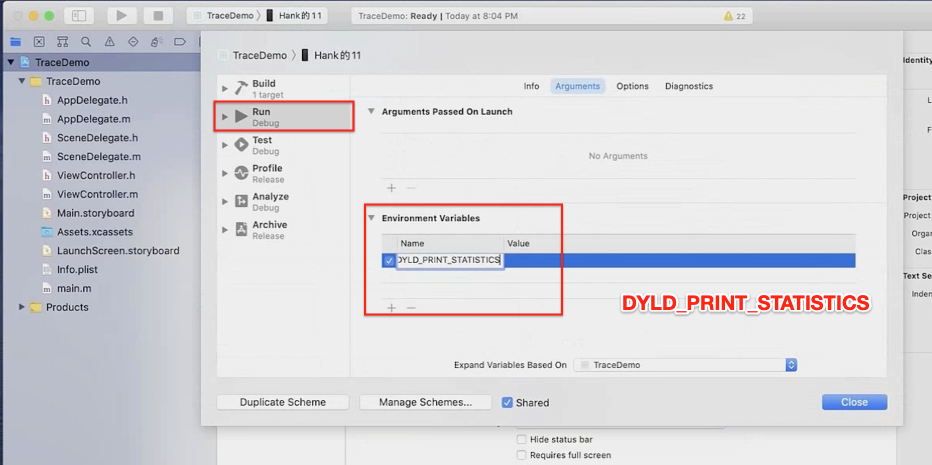
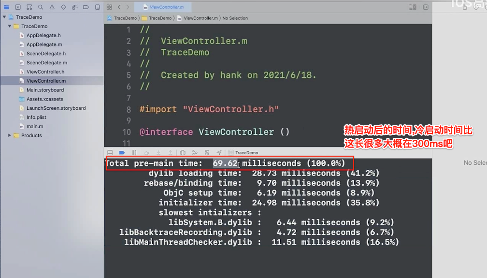

> <h2 id=''></h2> 
- [**APP启动流程**](#APP启动流程)
	- [Main函数执行前](#Main函数执行前)
	- [main()函数执行后](#main函数执行后)
	- [首屏渲染完成后](#首屏渲染完成后)
- [**App启动优化点**](#App启动优化点)
	- [功能级别优化](#功能级别优化)
	- [方法级别的启动优化](#方法级别的启动优化)
	- [检测耗时方法](#检测耗时方法)
	- [Time Profiler](#TimeProfiler)
	- 	[objc_msgSend的hook](#objc_msgSend的hook)
	- [fishhook的hook](#fishhook的hook)
- [**APP的生命流程**](#APP的生命流程)
	- 	[APP的初始化流程(main)](#APP的初始化流程(main))
	- 	[main.m文件说明](#main.m文件说明)
- [**UIAppDelegate**](#UIAppDelegate)
	- [代理方法](#代理方法)
	- [方向设置](#方向设置)
- 	[**UIViewController生命周期**](UIViewController生命周期)
- 	[**资料**]()
	- [**iOS强制横屏和竖屏**](https://blog.csdn.net/ghl2318560278/article/details/51579814)
	- [**UIApplication sharedapplication用法总结**](https://blog.csdn.net/huang2009303513/article/details/39501225)
	- [**使用系统打开**](https://blog.csdn.net/potato512/article/details/43968375)
	- [**AppDelegate程序生命运行过程及使用时机**](https://blog.csdn.net/zhw521411/article/details/52956055)
	- [**静态库和动态库的制作和研究**](https://www.jianshu.com/p/d643c1368c9d)
	- [**视频 静态库和动态库基础要点**](https://www.bilibili.com/video/BV1of4y1Q7cy?from=search&seid=4557030534076664019)
	


<br/>

***
<br/>

> <h1 id='APP启动流程'>APP启动流程</h1>

- **启动分类:**
	- 冷启动:App 点击启动前，它的进程不在系统里，需要系统新创建一个进程分配给它启动的情况。这是一次完整的启动过程。
	- 热启动:App 在冷启动后用户将 App 退后台，在 App 的进程还在系统里的情况下，用户重新启动进入 App 的过程，这个过程做的事情非常少。

<br/>

&emsp; 一般而言，App 的启动时间，指的是从用户点击 App 开始，到用户看到第一个界面之间的时间。

- App 的启动主要包括三个阶段：
	- main() 函数执行前；
	- main() 函数执行后；
	- 首屏渲染完成后。

<br/>


&emsp; 查看启动之前需要的耗时时间,这样可以在控制台打印时间了,配置环境变量**DYLD_PRINT_STATISTICS**,如下:



运行时后在控制台,显示的加载时间,如下图:




<br/>

- **解读:**
	- main()函数之前总共使用了69.62ms
	
	- 在69.62ms中，加载动态库用了28.73ms，指针重定位使用了9.70ms，ObjC类初始化使用了6.19ms，各种初始化使用了24.98ms。

	- 在初始化耗费的24.98ms中，用时最多的三个初始化是libSystem.B.dylib、libBacktraceRecording.dylib以及libMainThreadChecker.dylib。这个耗时是无法优化的,这是系统的,需要苹果等做出相应的优化


<br/>

**注意:后台杀掉应用并不代表冷启动!**

&emsp; 应用加载出来的时候,很快60多毫秒是在虚拟内存,在300多毫秒时是在物理内存里.

&emsp; 苹果建议不要超过6个动态库,太多的动态库加载起来可能很耗时间,若是太多可以合并.

<br/>
<br/>

> <h2 id='Main函数执行前'>Main函数执行前</h2>


- 在 main() 函数执行前，系统主要会做下面几件事情：
	- 加载可执行文件（App 的.o 文件的集合）；
	- 加载动态链接库，进行 rebase 指针调整和 bind 符号绑定；
	- Objc 运行时的初始处理，包括 Objc 相关类的注册、category 注册、selector 唯一性检查等；
	- 初始化，包括了执行 +load() 方法、attribute((constructor)) 修饰的函数的调用、创建 C++ 静态全局变量。


<br/>

**这里可以做优化加速的点有:**

- 减少动态库加载。每个库本身都有依赖关系，苹果公司建议使用更少的动态库，并且建议在使用动态库的数量较多时，尽量将多个动态库进行合并。数量上，苹果公司建议最多使用 6 个非系统动态库。
- 减少加载启动后不会去使用的类或者方法。
- +load() 方法里的内容可以放到首屏渲染完成后再执行，或使用 +initialize() 方法替换掉。因为，在一个 +load() 方法里，进行运行时方法替换操作会带来 4 毫秒的消耗。不要小看这 4 毫秒，积少成多，执行 +load() 方法对启动速度的影响会越来越大。
- 控制 C++ 全局变量的数量。


<br/>
<br/>

> <h2 id='main函数执行后'>main() 函数执行后</h2>

&emsp; main() 函数执行后的阶段，指的是从 main() 函数执行开始，到 appDelegate 的 didFinishLaunchingWithOptions 方法里首屏渲染相关方法执行完成。

&emsp;首页的业务代码都是要在这个阶段，也就是首屏渲染前执行的，主要包括了：
- 首屏初始化所需配置文件的读写操作；
- 首屏列表大数据的读取；
- 首屏渲染的大量计算等。

&emsp; 很多时候，开发者会把各种初始化工作都放到这个阶段执行，导致渲染完成滞后。 

**更加优化的开发方式，应该是从功能上梳理出哪些是首屏渲染必要的初始化功能，哪些是 App 启动必要的初始化功能，而哪些是只需要在对应功能开始使用时才需要初始化的。**

梳理完之后，将这些初始化功能分别放到合适的阶段进行。


<br/>
<br/>

> <h2 id='首屏渲染完成后'>首屏渲染完成后</h2>


&emsp;这个阶段主要完成的是非首屏其他业务服务模块的初始化、监听的注册、配置文件的读取等。

&emsp;从函数上来看，这个阶段指的就是截止到 didFinishLaunchingWithOptions 方法作用域内执行首屏渲染之后的所有方法执行完成。简单说的话，这个阶段就是从渲染完成时开始，到 didFinishLaunchingWithOptions 方法作用域结束时结束。

&emsp;这个阶段用户已经能够看到 App 的首页信息了，所以优化的优先级排在最后。但是，那些会卡住主线程的方法还是需要最优先处理的，不然还是会影响到用户后面的交互操作。


<br/>

***
<br/>


> <h1 id='App启动优化点'>App启动优化点</h1>


<br/>

> <h2 id='功能级别优化'>功能级别优化</h2>

功能级别的启动优化，要从 main() 函数执行后这个阶段下手。

优化的思路是： main() 函数开始执行后到首屏渲染完成前只处理首屏相关的业务，其他非首屏业务的初始化、监听注册、配置文件读取等都放到首屏渲染完成后去做。


<br/>
<br/>


> <h2 id='方法级别的启动优化'>方法级别的启动优化</h2>
  
&emsp; 经过功能级别的启动优化，也就是将非首屏业务所需的功能滞后以后，从用户点击 App 到看到首屏的时间将会有很大程度的缩短，也就达到了优化 App 启动速度的目的。

&emsp; 在这之后，我们需要进一步做的，是检查首屏渲染完成前主线程上有哪些耗时方法，将没必要的耗时方法滞后或者异步执行。通常情况下，耗时较长的方法主要发生在计算大量数据的情况下，具体的表现就是加载、编辑、存储图片和文件等资源。


那我们是不是只需要**优化对资源**的操作就可以了呢？

当然不是。

&emsp;就像 +load() 方法，一个耗时 4 毫秒，100 个就是 400 毫秒，这种耗时用户也是能明显感知到的。

&emsp;比如，我以前使用的 ReactiveCocoa 框架（这是一个 iOS 上的响应式编程框架），每创建一个信号都有 6 毫秒的耗时。这样，稍不注意各种信号的创建就都被放在了首屏渲染完成前，进而导致 App 的启动速度大幅变慢。类似这样单个方法耗时不多，但是由于堆积导致 App 启动速度大幅变慢的方法数不胜数。所以，你需要一个能够对启动方法耗时进行全面、精确检查的手段。


<br/>
<br/>


> <h3 id='检测耗时方法'>检测耗时方法</h3>

**那我们如何针对耗时的方法进行精确的检测呢?如下:**

<br/>

> <h4 id='TimeProfiler'>Time Profiler</h4>

&emsp; 使用Time Profiler定时抓取主线程上的方法调用堆栈，计算一段时间里各个方法的耗时。

&emsp; 这个定时间隔要设置好否则颗粒度不过会漏过很多方法的,如果小于所有方法执行的时间（比如 0.002 秒），那么基本就能监控到所有方法。但这样做的话，整体的耗时时间就不够准确。一般将这个定时间隔设置为 0.01 秒。这样设置，对整体耗时的影响小，不过很多方法耗时就不精确了。但因为整体耗时的数据更加重要些，单个方法耗时精度不高也是可以接受的，所以这个设置也是没问题的.


<br/>
<br/>

> <h4 id='objc_msgSend的hook'>objc_msgSend的hook</h4>

&emsp; hook objc_msgSend 这种方式的优点是非常精确，而缺点是只能针对 Objective-C 的方法。当然，对于 c 方法和 block 也不是没有办法，你可以使用 **libffi 的 ffi_call** 来达成 hook，但缺点就是编写维护相关工具门槛高。

&emsp; 如果对于检查结果精准度要求高的话，我比较推荐你使用 hook objc_msgSend 方式来检查启动方法的执行耗时。


&emsp; Objective-C 里每个对象都会指向一个类，每个类都会有一个方法列表，方法列表里的每个方法都是由 selector、函数指针和 metadata 组成的。objc_msgSend 方法干的活儿，就是在运行时根据对象和方法的 selector 去找到对应的函数指针，然后执行。

&emsp; 也就是说，objc_msgSend 是 Objective-C 里方法执行的必经之路，能够控制所有的 Objective-C 的方法。

&emsp; objc_msgSend 本身是用汇编语言写的，这样做的原因主要有两个：一个原因是，objc_msgSend 的调用频次最高，在它上面进行的性能优化能够提升整个 App 生命周期的性能。而汇编语言在性能优化上属于原子级优化，能够把优化做到极致。所以，这种投入产出比无疑是最大的。另一个原因是，其他语言难以实现未知参数跳转到任意函数指针的功能。现在，苹果公司已经开源了 Objective-C 的运行时代码。你可以在苹果公司的开源网站，找到 [objc_msgSend的源码](https://opensource.apple.com/source/objc4/objc4-723/runtime/Messengers.subproj/)。


&emsp; **objc_msgSend 方法执行的逻辑是：先获取对象对应类的信息，再获取方法的缓存，根据方法的 selector 查找函数指针，经过异常错误处理后，最后跳到对应函数的实现。**

&emsp; 按照这个逻辑去看源码会更加清晰，更容易注意到实现细节。阅读 objc_msgSend 源码是编写方法级耗时工具的一个必要的环节，后面还需要编写一些对应的汇编代码。


<br/>
<br/>

> <h4 id='fishhook的hook'>fishhook的hook</h4>

&emsp; [fishhook](https://github.com/facebook/fishhook)是可以在 iOS 上运行的 Mach-O 二进制文件中动态地重新绑定符号

&emsp; fishhook 实现的大致思路是，通过重新绑定符号，可以实现对 c 方法的 hook。dyld 是通过更新 Mach-O 二进制的 __DATA segment 特定的部分中的指针来绑定 lazy 和 non-lazy 符号，通过确认传递给 rebind_symbol 里每个符号名称更新的位置，就可以找出对应替换来重新绑定这些符号。

<br/>

下面大致说下fishhook的原理:

首先，遍历 dyld 里的所有 image，取出 image header 和 slide。代码如下:

```

if (!_rebindings_head->next) {
    _dyld_register_func_for_add_image(_rebind_symbols_for_image);
} else {
    uint32_t c = _dyld_image_count();
    // 遍历所有 image
    for (uint32_t i = 0; i < c; i++) {
        // 读取 image header 和 slider
        _rebind_symbols_for_image(_dyld_get_image_header(i), _dyld_get_image_vmaddr_slide(i));
    }
}
```


<br/>

接下来，找到符号表相关的 command，包括 linkedit segment command、symtab command 和 dysymtab command。代码如下：

```

segment_command_t *cur_seg_cmd;
segment_command_t *linkedit_segment = NULL;
struct symtab_command* symtab_cmd = NULL;
struct dysymtab_command* dysymtab_cmd = NULL;
uintptr_t cur = (uintptr_t)header + sizeof(mach_header_t);
for (uint i = 0; i < header->ncmds; i++, cur += cur_seg_cmd->cmdsize) {
    cur_seg_cmd = (segment_command_t *)cur;
    if (cur_seg_cmd->cmd == LC_SEGMENT_ARCH_DEPENDENT) {
        if (strcmp(cur_seg_cmd->segname, SEG_LINKEDIT) == 0) {
            // linkedit segment command
            linkedit_segment = cur_seg_cmd;
        }
    } else if (cur_seg_cmd->cmd == LC_SYMTAB) {
        // symtab command
        symtab_cmd = (struct symtab_command*)cur_seg_cmd;
    } else if (cur_seg_cmd->cmd == LC_DYSYMTAB) {
        // dysymtab command
        dysymtab_cmd = (struct dysymtab_command*)cur_seg_cmd;
    }
}
```


<br/>

然后，获得 base 和 indirect 符号表。实现代码如下：

```

// 找到 base 符号表的地址
uintptr_t linkedit_base = (uintptr_t)slide + linkedit_segment->vmaddr - linkedit_segment->fileoff;
nlist_t *symtab = (nlist_t *)(linkedit_base + symtab_cmd->symoff);
char *strtab = (char *)(linkedit_base + symtab_cmd->stroff);
// 找到 indirect 符号表
uint32_t *indirect_symtab = (uint32_t *)(linkedit_base + dysymtab_cmd->indirectsymoff);
```


<br/>

最后，有了符号表和传入的方法替换数组，就可以进行符号表访问指针地址的替换了，具体实现如下：

```

uint32_t *indirect_symbol_indices = indirect_symtab + section->reserved1;
void **indirect_symbol_bindings = (void **)((uintptr_t)slide + section->addr);
for (uint i = 0; i < section->size / sizeof(void *); i++) {
    uint32_t symtab_index = indirect_symbol_indices[i];
    if (symtab_index == INDIRECT_SYMBOL_ABS || symtab_index == INDIRECT_SYMBOL_LOCAL ||
        symtab_index == (INDIRECT_SYMBOL_LOCAL   | INDIRECT_SYMBOL_ABS)) {
        continue;
    }
    uint32_t strtab_offset = symtab[symtab_index].n_un.n_strx;
    char *symbol_name = strtab + strtab_offset;
    if (strnlen(symbol_name, 2) < 2) {
        continue;
    }
    struct rebindings_entry *cur = rebindings;
    while (cur) {
        for (uint j = 0; j < cur->rebindings_nel; j++) {
            if (strcmp(&symbol_name[1], cur->rebindings[j].name) == 0) {
                if (cur->rebindings[j].replaced != NULL &&
                    indirect_symbol_bindings[i] != cur->rebindings[j].replacement) {
                    *(cur->rebindings[j].replaced) = indirect_symbol_bindings[i];
                }
                // 符号表访问指针地址的替换
                indirect_symbol_bindings[i] = cur->rebindings[j].replacement;
                goto symbol_loop;
            }
        }
        cur = cur->next;
    }
symbol_loop:;
```


&emsp; 以上，就是 fishhook 的实现原理了。fishhook 是对底层的操作，其中查找符号表的过程和堆栈符号化实现原理基本类似，了解了其中原理对于理解可执行文件 Mach-O 内部结构会有很大的帮助。

&emsp;耗时检查的完整代码，可以在[GCDFetchFeed](https://github.com/ming1016/GCDFetchFeed)里查看。在需要检测耗时时间的地方调用 [SMCallTrace start]，结束时调用 stop 和 save 就可以打印出方法的调用层级和耗时了。


<br/>

***
<br/>


> <h1 id='APP的生命流程'>APP的生命流程</h1>


<br/>
<br/>

**1.App构建过程**

-	从源代码到app, 当我们点击了 build 之后，做了什么事情呢？
	-	预处理（Pre-process）：把宏替换，删除注释，展开头文件，产生 .i 文件。
	-	编译（Compliling）：把之前的 .i 文件转换成汇编语言，产生 .s文件。
	-	汇编（Asembly）：把汇编语言文件转换为机器码文件，产生 .o 文件。
	-	链接（Link）：对.o文件中的对于其他的库的引用的地方进行引用，生成最后的可执行文件（同时也包括多个 .o 文件进行 link）。

<br/>
<br/>

-	**2.APP的启动流程(pre-main)**

```
1.iOS系统首先会加载解析该APP的Info.plist文件，因为Info.plist文件中包含了支持APP加载运行所需要的众多Key，value配置信息，例如APP的运行条件(Required device capabilities)，是否全屏，APP启动图信息等。

2.创建沙盒(iOS8后，每次启动APP都会生成一个新的沙盒路径)

3.根据Info.plist的配置检查相应权限状态

4.加载Mach-O文件读取dyld路径并运行dyld动态连接器(内核加载了主程序，dyld只会负责动态库的加载)
	4.1 首先dyld会寻找合适的CPU运行环境
	4.2 然后加载程序运行所需的依赖库和我们自己写的.h.m文件编译成的.o可执行文件，并对这些库进行链接。
	4.3 加载所有方法(runtime就是在这个时候被初始化的)
	4.4 加载C函数
	4.5 加载category的扩展(此时runtime会对所有类结构进行初始化)
	4.6 加载C++静态函数，加载OC+load
	4.7 最后dyld返回main函数地址，main函数被调用
```

**dyld说明:**

&emsp;	dyld叫做动态链接器，主要的职责是完成各种库的连接。dyld是苹果用C++写的一个开源库，可以在苹果的[git上直接查看源代码](https://github.com/opensource-apple/dyld)。

&emsp;	当系统从xnu内核态把控制权转交给dyld变成用户态后.dyld首先初始化程序环境，将可执行文件以及相应的系统依赖库与我们自己加入的库加载进内存中，生成对应的ImageLoader类对应的image对象(镜像文件)，对这些image进行链接，调用各image的初始化方法等等(注:这里多数情况都是采用的递归，从底向上的方法调用)，其中runtime就是在这个过程中被初始化的，这些事情大多数在`dyld:_mian`方法中被发生。


<br/>
<br/>

> <h2 id='APP的初始化流程(main)'>APP的初始化流程(main)</h2>


```
1.main 函数

2.执行UIApplicationMain
	2.1 创建UIApplication对象
	2.2 创建UIApplication的delegate对象
	2.3 创建MainRunloop
	2.4 delegate对象开始处理(监听)系统事件(没有storyboard)

3.根据Info.plist获得最主要storyboard的文件名,加载最主要的storyboard(有storyboard)
程序启动完毕的时候, 就会调用代理的application:didFinishLaunchingWithOptions:方法
在application:didFinishLaunchingWithOptions:中创建UIWindow
创建和设置UIWindow的rootViewController
最终显示第一个窗口

```


<br/><br/>
> <h2 id='main.m文件说明'>main.m文件说明</h2>

```

import <UIKit/UIKit.h>
#import "AppDelegate.h"

//main函数是整个程序的入口
int main(int argc, char * argv[]) {
    //参数argc说明:命令行总的参数个数。
    //参数argv说明:是参数的数组，argv中第一个参数为app的路径＋全名。
    printf("argc = %d\n", argc);
    char *argChar = argv[0];
    printf("index = %i ,argv = %s\n", 0, argChar);
    @autoreleasepool {
        //UIApplicationMain函数说明
        //第一个参数argc:参数是main函数C语言中传入的，保持与main函数相同。
        //第二个参数argv:同argc参数一样
        //第三个参数nil:该参数为principalClassName (主要类名) 
        //    如果principalClassName是nil，那么它的值将从Info.plist去获取，如果Info.plist没有，则默认为UIApplication。
        //    principalClass这个类除了管理整个程序的生命周期之外什么都不做，它只负责监听事件然后交给delegateClass去做。
        //第四个参数NSStringFromClass([AppDelegate class]):委托代理类的类名，UIApplication创建的delegate对象的类名
        return UIApplicationMain(argc, argv, nil, NSStringFromClass([AppDelegate class]));
    }
}
```


<br/>

***
<br/>

> <h1 id='UIAppDelegate'>UIAppDelegate</h1>

<br/>

> <h2 id='代理方法'>代理方法</h2>

```

//app启动完毕后就会调用
- (BOOL)application:(UIApplication *)application didFinishLaunchingWithOptions:(NSDictionary *)launchOptions
{
    //打印方法名
    //本地通知的Key，UIApplicationDidFinishLaunchingNotification
    NSLog(@"--- %s ---",__func__);
}

//比如当有电话进来或短信进来或锁屏等情况下，这时应用程序挂起进入非活动状态。
//也就是手机界面还是显示着你当前的应用程序的窗口，只不过被别的任务强制占用了，也可能是即将进入后台状态(因为要先进入非活动状态然后才会进入后台状态)
- (void)applicationWillResignActive:(UIApplication *)application
{
    NSLog(@"--- %s ---",__func__);
}

//指当前窗口不是你的App,大多数程序进入这个后台会在这个状态上停留一会，时间到之后会进入挂起状态(Suspended)。
//如果你程序特殊处理后可以长期处于后台状态也可以运行。
//Suspended (挂起): 程序在后台不能执行代码。系统会自动把程序变成这个状态而且不会发出通知。
//当挂起时，程序还是停留在内存中的，当系统内存低时，系统就把挂起的程序清除掉，为前台程序提供更多的内存
- (void)applicationDidEnterBackground:(UIApplication *)application
{
    /本地通知的Key，/UIApplicationDidEnterBackgroundNotification
    NSLog(@"--- %s ---",__func__);
    //当用户按下home键后，程序进入后台运行状态，如果内存不足被系统关闭或者用户手动杀掉程序，都不会调用applicationWillTerminate函数。
    //在程序进入后台时，添加一beginBackgroundTaskWithExpirationHandler(后台运行通知函数)，程序进入后台10分钟内，程序还在运行，并可以响应一些消息
    [[UIApplication sharedApplication] beginBackgroundTaskWithExpirationHandler:^{
        NSLog(@"程序关闭");
    }];
}

//app程序程序从后台回到前台就会调用
- (void)applicationWillEnterForeground:(UIApplication *)application
{
    //本地通知的Key，UIApplicationWillEnterForegroundNotification
    NSLog(@"--- %s ---",__func__);
}


//app程序获取焦点就会调用
- (void)applicationDidBecomeActive:(UIApplication *)application
{
    //本地通知的Key，UIApplicationDidBecomeActiveNotification
    NSLog(@"--- %s ---",__func__);
}

// 内存警告，可能要终止程序，清除不需要再使用的内存
- (void)applicationDidReceiveMemoryWarning:(UIApplication *)application
{
    NSLog(@"--- %s ---",__func__);
}

// 程序即将退出调用
- (void)applicationWillTerminate:(UIApplication *)application
{
    //UIApplicationWillTerminateNotification
    NSLog(@"--- %s ---",__func__);
}
```


<br/>

- **didFinishLaunchingWithOptions**

```
- (BOOL)application:(UIApplication *)application didFinishLaunchingWithOptions:(NSDictionary *)launchOptions {
       application.idleTimerDisabled=true;
}
```


**`var idleTimerDisabled: Bool`**

> ① 是一个布尔值，用来控制这个App在空闲的时候是否禁用；

> ② 这个属性的默认值是false。大多数应用程序在用户长时间内没有触动时，系统将设备放置到一个“休眠”的状态,屏幕变暗。这样做是为了节约资源。这个属性设置为true时，禁用“idle timer”，避免系统进入休眠；

> ③ 在大多数情况时我们应该将它设置为false，包括音频应用程序，但是有些比如游戏等应用程序需要将它设置为true；

<br/>
<br/>

> <h2 id='方向设置'>方向设置</h2>

&emsp;  Appdelegate 所持有唯一的 Window 对象是全局的，所以在 Appdelegate 文件中设置屏幕旋转也是全局有效的。

&emsp;  与info.plist中设置的屏幕方向参数，当使用了下面的函数的时候
info.plist中的方向即无效（无下面函数的时候，即用plist中的设置），此处提供的方向是controller内可用方向的集合，当controller使用了超出集合外的方向，即报错！

```
- (UIInterfaceOrientationMask)application:(UIApplication *)application supportedInterfaceOrientationsForWindow:(UIWindow *)window {
     //支持竖屏和右旋转
    return  UIInterfaceOrientationMaskPortrait | UIInterfaceOrientationMaskLandscapeLeft;
 
}
```


<br/>

***
<br/>


><h1 id='UIViewController生命周期'>UIViewController生命周期</h1>

- *ViewController的生命周期方法说明:(详细说明都在代码注释中)*

```
#pragma mark --- sb相关的life circle
//执行顺序1
// 当使用storyBoard时走的第一个方法。这个方法而不走initWithNibName方法。
- (instancetype)initWithCoder:(NSCoder *)aDecoder {
     NSLog(@"%s", __func__);
    if (self = [super initWithCoder:aDecoder])
     {
          //这里仅仅是创建self，还没有创建self.view所以不要在这里设置self.view相关操作
     }
    return self;
}
#pragma mark --- life circle
//执行顺序1
// 当控制器不是SB时，都走这个方法。(xib或纯代码都会走这个方法)
- (instancetype)initWithNibName:(NSString *)nibNameOrNil bundle:(NSBundle *)nibBundleOrNil {
    NSLog(@"%s", __func__);
    if (self = [super initWithNibName:nibNameOrNil bundle:nibBundleOrNil]) 
    {
        //这里仅仅是创建self，还没有创建self.view所以不要在这里设置self.view相关操作
    }
    return self;
}

//执行顺序2
// xib加载完成时调用，纯代码不会调用。系统自行调用
- (void)awakeFromNib {
    [super awakeFromNib];
     //当awakeFromNib方法被调用时，所有视图的outlet和action已经连接，但还没有被确定。
     NSLog(@"%s", __func__);
}

//执行顺序3
// 加载控制器的self.view视图。(默认从nib)
- (void)loadView {
    //该方法一般开发者不主动调用，应该由系统自行调用。
    //系统会在self.view为nil的时候调用。当控制器生命周期到达需要调用self.view的时候会自行调用。
    //或者当我们设置self.view=nil后，下次需要用到self.view时，系统发现self.view为nil，则会调用该方法。
    //该方法一般会首先根据nibName去找对应的nib文件然后加载。
    //如果nibName为空或找不到对应的nib文件，则会创建一个空视图(这种情况一般是纯代码)
    NSLog(@"%s", __func__);
    //该方法比较特殊，如果重写不能调用父类的方法[super loadView];
    self.view = [[UIView alloc] initWithFrame:[UIScreen mainScreen].bounds];
}

//执行顺序4
//视图控制器中的视图加载完成，viewController自带的view加载完成后会第一个调用的方法
- (void)viewDidLoad {
    //当self.view被创建后，会立即调用该方法。一般用于完成各种初始化操作
    NSLog(@"%s", __func__);
    [super viewDidLoad];
}

//执行顺序5
//视图将要出现
- (void)viewWillAppear:(BOOL)animated {
    NSLog(@"%s", __func__);
    [super viewWillAppear:animated];
}

//执行顺序6
// view 即将布局其 Subviews
- (void)viewWillLayoutSubviews {
    //view即将布局它的Subviews子视图。 当view的的属性发生了改变。
    //需要要调整view的Subviews子视图的位置，在调整之前要做的工作都可以放在该方法中实现
    NSLog(@"%s", __func__);
    [super viewWillLayoutSubviews];
}

//执行顺序7
// view 已经布局其 Subviews
- (void)viewDidLayoutSubviews {
    //view已经布局其Subviews，这里可以放置调整完成之后需要做的工作
    NSLog(@"%s", __func__);
    [super viewDidLayoutSubviews];
}

//执行顺序8
//视图已经出现
- (void)viewDidAppear:(BOOL)animated {
    NSLog(@"%s", __func__);
    [super viewDidAppear:animated];
}

//执行顺序9
//视图将要消失
- (void)viewWillDisappear:(BOOL)animated {
    NSLog(@"%s", __func__);
    [super viewWillDisappear:animated];
}

//执行顺序10
//视图已经消失
- (void)viewDidDisappear:(BOOL)animated {
    NSLog(@"%s", __func__);
    [super viewDidDisappear:animated];
}

//执行顺序11
// 视图被销毁
- (void)dealloc {
    //系统会在此时释放掉init与viewDidLoad中创建的对象
    NSLog(@"%s", __func__);
}

//执行顺序12
//出现内存警告  //模拟内存警告:点击模拟器->hardware-> Simulate Memory Warning
- (void)didReceiveMemoryWarning {
    //在内存足够的情况下，app的视图通常会一直保存在内存中，但是如果内存不够，一些没有正在显示的viewController就会收到内存不足的警告。
    //然后就会释放自己拥有的视图，以达到释放内存的目的。但是系统只会释放内存，并不会释放对象的所有权，所以通常我们需要在这里将不需要显示在内存中保留的对象释放它的所有权，将其指针置nil。
    NSLog(@"%s", __func__);
    [super didReceiveMemoryWarning];
}

```


<br/>

***
<br/>


