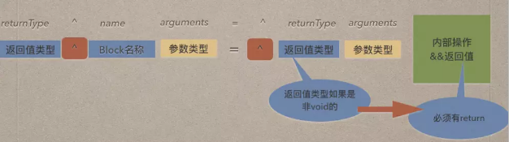
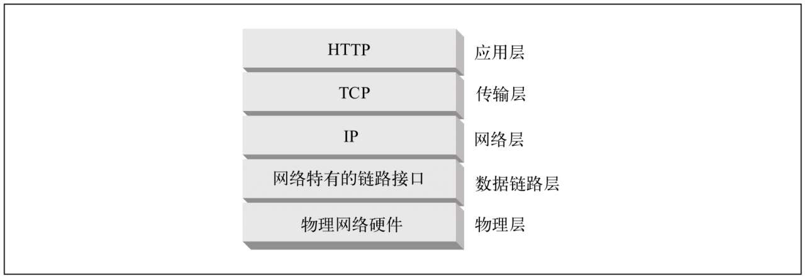
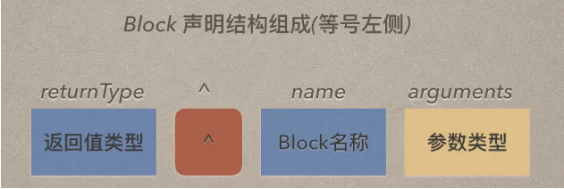
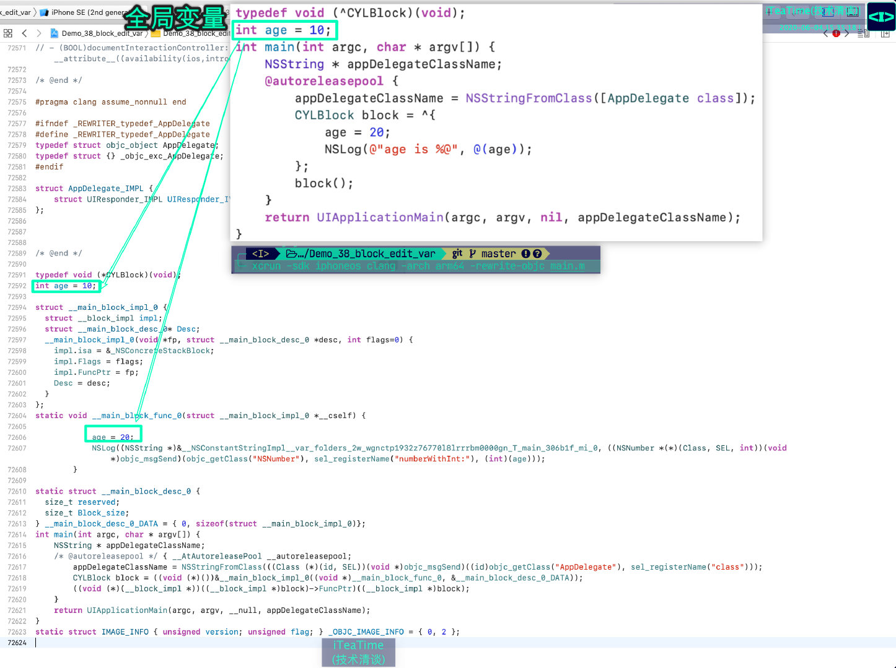
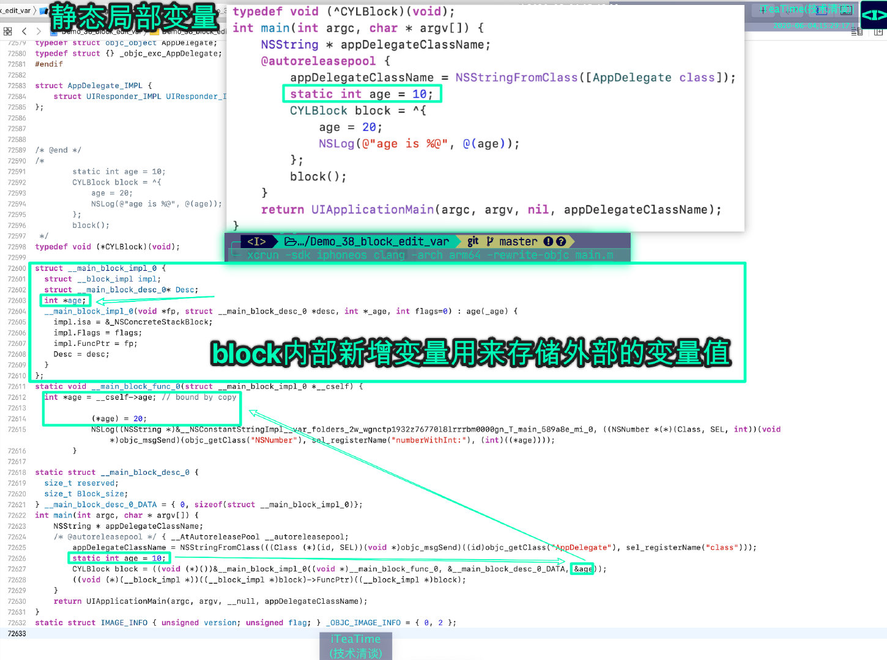
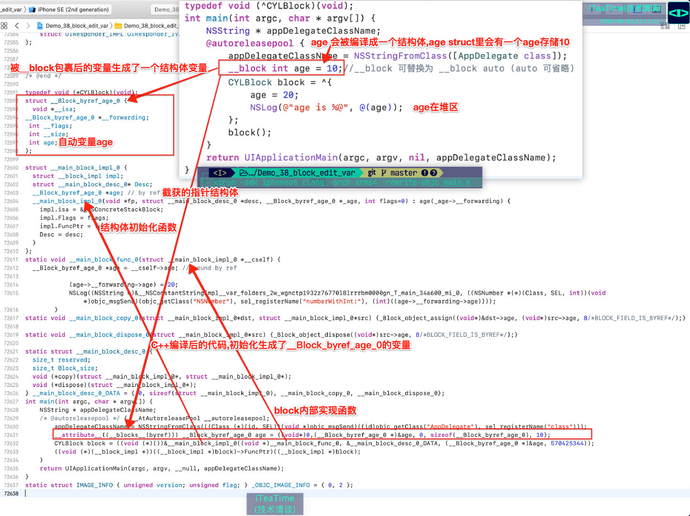

> <h2 id=''></h2>
- [**匿名函数Block**](#匿名函数Block)
	- [Block定义](#Block定义)
- [**Block 分类**](#Block分类)
	- [全局block](#全局block)
	- [堆block](#堆block)
	- [栈block](#栈block)
- [**使用**](#使用) 
	- [block作为属性变量](#block作为属性变量)
	- [Block作为参数](#Block作为参数)
	- [有返回值有参数block](#有返回值有参数block)
	- [	有返回值有参数](#有返回值有参数)
	- 	[有返回值，无参数](#有返回值，无参数)
	- 	[无返回值，有参数](#无返回值，有参数)
	- 	[无返回值，无参数](#无返回值，无参数)
	- [block属性传值](#block属性传值)
	- [typedef定义Block](#typedef定义Block)
- [**Block循环引用**](#Block循环引用)
	- [循环引用出现](#循环引用出现)
	- [__weak解决](#__weak解决) 
	- [__block解决](#__block解决)
	- [参数解决blcok](#参数解决blcok)
- [**Block底层原理**](#Block底层原理)
	- [block内如何修改block外部变量](#block内如何修改block外部变量)
		- 	[查看block的C++代码](#查看block的C++代码)
		- [block内部使用全局变量](#block内部使用全局变量)
		- [	block内部使用静态函数](#block内部使用静态函数)
		- [block内部改变使用__block](#block内部改变使用__block)
		- [泛型指针void *和id的区别](#泛型指针void*和id的区别)
- [**Block高级使用**](#Block高级使用)
- **参考资料**
	- [**Block 本质**](https://www.jianshu.com/p/4e79e9a0dd82)
	- [底层探索篇 ——block(上)](https://blog.csdn.net/LinShunIos/article/details/119852634)
	- [底层探索篇 ——block(下)](https://blog.csdn.net/LinShunIos/article/details/119883001)
	- [**Block 用法、举例、底层**](http://www.cocoachina.com/cms/wap.php?action=article&id=23147)
	- [**Block 详解**](https://www.jianshu.com/p/00a0747740ba)
	- [Block 详解](https://blog.csdn.net/majiakun1/article/details/80741215)
	- [Block的用法和实现](https://www.jianshu.com/p/d28a5633b963)
	- [Block看我就够了【干货】](http://www.cocoachina.com/ios/20190510/26931.html)
	- 	[Block导致循环引用的问题](https://www.jianshu.com/p/fc2f4d207d25)


<br/>

***
<br/>


> <h1 id='匿名函数Block'>匿名函数Block</h1>


<br/>

> <h2 id='Block定义'>Block定义</h2>




<br/>


`returnType    (^  BlockName)(arguments, arguments,……);`

Forexample:  `void (^ completeBlock)(int value, NSString *string);`


<br/>


Block 会对内部的对象进行强引用，是为了保证它属性的存在。
OC 函数中的局部变量在栈中存放。

```
- (void)viewDidLoad {
    [super viewDidLoad];
    
    //main线程
    void (^block)(void) = ^{
        NSLog(@"welcome to block");
    };//匿名block代码块的定义
    
    block();

     NSLog(@"%@", block);
    
}

```
打印结果：

`welcome to block`

`<__NSGlobalBlock__: 0x10be7c240>`

分析：当前是在主线程中，当运行到定义的匿名block时，会把这段代码由栈区拷贝到堆区，保存到堆区中。一旦进行调用block(),就会来到执行区域进行NSLog打印了。


<br/>

***
<br/><br/><br/>


> <h1 id='Block分类'>Block 分类</h1>

<br/>

> <h2 id='全局block'>全局block</h2>

**题外话: 什么叫全局变量?**


&emsp; **全局变量**即该变量不仅可以在所定义的文件内被访问，也可以在其他文件中被访问。凡是定义在函数或方法之外的变量（除静态变量之外）都是全局变量。

- **使用方法**

	- 为了维护方便及可读性，全局变量一般定义在源文件(.m)的起始位置。其他文件想使用该全局变量时，需要先使用关键字extern进行声明。全局变量可以多次声明，为了方便，一般会在定义该全局变量的文件的头文件(.h)中声明，其他文件需要使用该全局变量时，直接import该头文件(.h)即可。

<br/>

- **全局变量为什么不能定义在头文件中**
	
	- 全局变量，也叫外部全局变量，是整个工程唯一但，且只能定义一次，所以全局变量不可定义在头文件(.h)中，如果有多个文件import了一个定义了外部全局变量的头文件，那么整个工程中就会出现多个同名同类型的全局变量，此时编译器会报错“x duplicate symbols”，x的值取决于多少个文件import了定义该全局变量的文件。

<br/>

- **存储位置**

	- 全局变量保存在内存的全局（静态）存储区中，可多次改变值，无赋值时为nil。

<br/><br/>

**典型几个变量在代码中的表示:**



<br/>

示例:

```
@implementation MCBlock

// 全局变量
int global_var = 4;

// 静态全局变量
static int static_global_var = 5;

- (void)method
{
    // 基本数据类型的局部变量
    int var = 1;
    
    // 局部静态变量
    static int static_var = 2;
    
    // 对象类型的局部变量
    __unsafe_unretained id unsafe_obj = nil;
    __strong id strong_obj = nil;
    
    void (^MYBlock)(void) = ^{
        NSLog(@"1:%d",global_var);
        NSLog(@"2:%d",static_global_var);
        NSLog(@"3:%d",var);
        NSLog(@"4:%d",static_var);
        NSLog(@"5:%@",unsafe_obj);
        NSLog(@"6:%@",strong_obj);
    };
    MYBlock();
}

@end
```


<br/><br/>

&emsp; 同样的全局block (NSGlobalBlock): 位于全局区，它既不捕获任何局部变量，同时可以安全地使用静态变量和全局变量.

<br/><br/>

- NSGlobalBlock(全局block)： block在静态区。

**案例:**

**.h文件**

```
// MyGlobals.h

// 声明一个全局Block类型
typedef void (^MyGlobalBlock)(void);

// 定义并初始化一个全局Block实例
extern MyGlobalBlock globalBlock;

// 声明全局变量
extern NSString * const GlobalString;
extern NSInteger GlobalInteger;

@interface MyGlobals : NSObject

@end
```

<br/>

**.m文件**

```
// MyGlobals.m

#import "MyGlobals.h"

// 实现全局Block实例
MyGlobalBlock globalBlock = ^{
    // 使用全局变量
    NSLog(@"Global String: %@", GlobalString);
    NSLog(@"Global Integer: %ld", GlobalInteger);

    // 使用静态变量
    static NSUInteger localCounter = 0;
    localCounter++;
    NSLog(@"Local Counter: %lu", localCounter);
};

// 定义全局变量
NSString * const GlobalString = @"Hello, World!";
NSInteger GlobalInteger = 42;

@implementation MyGlobals

@end
```


<br/><br/>


> <h2 id='堆block'>堆block</h2>

&emsp; **堆block (NSMallocBlock):** 位于堆区，在block内部使用变量或者oc属性，并且赋值给强引用或者Copy修饰的变量


```
// ViewController.h
@interface ViewController : UIViewController

@property (nonatomic, strong) void (^blockProperty)(void); // 强引用的Block属性

@end


// ViewController.m
- (void)viewDidLoad {
    [super viewDidLoad];

    // 局部变量定义
    int localInt = 42;
    NSString *localString = @"Stack Block";

    // 定义一个栈Block，捕获局部变量
    void (^stackBlock)(void) = ^{
        NSLog(@"Local Int: %d", localInt);
        NSLog(@"Local String: %@", localString);
    };
    
    // 试图将栈Block赋值给不同类型的变量
    __strong void (^strongBlock)(void) = stackBlock; // 强引用变量
    __weak void (^weakBlock)(void) = stackBlock; // 弱引用变量
    void (^__attribute__((objc_precise_lifetime)) preciseLifetimeBlock)(void) = stackBlock; // 精确生命周期变量


    // 将栈Block复制到堆上，得到一个NSMallocBlock
    void (^heapBlock)(void) = [stackBlock copy];// 使用copy修饰符
    // 将堆Block赋值给Block属性
    self.blockProperty = heapBlock;
}
```

**详解解读上述几种情况:**

- **不能赋值给强引用变量：** 在上述代码中，strongBlock是一个强引用变量。如果直接将栈Block赋值给强引用变量，一旦离开其创建的作用域（例如，viewDidLoad方法结束时），栈Block所依赖的局部变量（如localInt和localString）会被销毁，而强引用的strongBlock变量依然存在。此时，strongBlock指向的Block已经失效，尝试执行它会导致未定义的行为或崩溃。为了避免这种情况，强引用的Block变量应指向已复制到堆上的Block（即NSMallocBlock）。


<br/>

- **可以赋值给弱引用变量：** weakBlock是一个弱引用变量。将栈Block赋值给弱引用变量是安全的，因为弱引用不会阻止Block及其捕获的变量被销毁。当栈Block超出作用域时，weakBlock将自动变为nil，从而避免了后续对无效Block的访问。

<br/>

- **可以赋值给精确生命周期变量：** preciseLifetimeBlock使用了`__attribute__((objc_precise_lifetime))`注解，表示编译器应确保此变量的生命周期与栈Block的生命周期精确匹配。在这种情况下，虽然变量本身是强引用，但编译器会确保栈Block在其作用域结束前不会被提前释放。这种用法仅限于局部变量，并且需要编译器支持，确保了在作用域内的安全使用，但不会延长栈Block的生命周期。

<br/>

- **赋值给Block属性：** 最后，我们将复制到堆上的Block（即heapBlock）赋值给blockProperty属性。此时，blockProperty持有堆Block的强引用，即使离开viewDidLoad方法的作用域，堆Block及其捕获的变量也不会被销毁，可以在ViewController实例的生命周期内安全使用


<br/><br/>

> <h2 id='栈block'>栈block</h2>

&emsp; **栈block (NSStackBlock):** 位于栈区，与MallocBlock一样，可以在**内部使用局部变量或者OC属性**。但是不能赋值给强引用或者copy修饰的变量。

-  NSStackBlock(栈block)

```
int a = 10;
NSLog(@"第三种block： %@", ^{
    NSLog(@"%d", a);
});

//打印结果：第三种block： <__NSStackBlock__: 0x7ffee5cee960>


//或者如下加了__weak,a变量没有被强引用持有,所以是NSStackBlock
// 使用__weak若引用
int b=10;
Void (__weak ^block)(void)=^{
	NSLog(@"Croci - %d", a);
}

NSLog(@"%@", block);

```


<br/>

***
<br/><br/><br/>

> <h1 id='使用'>使用</h1>


<br/><br/>

> <h2 id='block作为属性变量'>block作为属性变量</h2>




- **无返回值**

```
typedef void(^AddGroupMember)(id memberModel);


@property(nonatomic, copy) AddGroupMember addMember;

//①先要执行它，这是对块的初始化，否则在调用self.addMember() 会崩溃
self.addMember = ^(NSMutableArray* memberModels) {
            ccc.contancts = memberModels;
            ccc.isInOrRe = InvitedOrRemvoveMemberTypeInvited;
            [weakSelf.controller presentViewController:navigationController animated:YES completion:nil];
        };

//②传递值,然后跳转到①中执行块内的代码
self.addMember(friendList);

```

<br/>
<br/>

- **有返回值**

```
//申明
typedef int (^firstCompleteBlock) (int argumentOne, int argumentTwo);
//下面的类型，不推荐
//申明类型，省略形参：typedef int (^firstCompleteBlock) (int , int );


//定义为属性
@property(nonatomic, copy)firstCompleteBlock fcblock;


self.fcblock = ^int(int argumentOne, int argumentTwo) {
        return  argumentOne * argumentTwo;
    };
    
int resulst = self.fcblock(10, 5);
NSLog(@"值为：%d", resulst);
```

输出：

`2019-05-16 16:41:31.280026+0800 Test[1282:68696] 值为：50`


<br/>
<br/>


> <h2 id='Block作为参数'>Block作为参数</h2>


```
//PrefectureViewModel.h  文件声明
+ (void) requestInteractPrefectureCommentForPageNum:(NSInteger) page  success:(void (^)(NSMutableArray<JSONModel *> *models))interactPrefecture;


//PrefectureViewModel.m  文件定义
+ (void) requestInteractPrefectureCommentForPageNum:(NSInteger) page  success:(void (^)(NSMutableArray<JSONModel *> *models))interactPrefecture{
         NSMutableArray *comments = [NSMutableArray arrayWithCapacity:1];
         for(int i = 0; i < 9; i ++){
                JSONModel *jm = [JSONModel new];
                [comments addObject: jm];
         }
        
        interactPrefecture(comments);
}


//其他类中使用
[PrefectureViewModel requestInteractPrefectureCommentForPageNum:1 success:^(NSMutableArray<JSONModel *> * _Nonnull models) {
        //使用，打印
        self.dataArray = models;
        
        NSLog(@"------->> %@", models);
    }];
```


<br/>
<br/>


> <h2 id='有返回值有参数block'>有返回值有参数block</h2>


```
typedef int (^firstCompleteBlock) (int argumentOne, int argumentTwo);
@property(nonatomic, copy)firstCompleteBlock fcblock;


//方法实现
- (int) setOtherValue:(NSString *)value block:(firstCompleteBlock)compleBlock {
    NSLog(@"block %@ 返回值", value);
    int a = compleBlock(2, 8);
    NSLog(@"completeBlock 值为：%d", a);
    return a;
}


//调用方法
int b = [self setOtherValue:@"有" block:^int(int argumentOne, int argumentTwo) {
        return argumentOne + argumentTwo;
    }];
NSLog(@"block 回调有返回值： %d", b);
```

输出：

`2019-05-16 16:41:31.280309+0800 Test[1282:68696] block 有 返回值`

`2019-05-16 16:41:31.280472+0800 Test[1282:68696] completeBlock 值为：10`

`2019-05-16 16:41:31.280642+0800 Test[1282:68696] block 回调有返回值： 10`


<br/>
<br/>


> <h2 id='有返回值有参数'>有返回值有参数</h2>


```
typedef int (^firstCompleteBlock) (int argumentOne, int argumentTwo);
@property(nonatomic, copy)firstCompleteBlock fcblock;


//实现
- (firstCompleteBlock) setOtherValue:(NSString *)value successBlock:(firstCompleteBlock)completeBlock {
    NSLog(@"block %@ 方法的返回值", value);
    int b = completeBlock(8, 32);
    NSLog(@"completeBlock 值实现后是：%d", b);
    
    
    return ^(int one, int two){
        int c= one * two;
        NSLog(@"-------->> %d", c);
        return c;
    };
}


//调用, 这里对block的调用有没有想到响应式编程的感觉
int d =  [self setOtherValue:@"是" successBlock:^int(int argumentOne, int argumentTwo) {
        return  argumentOne + argumentTwo;
    }](4, 5);

    
NSLog(@"block 的值是：%d", d);
```

输出：

```
2019-05-17 12:14:25.221920+0800 Test[3712:60491] block 是 方法的返回值

2019-05-17 12:14:25.222350+0800 Test[3712:60491] completeBlock 值实现后是：40

2019-05-17 12:14:25.222582+0800 Test[3712:60491] -------->> 20

2019-05-17 12:14:25.222756+0800 Test[3712:60491] block 的值是：20
```

<br/>
<br/>


> <h3 id='有返回值，无参数'>有返回值，无参数</h3>


```
typedef int (^BlockTest) (void);
@property(nonatomic, copy)BlockTest blockTest;


self.blockTest = ^int(){
        NSLog(@"blockTest 计算值为：%@", @"🈶值");
        return 10;
    };
int c = self.blockTest();
NSLog(@"blockTest 无参数，有返回值是：%d", c);
```

输出：

```
2019-05-17 12:50:53.533606+0800 Test[4121:74646] blockTest 计算值为：🈶值

2019-05-17 12:50:56.547803+0800 Test[4121:74646] blockTest 无参数，有返回值是：10
```

<br/>
<br/>


> <h3 id='无返回值，有参数'>无返回值，有参数</h3>


```
typedef void (^BlockTest) (int argumentOne, int argumentTwo);
@property(nonatomic, copy)BlockTest blockTest;


self.blockTest = ^(int argumentOne, int argumentTwo) {
        NSLog(@"blockTest 计算值为：%d", argumentOne + argumentTwo);
    };
self.blockTest(20, 80);

```

输出：

```
2019-05-17 12:36:54.927784+0800 Test[3983:69324] blockTest 计算值为：100
```

<br/>
<br/>


> <h3 id='无返回值，无参数'>无返回值，无参数</h3>


```
typedef void (^BlockTest) (void);
@property(nonatomic, copy)BlockTest blockTest;


self.blockTest = ^void(){
        NSLog(@"blockTest 计算值为：%@", @"没🈶值");
    };
//简化形式
//self.blockTest = ^{
//        NSLog(@"blockTest 计算值为：%@", @"没🈶值");
//    };
self.blockTest();
```

输出：

```
2019-05-17 12:39:42.019343+0800 Test[4025:70776] blockTest 计算值为：没🈶值
```


<br/>
<br/>


> <h2 id='block属性传值'>	block属性传值</h2>

```
@property(nonatomic, copy) void (^sencondCompleteBlcok)(NSString *value);

// block 属性内部传值
- (void) blockInObjcMethod {
    __weak typeof(self) weakSelf = self;
    dispatch_after(dispatch_time(DISPATCH_TIME_NOW, (int64_t)(4 * NSEC_PER_SEC)), dispatch_get_main_queue(), ^{
        __strong typeof(weakSelf) strongSelf = weakSelf;
        strongSelf.sencondCompleteBlcok(@"属性 block");
    });
}


//调用
[self blockInObjcMethod];
self.sencondCompleteBlcok = ^(NSString *value) {
      NSLog(@"回调传的值是： %@", value);
};

```

输出：
```
2019-05-16 15:44:21.499789+0800 Test[1088:50961] 回调传的值是： 属性 block
```


<br/>
<br/>


> <h2 id='typedef定义Block'>typedef 定义Block</h2>

`block 作为方法参数`

```
//申明定义block
typedef void (^firstCompleteBlock) (NSString *value);


//方法实现
+ (void) blockInClassMethod:(firstCompleteBlock)block{
    dispatch_after(dispatch_time(DISPATCH_TIME_NOW, (int64_t)(2* NSEC_PER_SEC)), dispatch_get_main_queue(), ^{
        NSLog(@"--->>> typedef block 打印");
        block(@"typedef Block");
    });
}


//方法调用
 [ViewController blockInClassMethod:^(NSString *value) {
        NSLog(@"类方法回调 %@", value);
    }];


```
输出：

```
2019-05-16 15:44:19.101583+0800 Test[1088:50961] --->>> typedef block 打印

2019-05-16 15:44:19.101854+0800 Test[1088:50961] 类方法回调 typedef Block
```


<br/>

**`作为属性`**

```
typedef void (^firstCompleteBlock) (NSString *value);

@property(nonatomic, copy)firstCompleteBlock fcblock;


//注意：先定义，才能使用，否则Crash
self.fcblock = ^(NSString *value) {
        NSLog(@"%@ 打印", value);
    };
self.fcblock(@"-------->> fcblock");
    
```

输出：

```
2019-05-16 16:02:14.104871+0800 Test[1128:56500] -------->> fcblock 打印
```


<br/>

***
<br/><br/><br/>

> <h1 id='Block循环引用'>Block循环引用</h1>


<br/>

> <h2 id='循环引用出现'>循环引用出现</h2>

**循环引用出现**

```
//block 的别名
typedef void(^KCBlock)(void);

@property(nonatomic, copy)KCBlock block;
@property(nonatomic, copy)NSString *name;


- (void)viewDidLoad {
    [super viewDidLoad];
    self.view.backgroundColor = [UIColor groupTableViewBackgroundColor];
    
    //循环引用
    self.name = @"will kuang";
    self.block = ^{
        NSLog(@"%@", self.name);//_name也会导致
    };//性能差
 }
```

<br/><br/>

> <h2 id='__weak解决'>__weak解决</h2>

```
//第一种解决方案:weakSelf  + weak - Strong -dance  强弱共舞
__weak typeof(self) weakSelf = self;
 self.block = ^{
        NSLog(@"%@", weakSelf.name);

      //当接下来的代码段需要继续使用self时，我们需要对其延长生命周期
      //__strong typeof(self) strongSelf = weakSelf;
    };

```

<br/><br/>

> <h2 id='__block解决'>__block解决</h2>


```
//第二种解决方案：__block
__block ViewController *weakSelf = self;    //重新拷贝一份：weakSelf
//weakSelf(被self捕捉了) - self(捕捉了相应的block) - block(捕捉了weakSelf) --weakSelf(若是把weakSelf置为nil，block就不会持有weakSelf)
self.block = ^{
    NSLog(@"%@", weakSelf.name);    //临时变量被持有,捕获在这个内存区域
    weakSelf = nil;
};
self.block();
```


<br/><br/><br/>


> <h2 id='参数解决blcok'>参数解决blcok</h2>

<br/>

```
//在ViewController.m中定义
typedef void(^KCBlock)(ViewController *);

//第三种方式：去想：为什么会产生循环引用
//self -- block -- self
self.block = ^(ViewController *vc) {//传入一个self，变成一个临时变量持有，当出了这个作用域后就会释放
    NSLog(@"%@", vc.name);
};
self.block(self);

```


<br/>

***
<br/><br/><br/>

> <h1 id='Block底层原理'>Block 底层原理</h1>

<br/>

```
__block int a = 10; //此时a存放在栈区域
NSLog(@"前   =   %p", &a);
void (^block)(void) = ^{
    a ++;
    NSLog(@"中   =   %p", &a);
    NSLog(@"welcome to block %d", a);
};
block();
NSLog(@"后   =   %p", &a);
```

打印结果：

```
2019-02-28 18:03:54.337567+0800 Test[10932:362482] 前   =   0x7ffeed6c09b8

2019-02-28 18:03:54.337783+0800 Test[10932:362482] 中   =   0x600001138ef8

2019-02-28 18:03:54.337951+0800 Test[10932:362482] welcome to block 11

2019-02-28 18:03:54.338088+0800 Test[10932:362482] 后   =   0x600001138ef8
```

&emsp; 分析:`前`中的a打印来自于栈，栈之后被block捕捉，a的地址发生了变化。中、后的a被拷贝进入了堆地址中了。

<br/>

- 这里补充一个小知识点,教你通过内存地址来分辨对象、变量是在堆区还是栈区:

	- 以**0x6结尾的是在堆区**,**0x7结尾的是在栈区**,当我们在调试打断点查看线程的时候若是看到线程显示的**thread1,则说明是在主线程**.


<br/><br/><br/>


> <h2 id='block内如何修改block外部变量'>block内如何修改block外部变量</h2>

- 使用关键字__block,进行值的改变;
- 加 static (放在静态存储区/全局初始化区 ) 缺点是会永久存储，内存开销大;
- 将变量设置为全局变量，缺点也是内存开销大。

<br/>

> <h5 id='查看block的C++代码'>查看block的C++代码</h5>


书写一段在main.m的OC代码如下:

```
#import <UIKit/UIKit.h>
#import "AppDelegate.h"
typedef void (^CYLBlock)(void);

int main(int argc, char * argv[]) {
    NSString * appDelegateClassName;
    @autoreleasepool {
        appDelegateClassName = NSStringFromClass([AppDelegate class]);
        
        int age = 10;
        CYLBlock block = ^{
            NSLog(@"age is %@", @(age));
        };
        block();
    }
    return UIApplicationMain(argc, argv, nil, appDelegateClassName);
}
```

<br/>

终端编译如下:

```
cd /Users/harleyhuang/Desktop  

xcrun -sdk iphoneos clang -arch arm64 -rewrite-objc /Users/harleyhuang/Desktop/Test/Test/main.m 
```

<br/>

在编译后的C++文件main.cpp中有75456行代码截取如下代码片段:

```
struct __NSConstantStringImpl {
  int *isa; //指向对象的类，对于常量字符串，这里指向一个特殊的类指针__CFConstantStringClassReference，表明这是一个常量字符串对象
  int flags; //保留字段，用于存储字符串的一些属性标志，如是否是Unicode编码等
  char *str; // 字符串内容的指针，指向一个以空字符（\0）结尾的C字符串。这个指针指向的实际内存区域存储了字符串的字符数据
#if _WIN64
  long long length; // 字符串的长度（包括结束的空字符'\0'）。根据平台的不同，使用long long（在Windows 64位平台上）或long（在其他平台或32位Windows上）来存储长度值
#else
  long length;
#endif
};

/**
static __NSConstantStringImpl __NSConstantStringImpl__var_folders_kq_ktxysb456mdfwgcymsy809zh0000gn_T_main_fc6810_mi_0: 定义一个静态的__NSConstantStringImpl结构体实例，并为其赋予一个特定的符号名称，该名称通常包含路径、临时文件名等信息，以确保全局唯一。

__attribute__ ((section ("__DATA, __cfstring"))): 这是一个GCC编译器扩展的属性，指示编译器将这个结构体实例放入特定的二进制文件段（section）。在这里，将其放入__DATA段下的__cfstring子段，这是专门为常量字符串预留的存储区域


初始化列表 {__CFConstantStringClassReference,0x000007c8,"age is %@",9}:

__CFConstantStringClassReference: 设置isa字段，指向常量字符串类。

0x000007c8: 设置flags字段，具体的含义取决于Objective-C运行时对常量字符串的实现细节，此处为特定的标志值。

"age is %@": 设置str字段，指向一个C字符串，内容为age is %@，这是字符串的实际文本内容。

9: 设置length字段，表示字符串的长度为9个字符（包括结束的空字符'\0'）。
*/
static __NSConstantStringImpl __NSConstantStringImpl__var_folders_kq_ktxysb456mdfwgcymsy809zh0000gn_T_main_fc6810_mi_0 __attribute__ ((section ("__DATA, __cfstring"))) = {__CFConstantStringClassReference,0x000007c8,"age is %@",9};


struct __block_impl {
  void *isa;
  int Flags;
  int Reserved;
  void *FuncPtr;
};

/* @end */

typedef void (*CYLBlock)(void);


struct __main_block_impl_0 {
  struct __block_impl impl;//见上面的__block_impl定义
  struct __main_block_desc_0* Desc;
  int age;
  
  //__main_block_impl_0结构退的构造函数，将对__main_block_impl_0做如下初始化
  __main_block_impl_0(void *fp, struct __main_block_desc_0 *desc, int _age, int flags=0) : age(_age) {
    //实际上_NSConcreteStackBlock也就相当于objc_class结构体实例。
    //也就是说Block实质就是OC对象
    impl.isa = &_NSConcreteStackBlock;//isa指针,可以用来判断block类型,这里是栈block.此外还有全局block和堆block
    impl.Flags = flags;// 标志
    impl.FuncPtr = fp;// 函数指针
    Desc = desc;// des 指针
  }
};


static void __main_block_func_0(struct __main_block_impl_0 *__cself) {
	//__cself是传进来的参数也就是block自身，那么__cself->age也就是block结构体的成员变量a。这里的int age 进行了值拷贝
	int age = __cself->age; // bound by copy

	/** 这段代码定义了一个Block的实现，其中捕获了外部变量age的值，并在Block执行时通过Objective-C的消息发送机制创建一个NSNumber对象来封装这个值，最后使用NSLog输出包含该年龄值的日志消息
	
		1. (NSString *)&__NSConstantStringImpl__var_folders_kq_ktxysb456mdfwgcymsy809zh0000gn_T_main_fc6810_mi_0: 这是一个指向常量字符串对象的指针。由于实际字符串内容未在代码中显示，推测它可能是一个编译器生成的临时字符串常量，用于作为NSLog的格式字符串。在实际应用中，这通常会是一个明确的字符串字面量，如@"Age: %d"
		
		2. objc_getClass("NSNumber"): 调用objc_getClass函数获取名为NSNumber的类对象。NSNumber是Foundation框架中的一个类，用于封装各种基本数据类型为对象
		
		3. sel_registerName("numberWithInt:"): 调用sel_registerName函数注册一个选择子（selector），其名称为numberWithInt:。这是一个Objective-C方法名，对应于NSNumber类的一个实例方法，用于创建一个包含整数值的NSNumber对象。
		
		4. (NSNumber *(*)(Class, SEL, int))(void *)objc_msgSend: 将objc_msgSend函数强制转换为一个接受三个参数（类对象、选择子、整数）并返回NSNumber *类型的函数指针。objc_msgSend是Objective-C的消息发送机制的核心，用于动态地调用对象的方法。
		
		5. ((NSNumber *(*)(Class, SEL, int))(void *)objc_msgSend)(objc_getClass("NSNumber"), sel_registerName("numberWithInt:"), (int)(age)): 使用转换后的objc_msgSend函数指针，以NSNumber类对象、numberWithInt:选择子和Block内部的age变量（已转换为int类型）为参数，动态调用NSNumber的numberWithInt:方法，创建并返回一个包含age值的NSNumber对象
		
		最终，NSLog函数接收上述生成的NSNumber对象作为第二个参数（日志消息的格式化参数），以及一个隐藏的格式字符串（第一个参数），将年龄值格式化并输出到控制台。
	*/
	NSLog((NSString *)&__NSConstantStringImpl__var_folders_kq_ktxysb456mdfwgcymsy809zh0000gn_T_main_fc6810_mi_0, ((NSNumber *(*)(Class, SEL, int))(void *)objc_msgSend)(objc_getClass("NSNumber"), sel_registerName("numberWithInt:"), (int)(age)));
}

//__main_block_desc_0_DATA是__main_block_desc_0的变量,并声明定义好了
//sizeof(struct __main_block_impl_0) 获取__main_block_impl_0结构体的大小
static struct __main_block_desc_0 {
  size_t reserved;
  size_t Block_size;
} __main_block_desc_0_DATA = { 0, sizeof(struct __main_block_impl_0)};


int main(int argc, char * argv[]) {
    NSString * appDelegateClassName;
    /* @autoreleasepool */ { __AtAutoreleasePool __autoreleasepool; 
        appDelegateClassName = NSStringFromClass(((Class (*)(id, SEL))(void *)objc_msgSend)((id)objc_getClass("AppDelegate"), sel_registerName("class")));

        int age = 10;
        
        /** 定义Block变量:
			        这段代码整体的作用是创建一个CYLBlock类型的变量block，其值是通过调用__main_block_impl_0构造函数初始化的Block结构体实例的地址，并进行了适当的类型转换以匹配CYLBlock的定义。
			        
				 1. CYLBlock: 这是定义的Block类型，但具体类型没有在给出的代码片段中展示。通常情况下，CYLBlock应该是一个符合Block签名的typedef，例如typedef void (^CYLBlock)(void);，表示这是一个无参数、无返回值的Block。
				 
				 2. __main_block_impl_0: 这是之前解释过的Block实现结构体。它包含Block的函数指针（即__main_block_func_0）、描述信息指针（即__main_block_desc_0_DATA）以及其他可能捕获的变量（如这里的age）。__main_block_impl_0的构造函数接受这些参数并初始化一个Block结构体实例
				 
				 3. &__main_block_func_0: 获取__main_block_func_0函数的地址，这是Block的实现函数
				 
				 4. &__main_block_desc_0_DATA: 获取Block描述符结构体的地址。Block描述符包含了关于Block的一些元数据，如大小、拷贝/销毁函数指针等
				 
				 5. age: 外部变量age的值，将被Block捕获
				 
				 6. ((void (*)())...): 强制类型转换，将__main_block_impl_0结构体实例的地址转换为一个指向无参数、无返回值函数的指针（void (*)()）。这是因为Block本质上可以被视为一个函数指针，尽管在Objective-C中它们通常以Block类型进行操作
        
        */
        CYLBlock block = ((void (*)())&__main_block_impl_0((void *)__main_block_func_0, &__main_block_desc_0_DATA, age));
        
        /** 调用Block:
				    这段代码首先通过构造__main_block_impl_0结构体实例并进行类型转换，定义了一个CYLBlock类型的变量block。然后，通过访问Block结构体的FuncPtr成员并调用它，执行了Block所代表的代码逻辑。在这个过程中，被捕获的变量age的值将参与到Block的执行中
				        
				1. ((__block_impl *)block): 将block变量（已经是一个函数指针）再次强制转换回__block_impl *类型，即Block结构体指针。这样就可以访问Block结构体的成员。
				
				2. ->FuncPtr: 访问Block结构体的FuncPtr成员，它指向Block的实现函数（即__main_block_func_0）
				
				3. ((void (*)(__block_impl *))...): 类型转换，将FuncPtr成员（一个函数指针）转换为接受__block_impl *类型参数、无返回值的函数指针
				
				4. 最终的表达式((...))((__block_impl *)block)调用经过类型转换后的函数指针，传入block作为参数。实际上，这就是对Block的调用，执行其内部的代码逻辑（即__main_block_func_0函数）
        */
        ((void (*)(__block_impl *))((__block_impl *)block)->FuncPtr)((__block_impl *)block);
    }
    return UIApplicationMain(argc, argv, __null, appDelegateClassName);
}
static struct IMAGE_INFO { unsigned version; unsigned flag; } _OBJC_IMAGE_INFO = { 0, 2 };

```


&emsp; 根据编译后的C++代码可以看到age在外面已经定义了,传入block内的结构体函数中的age是值传递,若是在block内部结构体函数中改变age,其外部的age值也不会改变的.


<br/><br/>


> <h5 id='block内部使用全局变量'>block内部使用全局变量</h5>

将变量设置为全局变量,如下图:



可以看到全局变量在其静态实现函数**static void __main_block_func0**里已经设置为20了.


<br/>
<br/>

> <h5 id='block内部使用静态函数'>block内部使用静态函数</h5>

加 static (放在静态存储区/全局初始化区),**原理是 block 内部对外部auto变量进行指针捕获**





<br/>
<br/>


> <h5 id='block内部改变使用__block'>block内部改变使用__block</h5>

&emsp; 在 ARC 中否添加 __block ，block 中的 auto 变量都会被从栈上 copy 到堆上。

- **__block 修饰符：**
	- __block 可以用于解决 block 内部无法修改 auto 变量值的问题
	- __block 不能修饰全局变量、静态、变量（static)
编译器会将 __block 变量包装成一个对象




<br/>

```
typedef void (^CYLBlock)(void);

int main(int argc, char * argv[]) {
    NSString * appDelegateClassName;
    @autoreleasepool {
        appDelegateClassName = NSStringFromClass([AppDelegate class]);
        
        __block int age = 0;
        NSLog(@"定义前：%p", &age);         //栈区
        CYLBlock block = ^{
            age = 10;
            NSLog(@"block内部：%p", &age);
        };
        NSLog(@"定义后：%p", &age);         //堆区

        block();
    }
    return UIApplicationMain(argc, argv, nil, appDelegateClassName);
}

```

打印:

```
2023-03-14 15:59:43.261768+0800 Test[12384:1038665] 定义前：0x7ffeee5edc80
2023-03-14 15:59:43.262353+0800 Test[12384:1038665] 定义后：0x6000030c1838
2023-03-14 15:59:43.262443+0800 Test[12384:1038665] block内部：0x6000030c1838
```

<br/>

&emsp; 这里会执行 copy 操作，下面是编译后的 copy 方法，age struct 会被拷贝到堆里，自然里面的 age struct->age 也会拷贝到堆里

```
static void __main_block_copy_0(struct __main_block_impl_0*dst, struct __main_block_impl_0*src) {_Block_object_assign((void*)&dst->age, (void*)src->age, 8/*BLOCK_FIELD_IS_BYREF*/);}
```

&emsp; “定义后”和“block内部”两者的内存地址是一样的，我们都知道 block 内部的变量会被 copy 到堆区，“block内部”打印的是堆地址，因而也就可以知道，“定义后”打印的也是堆的地址。

那么如何证明“block内部”打印的是堆地址？

把三个16进制的内存地址转成10进制就是：

```
定义后前：6171559672
block内部：5732708296
定义后：5732708296
```

中间相差438851376个字节，也就是 418.5M 的空间，因为堆地址要小于栈地址，又因为 iOS 中主线程的栈区内存只有1M，Mac也只有8M，既然 iOS 中一条线程最大的栈空间是1M，显然a已经是在堆区了。

这也证实了：a 在定义前是栈区，但只要进入了 block 区域，就变成了堆区。


[i->__forwarding->i 解析](https://www.jianshu.com/p/3b81139fa74b)

<br/>
<br/>
<br/>


**知识拓展:**

> <h5 id='泛型指针void*和id的区别'>泛型指针void *和id的区别</h5>

[__bridge 显式转换 id和void *](https://blog.csdn.net/u011363981/article/details/78272965)

- id和void *并非完全一样;

- void *是C语言中常用的;

- `void *：` c语言中的泛型指针，指代任意的指针类型（即int *,float *,int*  *……）。当返回值是一个地址或者指针（其实指针本身就是地址）的时候，返回值的类型都可以用void *表示，也可以用此类型来定义任意类型的指针变量,比如结构体的初始化函数有malloc就是返回void *类型,是可以通过强制类型进行转换的.

```
int a;
int *p = &a;
```

&emsp; &a这个变量能够赋值给p这个变量，说明&a这个变量的类型也是int *,所以当返回&a的时候，返回值类型是int *，也可以用通用型指针void *替代


- id ：OC语言中的泛型指针，指代任意对象类型的指针。用于隐藏对象类型的类名部分，相当于C语言中的“void *”。但是id本身就是一个指针，而且可以指向任何一个继承了Object（或者NSObject）类的对象。
	- 所以需要注意的是：id是一个指针，所以你在使用id的时候不需要加星号。比如id foo=nil定义了一个nil指针，这个指针指向NSObject的一个任意子类。而id *foo=nil则定义了一个指针，这个指针指向另一个指针，被指向的这个指针指向NSObject的一个子类
	- 比如id person和void* personV，[person print]是可以的，但是[personV print]在编译的时候就会报错。因为ObjeciveC的编译器看到id，会假定它可以接受任何message，虽然在runtime时可能并不是这样的，但personV并不是Objective C类型，编译器就会报错，但是void *有可能是可以接收print message的

但是[**id与void *可以转换**](https://www.cnblogs.com/dins/p/6710159.html)


<br/>
<br/>

> <h2 id='终端建立C语言文件'>终端建立C语言文件</h2>
 
```
$ mkdir 003---Block原理探究
$ cd 003---Block原理探究
$ vim block.c  # vim 打开对应的文件名，若没有则创建对应的文件名。

# vim 打开文件后是命令模式，使用 i 或者 a 进入编辑模式。
# 在文件中输入

#include "stdio.h"
int main(){
int a = 10; 
void (^block)(void)=^{

printf("%d",a);
}

block();

return 0;
}

# 完成输入后，按下 esc ，这样就退回 vim 命令模式了，输入 : 号切换到末行模式，输入 x(或者 wq)可以用来保存，若输入 q! 则不保存。

# 对这段代码进行编译，输入：
$gcc block.c
block.c:7:2: error: expected ';' at end of
      declaration
}
 ^
 ;
1 error generated.
# 1 error generated. 报错出现。；
# 进入文件中将block后的{}后添加一个  ;  分号，再次编译，输入：
$gcc block.c
#编译成功后会出现一个可执行文件  a.out ,输入：
$./a.out
#会打印出：10
#使用clang 进行编译，输入：
$ clang -rewrite-objc block.c
#会出现一个block.app的文件，其为c++文件。从这段简单的代码可以看到其实现的过程。
```


<br/>

***
<br/>


> <h1 id='Block高级使用'>Block 高级使用</h1>


<br/>

- `链式编程+函数编程`

```
//block 应用： 链式编程+函数编程
//调用where时会返回一个block，该block需要传递一个字符串参数，并且返回一个字符串。
//所以where这里需要传递一个字符串参数
NSLog(@"%@", self.select.where(@"金科刺青网"));

- (ViewController *)select {
    NSLog(@"111111111111");
    
    return self;
}

- (NSString *(^)(NSString *))where{
    NSLog(@"whree ");
    
    NSString *(^block)(NSString *) = ^(NSString *word){
        return [NSString stringWithFormat:@"Ken say: %@", word];
    };
    return block;
}
```
打印结果：
`2019-03-01 10:29:11.694078+0800 Test[1324:32894] 111111111111`
`2019-03-01 10:29:11.694276+0800 Test[1324:32894] whree`
`2019-03-01 10:29:11.694460+0800 Test[1324:32894] Ken say: 金科刺青网`


<br/>

- `函数式编程`

```
//block 函数
 //函数式编程：y=f(x) ---> y=f(f(x))
 [self functionBlock:^(NSString *word) {
      NSLog(@"%@",word);
}];
  

- (void)functionBlock:(void(^)(NSString *))success{
    if (success) {
        //灵活、异步，在网络请求时可以调用代码块，如AFN中大量使用
        success(@"welcome to 函数式编程");
    }
}


```

打印结果：

`Test[1516:46925] welcome to 函数式编程`


<br/>

***
<br/>
