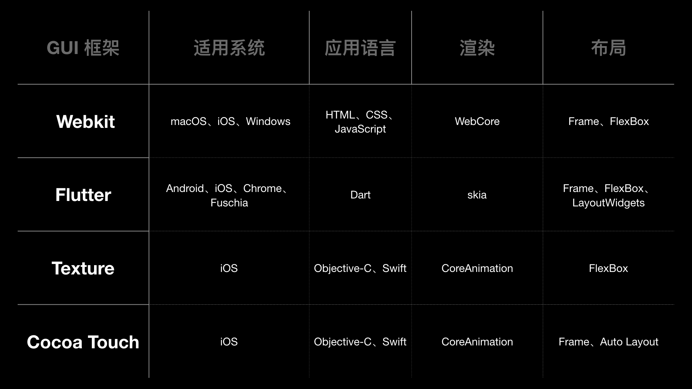

> <h2 id=""></h2>

- [**GUI框架分类**](#GUI框架分类)
	- [GUI内容](#GUI内容)
	- [渲染流程](#渲染流程)
	- [Texture优势](#Texture优势)
		- 	[Texture异步绘制](#Texture异步绘制)
- [**打通前端与原生**](#打通前端与原生)
- [**RN、Flutter选择**](#RN_Flutter选择)
- [**原生转前端**](#原生转前端)
- [**资料**](#资料)
	- [**戴铭博客**](https://ming1016.github.io/archives/2015/)
	- [**戴铭Github**](https://github.com/ming1016)


<br/>

***
<br/>

> <h1 id="GUI框架分类">GUI框架分类</h1>

&emsp; **GUI（Graphical User Interface 图形用户界面）分类:**
- Cocoa Touch 框架: iOS 系统自带;
- WebKit: 框架包含了 WebCore 和 JavaScriptCore，使用 HTML 和 CSS 进行布局，使用 JavaScript 编写程序。WebKit 还提供了 Objective-C 应用程序编程接口，方便基于 Cocoa API 的应用使用。在 iOS 开发中，我们最常使用的 UIWebView 和 WKWebView 控件都是基于 WebKit 框架。
- Flutter 框架: 使用 Dart 语言编写程序，一套代码可以同时运行在 iOS 和 Android 平台;
- Texture（原名 AsyncDisplayKit):Texture 框架的基本单元，是基于 UIView 抽象的节点 ASDisplayNode。和 UIView 不同的是 ，ASDisplayNode 是线程安全的，可以在后台线程上并行实例化和配置整个层级结构。Texture 框架的开发语言，使用的是苹果公司自家的 Objective-C 和 Swift。
- Blink;
- Android GUI 等


<br/>

&emsp; WebKit、Flutter、Texture 这三个 GUI 框架，与 Cocoa Touch 的对比，如下图所示：




&emsp; 通过比较发现，Texture 框架和 Cocoa Touch 框架，在使用的编程语言、渲染这两个方面，是完全一样的。其实，Texture 框架，正是建立在 Cocoa Touch 框架之上的。

&emsp; Texture 和其他 GUI 框架一样都是使用的应用更加广泛的 FlexBox 布局。使用 FlexBox 布局的好处是，可以让 iOS 开发者用到前端先进的 W3C 标准响应式布局。目前， FlexBox 已经是布局的趋势，连 iOS 新推出的 UIStackView 布局方式，也是按照 FlexBox 布局思路来设计的。

&emsp; 另外，Texture 是这些框架中唯一使用异步节点计算的框架。使用异步节点计算，可以提高主线程的响应速度。所以，Texture 在节点计算上的效率要比其他框架高。


<br/>
<br/>


> <h2 id="GUI内容">GUI内容</h2>

&emsp; GUI 框架的基本单元是控件，你熟悉的按钮、图片、文本框等等就是控件。

&emsp; 控件主要负责界面元素数据的存储和更新，这些原始数据都存储在控件的属性上，直接更新控件的属性就能够完成界面元素更新操作，控件的属性设置成不同的值会让界面元素呈现不同的外观。

&emsp; 控件之间的关系是由渲染树（Render Tree）这种抽象的树结构来记录的。渲染树关注的是界面的布局，控件在界面中的位置和大小都是由渲染树来确定。

&emsp; 基于渲染树，GUI 框架还会创建一个渲染层树（RenderLayer Tree），渲染层树由渲染层对象组成，根据 GUI 框架的优化条件来确定创建哪些渲染层对象，每次新创建一个渲染层对象就会去设置它的父对象和兄弟对象。渲染层对象创建完毕，接下来就需要将各渲染层对象里的控件按照渲染树布局生成 Bitmap，最后 GPU 就可以渲染 Bitmap 来让你看到界面了。


<br/>

&emsp; &emsp; WebKit 和 Flutter 都是开源项目，我们可以通过它们的代码看到 GUI 框架具体是怎么实现控件、渲染树、渲染层树和生成 Bitmap 的。


&emsp; WebKit 在 GUI 框架层面的效率并不低，单就渲染来说，它的性能一点也不弱于 Cocoa Touch 和 Flutter 框架。
- 使用 WebKit 的网页显示慢，主要是由于 CSS（Cascading Style Sheet） 和 JavaScript 资源加载方式导致的。
- 同时，解析时 HTML、CSS、JavaScript 需要兼容老版本，JavaScript 类型推断失败会重来，列表缺少重用机制等原因，导致 WebKit 框架的整体性能没有其他框架好。


<br/>
<br/>


> <h2 id="渲染流程">渲染流程</h2>

&emsp; GUI 框架中的渲染，一般都会经过布局、渲染、合成这三个阶段。

<br/>

- **1.布局**

&emsp; **布局阶段要完成的主要工作，是依据渲染树计算出控件的大小和位置。**WebKit 用 CSS 来布局，CSS 会提供 Frame 布局和 FlexBox 布局；Flutter 也支持 Frame 布局和 FlexBox 布局；Cocoa Touch 框架本身不支持 FlexBox 布局，但是通过 Facebook 的 [**Yoga 库**](https://github.com/facebook/yoga/actions)也能够使用 FlexBox 布局。

&emsp; 由于 Frame 布局需要精确描述每个界面元素的具体位置和大小，无论从代码编写，还是从代码可读性上看，成本都会高很多。所以说，FlexBox 对于 iOS 开发来说是另外一种很好的选择。

<br/>

- **2.渲染**

&emsp; 渲染阶段的主要工作，是利用图形函数计算出界面的内容。一般情况下，对于 2D 平面的渲染都是使用 CPU 计算，对 3D 空间的渲染会使用 GPU 计算。

&emsp; Cocoa Touch 和 Texture 框架使用的是 Core Animation，3D 使用的是 Metal 引擎。Flutter 使用的是 Skia，3D 使用的是 OpenGL(ES)。

&emsp; 综合各个GUI方面WebKit 做得更出色，考虑到多平台支持，WebKit 将渲染接口抽象了出来，实现层根据平台进行区分，比如在 iOS 上就用 CoreGraphics 来渲染，在 Android 就用 Skia 渲染。

<br/>

- **3.合成**

&emsp; 合成阶段的主要工作，是合并图层。这样做的目的，主要是节省显示内存，只显示一屏需要的像素，也只进行这些像素数据的计算。这个过程完成后，再将所得数据进行光栅化处理，最后交给 GPU 渲染成你可以看到的 Bitmap。

<br/>

但 Texture 对于那些希望能够在用户交互体验上进行大幅提升的 iOS 开发者来说，很小的切换成本，同时性能能大幅提升的收益，其实是很有诱惑力的。

通过对 GUI 框架都包括什么和渲染流程的分析，再次印证了我们的观点：Texture 是个值得推荐的框架，不仅在于它与 Cocoa Touch 框架的相似使得学习成本较低，还得益于它本身在性能上的先进性。


<br/>
<br/>


> <h2 id="Texture优势">Texture优势</h2>

&emsp; Texture 最大的优势就是开发了线程安全的 ASDisplayNode，而且还能够很好的和 UIView 共生。这样的话，我们就可以在原有使用 UIView 开发的程序基础之上使用 Texture，而不用完全重构所有界面。

&emsp; 随着 CPU 多核技术的发展，界面渲染计算都在主线程完成，对于多核 CPU 来说确实是有些浪费。ASDisplayNode 是 UIView 和 CALayer 的抽象，能实现不在主线程执行视图的布局绘制和层级计算，充分发挥多核 CPU 的优势。


<br/>

> <h3 id="Texture异步绘制">Texture异步绘制</h3>

&emsp; 首先，我们来看看 Texture 最核心的线程安全节点 ASDisplayNode 是做什么的？


&emsp; 在 Cocoa Touch 框架里，当 CALayer 内容更新时会去找 CALayer 的 delegate，也就是 displayLayer: 方法。UIView 会实现 displayLayer: 这个 delegate 方法。UIView 里实现 drawRect: 这个 delegate 方法能够自定义 CALayer。


在 Texture 中，ASDisplayNode 替代了这个 delegate，解耦了 UIView 和 CALayer，并将 UIView 包装成 ASDisplayView，将 CALayer 包装成 ASDisplayLayer 供外部使用。


<br/>

**ASDisplayNode 是如何进行异步绘制的？**

ASDisplayLayer 是整个绘制的起点，绘制事件先在 displayBlock 设置好，然后 ASDisplayNode 调用 displayBlock 来进行异步绘制。整个过程分为三步:

**第一步，**得到 displayBlock。这个 Block 里有需要绘制的内容，对应的代码如下：

```
asyncdisplaykit_async_transaction_operation_block_t displayBlock = [self _displayBlockWithAsynchronous:asynchronously isCancelledBlock:isCancelledBlock rasterizing:NO];
```

其中，displayBlock 就是需要绘制的内容。

<br/>

**第二步，**定义一个回调 completionBlock ，绘制完成后执行。代码如下：

```
asyncdisplaykit_async_transaction_operation_completion_block_t completionBlock = ^(id<NSObject> value, BOOL canceled){
  ASDisplayNodeCAssertMainThread();
  if (!canceled && !isCancelledBlock()) {
    // displayBlock 执行的是绘图操作，返回的类型是 UIImage
    UIImage *image = (UIImage *)value;
    BOOL stretchable = (NO == UIEdgeInsetsEqualToEdgeInsets(image.capInsets, UIEdgeInsetsZero));
    if (stretchable) {
      ASDisplayNodeSetResizableContents(layer, image);
    } else {
      layer.contentsScale = self.contentsScale;
      // 设置为 CALayer 的寄宿图
      layer.contents = (id)image.CGImage;
    }
    [self didDisplayAsyncLayer:self.asyncLayer];
    
    if (rasterizesSubtree) {
      ASDisplayNodePerformBlockOnEverySubnode(self, NO, ^(ASDisplayNode * _Nonnull node) {
        [node didDisplayAsyncLayer:node.asyncLayer];
      });
    }
  }
};

```

上面代码中，completionBlock 里就是绘制完成后需要去执行的事情，内容是完成 CALayer 寄宿图的设置。 value 是 displayBlock 返回的值，类型是 UIImage。displayBlock 用的是线程安全的 Core Graphics，所以你可以安心地把 displayBlock 放到后台线程去异步执行。


<br/>

**第三步，**如果设置为异步展示，就先向上找到属性 asyncdisplaykit_parentTransactionContainer 为 YES 的 CALayer，获取 containerLayer 的 ASAsyncTransaction，然后将 displayBlock 添加到 ASAsyncTransaction 的调度队列里，根据 drawingPriority 优先级执行 displayBlock。具体代码如下：

```
if (asynchronously) {
  // 向上找到属性 asyncdisplaykit_parentTransactionContainer 为 YES 的 CALayer
  CALayer *containerLayer = layer.asyncdisplaykit_parentTransactionContainer ? : layer;
  
  // 获取 containerLayer 的 ASAsyncTransaction
  _ASAsyncTransaction *transaction = containerLayer.asyncdisplaykit_asyncTransaction;
  
  // 将 displayBlock 添加到 ASAsyncTransaction 的调度队列里
  [transaction addOperationWithBlock:displayBlock priority:self.drawingPriority queue:[_ASDisplayLayer displayQueue] completion:completionBlock];
} else {
  // 设置为不是异步就直接调用 displayBlock 进行绘制
  UIImage *contents = (UIImage *)displayBlock();
  completionBlock(contents, NO);
}
```

可以看到，displayBlock 被添加到 ASAsyncTransaction 里进行调度。这里，ASAsyncTransactionQueue 是 Texture 的调度队列。

通过上面这三步，Texture 就完成了 ASDisplayNode 的异步绘制。


<br/>
<br/>


> <h2 id=""></h2>


<br/>
<br/>


> <h2 id=""></h2>


<br/>

***
<br/>

> <h1 id="打通前端与原生">打通前端与原生</h1>


总结来说，JavaScriptCore 为原生编程语言 Objective-C、Swift 提供调用 JavaScript 程序的动态能力，还能为 JavaScript 提供原生能力来弥补前端所缺能力。

正是因为 JavaScriptCore 的这种桥梁作用，所以出现了很多使用 JavaScriptCore 开发 App 的框架 ，比如 React Native、Weex、小程序、WebView Hybird 等框架。

[苹果官方JavascriptCore](https://developer.apple.com/documentation/javascriptcore)

[深入剖析 JavaScriptCore](https://ming1016.github.io/2018/04/21/deeply-analyse-javascriptcore/)


<br/>

***
<br/>

> <h1 id="RN_Flutter选择">RN、Flutter选择</h1>

如果谷歌的新系统 Fuchsia 能够如谷歌所计划的五年之内应用到移动端的话，那么五年后即使使用 Fuchsia 的用户只有 10%，你的 App 也要去支持 Fuchsia。Fuchsia 系统的最上层就是 Flutter，这时使用 Flutter 来开发 App 就成了首选。而 Flutter 本身就是一种跨端方案，一旦使用 Flutter 开发成为团队的必选项，那么其他技术栈就没有存在的价值了。

其实，我本人还是很看好 Fuchsia 系统的。它的内核是 Zircon，Fuchsia 是整个系统的统称，在 Fuchsia 技术的选择上，谷歌选择了微内核、优于 OpenGL 高内核低开销的图像接口 Vulkan、3D 桌面渲染 Scenic、Flutter 开发框架。谷歌的打算是，三年内在一些非主流的设备上对 Fuchsia 内核进行完善，待成熟后推向移动端。

Fuchsia 架构分为四层，包括微内核的第一层 Zircon，提供系统服务的第二层 Garnet，用户体验基础设施的第三层 Peridot，Flutter 所在基础应⽤的第四层 Topaz。结合 Android 系统的经验，在设计架构之初，谷歌就考虑了厂商对深度定制的诉求，使得每层都可以进行替换，模块化做得比 Android 系统更加彻底。

Fuchsia 架构，如下图所示：


<br/>

***
<br/>

> <h1 id="">原生转前端</h1>

&emsp; GitHub的[About-SwiftUI](https://github.com/Juanpe/About-SwiftUI)收集了 SwiftUI 的相关资料，包括官方文档教程、WWDC SwiftUI 相关视频、相关博客文章、基于 SwiftUI 开源项目、各类视频，非常齐全，可以全方位地满足学习需求。


&emsp; **至此，原生布局的开发思路从布局思路优化转向了 DSL。**

&emsp; DSL 编写后的处理方式分为两种：
- 一种是，通过解析将其转化成语言本来的面目，SwiftUI 使用的就是这种方式；
- 另一种是，在运行时解释执行 DSL。SQL 就是在运行时解释执行的 DSL。

&emsp; 对于这两种 DSL，我都实践过。所以接下来，我就跟你分享下我以前对这两种 DSL 的实现。理解了这两种实现方式以后，你也就可以根据项目的实际情况去选择适合自己的方式。

**解析转换 DSL**

&emsp; 在做 iOS 开发之前，我做过很长一段时间的前端开发。转到 iOS 开发后，我就一直觉得布局思路不如前端简单，编写也不够简洁。于是，我就想能不能通过 Flexbox 这种布局思路将前端和原生结合在一起，使用前端 HTML + CSS 的组合作为布局 DSL，通过解析将其转换成原生代码。

&emsp; 后来，我按照这个思路实现了一个项目，叫作[HTN（HTML To Native）](https://ming1016.github.io/2017/10/16/html-to-native-htn-development-record/)：通过解析 HTML ，将其生成 DOM 树，然后解析 CSS，生成渲染树，最后计算布局生成原生 Texture 代码。


&emsp; GitHub 上有个利用 Swift 5.1 的 Function Builders 开发了一个能通过 Swift DSL 编写 HTML 的项目 [Vaux](https://github.com/dokun1/Vaux)。你也可以通过这个项目学习如何自定义一个 Swift DSL。

**运行时解释执行**

&emsp; DSL我设计的这个 DSL 库，叫作[STMAssembleView](https://github.com/ming1016/STMAssembleView)。


