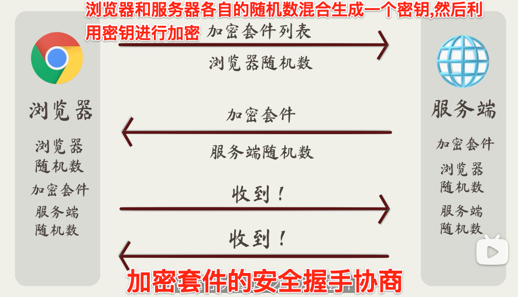
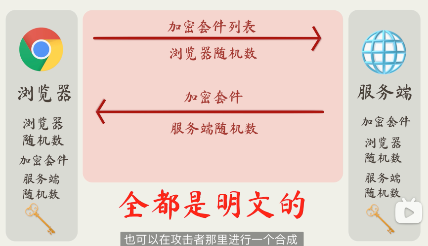
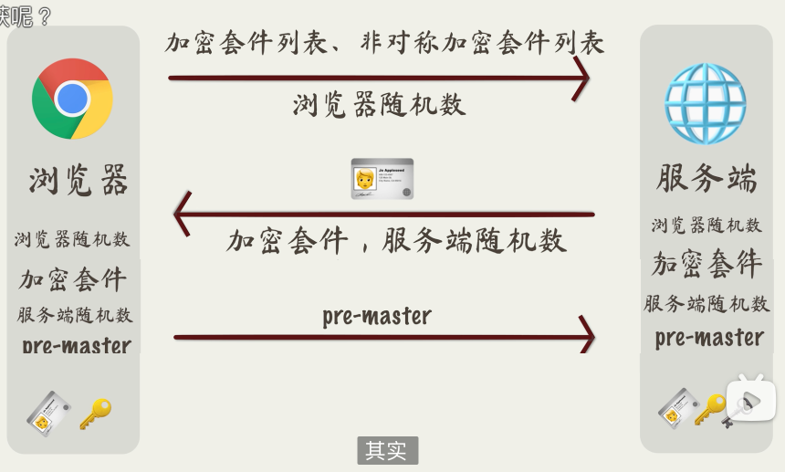
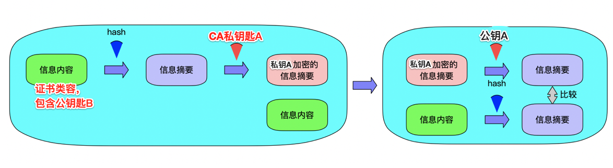

> <h2 id=''></h2>
- [**Https 安全简介**](#Https安全简介)
- [**CA证书生成**](#CA证书生成)
	- [生成 CA 目录](#生成CA目录)
	- [生成CSR文件](#生成CSR文件)
- [**根证书生成**](#根证书生成)
- [**服务器SSL证书生成**](#服务器SSL证书生成)
- [**HTTPS 原理解析**](https://juejin.im/entry/6844903506537611271)
- [**OpenSSL证书生成及Mac上Apache服务器配置HTTPS**](https://www.jianshu.com/p/b2a9655fe687)
- [**搭建CA服务器 US**](https://www.cnblogs.com/zhaojiedi1992/p/zhaojiedi_linux_011_ca.html)
- [**https 原理解析**](https://juejin.im/entry/6844903506537611271)
- [**Https 原理和iOS的适配**](https://www.jianshu.com/p/ba9ca8bec74a)


<br/>

***
<b/>


># <h0 id='Https安全简介'>Https 安全简介</h0>


**🔐加密套件的安全握手协商:**



<br/>

使用上面获取密钥又一个问题,就是他们是明文传输和容易在被中间人获取随机数:




<br/>

下面我们使用RSA非对称加密,我们使用加密后的套件列表. 然后服务器使用加密后的套件和公钥一起发送给浏览器,以后浏览器发送数据可以通过公钥加密发送给服务器.即使别人截取也破解不了.


但是这就有一个问题就是中间有人架起中间服务器,这样就会导致数据还是会被泄密.

<br/>
<br/>

&emsp; 所以我们采用数字证书,请中间数字证书签发机构CA颁给我们一个证书,当然这个是收费的.




- 浏览器传递一个随机数A给服务器、加密套件列表、非对称加密套件列表;

- 服务端收到后保存随机数A,选择一个套件并生成一个随机数B.然后把加密后的随机数、加密套件、证书发送给浏览器

- 浏览器对证书进行验证(通过Hash证书的明文生成的签名和证书自带的签名进行比照).若是通过,这个证书没有发生修改.然后取出证书中的公钥保存.

- 浏览器结合随机数A和随机数B生成了随机数pre-master,然后使用公钥加密发送给服务器

- 服务器收到加密后的随机数pre-master,进行解密.结合随机数A、随机数B、随机数pre-master生成新的密钥,以后用这个密钥进行对称加密,传送数据


数字证书的签名其实就是通过hash函数对证书的明文进行计算的到了信息摘要,然后使用CA的私钥对信息摘要进行加密.加密后就得到了数字签名了.

浏览器获取到CA的证书后,会用CA证书的hash函数计算证书明文得到信息摘要.然后利用浏览器内置的公钥对证书上的数字签名进行解密得到第二份摘要信息,然后对比,若一致,则证书是有效的.


<br/>

-   http使用的端口是80；

-   https使用端口是443，端口不能改，否则浏览器不知道怎么访问，这是双方协议的。
443端口是用发送请求进行密钥连接的，但是接收数据和发送数据时还使用80端口的。

- https的443端口安全原因

```
1. 浏览器 向443端口请求加密算法；
    1.1 传输加密算法时-> 保证安全，不被拦截；
        解决方案：采用RSA加密算法，服务器上存放私钥，然后把公钥传给浏览器，但是要注意的是把其传给浏览器

        问题1: 可能会被第三方截取也就是招到第三方的攻击，这个时候怎么办？ 
        所以这里有用到CA机构证书(获取服务器传来的公钥，然后CA机构使用自己的私钥进行加密来自服务器传来的公钥，然后再把加密的服务器公钥密文和CA机构的公钥传给浏览器，这就可以防止篡改了。)，也就是第三方权威证书验证机构。

        问题2: 但是又有一个问题，就是这个CA有没有可能是坏蛋扮演的，怎么办？

        放心，第三方CA在我们装系统时就已经把CA的公钥内置到我们的操作系统了，自己在可以在操作系统查到。
        CA传给浏览器是证书，包含：服务器端加密的公钥+服务器域名+公钥的摘要，这样就可以防伪了。


2. 浏览器拿出从443端口拿到的加密算法，向80端口发送请求得到一段密文；

3. 浏览器从拿到的加密算法 解密decode()这段密文，然后浏览器进行展示。
```

- https 连接概要：


```
1. 浏览器提交支持的加密算法列表， hi 在吗；
2. 服务器收到请求，从中挑选一个自己有的，然后向浏览器下发一个加密算法， hello 在～；
上面是2次握手；
3. 签名就是防止篡改的，使用摘要算法比如：sha1（）、hash。对于比较重要的内容，对其使用摘要算法，这样获取到的值就是‘签名’，这样就可以防篡改。但是要注意这中间有第三方的攻击，这个‘签名‘并没有防伪功能，所以不是签名。
```


TLS:(Transport Layer Security)为安全传输层协议，所以属于传输层;

<br/>

[SSL与TLS的区别以及介绍](https://blog.csdn.net/anningzhu/article/details/77517432)

<br/>

***
<br/>


># <h1 id='CA证书生成'>CA证书生成</h1>

 **` 自动生成`**
-  在OpenSSL的安装目录下的misc目录下，运行脚本
`/usr/local/etc/openssl@1.1/misc/CA.pl -newca`

**`手动生成`**

`无法进行下去了，因为只从中间CA生成开始而根CA没生成，需要先生成根CA，没尝试过。`




<br/>

[根CA的生成](https://www.cnblogs.com/Security-Darren/p/4078867.html)


<br/>

[中间CA生成](https://www.cnblogs.com/Security-Darren/p/4079605.html)

&emsp;  创建root CA私钥和证书然后进一步创建中间CA。为了便于区分，我们将创建中间`CA（intermediate CA）`的CA称为根`CA（root CA）`。

&emsp;  中间CA是root CA的代理，其证书由root CA签发，同时中间CA能够代表根CA签发用户证书，由此建立起信任链。

&emsp;  创建中间CA的好处是即使中间CA的私钥泄露，造成的影响也是可控的，我们只需要使用root CA撤销对应中间CA的证书即可。此外root CA的私钥可以脱机妥善保存，只需要在撤销和更新中间CA证书时才会使用。


<br/>
<br/>

> <h2 id='生成CA目录'>生成 CA 目录</h2>


```
//mkdir [-p] dirName
//-p 确保目录名称存在，不存在的就建一个
mkdir -p /Users/harleyhuang/Documents/Gitee/SSL/CA

//生成 certs、 crl、 newcerts、 private四个文件夹
mkdir certs crl newcerts private
```


```
//chmod abc file: 文件使用权限
//a,b,c各为一个数字，分别表示User、Group、及Other的权限。
//若r=4，w=2，x=1，要rwx属性则4+2+1=7
chmod 777 private


// touch命令用于修改文件或者目录的时间属性，包括存取时间和更改时间。若文件不存在，系统会建立一个新的文件
touch index.txt

//echo： 指令与 PHP 的 echo 指令类似，都是用于字符串的输出
//echo "It is a test" > myfile：显示结果定向至文件
echo 1000 > serial

```


-  创建中间CA的私钥，采用AES-256算法加密中间CA的私钥，中途会让我们输入加密密钥，最后修改中间CA的私钥访问权限

```
openssl genrsa -aes256 -out private/cakey.pem 4096
chmod 400 private/cakey.pem
```


-  中间CA要向root CA申请公钥证书，就要首先产生一个CSR（证书签名请求，Certificate Signing Request都有作用）格式的请求文件，将其发送给root CA后等待其对中间CA的审查。

&emsp;  将创建root CA时使用的配置文件拷贝到中间CA证书目录下，该配置文件在生成CSR文件和后续签发用户证书时都有用。

&emsp;  创建并编辑intermediate_CA.cnf,若是demoCA中没有rootCA.cnf文件夹可以去`/System/Library/OpenSSL/openssl.cnf `进行拷贝一份：

```
cp /Users/harleyhuang/Documents/Gitee/SSL/demoCA/rootCA.cnf /Users/harleyhuang/Documents/Gitee/SSL/intermediateCA/intermediateCA.cnf


cd cd /Users/harleyhuang/Documents/Gitee/SSL/intermediateCA

vim intermediateCA.cnf
//编辑
...
[ CA_default ]
dir                = /Users/harleyhuang/Documents/Gitee/SSL/intermediateCA
```
今后我们每次使用中间CA创建新的证书时，以`”-config /Users/harleyhuang/Documents/Gitee/SSL/intermediateCA/intermediateCA.cnf“` 的形式告诉OpenSSL中间CA的信息。

`intermediateCA.cnf.cnf`默认申请的有效期是365天，如果想要修改这个时长，可以在`[ CA_default ]的"default_days"`字段进行修改。

<br/>
<br/>


> <h2 id='生成CSR文件'>生成CSR文件</h2>


```
cd /Users/harleyhuang/Documents/Gitee/SSL/intermediateCA

openssl req -config intermediateCA.cnf -sha256 -new -key private/cakey.pem -out cacsr.pem
```


&emsp;  随后系统会要求我们输入中间CA的私钥密码，设置中间CA的一些身份信息等等，注意`”Organization Name“`一项一定要与root CA时设置的相同。

&emsp;  正确输入中间CA的身份信息后我们就得到了中间CA的CSR。

&emsp;  接下来我们用root CA同意中间CA的请求，因为我们将使用root CA的私钥签名中间CA的证书，这时系统会要求我们输入root CA的私钥密码，选择签名证书如下：

```
cd /Users/harleyhuang/Documents/Gitee/SSL/demoCA 

openssl ca -config rootCA.cnf -extensions v3_ca -notext -md sha256 -in /Users/harleyhuang/Documents/Gitee/SSL/intermediateCA/cacsr.pem -out /Users/harleyhuang/Documents/Gitee/SSL/intermediateCA/cacert.pem
```


<br/>

***
<br/>


> <h1 id='根证书生成'>根证书生成</h1>


-  新建一个SSL的文件夹
-  终端定位到这个文件夹

` cd /Users/harleyhuang/Documents/Gitee/SSL`

-  创建根证书密钥文件(自己做CA)root.key

`openssl genrsa -des3 -out root.key`


- 创建根证书的申请文件root.csr
`openssl req -new -key root.key -out root.csr`


-  创建一个自当前日期起为期十年的根证书root.crt
`openssl x509 -req -days 3650 -sha1 -extensions v3_ca -signkey root.key -in root.csr -out root.crt`


<br/>

***
<br/>


> <h1 id='服务器SSL证书生成'>服务器SSL证书生成</h1>


-  创建服务器证书密钥文件(在SSL文件夹中生成私钥)
  使用openssl工具生成一个RSA私钥，
`openssl genrsa -des3 -out server.key 2048`


&emsp; 生成rsa私钥，des3算法，2048位强度，server.key是秘钥文件名。
&emsp; `注意`：生成私钥，需要提供一个至少4位的密码。

-  创建服务器证书的申请文件root.csr(生成CSR[证书签名请求])

&emsp; 生成私钥之后，便可以创建csr文件了。

&emsp; 此时可以有两种选择。理想情况下，可以将证书发送给证书颁发机构（CA），CA验证过请求者的身份之后，会出具签名证书（很贵）。另外，如果只是内部或者测试需求，也可以使用OpenSSL实现自签名，具体操作如下：

```
openssl req -new -key server.key -out server.csr

//或者生成如下证书，注意2者不同，这里使用上面的
//openssl req -new -sha256 -x509 -days 365 -key server.key -out server.crt
```


说明：需要依次输入国家，地区，城市，组织，组织单位，Common Name和Email。其中Common Name，可以写自己的名字或者域名，如果要支持https，Common Name应该与域名保持一致，否则会引起浏览器警告。


<br/>

- 删除私钥中的密码

在【创建根证书密钥文件】过程中，由于必须要指定一个密码。而这个密码会带来一个副作用，那就是在每次Apache启动Web服务器时，都会要求输入密码，这显然非常不方便。要删除私钥中的密码，操作如下：
```
cp server.key server.key.org
openssl rsa -in server.key.org -out server.key
```

-  生成自签名证书(创建一个自当前日期起为期十年的根证书)

&emsp;  如果你不想花钱让CA签名，或者只是测试SSL的具体实现。那么，现在便可以着手生成一个自签名的证书了。

&emsp;  需要注意的是，在使用自签名的临时证书时，浏览器会提示证书的颁发机构是未知的。
`openssl x509 -req -days 365 -in server.csr -signkey server.key -out server.crt`


证书查看


说明：crt上有证书持有人的信息，持有人的公钥，以及签署者的签名等信息。当用户安装了证书之后，便意味着信任了这份证书，同时拥有了其中的公钥。证书上会说明用途，例如服务器认证，客户端认证，或者签署其他证书。当系统收到一份新的证书的时候，证书会说明，是由谁签署的。如果这个签署者确实可以签署其他证书，并且收到证书上的签名和签署者的公钥可以对上的时候，系统就自动信任新的证书。

- 或者使用根证书生成crt
`openssl x509 -req -days 730 -sha1 -extensions v3_req -CA root.crt -CAkey root.key -CAserial root.csr -CAcreateserial -in server.csr -out server2.crt `


-  安装私钥和证书
&emsp;  将私钥(server.key)和证书文件(server.crt)复制到Apache的配置目录下即可，在Mac 10.10系统中，复制到/etc/apache2/目录中即可。


- 客户端利用AF3.0使用自定义证书
第一步：

```
// 1.初始化单例类
     AFHTTPSessionManager *manager = [AFHTTPSessionManager manager];
    manager.securityPolicy.SSLPinningMode = AFSSLPinningModeCertificate;
    // 2.设置证书模式
    NSString * cerPath = [[NSBundle mainBundle] pathForResource:@"xxx" ofType:@"cer"];
    NSData * cerData = [NSData dataWithContentsOfFile:cerPath];
    manager.securityPolicy = [AFSecurityPolicy policyWithPinningMode:AFSSLPinningModeCertificate withPinnedCertificates:[[NSSet alloc] initWithObjects:cerData, nil]];
    // 客户端是否信任非法证书
    mgr.securityPolicy.allowInvalidCertificates = YES;
    // 是否在证书域字段中验证域名
    [mgr.securityPolicy setValidatesDomainName:NO];
```

第二步：使用AFNetworking进行请求

AFNetworking首先需要配置AFSecurityPolicy类，AFSecurityPolicy类封装了证书校验的过程

```
/**
 AFSecurityPolicy分三种验证模式：
 AFSSLPinningModeNone:只是验证证书是否在信任列表中
 AFSSLPinningModeCertificate：该模式会验证证书是否在信任列表中，然后再对比服务端证书和客户端证书是否一致
 AFSSLPinningModePublicKey：只验证服务端证书与客户端证书的公钥是否一致
*/
 
AFSecurityPolicy *securityPolicy = [AFSecurityPolicy policyWithPinningMode:AFSSLPinningModeCertificate];
    securityPolicy.allowInvalidCertificates = YES;//是否允许使用自签名证书
    securityPolicy.validatesDomainName = NO;//是否需要验证域名，默认YES
 
    AFHTTPSessionManager *_manager = [AFHTTPSessionManager manager];
    _manager.responseSerializer = [AFHTTPResponseSerializer serializer];
    _manager.securityPolicy = securityPolicy;
    //设置超时
    [_manager.requestSerializer willChangeValueForKey:@"timeoutinterval"];
    _manager.requestSerializer.timeoutInterval = 20.f;
    [_manager.requestSerializer didChangeValueForKey:@"timeoutinterval"];
    _manager.requestSerializer.cachePolicy = NSURLRequestReloadIgnoringCacheData;
    _manager.responseSerializer.acceptableContentTypes  = [NSSet setWithObjects:@"application/xml",@"text/xml",@"text/plain",@"application/json",nil];
  
    __weak typeof(self) weakSelf = self;
    [_manager setSessionDidReceiveAuthenticationChallengeBlock:^NSURLSessionAuthChallengeDisposition(NSURLSession *session, NSURLAuthenticationChallenge *challenge, NSURLCredential *__autoreleasing *_credential) {
         
        SecTrustRef serverTrust = [[challenge protectionSpace] serverTrust];
        /**
         *  导入多张CA证书
         */
        NSString *cerPath = [[NSBundle mainBundle] pathForResource:@"ca" ofType:@"cer"];//自签名证书
        NSData* caCert = [NSData dataWithContentsOfFile:cerPath];
        NSArray *cerArray = @[caCert];
        weakSelf.manager.securityPolicy.pinnedCertificates = cerArray;
         
        SecCertificateRef caRef = SecCertificateCreateWithData(NULL, (__bridge CFDataRef)caCert);
        NSCAssert(caRef != nil, @"caRef is nil");
         
        NSArray *caArray = @[(__bridge id)(caRef)];
        NSCAssert(caArray != nil, @"caArray is nil");
         
        OSStatus status = SecTrustSetAnchorCertificates(serverTrust, (__bridge CFArrayRef)caArray);
        SecTrustSetAnchorCertificatesOnly(serverTrust,NO);
        NSCAssert(errSecSuccess == status, @"SecTrustSetAnchorCertificates failed");
         
        NSURLSessionAuthChallengeDisposition disposition = NSURLSessionAuthChallengePerformDefaultHandling;
        __autoreleasing NSURLCredential *credential = nil;
        if ([challenge.protectionSpace.authenticationMethod isEqualToString:NSURLAuthenticationMethodServerTrust]) {
            if ([weakSelf.manager.securityPolicy evaluateServerTrust:challenge.protectionSpace.serverTrust forDomain:challenge.protectionSpace.host]) {
                credential = [NSURLCredential credentialForTrust:challenge.protectionSpace.serverTrust];
                if (credential) {
                    disposition = NSURLSessionAuthChallengeUseCredential;
                } else {
                    disposition = NSURLSessionAuthChallengePerformDefaultHandling;
                }
            } else {
                disposition = NSURLSessionAuthChallengeCancelAuthenticationChallenge;
            }
        } else {
            disposition = NSURLSessionAuthChallengePerformDefaultHandling;
        }
         
        return disposition;
    }];

```
上述代码通过给AFHTTPSessionManager重新设置证书验证回调来自己验证证书，然后将自己的证书加入到可信任的证书列表中，即可通过证书的校验。


<br/>

***
<br/>

- 创建客户端证书密钥文件client.key
`openssl genrsa -des3 -out client.key 2048`

-  创建客户端证书的申请文件client.csr
`openssl req -new -key client.key -out client.csr`

-  创建一个自当前日期起有效期为两年的客户端证书client2.crt
`openssl x509 -req -days 730 -sha1 -extensions v3_req -CA server.crt -CAkey server.key -CAserial server.csr -CAcreateserial -in client.csr -out client2.crt`

发现它`unable to load CA Private Key`

-  将客户端证书文件client.crt和客户端证书密钥文件client.key合并成客户端证书安装包client.pfx
`openssl pkcs12 -export -in client2.crt -inkey client.key -out client.pfx`

-  保存生成的文件备用，其中server.crt和server.key是配置单向SSL时需要使用的证书文件，client.crt是配置双向SSL时需要使用的证书文件，client.pfx是配置双向SSL时需要客户端安装的证书文件

     .crt文件和.key可以合到一个文件里面，把2个文件合成了一个.pem文件（直接拷贝过去就行了）


<br/>

***
<br/>


