> <h1 id=''></h1>
- [**Https 安全简介**](#Https安全简介)
	- [Https认证流程](#Https认证流程)
	- [https安全握手原理](#https安全握手原理)
	- [部分证书类容](#部分证书类容)
	- [https端口](#https端口)
	- [https连接概要](#https连接概要)
- [**CA证书生成**](#CA证书生成)
	- [生成 CA 目录](#生成CA目录)
	- [中间CA私钥文件cakey.pem](#中间CA私钥文件cakey.pem)
	- [创建中间CA配置文件intermediateCA.cnf](#创建中间CA配置文件intermediateCA.cnf)
	- [生成证书签名请求(CSR),保存到cacsr.pem文件](#生成证书签名请求(CSR),保存到cacsr.pem文件)
	- [生成新的数字证书，保存到cacert.pem文件](#生成新的数字证书，保存到cacert.pem文件)
	- [根证书加密私钥root.key文件](#根证书加密私钥root.key文件)
	- [证书签名请求保存到root.csr文件](#证书签名请求保存到root.csr文件)
	- [生成自签名根证书文件root.crt](#生成自签名根证书文件root.crt)
- [**服务器SSL证书生成**](#服务器SSL证书生成)
	- [生成加密保护的私钥文件server.key](#生成加密保护的私钥文件server.key)
	- [生成服务器公钥文件server.crt](#生成服务器公钥文件server.crt)
	- [删除私钥中的密码](#删除私钥中的密码)
	- [生成新的服务器证书文件server2.crt](#生成新的服务器证书文件server2.crt)
	- [安装私钥和证书](#安装私钥和证书)
- [**客户端创建加密证书文件**](#客户端创建加密证书文件)
- **资料**
	- [**HTTPS 原理解析**](https://juejin.im/entry/6844903506537611271)
	- [**OpenSSL证书生成及Mac上Apache服务器配置HTTPS**](https://www.jianshu.com/p/b2a9655fe687)
	- [**搭建CA服务器 US**](https://www.cnblogs.com/zhaojiedi1992/p/zhaojiedi_linux_011_ca.html)
	- [**https 原理解析**](https://juejin.im/entry/6844903506537611271)
	- [**Https 原理和iOS的适配**](https://www.jianshu.com/p/ba9ca8bec74a)


<br/>

***
<b/><b/>


> <h1 id='Https安全简介'>Https 安全简介</h1>


<br/><br/>

> <h2 id='Https认证流程'>Https认证流程</h2>

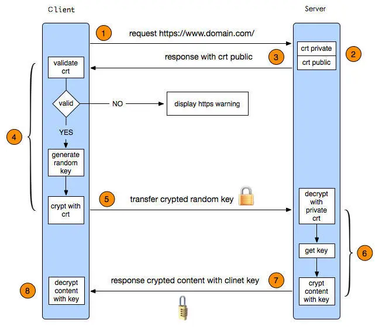

<br/>


- **1\. 客户端发起HTTPS请求**

　　&emsp; 这个没什么好说的，就是用户在浏览器里输入一个https网址，然后连接到server的443端口。
　　
　　<br/>
　　
- **2\. 服务端的配置**

&emsp; 采用HTTPS协议的服务器必须要有一套数字证书，可以自己制作，也可以向组织申请。区别就是自己颁发的证书需要客户端验证通过，才可以继续访问，而使用受信任的公司申请的证书则不会弹出提示页面。这套证书其实就是一对公钥和私钥。如果对公钥和私钥不太理解，可以想象成一把钥匙和一个锁头，只是全世界只有你一个人有这把钥匙，你可以把锁头给别人，别人可以用这个锁把重要的东西锁起来，然后发给你，因为只有你一个人有这把钥匙，所以只有你才能看到被这把锁锁起来的东西。
　　
<br/>
　　
- **3\. 传送证书**
　
&emsp; 这个证书其实就是公钥，只是包含了很多信息，如证书的颁发机构，过期时间等等。

证书内容：
　　
```
签发者
证书用途
某A的公钥
某A的加密算法
某A的HASH算法
证书的到期时间

```

&emsp; 将证书内容进行签名，得到**数字签名**，签名的步骤是：把证书类容做一次HASH（得到一个固定长度比如128位的HASH），再用CA的私钥A加密得到了**数字签名**。

&emsp; 把证书传给客户端，这个证书(为了防止中间人的劫持攻击)包含公钥B（这个公钥B将用来对对称加密密钥进行加密， 服务器存在一个私钥B，这个私钥B对对称密钥解密。）、散列算法，数字签名(使用CA机构的私钥A对公钥B、摘要进行加密，然后使用散列算法进行摘要)。
　　
　　
<br/>
　　
- **4\. 客户端解析证书**

&emsp; 这部分工作是有客户端的TLS/SSL来完成的，首先会验证公钥是否有效，比如颁发机构，过期时间等等，如果发现异常，则会弹出一个警告框，提示证书存在问题。

&emsp; 若没有使用客户端内置的证书公钥A进行解密数字签名然后得到原始的HASH，然后根据证书的HASH算法计算一个HASH进行对比。若相等则没有篡改可以信任，否则就不能信任。然后生成一个随机对称加密密钥K，使用公钥B进行加密。


<br/>

- **5\. 传送加密信息**

&emsp; 这部分传送的是加密过的密钥K和使用密钥K加密过的数据，目的就是让服务端使用私钥B进行解密得到密钥K。然后使用对称密钥K进行解密数据。以后客户端和服务端的通信就可以通过这个随机值来进行加密解密了。

<br/>

- **6\. 服务段解密信息**

&emsp; 服务端用私钥解密后，得到了客户端传过来的随机值(私钥)，然后把内容通过该值进行对称加密。所谓对称加密就是，将信息和私钥通过某种算法混合在一起，这样除非知道私钥，不然无法获取内容，而正好客户端和服务端都知道这个私钥，所以只要加密算法够彪悍，私钥够复杂，数据就够安全。

<br/>
　　
- **7\. 传输加密后的信息**

&emsp; 这部分信息是服务段用私钥加密后的信息，可以在客户端被还原。

<br/>
　　
- **8\. 客户端解密信息**

&emsp; 客户端用之前生成的私钥解密服务端传过来的信息，于是获取了解密后的内容。整个过程第三方即使监听到了数据，也束手无策。

这就是整个https验证的流程了。简单总结一下：

* 就是用户发起请求，服务器响应后返回一个证书，证书中包含一些基本信息和公钥。
- 用户拿到证书后，去验证这个证书是否合法，不合法，则请求终止。
- 合法则生成一个随机数，作为对称加密的密钥，用服务器返回的公钥对这个随机数加密。然后返回给服务器。
- 服务器拿到加密后的随机数，利用私钥解密，然后再用解密后的随机数（对称密钥），把需要返回的数据加密，加密完成后数据传输给用户。
- 最后用户拿到加密的数据，用一开始的那个随机数（对称密钥），进行数据解密。整个过程完成。

当然这仅仅是一个单向认证，https还会有双向认证，相对于单向认证也很简单。仅仅多了服务端验证客户端这一步。感兴趣的可以看看这篇：[Https单向认证和双向认证。](https://link.jianshu.com?t=http://blog.csdn.net/duanbokan/article/details/50847612)

**了解了https认证流程后，接下来我们来讲讲AFSecurityPolicy这个类，AF就是用这个类来满足我们各种https认证需求。**


<br/><br/>

> <h2 id='https安全握手原理'>https安全握手原理</h2>

**🔐加密套件的安全握手协商:**


<br/><br/>

使用上面获取密钥又一个问题,就是他们是明文传输和容易在被中间人获取随机数:


<br/><br/>

下面我们使用RSA非对称加密,我们使用加密后的套件列表. 然后服务器使用加密后的套件和公钥一起发送给浏览器,以后浏览器发送数据可以通过公钥加密发送给服务器.即使别人截取也破解不了.


但是这就有一个问题就是中间有人架起中间服务器,这样就会导致数据还是会被泄密.

<br/><br/>

&emsp; 所以我们采用数字证书,请中间数字证书签发机构CA颁给我们一个证书,当然这个是收费的.


- 浏览器传递一个随机数A给服务器、加密套件列表、非对称加密套件列表;

- 服务端收到后保存随机数A,选择一个套件并生成一个随机数B并对其进行加密.然后把加密的随机数、选中的加密套件、证书发送给浏览器

- 浏览器对证书进行验证(通过Hash证书的明文生成的信息摘要和证书自带的签名通过浏览器内置的公钥解秘后的进行比照).若是通过,这个证书没有发生修改.然后取出证书中的公钥保存.

- 浏览器结合随机数A和随机数B生成了随机数pre-master,然后使用保存的证书公钥加密发送给服务器

- 服务器收到加密后的随机数pre-master,进行解密.结合随机数A、随机数B、随机数pre-master生成新的密钥,以后用这个密钥进行对称加密,传送数据


<br/><br/>

> <h2 id='部分证书类容'>部分证书类容</h2>

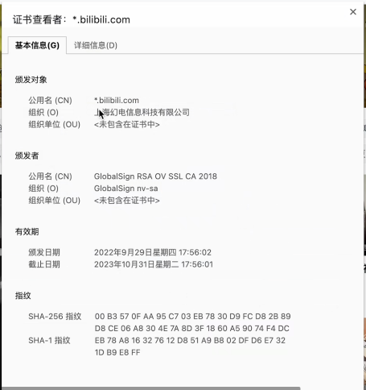

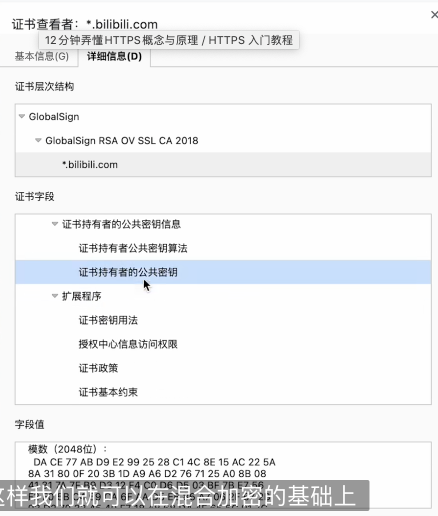


数字证书的签名其实就是通过hash函数对证书的明文进行计算的到了信息摘要,然后使用CA的私钥对信息摘要进行加密.加密后就得到了数字签名了.

浏览器获取到CA的证书后,会用CA证书的hash函数计算证书明文得到信息摘要.然后利用浏览器内置的公钥对证书上的数字签名进行解密得到第二份摘要信息,然后对比,若一致,则证书是有效的.


<br/><br/><br/>

> <h2 id='https端口'>https端口</h2>


-   http使用的端口是80；

-   https使用端口是443，端口不能改，否则浏览器不知道怎么访问，这是双方协议的。
443端口是用发送请求进行密钥连接的，但是接收数据和发送数据时还使用80端口的。

- https的443端口安全原因

```
1. 浏览器 向443端口请求加密算法；
    1.1 传输加密算法时-> 保证安全，不被拦截；
        解决方案：采用RSA加密算法，服务器上存放私钥，然后把公钥传给浏览器，但是要注意的是把其传给浏览器

        问题1: 可能会被第三方截取也就是招到第三方的攻击，这个时候怎么办？ 
        所以这里有用到CA机构证书(获取服务器传来的公钥，然后CA机构使用自己的私钥进行加密来自服务器传来的公钥，然后再把加密的服务器公钥密文和CA机构的公钥传给浏览器，这就可以防止篡改了。)，也就是第三方权威证书验证机构。

        问题2: 但是又有一个问题，就是这个CA有没有可能是坏蛋扮演的，怎么办？

        放心，第三方CA在我们装系统时就已经把CA的公钥内置到我们的操作系统了，自己在可以在操作系统查到。
        CA传给浏览器是证书，包含：服务器端加密的公钥+服务器域名+公钥的摘要，这样就可以防伪了。


2. 浏览器拿出从443端口拿到的加密算法，向80端口发送请求得到一段密文；

3. 浏览器从拿到的加密算法 解密decode()这段密文，然后浏览器进行展示。
```


<br/><br/>

> <h2 id='https连接概要'>https 连接概要</h2>

- **https 连接概要**

```
1. 浏览器提交支持的加密算法列表， hi 在吗；
2. 服务器收到请求，从中挑选一个自己有的，然后向浏览器下发一个加密算法， hello 在～；
上面是2次握手；
3. 签名就是防止篡改的，使用摘要算法比如：sha1（）、hash。对于比较重要的内容，对其使用摘要算法，这样获取到的值就是‘签名’，这样就可以防篡改。但是要注意这中间有第三方的攻击，这个‘签名‘并没有防伪功能，所以不是签名。
```


TLS:(Transport Layer Security)为安全传输层协议，所以属于传输层;

<br/>

[SSL与TLS的区别以及介绍](https://blog.csdn.net/anningzhu/article/details/77517432)

<br/>

***
<br/><br/>


># <h1 id='CA证书生成'>CA证书生成</h1>

 **` 自动生成`**
-  在OpenSSL的安装目录下的misc目录下，运行脚本
`/usr/local/etc/openssl@1.1/misc/CA.pl -newca`

**`手动生成`**

`无法进行下去了，因为只从中间CA生成开始而根CA没生成，需要先生成根CA，没尝试过。`


<br/>

[根CA的生成](https://www.cnblogs.com/Security-Darren/p/4078867.html)


<br/>

[中间CA生成](https://www.cnblogs.com/Security-Darren/p/4079605.html)

&emsp;  创建root CA私钥和证书然后进一步创建中间CA。为了便于区分，我们将创建中间`CA（intermediate CA）`的CA称为根`CA（root CA）`。

&emsp;  中间CA是root CA的代理，其证书由root CA签发，同时中间CA能够代表根CA签发用户证书，由此建立起信任链。

&emsp;  创建中间CA的好处是即使中间CA的私钥泄露，造成的影响也是可控的，我们只需要使用root CA撤销对应中间CA的证书即可。此外root CA的私钥可以脱机妥善保存，只需要在撤销和更新中间CA证书时才会使用。


<br/>
<br/>

> <h2 id='生成CA目录'>生成 CA 目录</h2>


```
//mkdir [-p] dirName
//-p 确保目录名称存在，不存在的就建一个
mkdir -p /Users/harleyhuang/Documents/Gitee/SSL/CA

//生成 certs、 crl、 newcerts、 private四个文件夹
mkdir certs crl newcerts private
```

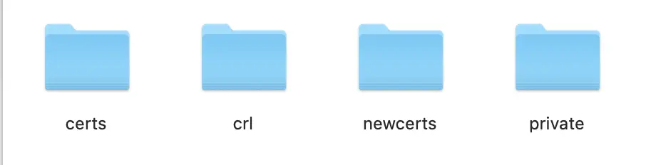

certs、 crl、 newcerts、 private四个文件夹


<br/>

```
//chmod abc file: 文件使用权限
//a,b,c各为一个数字，分别表示User、Group、及Other的权限。
//若r=4，w=2，x=1，要rwx属性则4+2+1=7
chmod 777 private


// touch命令用于修改文件或者目录的时间属性，包括存取时间和更改时间。若文件不存在，系统会建立一个新的文件
touch index.txt

//echo： 指令与 PHP 的 echo 指令类似，都是用于字符串的输出
//echo "It is a test" > myfile：显示结果定向至文件
echo 1000 > serial

```

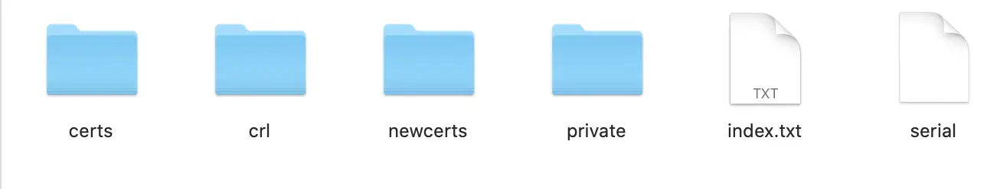


<br/><br/>

> <h2 id='中间CA私钥文件cakey.pem'>中间CA私钥文件cakey.pem</h2>


-  创建中间CA的私钥，采用AES-256算法加密中间CA的私钥，中途会让我们输入加密密钥，最后修改中间CA的私钥访问权限

```
/*
* openssl 是一个开放源代码的密码学工具包，提供了加密和解密以及其他安全操作的功能

* genrsa 是 OpenSSL 提供的一个子命令，用于生成 RSA 密钥对。

* -aes256 选项指定了要使用 AES256 加密算法来保护生成的私钥文件。

* -out private/cakey.pem 选项指定了生成的私钥文件的路径和名称。

* 4096 指定了生成的 RSA 密钥的位数，这里是 4096 位。通常情况下，4096 位的 RSA 密钥提供了很高的安全性，适用于许多安全场景。

* 执行此命令后，将会生成一个 4096 位的 RSA 私钥，并使用 AES256 算法加密存储在 private/cakey.pem 文件中
*/
openssl genrsa -aes256 -out private/cakey.pem 4096

chmod 400 private/cakey.pem
```

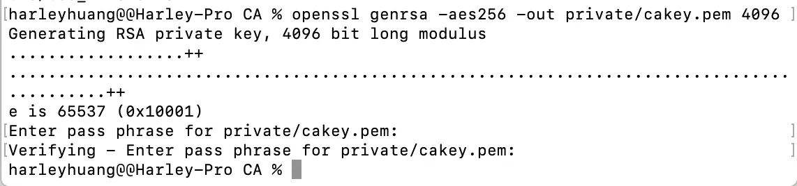

**cakey.pem 生成**

<br/>

**疑问:** cakey.pem是什么文件?

cakey.pem 文件通常是一个包含密钥（私钥）的文件，用于证书颁发机构（CA）的操作。通常情况下，“CA” 指的是证书颁发机构，负责颁发数字证书，以验证个体或实体的身份。这些证书用于加密通信和建立安全连接。

在这种情况下，cakey.pem 文件很可能包含了 CA 的私钥，因为生成私钥的 OpenSSL 命令中使用了 cakey.pem 作为输出文件的名称。私钥对在证书颁发机构的操作中至关重要，因为它们用于对证书进行签名，确保证书的真实性和完整性。

一般来说，cakey.pem 文件的名称中的 ".pem" 扩展名表明它采用了 PEM（Privacy Enhanced Mail）格式，这是一种常见的用于存储证书和密钥的格式，它使用基于 Base64 编码的 ASCII 文本。


<br/><br/>

> <h2 id='创建中间CA配置文件intermediateCA.cnf'>创建中间CA配置文件intermediateCA.cnf</h2>


-  中间CA要向root CA申请公钥证书，就要首先产生一个CSR（证书签名请求，Certificate Signing Request都有作用）格式的请求文件，将其发送给root CA后等待其对中间CA的审查。

&emsp;  将创建root CA时使用的配置文件拷贝到中间CA证书目录下，该配置文件在生成CSR文件和后续签发用户证书时都有用。

&emsp;  创建并编辑intermediateCA.cnf,若是demoCA中没有rootCA.cnf文件夹可以去`/System/Library/OpenSSL/openssl.cnf `进行拷贝一份：

```
//cp file1.txt file2.txt: 将将文件 file1.txt 复制到当前目录下并命名为 file2.txt
cp /Users/harleyhuang/Documents/Gitee/SSL/demoCA/rootCA.cnf /Users/harleyhuang/Documents/Gitee/SSL/intermediateCA/intermediateCA.cnf

cd /Users/harleyhuang/Documents/Gitee/SSL/intermediateCA

vim intermediateCA.cnf
//编辑
...
[ CA_default ]
dir                = /Users/harleyhuang/Documents/Gitee/SSL/intermediateCA
```

今后我们每次使用中间CA创建新的证书时，以`”-config /Users/harleyhuang/Documents/Gitee/SSL/intermediateCA/intermediateCA.cnf“` 的形式告诉OpenSSL中间CA的信息。

`intermediateCA.cnf.cnf`默认申请的有效期是365天，如果想要修改这个时长，可以在`[ CA_default ]的"default_days"`字段进行修改。


<br/>

**疑问:** openssl.cnf  是什么文件? 有什么用?


&emsp; openssl.cnf 是 OpenSSL 的配置文件。OpenSSL 是一个开源的密码学工具包，用于实现安全通信、加密和解密数据等操作。openssl.cnf 文件包含了 OpenSSL 工具的默认配置信息，可以用于指定各种参数和选项，以定制 OpenSSL 工具的行为。

&emsp; **openssl.cnf 文件的作用包括但不限于：**

- 设置默认参数和选项：openssl.cnf 中定义了一些默认值，例如加密算法、密钥长度、证书属性等，这些可以在使用 OpenSSL 工具时作为默认值。
- 配置证书颁发机构（CA）：对于证书颁发机构的操作，可以在 openssl.cnf 中配置相关参数，如证书的有效期、默认的签名算法等。
- 指定密钥和证书存储位置：openssl.cnf 可以指定默认的密钥和证书存储位置，以便 OpenSSL 工具在需要时能够找到这些文件。
- 设置加密算法和密码学参数：可以在 openssl.cnf 中指定加密算法的参数，如密码长度、散列算法等。
- 配置 SSL/TLS 协议参数：openssl.cnf 中包含了 SSL/TLS 协议的相关配置，如支持的协议版本、密码套件等。

&emsp; 总之，openssl.cnf 文件允许用户对 OpenSSL 工具的行为进行自定义和配置，使其适应特定的使用场景和安全需求。


<br/><br/>


> <h2 id='生成证书签名请求(CSR),保存到cacsr.pem文件'>生成证书签名请求(CSR),保存到cacsr.pem文件</h2>

使用OpenSSL 命令用于生成一个证书签名请求 (CSR)，并将其保存到 cacsr.pem 文件中.

```
cd /Users/harleyhuang/Documents/Gitee/SSL/intermediateCA


/*
* OpenSSL 命令用于生成一个证书签名请求 (CSR)，并将其保存到 cacsr.pem 文件中

* req：这是 OpenSSL 工具的一个子命令，用于处理证书请求 (CSR)

* -config intermediateCA.cnf：此选项指定了要使用的 OpenSSL 配置文件，即 intermediateCA.cnf。
  这个配置文件包含了生成 CSR 所需的参数，比如证书的属性、签名算法等信息。通过指定配置文件，可以定制 CSR 的生成过程。

* -sha256：此选项指定了使用 SHA-256 哈希算法来生成 CSR 的摘要。
SHA-256 是一种安全性更高的哈希算法，用于生成证书请求的摘要，以确保请求的完整性和安全性。

* -new：此选项指示 OpenSSL 创建一个新的证书签名请求 (CSR)。

* -key private/cakey.pem：此选项指定了用于生成 CSR 的私钥文件的路径和名称。在这里，private/cakey.pem 是之前生成的 CA 私钥文件的路径

* -out cacsr.pem：此选项指定了生成的证书签名请求 (CSR) 的输出文件路径和名称。在这里，cacsr.pem 是要保存 CSR 的文件名
*/
openssl req -config intermediateCA.cnf -sha256 -new -key private/cakey.pem -out cacsr.pem
```

**cacsr.pem 生成:**

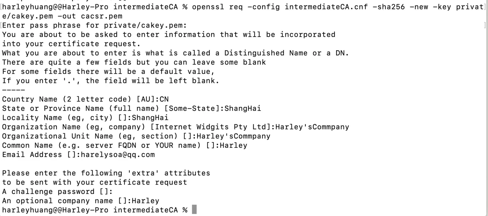

- **注意:** 
	- 随后系统会要求我们输入中间CA的私钥密码，设置中间CA的一些身份信息等等，注意`”Organization Name“`一项一定要与root CA时设置的相同。
	- 正确输入中间CA的身份信息后我们就得到了中间CA的CSR。

<br/>

&emsp; 执行上述此命令后，OpenSSL 将使用指定的配置文件 (intermediateCA.cnf) 和私钥文件 (private/cakey.pem) 生成一个新的证书签名请求，并将其保存到 cacsr.pem 文件中。生成的 CSR 可以提交给证书颁发机构 (CA) 进行签名，以获取相应的数字证书。


<br/><br/>


> <h2 id='生成新的数字证书，保存到cacert.pem文件'>生成新的数字证书，保存到cacert.pem文件</h2>

&emsp; 接下来我们用root CA同意中间CA的请求，因为我们将使用root CA的私钥签名中间CA的证书，这时系统会要求我们输入root CA的私钥密码，选择签名证书如下：

```
cd /Users/harleyhuang/Documents/Gitee/SSL/demoCA 


/**
 * 执行此命令后，OpenSSL 将使用指定的根证书颁发机构 (CA) 的配置文件 (rootCA.cnf) 和私钥对指定的 CSR 文件进行签名，生成一个新的数字证书，并将其保存到指定的输出文件 (cacert.pem) 中。生成的数字证书可以用于加密通信、身份验证等安全目的
 
 * ca：这是 OpenSSL 工具的一个子命令，用于执行 CA 相关的操作，如签署证书请求、撤销证书等。
 
 * -config rootCA.cnf：此选项指定了要使用的 OpenSSL 配置文件，即 rootCA.cnf。这个配置文件包含了 CA 的相关参数，如根证书的属性、签名算法等信息。通过指定配置文件，可以定制 CA 签署证书的行为
 
 * -extensions v3_ca：此选项指定了要使用的扩展配置。在这里，v3_ca 可能定义了证书中的一些扩展信息，如密钥用法、基本约束等。这确保了生成的证书符合预期的标准和要求。
 
 * -notext：此选项指示 OpenSSL 在输出证书时不显示文本信息，只显示二进制数据
 
 * -md sha256：此选项指定了使用 SHA-256 哈希算法来生成数字证书的摘要。SHA-256 是一种安全性更高的哈希算法，用于生成证书的摘要，以确保证书的完整性和安全性
 
 * -in 路径/cacsr.pem: 此选项指定了要签署的证书签名请求 (CSR) 的路径和名称
 
 * -out 路径/cacert.pem: 此选项指定了生成的数字证书的输出路径和名称
*/
openssl ca -config rootCA.cnf -extensions v3_ca -notext -md sha256 -in /Users/harleyhuang/Documents/Gitee/SSL/intermediateCA/cacsr.pem -out /Users/harleyhuang/Documents/Gitee/SSL/intermediateCA/cacert.pem
```


<br/><br/><br/>


> <h2 id='根证书加密私钥root.key文件'>根证书加密私钥root.key文件</h2>

-  新建一个SSL的文件夹

-  终端定位到这个文件夹

```
 cd /Users/harleyhuang/Documents/Gitee/SSL
```

-  创建根证书密钥文件(自己做CA)root.key

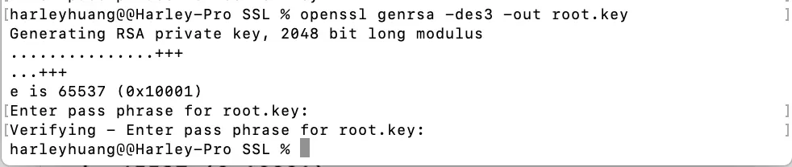

```
openssl genrsa -des3 -out root.key
```

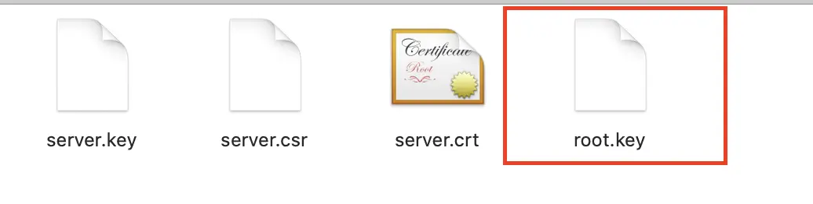


<br/><br/>

> <h2 id='证书签名请求保存到root.csr文件'>证书签名请求保存到root.csr文件</h2>


- 创建根证书的申请文件root.csr

&emsp; 执行此命令后，OpenSSL 将使用指定的根私钥文件 (root.key) 生成一个新的证书签名请求，并将其保存到 root.csr 文件中。生成的 CSR 可以提交给证书颁发机构 (CA) 进行签名，以获取相应的数字证书

```
/*
* req：这是 OpenSSL 工具的一个子命令，用于处理证书请求 (CSR)。

* -new：此选项指示 OpenSSL 创建一个新的证书签名请求 (CSR)。

* -key root.key：此选项指定了用于生成 CSR 的私钥文件的路径和名称。在这里，root.key 是之前生成的根私钥文件的路径。

* -out root.csr：此选项指定了生成的证书签名请求 (CSR) 的输出文件路径和名称。在这里，root.csr 是要保存 CSR 的文件名。
*/
openssl req -new -key root.key -out root.csr
```

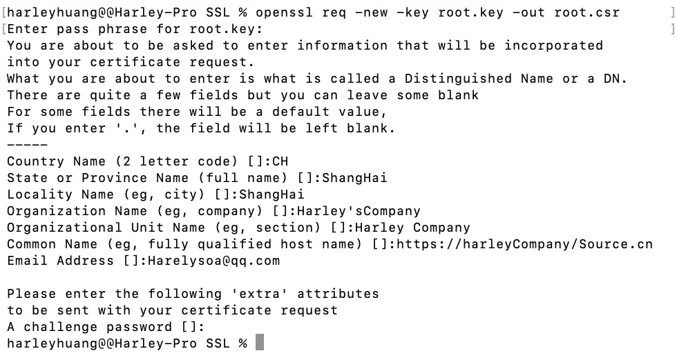


<br/><br/>

> <h2 id='生成自签名根证书文件root.crt'>生成自签名根证书文件root.crt</h2>


-  创建一个自当前日期起为期十年的根证书root.crt

```
/*
* 这个命令的作用是将一个根证书的 CSR 文件（root.csr）使用指定的私钥（root.key）签名，并生成一个自签名的根证书文件（root.crt），并设置了其有效期为10年

* x509: 该命令告诉 OpenSSL 生成或操作 X.509 证书

* -req: 告诉 OpenSSL 输入是一个证书签发请求

* -days 3650: 设置证书的有效期限，这里是3650天，即10年

* -sha1: 指定使用 SHA-1 算法进行签名。请注意，SHA-1 已经被认为不够安全，建议使用更安全的算法如 SHA-256

* -extensions v3_ca: 指定使用名为 "v3_ca" 的扩展配置文件中的扩展。这个扩展一般用于根证书的生成，以表示这是一个根证书

* -signkey root.key: 指定用于签署证书的私钥文件名。在这里，root.key 是根证书的私钥。

* -in root.csr: 指定输入的 CSR 文件，这是待签署的证书请求文件

*-out root.crt: 指定输出的证书文件名，即生成的自签名根证书文件

*/
openssl x509 -req -days 3650 -sha1 -extensions v3_ca -signkey root.key -in root.csr -out root.crt
```

root.crt 生成:

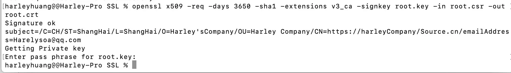

<br/>

3 个证书生成:

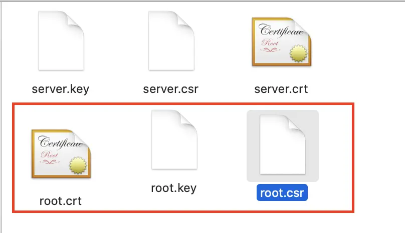


<br/>

***
<br/><br/>


> <h1 id='服务器SSL证书生成'>服务器SSL证书生成</h1>


<br/><br/>

> <h2 id='生成加密保护的私钥文件server.key'>生成加密保护的私钥文件server.key</h2>

-  创建服务器证书密钥文件(在SSL文件夹中生成私钥)
  使用openssl工具生成一个RSA私钥

```
/* 这个命令的作用是使用 Triple DES 算法生成一个带有密码保护的 RSA 私钥文件，该私钥文件名为 server.key，长度为 2048 位

* openssl: OpenSSL 工具的执行命令

* genrsa: 该命令告诉 OpenSSL 生成 RSA 私钥

* -des3: 使用 Triple DES 算法对生成的私钥进行加密。这样生成的私钥文件将需要密码来保护，即在使用私钥时需要提供密码才能解密

* -out server.key: 指定输出的私钥文件名为 server.key。这里的 server.key 将是生成的 RSA 私钥文件名

* 2048: 指定 RSA 私钥的长度为 2048 位。私钥长度的选择影响着安全性，2048 位长度在目前被认为是足够安全的选择

*/
openssl genrsa -des3 -out server.key 2048
```

生成私钥:

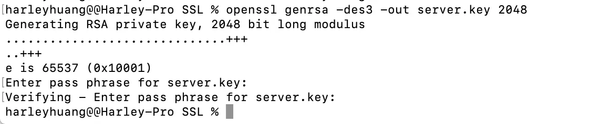

<br/>

私钥文件:

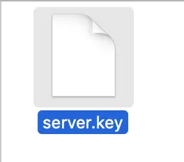


<br/>

&emsp; 生成rsa私钥，des3算法，2048位强度，server.key是秘钥文件名。

&emsp; `注意`：生成私钥，需要提供一个至少4位的密码。

<br/><br/>

> <h2 id='生成服务器公钥文件server.crt'>生成服务器公钥文件server.crt</h2>

&emsp; 生成私钥之后，便可以创建csr文件了。

&emsp; 此时可以有两种选择。理想情况下，可以将证书发送给证书颁发机构（CA），CA验证过请求者的身份之后，会出具签名证书（很贵）。另外，如果只是内部或者测试需求，也可以使用OpenSSL实现自签名，具体操作如下：

```
/* 这个命令的作用是生成一个包含服务器公钥的证书签发请求文件（server.csr），该请求文件可以用于向证书颁发机构申请签发服务器证书

* req: 该命令告诉 OpenSSL 这是一个处理证书签发请求的操作

* -new: 创建一个新的证书签发请求

* -key server.key: 指定用于生成 CSR 的私钥文件名。在这里，server.key 是服务器的 RSA 私钥文件。

* -out server.csr: 指定输出的 CSR 文件名为 server.csr。这个文件包含了服务器的公钥以及其他相关信息，用于向证书颁发机构（CA）请求签发证书。

*/
openssl req -new -key server.key -out server.csr


//或者生成如下证书，注意2者不同，这里使用上面的
/* 这个命令的作用是将一个自签名的服务器证书（server.crt）与服务器的私钥文件（server.key）进行配对，生成一个可用于 SSL/TLS 加密通信的证书

* req: 该命令告诉 OpenSSL 这是一个处理证书签发请求的操作

* -new: 创建一个新的证书签发请求

* -sha256: 指定使用 SHA-256 算法进行证书签名。SHA-256 是一个更安全的哈希算法，相对于之前的算法（如 SHA-1）更为推荐

* -x509: 生成一个自签名的 X.509 证书。通常用于生成自签名的服务器证书，而不是生成证书签发请求。

* -days 365: 设置证书的有效期限，这里是365天，即1年。


* -key server.key: 指定用于生成证书的私钥文件名。在这里，server.key 是服务器的 RSA 私钥文件。

* -out server.crt: 指定输出的证书文件名为 server.crt，即生成的自签名服务器证书文件。
*/
//openssl req -new -sha256 -x509 -days 365 -key server.key -out server.crt
```

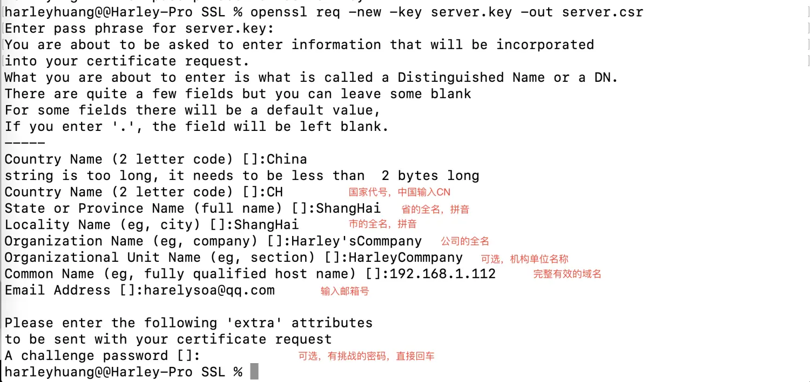


说明：需要依次输入国家，地区，城市，组织，组织单位，Common Name和Email。其中Common Name，可以写自己的名字或者域名，如果要支持https，Common Name应该与域名保持一致，否则会引起浏览器警告。


<br/><br/><br/>

> <h2 id='删除私钥中的密码'>删除私钥中的密码</h2>

在【创建根证书密钥文件】过程中，由于必须要指定一个密码。而这个密码会带来一个副作用，那就是在每次Apache启动Web服务器时，都会要求输入密码，这显然非常不方便。要删除私钥中的密码，操作如下：

```
cp server.key server.key.org

openssl rsa -in server.key.org -out server.key
```


<br/><br/>

> <h2 id=''></h2>

-  生成自签名证书(创建一个自当前日期起为期十年的根证书)

&emsp;  如果你不想花钱让CA签名，或者只是测试SSL的具体实现。那么，现在便可以着手生成一个自签名的证书了。

&emsp;  需要注意的是，在使用自签名的临时证书时，浏览器会提示证书的颁发机构是未知的。

```
/*
* 这个命令的作用是将一个自签名的服务器证书（server.crt）与服务器的私钥文件（server.key）进行配对，生成一个可用于 SSL/TLS 加密通信的证书

* openssl: OpenSSL 工具的执行命令。

* x509: 该命令告诉 OpenSSL 生成或操作 X.509 证书。

* -req: 告诉 OpenSSL 输入是一个证书签发请求（Certificate Signing Request，CSR）。

* -days 365: 设置证书的有效期限，这里是365天，即1年。

* -in server.csr: 指定输入的 CSR 文件，这是待签署的证书请求文件。

* -signkey server.key: 指定用于签署证书的私钥文件名。在这里，server.key 是服务器的 RSA 私钥文件。

* -out server.crt: 指定输出的证书文件名为 server.crt，即生成的自签名服务器证书文件。
*/
openssl x509 -req -days 365 -in server.csr -signkey server.key -out server.crt
```


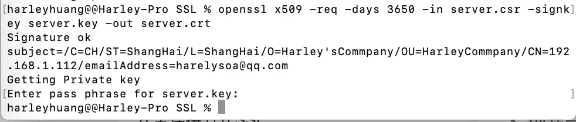

<br/>

证书查看

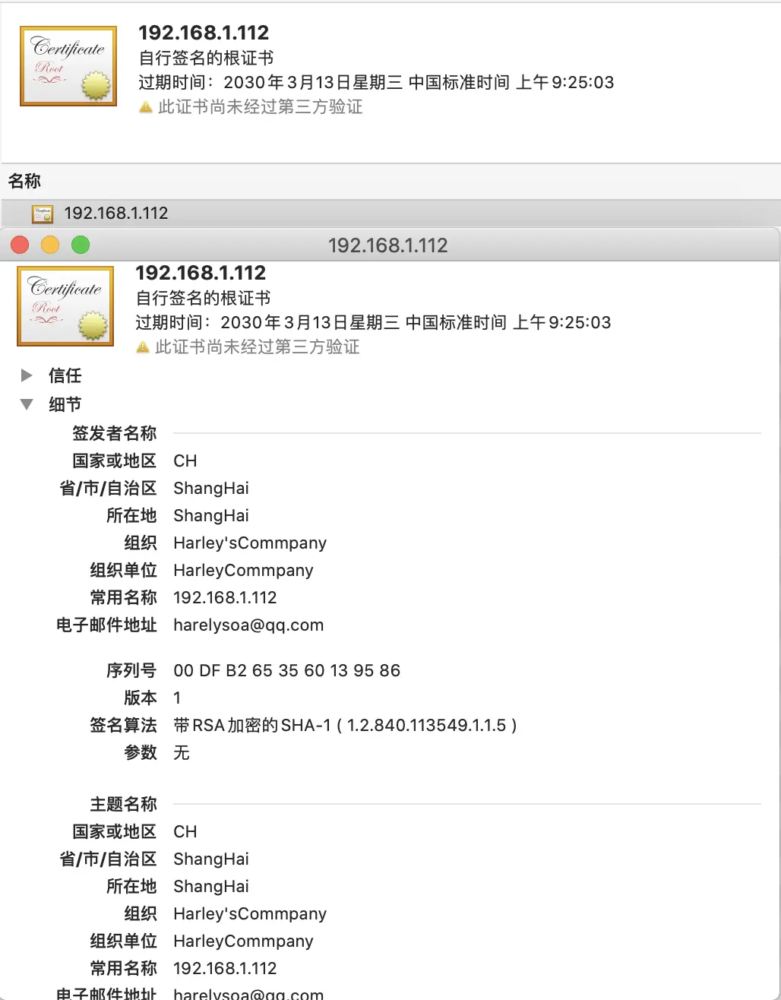


<br/>

**说明：** crt上有证书持有人的信息，持有人的公钥，以及签署者的签名等信息。当用户安装了证书之后，便意味着信任了这份证书，同时拥有了其中的公钥。证书上会说明用途，例如服务器认证，客户端认证，或者签署其他证书。当系统收到一份新的证书的时候，证书会说明，是由谁签署的。如果这个签署者确实可以签署其他证书，并且收到证书上的签名和签署者的公钥可以对上的时候，系统就自动信任新的证书。


<br/><br/>

> <h2 id='生成新的服务器证书文件server2.crt'>生成新的服务器证书文件server2.crt</h2>


```
/*
* 这个命令的作用是将一个服务器证书的 CSR 文件（server.csr）使用指定的根证书和私钥进行签名，并生成一个新的服务器证书文件（server2.crt），并设置了其有效期为2年

* openssl: OpenSSL 工具的执行命令。

* x509: 该命令告诉 OpenSSL 生成或操作 X.509 证书。

* -req: 告诉 OpenSSL 输入是一个证书签发请求（Certificate Signing Request，CSR）。

* -days 730: 设置证书的有效期限，这里是730天，即2年。

* -sha1: 指定使用 SHA-1 算法进行签名。请注意，SHA-1 已经被认为不够安全，建议使用更安全的算法如 SHA-256。

* -extensions v3_req: 指定使用名为 "v3_req" 的扩展配置文件中的扩展。这个扩展一般用于服务器证书的生成。

* -CA root.crt: 指定用于签署证书的 CA 根证书文件名。在这里，root.crt 是根证书文件。

* -CAkey root.key: 指定用于签署证书的 CA 根证书的私钥文件名。在这里，root.key 是根证书的私钥文件。

* -CAserial root.csr: 指定用于序列号文件的 CA 序列号文件名。在这里，root.csr 是根证书的序列号文件名。

* -CAcreateserial: 告诉 OpenSSL 如果序列号文件不存在，则创建一个新的序列号文件。

* -in server.csr: 指定输入的 CSR 文件，这是待签署的服务器证书请求文件。

* -out server2.crt: 指定输出的证书文件名为 server2.crt，即生成的服务器证书文件。
*/
openssl x509 -req -days 730 -sha1 -extensions v3_req -CA root.crt -CAkey root.key -CAserial root.csr -CAcreateserial -in server.csr -out server2.crt 
```

根证书生成 server2.crt:

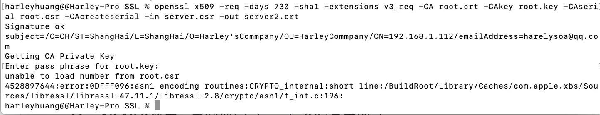


<br/><br/>

> <h2 id='安装私钥和证书'>安装私钥和证书</h2>

&emsp;  将私钥(server.key)和证书文件(server.crt)复制到Apache的配置目录下即可，在Mac 10.10系统中，复制到/etc/apache2/目录中即可。

<br/>

**第一步：客户端利用AF3.0使用自定义证书**

```
// 1.初始化单例类
 AFHTTPSessionManager *manager = [AFHTTPSessionManager manager];
manager.securityPolicy.SSLPinningMode = AFSSLPinningModeCertificate;
// 2.设置证书模式
NSString * cerPath = [[NSBundle mainBundle] pathForResource:@"xxx" ofType:@"cer"];
NSData * cerData = [NSData dataWithContentsOfFile:cerPath];
manager.securityPolicy = [AFSecurityPolicy policyWithPinningMode:AFSSLPinningModeCertificate withPinnedCertificates:[[NSSet alloc] initWithObjects:cerData, nil]];
// 客户端是否信任非法证书
mgr.securityPolicy.allowInvalidCertificates = YES;
// 是否在证书域字段中验证域名
[mgr.securityPolicy setValidatesDomainName:NO];
```


<br/>

**第二步：使用AFNetworking进行请求**

AFNetworking首先需要配置AFSecurityPolicy类，AFSecurityPolicy类封装了证书校验的过程

```
/**
 AFSecurityPolicy分三种验证模式：
 AFSSLPinningModeNone:只是验证证书是否在信任列表中
 AFSSLPinningModeCertificate：该模式会验证证书是否在信任列表中，然后再对比服务端证书和客户端证书是否一致
 AFSSLPinningModePublicKey：只验证服务端证书与客户端证书的公钥是否一致
*/
 
AFSecurityPolicy *securityPolicy = [AFSecurityPolicy policyWithPinningMode:AFSSLPinningModeCertificate];
securityPolicy.allowInvalidCertificates = YES;//是否允许使用自签名证书
securityPolicy.validatesDomainName = NO;//是否需要验证域名，默认YES

AFHTTPSessionManager *_manager = [AFHTTPSessionManager manager];
_manager.responseSerializer = [AFHTTPResponseSerializer serializer];
_manager.securityPolicy = securityPolicy;
//设置超时
[_manager.requestSerializer willChangeValueForKey:@"timeoutinterval"];
_manager.requestSerializer.timeoutInterval = 20.f;
[_manager.requestSerializer didChangeValueForKey:@"timeoutinterval"];
_manager.requestSerializer.cachePolicy = NSURLRequestReloadIgnoringCacheData;
_manager.responseSerializer.acceptableContentTypes  = [NSSet setWithObjects:@"application/xml",@"text/xml",@"text/plain",@"application/json",nil];

__weak typeof(self) weakSelf = self;
[_manager setSessionDidReceiveAuthenticationChallengeBlock:^NSURLSessionAuthChallengeDisposition(NSURLSession *session, NSURLAuthenticationChallenge *challenge, NSURLCredential *__autoreleasing *_credential) {
     
    SecTrustRef serverTrust = [[challenge protectionSpace] serverTrust];
    /**
     *  导入多张CA证书
     */
    NSString *cerPath = [[NSBundle mainBundle] pathForResource:@"ca" ofType:@"cer"];//自签名证书
    NSData* caCert = [NSData dataWithContentsOfFile:cerPath];
    NSArray *cerArray = @[caCert];
    weakSelf.manager.securityPolicy.pinnedCertificates = cerArray;
     
    SecCertificateRef caRef = SecCertificateCreateWithData(NULL, (__bridge CFDataRef)caCert);
    NSCAssert(caRef != nil, @"caRef is nil");
     
    NSArray *caArray = @[(__bridge id)(caRef)];
    NSCAssert(caArray != nil, @"caArray is nil");
     
    OSStatus status = SecTrustSetAnchorCertificates(serverTrust, (__bridge CFArrayRef)caArray);
    SecTrustSetAnchorCertificatesOnly(serverTrust,NO);
    NSCAssert(errSecSuccess == status, @"SecTrustSetAnchorCertificates failed");
     
    NSURLSessionAuthChallengeDisposition disposition = NSURLSessionAuthChallengePerformDefaultHandling;
    __autoreleasing NSURLCredential *credential = nil;
    if ([challenge.protectionSpace.authenticationMethod isEqualToString:NSURLAuthenticationMethodServerTrust]) {
        if ([weakSelf.manager.securityPolicy evaluateServerTrust:challenge.protectionSpace.serverTrust forDomain:challenge.protectionSpace.host]) {
            credential = [NSURLCredential credentialForTrust:challenge.protectionSpace.serverTrust];
            if (credential) {
                disposition = NSURLSessionAuthChallengeUseCredential;
            } else {
                disposition = NSURLSessionAuthChallengePerformDefaultHandling;
            }
        } else {
            disposition = NSURLSessionAuthChallengeCancelAuthenticationChallenge;
        }
    } else {
        disposition = NSURLSessionAuthChallengePerformDefaultHandling;
    }
     
    return disposition;
}];

```

上述代码通过给AFHTTPSessionManager重新设置证书验证回调来自己验证证书，然后将自己的证书加入到可信任的证书列表中，即可通过证书的校验。


<br/>

***
<br/><br/>

> <h1 id='客户端创建加密证书文件'>客户端创建加密证书文件</h1>


- **创建客户端证书密钥文件client.key**

```
openssl genrsa -des3 -out client.key 2048
```

<br/><br/>

-  **创建客户端证书的申请文件client.csr**

```
openssl req -new -key client.key -out client.csr
```

<br/><br/>

-  **创建一个自当前日期起有效期为两年的客户端证书client2.crt**

```
openssl x509 -req -days 730 -sha1 -extensions v3_req -CA server.crt -CAkey server.key -CAserial server.csr -CAcreateserial -in client.csr -out client2.crt
```

客户端证书client2.crt 生成:

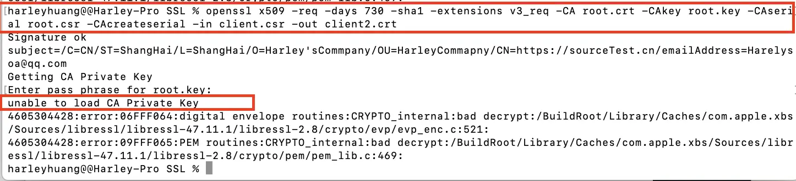

发现它`unable to load CA Private Key`

<br/><br/>

-  **将客户端证书文件client.crt和客户端证书密钥文件client.key合并成客户端证书安装包client.pfx**

```
openssl pkcs12 -export -in client2.crt -inkey client.key -out client.pfx
```

<br/><br/>

-  保存生成的文件备用，其中server.crt和server.key是配置单向SSL时需要使用的证书文件，client.crt是配置双向SSL时需要使用的证书文件，client.pfx是配置双向SSL时需要客户端安装的证书文件

<br/><br/>

-  .crt文件和.key可以合到一个文件里面，把2个文件合成了一个.pem文件（直接拷贝过去就行了）


<br/>

***
<br/><br/>


