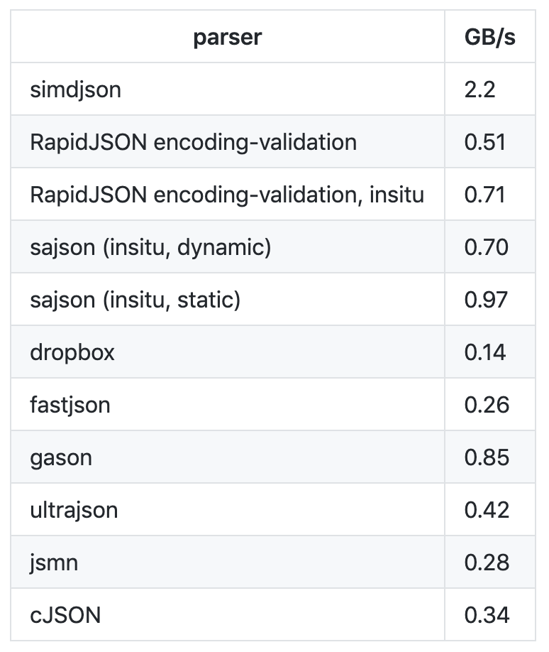

> <h2 id=""></h2>

- [**提高JSON解析性能**](#提高JSON解析性能)
	- [如何解析JSON](#如何解析JSON)
	- [提高JSON解析性能](#提高JSON解析性能)
- [字典转Json](#字典转Json)
- [NSData转字典](#NSData转字典)


<br/>
<br/>

***
<br/>


> <h1 id="提高JSON解析性能">提高JSON解析性能</h1>

<br/>

> <h2 id="JSON来源">JSON来源</h2>

&emsp; JSON是 JavaScript Object Notation 的缩写。其实，JSON 最初是被设计为 JavaScript 语言的一个子集，但最终因为和编程语言无关，所以成为了一种开放标准的常见数据格式。


&emsp; 虽然 JSON 源于 JavaScript，但到目前很多编程语言都有了 JSON 解析的库，包括 C、C++、Java、Perl、Python 等等。除此之外，还有很多编程语言内置了 JSON 生成和解析的方法，比如 PHP 在 5.2 版本开始内置了 json_encode() 方法，可以将 PHP 里的 Array 直接转化成 JSON。

<br/>


**JSON 基于两种结构：**
- 名字 / 值对集合：这种结构在其他编程语言里被实现为对象、字典、Hash 表、结构体或者关联数组。
- 有序值列表：这种结构在其他编程语言里被实现为数组、向量、列表或序列。


<br/>
<br/>

> <h2 id="如何解析JSON">如何解析 JSON</h2>

JSONDecoder解析JSON,JSONDecoder 的代码，你可以在 Swift 的官方 GitHub 上查看。

解析 JSON 的入口， 是通过JSONDecoder 的 decode 方法。下面是 decode 方法的定义代码：

```
open func decode<T : Decodable>(_ type: T.Type, from data: Data) throws -> T {
    let topLevel: Any
    do {
       topLevel = try JSONSerialization.jsonObject(with: data)
    } catch {
        throw DecodingError.dataCorrupted(DecodingError.Context(codingPath: [], debugDescription: "The given data was not valid JSON.", underlyingError: error))
    }
    // JSONDecoder 的初始化
    let decoder = __JSONDecoder(referencing: topLevel, options: self.options)
    // 从顶层开始解析 JSON
    guard let value = try decoder.unbox(topLevel, as: type) else {
        throw DecodingError.valueNotFound(type, DecodingError.Context(codingPath: [], debugDescription: "The given data did not contain a top-level value."))
    }
    return value
}
```


&emsp; 上面 decode 方法入参 T.type 的 T 是一个泛型，具体到解析 H5 页面编辑器生成的 JSON 的例子，就是 H5Editor 结构体；入参 data 就是 JSON 字符串转成的 Data 数据。


&emsp; decode 方法在解析完后会将解析到的数据保存到传入的结构体中，然后返回。在 decode 方法里可以看到，对于传入的 Data 数据会首先通过 JSONSerialization 方法转化成 topLevel 原生对象，然后 topLevel 原生对象通过 JSONDecoder 初始化成一个 JSONDecoder 对象，最后使用 JSONDecoder 的 unbox 方法将数据和传入的结构体对应上，并保存在结构体里进行返回。

&emsp; 可以看出，目前 JSONSerialization 已经能够很好地解析 JSON，JSONDecoder 将其包装以后，通过 unbox 方法使得 JSON 解析后能很方便地匹配 JSON 数据结构和 Swift 原生结构体。


&emsp; 试想一下，如果要将 JSON 应用到更大的场景时，比如对编程语言的描述或者界面布局的描述，其生成的 JSON 文件可能会很大，并且对这种大 JSON 文件解析性能的要求也会更高。那么，有比 JSONSerialization 性能更好的解析 JSON 的方法吗？


<br/>
<br/>

> <h2 id="提高JSON解析性能">提高JSON解析性能</h2>

&emsp; 2019 年 2 月，Geoff Langdale 和 Daniel Lemire 发布了 simdjson。 simdjson 是一款他们研究了很久的快速 JSON 解析器， 号称每秒可解析千兆字节 JSON 文件。simdjson 和其他 JSON 解析器对比如下图所示：




&emsp; 可以看出，只有 simdjson 能够达到每秒千兆字节级别，并且远远高于其他 JSON 解析器。那么 ，simdjson 是怎么做到的呢？

- **第一个阶段，**使用 simdjson 去发现需要 JSON 里重要的字符集，比如大括号、中括号、逗号、冒号等，还有类似 true、false、null、数字这样的原子字符集。第一个阶段是没有分支处理的，这个阶段与词法分析非常类似。
- **第二个阶段，**simdjson 也没有做分支处理，而是采用的堆栈结构，嵌套关系使用 goto 的方式进行导航。simdjson 通过索引可以处理所有输入的 JSON 内容而无需使用分支，这都归功于聪明的条件移动操作，使得遍历过程变得高效了很多。


通过 simdjson 解析 JSON 的两个阶段可以看出，simdjson 的主要思路是尽可能地以最高效的方式将 JSON 这种可读性高的数据格式转换为计算机能更快理解的数据格式。


为了达到快速解析的目的， simdjson 在第一个阶段一次性使用了 64 字节输入进行大规模的数据操作，检查字符和字符类时以及当获得掩码应用变换时以 64 位进行位操作。这种方式，对于大的 JSON 数据解析性能提升是非常明显的。

如果你想更详细地了解这两个阶段的解析思路，可以查看这篇论文“Parsing Gigabytes of JSON per Second”。其实，simdjson 就是对这篇论文的实现，你可以在GitHub上查看具体的实现代码。在我看来，一边看论文，一边看对应的代码实现，不失为一种高效的学习方式。


而如果你想要在工程中使用 simdjson 的话，直接使用它提供的一个简单接口即可。具体的使用代码如下：

```
#include "simdjson/jsonparser.h"
/...
const char * filename = ... // JSON 文件
std::string_view p = get_corpus(filename);
ParsedJson pj = build_parsed_json(p); // 解析方法
// you no longer need p at this point, can do aligned_free((void*)p.data())
if( ! pj.isValid() ) {
    // 出错处理
}
aligned_free((void*)p.data());

```


<br/>
<br/>

***
<br/>


> <h1 id=""></h1>


<br/>

> <h2 id=""></h2>


<br/>
<br/>

***
<br/>


> <h1 id=""></h1>


<br/>

> <h2 id="字典转Json">字典转Json</h2>

```
NSDictionary *muDic = @{@"token": @"123456789", @"name": @"harely"};

NSData *data = [NSJSONSerialization dataWithJSONObject:[muDic copy] options:kNilOptions error:nil];
NSString *jsonS = [[NSString alloc] initWithData:data encoding:NSUTF8StringEncoding];

NSDictionary * aa = [NSDictionary dictionaryWithObject:[ViewController encrypt:jsonS] forKey:@"p"] ;

NSLog(@"------>> aa: %@", aa);
```


<br/>

- **代码解析**

&emsp; NSJSONSerialization提供了将JSON数据转换为Foundation对象（一般都是NSDictionary和NSArray）和Foundation对象转换为JSON数据（可以通过调用isValidJSONObject来判断Foundation对象是否可以转换为JSON数据）

NSJSONWritingOptions 包含2种参数：
- NSJSONWritingPrettyPrinted:将生成的json数据格式化输出，这样可读性高，不设置则输出的json字符串
- NSJSONWritingSortedKeys :输出的json字符串就是一整行


打印结果为：

```
po muDic
{
    name = harely;
    token = 123456789;
}

 po data
<7b22746f 6b656e22 3a223132 33343536 37383922 2c226e61 6d65223a 22686172 656c7922 7d>

(lldb) po jsonS
{"token":"123456789","name":"harely"}

2018-08-07 14:15:01.420066+0800 Test[4446:381421] ------>> aa: {
    p = "bGtuenV4Y3dlRw56eymV@@ApaMqJEWD$$fQMMHR2KNZL0od7CADmKNK6h4hGg9OhzI";
}
```


<br/>
<br/>


> <h2 id="NSData转字典">NSData转字典</h2>

**JSON数据(NSData)转化为Foundation对象(Object):**

```
+ (id)JSONObjectWithData:(NSData *)data options:(NSJSONReadingOptions)opt error:(NSError **)error;
```

<br/>

```
/*
  NSJSONReadingMutableContainers
  NSJSONReadingMutableLeaves
  NSJSONReadingAllowFragments
 不在乎返回的是什么东西，就用kNilOptions，效率最好
 */

NSData *data = [NSData new];
//解析返回的JSON
NSDictionary *dict = [NSJSONSerialization JSONObjectWithData:data options:kNilOptions error:nil];
        
NSLog(@"%@", dict[@"error"]);
```

<br/>

