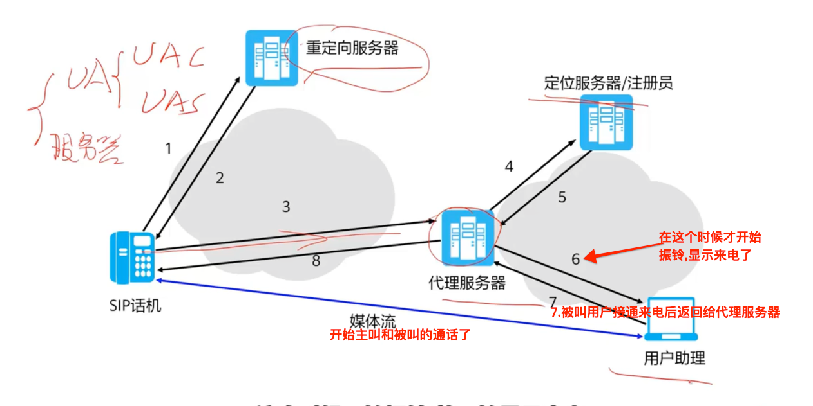
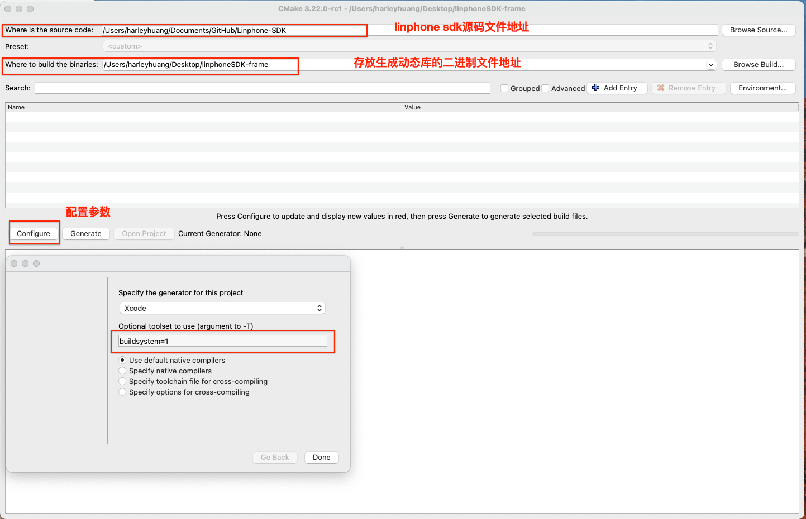
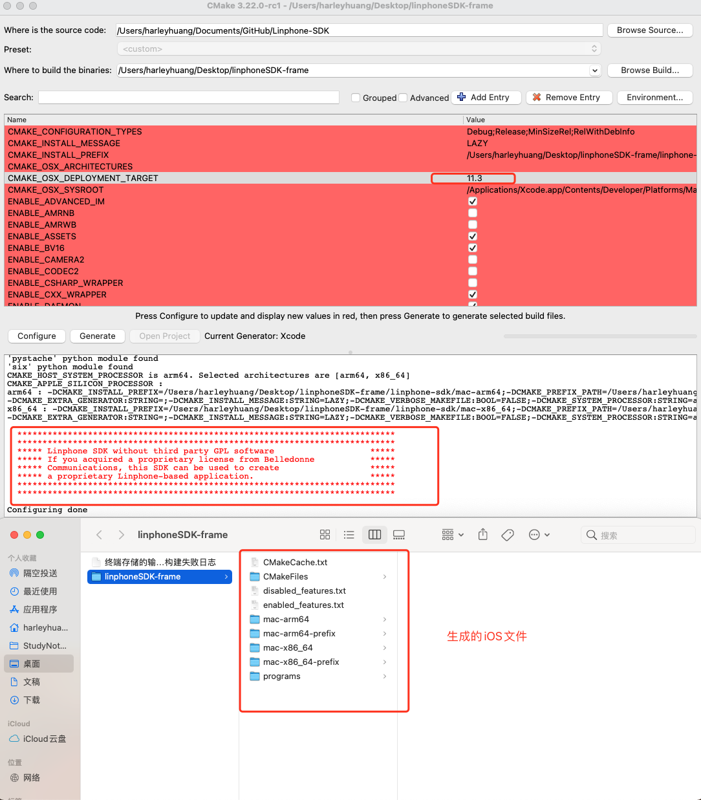

><h2 id=''></h2>
- [**概念**](#概念)
	- [IP话机](#IP话机)
	- [SIP协议](#SIP协议)
		- [IP电话协议族分类](#IP电话协议族分类)
		- [SIP协议功能](#SIP协议功能)
		- [SIP网络构成](#SIP网络构成)
		- [SIP协议采用的地址](#SIP协议采用的地址)
		- [SIP消息的功能类型](#SIP消息的功能类型)
		- [SIP消息的结构和重要头域](#SIP消息的结构和重要头域)
		- [SIP消息流程](#SIP消息流程)
- [**Linphone官方API文档**](https://www.linphone.org/technical-corner/liblinphone)
	- [资料](#资料)
	- [linphoneSDK打包](#linphoneSDK打包)
- [**知识点**](#知识点)
- [**语法**](#语法)
	- [输出<<](#输出<<)
	- [void指针(void*)](https://blog.csdn.net/qq_39583450/article/details/109715890)
- [**参考资料**]()
	- [Linphone使用说明](https://www.mptablet.com/post/12045.html)
	- [Linphone SDK编译说明](https://gitlab.linphone.org/BC/public/linphone-sdk/blob/master/README.md)
	- [Linphone API Documentation](https://download.linphone.org/releases/docs/liblinphone/4.5/cs/api/Linphone.html)
	- [Linphone C++ API文档](https://download.linphone.org/releases/docs/liblinphone/5.1/c++/annotated.html)
	- [从零开始搭建音视频通话服务](https://juejin.cn/post/7054576051539673101/)
	- [Linphone资料](https://cxybb.com/searchArticle)
	- [SIP消息格式](https://www.dsliu.com/wenti/5084.html)
	- [SIP状态码](https://www.renrendoc.com/paper/183026178.html)
	- [SIP技术介绍](http://www.h3c.com/cn/d_200805/605897_30003_0.htm)


<br/>

***
<br/>


><h1 id='概念'>概念</h1>


<br/>

> <h2 id='IP话机'>IP话机</h2>

&emsp; IP电话机是以IP网络协议为主要通信协议，以网口（或WIFI）为主要接口，具备拨号、通话功能的独立电话设备，通常需要配合IPPBX电话交换机使用或者配合IMS使用。IP话机常用的通信协议有SIP， IMS， MGCP, SCCP等，其中SIP较为常用,也被称作VoIP。


<br/>
<br/>

> <h2 id='SIP协议'>SIP协议</h2>

> <h3 id='IP电话协议族分类'>IP电话协议族分类</h3>


IP电话协议族分类图:


<br/>

SIP和H.323协议比较:


<br/>
<br/>

> <h3 id='SIP协议功能'>SIP协议功能</h3>

SIP协议功能:


<br/>
<br/>

> <h3 id='SIP网络构成'>SIP网络构成</h3>

SIP网络构成:


- **Use Agets:**
	- 用户代理,是一个软终端或者是一个支持SIP协议	的电话;
	- UA:对接收到的行为进行代理,发送到SIP网络中;
	- 一个发起和终止会话的实体,包含2个功能实体:
		- User Agent Clients(UAC)-发起SIP事务请求的功能实体
		
		
	- User Agent Server(UAS)-接收SIP事务请求的功能实体
	
		
		
		这个相应的动作指的是比如:电话振铃、网页上显示有新呼叫.
		
		
		
		

<br/>

- **Proxy Server - 代理服务器**
	- 对收到的请求消息进行翻译和处理后,传递给其他的服务器;
	- 为其他的客户代理,进行SIP消息的转接和转发的功能;
	- 对SIP请求及响应进行路由;


<br/>

- **Location Server -位置服务器**
	- 是一个数据库,用于存放终端用户当前的位置信息,为SIP重定向服务器或代理服务器提供被叫用户可能的位置信息


<br/>

- **Redirect Server - 重定向服务器**
	- 将用户新的位置返回给呼叫方,呼叫方可根据得到的新位置重新呼叫;
	- Redirect Server只是对请求消息进行响应,不产生请求消息


<br/>

- **Registrar Server - 登记服务器**
	- 接受REGISTER 请求完成用户地址的注册
	- 可以支持鉴权的功能


<br/>

**通信流程:**



<br/>
<br/>

> <h3 id='SIP协议采用的地址'>SIP协议采用的地址</h3>


<br/>
<br/>

> <h3 id='SIP消息的功能类型'>SIP消息的功能类型</h3>


<br/>

消息请求回应状态码:


<br/>

扩展请求消息:


<br/>
<br/>

> <h3 id='SIP消息的结构和重要头域'>SIP消息的结构和重要头域</h3>


<br/>
<br/>

> <h3 id='SIP消息流程'>SIP消息流程</h3>


<br/>
<br/>

> <h3 id=''></h3>


<br/>
<br/>

> <h3 id=''></h3>


<br/>
<br/>

> <h3 id=''></h3>


<br/>
<br/>

> <h2 id=''></h2>


<br/>
<br/>

> <h2 id=''></h2>


<br/>
<br/>

> <h2 id=''></h2>


<br/>
<br/>

***
<br/>

><h1 id='Linphone官方API文档'>Linphone官方API文档</h1>

<br/>

><h2 id='资料'>资料</h2>

[linphone-iphone的代码](https://github.com/BelledonneCommunications/linphone-iphone)

[Linphone iOS 编译](https://www.jianshu.com/p/ec5cfb72c9e7)

[Linphone集成到自己的iOS项目](https://string.quest/read/10861716)


<br/>
<br/>
<br/>


><h2 id='linphoneSDK打包'>[linphoneSDK](https://github.com/BelledonneCommunications/linphone-sdk?from_wecom=1)打包</h2>

**1.检查某个库是不是动或静态库**

```
cd xx.framwork
ls
file xx
```


<br/>

- **2.下载依赖库**

```
// 下载Cmake
// 检查是否安装成功,查看版本
$ cmake -version
cmake version 3.23.2

CMake suite maintained and supported by Kitware (kitware.com/cmake).


//下载python
//目前python基于arm架构的M系列最低版本是3.8.5
$  arch -arm64 brew install python@3.9

//安装完成提示,这个是软链接地址
Python has been installed as
  /opt/homebrew/bin/python3.9
  
//查看真实地址
realpath /opt/homebrew/bin/python3.9
/opt/homebrew/Cellar/python@3.9/3.9.15/Frameworks/Python.framework/Versions/3.9/bin/python3.9

//根据安装好的提示配置pyton环境
$ open .bash_profile

//在 .bash_profile 写入如下:
# Python环境配置
alias python=/opt/homebrew/Cellar/python@3.9/3.9.15/Frameworks/Python.framework/Versions/3.9/bin/python3.9
export PythonHome=/opt/homebrew/Cellar/python@3.9/3.9.15/Frameworks/Python.framework/Versions/3.9
export PATH=$PATH:$PythonHome/bin
# Python End

$ source .bash_profile

// 到这里并没有结束,因为若是只对上述进行配置,则在camke图形工具是没有办法进行使用的
// 这是因为需要每次使用 source .bash_profile,可以进行如下操作:
$ vim ~/.zshrc

// 写入配置
export PATH="/opt/homebrew/opt/python@3.8/bin:$PATH"
alias python="/opt/homebrew/opt/python@3.8/bin/python3.8"
export LDFLAGS="-L/opt/homebrew/opt/python@3.8/lib"
export PKG_CONFIG_PATH="/opt/homebrew/opt/python@3.8/lib/pkgconfig"

// 到此python才算配置完成
$ source ~/.bash_profile


// 检查是否安装成功,查看版本
$ python -V
$ which python
python: aliased to /opt/homebrew/Cellar/python@3.9/3.9.15/Frameworks/Python.framework/Versions/3.9/bin/python3.9
```


```
// 检查是否安装成功,查看版本
pip3 --version            

// M1 arm64 下载yasm 
arch -arm64 brew install yasm  
//检查版本
yasm --version  

// M1 arm64 下载nasm
arch -arm64 brew install nasm 
```

<br/>

[doxygen介绍](https://developer.aliyun.com/article/351968)

```
//M1 arm64 下载 doxygen
arch -arm64 brew install doxygen
```

<br/>

**安装pystache**

```
pip3 install pystache
```


<br/>

**安装 six**

```
pip3 install six
```

<br/>

**安装ninja,提高构建速度**

```
arch -arm64 brew install cmake ninja
```


<br/>
<br/>

- **3.下载[linphone-sdk](https://github.com/BelledonneCommunications/linphone-sdk?from_wecom=1)代码**

**3.1 克隆linphone-sdk仓库**

```
% git clone https://github.com/BelledonneCommunications/linphone-sdk.git /Users/harleyhuang/Documents/GitHub/Linphone-SDK
```

<br/>

**3.2下载子模块代码,有2.7GB**

```
 git submodule update --init --recursive
```

以后切换更新分支,都要用到上面的命令,需要注意了!

<br/>
<br/>

**4.1新建一个文件夹LinphoneFramework并打包**

```
cd /Users/harleyhuang/Documents/GitHub/LinphoneFramework

mkdir build && cd build


// 虽然使用Ninja也可以,但是出错了,其命令如下:
cmake /Users/harleyhuang/Documents/GitHub/Linphone-SDK -G Ninja -DLINPHONESDK_PLATFORM=IOS

// Ninja出错了,故使用xcode进行构建  /Users/harleyhuang/Documents/GitHub/Linphone-SDK linphone的SDK源码
cmake /Users/harleyhuang/Documents/GitHub/Linphone-SDK -G Xcode -DLINPHONESDK_PLATFORM=IOS


// 构建Release版本
cmake --build . --config Release
```

[**linphone-sdk-iOS动态库**](https://download.linphone.org/snapshots/ios/)


<br/>
<br/>

**4.2Cmake图形工具打包**



打包完成后的iOS平台库如下:




	


<br/>
<br/>

***
<br/>

><h1 id='知识点'>知识点</h1>
- [X3DH加密协议](https://www.aechina.io/wiki/1422.html)


<br/>

***
<br/>

><h1 id='语法'>语法</h1>

<br/>

><h2 id='输出<<'>输出<<</h2>

C++引入了`ostringstream、istringstream、stringstream`这三个类，要使用他们创建对象就必须包含<sstream>头文件:
- istringstream类用于执行C++风格的串流的输入操作。  
- ostringstream类用于执行C风格的串流的输出操作。  
- strstream类同时可以支持C风格的串流的输入输出操作。 

```
#include <sstream>

int main(int argc, char* argv[])
{
	std::ostringstream ostr;
	ostr << "string:"<< "str_test"
		 << " int:" << 123
		 << " char:" << 'a'
		 << " bool:" << true;

	std::string s = ostr.str();

	printf("%s\n", s.c_str());

	return 0;
}
```

运行输出:

```
string:str_test int:123 char:a bool:1
```

