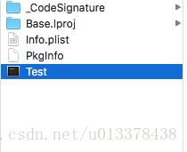
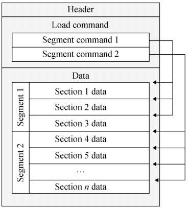
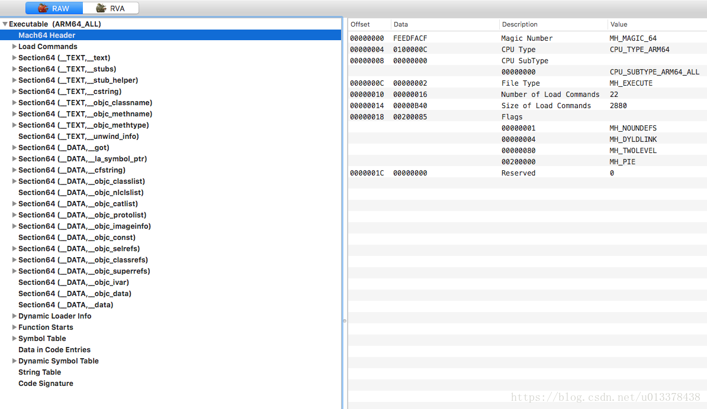
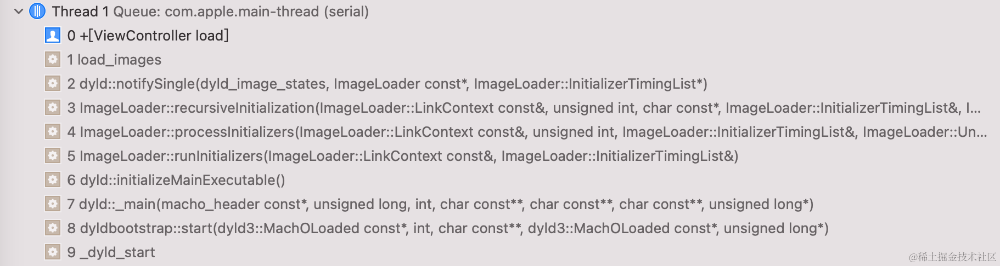

> <h2 id=''></h2>
- [**Mach-O**](#Mach-O)
- [**‌文件结构**](#文件结构)
	- [header](#header)
	- [查看Mach-o命令](#查看Mach-o命令)
- [**App加载流程**](#App加载流程)
	- [程序加载的原理](#程序加载的原理)
	- [App的加载流程](#App的加载流程)
	- [动态加载器](#动态加载器)
		- [dyld是什么](#dyld是什么)
		- [加载程序的过程](#加载程序的过程)
		- [dyld的工作是什么](#dyld的工作是什么)
		- [iOS的动态加载器什么时候调用?](#iOS的动态加载器什么时候调用)
- **资料**
	- Objective-C runtime机制(前传)——Mach-O格式[](https://blog.csdn.net/u013378438/article/details/80353267?spm=1001.2014.3001.5502)
	- runtime机制(前传2)——Mach-O格式和runtime [](https://blog.csdn.net/u013378438/article/details/80431465?spm=1001.2014.3001.5502)


<br/>

***
<br/><br/>

> <h1 id='Mach-O'>Mach-O</h1>

&emsp; Mach-O是Mach Object文件格式的缩写。它是用于可执行文件，动态库，目标代码的文件格式。作为a.out格式的替代，Mach-O格式提供了更强的扩展性，以及更快的符号表信息访问速度。


&emsp; Mach-O格式为大部分基于Mach内核的操作系统所使用的，包括NeXTSTEP, Mac OS X和iOS，它们都以Mach-O格式作为其可执行文件，动态库，目标代码的文件格式。


&emsp; 具体到我们的iOS程序，当用XCode打包后，会生成一个.app为扩展名的文件（位于工程目录/Products文件夹下），其实.app是一个文件夹，我们用鼠标右键选择‘Show Package contents’，就可以查看文件夹的内容，其中会发现有一个和我们工程同名的unix 可执行文件，这个就是iOS可执行文件，它是符合Mach-O格式的。





<br/>

***
<br/><br/>


> <h1 id='文件结构'>文件结构</h1>

<br/>


&emsp; **Mach-O 文件格式是 iOS 和 macOS 使用的一套可执行文件的文件格式**，类似于Windows 平台上使用的 PE 文件格式，以及 Linux 平台上使用的 ELF 文件格式。

<br/>




**Mach-O 文件主要构成:**
-  header（头部）:对Mach-O文件的一个概要说明，包括Magic Number, 支持的CUP类型等;

<br/>

-  Load command（加载命令）:当系统加载Mach-O文件时，load command会指导苹果的动态加载器(dyld)h或内核，该如何加载文件的Data数据;


<br/>


-  Data 三部分组成:Mach-O文件的数据区，包含代码和数据。其中包含若干Segment块（注意，除了Segment块之外，还有别的内容，包括code signature，符号表之类，不要被苹果的图所误导！），每个Segment块中包含0个或多个seciton。Segment根据对应的load command被dyld加载入内存中。
	-  其中 Data 包含多个 Segment（段），Segment 包含多个Section（节区）.


<br/>
<br/>


&emsp; 查看Mach-O文件,可以使用MachOView软件.不同的CPU架构对应不同的Mach-O文件,比如同时支持 ARMv7 和 ARM64.可以将这2个不同的架构的Mach-O文件进行合并称为fat文件.


<br/><br/>

> <h2 id='header'>header</h2>


一个普通的iOS APP为例，使用MachOView看看Mach-O文件header部分的具体内容。通过MachOView打开可执行文件，可以看到header的结构：



是不是有些懵？下面我们就结合Darwin内核源码，来了解下Mach header的定义。

Mach header的定义位于Darwin源码中的 EXTERNAL_HEADERS/mach-o/loader.h 中：

**32位:**

```
struct mach_header {
	uint32_t	magic;		/* mach magic number identifier */
	cpu_type_t	cputype;	/* cpu specifier */
	cpu_subtype_t	cpusubtype;	/* machine specifier */
	uint32_t	filetype;	/* type of file */
	uint32_t	ncmds;		/* number of load commands */
	uint32_t	sizeofcmds;	/* the size of all the load commands */
	uint32_t	flags;		/* flags */
};
```

<br/>

**64位:**

```
struct mach_header_64 {
	uint32_t	magic;		/* mach magic number identifier */
	cpu_type_t	cputype;	/* cpu specifier */
	cpu_subtype_t	cpusubtype;	/* machine specifier */
	uint32_t	filetype;	/* type of file */
	uint32_t	ncmds;		/* number of load commands */
	uint32_t	sizeofcmds;	/* the size of all the load commands */
	uint32_t	flags;		/* flags */
	uint32_t	reserved;	/* reserved */
};
```

可以看到，32位和64位的Mach header基本相同，只不过64位header中多了一个保留参数reserved。


<br/>

- **magic：** 魔数，用来标识这是一个Mach-O文件，有32位和64位两个版本：

```
#define	MH_MAGIC	0xfeedface	/* the mach magic number */
#define MH_MAGIC_64 0xfeedfacf /* the 64-bit mach magic number */
```


- **cputype：** 支持的CUP架构类型，如arm。

<br/>


- **cpusubtype：** 在支持的CUP架构类型下，所支持的具体机器型号。在我们的例子中，APP是支持所有arm64的机型的:CUP_SUBTYPE_ARM64_ALL

<br/>

- **filetype:** Mach-O的文件类型。包括：

```
#define	MH_OBJECT	0x1		/* Target 文件：编译器对源码编译后得到的中间结果 */
#define	MH_EXECUTE	0x2		/* 可执行二进制文件 */
#define	MH_FVMLIB	0x3		/* VM 共享库文件（还不清楚是什么东西） */
#define	MH_CORE		0x4		/* Core 文件，一般在 App Crash 产生 */
#define	MH_PRELOAD	0x5		/* preloaded executable file */
#define	MH_DYLIB	0x6		/* 动态库 */
#define	MH_DYLINKER	0x7		/* 动态连接器 /usr/lib/dyld */
#define	MH_BUNDLE	0x8		/* 非独立的二进制文件，往往通过 gcc-bundle 生成 */
#define	MH_DYLIB_STUB	0x9		/* 静态链接文件（还不清楚是什么东西） */
#define	MH_DSYM		0xa		/* 符号文件以及调试信息，在解析堆栈符号中常用 */
#define	MH_KEXT_BUNDLE	0xb		/* x86_64 内核扩展 */
```


<br/>

- **ncmds：**load command的数量

<br/>


- **sizeofcmds:** 所有load command的大小

<br/>

- **flags：** Mach-O文件的标志位。主要作用是告诉系统该如何加载这个Mach-O文件以及该文件的一些特性。有很多值，我们取常见的几种：

```
#define	MH_NOUNDEFS	0x1		/* Target 文件中没有带未定义的符号，常为静态二进制文件 */
#define MH_SPLIT_SEGS	0x20  /* Target 文件中的只读 Segment 和可读写 Segment 分开  */
#define MH_TWOLEVEL	0x80		/* 该 Image 使用二级命名空间(two name space binding)绑定方案 */
#define MH_FORCE_FLAT	0x100 /* 使用扁平命名空间(flat name space binding)绑定（与 MH_TWOLEVEL 互斥） */
#define MH_WEAK_DEFINES	0x8000 /* 二进制文件使用了弱符号 */
#define MH_BINDS_TO_WEAK 0x10000 /* 二进制文件链接了弱符号 */
#define MH_ALLOW_STACK_EXECUTION 0x20000/* 允许 Stack 可执行 */
#define	MH_PIE 0x200000  /* 加载程序在随机的地址空间，只在 MH_EXECUTE中使用 */
#define MH_NO_HEAP_EXECUTION 0x1000000 /* 将 Heap 标记为不可执行，可防止 heap spray 攻击 */
```


<br/><br/><br/>

> <h2 id='查看Mach-o命令'>查看Mach-o命令</h2>


> fat文件


查看fat文件,我们可以使用Xcode自带的otool工具

- 查看fat文件的头部:

```
$ otool -f /usr/bin/file
```


<br/>

- 查看Mach文件的头部:

```
$ otool -h /usr/bin/file
```


<br/>

- 查看Load Command信息:


```
$ otool -l /usr/bin/file
```


<br/>

***
<br/>

> <h1 id='App加载流程'>App加载流程</h1>

<br/><br/>

> <h2 id='程序加载的原理'>程序加载的原理</h2>


&emsp; 系统内核将可执行文件从磁盘中加载到内存中，内存中的二进制文件，我们称之为image镜像文件。之后，系统会加载动态链接器dyld。dyld只会负责动态库的加载，主程序也会作为镜像形式被dyld管理起来。

&emsp; dyld从可执行文件的依赖开始，递归加载所有以来的动态库。无论是动态链还是APP本身的可执行文件，它们都是image镜像，而每个APP都是以image为单位进行加载的。


<br/><br/><br/>


> <h2 id='App的加载流程'>App的加载流程</h2>


**App的加载流程:**

- 首先iOS会使用动态加载器调用相应的方法把Mach-O文件加载如内存;


<br/>

- Mach-O文件里面的格式为:
	- Header
	- Load Command
	- Data

<br/>

- 动态加载器把Mach-O文件加载入内存后,会读取它的Header信息,然后再读取加载命令(Load Command),然后加载Data里的分段(Segment)信息;


<br/>

- 然后对分段里面包含的类进行初始化,然后最后调用main函数;


<br/><br/>


> <h2 id='动态加载器'>动态加载器</h2>


<br/><br/>

> <h2 id='dyld是什么'>dyld是什么</h2>

- dyld：动态链接器，加载所有的库和可执行文件
- libdyld.dylib：给我们的程序提供在Runtime期间能使用动态连接功能


<br/><br/>

> <h2 id='加载程序的过程'>加载程序的过程</h2>

- 调用fork函数，创建一个process（进程）调用execve或其衍生函数，在该进程上加载，执行我们的Mach-O文件
- 将文件加载到内存
- 开始分析Mach-O中的mach_header，以确认它时有效的Mach-O文件
- 验证通过，根据mach_header解析load commands。根据解析结果，将程序各个部分加载到指定的地址空间，同时设置保护标记
- 从LC_LOAD_DYLINKEN中加载dyld
- dyld开始工作


<br/><br/>

> <h2 id='dyld的工作是什么'>dyld的工作是什么</h2>


- 执行自身初始化配置加载环境LC_DYLD_INFO_ONLY
- 加载当前程序链接的所有动态库到指定的内存中LC_LOAD_DYLIB
- 搜索所有的动态库，绑定需要在调用程序之前用的符号（非懒加载符号）LC_DYSYMTAB
- 在间接符号表（indirect symbol table）中，将需要绑定的导入符号真是地址替换LC_DYSYMTAB
- 向程序提供在Runtime时使用dyld的接口函数（存在libdyld.dylib中，由LC_LOAD_DYLIB提供）
- 配置Runtime，执行所有动态库。image中使用的全局构造函数
- dyld调用程序入口函数，开始执行程序LC_MAIN


<br/><br/><br/>

> <h2 id='iOS的动态加载器什么时候调用'>iOS的动态加载器什么时候调用</h2>

- **load方法 -> C++构造函数 -> main函数**

&emsp; main函数为程序入口，但load方法和C++构造函数的执行时机比main函数更早，它们时被谁调用的？ 在load方法中设置断点，查看函数调用栈

可以发现应用启动时的初始方法，由dyld中的_dyld_start开始的。





<br/><br/>

**疑问:** iOS的动态加载器什么时候调用? 这个_dyld_start方法有什么用?


<br/>


&emsp; iOS中的动态加载器（dyld，Dynamic Linker）**在应用程序启动时被调用**，它负责处理可执行文件和动态共享库（dylib）的加载、链接和初始化。


&emsp; 在iOS中，_dyld_start方法是动态加载器（dyld，Dynamic Link Editor）的入口点，dyld在应用程序启动时被系统内核加载。_dyld_start方法的主要作用是初始化动态加载器并开始加载应用程序的可执行文件及其依赖的动态共享库（dylib）。

**具体而言，_dyld_start方法执行以下一些关键任务：**

- 动态库加载： _dyld_start负责加载应用程序的可执行文件以及依赖的动态共享库。它会解析可执行文件和共享库，将它们映射到内存中，并解析它们之间的符号依赖关系。

- 符号解析： 在加载可执行文件和动态库时，需要解析它们之间的符号引用。_dyld_start会负责符号解析，确保每个符号都正确地链接到相应的地址。

- 初始化： _dyld_start会执行一些必要的初始化步骤，以确保应用程序在运行时能够正常工作。这可能包括设置全局变量、初始化动态链接器的内部数据结构等。

- 调用main函数： 一旦加载和初始化完成，_dyld_start最终会调用应用程序的main函数，从而启动应用程序的主逻辑。

&emsp; 总体而言，_dyld_start方法在iOS中扮演着启动动态加载过程和初始化应用程序环境的关键角色。这个过程是操作系统启动应用程序时的一部分，为应用程序的正常执行提供了必要的基础。


<br/>

***
<br/>

> <h2 id=''></h2>

<br/>


<br/>

***
<br/>

> <h2 id=''></h2>

<br/>


<br/>

***
<br/>

> <h2 id=''></h2>

<br/>

<br/>

***
<br/>

> <h2 id=''></h2>

<br/>