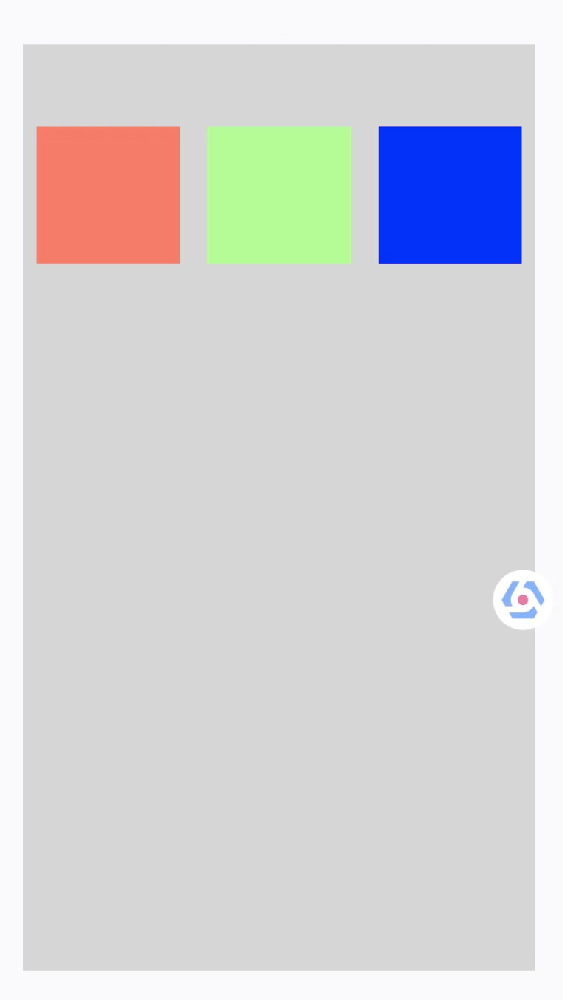

> <h2 id=''></h2>
- [**重点**](#重点)
	- [mas_equalTo和equalTo区别](#mas_equalTo和equalTo区别)
	- [更新视图布局方法](#更新视图布局方法)
	- [视图居中显示](#视图居中显示)
	- [两个视图等宽高边距](#两个视图等宽高边距)
	- [键盘弹出和收回](#键盘弹出和收回)
	- [三控件等宽间距](#三控件等宽间距)
	- [父视图的高度,是里面俩控件高度的和](#父视图的高度,是里面俩控件高度的和)
- [**中心**](#中心)
- [**‌比例multipliedBy**](#比例multipliedBy)
- [**简介**](#简介)

- **参考资料**
	- [Masonry 使用中的一些整理](https://www.jianshu.com/p/a24dd8638d28)
	- [Masonry练习详解](https://www.cnblogs.com/XYQ-208910/p/5011483.html)
	- [Masonry约束动画](https://www.jianshu.com/p/52012b1326ee)
	- [iOS Masonry使用小结-(博客园)](https://www.cnblogs.com/bigant9527/p/14437027.html)
	- [Masonry使用注意篇](https://blog.51cto.com/u_16124099/6328225)


<br/>

***
<br/><br/><br/>

> <h1 id="重点">重点</h1>


<br/><br/><br/>


> <h2 id="mas_equalTo和equalTo区别">mas_equalTo和equalTo区别</h2>


一般将数值类型的约束用mas_equalTo，而相对于某个控件，或者某个控件的某个约束，我会使用equalTo，如：

```
make.size.mas_equalTo(CGSizeMake(100, 100));

make.center.equalTo(weakSelf.view);
```

<br/><br/><br/>

># <h2 id="更新视图布局方法">[更新视图布局方法](./UI布局更新l.md#更新页面方法简介)</h2>


<br/>

***
<br/><br/>


> <h1 id='简介'>简介</h1>


Masonry类关系图:


<br/><br/>


> <h2 id='视图居中显示'>视图居中显示</h2>

```
 // 防止block中的循环引用
__weak typeof(self) weakSelf = self;
UIView* view         = [UIView new];
view.backgroundColor = [UIColor brownColor];
[self.view addSubview:view];
//使用mas_makeConstraints添加约束
[view mas_makeConstraints:^(MASConstraintMaker *make) {
    
    // 添加大小约束（make就是要添加约束的控件view）
    make.size.mas_equalTo(CGSizeMake(200, 200));
    
    // 添加居中约束（居中方式与self相同）
    make.center.equalTo(weakSelf.view);
}];
```


<br/><br/><br/>> <h2 id="两个视图等宽高边距">两个视图等宽高边距</h2>


```
/// 两个视图等宽高边距
- (void)testTwoVieweHaveEqualWidthAndHeightMargin {
    UIView* blackView       = [UIView new];
    blackView.backgroundColor = [UIColor blackColor];
    [self.view addSubview:blackView];
    
    [blackView mas_makeConstraints:^(MASConstraintMaker *make) {
        //添加约束大小
        make.size.mas_equalTo(CGSizeMake(100, 100));
        //在 左,上 添加约束 (左、上约束都是20）
        make.left.and.top.mas_equalTo(20);
    }];
    
    UIView* grayView         = [UIView new];
    grayView.backgroundColor = [UIColor lightGrayColor];
    [self.view addSubview:grayView];
    
    [grayView mas_makeConstraints:^(MASConstraintMaker *make) {
        // 大小、上边距约束与黑色view相同
        make.size.and.top.equalTo(blackView);
        // 添加右边距约束（这里的间距是有方向性的，左、上边距约束为正数，右、下边距约束为负数）
        make.right.mas_equalTo(-20);
    }];
}
```


<br/><br/><br/>

> <h2 id="键盘弹出和收回">键盘弹出和收回</h2>


```
/// 键盘的隐藏和收起
- (void)showOrHideKeyboard {
    
    __weak typeof(self) weakSelf = self;
    _textField                 = [UITextField new];
    _textField.backgroundColor = [UIColor redColor];
    [self.view addSubview:_textField];

    [_textField mas_makeConstraints:^(MASConstraintMaker *make) {
    //left,right,centerx,y  不能共存只能有其二
    make.left.mas_equalTo(20);
//            make.right.mas_equalTo(-60);
    make.centerX.equalTo(weakSelf.view);//这个与上面的还不一样(不一样的是距离右边，这个是距离右边20上面是距离右边60)，这相当于往_textField的centerX居中变相设置了距离右边的距离
    make.height.mas_equalTo(40);
    make.bottom.mas_equalTo(0);
    }];

    // 注册键盘通知
    [[NSNotificationCenter defaultCenter] addObserver:self selector:@selector(keyboardWillChangeFrameNotification:) name:UIKeyboardWillChangeFrameNotification object:nil];
    [[NSNotificationCenter defaultCenter] addObserver:self selector:@selector(keyboardWillHideNotification:) name:UIKeyboardWillHideNotification object:nil];
}
- (void)keyboardWillChangeFrameNotification:(NSNotification *)notification {

    // 获取键盘基本信息（动画时长与键盘高度）
    NSDictionary *userInfo = [notification userInfo];
    CGRect rect = [userInfo[UIKeyboardFrameBeginUserInfoKey] CGRectValue];
    CGFloat keyboardHeight   = CGRectGetHeight(rect);
    CGFloat keyboardDuration = [userInfo[UIKeyboardAnimationDurationUserInfoKey] doubleValue];
    // 修改下边距约束
    [_textField mas_updateConstraints:^(MASConstraintMaker *make) {
        make.bottom.mas_equalTo(-keyboardHeight);
    }];

    // 更新约束
    [UIView animateWithDuration:keyboardDuration animations:^{
    [self.view layoutIfNeeded];
    }];
}
- (void)keyboardWillHideNotification:(NSNotification *)notification {

    // 获得键盘动画时长
    NSDictionary *userInfo   = [notification userInfo];
    CGFloat keyboardDuration = [userInfo[UIKeyboardAnimationDurationUserInfoKey] doubleValue];

    // 修改为以前的约束（距下边距0）
    [_textField mas_updateConstraints:^(MASConstraintMaker *make) {
        make.bottom.mas_equalTo(0);
    }];

    // 更新约束
    [UIView animateWithDuration:keyboardDuration animations:^{
        [self.view layoutIfNeeded];
    }];
}
- (void)touchesBegan:(NSSet *)touches withEvent:(UIEvent *)event {
    [super touchesBegan:touches withEvent:event];
    [self.view endEditing:YES];
}
```


<br/>

距离右边20像素

```
make.left.mas_equalTo(20);
make.centerX.equalTo(weakSelf.view);
```


//这个与上面的`make.right.mas_equalTo(-60); `还不一样(不一样的是距离右边，这个是距离右边20上面是距离右边60)，这相当于往_textField的centerX居中变相设置了距离右边的距离

<br/>

距离右边60像素

```
make.right.mas_equalTo(-60);
```


<br/><br/><br/>

> <h2 id="三控件等宽间距">三控件等宽间距</h2>


- **水平排列等间距**

array 的 `mas_distributeViewsAlongAxis withFixedSpacing ` 变化的是控件 长度或宽度

定义一个存放三个控件的数组`NSArray *array;`
`array = @[greenView,redView,blueView]`;

**注意:**
- 数组里面的元素不能小于2个,要不会报错 views to distribute need to bigger than one

直接调用下面的方法:


```
/// 3控件等间距排列
- (void)testThreeControlsEquallySpaced {
    // 创建一个容器视图
    UIView *containerView = [[UIView alloc] init];
    containerView.backgroundColor = [UIColor lightGrayColor];
    [self.view addSubview:containerView];
    
    // 在容器视图中添加一些子视图
    UIView *view1 = [[UIView alloc] init];
    view1.backgroundColor = [UIColor redColor];
    UIView *view2 = [[UIView alloc] init];
    view2.backgroundColor = [UIColor greenColor];
    UIView *view3 = [[UIView alloc] init];
    view3.backgroundColor = [UIColor blueColor];
    
    [containerView addSubview:view1];
    [containerView addSubview:view2];
    [containerView addSubview:view3];
    
    NSArray *viewsArray = @[view1, view2, view3];
    
    // 给容器视图设置约束
    [containerView mas_makeConstraints:^(MASConstraintMaker *make) {
        make.edges.equalTo(self.view).with.insets(UIEdgeInsetsMake(120, 20, 100, 20));
    }];
    
    // 在水平方向上均匀分布这三个子视图，并设置高度
    /**
     *  多个控件固定间隔的等间隔排列，变化的是控件的长度或者宽度值
     *
     *  @param axisType        轴线方向
     *  @param fixedSpacing    间隔大小
     *  @param leadSpacing     头部间隔
     *  @param tailSpacing     尾部间隔
     */
    //    MASAxisTypeHorizontal  水平
    //    MASAxisTypeVertical    垂直
    [viewsArray mas_distributeViewsAlongAxis:MASAxisTypeHorizontal
                            withFixedSpacing:20
                                 leadSpacing:10
                                 tailSpacing:10];
    
    // 设置子视图的高度相同
    [viewsArray mas_makeConstraints:^(MASConstraintMaker *make) {
        make.top.mas_equalTo(60);
                make.height.mas_equalTo(100);
    }];
}
```




<br/><br/>

- **竖直排列等间距**

```
/// 等间距竖直排列
- (void)testThreeControlsEquallySpacedVertical {
    UIView *containerView = [[UIView alloc] init];
    containerView.backgroundColor = [UIColor lightGrayColor];
    [self.view addSubview:containerView];
    
    // 在容器视图中添加一些子视图
    UIView *view1 = [[UIView alloc] init];
    view1.backgroundColor = [UIColor redColor];
    UIView *view2 = [[UIView alloc] init];
    view2.backgroundColor = [UIColor greenColor];
    UIView *view3 = [[UIView alloc] init];
    view3.backgroundColor = [UIColor blueColor];
    
    [containerView addSubview:view1];
    [containerView addSubview:view2];
    [containerView addSubview:view3];
    
    NSArray *viewsArray = @[view1, view2, view3];
    
    // 给容器视图设置约束
    [containerView mas_makeConstraints:^(MASConstraintMaker *make) {
        make.edges.equalTo(self.view).with.insets(UIEdgeInsetsMake(20, 20, 20, 20));
    }];
    
    // 在垂直方向上均匀分布这三个子视图，并设置宽度
    /**
     *  多个固定大小的控件的等间隔排列,变化的是间隔的空隙
     *
     *  @param axisType        轴线方向
     *  @param fixedItemLength 每个控件的固定长度或者宽度值
     *  @param leadSpacing     头部间隔
     *  @param tailSpacing     尾部间隔
     */
    [viewsArray mas_distributeViewsAlongAxis:MASAxisTypeVertical
                         withFixedItemLength:100//(竖直方向子视图高度)
                                 leadSpacing:120
                                 tailSpacing:60];
    
    // 设置子视图的宽度相同
    [viewsArray mas_makeConstraints:^(MASConstraintMaker *make) {
        make.left.equalTo(containerView.mas_left).offset(20);
        make.width.equalTo(@200);
    }];
}
```


<br/> <br/>


- **‌直接设置multiplier实现等间距**

```
 for (NSUInteger i = 0; i < 4; i++) {
    UIView *itemView = [self getItemViewWithIndex:i];
    [_containerView addSubview:itemView];
    
    [itemView mas_makeConstraints:^(MASConstraintMaker *make) {
        make.width.and.height.equalTo(@(ITEM_SIZE));
        make.centerY.equalTo(_containerView.mas_centerY);
        make.centerX.equalTo(_containerView.mas_right).multipliedBy(((CGFloat)i + 1) / ((CGFloat)ITEM_COUNT + 1));
    }];
}
```

**上述multipliedBy的作用：**

multipliedBy 可以用于以下场景：

- **比例计算：**
	- 在你想要设置一个视图相对于另一个视图的位置时，可以使用 multipliedBy 来计算比例。比如，你希望视图的 centerX 位于容器宽度的某个百分比位置。

- **均匀分布：**
	- 在这个代码中，multipliedBy 被用于将多个视图均匀分布在容器的宽度范围内。它的计算逻辑是这样的：
		- _containerView.mas_right 是容器的右边界位置。
		- multipliedBy(((CGFloat)i + 1) / ((CGFloat)ITEM_COUNT + 1)) 用来计算每个视图的中心点相对于容器宽度的位置。
		- 具体计算公式为：(i + 1) / (ITEM_COUNT + 1)，例如，对于第一个视图（i=0），其中心点会在容器宽度的 1/5 处，对于第二个视图，其中心点在 2/5 处，依此类推。


<br/><br/>


- **利用透明等宽度的SpaceView实现等间距**

```
  UIView *lastSpaceView       = [UIView new];
lastSpaceView.backgroundColor = [UIColor greenColor];
[_containerView1 addSubview:lastSpaceView];

[lastSpaceView mas_makeConstraints:^(MASConstraintMaker *make) {
    make.left.and.top.and.bottom.equalTo(_containerView1);
}];

for (NSUInteger i = 0; i < ITEM_COUNT; i++) {
    UIView *itemView = [self getItemViewWithIndex:i];
    [_containerView1 addSubview:itemView];
    
    [itemView mas_makeConstraints:^(MASConstraintMaker *make) {
        make.height.and.width.equalTo(@(ITEM_SIZE));
        make.left.equalTo(lastSpaceView.mas_right);
        make.centerY.equalTo(_containerView1.mas_centerY);
    }];
    
    UIView *spaceView         = [UIView new];
    spaceView.backgroundColor = [UIColor greenColor];
    [_containerView1 addSubview:spaceView];
    
    [spaceView mas_makeConstraints:^(MASConstraintMaker *make) {
        make.left.equalTo(itemView.mas_right).with.priorityHigh(); // 降低优先级，防止宽度不够出现约束冲突
        make.top.and.bottom.equalTo(_containerView1);
        make.width.equalTo(lastSpaceView.mas_width);
    }];

    lastSpaceView = spaceView;
}

[lastSpaceView mas_makeConstraints:^(MASConstraintMaker *make) {
    make.right.equalTo(_containerView1.mas_right);
}];
```


<br/><br/><br/>

> <h2 id="父视图的高度,是里面俩控件高度的和">父视图的高度,是里面俩控件高度的和</h2>

```
  UIView* bgView       = [UIView new];
bgView.backgroundColor = [UIColor purpleColor];
[self.view addSubview:bgView];

UILabel* titleLab        = [UILabel new];
titleLab.backgroundColor = [UIColor redColor];
titleLab.textAlignment   = NSTextAlignmentCenter;
titleLab.font            = [UIFont systemFontOfSize:15.f];
titleLab.text            = @"曹操——《短歌行》";
[bgView addSubview:titleLab];

UILabel* contentLab        = [UILabel new];
contentLab.numberOfLines   = 0 ;
contentLab.textAlignment   = NSTextAlignmentCenter;
contentLab.backgroundColor = [UIColor brownColor];
contentLab.font            = [UIFont systemFontOfSize:13.f];
contentLab.text            = @" 对酒当歌，人生几何？ 譬如朝露，去日苦多。\n 慨当以慷，忧思难忘。 何以解忧？唯有杜康。\n 青青子衿，悠悠我心。 但为君故，沉吟至今。\n 呦呦鹿鸣，食野之苹。 我有嘉宾，鼓瑟吹笙。\n 明明如月，何时可掇？ 忧从中来，不可断绝。\n 越陌度阡，枉用相存。 契阔谈宴，心念旧恩。\n 月明星稀，乌鹊南飞。 绕树三匝，何枝可依？\n 山不厌高，海不厌深。 周公吐哺，天下归心。";

[bgView addSubview:contentLab];
//思路: 父视图的上间距等于title的上间距,父视图的下间距等于content的下间距
__weak typeof(self) weakSelf = self;
[bgView mas_makeConstraints:^(MASConstraintMaker *make) {
    make.left.mas_offset(@30);
    make.right.mas_offset(@-30);
    make.centerY.equalTo(weakSelf.view);
}];

[titleLab mas_makeConstraints:^(MASConstraintMaker *make) {
    make.left.top.right.mas_equalTo(@0);
}];

[contentLab mas_makeConstraints:^(MASConstraintMaker *make) {
    make.left.right.mas_equalTo(@0);
    make.top.equalTo(titleLab.mas_bottom).mas_offset(@10);
    make.bottom.equalTo(bgView);
}]; 
```


**自适应布局：** 这是因为里面的2个子视图，将父视图给撑开了！但是这里面需要注意的是，各个子视图的布局约束衔接好，把父视图的上、下、左、右都给顾虑到！否则会造成**撑不开**布局。

&emsp; 自适应布局允许将宽度或高度设置为固定值.如果你想要给视图一个最小或最大值,你可以这样:

```
//width >= 200 && width <= 400 

make.width.greaterThanOrEqualTo(@200); make.width.lessThanOrEqualTo(@400)
```


<br/>

***

<br/><br/><br/>

> <h1 id="优先级">优先级</h1>


- **约束的优先级**
	- .priority允许你指定一个精确的优先级,数值越大优先级越高.最高1000.
	- .priorityHigh等价于 UILayoutPriorityDefaultHigh .优先级值为 750.
	- .priorityMedium介于高优先级和低优先级之间,优先级值在 250~750之间.
	- .priorityLow等价于 UILayoutPriorityDefaultLow , 优先级值为 250.

优先级可以在约束的尾部添加:

```
make.left.greaterThanOrEqualTo(label.mas_left).with.priorityLow();
make.top.equalTo(label.mas_top).with.priority(600);
```


<br/>

***

<br/><br/><br/>

> <h1 id="中心">中心</h1>


```
//使 centerX和 centerY = button1
make.center.equalTo(button1)
```

```
//使 centerX = superview.centerX - 5, centerY = superview.centerY + 10 make.center.equalTo(superview).centerOffset(CGPointMake(-5, 10))
```

<br/>

***

<br/><br/><br/>

> <h1 id="比例multipliedBy">比例multipliedBy</h1>

```
指定宽度为父视图的 1/4.
make.width.equalTo(superview).multipliedBy(0.25);
```


