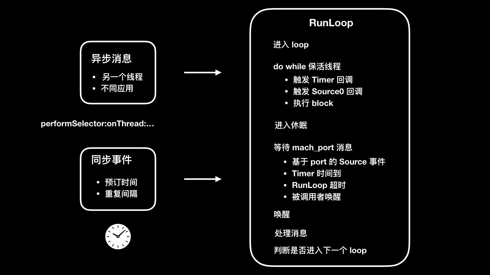

><h2 id=''></h2>
- [**NSRunLoop**](#NSRunLoop)
- [**RunLoop**](#RunLoop)
	- [Runloop的作用](#Runloop的作用)
	- [Runloop数据结构](#Runloop数据结构)
	- [CFRunLoopRef的结构体](#CFRunLoopRef的结构体)
		- [RunLoopMode](#RunLoopMode)
	- [RunLoop Source](#RunLoopSource) 
	- [CFRunLoopObserverRef](#CFRunLoopObserverRef)
	- [CFRunLoopTimerRef](#CFRunLoopTimerRef)
- [**Runloop与线程**](#Runloop与线程)
	- [CFRunLoopRef线程安全原因](#CFRunLoopRef线程安全原因)
	- [子线程启动RunLoop](#子线程启动RunLoop)
	- [CF的内存管理(Core Foundation)](#CF的内存管理)
- [**RunLoop工作流程**](#RunLoop工作流程)
	- [RunLoop运行](#RunLoop运行)
	- [RunLoop运行步骤](#RunLoop运行步骤)
- [**RunLoop使用**](#RunLoop使用)
	- [卡顿原因](#卡顿原因)
	- [Runloop6种状态](#Runloop6种状态)
	- [监测卡顿](#监测卡顿)
- [**NSTimer**](#NSTimer)
- [**参考资料**](#参考资料)
	- [ **线程保活**](https://cloud.tencent.com/developer/article/1615137)
	- [**深入研究 Runloop 与线程保活**](https://juejin.cn/post/6844903439692988423)
	- [**线程保活**](https://www.jianshu.com/p/a761f4a85a15)
	- [深入理解RunLoop](https://blog.ibireme.com/2015/05/18/runloop/)
	- [RunLoop学习](https://choujiji.github.io/2018/03/07/iOS%20RunLoop学习/)
	- [US1](https://www.jianshu.com/p/adf9eb244e81)
	- [RunLoop 详解](https://www.jianshu.com/p/23e3ff9619c3)
	- [深入理解RunLoop](https://blog.ibireme.com/2015/05/18/runloop/)
	- [孙源Runloop视频](https://day.app/2016/01/ios-runloop-xue-xi-and-yong-runloopshi-xian-dang-cheng-xu-kong-xian-shi-,zhi-xing-mou-xie-dai-ma/)


<br/>

***
<br/>


><h1 id='NSRunLoop'>NSRunLoop</h1>


&emsp;  ` NSRunLoop` 是基于 `CFRunLoopRef` 的OC封装，提供了面向对象的 API，但`不是线程安全`的。


- **`RunLoop 6类事件`**

```
static void __CFRUNLOOP_IS_CALLING_OUT_TO_AN_OBSERVER_CALLBACK_FUNCTION__();

static void __CFRUNLOOP_IS_CALLING_OUT_TO_A_BLOCK__();

static void __CFRUNLOOP_IS_SERVICING_THE_MAIN_DISPATCH_QUEUE__();

static void __CFRUNLOOP_IS_CALLING_OUT_TO_A_TIMER_CALLBACK_FUNCTION__();

static void __CFRUNLOOP_IS_CALLING_OUT_TO_A_SOURCE0_PERFORM_FUNCTION__();

static void __CFRUNLOOP_IS_CALLING_OUT_TO_A_SOURCE1_PERFORM_FUNCTION__();

```

- **`Observer事件:`** runloop中状态变化时进行通知。（微信卡顿监控就是利用这个事件通知来记录下最近一次main runloop活动时间，在另一个check线程中用定时器检测当前时间距离最后一次活动时间多久来判断在主线程中的处理逻辑耗时和卡主线程）。这里还需要特别注意，CAAnimation是由RunloopObserver触发回调来重绘，接下来会讲到。

- **`Block事件:`** 非延迟的NSObject PerformSelector立即调用，dispatch_after立即调用，block回调。

- **`Main_Dispatch_Queue事件：`** GCD中dispatch到main queue的block会被dispatch到main loop执行.

- **`Timer事件：`**延迟的NSObject PerformSelector，延迟的dispatch_after，timer事件。

- **`Source0事件：`**处理如UIEvent，CFSocket这类事件。需要手动触发。触摸事件(首先由 IOKit.framework 生成一个 IOHIDEvent 事件并由 [**SpringBoard**](https://www.cnblogs.com/Mike-Fighting/p/5410900.html) 接收。SpringBoard 只接收按键【锁屏/静音等】，触摸，加速，接近传感器等几种 Event，随后用 [mach port](https://www.jianshu.com/p/284b1777586c) 转发给需要的App进程。随后苹果注册的那个 Source1 就会触发回调，回调函数就是` __IOHIDEventSystemClientQueueCallback()`并调用 _UIApplicationHandleEventQueue()进行应用内部的分发。）其实是Source1接收系统事件后在回调 __IOHIDEventSystemClientQueueCallback() 内触发的 Source0，Source0 再触发的 _UIApplicationHandleEventQueue()。source0一定是要唤醒runloop及时响应并执行的，如果runloop此时在休眠等待系统的 mach_msg事件，那么就会通过source1来唤醒runloop执行。

- **`Source1事件：`**处理系统内核的mach_msg事件。（推测CADisplayLink也是这里触发）。


<br/>

&emsp; **Runloop执行顺序的伪代码：**

```
SetupThisRunLoopRunTimeoutTimer(); // by GCD timer

//通知即将进入runloop__CFRUNLLOP_IS_CALLING_OUT_TO_AN_OBSERVER_CALLBACK_FUNCTION__(KCFRunLoopEntry);


do {
     __CFRunLoopDoObservers(kCFRunLoopBeforeTimers);
     __CFRunLoopDoObservers(kCFRunLoopBeforeSources);

     __CFRunLoopDoBlocks();  //!!!:一个循环中会调用两次，确保非延迟的NSObject PerformSelector调用和非延迟的dispatch_after调用在当前runloop执行。还有回调block
     __CFRunLoopDoSource0(); //例如UIKit处理的UIEvent事件

     CheckIfExistMessagesInMainDispatchQueue(); //GCD dispatch main queue

     __CFRunLoopDoObservers(kCFRunLoopBeforeWaiting); //即将进入休眠，会重绘一次界面
     var wakeUpPort = SleepAndWaitForWakingUpPorts();
     // mach_msg_trap，陷入内核等待匹配的内核mach_msg事件
     // Zzz...
     // Received mach_msg, wake up
     __CFRunLoopDoObservers(kCFRunLoopAfterWaiting);
     // 处理消息，从代码中也可以看出，唤醒runloop的三种方式。
     if (wakeUpPort == timerPort) { //方式1: timer源唤醒
          __CFRunLoopDoTimers();
     }
     else if (wakeUpPort == mainDispatchQueuePort) {//方式二：主线程队列任务唤醒
          //GCD当调用dispatch_async(dispatch_get_main_queue(),block)时，
libDispatch会向主线程的runloop发送mach_msg消息唤醒runloop，
并在这里执行。这里仅限于执行dispatch到主线程的任务，
dispatch到其他线程的仍然是libDispatch来处理。
          __CFRUNLOOP_IS_SERVICING_THE_MAIN_DISPATCH_QUEUE__()
     }
     else { //方式三：source1唤醒
          __CFRunLoopDoSource1();  //CADisplayLink是source1的mach_msg触发？
     }
     __CFRunLoopDoBlocks(); //!!!:这里又执行一次do blocks操作
} while (!stop && !timeout);

//通知observers，即将退出runloop
__CFRUNLOOP_IS_CALLING_OUT_TO_AN_OBERVER_CALLBACK_FUNCTION__(CFRunLoopExit);

```


<br/>

**`RunLoop 在主线程`**

```
NSTimer * timer = [NSTimer timerWithTimeInterval:1.f repeats:YES block:^(NSTimer * _Nonnull timer) {
           static int count = 0;
           [NSThread sleepForTimeInterval:1];
           //休息一秒钟，模拟耗时操作
           NSLog(@"%s - %d",__func__,count++);
       }];
[[NSRunLoop currentRunLoop] addTimer:timer forMode:NSRunLoopCommonModes];

```


&emsp;  当把NSTimer直接加入主线程中时，我们拖动UITextView上下滑动时会发现，有卡顿现象，当我们把RunLoop注销掉时，再次拖动没有出现卡顿现象。


<br/>

**`RunLoop 在子线程`**

```
dispatch_async(dispatch_get_global_queue(DISPATCH_QUEUE_PRIORITY_DEFAULT, 0), ^{
        NSTimer * timer = [NSTimer timerWithTimeInterval:1.f repeats:YES block:^(NSTimer * _Nonnull timer) {
               static int count = 0;
               [NSThread sleepForTimeInterval:1];
               //休息一秒钟，模拟耗时操作
               NSLog(@"%s - %d",__func__,count++);
           }];
        [[NSRunLoop currentRunLoop] addTimer:timer forMode:NSRunLoopCommonModes];
    });
```

&emsp;   通过观察，我们在拖动UITextView控件时，我们发现子线程中的RunLoop并没有打印。

&emsp;   这是因为当进入block的时候，先创建了timer，并且也把timer也把timer加入到runloop中，但是很重要的一点子线程中Runloop不会自动运行，需要手动运行，因为这里没有运行Runloop，所以timer就被释放掉了，所以导致了啥都没有。


<br/>

**`RunLoop 在子线程手动开启`**

```
dispatch_async(dispatch_get_global_queue(DISPATCH_QUEUE_PRIORITY_DEFAULT, 0), ^{
        NSTimer * timer = [NSTimer timerWithTimeInterval:1.f repeats:YES block:^(NSTimer * _Nonnull timer) {
               static int count = 0;
               [NSThread sleepForTimeInterval:1];
               //休息一秒钟，模拟耗时操作
               NSLog(@"%s - %d",__func__,count++);
           }];
        [[NSRunLoop currentRunLoop] addTimer:timer forMode:NSRunLoopCommonModes];
        
        //子线程需要手动开启Runloop
        [[NSRunLoop currentRunLoop] run];
        NSLog(@"当前线程: %@", [NSThread currentThread]);
    });
```


<br/>

**`子线程实现常驻线程`**

```
//运行runloop
[[NSRunLoop currentRunLoop] run]; 

//指定runloop在NSDefaultRunLoopMode模式下，设置开始时间,开启成功会返回YES
[[NSRunLoop currentRunLoop] runMode:NSDefaultRunLoopMode beforeDate:[NSDate distantFuture]];  

//运行runloop直到一个时间
[[NSRunLoop currentRunLoop] runUntilDate:[NSDate distantFuture]]; 
```

&emsp;  这样子就可以实现在子线程处理耗时操作，并且常驻线程了。


<br/>

***
<br/>


><h1 id='RunLoop'>RunLoop</h1>

`Event loop `的思想非常简单，用下面的伪代码来表示：

```

int main(void) {
    初始化();
    while (message != 退出) {
        处理事件(message);
        message = 获取下一个事件();
    }
    return 0;
}
```

回到 macOS/iOS 平台上，对于 event loop 的具体实现有两个：

- Foundation 框架中的 NSRunLoop
- Core Foundation 框架中的 CFRunLoop
其中 NSRunLoop 是对 CFRunLoop 的简单封装，需要着重研究的只有 CFRunLoop


<br/>
<br/>

><h2 id='Runloop的作用'>Runloop的作用</h2>


> **1.是什么?**

&emsp; 通俗化来说，RunLoop 是用来监听输入源，进行调度处理的。这里的输入源可以是输入设备、网络、周期性或者延迟时间、异步回调。RunLoop 会接收两种类型的输入源：一种是来自另一个线程或者来自不同应用的异步消息；另一种是来自预订时间或者重复间隔的同步事件。

&emsp; 代码面上来说，`run loop` 就是所谓的 event loop，或者称之为`「事件循环」`或者「`事件分发器」`。Event loop 是 event-driven programming（事件驱动编程）非常重要的组成部分，而事件驱动编程则是 `GUI 程序`的最常见编程方式（现在似乎在服务器端也有很多应用，但在 GUI 编程方面肯定是绕不过去）。


<br/>

> **2.有什么用?**

&emsp; RunLoop 的目的是，当有事件要去处理时保持线程忙，当没有事件要处理时让线程进入休眠。所以，了解 RunLoop 原理不光能够运用到监控卡顿上，还可以提高用户的交互体验。通过将那些繁重而不紧急会大量占用 CPU 的任务（比如图片加载），放到空闲的 RunLoop 模式里执行，就可以避开在 UITrackingRunLoopMode 这个 RunLoop 模式时是执行。UITrackingRunLoopMode 是用户进行滚动操作时会切换到的 RunLoop 模式，避免在这个 RunLoop 模式执行繁重的 CPU 任务，就能避免影响用户交互操作上体验。


**Runloop可以做什么?**

- 处理Crash
- 保持线程的存活、线程保活
	- 使用runloop进行保活
	- 使用条件锁可以保活
- 监测、优化卡顿


<br/>


保活简单Code

```
//第1步:
-(IBAction)beginAction:(id)sender {
    static dispatch_once_t onceToken;
    dispatch_once(&onceToken, ^{
        self.stopped =NO;
        __weak typeof(self) weakSelf = self;
        self.thread = [NSThread alloc] initWithBlock:^{
            NSLog(@"startRun ========>>>>");
            [[NSRunLoop currentRunLoop] addPort:[[NSPort alloc] init] forMode:NSDefaultRunLoopMode];
            while (!weakSelf.isStoped) {
                //使用它是因为是执行一次,而用[runloop run];是死循环,执行多次
                [[NSRunLoop currentRunLoop] runMode:NSDefaultRunLoopMode beforeDate:[NSDate distantFuture]];
            }
            NSLog(@"stop  <<<<=======");
        };
    })
    self.thread.name = @"sssssss";
    [self.thread start];
}


//第2步: 执行任务
- (IBAction)callAction:(id)sender{
    [self performSelector:@selector(doSomething) onThread:self.thread withObject:nil waitUntilDone:NO];
}
//子线程需要执行的任务
- (void)doSomething {
    NSLog(@"%s   %@", __func__, [NSThread currentThread]);
}


//第3步:停止runloop
- (IBAction)stopAction:(id)sender{
    [self performSelector:@selector(stopThread) onThread:self.thread withObject:nil waitUntilDone:YES];
}

-(void) stopThread{
    self.stopped = YES;
    
   
    //停止Runloop
    //任务执行完以后,要对其进行销毁释放资源 [NSRunLoop currentRunLoop].getCFRunLoop 等价于 CFRunLoopGetCurrent()
    CFRunLoopStop(CFRunLoopGetCurrent());
    
    //停止强引用
    self.thread = nil;
}

```


<br/>
<br/>


><h2 id='Runloop数据结构'>Runloop数据结构</h2>

```
typedef struct CF_BRIDGED_MUTABLE_TYPE(id) __CFRunLoop * CFRunLoopRef;

struct __CFRunLoop {
    CFRuntimeBase _base;
    pthread_mutex_t _lock;			/* locked for accessing mode list */
    __CFPort _wakeUpPort;			// used for CFRunLoopWakeUp 
    Boolean _unused;
    volatile _per_run_data *_perRunData;              // reset for runs of the run loop
    pthread_t _pthread;
    uint32_t _winthread;
    CFMutableSetRef _commonModes;
    CFMutableSetRef _commonModeItems;
    CFRunLoopModeRef _currentMode;
    CFMutableSetRef _modes;
    struct _block_item *_blocks_head;
    struct _block_item *_blocks_tail;
    CFAbsoluteTime _runTime;
    CFAbsoluteTime _sleepTime;
    CFTypeRef _counterpart;
};

```

<br/>

|:--|:--|:--|
| **类型** | **变量名** | **用处** |
| CFRuntimeBase | _base | 应该是 Core Foundation 对象都需要的东西 |
| pthread_mutex_t | _lock | 一个 mutex，根据注释，是用来锁对于 mode 的访问的。对其操作由 __CFRunLoopLockInit、__CFRunLoopLock 和 __CFRunLoopUnlock 函数封装 |
| __CFPort | _wakeUpPort | __CFPort 实际上就是 mach_port_t。根据注释，这是用来唤醒 run loop 的 mach port，被 CFRunLoopWakeUp 函数使用 |
| _per_run_data * | _perRunData | 每次调用 CFRunLoopRun 或者 CFRunLoopRunInMode 函数（实际就是对 CFRunLoopRunSpecific 函数的调用），也就是每次 run 的一个独立数据。相关操作：__CFRunLoopPushPerRunData 和 __CFRunLoopPopPerRunData，这个又 push 又 pop 的原因是因为 run loop 可以嵌套调用 |
| pthread_t | _pthread | 对应的 pthread |
| uint32_t | _winthread | Windows 下对应线程 |
| CFMutableSetRef | _commonModes | 存放 common mode 的集合 |
| CFMutableSetRef | _commonModeItems | 每个 common mode 都有的 item (source, timer and observer) 集合 |
| CFRunLoopModeRef | _currentMode | 当前 run 的 mode |
| CFMutableSetRef | _modes | 这个 run loop 所有的 mode 集合 |
| sturct _block_item * | _blocks_head | 存放 CFRunLoopPerformBlock 函数添加的 block 的双向链表的头指针 |
| sturct _block_item * | _blocks_tail | 同上尾脂针 |
| CFAbsoluteTime | _runTime | 估计是一共跑着的时间（但实际上根本没使用） |
| CFAbsoluteTime | _sleepTime | 一共睡了多久 |
| CFTypeRef | _counterpart | 给 Swift 用的玩意 |


<br/>
<br/>


><h2 id='CFRunLoopRef的结构体'>CFRunLoopRef的结构体</h2>

&emsp;  `CFRunLoopRef` 是在 `CoreFoundation` 框架内的，它提供了纯 C 函数的 API，是线程安全的。

**`CFRunLoop的结构`**

```

//RunLoop 的运行模式
typedef struct __CFRunLoopMode *CFRunLoopModeRef


typedef struct CF_BRIDGED_MUTABLE_TYPE(id) __CFRunLoop * CFRunLoopRef;

//RunLoop要处理的事件源
typedef struct CF_BRIDGED_MUTABLE_TYPE(id) __CFRunLoopSource * CFRunLoopSourceRef;

//RunLoop的观察者(监听者)
typedef struct CF_BRIDGED_MUTABLE_TYPE(id) __CFRunLoopObserver * CFRunLoopObserverRef;

//Timer 事件
typedef struct CF_BRIDGED_MUTABLE_TYPE(NSTimer) __CFRunLoopTimer * CFRunLoopTimerRef;

```


<br/>
<br/>


> <h2 id='RunLoopMode'>RunLoop Mode</h2>


`RunLoop Mode`可以视为事件的管家，一个Mode管理着各种事件，它的结构如下：

```
typedef struct __CFRunLoopMode *CFRunLoopModeRef;

struct __CFRunLoopMode {
    CFRuntimeBase _base;
    pthread_mutex_t _lock;	/* must have the run loop locked before locking this */
    CFStringRef _name;
    Boolean _stopped;
    char _padding[3];
    CFMutableSetRef _sources0;      //处理一些触摸事件和 perform Selectors方法等。
    CFMutableSetRef _sources1;      //基于Port的线程间的通信
    CFMutableArrayRef _observers;   //监听器(通知)，监听RunLoop的一些状态的
    CFMutableArrayRef _timers;      //处理定时器任务
    CFMutableDictionaryRef _portToV1SourceMap;  //字典， key是mach_port_t,value是CFRunLoopSourceRef
    __CFPortSet _portSet;   //保存所有需要监听的port，比如_weakeUpPort, _timerPort都保存在这个数组中
    CFIndex _observerMask;
#if USE_DISPATCH_SOURCE_FOR_TIMERS
    dispatch_source_t _timerSource;
    dispatch_queue_t _queue;
    Boolean _timerFired; // set to true by the source when a timer has fired
    Boolean _dispatchTimerArmed;
#endif
#if USE_MK_TIMER_TOO
    mach_port_t _timerPort;
    Boolean _mkTimerArmed;
#endif
#if DEPLOYMENT_TARGET_WINDOWS
    DWORD _msgQMask;
    void (*_msgPump)(void);
#endif
    uint64_t _timerSoftDeadline; /* TSR */
    uint64_t _timerHardDeadline; /* TSR */
};
```

&emsp; **USE_DISPATCH_SOURCE_FOR_TIMERS** 这个宏的值为 1，也就是说有使用 GCD 来实现 timer，当然 USE_MK_TIMER_TOO 这个宏的值也是 1，表示也使用了更底层的 timer。

|:--| :--| :--|
|  **类型**  |   **变量名**  |  **用处**  |
|  CFRuntimeBase  |   _base  |  应该是 Core Foundation 对象都需要的东西  |
|  pthread_mutex_t  |   _lock  |  一个 mutex，锁 mode 里的各种操作。根据注释，需要 run loop 的锁先锁上才能锁这个锁。同样也有两个函数 __CFRunLoopModeLock 和 __CFRunLoopModeUnlock 对其操作进行了简单封装  |
|  CFStringRef  |   _name  |  当然是名字啦  |
|  Boolean  |   _stopped  |  是否停止了  |
|  char[3]  |  _padding   |  可能是为了对齐用的吧……  |
|  CFMutableSetRef  |  _sources0   |  Source0 集合，也就是非 port 的 source  |
|  CFMutableSetRef  |  _sources1   |  Source1 集合，也就是基于 port 的 source  |
|  CFMutableArrayRef  |   _observers  |  Observer 集合  |
|  CFMutableArrayRef  |   _timers  |  Timer 集合  |
|  CFMutableDictionaryRef  |  _portToV1SourceMap   |  Key 是 port，value 是对应 source1 的字典  |
|  __CFPortSet  |   _portSet  |  所有 port 的集合  |
|  CFIndex  |  _observerMask   |  需要 observe 的事件的 mask，一个小优化  |
|  dispatch_source_t  |  _timerSource   |  用来实现 timer 的 GCD timer  |
|  dispatch_queue_t  |  _queue   |  放 _timerSource 的队列  |
|  Boolean  |  _timerFired   |  _timerSource 是否被启动  |
|  Boolean  |  _dispatchTimerArmed   |  timer 是否被安装上了，或者说是否开启了  |
|  __CFPort  |   _timerPort  |  使用 MK timer 时的端口  |
|  Boolean  |  _mkTimerArmed   |  timer 是否被开启  |
|  uint64_t  |   _timerSoftDeadline  |  下一个计划启动的时间  |
|  uint64_t  |   _timerHardDeadline  |  下一个最迟启动的时间（计划加上容忍延迟的时间）  |


<br/>


&emsp;  一个CFRunLoopMode对象有一个_name，若干 _source0、_source1、_timers、observer和若干port，`可见事件都是由CFRunLoopMode在管理，而RunLoop管理CFRunLoopMode `。

&emsp; 从源码的结构体可以很容易看出，Runloop总是运行在某种特定的`CFRunLoopModeRef`下(每次运行 `__CFRunLoopRun()` 函数时必须指定Mode)。而通过CFRunloopRef对应结构体的定义可以很容易知道每种Runloop都可以包含若干个Mode，每个Mode又包含 `Source/Timer/Observer` 。每次调用Runloop的主函数`__CFRunLoopRun()`时必须指定一种Mode，这个Mode称为` _currentMode`，当切换Mode时必须退出当前Mode，然后重新进入Runloop以保证不同Mode的Source/Timer/Observer互不影响。


下图是苹果文档中提到的5种Mode，第2个、第3个在iOS中没有暴露出来。

- `NSRunLoopCommonModes` 实际上是一个 Mode 的集合，默认包括 `NSDefaultRunLoopMode` 和 `NSEventTrackingRunLoopMode`（注意：并不是说Runloop会运行在kCFRunLoopCommonModes这种模式下，而是相当于分别注册了 NSDefaultRunLoopMode和 UITrackingRunLoopMode。当然你也可以通过调用CFRunLoopAddCommonMode()方法将自定义Mode放到 kCFRunLoopCommonModes组合）

- `NSDefaultRunLoopMode` 默认模式，一般处理timer或者网络等事件；
- `UITrackingRunLoopMode` UI模式，专门处理UI事件；


<br/>
<br/>


> <h2 id='RunLoopSource'>RunLoop Source</h2>


`RunLoop Source `分为Source、Observer、Timer三种，他们统称为ModeItem。

按照官方文档分类，Source 分类：
- `Port-Based Sources` (跟其他线程交互，或通过线程内核发送的消息)
- `Custom Input Sources` (自动已输入源，几乎不用)
- `Cocoa Perform Selector Sources` (比如performSelector等方法)


<br/>

按照函数调用栈，Source分类：
- `Source0`: 非基于Port的,处理内部app事件，如：UIEvent；
- `Soruce1`： 基于Port的，通过内核和其他线程通信、接收、分发系统事件的，主动唤醒runloop线程；


<br/>

**` CFRunLoopSource `**

&emsp; `CFRunLoopSource` 是对input sources的抽象。CFRunLoopSource分`source0`和`source1`两个版本，它的结构如下：

```
struct __CFRunLoopSource {
    CFRuntimeBase _base;
    uint32_t _bits; //用于标记Signaled状态，source0只有在被标记为Signaled状态，才会被处理
    pthread_mutex_t _lock;
    CFIndex _order;			/* immutable */
    CFMutableBagRef _runLoops;
    union {//source0 和 source1 两个版本
	CFRunLoopSourceContext version0;	/* immutable, except invalidation */
        CFRunLoopSourceContext1 version1;	/* immutable, except invalidation */
    } _context;
};
```


<br/>

`source0 的详解`

&emsp;  `source0`是App内部事件，由App自己管理的`UIEvent、CFSocket`都是source0。当一个source0事件准备执行的时候，必须要先把它标记为signal状态，以下是source0的结构体：

```
typedef struct {
    CFIndex	version;
    void *	info;
    const void *(*retain)(const void *info);
    void	(*release)(const void *info);
    CFStringRef	(*copyDescription)(const void *info);
    Boolean	(*equal)(const void *info1, const void *info2);
    CFHashCode	(*hash)(const void *info);
    void	(*schedule)(void *info, CFRunLoopRef rl, CFRunLoopMode mode);
    void	(*cancel)(void *info, CFRunLoopRef rl, CFRunLoopMode mode);
    void	(*perform)(void *info);
} CFRunLoopSourceContext;
```

&emsp;  `source0`是非基于Port的。只包含了一个回调（函数指针），它并不能主动触发事件。使用时，你需要先调用 `CFRunLoopSourceSignal(source)`，将这个 Source 标记为待处理，然后手动调用 `CFRunLoopWakeUp(runloop)` 来唤醒 RunLoop，让其处理这个事件。


<br/>

`source1 的详解`

&emsp;  `source1`由 `RunLoop` 和内核管理，`source1` 带有`mach_port_t`，可以接收内核消息并触发回调，以下是source1的结构体:

```
typedef struct {
    CFIndex	version;
    void *	info;
    const void *(*retain)(const void *info);
    void	(*release)(const void *info);
    CFStringRef	(*copyDescription)(const void *info);
    Boolean	(*equal)(const void *info1, const void *info2);
    CFHashCode	(*hash)(const void *info);
#if TARGET_OS_OSX || TARGET_OS_IPHONE
    mach_port_t	(*getPort)(void *info);
    void *	(*perform)(void *msg, CFIndex size, CFAllocatorRef allocator, void *info);
#else
    void *	(*getPort)(void *info);
    void	(*perform)(void *info);
#endif
} CFRunLoopSourceContext1;
```

&emsp;  `source1`除了包含回调指针外包含一个`mach port`，`source1`可以监听系统端口和通过内核和其他线程通信，接收、分发系统事件，它能够主动唤醒RunLoop(由操作系统内核进行管理，例如CFMessagePort消息)。官方也指出可以自定义Source，因此对于CFRunLoopSourceRef来说它更像一种协议，框架已经默认定义了两种实现，如果有必要开发人员也可以自定义，详细情况可以查看[官方文档](https://link.jianshu.com?t=https%3A%2F%2Fdeveloper.apple.com%2Flibrary%2Fcontent%2Fdocumentation%2FCocoa%2FConceptual%2FMultithreading%2FRunLoopManagement%2FRunLoopManagement.html)。


<br/>
<br/>


> <h2 id='CFRunLoopObserverRef'>CFRunLoopObserverRef</h2>

&emsp;  `CFRunLoopObserver`是观察者，可以观察RunLoop的各种状态，并抛出回调。其结构体如下：

```
struct __CFRunLoopObserver {
    CFRuntimeBase _base;
    pthread_mutex_t _lock;
    CFRunLoopRef _runLoop;
    CFIndex _rlCount;
    CFOptionFlags _activities;		/* immutable */
    CFIndex _order;			/* immutable */
    CFRunLoopObserverCallBack _callout;	/* immutable */
    CFRunLoopObserverContext _context;	/* immutable, except invalidation */
};
```


<br/>
<br/>


> <h2 id='CFRunLoopTimerRef'>CFRunLoopTimerRef</h2>

&emsp;  `CFRunLoopTimer`是定时器，可以在设定的时间点抛出回调，它的结构体如下：

```
struct __CFRunLoopTimer {
    CFRuntimeBase _base;
    uint16_t _bits; //标记fire状态
    pthread_mutex_t _lock;
    CFRunLoopRef _runLoop;      //添加该timer的runloop
    CFMutableSetRef _rlModes;   //存放所有 包含该timer的 mode的 modeName，意味着一个timer可能会在多个mode中存在
    CFAbsoluteTime _nextFireDate;
    CFTimeInterval _interval;		/* immutable */ //理想时间间隔
    CFTimeInterval _tolerance;          /* mutable *///时间偏差
    uint64_t _fireTSR;			/* TSR units */
    CFIndex _order;			/* immutable */
    CFRunLoopTimerCallBack _callout;	/* immutable */
    CFRunLoopTimerContext _context;	/* immutable, except invalidation */
};
```

&emsp;  所以CFRunLoopTimer具有以下特性：
- CFRunLoopTimer 是定时器，可以在设定的时间点抛出回调
- CFRunLoopTimer和NSTimer是toll-free bridged的，可以相互转换


<br/>

***
<br/>


><h2 id='Runloop与线程'>Runloop与线程</h2>


-  RunLoop对象和线程是一一对应关系；
-  RunLoop保存在一个全局的Dictionary里，线程作为key，RunLoop作为value；
- 如果没有RunLoop，线程执行完任务就会退出；如果没有RunLoop，主线程执行完main()函数就会退出，程序就不能处于运行状态；
-  RunLoop创建时机：线程刚创建时并没有RunLoop对象，RunLoop会在第一次获取它时创建；
-  RunLoop销毁时机：RunLoop会在线程结束时销毁；
- 主线程的RunLoop已经自动获取（创建），子线程默认没有开启RunLoop；
- 主线程的RunLoop对象是在UIApplicationMain中通过[NSRunLoop currentRunLoop]


<br/>
<br/>


> **1. OC中获取RunLoop**


```
// Foundation
[NSRunLoop mainRunLoop];     // 获取主线程的 RunLoop 对象
[NSRunLoop currentRunLoop];  // 获取当前线程的 RunLoop 对象
// Core Foundation
CFRunLoopGetMain();     // 获取主线程的 RunLoop 对象
CFRunLoopGetCurrent();  // 获取当前线程的 RunLoop 对象
```


<br/>

> **`2. CFRunLoopGetCurrent()`**

是用来获取Runloop对象的，其源代码：


```
CFRunLoopRef CFRunLoopGetCurrent(void) {
    CHECK_FOR_FORK();
    CFRunLoopRef rl = (CFRunLoopRef)_CFGetTSD(__CFTSDKeyRunLoop);
    if (rl) return rl;
    return _CFRunLoopGet0(pthread_self());  // 调用 _CFRunLoopGet0 函数并传入当前线程
}
```


&emsp; ` NSRunLoop` 是基于 `CFRunLoopRef` 的OC封装，提供了面向对象的 API，但`不是线程安全`的，`CFRunLoopRef` 是在 `CoreFoundation` 框架内的，它提供了纯 C 函数的 API，是线程安全的，`CoreFoundation`是开源的([CoreFoundation 源码地址](https://link.jianshu.com?t=https://opensource.apple.com/tarballs/CF/))


<br/>
<br/>


> <h2 id='CFRunLoopRef线程安全原因'>CFRunLoopRef线程安全原因</h2>


&emsp; `CFRunLoopRef`是线程安全的，这个需要看到`CFRunLoopRef`对象的实现。CFRunloopRef是Apple维护的CoreFoundation，没有不允许创建一个新对象，只有两个获取Runloop的对象 CFRunLoopGetMain()和CFRunLoopGetCurrent()。它们的内部实现如下：

```
static CFMutableDictionaryRefloopsDic;

/// 访问 loopsDic 时的锁
static CFSpinLock_t loopsLock;

// 获取线程对应的runloop最终调用的核心函数
// should only be called by Foundation
// t==0 is a synonym for "main thread" that always works
CF_EXPORT CFRunLoopRef _CFRunLoopGet0(pthread_t t) {
    // 线程t为空则默认返回主线程runloop
    if (pthread_equal(t, kNilPthreadT)) {
    t = pthread_main_thread_np();
    }
    __CFLock(&loopsLock);
    if (!__CFRunLoops) {
        __CFUnlock(&loopsLock);
    // 创建一个用于映射线程和runloop关系的字典
    CFMutableDictionaryRef dict = CFDictionaryCreateMutable(kCFAllocatorSystemDefault, 0, NULL, &kCFTypeDictionaryValueCallBacks);
    // 主线程runloop
    CFRunLoopRef mainLoop = __CFRunLoopCreate(pthread_main_thread_np());
    // 保存main runloop，main_thread为key，main runloop为value
    CFDictionarySetValue(dict, pthreadPointer(pthread_main_thread_np()), mainLoop);
    if (!OSAtomicCompareAndSwapPtrBarrier(NULL, dict, (void * volatile *)&__CFRunLoops)) {
        CFRelease(dict);
    }
    CFRelease(mainLoop);
        __CFLock(&loopsLock);
    }
    // 当前线程作为 Key，从 __CFRunLoops 字典中获取 RunLoop 
    CFRunLoopRef loop = (CFRunLoopRef)CFDictionaryGetValue(__CFRunLoops, pthreadPointer(t));
    __CFUnlock(&loopsLock);
    // 未查找到缓存则创建一个runloop兵缓存在字典中
    if (!loop) {//如果字典中不存在
    CFRunLoopRef newLoop = __CFRunLoopCreate(t);// ⚠️创建当前线程的 RunLoop
        __CFLock(&loopsLock);
    loop = (CFRunLoopRef)CFDictionaryGetValue(__CFRunLoops, pthreadPointer(t));
    if (!loop) {
        CFDictionarySetValue(__CFRunLoops, pthreadPointer(t), newLoop);// ⚠️保存到字典中
        loop = newLoop;
    }
        // don't release run loops inside the loopsLock, because CFRunLoopDeallocate may end up taking it
        __CFUnlock(&loopsLock);
    CFRelease(newLoop);
    }
    if (pthread_equal(t, pthread_self())) {
        _CFSetTSD(__CFTSDKeyRunLoop, (void *)loop, NULL);
        if (0 == _CFGetTSD(__CFTSDKeyRunLoopCntr)) {
            // 注册一个回调，当线程销毁时，销毁对应的RunLoop
            _CFSetTSD(__CFTSDKeyRunLoopCntr, (void *)(PTHREAD_DESTRUCTOR_ITERATIONS-1), (void (*)(void *))__CFFinalizeRunLoop);
        }
    }
    return loop;
}

CFRunLoopRefCFRunLoopGetMain(){
	return _CFRunLoopGet(pthread_main_thread_np());
}

CFRunLoopRefCFRunLoopGetCurrent(){
	return _CFRunLoopGet(pthread_self());
}
```

&emsp; 可以看到生成的对象是加锁的，这样就避免被改变了。NSRunLoop可以初始化一个对象，可以生成一个新的runloop，这就像上面讲的有可能产生临界区，所以它不是线程安全的。


<br/>
<br/>


><h2 id='子线程启动RunLoop'>子线程启动RunLoop</h2>

<br/>

```
// Foundation
[[NSRunLoop currentRunLoop] run];
[[NSRunLoop currentRunLoop] runMode:NSDefaultRunLoopMode beforeDate:[NSDate distantFuture]];
// Core Foundation
CFRunLoopRun();
CFRunLoopRunInMode(kCFRunLoopDefaultMode, 1.0e10, false);  // 第3个参数：设置为 true，代表执行完 Source/Port 后就会退出当前 loop
```

<br/>

CFRunLoopRun()、CFRunLoopRunInMode()函数是怎么启动RunLoop的：

```
void CFRunLoopRun(void) {
    int32_t result;
    do {
        result = CFRunLoopRunSpecific(CFRunLoopGetCurrent(), kCFRunLoopDefaultMode, 1.0e10, false);
        CHECK_FOR_FORK();
    } while (kCFRunLoopRunStopped != result && kCFRunLoopRunFinished != result);
}

SInt32 CFRunLoopRunInMode(CFStringRef modeName, CFTimeInterval seconds, Boolean returnAfterSourceHandled) {   
    CHECK_FOR_FORK();
    return CFRunLoopRunSpecific(CFRunLoopGetCurrent(), modeName, seconds, returnAfterSourceHandled);
}
```

- 可以看到 CFRunLoopRun 函数不主动调用 CFRunLoopStop 函数（kCFRunLoopRunStopped 的情况）或者将所有事件源移除（kCFRunLoopRunFinished 的情况）是没有办法退出的
- 也可以看到它通过调用[**CFRunLoopRunSpecific(**)](https://www.jianshu.com/p/e9de4992cdf5)函数来启动RunLoop;

<br/>

```
SInt32 
CFRunLoopRunSpecific(CFRunLoopRef rl, 
                     CFStringRef modeName, 
                     CFTimeInterval seconds, 
                     Boolean returnAfterSourceHandled) {     /* DOES CALLOUT */
    CHECK_FOR_FORK();
    //// 检查 mode 是否合法
    if (modeName == NULL || modeName == kCFRunLoopCommonModes || CFEqual(modeName, kCFRunLoopCommonModes)) {
        static dispatch_once_t onceToken;
        dispatch_once(&onceToken, ^{
            CFLog(kCFLogLevelError, CFSTR("invalid mode '%@' provided to CFRunLoopRunSpecific - break on _CFRunLoopError_RunCalledWithInvalidMode to debug. This message will only appear once per execution."), modeName);
            _CFRunLoopError_RunCalledWithInvalidMode();
        });
        return kCFRunLoopRunFinished;
    }
    //// 检查 run loop 是否正在销毁
    if (__CFRunLoopIsDeallocating(rl)) return kCFRunLoopRunFinished;
    __CFRunLoopLock(rl);
    //// 查找 modeName 指定的 mode
    CFRunLoopModeRef currentMode = __CFRunLoopFindMode(rl, modeName, false);
    //// 没有找到 mode 或者 mode 里面没有任何事件源的话，返回 kCFRunLoopRunFinished
    if (NULL == currentMode || __CFRunLoopModeIsEmpty(rl, currentMode, rl->_currentMode)) {
        //// 不能理解这个 did 有什么用……
        Boolean did = false;
        if (currentMode) __CFRunLoopModeUnlock(currentMode);
        __CFRunLoopUnlock(rl);
        return did ? kCFRunLoopRunHandledSource : kCFRunLoopRunFinished;
    }
    //// 因为可以嵌套调用，保存一下之前的状态
    volatile _per_run_data *previousPerRun = __CFRunLoopPushPerRunData(rl);
    CFRunLoopModeRef previousMode = rl->_currentMode;
    //// 初始化当前调用的状态
    rl->_currentMode = currentMode;
    int32_t result = kCFRunLoopRunFinished;

    //// 1. 通知 observers: kCFRunLoopEntry, 进入 run loop
    if (currentMode->_observerMask & kCFRunLoopEntry ) __CFRunLoopDoObservers(rl, currentMode, kCFRunLoopEntry);
    result = __CFRunLoopRun(rl, currentMode, seconds, returnAfterSourceHandled, previousMode);
    //// 14. 通知 observers: `kCFRunLoopExit`, 退出 run loop
    if (currentMode->_observerMask & kCFRunLoopExit ) __CFRunLoopDoObservers(rl, currentMode, kCFRunLoopExit);

    //// 恢复之前的状态
    __CFRunLoopModeUnlock(currentMode);
    __CFRunLoopPopPerRunData(rl, previousPerRun);
    rl->_currentMode = previousMode;
    __CFRunLoopUnlock(rl);
    return result;
}
```


<br/>

接下来的代码中删除了关于 Windows 和 Linux 的源码：


```
/* rl, rlm are locked on entrance and exit */
static int32_t
__CFRunLoopRun(CFRunLoopRef rl,
               CFRunLoopModeRef rlm,
               CFTimeInterval seconds,
               Boolean stopAfterHandle,
               CFRunLoopModeRef previousMode)
{
    //// 记录开始时间
    uint64_t startTSR = mach_absolute_time();
    
    //// 检查是否被停止
    if (__CFRunLoopIsStopped(rl)) {
        __CFRunLoopUnsetStopped(rl);
        return kCFRunLoopRunStopped;
    } else if (rlm->_stopped) {
        rlm->_stopped = false;
        return kCFRunLoopRunStopped;
    }

    //// 如果使用了 GCD 的话，获取 GCD 消息端口
#if __HAS_DISPATCH__
    //// GCD 端口存放变量
    __CFPort dispatchPort = CFPORT_NULL;
    //// 检查是否在主线程（和是否允许嵌套调用的 run loop 处理 GCD）
    Boolean libdispatchQSafe =
    pthread_main_np()
    && ((HANDLE_DISPATCH_ON_BASE_INVOCATION_ONLY && NULL == previousMode)
        || (!HANDLE_DISPATCH_ON_BASE_INVOCATION_ONLY && 0 == _CFGetTSD(__CFTSDKeyIsInGCDMainQ)));
    //// 需要在主线程，run loop 也是主线程的 run loop，并且 mode 是 common mode
    if (libdispatchQSafe
        && (CFRunLoopGetMain() == rl)
        && CFSetContainsValue(rl->_commonModes, rlm->_name))
        //// 从 GCD 的私有 API 获取端口（4CF 表示 for Core Foundation）
        dispatchPort = _dispatch_get_main_queue_port_4CF();
#endif

    //// 如果使用 GCD timer 作为 timer 的实现的话，进行准备工作
#if USE_DISPATCH_SOURCE_FOR_TIMERS
    mach_port_name_t modeQueuePort = MACH_PORT_NULL;
    if (rlm->_queue) {
        modeQueuePort = _dispatch_runloop_root_queue_get_port_4CF(rlm->_queue);
        if (!modeQueuePort) {
            CRASH("Unable to get port for run loop mode queue (%d)", -1);
        }
    }
#endif

    //// 设置超时的玩意开始
#if __HAS_DISPATCH__
    dispatch_source_t timeout_timer = NULL;
#endif
    struct __timeout_context *timeout_context = (struct __timeout_context *)malloc(sizeof(*timeout_context));
    if (seconds <= 0.0) { // instant timeout
        seconds = 0.0;
        timeout_context->termTSR = 0ULL;
    } else if (seconds <= TIMER_INTERVAL_LIMIT) {
#if __HAS_DISPATCH__
        dispatch_queue_t queue = 
        pthread_main_np() 
        ? __CFDispatchQueueGetGenericMatchingMain() 
        : __CFDispatchQueueGetGenericBackground();
        timeout_timer = dispatch_source_create(DISPATCH_SOURCE_TYPE_TIMER, 
                                               0, 
                                               0, 
                                               queue);
        dispatch_retain(timeout_timer);
        timeout_context->ds = timeout_timer;
#endif
        timeout_context->rl = (CFRunLoopRef)CFRetain(rl);
        timeout_context->termTSR = startTSR + __CFTimeIntervalToTSR(seconds);
#if __HAS_DISPATCH__
        dispatch_set_context(timeout_timer, timeout_context); // source gets ownership of context
        dispatch_source_set_event_handler_f(timeout_timer, __CFRunLoopTimeout);
        dispatch_source_set_cancel_handler_f(timeout_timer, __CFRunLoopTimeoutCancel);
        uint64_t ns_at = (uint64_t)((__CFTSRToTimeInterval(startTSR) + seconds) * 1000000000ULL);
        dispatch_source_set_timer(timeout_timer, dispatch_time(1, ns_at), DISPATCH_TIME_FOREVER, 1000ULL);
        dispatch_resume(timeout_timer);
#endif
    } else { // infinite timeout
        seconds = 9999999999.0;
        timeout_context->termTSR = UINT64_MAX;
    }
    //// 设置超时的玩意结束

    Boolean didDispatchPortLastTime = true;
    int32_t retVal = 0;
    do {
        voucher_mach_msg_state_t voucherState = VOUCHER_MACH_MSG_STATE_UNCHANGED;
        voucher_t voucherCopy = NULL;
        
        uint8_t msg_buffer[3 * 1024];

        mach_msg_header_t *msg = NULL;
        mach_port_t livePort = MACH_PORT_NULL;

        __CFPortSet waitSet = rlm->_portSet;

        __CFRunLoopUnsetIgnoreWakeUps(rl);
        
        //// 2. 通知 observers: kCFRunLoopBeforeTimers, 即将处理 timers
        if (rlm->_observerMask & kCFRunLoopBeforeTimers) __CFRunLoopDoObservers(rl, rlm, kCFRunLoopBeforeTimers);
        //// 3. 通知 observers: kCFRunLoopBeforeSources, 即将处理 sources
        if (rlm->_observerMask & kCFRunLoopBeforeSources) __CFRunLoopDoObservers(rl, rlm, kCFRunLoopBeforeSources);

        //// 4. 处理 blocks
        __CFRunLoopDoBlocks(rl, rlm);
        
        //// 5. 处理 sources 0
        Boolean sourceHandledThisLoop = __CFRunLoopDoSources0(rl, rlm, stopAfterHandle);
        //// 6. 如果第 5 步实际处理了 sources 0，再一次处理 blocks
        if (sourceHandledThisLoop) {
            __CFRunLoopDoBlocks(rl, rlm);
        }
        
        //// 是否处理过 source 或超时
        Boolean poll = sourceHandledThisLoop 
                       || (0ULL == timeout_context->termTSR);

        //// 7. 如果在主线程，检查是否有 GCD 事件需要处理，有的话，跳转到第 11 步
#if __HAS_DISPATCH__
        if (MACH_PORT_NULL != dispatchPort 
            && !didDispatchPortLastTime) {
            msg = (mach_msg_header_t *)msg_buffer;
            //// __CFRunLoopServiceMachPort 这个函数会睡眠线程，如果超时时间不为 0 的话
            if (__CFRunLoopServiceMachPort(dispatchPort,       // 监听的端口 
                                           &msg,               // 存放消息的地址
                                           sizeof(msg_buffer),
                                           &livePort,          // 返回发送消息的端口
                                           0,                  // 超时时间，这里为 0 表示不会睡眠 
                                           &voucherState, 
                                           NULL)) {
                goto handle_msg;
            }
        }
#endif

        didDispatchPortLastTime = false;
        
        //// 8. 通知 observers: kCFRunLoopBeforeWaiting, 即将进入等待（睡眠）
        //// 注意到如果实际处理了 source 0 或者超时了，不会进入睡眠，所以不会通知
        if (!poll && (rlm->_observerMask & kCFRunLoopBeforeWaiting)) __CFRunLoopDoObservers(rl, rlm, kCFRunLoopBeforeWaiting);
        //// 设置标志位，正在睡眠（实际上没有开始睡）
        __CFRunLoopSetSleeping(rl);
        // do not do any user callouts after this point (after notifying of sleeping)

        // Must push the local-to-this-activation ports in on every loop
        // iteration, as this mode could be run re-entrantly and we don't
        // want these ports to get serviced.
#if __HAS_DISPATCH__
        //// 使用 GCD 的话，将 GCD 端口加入所有监听端口集合中
        __CFPortSetInsert(dispatchPort, waitSet);
#endif

        __CFRunLoopModeUnlock(rlm);
        __CFRunLoopUnlock(rl);

        //// 记录睡眠开始时间
        CFAbsoluteTime sleepStart = poll ? 0.0 : CFAbsoluteTimeGetCurrent();

        //// 9. 等待被唤醒，可以被 sources 1、timers、CFRunLoopWakeUp 函数和 GCD 事件（如果在主线程）
#if USE_DISPATCH_SOURCE_FOR_TIMERS
        //// 使用 GCD timer 作为 timer 实现的情况
        do {
            msg = (mach_msg_header_t *)msg_buffer;
            
            //// 这个函数会睡眠线程
            __CFRunLoopServiceMachPort(waitSet, // 监听端口集合    
                                       &msg, 
                                       sizeof(msg_buffer), 
                                       &livePort, // 返回收到消息的端口
                                       poll ? 0 : TIMEOUT_INFINITY, // 根据状态睡眠或者不睡
                                       &voucherState, 
                                       &voucherCopy);

            //// 如果是 timer 端口唤醒的，进行一下善后处理，之后再处理 timer
            if (modeQueuePort != MACH_PORT_NULL 
                && livePort == modeQueuePort) {
                // Drain the internal queue. If one of the callout blocks sets the timerFired flag, break out and service the timer.
                while (_dispatch_runloop_root_queue_perform_4CF(rlm->_queue))
                    ;
                if (rlm->_timerFired) {
                    // Leave livePort as the queue port, and service timers below
                    rlm->_timerFired = false;
                    break;
                } else {
                    if (msg && msg != (mach_msg_header_t *)msg_buffer) free(msg);
                }
            } else {
            //// 不是 timer 端口唤醒的，进行接下来的处理
                // Go ahead and leave the inner loop.
                break;
            }
        } while (1);
#else
        ///// 不使用 GCD timer 作为 timer 实现的情况
        msg = (mach_msg_header_t *)msg_buffer;
        __CFRunLoopServiceMachPort(waitSet, 
                                   &msg, 
                                   sizeof(msg_buffer), 
                                   &livePort, 
                                   poll ? 0 : TIMEOUT_INFINITY, 
                                   &voucherState, 
                                   &voucherCopy);
#endif

        __CFRunLoopLock(rl);
        __CFRunLoopModeLock(rlm);

        //// 增加记录的睡眠时间
        rl->_sleepTime += (poll ? 0.0 : (CFAbsoluteTimeGetCurrent() - sleepStart));

        // Must remove the local-to-this-activation ports in on every loop
        // iteration, as this mode could be run re-entrantly and we don't
        // want these ports to get serviced. Also, we don't want them left
        // in there if this function returns.
#if __HAS_DISPATCH__
        //// 将 GCD 端口移除
        __CFPortSetRemove(dispatchPort, waitSet);
#endif

        __CFRunLoopSetIgnoreWakeUps(rl);

        // user callouts now OK again
        __CFRunLoopUnsetSleeping(rl);
        //// 10. 通知 observers: kCFRunLoopAfterWaiting, 即停止等待（被唤醒）
        //// 注意实际处理过 source 0 或者已经超时的话，不会通知（因为没有睡）
        if (!poll && (rlm->_observerMask & kCFRunLoopAfterWaiting)) __CFRunLoopDoObservers(rl, rlm, kCFRunLoopAfterWaiting);

        //// 11. 被什么唤醒就处理什么：
    handle_msg:;
        __CFRunLoopSetIgnoreWakeUps(rl);

        if (MACH_PORT_NULL == livePort) {
            //// 不知道哪个端口唤醒的（或者根本没睡），啥也不干
            CFRUNLOOP_WAKEUP_FOR_NOTHING();
            // handle nothing
        } else if (livePort == rl->_wakeUpPort) {
            //// 被 CFRunLoopWakeUp 函数弄醒的，啥也不干
            CFRUNLOOP_WAKEUP_FOR_WAKEUP();
            // do nothing on Mac OS
        }
#if USE_DISPATCH_SOURCE_FOR_TIMERS
        else if (modeQueuePort != MACH_PORT_NULL && livePort == modeQueuePort) {
            //// 被 timers 唤醒，处理 timers
            CFRUNLOOP_WAKEUP_FOR_TIMER();
            if (!__CFRunLoopDoTimers(rl, rlm, mach_absolute_time())) {
                // Re-arm the next timer, because we apparently fired early
                __CFArmNextTimerInMode(rlm, rl);
            }
        }
#endif
#if USE_MK_TIMER_TOO
        else if (rlm->_timerPort != MACH_PORT_NULL && livePort == rlm->_timerPort) {
            //// 被 timers 唤醒，处理 timers
            CFRUNLOOP_WAKEUP_FOR_TIMER();
            // On Windows, we have observed an issue where the timer port is set before the time which we requested it to be set. For example, we set the fire time to be TSR 167646765860, but it is actually observed firing at TSR 167646764145, which is 1715 ticks early. The result is that, when __CFRunLoopDoTimers checks to see if any of the run loop timers should be firing, it appears to be 'too early' for the next timer, and no timers are handled.
            // In this case, the timer port has been automatically reset (since it was returned from MsgWaitForMultipleObjectsEx), and if we do not re-arm it, then no timers will ever be serviced again unless something adjusts the timer list (e.g. adding or removing timers). The fix for the issue is to reset the timer here if CFRunLoopDoTimers did not handle a timer itself. 9308754
            if (!__CFRunLoopDoTimers(rl, rlm, mach_absolute_time())) {
                // Re-arm the next timer
                __CFArmNextTimerInMode(rlm, rl);
            }
        }
#endif
#if __HAS_DISPATCH__
        else if (livePort == dispatchPort) {
            //// 被 GCD 唤醒或者从第 7 步跳转过来的话，处理 GCD
            CFRUNLOOP_WAKEUP_FOR_DISPATCH();
            __CFRunLoopModeUnlock(rlm);
            __CFRunLoopUnlock(rl);
            _CFSetTSD(__CFTSDKeyIsInGCDMainQ, (void *)6, NULL);
            __CFRUNLOOP_IS_SERVICING_THE_MAIN_DISPATCH_QUEUE__(msg);
            _CFSetTSD(__CFTSDKeyIsInGCDMainQ, (void *)0, NULL);
            __CFRunLoopLock(rl);
            __CFRunLoopModeLock(rlm);
            sourceHandledThisLoop = true;
            didDispatchPortLastTime = true;
        }
#endif
        else {
            //// 被 sources 1 唤醒，处理 sources 1
            CFRUNLOOP_WAKEUP_FOR_SOURCE();
            // Despite the name, this works for windows handles as well
            CFRunLoopSourceRef rls = __CFRunLoopModeFindSourceForMachPort(rl, rlm, livePort);
            if (rls) {
                mach_msg_header_t *reply = NULL;
                sourceHandledThisLoop = __CFRunLoopDoSource1(rl, rlm, rls, msg, msg->msgh_size, &reply) || sourceHandledThisLoop;
                if (NULL != reply) {
                    (void)mach_msg(reply, MACH_SEND_MSG, reply->msgh_size, 0, MACH_PORT_NULL, 0, MACH_PORT_NULL);
                    CFAllocatorDeallocate(kCFAllocatorSystemDefault, reply);
                }
            }

        }

        if (msg && msg != (mach_msg_header_t *)msg_buffer) free(msg);

        //// 12. 再一次处理 blocks
        __CFRunLoopDoBlocks(rl, rlm);

        //// 13. 判断是否退出，不需要退出则跳转回第 2 步
        if (sourceHandledThisLoop && stopAfterHandle) {
            retVal = kCFRunLoopRunHandledSource;
        } else if (timeout_context->termTSR < mach_absolute_time()) {
            retVal = kCFRunLoopRunTimedOut;
        } else if (__CFRunLoopIsStopped(rl)) {
            __CFRunLoopUnsetStopped(rl);
            retVal = kCFRunLoopRunStopped;
        } else if (rlm->_stopped) {
            rlm->_stopped = false;
            retVal = kCFRunLoopRunStopped;
        } else if (__CFRunLoopModeIsEmpty(rl, rlm, previousMode)) {
            retVal = kCFRunLoopRunFinished;
        }
        
    } while (0 == retVal);
#if __HAS_DISPATCH__
    if (timeout_timer) {
        dispatch_source_cancel(timeout_timer);
        dispatch_release(timeout_timer);
    } else
#endif
    {
        free(timeout_context);
    }
    
    return retVal;
}
```

<br/>


&emsp;  每一个线程都有唯一的一个与之对应的`RunLoop`对象。`RunLoop`保存现在一个全局的Dictionary里面，线程作为key，RunLoop作为value。线程创建并没有RunLoop对象，`会在第一次获取的时候，系统创建(获取的时候系统才开始创建，不需要我们自己创建)`。线程结束时销毁`RunLoop`。


<br/>
<br/>


> <h2 id='CF的内存管理'>CF的内存管理(Core Foundation)</h2>


<br/>

```
凡是带有Create、Copy、Retain等字眼的函数，创建出来的对象，都需要在最后做一次release,比如 CFRunLoopObserverCreate

release函数：CFRelease(对象);
```


<br/>

&emsp;  `RunLoop`是一个相对抽象的概念，在程序运行过程中循环做一些事情，主要应用于：定时器（Timer）、PerformSelector、GCD Async To Main Queue、事件详情、手势识别、界面刷新、网络请求、AutoreleasePool。

&emsp;  一个线程的消息事件处理都是依赖于NSRunLoop来驱动,所以要知道线程正在调用什么方法,就需要从NSRunLoop来入手。


<br/>

&emsp;  `RunLoop`只处理两种源：`输入源、时间源`。而输入源又可以分为：`NSPort、自定义源、performSelector,我们常用搭到的`performSelector`方法有：

```
// 主线程
performSelectorOnMainThread: withObject: waitUntilDone:
performSelectorOnMainThread: withObject:waitUntilDone: modes:
/// 指定线程
performSelector:onThread:withObject:waitUntilDone:
performSelector:onThread:withObject:waitUntilDone:modes:
/// 针对当前线程
performSelector:withObject:afterDelay:         
performSelector:withObject:afterDelay:inModes:
/// 取消，在当前线程，和上面两个方法对应
cancelPreviousPerformRequestsWithTarget:
cancelPreviousPerformRequestsWithTarget:selector:object:
```


<br/>

***
<br/>


> <h1 id='RunLoop工作流程'> RunLoop工作流程</h1>

<br/>

> <h2 id='RunLoop运行'>Run Loop运行</h2>

CFRunLoop 提供了两个函数用来使 run loop 运行起来：

```
void CFRunLoopRun(void) {	/* DOES CALLOUT */
    int32_t result;
    do {
        result = CFRunLoopRunSpecific(CFRunLoopGetCurrent(), 
                                      kCFRunLoopDefaultMode, 
                                      1.0e10, 
                                      false);
        CHECK_FOR_FORK();
    } while (kCFRunLoopRunStopped != result 
             && kCFRunLoopRunFinished != result);
}


SInt32 
CFRunLoopRunInMode(CFStringRef modeName, 
                   CFTimeInterval seconds, 
                   Boolean returnAfterSourceHandled) {     /* DOES CALLOUT */
    CHECK_FOR_FORK();
    return CFRunLoopRunSpecific(CFRunLoopGetCurrent(), 
                                modeName, 
                                seconds, 
                                returnAfterSourceHandled);
}
```

- CFRunLoopRunInMode 函数需要指定：

	- CFRunLoopMode mode：一个 run loop mode
	- CFTimeInterval：最多能运行多久（超时时间）
	- Boolean returnAfterSourceHandled：处理一个事件后是否返回

&emsp; 这个函数明显对 run loop 的运行有很好的控制，可以想象 scroll view 滑动时就是靠调用这个函数来改变 run loop 的模式。因此 CFRunLoop 的使用和最开始提到的 event loop 的思想就有点不一样了，使用 CFRunLoop 的套路变成下面这样：

```
int main(void) {
    CFRunLoopRef runLoop = CFRunLoopGetCurrent();
    
    // 添加一些 source，timer，observer 或者 block
    
    while (message != 退出) {
        message = 获取消息();
        mode = // 处理消息看是否需要改变 mode，比如 scroll view 滑动
        time = // 设置一个超时时间
        CFRunLoopRunInMode(mode,
                           time,
                           true); // 猜测大部分时间为 true，因为需要更灵活的控制
    }
    return 0;
}
```


&emsp; 这样看来 CFRunLoop 只是 event loop 的一部分，主要用来实际的执行事件。当然，CFRunLoop 还提供了闲时睡眠功能来保证效率。

&emsp; 反过来看 CFRunLoopRun 函数，这个函数等同于在 kCFRunLoopDefaultMode 运行，可以运行无限久，处理了事件不需要返回而是继续运行。只能使用 CFRunLoopStop 函数或者将 run loop 里所有的事件来源（sources，timers，observers 和 blocks）移除来使 run loop 退出。因此官方文档并不推荐使用这个函数，但对于只做一件事情的线程来说，也可以使用这个函数，省去了 run loop 的外层循环（最典型的例子是 AFNetworking 中的那一例）。

<br/>


<br/>
<br/>


> <h2 id='RunLoop运行步骤'>RunLoop运行步骤</h2>

<br/>

- 1). 通知 observers: kCFRunLoopEntry, 进入 run loop
- 2). 通知 observers: kCFRunLoopBeforeTimers, 即将处理 timers
- 3). 通知 observers: kCFRunLoopBeforeSources, 即将处理 sources
- 4). 处理 blocks, 可以对 __CFRUNLOOP_IS_CALLING_OUT_TO_A_BLOCK__ 函数下断点观察到
- 5). 处理 sources 0, 可以对 __CFRUNLOOP_IS_CALLING_OUT_TO_A_SOURCE0_PERFORM_FUNCTION__ 函数下断点观察到
- 6). 如果第 5 步实际处理了 sources 0，再一次处理 blocks
- 7). 如果在主线程，检查是否有 GCD 事件需要处理，有的话，跳转到第 11 步
- 8). 通知 observers: kCFRunLoopBeforeWaiting, 即将进入等待（睡眠）
- 9). 等待被唤醒，可以被 sources 1、timers、CFRunLoopWakeUp 函数和 GCD 事件（如果在主线程）
- 10). 通知 observers: kCFRunLoopAfterWaiting, 即停止等待（被唤醒）
- 11). 被什么唤醒就处理什么：
	- 被 timers 唤醒，处理 timers，可以在 __CFRUNLOOP_IS_CALLING_OUT_TO_A_TIMER_CALLBACK_FUNCTION__ 函数下断点观察到
	- 被 GCD 唤醒或者从第 7 步跳转过来的话，处理 GCD，可以在 __CFRUNLOOP_IS_SERVICING_THE_MAIN_DISPATCH_QUEUE__ 函数下断点观察到
	- 被 sources 1 唤醒，处理 sources 1，可以在 __CFRUNLOOP_IS_CALLING_OUT_TO_A_SOURCE1_PERFORM_FUNCTION__ 函数下断点观察到
- 12). 再一次处理 blocks
- 13). 判断是否退出，不需要退出则跳转回第 2 步
- 14). 通知 observers: kCFRunLoopExit, 退出 run loop


<br/>

&emsp; 有一点出入的地方是如果在第 5 步实际处理了 sources 0，是不会进入睡眠的。具体可以观看下面的源码注释:


<br/>

- **1.通知 observers**

RunLoop 要开始进入 loop 了。紧接着就进入 loop。代码如下：

```
//通知 observers
if (currentMode->_observerMask & kCFRunLoopEntry ) 
    __CFRunLoopDoObservers(runloop, currentMode, kCFRunLoopEntry);
//进入 loop
result = __CFRunLoopRun(rl, currentMode, seconds, returnAfterSourceHandled, previousMode);
```

<br/>

- **‌2. 开启一个 do while 来保活线程**

通知 Observers：RunLoop 会触发 Timer 回调、Source0 回调，接着执行加入的 block。代码如下：

```
// 通知 Observers RunLoop 会触发 Timer 回调
if (currentMode->_observerMask & kCFRunLoopBeforeTimers)
    __CFRunLoopDoObservers(runloop, currentMode, kCFRunLoopBeforeTimers);
// 通知 Observers RunLoop 会触发 Source0 回调
if (currentMode->_observerMask & kCFRunLoopBeforeSources)
    __CFRunLoopDoObservers(runloop, currentMode, kCFRunLoopBeforeSources);
// 执行 block
__CFRunLoopDoBlocks(runloop, currentMode);
```

<br/>

接下来，触发 Source0 回调，如果有 Source1 是 ready 状态的话，就会跳转到 handle_msg 去处理消息。代码如下：

```
if (MACH_PORT_NULL != dispatchPort ) {
    Boolean hasMsg = __CFRunLoopServiceMachPort(dispatchPort, &msg)
    if (hasMsg) goto handle_msg;
}
```


<br/>

- **3.触发回调进入休眠**


回调触发后，通知 Observers：RunLoop 的线程将进入休眠（sleep）状态。代码如下：

```
Boolean poll = sourceHandledThisLoop || (NULL == timeout_context->termTSR);
if (!poll && (currentMode->_observerMask & kCFRunLoopBeforeWaiting)) {
    __CFRunLoopDoObservers(runloop, currentMode, kCFRunLoopBeforeWaiting);
}
```


<br/>

- **4.等待唤醒**

进入休眠后，会等待 mach_port 的消息，以再次唤醒。只有在下面四个事件出现时才会被再次唤醒：
- 基于 port 的 Source 事件；
- Timer 时间到；
- RunLoop 超时；
- 被调用者唤醒。

等待唤醒的代码如下：

```

do {
    __CFRunLoopServiceMachPort(waitSet, &msg, sizeof(msg_buffer), &livePort) {
        // 基于 port 的 Source 事件、调用者唤醒
        if (modeQueuePort != MACH_PORT_NULL && livePort == modeQueuePort) {
            break;
        }
        // Timer 时间到、RunLoop 超时
        if (currentMode->_timerFired) {
            break;
        }
} while (1);
```


<br/>

- **5.通知唤醒**

唤醒时通知 Observer：RunLoop 的线程刚刚被唤醒了。代码如下：

```
if (!poll && (currentMode->_observerMask & kCFRunLoopAfterWaiting))
    __CFRunLoopDoObservers(runloop, currentMode, kCFRunLoopAfterWaiting);
```


<br/>

- **6.处理消息**

RunLoop 被唤醒后就要开始处理消息了：
- 如果是 Timer 时间到的话，就触发 Timer 的回调；
- 如果是 dispatch 的话，就执行 block；
- 如果是 source1 事件的话，就处理这个事件。

消息执行完后，就执行加到 loop 里的 block。代码如下：

```
handle_msg:
// 如果 Timer 时间到，就触发 Timer 回调
if (msg-is-timer) {
    __CFRunLoopDoTimers(runloop, currentMode, mach_absolute_time())
} 
// 如果 dispatch 就执行 block
else if (msg_is_dispatch) {
    __CFRUNLOOP_IS_SERVICING_THE_MAIN_DISPATCH_QUEUE__(msg);
} 

// Source1 事件的话，就处理这个事件
else {
    CFRunLoopSourceRef source1 = __CFRunLoopModeFindSourceForMachPort(runloop, currentMode, livePort);
    sourceHandledThisLoop = __CFRunLoopDoSource1(runloop, currentMode, source1, msg);
    if (sourceHandledThisLoop) {
        mach_msg(reply, MACH_SEND_MSG, reply);
    }
}
```


<br/>

- **7.根据状态选择处理**

根据当前 RunLoop 的状态来判断是否需要走下一个 loop。当被外部强制停止或 loop 超时时，就不继续下一个 loop 了，否则继续走下一个 loop 。代码如下：

```
if (sourceHandledThisLoop && stopAfterHandle) {
     // 事件已处理完
    retVal = kCFRunLoopRunHandledSource;
} else if (timeout) {
    // 超时
    retVal = kCFRunLoopRunTimedOut;
} else if (__CFRunLoopIsStopped(runloop)) {
    // 外部调用者强制停止
    retVal = kCFRunLoopRunStopped;
} else if (__CFRunLoopModeIsEmpty(runloop, currentMode)) {
    // mode 为空，RunLoop 结束
    retVal = kCFRunLoopRunFinished;
}
```


<br/>

[CFRunloop完整代码,](https://opensource.apple.com/source/CF/CF-1153.18/CFRunLoop.c.auto.html)Runloop过程处理图:




<br/>
<br/>


RunLoop内部函数作用：
- `Souces0`:  处理一些触摸事件和 perform Selectors方法等;
- `Sources1`:  基于[**Port的线程间的通信**](https://www.jianshu.com/p/284b1777586c);
- `timer`:  处理定时器任务;
- `observers`:   监听器，监听RunLoop的一些状态的。

&emsp;  RunLoop的运行机制就是运用一个do while循环，根据返回值来保持是否持续来进行运行处理某些事件。还有当无任务时，会进入休眠来，防止CPU的空转，等待消息的唤醒。


&emsp;  先判断`source0`是否为空,若为空退出,然后判断`source1`是否为空,若为空退出,然后判断是否`有timer`,所以`runloop`如果要跑起来,必须有`source`或者`timer`的其中一个。Source共在2种类型：`Source0和Source1`，`Source0只包含了一个回调（函数指针）`，它并不能主动触发事件。使用时，你需要先调用 `CFRunLoopSourceSignal(rlms)`方法将这个Source标记为待处理，然后手动调用`CFRunLoopWakeUp(rl)`方法来唤醒RunLoop，让其处理这个事件。

&emsp; `Source1`包含了一个[**`mach_port`**](https://www.jianshu.com/p/284b1777586c)和一个回调（函数指针），被用于通过内核和其他线程相互发送消息。这种类型的Source能主动唤醒RunLoop的线程。


<br/>


`上图显示了线程的输入源`

	A：基于端口的输入源（Port Sources）
	B：自定义输入源（Custom Sources）
	C：Cocoa执行Selector的源（"performSelector...方法" Sources）
	D：定时源（Timer Sources ）

`线程针对上面不同的输入源，有不同的处理机制`

	A：handlePort－－－处理基于端口的输入源
	B：customSrc－－－处理用户自定义输入源
	C：mySelector－－－处理Selector的源
	D：timerFired－－－处理定时源

&emsp;  `注：`线程除了处理输入源，Run Loops也会生成关于Run Loop行为的通知（notification）。Run Loop观察者（Run-Loop Observers）可以收到这些通知，并在线程上面使用他们来作额为的处理。


<br/>

***
<br/>


><h1 id='RunLoop使用'>RunLoop使用</h1>

Graphics Services 处理硬件输入的比如：点击，所有的UI事件都是它发出的，这方面的资料比较少。


<br/>
<br/>


> <h2 id='Runloop6种状态'>Runloop6种状态</h2>

`CFRunLoopObserver 可观察的6种状态如下：`

```
/* Run Loop Observer Activities *///RunLoop 的状态的变化
typedef CF_OPTIONS(CFOptionFlags, CFRunLoopActivity) {
    kCFRunLoopEntry = (1UL << 0),           // 进入 loop
    kCFRunLoopBeforeTimers = (1UL << 1),    // 触发Timer回调
    kCFRunLoopBeforeSources = (1UL << 2),   // 触发Source回调
    kCFRunLoopBeforeWaiting = (1UL << 5),   // 等待mach_port消息
    kCFRunLoopAfterWaiting = (1UL << 6),    // 接收mach_port消息
    kCFRunLoopExit = (1UL << 7),            // 退出loop
    kCFRunLoopAllActivities = 0x0FFFFFFFU   // loop所有状态改变
};
```

&emsp; 如果 RunLoop 的线程，进入睡眠前方法的执行时间过长而导致无法进入睡眠，或者线程唤醒后接收消息时间过长而无法进入下一步的话，就可以认为是线程受阻了。如果这个线程是主线程的话，表现出来的就是出现了卡顿。

&emsp; 所以，如果我们要利用 RunLoop 原理来监控卡顿的话，就是要关注这两个阶段。RunLoop 在进入睡眠之前和唤醒后的两个 loop 状态定义的值，分别是 kCFRunLoopBeforeSources 和 kCFRunLoopAfterWaiting ，也就是要触发 Source0 回调和接收 mach_port 消息两个状态。

<br/>
<br/>

&emsp;  `Runloop` 通过监控 Source 来决定有没有任务要做，除此之外，我们还可以用 `Runloop Observer` 来监控 Runloop 本身的状态。` Runloop Observer `可以监控上面的 Runloop 事件，具体流程如下图:


<br/>
<br/>


><h2 id='监测卡顿'>监测卡顿</h2>

**导致卡顿问题的几种原因：**
	- 复杂 UI 、图文混排的绘制量过大；
	- 在主线程上做网络同步请求；
	- 在主线程做大量的 IO 操作；
	- 运算量过大，CPU 持续高占用；
	- 死锁和主子线程抢锁。


<br/>

&emsp; 对于 iOS 开发来说，监控卡顿就是要去找到主线程上都做了哪些事儿。我们都知道，线程的消息事件是依赖于 NSRunLoop 的，所以从 NSRunLoop 入手，就可以知道主线程上都调用了哪些方法。我们通过监听 NSRunLoop 的状态，就能够发现调用方法是否执行时间过长，从而判断出是否会出现卡顿。

<br/>

**如何检查卡顿？**

&emsp; 要想监听 RunLoop，你就首先需要创建一个 CFRunLoopObserverContext 观察者，代码如下：

```
CFRunLoopObserverContext context = {0,(__bridge void*)self,NULL,NULL};
runLoopObserver = CFRunLoopObserverCreate(kCFAllocatorDefault,kCFRunLoopAllActivities,YES,0,&runLoopObserverCallBack,&context);
```

&emsp; 将创建好的观察者 runLoopObserver 添加到主线程 RunLoop 的 common 模式下观察。然后，创建一个持续的子线程专门用来监控主线程的 RunLoop 状态。


<br/>


&emsp; 一旦发现进入睡眠前的 kCFRunLoopBeforeSources 状态，或者唤醒后的状态 kCFRunLoopAfterWaiting，在设置的时间阈值内一直没有变化，即可判定为卡顿。接下来，我们就可以 dump 出堆栈的信息，从而进一步分析出具体是哪个方法的执行时间过长。


开启一个子线程监控的代码如下：

```
//创建子线程监控
dispatch_async(dispatch_get_global_queue(0, 0), ^{
    //子线程开启一个持续的 loop 用来进行监控
    while (YES) {
        long semaphoreWait = dispatch_semaphore_wait(dispatchSemaphore, dispatch_time(DISPATCH_TIME_NOW, 3 * NSEC_PER_SEC));
        if (semaphoreWait != 0) {
            if (!runLoopObserver) {
                timeoutCount = 0;
                dispatchSemaphore = 0;
                runLoopActivity = 0;
                return;
            }
            //BeforeSources 和 AfterWaiting 这两个状态能够检测到是否卡顿
            if (runLoopActivity == kCFRunLoopBeforeSources || runLoopActivity == kCFRunLoopAfterWaiting) {
                //将堆栈信息上报服务器的代码放到这里
            } //end activity
        }// end semaphore wait
        timeoutCount = 0;
    }// end while
});
```

代码中的 NSEC_PER_SEC，代表的是触发卡顿的时间阈值，单位是秒。可以看到，我们把这个阈值设置成了 3 秒。那么，这个 3 秒的阈值是从何而来呢？这样设置合理吗？


其实，触发卡顿的时间阈值，我们可以根据 WatchDog 机制来设置。WatchDog 在不同状态下设置的不同时间，如下所示：
- 启动（Launch）：20s；
- 恢复（Resume）：10s；
- 挂起（Suspend）：10s；
- 退出（Quit）：6s；
- 后台（Background）：3min（在 iOS 7 之前，每次申请 10min； 
- 之后改为每次申请 3min，可连续申请，最多申请到 10min）。

<br/>

直接调用系统函数方法的主要思路是：用 signal 进行错误信息的获取。具体代码如下：

```

static int s_fatal_signals[] = {
    SIGABRT,
    SIGBUS,
    SIGFPE,
    SIGILL,
    SIGSEGV,
    SIGTRAP,
    SIGTERM,
    SIGKILL,
};

static int s_fatal_signal_num = sizeof(s_fatal_signals) / sizeof(s_fatal_signals[0]);

void UncaughtExceptionHandler(NSException *exception) {
    NSArray *exceptionArray = [exception callStackSymbols]; //得到当前调用栈信息
    NSString *exceptionReason = [exception reason];       //非常重要，就是崩溃的原因
    NSString *exceptionName = [exception name];           //异常类型
}

void SignalHandler(int code)
{
    NSLog(@"signal handler = %d",code);
}

void InitCrashReport()
{
    //系统错误信号捕获
    for (int i = 0; i < s_fatal_signal_num; ++i) {
        signal(s_fatal_signals[i], SignalHandler);
    }
    
    //oc未捕获异常的捕获
    NSSetUncaughtExceptionHandler(&UncaughtExceptionHandler);
}

int main(int argc, char * argv[]) {
    @autoreleasepool {
        InitCrashReport();
        return UIApplicationMain(argc, argv, nil, NSStringFromClass([AppDelegate class]));
```


<br/>
<br/>

另一种方法是，直接用 PLCrashReporter这个开源的第三方库来获取堆栈信息。这种方法的特点是，能够定位到问题代码的具体位置，而且性能消耗也不大。所以，也是我推荐的获取堆栈信息的方法。

具体如何使用 PLCrashReporter 来获取堆栈信息，代码如下所示：

```
// 获取数据
NSData *lagData = [[[PLCrashReporter alloc]
                                          initWithConfiguration:[[PLCrashReporterConfig alloc] initWithSignalHandlerType:PLCrashReporterSignalHandlerTypeBSD symbolicationStrategy:PLCrashReporterSymbolicationStrategyAll]] generateLiveReport];
// 转换成 PLCrashReport 对象
PLCrashReport *lagReport = [[PLCrashReport alloc] initWithData:lagData error:NULL];
// 进行字符串格式化处理
NSString *lagReportString = [PLCrashReportTextFormatter stringValueForCrashReport:lagReport withTextFormat:PLCrashReportTextFormatiOS];
//将字符串上传服务器
NSLog(@"lag happen, detail below: \n %@",lagReportString);
```

从监控卡顿到收集卡顿问题信息的[完整代码](https://github.com/ming1016/DecoupleDemo/blob/master/DecoupleDemo/SMLagMonitor.m)


<br/>
<br/>


**`CFRunLoop 监控卡顿流程`**

```
int32_t __CFRunLoopRun()
{
    // 通知即将进入runloop
    __CFRunLoopDoObservers(KCFRunLoopEntry);
    
    do
    {
        // 通知将要处理timer和source
        __CFRunLoopDoObservers(kCFRunLoopBeforeTimers);
        __CFRunLoopDoObservers(kCFRunLoopBeforeSources);
        
        // 处理非延迟的主线程调用
        __CFRunLoopDoBlocks();
        // 处理UIEvent事件
        __CFRunLoopDoSource0();
        
        // GCD dispatch main queue
        CheckIfExistMessagesInMainDispatchQueue();
        
        // 即将进入休眠
        __CFRunLoopDoObservers(kCFRunLoopBeforeWaiting);
        
        // 等待内核mach_msg事件
        mach_port_t wakeUpPort = SleepAndWaitForWakingUpPorts();
        
        // Zzz...
        
        // 从等待中醒来
        __CFRunLoopDoObservers(kCFRunLoopAfterWaiting);
        
        // 处理因timer的唤醒
        if (wakeUpPort == timerPort)
            __CFRunLoopDoTimers();
        
        // 处理异步方法唤醒,如dispatch_async
        else if (wakeUpPort == mainDispatchQueuePort)
            __CFRUNLOOP_IS_SERVICING_THE_MAIN_DISPATCH_QUEUE__()
            
        // UI刷新,动画显示
        else
            __CFRunLoopDoSource1();
        
        // 再次确保是否有同步的方法需要调用
        __CFRunLoopDoBlocks();
        
    } while (!stop && !timeout);
    
    // 通知即将退出runloop
    __CFRunLoopDoObservers(CFRunLoopExit);
}
```


<br/>

***
<br/>


><h1 id='NSTimer'>NSTimer</h1>

&emsp; **`NSTimer`** 是不准确的，当程序执行的时候，遇到cpu忙碌的时候，NSTimer会被放到一边不执行，就会造成该执行的事件不执行，会造成事件的叠加。

&emsp; 所以说NSTimer通常会用来做一些有一定时间跨度的时间处理。

解决办法：
- 多线程，
- CADdisplay link
- [三种精准计时](https://www.cnblogs.com/XYQ-208910/p/6590829.html)


	

