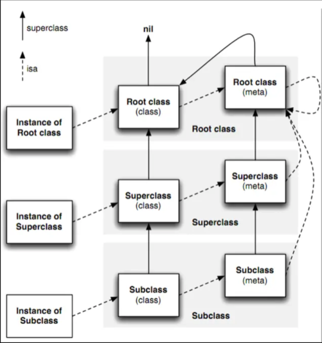

<br/>

- [**简介**](#简介)
	- [**基本概念**](#基本概念)
- [**类**](#类)
	- [获取类变量](#获取类变量)
	- [属性列表](#属性列表)
		- [获得类的属性列表](#获得类的属性列表)
	- [objc_object源码](#objc_object源码)
	- [objc_class结构体](#objc_object源码)
	- [Class(类)](#Class(类))
	- [Object(对象)](#Object(对象))
		- [实例对象和类对象存储](#实例对象和类对象存储)
		- [Object(对象)](#Object(对象))
	- [Meta Class(元类)](#MetaClass(元类))
		- [类之间的关系](#类之间的关系)
	- [Method(方法)](#Method(方法))
	- [AssociatedObject关联对象](#AssociatedObject关联对象)
		- [方法选择器@selector](#方法选择器@selector)
- [**消息转发机制**](#消息转发机制)
	- [消息发送](#消息发送)
		- [methodForSelector](#methodForSelector)
- **资料**
	- [class_method 参数](https://www.jianshu.com/p/e4237de0aedb)      
	- [performSelector](https://www.jianshu.com/p/672c0d4f435a)
	- 	[Runtime 详解 基础知识](https://www.jianshu.com/p/633e5d8386a8) 
	- 	**[深入了解Category](https://tech.meituan.com/2015/03/03/diveintocategory.html)**
	- 	[iOS runtime——函数/使用方法/使用场景/示例](https://blog.csdn.net/potato512/article/details/51106645)
	- 	**[Runtime源码分析](https://juejin.cn/post/6844903952039821320)**
	- [文章介绍](https://juejin.cn/user/3913917126673047/posts)


<br/>

***
<br/> 

> <h1 id='简介'>简介</h1>

&emsp;  Runtime被称为 `iOS 开发中的黑魔法`，是一套C 语言的API.

&emsp;  写好代码后，command+R 运行，这时代码在内存中运行。Runtime就是动态修改在内存中的对象，把类的方法和属性在内存中进行动态的改变。

&emsp;  C语言函数在调用编译的时候就会决定调用哪个函数，而OC是一种动态语言，它会尽可能把代码从编译链接推迟到运行时，这就是OC运行时的多态。


<br/>
<br/> 

> <h2 id='基本概念'>基本概念</h2>

先来做道[题](https://halfrost.com/objc_runtime_isa_class/)

<br/>

```
Obj *obj = [Obj new];
```

- `实例对象`：通常类的实例化的对象，比如：obj 就是一个实例对象；
- `类对象`：其实`类也是一个对象`，比如: Obj 其实也是一个对象；
- `元类`：其实就是 `类对象的isa`指向的类；
- `isa指针`：在objective-c语言的内部，每一个对象都有一个isa指针，指向该指针的类。每一个类描述了它的实例对象的特点，包括成员变量列表，成员函数列表。每一个实例对象都可以接收消息，而对象接收消息列表保存在它所对应的类中。比如：

```
NSObject *obj=[[NSObject alloc] init];

//调用方法，其实是给对象发送消息，在编译时这句话会翻译成一个C的函数调用
//使用这个函数的需要引入头文件 #import <objc/message.h>
objc_msgSend(objc_msgSend([NSObject class],@selector(alloc)),@selector(init));

```


<br/>
<br/>


&emsp;  Xcode中的NSObject.h和objc.h，我们可以看到，NSObject就是一个包含isa指针的结构体，按照面向对象的设计原则，所有的事物都应该是对象，所以严格的说OC并不是完全面向对象的（应为含有int double 类型的变量）。在OC语言中，每一个类实际上也是一个对象。每一个类也有一个isa指针。每一个类也可以接收消息，例如代码[NSObject alloc],就是向NSObject这个类发送名为 “alloc” 的消息。

> &emsp;  在OC中，因为类也是一个对象，所以也必须是另外一个类的实例，这个类就是元类(metaclass)。`元类保存了类方法的列表`。**当一个类方法被调用的时候，元类会首先查找他本身是否有该方法的实现，如果没有，则元类会向他的父类查找方法，这样就可以一直找到继承链的头。**


<br/>

***
<br/>

> <h1 id='类'>类</h1>


<br/>

```
//用于获取对象的isa指针指向的对象
object_getClass(id _Nullable obj) 

```

<br/><br/>

> <h3 id='获取类变量'>获取类变量</h3>


`class_copyIvarList(Class _Nullable cls, unsigned int * _Nullable outCount)`


```

    unsigned int icount = 0;
    id classObject = objc_getClass([@"AppDelegate" UTF8String]);
    Ivar *ivars = class_copyIvarList(classObject, &icount);
    NSLog(@"AppDelegate %d 个成员变量", icount);
    for (int i = 0; i < icount; i ++) {
        NSString *ivarName = [NSString stringWithUTF8String:ivar_getName(ivars[i])];
        NSLog(@"第 %d 个成员变量是：%@", i, ivarName);
    }

```

输出：

```
2019-05-15 11:40:47.309695+0800 Genealogy[3423:49651] AppDelegate 1 个成员变量

2019-05-15 11:40:55.189206+0800 Genealogy[3423:49651] 第 0 个成员变量是：_window
```


<br/>
<br/>


> <h2 id='属性列表'>属性列表</h2>

**property_getAttributes(objc_property_t _Nonnull property)**   

获取属性的真实类型

```
const char *attrs = property_getAttributes(property);

//Printing description of attrs:
(const char *) attrs = 0x0000000108cc3c26 "T@\"NSMutableArray<ShowNewsModel>\",&,N,V_list1"
```

[property_getAttributes()](https://www.jianshu.com/p/cefa1da5e775)


<br/><br/>

> <h3 id='获得类的属性列表'>获得类的属性列表</h3>


`class_copyPropertyList(Class _Nullable cls, unsigned int * _Nullable outCount)`

```
unsigned int icount = 0;
id classObject = objc_getClass([@"AppDelegate" UTF8String]);
objc_property_t *properties = class_copyPropertyList(classObject, &icount);
NSLog(@"AppDelegate %d 个属性变量", icount);
for (int i = 0; i < icount; i ++) {
    objc_property_t property = properties[i];
    
    NSString *propertyName = [[NSString alloc] initWithCString:property_getName(property) encoding:NSUTF8StringEncoding];
    NSLog(@"第 %d 个成员变量是：%@", i, propertyName);
}
```

输出：

```
2019-05-15 14:36:34.108732+0800 Genealogy[6014:112910] AppDelegate 5 个属性变量
2019-05-15 14:36:42.488907+0800 Genealogy[6014:112910] 第 0 个成员变量是：window
2019-05-15 14:36:45.498659+0800 Genealogy[6014:112910] 第 1 个成员变量是：hash
2019-05-15 14:36:45.499019+0800 Genealogy[6014:112910] 第 2 个成员变量是：superclass
2019-05-15 14:36:45.499275+0800 Genealogy[6014:112910] 第 3 个成员变量是：description
2019-05-15 14:36:45.499532+0800 Genealogy[6014:112910] 第 4 个成员变量是：debugDescription
```


<br/>
<br/>


> <h2 id='objc_object源码'>objc_object源码</h2>


点击 **#import <objc/objc.h>** ，可以发现class与object在Objective-C的定义：

[调试Runtime源码](https://zhuanlan.zhihu.com/p/27786725),[ **Runtime源码**](https://github.com/RetVal/objc-runtime)

```  
/// 代表一个被标志的类
//Class是一个objc_class结构类型的指针
typedef struct objc_class *Class;

/// 代表一个实例类
struct objc_object {
    Class _Nonnull isa  OBJC_ISA_AVAILABILITY;
};

typedef struct objc_object *id;

```


<br/>
<br/>


> <h2 id='objc_class结构体'>objc_class结构体</h2>

点击objc_class这个结构体，可以看到：

```

struct objc_class {
    // objc_class 结构体的实例指针
    Class _Nonnull isa  OBJC_ISA_AVAILABILITY; 

#if !__OBJC2__
    // 指向父类的指针
    Class _Nullable super_class                              OBJC2_UNAVAILABLE;
    // 类的名字 
    const char * _Nonnull name                               OBJC2_UNAVAILABLE;
    // 类的版本信息，默认为 0
    long version                                             OBJC2_UNAVAILABLE;
    // 类的信息，供运行期使用的一些位标识  
    long info                                                OBJC2_UNAVAILABLE;
    // 该类的实例变量大小;
    long instance_size                                       OBJC2_UNAVAILABLE;
    // 该类的实例变量列表
    struct objc_ivar_list * _Nullable ivars                  OBJC2_UNAVAILABLE;
    // 方法定义的列表
    struct objc_method_list * _Nullable * _Nullable methodLists                    OBJC2_UNAVAILABLE;
     // 方法缓存
    struct objc_cache * _Nonnull cache                       OBJC2_UNAVAILABLE;
    // 遵守的协议列表
    struct objc_protocol_list * _Nullable protocols          OBJC2_UNAVAILABLE;
#endif

} OBJC2_UNAVAILABLE;

```

<br/>
<br/>


> <h2 id='Class(类)'>Class(类)</h2>


> &emsp;  `struct objc_classs` 结构体里存放的数据称为`元数据(metadata)`，结构体内包含了isa、super_class(指向父类的指针)、属性(name[类的名字]、version[版本]、info、instance_size[实例大小])、ivars(实例变量列表)、methodLists(方法列表)、cache(缓存)、protocols(遵守的协议列表)。

&emsp;  这些信息就足够创建一个实例了，该结构体的第一个成员变量也是isa指针，这就说明了`Class`本身其实也是一个对象，我们称之为`类对象`，`类对象`在编译期产生用于创建`实例对象`。

&emsp;  类对象在编译时创建，每个类在运行时都有一个对应的类对象。类对象是 Objective-C 运行时的一个概念，与实例化的对象和单例不直接相关。单例是一种设计模式,对单例的操作实际上还是对实例对象的操作。

实例（对象）在内存中的存放通常是在堆（heap）上。在Objective-C和其他面向对象的语言中，对象通常是动态分配的，而堆是用于动态分配内存的区域。

- **alloc** 负责在堆上分配一块内存，但这块内存的内容（即实例变量的具体值）并不会被初始化。这就是为什么在使用alloc创建一个新对象后，通常会紧接着调用init方法，以确保对象的内存得到正确的初始化。


<br/>

- **init:** 用于初始化对象，它可以执行各种操作，包括给实例变量赋初值、设置默认属性等。在许多情况下，init方法会把对象的内存初始化为零值（即所有实例变量都被设置为零或nil）。但并不是所有的init方法都会清除内存，具体行为取决于类的实现。

	- 如果在init方法中没有显式地对实例变量进行初始化，那么它们的初始值将是不确定的，可能包含之前分配给该内存块的旧数据。这时，对于包含敏感信息的数据，开发者可能需要显式地将内存块清零

举个例子，如果一个类的init方法中有对实例变量进行手动的初始化，那么就不一定会将整个内存清零。例如：

```
- (instancetype)init {
    self = [super init];
    if (self) {
        // 手动初始化实例变量
        _myProperty = 42;
    }
    return self;
}
```

在这个例子中，_myProperty 被手动初始化为 42，而没有对整个内存块进行清零。


<br/><br/>

> <h2 id='实例对象和类对象存储'>实例对象和类对象存储</h2>


- **内存五大区:**

	- 栈: 局部变量.
	
	- 堆:堆区中的字节空间允许程序员手动的申请.
	
	- BSS段:未初始化的全局变量、静态变量.
	
	- 数据段:已经初始化的全局变量、静态变量和常量数据.
	
	- 代码段:存储代码的.
 


<br/>
<br/>

```
int main(int argc, const char * argv[]) {

		Person *p = [Person new];

    p->_age = 30;

    p->_height = 1.75;

    p->_weight = 65.0;

    NSLog(@"age = %i , height = %f, weight = %f", p->_age, p->_height, p->_weight);
    
    
    Person *p2 = [Person new];

    p2->_age = 50;

    p2->_height = 188;

    p2->_weight = 100;

    return 0;

}
```


<br/>

**1.类在内存中的存储:**
  

- 类什么时候加载到代码段?
	- 类第1次被访问的时候,类就会被加载到代码段存储类加载.

<br/>

- 类一旦被加载到代码段之后什么时候回收?
	- 是不会被回收的,除非程序结束.
	- 类是以Class对象的形式存储在代码段之中的.


<br/>
<br/>

**2.代码段中存储类的步骤**

- 2.1 先在代码段中创建1个类对象, 类是Foundation框架中的1个类.

	- 2.1.1 这个类对象就是用来存储类信息的.

<br/>

- 2.2 将类的信息存储在这个类对象之中.


	- 2.2.1 这个类对象至少有3个属性:

		- 类名:存储的这个类的名称.
		
		- 属性s:存储的这个类具有哪些属性
		
		- 方法s:存储的这个类具有哪些方法.


<br/>

所以.类是以类对象的形式存储在代码段的.

存储类的这个对象我们也叫做类对象.用来存储类的1个对象.


所以,存储类的类对象也有1个叫做isa指针的属性这个指针指该类对象的元类.


<br/>
<br/>

**3.如何拿到存储在代码段中的类对象**

1).调用类的类方法class就可以得到存储类的类对象的地址.

2). 调用对象的对象方法class就可以得到存储这个对象所属的类的Class对象的地址.

3). 对象中的isa指针的值其实就是代码段中存储类的类对象的地址.


注意:声明Class指针的时候不需要加*因为在typedef的时候已经加了*了.


<br/>
<br/>

**使用类对象**

拿到存储类的类对象以后.

```
Class c1 = [Person class];


///使用类对象来调用类的类方法
//类名来调用类方法.
[Person sayHi];

//使用c1来调用.因为c1就是Person
[c1 sayHi];


///使用类对象来调用new方法创建存储在类对象中的类的对象.
Person *p1 = [Person new];
Class c1 = [Person class];

//其实创建Person对象也可以这么做
Person *p2 = [c1 new];
```

- c1对象就是Person类.

- c1 完全等价于 Person


<br/>

- **实例对象:**

	- 1.从Person代码块加载代码;
	
	- 2、系统创建Person类的实例对象，存储在堆区其中存储当前类中的所有方法（类方法，对象方法);
	
	- 3、对象实例化

```
//定义一个指向Person类型的指针变量，存储在栈
Person *p = [Person new];
//将对象地址赋值给指针变量，即指针指向该对象
[Person new];
```

&emsp; 每new一次，都是实例化一个对象，在堆内存中开辟了一块新的存储空间
对象的地址就是isa的地址（对象的第一个成员），isa指向类对象.


<br/>
<br/>


<br/>
<br/>


> <h2 id='Object(对象)'>Object(对象)</h2>


&emsp;  这里的 id 被定义为一个指向 objc_object 结构体 的指针。从中可以看出 objc_object 结构体 只包含一个 Class 类型的 isa 指针。

&emsp; 换句话说，一个 Object（对象）唯一保存的就是它所属 Class（类） 的地址。当我们对一个对象，进行方法调用时，比如 [receiver selector];，它会通过 objc_object 结构体的 isa 指针 去找对应的 objc_class 结构体，然后在 objc_class 结构体 的 methodLists（方法列表） 中找到我们调用的方法，然后执行。


<br/>
<br/>


> <h2 id='MetaClass(元类)'>Meta Class(元类)</h2>


&emsp; 对象（objc_object 结构体） 的 isa 指针 指向的是对应的 类对象（objc_class 结构体）。那么 类对象（objc_class 结构体）的 isa 指针 又指向什么呢？

&emsp; objc_class 结构体 的 isa 指针 实际上指向的的是 类对象 自身的 Meta Class（元类）。

&emsp; Meta Class（元类） 就是一个类对象所属的 类。一个对象所属的类叫做 类对象，而一个类对象所属的类就叫做 元类。


<br/>
<br/><br/>

> <h2 id='类之间的关系'> 类之间的关系 </h2>


&emsp; 元类（Metaclass）的isa指针指向的是元类自身，而不是它所对应的类的元类。元类形成了一个层级结构，其中根元类（Root Metaclass）的isa指针指向自身，形成了一个封闭的环。

&emsp; 具体来说，对于一个类（Class A）而言，它的元类（MetaClass A）的isa指针指向根元类（Root Metaclass）。而根元类的isa指针则指向自身。

- **下面是更准确的描述：**
	- 一个类的元类的isa指针： 指向根元类（Root Metaclass）。
	- 根元类的isa指针： 指向自身，形成一个封闭的环。

<br/>
<br/>

&emsp; 在Objective-C中，每个类都有一个与之关联的元类（Metaclass），而元类本身也是一个类。根元类（Root Metaclass）指的是所有元类的根，它实际上是NSObject类的元类。

&emsp;  `类对象`中的`元数据`存储的都是如何创建一个实例的相关信息，那么`类对象`和`类方法`应该从哪里创建呢？就是从isa指针指向的结构体创建，`类对象`的isa指针指向的我们称之为`元类(metaclass)`，元类中保存了创建类对象以及类方法所需的所有信息，因此如简单字符串创建整个结构应该如下图所示:


```
NSString *str = @“Hello World”;
```

<br/>

**用图举一个例子:**


<br/>
<br/>

str的isa指针指向NSString,那NSString的isa指针指向谁?

NSString的supperClass指向谁?

<br/>

**回答你的具体问题：**

&emsp; 在你的例子中，当你创建一个NSString类的实例时，这个实例的isa指针指向NSString类对象。然后，NSString类对象的isa指针指向NSObject类的元类，即根元类。

- **具体流程如下：**

- NSString类的实例 str 的isa指针指向 NSString类对象。
- NSString类对象的isa指针指向 NSObject类的元类（根元类）。

所以，根元类指的是NSObject类的元类。


<br/>


&emsp;  通过上图我们可以清晰的看出来一个`实例对象`也就是`struct objc_object结构体`它的isa指针指向`类对象`，`类对象`的isa指针指向了`元类`，`super_class指针`指向了父类的`类对象`，而元类的`super_class指针`指向了父类的`元类`，那元类的isa指针又指向了什么？为了更清晰的表达直接使用一个大神画的图。



<br/>

**用这个图举一个清晰例子:**


在 Objective-C 中，元类（metaclass）的 isa 指针最终指向根元类。在这个层次结构中，NSObject 类的元类是整个类和元类层次结构的根元类。所以，确切地说：

- NSObject 的元类指向根元类。
- 根元类的 isa 指针也指向 NSObject 类的元类。


&emsp; 这形成了一个封闭的环，确保整个类和元类的层次结构有一个共同的根元类。因此，根元类的 isa 指针最终指向 NSObject 类的元类。

<br/>


由上图我们可以得到：
-  整个体系构成了一个自闭环，如果是从NSObject中继承而来的上图中的Root class就是NSObject。至此，整个实例、类对象、元类的概念也就讲清了，接下来我们在代码中看看这些概念该怎么应用。

-  实例对象的isa指向类对象，当调用对象方法，通过实例对象的isa 找到类对象,最终找到对对象方法进行调用;
-  类对象的isa指向元类，调用类方法，通过类对象中的isa找到元类，最终找到元类中的类方法进行调用;
-  当子类的对象要调用`父类的对象方法`，先通过子类的isa找到父类(子类的元类), 然后通过superClass指针找到父元类,父元类最后找到消息进行调用。

```

@interface Person : NSObject

@property(nonatomic, assign) NSInteger age;
@property(nonatomic, copy)  NSString *name;

@end


//c1是通过一个实例对象获取的Class，实例对象可以获取到其类对象;
//类名作为消息的接受者时代表的是类对象，因此类对象获取Class得到的是其本身，同时也印证了类对象是一个单例的想法。
Person *person = [[Person alloc] init];
NSLog(@"person 对象：%@",person);
//person 对象：<Person: 0x600000c4f260>
    
Class c1 = [person class];
Class c2 = [Person class];
//输出1
NSLog(@"%d", c1 == c2);
    

//class_isMetaClass用于判断Class对象是否为元类
//object_getClass用于获取对象的isa指针指向的对象    
 NSLog(@"2.  %d", [person class] == object_getClass(person));
//输出2.  1
NSLog(@"3.  %d", class_isMetaClass(object_getClass(person)));
//输出3.  0
NSLog(@"4.  %d", class_isMetaClass(object_getClass([Person class])));
//输出4.  1
NSLog(@"5.  %d", object_getClass(person) == object_getClass([Person class]));
//输出5.  0

NSLog(@"6. %@",object_getClass([person class]));
//6. Person
NSLog(@"7. %@",[Person class]);
//7. Person

NSLog(@"8. %@", object_getClass([Person class]));
//8. Person
NSLog(@"9. %@", object_getClass(object_getClass([Person class])));
//9. NSObject
NSLog(@"10. %@", object_getClass(object_getClass(object_getClass([Person class]))));
//10. NSObject

```

`总结：`

- **通过`class`方法获取的Class要分两种情况：**
	- 当obj为实例对象时, 调用[obj class]时，class 就是实例方法，返回的就是obj实例对象isa指针指向的类对象
	- 当[Obj class]调用时，Obj 为类对象（包括元类和根类以及根元类）时，调用的是类方法：+ (Class)class，返回的结果为其本身。

- **使用 object_getClass 方法分析：**
-  当参数obj为Object实例对象
	-  object_getClass(obj)与[obj class]输出结果一直，均获得isa指针，即指向类对象的指针。

- 当参数obj为Class类对象
	- object_getClass(obj)返回类对象中的isa指针，即指向元类对象的指针；[obj class]返回的则是其本身。

- 当参数obj为Metaclass类对象
	- object_getClass(obj)返回元类对象中的isa指针，因为元类对象的isa指针指向根类，所有返回的是根类对象的地址指针；[obj class]返回的则是其本身。

- obj为Rootclass类对象
	- object_getClass(obj)返回根类对象中的isa指针，因为根类对象的isa指针指向Rootclass‘s metaclass(根元类)，即返回的是根元类的地址指针；[obj class]返回的则是其本身。


```
//获取 class为NSObject的元类对象
Class class = object_getClass([NSObject class]);
```

<br/>

建立一个Person 类：

```
#import <Foundation/Foundation.h>

NS_ASSUME_NONNULL_BEGIN

@interface Person : NSObject

@property(nonatomic, assign) NSInteger age;

@end

NS_ASSUME_NONNULL_END

```


控制台 person 实例对象包含的内容:


从上图可以看到person实例对象包含一个isa指针、属性变量。
每个类在内存中有且只有一个类对象，所以每个类在内存中也有且只有一个元类对象;

当你给对象发送消息时，消息是在寻找这个对象的类的方法列表;
当你给类发消息时，消息是在寻找这个类的元类的方法列表。


 

<br/>
<br/>


> <h2 id='Method(方法)'>Method(方法)</h2>


```
struct objc_method {
    SEL _Nonnull method_name   //方法的名字
    char * _Nullable method_types    //参数的类型
    IMP _Nonnull method_imp	//就是函数的地址
} 

```


<br/>
<br/>


> <h2 id='AssociatedObject关联对象'>AssociatedObject关联对象</h2>

[**AssociatedObject 完全解析**](https://www.jianshu.com/p/79479a09a8c0)

[**基本用法**](https://www.jianshu.com/p/6f1343c7be26)

[**demo**](https://www.jianshu.com/p/52a28d59ef10)

[**Runtime探索**](https://www.jianshu.com/u/2de707c93dc4)

<br/>
<br/>

简介：关联是指把两个对象相互关联起来,使得其中的一个对象作为另外一个对象的一部分。一般用在分类中，因为在分类中是不可以再次申明定义一个属性变量的，这时可以用关联属性。

```
objc_getAssociatedObject(id _Nonnull object, const void * _Nonnull key);

objc_setAssociatedObject(id _Nonnull object, const void * _Nonnull key, id _Nullable value, objc_AssociationPolicy policy);
```


<br/>

```
#import "DKObject+Category.h"
#import <objc/runtime.h>

@implementation DKObject (Category)

- (NSString *)categoryProperty {
    return objc_getAssociatedObject(self, _cmd);
}

- (void)setCategoryProperty:(NSString *)categoryProperty {
	//@selector(categoryProperty)实际上是获取categoryProperty属性的getter方法的选择器
	objc_setAssociatedObject(self, @selector(categoryProperty), categoryProperty, OBJC_ASSOCIATION_RETAIN_NONATOMIC);
}

@end
```

&emsp; **@selector(categoryProperty)** 也就是参数中的 key，其实可以使用静态指针 `static void *` 类型的参数来代替，不过在这里，笔者强烈推荐使用 `@selector(categoryProperty)` 作为 key 传入。因为这种方法省略了声明参数的代码，并且能很好地保证 key 的唯一性。


<br/>

<br/><br/>

> <h2 id='方法选择器@selector'>方法选择器@selector</h2>


&emsp; 方法选择器（Method Selector）**@selector()** 不管程序是第一次还是第二次启动，@selector(name) 都会返回相同的选择器值;

用于表示方法名的一种数据类型。它是一个在编译时创建的指针，指向方法的名称。选择器是一种轻量级的对象，用于在运行时进行方法的查找和调用。

方法选择器的主要用途包括：

消息传递： 通过选择器，可以向对象发送消息，让对象执行特定的方法。
运行时方法调用： 在运行时，你可以使用选择器来调用对象的方法，这为动态调用提供了一种机制。
获取方法信息： 选择器也可以用于获取方法的信息，如方法的参数类型、返回类型等。
下面是一个简单的示例，演示如何使用方法选择器：

```
#import <Foundation/Foundation.h>

@interface MyClass : NSObject

- (void)methodA;
- (void)methodB;

@end

@implementation MyClass

- (void)methodA {
    NSLog(@"Executing methodA");
}

- (void)methodB {
    NSLog(@"Executing methodB");
}

@end

int main(int argc, const char * argv[]) {
    @autoreleasepool {
        // 创建类的实例
        MyClass *myObject = [[MyClass alloc] init];
        
        // 获取方法选择器
        SEL methodSelectorA = @selector(methodA);
        SEL methodSelectorB = @selector(methodB);
        
        // 使用选择器调用方法
        [myObject performSelector:methodSelectorA];
        [myObject performSelector:methodSelectorB];
        
        // 获取方法信息
        Method methodA = class_getInstanceMethod([myObject class], methodSelectorA);
        const char *methodNameA = sel_getName(methodSelectorA);
        const char *methodReturnTypeA = method_getTypeEncoding(methodA);
        
        NSLog(@"Method A: Name = %s, Return Type = %s", methodNameA, methodReturnTypeA);
    }
    return 0;
}

```


<br/>

***
<br/>

># <h1 id='消息转发机制'>[消息转发机制](https://blog.csdn.net/wtdask/article/details/80613446)</h1>


&emsp;   原理：Objective-C 语言 中，对象方法调用都是类似 `[receiver selector]; `的形式，其本质就是让对象在运行时发送消息的过程。


<br/>


**`编译阶段：`**`[receiver selector];` 方法被编译器转换为:

```
objc_msgSend(receiver，selector) （不带参数）
objc_msgSend(recevier，selector，org1，org2，…)（带参数）
```

<br/>

**运行时阶段：** 消息接受者 recever 寻找对应的 selector。

> &emsp;  通过 recevier 的 isa 指针 找到 recevier 的 Class（类）；

> &emsp;  在 Class（类） 的 cache（方法缓存） 的散列表中寻找对应的 IMP（方法实现）；

> &emsp;  如果在 cache（方法缓存） 中没有找到对应的 IMP（方法实现） 的话，就继续在 Class（类） 的 method list（方法列表） 中找对应的 selector，如果找到，填充到 cache（方法缓存） 中，并返回 selector；

> &emsp;  如果在 Class（类） 中没有找到这个 selector，就继续在它的 superClass（父类）中寻找,沿着这个类的继承链一直向上查找，直到找到为止。这个过程一直持续到根类（通常是NSObject），查找就会停止。

>一旦找到对应的 selector，直接执行 recever 对应 selector 方法实现的 IMP（方法实现）。

> &emsp;  如果在整个继承链上都找不到对应方法的实现，消息被转发或者临时向 recever 添加这个 selector 对应的实现方法，否则就会发生崩溃。

消息转发示意图:


<br/>

**疑问1:如果在整个继承链上都找不到方法的实现，那么系统会继续查找元类（metaclass）的方法实现吗? 也就是说先查找继承链方法,再通过isa查找元类方法吗?是这样的吗**

&emsp; 在 Objective-C 中，当对象调用方法时，系统会首先在对象的类及其父类中查找方法实现，而不会直接在元类（metaclass）中查找.**记住:不会在元类中进行查找‼️**

&emsp; 在这个过程中，系统并没有直接查找元类中的方法实现。元类主要用于存储类方法（类的静态方法）的实现，而不是实例方法。

&emsp; 所以，综上所述，在 Objective-C 中，实例方法的查找是通过类的继承链来进行的，而不是直接查找元类。元类主要用于存储类方法的实现，这些方法是与类本身关联的，而不是与类的实例对象关联的。


<br/>

**疑问2:若是类调用类方法,会先去继承链查找然后在通过isa指针找到元类,然后一直找到根元类吗?**


&emsp; 在 Objective-C 中，当类调用类方法时，会首先在类本身及其父类的类对象（class object）中查找方法的实现，而不是直接通过 isa 指针查找元类。

&emsp; 具体的查找过程如下：

- 在当前类对象中查找： 系统首先在类对象中（class object）查找是否有对应类方法的实现。
- 沿着继承链向上查找： 如果在当前类对象中找不到对应类方法，系统会沿着该类的继承链向上查找，依次检查父类的类对象，父类的父类的类对象，一直到根类的类对象。
- 找到或者到达根类： 当找到具有相应类方法实现的类对象，或者到达继承链的根类的类对象（通常是元类），查找就会停止。
- 元类（metaclass）主要用于存储类方法的实现，但在查找类方法时，并不是直接通过 isa 指针查找元类。相反，类对象中有一个指向对应元类的 isa 指针，所以在查找类方法时，实际上是通过类对象的 isa 指针沿着类对象的继承链向上查找元类的。

&emsp; 总体而言，类方法的查找是通过类对象及其继承链中的元类来进行的

<br/>

**其实上面简单的说就是给类对象发送消息(调用类方法),其流程简短来说:**

- 根据类对象的isA指针去元对象中查找，如果找到了就执行
- 如果没有找到就去父元对象中查找
- 如果如果没有找到就一直往上查找，直到根类（NSOject）
- 如果都没有找到就报错


<br/>
<br/>

创建一个MessageSend类

```
#import <Foundation/Foundation.h>

NS_ASSUME_NONNULL_BEGIN

@interface MessageSend : NSObject

- (void)sendMessage:(NSString *)message;

@end

NS_ASSUME_NONNULL_END

```

调用：


```
- (void)test {
    MessageSend *ms = [MessageSend new];
    
    [ms sendMessage:@"Hello"];
}

```

crash 错误：

```
2019-11-17 11:20:08.972291+0800 HGSWB[49471:2551396] -[MessageSend sendMessage:]: unrecognized selector sent to instance 0x600000e042d0

2019-11-17 11:20:09.047606+0800 HGSWB[49471:2551396] Terminating app due to uncaught exception 'NSInvalidArgumentException', reason: '-[MessageSend sendMessage:]: unrecognized selector sent to instance 0x600000e042d0'
```

<br/>

**`①消息动态解析`**

在MessageSend.m 添加方法

```
#import "MessageSend.h"

@implementation MessageSend

void dynamicMethodIMP11(id self, SEL _cmd, NSString *msg) {
    NSLog(@"%@的方法转发到Here: %@ ----> %@", self, NSStringFromSelector(_cmd), msg);
}


//系统方法
+ (BOOL)resolveInstanceMethod:(SEL)sel {    //实例
    
   /*@param cls    给哪个类添加方法
    *@param name   方法列表中的名字，方法编号
    *@param imp    方法实现
    *@param        参数
    * @return      如果添加方法成功返回 YES，否则返回 NO
    */
    //class_addMethod(Class _Nullable cls, SEL _Nonnull name, IMP _Nonnull imp, const char * _Nullable types)
    if (sel == @selector(sendMessage:)) {
        
        return class_addMethod([self class], sel, (IMP)dynamicMethodIMP11, "v@:");
    }
    
    return [super resolveInstanceMethod:sel];
    
}

@end
```

打印：

```
2019-11-17 11:38:18.171651+0800 HGSWB[50214:2594517] <MessageSend: 0x6000002517a0>的方法转发到Here: sendMessage: ----> Hello
```

查看参数类型，看[这里](https://developer.apple.com/library/archive/documentation/Cocoa/Conceptual/ObjCRuntimeGuide/Articles/ocrtTypeEncodings.html#//apple_ref/doc/uid/TP40008048-CH100)

<br/>

**`②消息接受者重定向`**

&emsp;  若上步中 `+resolveInstanceMethod:` 或者` +resolveClassMethod:` 没有添加其他函数实现，运行时就会进行下一步：消息接受者重定向。

&emsp;  若当前对象实现了 `-forwardingTargetForSelector:`，Runtime 就会调用这个方法，允许我们将消息的接受者转发给其他对象。


创建一个 SubMessageSend 类

```
//.h 文件
#import <Foundation/Foundation.h>

NS_ASSUME_NONNULL_BEGIN

@interface SubMessageSend : NSObject

@end

NS_ASSUME_NONNULL_END


//.m文件
#import "SubMessageSend.h"

@implementation SubMessageSend

- (void)sendMessage:(NSString *)message {
    NSLog(@"SubMessageSend 的 sendMessage 方法");
}

@end
```

MessageSend.m 文件

```
#import "MessageSend.h"
#import "SubMessageSend.h"

@implementation MessageSend

- (id)forwardingTargetForSelector:(SEL)aSelector {
    NSString *methodName = NSStringFromSelector(aSelector);
    if ([methodName isEqualToString:@"sendMessage:"]) {
        return [[SubMessageSend alloc] init];
    }
    
    return [super forwardingTargetForSelector:aSelector];
}
@end

```

打印：
```
2019-11-17 11:51:28.940038+0800 HGSWB[50835:2628501] SubMessageSend 的 sendMessage 方法
```


<br/>

**`③消息重定向`**

&emsp;  如果经过消息动态解析、消息接受者重定向，Runtime 系统还是找不到相应的方法实现而无法响应消息，Runtime 系统会利用 `methodSignatureForSelector: `方法获取函数的参数和返回值类型。

&emsp;  如果 `methodSignatureForSelector: `返回了一个 `NSMethodSignature` 对象（函数签名），Runtime 系统就会创建一个 `NSInvocation` 对象，并通过 `forwardInvocation: (翻译:转发调用)`消息通知当前对象，给予此次消息发送最后一次寻找 IMP 的机会。
如果` -methodSignatureForSelector:` 返回 nil。则 Runtime 系统会发出 `-doesNotRecognizeSelector: `消息，程序也就崩溃了。

```
#import "MessageSend.h"
#import "SubMessageSend.h"

@implementation MessageSend


/// 消息重定向(系统方法)
/// @param aSelector 方法名
- (NSMethodSignature *)methodSignatureForSelector:(SEL)aSelector {
    
    //获取函数的参数和返回值类型，返回签名
    if ([NSStringFromSelector(aSelector) isEqualToString:@"sendMessage:"]) {
        //调用forwardInvocation:，如果返回nil调用doesNotRecognizeSelector:
        return [NSMethodSignature signatureWithObjCTypes:"v@:"];
    }
    
    return [super methodSignatureForSelector:aSelector];
}

- (void)forwardInvocation:(NSInvocation *)anInvocation {
    
    //从 anInvocation 中获取消息
    SEL sel = anInvocation.selector;
    
    SubMessageSend *sms = [[SubMessageSend alloc] init];
    
    if ([sms respondsToSelector:sel]) { //判断 SubMessageSend 对象方法是否可以响应 sel
        [anInvocation invokeWithTarget:sms];    //若可以响应，则将消息转发给其他对象处理
    }else {
        [self doesNotRecognizeSelector:sel];    // 若仍然无法响应，则报错：找不到响应方法
    }
}

- (void)doesNotRecognizeSelector:(SEL)aSelector {
    NSLog(@"doesNotRecognizeSelector 不要逼我了，我没办法了，我要 Crash 了！！！");
}

@end
```

&emsp; 因为 `SubMessageSend` 类中有 `sendMessage:` 可以相应，所以可以打印：

```
2019-11-17 12:41:04.617546+0800 HGSWB[52721:2786753] SubMessageSend 的 sendMessage 方法
```

当我在控制台中使用命令 `po anInvocation.methodSignature` 时，打印如下：


&emsp;  当我把 `SubMessageSend` 类中 `sendMessage:` 方法注掉后会打印：
`2019-11-17 12:47:29.881606+0800 HGSWB[53142:2878060] doesNotRecognizeSelector 不要逼我了，我没办法了，我要 Crash 了！！！
`

<br/>

消息发送以及转发机制总结：

调用 [receiver selector]; 后，进行的流程：

- `编译阶段：[receiver selector];` 方法被编译器转换为:

  ```
  objc_msgSend(receiver，selector) （不带参数）
  objc_msgSend(recevier，selector，org1，org2，…)（带参数）
  ```

-  `运行时阶段：`消息接受者 recever 寻找对应的 selector。
     
     &emsp;   通过 recevier 的 isa 指针 找到 recevier 的 class（类）；
     
    &emsp;   在 Class（类） 的 cache（方法缓存） 的散列表中寻找对应的 IMP（方法实现）；
    
    &emsp;   如果在 cache（方法缓存） 中没有找到对应的 IMP（方法实现） 的话，就继续在 Class（类） 的 method list（方法列表） 中找对应的 selector，如果找到，填充到 cache（方法缓存） 中，并返回 selector；
    
    &emsp;   如果在 class（类） 中没有找到这个 selector，就继续在它的 superclass（父类）中寻找；
    
    &emsp;   一旦找到对应的 selector，直接执行 recever 对应 selector 方法实现的 IMP（方法实现）。
    
    &emsp;   若找不到对应的 selector，Runtime 系统进入消息转发机制。

- `运行时消息转发阶段`

   &emsp; ` 动态解析：`通过重写 `+resolveInstanceMethod:` 或者 `+resolveClassMethod:`方法，利用 `class_addMethod` 方法添加其他函数实现；
   
 &emsp; `消息接受者重定向：`如果上一步添加其他函数实现，可在当前对象中利用 `-forwardingTargetForSelector:` 方法将消息的接受者转发给其他对象；
 &emsp; `消息重定向：`如果上一步没有返回值为 nil，则利用 `-methodSignatureForSelector:`方法获取函数的参数和返回值类型。
 
 &emsp; 如果 `-methodSignatureForSelector: `返回了一个 `NSMethodSignature` 对象（函数签名），Runtime 系统就会创建一个 `NSInvocation 对象`，并通过 `-forwardInvocation:` 消息通知当前对象，给予此次消息发送最后一次寻找 IMP 的机会。
 
  &emsp; 如果 `-methodSignatureForSelector:` 返回 nil。则 Runtime 系统会发出 `-doesNotRecognizeSelector: `消息，程序也就崩溃了。


<br/>
<br/>

> <h2 id='消息发送'>消息发送</h2>

&emsp;  执行一个方法，有些语言，编译器会执行一些额外的优化和错误检查，因为调用关系很直接也很明显。但对于消息分发来说，就不那么明显了。在发消息前不必知道某个对象是否能够处理消息。你把消息发给它，它可能会处理，也可能转给其他的 Object 来处理。一个消息不必对应一个方法，一个对象可能实现一个方法来处理多条消息。

&emsp;  在Objective-C:中，消息是通过objc_msgSend()这个 runtime 方法及相近的方法来实现的。这个方法需要一个target，selector，还有一些参数。理论上来说，编译器只是把消息分发变成objc_msgSend来执行。比如下面这两行代码是等价的:

```
[array insertObject:foo atIndex:5];

objc_msgSend(array, @selector(insertObject:atIndex:), foo, 5);
```


<br/><br/>

> <h3 id='methodForSelector'>methodForSelector</h3>

这个方法可以根据一个SEL，得到该方法的IMP（函数指针,即函数实现地址）

简单测试下:

```
- (void)viewDidLoad {
    [super viewDidLoad];
    IMP imp = [self methodForSelector:@selector(sayHi)];
    imp();

}
- (void)sayHi {
    NSLog(@"hello world");
}
```

Log:

```
MethodForSelector[755:215807] hello world
```

需要注意的是- (IMP)methodForSelector:(SEL)aSelector参数aSelector即使是私有方法，即在.h文件中没有暴露接口也会调用成功.

<br/>
<br/>


复杂的一点来:

**ViewController.h文件**

```
#import <UIKit/UIKit.h>

@interface HGWeiBoController : HGBaseController

@end

@interface YTest : NSObject

- (void)runtime1Test:(BOOL)can;

@end

```

<br/>

**HGWeiBoController.h文件**

```
#import <UIKit/UIKit.h>

@interface HGWeiBoController : HGBaseController

@end

@interface YTest : NSObject

- (void)runtime1Test:(BOOL)can;

@end
```

<br/>

**HGWeiBoController.m文件**

```
@implementation HGWeiBoController

///点击
[_testBtn addTarget:self action:@selector(test) forControlEvents:UIControlEventTouchUpInside];

-(void)testmethodForSelector:(id)sender {
    NSLog(@"---->> %@",sender);
}

-(void)test {
    YTest *xsqObj = [YTest new];
    [xsqObj runtime1Test:false];
    
    //绕过晚绑定，自己获取函数指针
    void (*function)(id, SEL,BOOL) = (void(*)(id, SEL,BOOL))[xsqObj methodForSelector:@selector(runtime1Test:)];
    //    NSObject *obj = [NSObject new];
    function(self, @selector(testmethodForSelector:),YES);
}


@end


@implementation YTest

- (void)runtime1Test:(BOOL)can
{
    NSLog(@"self: %@", [self class]);
    NSLog(@"_cmd: %@", NSStringFromSelector(_cmd));
    NSLog(@"---------------------- %d",can);
    NSLog(@"----------------------");
    if (![self isKindOfClass:[YTest class]])
    {
        [self performSelector:_cmd withObject:@"taibangle" afterDelay:5.0f];
    }
    
}

@end
```

Log:

```
2023-06-21 15:21:06.050691+0800 MLC[38857:5604424] ---->> taibangle
2023-06-21 15:21:07.389772+0800 MLC[38857:5604424] self: YTest
2023-06-21 15:21:07.390052+0800 MLC[38857:5604424] _cmd: runtime1Test:
2023-06-21 15:21:07.390155+0800 MLC[38857:5604424] ---------------------- 0
2023-06-21 15:21:07.390246+0800 MLC[38857:5604424] ----------------------


///使用HGWeiBoController调用了YTest的runtime1Test方法
2023-06-21 15:21:07.390358+0800 MLC[38857:5604424] self: HGWeiBoController
2023-06-21 15:21:07.390496+0800 MLC[38857:5604424] _cmd: testmethodForSelector:
2023-06-21 15:21:07.390589+0800 MLC[38857:5604424] ---------------------- 1
2023-06-21 15:21:07.390676+0800 MLC[38857:5604424] ----------------------
2023-06-21 15:21:12.392251+0800 MLC[38857:5604424] ---->> taibangle
```


<br/>

***
<br/>


                                   
