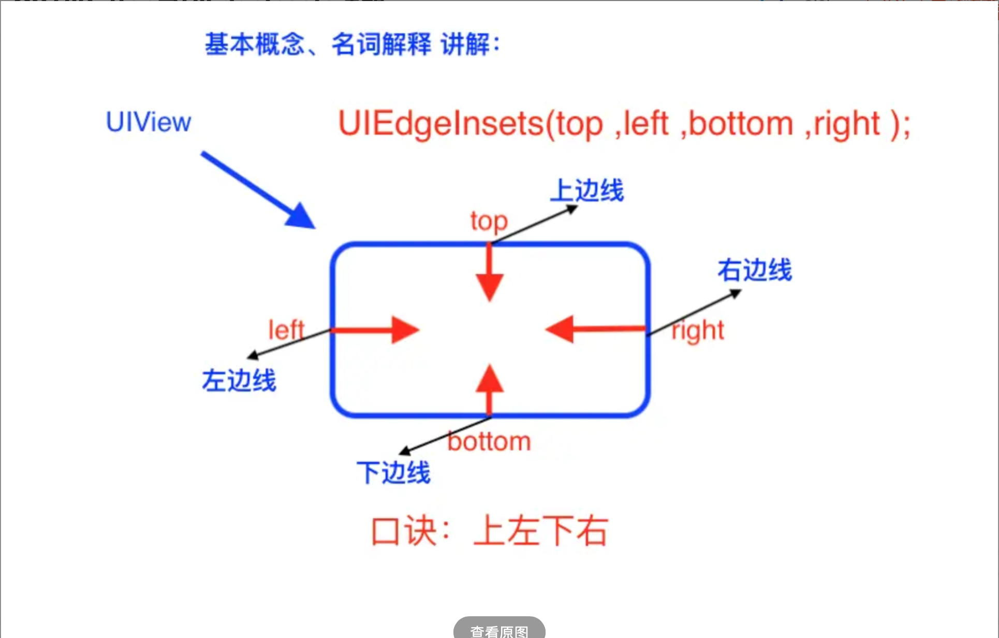
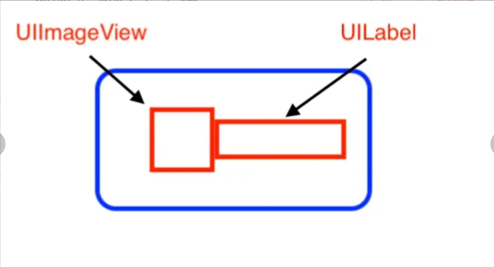
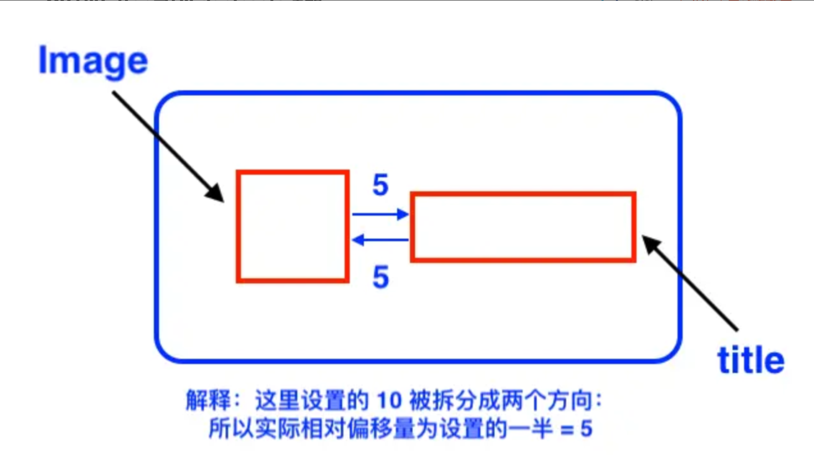
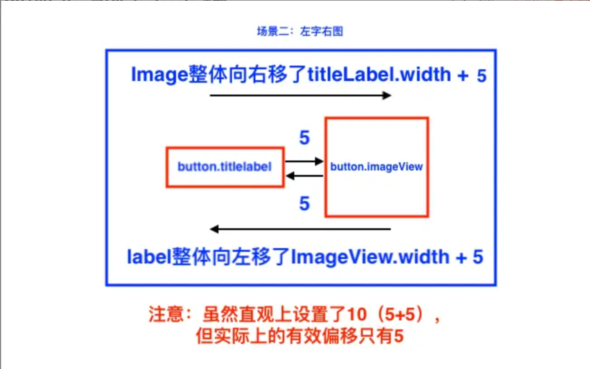
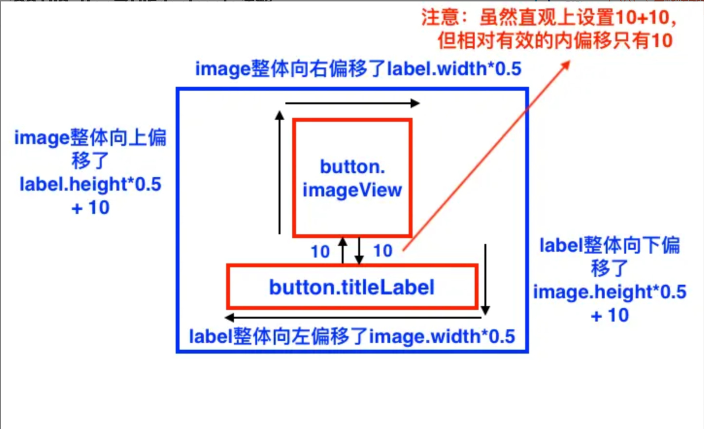

> <h2></h2>
- [**图片和文字位置**](#图片和文字位置)
	- [左图右文字](#左图右文字)
	- [2.左字右图](#2.左字右图)
	- [3.上图下字](#3.上图下字)
- [避免频繁点击](#避免频繁点击)


<br/>

***
<br/><br/>

> <h1 id='图片和文字位置'>图片和文字位置</h1>

看一下苹果官方对UIEdgeInsets说明：

```
typedef struct UIEdgeInsets {
    CGFloat top, left, bottom, right;  
// specify amount to inset (positive) for each of the edges. values can be negative to 'outset'
} UIEdgeInsets;
```

官方：specify amount to inset (positive) for each of the edges. values can be negative to 'outset' .

解释：对每条边向内方向的偏移量，可以为正值（向内偏移）也可以为负值（向外偏移）。

比如UICollectionView的layout的使用:

```

xxx.edgeInsets = UIEdgeInsetsMake(.0, .0, .0, .0);

//例如我们设置UICollectionView的edgeInset会使collectionView产生内偏移
UICollectionViewFlowLayout *layout = [[UICollectionViewFlowLayout alloc] init];
layout.sectionInset = UIEdgeInsetsMake(20.0, .0, .0, .0);
```

这个和UIButton的内偏移量有点区别的,UIButton的内偏移量是向着中心的方向为正方向,如下图:




<br/>

正常没有偏移的UIButtn的title和图片的位置,如下:




<br/><br/>

> <h2 id='左图右文字'>左图右文字</h2>

- **1.左图右文字,2者相比默认距离为5,如下:**

```
button.titleEdgeInsets = UIEdgeInsetsMake(0, 10.0, 0, 0);
```

语法解释：设置了title的左边线的内偏移量为10.0，

但经测试，
注意：实际上title和Image只有5.0的距离
注意：实际上title和Image只有5.0的距离
注意：实际上title和Image只有5.0的距离

图解如下：




在这种场景下：

title的 上边线、右边线、下边线 内偏移 是相对于contentView的
image的 上边线、左边线、下边线 内偏移 是相对于contentView的
title的 左边线 内偏移 相对于image
image的 右边线 内偏移 相对于title

<br/>

效果图:


<br/><br/>> <h2 id='2.左字右图'>2.左字右图</h2>

```
button.titleEdgeInsets = UIEdgeInsetsMake(.0, - button.imageView.bounds.size.width - 10.0, .0, button.imageView.bounds.size.width);
button.imageEdgeInsets = UIEdgeInsetsMake(.0, button.titleLabel.bounds.size.width, .0, - button.titleLabel.bounds.size.width);

```




语法解释：

- title的 左边线 内偏移 - (imageView.width +10）<=> 等价于 title的左边线 向 内偏移的反方向 移动 (image.width +10)

- title的 右边线 内偏移 imageView.width <=> 等价于 title的右边线 向 内偏移的正方向 移动 imageView.width

- image的 左边线 内偏移 titleLabel.width <=> 等价于 image的左边线 向 内偏移的正方向 移动 titleLabel.width

- image的 右边线 内偏移 - titleLabel.width <=> 等价于 title的左边线 向 内偏移的反方向 移动 titleLabel.width


<br/>

效果图:


<br/>
<br/>

<br/><br/>> <h2 id='3.上图下字'>3.上图下字</h2>


```
button.titleEdgeInsets = UIEdgeInsetsMake(button.imageView.frame.size.height + 10.0, - button.imageView.bounds.size.width, .0, .0);
button.imageEdgeInsets = UIEdgeInsetsMake(.0, button.titleLabel.bounds.size.width / 2, button.titleLabel.frame.size.height + 10.0, - button.titleLabel.bounds.size.width / 2);
```


请看图解：





语法解释：

- title的 上边线 内偏移 (imageView.height +10）<=> 等价于 title的上边线 向 内偏移的正方向 移动 (image.height +10)

- title的 左边线 内偏移 - imageView.width <=> 等价于 title的左边线 向 内偏移的反方向 移动 image.width

- image的 左边线 内偏移 titleLabel.width * 0.5 <=> 等价于 image的左边线 向 内偏移的正方向 移动 titleLabel.width 的一半

- image的 下边线 内偏移 titleLabel.height + 10 <=> 等价于 image的下边线 向 内偏移的正方向 移动 titleLabel.height + 10

- image的 右边线 内偏移 - titleLabel.width * 0.5 <=> 等价于 image的右边线 向 内偏移的反方向 移动 titleLabel.width 的一半


<br/>

效果图:


<br/>
<br/>

<br/>
<br/>


<br/>

***
<br/><br/>

># <h1 id='避免频繁点击'>[避免UIButton频繁点击](https://juejin.cn/post/6899057632716750855)</h1>


<br/>

***
<br/>


