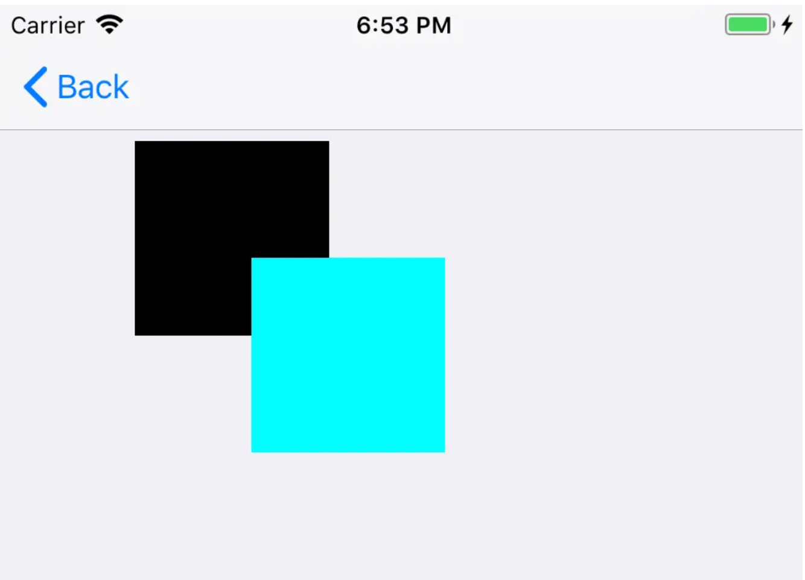

- [视图位置和尺寸](#视图位置和尺寸)
- [**更新页面方法简介**](#更新页面方法简介)
	- [setNeedsLayout](#setNeedsLayout)
	- [layoutIfNeeded](#layoutIfNeeded)
	- [layoutSubviews](#layoutSubviews)
	- [setNeedsUpdateConstraints](#setNeedsUpdateConstraints)
	- [updateConstraintsIfNeeded](#updateConstraintsIfNeeded)
	- [updateConstraints](#updateConstraints)
	- [Controller的方法updateViewConstraints方法](#Controller的方法updateViewConstraints方法)
- [**layoutSubviews**](#layoutSubviews)
	- [layoutSubviews 会调用的情况](#layoutSubviews会调用的情况)
	- [layoutSubviews 不会调用的情况](#layoutSubviews不会调用的情况)
- [**UIView视图更新与重绘**](#UIView视图更新与重绘)
	- [对应的事件序列](#对应的事件序列)
	- [通知 Controller 有数据变化](#通知Controller有数据变化)
- [setNeedsLayout和setNeedsDisplayInRect区别](#setNeedsLayout和setNeedsDisplayInRect区别)
- [**视图绘制循环**](#视图绘制循环)


<br/>

***

<br/><br/><br/>

> <h1 id="视图位置和尺寸">视图位置和尺寸</h1>

**📌 CGRect / UIView.frame 常用几何属性对照表**

| 属性       | 含义       | 等价表达式                   |
| -------- | -------- | ----------------------- |
| `minX`   | 最小 X（左侧） | `origin.x`              |
| `midX`   | X 方向中心点  | `origin.x + width / 2`  |
| `maxX`   | 最大 X（右侧） | `origin.x + width`      |
| `minY`   | 最小 Y（顶部） | `origin.y`              |
| `midY`   | Y 方向中心点  | `origin.y + height / 2` |
| `maxY`   | 最大 Y（底部） | `origin.y + height`     |
| `width`  | 宽度       | `size.width`            |
| `height` | 高度       | `size.height`           |
| `origin` | 起点坐标     | `CGPoint(x, y)`         |
| `size`   | 尺寸       | `CGSize(width, height)` |

---
<br/> 

**📌 UIView 额外的位置 & 尺寸属性**

| 属性               | 说明                        |
| ---------------- | ------------------------- |
| `bounds`         | 自身坐标系中的 frame（常用于内部子视图布局） |
| `center`         | 视图中心点坐标                   |
| `safeAreaInsets` | 顶部/底部安全区域                 |
| `layoutMargins`  | iOS 自动布局边距                |

<br/>

```swift
let frame = someView.frame

print(frame.minX) // 左边位置
print(frame.maxY) // 底部位置
print(frame.midY) // 中心Y
print(frame.width) // 宽度
```

<br/>

**推荐：直接对 UIView 扩展计算属性（常见写法）**

开发中经常定义扩展提升可读性：

```swift
extension UIView {
    var x: CGFloat {
        get { frame.origin.x }
        set { frame.origin.x = newValue }
    }

    var y: CGFloat {
        get { frame.origin.y }
        set { frame.origin.y = newValue }
    }

    var right: CGFloat { x + width }
    var bottom: CGFloat { y + height }

    var width: CGFloat {
        get { frame.size.width }
        set { frame.size.width = newValue }
    }

    var height: CGFloat {
        get { frame.size.height }
        set { frame.size.height = newValue }
    }
}
```


<br/>

***

<br/><br/><br/>

> <h1 id="更新页面方法简介">更新页面方法简介</h1>

<br/><br/><br/>

> <h2 id="setNeedsLayout">setNeedsLayout</h2>

**setNeedsLayout：** 告知页面需要更新，但是不会立刻开始更新。执行后会立刻调用layoutSubviews。


<br/><br/><br/>

> <h2 id="layoutIfNeeded">layoutIfNeeded</h2>


**layoutIfNeeded：** 告知页面布局立刻更新。所以一般都会和setNeedsLayout一起使用。如果希望立刻生成新的frame需要调用此方法，利用这点一般布局动画可以在更新布局后直接使用这个方法让动画生效。


<br/><br/><br/>

> <h2 id="layoutSubviews">layoutSubviews</h2>


**layoutSubviews：** 系统重写布局


<br/><br/><br/>

> <h2 id="setNeedsUpdateConstraints">setNeedsUpdateConstraints</h2>

**setNeedsUpdateConstraints：** 告知需要更新约束，但是不会立刻开始


<br/>

**疑问：** setNeedsUpdateConstraints 这个更新约束会立即更新Masonary中的mas_makeConstraints中的block方法的约束吗？

`setNeedsUpdateConstraints` 只是通知视图需要更新约束，并不会立即触发约束的更新。具体的更新是在下一个布局周期中发生的。当调用 `setNeedsUpdateConstraints` 时，系统会在下一个运行循环中调用 `updateConstraints` 方法。

在 Masonry 中，如果你在 `mas_makeConstraints` 中定义了约束，这些约束会在你调用 `setNeedsUpdateConstraints` 之后的下一个布局周期中被重新应用。因此，`setNeedsUpdateConstraints` 不会立即更新 Masonry 的约束，而是会在稍后的布局过程中进行更新。

如果你需要立即更新约束，可以在调用 `setNeedsUpdateConstraints` 后紧接着调用 `layoutIfNeeded`，这样可以强制视图立即布局并更新约束。


<br/><br/><br/>

> <h2 id="updateConstraintsIfNeeded">updateConstraintsIfNeeded</h2>
**updateConstraintsIfNeeded：** 告知立刻更新约束


<br/><br/><br/>

> <h2 id="updateConstraints">updateConstraints</h2>

**updateConstraints：** 系统更新约束


<br/><br/><br/>

> <h2 id="Controller的方法updateViewConstraints方法">Controller的方法updateViewConstraints方法</h2>

```
- (void)updateViewConstraints 
```

ViewController的View在更新视图布局时，会先调用ViewController的updateViewConstraints 方法。我们可以通过重写这个方法去更新当前View的内部布局，而不用再继承这个View去重写-updateConstraints方法。我们在重写这个方法时，务必要调用 super 或者 调用当前View的 -updateConstraints 方法。


<br/>

***
<br/><br/><br/>

> <h1 id="layoutSubviews">layoutSubviews</h1>

**简介：**

&emsp;  iOS5.1和之前的版本，此方法的缺省实现不会做任何事情(实现为空)，iOS5.1之后(iOS6开始)的版本，此方法的缺省实现是使用你设置在此view上面的constraints(Autolayout)去决定subviews的position和size。

&emsp;  UIView的子类如果需要对其subviews进行更精确的布局，则可以重写此方法。只有在autoresizing和constraint-based behaviors of subviews不能提供我们想要的布局结果的时候，我们才应该重写此方法。

&emsp;  可以在此方法中直接设置subviews的frame。 我们不应该直接调用此方法，而应当用setNeedsLayout、layoutIfNeeded 这两个方法。


<br/><br/>

**TestView.h 文件**

```
#import <UIKit/UIKit.h>

@interface TestView : UIView

@end
```

<br/>

**TestView.m 文件**

```
#import "TestView.h"

@implementation TestView


- (instancetype)initWithFrame:(CGRect)frame
{
    self = [super initWithFrame:frame];
    if (self){
        NSLog(@"initWithFrame:%@" ,NSStringFromCGRect(frame));
    }
    return self;
}

//layoutSubviews方便数据计算, 调用先于drawRect
- (void)layoutSubviews {
    NSLog(@"-------触发了layoutSubviews方法： %@", self);
    [super layoutSubviews];
    
    UIView *innerView = [[UIView alloc] initWithFrame:CGRectMake(self.center.x/2, self.center.y/2, 100, 100)];
    innerView.backgroundColor = [UIColor cyanColor];
    
    [self addSubview:innerView];
}


- (void)drawRect:(CGRect)rect {

    NSLog(@"-----调用了drawRect 方法了");
}

@end

```


<br/><br/><br/>

> <h2 id="layoutSubviews会调用的情况">layoutSubviews会调用的情况</h2>


<br/>

- ① addSubview会触发layoutSubviews；

```
 TestView *test1 = [[TestView alloc] init];
 [self.view addSubview:test1];
```

打印：

```
2018-08-12 18:29:52.793801+0800 StruggleSwift[9298:3032966] -------调用了initWithFrame:{{0, 0}, {0, 0}}
2018-08-12 18:29:55.594053+0800 StruggleSwift[9298:3032966] -------触发了layoutSubviews方法： <TestView: 0x7f903fe3a300; frame = (0 0; 0 0); layer = <CALayer: 0x600000432b40>>
```
	
<br/>

- ② 设置frame值和addSubview 会触发 layoutSubviews 和 drawRect 方法

```
TestView *test1 = [[TestView alloc] initWithFrame:CGRectMake(70, 70, 100, 100)];
[self.view addSubview:test1];
```

打印：

```
2018-08-12 18:52:00.897356+0800 StruggleSwift[10348:3256349] -------调用了initWithFrame:{{70, 70}, {100, 100}}
2018-08-12 18:52:00.938708+0800 StruggleSwift[10348:3256349] -------触发了layoutSubviews方法： <TestView: 0x7f81e2d05ac0; frame = (70 70; 100 100); layer = <CALayer: 0x604000225680>>
2018-08-12 18:52:00.939959+0800 StruggleSwift[10348:3256349] -----调用了drawRect 方法了
```

效果图：





`结论：`当设置了frame值后，drawRect 方法会被系统调用。

<br/>

- ③ 调用 setNeedsLayout 方法，会调用 layoutSubviews

```
TestView *test1 = [TestView new];
[test1 setNeedsLayout];

[self.view addSubview:test1]; 
```
打印：

```
2018-08-12 19:07:22.155301+0800 StruggleSwift[10985:3407121] -------调用了initWithFrame:{{0, 0}, {0, 0}}
2018-08-12 19:07:22.197568+0800 StruggleSwift[10985:3407121] -------触发了layoutSubviews方法： <TestView: 0x7fd22c549b00; frame = (0 0; 0 0); layer = <CALayer: 0x604000223f20>>
2018-08-12 19:07:22.198063+0800 StruggleSwift[10985:3407121] -------触发了layoutSubviews方法： <TestView: 0x7fd22c549b00; frame = (0 0; 0 0); layer = <CALayer: 0x604000223f20>>
```

`结论`

&emsp;  由打印结果看 layoutSubviews 被执行了两次，第一次是因为 setNeedsLayout ，第二次是因为 addSubview 执行。layoutSubviews 被执行的前提条件是该视图被父视图调用 addSubview 否则，不会执行layoutSubviews方法。`这两次的执行是在 addSubview 方法执行完以后调用的。`

原因：setNeedsLayout 在receiver标上一个需要被重新布局的标记，异步调用layoutIfNeeded刷新布局，不立即刷新。在系统runloop的下一个周期自动调用layoutSubviews。

layoutSubviews 可以处理子视图中的一些数据。


<br/>

- ④ 同时使用 setNeedsLayout、layoutIfNeeded 后会立马调用layoutSubviews

```
TestView *test1 = [TestView new];
[test1 setNeedsLayout];
[test1 layoutIfNeeded];
[self.view addSubview:test1];
```
打印：

```
2018-08-12 19:14:13.678237+0800 StruggleSwift[11150:3473719] -------调用了initWithFrame:{{0, 0}, {0, 0}}
2018-08-12 19:14:23.766366+0800 StruggleSwift[11150:3473719] -------触发了layoutSubviews方法： <TestView: 0x7fbdd5d02aa0; frame = (0 0; 0 0); layer = <CALayer: 0x6040000372c0>>
2018-08-12 19:14:27.242705+0800 StruggleSwift[11150:3473719] -------触发了layoutSubviews方法： <TestView: 0x7fbdd5d02aa0; frame = (0 0; 0 0); layer = <CALayer: 0x6040000372c0>>
```

结论：

&emsp;  `通过打断点发现，在执行了 `setNeedsLayout、layoutIfNeeded `方法后会立马调用layoutSubviews，`然后在 addSubview 后又调用了一次 layoutSubviews 方法。

&emsp;  `layoutIfNeeded`方法：在receiver标上一个需要被重新绘图的标记，在下一个draw周期自动重绘(iphone device的刷新频率是60hz，也就是1/60秒后重绘)，立即调用`layoutSubviews`进行布局（如果没有标记，不会调用layoutSubviews）。

&emsp; 如果要立即刷新，要先调用`[view setNeedsLayout]`，把标记设为需要布局，然后马上调用`[view layoutIfNeeded]`，实现布局。

&emsp; 因为视图在第一次显示之前，标记总是“需要刷新”的，所以可以直接调用[view layoutIfNeeded]。

**layoutIfNeeded遍历的不是superview链，应该是subviews链。** 


<br/> <br/>


drawRect是对receiver的重绘，能获得context

- ⑤ 调用 setNeedsDisplay

```
TestView *test1 = [[TestView alloc] initWithFrame: CGRectZero];
[test1 setNeedsDisplay]; 
[self.view addSubview:test1];
```
打印：

```
2018-08-12 19:26:50.034083+0800 StruggleSwift[11791:3601469] -------调用了initWithFrame:{{0, 0}, {0, 0}}
2018-08-12 19:26:52.449600+0800 StruggleSwift[11791:3601469] -------触发了layoutSubviews方法： <TestView: 0x7f8aacf07c00; frame = (0 0; 0 0); layer = <CALayer: 0x600000038820>>
```

结论：

&emsp; 在调用addSubview 后，系统调用了layoutSubviews 方法。

<br/>

- ⑥ 滚动一个UIScrollView会触发layoutSubviews；

<br/>

- ⑦ 旋转Screen会触发父UIView上的layoutSubviews事件；

<br/>

- ⑧ 改变一个UIView大小的时候也会触发父UIView上的layoutSubviews事件；

<br/><br/>

- **layoutSubviews 不会调用的情况**

<br/>

- ①  init初始化不会触发layoutSubviews；

```
TestView *test1 = [[TestView alloc] init];
```
打印：

```
2018-08-12 18:27:25.653266+0800 StruggleSwift[9172:3008950] -------调用了initWithFrame:{{0, 0}, {0, 0}}
```

<br/>


- ② initWithFrame: 设置frame的值，但没有使用addSubView，也不会调用layoutSubviews；

```
TestView *test1 = [[TestView alloc] initWithFrame:CGRectMake(10, 10, 100, 100)];
```
打印：

```
2018-08-12 18:40:43.667931+0800 StruggleSwift[9499:3138994] -------调用了initWithFrame:{{10, 10}, {100, 100}}
```


<br/>

***
<br/><br/><br/>

> <h1 id="UIView视图更新与重绘">UIView视图更新与重绘</h1>

```
public func setNeedsLayout()
public func layoutSubviews()
public func layoutIfNeeded()
 
public func setNeedsDisplay()
public func setNeedsDisplayInRect(rect: CGRect)
public func drawRect(rect: CGRect)
```

<br/><br/>

- **对应的事件序列如下：**
	- ① 用户触摸屏幕
	- ②硬件报告触摸事件给 UIKit 框架<br/>
	- ③UIKit 框架将触摸事件打包成 UIEvent 对象，然后分发给合适的视图<br/>
	- ④事件处理代码会对相应事件作出响应，代码可以是这样的：
		- 更改 frame、bounds、alpha 等属性
		- 调用 setNeedsLayout 方法以标记该视图（或者它的子视图）为需要进行布局更新
		- 调用 setNeedsDisplay 或者 setNeedsDisplayInRect: 方法以标记该视图（或者它的子视图）需要进行重画

<br/><br/>
 - **通知 Controller 有数据变化**<br/>
	- ⑤ 如果一个视图的几何结构改变了，UIKit 会更新它的子视图<br/>
	
	- ⑥ 如果任何视图的任何部分被标记为需要重画，UIKit 会要求视图重画自身<br/>
	
	- ⑦任何已经更新的视图会与应用余下的可视内容组合在一起，同时被发送到图形硬件去显示<br/>
	
	- ⑧图形硬件将已解释内容转化到屏幕上<br/>


<br/>

***
<br/><br/><br/>

> <h1 id="setNeedsLayout和setNeedsDisplayInRect区别">setNeedsLayout和setNeedsDisplayInRect区别</h1>


在上面的过程中，我们可以接触到开头提到的方法，调用逻辑是这样的：

- **`setNeedsLayout`** 会给当前 UIView 立一个 flag，以表示后续应该调用 layoutSubviews 方法，以调整当前视图及其子视图的布局。<br/>

- **`setNeedsDisplayInRect`:** 会给当前 UIView 立一个 flag，以表示后续应该调用 drawRect: 方法，以进行视图重绘。


<br/>

***

<br/><br/><br/>


> <h1 id="视图绘制循环">视图绘制循环</h1>


个人对 **`View Drawing Cycle `** 的理解是这样的：<br/>

&emsp;  UIKit 需要处理非常多的事件，这些事件组合起来变成了一个非常复杂的事件序列，在这个序列中有些特定的点是 UIKit 专门提供给 UIView 来进行视图更改的。

<br/>

&emsp;  如上所述，在当前 run loop 结束之前，我们有机会做各种视图更改，并且这些更改会在下一个 run loop 体现出来，所以 View Drawing Cycle 就是一次次 run loop 中我们通过 UIKit 得到的 UIView 重布局、重绘机会所组成的循环。

**如何善用 View Drawing Cycle?**

&emsp;  一个很常见的例子是，一个 iPad App，横屏和竖屏时界面布局不一样，那么你可以监听设备旋转，在设备旋转时执行 setNeedsLayout 方法，然后在 layoutSubviews 里面通过判断接下来是横屏还是竖屏来进行不一样的布局设置。基本上你不可能只在这个方法里只进行了单个 UIView 的布局修改，而是多项修改，那么 App 会在下一个 View Drawing Cycle 到来时，把这些修改一起执行，这是最正常的情况。

