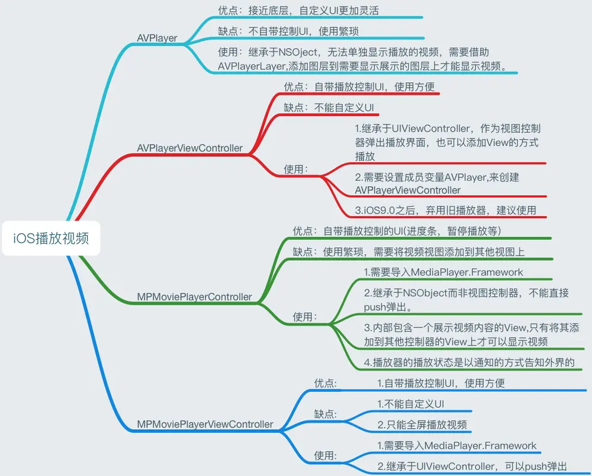
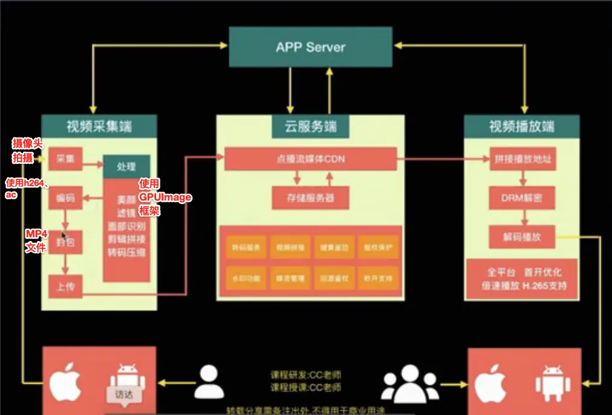

- [**Video播放类**](#Video播放类)
	- [AVPlayer](#AVPlayer)
- [**直播**](#直播)
- [**‌FFmpeg、ImilabRtc、WebRTC比较**](#FFmpeg、ImilabRtc、WebRTC比较)
- [**‌FFmpeg**](#FFmpeg)
- [**‌ImilabRtc**](#ImilabRtc)
- [**‌WebRTC**](#WebRTC)

<br/><br/><br/>

***
<br/>

> <h1 id="Video播放类">Video播放类</h1>




<br/><br/>

- **AVPlayer**

```
AVAsset：一个用于获取多媒体信息的抽象类，但不能直接使用
AVURLAsset：AVAsset的子类，可以根据一个URL路径创建一个包含媒体信息的AVURLAsset对象
AVPlayerItem：一个媒体资源管理对象，用于管理视频的基本信息和状态，一个AVPlayerItem对应一个视频资源
AVPlayer：负责视频播放、暂停、时间控制等操作
AVPlayerLayer：负责显示视频的图层，如果不设置此属性，视频就只有声音没有图像
```

<br/><br/><br/>

***
<br/>

> <h1 id="直播">直播</h1>

**直播流程**


<br/>

**直播和小视频知识需求**


<br/>

**音频和视频编解码过程**


BiLiBiLi的开源框架ijkplayer，集成了解码->播放的功能，底层使用了OpenGL ES


<br/><br/><br/>

***
<br/>

> <h1 id="FFmpeg、ImilabRtc、WebRTC比较">FFmpeg、ImilabRtc、WebRTC比较</h1>

| 库              | 作用范围         | 典型用途         | 使用难度           |
| -------------- | ------------ | ------------ | -------------- |
| **FFmpeg SDK** | 音视频处理全能库     | 编解码、推流、录制、转码 | 高（C API 较复杂）   |
| **ImilabRtc**  | 小米私有 RTC SDK | 小米摄像头实时通信    | 低（只要接 SDK）     |
| **WebRTC**     | 通用实时通信库      | 视频通话、会议、屏幕共享 | 中等（需要处理信令、ICE） |

- 若是做 **视频/实时通话** 相关开发，一般：
	* 需要处理文件/流 → 用 **FFmpeg**
	* 对接小米摄像头 → 用 **ImilabRtc**
	* 做跨平台实时通话 → 用 **WebRTC**

<br/><br/>

```sh
┌───────────────────────────────┐
│           应用层 (App)         │
│  - 视频会议应用 / 家庭安防App   │
│  - 直播客户端 / 教育互动平台    │
└───────────────────────────────┘
                │
                ▼
┌───────────────────────────────┐
│      实时通信层 (RTC/推流)      │
│  WebRTC: 通用实时音视频传输库   │
│  ImilabRtc: 小米私有 RTC SDK    │
└───────────────────────────────┘
                │
                ▼
┌───────────────────────────────┐
│   编解码 & 媒体处理层 (Codec)   │
│  FFmpeg SDK: 解码、编码、转码   │
│  (常被 RTC/播放器内部调用)      │
└───────────────────────────────┘
                │
                ▼
┌───────────────────────────────┐
│     传输协议层 (Network)       │
│  - UDP/TCP、RTP、RTMP、HLS      │
│  - STUN/TURN/ICE（穿透）        │
└───────────────────────────────┘
```

👌那我来帮你画一个对比关系的架构图，直观理解 **FFmpeg SDK / ImilabRtc / WebRTC** 分别处在什么层级、负责什么。

---

## 三者关系架构图

```
┌───────────────────────────────┐
│           应用层 (App)         │
│  - 视频会议应用 / 家庭安防App   │
│  - 直播客户端 / 教育互动平台    │
└───────────────────────────────┘
                │
                ▼
┌───────────────────────────────┐
│      实时通信层 (RTC/推流)      │
│  WebRTC: 通用实时音视频传输库   │
│  ImilabRtc: 小米私有 RTC SDK    │
└───────────────────────────────┘
                │
                ▼
┌───────────────────────────────┐
│   编解码 & 媒体处理层 (Codec)   │
│  FFmpeg SDK: 解码、编码、转码   │
│  (常被 RTC/播放器内部调用)      │
└───────────────────────────────┘
                │
                ▼
┌───────────────────────────────┐
│     传输协议层 (Network)       │
│  - UDP/TCP、RTP、RTMP、HLS      │
│  - STUN/TURN/ICE（穿透）        │
└───────────────────────────────┘
```

-  **直观理解**

	* **FFmpeg SDK** → 更底层，专注音视频的 **编解码、处理、转码**。它本身不管“实时通信”，但 RTC 库常常会内部调用 FFmpeg 做解码。
	* **ImilabRtc** → 小米的私有 **RTC SDK**，针对自家摄像头优化，开发者主要是拿来“即插即用”。
	* **WebRTC** → Google 开源的通用 **RTC 库**，跨平台、跨浏览器，用于实时音视频通话。

<br/>

📦 **组合使用的例子**，比如：

> 做一个 **小米摄像头远程观看**的 App：底层用 ImilabRtc 建立连接，解码部分交给 FFmpeg，后续如果要在网页端播放，就用 WebRTC。


<br/><br/><br/>

***
<br/>

> <h1 id="FFmpeg">FFmpeg</h1>

* **FFmpeg是什么**
  FFmpeg 是一个非常强大的开源多媒体框架，可以用来处理音视频数据，比如解码、编码、转码、推流、录制、截图等等。

	* FFmpeg SDK 就是它的开发接口，可以在 C/C++/Swift/Java 等程序里调用，而不仅仅是命令行。

<br/>

* **用途**

	* 视频解码（比如把 H.264/H.265 解成原始 YUV）
	* 视频编码（比如把原始数据压缩成 MP4、FLV）
	* 音视频处理（裁剪、合并、滤镜）
	* 推流/拉流（RTMP、HLS、HTTP-FLV）

* **使用示例（C 调用 FFmpeg 解码一帧视频）**

  ```c
  AVFormatContext *fmtCtx = avformat_alloc_context();
  avformat_open_input(&fmtCtx, "test.mp4", NULL, NULL);
  avformat_find_stream_info(fmtCtx, NULL);

  // 找视频流
  int videoStream = -1;
  for (int i = 0; i < fmtCtx->nb_streams; i++) {
      if (fmtCtx->streams[i]->codecpar->codec_type == AVMEDIA_TYPE_VIDEO) {
          videoStream = i;
          break;
      }
  }

  // 获取解码器
  AVCodecParameters *codecPar = fmtCtx->streams[videoStream]->codecpar;
  AVCodec *codec = avcodec_find_decoder(codecPar->codec_id);
  AVCodecContext *codecCtx = avcodec_alloc_context3(codec);
  avcodec_parameters_to_context(codecCtx, codecPar);
  avcodec_open2(codecCtx, codec, NULL);

  // 读取帧
  AVPacket *pkt = av_packet_alloc();
  AVFrame *frame = av_frame_alloc();
  while (av_read_frame(fmtCtx, pkt) >= 0) {
      if (pkt->stream_index == videoStream) {
          avcodec_send_packet(codecCtx, pkt);
          while (avcodec_receive_frame(codecCtx, frame) == 0) {
              printf("解码到一帧: 宽=%d 高=%d\n", frame->width, frame->height);
          }
      }
      av_packet_unref(pkt);
  }
  ```


<br/><br/><br/>

***
<br/>

> <h1 id="ImilabRtc">ImilabRtc</h1>

* **是什么**
  这是小米生态链公司 **Imilab（小米小白摄像机/小米智能摄像头）** 的私有 RTC SDK。
	
	* 它的作用和 WebRTC 类似，但是是封装好的专用库，用来做 **小米摄像头设备与 App 的实时音视频通信**。
	* 一般是用来对接小米的 IoT 生态，比如手机上实时观看摄像头画面、语音对讲。

<br/>

* **用途**

	* 手机 App 和摄像头之间建立实时视频流
	* 点对点音视频传输
	* 低延迟预览（家庭安防摄像头、智能门铃）


<br/>

* **使用方式**

	* 一般是通过官方 SDK 调用（Android/iOS），需要接入小米的设备管理平台，开发者通常拿不到源码。
	* 使用时会有类似：

```swift
let client = ImilabRtcClient()
client.connect(deviceId: "camera_id", token: "xxx") { stream in
    // 获得实时视频流
    videoView.render(stream)
}
```

<br/><br/><br/>

***
<br/>

> <h1 id="WebRTC">WebRTC</h1>

* **是什么**
  WebRTC（Web Real-Time Communication）是 Google 开源的实时音视频通信库，最初是为浏览器端（Chrome、Firefox）设计，现在也可以在 iOS/Android/桌面端用。

	* 用来做 **实时音视频通话、屏幕共享、点对点传输**。
	* 基于 UDP，支持 STUN/TURN/ICE 做 NAT 穿透。

<br/>

* **用途**

  * 视频会议（Google Meet、Zoom、腾讯会议）
	* 在线教育
	* Web 视频通话
	* 远程协作、屏幕共享

* **使用示例（JavaScript 浏览器端）**

  ```js
  const pc = new RTCPeerConnection();

  // 获取摄像头
  navigator.mediaDevices.getUserMedia({ video: true, audio: true })
    .then(stream => {
      document.getElementById("localVideo").srcObject = stream;
      stream.getTracks().forEach(track => pc.addTrack(track, stream));
    });

  // 处理远端视频
  pc.ontrack = event => {
    document.getElementById("remoteVideo").srcObject = event.streams[0];
  };

  // 信令交换（通过 WebSocket 传递 sdp）
  pc.createOffer().then(offer => {
    pc.setLocalDescription(offer);
    sendToServer(offer); // 需要你自己实现信令通道
  });
  ```
