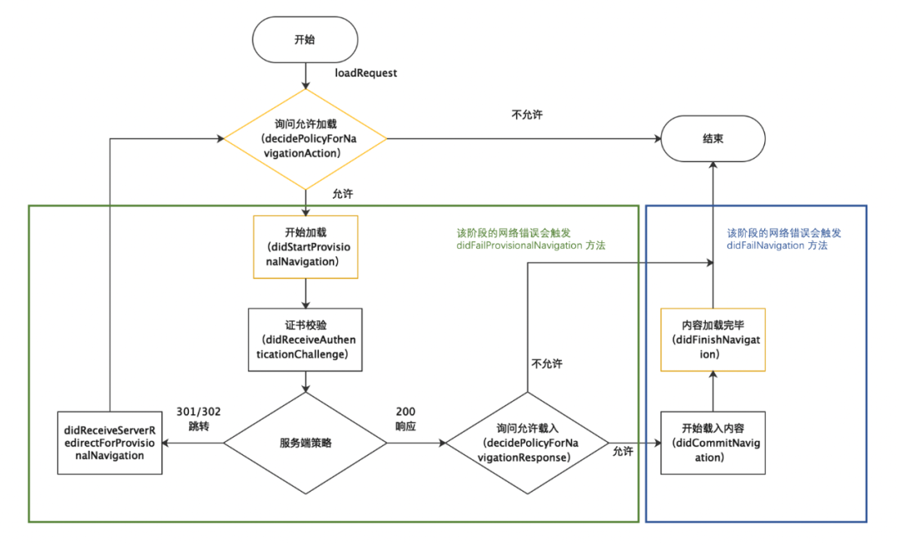
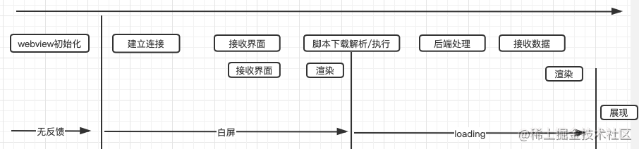
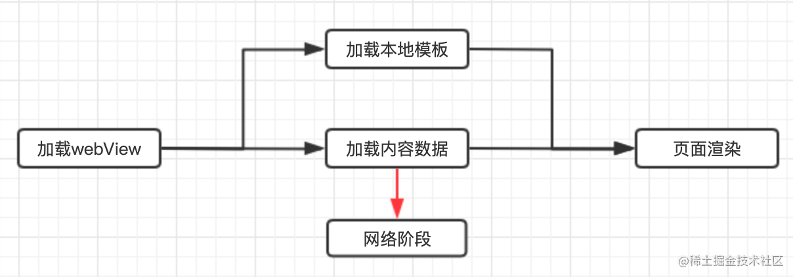
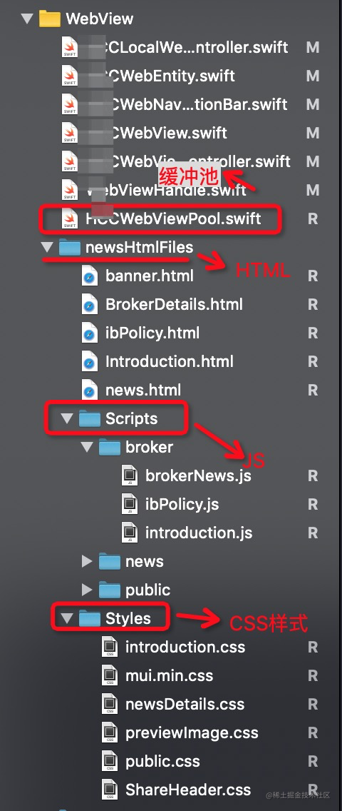
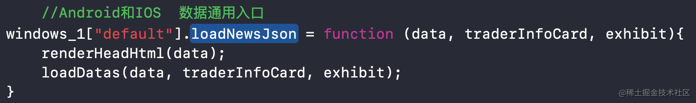
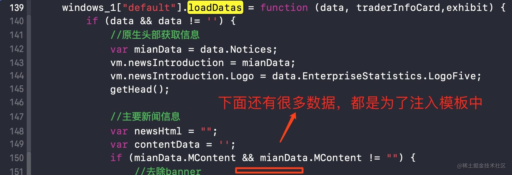
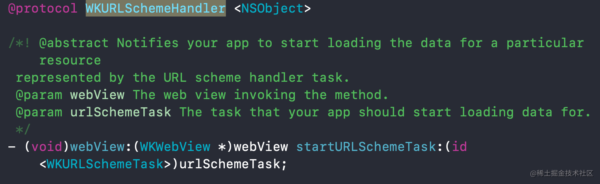
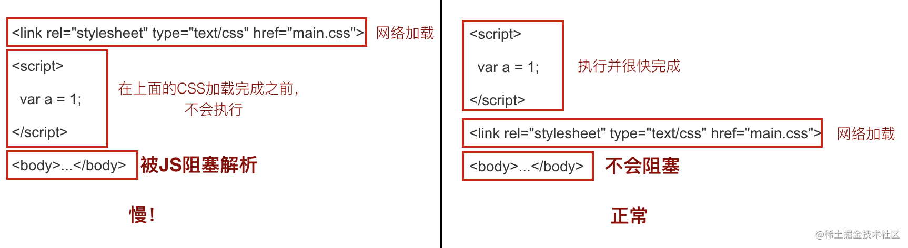
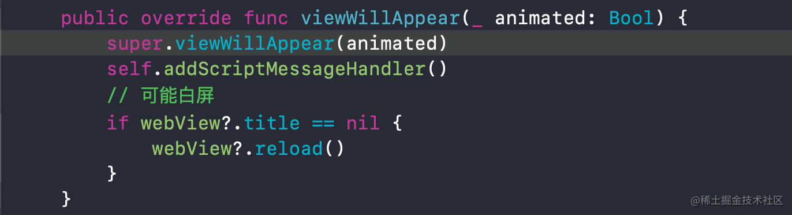
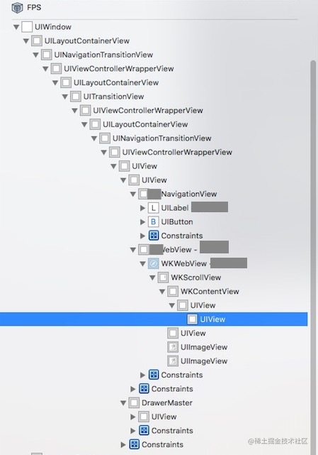

> <h2 id=''></h2>
- [**代理**](#代理)
	- [WKNavigationDelegate](#WKNavigationDelegate)
	- [WKUIDelegate](#WKUIDelegate)
- [**方法**](#方法)
- [**性能优化**](#性能优化)
	- [内存泄漏](#内存泄漏) 
- [**白屏**](#白屏)
	- [**启动白屏**](#启动白屏)
	- [加载优化白屏](#加载优化白屏)
	- [WKWebView复用池](#WKWebView复用池)
	- [HTML/JS/CSS模板抽离](#HTML/JS/CSS模板抽离)
	- [离线包](#离线包)
	- [CDN加速](#CDN加速)
- [**问题解决**](#问题解决)
	- [白屏](#白屏)
	- [WebView.title是否为空](#WebView.title是否为空)
	- [有没有WKCompositingView【尝试】](#有没有WKCompositingView【尝试】)
	- [Post请求丢失body问题](#Post请求丢失body问题)
- **参考资料**
	- [WKWebView使用总结](https://www.jianshu.com/p/20cfd4f8c4ff)
	- [WebKit源码调试与分析](https://jishuin.proginn.com/p/763bfbd5f874)
	- [UIWebView & WKWebView 详解上](https://www.jianshu.com/p/d346b86839a5) 


<br/>

***
<br/>

> <h1 id='代理'>代理</h1>


> <h2 id='WKNavigationDelegate'>WKNavigationDelegate</h2>

```
// 内容开始加载（当内容开始返回时调用）
- (void)webView:(WKWebView *)webView didCommitNavigation:(WKNavigation *)navigation;

// 页面加载完成
- (void)webView:(WKWebView *)webView didFinishNavigation:(WKNavigation *)navigation;

// 页面加载失败
- (void)webView:(WKWebView *)webView didFailProvisionalNavigation:(WKNavigation *)navigation withError:(NSError *)error;

// 收到服务器重定向请求（主机地址被重定向时调用）
- (void)webView:(WKWebView *)webView didReceiveServerRedirectForProvisionalNavigation:(WKNavigation *)navigation;

// 在请求开始加载之前，决定是否跳转（用户点击网页上的链接，需要打开新页面时，将先调用这个方法）
- (void)webView:(WKWebView *)webView decidePolicyForNavigationAction:(WKNavigationAction *)navigationAction decisionHandler:(void (^)(WKNavigationActionPolicy))decisionHandler;

// 页面开始加载时调用
- (void)webView:(WKWebView *)webView didStartProvisionalNavigation:(null_unspecified WKNavigation *)navigation;


// 在收到响应开始加载后，决定是否跳转
- (void)webView:(WKWebView *)webView decidePolicyForNavigationResponse:(WKNavigationResponse *)navigationResponse decisionHandler:(void (^)(WKNavigationResponsePolicy))decisionHandler;
 
// 当主文档已committed时，如果发生错误将进行调用
- (void)webView:(WKWebView *)webView didFailNavigation:(null_unspecified WKNavigation *)navigation withError:(NSError *)error; 


// 如果需要证书验证，进行验证，一般使用默认证书策略即可 
- (void)webView:(WKWebView *)webView didReceiveAuthenticationChallenge:(NSURLAuthenticationChallenge *)challenge completionHandler:(void (^)(NSURLSessionAuthChallengeDisposition disposition, NSURLCredential *__nullable credential))completionHandler; 


// 9.0才能使用，web内容处理中断时会触发，可针对该情况进行reload操作，可解决部分白屏问题 
- (void)webViewWebContentProcessDidTerminate:(WKWebView *)webView NS_AVAILABLE(10_11, 9_0); 
```

<br/>

**WKNavigationDelegate方法加载流程图**



- **代理方法内部剖析：**
	- **decidePolicyForNavigationAction 剖析**
		- 当 WebContent 即将创建 DocumentLoader 加载器时，会首先触发 decidePolicyForNavigationAction 代理方法。如果我们选择 cancel ,那么浏览内核会完全忽略这一操作，后续也不再继续执行其他操作，我们可以放心的使用 cancel 取消掉我们不想加载的主文档请求，而无需担忧任何异常。但当我们选择 alllow 后，我们会进入一个稍微复杂的逻辑判断，内核代码首先判断该该链接是否是 universalLink 类型的链接，如果判断是 universalLink 类型的链接，会尝试去调起三方 app，如果能调起，则会 cancel 当前请求，否则才会走到正常的网络加载逻辑（如果需要统计 universalLink 调起情况与或建设屏蔽能力，可以再仔细阅读该处源码）
	
	- **didStartProvisionalNavigation**
		- decidePolicyForNavigationAction 方法中选择 allow 并且判断为非 universalLink 链接后，会立即触发 didStartProvisionalNavigation 方法，表示即将开始加载主文档。这个方法看似只是对 decidePolicyForNavigationAction 方法的确认，但是值得思考的问题是方法名中的 Provisional 究竟是什么意思。其实，页面开始页面加载后为了更好的区分加载的各阶段，会将网络加载的初始阶段命名为临时状态，此时的页面是不会记入历史的，直到接收到首个数据包，才会对当前页面进行 committed 提交，并触发didCommitNavigation 方法通知 UIProcess 进程该事件，同时将网络 data 提交给 WebContent 进行渲染树生成。我们可由此引申出下一个问题，即 didFailProvisionalNavigation 与 didFailNavigation 的关系。

	- **didFailProvisionalNavigation 与 didFailNavigation 的分别在什么时候执行？他们之间有什么关系？**
		- 当 NetworkProcess 进程发生网络错误时，错误首先由 NSURLSession 回调到 WebContent 层。WebContent 会判断当前主文档加载状态，如果处于临时态，则错误会回调给 didFailProvisionalNavigation 方法；如果处于提交态，则错误会回调给 didFailNavigation 方法。


			
			
			主文档加载状态图


	- **didFinishNavigation 究竟什么时候执行？与页面上屏是否有关？**
		- 我们已经理解了 NetworkProcess 层也是使用 NSURLSession 加载主文档的。当 NSURLSession 接收到 finish 事件时，会将该消息通过进程通信方式传递给 WebContent 进程，WebContent 进程再传递给 UIProcess 进程，直到被我们的代理方法响应。因此 didFinishNavigation 在 NSURLSession 的网络加载结束时就会触发，但因为跨了两次进程通信，因此对比网络层，实际上是有一定的延迟的。与子资源加载和页面上屏无时间先后关系


<br/>
<br/>
<br/>


> <h2 id='WKUIDelegate'>WKUIDelegate</h2>

&emsp; JS交互时会用到这个代理，本文讨论的需求不涉及JS交互.


<br/>

***
<br/>

> <h1 id='方法'>方法</h1>

<br/>

> 1.**URL拦截**

```
- (void)webView:(WKWebView *)webView decidePolicyForNavigationAction:(WKNavigationAction *)navigationAction decisionHandler:(void (^)(WKNavigationActionPolicy))decisionHandler;


//案例
//针对一次action来决定是否允许跳转，允许与否都需要调用decisionHandler，比如decisionHandler(WKNavigationActionPolicyCancel);
- (void)webView:(WKWebView *)webView decidePolicyForNavigationAction:(WKNavigationAction *)navigationAction decisionHandler:(void (^)(WKNavigationActionPolicy))decisionHandler
{
    //可以通过navigationAction.navigationType获取跳转类型，如新链接、后退等
    NSURL *URL = navigationAction.request.URL;
    //判断URL是否符合自定义的URL Scheme
    if([URL.scheme isEqualToString:SHWebViewDemoScheme]){
        //根据不同的业务，来执行对应的操作，且获取参数
        if([URL.host isEqualToString:SHWebViewDemoHostSmsLogin]){
            NSString *param = URL.query;
            NSLog(@"短信验证码登录, 参数为%@", param);//短信验证码登录, 参数为username=12323123&code=892845
            decisionHandler(WKNavigationActionPolicyCancel);
            return;
        }
    }
    decisionHandler(WKNavigationActionPolicyAllow);
}
```


<br/>

> 2.**WKUserContentController中新增方法**

```
//注册回调 
- (void)addScriptMessageHandler:(id <WKScriptMessageHandler>)scriptMessageHandler name:(NSString *)name;


//js中调用方法 window.webkit.messageHandlers.<name>.postMessage(<messageBody>)

//oc中将会收到WKScriptMessageHandler的回调
- (void)userContentController:(WKUserContentController *)userContentController didReceiveScriptMessage:(WKScriptMessage *)message;

//移除
- (void)removeScriptMessageHandlerForName:(NSString *)name;
```


<br/>

***
<br/>

> <h1 id='性能优化'>性能优化</h1>

[体验优化](https://www.jianshu.com/p/5c7df5079458)


<br/>
<br/> 

> <h2 id='内存泄漏'>内存泄漏</h2>

**WebController.h**

```
#import <UIKit/UIKit.h>
#import <WebKit/WebKit.h>


NS_ASSUME_NONNULL_BEGIN

@interface WebController : UIViewController<WKUIDelegate, WKNavigationDelegate, WKScriptMessageHandler>

@property(nonatomic, strong) WKWebView *webView;
@property(nonatomic, strong) WKUserContentController *userContentController;

@end

NS_ASSUME_NONNULL_END
```


**WebController.m**

```
#import "WebController.h"

@interface WebController ()

@end

@implementation WebController

- (WKUserContentController *)userContentController {
    if (!_userContentController) {
        _userContentController =[[WKUserContentController alloc]init];
    }
    
    return  _userContentController;
}

- (WKWebView *)webView {
    if (!_webView) {
        WKWebViewConfiguration *configuration = [[WKWebViewConfiguration alloc]init];
        configuration.userContentController= self.userContentController;
        
        _webView = [[WKWebView alloc] initWithFrame:self.view.bounds configuration:configuration];
        
        _webView.UIDelegate=self;
        
        _webView.navigationDelegate=self;
    }
    
    return  _webView;
}

- (void)viewDidLoad {
    [super viewDidLoad];
    
    //注册一个name为sayhello的js方法
    [self.userContentController addScriptMessageHandler:self name:@"sayhello"];
    
    [self.view addSubview:self.webView];
    
    [self.webView loadRequest:[NSURLRequest requestWithURL:[NSURL URLWithString:@"https://juejin.cn/post/6844903951049949197"]]];
    
}


- (void)dealloc{
    
    //这里需要注意，前面增加过的方法一定要remove掉。
    [self.userContentController removeScriptMessageHandlerForName:@"sayhello"];
    
}

#pragma mark - WKScriptMessageHandler

- (void)userContentController:(WKUserContentController *)userContentController didReceiveScriptMessage:(WKScriptMessage *)message{
    
        NSLog(@"name:%@\\\\n body:%@\\\\n          frameInfo:%@\\\\n",message.name,message.body,message.frameInfo);
    
}


@end

```

&emsp; 像上述使用 `- (void)addScriptMessageHandler:(id <WKScriptMessageHandler>)scriptMessageHandler name:(NSString *)name;` 这个方法存在内存泄漏的问题，那该如何解决(通过dealloc这个析构方法没有调用)？


&emsp；这里`WKUserContentController`的实例对象方法`addScriptMessageHandler`在`scriptMessageHandler`参数传入控制器本身(猜测addScriptMessageHandler将会对scriptMessageHandler参数传入的对象做强引用,这点开发文档没有说明),而控制器又强引用了webView,然后webView又强引用了configuration,configuration又强引用了WKUserContentController对象,所以导致了引用循环,从而导致控制器不被释放的问题.）因此还需要进一步改进。


**解决方法：**

&emsp；只需要将`[userContentController removeScriptMessageHandlerForName:@"sayhello"];`这句话挪一下位置就可以了。我们可以在WebController里加一个方法：

```
 -(void)popController {

        [self.userContentController removeScriptMessageHandlerForName:@"sayhello"];

        [self.navigationController popViewControllerAnimated:YES];
}
```
在控制器pop(或者dismiss)回去的时候remove就可以了。      

由于日常开发中用到webView的界面大部分都是二级以上的界面 ，所以在pop时remove是可行的。


<br/>
<br/> 

> <h2 id=''></h2>


<br/>
<br/> 

> <h2 id=''></h2>


<br/>

***
<br/>

> <h1 id='白屏'>白屏</h1>

**问题:**

&emsp; 当我们使用WKWebView进行加载网页的时候,在最开始会突兀的出现白屏然后一会才开始加载到内容?这是为什么呢? 

&emsp; 最开始加载空白页是因为我们的WKWebView需要初始化,然后建立连接、请求资源等过了几秒后出现内容,因为在这其中做了很多事情,大约包括:

```
rust复制代码初始化 webview -> 请求页面 -> 下载数据 -> 解析HTML -> 请求 js/css 资源 -> dom 渲染 -> 解析 JS 执行 -> JS 请求数据 -> 解析渲染 -> 下载渲染图片
```




一般页面是在dom渲染后才能展示,h5首屏渲染白屏问题的原因关键在于,如何去优化请求下载->渲染之间的耗时成了重点.下面我们将围绕这个问题进行进行一系列的知识讲解,都是本人项目中使用到的.


<br/><br/>

> <h2 id='启动白屏'>启动白屏</h2>


出现白屏我们应该怎么解决呢?

&emsp; 最开始比较粗糙解决的方法是:替换背景色,不至于出现白色,使人不舒服.

&emsp; 但是就是这个简单的方法,也造成了一段曲折!为什么呢?

&emsp; 因为当时的项目是RN项目,使用原生导出的WKWebView模块进行加载的.当时遍历了WKWebView的父视图到RNTView对其设置backgroundColor和遍历其WKWebView的子视图设置其背景色,但是还是会出现0.6s左右的白屏,很难受.后面采取了隐藏+设置背景色才算解决掉.

<br/>

**RNCWebView.m代码大致如下:**

```
///实例化WKWebView
- (WKWebView *)webview{
    if (!_webview){
        WKWebViewConfiguration *configuration = [[WKWebViewConfiguration alloc] init];
        configuration.userContentController = [[WKUserContentController alloc]init];
        self.webview = [[WKWebView alloc] initWithFrame:CGRectZero configuration:configuration];
        //设置背景颜色
        self.webview.backgroundColor = [UIColor colorWithRed:31/255 green:37/255 blue:51/255 alpha:0.8];
        //设置背景颜色
        self.webview.scrollView.backgroundColor = [UIColor colorWithRed:31/255 green:37/255 blue:51/255 alpha:0.8];
        self.webview.scrollView.bounces = NO;
        self.webview.scrollView.contentInsetAdjustmentBehavior = UIScrollViewContentInsetAdjustmentNever;

    }
    return _webview;
}


//记得设置代理
self.webview.navigationDelegate = self;


///网页加载完成 延时0.3s展示网页
- (void)webView:(WKWebView *)webView didFinishNavigation:(WKNavigation *)navigation{
		//改变网页内容背景颜色
    [webView evaluateJavaScript:@"document.body.style.backgroundColor=\"#1F2533\"" completionHandler:nil];
    //改变网页内容文字颜色
    [self.webView evaluateJavaScript:"document.body.style.webkitTextFillColor=\"#7E9EC3""" completionHandler:nill];
    
    //延迟进行让webview显示出来
    [self performSelector:@selector(showWebView) withObject:self afterDelay:0.3];
}


///代理方法中隐藏 网页开始加载隐藏网页
-(void)webView:(WKWebView *)webView didStartProvisionalNavigation:(WKNavigation *)navigation {
    self.webview.hidden = YES;
}

-(void)showWebView {
    self.webview.hidden= NO;
}

```


<br/><br/>


># <h2 id='加载优化白屏'>[加载优化白屏](https://juejin.cn/post/6887161842406260744)</h2>

优化之路包括前端和客户端，常规的前端和后端的性能优化已有前辈们总结过最佳实践，主要的是：

```
javascript复制代码降低请求量：合并资源，减少 HTTP 请求数，minify / gzip 压缩，webP，lazyLoad。
加快请求速度：预解析DNS，减少域名数，并行加载，CDN 分发。
缓存：HTTP 协议缓存请求，离线缓存 manifest，离线数据缓存 localStorage。
渲染：JS/CSS优化，加载顺序，服务端渲染模板直出。
```


<br/><br/>

> <h3 id='WKWebView复用池'>WKWebView复用池</h3>


&emsp; 在不断的启动打开webView的过程中，发现首次打开webView的速度会比第二次打开的速度多几百毫秒。据美团做统计在iOS10系统上，首次打开比再次打开会多700ms。因此尝试预先初始化webView复用方案，速度会快很多。


<br/>


**复用原理**


&emsp; 预先预备两个Set,一个是正被visiableWebViewSet，一个是空闲等待使用的reusableWebViewSet。在启动AppDelegate页面的时候首先创建出来单例对象ZXYWebViewPool【因为不想在启动过程中占用太多时间】我们将初始化webView放在了首页加载完成后。在首页加载完成后，通过通知告知ZXYWebViewPool，初始化一个webView，并加入到reusableWebViewSet，当h5页面需要使用时候，就从reusableWebViewSet中取出放入到visiableWebViewSet中，使用完成后（dealloc）放回到reusableWebViewSet中。


<br/>


- **1.AppDelegate里面初始化缓冲池【启动】**

```
// webView缓存池
let _ = ZXYWebViewPool.shared
```

<br/>
<br/>

- **2.首页加载完成后，通知缓冲池，初始化webView，加入到reusableWebViewSet**

**viewDidLoad里面添加监听**

```
NotificationCenter.default.post(name: NSNotification.Name(kMainControllerInitSuccessNotiKey), object: nil)
```

<br/>

在 **‌ZXYWebViewPool.swift文件中**

**缓冲池里面监听首页加载完成后**

```
// 监听首页初始化完成
NotificationCenter.default.addObserver(self,
                                       selector: #selector(mainControllerInit),
                                       name: NSNotification.Name(kMainControllerInitSuccessNotiKey),                                               object: nil)
```


<br/>


**主要看mainControllerInit方法，异步初始化webView**

```
@objc func mainControllerInit() {
    DispatchQueue.main.asyncAfter(deadline: DispatchTime.now() + 0.25) {
        self.prepareReuseWebView()
    }
}
```

<br/>


**查看prepareReuseWebview**

```
func prepareReuseWebView() {
    guard reusableWebViewSet.count <= 0 else { return }
    let webview = ZXYWebView(frame: CGRect.zero, configuration: ZXYWebView.defaultConfiguration())
    self.reusableWebViewSet.insert(webview)
}
```

<br/>


**然后在使用完成之后，webView持有者销毁，则放回可复用池中**

```
///ZXYWebViewController中的deinit方法
deinit {
    if showProgress {
         webView?.removeObserver(self, forKeyPath: "estimatedProgress")
    }
    webView?.removeObserver(self, forKeyPath: "title")
    ZXYWebViewPool.shared.tryCompactWeakHolders()
}

/// 使用中的webView持有者已销毁，则放回可复用池中
func tryCompactWeakHolders() {
    lock.wait()
    let shouldReusedWebViewSet = visiableWebViewSet.filter{ $0.holderObject == nil }
    for webView in shouldReusedWebViewSet {
        webView.webviewWillEnterPool()
        visiableWebViewSet.remove(webView)
        reusableWebViewSet.insert(webView)
    }
    lock.signal()
}
```


<br/>

- **3.当内存警告，清除复用池**

**ZXYWebViewPool.swift文件**

```
// 监听内存警告，清除复用池
NotificationCenter.default.addObserver(self,
                                       selector: #selector(didReceiveMemoryWarningNotification),
                                       name: UIApplication.didReceiveMemoryWarningNotification,
                                       object: nil)
                                       
@objc fileprivate func didReceiveMemoryWarningNotification() {
    lock.wait()
    reusableWebViewSet.removeAll()
    lock.signal()
}
```


<br/>
<br/>


上面是整个的逻辑，下面是相应的ZXYWebViewPoolProtocol缓冲池代码和逻辑【以及资源同步加锁等】

**Swift版本**

**ZXYWebViewPool.swift文件**

```
import UIKit

protocol ZXYWebViewPoolProtocol: class {
    func webviewWillLeavePool()
    func webviewWillEnterPool()
}

public class ZXYWebViewPool: NSObject {

    // 当前有被页面持有的webview
    fileprivate var visiableWebViewSet = Set<ZXYWebView>()
    // 回收池中的webview
    fileprivate var reusableWebViewSet = Set<ZXYWebView>()
    
    fileprivate let lock = DispatchSemaphore(value: 1)

    public static let shared = ZXYWebViewPool()
    
    public override init() {
        super.init()
        // 监听内存警告，清除复用池
        NotificationCenter.default.addObserver(self,
                                               selector: #selector(didReceiveMemoryWarningNotification),
                                               name: UIApplication.didReceiveMemoryWarningNotification,
                                               object: nil)
        // 监听首页初始化完成
        NotificationCenter.default.addObserver(self,
                                               selector: #selector(mainControllerInit),
                                               name: NSNotification.Name(kMainControllerInitSuccessNotiKey),
                                               object: nil)
    }
    
    deinit {
        // 清除set
    }
}


// MARK: Observers
extension ZXYWebViewPool {
    
    @objc func mainControllerInit() {
        DispatchQueue.main.asyncAfter(deadline: DispatchTime.now() + 0.25) {
            self.prepareReuseWebView()
        }
    }
    
    @objc fileprivate func didReceiveMemoryWarningNotification() {
        lock.wait()
        reusableWebViewSet.removeAll()
        lock.signal()
    }
}


// MARK: Assistant
extension ZXYWebViewPool {
    
    /// 使用中的webView持有者已销毁，则放回可复用池中
    func tryCompactWeakHolders() {
        lock.wait()
        let shouldReusedWebViewSet = visiableWebViewSet.filter{ $0.holderObject == nil }
        for webView in shouldReusedWebViewSet {
            webView.webviewWillEnterPool()
            visiableWebViewSet.remove(webView)
            reusableWebViewSet.insert(webView)
        }
        lock.signal()
    }
    
    /// 预备一个空的webview
    func prepareReuseWebView() {
        guard reusableWebViewSet.count <= 0 else { return }
        let webview = ZXYWebView(frame: CGRect.zero, configuration: ZXYWebView.defaultConfiguration())
        self.reusableWebViewSet.insert(webview)
    }
}


// MARK: 复用池管理
public extension ZXYWebViewPool {
    
    /// 获取可复用的webView
    func getReusedWebView(forHolder holder: AnyObject?) -> ZXYWebView {
        assert(holder != nil, "ZXYWebView holder不能为nil")
        guard let holder = holder else {
            return ZXYWebView(frame: CGRect.zero, configuration: ZXYWebView.defaultConfiguration())
        }
        
        tryCompactWeakHolders()
        let webView: ZXYWebView
        lock.wait()
        if reusableWebViewSet.count > 0 {
            // 缓存池中有
            webView = reusableWebViewSet.randomElement()!
            reusableWebViewSet.remove(webView)
            visiableWebViewSet.insert(webView)
            // 出回收池前初始化
            webView.webviewWillLeavePool()
        } else {
            // 缓存池没有，创建新的
            webView = ZXYWebView(frame: CGRect.zero, configuration: ZXYWebView.defaultConfiguration())
            visiableWebViewSet.insert(webView)
        }
        
        webView.holderObject = holder
        lock.signal()
        
        return webView
    }
    
    /// 回收可复用的webView到复用池中
    func recycleReusedWebView(_ webView: ZXYWebView?) {
        guard let webView = webView else { return }
        lock.wait()
        // 存在于当前使用中，则回收
        if visiableWebViewSet.contains(webView) {
            // 进入回收池前清理
            webView.webviewWillEnterPool()
            visiableWebViewSet.remove(webView)
            reusableWebViewSet.insert(webView)
        }
        lock.signal()
    }
    
    /// 移除并销毁所有复用池的webView
    func clearAllReusableWebViews() {
        lock.wait()
        for webview in reusableWebViewSet {
            webview.webviewWillEnterPool()
        }
        reusableWebViewSet.removeAll()
        lock.signal()
    }
}
```


<br/><br/>

> <h3 id='HTML/JS/CSS模板抽离'>HTML/JS/CSS模板抽离</h3>

&emsp; 图文详情通过WebView来承载的，而webView最简单的做法是直接通过URL去加载一个线上页面。当从浏览器输入一个URL到页面中间经历了什么?


<br/>
<br/>

&emsp; 从上面看出用户每次进入详情页都要经过多次网络加载，中间是极易受到网络波动的影响，在无法保证页面加载的时长和成功率的情况下，会很大影响用户体验。


&emsp; 于是在本项目中将资讯详情页的公共样式CSS和逻辑JS都抽离出来，以及资源文件HTML还有一些图片资源模板直接内置于客户端中【因为项目中h5页面样式等都不一样，使用到了不同模板】，这样进入资讯详情页只需要本地加载模板，而且加载模板的同时也可以并行进行网络请求详情页数据，再将数据注入到模板中。此时用户点击到看到页面内容只需要经历下面阶段：





<br/>

- **1.项目使用的**

&emsp; 下面是项目需要使用的模板【由于本项目中资源模板不经常改动，所以直接内嵌于项目中】




&emsp; 首先加载本地的HTML【HTML里面会预加载好JS和CSS】，然后调用JS里面的loadNewsJson方法，进入loadDatas将数据注入页面，然后渲染出来.

**ZXYLocalWebViewController.swift文件**

```
override public func viewDidLoad() {
    super.viewDidLoad()
    self.setNavBar()
    //首先加载HTML【HTML里面会加载好JS、CSS资源】
    self.loadNewsWebFiles()
    //紧接着调用js里面的loadNewsJson方法进行数据的填充
    self.loadNewsJson()
}
```


<br/>

- **2.加载本地的HTML【HTML里面会预加载好JS和CSS】**

```
//加载本地HTML【HTML里面会加载好JS、CSS资源】
func loadNewsWebFiles() {
    let bundle = Bundle(for: ZXYLocalWebViewController.self)
    var htmlName: String?
    switch newsType {
    case .dealerComments, .dealerActivity, .dealerAnnouncement:
        htmlName = "BrokerDetails"
        
    case .IBPolicy:
        htmlName = "ibPolicy"
        
    case .brokerIntroduction:
        htmlName = "Introduction"
    
    case .bannerDetail:
        htmlName = "banner"
        
    default:
        htmlName = "news"
    }
    guard let path = bundle.path(forResource: htmlName, ofType: "html") else {
        return
    }
    
    DispatchQueue.global().async {
        guard let htmlString = try? String(contentsOfFile: path, encoding: String.Encoding.utf8) else {
            return
        }
        DispatchQueue.main.async {
            let baseURL = URL(fileURLWithPath: path, isDirectory: false)
            self.webView?.loadHTMLString(htmlString, baseURL: baseURL)
        }
    }
}
```


<br/>

- **3.每次进入webView时候，然后调用loadNewsJson方法，数据通过请求，通过调用JS方法里面的loadNewsJson方法进入注入数据，然后渲染【针对不同模板通过枚举区别，注入不同模板数据】**


```
func loadNewsJson() {
    let request = BLRequestEntity()
    
    switch newsType {
    case .coolForeignCurrency:
        request.api = ZXYApi.home.HomeFxNewsDetailApi
        request.params = ["newsId": dataId]
        
    case .IBPolicy, .bannerDetail:
        request.api = ZXYApi.home.GetBannerDetailApi
        request.params = ["id": dataId]
        
    case .brokerIntroduction:
        request.api = ZXYApi.broker.BrokerIntroductionApi
        request.params = ["brokerId": dataId, "type": 1, "contentType": 1]
        
    default:
        request.api = ZXYApi.home.HomeNewsDetailApi
        request.params = ["id": dataId]
    }
    
    ZXYHttpManager.shared.get(request: request, success: { (response) in
        guard response.code == HttpRequestResult.success, let newsData = response.bodyMessage, !newsData.isEmpty else {
            self.view.addPlaceholder(type: .noData)
            return
        }
        
        self.view.removePlaceholder()
        switch self.newsType {
        case .coolForeignCurrency:
            self.noticesEntity = NewsNoticesEntity.deserialize(from: newsData, designatedPath: "NewsDetail")
            
        case .IBPolicy, .bannerDetail, .brokerIntroduction:
            self.noticesEntity = NewsNoticesEntity.deserialize(from: newsData)
            
        default:
            self.noticesEntity = NewsNoticesEntity.deserialize(from: newsData, designatedPath: "Notices")
        }
        
        self.newsJson = newsData
        if self.isFinished {
            let traderInfoCard = self.isShowBroker ? 1 : 0
            self.callJSMethod(name: "loadNewsJson(\(newsData), \(traderInfoCard), \(self.isShowSourceRegulator))")
        }
        
    }, failure: { (error) in
        self.showToast(message: error)
        self.view.addPlaceholder(type: .webviewLoadFail, handler: {[weak self] in
            self?.loadNewsJson()
        })
    }, completed: {
        
    })
}

/// 调用 JS 方法
///
/// - Parameter name: 方法名
public func callJSMethod(name: String) {
    if !isFinished {return}
    self.webView?.evaluateJavaScript(name, completionHandler: { (_, error) in
        if error != nil {
            // self.showErrorHUD(message: "操作失败", image: #imageLiteral(resourceName: "MBHUD_Error"))
        }
    })
}

```


<br/>


&emsp; 那么可不可以继续优化呢？当然可以。经过上面的优化之后，页面加载的瓶颈变成了本地模板的加载时间，所以我们也可以通过优化模板来减少时间。

&emsp; 模板合并：正常来说，webView需要加载完HTML之后再去加载JS和CSS，需要多次I/O操作。我们优化之路可以将JS和CSS还有一些图片内联到一个文件中，此时加载模板就只需要一次I/O操作。
让h5那边精简不必要的CSS样式和JS代码，不断压缩模板，或者将非必要的脚本异步化拉取


<br/>

**拓展**

```
self.callJSMethod(name: "loadNewsJson(\(newsData), \(traderInfoCard), \(self.isShowSourceRegulator))")
```


代码js里面loadNewsJson需要有三个参数，然后我们紧接着随意查看js文件的loadNewsJson




将接口请求的数据通过JS loadNewsJson中loadDatas注入到模板数据中：




<br/>
<br/>


<br/><br/>

> <h3 id='离线包'>离线包</h3>

- **1.1离线包的下载**

原本的方式：离线包的分发-根据公司的CDN实现离线包的分发，在对象存储着放置离线包文件和一个配置文件info.json，格式如下：

```
{
    "version":"1.2.2",
    "files": [
       "https://xxx/news.html",
       "https://xxx/broker.png",
       "https://xxx/news.js",
       "https://xxx/news.css",
       "https://xxx/news.json"
    ]
}
```


然后App有当前的版本，当发现info.json文件中的版本发生改变不一样时，代表是资源有所更新，需要更新下载。

<br/>


**拓展：离线包知识点**

```
1. css复制代码离线包内容：css，js，html，通用的图片等-可以尽量的优化，像上面说的那样

2. 下载时机：在app启动的时候，开启线程下载资源，注意不要影响app的启动。

3. 存放位置：选用沙盒中的/Library/Caches。因为资源会不定时更新，而/Library/Documents更适合存放一些重要的且不经常更新的数据。

4. 更新逻辑：请求CDN上的info.json资源，返回的version与本地保存的不同，则资源变化需更新下载。注：第一次运行时，需要在/Library/Caches中创建自定义文件夹，并全量下载资源。
```

<br/>

**代码如下：**


```
NSURLSession *session = [NSURLSession sharedSession];
NSURLSessionDownloadTask *downLoadTask = [session downloadTaskWithRequest:request completionHandler:^(NSURL * _Nullable location, NSURLResponse * _Nullable response, NSError * _Nullable error) {
  if (!location) {
      return ;
  }
  
  //下载成功，移除旧资源
  [fileManager removeFileAtPath:dirPath fileExtesion:nil];
  
  //脚本临时存放路径
  NSString *downloadTmpPath = [NSString stringWithFormat:@"%@broker_%@.zip", NSTemporaryDirectory(), version];
  // 文件移动到指定目录中
  NSError *saveError;
  [fileManager moveItemAtURL:location toURL:[NSURL fileURLWithPath:downloadTmpPath] error:&saveError];
  //解压zip
  BOOL success = [解压 unzipFileAtPath:downloadTmpPath toDestination:dirPath];
  if (!success) {
      [fileManager removeItemAtPath:downloadTmpPath error:nil];
      [fileManager removeFileAtPath:dirPath fileExtesion:nil];
      return;
  }
  //更新版本号
  [[NSUserDefaults standardUserDefaults] setValue:version forKey:brokerFileKey];
  [[NSUserDefaults standardUserDefaults] synchronize];
  //清除临时文件和目录
  [fileManager removeItemAtPath:downloadTmpPath error:nil];
}];
[downLoadTask resume];
[session finishTasksAndInvalidate];
```


&emsp; 通过上面代码将所有资源文件整合成zip形式，一次性下载到本地，然后解压到指定位置，紧接着更新version即可。然后下载时间在app启动和前后切换的时候做一次版本更新检查就可以了。


&emsp; 假如离线资源包仅仅发生了一点点改变，每个用户如果都要下载全部的离线包，那就太恐怖了[【针对用户量巨大的话，带宽也是个大问题，大家可以参考qq有关方案-博客地址】](https://mp.weixin.qq.com/s/evzDnTsHrAr2b9jcevwBzA)


<br/>
<br/>


- **1.2 拦截离线包**

&emsp; 当打开自定义协议sheme H5页面时，webView请求页面，native 就可以依次收到html，js，css以及图片类型的拦截响应。可以使用webKit中的WKURLSchemeHandler。


&emsp; 下面尝试拦截文档中的标签，**当有标签时，我们使用的图片第三方是Kingfisher，用Kingfisher缓存下来，这样就不需要再次用H5请求图片【改成用本地请求】提升速度。会将图片和视频等非文字内容通过原生组件的方式放在客户端进行渲染，既可以提高渲染效率，也可以减少不必要的流量消耗**


下面是项目中代码使用的内容:

```
public func webView(_ webView: WKWebView, start urlSchemeTask: WKURLSchemeTask) {
    print("🚀开始加载图片\(urlSchemeTask.request.url)", Date.init().timeIntervalSince1970)
    
    if let url = urlSchemeTask.request.url {
        var components = URLComponents.init(string: url.absoluteString)
        components?.scheme = "https"
        if let url = components?.url {
            KingfisherManager.shared.retrieveImage(with: url, options: nil, progressBlock: nil) { (image, _, _, _) in
                var data: Data? = nil
                if let image = image?.kf.gifRepresentation() {
                    data = image
                }else if let image = image?.kf.pngRepresentation() {
                    data = image
                }else if let image = image?.kf.jpegRepresentation(compressionQuality: 1) {
                    data = image
                }
                print("🚀结束加载图片\(urlSchemeTask.request.url)", Date.init().timeIntervalSince1970)
                if let data = data {
                    let response = URLResponse.init(url: url, mimeType: nil, expectedContentLength: data.count, textEncodingName: nil)
                    urlSchemeTask.didReceive(response)
                    urlSchemeTask.didReceive(data)
                    urlSchemeTask.didFinish()
                }else {
                    urlSchemeTask.didFailWithError(NSError.init(domain: "10086", code: 10086, userInfo: nil))
                }
            }
            return
        }
    }
    urlSchemeTask.didFailWithError(NSError.init(domain: "10086", code: 10086, userInfo: nil))
}
```

**拓展:WKURLSchemeHandler**




<br/>


假设 HTML 文档中有一个  标签，希望它显示本地的一张图片 test.jpg，那么 H5 可以这样编码：

```
<imag src="customScheme://www.test.com/test.jpg">
```

Native 可以这样写：

```
#import "ViewController.h"
#import <WebKit/WebKit.h>

@interface CustomURLSchemeHandler : NSObject<WKURLSchemeHandler>
@end

@implementation CustomURLSchemeHandler
//这里拦截到URLScheme为customScheme的请求后，读取本地图片test.jpg，并返回给WKWebView显示
- (void)webView:(WKWebView *)webView startURLSchemeTask:(id)urlSchemeTask {    
    NSURLRequest *request = urlSchemeTask.request;    
    UIImage *image = [UIImage imageNamed:@"test.jpg"];    
    NSData *data = UIImageJPEGRepresentation(image, 1.0);    
    NSURLResponse *response = [[NSURLResponse alloc] initWithURL:urlSchemeTask.request.URL MIMEType:@"image/jpeg" expectedContentLength:data.length textEncodingName:nil];    
    [urlSchemeTask didReceiveResponse:response];   
    [urlSchemeTask didReceiveData:data];   
    [urlSchemeTask didFinish];
}

- (void)webView:(WKWebView *)webVie stopURLSchemeTask:(id)urlSchemeTask {
}
@end

@implementation ViewController
- (void)viewDidLoad {    
    [super viewDidLoad];    
    WKWebViewConfiguration *configuration = [WKWebViewConfiguration new];
    //设置URLSchemeHandler来处理特定URLScheme的请求，URLSchemeHandler需要实现WKURLSchemeHandler协议
    //本例中WKWebView将把URLScheme为customScheme的请求交由CustomURLSchemeHandler类的实例处理    
    [configuration setURLSchemeHandler:[CustomURLSchemeHandler new] forURLScheme: @"customScheme"];    
    WKWebView *webView = [[WKWebView alloc] initWithFrame:self.view.bounds configuration:configuration];    
    self.view = webView;    
    [webView loadRequest:[NSURLRequest requestWithURL:[NSURL URLWithString:@"http://www.test.com"]]];
}
@end
```


<br/>
<br/>


- **1.3 H5那边模板【模板优化】** 

--共同协调测试

&emsp; 一般来说HTML在开始接收到返回数据的时候就开始解析HTML并构建DOM树，如果没有JS阻塞的话一般会相继完成。【此模块需要提醒H5那边，H5与客户端协调测试】

页面的header部分有这样的代码：【此为demo】

```
.....
<link href="//ms0.xxxx.net/css/eve.9d9eee71.css" rel="stylesheet" onload="MT.pageData.eveTime=Date.now()"/>
<script>
window.fk = function (callback) {
require(['util/native/risk.js'], function (risk) {
    risk.getFk(callback);
});
}
</script>
</head>
....
```

&emsp; 通常情况下，上面的link部分和script如果单独出现，都不会阻塞页面的解析。【css不会阻止页面向下继续，内联的JS很快执行完，然后继续解析HTML】

<br/>

&emsp; 但是如果两部分同时出现，问题就来了：

**css复制代码CSS加载阻塞了下面的一段内联的JS的执行，而被阻塞的内联JS则阻塞了HTML的解析**


<br/>

&emsp; 通常情况下，CSS不会阻塞HTML的解析，但如果CSS后面有JS，则会阻塞JS的执行直到CSS加载完成，从而间接阻塞HTML的解析。从这可看出，一个小小的内联的JS放错位置也会让性能下降很多。

<br/>

- **优化**

&emsp; CSS的加载会在HTML解析到CSS的标签时开始，所以CSS的标签要尽量靠前

&emsp; 但是，CSS链接下面不要有任何的JS标签，否则会阻塞HTML的解析
如果必须要在头部增加内联脚本，一定要放在CSS标签之前,如下2种位置的放置会出现2种不同的情况:



以上就是本项目中使用到的WKWebView优化策略，经本项目测试打开H5页面只需要**0.2-0.4s**，**几乎肉眼看不到白屏或者等待状态**。

下面介绍一些其他优化的方面。


<br/><br/>

> <h2 id='CDN加速'>CDN加速</h2>

**知识点：**

```
CDN 的全称是 Content Delivery Network，即内容分发网络。其目的是通过在现有的 Internet 中增加一层新的网络架构，将网站的内容发布到最接近用户的网络“边缘”，使用户可以就近取得所需的内容，提高用户访问网站的响应速度。CDN 有别于镜像，因为它比镜像更智能，或者可以做这样一个比喻：CDN=更智能的镜像+缓存+流量导流。因而，CDN 可以明显提高 Internet 网络中信息流动的效率。从技术上全面解决由于网络带宽小、用户访问量大、网点分布不均等问题，提高用户访问网站的响应速度。
```


&emsp; 对于新闻资讯【外汇、金融、新闻】的行业，接口返回的数据比较大，对于每次的实时返回，对网络的压力比较大【用户基数比较大的时候】
对于条件允许的公司，可以考虑将新闻详情页内容数据分为静态和动态两部分，将正文内容、标题等内容基本不会更改的托管到CDN上。当内容托管到CDN后，用户可以直接从最近的最佳节点获取数据，也会大大的节省带宽的成本。


<br/><br/>


> <h2 id='问题解决'>问题解决</h2>


<br/><br/>

> <h3 id='白屏'>白屏</h3>


&emsp; 在UIWebView上当内存占用太大的时候，App Process会崩溃crash；而当WKWebView总体的内存占用比较大的时候，WebContent Process会崩溃crash，从而导致白屏现象。遇到的场景是加载到WKWebView页面后，前/后台来回切换APP。


**解决方案**:借助 WKNavigtionDelegate

在iOS 9以后WKNavigtionDelegate新增一个回调函数


```
/*! @abstract Invoked when the web view's web content process is terminated.
 @param webView The web view whose underlying web content process was terminated.
 */
- (void)webViewWebContentProcessDidTerminate:(WKWebView *)webView API_AVAILABLE(macos(10.11), ios(9.0));
```

当WKWebView总体内存占用过大即将白屏的时候，系统会调用上面的回调函数，只需要在函数里执行webView.reload()【这个时候webView.URL取值尚不为nil】解决白屏问题。

```
// 白屏
public func webViewWebContentProcessDidTerminate(_ webView: WKWebView) {
    webView.reload()
}
```


<br/><br/>

> <h3 id=' WebView.title是否为空'> WebView.title是否为空</h3>

在WKWebView白屏的时候，另个现象会webView.title会被置空，因为我们可以在viewWillAppear检测webView.title 是否为空来reload页面。如下：




<br/><br/>

> <h3 id='有没有WKCompositingView【尝试】'>有没有WKCompositingView【尝试】</h3>

下面是对比白屏与正常显示的区别！

**白屏**




<br/>


**无白屏**


&emsp; 对比两图之间可以看到，白屏之后上层的WKCompsitingView都消失了，那就可以通过WKWebView是否存在WKCompsitingView来判断是否白屏？在执行js之前，只要发现count == 0就开始执行[webview reload]


```
func getWKCompositingCount(_ view: UIView, count: Int) {
    var compsitionClass: AnyClass =  NSClassFromString("WKCompositingView")!
    for subview in view.subviews {
        
        if (subview is compsitionClass) {
            count = count + 1
        }
        if subview.subviews.count > 0 {
            self.getWKCompositingCount(subview, count: count)
        }
    }
}
```


<br/><br/>


> <h3 id='Post请求丢失body问题'>Post请求丢失body问题</h3>

WKWebView通过loadRequest方法加载Post请求会丢失请求体的内容，进而导致服务器拿不到body中的内容。问题产生原因是WKWebView的网络请求进程与APP不是同一个进程。


- **网络请求的过程：** 

	- 由APP所在的进程发起请求request，然后通过IPC进程间通信将请求的相关信息【请求头、请求行、请求】 传递给webkit网络线进程接收包装，进行数据的HTTP请求，最终再进行IPC的通信回传给APP所在的进程。 

	- 这里发送的请求如果是Post请求的话，由于进行IPC数据传递，传递的请求体body中根据系统调度，将其舍弃，最终在WKWebView网络进程接受的时候请求体body中的内容变成了空，导致此种情况下服务器获取不了请求体，从而问题出现。


<br/>

- 针对这种情况，大约有三种解决方法：

	- 注册拦截的自定义的scheme

	- 重写loadRequest()方法，根据request的method方法是否为POST进行URL的拦截替换


	- 在URLProtocol中进行request的重新包装【获取请求的body内容】使用NSURLConnection进行HTTP请求并数据回传。

<br/>

这里说明一下为什么要自己去注册自定义的scheme，而不是直接拦截https/http。

&emsp; 主要原因是：如果注册了https/http的拦截，那么所有的http(s)请求都会交由系统进程处理，那么此时系统进程会通过IPC的形式传递给实现URLProctol协议的类去处理，在通过IPC传递的过程中丢失body体（上面有讲到），所以在拦截的时候是拿不到POST方法的请求体body的。

&emsp; 然而并不是所有的http请求都会走loadrequest（）方法（比如js中的ajax请求），所以导致一些POST请求没有被包装（将请求体body内容放到请求头header）就被拦截了，进而丢失请求体body内容，问题一样会产生。所以为了避免这样的问题，我们需要自己去定一个scheme协议，保证不过度拦截并且能够处理我们需要处理的POST请求内容。

<br/>

下面就以重写loadRequest方法为例：

```
ini复制代码//包装请求头内容
- (WKNavigation *)loadRequest:(NSURLRequest *)request{
    NSLog(@"发起请求:%@ method:%@",request.URL.absoluteString,request.HTTPMethod);
    NSMutableURLRequest *mutableRequest = [request mutableCopy];
    NSMutableDictionary *requestHeaders = [request.allHTTPHeaderFields mutableCopy];
    //判断是否是POST请求，POST请求需要包装request中的body内容到请求头中（会有丢失body问题的产生）
    //,包装完成之后重定向到拦截的协议中自己包装处理请求数据内容，拦截协议是GCURLProtocol，请自行搜索
    if ([mutableRequest.HTTPMethod isEqualToString:@"POST"] && ([mutableRequest.URL.scheme isEqualToString:@"http"] || [mutableRequest.URL.scheme isEqualToString:@"https"])) {
        NSString *absoluteStr = mutableRequest.URL.absoluteString;
        if ([[absoluteStr substringWithRange:NSMakeRange(absoluteStr.length-1, 1)] isEqualToString:@"/"]) {
            absoluteStr = [absoluteStr stringByReplacingCharactersInRange:NSMakeRange(absoluteStr.length-1, 1) withString:@""];
        }
        
        if ([mutableRequest.URL.scheme isEqualToString:@"https"]) {
            absoluteStr = [absoluteStr stringByReplacingOccurrencesOfString:@"https" withString:WkCustomHttps];
        }else{
            absoluteStr = [absoluteStr stringByReplacingOccurrencesOfString:@"http" withString:WkCustomHttp];
        }
        
        mutableRequest.URL = [NSURL URLWithString:absoluteStr];
        NSString *bodyDataStr = [[NSString alloc]initWithData:mutableRequest.HTTPBody encoding:NSUTF8StringEncoding];
        [requestHeaders addEntriesFromDictionary:@{@"httpbody":bodyDataStr}];
        mutableRequest.allHTTPHeaderFields = requestHeaders;
        
        NSLog(@"当前请求为POST请求Header:%@",mutableRequest.allHTTPHeaderFields);
        
    }
    return [super loadRequest:mutableRequest];
}
```


<br/>

***
<br/>

> <h1 id=''></h1>


<br/>

***
<br/>

> <h1 id=''></h1>


<br/>

***
<br/>

> <h1 id=''></h1>


<br/>

***
<br/>

> <h1 id=''></h1>


<br/>

***
<br/>

> <h1 id=''></h1>


