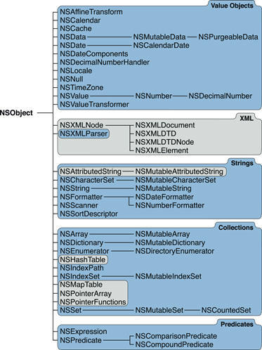
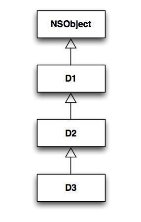

- **iOS 原生系统架构**
	- iOS的系统架构成
	-  Cocoa
	-  架构层级细分
- **NSObject 继承关系图**
	-  Foundation框架类继承体系
- **UIResponder 继承关系图**
- **手势继承关系图**

<br/>

***
<br/>


<br/>
<br/>
<br/>

># iOS 原生系统架构

**iOS的系统架构成:**
- Application Layer（应用层）、
- Cocoa Touch Layer（触摸层）、
- Media Layer （媒体层）、
- Core Services Layer（核心服务层）、
- Core OS Layer （核心系统操作层）、
- The Kernel and Device Drivers layer（内核和驱动层）。


<br/>

> **Cocoa**

<br/>


**来源：**
>早些年，苹果公司启动Copland计划，致力于开发出自己的操作系统，可惜后来Copland计划逐渐失控了，苹果公司最终决定放弃开发，转向从别的公司购买下一个版本的Mac OS。在经过调查现存的操作系统之后，苹果公司选择了NextSTEP，因为NextSTEP很小，苹果1996年收购了Next整个公司。

>NextStep内置许多库和工具，能唐程序员以一种优雅的方式与窗口管理器进行监护，这些库叫做Framework，在1993年这些frameworks和工具被重新修改并重命名OpenStep，后来被重命名为Cocoa，所以Cocoa的类都有着NS的前缀。

<br/>

**什么是Cocoa？**
>事实上，Cocoa（iOS上的叫Cocoa Touch）是一个面向对象的软件组件---类的集成套件，它使开发者可以快速创建和健壮全功能的Mac OS X和iOS应用程序。

>Cocoa 是一套框架和运行时支持，简单来说就是 API 应用程序接口。


<br/>


**Cocoa 和 Cocoa Touch** 

>Cocoa是Mac OS X 的开发环境               Cocoa Touch是iPhone OS 的开发环境。

>Cocoa包含了很多框架，最核心的是Foundation框架和Application Kit 框架

>Cocoa Toouch包含了很多框架，最核心的是Foundation框架和UIKit 框架


<br/>

**框架**

>Foundation框架以Core Foundation框架为基础，Core Foundation框架提供的是过程化（ANSI C）接口。您可以使用 AppKit 和UIKit 框架开发应用程序的用户接口。二者用途相同，但是针对平台不同。


<br/>


> **`架构层级细分`**


<br/>

**Core OS层：**系统核心层包含大多数低级别接近硬件的功能，它所包含的框架常常被其它框架所使用。

- Accelerate框架包含数字信号，线性代数，图像处理的接口。针对所有的iOS设备硬件之间的差异做优化，保证写一次代码在所有iOS设备上高效运行。
- CoreBluetooth框架利用蓝牙和外设交互，包括扫描连接蓝牙设备，保存连接状态，断开连接，获取外设的数据或者给外设传输数据等等。
- Security框架提供管理证书，公钥和私钥信任策略，keychain,hash认证数字签名等等与安全相关的解决方案。


<br/>

**Core Services Layer**:系统服务层提供给应用所需要的基础的系统服务。

- Accounts: 账户框架，广告框架，数据存储框架，网络连接框架，地理位置框架，运动框架等等。这些服务中的最核心的是CoreFoundation和Foundation框架，定义了所有应用使用的数据类型。
- CoreFoundation是基于C的一组接口，Foundation是对CoreFoundation的OC封装。

<br/>

**Media Layer**: 媒体层提供应用中视听方面的技术，如图形图像相关的:
- 	CoreGraphics,CoreImage,GLKit,OpenGL ES,CoreText,ImageIO等等。

声音技术相关的:
- 	CoreAudio,OpenAL,AVFoundation,

视频相关的:
- 	CoreMedia,Media Player框架，音视频传输的AirPlay框架等等。


<br/>

**Cocoa Touch Layer:**触摸层提供应用基础的关键技术支持和应用的外观。
- NotificationCenter的本地通知和远程推送服务;
- iAd广告框架;
- GameKit游戏工具框架;
- 消息UI框架;
- 图片UI框架;
- 地图框架;
- 连接手表框架;
- 自动适配等等


<br/>


原生架构细分接受，请看[这里](https://www.jianshu.com/p/80a27d111605)


```
NS函数归属于Cocoa Foundation框架；

CF函数归属于Core Foundation框架；

CG函数归属于CoreGraphics.frameworks框架；

CA函数归属于CoreAnimation.frameworks框架；

UI函数归属于UIKit框架。

UIKit继承自 Core Animation 和Core Graphics；
Core Animation：核心动画； 
Core Graphics：核心绘制 ；
UIkit：iOS基础视图框架.

```


<br/>

***
<br/>


># NSObject 继承关系图

<br/>

> Foundation框架类继承体系

&emsp; 下面三个图，包括了Foundation所以的类，图中灰色的是iOS不支持的，灰色部分是OS X系统的。




&emsp; **将上图Foundation框架中的类进行逻辑分类如下：**
- 值对象
- 集合
- 操作系统服务 包括下面三个：文件系统和URL进程间通讯。
	- 这个范畴中的大部分类代表不同的系统端口、套接字、和名字服务器，对实现底层的IPC很有用。
	- NSPipe代表一个BSD管道，即一种进程间的单向通讯通道。
	- 线程和子任务:NSThread类使您可以创建多线程的程序，而各种锁（lock）类则为彼此竞争的线程在访问进程资源时提供各种控制机制。通过NSTask，您的程序可以分出      一个子进程来执行其它工作或进行进度监控。
- 通知
- 归档和序列化
- 表达式和条件判断
- Objective-C语言服务


<br/>
<br/>


**Objective-C是面向对象的语言:**

&emsp; Objective-C和Java C++一样，有封装，继承，多态，重用。但是它不像C++那样有重载操作法、模版和多继承，也没有Java的垃圾回收机制


<br/>

**Objective-C的优点:**

- Objective-C语言有C++ Java等面向对象的特点，那是远远不能体现它的优点的。Objective-C的优点是它是动态的。动态能力有三种：
- 动态类-运行时确定类的对象
- 动态绑定-运行时确定要调用的方法
- 动态加载--运行时为程序加载新的模块


<br/>

**动态能力相关的isa指针:**

每个Objective-C对象都有一个隐藏的数据结构，这个数据结构是Objective-C对象的第一个成员变量，它就是isa指针。

`这个指针指向哪呢？`

它指向一个类对象(class object记住它是个对象，是占用内存空间的一个变量，这个对象在编译的时候编译器就生成了，专门来描述某个类的定义)，这个类对象包含了Objective-C对象的一些信息（为了区分两个对象，我把前面提到的对象叫Objective-C对象），包括Objective-C对象的方法调度表，实现了什么协议等等。这个包含信息就是Objective-C动态能力的根源了。

`那我们看看isa指针类型的数据结构是什么样的？`

如果抛开NSObject对象的其他的成员数据和变量，NSObject可以看成这样：

```
@interface NSObject  {

Class    isa;

}

```

不考虑@interface关键字在编译时的作用，可以把NSObject更接近C语言结构表示为：

```
struct NSObject{

Class isa;

}
```

Class是用typedef定义的`typedef struct objc_class *Class;`

那NSObject可以这样写了

```
struct NSObject{

objc_class *isa

}
```


那objc_class的结构是什么样的呢？大概是这样的：

```


structobjc_class {

Class isa;

Class super_class;

const char*name;

long version;

long info;

long instance_size;

struct objc_ivar_list *ivars;

struct objc_method_list **methodLists;

struct objc_cache *cache;

struct objc_protocol_list *protocols;

}


```


&emsp; 这里会看到，在这个结构体里还有一个isa指针，又是一重指向，是不是有种到了盗梦空间的感觉。不用紧张，不会有那么多层次的，这里的isa指针指向的是元类对象(metaclass
 object)，带有元字，证明快到头了。
 
 `那元对象有啥用呢？`
 
 它用来存储的关于类的版本，名字，类方法等信息。所有的元类对象(metaclass object)都指向NSObject的元类对象，到头还是NSObject。一共三次：类对象->元类对象->NSObject元类对象。

为了得到整个类组织架构的信息，objc_class结构里定义了第二个成员变量Class super_class，它指向父类的类对象。说了这么多，可能关系缕不清楚，有道是一张图胜过千言万语:





图中可以看出，D3继承D2,D2继承D1,D1最终继承NSObject。下图从D3的一个对象开始，排列出D3 D2 D1 NSObject 类对象，元类对象等关系。


相当于 


<br/>
<br/>


<br/>

># UIResponder 继承关系图


<br/>

***
<br/>


># 手势继承关系图


