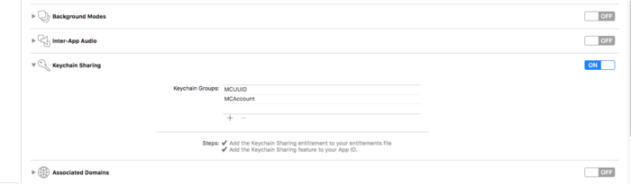
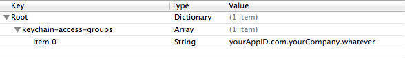
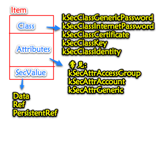

> </h1>
- [**密码存储位置比较**](#密码存储位置比较)
	- [NSUserDefaults存储](#NSUserDefaults存储)
- [**Keychain的用法**](#Keychain的用法)
	- [KeyChain Item](#KeyChainItem)
	- [KeyChain存储](#KeyChain存储)
		- [数据共享](#数据共享)
		- [设备唯一标示存储](#设备唯一标示存储)
- **资料**
	- [**keychain 详解及变化**](https://www.cnblogs.com/junhuawang/p/8194484.html)
	- [iOS系统安全机制](https://juejin.cn/post/7077942169016729607)


<br/><br/><br/><br/>

***
<br/>

> <h1 id='密码存储位置比较'>密码存储位置比较</h1>
<br/>

> <h2 id='NSUserDefaults存储'>NSUserDefaults存储</h2>

&emsp; NSUserDefaults其实是plist文件中键值存储，并且最大的问题是存在与沙盒中，这就对安全性埋下了隐患。如果攻击者破解app，拿到了沙盒中的数据，就会造成数据泄漏，后果不堪设想。

&emsp; 当然，一般也不会有把密码直接使用NSUserDefaults存储的，都会进行加密、或者是多重加密后再进行NSUserDefaults存储。这么做其实是可行的，前提是加密算法不能泄漏。有个小问题就是，如果用户删掉app重装的话，之前所有存储的敏感信息都会消失。比如，一个用户误删了使用NSUserDefaults存储密码的app，当重新安装之后，由于以前是记住密码免登录，只因为自己操作不当，接下来要进入找回密码功能，重新修改密码才能再次使用app。这对用户来说是一种相当不友好的体验。所以，正确的姿势是使用Keychain服务来存储。


<br/><br/><br/>

***
<br/>

> <h1 id='Keychain的用法'>Keychain的用法</h1>

- **首先导入Security.framework 。**

Keychain的API提供以下几个函数来操作Keychain

```objective-c
SecItemAdd 添加一个keychain item

SecItemUpdate 修改一个keychain item

SecItemCopyMatching 搜索一个keychain item

SecItemDelete 删除一个keychain item
```

<br/>

- **Keychain Access Group**

&emsp; Keychain通过provisioning profile来区分不同的应用，provisioning文件内含有应用的bundle id和添加的access groups。不同的应用是完全无法访问其他应用保存在Keychain的信息，除非指定了同样的access group。指定了同样的group名称后，不同的应用间就可以分享保存在Keychain内的信息。

<br/>

- **Keychain Access Group的使用方法：**

&emsp; 首先要在Capabilities下打开工程的Keychain Sharing按钮。然后需要分享Keychain的不同应用添 加相同的Group名称。Xcode6以后Group可以随便命名，不需要加AppIdentifierPrefix前缀，并且Xcode会在以entitlements结尾的文件内自动添加所有Group名称，然后在每一个Group前自动加上$(AppIdentifierPrefix)前缀。

&emsp; 虽然文档内提到还需要添加一个包含group的.plist文件，其实它和.entitlements文件是同样的作用，所以不需要重复添加。

 &emsp; 但是每个不同的应用第一条Group最好以自己的bundleID命名，因为如果entitlements文件内已经有Keychain Access Groups数组后item的Group属性默认就为数组内的第一条Group,其实keychaingroups的名字你可以随便起，（最好使用app的buddleid），在keychain groups里面加上你想要共享哪个group的数据，想共享几个就可以填写几个，前提是这些group必须的team必须相同，也就是（AppIdentifierPrefix）必须相同！
        


<br/>

 这样设置group会导致存储数据失败，如果不想共享某个group的数据，建议group传入AppIdentifierPrefix+bundleiD！在其他app的keychain group中，只填入想要共享数据的group！
 
 例如上图中的MCUUId和MCaccount两个keychain group！在另一个app中加入同样的group，就能实现这两个group中的数据共享，切记代码中传入group的时候要加上appidentifier前缀，否则会存储失败！
 
 当传入的group不在entitlements文件内时，此时传入的group的值必须为AppIdentifierPrefix+bundleiD，否则会造成存储失败！查询时也可以指定group查询，但是必须使用真机测试。
 
 <br/>
 
 samkeychain的方法中涉及到的变量主要有三个，分别如这一小节的标题所示，是password、service、account。password、account分别保存的是密码和用户名信息。
 
 service保存的是服务的类型，就是用户名和密码是为什么应用保存的一个标志。比如一个用户可以再不同的论坛中使用相同的用户名和密码，那么service保存的信息分别标识不同的论坛。由于包名通常具有一定的唯一性，通常在程序中可以用包的名称来作为service的标识。）
 
 
 
<br/><br/>
> <h2 id='KeyChain存储'>KeyChain存储</h2>
&emsp; Keychain保存的数据不仅仅是加密过的，而且由于Keychain是存在与沙盒之外的，当应用删除之后，app存储的数据并没有被删掉，第二次安装时只要读取Keychain里的数据，即可得到以前存储的信息。

<br/>

**存储隐私信息：**

&emsp; iOS的keychain服务提供了一种安全的保存私密信息（密码，序列号，证书等）的方式，每个ios程序都有一个独立的keychain存储。相对于NSUserDefaults、文件保存等一般方式，keychain保存更为安全，而且keychain里保存的信息不会因App被删除而丢失，所以在重装App后，keychain里的数据还能使用。

<br/><br/><br/>
> <h2 id='数据共享'>数据共享</h2>
**数据共享：**

&emsp; 我们可以把KeyChain理解为一个Dictionary，所有数据都以key-value的形式存储，可以对这个Dictionary进行add、update、get、delete这四个操作。对于每一个应用来说，KeyChain都有两个访问区，私有区和公共区。私有区是一个sandbox，本程序存储的任何数据都对其他程序不可见。而要想在将存储的内容放在公共区，需要先声明公共区的名称，官方文档管这个名称叫“keychain access group”，声明的方法是新建一个plist文件，名字随便起，内容如下：



&emsp; “yourAppID.com.yourCompany.whatever”就是你要起的公共区名称，除了whatever字段可以随便定之外，其他的都必须如实填写。这个文件的路径要配置在 Project->build setting->Code Signing Entitlements里，否则公共区无效，配置好后，须用你正式的证书签名编译才可通过，否则xcode会弹框告诉你code signing有问题。所以，苹果限制了你只能同公司的产品共享KeyChain数据，别的公司访问不了你公司产品的KeyChain。

<br/>

以下是如何在 iOS 中使用 Keychain 执行四个基本操作（添加、更新、获取、删除）的示例代码，分别用于私有区和公有区：

```swift
import Security

enum KeychainError: Error {
    case itemNotFound
    case unableToAdd
    case unableToUpdate
    case unableToDelete
    case unableToGet
}

class KeychainManager {
    static let serviceName = "YourServiceName"
    
    // 添加数据到 Keychain
    static func addItem(withKey key: String, value: String, isShared: Bool) throws {
        let accessible = isShared ? kSecAttrAccessibleAfterFirstUnlock : kSecAttrAccessibleWhenUnlocked
        let query: [String: Any] = [
            kSecClass as String: kSecClassGenericPassword,
            kSecAttrService as String: serviceName,
            kSecAttrAccount as String: key,
            kSecValueData as String: value.data(using: .utf8)!,
            kSecAttrAccessible as String: accessible
        ]
        let status = SecItemAdd(query as CFDictionary, nil)
        guard status == errSecSuccess else {
            throw KeychainError.unableToAdd
        }
    }
    
    // 更新 Keychain 中的数据
    static func updateItem(withKey key: String, newValue value: String, isShared: Bool) throws {
        let accessible = isShared ? kSecAttrAccessibleAfterFirstUnlock : kSecAttrAccessibleWhenUnlocked
        let query: [String: Any] = [
            kSecClass as String: kSecClassGenericPassword,
            kSecAttrService as String: serviceName,
            kSecAttrAccount as String: key
        ]
        let attributes: [String: Any] = [
            kSecValueData as String: value.data(using: .utf8)!,
            kSecAttrAccessible as String: accessible
        ]
        let status = SecItemUpdate(query as CFDictionary, attributes as CFDictionary)
        guard status == errSecSuccess else {
            throw KeychainError.unableToUpdate
        }
    }
    
    // 从 Keychain 中获取数据
    static func getItem(withKey key: String) throws -> String {
        let query: [String: Any] = [
            kSecClass as String: kSecClassGenericPassword,
            kSecAttrService as String: serviceName,
            kSecAttrAccount as String: key,
            kSecMatchLimit as String: kSecMatchLimitOne,
            kSecReturnData as String: true
        ]
        var result: AnyObject?
        let status = SecItemCopyMatching(query as CFDictionary, &result)
        guard status == errSecSuccess, let data = result as? Data, let value = String(data: data, encoding: .utf8) else {
            throw KeychainError.unableToGet
        }
        return value
    }
    
    // 从 Keychain 中删除数据
    static func deleteItem(withKey key: String) throws {
        let query: [String: Any] = [
            kSecClass as String: kSecClassGenericPassword,
            kSecAttrService as String: serviceName,
            kSecAttrAccount as String: key
        ]
        let status = SecItemDelete(query as CFDictionary)
        guard status == errSecSuccess else {
            throw KeychainError.unableToDelete
        }
    }
}

// 使用示例
do {
    // 添加数据到私有区
    try KeychainManager.addItem(withKey: "myKey", value: "myValue", isShared: false)
    
    // 更新数据到私有区
    try KeychainManager.updateItem(withKey: "myKey", newValue: "newValue", isShared: false)
    
    // 获取数据从私有区
    let value = try KeychainManager.getItem(withKey: "myKey")
    print("Value: \(value)")
    
    // 删除数据从私有区
    try KeychainManager.deleteItem(withKey: "myKey")
} catch {
    print("Error: \(error)")
}
```

您可以根据需要选择在私有区或公有区存储数据，并根据相应的访问权限配置 Keychain。

<br/><br/>
> <h2 id='设备唯一标示存储'>设备唯一标示存储</h2>
**设备唯一标示存储：**

&emsp; 在iOS中，为了在苹果的打压下获取唯一标示符，开发者们也是想尽了办法，目前最好的方式就是获取IDFV，并将其存储到keychain中。IDFV是设备区别应用提供商的，一般来说可以作为应用唯一标示符。但是IDFV缺陷就是当设备删除了该所有应用提供商的app之后，IDFV值会发生变化，所以IDFV+Keychain的组合目前被经常用到，来替代UDID的作用。特别是加上Keychain的共享服务，可以使应用提供商下的所有app下获取的IDFV都不会发生变化。这一服务可以说是目前最佳的识别用户的办法。

<br/>

**IDFV+KeyChain存储**

```swift
import UIKit
import Security

struct Keychain {
    static func saveIDFV(idfv: String) -> Bool {
        let key = "com.yourcompany.yourapp.idfv"
        
        // 创建要保存的数据
        guard let data = idfv.data(using: .utf8) else {
            return false
        }
        
        // 准备查询字典
        let query: [String: Any] = [
            kSecClass as String: kSecClassGenericPassword,
            kSecAttrAccount as String: key,
            kSecValueData as String: data
        ]
        
        // 删除已存在的 ID
        SecItemDelete(query as CFDictionary)
        
        // 将 ID 存储到 Keychain 中
        let status = SecItemAdd(query as CFDictionary, nil)
        return status == errSecSuccess
    }
    
    static func loadIDFV() -> String? {
        let key = "com.yourcompany.yourapp.idfv"
        
        // 准备查询字典
        let query: [String: Any] = [
            kSecClass as String: kSecClassGenericPassword,
            kSecAttrAccount as String: key,
            kSecReturnData as String: true
        ]
        
        // 查询 Keychain 中的数据
        var result: AnyObject?
        let status = SecItemCopyMatching(query as CFDictionary, &result)
        
        if status == errSecSuccess {
            if let data = result as? Data, let idfv = String(data: data, encoding: .utf8) {
                return idfv
            }
        }
        
        return nil
    }
}

// 获取 IDFV
let idfv = UIDevice.current.identifierForVendor?.uuidString

// 存储 IDFV 到 Keychain 中
if let idfv = idfv {
    let success = Keychain.saveIDFV(idfv: idfv)
    if success {
        print("IDFV 存储成功")
    } else {
        print("IDFV 存储失败")
    }
}

// 从 Keychain 中加载 IDFV
if let loadedIDFV = Keychain.loadIDFV() {
    print("从 Keychain 中加载到的 IDFV: \(loadedIDFV)")
} else {
    print("未找到 IDFV")
}
```

需要注意的是，identifierForVendor 属性在以下情况下会返回 nil：

- 如果设备是越狱的。
- 如果应用程序是开发者模式下通过 Xcode 安装到设备上的。
- 如果用户将设备还原为出厂设置，并且还没有安装任何来自相同供应商的应用程序。


<br/><br/><br/>
> <h2 id='KeyChainItem'>KeyChain Item</h2>
&emsp; Keychain内部可以保存很多的信息。每条信息作为一个单独的keychain item，keychain item一般为一个字典，每条keychain item包含一条data和很多attributes。举个例子，一个用户账户就是一条item，用户名可以作为一个attribute , 密码就是data。 keychain虽然是可以保存15000条item,每条50个attributes，但是苹果工程师建议最好别放那么多，存几千条密码，几千字节没什么问题。

&emsp; 如果把keychain item的类型指定为需要保护的类型比如password或者private key，item的data会被加密并且保护起来，如果把类型指定为不需要保护的类型，比如certificates，item的data就不会被加密。

- **Item 类型**

```objective-c

extern CFTypeRef kSecClassGenericPassword

extern CFTypeRef kSecClassInternetPassword

extern CFTypeRef kSecClassCertificate

extern CFTypeRef kSecClassKey

extern CFTypeRef kSecClassIdentityOSX_AVAILABLE_STARTING(MAC_10_7, __IPHONE_2_0);

```



<br/>

**以下是常见的 Keychain Item 属性及其作用：**

- **kSecClass：** 指定 Keychain Item 的类型，例如密码（kSecClassGenericPassword）、证书（kSecClassCertificate）、密钥（kSecClassKey）等。

- **kSecAttrAccessible：** 指定 Keychain Item 的访问权限，控制谁可以访问该项以及在什么条件下可以访问。常见的值包括：
	- **kSecAttrAccessibleWhenUnlocked：** 仅在设备解锁时可用。
	- **kSecAttrAccessibleAfterFirstUnlock：** 在设备首次解锁后就可用，持久保留。
	- **kSecAttrAccessibleAlways：** 始终可用，即使设备被锁定也可以访问。

- **kSecAttrSynchronizable：** 指示是否将该项同步到 iCloud，使其在用户的多个设备之间同步。

- **kSecAttrService：** 指定服务标识符，用于标识此项与哪个服务或应用程序相关联。

- **kSecAttrAccount：** 指定帐户标识符，用于标识此项与哪个帐户相关联。

- **kSecValueData：** 指定要存储的数据，通常是一个 Data 对象。

- **kSecAttrAccessControl：** 指定访问控制列表（ACL），用于定义哪些应用程序可以访问该项以及在什么条件下可以访问。

- **kSecReturnAttributes：** 指示是否返回该项的所有属性信息。

- **kSecMatchLimit：** 指定匹配的限制数量，例如仅返回第一个匹配项（kSecMatchLimitOne）或返回所有匹配项（kSecMatchLimitAll）。


&emsp; 这些属性可以用来精确地控制和管理 Keychain 中的数据，以确保安全性和隐私。例如，您可以使用 kSecAttrAccessible 属性来限制在什么条件下可以访问数据，或者使用 kSecAttrSynchronizable 属性将数据同步到 iCloud。

<br/>

下面是一个简单的示例，展示了如何将字符串转换为 Data 对象，并将其存储到 Keychain 中：

```swift
let value = "Hello, Keychain!"
let data = value.data(using: .utf8)

let query: [String: Any] = [
    kSecClass as String: kSecClassGenericPassword,
    kSecAttrService as String: "YourService",
    kSecAttrAccount as String: "YourAccount",
    kSecValueData as String: data
]

let status = SecItemAdd(query as CFDictionary, nil)
if status == errSecSuccess {
    print("Data stored successfully in Keychain!")
} else {
    print("Failed to store data in Keychain.")
}
```

在这个例子中，我们使用字符串 "Hello, Keychain!" 创建了一个 Data 对象，然后将其作为 kSecValueData 属性的值传递给 Keychain API，以存储在 Keychain 中。


