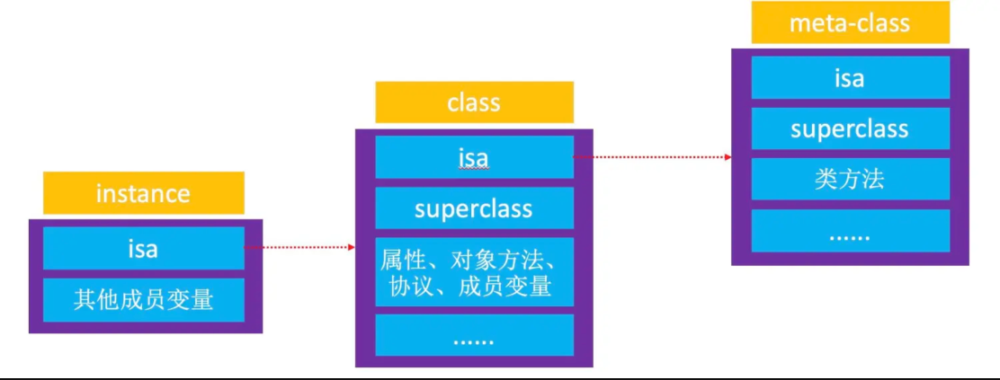
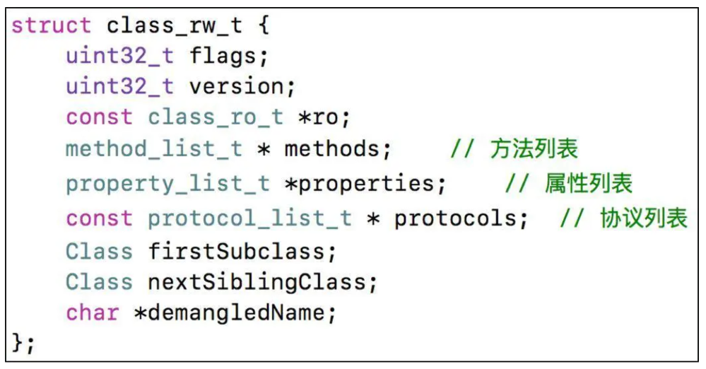

- [**汇编**](#汇编)
- [**类**](#类)
	- [底层类结构为什么要这么设计](#底层类结构为什么要这么设计)
	- [实例对象](#实例对象)
	- [类对象(class对象)](#类对象(class对象))
	- [isa指针](#isa指针)
	- [元类对象（meta-class对象）](#元类对象（meta-class对象）)
	- [苹果公司为什么要设计元类](#苹果公司为什么要设计元类)
	- [isa指针指向](#isa指针指向)
	- [Class本质](#Class本质)
		- [类的底层为什么要设计两个结构体](#类的底层为什么要设计两个结构体)
		- [objc_class源码](#objc_class源码)
		- [objc_object源码](#objc_object源码)
	- [class的superClass指针的指向](#class的superClass指针的指向)
	- [meta-class对象的superClass指针指向](#meta-class对象的superClass指针指向)
	- [**`[self class]`和`[super class]`**](#selfclass和superclass)
	- [**object_getClass和class区别**](#object_getClass和class区别)
	- [**method_getTypeEncoding**](#method_getTypeEncoding)
- [**自动引用计数**](#自动引用计数)
	- [自动引用计数流程](#自动引用计数流程)
	- [retain源码](#retain源码)
	- [rootRetain()](#rootRetain())
	- [处理溢出rootRetain_overflow](#处理溢出rootRetain_overflow)
	- [内联函数调用和普通函数调用的区别](#内联函数调用和普通函数调用的区别)
- [**引用计数**](#引用计数)
	- [Sidetable](#Sidetable)
		- [SideTable数据结构](#SideTable数据结构)
		- [SideTable结构体定义](#SideTable结构体定义)
		- [获取对象引用计数](#获取对象引用计数)
- [**弱引用**](#弱引用)
	- [梳理流程图](#梳理流程图)
		- [weak调用流程](#weak调用流程)
		- [objc_initWeak函数源码](#objc_initWeak函数源码)
		- [objc_storeWeak函数源码](#objc_storeWeak函数源码)
		- [SideTables中取出相应的oldTable和newTable](#SideTables中取出相应的oldTable和newTable)
		- [SideTable结构体](#SideTable结构体)
		- [weak_table_t结构体](#weak_table_t结构体)
		- [weak_entry_t结构体](#weak_entry_t结构体)
		- [inline_referrers和out_of_line_ness使用条件](#inline_referrers和out_of_line_ness使用条件)
		- [weak为什么不会增加对象的引用计数](#weak为什么不会增加对象的引用计数)
		- [对象释放时其weak指针如何自动设置为nil](#对象释放时其weak指针如何自动设置为nil)
- **资料**
	- [**`[self class]和[super class]`**](https://www.cnblogs.com/lutengda/p/9486559.html)
	- [**元类详解**](https://blog.csdn.net/windyitian/article/details/19810875)
	- [**objc源码编译**](https://juejin.cn/post/6844903959161733133)
	- [深入理解iOS内存管理](https://juejin.cn/post/6844904004669931533#heading-5)
	- [weak引用以及sidetable表(CSDN收费)](https://blog.csdn.net/shengpeng3344/article/details/105825715)
		- [iOS Runtime随笔——weak原理探究](https://chy305chy.github.io/2019/01/18/iOS-Runtime随笔——weak原理探究/)
		- [iOS底层-内存管理之弱引用表](https://juejin.cn/post/7025510964174782478)
	- [OC对象本质](https://www.jianshu.com/p/ffd742041946)
	- [**探寻Class的本质**](https://www.jianshu.com/p/74db5638f34f)


<br/><br/><br/>

***
<br/>
> <h1 id='汇编'>汇编</h1>
&emsp;  OC中 Assembly File 是写汇编的文件，在 New File的 Other中，文件名为 File.s 建成以后里面什么都没有。

&emsp;  汇编是重要的一门编程语言，是对设备的开发。


<br/><br/><br/>

***
<br/>
> <h1 id='类'>类</h1>
- OC对象分为三种：
	- 实例对象(instance对象);
	- 类对象(class对象);
	- 元类对象（meta-class对象）

<br/>
> <h2 id="底层类结构为什么要这么设计">底层类结构为什么要这么设计</h2>
**苹果的设计考虑了以下关键点：**

---
>**1️⃣ 让「类」也是对象**
在 Objective-C 里，**一切都是对象（Everything is an Object）**，包括**类本身**。这和 Java、Python 类似，但在 C 语言基础上实现就需要**额外的机制**。

- **🛠 解决方案：类对象（Class Object）**
	- **实例对象（Instance Object）** 依赖于 **类对象（Class Object）** 来查找方法。
	- **类对象（Class Object）** 本身也是一个对象，需要一个**元类（Meta-Class）**来管理它的方法。

<br/>
🔹**结构示意图**

```
实例对象（obj） → 类对象（Person Class） → 元类（Person Meta-Class） → 根元类（NSObject Meta-Class）
```

- **为什么？**
	- **统一行为**：这样**实例对象**和**类对象**都可以用相同的 `objc_msgSend()` 方式查找方法。
	- **节省存储**：类信息只存一份，而不是每个实例都存方法列表。


<br/>
---
>**2️⃣ 允许动态方法查找**
Objective-C 的一个核心特性是**方法的动态调用**，不像 C++ 在编译时决定方法地址，Objective-C 在运行时才解析方法地址。

- **🛠 解决方案：方法缓存（Method Cache）**
	- 当一个方法被调用时：
		- 1.先从 `Class` 结构体的 **方法列表（method_list）** 查找。
		- 2.如果找不到，就去**父类（superclass）** 里查找。
		- 3.找到后，将方法缓存（method cache），下次调用更快。

**为什么？**
- **动态性**：允许运行时替换方法（Method Swizzling）。
- **优化性能**：避免每次都遍历整个方法列表。

🔹 **示意图**

```
objc_msgSend -> 在缓存中查找 -> (未命中) 遍历方法列表 -> (仍未找到) 递归查找父类 -> 缓存加速下次调用
```

<br/>
---
>**3️⃣ 支持「类方法」**
Objective-C 允许在类上调用方法：

```objc
[Person sayHello];  // 类方法
```
但问题是：
- **实例方法存储在 Class 对象里**，那么类方法存哪？

- **🛠 解决方案：元类（Meta-Class）**
	- 每个类都有一个**元类（Meta-Class）**，专门存储 `+method`。
	- **类对象的 `isa` 指向元类**，让类方法也能用 `objc_msgSend()` 查找。

**为什么？**
- **避免单独设计类方法机制**，让类方法复用实例方法的调用方式。

🔹 **示意图**

```
[Person sayHello] -> Person 的 Meta-Class -> 查找 +sayHello
```

<br/>
---
>**4️⃣ 兼容 C 语言**
Objective-C 是基于 C 语言的，需要兼容 C 的**结构体**、**函数指针**等低级操作。

**🛠 解决方案：结构体设计**

Objective-C 采用 C 结构体 `struct objc_class` 来描述类：

```c
struct objc_class {
    Class isa;            // 指向元类
    Class superclass;     // 父类
    Cache cache;          // 方法缓存
    Method *methods;      // 方法列表
};
```
**为什么？**
- **节省内存**：结构体比 C++ 虚函数表更紧凑。
- **直接操作**：方便用 `class_addMethod()`、`class_replaceMethod()` 动态修改方法。

<br/>
---
>**5️⃣ 允许「动态创建类」**

Objective-C 支持**运行时创建类**，比如：

```objc
Class newClass = objc_allocateClassPair([NSObject class], "NewClass", 0);
objc_registerClassPair(newClass);
```
这在 C++ 里很难做到。

- **🛠 解决方案：类对象动态存储**
	- 运行时所有类存储在 `objc_class` 结构体里，可动态增删。
	- `objc_getClass()` 可以动态获取类。

**为什么？**
- **支持 KVO**：KVO 需要**动态创建子类**，修改 `isa` 指针。
- **适配动态框架**：如 CoreData、JS 调用等。

<br/>
---
>**6️⃣ 让「类」和「NSObject」兼容**
Objective-C 允许：

```objc
[Person performSelector:@selector(description)];
```
但 `Person` 是类，它本身不是 `NSObject` 实例，那为什么可以调用 `NSObject` 的方法？

- **🛠 解决方案：元类继承**
	- **Person Meta-Class** 继承 **NSObject Meta-Class**。
	- `NSObject Meta-Class` 里有 `performSelector:`，所以 `Person` 也能调用。

🔹 **示意图**

```
Person -> Person Meta-Class -> NSObject Meta-Class -> NSObject
```
**为什么？**
- **让所有类都能用 NSObject 的方法**，比如 `performSelector:`。
- **保持继承结构清晰**，不会破坏 `NSObject` 体系。

<br/>
---
>**7️⃣ 适配 ARC & MRC**
Objective-C 需要支持：
- **MRC**（手动管理 `retain/release`）
- **ARC**（自动引用计数）

- **🛠 解决方案：引用计数存储**
	- 在 `objc_object` 里存 `retainCount`。
	- `objc_retain()` / `objc_release()` 调用底层 `runtime` 处理。

**为什么？**
- **兼容老代码**：保留 MRC，同时支持 ARC。
- **提高性能**：`retain`/`release` 不用走虚函数，直接操作内存。

<br/>
---
>**总结：Objective-C 类结构的设计目标**
| **目标** | **解决方案** | **好处** |
|---------|------------|--------|
| **1️⃣ 类也是对象** | 让 `Class` 也是 `objc_object` | 统一方法查找 |
| **2️⃣ 动态方法调用** | `objc_msgSend()` + 方法缓存 | 高效查找方法 |
| **3️⃣ 处理类方法** | 设计 `Meta-Class` 存 `+method` | 复用方法查找机制 |
| **4️⃣ 兼容 C** | 采用 `struct objc_class` | 结构紧凑、低开销 |
| **5️⃣ 运行时创建类** | `objc_allocateClassPair()` | 适配 KVO、CoreData |
| **6️⃣ 兼容 NSObject** | 让元类继承 `NSObject Meta-Class` | `performSelector:` 适用于类 |
| **7️⃣ 适配 ARC & MRC** | `retain/release` 直接操作内存 | 兼容老代码，优化性能 |

<br/>
---
>**苹果为什么这么设计？**
**👉 兼顾动态性 & 高性能**
- 动态方法查找 ✅
- 方法缓存加速 ✅
- 类方法与实例方法统一 ✅
- 兼容 C ✅
- 兼容 ARC/MRC ✅

如果不用元类（Meta-Class）：
- 类方法要额外设计一套调用机制（不优雅）。
- 不能用 `NSObject` 的方法，比如 `performSelector: `（失去灵活性）。
- KVO、Swizzling 等动态能力会受限（影响框架扩展性）。

🛠 **最终 Objective-C 选择了元类（Meta-Class）+ 方法缓存 + 结构体存储的方式，既高效又灵活，适配 iOS 生态的动态特性。** 🚀


<br/><br/>
> <h2 id='实例对象'>实例对象</h2>
&emsp;  实例对象（instance对象）就是通过类的alloc出来的对象，每次调用alloc都会产生新的实例对象。例如：

```
NSObjcet *obj1 = [[NSObject alloc] init];
NSObjcet *obj2 = [[NSObject alloc] init];
```

&emsp;  obj1和obj2都是NSObject的实例对象，但是它们是不同的两个实例对象，分别占用两块不同的内存地址。

&emsp;  实例对象在内存中存储的信息包括：
- isa指针
- 其他成员变量

实例对象存储的信息:


<br/><br/>
> <h2 id='类对象(class对象)'>类对象(class对象)</h2>
&emsp;  `类对象（class对象）`就是通过class方法或者runtime的object_getClass方法得到的class对象。

&emsp;  `注意：`class 方法只是获取类，并不能获取真正获取其类对象。在这里因为下面的obj1的类就是NSObject所以其类对象和类是一样的。若换成其他的结果可能不一样。

```
Class objClass1 = [obj1 class];
Class objClass2 = [obj2 class];
Class objClass3 = [NSObject class];

// runtime方法
Class objClass4 = object_getClass(obj1);
Class objClass5 = object_getClass(obj2);

NSLog(@"objClass1= %@,\n objClass2= %@,\n objClass3= %@,\n objClass4= %@,\n objClass5= %@,\n ", obj1, obj2, objClass1, objClass2, objClass3, objClass4, objClass5);
```

打印：

```
objClass1= NSObject,

objClass2= NSObject,

objClass3= NSObject,

objClass4= NSObject,

objClass5= NSObject,
```

&emsp;  objClass1-objClass5都是NSObject的类对象（class对象），且它们是同一个对象。

>&emsp;  **`每个类在内存中有且只有一个class对象`**

- 类对象在内存中存储的信息包括：
	- `isa`指针
	- `superClass`指针
	- 类的`属性`信息（`@property`），类的成员变量信息（`ivar`）
	- 类的`对象方法`信息（`instance method`），类的`协议`信息（`protocol`）

类对象存储图


<br/><br/>
> <h2 id='元类对象（meta-class对象）'>元类对象（meta-class对象）</h2>

&emsp;  **`元类对象（meta-class对象）`**就是通过RunTime的`object_getClass`方法得到的对象

```
//通过RunTIme的API获得元类对象
Class objectMetaClass = object_getClass([NSObject class]);
```

objectMetaClass就是NSObject的元类对象

<br/>
**`每个类在内存中有且只有一个元类对象`**

元类对象和类对象的内存结构是一样的，但是用途不一样，元类对象在内存中存储的信息包括：
- `isa`指针
- `superClass`指针
- 类的`类方法`信息（`class method`）


元类对象存储信息


以上我们了解了`实例对象`、`类对象`和`元类对象`的含义以及包含的内容，那么它们当中的`isa`指针和`superClass`指针分别指向哪里呢?


<br/><br/><br/>
> <h2 id="苹果公司为什么要设计元类">苹果公司为什么要设计元类</h2>
- **苹果为什么要设计元类（Meta-Class）？**
	- 在 Objective-C 中，**元类（Meta-Class）** 主要用于支持 **面向对象的动态特性**，特别是**类方法（Class Method）的存储和查找机制**。苹果设计元类的主要目的是为了：

<br/>
---
>**1️⃣ 统一「类」和「对象」的行为**
- 在 Objective-C 里，一切都是**对象**，包括**类本身**。但类本身也是对象，它必须有自己的**方法**。  
	- **实例对象（Instance Object）** 依赖于类（Class）。
	- **类对象（Class Object）** 依赖于元类（Meta-Class）。

<br/>
- **🔹 问题：类方法存在哪？**
	- **实例方法**（`-method`）存储在 **类对象（Class Object）** 中。
	- **类方法**（`+method`）存储在 **元类（Meta-Class）** 中。

<br/>
- **🛠 解决方案：使用元类！**
	- **类本身是一个对象**，所以也需要一个**方法列表**来存储类方法。
	- 但**普通类**（`NSObject`、`UIView`）的 `isa` 指针指向元类（Meta-Class），这样它就可以找到类方法。

<br/> 
🔹 **示意图**

```
实例对象（obj） → 类对象（Person Class） → 元类（Person Meta-Class） → 根元类（NSObject Meta-Class）
```
- 这种设计保证了：
	- **实例对象** 找实例方法：从 `Class` 查找方法。
	- **类对象** 找类方法：从 `Meta-Class` 查找方法。

<br/>
---
>**2️⃣ 支持「类方法」的动态分发**
- 元类的设计允许 **`+method` 类方法可以动态调用**，并且方法查找过程类似于实例方法：
	- 1.先查找元类的方法列表（meta-class method list）。
	- 2.如果找不到，沿着 `superclass` 继续查找（即元类的继承结构）。

例如：

```objc
@interface Person : NSObject
+ (void)sayHello;
@end

@implementation Person
+ (void)sayHello {
    NSLog(@"Hello from Person!");
}
@end

[Person sayHello]; // 调用的是 Person 的元类方法
```
- 查找路径：
	- 1.`Person` 的 `Meta-Class` 先查找 `+sayHello`。
	- 2.找不到就去 `NSObject` 的 `Meta-Class` 查找。

这样设计后，即使 `Person` 运行时添加新类方法，元类仍然可以处理动态调用。

<br/>
---
>**3️⃣ 使「类」也能响应 `NSObject` 的方法**
元类允许**类本身**也能调用 `NSObject` 的实例方法。例如：

```objc
[Person performSelector:@selector(description)];
```
- `Person` 作为**类对象**，本质上是 `NSObject` 的子类，它的 `isa` 指针指向 `Person Meta-Class`。
- `Person Meta-Class` 继承自 `NSObject Meta-Class`，最终查找到 `NSObject` 的 `performSelector:` 方法。

如果没有元类，`Person` 这个类本身就没法调用 `NSObject` 的方法了。

<br/>
---
>**4️⃣ 允许「类」本身也能被动态修改**
- 在 iOS 运行时，类本身也可以动态修改，比如：
	- 运行时添加类方法：
  
```objc
class_addMethod(object_getClass([Person class]), @selector(newMethod), (IMP)myNewMethodIMP, "v@:");
```
- 替换 `alloc` 方法：
```objc
Method allocMethod = class_getClassMethod([Person class], @selector(alloc));
method_setImplementation(allocMethod, (IMP)myCustomAllocIMP);
```
这些操作依赖于 `Meta-Class` 机制，否则无法动态修改类方法。

<br/>
---
>**5️⃣ 兼容 KVO、消息转发、Method Swizzling**
- 元类的设计让 KVO（Key-Value Observing）、消息转发（`forwardInvocation:`）等特性成为可能：
	- **KVO 动态创建子类**，并修改 `isa` 指针指向新子类。
	- **Method Swizzling** 可以直接替换 `Meta-Class` 里的方法，从而修改类方法行为。

<br/>
---
>**总结**
| 设计目标 | 解决的问题 | 作用 |
|---------|----------|------|
| **1️⃣ 类也是对象** | 允许类本身拥有方法 | 使 `+method` 能够存储 |
| **2️⃣ 动态调用类方法** | 让 `+method` 也能走继承链 | 运行时可以动态查找 |
| **3️⃣ 让类继承 `NSObject`** | `NSObject` 方法可用于类本身 | 使 `Person` 也能 `performSelector:` |
| **4️⃣ 允许类的动态修改** | `class_addMethod`、Swizzling | 运行时修改 `+method` |
| **5️⃣ 支持 KVO、Swizzling** | `isa` 指针可变 | 让 iOS 运行时更灵活 |

👉 **苹果设计元类的核心目标**：
- **让类也是对象**，可以动态存储和查找方法。
- **支持类方法继承**，不需要额外的机制去管理 `+method`。
- **兼容 Objective-C 运行时**，支持 `KVO`、`Method Swizzling` 等动态特性。

🚀 **元类是 Objective-C 运行时的重要基石！**


<br/><br/>
> <h2 id='isa指针指向'>isa指针指向</h2>
isa指针指向用一张示意图来简单概括一下：



&emsp;  实例对象（instance对象）的`isa`指针指向`class`。当调用对象方法时，通过实例对象的`isa`找到`class`，最后找到对象方法的实现进行调用。

&emsp;  类对象（class对象）的`isa`指针指向meta-class。当调用类方法时，通过类对象的`isa`找到meta-class，最后找到类方法的实现进行调用。


<br/><br/><br/>
><h2 id="Class本质">Class本质</h2>
><h3  id="类的底层为什么要设计两个结构体">类的底层为什么要设计两个结构体</h3>
- **在 Objective-C 的底层实现中，一个类通常由两个核心的结构体来描述：**  
	- 1.**类结构体（`struct objc_class`）**  
	- 2.**对象结构体（`struct objc_object`）**  

- **为什么要设计两个结构体？**
	- 主要是为了**分离「类」和「对象」的职责**，提升**灵活性、性能**，同时**支持面向对象的继承和动态特性**。

<br/>
---
>**📌 1. `struct objc_object`（对象结构体）：表示实例对象**
实例对象（`NSObject *obj`）的底层表示是 `objc_object` 结构体，它**存储对象的 `isa` 指针**，指向**类对象（Class Object）**。

- **结构体**

```c
struct objc_object {
    Class isa;  // 指向类对象（Class Object）
};
```

- 🔹 **职责**：
	- 让实例对象**知道自己属于哪个类**（`isa` 指向类对象）。
	- 运行时可以通过 `isa` 找到 `objc_class`，查询方法列表。

**示例**

```objc
NSObject *obj = [[NSObject alloc] init];
```

🔹 **内存结构**

```
obj（实例对象）   →    NSObject 类对象（objc_class）
```
- 这样：
	- 发送消息 `[obj description]` 时，会**沿着 `isa` 找到类对象**，从 `objc_class` 里获取 `description` 方法。

<br/>
---
>**📌 2. `struct objc_class`（类结构体）：表示类对象**
类对象（Class Object）的底层结构是 `objc_class` 结构体，它**存储方法列表、属性列表、父类信息**。

**结构体**

```c
struct objc_class {
    Class isa;              // 指向元类（Meta-Class）
    Class superclass;       // 指向父类
    Cache cache;            // 方法缓存
    Method *methods;        // 方法列表
};
```
- 🔹**职责**：
	- 让实例对象**知道自己有哪些方法**（方法列表 `methods`）。
	- 通过 `superclass` 支持**类的继承**。
	- 通过 `isa` 机制支持**类方法的调用**。

**示例**

```objc
@interface Person : NSObject
- (void)sayHello;
@end
```

🔹**内存结构**

```
实例对象（Person *p）   →   Person 类对象（objc_class）   →   NSObject 类对象（objc_class）
```
- 这样：
	- `objc_msgSend(p, @selector(sayHello))` 会沿着 `isa` 找到 `Person` 类，查询 `sayHello` 方法。

<br/>
---
>**📌 为什么一个类要设计两个结构体？**
- **1️⃣ 分离职责，提升灵活性**
	- `objc_object` 只存 `isa` 指针，实例对象结构小，**节省内存**。
	- `objc_class` 负责存方法列表等信息，**共享给所有实例**。

- **2️⃣ 继承机制**
	- `objc_object` 通过 `isa` 找 `objc_class`，再通过 `superclass` 追溯父类，支持**继承机制**。

- **3️⃣ 允许动态修改**
	- `objc_class` 存方法列表，**可以运行时动态修改**（Method Swizzling）。
	- 允许动态创建类，比如 `objc_allocateClassPair()`。

- **4️⃣ 兼容类方法**
	- 类方法存储在**元类（Meta-Class）**，需要 `objc_class` 的 `isa` 指向 `Meta-Class`。

<br/>
---
>**📌 结构总结**
| **结构体** | **代表** | **主要存储** | **作用** |
|-----------|--------|-----------|--------|
| `objc_object` | **实例对象** | `isa` 指针 | 指向 `objc_class`，获取方法 |
| `objc_class` | **类对象** | 方法列表、父类信息、缓存 | 负责方法查找、继承 |

🛠 **结论**：
**两个结构体分工明确，让 Objective-C 既能支持「面向对象」的继承，又能兼容 C 语言，提供高效的运行时特性！** 🚀

<br/><br/>
> <h3 id='objc_class源码'>objc_class源码</h3>

```
struct objc_class : objc_object {
    // Class ISA;
    Class superclass;
    cache_t cache;             // formerly cache pointer and vtable
    class_data_bits_t bits;    // 存储一部分类的元数据信息

	//存储着方法列表，属性列表，协议列表等内容
    class_rw_t *data() const {
        return bits.data();
    }
    void setData(class_rw_t *newData) {
        bits.setData(newData);
    }

    void setInfo(uint32_t set) {
        ASSERT(isFuture()  ||  isRealized());
        data()->setFlags(set);
    }

    void clearInfo(uint32_t clear) {
        ASSERT(isFuture()  ||  isRealized());
        data()->clearFlags(clear);
    }
    
    //. . . . . . .
    //. . . . . . .
    //. . . . . . .
}
    
```

<br/>


**class_data_bits_t源码**

```
struct class_data_bits_t {
	//存储了一些类的标志信息，例如是否是元类（meta-class）等
	uintptr_t bits;
	//用于快速访问一些常见的类信息，如类的引用计数（retain count）等
	uintptr_t fast_data;
	union {
	    struct {
				//指向类的第一个子类
				uintptr_t firstSubclass;
				//指向同一层次的下一个类
				uintptr_t nextSiblingClass;
	    };
	    struct {
				//在类数组中的索引
				uintptr_t classArrayIndex;
				//指向一个用于存储更多类信息的结构体
				uintptr_t bitsPointer;
	    };
	};
};
```

<br/><br/>
> <h3 id='objc_object源码'>objc_object源码</h3>

```

struct objc_object {
private:
	//isa_t 是在Objective-C中用于表示对象的isa指针的类型。在Objective-C中，每个对象都有一个isa指针，该指针指向该对象的类。这个类通常是一个Class对象，而isa_t则是Class类型的一个别名
	isa_t isa;

public:

    // ISA() assumes this is NOT a tagged pointer object
    Class ISA();

    // rawISA() assumes this is NOT a tagged pointer object or a non pointer ISA
    Class rawISA();

    // getIsa() allows this to be a tagged pointer object
    Class getIsa();
    
    uintptr_t isaBits() const;

    // initIsa() should be used to init the isa of new objects only.
    // If this object already has an isa, use changeIsa() for correctness.
    // initInstanceIsa(): objects with no custom RR/AWZ
    // initClassIsa(): class objects
    // initProtocolIsa(): protocol objects
    // initIsa(): other objects
    void initIsa(Class cls /*nonpointer=false*/);
    void initClassIsa(Class cls /*nonpointer=maybe*/);
    void initProtocolIsa(Class cls /*nonpointer=maybe*/);
    void initInstanceIsa(Class cls, bool hasCxxDtor);

    // changeIsa() should be used to change the isa of existing objects.
    // If this is a new object, use initIsa() for performance.
    Class changeIsa(Class newCls);

    bool hasNonpointerIsa();
    bool isTaggedPointer();
    bool isBasicTaggedPointer();
    bool isExtTaggedPointer();
    bool isClass();

    // object may have associated objects?
    bool hasAssociatedObjects();
    void setHasAssociatedObjects();

    // object may be weakly referenced?
    bool isWeaklyReferenced();
    void setWeaklyReferenced_nolock();

    // object may have -.cxx_destruct implementation?
    bool hasCxxDtor();

    // Optimized calls to retain/release methods
    id retain();
    void release();
    id autorelease();

    // Implementations of retain/release methods
    id rootRetain();
    bool rootRelease();
    id rootAutorelease();
    bool rootTryRetain();
    bool rootReleaseShouldDealloc();
    uintptr_t rootRetainCount();//获取引用计数数量

    // Implementation of dealloc methods
    bool rootIsDeallocating();
    void clearDeallocating();
    void rootDealloc();

private:
    void initIsa(Class newCls, bool nonpointer, bool hasCxxDtor);

    // Slow paths for inline control
    id rootAutorelease2();
    uintptr_t overrelease_error();

#if SUPPORT_NONPOINTER_ISA
    // Unified retain count manipulation for nonpointer isa
    id rootRetain(bool tryRetain, bool handleOverflow);
    bool rootRelease(bool performDealloc, bool handleUnderflow);
    id rootRetain_overflow(bool tryRetain);
    uintptr_t rootRelease_underflow(bool performDealloc);

    void clearDeallocating_slow();

    // Side table retain count overflow for nonpointer isa
    void sidetable_lock();
    void sidetable_unlock();
	/**
		* 这个函数的具体实现可能涉及到 Objective-C 对象的底层内存管理结构，因为它包含了 "nolock"，可能是在不使用锁的情况下执行操作，这可能是因为它是在一些不需要线程同步的上下文中被调用的。
		
		* nolock" 则表示在无需锁的情况下执行操作
		* extra_rc: 这是额外的引用计数，可能是对象内存管理的一部分。在某些情况下，需要对对象进行额外的引用计数操作，而不是普通的引用计数增减。这个参数提供了额外的引用计数值
		* isDeallocating: 这是一个布尔值，指示是否正在进行释放（deallocating）对象的过程中调用此函数。在对象释放的过程中，可能需要进行特殊的处理
		* weaklyReferenced: 这也是一个布尔值，用于指示对象是否被弱引用。弱引用是一种不会增加对象引用计数的引用方式，当对象被释放时，弱引用会自动变为 nil。
	*/
	void sidetable_moveExtraRC_nolock(size_t extra_rc, bool isDeallocating, bool weaklyReferenced);
	bool sidetable_addExtraRC_nolock(size_t delta_rc);
	size_t sidetable_subExtraRC_nolock(size_t delta_rc);
	size_t sidetable_getExtraRC_nolock();
#endif

    // Side-table-only retain count
    bool sidetable_isDeallocating();
    void sidetable_clearDeallocating();

    bool sidetable_isWeaklyReferenced();
    void sidetable_setWeaklyReferenced_nolock();

    id sidetable_retain();
    id sidetable_retain_slow(SideTable& table);

    uintptr_t sidetable_release(bool performDealloc = true);
    uintptr_t sidetable_release_slow(SideTable& table, bool performDealloc = true);

    bool sidetable_tryRetain();

    uintptr_t sidetable_retainCount();
#if DEBUG
    bool sidetable_present();
#endif
};

```


<br/><br/>
> <h2 id='class的superClass指针的指向'>class的superClass指针的指向</h2>

类(class)的superClass指针指向用一张示意图来简单概括一下：

类的superClass指针指向图


&emsp;  图中举例Student继承自Person，Person继承自NSObject。

&emsp;  当Student的实例对象要调用父类Person的对象方法时，会先通过`isa`找到Student的`class`，然后通过`class`中的superClass找到父类Person的`class`，最后找到对象方法的实现进行调用。


<br/><br/>
> <h2 id='meta-class对象的superClass指针指向'>meta-class对象的superClass指针指向</h2>


&emsp;  同上，当Student的class要调用Person的类方法时，会先通过isa找到Student的meta-class，然后通过superClass找到Person的meta-class，最后找到类方法的实现进行调用。

这里当然要提一下非常经典的isa指向图，做进一步的总结：


> 1、instance的isa指向class
> 
> 2、class的isa指向meta-class
> 
> 3、meta-class的isa指向基类的meta-class，基类的isa指向自己
> 
> 4、class的superClass指向父类的class，如果没有父类，则superClass指针为nil
> 
> 5、meta-class的superClass指向父类的meta-class，基类的meta-class的superClass指向基类的class
> 
> 6、instance调用对象方法的轨迹：通过isa找到class，方法不存在，就通过superclass逐层到父类里找，有就实现，如果找到基类仍没有找到，就会抛出`unrecognized selector sent to instance`异常
> 
> 7、class调用类方法的轨迹：通过isa找到meta-class，方法不存在，就通过superClass逐层父类里找。


**补充：**

相信很多人在查看源码或者看一些底层博客的时候，经常会看到下面一段代码，来讲述class的内部结构：

```
struct objc_class {
    // objc_class 结构体的实例指针
    Class _Nonnull isa  OBJC_ISA_AVAILABILITY; 

#if !__OBJC2__
    // 指向父类的指针
    Class _Nullable super_class                              OBJC2_UNAVAILABLE;
    // 类的名字 
    const char * _Nonnull name                               OBJC2_UNAVAILABLE;
    // 类的版本信息，默认为 0
    long version                                             OBJC2_UNAVAILABLE;
    // 类的信息，供运行期使用的一些位标识  
    long info                                                OBJC2_UNAVAILABLE;
    // 该类的实例变量大小;
    long instance_size                                       OBJC2_UNAVAILABLE;
    // 该类的实例变量列表
    struct objc_ivar_list * _Nullable ivars                  OBJC2_UNAVAILABLE;
    // 方法定义的列表
    struct objc_method_list * _Nullable * _Nullable methodLists                    OBJC2_UNAVAILABLE;
     // 方法缓存
    struct objc_cache * _Nonnull cache                       OBJC2_UNAVAILABLE;
    // 遵守的协议列表
    struct objc_protocol_list * _Nullable protocols          OBJC2_UNAVAILABLE;
#endif

} OBJC2_UNAVAILABLE;

```

这段源码其实讲述的也是class内部结构，包含成员变量列表、方法列表、方法缓存以及协议列表。细心的人可能会发现，这段代码里面是有`if`判断条件的:

```
#if !__OBJC2__

```

判断条件是非OC2.0版本，也就是说在OC2.0之前的版本中，class底层的结构体中包含上面代码所讲述的，但我们现在所用的最新版肯定是OC2.0版本了，所以这段代码就不再使用了。

新的class底层的objc_class结构体：


&emsp;  可以看到结构体中只包含`isa`、`superclass`、`cache`和`bits`。而`bits`经过`& FAST_DATA_MASK`之后，会得到`struct class_rw_t`这样一个结构体：


<br/>
> rw代表readwrite，可读可写
> t代表table，列表

`struct class_rw_t`结构体中就包含了方法列表、属性列表以及协议列表，这些都是可读可写的。其中还包含一个`struct class_ro_t`的结构体：




<br/><br/>
- **ro代表readonly，只读**

`struct class_ro_t`的结构体中包含了instance对象占用的内存空间、类名以及成员变量列表，当然这些都是只读的。

<br/>
> <h2 id='isa指针'>isa指针</h2>


&emsp; 下面这段代码是用于定义不同架构下的 isa 指针的掩码、位字段、常量等信息，其中涉及到 ARM64 和 x86_64 两个架构。这是一种与对象的内存布局相关的底层宏定义，用于优化对象的内存表示。

这里贴出了arm64位架构isa源码:

```

/**
	* 是否定义了SUPPORT_PACKED_ISA 这个宏
	
	* SUPPORT_PACKED_ISA 可能是一个用于开启或关闭支持“Packed ISA”（压缩的 isa 指针）的宏。ISA（指针）是 Objective-C 对象的一个关键部分，而“Packed ISA”是一种优化，用于减小对象的内存占用。
*/
#if SUPPORT_PACKED_ISA

    // extra_rc must be the MSB-most field (so it matches carry/overflow flags)
    // nonpointer must be the LSB (fixme or get rid of it)
    // shiftcls must occupy the same bits that a real class pointer would
    // bits + RC_ONE is equivalent to extra_rc + 1
    // RC_HALF is the high bit of extra_rc (i.e. half of its range)

    // future expansion:
    // uintptr_t fast_rr : 1;     // no r/r overrides
    // uintptr_t lock : 2;        // lock for atomic property, @synch
    // uintptr_t extraBytes : 1;  // allocated with extra bytes

//确定了这段代码只在 ARM64 架构下生效
# if __arm64__
#   define ISA_MASK        0x0000000ffffffff8ULL //用于掩码 isa 指针的值，保留了一部分用于标识对象类型的信息
#   define ISA_MAGIC_MASK  0x000003f000000001ULL //是用于标识“Magic”值的掩码和实际数值。这通常用于快速判断对象的类型，这也是一种优化手段
#   define ISA_MAGIC_VALUE 0x000001a000000001ULL  //是用于标识“Magic”值的掩码和实际数值。这通常用于快速判断对象的类型，这也是一种优化手段
#   define ISA_BITFIELD    //这是一个位字段，用于表示 isa 指针中的不同信息                                                  \
      uintptr_t nonpointer        : 1;  //(非指针）这个位表示对象是否是一个普通的指针。如果该位为1，表示这是一个普通指针，而不是一个优化过的指针。在一些特殊情况下，为了节省内存，对象可能不是普通指针                                     \
      uintptr_t has_assoc         : 1; //有关联对象）：这个位表示对象是否有关联对象（Associated Objects）。Objective-C 允许在运行时为对象动态关联一些额外的数据。如果该位为1，表示该对象有关联对象                                      \
      uintptr_t has_cxx_dtor      : 1; //有C++析构函数）：这个位表示对象是否有C++的析构函数。Objective-C++ 中的对象可能会包含C++的析构函数，用于在对象释放时执行一些特定的清理操作。如果该位为1，表示该对象有C++析构函数                                      \
      uintptr_t shiftcls          : 33; /*MACH_VM_MAX_ADDRESS 0x1000000000 类别信息，33位足够表示类指针在 ARM64 架构中的情况*/ \
      uintptr_t magic             : 6;//魔数）：这个位字段用于存储一个魔数值，是一个独特的标识，用于在某些情况下快速确定对象的类型。在这里，magic 有 6 位，可能代表着 64 种不同的魔数值。这可以用于快速的类型检查或标识对象的一些特定特征。                                       \
      uintptr_t weakly_referenced : 1;//（弱引用标记）：这个位表示对象是否被弱引用。如果该位为1，表示对象当前被一个或多个弱引用引用着，否则为0。弱引用是一种不会增加对象引用计数的引用方式，当对象被释放时，弱引用会自动变为 nil                                       \
      uintptr_t deallocating      : 1;//正在释放标记）：这个位表示对象是否正在释放中。如果该位为1，表示对象正在执行释放（deallocating）过程，否则为0。在对象释放的过程中，可能需要采取一些特殊的处理，这个标记可以用于检查对象的释放状态。                                       \
      uintptr_t has_sidetable_rc  : 1; //（有辅助引用计数表标记）：这个位表示对象是否有辅助引用计数表。在某些情况下，为了优化引用计数的管理，对象可能使用辅助引用计数表，而不是直接在 isa 指针中存储引用计数。如果该位为1，表示对象使用了辅助引用计数表，否则为0。                                      \
      uintptr_t extra_rc          : 19 //额外的引用计数信息
#   define RC_ONE   (1ULL<<45)//表示引用计数增加 1 的情况
#   define RC_HALF  (1ULL<<18)//表示引用计数减半的情况

# elif __x86_64__
#   define ISA_MASK        0x00007ffffffffff8ULL
#   define ISA_MAGIC_MASK  0x001f800000000001ULL
#   define ISA_MAGIC_VALUE 0x001d800000000001ULL
#   define ISA_BITFIELD                                                        \
      uintptr_t nonpointer        : 1;                                         \
      uintptr_t has_assoc         : 1;                                         \
      uintptr_t has_cxx_dtor      : 1;                                         \
      uintptr_t shiftcls          : 44; /*MACH_VM_MAX_ADDRESS 0x7fffffe00000*/ \
      uintptr_t magic             : 6;                                         \
      uintptr_t weakly_referenced : 1;                                         \
      uintptr_t deallocating      : 1;                                         \
      uintptr_t has_sidetable_rc  : 1;                                         \
      uintptr_t extra_rc          : 8
#   define RC_ONE   (1ULL<<56)
#   define RC_HALF  (1ULL<<7)

# else
#   error unknown architecture for packed isa
# endif

// SUPPORT_PACKED_ISA
#endif
```

<br/><br/>
> <h2 id='selfclass和superclass'>[self class]和[super class]</h2>

```
NSLog(@"self:%@",[self class]);
NSLog(@"super:%@",[super class]);
```

打印：

```
[1133:29988] self:SVC
[1133:29988] super:SVC
```

- `self`：是类的隐藏参数，它指向当前调用方法的类的实例。
- `super`：本质是一个编译器标识符，和self指向同一个消息接收者，和self不同的是，调用class时会去父类的的方法里调用而不是本类。

<br/><br/>
>## <h2 id='object_getClass和class区别'>[object_getClass和class区别](https://www.jianshu.com/p/54c190542aa8)
</h2>


object_getClass(obj)和[obj class]返回的指针不同

`[OBJ class]`: 第一次调用 class 是实例方法，会返回isa的类，第二次调用的就是类方法，返回的是本身，以后调用都是执行类的方法，返回的都是本身；

`object_getClass(obj)`:返回 isa 的指向链所指的类；


<br/><br/>
># <h2 id='method_getTypeEncoding'>[method_getTypeEncoding](https://blog.csdn.net/zhenganzhong_csdn/article/details/47094407)</h2>

&emsp;  将方法按照一定顺序，转华为字符串类型，


<br/><br/><br/>

***
<br/>
> <h1 id='自动引用计数'>自动引用计数</h1>
<br/>
><h2 id='自动引用计数流程'>自动引用计数流程</h2>

- 1.对象object调用retain方法后,会调用rrootRetain(bool tryRetain, bool handleOverflow)方法;

<br/>

- 2.isa的extra_rc用来存放对象引用计数,但是当没有那么大的时候会用它来存放引用计数.但是19位的extra_rc盛放不了那么大的引用计数时，才会借助SideTable出马.

<br/>

- 3.也就是extra_rc中引用计数太大导致溢出,底层最后终究会调用sidetable_retain()方法;

<br/>

- 4.在sidetable_retain()方法中通过object的地址获取到对应的SideTable实例;
    - SideTables科普:
	    -  SideTable中存放在集合SideTables中;
			- 集合SideTables存放在成员变量table_buf中,,SideTable在iOS平台共有8个;
			- 程序运行过程中生成的所有对象都会通过其内存地址映射到table_buf中相应的SideTable实例上;
	- SideTable科普:
		- SideTable是一个全局的引用计数表，它记录了所有对象的引用计数;
		- 在SideTable的结构体中有2个重要成员变量:
			- RefcountMap refcnts; // 引用计数表
				- RefcountMap 则是一个简单的 map;
				- 其 key:  object 内存地址，value 为引用计数值。
			- weak_table_t weak_table; //弱引用表(weak table).

<br/>

- 5.通过对应的SideTable实例然后通过SideTable其成员`RefcountMap refcnts`将该 object 的引用计数加1;

<br/><br/>
> <h2 id='retain源码'>retain源码</h2>

面试提问：如果让你设计一套引用计数机制，你会怎么做？ 嗯，这是个不错的面试题！ 其实，该问题的答案不外乎两种：

- 在对象内部管理引用计数；
- 通过外部结构(如：hash 表)统一管理引用计数。

在`objc-object.h`文件中

**retain()方法:**

这段代码是一个用于对象引用计数管理的方法，根据对象的类型和类的实现方式，选择性地执行不同的引用计数操作。如果类没有自定义的引用计数操作，就调用 rootRetain() 方法，否则通过消息发送的方式调用类的 retain 方法。

```
inline id objc_object::retain()
{
    ASSERT(!isTaggedPointer());  // 首先通过 ASSERT 宏进行断言检查，确保对象不是标记指针。标记指针是一种用于表示小整数的特殊指针，不需要进行引用计数管理

		//使用 fastpath 宏，这是一个用于优化的宏，它通常用于提高代码执行效率。在这里，检查对象的类是否没有自定义的 retain 和 release 操作。
		//如果没有自定义，就直接调用 rootRetain() 方法，该方法是 runtime 提供的对普通引用计数的增加操作。
		//通过对象的 ISA() 方法获取对象的类（元类），然后检查该类是否具有自定义的 retain（引用计数增加）和 release（引用计数减少）操作。在这里，ISA() 返回的是对象的类（元类）的 isa 指针，通过这个指针可以访问类的一些信息，包括是否有自定义的引用计数操作
		//hasCustomRR() 是一个用于检查类是否有自定义引用计数操作的方法。这个方法可能在 Objective-C 运行时中的类的结构中实现。如果类有自定义的引用计数操作，那么 hasCustomRR() 可能返回 true，否则返回 false
		if (fastpath(!ISA()->hasCustomRR())) {
		    // 如果对象的类没有自定义的 `retain` 和 `release` 操作
		    // 调用 rootRetain() 方法，该方法是 runtime 提供的对普通引用计数的增加操作
		    return rootRetain();
		}

    // 如果对象的类有自定义的 `retain` 和 `release` 操作
    // 调用 objc_msgSend 函数，通过消息发送的方式调用类的 `retain` 方法
    return ((id(*)(objc_object *, SEL))objc_msgSend)(this, @selector(retain));
}
```

<br/><br/>
> <h2 id='rootRetain()'>rootRetain()</h2>
&emsp; 这代码段实际上调用了 objc_object 类的 rootRetain 方法，该方法带有两个参数 tryRetain 和 handleOverflow，而在这里调用的是重载版本，即 rootRetain(false, false)。

```
//ALWAYS_INLINE 是一个用于告诉编译器尽可能进行内联（inline）优化的宏。内联是一种编译器优化技术，它会尝试将函数调用处的函数体直接嵌入到调用的地方，而不是通过函数调用的方式执行。这可以减少函数调用的开销，提高程序的执行效率。
ALWAYS_INLINE id 
objc_object::rootRetain()
{
	//rootRetain(bool tryRetain, bool handleOverflow)方法
	//调用了一个重载版本，将 tryRetain 和 handleOverflow 都设为 false。
	return rootRetain(false, false);
}
```

<br/>

```
id objc_object::rootRetain(bool tryRetain, bool handleOverflow)
{
    // 具体的引用计数操作实现
    //调用 sidetable_retain 方法，而 sidetable_retain 方法是用于处理引用计数的底层实现
    return sidetable_retain(tryRetain, handleOverflow);
}
```

<br/><br/>

**`rootRetain(bool tryRetain, bool handleOverflow)详细代码:`**

```
ALWAYS_INLINE id 
objc_object::rootRetain(bool tryRetain, bool handleOverflow)
{
	// 如果是tagged pointer，直接返回this，因为tagged pointer不用记录引用次数
    if (isTaggedPointer()) return (id)this;

    bool sideTableLocked = false;// 标记辅助引用计数表是否被锁住
    bool transcribeToSideTable = false;// 用于表示extra_rc是否溢出，默认为false
    
    //isa_t 是 Objective-C 中用于表示对象的 isa 指针的类型
    //指向 Class 结构体。在不同的架构和编译器中，isa_t 的实际类型可能有所不同
    //该结构体包含了关于类的元数据信息，例如类的名称、实例变量列表、方法列表等
    //isa 指针是一个非常关键的概念，它指向对象的类（Class）或元类（meta-class）
    isa_t oldisa;
    isa_t newisa;

    do {
        transcribeToSideTable = false;
        
        /**
         * 在 ARM 架构的处理器中，有一类指令集支持乐观并发的原子操作，其中 LoadExclusive 就是其中之一。
         * 这类指令允许线程在读取数据时标记一个“排他性锁”，然后尝试在后续的修改操作中检查这个锁是否保持。
         * 如果保持，就表示没有其他线程修改过这个数据。
        */
        /**
         * 对于 LoadExclusive(&isa.bits) 这样的操作，它的目的可能是在并发环境中尝试读取 isa 指针的值，
         * 并在后续的操作中检查这个值是否保持不变，以确定在读取和后续操作之间是否有其他线程对 isa 进行了修改
         
         * LoadExclusive 可以用于提供一种乐观并发的方式，通过标记一个排他性锁，尝试读取数据，然后在后续操作中检查锁是否保持
         */
        oldisa = LoadExclusive(&isa.bits);//将isa_t提取出来
        newisa = oldisa;
        
        /** slowpath(!newisa.nonpointer) 表达了一种条件，用于在对象类信息更新时，当对象是普通指针时，执行慢速路径的逻辑。这样的情况可能涉及到特殊处理，以确保系统的稳定性和正确性
        
        * lowpath 通常是一个宏或函数，用于在代码中实现一些慢速路径的逻辑，这通常涉及到一些额外的处理、错误处理或者性能较差的情况。
        * 在你提供的上下文中，slowpath(!newisa.nonpointer) 表示一种慢速路径的条件
        
        * nonpointer 是该结构体中的一个位字段，用于表示该对象是否是普通指针。通常，一个普通指针是指不经过额外压缩或优化的指针，直接指向类对象或元类。
        */
        if (slowpath(!newisa.nonpointer)) {//如果没有采用isa优化, 则返回sidetable记录的内容, 此处slowpath表明这不是一个大概率事件
        
	        /** ClearExclusive(&isa.bits) 表示释放之前设置的排他性锁标记，通常用于多线程环境中，确保在并发更新对象信息时的正确性
	        
	        * ClearExclusive 通常是一种原子操作，用于清除之前通过 LoadExclusive 或类似操作设置的“排他性锁”标记。
	        * 在多线程编程中，这样的操作用于释放线程对某个资源或数据的独占性控制。
	        
	        * 在上下文中，ClearExclusive(&isa.bits) 可能用于清除之前对 isa 指针（或者其一部分，如 bits）设置的排他性锁标记。
	        * 这样的操作通常是在对象的类信息更新过程中进行的，以确保在完成更新之后释放对 isa 指针的独占性控制。
	        */
            ClearExclusive(&isa.bits);
            // 如果是元类，直接返回
            if (rawISA()->isMetaClass()) return (id)this;
            
            //如果是尝试增加引用计数且辅助引用计数表被锁住，则解锁并返回 nil
           if (!tryRetain && sideTableLocked) sidetable_unlock();
           //sidetable_tryRetain() 尝试在辅助引用计数表中增加引用计数。如果操作成功，返回对象自身，否则返回 nil
           //这是一种无锁的尝试增加引用计数的操作，它在多线程环境中可以避免使用锁，提高性能。
            if (tryRetain) return sidetable_tryRetain() ? (id)this : nil;
            //如果不是尝试增加引用计数，直接调用 sidetable_retain() 增加引用计数
            else return sidetable_retain();
        }
        // don't check newisa.fast_rr; we already called any RR overrides
        // 不检查 newisa.fast_rr，因为已经调用了任何 RR（Root Retain）的覆写方法
		
		// 尝试增加引用计数
        if (slowpath(tryRetain && newisa.deallocating)) {// 如果对象正在析构，则直接返回nil
            ClearExclusive(&isa.bits);
            if (!tryRetain && sideTableLocked) sidetable_unlock();
            return nil;
        }
        
        // 采用了isa优化，做extra_rc++，同时检查是否extra_rc溢出，若溢出，则extra_rc减半，并将另一半转存至sidetable
        uintptr_t carry;
        // 使用原子操作增加 extra_rc
        newisa.bits = addc(newisa.bits, RC_ONE, 0, &carry);  // extra_rc++

        if (slowpath(carry)) {// 检查是否发生了溢出
            // newisa.extra_rc++ overflowed  溢出
            if (!handleOverflow) {// 如果不处理溢出情况，则在这里会递归调用一次，再进来的时候，handleOverflow会被rootRetain_overflow设置为true，从而进入到下面的溢出处理流程
                ClearExclusive(&isa.bits);
                //处理引用计数溢出的情况
                return rootRetain_overflow(tryRetain);
            }
            // Leave half of the retain counts inline and 
            // prepare to copy the other half to the side table.
            // 进行溢出处理：逻辑很简单，先在extra_rc中引用计数减半，同时把has_sidetable_rc设置为true，表明借用了sidetable。然后把另一半放到sidetable中
            if (!tryRetain && !sideTableLocked) sidetable_lock();
            sideTableLocked = true;
            transcribeToSideTable = true;
            newisa.extra_rc = RC_HALF;
            newisa.has_sidetable_rc = true;
        }
    } while (slowpath(!StoreExclusive(&isa.bits, oldisa.bits, newisa.bits)));// 将oldisa 替换为 newisa，并赋值给isa.bits(更新isa_t), 如果不成功，do while再试一遍

    if (slowpath(transcribeToSideTable)) {// 如果需要拷贝到辅助引用计数表
        // Copy the other half of the retain counts to the side table. isa的extra_rc溢出，将一半的refer count值放到sidetable中
        sidetable_addExtraRC_nolock(RC_HALF);
    }

    // 如果不是尝试增加引用计数且辅助引用计数表被锁住，则解锁
    if (slowpath(!tryRetain && sideTableLocked)) sidetable_unlock();
    // 返回对象自身
    return (id)this;
}
```


<br/>
&emsp; 总体来说，objc_object::rootRetain() 通过调用 rootRetain(bool tryRetain, bool handleOverflow) 方法，间接地调用了 sidetable_retain 方法，从而执行了对象的引用计数操作。这样的设计允许 Objective-C 运行时在不同的情况下进行引用计数的处理，提供了一些灵活性。


<br/><br/>
> <h2 id='处理溢出rootRetain_overflow'>处理溢出rootRetain_overflow</h2>

rootRetain_overflow 是在 rootRetain 方法中的一个分支，用于处理引用计数溢出的情况。下面是对这个分支的详细解读：

```
ALWAYS_INLINE id objc_object::rootRetain_overflow(bool tryRetain)
{
    bool sideTableLocked = false;
    bool transcribeToSideTable = false;

    isa_t oldisa;
    isa_t newisa;

    do {
        transcribeToSideTable = false;
        oldisa = LoadExclusive(&isa.bits);
        newisa = oldisa;

        // 检查是否正在释放
        if (slowpath(tryRetain && newisa.deallocating)) {
            ClearExclusive(&isa.bits);
            if (!tryRetain && sideTableLocked) sidetable_unlock();
            return nil;
        }

        // 溢出处理逻辑
        if (newisa.extra_rc == RC_HALF && newisa.has_sidetable_rc) {
            // newisa.extra_rc 已经是 RC_HALF，且有额外的引用计数存储在辅助引用计数表中
            if (!tryRetain && !sideTableLocked) sidetable_lock();
            sideTableLocked = true;
            transcribeToSideTable = true;
            newisa.extra_rc = 0; // 将溢出的引用计数清零
            newisa.has_sidetable_rc = false; // 清除辅助引用计数表标志
        } else {
            // newisa.extra_rc 不是 RC_HALF，将其设置为 RC_HALF
            newisa.extra_rc = RC_HALF;
        }
    } while (slowpath(!StoreExclusive(&isa.bits, oldisa.bits, newisa.bits)));

    // 如果需要拷贝到辅助引用计数表
    if (slowpath(transcribeToSideTable)) {
        // 将溢出的引用计数拷贝到辅助引用计数表
        sidetable_addExtraRC_nolock(RC_HALF);
    }

    // 如果不是尝试增加引用计数且辅助引用计数表被锁住，则解锁
    if (slowpath(!tryRetain && sideTableLocked)) sidetable_unlock();

    // 返回对象自身
    return (id)this;
}

```


- 这个方法的目的是处理引用计数溢出的情况，具体解读如下：

	- 使用 LoadExclusive 操作加载对象的 isa 指针。
	- 如果对象正在释放中，直接返回 nil。
	- 如果溢出的引用计数已经存储在辅助引用计数表中，将 newisa.extra_rc 设置为 0，清除辅助引用计数表标志。如果没有存储在辅助引用计数表中，将 newisa.extra_rc 设置为 RC_HALF。
	- 使用 StoreExclusive 操作尝试存储新的 isa 指针，如果存储失败，则重新尝试。
	- 如果需要拷贝溢出的引用计数到辅助引用计数表，执行拷贝操作。
	- 最后，根据条件解锁辅助引用计数表，并返回对象自身。

&emsp; 这个方法的逻辑主要是在发生引用计数溢出时，对溢出的引用计数进行适当的处理，可能涉及到辅助引用计数表的操作。这样的设计考虑了在多线程环境下对对象引用计数的一致性和正确性。


<br/><br/><br/>
> <h2 id='内联函数调用和普通函数调用的区别'>内联函数调用和普通函数调用的区别</h2>


- **1.内联函数调用（Inline Function Call）：**
	- 替代性执行： 内联函数是在编译时被插入到调用处的，而不是通过函数调用的方式。编译器将函数的代码复制到调用点，避免了函数调用时的额外开销。
	- 性能提升： 内联函数的主要目的是提高执行效率，尤其是在短小的函数体或者频繁调用的函数中。避免了函数调用的开销，减少了栈帧的创建和销毁。
	- 代码膨胀： 内联函数可能导致代码膨胀，因为每个调用点都会插入函数体的副本。这可能导致可执行文件变大。


<br/>

- **2.普通函数调用（Regular Function Call）：**
	- 调用开销： 普通函数调用需要在调用时将控制权转移给被调用的函数，通常需要保存当前函数的状态（比如寄存器值、返回地址等），创建新的栈帧，执行函数体，最后返回并还原调用前的状态。这些步骤引入了额外的开销。
	- 可维护性： 普通函数调用通常使代码更加模块化和可维护，因为相同的函数体可以在多个地方调用，而不需要在每个调用点都插入相同的代码。
	- 适用范围： 适用于函数体较大，被多处调用的情况，以便提高代码的可读性和维护性。

<br/>

在选择使用内联函数时，需要权衡代码大小、可读性和性能之间的关系。过度使用内联可能导致代码膨胀，反而降低了缓存命中率，因此在实际使用中需要根据具体情况进行权衡。一般来说，内联适用于短小的、频繁调用的函数，而普通函数适用于较大的、可复用的函数。

<br/><br/><br/>

***
<br/>
> <h1 id='引用计数'>引用计数</h1>
> <h2 id='Sidetable'>Sidetable</h2>

&emsp; 并不是只有弱引用对象才有这个sidetable，objc_object对象拥有[**isa指针**](#isa指针)，这个指针中存储了许多信息，其中几位就存储了引用计数，但是当引用计数大于无法使用位存储时，也会创建sidetable，并使用sidetable进行引用计数。同时objc_initWeak也是创建sidetable的。


<br/><br/>
> <h2 id='SideTable数据结构'>SideTable数据结构</h2>
&emsp; 在runtime中，通过SideTable来管理对象的引用计数以及weak引用。这里要注意，一张SideTable会管理多个对象，而并非一个。
而这一个个的SideTable又构成了一个集合，叫SideTables。SideTables在系统中是全局唯一的。

&emsp; 这个全局唯一性指的是整个进程中只有一个 SideTables 实例。这是因为 SideTables 不是存储在每个对象实例内部的，而是被设计成全局共享的数据结构。这使得 Objective-C 运行时系统可以更有效地管理和维护对象的额外信息，如弱引用、关联对象等

<br/>
&emsp; SideTable，SideTables的关系如下图所示（这张图会随着分析的深入逐渐扩充）：


&emsp; SideTables的类型是是`template<typename T> class StripedMap，StripedMap<SideTable>` 。SideTables里面有8个SideTable.

&emsp; 每个对象可以通过StripedMap所对应的哈希算法，找到其对应的SideTable。StripedMap 的哈希算法如下，其参数是对象的地址。

```
static unsigned int indexForPointer(const void *p) {
        uintptr_t addr = reinterpret_cast<uintptr_t>(p);
        return ((addr >> 4) ^ (addr >> 9)) % StripeCount; // 这里 %StripeCount 保证了所有的对象对应的SideTable均在这个64长度数组中。
    }
```


<br/><br/><br/>
> <h2 id='SideTable结构体定义'>SideTable结构体定义</h2>


&emsp; 注意到这个SideTables哈希数组是全局的，因此，对于我们APP中所有的对象的引用计数，也就都存在于这8个SideTable中。

&emsp; 具体到每个SideTable， 其中有存储了若干对象的引用计数。SideTable 的定义如下：

```
struct SideTable {
    spinlock_t slock;//自旋锁(用来保证多线程下的原子操作),防止多线程访问SideTable冲突
    RefcountMap refcnts;//引用计数表,用于存储对象引用计数的map
    weak_table_t weak_table;//弱引用表,用于存储对象弱引用的map

	//构造函数 其中包含了weak_table的初始化代码
    SideTable() {
        memset(&weak_table, 0, sizeof(weak_table));
    }

	//析构函数
    ~SideTable() {
        _objc_fatal("Do not delete SideTable.");
    }
    
    // lock相关的代码，省略
    ...
};
```


<br/>

&emsp; 这里我们暂且不去管weak_table， 先看存储对象引用计数的成员RefcountMap refcnts。

&emsp; RefcountMap类型是runtime中用于存储引用计数的hash表,实际使用DenseMap数据结构来实现，这是一个模板类:

```
typedef objc::DenseMap<DisguisedPtr<objc_object>,size_t,true> RefcountMap;
```


&emsp; 关于DenseMap的实际定义，有点复杂，暂时先不看.

&emsp; 这里只需要将RefcountMap简单的的理解为是一个map，key是DisguisedPtr<objc_object>，value是对象的引用计数。同时，这个map还有个加强版功能，当引用计数为0时，会自动将对象数据清除。

**RefcountMap定义:**

```
objc::DenseMap<DisguisedPtr<objc_object>,size_t,true> RefcountMap
```

- **模板类型分别对应：**
	- key: DisguisedPtr<objc_object>类型。
	- value: size_t类型。
	- 是否清除为vlaue==0的数据，true。


对DenseMap的讨论超出了本篇的范围，这里我们只需要知道DenseMap是在llvm中定义并广泛使用的一种数据结构，它本身的实现是一个基于Quadratic probing（二次探查）的散列表，键值对本身是std::pair<KeyT, ValueT>。想看相关源码的同学可以戳这里：[llvm-Densemap.h](https://llvm.org/doxygen/DenseMap_8h_source.html)

<br/>
DisguisedPtr<objc_object>中的采样方法是：

```
static uintptr_t disguise(T* ptr) {
    return -(uintptr_t)ptr;
}
// 将T按照模板替换为objc_object，即是：
static uintptr_t disguise(objc_object* ptr) {
    return -(uintptr_t)ptr;
}
```

&emsp; 所以，对象引用计数map RefcountMap的key是：`-(object *)`，就是对象地址取负。value就是该对象的引用计数。

<br/><br/>
> <h2 id='获取对象引用计数'>获取对象引用计数</h2>

```
inline uintptr_t 
objc_object::rootRetainCount()
{
    //case 1： 如果是tagged pointer，则直接返回this，因为tagged pointer是不需要引用计数的
    if (isTaggedPointer()) return (uintptr_t)this;

    // 将objcet对应的sidetable上锁
    sidetable_lock();
    isa_t bits = LoadExclusive(&isa.bits);
    ClearExclusive(&isa.bits);
    // case 2： 如果采用了优化的isa指针
    if (bits.nonpointer) {
        uintptr_t rc = 1 + bits.extra_rc; // 先读取isa.extra_rc
        if (bits.has_sidetable_rc) { // 如果extra_rc不够大， 还需要读取sidetable中的数据
            rc += sidetable_getExtraRC_nolock(); // 总引用计数= rc + sidetable count
        }
        sidetable_unlock();
        return rc;
    }
    // case 3：如果没采用优化的isa指针，则直接返回sidetable中的值
    sidetable_unlock(); // 将objcet对应的sidetable解锁，因为sidetable_retainCount()中会上锁
    return sidetable_retainCount();
}
```

- 可以看到，runtime在获取对象引用计数的时候，是考虑了三种情况:
	- (1)tagged pointer, 
	- (2)优化的isa, 
	- (3)未优化的isa。

我们来看一下(2)优化的isa 的情况下：
首先，会读取extra_rc中的数据，因为extra_rc中存储的是引用计数减一，所以这里要加回去。
如果extra_rc 不够大的话，还需要读取sidetable，调用sidetable_getExtraRC_nolock：

```
#define SIDE_TABLE_RC_SHIFT 2

size_t 
objc_object::sidetable_getExtraRC_nolock()
{
    assert(isa.nonpointer);
    SideTable& table = SideTables()[this];
    RefcountMap::iterator it = table.refcnts.find(this);
    if (it == table.refcnts.end()) return 0;
    else return it->second >> SIDE_TABLE_RC_SHIFT;
}

```

<br/>

注意，这里在返回引用计数前，还做了个右移2位的位操作it->second >> SIDE_TABLE_RC_SHIFT。这是因为在sidetable中，引用计数的低2位不是用来记录引用次数的，而是分别表示对象是否有弱引用计数，以及是否在deallocing，这估计是为了兼容未优化的isa而设计的：

```
#define SIDE_TABLE_WEAKLY_REFERENCED (1UL<<0)
#define SIDE_TABLE_DEALLOCATING      (1UL<<1)  // MSB-ward of weak bit
```


<br/>

所以，在sidetable中做加引用加一操作时，需要在第3位上+1：

```
#define SIDE_TABLE_RC_ONE            (1UL<<2)  // MSB-ward of deallocating bit
refcntStorage += SIDE_TABLE_RC_ONE;
```


<br/>


这里sidetable的引用计数值还有一个SIDE_TABLE_RC_PINNED 状态，表明这个引用计数太大了，连sidetable都表示不出来：

```

#define SIDE_TABLE_RC_PINNED         (1UL<<(WORD_BITS-1))
1
```
OK，到此为止，我们就学习完了runtime中所有的引用计数实现方式。接下来我们还会继续看和引用计数相关的两个概念：弱引用和autorelease


<br/>

***
<br/><br/>
> <h1 id='弱引用'>弱引用</h1>
> <h2 id='梳理流程图'>梳理流程图</h2>


在流程图的最后会找到weak_entry_t:

```
//referent 弱引用对象指针
weak_entry_t *entry = weak_entry_for_referent(weak_table, referent);

if(entry) {//实体存在
	//加入实体中,将弱引用指针加入动态数组中
	append_referrer(entry, referrer);
}else {
	//生成实体,将弱引用指针插入固定数组中,若是固定数组超出4个元素会将指针插入动态数组中
}
```


<br/><br/>
> <h2 id='weak调用流程'>weak调用流程</h2>


```
id obj = [[NSObject alloc] init];
@autoreleasepool {
   
	id __weak obj1 = obj;
	NSLog(@"%@",obj1);
}
```

<br/>

**括号内的代码编译器会转化为:**

```
id obj1;
objc_initWeak(&obj1,obj);

id tmp = objc_loadWeakRetained(&obj1);

objc_autorelease(tmp);

NSLog(@"%@",tmp);

objc_destroyWeak(&obj1);
```

<br/>

**流程:**
- 调`·objc_initWeak`存入`sidetable`表
- `objc_loadWeakRetain`返回自身，并引用计数+1(refcnts的value+固定增量值)
- `objc_autorelease`加入自动释放池
- `objc_destroyWeak`将weak指针从`weak_table_t`表中移除

<br/><br/>


> <h2 id='objc_initWeak函数源码'>objc_initWeak函数源码</h2>

在`id __weak obj1 = obj;`出断点并单步运行，发现它实际上调用了objc_initWeak函数。

在runtime源码中找到相关函数的实现如下：

```
//location: __weak指针的地址, newObj: 需要进行弱引用的对象的指针
id objc_initWeak(id *location, id newObj)
{
    if (!newObj) {
        *location = nil;
        return nil;
    }

    return storeWeak<DontHaveOld, DoHaveNew, DoCrashIfDeallocating>
        (location, (objc_object*)newObj);
}
```


实际上该函数只是一个更深层函数的入口，在调用更深层函数之前做了一些判断，如果newObj已经被释放，同时置weak对象指针为空，并返回nil。否则调用storeWeak函数进行下一步处理。

注意，从函数的注释中可以看出，objc_initWeak不是线程安全的，因此在设置或修改weak对象时，注意避免一些因多线程引发的问题。


<br/><br/>


> <h2 id='objc_storeWeak函数源码'>objc_storeWeak函数源码</h2>

这段代码的用法是为对象注册一个弱引用在weak_table_t中.

```
enum CrashIfDeallocating {
    DontCrashIfDeallocating = false, DoCrashIfDeallocating = true
};

/**首先定义了一个模板参数，包含了三个参数：

HaveOld true: 变量已经有值，需要先清理；false: 变量没有值，无需清理
HaveNew true: 有一个新的值需要分配给变量，当前值可能为nil；false: 没有需要分配的新值
CrashIfDeallocating true: 当newObj正在释放或者newObj不支持弱引用时，进程停止；false: 进程不停止，存储nil代替。
*/
template <HaveOld haveOld, HaveNew haveNew,
          CrashIfDeallocating crashIfDeallocating>

static id 
storeWeak(id *location, objc_object *newObj)
{
    // 断言：haveOld和haveNew必然有一个为true
    assert(haveOld  ||  haveNew);
    // 如果haveNew为false, 断言newObj为nil
    if (!haveNew) assert(newObj == nil);

    // 初始化一个Class类型指针previouslyInitializedClass
    Class previouslyInitializedClass = nil;
    id oldObj;
    // 声明两个SideTable散列表
    SideTable *oldTable;
    SideTable *newTable;

 retry:
    if (haveOld) {
        // 如果有旧值，从SideTables中获取以oldObj为索引的值并赋值给oldTable
        oldObj = *location;
        /**
        SideTables()：这是一个函数调用，它可能返回一个类似于数组或字典的数据结构，用于存储Objective-C对象的信息
        
        SideTables()[oldObj]：假设SideTables()返回的是一个数组或字典，并且oldObj是其索引或键。这个表达式将会取出SideTables中与oldObj相关联的值。
        
        &：这是取地址运算符，用于获取表达式的内存地址。
        
        综上所述，这行代码的目的是获取SideTables中与oldObj相关联的值的地址，并将该地址存储在oldTable中。
        */
        oldTable = &SideTables()[oldObj];
    } else {
        oldTable = nil;
    }
    if (haveNew) {
        // 如果有新值，从SideTables中获取以newObj为索引的值并赋值给newTable
        newTable = &SideTables()[newObj];
    } else {
        newTable = nil;
    }
    
    // 对oldTable和newTable加锁，防止多线程读写竞争
    SideTable::lockTwo<haveOld, haveNew>(oldTable, newTable);

    // 如果有旧值，*location应该与oldObj相同，
    // 否则说明当前oldObj已经被其他线程修改，为避免线程冲突，释放锁并重新进入retry流程
    if (haveOld  &&  *location != oldObj) {
        SideTable::unlockTwo<haveOld, haveNew>(oldTable, newTable);
        goto retry;
    }

    // 避免弱引用的死锁，并通过+initialize构造器保证所有的弱引用的isa指针都被初始化
    if (haveNew  &&  newObj) {
        // 获取newObj的isa指针
        Class cls = newObj->getIsa();
        // 如果isa指针改变或者未初始化，进入if语句内的流程进行初始化
        //cls != previouslyInitializedClass：这部分检查当前对象的类是否与之前初始化的类相同. previouslyInitializedClass可能是一个全局变量或者上下文中的变量，用于跟踪上次初始化的类。
        //!((objc_class *)cls)->isInitialized()：这部分检查当前对象的类是否已经被初始化。isInitialized()是一个方法或者函数，用于检查类是否已经完成初始化。如果类没有初始化，则条件为真。
        if (cls != previouslyInitializedClass  &&  
            !((objc_class *)cls)->isInitialized()) 
        {
            SideTable::unlockTwo<haveOld, haveNew>(oldTable, newTable);
            // isa指针初始化
            _class_initialize(_class_getNonMetaClass(cls, (id)newObj));

            // 如果该类已经执行完毕+initialize方法或者类正在执行+initialize方法，设置previouslyInitializedClass的值为cls，并进入retry流程
            previouslyInitializedClass = cls;

            goto retry;
        }
    }

    // Clean up old value, if any.
    // 如果有旧的值，清除
    if (haveOld) {
	    /** 这段代码的作用是在objc_storeWeak函数中处理已经存在旧对象的情况。如果存在旧对象，就会调用一个函数来从旧对象的弱引用表格中注销（取消注册）这个弱引用，以便在新的弱引用注册过程中进行更新
	    
	    &oldTable->weak_table：这是一个表格或者数据结构，存储着弱引用相关的信息。oldTable是一个结构体或者对象的指针，通过它获取到了存储弱引用信息的表格。
	    
	    oldObj：这是旧对象的引用或指针，用于标识要取消注册的弱引用
	    
	    location：这是一个指针，指向存储着弱引用的位置。在取消注册后，这个位置将被清空或者置为nil，表示弱引用不再指向任何对象。
	    */
        weak_unregister_no_lock(&oldTable->weak_table, oldObj, location);
    }

    // Assign new value, if any.
    // 如果有新的值，分配新值
    if (haveNew) {
	    
	    /**这行代码的作用是将新对象注册为弱引用，并将注册后的对象存储在 newObj 中。
	    
	    weak_register_no_lock: 这是一个函数调用，它用于将新对象注册为弱引用。这个函数可能会在底层的 Objective-C 运行时中实现，负责将新对象添加到弱引用表格中
	    
	    &newTable->weak_table: 这是一个表格或者数据结构，用于存储弱引用相关的信息。newTable 是一个结构体或者对象的指针，通过它可以获取到存储弱引用信息的表格。
	    
	    (id)newObj: 这是要注册的新对象的指针，通过将其转换为 id 类型传递给函数
	    
	    location: 这是一个指针，指向存储新弱引用的位置。这个位置将会被更新为新对象的引用
	    
	    crashIfDeallocating: 这可能是一个布尔值，用于指示在对象正在释放时是否应该发生崩溃。这取决于具体的实现。
	    */
        newObj = (objc_object *)
            weak_register_no_lock(&newTable->weak_table, (id)newObj, location, 
                                  crashIfDeallocating);
        // weak_register_no_lock returns nil if weak store should be rejected

        // 如果newObj非空且不是TaggedPointer类型，在引用计数表中设置newObj的weak referenced bit位
        //!newObj->isTaggedPointer()：检查 newObj 是否不是标记指针。标记指针通常用于存储小的整数或短字符串等数据。如果 newObj 是标记指针，isTaggedPointer() 方法将返回 true，取反后条件为假，代码块内的内容也不会执行。
        if (newObj  &&  !newObj->isTaggedPointer()) {
	        //用于标记该对象为弱引用。这个方法可能是 Objective-C 运行时中的一个私有方法，用于在无锁情况下将对象标记为弱引用
            newObj->setWeaklyReferenced_nolock();
        }

        // 为避免多线程竞争，只在这里设置location指向newObj
        *location = (id)newObj;
    }
    else {
        // No new value. The storage is not changed.
    }
    
    //根据条件模板参数的值选择性地解锁 SideTable 类中的两个表格（oldTable 和 newTable）
    SideTable::unlockTwo<haveOld, haveNew>(oldTable, newTable);

    return (id)newObj;
}
```


<br/><br/>


> <h2 id='SideTables中取出相应的oldTable和newTable'>SideTables中取出相应的oldTable和newTable</h2>

然后从SideTables中取出相应的oldTable和newTable。

```
static StripedMap<SideTable>& SideTables() {
    return *reinterpret_cast<StripedMap<SideTable>*>(SideTableBuf);
}

alignas(StripedMap<SideTable>) static uint8_t 
    SideTableBuf[sizeof(StripedMap<SideTable>)];
```

在SideTables()函数中使用了C++的强制类型转换符：`reinterpret_cast：`

```
// 这里的type_id 必须是一个指针、引用、算术类型、函数指针或者成员指针
reinterpret_cast <type_id> (expression)
```

它把expression转换成type_id类型，但是不做任何类型检查和转换，其结果只是简单地从一个指针到另一个指针的值的二进制copy，通常用于底层代码。


<br/><br/>

`StripedMap`是一个模板类（Template Class），通过传入类（结构体）参数，会动态修改在该类中的一个array成员存储的元素类型，并且其中提供了一个针对于地址的hash算法，用作存储key。可以说，StripedMap提供了一套拥有将地址作为key的hash table解决方案，而且该方案采用了模板类，是拥有泛型性的。

```
template<typename T>
class StripedMap {
#if TARGET_OS_IPHONE && !TARGET_OS_SIMULATOR
    enum { StripeCount = 8 };
#else
    enum { StripeCount = 64 };
#endif

    struct PaddedT {
        T value alignas(CacheLineSize);
    };

    PaddedT array[StripeCount];

    // hash算法，从ptr地址计算对应的key，这里的key为数组下标
    static unsigned int indexForPointer(const void *p) {
        uintptr_t addr = reinterpret_cast<uintptr_t>(p);
        return ((addr >> 4) ^ (addr >> 9)) % StripeCount;
    }

 public:
    // array取值
    T& operator[] (const void *p) { 
        return array[indexForPointer(p)].value; 
    }
    const T& operator[] (const void *p) const { 
        return const_cast<StripedMap<T>>(this)[p]; 
    }

    // Shortcuts for StripedMaps of locks.
    ...
    
    constexpr StripedMap() {}
};
```


<br/><br/><br/>


> <h2 id='SideTable结构体'>SideTable结构体</h2>

SideTable结构体[**请看这里**](#SideTable结构体定义)


<br/><br/><br/>


> <h2 id='weak_table_t结构体'>weak_table_t结构体</h2>

全局的弱引用散列表，存储了所有weak变量（weak变量实际存储在weak_entry_t中，与对象相关联，下文详细介绍），先看下它的组成：


```
struct weak_table_t {
    weak_entry_t *weak_entries; //指向了所有对象的所有weak变量存储区域的入口
    size_t    num_entries; //存储空间大小
    uintptr_t mask;
    uintptr_t max_hash_displacement; //对应key的值在hash表中的最大偏移值
};
```


weak_table_t使用hash表存储所有的weak变量，hash key是需要进行weak引用的对象，value是对象对应的entry（weak_entry_t结构体），entry中使用数组或hash表的方式存储了与对象相关的所有weak变量的指针。


<br/><br/><br/>


> <h2 id='weak_entry_t结构体'>weak_entry_t结构体</h2>

```
struct weak_entry_t {
	//封装为DisguisedPtr类型的对象指针referent，该指针即指向需要进行弱引用的对象，封装的目的是为了解决weak hash表可能导致的内存泄露的问题。
    DisguisedPtr<objc_object> referent;
    union {
        struct {
            weak_referrer_t *referrers;
            uintptr_t        out_of_line_ness : 2;
            uintptr_t        num_refs : PTR_MINUS_2;    // 64位系统下占用62bit，记录referent的弱引用变量的数量
            uintptr_t        mask;      // 记录当前referrers容器的大小
            uintptr_t        max_hash_displacement;     // 根据hash-key寻找index的最大移动次数
        };
        struct {
            // out_of_line_ness field is low bits of inline_referrers[1]
            weak_referrer_t  inline_referrers[WEAK_INLINE_COUNT];
        };
    };

    bool out_of_line() {
        return (out_of_line_ness == REFERRERS_OUT_OF_LINE);
    }

    weak_entry_t& operator=(const weak_entry_t& other) {
        memcpy(this, &other, sizeof(other));
        return *this;
    }

    weak_entry_t(objc_object *newReferent, objc_object **newReferrer)
        : referent(newReferent)
    {
        inline_referrers[0] = newReferrer;
        for (int i = 1; i < WEAK_INLINE_COUNT; i++) {
            inline_referrers[i] = nil;
        }
    }
};
```


union联合体 这里首先要明白union的一些概念，union的成员变量都是在同一地址存放的，使成员变量相互覆盖，共同占用同一段内存。union具有以下特点：

- 1、union同一个内存段可以用来存放多种不同类型的成员，但是同一时刻只有一个成员起作用

- 2、union中起作用的是最后一个存放的成员，在存入一个新成员后，原有的变量就会失去作用

- 3、union中所有成员的起始地址相同

- 4、union占用的内存长度等于最长的成员的内存长度，而struct的内存长度为其中所有成员变量占用的内存之和

<br/>

这里的union中定义了两个struct成员变量，这两个struct用于不同情形下的weak弱引用指针的存储。

- 当out_of_line_ness != REFERRERS_OUT_OF_LINE时，weak_entry_t中存储二维指针的区域是一个名称为inline_referrers的数组，该数组中的元素为weak指针的指针。

- 当out_of_line_ness == REFERRERS_OUT_OF_LINE时，weak_entry_t中存储weak二维指针的区域为一块特定的内存区域，referrers指向这块内存区域的起始地址，在这块内存的存取函数中定义了相关的hash key函数以及冲突解决策略等，将这块内存区域构造成一个hash set使用（后文再详细展开）。


<br/><br/>


> <h2 id='inline_referrers和out_of_line_ness使用条件'>inline_referrers和out_of_line_ness使用条件</h2>

`out_of_line_ness`变量与`inline_referrers[1]`的最低两位重叠(inline_referrers[1]也是一个封装为DisguisedPtr类型的指针)，在源码的注释中也说了，`out_of_line_ness`和inline_referrers[1]的最低2位重合，在64位系统下，out_of_line_ness和num_refs一共占用64bit，由于此时内存结构刚好对齐(out_of_line_ness和num_refs的长度加起来刚好与inline_referrers[1]的长度相同)，所以下一个元素mask的内存地址刚好换行。


<br/>

`weak_referrer_t`是一个封装为`DisguisedPtr的objc_object`类型的二维指针`(objc_object **)`

```
typedef objc_object ** weak_referrer_t
```

<br/>

看下weak_entry_t的构造函数：

```
weak_entry_t(objc_object *newReferent, objc_object **newReferrer)
        : referent(newReferent)
    {
        inline_referrers[0] = newReferrer;
        for (int i = 1; i < WEAK_INLINE_COUNT; i++) {
            inline_referrers[i] = nil;
        }
    }
```

在创建weak_entry_t实例时，默认使用inline_referrers数组的方式来存储weak指针的指针，并把其余位上的数据清空。至此可以做出如下推断：当对象的weak变量的个数小于WEAK_INLINE_COUNT时，weak_entry_t中使用简单的inline数组(即：inline_referrers)方式来存储该对象的这些weak变量的指针，当inline_referrers数组装满之后，out_of_line_ness被设置为REFERRERS_OUT_OF_LINE，这时如果该对象有更多的weak变量，使用out_of_inline的方式存储(存储于hash表)。这么做也是基于性能的考虑，很明显当对象有大量的weak变量时，hash表的存取效率是优于数组的。

<br/><br/><br/>

> <h2 id='小结'>小结</h2>

通过上文的分析，可以看出对象的weak变量的存储结构，首先是两个结构体：weak_tale_t和weak_entry_t，它们中分别定义了一个hash表，其中weak_tale_t存储多个weak_entry_t，以hash表的形式存取，weak_entry_t存储某个对象的所有弱引用变量的指针（二维指针的形式），它里面也有一个hash表（当弱引用变量的数量<=4时，以数组的方式存取）。


<br/>

**行文比较乱，这里自上而下简单总结一下，主要是两个结构体：**

- weak_table_t使用hash表的形式存储多个weak_entry_t实例(entry)，并且hash表会根据entry的数量动态调整hash表的容量

- weak_entry_t使用数组和hash表的形式存储与弱引用对象相关的所有弱引用变量（二维指针）


<br/><br/><br/>


> <h2 id='weak为什么不会增加对象的引用计数'>weak为什么不会增加对象的引用计数</h2>


我们知道，引用计数的增加离不开retain操作，而在storeWeak函数中并没有调用任何retain操作，当然也就不会使对象的引用计数增加了。对比下objc_storeStrong（对象的强引用最终调用objc_storeStrong函数）：

```
void objc_storeStrong(id *location, id obj) {
    id prev = *location;
    if (obj == prev) {
        return;
    }
    objc_retain(obj);
    *location = obj;
    objc_release(prev);
}
```


<br/><br/><br/>

> <h2 id='对象释放时其weak指针如何自动设置为nil
'>对象释放时其weak指针如何自动设置为nil
</h2>

对象释放时，runtime会调用相应的dealloc函数，而dealloc函数中会调用相应的weak指针置空函数：`weak_clear_no_lock`将与该对象相关的所有weak指针全部设置为nil，详情看代码注释。

```
void weak_clear_no_lock(weak_table_t *weak_table, id referent_id) 
{
    // 对象指针
    objc_object *referent = (objc_object *)referent_id;
    // 获取与对象关联的entry
    weak_entry_t *entry = weak_entry_for_referent(weak_table, referent);
    if (entry == nil) {
        return;
    }

    // zero out references
    weak_referrer_t *referrers;
    size_t count;

    // 判断entry中弱引用变量的存储方式：数组还是hash表
    if (entry->out_of_line()) {
        referrers = entry->referrers;
        count = TABLE_SIZE(entry);
    } 
    else {
        referrers = entry->inline_referrers;
        count = WEAK_INLINE_COUNT;
    }
    
    // 遍历取出与对象相关的所有弱引用变量
    for (size_t i = 0; i < count; ++i) {
        // referrer为weak指针的指针
        objc_object **referrer = referrers[i];
        if (referrer) {
            if (*referrer == referent) {
                // 将对象的weak指针置为nil
                *referrer = nil;
            }
            else if (*referrer) {
                _objc_inform("__weak variable at %p holds %p instead of %p. "
                             "This is probably incorrect use of "
                             "objc_storeWeak() and objc_loadWeak(). "
                             "Break on objc_weak_error to debug.\n", 
                             referrer, (void*)*referrer, (void*)referent);
                objc_weak_error();
            }
        }
    }
    // 从weak_table的hash表中移除对象的相应entry
    weak_entry_remove(weak_table, entry);
}
```

