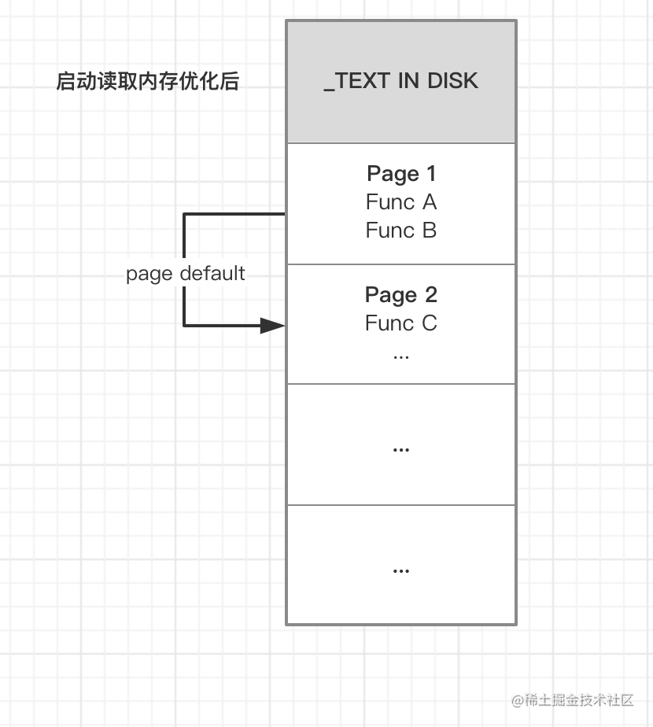
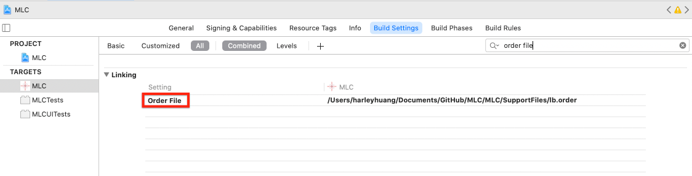

>
- [**App启动和加载**](#App启动和加载)
	- [概念科普](#概念科普)
		- [Page Fault](#PageFault)
		- [主存(RAM)和代码段TEXT、磁盘存储区别、虚拟内存](#主存(RAM)和代码段TEXT、磁盘存储区别、虚拟内存)
			- [区别总结](#区别总结)
			- [物理内存(主存(RAM))与虚拟内存关系](#物理内存(主存(RAM))与虚拟内存关系)
				- [主存（RAM）](#主存（RAM）)
				- [只读存储器ROM](#只读存储器ROM)
				- [代码段（TEXT）](#代码段（TEXT）)
				- [磁盘存储](#磁盘存储)
				- [虚拟内存](#虚拟内存)
				- [区别总结](#区别总结)
				- [物理内存(主存(RAM))与虚拟内存关系](#物理内存(主存(RAM))与虚拟内存关系)
		- [寄存器](#寄存器)
		- [缓存Cache](#缓存Cache)
		- [光盘存储](#光盘存储)
		- [闪存存储](#闪存存储)
	- [page fault如何优化](#pagefault如何优化)
	- [Link Map链接顺序](#LinkMap链接顺序)
		- [配置](#配置)
			- [Write Link Map File](#WriteLinkMapFile)
			- [Order File](#OrderFile)
- [**SanitizerCoverage采集调用函数信息**](#SanitizerCoverage采集调用函数信息)
	- [案例代码1](#案例代码1)
	- [案例代码2](#案例代码2)
	- [__sanitizer_cov_trace_pc_guard_init解析](#__sanitizer_cov_trace_pc_guard_init解析)
- [**结果**](#结果)
	- [获取真机排序文件](#获取真机排序文件)


<br/>

***
<br/><br/>


> <h1 id='App启动和加载'>App启动和加载</h1>

&emsp; Linux系统下，进程申请运行的内存并不是**物理内存(主存（RAM))**.而是只标记当前进程拥有该段内存，当真正使用这段段内存时才会分配，此时的内存是虚拟内存。

<br/>

&emsp; 在**虚拟内存**出现前，程序指令必须都在 **物理内存(主存（RAM))** 内，使得 **物理内存(主存（RAM))** 能存放的进程十分有限，并且由于是相邻存储，容易发生越界访问等情况。

&emsp; 虚拟内存是作为**内存的管理和保护工具**诞生的，为每个进程提供了一片连续完整的虚拟内存空间，使用时先通过**界限寄存器**判断访问是否越界，再通过基址寄存器转换为实际内存地址。

&emsp; 降低了内存管理的复杂度，保护每个进程的内存地址空间不会被其它进程破坏，并且实现了共享缓存功能.访问时先判断是否已缓存到**主存(RAM)** 中,然后才通过 CPU 寻址（虚拟地址）访问 **主存(RAM)** 或硬盘。


<br/>

&emsp; 当我们需要访问一个内存地址时，如果虚拟内存地址对应的 **物理内存(主存（RAM))** 还未分配，**CPU 会执行 page fault**，将指令从磁盘加载到 **物理内存(主存（RAM))** 中并进行验签操作（App Store 发布情况下）。

&emsp; 在App 启动过程中，会调用各种函数，由于这些函数分布在各个 TEXT 段中且不连续，此时需要执行多次 page fault 创建分页，将代码读取到 **物理内存(主存（RAM))** 中，并且这些分页中的部分代码不会在启动阶段被调用。如下图所示，假设我们在启动阶段需要调用 Func A、B、C，则需执行3次 page default(包括首次读取)，并使用3个分页。


<br/><br/>

> <h2 id='概念科普'>概念科普</h2>

<br/><br/>

> <h2 id='PageFault'>Page Fault</h2>

**疑问:** 什么叫做page fault? 它是怎么引起的? 如何解决的?

<br/>
在计算机科学中，"page fault"（页错误）是指当程序访问的内存页不在主存（RAM）中时，发生的一种异常情况。操作系统将缺失的页从磁盘加载到RAM中，以满足程序对该页的访问请求。Page fault通常被分为两种类型：缺页错误（major page fault）和轻量级缺页错误（minor page fault）。


- 缺页错误（Major Page Fault）： 这种错误发生在程序试图访问不在RAM中的内存页时，操作系统需要将相应的页从磁盘加载到RAM。这通常发生在程序首次访问某个内存区域或者因为页面被交换出去而导致缺失。

- 轻量级缺页错误（Minor Page Fault）： 这种错误是指程序访问的内存页已经在RAM中，但是由于分页机制中的一些原因，需要进行某些操作，如写时复制（Copy-on-Write）或者页面共享。


<br/>

**引起page fault的原因：**

- 页面未在RAM中： 当程序访问的内存页面未在RAM中，会触发缺页错误。这可能是由于程序首次访问该内存区域，或者因为页面曾经被交换到磁盘上。

- 写时复制： 在多进程环境下，如果多个进程共享同一块内存，当其中一个进程尝试写入共享内存时，就会触发写时复制，导致轻量级缺页错误。

- 页面被换出： 当系统内存不足时，操作系统可能会将一些页面从RAM中换出到磁盘，以释放内存空间。当程序再次访问这些页面时，会引发缺页错误。


<br/>


**解决page fault的方法：**

- 优化算法： 通过优化算法和数据结构，减少对不同内存区域的频繁访问，以降低缺页错误的发生率。

- 增加物理内存： 扩充系统的物理内存可以减少缺页错误的发生，因为更多的页面可以保存在RAM中，减少了页面被交换到磁盘的可能性。

- 使用更快的存储设备： 使用更快速的磁盘或固态硬盘（SSD）可以减少页面从磁盘加载到RAM的时间，降低缺页错误的影响。

- 优化程序设计： 设计程序时考虑内存局部性，减少对非常远的内存区域的频繁访问，以降低缺页错误的概率。


<br/><br/>

> <h2 id='主存(RAM)和代码段TEXT、磁盘存储区别、虚拟内存'>主存(RAM)和代码段TEXT、磁盘存储区别、虚拟内存</h2>


<br/><br/>

> <h2 id='主存（RAM）'>主存（RAM）</h2>

- 定义： 主存，也称为随机访问存储器（RAM），是计算机中用于临时存储数据和程序的地方。它是易失性存储器，意味着当计算机断电时，存储在主存中的数据会丢失。

- 特点： 主存的数据可以被直接读取和写入，其访问速度非常快。它用于存储当前正在运行的程序、数据和中间计算结果。主存是计算机的关键性能组件之一。

- 位置： RAM是一种临时性的、易失性存储器，通常位于计算机的主板上，插在内存插槽中。这些内存模块直接与计算机的主处理器（CPU）和内存控制器相连，提供了快速且随机访问的存储。


Mac上的内存8GB内存指的是RAM（随机访问存储器）。当我们说一个计算机有8GB内存时，指的是该计算机的随机访问存储器容量为8GB。

<br/><br/>


<br/><br/>

> <h2 id='只读存储器ROM'>只读存储器ROM</h2>

- 作用:ROM是一种固化的存储介质，其中的数据一经写入就不可更改，只能读取。与之相对的是RAM（随机访问存储器），RAM是一种可读写的临时存储介质，数据在断电时会丢失。

- 位置： ROM通常位于计算机的主板上或集成在其他硬件设备中，如芯片组或外围设备。它的内容是在制造阶段被写入的，并且通常是只读的，无法在正常操作过程中被修改。 

在计算机中，ROM通常用于存储固件、基本输入输出系统（BIOS）、引导加载程序等与系统启动和硬件交互有关的固定程序。这些数据对计算机的基本操作和启动过程至关重要。与RAM不同，ROM的内容在通常情况下是静态的，只有在特定的情况下才能进行更新，例如通过固件升级。

简而言之，ROM是一种只读存储器，通常用于存储固定程序和数据，而磁盘是一种可读写存储介质，用于长期存储各种数据。


> <h2 id='代码段（TEXT）'>代码段（TEXT）</h2>

- 定义： 代码段是程序存储在主存中的部分，其中包含了可执行程序的机器指令。通常，这部分内存被设置为只读，以确保程序的指令不会被意外修改。

- 特点： 代码段存储了程序的指令集，它是程序的一部分。当程序被加载到主存中运行时，代码段中的指令被执行。与主存的区别在于，代码段是存储程序的指令，而主存包含了程序的所有数据和执行环境。

<br/><br/>

> <h2 id='磁盘存储'>磁盘存储</h2>

- 定义： 磁盘存储通常指的是硬盘驱动器（HDD）或固态硬盘（SSD）等非易失性存储设备，用于长期存储数据、操作系统和应用程序。与主存相比，磁盘存储的访问速度较慢。

- 特点： 磁盘存储是持久性的，即数据在断电时不会丢失。它主要用于存储大量的文件、操作系统和应用程序。相对于主存，磁盘存储的容量更大，但速度较慢。


<br/><br/>

> <h2 id='虚拟内存'>虚拟内存</h2>

- 定义：虚拟内存则是通过操作系统对磁盘空间的管理来扩展**物理内存(主存(RAM))** 的概念。虚拟内存使得程序能够访问一个比**物理内存(主存(RAM))** 更大的地址空间，以及在**物理内存(主存(RAM))** 不足时将部分数据存储到磁盘上，从而保证了系统的稳定性和多任务处理的能力,使得程序看起来似乎具有更多的内存。

- 作用： 虚拟内存使得多个程序可以同时运行，即使它们的总内存需求超过了 **物理内存(主存(RAM))** 的大小。它还允许操作系统将不活动的数据移动到磁盘上，以释放 **物理内存(主存(RAM))** 供其他程序使用。


<br/><br/><br/>

> <h2 id='区别总结'>区别总结</h2>

- 主存是计算机中的临时存储器，用于存储当前正在运行的程序和数据，是易失性存储器。

- 代码段是程序存储在主存中的一部分，包含可执行程序的机器指令，是主存的一部分。

- 磁盘存储是用于长期存储数据、操作系统和应用程序的非易失性存储设备，速度较慢，容量较大。


<br/><br/><br/>

> <h2 id='物理内存(主存(RAM))与虚拟内存关系'>物理内存(主存(RAM))与虚拟内存关系</h2>

- 扩展内存空间： 虚拟内存通过将部分不常用的数据存储在硬盘上，扩展了程序的地址空间，使得程序可以使用比实际物理内存更大的内存空间。

- 缺页错误处理： 当程序试图访问虚拟内存中的某个页时，而该页不在物理内存中时，会发生缺页错误。此时，操作系统负责将缺失的页从硬盘加载到物理内存中，以满足程序的需求。


&emsp; 总体来说，虚拟内存是一种通过将数据存储在磁盘上来扩展主存的技术。它提供了更大的地址空间，允许多个程序同时运行，并且通过缺页错误处理机制，有效地管理物理内存的使用。虚拟内存与主存之间的协同工作是操作系统提供的一种关键功能，有助于提高计算机的整体性能和多任务处理能力。


<br/><br/>

> <h2 id='寄存器'>寄存器</h2>

寄存器是位于CPU内部的小型存储器单元, 是集成在CPU（中央处理单元）内部的一种高速存储器。，用于暂时存储和处理指令和数据。寄存器是速度最快的存储器，但容量非常有限。

它们直接与CPU核心相关联，用于暂时存储和执行指令，以及存储计算中间结果。由于寄存器的速度非常快，它们提供了最快速的存储器访问，但也是容量最小的存储器层次。

<br/><br/>

> <h2 id='缓存Cache'>缓存Cache</h2>

Cache（高速缓存）并不是指RAM（随机存取存储器 Random Access Memory），而是指位于RAM与CPU（中央处理器）之间的一种特殊类型的存储器，它使用更快但更昂贵的技术，如SRAM（静态随机存取存储器 Static Random-Access Memory）。Cache设计的主要目标是为了减少CPU对主存（即RAM）的访问延迟，因为CPU的工作速度远高于RAM的访问速度。

高速缓存按照与CPU的接近程度和速度分为不同级别，最常见的是L1 Cache、L2 Cache以及可能存在的L3 Cache（或者称为最后一级缓存LLC）。这些缓存硬件直接集成在CPU内部或紧邻CPU封装，用以存储最近或最常被CPU访问的数据和指令，当CPU需要读取或写入数据时，会先在Cache中查找，如果命中（找到所需数据），则避免了去主存中进行耗时较长的操作，从而极大地提升了系统的整体性能。


<br/><br/>

> <h2 id='光盘存储'>光盘存储</h2>

光盘包括CD、DVD和Blu-ray等，它们使用激光技术读取和写入数据。光盘通常用于存储音频、视频、软件安装文件等。


<br/><br/>

> <h2 id='闪存存储'>闪存存储</h2>

 闪存是一种非易失性存储介质，类似于固态硬盘，但通常以更小、更便携的形式存在，如USB闪存驱动器、SD卡和固态硬盘。


<br/><br/>

> <h2 id='pagefault如何优化'>page fault如何优化</h2>

&emsp; 优化的思路很简单，即把启动阶段需要用到的函数按顺序集中放在一块，减少 page fault 执行次数和分页数量.如下图所示:




<br/><br/>

> <h2 id='LinkMap链接顺序'>Link Map链接顺序</h2>

Link Map 是 App 编译过程的中间产物，记载了二进制文件的布局，我们可以通过 Link Map 文件分析可执行文件的构成是怎样，里面的内容都是些什么，哪些库占用空间较高等等.


<br/><br/>

> <h3 id='配置'>配置</h3>


> <h4 id='WriteLinkMapFile'>Write Link Map File</h4>


**需要手动在 Build Settings 将 Write Link Map File 设置为 Yes。**

**默认生成的 Link Map 文件在 build 目录下，可以通过修改 Path To Link Map 指定存放地址。**


文件路径如下:


以其中一个项目为例,如下:


```
// Link Map对应安装包地址
# Path: /Users/harleyhuang/Library/Developer/Xcode/DerivedData/MLC-fpuuznzditxxpmazhuzthcbbhziq/Build/Products/Debug-iphonesimulator/MLC.app/MLC

// 对应的架构
# Arch: x86_64

// 编译后生成的.o文件列表，包括系统和用户自定的类，UIKit库等等。
# Object files:
[  0] linker synthesized
[  1] dtrace
[  2] /Users/harleyhuang/Library/Developer/Xcode/DerivedData/MLC-fpuuznzditxxpmazhuzthcbbhziq/Build/Intermediates.noindex/MLC.build/Debug-iphonesimulator/MLC.build/Objects-normal/x86_64/NSObject+HGTestCategory.o
[  3] /Users/harleyhuang/Library/Developer/Xcode/DerivedData/MLC-fpuuznzditxxpmazhuzthcbbhziq/Build/Intermediates.noindex/MLC.build/Debug-iphonesimulator/MLC.build/Objects-normal/x86_64/HGMenuItem.o
···
··
·

// Section是各种数据类型所在的内存空间，Section主要分为两大类，__Text和__DATA。__Text指的是程序代码，__DATA指的是已经初始化的变量等。
# Sections:
# Address	Size    	Segment	Section
0x1000031F0	0x0079E9BA	__TEXT	__text
0x1007A1BAA	0x00002610	__TEXT	__stubs
0x1007A41BC	0x000034C2	__TEXT	__stub_helper
0x1007A767E	0x000024BC	__TEXT	__ustring
0x1007A9B40	0x00035C0E	__TEXT	__cstring
0x1007DF74E	0x0002A4AE	__TEXT	__objc_methname
0x100809BFC	0x000032D8	__TEXT	__objc_classname
0x10080CED4	0x00007398	__TEXT	__objc_methtype
0x100814270	0x000244A3	__TEXT	__const
0x100838714	0x0000E958	__TEXT	__gcc_except_tab
···
··
·


//变量名、类名、方法名等符号表
# Symbols:
# Address	Size    	File  Name
0x1000031F0	0x000000E0	[  2] -[NSObject(HGTestCategory) setTestGetOrSet:]
0x1000032D0	0x00000029	[  2] -[NSObject(HGTestCategory) testGetOrSet]
0x100003300	0x00000050	[  3] -[HGMenuItem speedFactor]
0x100003350	0x000000D0	[  3] -[HGMenuItem setNormalColor:]
0x100003420	0x000000D0	[  3] -[HGMenuItem setSelecetedColor:]
0x1000034F0	0x000002B0	[  3] -[HGMenuItem setRate:]
0x1000037A0	0x000001B0	[  3] -[HGMenuItem initWithFrame:]
0x100003950	0x00000080	[  3] -[HGMenuItem setupGestureRecognizer]
0x1000039D0	0x000000D0	[  3] -[HGMenuItem touchUpInside:]
0x100003AA0	0x000002A0	[  3] -[HGMenuItem setSelected:withAnimation:]
0x100003D40	0x000001E0	[  3] -[HGMenuItem rateChange]
0x100003F20	0x00000040	[  3] -[HGMenuItem delegate]
····
···
··
·


# Dead Stripped Symbols:
#        	Size    	File  Name
<<dead>> 	0x00000018	[  2] CIE
<<dead>> 	0x00000008	[  3] 8-byte-literal
<<dead>> 	0x00000008	[  3] 8-byte-literal
<<dead>> 	0x0000000B	[  3] literal string: v24@0:8@16
<<dead>> 	0x00000008	[  3] literal string: @16@0:8
<<dead>> 	0x00000009	[  3] literal string: delegate
···
··
·

```

可以看到此时 Symbols 的符号表并不是按照启动时执行的函数顺序加载的，而是按照库的编译顺序全部载入。


<br/><br/>

> <h4 id='OrderFile'>Order File</h4>


Xcode 的链接器提供了一个 Order File 配置，对应的文件中符号会按照顺序写入二进制文件中，我们可以将调用到的函数写到该文件，实现优化




<br/><br/>

> <h2 id='SanitizerCoverage采集调用函数信息'>SanitizerCoverage采集调用函数信息</h2>

&emsp; 通过 SanitizerCoverage 采集调用函数信息， SanitizerCoverage 内置在LLVM中，可以在函数、基本块和边界这些级别上插入对用户定义函数的回调，属于静态插桩，代码会在编译过程中插入到每个函数中，详细介绍可以在 [Clang 11 documentation(Clang官方文档) ](https://clang.llvm.org/docs/index.html)找到: [SanitizerCoverage](https://clang.llvm.org/docs/SanitizerCoverage.html)=>[Tracing PCs with guards](https://clang.llvm.org/docs/SanitizerCoverage.html#tracing-pcs-with-guards)。


<br/>


在 build settings 里的 `Other C Flags` 中添加 

```
-fsanitize-coverage=func,trace-pc-guard
```

如果含有 Swift 代码的话，还需要在 “Other Swift Flags” 中加入 

```
-sanitize-coverage=func 和 -sanitize=undefined
```

需注意，所有链接到 App 中的二进制都需要开启 SanitizerCoverage(如上述的配置)，这样才能完全覆盖到所有调用。


<br/>

开启后，函数的调用 都会执行 

```
void __sanitizer_cov_trace_pc_guard(uint32_t *guard) {
	// +load方法先于guard_init调用，此时guard为0
	// if(!*guard) { return }

    if (stopCollecting) {
        return;
    }

    // __builtin_return_address 获取当前调用栈的下一条指令地址
    void *PC = __builtin_return_address(0);
    PointerNode *node = malloc(sizeof(PointerNode));
    *node = (PointerNode){PC, NULL};
    // 使用原子队列要存储帧地址
    OSAtomicEnqueue(&qHead, node, offsetof(PointerNode, next));
} 
```

回调，效果类似我们对 objc_msgSend 进行 Hook插桩，但该回调不止局限于 OC 函数，还包括 Swift、block、C等。

<br/>


通过汇编可发现，每个函数调用前都被插入了`__sanitizer_cov_trace_pc_guard`，所以我们在该函数中，利用 `__builtin_return_address` 获取运行栈的情况，保存第一条指令地址，即函数地址。


<br/>

<br/><br/>

> <h3 id='案例代码1'>案例代码1</h3>


我们在该回调中插入自己的统计代码，收集函数名，启动完成后再将数据导出,完整代码如下：

```
//
//  HGBinaryRearrangement.m
//  MLC
//
//  Created by Harley Huang on 29/4/2023.
//  Copyright © 2023 HuangGang'sMac. All rights reserved.
//

#import "HGBinaryRearrangement.h"

#import <dlfcn.h>
#include <stdint.h>
#include <stdio.h>
#include <sanitizer/coverage_interface.h>
#import <libkern/OSAtomicQueue.h>
#import <pthread.h>


static OSQueueHead qHead = OS_ATOMIC_QUEUE_INIT;
static BOOL stopCollecting = NO;

// 通过链表的形式存放方法地址
typedef struct {
    void *pointer;
    void *next;
} PointerNode;

// dyld链接dylib时调用，start和stop地址之间的保存该dylib的所有符号的个数
// 可以不实现具体内容，不影响后续调用
void __sanitizer_cov_trace_pc_guard_init(uint32_t *start,uint32_t *stop) {
    static uint32_t N;  // Counter for the guards.
    if (start == stop || *start) return;  // Initialize only once.
    printf("INIT: %p %p\n", start, stop);
    for (uint32_t *x = start; x < stop; x++)
        *x = ++N;  // Guards should start from 1.
    
    printf("totasl count %i\n", N);
}

/* 通过汇编可发现，每个函数调用前都被插入了
 bl     0x102b188c0               ; symbol stub for: __sanitizer_cov_trace_pc_guard
 所以在每个函数调用时都会先跳转执行该函数
*/
void __sanitizer_cov_trace_pc_guard(uint32_t *guard) {
    // +load方法先于guard_init调用，此时guard为0
    //if(!*guard) { return }

    if (stopCollecting) {
        return;
    }

    // __builtin_return_address 获取当前调用栈信息，取第一帧地址（即下条要执行的指令地址，被插桩的函数地址）
    void *PC = __builtin_return_address(0);
    PointerNode *node = malloc(sizeof(PointerNode));
    *node = (PointerNode){PC, NULL};
    // 使用原子队列要存储帧地址
    OSAtomicEnqueue(&qHead, node, offsetof(PointerNode, next));
}


/**
 * 由于存在多线程调用的问题，此时需要用锁来保证符号存储
 *这里我们使用原子队列，执行效率高且队列存储数据，不需要再额外加锁处理和创建数组。
 */
extern NSArray <NSString *> *getAllFunctions(NSString *currentFuncName) {
    NSMutableSet<NSString *> *unqSet = [NSMutableSet setWithObject:currentFuncName];
    NSMutableArray <NSString *> *functions = [NSMutableArray array];
    while (YES) {
        PointerNode *front = OSAtomicDequeue(&qHead, offsetof(PointerNode, next));
        if(front == NULL) {
            break;
        }
        Dl_info info = {0};
        // dladdr获取地址符号信息
        dladdr(front->pointer, &info);
        NSString *name = @(info.dli_sname);
        // 去除重复调用
        if([unqSet containsObject:name]) {
            continue;
        }
        BOOL isObjc = [name hasPrefix:@"+["] || [name hasPrefix:@"-["];
        // order文件格式要求C函数和block前需要添加_
        NSString *symbolName = isObjc ? name : [@"_" stringByAppendingString:name];
        [unqSet addObject:name];
        [functions addObject:symbolName];
    }
    // 取反得到正确调用排序
    return [[functions reverseObjectEnumerator] allObjects];;

}

#pragma mark - public
extern NSArray <NSString *> *getAppCalls(void) {
    
    stopCollecting = YES;
    // 内存屏障，防止cpu的乱序执行调度内存（原子锁）
    __sync_synchronize();
    NSString* curFuncationName = [NSString stringWithUTF8String:__FUNCTION__];
    return getAllFunctions(curFuncationName);
}

extern void appOrderFile(void(^completion)(NSString* orderFilePath)) {
    
    stopCollecting = YES;
    __sync_synchronize();
   NSString* curFuncationName = [NSString stringWithUTF8String:__FUNCTION__];
    
    dispatch_after(dispatch_time(DISPATCH_TIME_NOW, (int64_t)(0.01 * NSEC_PER_SEC)), dispatch_get_global_queue(DISPATCH_QUEUE_PRIORITY_DEFAULT, 0), ^{
        NSArray *functions = getAllFunctions(curFuncationName);
        NSString *orderFileContent = [functions.reverseObjectEnumerator.allObjects componentsJoinedByString:@"\n"];
        NSLog(@"[orderFile]: %@",orderFileContent);
        NSString *filePath = [NSTemporaryDirectory() stringByAppendingPathComponent:@"orderFile.order"];
        [orderFileContent writeToFile:filePath
                           atomically:YES
                             encoding:NSUTF8StringEncoding
                                error:nil];
        if(completion){
            completion(filePath);
        }
    });
}
```


但是我在AppDelegate.m中进行调用了**`appOrderFile和getAppCalls`**方有大问题,插桩方法只有几个,完全不行.这个可以后面进行改进


<br/>

```
/*
 * Structure filled in by dladdr().
 */
typedef struct dl_info {
        const char      *dli_fname;     /* Pathname of shared object */
        void            *dli_fbase;     /* Base address of shared object */
        const char      *dli_sname;     /* Name of nearest symbol */
        void            *dli_saddr;     /* Address of nearest symbol */
} Dl_info;

extern int dladdr(const void *, Dl_info *);

```

将收集的函数地址从原子队列中取出，通过 dladdr  获取地址的对应符号信息，最后将数组排序逆转即可得到按顺序排序的调用函数数组。


<br/><br/>


> <h2 id='案例代码2'>案例代码2</h2>

```
#import <dlfcn.h>
#include <stdint.h>
#include <stdio.h>
#include <sanitizer/coverage_interface.h>


int main(int argc, char * argv[]) {
    @autoreleasepool {
        return UIApplicationMain(argc, argv, nil, NSStringFromClass([AppDelegate class]));
    }
}


void __sanitizer_cov_trace_pc_guard_init(uint32_t *start,uint32_t *stop) {
    static uint32_t N;  // Counter for the guards.
    if (start == stop || *start) return;  // Initialize only once.
    printf("🍭INIT: %p %p\n", start, stop);
    for (uint32_t *x = start; x < stop; x++)
        *x = ++N;  // Guards should start from 1.
    
    printf("🍿totasl count %i\n", N);
}

/// 通过汇编可发现，每个函数调用前都被插入了
/// bl     0x102b188c0               ; symbol stub for: __sanitizer_cov_trace_pc_guard
/// 所以在每个函数调用时都会先跳转执行该函数
void __sanitizer_cov_trace_pc_guard(uint32_t *guard) {
    // +load方法先于guard_init调用，此时guard为0
    //if(!*guard) { return; }

    // __builtin_return_address 获取当前调用栈信息，取第一帧地址（即下条要执行的指令地址，被插桩的函数地址）
    void *PC = __builtin_return_address(0);
    
    Dl_info info;
    dladdr(PC, &info);
    printf("💎插桩方法:%s\n", info.dli_sname);

}

```


控制台打印的方法就是插桩后的方法,但是里面可能包含很多重复的代码,你可以通过去[**重复字符串网站进行去除**](https://www.bejson.com/othertools/removeDuplicate/),整理后就是我们需要的方法了

<br/><br/>

> <h3 id='__sanitizer_cov_trace_pc_guard_init解析'>__sanitizer_cov_trace_pc_guard_init解析</h3>

```
void __sanitizer_cov_trace_pc_guard_init(uint32_t *start,
                                         uint32_t *stop) {
  
    static uint32_t N;  // Counter for the guards.
    if (start == stop || *start) return;  // Initialize only once.
    printf("INIT: %p %p\n", start, stop);
    for (uint32_t *x = start; x < stop; x++)
        *x = ++N;  // Guards should start from 1.
    
    printf("totasl count %i\n", N);
}
```


dyld 每链接一个开启 SanitizerCoverage 配置的 dylib 都会执行一次  __sanitizer_cov_trace_pc_guard_init ，start 和 stop 之间的区间保存了该 dylib 的符号个数，我们通过设置静态全局变量 N 可统计所有 dylib 的符号。


如果不需要以上内容可以仅执行空函数 void __sanitizer_cov_trace_pc_guard_init(uint32_t *start,                                          uint32_t *stop){}，不会影响后面的调用。


<br/>

***
<br/><br/>

> <h1 id='结果'>结果</h1>


<br/><br/>

> <h2 id='获取真机排序文件'>获取真机排序文件</h2>


- **1).方法**

真机连着Xcode后,选择 **Devices And Simulators** 然后下载.xcappdata格式文件到桌面:


然后点击..xcappdata格式.文件选择 **显示包内容**,然后按照如下打开.order文件:


<br/>


**‌2).方法**

上面的方法太繁琐了,后面发现一种更方便的办法就是: 
- 真机来接Xcode

- 运行后会产生一个.app文件

- 选中.app,然后显示所在文件路径


<br/>


通过 system trace 工具对比下优化前后的启动速度，由于 Demo 工程内容少，无法看出明显区别，可以跟公司项目作为对比.


<br/>
<br/>
<br/>

可以看到执行 page fault 少了将近 1/3，速度提升了 1/4，说明对启动优化上还是有一定效果，尤其是在大项目中。


