> <h2 id=''></h2>
- [内联函数static inline](#内联函数staticinline)
- [枚举](#枚举)
	- [枚举宏](#枚举宏)
		- [NS_ENUM和NS_OPTIONS](#NS_ENUM和NS_OPTIONS)
		- [NS_STRING_ENUM](#NS_STRING_ENUM)
	- [位运算**&**和**|**](#位运算&和|)
- [**‌property属性**](#property属性)
	- [点语法](#点语法)
	- [readWrite](#readWrite)
	- [**nonatomic和atomic**](#nonatomic和atomic)
	- [**retain**](#retain)
	- [**copy**](#copy)
	- [**assign**](#assign)
	- [retain和assign区别](#retain和assign区别)
	- [**weak**](#weak)
		- [大白话讲解weak原理](#大白话讲解weak原理)
		- **资料**
			- [weak引用的底层实现原理(1)](https://blog.csdn.net/u013378438/article/details/82767947)
			- [weak引用的底层实现原理(2)](https://blog.csdn.net/u013378438/article/details/82790332)
	- [NSString的copy使用]()
	- [**NSMutableString的property属性**](#NSMutableString的property属性)
		- [添加一个元素](#添加一个元素)
		- [修改数组元素](#修改数组元素)
		- [copy和strong置为空](#copy和strong置为空)
		- [copy，strong，weak，assign的区别](#copy，strong，weak，assign的区别)
		- [delegate为什么要用weak或者assign而不用strong](#delegate为什么要用weak或者assign而不用strong)
	- [protocol中添加属性](#protocol中添加属性)
	- [@synthesize](#@synthesize)
		- [synthesize使用情况](#synthesize使用情况)
			- [同时重写setter和getter](#同时重写setter和getter)
			- 	[重写只读属性的getter时](#重写只读属性的getter时)
			- 	[使用了@dynamic时](#使用了@dynamic时)
			- 	[在@protocol中定义的所有属性](#使用了@dynamic时)
			- [在category中定义的所有属性](#使用了@dynamic时)
			- [重写(overridden)的属性](#使用了@dynamic时)
	- [@dynamic](#@dynamic)
- [**宏定义**](#宏定义)
	- [__bridge](#__bridge)
	- [Const](#Const)
	- [SD_UIKIT](#SD_UIKIT)
	- [weakify和strongify](https://xie.infoq.cn/article/903068956d7c2a5952059b16c)
	- [DEPRECATED_MSG_ATTRIBUTE](#DEPRECATED_MSG_ATTRIBUTE)
	- [FOUNDATION_EXTERN](#FOUNDATION_EXTERN)
	- [__VA_ARGS__](#__VA_ARGS__)
- [**ARC关闭**](#ARC关闭)
- **参考资料**
	- [^断言NSAssert][断言NSAssert](https://www.jianshu.com/p/d7498657d550)
	- [^断言(NSAssert)的使用][断言(NSAssert)的使用](https://www.jianshu.com/p/6e444981ab45)
	- [CADisplayLink做逐帧动画](https://www.jianshu.com/p/0eeb21244caa)
	- **[pragma 处理警告](https://www.jianshu.com/p/4720fc9e991a)**
	- [**常见的宏**](https://www.jianshu.com/p/9f7a37989b79)

	


<br/>

***
<br/>
<br/>

> <h1 id='内联函数staticinline'>内联函数static inline</h1>

```
static inline NSArray<NSNumber *> * _Nonnull SDImageScaleFactors() {
    return @[@2, @3];
}

//同一个文件,在另一个函数中调用
-(void)test {
	NSArray *scales = SDImageScaleFactors();
}
```

内联用到的关键字是: **static inline** 

<br/>

- **1.inline标示符**

&emsp; 引用inline标示符，能够使函数一作为一个标准的内联函数，函数的代码被放入符号表中，在使用时直接进行替换，（像宏一样展开）。

&emsp; 一般情况下引入内联函数是为了解决函数调用效率的问题，函数之间调用，是内存地址之间的调用，当函数调用完毕之后还会返回原来函数执行的地址，会有一定的时间开销，内联函数就是为了解决这一问题。

&emsp; 不用inline修饰的函数，汇编时会调用 call 指令，调用call指令就是就需要：

```
1)将下一条指令的所在地址入栈
2)并将子程序的起始地址送入PC（于是CPU的下一条指令就会转去执行子程序）
```

&emsp; GCC中的inline函数可以相当于在一个普通的全局函数加上inline属性。inline关键字仅仅是建议编译器在编译的时候做内联展开处理，而不是强制在gcc编译器中，编译器可以忽略这个建议的，某一些情况下编译器会自动忽略这个inline，将这个函数还原成普通函数。如果编译选项设置为负无穷，即使是inline函数也不会被内联展开，除非设置了强制内联展开的属性(attribute((always_inline)))，即NS_INLINE这个宏定义。


<br/>
<br/>

- **2.static标示符**

通常情况下使用是用作声明静态变量。

```
1）修饰局部变量的时候，让局部变量只初始化一次，局部变量在程序中只有一份内存，但是并不会改变局部变量的作用域，仅仅是改变了局部变量的生命周期（只到程序结束，这个局部变量才会销毁）。
2）修饰全局变量的时候，全局变量的作用域仅限于当前文件。
```


&emsp; 当修饰函数的时候，对函数的连接方式产生影响，使得函数只在本文件内部有效，对其他文件是不可见的。这样的函数又叫作静态函数。使用静态函数的好处是，不需要担心在其他文件存在同名的函数从而产生干扰。
如果想要其他文件可以引用本地函数，则要在函数定义时使用关键字extern，表示该函数是外部函数，可供其他文件调用。

&emsp; 另外在要引用别的文件中定义的外部函数的文件中，使用extern声明要用的外部函数即可。

&emsp; 另外也因为使用了static修饰，从而保证了不会不断地调用copy，保证了函数地址的一致性，减小了内存压力。


<br/>

- **3.inline的优势**

	- 3.1inline函数取代宏

```
1）#define定义的函数要有特别的格式要求，并不是每个人都能熟练使用，而使用`inline`则就行平常写函数那样。
2）和其他的宏定义一样，使用define宏定义的代码，编译器不会对其进行参数有效性检查，很容易出现无法察觉的错误，调试过程中会出现很多麻烦。
3）不仅是输入类型，#define宏定义的代码，返回值不能被强制转换成可转换的适合的转换类 。
4）#define是文本替换，需要在预编译时展开，内联函数是编译时候展开

```

<br/>

- 3.2inline函数相比于普通函数的优势

```
1)inline函数避免了普通函数的,在汇编时必须调用call的缺点：取消了函数的参数压栈，减少了调用的开销,提高效率.所以执行速度确比一般函数的执行速度要快.
2)集成了宏的优点,使用时直接用代码替换(像宏一样);

```


<br/>


- 3.3inline内联函数的说明

```
1）内联函数只是我们向编译器提供的申请，编译器不一定采取inline形式调用函数。
2）内联函数不能承载大量的代码，如果内联函数的函数体过大，编译器会自动放弃内联。
3）内联函数内不允许使用循环语句或开关语句。
4）内联函数的定义须在调用之前。
5）当使用内联函数时，如果在多处调用了此内联函数，则此函数就会有N次代码段的拷贝，所以多配合`static`标示符使用。
```


<br/>

***
<br/>
<br/>

> <h1 id='枚举'>枚举</h1>


<br/>


># <h1 id='枚举宏'>[枚举宏](https://juejin.cn/post/6999460035508043807)</h1>

- **NS_ENUM**：用于简单的枚举
- **NS_CLOSED_ENUM**：用于不会变更枚举成员的简单的枚举（简称 “冻结枚举” ）
- **NS_OPTIONS**：用于选项枚举
- **NS_TYPED_ENUM**：用于类型常量枚举
- **NS_TYPED_EXTENSIBLE_ENUM**：用于可扩展的类型常量枚举


<br/>


> <h3 id='NS_ENUM和NS_OPTIONS'>NS_ENUM和NS_OPTIONS</h3>

- **NS_ENUM和NS_OPTIONS宏提供了一个简洁、定义枚举和C语言选项的简单方法。**

	- NS_ENUM:是用来声明一般的NSInteger(下面代码使用NSInteger)类型的枚举
	- NS_OPTIONS:是用来声明位掩码(bitmasked)


```

//整型枚举 :只能单个使用，在C++ 不可以转换
typedef NS_ENUM(NSInteger, UIViewAnimationTransition) {
    UIViewAnimationTransitionNone,
    UIViewAnimationTransitionFlipFromLeft,
    UIViewAnimationTransitionFlipFromRight,
    UIViewAnimationTransitionCurlUp,
    UIViewAnimationTransitionCurlDown,
};


// 位移枚举：使用这种可以多个连接使用 | 进行按位后连接。c++可以转换位 NSUInteger
//[self.view setAutoresizingMask: UIViewAutoresizingFlexibleLeftMargin | UIViewAutoresizingFlexibleTopMargin];
typedef NS_OPTIONS(NSUInteger, UIViewAutoresizing) {
    UIViewAutoresizingNone                 = 0,
    UIViewAutoresizingFlexibleLeftMargin   = 1 << 0,
    UIViewAutoresizingFlexibleWidth        = 1 << 1,
    UIViewAutoresizingFlexibleRightMargin  = 1 << 2,
    UIViewAutoresizingFlexibleTopMargin    = 1 << 3,
    UIViewAutoresizingFlexibleHeight       = 1 << 4,
    UIViewAutoresizingFlexibleBottomMargin = 1 << 5
};

```


<br/>
<br/>


> <h3 id='NS_STRING_ENUM'>NS_STRING_ENUM</h3>


&emsp; 使用 **typedef** 对类型常量进行分组，并指定一个类型（如 DCDictionaryKey），涉及到使用该类型常量的地方都改为使用 DCDictionaryKey，而不是 String。然后，在后面添加上宏 NS_STRING_ENUM.

OC中定义枚举和使用:

```
///在.h文件🀄️定义
typedef NSString *DCDictionaryKey NS_STRING_ENUM;

FOUNDATION_EXTERN DCDictionaryKey const DCDictionaryKeyTitle;
FOUNDATION_EXTERN DCDictionaryKey const DCDictionaryKeySubtitle;
FOUNDATION_EXTERN DCDictionaryKey const DCDictionaryKeyCount;

///在.m文件中定义字符串
DCDictionaryKey const DCDictionaryKeyTitle = @"11111";
DCDictionaryKey const DCDictionaryKeySubtitle = @"222";
DCDictionaryKey const DCDictionaryKeyCount = @"3333"


// 使用
NSDictionary<DCDictionaryKey, id> *dict = @{......};

NSString *title    = dict[DCDictionaryKeyTitle]; 
NSString *subtitle = dict[DCDictionaryKeySubtitle]; 
NSInteger count    = [dict[DCDictionaryKeyCount] integerValue];

```


在OC中使用起来没多大变化，但在 Swift 中就有Swif的味道了,哈哈!!

```
// Objective-C 的常量被自动转换成 Swift Struct
struct DCDictionaryKey : Hashable, Equatable, RawRepresentable {
    init(rawValue: String)
}
extension DCDictionaryKey {
    static let title    : DCDictionaryKey
    static let subtitle : DCDictionaryKey
    static let count    : DCDictionaryKey
}

// 使用
let dict:[DCDictionaryKey : Any] = [.title    : "a title",
                                    .subtitle : "a subTitle",
                                    .count    : 66]

let title    = dict[.title]    as? String
let subtitle = dict[.subtitle] as? String
let count    = dict[.count]    as? Int

// 这时候如果我们之间使用字符串 "title" 当作 key 的话，编译器会报错
let title    = dict["title"]   as? String // Error: Cannot convert value of type '
```

<br/>
<br/>

> <h3 id='NS_EXTENSIBLE_STRING_ENUM'>NS_EXTENSIBLE_STRING_ENUM</h3>

&emsp; 在SDWebImage中为了兼容Swift如下处理:

```
///在.h文件中定义
typedef NSString * NSExceptionName NS_EXTENSIBLE_STRING_ENUM;

FOUNDATION_EXPORT NSExceptionName const NSGenericException;
FOUNDATION_EXPORT NSExceptionName const NSRangeException;
FOUNDATION_EXPORT NSExceptionName const NSInvalidArgumentException;
FOUNDATION_EXPORT NSExceptionName const NSInternalInconsistencyException;


///在.m文件赋值
NSExceptionName const NSGenericException = @"555";
NSExceptionName const NSRangeException = @"666";
NSExceptionName const NSInvalidArgumentException = @"888";
NSExceptionName const NSInternalInconsistencyException = @"999";

```

上面的处理,类似[NS_STRING_ENUM](#NS_STRING_ENUMs)使用.


<br/>

&emsp; **NS_TYPED_EXTENSIBLE_ENUM**用于声明可扩展的类型常量枚举。与 NS_TYPED_ENUM 的区别是生成的 struct 多了一个忽略参数标签的构造器。

```
// declared
typedef long FavoriteColor NS_TYPED_EXTENSIBLE_ENUM;
FOUNDATION_EXTERN FavoriteColor const FavoriteColorBlue;

// imported
struct FavoriteColor : Hashable, Equatable, RawRepresentable {
    init(_ rawValue: Int)
    init(rawValue: Int)
}
extension FavoriteColor {
    static let blue: FavoriteColor
}

// extended
extension FavoriteColor {
    static var green: FavoriteColor {
        return FavoriteColor(1) // blue is 0, green is 1, and new favorite colors could follow
    }
}
```


<br/>
<br/>
<br/>


> <h2 id='位运算&和|'>位运算&和|</h2>

- **运算符**
	- <<(左移):a << b就表示把a转为二进制后左移b位（在后面添b个0）
	- |(或):只要有一个为1, 结果就是1
	- &(与):只要有二个为1, 结果才是1

```
typedef enum {
    nameA = 1 << 0, //值为1(2的0次方)
    nameB = 1 << 1, //值为2(2的1次方)
    nameC = 1 << 2, //值为4(2的2次方)
    nameD = 1 << 3, //值为8(2的3次方)
    
}myEnumTests;


+ (void) testEnumBitOperator {
    /// |(或):只要有一个为1, 结果就是1
    /// &(与):只要有二个为1, 结果才是1
    NSInteger events = nameA | nameB;
    
    LogInfo(@"nameB:%d", nameB);//2
    LogInfo(@"nameA | nameB:%zd", events);//3
    LogInfo(@"events & nameA:%zd", events & nameA);//1
    LogInfo(@"events & nameB:%zd", events & nameB);//2
    LogInfo(@"events & nameC:%zd", events & nameC);//0
    LogInfo(@"events & nameD:%zd", events & nameD);//0
    ///结论: 如果events & nameC为0说明value不包含nameC 相反则包含
    ///还有一点就是events & nameA就是nameA的值为1, value & nameB就是nameB的值为2
    
}

```


<br/>

- NSInteger value = nameA | nameB;的组合的值, 判断结果是:
	- 1是nameA的值;
	- 2是nameB的值;
	- nameC与nameD没有组合使用所以值为0;
	- value & nameC为0说明value不包含nameC 相反则包含!


<br/>

&emsp; 还有一点就是value & nameA就是nameA的值为1, value & nameB就是nameB的值为2


<br/>

nameA = 1, nameB = 2, nameC = 4, nameD = 8,如下:

```
 NSInteger value = nameA | nameB | nameC | nameD;
 转成二进制:
 nameA: 0 0 0 1
   |
 nameB: 0 0 1 0
   |
 nameC: 0 1 0 0
   |
 nameD: 1 0 0 0
----------------
 value: 1 1 1 1
 上面是使用 | 得出value的值为1111(|的意思是有一个为1结果就为1)
 
 
 下面是使用 & 判断输出的值(&的意思就是有二个为1结果才为1)
 
  value: 1 1 1 1         value: 1 1 1 1
    &                      &
  nameA: 0 0 0 1         nameB: 0 0 1 0
 ----------------       ----------------
  结果值: 0 0 0 1         结果值: 0 0 1 0
 
  我就写2个例子:0001就是nameA的值, 0010就是nameB的值
```


<br/>

***
<br/>
<br/>


> <h1 id='property属性'>property属性</h1>


> <h2 id='点语法'>点语法</h2>


&emsp; **点语法:** self. 调用property自动生成getter 和 setter 方法，而 `_` 则是直接调用实例例变量。


<br/>
<br/>


> <h2 id='readWrite'>readWrite</h2>


&emsp; **readwrite:** 可以使用`setValue:  forKey:`方法对其值进行修改；

```
//访问器寻找名称的成员变量
+ (Bool)  accessInstanceVariablesDierctly {
                return NO;
}

``` 


<br/>
<br/>


> <h2 id='nonatomic和atomic'>nonatomic和atomic</h2>


- nonatomic：不使用同步锁，非原子性
- atomic：使用同步锁，原子性

>属性声明为atomic时，在该属性在调用getter和setter方法时，会加上同步锁(也叫互斥锁@synchronized)。
即属性在调用getter和setter方法时，保证同一时刻只能有一个线程调用属性的读/写方法。保证了读和写的过程是可靠的。
但并不能保证数据一定是可靠的。

理由如下图：


其实很简单的例子，如果定义属性 NSInteger i 是原子的，对i进行 i = i + 1; 操作就是不安全的。因为原子性只能保证读写安全，而该表达式需要三步操作：1.读取i的值存入寄存器；2.将i加1；3.修改i的值；如果在第1步完成的时候，i被其他线程修改了，那么表达式执行的结果就会与预期的不一样，也就是不安全的。


<br/>
<br/>

> <h2 id='retain'>retain</h2>


&emsp;  retain到另外一个对象之后，地址是不会变化的，地址也为0x1111，实质上是建立一个指针，也就是指针拷贝，内容也是相同的，retain值会加1。

```
- (void)setName:(NSString *)name{
    if (_name != name) {
        [ _name release];
        _name = [name retain];
    }
}
- (NSString *)name{
    return [[ _name retain] autorelease];
}
```


<br/>
<br/>


> <h2 id='copy'>copy</h2>


&emsp;  copy建立一个相同的对象，如果一个NSString对象，假如地址为0x1111，内容为@"hello"，通过Copy到另一个对象之后，地址为0x2322，内容也相同，而新的对象retain为1，旧的对象是不会发生变化。

内部实现

```
- (void)setName:(NSString *)name{
    if (_name != name) {
        [ _name release];
        _name = [name copy];
    }
}
- (NSString *)name{
    return [[ _name retain] autorelease];
}
```


<br/>
<br/>


> <h2 id='assign'>assign</h2>


&emsp; **assign：** 修饰OC基本数据类型，不会使对象的引用类型计数 +1。


内部实现

```
- (void)setName:(NSString *)name{
    _name = name;
}


- (NSString *)name{
    return _name;
}
```


> <h2 id='retain和assign区别'>retain和assign区别</h2>


**retain同strong，就是指针指向值地址，同时进行引用计数加1。**


```
- (void)memoryTest {
    
    NSMutableString*mstrOrigin = [[NSMutableString alloc]initWithString:@"mstrOriginValue*******"];
    
    self.assignMStr = mstrOrigin;
    self.weakMStr   = mstrOrigin;
    
    mstrOrigin = [[NSMutableString alloc]initWithString:@"mstrOriginChange3"];

    NSLog(@"mstrOrigin输出:%p,%@\n", mstrOrigin,mstrOrigin);
    NSLog(@"assignMStr输出:%p,%@\n",self.assignMStr,self.assignMStr);
    NSLog(@"weakMStr输出:%p,%@\n",_weakMStr,_weakMStr);
    NSLog(@"1. 引用计数%@\n",[mstrOrigin valueForKey:@"retainCount"]);
```

运行报错:

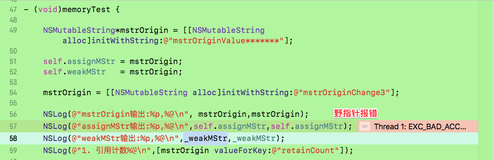


<br/>


&emsp;&emsp;  可以发现在输出assignMStr时会出现奔溃的情况。原因是发送了野指针的情况。assign同weak，指向C并且计数不+1，但当C地址引用计数为0时，assign不会对C地址进行B数据的抹除操作，只是进行值释放。这就导致野指针存在，即当这块地址还没写上其他值前，能输出正常值，但一旦重新写上数据，该指针随时可能没有值，造成崩溃。

注释掉野指针代码段:

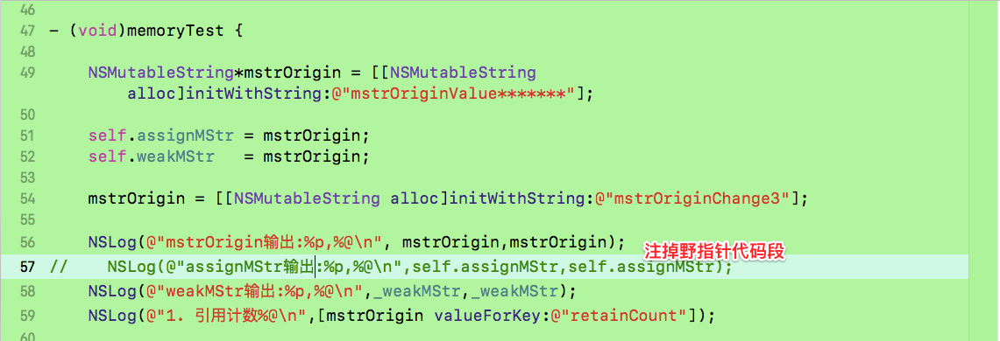


<br/>


打印结果为：

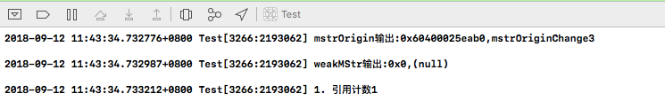


<br/>
<br/>


> <h2 id='weak'>weak</h2>


- **用法：**

&emsp; weak是弱引用，用weak来修饰、描述所引用对象的计数器并不会加1，而且weak会在引用对象被释放的时候自动置为nil，这也就避免了野指针访问坏内存而引起奔溃的情况，另外weak也可以解决循环引用。

>问题：
`为什么修饰代理使用weak而不是用assign？`

>&emsp; assign可用来修饰基本数据类型，也可修饰OC的对象，但如果用assign修饰对象类型指向的是一个强指针，当指向的这个指针释放之后，它仍指向这块内存，必须要手动给置为nil，否则会产生野指针，如果还通过此指针操作那块内存，会导致EXC_BAD_ACCESS错误，调用了已经被释放的内存空间；

>&emsp; 而weak只能用来修饰OC对象，而且相比assign比较安全，如果指向的对象消失了，那么它会自动置为nil，不会导致野指针。

<br/>

> **原理概括：**

> &emsp; weak表其实是一个哈希表，key是所指对象的指针，value是**`weak指针的地址数组`**(注意：这个数组是weak指针的地址，不是对象的指针地址)。（value是数组的原因是：因为一个对象可能被多个弱引用指针指向）
> 
> &emsp; Runtime维护了一张weak表，用来存储某个对象的所有的weak指针。

<br/>


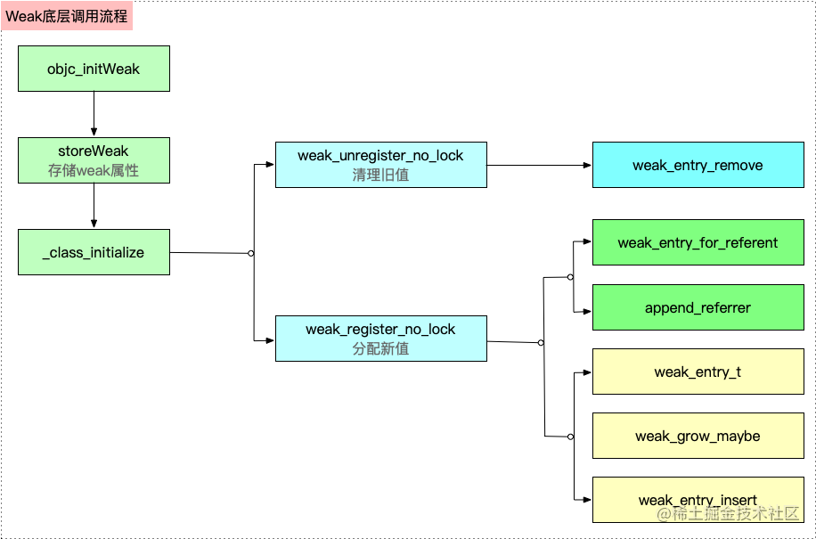

&emsp;[ **纵观weak引用的底层实现**](https://blog.csdn.net/u013378438/article/details/82767947)，其实原理很简单。就是将所有弱引用obj的指针地址都保存在obj对应的weak_entry_t中。当obj要析构时，会遍历weak_entry_t中保存的弱引用指针地址，并将弱引用指针指向nil，同时，将weak_entry_t移除出weak_table。

&emsp;这里涉及到runtime 四个重要的数据结构：
[**SideTables，SideTable，weak_table，weak_entry_t:**](https://blog.csdn.net/u013378438/article/details/80733391).

>- SideTables是一个64个元素长度8个元素长度 的hash数组，里面存储了SideTable;
- SideTables的hash键值就是一个对象obj的address。
因此可以说，一个obj，对应了一个SideTable。但是一个SideTable，会对应多个obj。因为SideTable的数量只有64个，所以会有很多obj共用同一个SideTable
	- 而在一个SideTable中，又有两个成员，分别是:
		- RefcountMap refcnts;        // 对象引用计数相关 map
			- refcents是一个hash map，其key是obj的地址，而value，则是obj对象的引用计数
		- weak_table_t weak_table;    // 对象弱引用相关 table
			- weak_table则存储了弱引用obj的指针的地址，其本质是一个以obj地址为key，弱引用obj的指针的地址作为value的hash表。hash表的节点类型是weak_entry_t

<br/>

**[weak 实现原理](https://www.cnblogs.com/guohai-stronger/p/10161870.html)**


<br/>
<br/>

<br/><br/>

> <h2 id='大白话讲解weak原理'>大白话讲解weak原理</h2>


```
//这里就表示objc被强引用了
NSObject *objc = [NSObject alloc];

//在这个方法里其实调用了一个方法objc_initWeak,可以通过汇编查看到调用了这个方法
id __weak weakObj = objc; 
```


<br/>

- **几个结构体概念**
	- SideTable是系统管理的
	
	- SideTables其中一个SideTable里存放弱引用表weak_table
	
	- weak_table里有实体数组weak_entries(其实也是一个hash表,说成数组便于我们理解)
	
	- weak_entries里存放很多实体weak_entry_t

 
<br/>
<br/>

**步骤:**

- 1.当我们使用这个关键字 _weak 时就开始用到了弱引用的一些底层方面的实现了,其实这里也是通过 objc_msgSend方法进行消息的发送的

- 2.这里通过objc的地址得到其引用对象referent

- 3.有好多张散列表SideTables,记得好像是64个.通过这个对象objc找到在这些SideTables中的某一个SideTable(这个表有新表和旧表)

- 4.然后再通过SideTable的一个结构体成员weak_table找到弱引用表;

```
//旧的SideTable找到弱引用表
//旧的SideTable之所以存在是因为弱引用已经存在了
oldTable->weak_table;

//新的SideTable找到弱引用表
newTable->weak_table;
```

&emsp; 这个weakTable中有很多类,比如:Person类、Dog类、Fish类,总之很多.所以用weakTable中的一个成员变量weak_entries(hash表,方便理解称之为数组)来进行装载

- 5.其中这个weak_table中有一个weak_entries的结构体成员,通过遍历这个结构体成员weak_entries数组(其实也是一个hash表)得到objc在这个数组下标index(通过比较weak_entries数组存储的引用与objc的引用相等获取到的下标).

- 6.通过拿到这个下标index,获取到weak_entries里的一个实体weak_entry_t.

- 7.当然也有可能在weak_entries没有找到,没有找到这个时候就需要我们创建一个weak_entry_t了

- 8.反正就是要么找到一个已经存在的weak_entry_t,要么就新创建一个weak_entry_t;

- 9.然后把新创建一个objc对应的一个弱引用对象**new_referrers**存到这个weak_entry_t中,同时这个weak_entry_t再存到这个实体数组weak_entries中.而这个weak_entries又隶属于某一个散列表weak_table,这里面涉及到一个添加实体的方法:**append_referrer**方法,如下图:


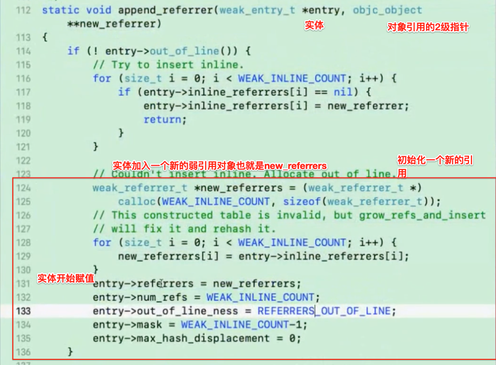

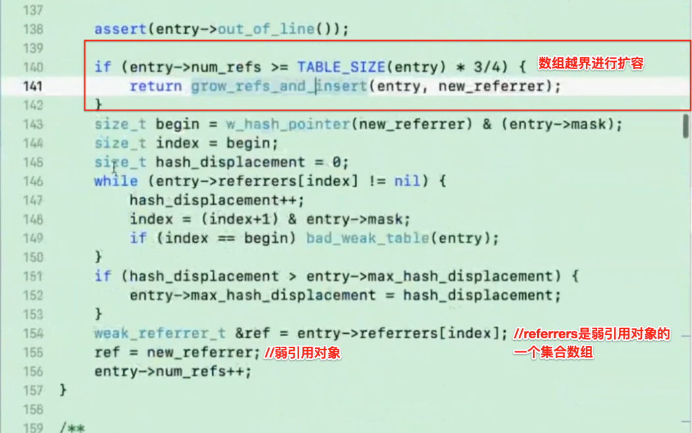


上述就是弱引用对象的存储步骤!


<br/>
<br/>

那什么时候弱引用对象自动为nil?

其实这是在对象释放的时候

可以在对象的dealloc方法的源代码看到,最终可以看到这个C++方法:**sidetable_clearDeallocating()**

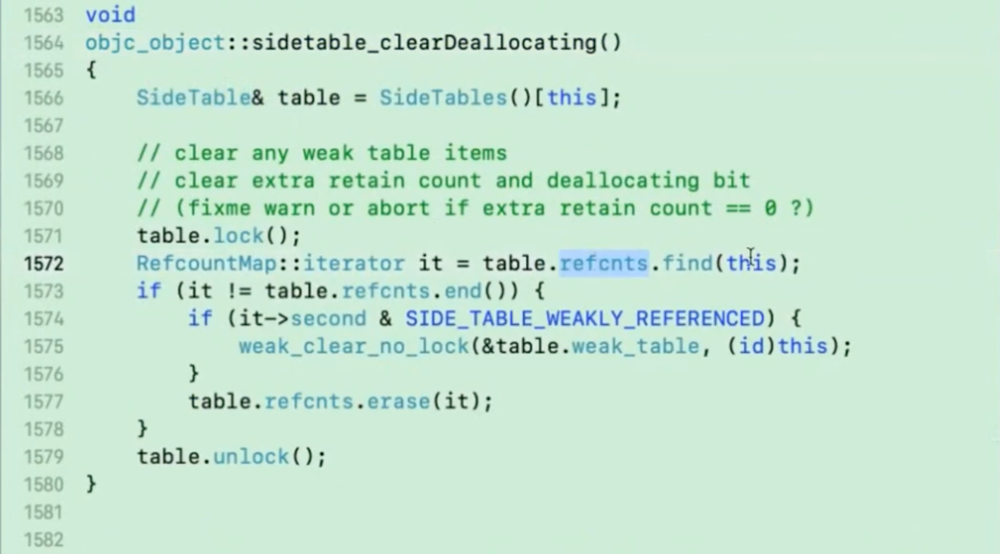

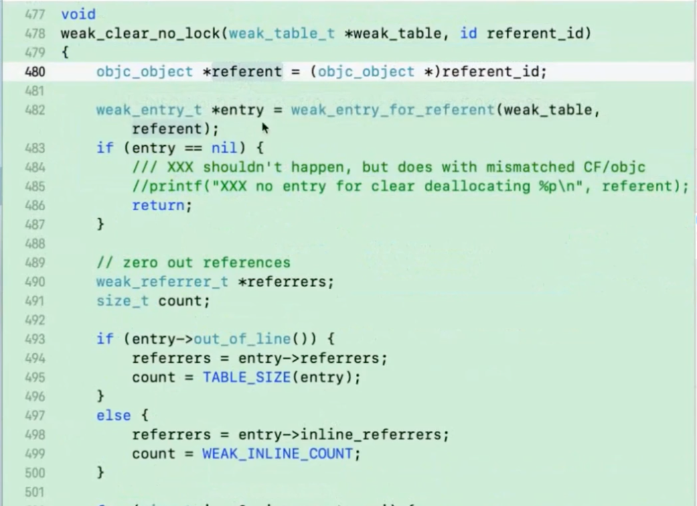


<br/>
<br/>


> <h2 id='NSString的copy使用'>NSString的copy使用</h2>


**`拓展：浅复制和深复制`**

```
NSString *string = @"huangJiaJu 歌";
NSLog(@"string值：%@,     %p", string, string);
//NSLog(@"string值：%@,     %p", string, &string) //&string 是string指针的地址值，相当于指针的指针，会与结果相背

NSString *stringCopy = [string copy];
NSLog(@"stringCopy值：%@,     %p", stringCopy, stringCopy);

NSMutableString *stringMCopy = [string mutableCopy];
[stringMCopy appendString:@"Hero"];
NSLog(@"stringMCopy值：%@,    %p", stringMCopy, stringMCopy);
    
```
输出：

```
2019-06-27 11:23:29.026700+0800 Genealogy[3368:109679] string值：huangJiaJu 歌,     0x10f348930
2019-06-27 11:23:30.802144+0800 Genealogy[3368:109679] stringCopy值：huangJiaJu 歌,     0x10f348930
2019-06-27 11:23:33.459110+0800 Genealogy[3368:109679] stringMCopy值：huangJiaJu 歌Hero,    0x600003864480
```
&emsp;  总结一下：string 和 stringCopy 指向的是同一块内存区域，而系统则为 stringMCopy 分配了一个新的内存地址。由此可见，copy 是指针复制（浅拷贝），mutableCopy 是对象复制（深拷贝）。

&emsp;  需要注意的是，在 iOS 中并不是所有的对象都支持copy，mutableCopy，遵守NSCopying协议的类可以发送copy消息，遵守NSMutableCopying协议的类才可以发送mutableCopy消息。否则，会发生异常。


<br/>

***
<br/>
<br/>


> <h1 id='NSMutableString的property属性'>NSMutableString的property属性</h1>


&emsp;&emsp; 上面我们讨论了典型的例子NSMutableString，即非容器可变变量。也就是说还存在其他三种类型需要讨论：

- a.非容器不可变变量NSSting
- b.容器可变变量NSMutableArray
- c.容器不可变变量NSArray

```
@property(copy,nonatomic)NSMutableArray     *aCopyMArr;
@property(strong,nonatomic)NSMutableArray   *strongMArr;
@property(weak,nonatomic)NSMutableArray     *weakMArr;


- (void)memoryTest {
    NSMutableArray  *mArrOrigin = [[NSMutableArray alloc]init];
    NSMutableString *mstr1 = [[NSMutableString alloc]initWithString:@"value1"];
    NSMutableString *mstr2 = [[NSMutableString alloc]initWithString:@"value2"];
    NSMutableString *mstr3 = [[NSMutableString alloc]initWithString:@"value3"];
    
    [mArrOrigin addObject:mstr1];
    [mArrOrigin addObject:mstr2];
    
    //将mArrOrigin拷贝给aCopyMArr，strongMArr，weakMArr
    self.aCopyMArr= mArrOrigin;
    self.strongMArr= mArrOrigin;
    self.weakMArr= mArrOrigin;
    
    NSLog(@"mArrOrigin输出:%p,%@\n", mArrOrigin,mArrOrigin);
    NSLog(@"aCopyMArr输出:%p,%@\n",_aCopyMArr,_aCopyMArr);
    NSLog(@"strongMArr输出:%p,%@\n",_strongMArr,_strongMArr);
    NSLog(@"weakMArr输出:%p,%@\n",_weakMArr,_weakMArr);
    NSLog(@"weakMArr输出:%p,%@\n",_weakMArr[0],_weakMArr[0]);
    NSLog(@"mArrOrigin中的数据引用计数%@", [mArrOrigin valueForKey:@"retainCount"]);
    NSLog(@"%p %p %p %p",&mArrOrigin,mArrOrigin,mArrOrigin[0],mArrOrigin[1]);
}
```

打印结果：

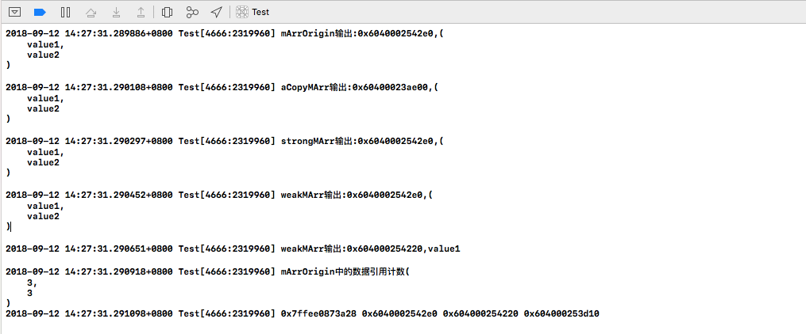

<br/>

<br/>
<br/>

> <h2 id='添加一个元素'>添加一个元素</h2>

```
NSLog(@"\n\n<-------------------给原数组添加一个元素----------------->");
//给原数组添加一个元素
[mArrOrigin addObject:mstr3];

NSLog(@"mArrOrigin输出:%p,%@\n", mArrOrigin,mArrOrigin);
NSLog(@"aCopyMArr输出:%p,%@\n",_aCopyMArr,_aCopyMArr);
NSLog(@"strongMArr输出:%p,%@\n",_strongMArr,_strongMArr);
NSLog(@"weakMArr输出:%p,%@\n",_weakMArr,_weakMArr);
NSLog(@"mArrOrigin中的数据引用计数%@", [mArrOrigin valueForKey:@"retainCount"]);

```

打印结果：

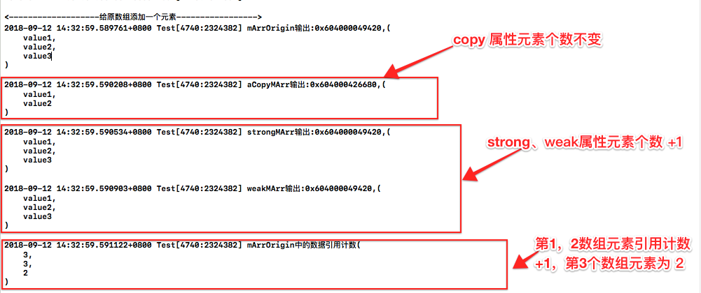

<br/>
<br/>

> <h2 id='修改数组元素'>修改数组元素</h2>


```
    NSLog(@"\n\n<-------------------修改数组一个元素----------------->");
    //修改原数组中的元素，看是否有随之变化
    [mstr1 appendFormat:@"aaa"];
    
    NSLog(@"mArrOrigin输出:%p,%@\n", mArrOrigin,mArrOrigin);
    NSLog(@"aCopyMArr输出:%p,%@\n",_aCopyMArr,_aCopyMArr);
    NSLog(@"strongMArr输出:%p,%@\n",_strongMArr,_strongMArr);
    NSLog(@"weakMArr输出:%p,%@\n",_weakMArr,_weakMArr);
    NSLog(@"mArrOrigin中的数据引用计数%@", [mArrOrigin valueForKey:@"retainCount"]);
}
```

修改后 copy数组值改变, 打印结果：

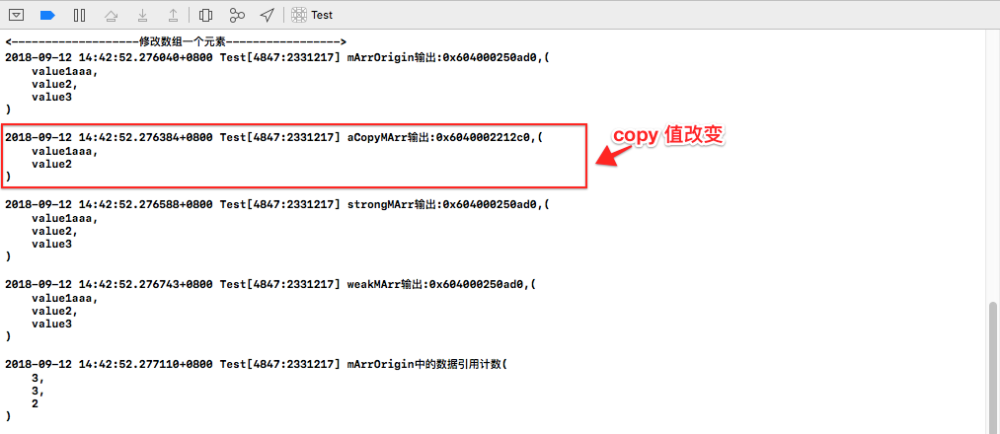


***`综合上述：`***
&emsp;&emsp;  上面3段代码所做的操作是mArrOrigin（value1,value2）赋值给copy,strong,weak修饰的aCopyMArr,strongMArr,weakMArr。通过给原数组增加元素，修改原数组元素值，然后输出mArrOrigin的引用计数，和数组地址，查看变化。

&emsp;&emsp;  发现其中数组本身指向的内存地址除了aCopyMArr重新开辟了一块地址，strongMArr,weakMArr和mArrOrigin指针指向的地址是一样的。

&emsp;&emsp;  可以看出容器可变变量中容器本身和非容器可变变量是一样的，copy深拷贝，strongMArr,weakMArr和assign都是浅拷贝(数组变量和字符串变量对于copy都是深拷贝)。

&emsp;&emsp;  另外我们发现被拷贝对象mArrOrigin中的数据引用计数居然不是1而是3。也就是说容器内的数据拷贝都是进行了浅拷贝。同时当我们修改数组中的一个数据时strongMArr,weakMArr，aCopyMArr中的数据都改变了，说明容器可变变量中的数据在拷贝的时候都是浅拷贝(数组中的元素数据是浅拷贝，在copy，stong，weak中)。

容器可变变量的拷贝结构如下图, copy，strong， weak 在容器可变变量中的内存情况,如下图:


<br/>
<br/>

> <h2 id='非容器不变变量'>非容器不变变量</h2>

```
@property(copy,nonatomic)NSString   *aCopyStr;
@property(strong,nonatomic)NSString *strongStr;
@property(weak,nonatomic)NSString   *weakStr;
@property(assign,nonatomic)NSString *assignStr;

- (void)memoryTest {
    NSString*strOrigin = [[NSString alloc]initWithUTF8String:"strOrigin0123456"];
    
    self.aCopyStr  = strOrigin;
    self.strongStr = strOrigin;
    self.weakStr= strOrigin;
    
    NSLog(@"strOrigin输出:%p,%@\n", strOrigin,strOrigin);
    NSLog(@"aCopyStr输出:%p,%@\n",_aCopyStr,_aCopyStr);
    NSLog(@"strongStr输出:%p,%@\n",_strongStr,_strongStr);
    NSLog(@"weakStr输出:%p,%@\n",_weakStr,_weakStr);
}

```

打印结果：

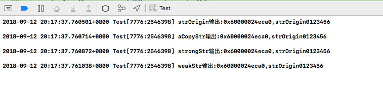

<br/>

**`修改值`**

```
NSLog(@"------------------修改原值后\n------------------------");

strOrigin =@"aaa";

NSLog(@"strOrigin输出:%p,%@ \n", strOrigin,strOrigin);
NSLog(@"aCopyStr输出:%p,%@ \n",_aCopyStr,_aCopyStr);
NSLog(@"strongStr输出:%p,%@ \n",_strongStr,_strongStr);
NSLog(@"weakStr输出:%p,%@ \n",_weakStr,_weakStr);
}
```

修改后的属性变量值, 打印结果：


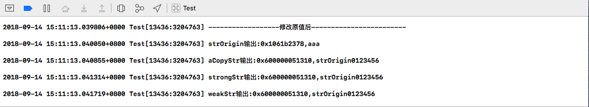


<br/>
<br/>

> <h2 id='copy和strong置为空'>copy和strong置为空</h2>


```
self.aCopyStr=nil;
self.strongStr=nil;

NSLog(@"strOrigin输出:%p,%@ \n", strOrigin,strOrigin);
NSLog(@"aCopyStr输出:%p,%@ \n",_aCopyStr,_aCopyStr);
NSLog(@"strongStr输出:%p,%@ \n",_strongStr,_strongStr);
NSLog(@"weakStr输出:%p,%@ \n",_weakStr,_weakStr);
}
```

copy 和 strong 置为 nil, 打印结果为：

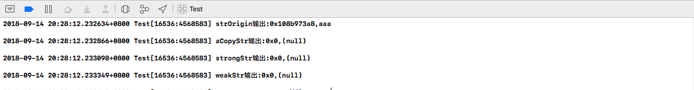


<br/>

综上可得：

&emsp;&emsp;  NSString和NSMutableString（非容器可变变量）基本相同，除了copy。NSString为浅拷贝，NSMutableString是深拷贝。那么为什么NSString的copy是浅拷贝呢，也就是说为什么aCopyStr不自己开辟一个独立的内存出来呢。答案很简单，因为不可变量的值不会改变，既然都不会改变，所以没必要重新开辟一个内存出来让aCopyStr指向他，直接指向原来值位置就可以了。示意图如下:

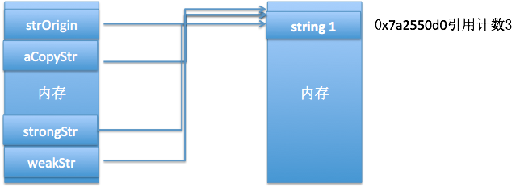


由此可得：**`非容器不可变量除了copy以外，其他特性同非容器可变变量相同，非容器不可变量copy是浅拷贝。`**

由上实验可得：在不可变容器变量(NSArray)中，容器本身都是浅拷贝包括copy，里面(包括NSMutableArray)的数据也是浅拷贝，同NSString一样。


<br/>
<br/>

> <h2 id='copy，strong，weak，assign的区别'>copy，strong，weak，assign的区别</h2>


strong的底层使用的源码:

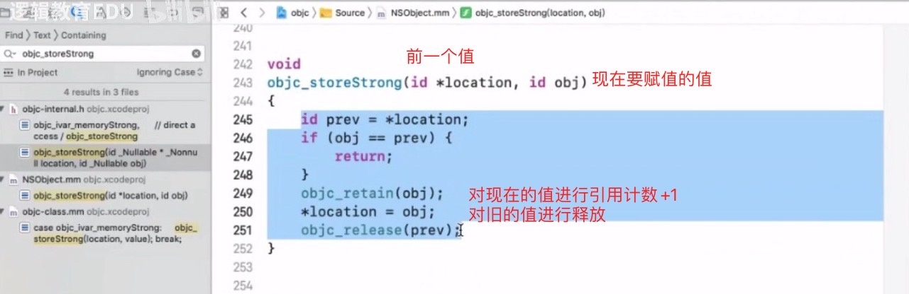

<br/>

copy的底层源码方法如:

```
static inline void reallySetProperty(id self, SEL _cmd, id newValue, ptrdiff_t offset, bool atomic, bool copy, bool mutableCopy)
```
方法,如下


<br/>
<br/>

**总结:**

&emsp;&emsp;  `可变变量中`，copy是重新开辟一个内存，strong，weak，assgin后三者不开辟内存，只是指针指向原来保存值的内存的位置，storng指向后会对该内存引用计数+1，而weak，assgin不会。weak，assgin会在引用保存值的内存引用计数为0的时候值为空，并且weak会将内存值设为nil，assign不会，assign在内存没有被重写前依旧可以输出，但一旦被重写将出现奔溃

&emsp;&emsp;  `不可变变量中`，因为值本身不可被改变，copy没必要开辟出一块内存存放和原来内存一模一样的值，所以内存管理系统默认都是浅拷贝。其他和可变变量一样，如weak修饰的变量同样会在内存引用计数为0时变为nil。

**`容器本身遵守上面准则，但容器内部的每个值都是浅拷贝。`**内存存储图:


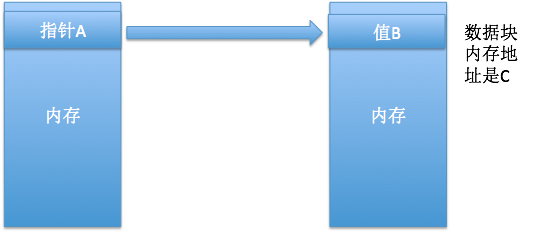


<br/>

&emsp;&emsp;  综上所述，当创建property构造器创建变量value1的时候，使用copy，strong，weak，assign根据具体使用情况来决定。value1 = value2，如果你希望value1和value2的修改不会互相影响的就用用copy，反之用strong,weak,assign。如果你还希望原来值C(C是什么见【内存存储图】)为nil的时候，你的变量不为nil就用strong,反之用weak和assign。weak和assign保证了不强引用某一块内存，如delegate我们就用weak表示，就是为了防止循环引用的产生。
&emsp;&emsp;  另外，我们上面讨论的是类变量，直接创建局部变量默认是Strong修饰。


<br/>
<br/>

> <h2 id='delegate为什么要用weak或者assign而不用strong'>delegate为什么要用weak或者assign而不用strong</h2>


&emsp;&emsp;   a创建对象b,b中有C类对象c，所以a对b有一个引用,b对c有一个引用，a.b引用计数分别为1。当c.delegate = b的时候，实则是对b有了一个引用，如果此时c的delegate用strong修饰则会对b的值内存引用计数+1，b引用计数为2。当a的生命周期结束，随之释放对b的引用，b的引用计数变为1，导致b不能释放，b不能释放又导致b对c的引用不能释放，c引用计数还是为1，这样就造成了b和c一直留在了内存中。

&emsp;&emsp;   而要解决这个问题就是使用weak或者assign修饰delegate，这样虽然会有c仍然会对b有一个引用，但是引用是弱引用，当a生命周期结束的时候，b的引用计数变为0，b释放后随之c的引用消失，c引用计数变为0，释放。


<br/>
<br/>

>## <h2 id='protocol中添加属性'>[protocol中添加属性](https://blog.csdn.net/u010347934/article/details/108286849)</h2>


<br/>
<br/>

> <h2 id='@synthesize'>@synthesize</h2>

&emsp; @property有两个对应的词，一个是@synthesize，一个是@dynamic。如果@synthesize和@dynamic都没写，那么默认的就是@syntheszie var = _var;

<br/>


**使用synthesize的2个步骤：**
- 首先你要有在类声明中使用property声明的属性。
- 第二在类实现中，写出 @synthesize + 变量名

<br/>


```
@interface Test: NSObject
@property (nonatomic, unsafe_unretained) int i;
@end

@implementation Test
@synthesize i = _i;
@end
```


&emsp; 平时在使用中，在类声明中添加了property后，根本不需要在实现中添加@synthesize。

&emsp; 因为OC为property属性声明添加了自动合成，也就是说系统自动帮你添加了@synthesize。

&emsp; 所以，synthesize是property属性的一部分，它是系统为property生成变量的重要步骤。

**synthesize具体做了些什么呢？它只做2件事：**
- 生成成员变量，如上面的Test类就会生成一个名字为 _i 的 int型变量;
- 为属性生成setter/getter方法，如上面的Test类会生成setI:和i两个方法。

<br/>

- **1.Xcode4.4之前的property**

@property关键字可以使编译器自动生成某个成员变量的set/get方法;

```
@interface HGTestOne : NSObject{
    //***声明成员变量***
    int age;
}

@property int age

@end
```

&emsp; 当编译器执行到`@property int age`这一句时，会自动解析成：

```
- (void)setAge:(int)age;
- (int)age;
```


<br/>
<br/>

**‌2.Xcode4.4之前的synthesize**

- @synthesize 关键字可以自动生成**某个成员变量**的set方法和get方法的实现;

```
@interface HGTestOne : NSObject{
    //***声明成员变量***
    int age;
}
@end


@implementation HGTestOne

@synthesize @synthesize age=_age;

@end 
```


&emsp; 当代码执行到**@synthesize age=_age**;
当编译器执行到这一句时，会自动解析成：

```
- (void)setAge:(int)age
{
  _age=age;
}
- (int)age
{
   return _age;
}
```

@synthesize还会自动生成私有成员变量

这里需要注意的是:
- @synthesize age=_age; 等号后面的_age表示访问的是_age成员变量。如果只是单纯的声明为@synthesize age;则默认会访问同名的age成员变量。如果成员变量不存在，就会**自动生成@private类型的age变量**;
- 由于@synthesize自动生成的成员变量是@private的，如果子类需要访问该成员变量的话，需手动声明@protect的成员变量;


<br/>
<br/>


但是现在我们是这么做的,也就是在 Xcode4.4以后
不用再写@synthesize，编译器通过@property就能给我们生成set/get方法的声明和实现，默认生成成员变量:_propertyName;

&emsp; 比如使用@property int age即可完成以下功能：

>1>如果成员变量不存在，默认生成私有变量_age。如果要生成子类可以访问的成员变量，需要在类的声明中手动声明@protect int _age;

>2>可以自动实现age属性的get和setter的声明。

>3>可以自动实现age属性的get和setter的实现。

<br/>

**注意事项:**
>1>使用@property时，变量名尽量不要使用下划线开头。如@property int age; 不要声明成@property int _age;

>2>如果成员变量不存在，@property默认会自动生成@private并以下划线开头的成员变量。

>3>如果get方法存在，则@property只会自动生成set方法。
    如果set方法存在，则@property只会自动生成get方法。
    并且如果成员变量不存在，会自动生成@private的成员变量。
    如果set方法和get方法都存在，则@property不会自动生成get方法和set方法，并且不会自动生成成员变量
    


<br/>
<br/>


> <h3 id='synthesize使用情况'>synthesize使用情况</h3>

<br/>
<br/>

> <h4 id='同时重写setter和getter'>同时重写setter和getter</h4>


&emsp; 如果你的属性可读可写，但是你同时重写了setter/getter方法，**系统不会为你自动生成成员变量**。你需要添加@synthesize。这种情况下，你如果只重写了setter/getter其中一个，系统仍然会执行自动合成。

```
@interface Test: NSObject
@property (nonatomic, unsafe_unretained) int i;
@end

@implementation Test

-(int)i{
    return _i;
}

-(void) setI:(int)i{
    _i = i;
}

@synthesize i = _i;//不加这个会报错

-(void) print{
    NSLog(@" print test i = %d", _i);
}

@end
```


<br/>
<br/>

> <h4 id='重写只读属性的getter时'>重写只读属性的getter时</h4>

如果你的属性是只读属性，但是你重写了getter方法，**系统不会为你自动生成成员变量**。你需要添加@synthesize。


```
@interface Test: NSObject
@property (nonatomic, readonly, unsafe_unretained) int i;
@end

@implementation Test
-(int)i{
    return _i;
}

@synthesize i = _i;//不加这个会报错

-(void) print{
    NSLog(@" print test i = %d", _i);
}

@end
```


<br/>
<br/>

> <h4 id='使用了@dynamic时'>使用了@dynamic时</h4>


&emsp; ‌使用@dynamic,**系统不会为属性自动合成变量和setter/getter方法**，但是你也不需要手动添加@synthesize.

这个时候你可以手动实现set/get方法,和`@synthesize ivar = _ivar`,就可以了.


<br/>
<br/>

> <h4 id='在@protocol中定义的所有属性'>在@protocol中定义的所有属性</h4>

```
@interface Test: NSObject
@property (nonatomic, unsafe_unretained) int i;
@end

@implementation Test

-(int)i{
    return _i;
}

-(void) setI:(int)i{
    _i = i;
}

@synthesize i = _i;//不加这个会报错

-(void) print{
    NSLog(@" print test i = %d", _i);
}

@end
```

<br/>
<br/>

> <h4 id='在category中定义的所有属性'>在category中定义的所有属性</h4>

<br/>
<br/>

> <h4 id='重写(overridden)的属性'>重写(overridden)的属性</h4>

&emsp; 当你在子类中重写（overridden）了父类中的属性，子类不会生成属性的set/get方法,你需要手动.但这个时候你想要使用_ivar, 你必须使用 @synthesize 来手动合成ivar(成员变量),即:

```
@synthesize ivar = _ivar;
```

这个时候你就可以使用 _ivar这个成员变量了.


<br/>
<br/>

> <h2 id='@dynamic'>@dynamic</h2>

&emsp; @property有两个对应的词，一个是@synthesize，一个是@dynamic。如果@synthesize和@dynamic都没写，那么默认的就是@syntheszie var = _var;


&emsp; @dynamic告诉编译器,属性的setter与getter方法由用户自己实现，不自动生成。（当然对于readonly的属性只需提供getter即可）。假如一个属性被声明为@dynamic var，然后你没有提供@setter方法和@getter方法，编译的时候没问题，但是当程序运行到instance.var =someVar，由于缺setter方法会导致程序崩溃；或者当运行到 someVar = var时，由于缺getter方法同样会导致崩溃。编译时没问题，运行时才执行相应的方法，这就是所谓的动态绑定。


<br/>

***
<br/>


> <h1 id='宏定义'>宏定义</h1>

<br/>


> <h2 id='__bridge'>__bridge</h2>


`(__bridge id) 是桥接，把非OC转化为OC使用的。`


<br/>
<br/>

> <h2 id='Const'>Const</h2>


const 前缀声明指定类型的常量，如下所示：  

`const type variable = value;`


**const 修饰位置的变化**

 ``` //变量a被const修饰，就成为了只读，不能被修改赋值了 int const a = 10; //等价于 const int a = 10; // Wrong a = 20;//错误代码

int const *p // *p只读 ;p变量

int * const p // *p变量 ; p只读

const int * const p //p和*p都只读

int const * const p //p和*p都只读
 ```


**const** 常用用法 

``` 
//定义一个全局只读变量 NSString * const Kname = @"appkey";

//static修饰后此全局变量只能本文件访问 static NSString *const Key = @"hddjj”; 
```

参考资料：
[^关键字]:[关键字](http://www.cocoachina.com/ios/20171226/21653.html)


<br/>
<br/>


>## <h2 id='SD_UIKIT'>[SD_UIKIT](https://www.jianshu.com/p/1d2e4d822732)</h2>


```
SD_UIKIT
// iOS and tvOS are very similar, UIKit exists on both platforms
// Note: watchOS also has UIKit, but it's very limited
#if TARGET_OS_IOS || TARGET_OS_TV
    #define SD_UIKIT 1
#else
    #define SD_UIKIT 0
#endif

```


&emsp; iOS 和 tvOS 是非常相似的，UIKit在这两个平台中都存在，但是watchOS在使用UIKit时，是受限的。因此我们定义SD_UIKIT为真的条件是iOS 和 tvOS这两个平台。至于为什么要定义SD_UIKIT后边会解释的。


<br/>
<br/>

> <h2 id='DEPRECATED_MSG_ATTRIBUTE'>DEPRECATED_MSG_ATTRIBUTE</h2>


方法版本迭代的时候使用，抛弃旧的方法，提示使用新的方法

使用：

```

- (void)storeImage2:(UIImage *_Nullable)image forKey:(NSString *)key DEPRECATED_MSG_ATTRIBUTE("please use storeImage: imageData: forKey: completion:");
```


<br/>
<br/>

> <h2 id='FOUNDATION_EXTERN'>FOUNDATION_EXTERN</h2>


```
#if defined(__cplusplus)
#define FOUNDATION_EXTERN extern "C"
#else
#define FOUNDATION_EXTERN extern
#endif
```

表示 extern 全局变量，此时并没有分配内存，需要在.m文件中实现，此时为了支持C和C++混编（__cplusplus 是C++编译器内部定义的宏，在C++中，需要加
extern"C" 或包含在 extern "C" 块中），注意，此时外界是可以修改这个值，详细 extern 用法可自行查询相关资料，本文不详谈。
用法如下：

```
FOUNDATION_EXTERN NSString *name;// h文件
const NSString *name = @"gitKong";// m文件
```


<br/>
<br/>

> <h2 id='FOUNDATION_EXTERN_INLINE'>FOUNDATION_EXTERN_INLINE</h2>

表示全局的内联函数


<br/>
<br/>

> <h2 id='__VA_ARGS__'>__VA_ARGS__</h2>


- **描述**

C99 编译器标准允许定义可变参数宏(variadic macros)，这样就使用拥有可以变化的参数表的宏。

```
#define FYFLog(format, ...) NSLog(format, __VA_ARGS__)
```

缺省号代表一个可以变化的参数表。使用保留名 '__VA_ARGS__' 把参数传递给宏。当宏的调用展开时，实际的参数就传递给 NSLog() 了。


<br/>
<br/>

> <h2 id=''></h2>


<br/>
<br/>

> <h2 id=''></h2>


<br/>
<br/>

> <h2 id=''></h2>


<br/>
<br/>

> <h2 id=''></h2>


<br/>
<br/>

> <h2 id=''></h2>


<br/>
<br/>

> <h2 id=''></h2>


<br/>
<br/>

> <h2 id=''></h2>


<br/>
<br/>

> <h2 id=''></h2>


<br/>
<br/>

> <h2 id=''></h2>


<br/>
<br/>

> <h2 id=''></h2>


<br/>
<br/>

> <h2 id=''></h2>


<br/>
<br/>

> <h2 id=''></h2>


<br/>

***
<br/>
<br/>

> <h1 id='ARC的关闭'>ARC的关闭</h1>


关闭整个工程的ARC

>objective-C Automatic Reference Counting 设置为NO,关闭ARC,YES为开启ARC模式

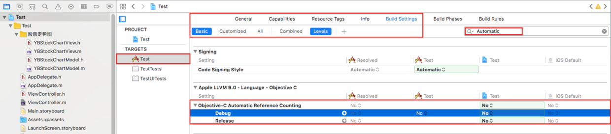


<br/>

**关闭或开启部分文件的ARC**

>关闭ARC：-fno-objc-arc<br/>
开启ARC：-fobjc-arc

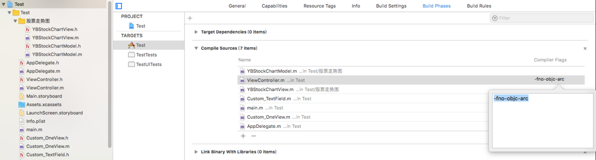


<br/>

***
<br/>
<br/>

> <h1 id='引用计数'>引用计数</h1>


```
NSMutableString *tempMStr = [[NSMutableString alloc]initWithString:@"strValue"];
NSLog(@"tempMStr值地址:%p,\ntempMStr值%@,\n tempMStr值引用计数%@\n", tempMStr,tempMStr,[tempMStr valueForKey:@"retainCount"]);
```

打印结果：

```
2018-09-12 07:58:44.033175+0800 Test[935:102832] tempMStr值地址:0x60400005ba80,
tempMStr值strValue,
tempMStr值引用计数1
```

<br/>
**`原理示意图`**


A=C其实是在内存中创建了一个A，然后又开辟了一个内存C，C里面存放的着值B。不懂这句话，可以看看C语言的指针这一章。

**`原理：`**

此处tempMStr就是A，值地址就是C，“strValue”就是B，而引用计数这个概念是针对C的，赋值给其他变量或者指针设置为nil，如tempStr = nil，都会使得引用计数有所增减。当内存区域引用计数为0时就会将数据抹除。而我们使用copy,strong,retain,weak,assign区别就在：


>1.是否开辟新的内存
<br/>
2.是否对地址C有引用计数增加

**`需要注意的是property修饰符是在被赋值时起作用`**

<br/>

```

@property(copy,nonatomic)NSMutableString    *aCopyMStr;
@property(strong,nonatomic)NSMutableString  *strongMStr;
@property(weak,nonatomic)NSMutableString    *weakMStr;
@property(assign,nonatomic)NSMutableString  *assignMStr;

- (void)memoryTest {
    
    NSMutableString *mstrOrigin = [[NSMutableString alloc]initWithString:@"mstrOriginValue"];
    NSLog(@"mstrOrigin输出:%p,%@\n", mstrOrigin,mstrOrigin);
    NSLog(@"1. 引用计数%@\n",[mstrOrigin valueForKey:@"retainCount"]);
    
    self.aCopyMStr = mstrOrigin;
    NSLog(@"aCopyMStr输出:%p,%@\n",_aCopyMStr,_aCopyMStr);
    NSLog(@"2. 引用计数%@\n",[mstrOrigin valueForKey:@"retainCount"]);
    
    self.strongMStr= mstrOrigin;
    NSLog(@"strongMStr输出:%p,%@\n",_strongMStr,_strongMStr);
    NSLog(@"3. 引用计数%@\n",[mstrOrigin valueForKey:@"retainCount"]);
    
    self.weakMStr  = mstrOrigin;
    NSLog(@"weakMStr输出:%p,%@\n",_weakMStr,_weakMStr);
    NSLog(@"4. 引用计数%@",[mstrOrigin valueForKey:@"retainCount"]);
}
```

打印结果：

```
2018-09-12 08:28:45.733698+0800 Test[1242:386455] mstrOrigin输出:0x600000250b00,mstrOriginValue

2018-09-12 08:28:45.734030+0800 Test[1242:386455] 1. 引用计数1

2018-09-12 08:28:45.734529+0800 Test[1242:386455] aCopyMStr输出:0x600000250a40,mstrOriginValue

2018-09-12 08:28:45.734720+0800 Test[1242:386455] 2. 引用计数1

2018-09-12 08:28:45.734877+0800 Test[1242:386455] strongMStr输出:0x600000250b00,mstrOriginValue

2018-09-12 08:28:45.735038+0800 Test[1242:386455] 3. 引用计数2

2018-09-12 08:28:45.735205+0800 Test[1242:386455] weakMStr输出:0x600000250b00,mstrOriginValue

2018-09-12 08:28:45.735486+0800 Test[1242:386455] 4. 引用计数2
```

`原理：`

&emsp;&emsp;  strongMStr和weakMStr指针指向的内存地址都和mstrOrigin相同,但mstrOrigin内存引用计数为2，不为3，因为weakMStr虽然指向了数据内存地址（之后用C简称，见【原理】图），但不会增加C计数。copy修饰的的aCopyMStr，赋值后则是自己单独开辟了一块内存，内存上保存“mstrOrigin”字符串，并指向。

拷贝示意图如下:

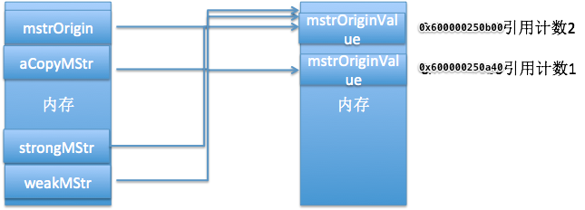


&emsp;&emsp;  可见当我修改mstrOrigin的值的时候，必然不会影响aCopyMStr,只会影响strongMStr和weakMStr，是因为指向的内存地址不同。

```
NSLog(@"------------------修改原值后------------------------\n");
 
[mstrOrigin appendString:@"*******"];
NSLog(@"mstrOrigin输出:%p,%@\n", mstrOrigin,mstrOrigin);
NSLog(@"aCopyMStr输出:%p,%@\n",_aCopyMStr,_aCopyMStr);
NSLog(@"strongMStr输出:%p,%@\n",_strongMStr,_strongMStr);
NSLog(@"weakMStr输出:%p,%@\n",_weakMStr,_weakMStr);
```

打印结果：

```
2018-09-12 08:58:58.924352+0800 Test[1510:668804] ------------------修改原值后------------------------

2018-09-12 08:58:58.924492+0800 Test[1510:668804] mstrOrigin输出:0x60000005a340,mstrOriginValue*******

2018-09-12 08:58:58.924752+0800 Test[1510:668804] aCopyMStr输出:0x604000255300,mstrOriginValue

2018-09-12 08:58:58.924925+0800 Test[1510:668804] strongMStr输出:0x60000005a340,mstrOriginValue*******

2018-09-12 08:58:58.925122+0800 Test[1510:668804] weakMStr输出:0x60000005a340,mstrOriginValue*******
```

&emsp;emsp;  copy会重新开辟新的内存来保存一份相同的数据。被赋值对象和原值修改互不影响。strong和weak赋值都指向原来数据地址，区别是前者会对数据地址进行引用计数+1，后者不会。


&emsp;&emsp;  引用计数是否+1有什么实质区别呢？


&emsp;&emsp;  如果知道“值地址的引用计数为0时，地址上保存的值就会被释放”。那么区别就不难理解，weak修饰的指针A指向的值地址C，那么地址上当其他指向他的指针被释放的时候，这个值地址引用计数也就变为0了，这个A的值也就为nil了。换句话说当值地址C上没有其他强引用指针修饰的时候C就会被立即释放，A的值就变为nil了。
&emsp;&emsp;  `换句话说，当一个强引用和一个弱引用指向值地址C时，强引用释放了，那么弱引用指向的值为nil`

&emsp;&emsp;  这里我们来初始化mstrOrigin和并将strongMStr设置为nil让C的引用计数为0，然后输出weakMStr，看是否为nil.
注：初始化和设为nil都可以将指针所指向的数据地址引用计数减少1。


```
- (void)memoryTest {
    
    NSMutableString*mstrOrigin = [[NSMutableString alloc]initWithString:@"mstrOriginValue*******"];
    
    self.strongMStr = mstrOrigin;
    self.weakMStr   = mstrOrigin;
    
    mstrOrigin = [[NSMutableString alloc]initWithString:@"mstrOriginChange3"];

    NSLog(@"mstrOrigin输出:%p,%@\n", mstrOrigin,mstrOrigin);
    NSLog(@"strongMStr输出:%p,%@\n",_strongMStr,_strongMStr);
    NSLog(@"weakMStr输出:%p,%@\n",_weakMStr,_weakMStr);
    NSLog(@"1. 引用计数%@\n",[mstrOrigin valueForKey:@"retainCount"]);
    
    NSLog(@"------------------------置为nil-------------------------");
    self.strongMStr = nil;
    NSLog(@"mstrOrigin输出:%p,%@\n", mstrOrigin,mstrOrigin);
    NSLog(@"strongMStr输出:%p,%@\n",_strongMStr,_strongMStr);
    NSLog(@"weakMStr输出:%p,%@\n",_weakMStr,_weakMStr);
    NSLog(@"2. 引用计数%@\n",[mstrOrigin valueForKey:@"retainCount"]);
}
```

打印结果：

```
2018-09-12 11:15:48.712824+0800 Test[2971:1923860] mstrOrigin输出:0x600000247fb0,mstrOriginChange2

2018-09-12 11:15:48.713060+0800 Test[2971:1923860] strongMStr输出:0x600000247ad0,mstrOriginValue*******

2018-09-12 11:15:48.713288+0800 Test[2971:1923860] weakMStr输出:0x600000247ad0,mstrOriginValue*******

2018-09-12 11:15:48.713790+0800 Test[2971:1923860] 1. 引用计数1

2018-09-12 11:15:48.714106+0800 Test[2971:1923860] ------------------------置为nil-------------------------
2018-09-12 11:15:48.714564+0800 Test[2971:1923860] mstrOrigin输出:0x600000247fb0,mstrOriginChange2

2018-09-12 11:15:48.715070+0800 Test[2971:1923860] strongMStr输出:0x0,(null)

2018-09-12 11:15:48.715226+0800 Test[2971:1923860] weakMStr输出:0x0,(null)

2018-09-12 11:15:48.715373+0800 Test[2971:1923860] 2. 引用计数1
```

**`可见之前引用计数2是mstrOrigin和strongMStr添加的。`**

`结论：`

&emsp;&emsp;  copy会重新开辟新的内存来保存一份相同的数据。被赋值对象和原值修改互不影响。strong和weak虽然都指向原来数据地址，原值修改的时候storng和weak会随之变化。区别是前者会对数据地址进行引用计数+1防止原地址值被释放，但后者不会，当其他值都不在指向值地址时，值地址被释放，weak的值也就是为nil了。我们称会对数据地址增加引用计数的为强引用，不改变引用计数的为弱引用。


