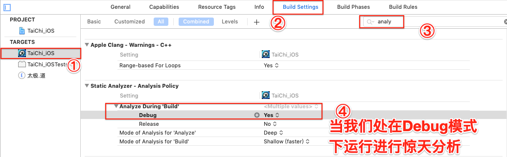

> <h2 id=''></h2>
- [**内存**](#内存)
	- 	[内核](#内核)
	- 	[栈](#栈)
	- 	[堆](#堆)
	- [静态存储区](#静态存储区)
	- [内存泄漏](#内存泄漏)
	- [内存溢出](#内存溢出)
	- [	指针置为nil和对象release的作用](#指针置为nil和对象release的作用)
	- [	BSS段](#BSS段)
	- 	[Data段](#Data段)
	- 	[text代码段](#text代码段)
	- 	**内存资料**
		- 	[malloc与free本质(内存的释放与回收)](https://www.cnblogs.com/shiweihappy/p/4246372.html)
		- [静态存储区、栈区、堆区的区别](https://blog.csdn.net/u010977122/article/details/53099425)
	- [	变量区别](#变量区别)
	- [	全局变量（成员变量）和局部变量的区别](#全局变量（成员变量）和局部变量的区别)
	- [	全局变量（成员变量）和静态变量的区别](#全局变量（成员变量）和静态变量的区别)
	- [	retain](#retain)
	- [	weak](#weak)
- [**内存检测**](#内存检测)
	- [静态检测](#静态检测)
	- 	[几种内存泄漏情况](#几种内存泄漏情况)
	- [动态检测(instrument检测，MLeakFinder[第三方方法])](#动态检测(instrument检测，MLeakFinder[第三方方法]))
		- [UITableViewCell内存泄漏](#UITableViewCell内存泄漏)
		- [根视图切换](#根视图切换)
	- [	析构方法打印](#析构方法打印)
- [**引用计数**](#引用计数)
- [**自动释放池**](#自动释放池)
- [资料](#资料)
	- [**iOS 保持界面流畅的技巧**](https://blog.ibireme.com/2015/11/12/smooth_user_interfaces_for_ios/#32)


<br/>

***
<br/>

> <h1 id='内存'>内存</h1>


代码的文件是可执行的二进制文件，在二进制文件中，这些文件呢如下图分布：


<br/>

- <h3 id='内核'>内核</h3>

>&emsp;  内核是操作系统最关键的组成部分。内核的功能是负责接触底层，所以大部分会用到C语音进行编写的，有的甚至使用到汇编语言。iOS的核心是XNU内核。 

>&emsp;  XNU内核是混合内核，其核心是叫Mach的微内核，其中Mach中亦是消息传递机制，但是使用的是指针形式传递。因为大部分的服务都在XNU内核中。Mach没有昂贵的复制操作，只用指针就可以完成的消息传递。


<br/>

- <h3 id='栈'>栈</h3>


>栈主要存放局部变量和函数参数等相关的变量，如果超出其作用域后也会自动释放。栈区：是向低字节扩展的数据结构，也是一块连续的内存区域。


<br/>

- <h3 id='堆（heap）'>堆（heap）</h3>

>堆区存放new，alloc等关键字创造的对象，我们在之前常说的内存管理管理的也是这部分内存。

>堆区：是向高地址扩展的数据结构，不连续的内存区域，会造成大量的碎片。


<br/>

- <h3 id='静态存储区'>静态存储区</h3>

&emsp;  内存在程序编译的时候就已经分配好，这块内存在程序的整个运行期间都存在。它主要存放静态数据、全局数据和常量。


<br/>

&emsp; **静态数据:** 指的是使用关键字static声明的变量或常量。这些变量或常量在程序的整个生命周期内保持其值不变。例如：

```
// 静态整数变量
static int staticInteger = 10;

// 静态字符串常量
static NSString *const staticString = @"Hello, World!";
```

静态数据在程序执行期间只分配一次内存，不像普通的局部变量那样在每次函数调用时都被重新分配

<br/>

- <h3 id='内存泄漏'>内存泄漏</h3>


&emsp;  是指申请的内存空间使用完毕之后未回收。一次内存泄露危害可以忽略，但若一直泄漏，无论有多少内存，迟早都会被占用光，最终导致程序crash。

<br/>


- <h3 id='内存溢出'>内存溢出</h3>

&emsp;  是指程序在申请内存时，没有足够的内存空间供其使用。通俗理解就是内存不够用了，通常在运行大型应用或游戏时，应用或游戏所需要的内存远远超出了你主机内安装的内存所承受大小，就叫内存溢出。最终导致机器重启或者程序crash。

<br/>

- <h3 id='野指针'>野指针</h3>


&emsp;  指向一个已删除的对象或者受限内存区域的指针，[野指针and空指针](https://www.cnblogs.com/mjios/archive/2013/04/22/3034788.html)，

<br/>

- <h3 id='指针置为nil和对象release的作用'>指针置为nil和对象release的作用</h3>


&emsp; `nil`就是把一个对象的指针置为空，只是切断了指针与内存中对象的联系；

<br/>

&emsp; `release`是通知内存释放这个对象，但是在iOS中其实也不会立马释放内存，而是每执行一次release方法就会将内存计数器减去1，直到计数器变为0，系统会立即释放对象占用的内存。所以release的目的是为了释放内存，而self.object = nil，是清空指针。

&emsp; 然而，释放对象并不会立即清空对象的内存。相反，释放对象只是告诉系统可以回收该对象的内存，但具体的回收时机是由系统的垃圾回收器负责的，这是一个异步过程。具体来说，释放对象后，系统会将对象标记为可回收，并在适当的时候进行垃圾回收。

&emsp; 垃圾回收是在运行时进行的，具体的时间点是由系统决定的。因此，在释放对象后，不应该假设对象的内存会立即被清空。如果你在释放对象后立即访问该对象，可能会导致访问已经释放的内存，引发程序崩溃或产生未定义的行为。

<br/>

疑问: 内存释放后,什么时候清空呢?

猜测:因为垃圾回收是运行时,也就是异步的.可能在某一个时刻对其进行释放,因为我在网上搜了一圈也没有看到具体说明啥时候清空内存的.
 


<br/>

- <h3 id='BSS段'>BSS段</h3>


>BSS段存放未初始化的全局变量以及静态变量，一旦初始化就会从BSS段去掉，转到数据段中。


<br/>

- <h3 id='Data段'>Data段</h3>


>Data段存储已经初始化好的静态变量和全局变量，以及常量数据，直到程序结束之后才会被立即收回


<br/>


- <h3 id='text代码段'>text代码段</h3>


>text段是用来存放程序代码执行的一块内存区域。这一块内存区域的大小在程序运行前就已经确定，通常也是只读属性。


<br/>


- <h3 id='变量区别'>变量区别</h3>


变量分为：`全局变量（成员变量）、局部变量、实例属性和静态变量以及类属性`

**变量按作用范围可以分为全局变量和局部变量，其中全局变量也就是成员变量。成员变量按调用的方式可以分为类属性和实例属性。类属性是用static修饰的成员变量，也就是静态变量。实例属性是没有用static修饰的成员变量，也叫作非静态变量。**


&emsp; 如果局部变量和全局变量的名字是一样的，局部变量的作用范围区域内全局变量就会被隐藏；但是如果在局部变量的范围内想要访问成员变量，必须要使用关键字self来引用全局变量（成员变量）。

<br/>
- <h3 id='全局变量（成员变量）和局部变量的区别'>全局变量（成员变量）和局部变量的区别</h3>
	- 内存中位置不同：全局变量（成员变量）在堆内存，全局变量（成员变量）属于对象，对象进入堆内存；局部变量属于方法，方法进入栈内存
	- 生命周期不同：全局变量（成员变量）随着对象的创建而存在的，对象消失也随之消失；局部变量随着方法调用而存在，方法调用完毕而消失
	- 初始化不同：全局变量（成员变量）有默认的初始化值；局部变量是没有默认初始化的，必须定义，然后才能使用。

<br/>

- <h3 id='全局变量（成员变量）和静态变量的区别'>全局变量（成员变量）和静态变量的区别：</h3>
	- 内存位置不同：静态变量也就是类属性，存放在静态区；成员变量存放在堆内存
	- 调用方式不同：静态变量可以通过对象调用，也可以通过类名调用；成员变量就只能用对象名调用


<br/>


- <h3 id='retain'>retain</h3>


&emsp;  对于retain，如果经过taggerPointer修饰过的，就直接return，如果不是的话，就调用当前的retain-rootRetain方法 。需要关注当前引用计数什么时候加1-----通过sideTable方法，加一个偏移量refcntStorage。这就是内部实现的过程。

拓展：retain与copy有什么区别？

**copy**：建立索引计数为1的对象，然后释放对象；copy建立一个相同的对象，如果一个NSString对象，假如地址为0x1111，内容为@"hello"，通过Copy到另一个对象之后，地址为0x2322，内容也相同，而新的对象retain为1，旧的对象是不会发生变化；

**retain**：retain到另外一个对象之后，地址是不会变化的，地址也为0x1111，实质上是建立一个指针，也就是指针拷贝，内容也是相同的，retain值会加1。


```
@property (nonatomic, copy) NSString *stringWithCopy;
@property (nonatomic, retain) NSString *stringWithRetain;


- (void)setStringWithCopy:(NSString *)newStringWithCopy {
    // 使用copy修饰符手动实现setter方法
    if (stringWithCopy != newStringWithCopy) {
        [stringWithCopy release];
        stringWithCopy = [newStringWithCopy copy];
    }
}

- (void)setStringWithRetain:(NSString *)newStringWithRetain {
    // 使用retain修饰符手动实现setter方法
    if (stringWithRetain != newStringWithRetain) {
        [stringWithRetain release];
        stringWithRetain = [newStringWithRetain retain];
    }
}

- (void)dealloc {
    // 在dealloc中释放所有属性
    [stringWithCopy release];
    [stringWithRetain release];
    [super dealloc];
}
```

<br/>

<h3 id='weak'>**weak**</h3>

&emsp;  **为什么了解weak引用计数不会增加的原理,有啥用在项目中?**

&emsp;  了解weak引用计数不会增加的原理对于正确管理内存、防止循环引用和提高性能都非常重要。在理解weak的原理时，需要明白以下几点：

- 不增加引用计数： 使用weak修饰的对象，其引用计数不会增加。即使有其他强引用指向这个对象，weak引用也不会阻止对象的释放。
- 防止循环引用： weak通常用于防止循环引用。在某些情况下，两个对象互相持有对方的强引用，导致它们的引用计数无法降为零，从而无法被释放。使用weak可以打破这种循环引用，确保对象能够在不再被需要时被释放。
- Autorelease池： 在自动引用计数（ARC）环境中，weak通常与Autorelease池结合使用。当weak引用的对象被释放后，weak引用会自动被置为nil，避免了悬空引用的问题

[**weak实现原理**](https://www.cnblogs.com/guohai-stronger/p/10161870.html)


<br/>

weak如何和Autorelease池结合使用,案例代码:

```
@interface MyClass : NSObject

@property (nonatomic, weak) NSString *weakString;

@end

@implementation MyClass

- (void)methodWithAutoreleasePool {
    @autoreleasepool {
        NSString *localString = [[NSString alloc] initWithFormat:@"Hello, World!"];
        self.weakString = localString;
        // 在Autorelease池的作用范围内，对象的引用计数会增加
    }
    // Autorelease池结束时，localString会被释放，weakString会被置为nil
}

@end

```


<br/>

***
<br/>

> <h2 id='内存检测'>内存检测</h2>

- **静态检测**
- **动态检测(Instrumetns / MLeakFinder )**
- **析构方法打印**


<br/>
<br/>

- <h2 id='静态检测'>静态检测</h2>

【Product】-> 【Analyze】


**`项目运行时静态检测配置`**




<br/>


- <h2 id='几种内存泄漏情况'>几种内存泄漏情况</h2>

```
//block 传空值
 [self sceneO3:nil];

//CG C 语言需要我们手动释放
- (void) sceneO1 {
    CGPathRef shadowPah = CGPathCreateWithRect(CGRectMake(0, 2, 0, 20), NULL);
}

//文件操作，打开文件流但没关闭文件流会发生内存泄漏
- (void) sceneO2 {
    FILE *f;
    f = fopen("info.plist", "f");
}


- (void) sceneO3:(void(^)(void))callback {
    //需要对这个block进行判空，否则会发生内存泄漏
    callback();
}

- (NSArray *) sceneO4 {
    NSString *str = nil;
    //array中插入空值，会发生内存泄漏
    return @[@"sceneo1", str, @"scence02"];
}
```

<br/>


<br/>
<br/>


> <h2 id='动态检测(instrument检测，MLeakFinder[第三方方法])'>动态检测(instrument检测，MLeakFinder[第三方方法])</h2>

 &emsp; 使用Instrument(Leak)检测工具检测项目中的内存泄漏，针对一些泄漏点进行修复改正。


<br/>
<br/>

> <h2 id='UITableViewCell内存泄漏'>UITableViewCell内存泄漏</h2>


```
if indexPath.section == 3, indexPath.row == 2 {
	let items = self.applyItems[indexPath.section]
	inputCell?.setCellContent(cellContent: items[indexPath.row], showContent: self.parameters) {[weak self] (key, value) in
	    self?.parameters[key] = value
	}
}

```

&emsp; 若是去掉[weak self]则会发生内存泄漏，这是因为`self->tableView->cell->self`,造成了内存泄漏。加上`[weak self]`就可避免了

<br/>
<br/>


> <h2 id='根视图切换'>根视图切换</h2>

**`Applegate.m 文件`**

```
- (BOOL)application:(UIApplication *)application didFinishLaunchingWithOptions:(NSDictionary *)launchOptions {

   //.....省略逻辑代码

   if (user.taiJiDaoToken.length && user.accountID.length && user.password.length) {
        NSString *url = [NSString stringWithFormat:@"%@%@",TaiChi_PublicURL,USER_USER_LOGIN];
        NSDictionary *parameters = @{@"mode":@"tjd", @"username":user.accountID, @"password":user.password};
        //注释掉下面的代码即可防止内存泄漏
        [LoginViewController requestOfLoginURL:url parameters:parameters];
    }else {
        [self setTaiChiRootVC];
    }

    return YES;
}

-(void)setLoginVC
{
    LoginViewController *loginVC = [[LoginViewController alloc]init];
    UINavigationController *navLoginVC = [[UINavigationController alloc]initWithRootViewController:loginVC];
    self.window.rootViewController = navLoginVC;
    [self.window makeKeyAndVisible];
}
-(void)setTaiChiRootVC
{
    TaiChiTabViewController *tcVC = [[TaiChiTabViewController alloc]init];
    self.window.rootViewController = tcVC;
    [self.window makeKeyAndVisible];

}
```

**`LoginViewController.m 文件`**

```
+ (void) requestOfLoginURL:(NSString *)url parameters:(NSDictionary *)parameters {
        {
          //网络请求登录成功之后，切换根视图控制器
          //内存泄漏的地方
          [(AppDelegate *)[UIApplication sharedApplication].delegate setTaiChiRootVC];
        }

}
```

&emsp; 上面的代码会发生内存泄漏,定位的代码是` [(AppDelegate *)[UIApplication sharedApplication].delegate setTaiChiRootVC]`,将` [LoginViewController requestOfLoginURL:url parameters:parameters];`注掉即可。

&emsp; 这是因为每次项目运行后，都会


<br/>
<br/>


> <h2 id='析构方法打印'>**`析构方法打印`**</h2>


<br/>

***
<br/>


<br/>

***
<br/>

> <h1 id='引用计数'>引用计数</h1>

sideTable: hashTable 引用计数，弱引用，锁
是一个哈希表，


<br/>

***
<br/>

> <h1 id='自动释放池'>自动释放池</h1>


场景：当程序有大量中间临时变量产生时，避免内存使用峰值过高，及时释放内存的场景(如：图片的存取)。
[Autoreleasepool_1](https://www.jianshu.com/p/e48f41d2144d)

```
NSAutoreleasePool *pool = [[NSAutoreleasePool alloc] init];
id obj = [[NSObject alloc] init];
[obj autorelease];
[pool drain];  //等同于[obj release];
```

&emsp;  若大量产生autorelease对象，不废弃NSAutoreleasePool对象，那么生成的对象就不能释放，会产生内存不足现象！典型的例子是读入大量图片改变其尺寸。图像文件读入到NSData对象，并从中生成UIImage对象，改变对象尺寸生成新的UIImage对象，会产生大量autorelease对象。


<br/>

***
<br/>


<br/>

***
<br/>

