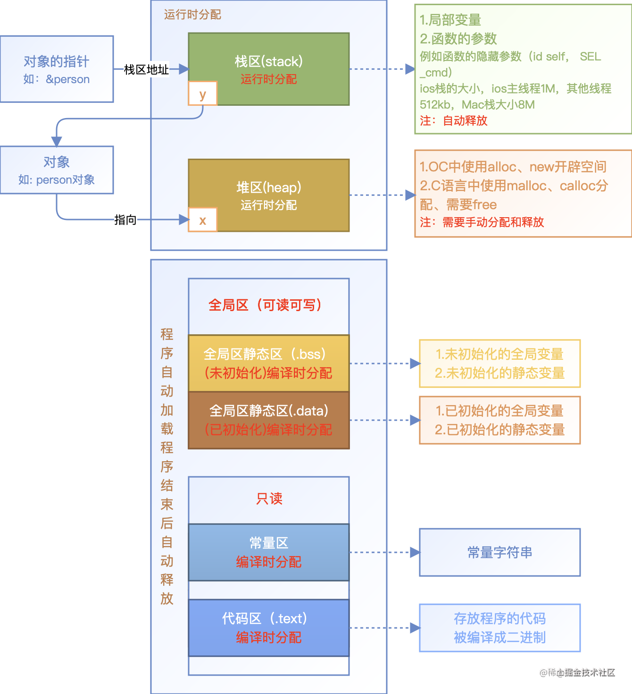

> <h1 id=""></h1>
- [**开篇**](#开篇)
	- [Xcode Build流程](#XcodeBuild流程)
	- [OC动态性总结](#OC动态性总结)
- [isa指针](#isa指针)
	- [isa指针联合体数据结构](#isa指针联合体数据结构)
	- [isa和Class联系](#isa和Class联系)
- [**自动引用计数(ARC)**](#自动引用计数ARC)
	- [**引用计数**](#引用计数)
		- [SideTable](#SideTable)
			- [SideTable数据结构](#SideTable数据结构)
			- [SideTable和引用计数关系](#SideTable和引用计数关系)
			- [weak_entry_t结构体](#weak_entry_t结构体)
		- [对象释放](#对象释放)
			- [rootDealloc()函数](#rootDealloc)
			- [object_dispose(id obj)函数](#object_dispose函数)
- [**编译器Clang**](#编译器Clang)
- **参考资料**
	- [理解 ARC 实现原理](https://juejin.cn/post/6844903847622606861)
	- [内存管理-深入解析自动释放池](https://www.jianshu.com/p/7bd2f85f03dc)
	- [内存管理](https://blog.csdn.net/u013378438/article/details/80733391)
	- [iOS弱引用表 SideTable weak_table_t weak_entry_t](https://blog.csdn.net/sinat_34245894/article/details/122363888)
	


<br/>

***
<br/>
<br/>


> <h1 id="开篇">开篇</h1>


**概述**

当我们创建一个对象时：

```
Object *object = [[Object alloc] init];
```

&emsp; 上面这行代码在栈上创建了object指针，并在堆上创建了一个Object对象。目前，iOS并不支持在栈上创建对象。

<br/>

ARC 是 iOS 中管理引用计数的技术，帮助 iOS 实现垃圾自动回收，具体实现的原理是由编译器进行管理的，同时运行时库协助编译器辅助完成。主要涉及到 Clang （LLVM 编译器） 和 objc4 运行时库。
本文主要内容由修饰符 __strong 、 __weak 、 __autorelease 拓展开，分别延伸出引用计数、弱引用表、自动释放池等实现原理。在阅读本文之前，你可以看看下面几个问题：


- [在 ARC 下如何存储引用计数？](#ARC下如何存储引用计数)


- [如[NSDictionary dictionary]方法创建的对象在 ARC 中有什么不同之处](#NSDictionary创建对象与ARC的不同)。


- [弱引用表的数据结构](#弱引用表的数据结构)。


- [解释一下自动释放池中的 Hot Page 和 Cold Page](#自动释放池中的HotPage和ColdPage)。


<br/>
<br/>
<br/>


> <h2 id="XcodeBuild流程">Xcode Build流程</h2>


- [**编译过程分为四个步骤：**](https://blog.csdn.net/fanyun_01/article/details/118279039)
	- 预编译（Pre-process）：宏替换、删除注释、展开头文件，产生 .i 文件。
	- 编译（Compliling）：把前面生成的 .i 文件转化为汇编语言，产生 .s 文件。
	- 汇编（Asembly）：把汇编语言 .s 文件转化为机器码文件，产生 .0 文件。
	- 链接（Link）：对 .o 文件中的对于其他库的引用的地方进行引用，生成最后的可执行文件。也包括多个 .o 文件进行 link。

<br/>

&emsp; 通过解析 Xcode 编译 log，可以发现 Xcode 是根据 Target 进行编译的。我们可以通过 Xcode 中的 Build Phases、Build Settings 及 Build Rules 来控制编译过程。


<br/>


- **Build Settings：** 这一栏下是对编译的细节进行设定，包含 build 过程的每个阶段的设置选项（包含编译、链接、代码签名、打包）。

- **Build Phases：** 用于控制从源文件到可执行文件的整个过程，如编译哪些文件，编译过程中执行哪些自定义脚本。例如 CocoaPods 在这里会进行相关配置。

- **Build Rules：** 指定了不同的文件类型该如何编译。一般我们不需要修改这里的内容。如果需要对特定类型的文件添加处理方法，可以在这里添加规则。

<br/>


每个 Target 的具体编译过程也可以通过 log 日志获得。大致过程为：

- 编译信息写入辅助文件（如Entitlements.plist），创建编译后的文件架构

- 写入辅助信息（.hmap 文件）。将项目的文件结构对应表、将要执行的脚本、项目依赖库的文件结构对应表写成文件。

- 运行预设的脚本。如 Cocoapods 会在 Build Phases 中预设一些脚本（CheckPods Manifest.lock）。

- 编译 .m 文件，生成可执行文件 Mach-O。每次进行了 LLVM 的完整流程：前端（词法分析 - 语法分析 - 生成 IR）、优化器（优化 IR）、后端（生成汇编 - 生成目标文件 - 生成可执行文件）。使用 CompileC 和 clang 命令。 CompileC 是 xcodebuild 内部函数的日志记录表示形式，它是 build.log 文件中有关编译的基本信息来源。

- 链接需要的库。如 Foundation.framework，AFNetworking.framework…

- 拷贝资源文件到目标包

- 编译 storyboard 文件

- 链接 storyboard 文件

- 编译 Asset 文件。如果使用 Asset.xcassets 来管理图片，这些图片会被编译为机器码，除了 icon 和 launchIamge。

- 处理 infoplist

- 执行 CocoaPods 脚本，将在编译项目前已编译好的依赖库和相关资源拷贝到包中。

- 拷贝 Swift 标准库

- 创建 .app 文件并对其签名


<br/>
<br/>

>## <h3 id="OC动态性总结">[OC动态性总结](https://blog.csdn.net/cordova/article/details/53876682)</h3>


**编译时：** 即编译器对语言的编译阶段，编译时只是对语言进行最基本的检查报错，包括词法分析、语法分析等等，将程序代码翻译成计算机能够识别的语言（例如汇编等），编译通过并不意味着程序就可以成功运行。

**运行时：** 即程序通过了编译这一关之后编译好的代码被装载到内存中跑起来的阶段，这个时候会具体对类型进行检查，而不仅仅是对代码的简单扫描分析，此时若出错程序会崩溃。

&emsp; 可以说编译时是一个静态的阶段，类型错误很明显可以直接检查出来，可读性也好；而运行时则是动态的阶段，开始具体与运行环境结合起来。


<br/>
<br/>
<br/>


> <h2 id="内存分区">内存分区</h2>

[内存五大分区:](https://juejin.cn/post/7007664422185828366) **栈区、堆区、全局区、常量区、代码区**





<br/>
<br/>


也可以说iOS应用程序的地址空间在逻辑上由四个部分组成：代码段，数据段，栈区和堆区：


- **代码段**:包含构成App可执行代码的机器指令。 它是由编译器通过将Swift代码转换为机器代码而产生的。 
	- 该段是只读的，并占用固定不变的空间。

- **数据段**:存储Swift静态变量，常量和类型元数据。 
	- 程序启动时所有需要初始值的全局数据都在此处。

- **栈区**:存储临时数据,比如:方法参数和局部变量。 
	- 每次我们调用一个方法时，都会在栈上分配一块新的内存。 
	- 该方法退出时，将释放该内存。 除特殊情况（下面会讲），所有Swift值类型都在此处(当值遵守某个协议,且[**存储在existential（存在性）**](https://blog.csdn.net/preyer2011/article/details/129052530)容器中超过3个机器字长时,则放在堆上)。

- **堆区**:存储具有生存期的对象。 这些都是Swift引用类型，还有一些值类型的情况。 
	- 堆和栈朝着彼此增长堆区的分配一般按照地址从小到大进行，而栈区的分配一般按照地址从大到小进行分配。


<br/>

***
<br/>
<br/>


> <h1 id="isa指针">isa指针</h1>


**对象的isa指针，用来表明对象所属的类类型。**

但是如果isa指针仅表示类型的话，对内存显然也是一个极大的浪费。于是，就像tagged pointer一样，对于isa指针，苹果同样进行了优化。isa指针表示的内容变得更为丰富，除了表明对象属于哪个类之外，还附加了引用计数extra_rc，是否有被weak引用标志位

weakly_referenced，是否有附加对象标志位has_assoc等信息。


<br/>
<br/>


> <h2 id="isa指针联合体数据结构">isa指针联合体数据结构</h2>


```
@interface NSObject <NSObject> {
    Class isa  OBJC_ISA_AVAILABILITY;
}

typedef struct objc_class *Class;

// ============ 注意！从这一行开始，其定义就和在XCode中objc.h看到的定义不一致，我们需要阅读runtime的源码，才能看到其真实的定义！下面是简化版的定义：============
struct objc_class : objc_object {
    Class superclass;
    cache_t cache;             // formerly cache pointer and vtable
    class_data_bits_t bits;    // class_rw_t * plus custom rr/alloc flags
}

 
struct objc_object {
private:
    isa_t isa;
}

union isa_t 
{
    isa_t() { }
    isa_t(uintptr_t value) : bits(value) { }

    Class cls;
    uintptr_t bits;

# if __arm64__
#   define ISA_MASK        0x0000000ffffffff8ULL
#   define ISA_MAGIC_MASK  0x000003f000000001ULL
#   define ISA_MAGIC_VALUE 0x000001a000000001ULL
/// struct共占用64位
    struct {
        uintptr_t nonpointer        : 1;  // 标志位1位。1(奇数)表示开启了isa优化;
										  // 0(偶数)表示没有启用isa优化。所以，我们可以通过判断isa是否为奇数来判断对象是否启用了isa优化。
        uintptr_t has_assoc         : 1;  // 标志位1位. 表明对象是否有关联对象。没有关联对象的对象释放的更快
        uintptr_t has_cxx_dtor      : 1;  // 标志位1位. 表明对象是否有C++或ARC析构函数。没有析构函数的对象释放的更快
        uintptr_t shiftcls          : 33; // 标志位33位。类指针的非零位 MACH_VM_MAX_ADDRESS 0x1000000000
        uintptr_t magic             : 6;  // 标志位6位。固定为0x1a，用于在调试时区分对象是否已经初始化。
        uintptr_t weakly_referenced : 1;  // 标志位1位。用于表示该对象是否被别的对象弱引用。没有被弱引用的对象释放的更快。
        uintptr_t deallocating      : 1;  // 标志位1位。用于表示该对象是否正在被释放。
        uintptr_t has_sidetable_rc  : 1;  // 标志位1位。用于标识是否当前的引用计数过大，无法在isa中存储，而需要借用sidetable来存储。（这种情况大多不会发生）
        uintptr_t extra_rc          : 19; // 标志位19位。对象的引用计数减1。比如，一个object对象的引用计数为7，则此时extra_rc的值为6。
#       define RC_ONE   (1ULL<<45)
#       define RC_HALF  (1ULL<<18)
    };
# elif __x86_64__
#   define ISA_MASK        0x00007ffffffffff8ULL
#   define ISA_MAGIC_MASK  0x001f800000000001ULL
#   define ISA_MAGIC_VALUE 0x001d800000000001ULL
#   define ISA_BITFIELD                                                        \
      uintptr_t nonpointer        : 1;                                         \
      uintptr_t has_assoc         : 1;                                         \
      uintptr_t has_cxx_dtor      : 1;                                         \
      uintptr_t shiftcls          : 44; /*MACH_VM_MAX_ADDRESS 0x7fffffe00000*/ \
      uintptr_t magic             : 6;                                         \
      uintptr_t weakly_referenced : 1;                                         \
      uintptr_t deallocating      : 1;                                         \
      uintptr_t has_sidetable_rc  : 1;                                         \
      uintptr_t extra_rc          : 8
#   define RC_ONE   (1ULL<<56)
#   define RC_HALF  (1ULL<<7)
 
# else
#   error unknown architecture for packed isa
# endif

}
```


&emsp; 由上面**union isa_t** 来看,对象引用计数有两个相关的成员：**extra_rc**和**has_sidetable_rc**。

&emsp;iOS用19位的extra_rc来记录对象的引用次数，当extra_rc 不够用时，还会借助sidetable来存储计数值，这时，has_sidetable_rc会被标志为1。

我们可以算一下，对于19位的extra_rc ，其数值可以表示2^19 - 1 = 524287。 52万多，相信绝大多数情况下，都够用了。

现在，我们来真正的验证一下，我们上述的结论。注意，做验证试验时，必须要使用真机，因为模拟器默认是不开启isa优化的。


<br/>
<br/>


> <h2 id='isa和Class联系'>isa和Class联系</h2>

从runtime的源码里面看isa是Class类型：

```
struct objc_object {
	Class _Nonnull isa OBJC_ISA_AVAILABILITY;
}
```

<br/>

**Class 类型其实是objc_class:**

```
typedef struct objc_class *Class;

typedef struct objc_object *id;
```

<br/>

通过下面的图可以更清楚的了解runtime中对象和类的结构定义.显然，类也是一种对象，这就是类对象的含义。

我们来梳理下它们之间的联系,如下:


从图中可以看出，我们所谓的isa指针，最后实际上落脚于isa_t的联合类型。联合类型 是C语言中的一种类型，简单来说，就是一种n选1的关系。比如isa_t 中包含有cls，bits， struct三个变量，它们的内存空间是重叠的。在实际使用时，仅能够使用它们中的一种，你把它当做cls，就不能当bits访问，你把它当bits，就不能用cls来访问。

联合的作用在于，用更少的空间，表示了更多的可能的类型，虽然这些类型是不能够共存的


将注意力集中在isa_t联合上，我们该怎样理解它呢？

首先它有两个构造函数isa_t(), isa_t(uintptr_value), 这两个定义很清晰，无需多言。

然后它有三个数据成员Class cls, uintptr_t bits, struct 。 其中uintptr_t被定义为typedef unsigned long uintptr_t，占据64位内存。

关于上面三个成员， uintptr_t bits 和 struct 其实是一个成员，它们都占据64位内存空间，之前已经说过，联合类型的成员内存空间是重叠的。在这里，由于uintptr_t bits 和 struct 都是占据64位内存，因此它们的内存空间是完全重叠的。而你将这块64位内存当做是uintptr_t bits 还是 struct，则完全是逻辑上的区分，在内存空间上，其实是一个东西。
即uintptr_t bits 和 struct 是一个东西的两种表现形式。

实际上在runtime中，任何对struct 的操作和获取某些值，如extra_rc，实际上都是通过对uintptr_t bits 做位操作实现的。uintptr_t bits 和 struct 的关系可以看做，uintptr_t bits 向外提供了操作struct 的接口，而struct 本身则说明了uintptr_t bits 中各个二进制位的定义。

理解了uintptr_t bits 和 struct 关系后，则isa_t其实可以看做有两个可能的取值，Class cls或struct。如下图所示：


&emsp; 当isa_t作为Class cls使用时，这符合了我们之前一贯的认知：isa是一个指向对象所属Class类型的指针。然而，仅让一个64位的指针表示一个类型，显然不划算。

因此，**绝大多数情况下，苹果采用了优化的isa策略，即，isa_t类型并不等同而Class cls, 而是struct。** 这种情况对于我们自己创建的类对象以及系统对象都是如此，稍后我们会对这一结论进行验证。


<br/>


<br/>

***
<br/>
<br/>

> <h2 id="自动引用计数ARC">自动引用计数(ARC)</h2>


<br/>


> <h2 id="引用计数">引用计数</h2>


[isa结构](./知识点(I).md#arm64前后isa结构)

<br/>

> <h3 id="SideTable">SideTable</h3>

**SideTable是一个全局的引用计数表，它记录了所有对象的引用计数。**


<br/>

> <h4 id="SideTable数据结构">SideTable数据结构</h4>

在runtime中，通过SideTable来管理对象的引用计数以及weak引用。这里要注意，一张SideTable会管理多个对象，而并非一个。
而这一个个的SideTable又构成了一个集合，叫SideTables。SideTables在系统中是全局唯一的。

SideTable，SideTables的关系如下图所示（这张图会随着分析的深入逐渐扩充）：


<br/>


SideTables的类型是是**template<typename T> class StripedMap，StripedMap<SideTable>** 。

我们可以简单的理解为一个64 * sizeof(SideTable) 的哈希线性数组 (通过评论区的更正，在iPhone环境中，应该是8个SideTable)。

每个对象可以通过StripedMap所对应的哈希算法，找到其对应的SideTable。StripedMap 的哈希算法如下，其参数是对象的地址。

```
static unsigned int indexForPointer(const void *p) {
        uintptr_t addr = reinterpret_cast<uintptr_t>(p);
        return ((addr >> 4) ^ (addr >> 9)) % StripeCount; // 这里 %StripeCount 保证了所有的对象对应的SideTable均在这个64长度数组中。
    }
```

注意到这个SideTables哈希数组是全局的，因此，对于我们APP中所有的对象的引用计数，也就都存在于这64个SideTable中。

具体到每个SideTable， 其中有存储了若干对象的引用计数。SideTable 的定义如下：

```
struct SideTable {
    spinlock_t slock;
    RefcountMap refcnts;
    weak_table_t weak_table;

    SideTable() {
        memset(&weak_table, 0, sizeof(weak_table));
    }

    ~SideTable() {
        _objc_fatal("Do not delete SideTable.");
    }
};
```

SideTable包含三个成员：

spinlock_t slock ：自旋锁。防止多线程访问SideTable冲突
RefcountMap refcnts：用于存储对象引用计数的map
weak_table_t weak_table ： 用于存储对象弱引用的map
这里我们暂且不去管weak_table， 先看存储对象引用计数的成员RefcountMap refcnts。

RefcountMap类型实际是DenseMap，这是一个模板类。

```
typedef objc::DenseMap<DisguisedPtr<objc_object>,size_t,true> RefcountMap;
```

<br/>
<br/>
<br/>

> <h4 id="SideTable和引用计数关系">SideTable和引用计数关系</h4>


为了弄清extra_rc和sidetable的关系，我们首先看runtime添加对象引用计数时的简化代码。不过在看代码之前，我们需要弄清楚slowpath和fastpath是干啥的。

我们在runtime源码中有时候，有时在if语句中会看到类似下面这些代码：

```
if (fastpath(cls->canAllocFast())){
...
}

if (slowpath(!newisa.nonpointer)) {
...
}
```

<br/>

其实将fastpath和slowpath去掉是完全不影响任何功能的。之所以将fastpath和slowpath 放到if语句中，是为了告诉编译器，if中的条件是大概率(fastpath)还是小概率(slowpath)事件，从而让编译器对代码进行优化。知道了这些，我们就可以来看OC是如何获取对象引用计数继续的源码了：

```
#       define RC_HALF  (1ULL<<18)
ALWAYS_INLINE id
objc_object::rootRetain(bool tryRetain, bool handleOverflow)
{
	// 如果是tagged pointer，直接返回this，因为tagged pointer不用记录引用次数
    if (isTaggedPointer()) return (id)this;
    // transcribeToSideTable用于表示extra_rc是否溢出，默认为false
    bool transcribeToSideTable = false;
    
    isa_t oldisa;
    isa_t newisa;
    
    do {
        transcribeToSideTable = false;
        oldisa = LoadExclusive(&isa.bits); // 将isa_t提取出来
        newisa = oldisa;
        if (slowpath(!newisa.nonpointer)) {  // 如果没有采用isa优化, 则返回sidetable记录的内容, 此处slowpath表明这不是一个大概率事件
            return sidetable_retain();
        }
        // 如果对象正在析构，则直接返回nil
        if (slowpath(tryRetain && newisa.deallocating)) {
            return nil;
        }
        // 采用了isa优化，做extra_rc++，同时检查是否extra_rc溢出，若溢出，则extra_rc减半，并将另一半转存至sidetable
        uintptr_t carry;
        newisa.bits = addc(newisa.bits, RC_ONE, 0, &carry);  // extra_rc++
        
        if (slowpath(carry)) { // 有carry值，表示extra_rc 溢出
            // newisa.extra_rc++ overflowed
            if (!handleOverflow) {  // 如果不处理溢出情况，则在这里会递归调用一次，再进来的时候，handleOverflow会被rootRetain_overflow设置为true，从而进入到下面的溢出处理流程
                return rootRetain_overflow(tryRetain);
            }
            
            // 进行溢出处理：逻辑很简单，先在extra_rc中引用计数减半，同时把has_sidetable_rc设置为true，表明借用了sidetable。然后把另一半放到sidetable中
            sideTableLocked = true;
            transcribeToSideTable = true;
            newisa.extra_rc = RC_HALF;
            newisa.has_sidetable_rc = true;
        }
    } while (slowpath(!StoreExclusive(&isa.bits, oldisa.bits, newisa.bits))); // 将oldisa 替换为 newisa，并赋值给isa.bits(更新isa_t), 如果不成功，do while再试一遍
    
    //isa的extra_rc溢出，将一半的refer count值放到sidetable中
    if (slowpath(transcribeToSideTable)) {
        // Copy the other half of the retain counts to the side table.
        sidetable_addExtraRC_nolock(RC_HALF);
    }
    
    return (id)this;
}
```

添加对象引用计数的源码逻辑还算清晰，重点看当extra_rc溢出后，runtime是怎么处理的。

在iOS中，extra_rc占有19位，也就是最大能够表示2^19-1, 用二进制表示就是19个1。当extra_rc等于2^19时，溢出，此时的二进制位是一个1后面跟19个0， 即10000…00。将会溢出的值2^19除以2，相当于将10000…00向右移动一位。也就等于RC_HALF(1ULL<<18)，即一个1后面跟18个0。

然后，调用

```
sidetable_addExtraRC_nolock(RC_HALF);
```

将另一半的引用计数RC_HALF放到sidetable中。


<br/>

SideTable源码结构:

```
static StripedMap<SideTable>& SideTables() {
    return *reinterpret_cast<StripedMap<SideTable>*>(SideTableBuf);
}
typedef objc::DenseMap<DisguisedPtr<objc_object>,size_t,true> RefcountMap;
struct SideTable {
    spinlock_t slock;//自旋锁
    RefcountMap refcnts;//引用计数表散列表
    weak_table_t weak_table;//弱引用表散列表

    SideTable() {
        memset(&weak_table, 0, sizeof(weak_table));
    }

    ~SideTable() {
        _objc_fatal("Do not delete SideTable.");
    }

    void lock() { slock.lock(); }
    void unlock() { slock.unlock(); }
    void forceReset() { slock.forceReset(); }

    // Address-ordered lock discipline for a pair of side tables.

    template<HaveOld, HaveNew>
    static void lockTwo(SideTable *lock1, SideTable *lock2);
    template<HaveOld, HaveNew>
    static void unlockTwo(SideTable *lock1, SideTable *lock2);
};
```


&emsp; SideTable存储在SideTables()中，SideTables()本质也是一个散列表，可以通过对象指针来获取它对应的（引用计数表或者弱引用表）一个SideTable中。

- 查找对象的引用计数表需要经过两次哈希查找：
	- ① 第一次根据当前对象的内存地址，经过哈希查找从SideTables()中取出它所在的SideTable；
	- ② 第二次根据当前对象的内存地址，经过哈希查找从SideTable中的refcnts中取出它的引用计数表。

<br/>

那么回到文章开头的疑问，为什么不是一个SideTable而是存在SideTables中。

&emsp; 通过源码中我看到了，SideTable是需要加锁解锁的。那么如果不同的对象，共用一个SideTable对象，那么则会造成效率问题了。所以需要拆分成不同的SideTable对象存放在SideTables中。

<br/>

- **下面是查资料的解释:**
	- 如果只有一个SideTable，那我们在内存中分配的所有对象的引用计数或者弱引用都放在这个SideTable中，那我们对对象的引用计数进行操作时，为了多线程安全就要加锁，就存在效率问题。
	- 系统为了解决这个问题，就引入 “分离锁” 技术方案，提高访问效率。把对象的引用计数表分拆多个部分，对每个部分分别加锁，那么当所属不同部分的对象进行引用操作的时候，在多线程下就可以并发操作。所以，使用多个SideTable组成SideTables()结构。


```
```


<br/>
<br/>

> <h3 id='weak_entry_t结构体'>weak_entry_t结构体</h3>


根据我看的[iOS弱引用表 SideTable weak_table_t weak_entry_t](https://blog.csdn.net/sinat_34245894/article/details/122363888),看出存放对象多个弱引用指针的地址是放在

```
typedef DisguisedPtr<objc_object *> weak_referrer_t;
#if __LP64__
#define PTR_MINUS_2 62
#else
#define PTR_MINUS_2 30
#endif
#define WEAK_INLINE_COUNT 4
#define REFERRERS_OUT_OF_LINE 2

struct weak_entry_t {
    DisguisedPtr<objc_object> referent;//被弱引用的对象
    //
    union {
        struct {
            weak_referrer_t *referrers;//动态数组保存弱引用的指针
            uintptr_t        out_of_line_ness : 2;//记录是否需要使用动态数组
            uintptr_t        num_refs : PTR_MINUS_2;//动态数组中的元素个数
            uintptr_t        mask;//动态数组的长度-1,作用同weak_table_t的mask
            uintptr_t        max_hash_displacement;//最大冲突或者异常次数,如果运算过程中冲突或者异常次数超过这个值max_hash_displacement则有问题
        };
        struct {
            //初始化时默认使用的数组
            weak_referrer_t  inline_referrers[WEAK_INLINE_COUNT];
        };
    };

//判断是否大于4个,师傅需要动态数组
    bool out_of_line() {
        return (out_of_line_ness == REFERRERS_OUT_OF_LINE);
    }
//重载运算符
    weak_entry_t& operator=(const weak_entry_t& other) {
        memcpy(this, &other, sizeof(other));
        return *this;
    }
//构造函数,里面默认使用inline_referrers数组,当数据大于4个时,会改成动态数组referrers
    weak_entry_t(objc_object *newReferent, objc_object **newReferrer)
        : referent(newReferent)
    {
        inline_referrers[0] = newReferrer;
        for (int i = 1; i < WEAK_INLINE_COUNT; i++) {
            inline_referrers[i] = nil;
        }
    }
};
```

weak_entry_t结构体中的referrers中.


<br/>
<br/>


> <h3 id="对象释放">对象释放</h3>

<br/>

> <h4 id='rootDealloc'>rootDealloc()</h4>

dealloc释放过程的源码

```
inline void
objc_object::rootDealloc()
{
    if (isTaggedPointer()) return;  // fixme necessary?

    if (fastpath(isa.nonpointer  &&  
                 !isa.weakly_referenced  &&  
                 !isa.has_assoc  &&  
                 !isa.has_cxx_dtor  &&  
                 !isa.has_sidetable_rc))
    {
        assert(!sidetable_present());
        free(this);
    } 
    else {
        object_dispose((id)this);
    }
}

```


<br/>

&emsp;&emsp; 如果做了isa优化，并且没有弱引用，没有关联对象，没有析构函数，没有存在sideTable中，则释放的更快

> <h4 id='object_dispose函数'>object_dispose(id obj)函数</h4>


```
id 
object_dispose(id obj)
{
    if (!obj) return nil;

    objc_destructInstance(obj);    
    free(obj);

    return nil;
}
void *objc_destructInstance(id obj) 
{
    if (obj) {
        // Read all of the flags at once for performance.
        bool cxx = obj->hasCxxDtor();
        bool assoc = obj->hasAssociatedObjects();

        // This order is important.
        if (cxx) object_cxxDestruct(obj);
        if (assoc) _object_remove_assocations(obj);
        obj->clearDeallocating();
    }

    return obj;
}

void object_cxxDestruct(id obj)
{
    if (!obj) return;
    if (obj->isTaggedPointer()) return;
    object_cxxDestructFromClass(obj, obj->ISA());
}

void _object_remove_assocations(id object) {
    vector< ObjcAssociation,ObjcAllocator<ObjcAssociation> > elements;
    {
        AssociationsManager manager;
        AssociationsHashMap &associations(manager.associations());
        if (associations.size() == 0) return;
        disguised_ptr_t disguised_object = DISGUISE(object);
        AssociationsHashMap::iterator i = associations.find(disguised_object);
        if (i != associations.end()) {
            // copy all of the associations that need to be removed.
            ObjectAssociationMap *refs = i->second;
            for (ObjectAssociationMap::iterator j = refs->begin(), end = refs->end(); j != end; ++j) {
                elements.push_back(j->second);
            }
            // remove the secondary table.
            delete refs;
            associations.erase(i);
        }
    }
    // the calls to releaseValue() happen outside of the lock.
    for_each(elements.begin(), elements.end(), ReleaseValue());
}

inline void 
objc_object::clearDeallocating()
{
    if (slowpath(!isa.nonpointer)) {
        // Slow path for raw pointer isa.
        sidetable_clearDeallocating();
    }
    else if (slowpath(isa.weakly_referenced  ||  isa.has_sidetable_rc)) {
        // Slow path for non-pointer isa with weak refs and/or side table data.
        clearDeallocating_slow();
    }

    assert(!sidetable_present());
}
void 
objc_object::sidetable_clearDeallocating()
{
    SideTable& table = SideTables()[this];

    // clear any weak table items
    // clear extra retain count and deallocating bit
    // (fixme warn or abort if extra retain count == 0 ?)
    table.lock();
    RefcountMap::iterator it = table.refcnts.find(this);
    if (it != table.refcnts.end()) {
        if (it->second & SIDE_TABLE_WEAKLY_REFERENCED) {
            weak_clear_no_lock(&table.weak_table, (id)this);
        }
        table.refcnts.erase(it);
    }
    table.unlock();
}

objc_object::clearDeallocating_slow()
{
    assert(isa.nonpointer  &&  (isa.weakly_referenced || isa.has_sidetable_rc));

    SideTable& table = SideTables()[this];
    table.lock();
    if (isa.weakly_referenced) {
        weak_clear_no_lock(&table.weak_table, (id)this);
    }
    if (isa.has_sidetable_rc) {
        table.refcnts.erase(this);
    }
    table.unlock();
}
```


<br/>
<br/>

***
<br/>


> <h1 id="编译器Clang">编译器Clang</h1>


&emsp; 在 Objective-C 中，对象的引用关系由引用修饰符来决定，如__strong、__weak、__autorelease等等，编译器会根据不同的修饰符生成不同逻辑的代码来管理内存。

使用下面命令将OC代码转化为LLVM中间码：

```
// 切换到你文件路径下
cd Path
// 利用 main.m 生成中间码文件 main.ll
clang -S -fobjc-arc -emit-llvm main.m -o main.ll 

```

在main.m文件中加入defaultFunction方法，然后利用的命令行命令将其转换成中间码：

```
void defaultFunction() {
    id obj = [NSObject new];
}
```

经过在终端输入命令后它会在我们的指定的文件夹下生成一个main.ll的文件，打开后我们会看到其内容比较多，大致是以下内容:

```
void defaultFunction() {
	id obj = obj_msgSend(NSObject, @selector(new));
	objc_storeStrong(obj, null);
}

```


obj_msgSend(NSObject, @selector(new))非常好理解，就是新建一个对象，而objc_storeStrong是 objc4 库中的方法，具体逻辑如下：

```
void objc_storeStrong(id *location, id obj)
{
    id prev = *location;
    //检查输入的 obj 地址 和指针指向的地址是否相同
    if (obj == prev) {
        return;
    }
    //持有对象，引用计数 + 1
    objc_retain(obj);
    //指针指向 obj
    *location = obj;
    //原来指向的对象引用计数 - 1
    objc_release(prev);
}
```

其中objc_retain和objc_release也是 objc4 库中的方法，在本文后面分析 objc4 库的章节会详细讲


<br/>

***
<br/>

> <h1 id=""></h1>


<br/>

***
<br/>

> <h1 id=""></h1>


<br/>

***
<br/>

> <h1 id=""></h1>


<br/>

***
<br/>

> <h1 id=""></h1>


<br/>

***
<br/>

> <h1 id=""></h1>


<br/>

***
<br/>

> <h1 id=""></h1>


<br/>

***
<br/>

> <h1 id=""></h1>


<br/>

***
<br/>

> <h1 id=""></h1>