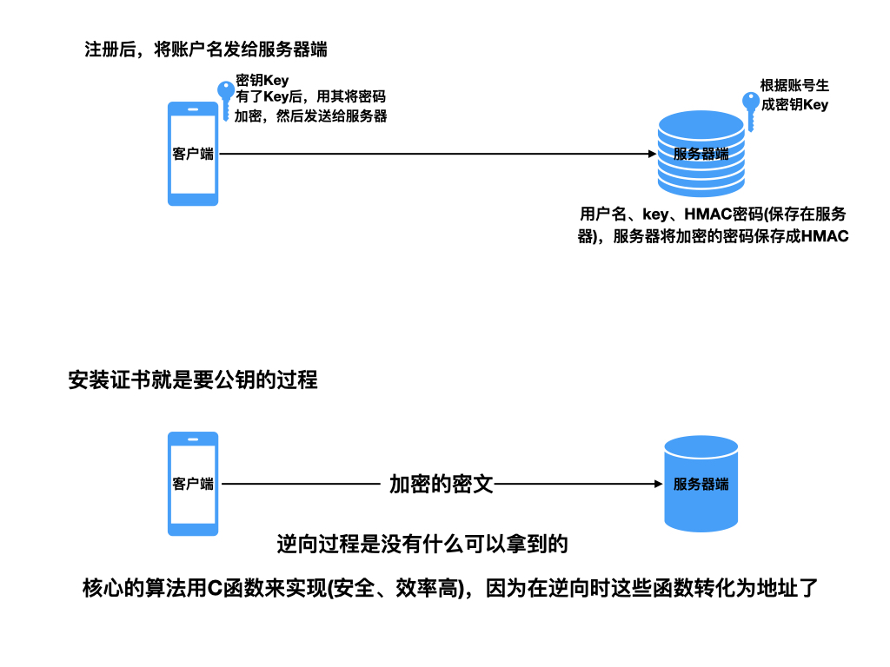

> <h1 id=''></h1>
- [**网络安全**](#网络安全)
	- [如何验证与服务器通信的数据没有篡改](#如何验证与服务器通信的数据没有篡改)
	- [消息认证码(MAC)是如何实现的？](#消息认证码(MAC)是如何实现的)
- [**加密库CommonCrypto**](#加密库CommonCrypto)
	- [文件结构](#文件结构)
	- [密码生成密钥](#密码生成密钥)
- [**Security 框架**](#Security框架) 
	- [随机字节序列](#随机字节序列)
	- [几种随机方法比较](#几种随机方法比较)
- [**Hash算法比较**](#Hash算法比较)
- [**DES加密**](#DES加密)
- [**RSA加密**](#RSA加密)
	- [获取证书文件](#获取证书文件)
	- [证书的使用步骤](#证书的使用步骤)
	- [显示证书信息](#显示证书信息)
	- [获取钥匙串的持久化引用](#获取钥匙串的持久化引用)
	- [钥匙串中查找证书](#钥匙串中查找证书)
	- [获取策略对象并评估可信度](#获取策略对象并评估可信度)
	- [加密和解密数据](#加密和解密数据)
		- 	[生成密钥对](#生成密钥对)
		- 	[用公钥加密数据](#用公钥加密数据)
		- [私钥解密](#私钥解密)
- [**SHAI**](#SHAI)
- [**MD5摘要**](#MD5摘要)
- [**越狱判断**](#越狱判断)
- **参考资料**
	- [**RSA加密(生成公钥、秘钥pem)**](https://www.cnblogs.com/xuan52rock/p/11023423.html)
	- [AES加解密各模式（ECB、CBC、CFB、OFB）的实现](https://juejin.cn/post/7088961502450810894)


<br/>

***
<br/><br/>


> <h1 id='网络安全'>网络安全</h1>


&ensp; 为了满足安全相关的需求，Apple向开发者提供了**` Security`** 框架与 **`CommonCrypto`** 接口，可以在应用中使用。`Security` 框架是一套C API 的集合，用于`管理证书、信任策略以及对设备安全数据存储的访问`。

&ensp; [**`CommonCrypto`**](https://github.com/lgc107/CommonCrypto) 是一套接口的集合，用于数据的加解密、生成常见的密码散列(比如`MD5和SHA1`),计算消息认证码，生成密码或是基于密码的秘钥等。

<br/><br/><br/>

> <h2 id='如何验证与服务器通信的数据没有篡改'>如何验证与服务器通信的数据没有篡改</h2>

**问题: 如何验证与正确的服务器通信成功呢？**

&emsp; iOS开发时，为了防止匿名攻击，服务器需要确保每个请求都是从被信任的客户端发起的。所以我们在网络请求时需要对所有请求做一些加密处理，用于server端认证。

这里用于计算 HMAC（基于哈希的消息验证代码）值，并将结果进行 Base64 编码，代码如下:

```
+  (NSString *)HMacHashWithKey:(NSString *)key data:(NSString *)data{
    //将输入的 key 转换为 C 语言风格的字符串（C 字符串），以便后续的哈希计算
    const char *cKey  = [key cStringUsingEncoding:NSASCIIStringEncoding];
    const char *cData = [data cStringUsingEncoding:NSASCIIStringEncoding];

    //声明一个用于存储 HMAC 值的数组
    unsigned char cHMAC[CC_SHA256_DIGEST_LENGTH];

    //使用 HMAC-SHA256 算法计算 HMAC 值。其中，kCCHmacAlgSHA256 表示要使用的哈希算法为 SHA-256。
    //cKey 和 cData 是要计算 HMAC 的密钥和数据，strlen 函数用于获取 C 字符串的长度，cHMAC 是用于存储结果的数组
    CCHmac(kCCHmacAlgSHA256, cKey, strlen(cKey), cData, strlen(cData), cHMAC);
    
    NSData *HMAC = [[NSData alloc] initWithBytes:cHMAC
    length:sizeof(cHMAC)];

    //将加密结果进行一次BASE64编码。
    NSString *hash = [HMAC base64EncodedStringWithOptions:0];
    
    return hash;
}
```

其中被加密的字段data，我们可以设定一种特殊的生成方式。

加密的密匙key也可以和server端商定一致。

这种签名方式依赖于一个库[CommonCryptor](https://github.com/Westmiss/UserfulSource/tree/master/CommonCryptor).

将签名后的hash在发送请求时添加到请求的header中，server端通过同样的签名算法得到的hash如果相同，那么就可以确认，请求是由可以信任的客户端发起的，认证过程由此也完成了。


<br/><br/>


> <h2 id='消息认证码(MAC)是如何实现的'>消息认证码(MAC)是如何实现的？</h2>


**`HMAC`**:经常被称作秘钥消息认证码，由`RFC 2104`定义的。`HMAC `可以使用任何哈希函数，通常会使用`MD5`或`SHA-1`。

<br/><br/>

> <h2 id='Hash算法比较'>Hash算法比较</h2>


SHA-1、SHA-256、SHA-224、SHA-384 和 SHA-512 是密码学中常用的哈希算法，用于生成消息摘要或签名。它们之间的主要区别在于以下几个方面：

- **输出长度：**

```
SHA-1：160 位（20 字节）
SHA-256：256 位（32 字节）
SHA-224：224 位（28 字节）
SHA-384：384 位（48 字节）
SHA-512：512 位（64 字节）
```

<br/>

**安全性：** SHA-1 已被认为不安全，并且已经被证明容易受到碰撞攻击，不再被推荐使用。相比之下，SHA-256、SHA-224、SHA-384 和 SHA-512 目前仍然被广泛使用，并被认为是相对安全的。

<br/>

**速度：** 通常来说，输出长度更长的哈希算法会比输出长度更短的算法更加安全，但也会导致更慢的计算速度。因此，SHA-256 的计算速度可能比 SHA-1 快，而 SHA-512 的计算速度可能比 SHA-256 慢。

<br/>

**适用场景：** 根据安全需求和性能要求，选择适当的哈希算法。例如，对于需要高安全性的应用程序，可以选择 SHA-256、SHA-384 或 SHA-512；对于要求不那么严格的应用程序，可以选择 SHA-224。


<br/>

总的来说，SHA-256 目前是广泛使用的哈希算法，因为它提供了良好的安全性和合理的计算速度。SHA-224 为 SHA-256 的一种变体，通常用于那些需要较短哈希值但仍需要 SHA-256 安全性水平的场景。SHA-384 和 SHA-512 提供了更长的哈希值，并且适用于那些对安全性要求非常高的场景。


<br/>

***
<br/><br/>

># <h1 id='加密库CommonCrypto'>[加密库CommonCrypto](https://www.jianshu.com/p/8896ed432dff)</h1>


```
//搜索 CommonCrypto
pod search CommonCrypto
pod 'CommonCrypto', '~> 1.1'


CommonCrypto (1.1)
   A simple cryptographic tool.
   pod 'CommonCrypto', '~> 1.1'
   - Homepage: https://github.com/AlanQuatermain/aqtoolkit
   - Source:   https://github.com/EduPad/CommonCrypto.git
   - Versions: 1.1, 1.0 [cocoapods repo]
```


<br/><br/>
> <h2 id='文件结构'>文件结构</h2>

我们引用`#import<CommonCrypto/CommonCrypto.h>`之后，可以在CommonCrypto.h当中我们可以看到以下的几个文件：

```
<CommonCrypto/CommonCryptor.h>  //常用对称加解密，例如AES、DES等
<CommonCrypto/CommonDigest.h>    //常用消息摘要, 例如MD5、SHA1等
<CommonCrypto/CommonHMAC.h>   //HMAC 哈希消息认证
<CommonCrypto/CommonKeyDerivation.h>   //PBKDF导出密钥相关.
<CommonCrypto/CommonSymmetricKeywrap.h>    AES Key Wrap
```

- **部分库文件介绍:**

	- CommonCryptor文件中最上方有一段苹果对该文档的摘要、介绍说明以及如何使用的英文文档。`Generic interface for symmetric encryption`直译是对称加密的通用接口，包含了块加密和流加密两种类型。它们分别是`AES、DES、3DES、CAST、BLOWFISH和RC2以及RC4`。
	
	- `CommonDigest文件中`包括如MD5,SHA家族等哈希摘要算法。
	
	- `CommonHMAC`文件中包含是`HMAC+MD5、HMAC+SHA1`等，是HMAC算法利用哈希算法，以一个密钥和一个消息为输入，生成一个消息摘要作为输出。
	
	- `CommonKeyDerivation`是使用`PBKDF`导出一个可用的密匙。
	
	- `CommonSymmetricKeywrap`中文件名称说明是`SymmetricKeywrap`(对称加密加密密匙)，但是在文档中苹果官方声明目前只有AES一种对称加密算法可用.

<br/>

```
//盐最好不要写死，否则若是泄漏，app就完了
static NSString *salt = @"(*DJSF*YUD)";
NSString *pwd = @"12345";
pwd = [pwd stringWithAppendingString:salt];
//签名
pwd = pwd.md5String;

//死盐不行，可以用随机盐
//用Hash中的HMAC(散列函数)，使用一个密钥加密数据，并且做2次散列
//在实际开发中，密钥来自服务器

```
没有绝对的安全，只有相对的安全。

破解所获得利益 !< 破解所需要成本，称为相对安全

base64编码： 私钥。

加密过程示意图:




<br/><br/><br/>

> <h2 id='密码生成密钥'>密码生成密钥</h2>

&emsp;  若以用户输入密钥为基础，可以考虑使用 `CommonCrypto/CommonKeyDerivation`库的`CCKeyDerivationPBKDF()`函数。`CCKeyDerivationPBKDF()`会返回密钥值、推导算法、推导次数以及用户指定的输出密钥长度。


**`CCKeyDerivationPBKDF()`** 是 CommonCrypto 框架中的一个函数，用于执行基于密码的密钥派生函数（PBKDF）来从给定的密码生成密钥。PBKDF 是一种用于从密码派生密钥的算法，它增加了一些安全性功能，例如盐值（salt）和迭代次数，以增加密码破解的难度。

以下是 CCKeyDerivationPBKDF() 函数的参数及其解释：

```
CCErrorCode CCKeyDerivationPBKDF(
    CCPBKDFAlgorithm algorithm,          // PBKDF 算法，例如 kCCPBKDF2
    const char *password, size_t passwordLen,    // 输入的密码和其长度
    const uint8_t *salt, size_t saltLen,         // 指定用于派生密钥的盐值及其长度
    CCPseudoRandomAlgorithm prf,                  // 伪随机函数算法，例如 kCCPRFHmacAlgSHA256
    uint rounds,                                  // 指定迭代次数，增加迭代次数可以增强密码派生的安全性，但会增加计算时间
    uint8_t *derivedKey, size_t derivedKeyLen     // 生成的密钥和其长度
);
```

<br/>

**下面简单DEMO:**

```
//导入 CommonCrypto 模块
#import CommonCrypto

// 定义一些参数
let password = "myPassword"
let passwordData = password.data(using: .utf8)!
let salt: [UInt8] = [0x01, 0x02, 0x03, 0x04, 0x05]
let rounds: UInt32 = 10000
let derivedKeyLength = kCCKeySizeAES256 // AES-256 密钥长度为 32 字节

// 生成的密钥存储在这里
var derivedKey = [UInt8](repeating: 0, count: derivedKeyLength)

// 调用 CCKeyDerivationPBKDF() 函数
let result = derivedKey.withUnsafeMutableBytes { derivedKeyBytes in
    CCKeyDerivationPBKDF(CCPBKDFAlgorithm(kCCPBKDF2),            // PBKDF 算法
                         password,                                // 输入的密码
                         passwordData.count,                      // 密码长度
                         salt,                                   // 盐值
                         salt.count,                             // 盐值长度
                         CCPseudoRandomAlgorithm(kCCPRFHmacAlgSHA256),  // 伪随机函数算法
                         rounds,                                 // 迭代次数
                         derivedKeyBytes.baseAddress?.assumingMemoryBound(to: UInt8.self), // 生成的密钥
                         derivedKeyLength)                       // 生成的密钥长度
}

if result == kCCSuccess {
    print("Derived key generated successfully!")
    // 在 derivedKey 中可以访问生成的密钥
    print("Derived key: \(derivedKey)")
} else {
    print("Error generating derived key: \(result)")
}
```


<br/>

***
<br/><br/>

> <h1 id='Security框架'>Security 框架</h1>

&ensp; `NSURLProtectionSpace`：的对象表示需要身份验证的服务器或服务器的一部分。 保护空间定义了一系列匹配约束，用于确定应提供哪个凭证。
SecPKCS12Import() 函数导入身份和信任： [**使用Security.framework进行RSA 加密解密签名和验证签名**](https://www.cnblogs.com/cocoajin/p/6183443.html)

<br/><br/>

> <h2 id='随机字节序列'>随机字节序列</h2>

**SecRandomCopyBytes** 是 Security 框架中的一个函数，用于生成加密安全的随机字节序列。这个函数提供了一种可靠的方法来获取安全的随机数，适用于密码学和安全相关的场景。

以下是 SecRandomCopyBytes 函数的声明：

```
//count：要生成的随机字节数。
//bytes：用于存储生成的随机字节序列的缓冲区的指针
func SecRandomCopyBytes(_ count: Int, _ bytes: UnsafeMutableRawPointer) -> Int32
```

函数返回值为 Int32 类型，表示执行结果。如果函数执行成功，返回值为 errSecSuccess，否则为其他错误代码。


<br/>

**生成随机字节序列DEMO：**

```
import Security

// 定义一个缓冲区，用于存储生成的随机字节序列
var randomBytes = [UInt8](repeating: 0, count: 16) // 生成 16 个字节的随机数

// 调用 SecRandomCopyBytes 函数生成随机字节序列
let result = SecRandomCopyBytes(kSecRandomDefault, randomBytes.count, &randomBytes)

// 检查函数执行结果
if result == errSecSuccess {
    // 打印生成的随机字节序列
    print("Random bytes: \(randomBytes)")
} else {
    // 打印错误信息
    print("Failed to generate random bytes. Error code: \(result)")
}
```

<br/><br/>

> <h2 id='几种随机方法比较'>几种随机方法比较</h2>


- rand()和random()实际并不是一个真正的伪随机数发生器，在使用之前需要先初始化随机种子，否则每次生成的随机数一样。

<br/>

- arc4random()和arc4random_uniform(u_int32_t)是一个真正的伪随机算法，不需要生成随机种子，因为第一次调用的时候就会自动生成。而且范围是rand()的两倍。

<br/>

- 如果渗透测试 arc4random()和arc4random_uniform(u_int32_t)不能通过，使用如下代码生成随机数

```
uint8_t randomBytes[16];
    NSMutableString *ivStr;
    int result = SecRandomCopyBytes(kSecRandomDefault, 16, randomBytes);
    if(result == 0) {
        ivStr = [[NSMutableString alloc] initWithCapacity:16];
        for(NSInteger index = 0; index < 16; index++)
        {
            [ivStr appendFormat: @"%02x", randomBytes[index]];
        }
        NSLog(@"randomStr is %@", ivStr);
    } else {
        NSLog(@"SecRandomCopyBytes failed for some reason");
    }
```


<br/>

***
<br/><br/>

> <h1 id='DES加密'>DES加密</h1>


- RSA加密
	- 获取证书文件

<br/>

***
<br/>
<br/>


> <h1 id='RSA加密'>RSA加密</h1>


<br/>
<br/>

> <h2 id='获取证书文件'>获取证书文件</h2>


```
cd /Users/harleyhuang/Documents/GitHub/MLC  

//用openssl生成一个privateKey.pem私钥文件
openssl genrsa -out privateKey.pem 1024

//用privateKey.pem生成一个公钥文件
openssl rsa -in privateKey.pem -pubout -out publicKey.pem


//通过privateKey.pem文件生成一个csr文件
openssl req -new -key privateKey.pem -out rsaPrivateCsr.csr


//通过csr文件生成一个crt文件
openssl x509 -req -days 3650 -in rsaPrivateCsr.csr -signkey privateKey.pem -out rsaPrivateCert.crt


//通过crt文件生成der文件,包含着公钥的信息
openssl x509 -outform der -in rsaPrivateCert.crt -out rsaPublicCert.der


//通过privateKey.pem和rsaPrivateCert.crt文件生成rsaPrivate.p12,包含私钥信息
openssl pkcs12 -export -out rsaPrivate.p12 -inkey privateKey.pem -in rsaPrivateCert.crt
```

**6个文件的说明:**

<br/>

- **privateKey.pem：**
	- 类型：私钥文件
	- 用途：包含生成的私钥信息，用于对数据进行签名或解密。这是一个 PEM 格式的私钥文件。

<br/>

- **publicKey.pem：**
	- 类型：公钥文件
	- 用途：从私钥文件中提取的公钥信息，用于对数据进行验证或加密。这是一个 PEM 格式的公钥文件。

<br/>

- **rsaPrivateCsr.csr：**
	- 类型：证书签名请求文件 (CSR)
	- 用途：包含了用于签署数字证书的公钥信息，通常向证书颁发机构 (CA) 提交该文件以获得证书。这是一个 CSR 文件，用于请求数字证书。

<br/>

- **rsaPrivateCert.crt：**
	- 类型：X.509 证书文件 (CRT)
	- 用途：数字证书，包含了公钥以及与公钥相关的其他信息（如颁发者、过期日期等）。这是一个 X.509 格式的证书文件。

<br/>

- **rsaPublicCert.der：**
	- 类型：DER 编码的 X.509 证书文件
	- 用途：包含了公钥的 DER 编码表示，通常用于在程序中使用。这是一个 DER 格式的公钥证书文件。

<br/>

- **rsaPrivate.p12：**
	- 类型：**PKCS#12 文件 (P12)**(下面会用到)
	- 用途：包含了私钥和相关证书的容器，通常用于证书的导出和导入。这是一个 PKCS#12 格式的文件，通常用于导出私钥和相关证书到其他系统中使用。

&emsp; 总的来说，私钥文件 (privateKey.pem) 包含私钥信息，公钥文件 (publicKey.pem) 包含公钥信息，证书签名请求文件 (rsaPrivateCsr.csr) 用于向证书颁发机构请求证书，X.509 证书文件 (rsaPrivateCert.crt) 包含了公钥和其他相关信息，DER 编码的 X.509 证书文件 (rsaPublicCert.der) 包含了公钥的 DER 编码表示，PKCS#12 文件 (rsaPrivate.p12) 包含了私钥和相关证书的容器。这些文件在安全通信和数字证书管理中都有着重要的作用。


<br/><br/>

&emsp; 完成以上终端生成文件的步骤之后，我们就可以得到一个rsaPrivate.p12私钥文件和rsaPublicCert.der公钥文件，这两个文件是我们在代码中用到的。

**`注意`**：上述在终端中会使用到密码，在下面的代码文件中可能要用到，若是填错可能无法提取证书文件，导致崩溃。

<br/><br/>

> <h2 id='证书的使用步骤'>证书的使用步骤</h2>

&emsp;  下面演示了如何使用证书、密钥和信任服务去导入一个身份（identity），评估证书是否可信，判断信任失败的原因，以及信任失败后的恢复。
  顺序如：
  -  a.  导入一个 identity;
  -  b.  从导入的数据中获得证书;
  -  c.  获得用于证书评估的策略;
  -  d.  校验证书，根据指定策略评估证书是否可信;
  -  e.  测试证书中的可恢复错误;
  -  f.  判断证书是否过期;
  -  g.  改变评估条件,忽略过期证书;
  -  h.  重新评估证书.
  -  i.  从`.p12`私钥文件提取、评估身份


<br/>

&emsp;  在iOS设备上使用加密过的identity（一个密钥及其关联的证书）进行客户端认证，比如:可以把`PKCS#12`数据以受密码保护文件的方式安全地传输到这个设备上。

下面显示如何从`PKCS#12`数据中提取`identity`和`trust objects`（可信任对象），并评估其可信度。

从PKCS#12数据中提取identity和trust对象

```
//加载私钥
- (void)loadPrivateKey:(NSString *)privateKeyPath password:(NSString *)password {
    NSAssert( privateKeyPath.length != 0, @"私钥路径为空");
    
    //删除当前私钥
    if (privateKeyRef) {
        CFRelease(privateKeyRef);
    }
    
    NSData *pkcs12Data = [NSData dataWithContentsOfFile:privateKeyPath];
    //将 Objective-C 中的 NSData 对象和 NSString 对象转换为 Core Foundation 中的 CFDataRef 和 CFStringRef 类型
    //pkcs12Data 是一个 NSData 对象，它包含了 PKCS#12 格式的数据，通常是一个包含私钥和相关证书的容器。
    CFDataRef inPkcs12Data = (__bridge CFDataRef)pkcs12Data;
    //password 是一个 NSString 对象，表示用于保护 PKCS#12 数据的密码。
    CFStringRef passwordRef = (__bridge CFStringRef)password;
    
    //从 PKCS #12 证书中提取标识和证书
    SecIdentityRef myIdentity;
    SecTrustRef myTrust;
    //以PKCS#12格式导出或以PKCS#12格式导入时使用的密码(由CFStringRef对象表示)
    const void *keys[] = {kSecImportExportPassphrase};
    const void *values[] = {passwordRef};
    //创建要传给 SecPKCS12Import的包含密码的字典
    CFDictionaryRef optionsDictionary = CFDictionaryCreate(NULL, keys, values, 1, NULL, NULL);
    CFArrayRef items = CFArrayCreate(NULL, 0, 0, NULL);
    
    //从PKCS #12数据中导出证书、密钥、信任，放到数组中
    //OSStatus: 系统框架Security/SecureTransport.h中定义的错误码
    OSStatus status = SecPKCS12Import(inPkcs12Data, optionsDictionary, &items);
    
    if (status == 0) {
        //从数组中取出第一个字典，并从这个字典中取出身份和信任
        //SecPKCS12Import方法为PKCS #12数据中的每一个条目（身份或证书）返回一个字典
        //在这个例子中被导出的身份是数组中的第一个(item #0)
        //kSecImportItemIdentity 是一个键，用于标识导入的证书的身份信息。
        //kSecImportItemTrust 是另一个键，用于标识导入的证书的信任信息
        CFDictionaryRef myIdentifityAndTrust = CFArrayGetValueAtIndex(items, 0);
        myIdentity = (SecIdentityRef)CFDictionaryGetValue(myIdentifityAndTrust, kSecImportItemIdentity);
        myTrust = (SecTrustRef)CFDictionaryGetValue(myIdentifityAndTrust, kSecImportItemTrust);
    }
    
    if (optionsDictionary) {
        CFRelease(optionsDictionary);
    }
    
    if (items) {
        CFRelease(items);
    }
    
    NSAssert(status == noErr, @"提取身份和信任失败");
    
    SecTrustResultType trustResult;
    //函数用于评估给定的信任对象（myTrust），判断其是否满足信任策略。评估的结果存储在 trustResult 中，可以通过检查 trustResult 来确定证书是否被信任
    status = SecTrustEvaluate(myTrust, &trustResult);
    NSAssert(status == errSecSuccess, @"信任评估失败");
    
    //SecIdentityCopyPrivateKey 函数用于从给定的身份对象（myIdentity）中提取私钥，并将其存储在 privateKeyRef 中。这个私钥通常用于对数据进行签名或解密等操作
    status = SecIdentityCopyPrivateKey(myIdentity, &privateKeyRef);
    NSAssert(status == errSecSuccess, @"私钥创建失败");
    
    //return status
}

```

完成上述的代码步骤后，你需要完成下面这些：

  a.  释放包含新数据的CFDataRef对象;
  
  b.  返回的信任对象通过调用SecTrustEvaluate 或 SecTrustEvaluateAsync评估信任。
处理信任结果;

  c.  如果信任结果是kSecTrustResultInvalid, kSecTrustResultDeny, kSecTrustResultFatalTrustFailure，你不能继续，以失败结束;
  
  d.  如果信任结果是kSecTrustResultRecoverableTrustFailure，你应该从信任失败中恢复。
  
下面的代码显示了如何从身份中获取证书，如何展示证书的信息。


<br/>
<br/>

> <h2 id='显示证书信息'>显示证书信息</h2>


```
NSString *copySummaryString(SecIdentityRef identity) {
    SecCertificateRef myReturnedCertificate = NULL;
    //从证书中提取身份
    OSStatus status = SecIdentityCopyCertificate(identity, &myReturnedCertificate);
    if (status) {
        SLog(@"SecIdentityCopyCertificate failed.\n");
        return  NULL;
    }
    //从证书中获取概要信息
    CFStringRef certSummary = SecCertificateCopySubjectSummary(myReturnedCertificate);
    //转换string为NSString对象
    NSString *summaryString = [[NSString alloc] initWithString:(__bridge NSString *)certSummary];
    
    CFRelease(certSummary);
    
    return  summaryString;
}
```


<br/>

- 获取和使用持久化的钥匙串
&emsp;  当在钥匙串中添加或查找一个条目时，需要有一个持久化的引用。因为持久化引用能保证在程序从启动到能写入磁盘这段时间内，始终可用。当需要反复在钥匙串中查找条目时，使用持久化引用更加容易。以下演示了如何获取一个identity 的持久化引用。


<br/>
<br/>

> <h2 id='获取钥匙串的持久化引用'>获取钥匙串的持久化引用</h2>


```
//钥匙串的持久化引用
CFDataRef persistentRefForIdentity(SecIdentityRef identity) {
    OSStatus status = errSecSuccess;
    CFTypeRef persistent_ref = NULL;
    const void *keys[] = {kSecReturnPersistentRef, kSecValueRef};
    const void *values[] = {kCFBooleanTrue, identity};
    
    CFDictionaryRef dict = CFDictionaryCreate(NULL, keys, values, 2, NULL, NULL);
    status = SecItemAdd(dict, &persistent_ref);
    
    if (dict) {
        CFRelease(dict);
    }
    
    return  (CFDataRef)persistent_ref;
}
```


<br/>

**`从持久化引用的钥匙串中检索身份对象`**

```
//从持久化引用的钥匙串中检索身份对象
SecIdentityRef identityForPersistentRef(CFDataRef persistent_ref) {
    CFTypeRef  identity_ref = NULL;
    
    const void *keys[] = {kSecClass, kSecReturnRef, kSecValuePersistentRef};
    const void *values[] = {kSecClassIdentity, kCFBooleanTrue, persistent_ref};
    
    CFDictionaryRef dict = CFDictionaryCreate(NULL, keys, values, 3, NULL, NULL);
    SecItemCopyMatching(dict, &identity_ref);
    
    if (dict) {
        CFRelease(dict);
    }
    
    return (SecIdentityRef)identity_ref;
}
```


<br/>
<br/>

> <h2 id='钥匙串中查找证书'>钥匙串中查找证书</h2>

&emsp;  在钥匙串中查找使用名称识别的证书，找到一个持久化引用的条目。

```
//钥匙串中查找证书
void certificateInKeychain() {
    OSStatus status = errSecSuccess;
    CFTypeRef certificateRef = NULL;
    const char *certLabelString = "Remeo Montague";
    
    CFStringRef certLabel = CFStringCreateWithCString(NULL, certLabelString, kCFStringEncodingUTF8);
    const void *keys[] = {kSecClass, kSecAttrLabel, kSecReturnRef};
    const void *values[] = {kSecClassCertificate, certLabel, kCFBooleanTrue};
    CFDictionaryRef dict = CFDictionaryCreate(NULL, keys, values, 3, NULL, NULL);
    status = SecItemCopyMatching(dict, &certificateRef);
    
    if (status == errSecSuccess) {
        CFRelease(certificateRef);
        certificateRef = NULL;
    }
    
    if (dict) {
        CFRelease(dict);
    }
}

```


<br/>
<br/>
<br/>

> <h2 id='获取策略对象并评估可信度'>获取策略对象并评估可信度</h2>


&emsp;  评估证书可信度之前，必需获取到一个证书对象的引用。可以从一个identity中提取一个证书对象，也可以从`der`证书数据中创建证书对象(使用SecCertificateCreateWithData函数)，或者从钥匙串中查找证书。
&emsp;  评估信任度的标准由信任策略（trust policy）指定，在iOS中有两种策略可用：`Basic X509`和`SSL`。可以用`SecPolicyCreateBasicX509`或者`SecPolicyCreateSSL`函数获取策略对象。

```
//加载公钥
- (void) loadPublicKey:(NSString *)publicKeyPath {
    //NSAssert:捕获一个错误, 让程序崩溃, 同时报出错误提示
    NSAssert(publicKeyPath.length != 0, @"公钥路径为空");
    
    //删除当前公钥
    if (publicKeyRef) {
        CFRelease(publicKeyRef);
    }
    
    //根据公钥证书der文件制作成证书对象
    NSData *certificateData = [NSData dataWithContentsOfFile:publicKeyPath];
    //根据二进制数据生成一个SecCertificateRef类型的证书
    //证书对象引用
    SecCertificateRef certificateRef = SecCertificateCreateWithData(kCFAllocatorDefault, (__bridge CFDataRef)certificateData);
    NSAssert(certificateRef != NULL, @"公钥文件错误");
    
    //信任策略 SecPolicyCreateBasicX509 用来获取取策略对象
    SecPolicyRef policyRef = SecPolicyCreateBasicX509();
    //评估信任的对象
    SecTrustRef trustRef;
    

    //用证书和策略创建信任对象（trust）。
    //如果存在中间证书或者锚证书，应把这些证书都包含在certificate数组中并传递给SecTrustCreateWithCertificates函数。
    //这样会加快评估的速度
    OSStatus status = SecTrustCreateWithCertificates(certificateRef, policyRef, &trustRef);
    NSAssert(status == errSecSuccess, @"创建信任管理对象失败");
    
    //信任结果
    SecTrustResultType trustResult;
    //评估一个信任对象：评估指定证书和策略的信任管理是否有效
    status = SecTrustEvaluate(trustRef, &trustResult);
    NSAssert(status == errSecSuccess, @"信任评估失败");
    
    //评估之后返回公钥子证书
    publicKeyRef = SecTrustCopyPublicKey(trustRef);
    NSAssert(publicKeyRef != NULL, @"公钥创建失败");
    
    //处理信任结果（trust result）。如果信任结果是kSecTrustResultInvalid，kSecTrustResultDeny，kSecTrustResultFatalTrustFailure，你无法进行处理。如果信任结果是kSecTrustResultRecoverableTrustFailure，你可以恢复这个错误
    if (trustResult == kSecTrustResultRecoverableTrustFailure) {
        //从信任中恢复
        recoverFromTrustFailure(trustRef);
        //NSAssert(trustResult == kSecTrustResultRecoverableTrustFailure, @"信任失败");
    }
    
    if (certificateRef) {
        CFRelease(certificateRef);
    }
    if (policyRef) {
        CFRelease(policyRef);
    }
    if (trustRef) {
        CFRelease(trustRef);
    }
}
```


<br/>

- 从信任失败中恢复
&emsp;  信任评估的结果有多个，这取决于证书链中所有证书是否都能找到并全都有效，以及用户对这些证书的信任设置是什么。信任结果怎么处理则由你的程序来决定。如果信任结果是`kSecTrustResultConfirm`，你可以显示一个对话框，询问用户是否允许继续。

&emsp;  信任结果`kSecTrustResultRecoverableTrustFailure`的意思是：信任被否决，但可以通过改变设置获得不同结果。例如，如果证书签发过期，你可以改变评估日期以判断是否证书是有效的同时文档是已签名的。注意 `CFDateCreate`函数使用绝对时间。你可以用`CFGregorianDateGetAbsoluteTime`函数把日历时间转换为绝对时间。

```
///信任失败恢复
void recoverFromTrustFailure(SecTrustRef myTrust) {
    SecTrustResultType trustResult;
    //评估证书可信度。参考“获取策略对象并评估可信度”
    OSStatus status = SecTrustEvaluate(myTrust, &trustResult);
    
    CFAbsoluteTime trustTime, currentTime, timeIncrement, newTime;
    CFDateRef newDate;
    //检查信任评估结果是否是可恢复的失败
    if (trustResult == kSecTrustResultRecoverableTrustFailure) {
        //取得证书的评估时间（绝对时间）。如果证书在评估时已经过期了，则被认为无效
        trustTime = SecTrustGetVerifyTime(myTrust);
        //设置时间的递增量为1年（以秒计算）
        timeIncrement = 31536000;
        //取得当前时间的绝对时间
        currentTime = CFAbsoluteTimeGetCurrent();
        //设置新时间（第2次评估的时间）为当前时间减一年
        newTime = currentTime - timeIncrement;
        
        //检查评估时间是否大于1年前（最近一次评估是否1年前进行的）。
        //如果是，使用新时间（1年前的时间）进行评估，看证书是否在1年前就已经过期
        if (trustTime - newTime) {
            //把新时间转换为CFDateRef。
            //也可以用NSDate，二者是完全互通的，方法中的NSDate*参数，可以用CFDateRef进行传递；反之亦可
            newDate = CFDateCreate(NULL, newTime);
            //设置信任评估时间为新时间（1年前）
            SecTrustSetVerifyDate(myTrust, newDate);
            //再次进行信任评估。如果证书是因为过期（到期时间在1年内）导致前次评估失败，那么这次评估应该成功
            status = SecTrustEvaluate(myTrust, &trustResult);
        }
    }
    
    //再次检查评估结果。如果仍不成功，则需要做更进一步的操作，比如提示用户安装中间证书，或则友好地告知用户证书校验失败
    if (trustResult != kSecTrustResultProceed) {
        
    }
}
```


<br/>
<br/>
<br/>

> <h2 id='加密和解密数据'>加密和解密数据</h2>


&emsp;  证书，密钥和信任API包含了生产不对称密钥并用于数据加密和解密的函数。如果您想要使用此功能来对你不想在备份数据中访问的数据进行加密。或者，你可能想使用公钥/私钥在你的iOS应用和桌面应用间通过网络发送加密数据。下面的代码都使用了cocoa对象（如NSMutableDictionary），而不是像本章其他示例那样使用了Core Foundation对象（如CFMutableDictionaryRef），Cocoa对象和对应的Core Foundation完全相同，免费桥接。如果在方法中有个`NSMutableDictionary *`参数，你可以转化为`CFMutableDictionaryRef`，方法中的`CFMutableDictionaryRef`参数，你可以转换为`NSMutableDictionary`实例。


<br/>
<br/>

> <h3 id='生成密钥对'>生成密钥对</h3>


```
///生成密钥对
- (void) generateKeyPair:(NSUInteger)keySize {
    OSStatus  sanityCheck = noErr;
    publicKeyRef = NULL;
    privateKeyRef = NULL;
    
    NSAssert1(keySize == 512 || keySize == 1024 || keySize == 2048, @"密钥尺寸无效 %tu", keySize);
    
    //删除当前密钥对
    [self deleteAsymmetricKeys];
    
    //为SecKeyGeneratePair方法中的属性分配容器字典
    NSMutableDictionary *privateKeyAttr = [[NSMutableDictionary alloc] init];
    NSMutableDictionary *publicKeyAttr  = [[NSMutableDictionary alloc] init];
    NSMutableDictionary *keyPairAttr = [[NSMutableDictionary alloc] init];
    
    //定义的标识符字符串的NSData对象
    self.publicTag = [NSData dataWithBytes:publicKeyIdentifier length:strlen((const char *) publicKeyIdentifier)];
    self.privateTag = [NSData dataWithBytes:privateKeyIdentifier length:strlen((const char *) privateKeyIdentifier)];
    
    //设置密钥对的顶级字典
    //设置密钥对类型属性为RSA
    [keyPairAttr setObject:(__bridge id)kSecAttrKeyTypeRSA forKey:(__bridge id)kSecAttrKeyType];
    //设置密钥对长度为keySize(可以为1024)字节
    [keyPairAttr setObject:[NSNumber numberWithUnsignedInteger:keySize] forKey:(__bridge id)kSecAttrKeySizeInBits];
    
    //设置私钥字典
    //设置私钥的持久化属性（即是否存入钥匙串）为YES
    [privateKeyAttr setObject:[NSNumber numberWithBool:YES] forKey:(__bridge id)kSecAttrIsPermanent];
    //identifier放到私钥的dictionary中
    [privateKeyAttr setObject:self.privateTag forKey:(__bridge id)kSecAttrApplicationTag];
    
    //设置公钥字典
    //设置公钥的持久化属性（即是否存入钥匙串）为YES
    [publicKeyAttr setObject:[NSNumber numberWithBool:YES] forKey:(__bridge id)kSecAttrIsPermanent];
    //identifier放到公钥的dictionary中
    [publicKeyAttr setObject:self.publicTag forKey:(__bridge id)kSecAttrApplicationTag];
    
    //设置顶级字典属性
    //把私钥的属性集（dictionary）加到密钥对的属性集（dictionary）中
    [keyPairAttr setObject:privateKeyAttr forKey:(__bridge id)kSecPrivateKeyAttrs];
    //把公钥的属性集（dictionary）加到密钥对的属性集（dictionary）中
    [keyPairAttr setObject:publicKeyAttr forKey:(__bridge id)kSecPublicKeyAttrs];
    
    
    //产生密钥对
    sanityCheck = SecKeyGeneratePair((__bridge CFDictionaryRef)keyPairAttr, &publicKeyRef, &privateKeyRef);
    NSAssert((sanityCheck == noErr && publicKeyRef != NULL && privateKeyRef != NULL), @"生成密钥对失败");
    
    //释放不用的对象内存
    if (publicKeyRef) {
        CFRelease(publicKeyRef);
    }
    
    if (privateKeyRef) {
        CFRelease(privateKeyRef);
    }

}
```
&emsp;  可以将您的公钥发送给任何人,谁可以使用它来加密数据。如果你保持你的私钥安全,那么只有你能够解密数据。以下代码示例展示了如何使用公钥加密数据。这可以在设备上生成一个公钥或者从发送给你或钥匙链中的证书中提取公钥。您可以使用`SecTrustCopyPublicKey`函数来从证书中提取公钥。在下面的代码中,假定密钥已经在设备上生成并放置在钥匙串中。


<br/>
<br/>

> <h3 id='用公钥加密数据'>用公钥加密数据</h3>


```
- (NSData *)encryptWithPublicKey {
    OSStatus status = noErr;
    
    size_t cipherBufferSize;
    // 1 为加密文本分配缓冲区
    uint8_t *cipherBuffer;

    // [cipherBufferSize]
    // 2 指定要加密的文本
    const uint8_t dataToEncrypt[] = "the quick brown fox jumps "
    "over the lazy dog\0";
    size_t dataLength = sizeof(dataToEncrypt)/sizeof(dataToEncrypt[0]);

    // 3 定义SecKeyRef，用于公钥。
    SecKeyRef publicKey = NULL;

    // 4 定义NSData对象，存储公钥的identifier（见列表 2-8 的第1、3、8步），该id在钥匙串中唯一。
    NSData * publicTag = [NSData dataWithBytes:publicKeyIdentifier
                                        length:strlen((const char *)publicKeyIdentifier)];
    // 5 定义dictionary，用于从钥匙串中查找公钥。
    NSMutableDictionary *queryPublicKey =
    [[NSMutableDictionary alloc] init];

    // 6 设置dictionary的键－值属性。
    //属性中指定，钥匙串条目类型为“密钥”，
    //条目identifier为第4步中指定的字符串，密钥类型为RSA，函数调用结束返回查找到的条目引用。
    [queryPublicKey setObject:(__bridge id)kSecClassKey forKey:(__bridge id)kSecClass];
    [queryPublicKey setObject:publicTag forKey:(__bridge id)kSecAttrApplicationTag];
    [queryPublicKey setObject:(__bridge id)kSecAttrKeyTypeRSA forKey:(__bridge id)kSecAttrKeyType];
    [queryPublicKey setObject:[NSNumber numberWithBool:YES] forKey:(__bridge id)kSecReturnRef];


    // 7 调用SecItemCopyMatching函数进行查找。
    status = SecItemCopyMatching
    ((__bridge CFDictionaryRef)queryPublicKey, (CFTypeRef *)&publicKey);


    cipherBufferSize = SecKeyGetBlockSize(publicKey);
    cipherBuffer = malloc(cipherBufferSize);


    if (cipherBufferSize < sizeof(dataToEncrypt)) {
        // Ordinarily, you would split the data up into blocks
        // equal to cipherBufferSize, with the last block being
        // shorter. For simplicity, this example assumes that
        // the data is short enough to fit.
        printf("Could not decrypt.  Packet too large.\n");
        return NULL;
    }

    // 8 加密数据， 返回结果用PKCS1格式对齐。
    status = SecKeyEncrypt(    publicKey,
                           kSecPaddingPKCS1,
                           dataToEncrypt,
                           (size_t) dataLength,
                           cipherBuffer,
                           &cipherBufferSize
                           );

    //  Error handling
    //  Store or transmit the encrypted text

    if (publicKey) CFRelease(publicKey);

    NSData *encryptedData = [NSData dataWithBytes:cipherBuffer length:dataLength];

    free(cipherBuffer);

    return encryptedData;
}

```

&emsp;  下面的代码示例显示了如何解密数据。这个示例使用用来加密数据的公钥对应的私钥,并假设您已经在前面的示例中创建的密文。从钥匙串中获取私钥的技术跟前面的示例中获取公钥的技术相同 。


<br/>
<br/>

> <h3 id='私钥解密'>私钥解密</h3>


```
///私钥解密
- (void) decryptWithPrivateKey: (NSData *)dataToDecrypt {
    OSStatus status = noErr;
    
    size_t cipherBufferSize = [dataToDecrypt length];
    uint8_t *cipherBuffer = (uint8_t *)[dataToDecrypt bytes];

    size_t plainBufferSize;
    uint8_t *plainBuffer;

    SecKeyRef privateKey = NULL;

    NSData * privateTag = [NSData dataWithBytes:privateKeyIdentifier
                                         length:strlen((const char *)privateKeyIdentifier)];

    NSMutableDictionary *queryPrivateKey = [[NSMutableDictionary alloc] init];

    // 1 设置放钥匙串中私钥的字典
    [queryPrivateKey setObject:(__bridge id)kSecClassKey forKey:(__bridge id)kSecClass];
    [queryPrivateKey setObject:privateTag forKey:(__bridge id)kSecAttrApplicationTag];
    [queryPrivateKey setObject:(__bridge id)kSecAttrKeyTypeRSA forKey:(__bridge id)kSecAttrKeyType];
    [queryPrivateKey setObject:[NSNumber numberWithBool:YES] forKey:(__bridge id)kSecReturnRef];

    // 2 从钥匙串中找到私钥
    status = SecItemCopyMatching
    ((__bridge CFDictionaryRef)queryPrivateKey, (CFTypeRef *)&privateKey);

    //  Allocate the buffer
    plainBufferSize = SecKeyGetBlockSize(privateKey);
    plainBuffer = malloc(plainBufferSize);

    if (plainBufferSize < cipherBufferSize) {
        // Ordinarily, you would split the data up into blocks
        // equal to plainBufferSize, with the last block being
        // shorter. For simplicity, this example assumes that
        // the data is short enough to fit.
        printf("Could not decrypt.  Packet too large.\n");
        return;
    }

   // 3 解密数据
    status = SecKeyDecrypt(    privateKey,
                           kSecPaddingPKCS1,
                           cipherBuffer,
                           cipherBufferSize,
                           plainBuffer,
                           &plainBufferSize
                           );

    // 4 释放内存
    if(privateKey) CFRelease(privateKey);
}
```


<br/>

***
<br/>

> <h1 id='SHAI'>SHAI</h1>


<br/>

***
<br/>

> <h1 id='MD5摘要'>MD5摘要</h1>

&ensp; 同样的数据，MD5 值一样的(`MD5只是摘抄数据的一部分，相当于指纹代表一个人一样，不可用于加密接口`)， Hash不可逆。

&ensp; 找回密码：有密码存放在服务器的这样的软件千万不要使用。所以现在没有这个功能，只有重置密码。


<br/>

***
<br/>

> <h1 id='越狱判断'>越狱判断</h1>

